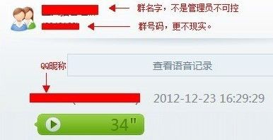

# 19\. 存储型 XSS 入门 [什么都没过滤的情况]

> 来源：[19\. 存储型 XSS 入门 [什么都没过滤的情况]](http://www.wooyun.org/bugs/wooyun-2010-016750)

## 简要描述

存储型和反射型相比，只是多了输入存储、输出取出的过程。简单点说： 反射型是：输入--输出；

存储型是：输入--进入数据库*--取出数据库--输出。 这样一来，大家应该注意到以下差别：

反射型是：绝大部分情况下，输入在哪里，输出就在哪里。

存储型是：输入在 A 处进入数据库， 而输出则可能出现在其它任何用到数据的地方。

反射型是：输入大部分位于地址栏或来自 DOM 的某些属性，也会偶尔有数据在请求中（POST 类型） 存储型是：输入大部分来自 POST/GET 请求，常见于一些保存操作中。

因而我们找存储型的时候，从一个地方输入数据，需要检测很多输出的点，从而可能会在很多点发现存储型 XSS。 至于如何根据输出来构建存储型 XSS 的代码，和反射型没有任何区别，都是看输出的上下文来进行。 从程序员过滤代码的角度来讲，我们给之后的教程走向分个类：

1\. 数据需要过滤，但是未过滤。导致 XSS。 比如：昵称、个人资料。

2\. 业务需求使得数据只能部分过滤，但过滤规则不完善，被绕过后导致 XSS。 比如：日志、邮件及其它富文本应用。 本节先看一个最基本的情况，该过滤，但是什么都没过滤的情况。

（数据库：不一定是像 mysql 那样的数据库，只要是能存储数据的都算。）

## 详细说明

1\. 找存储型的时候，需要有一颗多疑的心，一双善于发现的眼睛。我们来看看实例！

2\. 某一天，某一群，与某一妹子有以下对话。

3\. 过了一会，就来了这么一条消息，原来是手机 QQ 录了发上来的。

4\. 这个时候，我们就会想，这个发上来的页面会不会有 XSS 呢？

5\. 我们来看看页面的结构。

6\. 很多新手在找 XSS 的时候，都是拿着``或者其它到处测试，很盲目不是吗？

一定要记住本节最开头的话，存储型 XSS，输出的位置不一定出现在输入的位置。

7\. 因而我们有时候需要逆向的思维，来寻找存储型 XSS。 大概思路如下：

7.1 先找到输出点，然后猜测此处输出是否会被过滤。

7.2 如果觉得可能没过滤，我们再找到这个输出是在哪里输入的。

7.3 接着开始测试输入，看输出的效果。

7.4 如果没过滤，那么你就成功了，否则你可以放弃掉它。

8\. 拿本例来说明以上过程，

8.1 我们猜测昵称这个输出没过滤。

8.2 找到输入点，这个输入点，就是修改 QQ 昵称。

8.3 开始测试

通过 WEBQQ 修改昵称如下：(方法见： WooYun: PKAV 腾讯专场 - 3\. 腾讯 QQ 客户端某处功能页面存储型 XSS ) 使用 charles web proxy 拦截 WEBQQ 数据包，修改并提交。

提交成功后：

8.4 我们拿小号进入一个群，发布一条手机 QQ 的语音。看输出效果，没过滤，成功了吧～～

拿 xsser.me 在某群的测试效果！

登录他人帐号：

修复方案：

昵称处输出过滤。