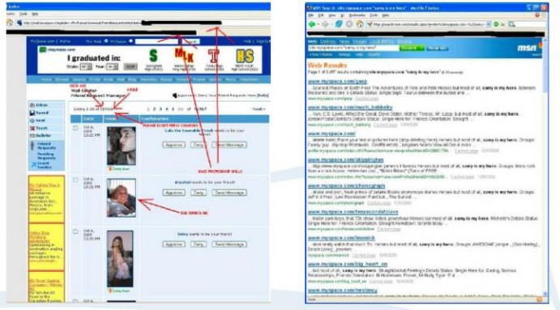

# 第一个 XSS 蠕虫: Samy

2005 年 10 月 4 日，Samy 蠕虫，同类中第一个重大的蠕虫病毒，利用一个在 MySpace.com 的个人资料页面模板 的持续的跨站点脚本漏洞进行传播。Samy，也是作者，用漏洞的 JavaScript 攻击代码的第一个副本更新了他的个人资 料页面（图 5）。MySpace 上进行一些的输入的黑名单过滤，以防止 XSS 攻击，但他们还做的不够好。使用一些绕过技 术，Samy 成功上传了他的代码。当一个通过身份验证 MySpace 的用户观看 Samy 的个人资料，该蠕虫病毒的 payload 使用 XHR，使得用户的网页浏览器发送请求，增加 Samy 为朋友，包括加 Samy 为他英雄（译者注：类似微博关注）（“但最重要的是，加 Samy 为英雄这点”，如图 6），并用恶意代码的副本改变用户的个人资料。当用户访问 Samy 或 者其他受感染用户的个人资料页，他们基本上在打开浏览器时就受到攻击。

图 5 和图 6 示是 MySpace 蠕虫的技术解释。

图 5（左）。Samy，作者，更新了他的个人资料的页面。

图 6（右）。

当通过身份验证的 MySpace 用户浏览 Samy 的个人资料，蠕虫 payload 使用 XHR，使得用户的 Web 浏览器添加 Samy 朋友，包括添加 Samy 为英雄从单一访客，然后随着在社交网络上的每一个新的不知情的朋友，Samy 蠕虫感染呈几何级数增长，受感染的用 户资料页面超过 1,000,000。MySpace 是被迫关闭其网站，以阻止感染，修复漏洞，并进行清理。重要的是要注意， MySpace 的用户不需要是脆弱的东西。对于任何类似的蠕虫病毒所需要的是一个对于大多数网站已经存在的流行网 站的漏洞。为了获得 Samy 蠕虫的意义的新的认识，我们会比较其它相关的暴发，并看到它如何壮大起来的。