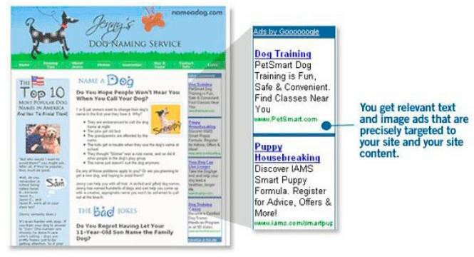

# 最坏的情况

随着 XSS 病毒和蠕虫作者增加其复杂程度，它们会开始寻找大多数 Web 浏览器可以直接访问的网站的区域。最 流行的网站，包括社区驱动的内容，将继续成为主要的目标。恶意软件的编写者甚至可能开始结合多个网站的漏洞 以达到最大效用。但是，也有另一种微妙的目标 - 第三方供应商的插件，包括横幅广告，天气和投票模块， JavaScript 的 RSS 提要，流量计数器，等等。

第三方网站的部件往往包含在使用 JavaScript 的远程调用的 HTML 代码里。下面是一个例子（见例 4。）许多网 站包括谷歌的 AdSense（参见图 10）使用 JavaScript。

Example 4.

```
<script type=”text/javascript”><!-- google_ad_width = 728;
google_ad_height = 90; google_ad_format = “728x90_as”; google_ad_type = “text_image”; google_ad_channel =””; google_color_border = “CCCCCC”; google_color_bg = “FFFFFF”; google_color_link = “000000”;
google_color_url = “666666”;
google_color_text = “333333”;
//-->
</script>
[<script type=”text/javascript” src=” http://pagead2.googlesyndication.com/page](http://pagead2.googlesyndication.com/pagead/)ad/ show_ads.js”>
</script> 
```

请注意，SCRIPT 标签 SRC 属性和它的值 [`pagead2.googlesyndication.com/pagead/show_ads.js`](http://pagead2.googlesyndication.com/pagead/show_ads.js)。在 JavaScript 代码中的 SCRIPT 标签 SRC 属性的值从远程位置（谷歌）调用并在页面加载时，在页面的上下文内执行。 如果“show_ads.js 中”被入侵，并含有一个 XSS 漏洞，使用此代码的所有网站将受到影响。然后，当用户访网页时，他们会成为像受到 Samy 蠕虫感染的用户一样受到感染，但模规更大。这可以很容易地在任何时刻影响百万 计的用户。其他如 DoubleClick 的广告横幅供应商也同样如此。管理者应从第三方部件代码提供商寻求安全保证。



图 10,谷歌 AdSense 的截图

（[`www.google.com/services/adsense_tour/`](http://www.google.com/services/adsense_tour/)）