# 安全工程之书（SecBook）V2

## 内容

- 第二版前言 **xxv**
- 布鲁斯·施奈尔的前言 **xxvii**
- 前言 **xxix**
- 致谢 **xxxv**

## 第一部分

## 第1章 什么是安全工程学? **3**

### 介绍 3
### 一个框架 4
### 示例1-银行 6
### 示例2-军事基地 7
### 示例3-医院 9
### 示例4-家庭 10
### 定义 11
### 总结 15

## 第2章 可用性和心理学 **17**

### 介绍 17
### 基于心理学的攻击 18
- 伪装 19
- 钓鱼 21
### 心理学研究的见解 22
- 大脑比计算机做得更差的事情 23
- 感知偏见和行为经济学 24
- 心理处理的不同方面 26
- 人与人之间的差异 27
- 社会心理学 28
- 大脑比计算机做得更好的事情 30
### 密码 31
- 可靠密码输入的困难之处 32
- 记住密码的困难之处 33
- 天真的密码选择 34
### 用户能力和培训 35
### 设计错误 37
### 运行问题 39
### 社会工程攻击 40
### 可信路径 42
### 网络钓鱼对策 43
- 密码混淆器 43
- 客户端证书或专业应用程序 44
- 使用浏览器的密码数据库 44
- 软键盘 45
- 客户教育 45
- 微软通行证 46
- 网络钓鱼警报工具栏 47
- 双因素认证 47
- 可信计算 48
- 加固密码协议 49
- 双通道认证 49
- 网络钓鱼的未来 50
### 系统问题 52
- 你能否拒绝服务? 53
- 保护自己还是他人? 53
### 针对密码输入的攻击 54
- 界面设计 54
- 窃听 55
- 密码重试计数器的技术缺陷 55
### 针对密码存储的攻击 56
- 单向加密 56
- 密码破解 57
- 绝对限制 57
### 验证码 59
### 总结 60
### 研究问题 61
### 进一步阅读 61

## 第3章 协议 63

### 介绍 63
### 密码窃听风险 65
### 谁在那里? - 简单认证 66
### 挑战和响应 70
### 中间人攻击 73
### 反射攻击 76
### 篡改消息 78
### 改变环境 79
### 选择协议攻击 80
### 管理加密密钥 82
- 基本密钥管理 83
- Needham-Schroeder协议 84
- Kerberos 85
- 实用的密钥管理 86
### 形式化方法 87
- 典型的智能卡银行协议 87
- BAN逻辑 88
- 验证支付协议 89
- 形式化验证的局限性 90
### 总结 91
### 研究问题 92
### 进一步阅读 92

## 第4章 访问控制 93

### 介绍 93
### 操作系统访问控制 96
- 组和角色 98
- 访问控制列表 99
- Unix操作系统安全 100
- 苹果的OS/X 101
- Windows - 基本架构 102
- 能力 103
- Windows - 增加的功能 104
### 中间件 107
- 数据库访问控制 107
- 通用中间件问题 108
- ORB和策略语言 109
### 沙箱和携带证明的代码 110
### 虚拟化 111
### 可信计算 111
### 硬件保护 113
- 英特尔处理器和“可信计算” 114
- ARM处理器 116
- 安全处理器 116
### 出现问题的原因 117
- 破坏堆栈 118
- 其他技术攻击 119
- 用户界面故障 121
- 为什么这么多事情出错 122
- 补救措施 124
- 环境渗透 125
### 总结 126
### 研究问题 127
### 进一步阅读 127

## 第5章 密码学 129

### 介绍 129
### 历史背景 130
- 早期流密码 — 维吉尼亚密码 131
- 一次性密码本 132
- 早期分组密码 — 普莱费尔密码 134
- 单向函数 136
- 非对称原语 138
### 随机预言机模型 138
- 随机函数 — 哈希函数 140
    - 属性 141
    - 生日定理 142
- 随机生成器 — 流密码 143
- 随机置换 — 块密码 144
- 公钥加密和陷门单向置换 146
- 数字签名 147
### 对称密码原语 149
- SP-网络 149
    - 块大小 150
    - 轮数 150
    - S-盒的选择 151
    - 线性密码分析 151
    - 差分密码分析 152
    - Serpent 153
- 高级加密标准（AES） 153
- 费斯特尔密码 155
    - Luby-Rackoff 结果 157
    - DES 157
### 操作模式 160
- 电子密码本 160
- 密码块链接 161
- 输出反馈 161
- 计数器加密 162
- 密码反馈 163
- 消息认证码 163
- 复合操作模式 164
### 哈希函数 165
- 对底层密码的额外要求 166
- 常见哈希函数及应用 167
### 非对称加密原语 170
- 基于因子分解的密码学 170
- 基于离散对数的密码学 173
    - 公钥加密 — 迪菲-赫尔曼和埃尔加马尔 174
    - 密钥建立 175
    - 数字签名 176
- 特殊目的原语 178
- 椭圆曲线密码学 179
### 认证 179
### 非对称密码原语的强度 181
### 总结 182
### 研究问题 183
### 进一步阅读 183

## 第6章 分布式系统 185

### 介绍 185
### 并发性 186
- 使用旧数据与支付传播状态 186
- 锁定以防止不一致的更新 188
- 更新的顺序 188
- 死锁 189
- 非收敛状态 190
- 安全时间 191
### 容错性和故障恢复 192
- 故障模型 193
    - 拜占庭故障 193
    - 与容错性的交互 194
- 弹性的目的是什么? 195
- 冗余的级别是什么? 197
- 服务拒绝攻击 198
### 命名 200
- 分布式系统对命名的视角 200
- 还有什么其他问题? 204
    - 名称和身份 204
    - 文化假设 206
    - 名称的语义内容 207
    - 名称的唯一性 207
    - 名称和地址的稳定性 208
    - 在命名中添加社会背景 209
    - 对名称使用的限制 210
- 名称的类型 211
### 总结 211
### 研究问题 212
### 进一步阅读 213

## 第7章 经济学 215

### 介绍 215
### 古典经济学 216
- 垄断 217
- 公共物品 219
### 信息经济学 220
- 信息的价格 220
- 锁定的价值 221
- 非对称信息 223
### 博弈论 223
- 囚徒困境 225
- 进化博弈 226
### 安全与可靠性的经济学 228
- 最薄弱的环节，或者努力的总和？ 229
- 管理补丁循环 229
- 为什么Windows如此不安全？ 230
- 隐私的经济学 232
- 数字版权管理的经济学 233
### 总结 234
### 研究问题 235
### 进一步阅读 235

## 第二部分

## 第8章 多级安全 239

### 介绍 239
### 什么是安全策略模型？ 240
### 贝尔-拉帕杜拉安全策略模型 242
- 分类和许可 243
- 信息流控制 245
### 贝尔-拉帕杜拉的标准批评 246
### 替代公式 248
### Biba模型和Vista 250
### MLS系统的历史例子 252
- SCOMP 252
- Blacker 253
- MLS Unix和分区模式工作站 253
- NRL Pump 254
- 物流系统 255
- Sybard Suite 256
- 窃听系统 256
### 未来的MLS系统 257
- Vista 257
- Linux 258
- 虚拟化 260
- 嵌入式系统 261
### 出现问题的原因 261
- 可组合性 261
- 级联问题 262
- 隐蔽通道 263
- 来自病毒的威胁 265
- 多实例化 266
- 其他实际问题 267
### MLS的更广泛影响 269
### 总结 272
### 研究问题 272
### 进一步阅读 272

## 第9章 多边安全 275

### 介绍 275
### 隔离、中国墙和BMA模型 277
- 隔离和格模型 277
- 中国墙 281
- BMA模型 282
    - 威胁模型 284
    - 安全策略 287
    - 试点实施 289
### 当前隐私问题 290
### 推理控制 293
- 医学中推理控制的基本问题 293
- 推理控制的其他应用 296
- 推理控制理论 297
    - 查询集大小控制 298
    - 跟踪器 298
    - 更复杂的查询控制 298
    - 单元抑制 299
    - 最大顺序控制和格模型 300
    - 基于审计的控制 300
    - 随机化 301
### 通用方法的局限性 302
- 主动攻击 304
### 不完全保护的价值 305
### 剩余问题 306
### 总结 309
### 研究问题 310
### 进一步阅读 310

## 第10章 银行和簿记 313

### 介绍 313
- 簿记的起源 315
- 复式簿记 316
- 电报式电子商务的历史 316
### 银行计算机系统的工作原理 317
- Clark-Wilson安全策略模型 319
- 设计内部控制 320
- 出现问题的原因 324
### 批发支付系统 328
- SWIFT 329
- 出现问题的原因 331
### 自动取款机 333
- ATM基础知识 334
- 出现问题的原因 337
### 激励与不公正 341
### 信用卡 343
- 欺诈 344
- 伪造 345
- 自动欺诈检测 346
- 欺诈的经济学 347
- 在线信用卡欺诈-炒作与现实 348
### 基于智能卡的银行业务 350
- EMV 351
    - 静态数据认证 352
    - 动态数据认证 356
    - 组合数据认证 356
- 射频识别 357
### 家庭银行和洗钱 358
### 总结 361
### 研究问题 362
### 进一步阅读 363

## 第11章 物理保护 365

### 介绍 365
### 威胁和屏障 366
- 威胁模型 367
- 威慑力 368
- 墙壁和屏障 370
- 机械锁 372
- 电子锁 376
### 警报 378
- 如何不保护一幅画 379
- 传感器失效 380
- 特征交互 382
- 通信攻击 383
- 经验教训 386
### 总结 387
### 研究问题 388
### 进一步阅读 388

## 第12章 监控和计量 389

### 介绍 389
### 预付费电表 390
- 公用事业计量 392
- 系统工作原理 393
- 出现问题的原因 395
### 出租车计价器、车速记录仪和卡车限速器 397
- 车速记录仪 398
- 出现问题的原因 399
- 大多数车速记录仪操纵方式 400
- 篡改供应 401
- 篡改仪器 401
- 高科技攻击 402
### 数字式车速记录仪项目 403
- 系统级问题 404
- 其他问题 405
- 复活的小鸭子 407
### 邮资计量器 408
### 总结 412
### 研究问题 413
### 进一步阅读 414

## 第13章 核指挥与控制 415

### 介绍 415
### 指挥与控制的演变 417
- 肯尼迪备忘录 418
- 授权、环境、意图 419
### 无条件安全认证 420
### 共享控制方案 422
### 防篡改和可编程阵列逻辑 424
### 条约验证 426
### 出现问题的原因 427
### 保密还是公开？ 429
### 总结 430
### 研究问题 430
### 进一步阅读 430

## 第14章 安全印刷和封条 433

### 介绍 433
### 历史 434
### 安全印刷 435
- 威胁模型 436
- 安全印刷技术 437
### 包装和封条 443
- 基板特性 443
- 胶水的问题 444
### PIN邮寄 445
### 系统性漏洞 446
- 威胁模型的特殊性 447
- 反伪造措施 448
- 随机故障的影响 449
- 材料控制 450
- 保护正确的事物 451
- 检查的成本和性质 451
### 评估方法论 453
### 总结 454
### 研究问题 454
### 进一步阅读 455

## 第15章 生物识别 457

### 介绍 457
### 手写签名 458
### 人脸识别 461
### 贝尔蒂氏测量法 464
### 指纹 464
- 验证正面或负面身份声明 466
- 犯罪现场取证 469
### 虹膜代码 472
### 语音识别 475
### 其他系统 476
### 出现问题的原因 477
### 总结 481
### 研究问题 482
### 进一步阅读 482

## 第16章 物理防篡改 483

### 介绍 483
### 历史 485
### 高端物理安全处理器 486
### 评估 492
### 中等安全处理器 494
- iButton 494
- 达拉斯5000系列 495
- FPGA安全和Clipper芯片 496
### 智能卡和微控制器 499
- 历史 500
- 架构 501
- 安全演变 501
- 现有技术水平 512
    - 深度防御 513
    - 止损 513
### 出现问题的原因 514
- 可信接口问题 514
- 冲突 515
- 柠檬市场，风险倾销和评估 516
- 安全性通过混淆 517
- 与策略的互动 517
- 功能蔓延 518
### 那么应该保护什么？ 518
### 总结 520
### 研究问题 520
### 进一步阅读 520

## 第17章 辐射安全 523

### 介绍 523
### 历史 524
### 技术监视和反监控措施 526
### 被动攻击 530
- 通过电源和信号电缆泄漏 530
    - 红/黑分离 530
    - 时序分析 531
    - 功耗分析 531
- 通过射频信号泄漏 534
### 主动攻击 538
- 干扰病毒 538
- 不间断 539
- 故障注入 540
- 差分故障分析 540
- 组合攻击 540
- 商业利用 541
- 防御 541
### 光学、声学和热侧信道 542
### Emsec攻击有多严重? 544
- 政府 544
- 企业 545
### 总结 546
### 研究问题 546
### 进一步阅读 546

## 第18章 API攻击 547

### 介绍 547
### 安全模块上的API攻击 548
- XOR到空键攻击 549
- 对4758的攻击 551
- 多方计算和差分协议攻击 552
- EMV攻击 553
### 操作系统上的API攻击 554
### 总结 555
### 研究问题 557
### 进一步阅读 557

## 第19章 电子和信息战 559

### 介绍 559
### 基础知识 560
### 通信系统 561
- 信号情报技术 563
- 通信攻击 565
- 保护技术 567
    - 跳频 568
    - 直接序列扩频 569
    - 突发通信 570
    - 隐蔽性和干扰抵抗的结合 571
### 民用和军用之间的互动 572
### 监视和目标获取 574
- 雷达类型 574
- 干扰技术 575
- 高级雷达和对抗措施 577
- 其他传感器和多传感器问题 578
### IFF系统 579
### 简易爆炸装置 582
### 定向能武器 584
### 信息战 586
- 定义 587
- 教义 588
- 电子战中可能有用的经验教训 589
- 电子战和信息战之间的区别 591
### 总结 592
### 研究问题 592
### 进一步阅读 593

## 第20章 电信系统安全 595

### 介绍 595
### 电话破解 596
- 对计量的攻击 596
- 信令攻击 599
- 交换和配置攻击 601
### 不安全的终端系统 603
### 特性交互 605
### 移动电话 606
- 移动电话克隆 607
- GSM安全机制 608
- 第三代移动通信 — 3GPP 617
### 平台安全 619
### 移动安全是成功还是失败? 621
### 网络电话 623
### 电信安全经济学 624
- 电话公司的欺诈行为 625
- 计费机制 627
### 总结 630
### 研究问题 631
### 进一步阅读 632

## 第21章 网络攻击与防御 633

### 介绍 633
### 网络协议的漏洞 635
### 对本地网络的攻击 636
### 使用互联网协议和机制的攻击 638
- SYN洪泛攻击 638
- Smurfing 639
- 分布式拒绝服务攻击 640

- 垃圾邮件 642
- DNS安全和域名欺骗 643
- 特洛伊木马、病毒、蠕虫和Rootkits 644
    - 恶意代码的早期历史 644
    - 互联网蠕虫 645
    - 病毒和蠕虫的工作原理 646
    - 恶意软件的历史 647
    - 对策 650
- 防御网络攻击 652
    - 配置管理和运行安全 652
    - 过滤：防火墙、垃圾邮件过滤器、审查软件和窃听器 654
        - 数据包过滤 654
        - 电路网关 655
        - 应用中继 655
        - 入口过滤与出口过滤 657
        - 架构 657
    - 入侵检测 660
        - 入侵检测的类型 661
        - 入侵检测的一般限制 662
    - 检测网络攻击的具体问题 664
    - 加密 665
        - SSH 665
        - WiFi 666
        - 蓝牙 668
        - HomePlug 668
        - IPsec 669
        - TLS 670
        - PKI 672
- 拓扑 675
- 总结 676
- 研究问题 677
- 进一步阅读 678

## 第22章 版权和数字版权管理 679

- 介绍 679
- 版权 680
    - 软件 681
    - 书籍 688
    - 音频 689
    - 视频和付费电视 690
        - 典型系统架构 690
        - 视频加扰技术 691
        - 对混合加扰系统的攻击 693
        - DVB 697
- DVD 698
- HD-DVD和蓝光 701
    - AACS — 广播加密和叛徒追踪 701
    - 蓝光和SPDC 703
- 通用平台 704
    - Windows媒体版权管理 705
    - 其他在线版权管理系统 706
    - 点对点系统 707
    - 半导体IP的权利管理 709
- 信息隐藏 710
    - 水印和复制生成管理 711
    - 通用信息隐藏技术 712
    - 对版权标记方案的攻击 714
    - 版权标记方案的应用 718
- 政策 718
    - 知识产权游说团体 720
    - 谁受益? 722
- 附件控制 723
- 总结 725
- 研究问题 725
- 进一步阅读 726

## 第23章 前沿技术 727

- 介绍 727
- 电脑游戏 728
    - 作弊类型 730
    - 自动瞄准和其他未经授权的软件 732
    - 虚拟世界，虚拟经济 733
- Web应用程序 734
    - eBay 735
    - 谷歌 736
    - 社交网络网站 739
- 隐私技术 745
    - 匿名邮件——用餐密码学家和混合网络 747
    - 匿名网络浏览——Tor 749
    - 保密和匿名电话 751
    - 电子邮件加密 753
    - 隐写术和取证对策 755
    - 将所有内容整合在一起 757
- 选举 759
- 总结 764
- 研究问题 764
- 进一步阅读 765

## 第三部分

### 第24章 恐怖、正义和自由 769

- 介绍 769
- 恐怖主义 771
    - 政治暴力的原因 772
    - 政治暴力的心理学 772
- 政治机构的作用 774
- 新闻媒体的作用 775
- 民主的回应 775
- 监视 776
    - 政府窃听的历史 776
    - 关于流量分析的不断争议 779
    - 非法监视 781
    - 访问搜索词和位置数据 782
    - 数据挖掘 783
    - 通过ISP进行监视——Carnivore及其后代 784
    - 对外目标的通信情报 785
    - 情报优势和弱点 787
    - 密码战争 789
        - 加密政策的背后故事 790
        - DES和密码研究 792
        - Clipper芯片 793
    - 加密战争有关吗？ 794
    - 出口控制 796
- 审查制度 797
    - 威权政权的审查制度 798
    - 网络中立性 800
    - 点对点、仇恨言论和儿童色情 801
- 取证和证据规则 803
    - 取证 803
    - 证据的可采用性 806
- 隐私和数据保护 808
    - 欧洲数据保护 809
    - 欧洲与美国之间的差异 810
- 总结 812
- 研究问题 813
- 进一步阅读 813

### 第25章 管理安全系统的开发 815

- 介绍 815
- 管理安全项目 816
    - 三家超市的故事 816
    - 风险管理 818
    - 组织问题 819
        - 自满循环和风险恒温器 820
        - 与可靠性的互动 821
        - 解决错误的问题 822
        - 无能和经验不足的安全经理 823
        - 道德风险 823
- 方法论 824
    - 自顶向下设计 826
    - 迭代设计 827
    - 从安全关键系统中汲取的教训 829
- 安全需求工程 834
    - 管理需求演变 835
        - 错误修复 836
        - 控制调优和公司治理 838
        - 环境演变与公地悲剧 839
        - 组织变革 841
    - 项目需求管理 842
    - 并行化进程 844
- 风险管理 846
- 团队管理 848
- 总结 852
- 研究问题 853
- 进一步阅读 854

### 第26章 系统评估与保证 857

- 介绍 857
- 保证 858
    - 恶意经济激励 858
    - 项目保证 860
        - 安全测试 861
        - 形式化方法 862
        - 谁来监督? 862
    - 过程保证 863
    - 保证增长 866
    - 演化与安全保证 868
- 评估 869
    - 依赖方的评估 870
    - 通用标准 873
    - 通用标准的不足之处 876
        - 腐败、操纵和惯性 878
- 前进的方式 881
    - 敌对审查 882
    - 自由开源软件 882
    - 半开放设计 884
    - 渗透和修补、CERT和Bugtraq 885
    - 教育 886
- 总结 887
- 研究问题 887
- 进一步阅读 887

### 第27章 结论 889

- **参考文献 893**
- **索引 997**

## 第二版前言

《安全工程学》的第一版于2001年5月出版。此后世界发生了变化。

系统安全曾经是微软最低优先级的事情；现在则是最高优先级之一。恶意软件的数量随着其带来的麻烦而不断增加。尽管我们在防御方面付出了很多努力——我们看到了Windows NT被XP和Vista取代，偶尔的服务包被每月的安全补丁所取代——但攻击方面的努力增加得更多。编写病毒的人不再是为了好玩，而是为了盈利；过去几年中出现了一个支持各种专业人员的犯罪经济。垃圾邮件发送者、病毒编写者、网络钓鱼者、洗钱者和间谍们忙碌地相互交易。

密码学也有所发展。高级加密标准（AES）正在被嵌入到越来越多的产品中，我们在公钥方面也有一些有趣的进展。但是，正如我们的算法问题得到解决一样，我们也面临着一系列的实现问题。侧信道攻击、设计不良的API和协议故障继续破坏系统。应用密码学比以往任何时候都更难做好。

普适计算也带来了新的挑战。随着计算机和通信技术无处不在地嵌入，以前只影响“正式计算机”的问题也出现在各种其他设备中。温度计安全意味着什么？空调安全意味着什么？

智能设备的多样性带来了各种各样的利益和参与者。安全不仅仅是阻止坏人进入，而且越来越关注权力和控制的争夺。数字版权管理将内容和平台产业与消费者以及彼此对抗；附件控制用于将打印机与供应商的墨盒绑定，但同时也导致涉及反垄断诉讼和政府干预。安全还与汽车、公用事业和电子医疗等应用中的安全性相互作用。安全工程师不仅需要了解加密和操作系统，还需要了解经济学和人因素。

数字设备的普及意味着“计算机安全”不再只是少数系统专家的问题。几乎所有的白领犯罪（以及许多严重暴力犯罪）现在都涉及计算机或手机，因此侦探需要了解计算机取证，就像她需要知道如何开车一样。越来越多的律师、会计师、经理和其他没有正式工程培训的人需要了解系统安全，以便做好工作。

从谷歌和Facebook到大型多人在线游戏，在线服务的快速增长也改变了世界。一旦注意到在线应用程序中的错误，可以迅速修复，但应用程序变得越来越复杂，其副作用更难以预测。对于操作系统甚至银行服务来说，我们可能对安全有一个相当好的理解，但对于不断演变的在线生活方式，我们无法做出任何这样的断言。我们正在进入一个新颖的社会技术系统的世界，这引发了关于演化是如何驱动和谁掌控的深刻问题。

然而，最大的变化可能是由2001年9月的悲剧事件和我们对其的反应所驱动的。这些变化在很多方面改变了人们的认知和优先事项，并改变了安全行业的形态。

恐怖主义不仅涉及风险，还涉及对风险的感知以及对感知的操纵。这使心理学和政治学成为了一个整体。安全工程师也有责任参与政治辩论。当对恐怖主义犯罪的不适当反应导致了大量资源的浪费和不必要的政策错误时，我们必须继续教育人们提出一些简单的问题：我们要防止什么，提议的机制是否有效？

罗斯·安德森  
剑桥，2008年1月

## 前言

在他与罗杰·尼德姆合著的一篇论文中，罗斯·安德森创造了“编程撒旦计算机”的说法，来描述计算机安全工程师面临的问题。这是我从罗斯那里期待的那种引人入胜的形象，也是我自那以后一直在使用的短语。

编写计算机程序很简单：不断地解决问题，直到计算机按照预期工作。大型应用程序和操作系统要复杂得多，但方法基本相同。编写可靠的计算机程序要困难得多，因为程序需要在面对随机错误和故障时仍然正常工作：这就是所谓的墨菲计算机。可靠软件设计已经进行了重要研究，有许多设计用于抵御墨菲定律的关键任务软件应用。

编写安全的计算机程序则完全是另一回事。安全性涉及确保事物在面对一个聪明而恶意的对手时能够正常工作，而不是在随机故障的情况下。这个对手一次又一次地试图在最糟糕的时候以最糟糕的方式导致事物失败。这真的是在编程撒旦的计算机。

安全工程与任何其他类型的编程都不同。这是我一再强调的观点：在我自己的书《秘密与谎言》中，在我每月的通讯《密码杂志》中，在我其他的著作中。这也是罗斯在本书的每一章中都提到的观点。这就是为什么，如果你从事任何安全工程……如果你甚至考虑从事任何安全工程，你都需要阅读这本书。这是第一本也是唯一一本全面的现代安全设计和工程书籍。

而且它恰好及时到来。你可以将互联网的历史分为三个阶段。第一波浪潮以大型机和终端为中心。计算机昂贵且稀缺。第二波浪潮从1992年开始，以个人计算机、浏览器和大型应用程序为中心。而第三波浪潮，从现在开始，将看到所有类型的设备连接到专有网络、独立和非计算机化。到2003年，连接到互联网的移动电话将超过计算机的数量。在几年内，我们将看到世界上许多冰箱、心脏监护仪、公交车和火车售票机、防盗警报器和电力计量器都在进行IP通信。个人计算机将成为互联网上的少数派。

安全工程学，特别是在这第三波浪潮中，需要你以不同的方式思考。你需要弄清楚的不是某个东西是如何工作的，而是如何使其无法工作。你必须想象一个聪明而恶意的对手进入你的系统（记住撒旦的计算机），不断尝试新的方式来破坏它。你必须考虑系统可能失败的所有方式，其中大部分与设计本身无关。

你必须把一切都倒过来、颠倒过来和侧过来看。你要像外星人一样思考。

正如已故伟大的科幻编辑约翰·W·坎贝尔所说：“外星人思考得和人类一样聪明，但不像人类。”计算机安全就是这样。罗斯是那些能像外星人一样思考，并能向人类解释这种思维的罕见人物之一。愉快阅读。

布鲁斯·施奈尔  
2001年1月

## 前言

几代人以来，人们一直使用锁、围栏、签名、印章、账簿和计量器来定义和保护他们的财产和隐私。这些得到了一系列社会构建的支持，从国际条约到国家法律再到礼仪和习俗。

这正在迅速改变。现在大多数记录都是电子的，从银行账户到房地产登记；交易也越来越多地变成电子化，随着购物转移到互联网上。同样重要但不那么明显的是，许多日常系统已经悄然自动化。

警报器不再唤醒整个社区，而是发送无声信息给警察；学生不再用硬币将宿舍的洗衣机和烘干机装满，而是使用智能卡在学校书店充值；锁不再是简单的机械装置，而是由电子遥控器或刷卡器操作；而且数百万人不再租用录像带，而是从卫星或有线电视频道获取电影。即使是普通的纸币也不再只是纸上的墨迹，而可能包含数字水印，可以通过机器检测出许多伪造品。

所有这些新的安全技术有多好？不幸的是，诚实的回答是“远远不如应该的好”。新系统经常很快破解，同样的初级错误在一个应用程序又一个应用程序中重复出现。通常需要四到五次尝试才能设计出一个正确的安全方案，这太多了。

媒体经常报道互联网上的安全漏洞；银行与客户争论从提款机中的“幽灵提款”；VISA报告互联网信用卡交易纠纷数量的大幅增加；卫星电视公司追捕复制他们智能卡的盗版者；以及法律执法机构试图通过法律来控制加密的使用，在网络空间中划定领土。更糟糕的是，功能之间相互作用。如果手机上的某个按键被意外按下，会再次拨打最后一个号码，这可能只是一个小麻烦，直到有人发明了一台每次拨打它的电话号码时就会发放一罐软饮料的机器。当你突然发现你的电话账单上有50罐可口可乐时，谁应该负责，电话公司、手机制造商还是自动售货机操作员？

一旦几乎每个影响你生活的电子设备都连接到互联网上——这是微软预计在2010年之前会发生的——对你来说，“互联网安全”意味着什么，你如何应对？

除了那些失败的系统，还有很多系统的工作效果不够好。

- 医疗记录系统不允许医生像他们想要的那样共享个人健康信息，但仍然不能保护它免受好奇的私人眼睛的侵犯。
- 亿万美元的军事系统阻止没有“绝密”许可的任何人获取情报数据，但通常设计成几乎每个人都需要这个许可才能工作。
- 乘客票务系统旨在防止顾客作弊，但当托拉斯拆分铁路时，他们无法阻止新的铁路公司相互作弊。

如果设计师稍微多一点了解其他地方尝试过并失败的知识，许多这些失败本可以预见到。安全工程学是在这一切混乱中开始出现的新学科。

尽管大多数基础技术（密码学、软件可靠性、防篡改、安全印刷、审计等）相对来说已经比较了解，但如何有效应用它们的知识和经验却非常稀缺。由于从机械到数字机制的转变正在同时发生，所以还没有时间让这些经验教训在工程界传播开来。一次又一次，我们看到同样的方轮被重新发明。

能够成功过渡的行业往往是能够从其他学科借鉴适当技术的行业。例如，将设计用于军事身份识别设备的技术重新应用于银行取款机甚至预付费燃气表。因此，即使安全设计师在某个特定领域拥有丰富的专业知识，无论是作为与密码学家合作的数学家还是作为开发纸币墨水的化学家，了解整个主题仍然是明智的。良好的安全工程的核心是了解系统面临的潜在威胁，然后应用适当的保护措施（无论是技术上的还是组织上的）来控制它们。了解其他应用中成功和失败的经验对于培养判断力非常有帮助。它还可以节省很多钱。

本书的目的是在二十一世纪初对安全工程学进行扎实的介绍。我的目标是它在四个不同的层面上发挥作用：

1. 作为一本教科书，你可以在几天内从头到尾阅读，作为对这个主题的介绍。这本书主要是供需要了解这个主题的工作IT专业人员使用，但也可以在大学的一个学期课程中使用。
2. 作为一个参考书，你可以了解某种特定类型系统的运作概述。这些系统包括提款机、计程车计价器、雷达干扰器、匿名医疗记录数据库等等。
3. 作为对底层技术的介绍，如加密、访问控制、推理控制、防篡改和密封技术。空间限制使我不能深入讨论；但我为每个主题提供了基本路线图，以及对于好奇的人的阅读清单（以及对于有意向攻读研究生的人的开放研究问题清单）。
4. 作为一项原创科学贡献，我试图提取出安全工程的共同原则，以及人们在构建一种系统时应该从其他系统中学到的教训。多年来，我一直在安全领域工作，我不断遇到这些情况。例如，对流密码的简单攻击对于设计常见的防空火控雷达的人来说是未知的，因此很容易被干扰；而雷达界熟知的技巧却被纸币印刷商和设计版权标记方案的人所不理解，这导致了对大多数数字水印的普遍攻击。

我尽力使这本书保持中大西洋地区的风格；安全工程学书籍必须如此，因为许多基本技术是美国的，而许多有趣的应用则是欧洲的。（这并不奇怪，考虑到美国大学和研究实验室的更好资金支持，以及欧洲国家和市场的更多多样性。）而且，许多成功的欧洲创新——从智能卡到GSM移动电话到按次付费电视服务——已经跨越大西洋，现在在美洲蓬勃发展。科学和案例研究都是必要的。

这本书源于我在剑桥大学教授的安全工程学课程，但我已经重写了我的笔记，使它们自成一体，并增加了至少同样多的材料。对于已经成为专业安全经理或顾问的人来说，它应该是一个首要参考；对于从事密码学研究的计算机科学教授来说，它应该是一个首要参考；对于正在努力弄清最新计算机骗局的警察侦探来说，它应该是一个首要参考；对于在调节密码学和匿名性时面临冲突的政策专家来说，它应该是一个首要参考。最重要的是，它的目标读者是迪尔伯特。我的主要受众是工作中的人们：程序员或工程师试图设计真实系统，以便在客户、经理和其他人的最大努力下继续工作。

本书分为三个部分。

- 第一部分介绍基本概念，从安全协议的核心概念开始，然后涉及人机界面问题、访问控制、密码学和分布式系统问题。它不假设除基本计算机素养外的任何特定技术背景。它基于我给大二本科生讲授的安全导论课程。
- 第二部分更详细地介绍了一些重要应用，如军事通信、医疗记录系统、取款机、手机和付费电视。这些应用用于介绍更高级的技术和概念。它还从公司、消费者、犯罪分子、警察和间谍等不同利益群体的角度考虑了信息安全。这些材料来自于我在安全领域的高级课程、研究工作和咨询经验。
- 第三部分涉及组织和政策问题：计算机安全如何与法律、证据和企业政治相互作用；我们如何确保系统按预期运行；以及如何最好地管理安全工程的整个业务。

我相信，在面对恶意行为时，构建能够持续稳健运行的系统是21世纪工程师面临的最重要、最有趣和最困难的任务之一。

罗斯·安德森  
剑桥，2001年1月

## 关于作者

为什么我要写这本书呢？嗯，我似乎在过去的25年里积累了合适的经验和资格。我在20世纪70年代从剑桥大学（英国）毕业，获得数学和自然科学学位，并获得计算机工程资格；我的第一份正式工作是在航空电子领域；我在20世纪80年代中期对密码学和计算机安全产生了兴趣。在银行业工作了几年后，我开始为设计银行设备的公司提供咨询服务，然后又开始从事该技术的其他应用，如预付电表。

我在1992年转入学术界，但继续为安全技术咨询行业提供咨询。在1990年代，应用密码学的应用数量迅速增加：防盗警报器、汽车门锁、道路收费标签和卫星电视加密系统都开始出现。随着第一批关于这些系统的法律纠纷出现，我有幸成为一些重要案件的专家证人。我领导的研究团队在几个关键技术（如防篡改和数字水印）变得热门时正好处于正确的时间和地点。

到1996年左右，我开始意识到现有的教科书过于专业化。安全教科书侧重于操作系统中的访问控制机制，而密码学书籍则非常详细地阐述了密码算法和协议的设计。

这些主题很有趣，也很重要。然而，它们只是故事的一部分。大多数系统设计师并不过分关注密码学或操作系统内部，而是关注如何有效地使用这些工具。他们在这一点上是正确的，因为机制的不当使用是安全失败的主要原因之一。

一些成功案例的鼓励使我更加坚定了继续写作的决心。我在1993年开始写的一系列关于安全工程的文章（从《为什么加密系统失败》开始）；而对于在本科课程中教授安全工程的需求，促使我编写了一套讲义，其中约占了本书的一半。最后，在1999年，我开始为广大技术读者重新编写这些讲义。在这个过程中，我学到了很多；将你认为自己知道的东西写下来，是发现你不知道的东西的好方法。我也玩得很开心。希望你阅读时也能有很多乐趣！

## 致谢

很多人以各种方式帮助了这本书。我最感谢那些阅读了手稿（或大部分内容）并寻找错误和模糊之处的人。他们是Anne Anderson、Ian Brown、Nick Bohm、Richard Bondi、Caspar Bowden、Richard Clayton、Steve Early、Rich Graveman、Markus Kuhn、Dan Lough、David MacKay、John McHugh、Bob Morris、Roger Needham、Jerry Saltzer、Marv Schaefer、Karen Spärck Jones和Frank Stajano。我还要非常感谢我的编辑Carol Long，她（除了其他很多事情）仔细审查了前六章，并指导我写出适合专业（而不是学术）书籍的风格。

在校对阶段，我得到了Carola Bohm、Mike Bond、Richard Clayton、George Danezis和Bruce Godfrey的非常宝贵的帮助。还有很多学科专家帮助我处理特定的章节或部分。Richard Bondi帮助我完善了第一章的定义；Jianxin Yan、Alan Blackwell和Alasdair Grant帮助我研究了密码的应用心理学方面；John Gordon和Sergei Skorobogatov是我在远程密钥输入设备方面的主要信息来源；Whit Diffie和Mike Brown是关于IFF的信息来源；Steve Early是关于Unix安全性的信息来源（尽管我的一些材料是基于Ian Jackson的讲座）；Mike Roe、Ian Kelly、Paul Leyland和Fabien Petitcolas是关于Windows NT4和Win2K安全性的信息来源；Virgil Gligor是关于内存覆写攻击历史和强制完整性策略的信息来源；Jean Bacon是关于分布式系统的信息来源。Gary Graunke告诉我Intel处理器保护的历史；Orr Dunkelman在密码学章节的草稿中发现了许多错误，John Brazier指引我找到了Humpty Dumpty的引用。

转到本书的第二部分，多级安全的章节得到了Jeremy Epstein，Virgil Gligor，Jong-Hyeon Lee，Ira Moskowitz，Paul Karger，Rick Smith，Frank Stajano和Simon Wiseman的意见，大大改进了。同时，Frank还帮助了接下来的两章。医疗系统的材料最初是与英国医学协会的许多人合作开发的，尤其是Fleur Fisher，Simon Jenkins和Grant Kelly。Denise Schmandt-Besserat向世界介绍了泡泡，为银行系统的章节提供了背景；该章节还得到了Fay Hider和Willie List的意见加强。关于警报的章节包含了从Roger Needham，Peter Dean，John Martin，Frank Clish和Gary Geldart那里学到的很多知识。核指挥与控制系统是Gus Simmons的杰作；他和Bob Morris教给了我该章节中的很多内容。

Sijbrand Spannenburg审查了关于安全印刷的章节；Roger Johnston在封条方面给我们提供了大量的帮助。John Daugman帮助完善了生物识别章节，并发明了虹膜扫描技术，我在那里进行了描述。我的防篡改导师是Oliver Kömmerling和Markus Kuhn；Markus还与我一起研究了辐射安全。关于电子战，我得到了Mike Brown and Owen Lewis的大量意见。电话欺诈章节受益于Duncan Campbell、Richard Cox、Rich Graveman、Udi Manber、Andrew Odlyzko和Roy Paterson的贡献。Ian Jackson对网络安全提出了一些想法。Fabien Petitcolas是版权标记方面的专家，并帮助我完善了相关章节。Johann Bezuidenhoudt对电话欺诈和电子商务都提出了有见地的评论，而Peter Landrock在记账和电子商务系统方面提供了宝贵的意见。Alistair Kelman在版权法律方面知识渊博；Hal Varian在经济学方面给我提供了正确的指导，特别是关于电子商务和保证的章节。

至于本书的第三部分，关于电子政策的章节受到了信息政策研究基金会的同事们的重大影响，特别是卡斯帕·鲍登、尼克·博姆、弗勒·费舍尔、布莱恩·格拉德曼、伊恩·布朗、理查德·克莱顿，以及参与战斗的许多其他人，包括惠特·迪菲、约翰·吉尔莫、苏珊·兰道、布莱恩·奥莫塔尼和马克·罗滕伯格。管理章节受到了罗伯特·布雷迪、杰克·朗和威利·利斯的意见。最后，我的保证思想受到了许多人的影响，包括罗宾·鲍尔、罗伯特·布雷迪、威利·利斯和罗伯特·莫里斯。多年来，也有很多人教会了我这个行业。其中最重要的是罗杰·尼德姆，他是我的论文导师；但我也从过去15年在各种咨询工作中与我合作的数百名工程师、程序员、审计师、律师和警察中学到了很多东西。当然，我对所有剩下的错误和遗漏负责。

最后，我要感谢我的家人，特别是我的妻子Shireen，在我忽视家务和心思不在的一年多时间里一直支持我。女儿Bavani和狗Jimmy、Bess、Belle、Hobbes、Bigfoot、Cat和Dogmatix也不得不争取更少的关注，我感谢它们的忍耐。

## 第二版的进一步致谢

许多在第一版中帮助过我的人也帮助更新了这次的材料。此外，我还得到了Edmond Alyanakian、Johann Bezuidenhoudt、Richard Clayton、Jolyon Clulow、Dan Cvrcek、Roger Dingledine、Saar Drimer、Mike Ellims、Dan Geer、Gary Geldart、Wendy Grossman、Dan Hagon、Feng Hao、Roger Johnston、Markus Kuhn、Susan Landau、Stephen Lewis、Nick Mathewson、Tyler Moore、Steven Murdoch、Shishir Nagaraja、Roger Nebel、Andy Ozment、Mike Roe、Frank Stajano、Mark Staples、Don Taylor、Marc Tobias、Robert Watson和Jeff Yan等人的有益意见、反馈或调试帮助。剑桥的我们的安全小组成员和信息政策研究基金会的咨询委员会对许多想法提供了宝贵的意见。我还要感谢第一版的许多读者指出的错别字和其他改进意见：Piotr Carlson、Peter Chambers、Nick Drage、Austin Donnelly、Ben Dougall、Shawn Fitzgerald、Paul Gillingwater、Pieter Hartel、David Håsather、Konstantin Hyppönen、Oliver Jorns、Markus Kuhn、Garry McKay、Joe Osborne、Avi Rubin、Sam Simpson、M Taylor、Peter Taylor、Paul Thomas、Nick Volenec、Randall Walker、Keith Willis、Stuart Wray和Stefek Zaba。

## 法律声明

我无法过分强调，本书中所教授的技巧仅旨在帮助您构建更好的系统。它们绝不是为了帮助您入侵系统、破坏版权保护机制或从事其他不道德或非法的活动。在可能的情况下，我尽量以详细的案例历史来说明基本原理，而不是提供一个“黑客的烹饪书”。

### 这本书到底应不应该出版？

有人认为这本书中所包含的知识不应该被出版。这是一个古老的争论；在以前的几个世纪里，人们反对出版有关锁匠技术的书籍，理由是它们可能对坏人比对好人更有帮助。

我认为这些担忧在第一本讨论密码学的英文书中已经得到了回答。这是由约翰·威尔金斯主教于1641年撰写的一篇关于光学和声学电报的论文。他追溯了科学审查制度的起源，将其归因于禁止使用字母写作的埃及祭司，理由是将这在普通人中传播读写能力，从而培养异议。正如他所说：

> 这并不意味着所有可能被滥用的东西都必须被压制... 如果所有那些容易被滥用的有用发明都被隐藏起来，那么就没有任何艺术或科学可以合法地被专业从事。

这个问题在 19 世纪再次被提出，当时一些好心人想要禁止有关锁匠的书籍。一位当代作家对此回答 [750]:

> 许多好心人认为，关于破解所谓安全锁的讨论会为不诚实行为提供奖励，因为它向他人展示了如何不诚实。这是一个谬论。
> 
> 流氓在他们的职业中非常敏锐，他们已经比我们更了解他们各种流氓行为。在锁匠们自己讨论之前，流氓们就已经对撬锁有很多了解... 如果有害处，它将远远超过好处的平衡。

这些观点已经得到了长期的经验证实。至于我，我在两家不同的银行工作了三年半，从事现金机安全工作，但我从一份由一名被定罪的信用卡欺诈者写的文件中学到了重要的新技巧，这份文件在英国监狱系统中流传。许多政府机构现在也开始接受这个观点。令人鼓舞的是，例如，美国国家安全局已经公布了用于保护美国政府机密通信的加密算法（Skipjack）和密钥管理协议（KEA）的具体规格。

他们的判断显然是，让伊拉克人使用一个合适的加密算法所造成的潜在危害要小于让商业现成软件与联邦加密标准兼容所带来的好处。简而言之，虽然一些坏人会从这样一本书中受益，但他们大多数已经知道这些技巧，而好人将会受益更多。

## 第1章 什么是安全工程？

> 在扭曲的人性中，没有一样直的东西被制造出来。
> — 康德

> 世界永远不会完美，无论是在线还是离线；所以让我们不要为在线设置不可能的高标准。
> — 埃斯特·戴森

### 1.1 引言

安全工程是关于构建系统以在面对恶意、错误或意外情况时保持可靠的。作为一门学科，它专注于设计、实现和测试完整系统所需的工具、过程和方法，并根据其环境的演变来调整现有系统。

安全工程需要跨学科的专业知识，涵盖从密码学和计算机安全到硬件防篡改和形式化方法，再到经济学、应用心理学、组织学和法律的知识。系统工程技能，从业务流程分析到软件工程再到评估和测试，也很重要；但它们并不足够，因为它们只处理错误和意外情况，而不是恶意行为。

许多安全系统具有关键的保证要求。它们的故障可能危及人类生命和环境（如核安全和控制系统），对重要经济基础设施造成严重损害（现金机和其他银行系统），危及个人隐私（医疗记录系统），破坏整个商业部门的可行性（付费电视），并促进犯罪（入室盗窃和汽车警报）。甚至对一个系统的认知比它实际上更容易受到攻击（通过互联网使用信用卡支付）可能会严重阻碍经济发展。

传统观点认为，软件工程是确保某些事情发生的（“约翰可以读取这个文件”），而安全是确保它们不发生的（“中国政府不能读取这个文件”）。现实情况要复杂得多。安全要求在不同系统之间有很大的差异。通常需要一些用户认证、事务完整性和可追溯性、容错性、消息保密性和隐蔽性的组合。但是许多系统失败是因为它们的设计者保护了错误的东西，或者保护了正确的东西但是方式错误。因此，正确的保护取决于几种不同类型的过程。

你必须弄清楚需要保护什么，以及如何保护。你还需要确保那些将保护系统并维护系统的人员受到适当的激励。在下一节中，我将提出一个思考框架。然后，为了说明安全系统需要完成的各种不同任务，我将快速查看四个应用领域：银行、空军基地、医院和家庭。一旦我们给出了一些具体的安全工程师需要理解和构建的事例，我们就可以尝试一些定义。

### 1.2 一个框架

良好的安全工程需要四个要素的结合。首先是政策：你应该实现的目标。其次是机制：密码、访问控制、硬件防篡改和其他机械装置，你需要组装它们来实施政策。然后是保证：你可以对每个特定机制的依赖程度。最后是激励：保护和维护系统的人员正确执行工作的动机，以及攻击者试图打败你的政策的动机。所有这些相互作用（见图1.1）。

以9/11恐怖袭击为例，让我们来思考一下。劫机者成功地通过机场安全检查带刀子并不是机制上的失误，而是政策上的失误；当时，刀片长度不超过三英寸的刀子是被允许的，据我们所知，安检人员在防止枪支和爆炸物进入飞机方面做得很好。自那时以来，政策已经发生了变化：首先禁止所有刀具，然后禁止大多数武器（棒球棍现在被禁止，但威士忌瓶是可以的）；在许多细节上反复无常（丁烷打火机先是被禁止，然后又被允许）。

机制是脆弱的，因为有复合刀具和不含氮的爆炸物等问题。保证始终不足的；每个月都有许多吨无害乘客的财物被扔进垃圾桶，而好的武器只有不到一半被发现。不到一半的武器通过安检（无论是意外还是为了测试目的）都被发现。

严肃的分析人员指出了主要问题的优先级。例如，TSA在积极的乘客筛查上花费了147亿美元，这是相当无效的，而在加固驾驶舱门上花费了1亿美元将消除大部分风险[1024]。航空公司飞行员安全联盟的主席指出，大多数地勤人员没有接受筛查，几乎没有人关心过夜停放在地面上的飞机的安全。由于大多数客机没有锁，所以几乎没有什么可以阻止坏人将楼梯推到飞机上并放置炸弹；如果他具备驾驶技能和一点胆量，他可以提交飞行计划并带走飞机[820]。然而，筛查人员和保护飞机并不是优先考虑的事项。

为什么会做出这样糟糕的政策选择？简而言之，决策者对可见控制措施更感兴趣，而不是有效措施。结果就是布鲁斯·施奈尔所说的“安全剧院”——旨在产生安全感而不是实际安全的措施。大多数参与者也有夸大恐怖主义威胁的动机：政客为了争取选票，记者为了卖更多的报纸，公司为了销售更多的设备，政府官员为了扩大自己的势力范围，安全学者为了获得拨款。所有这些的结果是，恐怖分子对民主国家造成的大部分损害都来自过度反应。幸运的是，选民随着时间的推移会意识到这一点。在英国，IRA轮番轰炸我们一个时代，公众对7/7爆炸的反应大多是一种无奈。

安全工程师必须理解所有这些；我们需要能够将风险 and 威胁放入内容中，对可能出现的问题进行现实评估，并为我们的客户提供良好的建议。这取决于对各种系统出现问题的广泛了解；哪种攻击方式有效，其后果如何，以及它们是如何被阻止的（如果值得的话）。这本书充满了案例历史。我将谈论恐怖主义，具体来说，在第三部分中我将详细介绍。现在，为了设定背景，我将在这里给出一些有趣的安全系统示例以及它们的设计目的。

### 1.3 示例1 — 银行

银行运营着一系列令人惊讶的安全关键计算机系统。

- **1. 银行业务的核心通常是一个分行记账系统。** 这个系统保存客户账户主文件以及一些记录当天交易的日志。对这个系统的主要威胁来自银行的员工；每年约有百分之一的银行家被解雇，大多数是因为小偷小摸（平均盗窃金额只有几千美元）。主要的防御措施来自几个世纪以来发展起来的记账程序。例如，对一个账户的借方必须与另一个账户的贷方相等；因此，钱只能在银行内部转移，不能被创造或销毁。此外，大额资金转移可能需要两到三个人的授权。还有一些报警系统，用于检测异常交易量或模式，员工需要定期休假期间无法进入银行的场所或系统。
- **2. 银行的一个公开面是其自动提款机。** 根据客户的卡片和个人身份识别号进行身份验证和交易，以防御外部和内部攻击，比看起来更困难！在各个国家，当地的恶棍（或银行员工）在系统中找到并利用漏洞时，就会出现许多“幽灵提款”的流行病。自动提款机也很有趣，因为它们是第一个大规模商业使用密码学的设备，并帮助建立了一些密码标准。
- **3. 银行的另一个公开面是其网站。** 现在，许多客户更多地在网上进行日常业务，如账单支付和储蓄账户与支票账户之间的转账，而不是在分行办理。银行网站最近遭受了来自钓鱼的严重攻击，即通过虚假网站邀请客户输入密码。上世纪90年代设计的“标准”互联网安全机制，如SSL/TLS，在有能力和动机的对手开始攻击客户而不是银行后，被证明是无效的。网络钓鱼是一个迷人的安全工程问题，涉及身份验证、可用性、心理学、运营和经济学等方面的元素。我将在下一章节详细讨论它。
- **4. 幕后有许多高价值的消息传递系统。** 这些系统用于转移大笔资金（无论是在本地银行之间还是在国际银行之间）；用于证券交易；用于发行信用证和担保等。对这样一个系统的攻击是精明的白领犯罪分子的梦想。防御措施是一种混合了簿记程序、访问控制和密码学的方法。
- **5. 银行的分支机构通常看起来庞大、稳固和繁荣，给客户传递了他们的钱是安全的心理信息。** 这只是表面上的假象，而不是现实：石头外墙并不能真正提供保护。如果你拿着枪进去，出纳员会给你看到的所有现金；如果你在晚上闯入，你可以用磨盘在几分钟内切入保险柜或金库。如今，有效的控制措施集中在与安全公司控制中心保持持续通信的警报系统上。密码学用于防止抢劫犯或入室盗窃者操纵通信并使警报看起来像是一切正常。

我将在后面的章节中查看这些应用程序。银行计算机安全很重要：直到最近，银行是许多计算机安全产品的主要非军事市场，因此它们对安全标准有着不成比例的影响。其次，即使他们的技术没有得到国际标准的认可，它们在其他行业中经常被广泛使用。

### 1.4 例子2 —— 一个军事基地

军事系统也是一个重要的技术驱动因素。在过去的20年里，它们激发了政府对计算机安全的许多学术研究。与银行业一样，没有一个单一的应用程序，而是有很多个。

- **1. 一些最复杂的安装是电子战系统，** 其目标包括试图干扰敌方雷达，同时防止敌方干扰你的雷达。信息战领域特别有教育意义，因为几十年来，资金充足的研究实验室一直在开发复杂的对策、反对策等等，具有深度、细微和欺骗策略的范围在其他地方仍然找不到。我写这篇文章时，也就是2007年，人们正在大量研究将干扰器改装成能够禁用伊拉克盟军士兵生活中危险的自制爆炸装置。电子战为我们提供了许多宝贵的见解：诸如欺骗和服务拒绝攻击等问题在那里早就存在，而银行家和博彩商开始遇到与他们的网站有关的坏人问题之前。

- 2. 军事通信系统有一些有趣的要求。仅仅加密消息通常是不够的：敌人在看到使用别人的密钥加密的流量后，可能会简单地定位发射器并进行攻击。低截获概率 (LPI) 无线电链路是一个答案；它们使用了一些技巧，现在在版权标记等应用中也被采用。隐秘通信在一些隐私应用中也很重要，比如打败压制性政权强加的互联网审查。

- 3. 军事组织拥有一些最大的物流和库存管理系统，与商业系统不同，它们具有一些特殊的保证要求。例如，一个人可能在每个不同的安全级别上都有一个单独的库存管理系统：一个用于喷气燃料和靴油等物品的通用系统，以及一个用于可能泄露战术意图的库存和设备的秘密系统。（这与商人为合作伙伴和税务人员分别保留不同账簿非常相似，并且可能给可怜的审计员带来类似的问题。）还可能存在具有更高保护要求的情报系统和指挥系统。一般规则是敏感信息不得流向较低的分类。因此，你可以将文件从机密存储系统复制到绝密指挥系统，但反之则不行。同样的规则也适用于使用窃听器收集数据的情报系统：信息必须从调查目标流向情报分析师，但目标不能知道他的哪些通信被拦截了。管理具有信息流限制的多个系统是一个难题，并且已经激发了大量的研究。

例如，自 9·11 事件以来，人们为了将情报系统连接起来，发明了可以在多个层次上索引材料并仅向用户显示他们被授权知道的答案的搜索引擎。

- 4. 保护核武器的特殊问题已经催生了许多有趣的安全技术，从防止未经国家指挥机构许可使用武器的电子身份验证系统，到封条和报警系统，再到使用虹膜模式等生物识别技术来高度确定地识别人员。

民用安全工程师可以从中学到很多东西。例如，许多早期将版权标记插入数字音频和视频的系统，使用了扩频无线电的思想，但对于一些扩频系统来说，它们容易受到失同步攻击的威胁。另一个例子来自弹药管理。在那里，一个典型的系统执行诸如“不要将爆炸物和雷管放在同一辆卡车上”的规则。技术可以在食品物流中得到再利用——其中卫生规定禁止生肉和熟肉混合处理。

## 1.5 示例3 — 一个医院

从士兵和食品卫生转向医疗保健。医院有一些有趣的保护要求——大多与患者安全和隐私有关。

- 1. 患者记录系统不应让所有员工看到每个患者的记录，否则可能会发生隐私侵犯。他们需要实施规则，例如“护士可以查看在他们所在部门在过去 90 天内接受过护理的任何患者的记录”。这在传统的计算机安全机制中可能很难实现，因为角色可能会发生变化（护士从一个部门调到另一个部门），并且存在跨系统的依赖关系（如果患者记录系统依赖于人员系统进行访问控制决策，那么人员系统可能刚刚变得对安全、隐私或两者都至关重要）。

- 2. 为了研究目的，患者记录通常会被匿名化，但这很难做到很好。仅仅加密患者的姓名通常是不够的，因为像“显示所有 59 岁男性在 1966 年 9 月 15 日接受治疗的锁骨骨折记录”这样的查询通常足以找到一位在大学时期曾经遭受过这种伤害的政治家的记录。但是，如果记录无法正确匿名化，那么在处理数据时必须遵循更严格的规定，这会增加医学研究的成本。

- 3. 基于网络的技术在医疗保健领域提出了有趣的新保证问题。例如，随着参考书籍（如药物目录）的上线，医生需要确保生命关键数据，如每体重的数字，与相关机构发布的完全一致，并且没有被篡改。另一个例子是，随着医生开始从家中、笔记本电脑甚至 PDA 上访问患者记录，适当的电子认证和加密工具开始变得必要。

- 4. 新技术可能引入一些尚未被理解的风险。医院管理员了解备份程序的必要性，以应对停电、电话服务中断等问题；但医疗实践正迅速依赖于网络，而这种依赖通常没有得到充分记录。例如，英国的医院开始使用在线放射学系统：X光不再通过信封从X光机传输到手术室，而是通过远程服务器传输。因此，网络故障可能会像停电一样阻止医生进行手术。突然间，互联网变成了一个安全关键的系统，拒绝服务攻击可能会导致人员伤亡。

我们稍后还会更详细地研究医疗系统的安全性。这是一个比银行 IT 或军事系统年轻得多的领域，但由于医疗在所有发达国家的国民生产总值中所占比例更大，并且医院正在以越来越快的速度采用信息技术，因此它看起来将变得重要。特别是在美国，HIPAA 法规为隐私设置了最低标准，使该行业成为信息安全行业的重要客户。

## 1.6 示例 4 — 家庭

你可能认为典型的家庭没有任何安全系统。但是考虑以下情况。

- 1. 许多家庭使用我们已经描述过的一些系统。你可能使用基于网络的电子银行系统支付账单，并且在几年内你可能会有加密的在线访问医疗记录的方式。你的防盗警报系统可能会每隔几分钟发送一个加密的“一切正常”的信号给安全公司，而不是在发生事情时吵醒整个社区。

- 2. 你的汽车可能有一个电子防盗装置，它会向钥匙上的无线电传感器发送一个加密的挑战；只有在传感器正确回应之后，汽车才会启动。这使得盗窃变得更加困难，并降低了你的保险费。但也增加了从住宅盗窃汽车的数量，因为窃贼入室偷取车钥匙。真正困难的问题是汽车劫持的激增：想要一辆逃跑用的罪犯可能会持枪抢劫一辆车。

- 3. 早期的移动电话很容易被恶棍“克隆”：用户可能会突然发现他们的账单增加了几百甚至几千美元。当前的 GSM 数字移动电话通过一种类似于汽车门锁和防盗器中使用的加密挑战-响应协议来向网络进行身份验证。

- 4. 卫星电视机顶盒只要你继续付费，就可以解密电影。DVD 播放器使用基于密码学和版权标记的复制控制机制，使得复制光盘变得更加困难（或在特定地理区域之外播放）。认证协议现在也可以用于在家庭网络（包括 WiFi、蓝牙和 HomePlug）上建立安全通信。

- 5. 在许多国家，无法获得信用的家庭可以使用预付费电力和天然气计量器，他们可以使用智能卡或其他电子钥匙在当地商店充值。许多大学使用类似的技术让学生支付复印机使用费、洗衣机费甚至软饮料费。

- 6. 首先，家庭提供了一个物理安全和隐私的避风港。技术进步将以许多方式影响这一点。锁匠技术的进步意味着大多数常见的家庭锁可以很容易地被破解；这重要吗？研究表明，盗贼对锁并不像对住户那样担心，所以也许这并不重要——但是也许当没有人在家时，警报系统将变得更加重要，以阻止入侵者。随着越来越多的设备开始与中央服务进行通信，电子入侵可能会成为一个更大的问题。您的安全可能会依赖于您几乎无法控制的远程系统。

因此，您可能已经使用了许多旨在使用主要电子机制执行某种保护策略的系统。在接下来的几十年里，这类系统的数量将迅速增加。根据过去的经验，其中许多系统设计得很糟糕。必要的技能并没有广泛传播。

本书的目标是让你能够更好地设计这样的系统。为了做到这一点，工程师或程序员需要了解有哪些系统，它们是如何工作的，以及至少同样重要的是，它们过去是如何失败的。土木工程师从一座倒塌的桥梁中学到的东西比从一百座保持完好的桥梁中学到的东西要多得多；在安全工程中也是完全一样的。

### 1.7 定义

安全工程中使用的许多术语都很简单明了，但有些术语是误导性的甚至是有争议的。在相关章节中有更详细的技术术语定义，你可以使用索引找到它们。

在本节中，我将尝试指出主要问题所在。首先，我们需要澄清的是我们所指的系统是什么意思。在实践中，这可以表示：

- 1. 产品或组件，如加密协议、智能卡或个人电脑的硬件；
- 2. 以上内容加上操作系统、通信和其他构成组织基础设施的东西；
- 3. 以上内容再加上一个或多个应用程序（媒体播放器、浏览器、文字处理器、财务/工资单软件等）；
- 4. 以上任何或全部加上 IT 员工；
- 5. 以上任何或全部加上内部用户和管理层；
- 6. 以上任何或全部加上客户和其他外部用户。

上述定义之间的混淆是错误和漏洞的丰富源泉。广义上说，供应商和评估者社区关注第一个（偶尔也关注第二个），而企业则关注第六个（偶尔也关注第五个）。我们将遇到许多例子这些系统被宣传甚至认证为安全，因为硬件是安全的，但是当特定应用程序运行或者设备以设计者未预料到的方式使用时，它们会出现严重问题。忽视人为因素，从而忽视可用性问题，是安全失败的最大原因之一。因此，我们通常使用第 6 个定义；当我们采取更严格的观点时，上下文应该清楚。

下一组问题来自于对参与者的身份和他们试图证明的内容缺乏明确的认识。在安全和密码学的文献中，惯例是安全协议中的参与者通过以（通常是）连续的首字母命名来进行标识，就像飓风一样，因此我们经常看到诸如“Alice 向 Bob 证明自己的身份”之类的陈述。这使得事情更容易读，但往往牺牲了准确性。我们是指 Alice 向 Bob 证明她的名字实际上是 Alice，还是证明她拥有特定的凭证？我们是指身份验证是由人类的 Alice 完成，还是由智能卡或软件工具作为 Alice 的代理完成？在这种情况下，我们确定的是 Alice，而不是 Alice 借给的 Cherie，或者偷走她卡片的 David，或者黑进她电脑的 Eve 吗？

通过一个“主体”（Subject），我指的是一个物理人（人类，外星人，等等），在任何角色中，包括操作员，参与者或受害者。通过一个“人”（Person），我指的是一个物理人或者像公司或政府这样的法人。

一个主体是参与安全系统的实体。这个实体可以是一个主体、一个人、一个角色，或者是一台设备，比如一台个人电脑、智能卡或者读卡器终端。一个主体也可以是一个通信通道（根据情况可能是一个端口号或者加密密钥）。一个主体也可以是其他主体的组合；例如，一个组（Alice 或 Bob），一个合取（Alice 和 Bob 一起行动），一个复合角色（Alice 充当 Bob 的经理）和一个委托（Bob 代表 Alice 在她不在场时行动）。请注意，组和角色并不相同。通过一个组我们将指的是一组主体，而一个角色是不同人按照顺序承担的一组职能（比如“USS Nimitz 上的值班官”或者“冰岛医学协会现任主席”）。一个主体可以在多个抽象层面上被考虑：例如“Bob 行动对于在她不在场时的 Alice”可能意味着“代表 Alice 行事的 Bob 的智能卡，Bob 代表 Alice 在她不在场时行事”，甚至是“Bob 在 Alice 不在场时操作她的智能卡”。当我们需要考虑更多细节时，我会更具体。

> 1. 有些人不是人可能会有点困惑，但这是被广泛接受的：责备律师。

“身份”一词的含义是有争议的。当我们需要小心时，我会使用它来表示两个主体名称之间的对应关系，表示它们指的是同一个人或设备。例如，了解“Alice 作为 Bob 的经理”中的 Bob 与“Bob 作为 Charlie 的经理”以及“Bob 作为分行经理与 David 共同签署银行汇票”中的 Bob 是同一个人可能很重要。身份经常被滥用为简单地表示“名称”，这种滥用由“用户身份”和“公民身份证”等短语所固化。在没有可能产生歧义的情况下，为了避免太过正式，我有时会使用这种俗语用法。

“信任”和“可信度”的定义经常混淆。以下示例说明了区别：如果一个 NSA 员工被观察到在巴尔的摩华盛顿国际机场的厕所里向中国外交官出售密钥材料，那么（假设他的行动未经授权），我们可以描述他为“值得信任但不可信赖”。在此之后，我们将使用 NSA 的定义，即一个可信任的（Trusted）系统或组件是一个可能破坏安全策略的系统或组件，而一个可信的（Trustworthy）系统或组件是一个不会失败的系统或组件。

但要注意，有许多关于信任的替代定义。英国军方的观点强调可审计性和故障安全属性：一个可信任的系统元素是一个“在运行过程中无法通过外部观察来确保其完整性”的系统元素。其他定义通常与特定系统是否获得授权有关：一个可信任的系统可能是“一个在我的监视下被黑客攻击也不会让我失业的系统”，甚至是“一个我们可以保险的系统”。我不会使用这两个定义之一。当我们指的是一个不明显失败的系统，或一个经过批准的系统，或一个保险的系统时，我会明确说明。

对于机密性、隐私性与保密性的定义又引发了另一个问题。这些术语明显重叠，但显然并不完全相同。如果我的邻居在我们的围墙上砍掉了一些常春藤，导致他的孩子可以看到我的花园并取笑我的狗，那不是侵犯了我的机密性。对于前雇主事务保持沉默是一种保密义务，而不是隐私义务。

我将使用这些词的方式如下：

- 机密性（Confidentiality）是一个技术术语，指的是限制可以访问信息的主体数量的机制的效果，例如加密或计算机访问控制。
- 保密（Secrecy）涉及保护其他人或组织的秘密的义务。
- 隐私（Privacy）是保护个人信息的能力和/或权利，也包括防止侵犯你的个人空间（其确切定义在不同国家之间有很大差异）。隐私可以延伸到家庭，但不能延伸到法人，如公司。

例如，医院患者有隐私权，为了维护这一权利，医生、护士和其他员工有保密义务对待他们的患者。医院在其业务交易方面没有隐私权，但那些了解这些交易的员工可能有保密义务。简而言之，隐私是为个人利益而保密，而保密是为组织利益而保密。

还有一个复杂性在于，仅仅保护数据（如消息内容）通常是不够的；我们还必须保护元数据，如谁与谁交谈的日志。例如，许多国家都有法律规定性传播疾病的治疗是保密的，然而，如果一名私家侦探发现你与性病诊所交换加密消息，他可能会得出你在那里接受治疗的结论。（最近，一位英国著名模特赢得了一起隐私诉讼，控告一家小报刊登了她离开“毒品匿名会议”的照片。）

因此，匿名性和机密性一样重要。为了使事情变得更加复杂，一些作家将我们所称的机密性称为“消息内容保密性”，将我们所称的匿名性称为“消息源（或目的地）保密性”。总的来说，匿名性是困难的。要在自己身上保持匿名是困难的；你通常需要躲在人群中。此外，我们的法律法规并不支持匿名性：警方很容易从电话公司获取详细的账单信息，这些信息告诉他们谁给谁打了电话，而实际进行窃听则要困难得多。

真实性和完整性的含义也可能有微妙的差异。在安全协议的学术文献中，真实性意味着完整性加上新鲜性：你已经确认你正在与一个真实的主体交谈，而不是重播以前的消息。我们在银行协议中也有类似的想法。在一个国家的银行法规规定支票在六个月后不再有效的情况下，一个七个月未兑现的支票具有完整性（假设它没有被篡改），但不再有效。军事用途往往是指真实性适用于主体的身份和他们给出的指令，而完整性适用于存储的数据。因此，我们可以谈论电子战威胁数据库的完整性（它没有被敌方或墨菲破坏），但是将军的命令的真实性（与学术用法有重叠）。然而，有一些奇怪的用法。例如，可以谈论对方电子战人员给出的欺骗性命令的真实副本；这里的真实性指的是复制和存储的行为。同样，警察犯罪现场官员会谈论通过将其放入证据袋中来保护伪造支票的完整性。

我在这里要澄清的最后一件事是描述我们试图实现的术语。漏洞是系统或其环境的属性，与内部或外部威胁结合使用，可能导致安全失败，即系统安全策略的违反。通过安全策略，我指的是系统保护策略的简明陈述（例如，“每个信用必须与相等且相反的借方相匹配，并且所有超过 1000 美元的交易必须由两个经理授权”）。安全目标是一种更详细的规范，它规定了在特定产品中实施安全策略的手段——加密和数字签名机制、访问控制、审计日志等，并且将用作评估设计师和实施者是否做得恰当的标准。在这两个级别之间，您可能会找到一个保护配置文件，它类似于安全目标，但以足够与设备无关的方式编写，以允许在不同产品和同一产品的不同版本之间进行比较评估。我将在后面的章节中详细介绍安全策略、安全目标和保护配置文件。一般而言，“保护”这个词将意味着诸如机密性或完整性之类的属性，以足够抽象的方式定义，使我们能够在通用系统的上下文中进行推理，而不是具体的实现。

### 1.8 总结

在安全工程中存在很多术语混淆的问题，其中很大一部分是由于冲突因素造成的。“安全”是一个非常多义的词，对不同的人来说意味着完全不同的事情。

对于一家公司来说，它可能意味着能够监控所有员工的电子邮件和网页浏览；对于员工来说，它可能意味着能够使用电子邮件和网页而不被监控。随着时间的推移，越来越多的安全机制被控制系统设计者用来获取商业优势，我们可以预料到冲突、混淆和误导性语言的使用会增加。

这让人想起刘易斯·卡罗尔的一段话：

> “当我使用一个词语时，”亨普蒂·邓普蒂说道，语气相当轻蔑，“它的意思就是我选择的意思，既不多也不少。”
> “问题是，”爱丽丝说道，“你能不能让一个词有这么多不同的意思。”
> “问题是，”亨普蒂·邓普蒂说道，“谁将成为主宰——这就是全部。”

安全工程师应该对不同应用中常见词汇的含义变化有敏感度，并能够明确安全策略和目标的形式化。这对于希望逃避某些事情的客户来说可能有时不方便，但是，总的来说，强大的安全设计要求明确保护目标。

## 2 可用性和心理学

> 人类无法安全地存储高质量的加密密钥，并且在执行加密操作时速度和准确性不可接受。（它们也很大，维护成本高，管理困难，并且对环境造成污染。令人惊讶的是，这些设备仍然在被制造和部署。但是它们已经普及到足够的程度，以至于我们必须围绕它们的限制来设计我们的协议。）
> —— **Kaufmann, Perlman 和 Speciner [698]**

> 只有业余人士攻击机器；专业人士攻击人类。
> —— **Bruce Schneier**

### 2.1 引言

许多真实的攻击至少与技术一样利用心理学。增长最快的在线犯罪是网络钓鱼，受害者会被一封电子邮件引诱登录一个看起来真实但实际上是用来窃取密码的网站。与类似的现实世界欺诈相比，网络钓鱼等在线欺诈通常更容易进行，更难停止，因为大多数在线保护机制既不像现实世界的保护机制那样直观易用，也不像现实世界的保护机制那样难以伪造。欺诈者更容易建立一个通过简单检查就能通过的伪造银行网站，而不是在购物中心创建一个伪造的银行。

我们已经在数百万年的时间里发展出了社交和心理工具，以帮助我们应对面对面的欺骗，但是当我们面对一封要求我们做某事的电子邮件时，这些工具几乎没有用处。在可用性方面，创建有用的不对称性似乎更加困难，我指的是良好的使用方式比糟糕的使用更容易。我们有一些物理对象的不对称性的例子：一个土豆削皮器比刀更容易用来削土豆，但是要用来谋杀却要困难得多。然而，我们在日常业务中所依赖的大部分不对称性不仅仅依赖于正式的交流——这些交流可以很容易地自动化——还依赖于一些物理对象、人们的判断和支持的社交协议的组合。（我将在第 3 章的引言中进一步讨论这个问题。）因此，随着我们与雇主、银行和政府的关系通过在线通信变得更加正式化，我们失去了物理和人类的背景，这些通信的伪造变得更加危险。

各种形式的欺骗现在是在线安全的最大威胁。它可以用来获取密码，或者直接威胁机密信息或操纵金融交易。私人调查员窃取个人信息的最常见方式是伪装电话——以虚假借口打电话给拥有信息的人，通常是假装成有权获得信息的人。这种攻击有时被统称为社交工程。还有许多其他的变种。本章开头的 Bruce Schneier 的引用出现在一份股票欺诈的报告中，其中一份虚假的新闻稿称某公司的首席执行官已辞职，并且其收益将被重新评估。几家电线服务公司传播了这一消息，股票下跌了 61%，直到这个骗局被揭穿为止 [1128]。骗局和欺诈一直存在，但互联网使其中一些更容易，并且让其他一些以可能绕过我们现有的控制措施（无论是个人直觉、公司程序还是法律）。我们将在一段时间内进行追赶。

社交工程攻击增加的另一个驱动因素是人们在技术方面变得更加娴熟。随着设计师学会如何预防更简单的技术攻击，对系统用户或操作员进行心理操纵变得越来越有吸引力。因此，安全工程师必须简单地了解基本心理学和“安全性”，而研究界面临的最大机遇之一就是更多地了解什么有效以及为什么有效。

### 2.2 基于心理学的攻击

通过操作系统的人来入侵系统可能正在迅速增长，但这并不是新鲜事。军事和情报机构一直以来都针对对方的工作人员；旧苏联的大部分情报成功都是这种类型的 [77]。私人调查机构也不甘落后。这种类型的典型攻击是伪装。

#### 2.2.1 伪装

我的同事们在1996年在英国进行了一项实验，以确定伪装对医疗隐私的威胁。我们对一个卫生机构的员工进行了培训（一个政府拥有的为大约25万人购买医疗服务的医疗保险机构），以识别和报告虚假伪装电话。一个典型的私家侦探会假装是与患者的紧急护理有关的医生，他可以被发现，因为他提供的电话号码不是他声称工作的医院的电话号码。（该故事在后面关于多边安全的章节中有详细描述。）我们每周发现大约30个虚假伪装电话。不幸的是，我们未能说服英国政府使这种培训对卫生机构的员工成为强制性要求。

每周三十次攻击乘以一年五十二周乘以两百个英国卫生当局是很多隐私泄露！许多国家都有反欺骗法律，包括英国和美国，但是两个国家都有人以此为生[411]。一起典型案例在[449]中报道，一名为通用汽车公司收债的私家侦探因在电话中骗取公务员250人的家庭地址而被罚款。

2002年出版了可能是最令人不安的安全书籍，凯文·米特尼克的《欺骗的艺术》。米特尼克在被捕和定罪后引起了广泛的媒体关注，他在出狱后讲述了他的几乎所有的行动都涉及社会工程学。他典型的黑客行为是假装是电话公司的同事，请求“帮助”，如密码。多年来，在销售培训课程中一直教授如何绕过公司的总机并赢得人们的信任；米特尼克成为利用这些方法击败公司安全程序的专家，他的书中记录了一系列引人胜的诡计[896]。

虚假借口（Pretexting）成为世界头条新闻是在2006年9月，当时惠普公司董事长帕特里夏·邓恩雇用了私人调查员，他们使用虚假借口手段获取了其他董事会成员和她怀疑的记者的电话记录。她被迫辞职。次月，加利福尼亚州检察官对她和三名私家侦探提起了重罪指控并发出了逮捕令。指控包括在线犯罪、电信欺诈、获取计算机数据和未经授权使用个人身份信息。2007年3月，对她的指控被撤销；其中一个因素是她患有癌症。她的共犯对欺诈性电信通信的次要指控表示无异议，并获得社区服务[93]。

但解决这个问题很困难。尽管有关虚假借口的持续宣传，但在2007年，财政部税务管理局对国税局进行了审计，该机构的工作人员联系了102名国税局员工，要求他们提供用户ID，并告诉他们将密码更改为已知值。

62%的人这样做。现在近10万名国税局员工可以访问纳税申报数据，所以如果你是美国纳税人，可能有6万人可能会被骗，从而使入侵者侵犯你的财务隐私。更糟糕的是，尽管在2001年和2004年进行了类似的审计测试，但这仍然发生了[111]。现在，包括国土安全部在内的许多政府部门计划对自己的员工发起网络钓鱼攻击，以评估安全教育的有效性。在英国，隐私机构宣布加强打击，并起诉了一家为顶级律师事务所进行欺骗的私人侦探机构[779]。

抵制外部人员诱使您的员工泄露机密信息，在军事界被称为操作安全。保护真正有价值的机密信息，例如未公开的财务数据、尚未申请专利的工业研究或军事计划，取决于限制具有访问权限的人数，并且对他们可能与之讨论的人员和方式有严格的规定。仅仅制定规则是不够的；您必须对所有具有访问机密材料权限的员工进行培训，并向他们解释规则背后的原因。在我们的医疗隐私示例中，我们向员工介绍了伪装身份的方法，并对他们进行培训，不要在电话中讨论医疗记录，除非他们发起了呼叫，并拨打了他们从电话簿中获取的号码，而不是来电者提供的号码。一旦员工遇到、发现并击败了几次伪装身份的尝试，他们会谈论此事，信息会传达得非常清楚。通常，最难教育的人是最高级别的人员；一家咨询公司向500家上市公司的财务总监发送了一个USB存储设备，作为匿名邀请的一部分，上面写着“参加一生一次的派对的机会”，其中46%的人将其插入了他们的计算机中[701]。

情报机构的规定要严格得多。大部分的运营安全工作都是培训员工不要做什么，灌输一种谨慎的文化，这种文化很容易转化为匿名。由于外国情报机构对间谍的接触要比私家侦探对医疗记录员的接触少得多，情报首脑不能指望一个强大的侦测文化自发地产生。他必须有自己的红队不断测试他的员工，以确保他们认真对待偏执狂的事务。

一些运营安全措施是常识，比如不要把敏感材料扔进垃圾桶。更不明显的是，即使是你信任的人，也需要进行培训，即使他们是老朋友。一封泄露的令人尴尬的电子邮件最初被归咎于“黑客”，后来被发现是由一位名叫“垃圾桶侦探本吉”的私家侦探在英国首相的个人民意调查员家中找到的，他因此一举成名。政府大多采用一套程序，将敏感信息“分类”，只能传递给具有适当“许可”的人，即经过背景调查的人和培训。虽然这可能变得非常官僚和浪费，但它仍然为思考操作安全提供了一个有用的基准，并且已经导致了一些保护技术的发展，我将在多级安全章节中讨论。银行用来防止流氓诱使经理给他汇款的纪律在精神上相似但在细节上有所不同；我在银行和簿记章节中讨论它们。

虚假借口主要用于对公司的攻击，但现在开始越来越多地用于对个人的攻击。这是2007年我写作时在美国的最新骗局：坏人打电话给你假装是法院官员，告诉你被选为陪审团成员，并要求你的社会安全号码和出生日期。如果你告诉他，他会以你的名义申请信用卡。如果你告诉他滚开，他会威胁要逮捕和监禁你。并不是每个人都有足够的自信和法律知识来抵抗这种诈骗。

#### 2.2.2 钓鱼

钓鱼在很多方面对公司来说是一个更难处理的问题，比起伪装，因为（就像我提到的最后一个骗局一样），目标不是你的员工而是你的客户。训练普通客户已经足够困难了，而且你不能仅仅为了普通人设计。如果你的安全系统对于英语不好的人、或者有阅读障碍的人、或者有学习困难的人来说是无法使用的，那么你就会面临严重的法律问题，至少在你在文明国家经营业务的情况下是如此。

针对银行的钓鱼攻击始于2003年，当时有六次尝试被报告[299]。早期的攻击模仿银行网站，但是既粗糙又贪婪；攻击者要求各种信息，如ATM密码，并且用糟糕的英语编写。大多数客户都嗅到了骗局。攻击者现在使用更好的心理学；他们经常重复使用真实的银行电子邮件，只是改变了URL，或者发送一类类似于“感谢您向您的PayPal账户添加了一个新的电子邮件地址”的电子邮件，以引起客户登录并投诉他们没有这样做。当然，使用提供的链接而不是输入www.paypal.com或使用现有的书签的客户很可能会导致他们的账户被清空。

损失增长非常迅速（也许2006年美国达到2亿美元，英国达到3500万英镑/7000万美元），尽管很难准确确定，因为一些银行试图让客户承担责任和/或操纵会计规则以避免报告欺诈。网络钓鱼业务有很大的增长空间。

2006年英国的大部分损失由一家银行承担，而在美国可能有六个主要受害者。我们刚刚开始看到对eBay和Amazon等公司的大规模攻击，但我相信我们还会看到更多；当破解密码让你能够更改目标的电子邮件和街道地址，然后使用他们的信用卡订购一台宽屏电视时，诱惑力是显而易见的。

如果你是一家银行或在线零售企业，那么有许多因素会影响你是否成为目标。其中一些因素与你是否被认为是一个懦夫有关；那些在法庭上无情地追击欺诈者，远远超出经济合理性的银行似乎能够遏制攻击。网络钓鱼者还更喜欢那些内部控制不力、允许大量资金迅速转移到国外、缺乏有效入侵警报、需要几天时间来检查可疑付款是否经过授权以及不太努力追回未经授权付款的银行。（我将在后面讨论内部控制——请参阅银行和簿记章节。）

在本章的其余部分中，我将首先介绍一些相关的基本心理学，然后将其应用于密码的研究——如何让用户选择好的密码并准确输入，以及如何防止用户将其泄露给第三方。最后，将简要介绍一节关于CAPTCHAs（验证码）的内容，这些是网站用来检查用户是否为人类而不是机器的测试；这提供了人类思维和软件之间差异的另一个角度。

### 2.3 心理学研究的见解

我预计在未来五年内，安全和心理学之间的相互作用将成为一个重要的研究领域，就像过去五年中的安全经济学一样。这不仅仅仅是因为针对用户而不是（或者也是）技术的攻击数量不断增加。例如，恐怖主义在很大程度上是关于操纵风险感知；即使在国家安全背景之外，许多保护机制也是通过恐吓来销售的。（我将在第三部分回顾更广泛的政策问题。）

心理学是一个庞大的学科，涵盖了从神经科学到临床主题的范围，并且涉及从哲学到人工智能再到社会学的相关学科。尽管心理学的研究时间比计算机科学要长得多，但我们对心灵的理解要少得多：大脑要复杂得多。我们仍然不理解一个核心问题——意识的本质。我们知道“心灵是大脑所做的事情”，但是支撑我们的自我意识和个人历史感的机制仍然相当模糊。尽管如此，我们对心灵和大脑的功能了解很多，我期待心理学家和安全研究人员在实际问题上合作能带来许多有价值的见解。

接下来，我只能给出一些似乎与我们的行业相关的想法的“直升机游览”。

#### 2.3.1 大脑比计算机做得更差的事情

认知心理学研究我们如何思考、记忆、做决策，甚至是做白日梦。有许多众所周知的结果；例如，重复频率高的事物更容易记忆，而在上下文中存储事物更容易。然而，许多这些见解被系统开发人员理解得并不透彻。例如，大多数人都听说过乔治·米勒的研究结果，即人类的短期记忆可以处理大约七个（加减二）同时选择[891]，因此许多设计师将菜单选择限制在大约五个。但这不是正确的结论。人们首先通过回忆要查找的位置来搜索信息，然后通过扫描来搜索；一旦找到相关的菜单，扫描十个选项只比扫描五个选项困难两倍。菜单大小的真正限制在于语音菜单，平均用户难以处理超过三到四个选择[1039]。

我们在该领域的知识得到了显著的增强，不仅来自实验室实验的经验知识，还来自于现场系统的迭代改进。因此，重心已经从应用心理学转向了人机交互（HCI）研究社区。HCI研究人员不仅对人类的表现进行建模和测量，包括感知、运动控制、记忆和问题解决；他们还对人们对系统的心理模型以及探索人们如何学习使用系统和理解系统的技术（如任务分析和认知演练）有了一定的了解。

安全研究人员需要找到将这些犁头变成剑的方法（坏人已经在努力了）。有一些明显的“低垂果实”；例如，安全研究社区在描述人们在操作设备时犯的错误方面做了很多工作[1060]。人们常说“犯错是人之常情”，错误研究证实了这一点：可预测的人类错误的种类根植于认知的本质。使我们能够比计算机更好地识别人、声音和概念的模式或心理模型，也使我们在错误的模型被激活时变得脆弱。

在操作设备时发生的人为错误可以大致分为三类，取决于它们在“堆栈”中的位置：

- **技能层面上的失误和疏忽**：经常进行的动作往往成为一种技能，但这也有一个缺点：不注意可能导致执行一个熟练的动作而不是预期的动作。我们都熟悉这种“捕获错误”的情况；一个例子是当你打算在下班回家去超市的路上却走错了路——因为这是大多数日子里你所做的事情。在计算机系统中，人们被训练点击“确定”来关闭弹出框，因为这通常是完成工作的唯一方式；一些攻击利用了足够多的人即便知道不应该这样做也会点击的事实。（因此，与微软不同，苹果在安装软件时要求输入密码——因为这是一件不太常做的事情，你可能会停下来思考一下。）错误也常常发生在中断和感知混乱之后。一个例子是“完成后错误”：一旦完成了即时目标，人们很容易分心而忽略整理行动。更多的人在先取钱再取卡的ATM机上遗忘了自己的卡。
- **规则层面上的错误**：按照规则行事的人们的行为在遵循错误规则时容易出错。各种情况，如信息过载，可能导致人们遵循他们所知道的最强规则或最普遍规则，而不是最好的规则。诱骗人们遵循错误规则的例子包括使用 https（因为它是安全的）和以冒充银行名称开头的URL，如 www.citibank.secureauthentication.com ——对于许多人来说，寻找名称比解析其URL位置是更强的规则。
- **认知层面上的错误**：第三类错误是由于人们出于认知原因而犯下的错误——他们简单地不理解问题。例如，微软最新的（IE7）反钓鱼工具栏很容易被画中画攻击所击败，我稍后会描述。

使安全比安全性更困难的是，我们有一个有意识的攻击者，他会试图引发可利用的错误。防御者能做什么？嗯，我们预计攻击者会利用效果可预测的错误，如捕获错误。我们还期望他寻找或巧妙制造用户对系统的心理模型与实际逻辑之间的可利用的不一致。在更好地理解这一点的基础上，我们可以尝试设计对策——也许是一种认知漫游，旨在识别攻击点，就像代码漫游可以用于搜索软件漏洞一样。

#### 2.3.2 感知偏见和行为经济学

也许对于安全人员来说，心理学中最有前景的领域是研究人们在做出决策时使用的启发式方法和影响他们的偏见。这个学科被称为行为经济学或决策科学，位于心理学和经济学的交界处。它研究了人们的决策过程与经济学家建模的理性行为之间的差异；丹尼尔·卡尼曼在2002年因推动这个领域（与已故的阿莫斯·特沃斯基一起）而获得诺贝尔经济学奖。他的一个洞察是，我们在日常判断和决策中使用的启发式方法介于理性思维和感官输入之间[679]。

卡尼曼和特沃斯基对人们在面对不确定性时如何做出决策进行了广泛的实验研究。他们发展了前景理论，其中包括风险规避等内容：在许多情况下，人们对已经拥有的100美元的损失的厌恶程度超过他们对赢得100美元的价值。这就是为什么营销人员用“折扣”和“节省”这样的术语来谈论——通过将一项行动描述为一种收益而不是一种损失，使人们更有可能采取行动。我们在计算概率方面也很差，使用各种启发式方法来帮助我们做出决策：我们基于熟悉或容易想象的类比进行推理（记忆数据在心理加工中具有更大的权重），并与最近的经验进行比较（锚定效应，即我们基于初始猜测或比较进行判断，然后根据需要进行调整）。我们也过分担心不太可能发生的事件。我们经历事物的渠道也很重要（我们对听到的事情更持怀疑态度，而对看到的事情更不怀疑）。另一个因素是我们在小型社交群体中进化，这里的行为与市场中的行为不同；事实上，许多欺诈行为都是通过诱使我们的原始本能在特定情况下更加信任某些人或某些类型的决策。行为经济学家研究的其他传统恶习包括我们拖延的倾向和我们不完美的自我控制。

这个传统不仅适用于计算人们点击网络钓鱼邮件的可能性，还适用于公众对风险的感知问题。许多人认为恐怖主义比食物中毒或道路交通事故更严重的威胁：这是非理性的，但对于行为经济学家来说并不奇怪，因为我们高估了恐怖袭击中死亡的小风险，不仅因为它很小，而且因为9/11电视报道的视觉效果和事件的记忆容易。（在我们讨论恐怖主义时，我将在第24章进一步讨论这些因素。）风险误判是许多其他公共政策问题的基础。心理学家丹尼尔·吉尔伯特在一篇题为《如果只有同性恋引起全球变暖》的文章中讨论了为什么我们对恐怖主义比气候变化更害怕。首先，我们进化出对敌意比对自然更加警惕；10,000年前，一个手持棍棒的人（或饥饿的狮子）比一场雷雨是更严重的威胁。其次，全球变暖不违反任何人的道德感；第三，它是一种长期威胁而不是明确存在的危险；第四，我们对环境中的快速变化比对缓慢变化更敏感。

Bruce Schneier列出了更多的偏见：当我们掌控局面时，比如开车时，我们会更少害怕，而不是坐在车里的乘客；我们对那些我们已经被敏感化的风险更加害怕，比如恶心的新闻报道；我们对不确定性更加害怕，也就是说，当风险的大小未知时（即使它很小）。而且，关于我们在计算概率和进行心理账户时可能犯的具体错误已经有很多研究[1129, 1133]。

我们大多数人不仅害怕失去我们已经拥有的东西，而不是获得等值的收益，正如前景理论模型所描述的那样。我们在决策中也是风险规避的，大多数人选择“手中的一只鸟”而不是“灌木丛中的两只鸟”。这被认为是满足性（Satisficing）的一个方面——因为情况往往很难准确评估，我们倾向于选择“足够好”的替代方案，而不是面对尝试完美计算几率的认知负担，特别是在面对小额交易时。这个方面的另一个问题是，许多人只选择系统的标准配置，因为他们认为这已经足够好了。这就是为什么安全的默认设置很重要¹。

> ¹ 事实上，行为经济学在政策领域中培养了一种自由主义的家长式倾向，旨在在许多领域设定良好的默认值。一个例子是通过使养老金计划成为“选择退出”而不是“选择加入”来减少老年贫困。

这里有大量的材料可以被欺诈者、恐怖分子以及政治家和其他营销人员利用。随着行为心理学的进一步理解，营销实践也变得更加精细，而欺诈者也始终紧随其后。企业所面临的成本不仅来自犯罪本身，更来自于对犯罪的恐惧。例如，许多人不使用电子银行是因为对欺诈的恐惧被夸大了（至少在拥有严格消费者保护法的美国）：因此，银行为分行和呼叫中心员工的时间付出了巨大代价。因此，安全工程师不仅需要阻止不良事件的发生，还需要安抚人们的情绪。保护的外观与实际情况一样重要。

#### 2.3.3 心理加工的不同方面

许多心理学家认为心智由相互作用的理性和情感组成——“心”和“头脑”，或者“情感”和“认知”系统。发育生物学的研究表明，从小就存在着不同的心理加工系统，用于社会现象（如识别父母和兄弟姐妹）和物理现象。保罗·布鲁姆在一本引人深思的书中提出了一个有争议的观点，认为它们之间的紧张关系解释了为什么许多人天生是二元论者——也就是说，他们相信心灵和身体基本上是不同的[194]。孩子们试图用他们对物理学的理解来解释他们所看到的，但当这种解释不足时，他们会用故意行为来解释现象。这种寻求情感的倾向在没有实质性解释的情况下，解释对年轻人具有生存价值，因为它使他们倾向于向父母或其他成年人咨询有关新的自然现象的建议。

根据布鲁姆的说法，它有一个重要的副作用：它使人类倾向于相信身体和灵魂是不同的，从而为宗教信仰奠定了基础。这个论点可能无法击败虔诚的人（他们可以反驳布鲁姆只是偶然发现了一个由智能设计师创造的机制，使我们对他有信仰）。但对于安全工程师来说，这可能是相关的。首先，它在一定程度上解释了基本归因错误——人们常常错误地试图通过意图而不是情境来解释事物。其次，通过教导用户有关互联网可怕的设计细节来遏制网络钓鱼的尝试——例如，告诉他们解析似乎来自银行的电子邮件中的URL——如果用户感到困惑，这将具有有限的价值。如果情绪在理性耗尽时被编程接管，那么与网络钓鱼者进行技术措施和对策的战争就是根本不可行的。更好的选择是安全的默认值，比如“我们的银行永远不会给您发送电子邮件。任何声称来自我们的电子邮件都是欺诈的。”

最近，通过保罗·斯洛维克和同事[1189]的研究，它已经溢出到行为经济学中的情感启发式。这个想法是通过提出一个情感问题（比如“上个月你有多少次约会？”），你可以让人们在回答后续问题时更多地使用他们的感情而不是头脑，这可能使人们对概率不敏感。这项工作开始让我们了解人们在色情网站上的冒险行为到在营销中使用名人（甚至恶意软件）的问题。认知负荷过重也会增加对情感的依赖：因此，一个建立繁忙网站的银行可能能够销售更多的人寿保险，但它的客户也更容易受到网络钓鱼的攻击。在另一个方向上，引发恐惧感的事件——从癌症到恐怖主义——比裸露的概率更让人害怕。我们解释事物的倾向是通过意图而不是情境来加强的；例如，我们更有可能信任我们可以报复的人。（我将在经济学章节中讨论支撑这一理论的进化博弈论。）

### 2.3.4 人们之间的差异

大多数信息系统都是由男性设计的，然而超过一半的用户可能是女性。最近人们意识到软件可能对女性造成障碍，这导致了对“性别人机交互”的研究工作——关于如何设计软件，使女性和男性都能有效地使用它。例如，众所周知，女性在现实世界中的导航方式与男性不同，更多地使用外围视觉，而这确实发生了。

较大的显示屏可以减少性别偏见。其他工作集中在女性程序员身上，特别是与电子表格等工具一起使用的终端用户程序员。结果发现，女性比男性更少尝试，但更有效地进行调整[139]。她们似乎更加深思熟虑，但自尊心较低和更高的风险规避使她们使用较少的功能。考虑到世界上许多电子表格用户都是女性，这项工作对产品设计具有重要意义。

似乎没有人在性别和安全可用性方面做过任何工作，然而性别心理学的研究（如[1012]）表明有许多可利用的点。西蒙·巴伦-科恩提出的一种表述将人类大脑分为S型（系统化者）和E型（共情者）[120]。S型人在几何学和某些符号推理方面更擅长，而E型人在语言和多任务处理方面更擅长。大多数男性属于S型，而大多数女性属于E型，巴伦-科恩认为这种关系是由胎儿睾酮水平引起的。当然，先天能力可以受到许多发展和社会因素的调节。然而，即使是随意阅读，这些材料也让我怀疑许多安全机制远非性别中立。银行期望其客户通过解析URL来检测网络钓鱼攻击，这是否构成非法性别歧视？

#### 2.3.5 社会心理学

这门学科试图解释个体的思想、情感和行为如何受到实际、想象或暗示的他人存在的影响。它有许多方面，从人们从群体中获得的身份认同感，到通过与他人比较来获得的自尊心。

它可能在理解说服力方面特别有用；毕竟，欺骗是营销的孪生兄弟。社交网络系统的增长将导致压力成为欺骗的工具，就像它目前用于时尚营销一样。

社会心理学与安全领域的联系比其他心理学领域更长，因为它与宣传、审讯和侵略相关。20世纪的三个特别著名的实验阐明了这一点。1951年，所罗门·阿什（Solomon Asch）表明人们可以为了符合群体而否认自己眼中的证据。在听到其他小组成员错误观点后，被试者在判断线段长度时，实际上是实验者的同伴。大多数被试者屈服并遵从，只有29%抵制虚假的多数意见[90]。

斯坦利·米尔格拉姆（Stanley Milgram）受到1961年阿道夫·艾希曼（Adolf Eichmann）审判的启发，调查了多少实验对象愿意在实验者的要求下扮演“学习者”角色的演员施加严重电击——即使“学习者”看起来非常痛苦，并恳求对方停下来。这个实验旨在测量有多少人会服服权威而不是自己的良心。大多数人会——超过60%的人会做出不道德的事情，如果他们被告知要这样做[888]。

其中第三个是斯坦福监狱实验，它表明即使没有命令，普通人也可以表现出邪恶行为。1971年，实验者菲利普·辛巴多在斯坦福建立了一个“监狱”，随机分配了24名学生扮演12名看守和12名囚犯的角色。实验的目的是发现监狱虐待是否发生是因为看守（可能还有囚犯）是自我选择的。然而，扮演看守角色的学生迅速变成了残酷的权威主义者，实验因伦理原因在六天后被中止[1377]。

无论是真实的还是表面的，滥用权威都是设计操作安全措施的重要问题。在1995年至2005年期间，一个自称为“斯科特警官”的恶作剧者命令美国32个州的68家商店和餐厅的经理（包括至少17家麦当劳店）以涉嫌盗窃为由拘留某些年轻员工并对其进行脱衣搜身。还下达了其他各种侮辱性的命令，包括殴打和性侵犯[1351]。一名前监狱看守因冒充警察而受审，但被宣判无罪。至少有13人听从了电话者的指示并进行了搜查，他们被指控犯罪，其中七人被判有罪。

麦当劳因未能适当培训其店铺经理而被起诉，即使在恶作剧电话的模式确立多年后；2007年10月，陪审团判决麦当劳向受害者之一路易丝·奥格伯恩支付610万美元的赔偿金，她在18岁时被搜身。这是一个异常恶劣的案件，因为受害者随后被店长交给她的男朋友，被迫对他进行口交。男朋友被判五年监禁，店长对非法拘留奥格伯恩表示认罪。在赔偿问题上，麦当劳辩称奥格伯恩应对她由于未意识到这是一个恶作剧而遭受的任何损害负责，并且店长未能运用常识。肯塔基州的陪审团不接受这一点，并命令麦当劳支付赔偿金。店长也提起诉讼，声称她也是麦当劳的受害者，因其未能警告她有关恶作剧的事实，并获得了110万美元的赔偿[740]。因此，截至2007年，美国雇主似乎有法律责任培训员工抵制借口取证。

但是对于一个公司的客户呢？网络钓鱼者有很多机会要求银行客户透露他们的安全数据。银行员工经常告诉他们的客户这样做，即使是在未经请求的电话中。我个人曾经接到过一次来自我的银行的未经请求的电话，对方说：“你好，我是劳埃德TSB银行，你能告诉我你母亲的婚前姓氏吗？”我告诉她滚开，给她带来了很多困扰。大多数人不这样做。

自1980年代起，ATM卡盗贼已经给他们的受害者打过电话，并冒充银行或警察，要求他们透露PIN码“以便您的卡可以被停用”。截至2007年12月，目前的骗局是冒充来自Visa的打电话人声称他们正在进行欺诈调查。经过一番周折后，他们说您的卡有一些欺诈交易，因此他们将发出一笔信用。但是他们需要确信您仍然拥有您的卡：所以请您朗读出签名条上的三个安全数字。审慎的系统设计师会预料到更多这样的情况，并预计法院最终会支持顾客。如果您训练您的顾客做一些会给他们带来伤害的事情，您不应该期待其他结果。

社会心理学的另一个有趣分支是认知失调理论。当人们持有相互冲突的观点时，他们会感到不舒服；他们寻找能够确认他们现有世界观和自我观的信息，并试图拒绝与他们观点冲突或可能损害他们自尊心的信息。一个实际的结果是，人们在面对越来越多证据表明事情出错时，仍然能够坚持错误的行动[1241]。承认自己或向他人承认被欺骗是痛苦的；骗子知道这一点并利用它。一个安全专业人士应该“感受到骗局”——也就是说，要警惕一种情况，最近建立的社交暗示和期望让你感到压力，要“只是做”一些你通常会有保留的事情，这样你就可以退后一步，问问自己是否被骗了。但是训练人们去感知这一点已经很困难了，让普通人打破社交流程并说“停下！”真的很难。

#### 2.3.6 大脑比计算机更擅长的事情

心理学对我们的行业并非全是厄运和阴暗。人脑在某些任务上比计算机表现得更好。我们在视觉上非常擅长识别其他人类，这是许多灵长类动物所共有的能力。

我们通常擅长图像识别；对于一个人类孩子来说，像“在这部电影中挑出所有一个女孩在水旁骑马的场景”这样的任务是微不足道的，但对于图像处理来说却是一个难题。我们比机器更擅长理解语音，尤其是在嘈杂的环境中，以及识别说话者。

这些能力意味着我们可以设计出对人类来说容易通过但对机器来说困难的测试——也就是我们经常在设置在线账户或发布公告时遇到的“验证码”测试。我将在本章后面更详细地描述验证码。它们是引入人与机器之间一些不对称性的有用第一步，以使坏人的工作比合法用户更困难。

### 2.4 密码

在本节中，我将重点关注密码管理，作为一个简单、重要和有启发性的背景，其中可用性、应用心理学和安全性相结合。密码是安全工程师今天面临的最大实际问题之一。事实上，正如可用性研究员安吉拉·萨斯所说，考虑到我们对人类记忆的了解，很难想象比密码更糟糕的认证机制：人们无法记住不经常使用、经常更改或相似的项目；我们无法按需遗忘；回忆比识别更困难；而无意义的单词更难记忆。

使用密码对企业造成了实际成本：英国电话公司BT在其密码重置中心有一百名员工。

还存在系统和政策问题：随着人们成为越来越多电子系统中的主体，同样的密码一次又一次地被使用。不仅可能有外部人员猜测密码进行攻击，还可能有内部人员在其他系统中进行攻击。人们现在被要求为他们很少访问的大量网站选择密码。这是否给人们带来了不合理的负担？

> 密码当然不是验证用户对系统的唯一方式。基本上有三种选择。第一种是个人保留设备的物理控制权，就像遥控汽车门钥匙一样。第二种是提供自己所知道的东西，比如密码。第三种是使用指纹或虹膜模式等生物特征，我将在生物识别章节中讨论这些选项。（这些选项通常被总结为“你拥有的东西、你所知道的东西或你所在的东西”——或者，正如Simson Garfinkel所说的，“你曾经拥有的东西、你已经忘记的东西或你曾经是的东西”。）但出于成本的考虑，大多数系统选择第二种选项；即使我们使用一次性密码生成器等物理令牌，通常也会使用另一个密码（无论是用于锁定还是作为额外的登录检查），以防止其被盗。生物识别技术通常与密码一起使用，因为一旦黑手党知道你的指纹，你就无法更改它。所以，不管你喜欢与否，密码是信息安全的（常常不稳定的）基础。

有些密码必须比其他密码“更难”，主要原因是有时我们可以限制对手猜测的次数，有时则不行。使用ATM密码时，银行可以在三次错误猜测后冻结账户，所以四位数的密码就足够了。但是在许多应用中，很难对猜测次数设置硬性限制，比如使用密码加密文档；拿到密文的人可以一直尝试密码。在这种应用中，我们必须努力让人们使用更长且难以猜测的密码。

除了一些“明显”的密码，比如计算机密码和银行卡密码，还有许多其他事物（和它们的组合）也被用于同样的目的。最臭名昭著的是社会安全号码和你母亲的婚前姓氏，许多组织机构用它们来识别你。这些数据很容易被猜测或从或多或少公开的来源中找到，这导致了所谓的“身份盗窃”行业的蓬勃发展[458]。犯罪分子以你的名义获得信用卡、手机和其他资产，将它们掠夺一空，而你则需要解决这个混乱。在美国，每年约有五十万人成为这种欺诈的“受害者”²。

因此，密码很重要，管理密码是一个严重的现实世界问题，它将心理问题与技术问题混合在一起。基本上有三个广泛关注的问题，按重要性和难度递增：

- 1. 用户能否以足够高的概率正确输入密码？
- 2. 用户是否能记住密码，或者他们是否必须要么写下来，要么选择一个容易被攻击者猜测的密码？
- 3. 用户是否会因为意外、故意或被欺骗而向第三方泄露密码而破坏系统安全？

### 2.4.1 可靠密码输入的困难之处

我们的第一个人因素问题是，如果密码过长或过于复杂，用户可能难以正确输入。如果他们试图执行的操作是紧急的，这可能会带来安全隐患。如果客户难以输入软件产品激活码，这可能会导致您的支持台产生昂贵的呼叫。

一个重要的应用是加密访问代码。通过引用预订号码，我们可以获得酒店房间、租车或者机票的访问权限。软件和其他产品的激活码通常是加密数据的字母数字表示，对称密码可以是64位或128位字符串，而使用公钥密码时可以是数百位。随着数字变得更长，错误率会发生什么变化？

> ²我在引号中写上“身份盗窃”，因为这是对冒名顶替这种老式犯罪行为的宣传用语。在过去，如果有人去银行冒充我，从他们那里借钱然后消失，那是银行的问题，而不是我的问题。在美国和英国，银行最近开始声称我的身份被盗，而不是他们的钱被盗，他们声称这使我有责任。所以我也用括号括起来“受害者”——银行才是真正的受害者，除非他们对客户进行二次欺诈。亚当·肖斯塔克和保罗·西弗森在[1166]中对此进行了很好的讨论。

在南非进行了一项有趣的研究，研究对象是预付电表，用于在客户没有信用评级甚至没有地址的地区销售电力。对于最常见的电表，客户将一些钱交给销售代理商，然后得到一个或多个打印在收据上的20位数字。他将这张收据带回家，在电表的键盘上输入这些数字。这些数字是加密的命令，可以用来供电、改变费率或者其他操作；电表会解密并执行这些命令。

当引入这种电表时，设计师们担心由于三分之一的人口不识字，而且人们可能在输入数字的过程中迷失方向，导致系统无法使用。但事实证明，识字并不是问题：即使是不识字的人也没有难以处理数字的困难（正如其中一位工程师所说的“每个人都会用手机”）。输入错误是一个更大的问题，但通过将这二十个数字分为两行打印，分别为三组和两组四位数字，问题得到了解决[59]。

一个完全不同的应用是美国核武器的发射代码。这些代码只由12个十进制数字组成。如果它们被使用，操作员可能会承受极大的压力，并且可能使用临时或过时的通信渠道。实验证明，在这种情况下可靠传递的最大数字是12位。

### 2.4.2 记住密码的困难之处

我们对密码的第二个心理问题是人们经常难以记住它们[245, 1379]。当密码只是从电报或计量票据中复制时，12到20位数字可能是可以接受的，但是当客户需要记住密码时，他们要么选择容易被攻击者猜测的值，要么将其写下来，或者两者兼而有之。事实上，密码问题已经被简洁地总结为：“选择一个你记不住的密码，并且不要把它写下来。”

问题不仅限于计算机访问。例如，法国的一家连锁酒店引入了完全无人值守的服务。你会来到酒店，在接待机器上刷你的信用卡，然后得到一张带有数字访问代码的收据，这将解锁你的房门。为了降低成本，房间没有独立的浴室，所以客人必须使用公共设施。通常的故障模式是，客人去洗手间后会忘记他的访问代码。除非他带着收据，否则他将不得不在洗手间地板上睡觉，直到第二天早上员工到达。

与密码可记忆性相关的问题可以分为四个主要方面进行讨论：天真的密码选择、用户能力和培训、设计错误和操作失误。

### 2.4.3 天真的密码选择

自至少1980年代中期以来，人们一直研究用户在自己的设备上选择什么样的密码。结果令人沮丧。

人们会使用配偶的名字、单个字母，甚至只是按回车键以空字符串作为密码。因此，一些系统开始要求密码长度最小限制，甚至检查用户输入的密码是否在一个不良选择的字典中。然而，密码质量的执行比你想象的要困难。弗雷德·格拉姆普和罗伯特·莫里斯在Unix安全方面的经典论文[550]报告称，在软件强制密码长度至少为六个字符，并且至少有一个非字母字符之后，他们制作了一个包含20个最常见女性名字的文件，每个名字后面跟着一个单个数字。在这200个密码中，每个受检查的几十台机器上至少有一个密码被使用。

丹尼尔·克莱因进行了一项著名的研究，他收集了25,000个Unix密码，以加密密码文件的形式，并运行破解软件来猜测它们[720]。他发现，根据付出的努力，可以猜测出21-25%的密码。字典单词占了7.4%，常见名字占了4%，用户和账户名的组合占了2.7%，以此类推，还有一些不太可能的选择，比如来自科幻小说的词汇（0.4%）和体育术语（0.2%）。其中一些是直接的字典搜索；其他的则使用了模式。例如，构建用户和账户名的组合的算法会使用一个账户“klone”属于用户“丹尼尔·V·克莱因”，并尝试密码，如klone、klone1、klone123、dvk、dvkdvk、leinad、neilk、DvkkvD等等。许多公司要求用户定期更改密码，但这往往适得其反。根据一份报告，当用户被强制更改密码并且不能使用之前的几个选择时，他们会迅速更改密码以耗尽历史列表并恢复到他们最喜欢的密码。一种回应是禁止在15天之后更改密码，这意味着用户无法在没有管理员帮助的情况下更改受损密码[1008]。英国一家大型医疗机构现在才开始放弃每月更改密码的政策；可预见的结果是月底需要重置大量密码（为了应对这个问题，系统管理员将密码重置为一个众所周知的值）。根据我的经验，坚持使用字母数字密码，并强制每月更改一次密码，导致人们选择像“julia03”这样的密码表示三月，“julia04”表示四月，以此类推。

所以，当我们大学的审计员每年在他们的年度报告中写道，我们应该有一个每月强制更改密码的政策时，我的回答是问我们审计委员会主席，我们何时会得到一批新的审计员。

即使在普通人群中，也有一些证据表明许多人现在选择稍微更好的密码；从网络钓鱼网站中恢复的密码通常包含数字和字母，而平均密码长度已从六个字符增加到八个字符，最常见的密码不再是“password”，而是“password1”[1130]。一个可能的解释是许多人尝试在各个网站上使用相同的密码，并且在一些网站上部署密码检查程序会训练他们使用更长的密码，包括数字和字母[302]。

#### 2.4.4 用户能力和培训

有时候你真的可以培训用户。在企业或军事环境中，你可以尝试教他们选择好的密码，或者发放随机密码，并坚持要求密码与保护的数据一样对待。因此，银行主密码在夜间放入保险库，而军事的“绝密”密码必须封存在一个信封中，放在一个保险柜中，在不被占用时锁上，放在由警卫巡逻的建筑物中。你可以对所有可以使用密码的终端的所有人进行背景调查。你可以将密码与在安全站点之间传输的数据一起加密。你可以在晚上派遣警卫巡逻，检查是否有人留下密码的便条。你可以执行一个整洁的桌面政策，这样密码就不会被忽视在桌子上的一堆文件中。你可以每晚派遣警卫巡逻整个建筑物，每晚清理所有的桌子。

即使你运行一个电子商务网站，你也不是完全无助的：如果用户选择了糟糕的密码，你可以给他们负面反馈。例如，你可以要求密码至少包含八个字符，并且至少包含一个非字母字符。但是你不会希望赶走你的客户。即使在军队中，你也不希望命令士兵去做他们无法完成的任务；这样现实和规定就会背道而驰，你将不会真正知道发生了什么，纪律也会受到破坏。那么当涉及到选择和记住密码时，你可以合理地期望用户做些什么呢？

我和同事们研究了培训用户可以获得的好处[1365]。在撰写本书第一版时，我找不到任何关于这方面的实验报告，这些报告在应用心理学的标准下是可靠的（即，具有足够大的样本量进行随机对照试验，结果具有统计学意义）。我找到的最接近的是一项关于各种类型密码的回忆率、遗忘率和猜测率的研究[245]；但这并没有告诉我们给用户各种建议的实际效果（而不仅仅是可能的效果）。因此，我们从我们的一年级理科学生中选择了三组约一百名志愿者。

- 红色（控制）组被给予通常的建议（密码至少六个字符长，包括一个非字母字符）。
- 绿色组被告知要想一个密码短语，并从中选择字母来构建密码。所以'It’s 12 noon and I am hungry'会变成'I'S12&IAH'。
- 黄色组被告知从我们给他们的表格中随机选择八个字符（字母或数字），将它们写下来，并在一两周后销毁这张纸条一旦他们记住了密码。

我们预期的结果是红色组的密码比绿色组的密码更容易猜测，而绿色组的密码比黄色组的更容易，黄色组在记住密码方面会遇到最大的困难（或者更频繁地被迫重置密码），其次是绿色组，然后是红色组。但这不是我们发现的情况。

大约30%的对照组选择了可以使用破解软件（稍后我会讨论）猜测的密码，而另外两组的百分比约为10%。因此，口令短语和随机密码似乎具有相同的效果。当我们观察密码重置率时，三组之间没有显著差异。当我们询问学生们是否觉得他们的密码难以记住（或者是否写下来了），黄色组的问题明显比其他两组多；但是红色组和绿色组之间没有显著差异。

我们得出的结论如下：

- 对于遵循指示的用户来说，基于助记短语的密码是两全其美的选择。
- 它们既容易记住，又难以猜测。
- 然后问题就变成了用户是否遵守规定。有相当数量的用户（可能有三分之一）只是不按照要求去做。

因此，虽然中央分配的随机密码策略可能对军队有效，但其价值来自于密码的中央分配（从而强制用户遵守）而不是密码的随机性（就像助记短语一样有效）。

但是，中央分配的密码通常是不合适的。当你向公众提供服务时，你的客户希望你呈现与竞争对手基本相同的界面。因此，你必须让用户选择自己的网站密码，但要遵循一些轻量级算法来拒绝过短或明显不好的密码。在银行卡的情况下，用户期望银行发行初始PIN码，并有能力在之后更改PIN码为自己选择的PIN码（尽管你可以阻止明显不好的PIN码，如0000或1234）。还有一些政策原因不发放密码：例如，在欧洲，你不能为生成电子签名的设备发放密码，因为这可能使系统管理员能够获取签名密钥并伪造消息，这将破坏签名的证据价值。根据法律规定，用户必须选择自己的密码。

因此，最好的折衷方案通常是一个密码检查程序，它拒绝“明显糟糕”的用户选择，再加上一个培训程序，让符合规定的用户选择助记符密码。可以使用类似于破解程序的程序来检查密码，以过滤用户选择；其他程序了解语言统计学，并拒绝那些太容易被其他人随机选择的密码[353, 163]；另一种选择是使用适当的编码方案来混合这两个想法[1207]。

### 2.4.4.1 设计错误

试图使密码易记是严重设计错误的一个常见来源，尤其是在由不熟练的人员快速构建的许多系统中。在互联网热潮中，企业迅速上线。

一个重要的例子是要求“你母亲的婚前姓氏”。令人惊讶的是，许多银行、政府部门和其他组织都以这种方式对其客户进行身份验证。但是存在两个相当明显的问题。首先，你母亲的婚前姓氏对于窃贼来说很容易找到，无论是通过询问周围的人还是使用在线家谱数据库。

其次，要求提供一个女性的姓氏会做出一些假设，这些假设并不适用于所有的文化，因此你可能会被指责歧视：冰岛人没有姓氏，许多其他国家的女性在婚后不改变自己的姓氏。第三，通常没有提供更改“你母亲的娘家姓”的规定，因此如果这个信息被盗贼知道，你的客户将不得不关闭银行账户（并可能在其他地方重新开户）。而且，即使更改是可能的，一个谨慎的客户决定从现在开始她母亲的娘家姓将是Yngstrom（甚至是‘yGt5r4ad’），而不是Smith，仍然会面临进一步的问题。她可能担心违反信用卡协议，可能会使她的保险失效，因为提供了虚假数据。因此，聪明的客户会避免与你的业务合作；著名的客户，他们的母亲的娘家姓在《名人录》中有记载，应该坚决回避你。最后，人们被要求向许多组织提供他们母亲的娘家姓，其中任何一个都可能有不诚实的员工。（你可以尝试向你的银行提供‘Yngstrom’，向电话公司提供‘Jones’，向旅行社提供‘Geraghty’等等；但是数据在公司之间广泛共享，所以你很容易混淆他们的系统——更不用说你自己了）。

一些组织使用上下文安全信息。我的银行要求其商业客户提供最后一张已清算的支票的金额。理论上，这可能是有帮助的：即使有人窃取了我的密码——比如通过窃听我在电话上进行交易——系统的安全性通常会自动恢复。然而，细节需要一些关注。当这个系统首次引入时，我曾经担心我刚刚给一家供应商写了一张支票，他们可能存在风险，有机会冒充我，并得出要求最后三个检查值更安全的结论。但我实际遇到的问题是意外的。将支票簿交给我们的会计师进行年度审计后，我无法通过电话进行身份验证以获取余额。还有进一步的责任转移：拥有这种系统的银行可能希望客户要么安全地保留所有对账单，要么将其销毁。如果那些窃取我的实物邮件的人也能窃取我的钱，我宁愿选择其他银行。

许多电子商务网站明确要求密码，而不是（或者也是）像娘家姓这样的“安全问题”。但是现在要求密码的应用程序数量之多已经超出了人类记忆的能力。即使网络浏览器缓存密码，许多客户仍然会把密码写下来（尽管被告知不要这样做），或者为了许多不同的目的使用相同的密码；依赖浏览器缓存会在你旅行并且必须使用互联网咖啡馆时造成困扰。结果是，你用来验证刚刚设计的电子银行系统的客户的密码，可能也被黑帮经营的色情网站知道。

二十年前，当我在银行业工作时，我们安全人员反对让客户自己选择PIN码，就是因为这种原因。但是市场营销人员支持，他们赢得了争论。

大多数银行允许客户选择自己的PIN码。据信约三分之一的客户使用出生日期，这样偷窃者的成功几率不再是3000比1（在三次猜测中猜对四位数字），而是略高于100比1（如果他知道受害者，成功几率更高）。即使这种风险被认为是可以接受的，PIN码仍然可能设置为与家庭成员共享的手机使用的PIN码相同。

作为消费者，你面临的风险不仅仅是通过“身份盗窃”或欺诈直接造成的损失。糟糕设计的密码机制导致密码重复使用可能会导致你失去合法的索赔权。例如，如果一个小偷伪造了你的提款卡并掠夺了你的银行账户，银行会问你是否曾经与其他人或公司共享过你的个人识别码（PIN）。

如果你承认在手机上使用了相同的个人识别码（PIN），那么银行可以说你非常疏忽，允许别人看到你使用手机，或者可能是电话公司的某个人这样做了——所以这取决于你是否能找到他们并起诉他们。最终，法院可能会认为这样的合同条款是不合理的——尤其是因为银行提供了不同且相互矛盾的建议。例如，英国银行家协会建议客户将所有的个人识别码（PIN）更改为相同的值，然后最近又表示这是可以接受的，但不鼓励；他们最近的宣传册还建议使用键盘模式，例如‘C’（3179）或‘U’（1793）[84]。

许多尝试寻找替代解决方案都以失败告终。一家银行向其客户发出了一封信，警告他们不要把PIN码写下来，而是提供了一块独特的纸板，他们应该按照以下方式隐藏他们的PIN码。假设你的PIN码是2256。选择一个四个字母的单词，比如‘蓝色’。将这四个字母分别写在卡片的第二、第二、第五和第六列中，如图2.1所示。然后用随机字母填充空白格子。

| 1 | 2 | 3 | 4 | 5 | 6 | 7 | 8 | 9 | 0 |
|---|---|---|---|---|---|---|---|---|---|
| | b | | | | | | | | |
| | l | | | | | | | | |
| | | | | u | | | | | |
| | | | | | e | | | | |

图2.1: 一个糟糕的银行PIN码助记系统

这显然是一个糟糕的主意。即使随机字母的书写方式稍有不同，快速检查显示，一个四乘十的随机字母矩阵可能产生大约两打单词（除非底行有一个‘s’，那么可以得到40-50个）。因此，小偷在三次尝试中猜测PIN码的几率从大约3000多分之一缩短到8分之一。

### 2.4.4.2 运营问题

问题不仅仅出现在客户端。一个重要的案例发生在1980年代末的英国，即R v Gold and Schifreen案。被告在展览会上看到了Prestel（英国电信早期的公共电子邮件服务）开发系统的电话号码，这个号码贴在一个终端上的便条上。他们稍后拨打了这个号码，发现欢迎屏幕上显示了一个全能的维护密码。他们也尝试在实际系统上使用这个密码，结果成功了！他们继续入侵了爱丁堡公爵的电子邮件账户，并向一个他们不喜欢的人发送了一封“来自”他的邮件，宣布授予他爵位。这起令人发指的犯罪行为震惊了当权者，以至于当检察官未能根据当时有效的法律定罪被告时，议会通过了英国第一部专门的计算机犯罪法。

一个类似的、非常普遍的错误是未能重置某些系统服务所提供的默认密码。例如，在20世纪80年代，一种畅销的拨号接入系统的默认软件支持用户名为9999，密码为9999。它还有一个默认的监管者名称为777777，密码为7777。大多数网站没有更改这些密码，一旦这种做法广为人知，许多网站就会被黑客攻击。未更改由设备供应商提供的默认密码已经影响了各种系统。直到今天，仍然有一些运行在数据库上的网络应用程序使用着众所周知的默认主密码，而且有一些网站列出了所有可见物品的默认设置。

#### 2.4.5 社会工程攻击

如今对密码的最大实际威胁是用户在无意中或受欺骗的情况下将密码泄露给第三方，这是“网络钓鱼”问题的核心。

尽管第一次网络钓鱼攻击发生在2003年，但‘网络钓鱼’这个词本身更早出现在1996年，当时是在AOL密码被盗的背景下。即使在1995年，为了发送垃圾邮件而收集这些密码的尝试已经变得相当普遍，以至于AOL的网页上有一个‘举报密码诱骗’按钮；而对‘密码钓鱼’的第一个提及是在1990年，当时是指人们修改终端固件以收集Unix登录密码[301]。

网络钓鱼将几种攻击技术融合在一起。第一种是伪装身份，这是长期以来获取密码和个人识别号码的一种实用方法。一个老的盗贼伎俩是在偷了银行卡之后，给受害者打电话说‘我是你银行的安全部门。我们发现你的卡被用来欺诈性地购买金币。我想知道你能告诉我PIN码吗，这样我就可以进入电脑并取消它了吗？’

有很多变种。一个被骚扰的系统管理员被一个自称是非常高级经理的个人助理的人叫了一两次，声称需要为她的老板要求一个新密码。（参见Mitnick的书[896]，有数十个例子。）甚至可以通过电子邮件实现。在一项系统性的实验研究中，悉尼大学的336名计算机科学学生收到了一封电子邮件，要求他们提供密码，理由是在怀疑入侵之后需要“验证”密码数据库。其中有138人返回了有效的密码。有些人表示怀疑：30人返回了看似合理但无效的密码，而200多人在没有官方提示的情况下更改了密码。但他们很少有人向当局报告这封电子邮件[556]。

在一个管理严密的公司内部，这些风险几乎可以得到控制。我们实验室有一个政策，即初始密码总是由系统管理员以纸质形式交给用户。Sun Microsystems有一个政策，即每台机器的根密码是一个16位字符的随机字母数字字符串，保存在机器的信封中，永远不会通过电话或网络透露。如果这样的规则在整个组织中得到严格执行，它将使任何对根密码的借口攻击显眼。

能够接触它的人必须只有那些可以物理访问机器的人。（问题当然是你必须让员工明白，这不只是一个规则，还要明白规则背后的推理。否则，你会发现密码粘在终端上，就像普雷斯特尔案件一样。）

另一种方法是NSA使用的方法，即在内部和外部电话之间有不同颜色的电话，它们彼此不连接，并且有一个政策当房间里的外部电话摘机时，机密材料甚至不能在房间里讨论——更不用说在电话上了。稍微不那么极端的方法（我们实验室使用的方法）是为内部和外部电话设置不同的铃声。只要你有警报系统管理员，这个方法就有效。

在受控环境之外，事情变得更加困难。一个巨大的问题是，许多银行和其他企业训练他们的客户以不安全的方式行事。在电子邮件中点击链接是不明智的，所以如果你想联系你的银行，你应该输入URL或使用书签——然而银行的营销部门继续发送包含可点击链接的电子邮件。

许多电子邮件客户端——包括苹果、微软和谷歌的客户端——可以将纯文本URL变成可点击的链接，事实上，他们的用户可能永远不会看到不可点击的URL。这使得银行更难做正确的事情。

一个谨慎的客户应该在网络服务将他引导到其他地方时保持警惕——然而银行系统可以使用各种奇怪的URL来提供服务。在电话中向未经确认的来电者提供安全信息是不明智的——然而我们都会接到银行员工的电话，他们强硬地要求提供安全信息，而没有任何经过深思虑的身份验证手段。我已经在我做生意的两家银行中有过这样的经历——一次是来自怀疑我妻子进行的交易的欺诈部门。如果连欺诈部门都不理解银行应该能够确认自己的身份，客户不应该被训练在电话中提供安全信息，那还有什么希望呢？

你可能期望像eBay这样的互联网公司会更懂得，然而它的银行子公司PayPal在2006年底向其英国客户发送了一封电子邮件，指导他们参加位于 www.paypalchristmas.co.uk 的竞赛，这是一个我从未听说过的小型营销公司的域名；尽管他们是网络上受到最多网络钓鱼攻击的网站，并且在会议上谈到他们的反欺诈团队的技术实力时自夸不已，但营销人员似乎仍然占据了安全人员的上风。在2007年11月，他们给我的一个同事发送了一封电子邮件，其中有一个侧边栏警告他在登录账户时始终要输入URL——但正文却要求他点击一个链接！（我的同事因此愤然关闭了他的账户。）花旗银行向客户保证，它永远不会发送电子邮件给客户以验证个人信息，并要求他们忽略并举报要求提供此类信息（包括PIN和账户详细信息）的电子邮件。那么发生了什么？你猜对了——它在2006年10月给其澳大利亚客户发送了一封电子邮件，要求客户‘作为安全的一部分’升级到银行网站并使用卡号和ATM密码进行身份验证[739]。与此同时，英国银行的营销垃圾邮件将英国客户引导到 mynewcard.com。不仅垃圾邮件在英国是非法的，而且域名不一致，可点击的链接也是一个坏主意；而且BoA的证书出错了（它是为 mynewcard.bankofamerica.com 准备的）。2003年就已经指出了“mynewcard”问题，但没有修复。这些糟糕的做法在主要银行中很普遍，它们让客户练习不安全的计算方式——忽视域名，忽视证书警告，并快乐地点击链接[399]。

结果，即使是安全专家也很难区分银行垃圾邮件和网络钓鱼[301]。

但也许最糟糕的例子来自于Halifax Share Dealing Services，这是英国一家大型知名银行的一部分，他们发送了一封垃圾邮件，其中包含一个未注册给该银行的URL。当时Halifax的网页明智地建议客户不要回复电子邮件，不要点击链接或透露详细信息——而垃圾邮件本身在末尾也有类似的警告。我们的一位学生的母亲收到了这封垃圾邮件，并联系了该银行的安全部门，该部门告诉她这是一封网络钓鱼邮件。然后学生联系了ISP报告滥用行为，并发现该URL和服务是真实的——尽管是由第三方提供给Halifax的[842]。当连银行的安全部门都无法区分垃圾邮件和网络钓鱼时，他们的客户应该怎么办？

#### 2.4.6 可信路径

网络钓鱼背后的第二个线程是可信路径，它指的是通过一个不容易被窃听的通道，确保你登录的是真正的机器。在这里，欺骗更多的是技术上的，而不是心理上的；你不是通过声称自己是警察来诱使银行客户向你透露她的个人识别码（PIN），而是通过在购物中心放置一个假的自动取款机直接窃取她的个人识别码（PIN）。

这种攻击可以追溯到分时共享计算的黎明时期。一个公共终端会运行一个看起来和通常的登录界面一模一样的攻击程序，要求输入用户名和密码。当一个毫不知情的用户这样做时，系统会将密码保存在某个地方，然后回复‘抱歉，密码错误’，然后消失，调用真正的密码程序。用户会认为自己第一次输入时出现了打字错误，然后就不再考虑了。这就是为什么Windows有一个安全关注序列，即`ctrl-alt-del`，它保证可以带你到一个真正的密码提示。

如果整个终端都是虚假的，那当然所有的赌注都是无效的。我们曾经在公共终端室抓到一个学生在安装修改过的键盘，以获取密码。当攻击者准备付出这么大的努力时，所有的`ctrl-alt-del`序列所能实现的就是简化他的软件设计任务。

扭曲的取款机和销售终端现在是一个大问题。在1993年康涅狄格州的一个早期案例中，坏人甚至购买了真正的取款机（赊账），将它们安装在一个购物中心，并继续从试图使用它们的无辜银行客户那里收集PIN码和卡片详细信息[33]。不到一年时间，伦敦的骗子们就复制了这个想法，并将其扩大到了一个整个虚假的银行分行[635]。自2003年以来，出现了一系列的读卡器——这些设备安装在真正的取款机前面，复制插入卡片时的数据，并使用针孔摄像头记录客户的PIN码。自2005年以来，我们还看到了一些夹在商店销售终端与PIN键盘之间连接线上的读卡器，其中包含移动电话，通过短信将捕获的卡片和PIN数据发送给骗子们。（我将在后面关于银行和簿记的章节中更详细地讨论这些设备。）

#### 2.4.7 钓鱼对策

导致钓鱼问题难以解决的是心理学和技术的结合。一方面，用户已经被他们的银行家和服务提供商训练得不安全，有很多方式可以欺骗人们点击网页链接。事实上，市场营销行业的很大一部分都致力于让人们点击链接。2007年4月，有报道称攻击者购买Google AdWords，试图在个人电脑上安装键盘记录器。这可能每次点击花费他们几美元，但即便如此他们仍能够针对那些考虑建立新业务的用户。

另一方面，只要在线服务提供商想通过使用由Web服务器和浏览器提供的开放系统平台来节省成本，技术就无法为用户提供真正有效的方式来识别他们即将输入密码的网站。

无论如何，已经尝试或提出了大量的网络钓鱼对策。

##### 2.4.7.1 密码混淆器

许多人设计了浏览器插件，可以将用户输入的密码透明地转换为强大的、特定于域名的密码。

一种典型的机制是使用秘密密钥和网站域名对其进行哈希处理，然后输入到正在输入的网站中[1085]。即使用户总是使用相同的密码（即使他将'password'作为密码），他访问的每个网站都会提供一个不同且难以猜测的密码，这对他来说是独一无二的。因此，如果他错误地将他的花旗银行密码输入到一个网络钓鱼网站，钓鱼者将得到一个不同的密码，无法用来冒充他。

理论上这很好，但在实践中实施起来可能会有些棘手。使用多个域名的银行和商店是一个问题；另一个问题来自于网站对密码语法的不同规定（有些坚持使用字母数字，其他的则是字母；有些区分大小写，其他的则不区分大小写；等等）。对于用户来说，便利性也是一个成本：漫游变得困难。如果只有你的家用机知道秘密密钥，那么当你在度假时，如何从网吧登录eBay呢？

##### 2.4.7.2 客户端证书或专业应用程序

我使用过的最早的电子银行系统之一是20世纪80年代来自美国银行的一个。这是一个可引导的软盘；你把它放在你的个人电脑上，按下ctrl-alt-del，你的个人电脑就会突然变成一个银行终端。由于该软盘包含了自己的操作系统副本，这个终端相当安全。仍然有一些在线银行系统（尤其是在企业市场的末端）使用这种定制软件。当然，如果一家银行给足够多的客户提供一个特殊的银行应用程序，以使他们成为一个有价值的目标，网络钓鱼者只会告诉他们“请应用附加的升级”。

一个低成本的等效物是客户端证书。SSL协议支持客户端和服务器的证书。我稍后会讨论技术细节，但现在一个证书应该能够将其持有者在交易中识别给其他参与者，并使它们之间的通信能够安全加密。服务器证书将网站标识给您的浏览器，当证书上的名称与工具栏中的名称相对应时，锁定图标会出现。客户端证书可以用于使身份验证相互进行，一些英国股票经纪人从2006年开始使用它们。截至2007年，该机制仍然不是百分之百可靠，因为证书系统管理起来很麻烦，而且Javascript可以用来欺骗常见的浏览器执行它们不应该执行的加密操作。即使这个问题得到解决，风险仍然是恶意软件可能会窃取它们，或者网络钓鱼者只会告诉客户“您的证书已过期，请将它们发送回我们进行安全销毁”。

##### 2.4.7.3 使用浏览器的密码数据库

选择随机密码并让浏览器缓存记住它们可以是一种实用的操作方式。它可以获得密码混淆器的很多好处，因为浏览器只会将密码输入到具有正确URL（IE）或相同主机名和字段名（Firefox）的网页中。它也存在一些相同的缺点（处理 amazon.com 与 amazon.co.uk 之间的问题，以及漫游问题）。由于密码以未加密的形式存储，它们在某种程度上有被恶意软件攻击的风险。您是否使用这种策略可能取决于您认为更大的风险来自网络钓鱼还是键盘记录器。（Firefox允许您加密密码数据库，但这不是默认设置，因此许多用户不会使用它。）我个人在许多低到中等级的网页密码中使用这种方法。

许多银行通过在其网页中设置 `autocomplete="off"` 来禁用此功能。这样可以阻止Firefox和Internet Explorer存储密码。银行似乎认为这样可以提高安全性，但我对此表示怀疑。在这方面可能有一点小小的好处，即病毒无法从浏览器数据库中窃取密码，但是浏览器提供的防钓鱼功能被禁用了——这可能会给客户带来更大的风险[913]。

##### 2.4.7.4 软键盘

这一段时间内是拉丁美洲银行的最爱。他们不使用键盘，而是在屏幕上弹出一个键盘，客户必须使用鼠标点击来输入密码。银行家们认为坏人无法捕捉到这个键盘，因为键盘在不同的客户和不同的会话中可能会显示不同的样式。

然而，钓鱼供应商设法编写了软件来击败它。目前，他们只需捕捉每个鼠标点击周围40个像素的屏幕图像，并将这些图像发送给钓鱼者进行检查和解密。随着计算机速度的提高，越来越复杂的图像处理变得可能。

##### 2.4.7.5 客户教育

银行已经付出了一些努力，试图训练他们的客户在网站中寻找某些特征。这在一定程度上是尽职调查——确保那些不理解或无法遵循指示的客户可以被追究责任——同时也是一种真正的风险减少尝试。然而，一般的模式是，一旦客户被训练遵循某些特定规则，钓鱼者就会利用这一点，因为规则的原因没有得到充分解释。

起初，建议是“检查英文”，所以坏人要么找到一个会写英文的人，要么简单地开始使用银行自己的电子邮件，但是URL已经改变。然后是“寻找锁符号”，所以钓鱼网站开始使用SSL（或者只是通过在网页上放置锁符号的图形来伪造）。一些银行开始在电子邮件中放入客户账号的最后四位数字；钓鱼者则回应通过放入前四位数字（对于给定的银行和卡产品是固定的）。接下来的建议是可以点击图片，但不能点击URLs：钓鱼者迅速放入看似是图像但实际上指向可执行文件的链接。当时的建议是通过将鼠标悬停在链接上来检查链接的实际目的地；然后坏人要么在URL中插入一个不可打印字符以阻止Internet Explorer显示其余部分，要么使用一个难以管理的长URL（许多银行也这样做）。

正如我之前所说，这种武器竞赛最有可能使攻击者受益。对策变得如此复杂和违反直觉，以至于他们越来越困惑更多的用户——这正是钓鱼者所需要的。多年来，安全和可用性社区一直知道“责怪和培训”不是处理不可用系统的方法——唯一的解决办法是首先使系统正常可用 [972]。

### 2.4.7.6 微软通行证

微软通行证在表面上是一个不错的想法——一个使用微软登录设施来验证任何商家网站用户的系统。任何在Microsoft服务上拥有账户的人，比如Hotmail，都可以自动登录参与的网站，使用一种从Kerberos改编的专有协议在cookie中来回发送票据。

一个缺点是把所有的鸡蛋放在一个篮子里会给人们以试图踢翻篮子的动机。有很多令人兴奋的安全漏洞。曾经，如果你使用自己的ID和密码登录Passport，然后在输入完后立即回退并更改为他人的ID，那么当系统检查你的密码与第一个ID的文件夹条目时，它会将你认证为第二个ID的所有者。这是一个经典的竞态条件或时间检查到使用（TOCTTOU）漏洞的例子，而且它也是一个引人注目的例子：世界上的任何人都可以冒充任何其他人登录依赖Passport进行身份验证的系统。其他漏洞包括窃取cookie的攻击、密码重置攻击和注销失败。在许多情况下，当这些漏洞暴露出来时，微软不得不迅速改变Passport的逻辑。（至少，由于集中化，它可以迅速修复。）

另一个缺点来自于商业模式。参与的网站必须使用微软的Web服务器，而不是免费的产品，如Apache，人们担心微软对于谁与哪个网站进行业务的大量数据的访问将使其在浏览器软件市场中扩大其主导地位，进而在消费者个人资料数据市场中占据主导地位。将垄断从一个市场扩展到另一个市场是违反欧洲法律的。业界对此表示强烈抗议，导致成立了自由联盟，这是微软竞争对手的一个联盟，为相同的目的开发了开放协议。（现在这些协议已经被使用）在一些应用领域，比如汽车行业，但在普通消费者使用中还没有流行起来。

##### 2.4.7.7 钓鱼警报工具栏

一些公司制作了浏览器工具栏，使用多种启发式方法来解析URL并寻找恶意网站。微软在Internet Explorer 7版本中提供了这样的工具栏。这个想法是，如果用户访问一个已知的钓鱼网站，浏览器工具栏会变红；如果她访问一个可疑的网站，它会变黄；一个正常的网站会保持白色；而一个具有“扩展验证”证书的网站——这是一种新的、昂贵的证书类型，只有在网站的凭据经过比以前更加认真的检查后才能出售——那么它将变绿。

根据斯坦福大学和微软自身的研究人员共同撰写的一篇论文 [650]，初始提供已经被破解。攻击者可以向用户展示一个“画中画”网站，该网站只是在正常浏览器的框架中显示一个带有漂亮绿色工具栏的浏览器图片。（毫无疑问，银行会说“在输入密码之前最大化浏览器”，但由于上述讨论的原因，这种方法行不通。）新方案也可以使用类似的URL进行攻击：例如，www.bankofthewest.com 可以冒充为 www.bankofthevvest.com。即使界面问题可以修复，使用启发式方法来识别可疑网站也存在问题。测试不能是静态的；如果是静态的，钓鱼者只需调整他们的URL，直到它们通过当前的测试。

因此，工具栏至少要在某些时候调用服务器，并实时检查URL是好还是坏。隐私方面需要考虑，而且并不完全清楚Passport的竞争政策问题是否已经解决。

##### 2.4.7.8 双因素认证

各种公司销售安全令牌，产生一次性密码。这 can be in response to a challenge sent by the machine to which you want to log on, or more simply a function of time; you can get a keyfob device that displays a new eight-digit password every few seconds. 在下一章节中，我将更详细地描述这项技术。这些设备是在20世纪80年代初发明的，广泛用于登录企业系统。它们通常被称为双因素认证，因为系统通常还要求输入一个记忆的密码；因此，您的登录由“您拥有的东西”和“您知道的东西”组成。现在，一些独家伦敦私人银行，如女王的银行Coutts，正在使用密码计算器来验证他们的在线客户，我们现在也在一些大型中央银行看到它们的身影。

银行面临一些压力（注：在美国，来自联邦金融机构审查委员会的数据显示，截至2007年9月，98%的银行仍在抵制 [1003]）需要采用双因素认证，并向所有客户发放密码计算器。但小银行在开发资源方面一直短缺，即使是大银行的安全人员也因为成本问题而不愿采取这种措施；每个人都知道网络钓鱼者将会简单地转向实时中间人攻击。我将在下一章节中详细讨论这些问题，但基本思想是网络钓鱼者假装成银行对客户进行欺骗，同时又假装成客户对银行进行欺骗，一旦会话建立，就会简单地接管会话。截至2007年初，只有一两起此类网络钓鱼攻击被发现，但攻击技术很容易升级。

欧洲最受欢迎的双因素认证技术是芯片认证程序（CAP）设备，我也将在下一章节中进行描述。这可以用于计算登录密码，或者（一旦中间人攻击变得普遍）用于计算实际交易内容的消息认证码。这意味着如果要向某人支付款项，你可能需要在银行网站和CAP计算器中分别输入他们的账号和金额两次。这显然会很麻烦：繁琐、琐碎且容易出错。

##### 2.4.7.9 可信计算

“可信计算”倡议在个人电脑主板上引入了TPM安全芯片，可能使得将交易与特定的个人电脑主板绑定成为可能。TPM芯片可以支持与CAP设备相当的功能。将硬件银行交易支持集成到个人电脑中将比在CAP和个人电脑上重新输入数据更加方便；另一方面，漫游将成为一个问题，就像密码管理器或依赖于浏览器缓存一样。

Vista原本应该配备一种机制（远程证明），使得银行软件开发人员能够轻松地识别具有高可信度的客户个人电脑，并阻止坏人轻易篡改个人电脑软件。然而，正如我在访问控制章节中稍后会描述的那样，微软似乎无法使其正常工作，因此银行程序员将不得不自己解决这个问题。由于Vista刚刚在2007年进入消费市场，大多数客户可能要到2011年才能使用这个选项，并且尚不清楚银行将如何应对苹果或Linux用户。可以说，这项技术迄今为止并没有达到最初的炒作效果。

##### 2.4.7.10 加固密码协议

1992年，史蒂夫·贝洛文（Steve Bellovin）和迈克尔·梅里特（Michael Merritt）研究了如何在两台机器之间的身份验证协议中使用可预测的密码的问题 [158]。他们提出了一系列用于加密密钥交换的协议，其中密钥交换与共享密码结合在一起，使得中间人无法猜测密码。其他研究人员提出了其他协议来完成同样的工作。一些人认为，一旦专利过期并且技术被纳入浏览器的标准功能，这些协议可能会在几年内对网络钓鱼行业产生重大影响。

##### 2.4.7.11 双通道身份验证

也许最有希望的技术创新是双通道身份验证。

这涉及通过另一个通道（例如他们的手机）向用户发送访问代码。美国银行最近推出了一个名为SafePass的版本，当用户尝试登录时，会向他们的手机发送一个六位数的代码，他们将其用作附加密码 [868]。这个问题与欧洲已经尝试过的双因素身份验证一样：坏人将使用实时中间人攻击。

然而，当您验证交易数据时，双通道身份验证就会发挥作用。如果您的客户尝试进行可疑交易，您可以向他发送详细信息并要求确认：“如果您真的想要向俄罗斯发送7500美元，请在浏览器中输入4716。”以这种方式实施，它有潜力提供CAP设计人员所追求的身份验证级别，但具有更可用的界面。由于担心可用性问题可能会增加呼叫中心成本，银行一直没有以这种方式使用双通道身份验证；然而，第一批实施它的银行报告称，它并没有增加支持呼叫量，并且一些网站已经在2007年开始实施它，南非银行处于前沿。我们已经看到了第一个严重的欺诈案例——一些约翰内斯堡的骗子通过社交工程手段让电话公司为Ubuntu的首席财务官的电话号码发送了一个新的SIM卡，并清空了其银行账户 [1017]。银行和电话公司正在就责任问题争论，尽管电话公司表示正在修复其程序。

即使电话公司的事情得到解决，仍然存在限制。双通道身份验证的安全性依赖于通道的独立性：尽管网络钓鱼者可能能够感染两台个人电脑和移动电话的病毒，只要这两个过程在统计上是独立的，在同一时间，只有很少的人会同时遭受两个平台的损害。然而，如果每个人都开始使用iPhone，或者通过无线接入点进行VoIP电话通信，那么独立性的假设就会被打破。

尽管如此，如果我是一家银行的员工，今天正在寻找一个前端身份验证解决方案，双通道将是我首先考虑的事情。我会对高价值客户持谨慎态度，因为电话公司可能会受到攻击，但对于普通的电子银行业务来说，它似乎是性价比最高的选择。

#### 2.4.8 钓鱼的未来

预测未来总是危险的，但也许值得冒险思考一下未来七年网络钓鱼可能发展到何种程度。在本书的下一版中，我可能会写些什么呢？

我预计网络钓鱼行业将大幅增长，并对许多非银行机构进行攻击。2007年11月，Salesforce.com遭受了一次网络钓鱼攻击，钓鱼者从一名员工那里获取了密码，随后客户开始收到虚假发票 [614]。如果钓鱼攻击银行变得困难，下一个明显的步骤就是钓鱼攻击它们的供应商（如Salesforce）。在一个越来越专业化和外包化的世界中，你如何追踪依赖关系并识别漏洞？

其次，研究表明，如果坏人将钓鱼内容与目标匹配 [658]，他们可以大大提高成功率；因此，钓鱼邮件将变得更加智能和难以辨别，就像垃圾邮件一样。权威可以被冒充：80%的西点军校学员收到了一封来自虚假上校的钓鱼邮件的诱惑，而使用社交网络的钓鱼者几乎可以达到同样的效果：当来自随机大学地址的电子邮件引导16%的学生访问一个校外网站并输入他们的大学密码以访问时，如果该电子邮件似乎来自目标的朋友之一，这个比例将上升到72%——这些友谊数据是通过爬取开放访问的社交网络网站收集的 [653]。未来的钓鱼者不会问你母亲的婚前姓氏：他们将伪造你母亲的电子邮件。

在技术方面，更多的中间人攻击似乎很可能发生，同时也可能发生更多的终端设备（如个人电脑和手机）被入侵。如果一个在Vista上运行的银行应用程序只能在真正的主板上进行业务，那么攻击者将寻找在该主板上运行他的软件的方法。如果后续版本的Vista中的“可信计算”功能可以阻止恶意软件在银行应用程序运行时实际按键和覆盖屏幕，这可能会带来真正的好处（我不抱太大希望）。

从市场的顶端开始，我不会感到惊讶，如果看到独家私人银行向客户发行专用支付设备——“保持您的账户有50000美元的信用，并获得免费的金色黑莓手机！”这样的一个设备可以安全地进行无线支付，甚至可以兼作信用卡。（我预计当市场部门决定它应该处理普通电子邮件时，它可能会失败，并且骗子们会找到借口让富有的账户持有人做他们实际上并不想做的事情。）在市场的中间，我预计网络钓鱼将变得与更传统的信任骗局难以区分。我之前提到过，现在的营销行业主要是让人们点击链接。现在谷歌已经通过这个建立了一个十二位数的业务，所以如果你是个骗子，为什么不在那里广告招募受害者呢？这已经开始了。事实上，Ben Edelman的研究发现，虽然在网络搜索中排名靠前的公司中有2.73%是不好的，但从搜索引擎购买广告的公司中有4.44%是不好的 [416]。(Edelman的结论——‘不要点击广告’——对搜索行业来说可能是个坏消息。)

在监管方面，我预计会有更多的企图干涉身份市场，因为像美国和英国这样的政府正在寻找发放身份证的方法，而国际组织也在试图插手。国际电信联盟在2006年曾尝试过这一点 [131]，而这不会是最后一次。我们将会看到更多的压力来使用双因素认证和生物特征识别。安全工业复合体的这些部分自911事件以来一直得到很好的供养，并将为企业福利进行强力游说。

然而，我不认为完全依赖前端控制，无论是密码还是花哨的小部件，会起到有效的作用。骗子仍然能够欺骗人们（尤其是老年人和教育程度较低的人），而系统将继续变得越来越复杂，只受到安全性、可用性和其他功能交互引起的故障的限制。我认为后端控制至少同样重要。

第一个家庭银行系统——由苏格兰银行于1984年推出——只允许您事先以书面形式“提名”的账户进行支付。这个想法是，您会写信给银行提名您的房东、燃气公司、电话公司等等，然后您可以通过电子邮件支付账单。您可以为每个账户设置一个月度限额可以支付的金额。这些早期系统几乎没有遭受任何欺诈；坏人没有简单的方法来提取现金。但是接收方的控制在互联网繁荣时期被拆除，然后网络钓鱼猖獗起来。

一些银行现在开始重新引入控制措施——例如，通过对客户首次向未曾支付过的人付款时施加延迟和要求额外身份验证。如果我现在设计一个在线银行系统，我会将大部分安全预算投入到后端。钓鱼者的目标是那些在恢复被盗资金方面较慢的银行 [55]。如果你的资产追回团队真的很敏锐，快速检查试图向已知的现金提取渠道发送资金的尝试，积极追回资金，并且对违法行为者使用法律毫不留情，那么网络钓鱼者将会攻击你的竞争对手。（我将在后面的银行和簿记章节中讨论什么使得控制措施有效，特别是10.3.2节。）

### 2.5 系统问题

尽管围绕密码最快增长的公众关注是网络钓鱼，最大的研究课题是心理学，但攻击者试图窃取或猜测密码，或以其他方式侵犯系统的情况还有很多。还有与密码输入和存储相关的技术问题，为了完整起见，我也在这里简要介绍。

我已经注意到最大的系统问题是否可能限制密码猜测的次数。安全工程师有时将密码系统称为“在线”系统，如果猜测次数受限制（例如ATM的PIN码），则称为“离线”系统（最初指的是用户可以获取密码文件并将其带走以尝试猜测其他用户的密码，包括更高权限用户的系统）。这些术语现在已经不太准确了。一些离线系统限制密码猜测次数，例如越来越多的国家在ATM和零售交易中使用的智能卡；这些系统会在智能卡芯片中检查PIN码，并依赖其防篡改性来限制猜测。

许多在线系统无法限制猜测次数；例如，如果您使用Kerberos登录，窃听线路的对手可以观察到从服务器到客户端传输的使用密码加密的密钥，然后观察到使用该密钥加密的数据在线路上传输；因此，她可以花费时间尝试所有可能的密码。

密码可猜测性并不是唯一的系统级设计问题，然而；还有其他问题（它们之间相互作用）。在本节中，我将描述一些关于威胁模型和技术保护的问题，这些问题你在设计密码系统时可能会考虑到。

正如我们只能在特定的威胁模型下讨论安全协议的可靠性一样，我们只能通过考虑我们试图防御的攻击类型来判断一个给定的密码方案是否可靠。广义上说，这些包括：

- 对一个账户的有针对性攻击：入侵者试图猜测特定用户的密码。他可能会尝试猜测比尔·盖茨的银行账户的PIN码，或者办公室里竞争对手的登录密码，以进行直接的恶作剧。当这涉及发送电子邮件时，它被称为钓鱼式网络钓鱼。
- 试图入侵系统上的任何账户：入侵者试图以任何用户的身份登录系统。这是钓鱼者试图获取目标银行在线服务的任何用户的密码的经典案例。
- 试图侵入任何系统上的任何账户：入侵者只需在给定域中拥有一个账户，而不在乎是哪一个。例如，坏人试图猜测在线服务的密码，以便从被入侵的账户发送垃圾邮件，或者利用其网络空间在几个小时内托管钓鱼网站。常见的做法是在大量随机选择的账户上尝试一两个常用密码（例如'password1'）。其他可能的攻击者可能是寻找藏匿色情内容的青少年，或者是被委托获取公司内部网络访问权限的私家侦探，他们正在寻找一个形式上的入口，即登录到他们所在域中的某个随机机器。
- 服务拒绝攻击：攻击者可能希望阻止合法用户使用系统。这可能针对特定账户或整个系统。

这个分类法帮助我们在评估密码系统时提出相关问题。

### 2.5.1 你能否拒绝服务？

银行通常有一个规定，在三次错误密码尝试之后，终端和用户账户会被冻结；此后，管理员必须重新激活它们。

在军事系统中，这可能非常危险，因为入侵网络的敌人可以利用大量的虚假登录尝试来发动服务拒绝攻击；如果他拥有机器上所有用户名的列表，他很可能会完全使其失效。现在许多商业网站不限制猜测，因为存在这种攻击的可能性。

在决定这是否可能成为一个问题时，你必须考虑不仅仅是某个客户受到攻击的情况，还要考虑整个系统受到攻击的情况。一波波的虚假登录尝试能够使你的服务崩溃吗？它能被用来勒索你吗？或者在这种攻击发生时，你能迅速关闭账户阻塞吗？如果你关闭了它，会有什么样的攻击接踵而至？

### 2.5.2 保护自己或他人？

接下来，系统需要在多大程度上保护用户免受其他用户的伤害？

在某些系统中，比如手机系统和现金机系统，没有人应该能够以别人的代价使用该服务。假设攻击者已经是系统的合法用户。因此，系统应该（或者至少应该）经过精心设计，以确保一个用户的密码知识不会导致另一个可识别用户的账户被破坏。如果一个用户选择了一个容易猜到的密码，只会对他自己造成伤害，那么密码强度的差异可以更容易地被容忍。（请记住，人们选择的密码往往很容易被他们的配偶或伴侣猜到 [245]：因此，需要考虑一些问题，比如当被欺骗的伴侣寻求报复时会发生什么。）

但是许多系统并没有为用户提供强大的分离功能。像Unix和Windows这样的操作系统可能已经被设计成保护一个用户免受其他用户的意外干扰，但它们并没有经过加固，以保护免受其他用户的有能力的恶意行为。它们有许多广为人知的漏洞，而且还有更多的漏洞不断在网上发布。一个有能力的对手如果能够在一个非专业管理的共享计算机系统上获得一个账户，通常很快就可以成为系统管理员，并且从那里可以为所欲为。

### 2.5.3 密码输入的攻击

密码输入通常受到很差的保护。

##### 2.5.3.1 接口设计

有时候问题在于粗心的接口设计。一些常见的提款机在头部高度处有一个垂直键盘，这使得扒手可以轻松地观察顾客输入密码，然后从购物袋中偷走她的钱包。键盘对于设计它们的男性来说是一个合理的高度，但是女性和许多国家的男性都矮了几英寸，因此非常容易受到攻击。其中一台机器通过强制顾客通过一个狭窄的槽口观看屏幕来“保护客户隐私”。

你的余额是私密的，但是你的密码不是！许多付费电话也存在类似的问题，而且在一些地点，如美国的主要火车站和机场，肩部冲浪（shoulder surfing，行业术语）已经成为一种流行现象。

在公共场所输入信用卡号码或密码时，我通常会用身体或另一只手遮挡住拨号手。但是你不应该在设计系统时假设所有的顾客都会这样做。许多人不喜欢在他人面前遮挡密码，因为这是一种对别人不信任的可见信号；如果有人在超市排队时，旁边站着一个朋友，这种不适可能尤为严重。例如，在英国，银行表示有20%的用户在输入密码时从不遮挡，好像要指责任何一个因为顶部闭路电视摄像头而导致密码泄露的顾客；然而，在我担任专家证人的法庭案件中，只有少数几个百分点的顾客能够很好地遮挡他们的密码，以免受到顶部摄像头的侵害。（等着看坏人开始使用红外成像吧。）

##### 2.5.3.2 窃听

在输入密码时要小心，这样可以防止坏人在你使用机场电话卡时窥视你的动作。但这并不能阻止其他窃听攻击。最新的作案手法是坏人在公共场所提供免费WiFi接入，并收集用户在网站上输入的密码。对于那些不使用加密的许多网站来说，抓取输入的密码是微不足道的，而对于那些使用加密的网站，通过中间人攻击也可以获取大部分输入的密码，只需要多做一些工作。

这样的攻击已经存在很久了。在过去，酒店经理可能会滥用他的电话交换设备来记录您在房间里的电话输入。这样，他可能会得到您使用的信用卡号码，如果这不是您用来支付酒店账单的信用卡号码，他可以以更小的风险掠夺您的账户。而在企业界，许多网络化的计算机系统仍然通过本地区域网络以明文形式发送密码；任何能够在网络上编程的人，或者连接自己的嗅探设备的人，都可以收集这些密码。（我将在下一章中描述Windows如何使用Kerberos身份验证协议来阻止这种情况，ssh也被广泛使用——但仍然存在许多没有保护的系统。）

##### 2.5.3.3 密码重试计数器的技术缺陷

许多孩子发现，自行车组合锁通常可以通过按照松动顺序解决每个环来在几分钟内破解。相同的想法也适用于许多计算机系统。PDP-10 TENEX操作系统逐个字符检查密码，并在发现错误时立即停止。这导致了一种时间攻击：攻击者会反复将猜测的密码放入适当位置的内存中，将其作为文件访问请求的一部分进行验证，并等待看到被拒绝需要多长时间[774]。第一个字符的错误几乎会立即报告，第二个字符的错误需要更长的时间报告，第三个字符需要更长的时间报告，依此类推。因此，您可以依次猜测字符，而不是由 $A$ 个字符组成的字母表中选择的长度为 $N$ 的密码平均需要 $A^N/2$ 次猜测，而是只需要 $AN/2$ 次猜测。（请记住，在三十年后，您正在构建的系统可能只剩下其更引人注目的安全故障的记忆。）

这些相同的错误在嵌入式系统的世界中一再发生。对于一个远程汽车锁定设备：一旦从钥匙遥控器传输了错误的字节，接收器上的红色指示灯就会亮起。对于某些智能卡，可以通过尝试每个可能的输入值并观察卡的功耗来确定客户的PIN码，然后在输入错误时发出复位。原因是错误的PIN码会导致PIN重试计数器递减，并写入EEPROM存储器。导致计数器发生电流突增的原因是这个部件，它产生了几毫安的电流——在写入完成之前可以检测到 [753]。这些实现细节很重要。

## 2.5.4 密码存储的攻击

密码在存储时经常容易受到攻击。在20世纪80年代的某个操作系统更新中存在一个可怕的错误：当用户输入错误密码时，系统会告诉他们“对不起，密码错误”，但只需按回车键就可以进入系统。这个问题很快被发现，并发布了一个补丁，但在德国有近百个美国政府系统使用了未经许可的软件副本，没有得到这个补丁，结果黑客能够进入并窃取信息，据传他们将其卖给了克格勃。

一家英国银行犯了一个可怕的编程错误，错误地给所有客户发放了相同的个人识别码（PIN）。这是因为当时用于PIN生成的标准设备要求银行程序员首先创建和存储一个加密的PIN，然后使用另一个命令在PIN邮件中打印出明文版本。一个错误导致所有客户都获得了相同的加密PIN。由于处理PIN的程序是受严格控制的，银行内没有人能够访问除自己之外的任何人的PIN，所以这个错误直到数千张客户卡片发出后才被发现。

审计提供了另一个危险。在记录失败的密码尝试的系统中，日志通常包含大量密码，因为用户将“用户名，密码”序列弄错了。如果日志没有得到很好的保护，攻击变得容易。看到一个不存在的用户名为 `e5gv,8yp` 的登录失败的审计记录的人可以相当确定这个字符串是系统上一个有效用户名的密码。

##### 2.5.4.1 单向加密

对于一些系统来说，密码存储也是一个问题。保留明文密码文件可能是危险的。在MIT的“兼容时间共享系统”（CTSS，Multics的前身）中曾经发生过这样的情况，一个人正在编辑当天的消息，而另一个人正在编辑密码文件。由于软件错误，两个编辑器的临时文件被交换了，结果每个登录的人都被迎接着密码文件的副本！

由于这些事件的结果，密码通常通过使用单向算法对其进行加密来进行保护，这是罗杰·尼德姆和迈克·盖伊的创新。输入密码时，它会通过一个单向函数，并且只有在与先前存储的值匹配时，用户才能成功登录。然而，通常实现得不正确。正确的做法是生成一个随机的盐值，使用盐值对密码进行哈希处理，并将盐值和哈希值都存储在文件中。流行的博客软件WordPress在2007年10月之前，只是存储了密码的哈希值——因此，如果攻击者能够下载WordPress博客的密码文件，他可以通过将文件与字典中的预先计算的哈希文件进行比较来查找弱密码。更糟糕的是，WordPress然后使用这个哈希值的哈希作为在您登录后设置在浏览器上的cookie。因此，能够查看密码文件的人也可以通过计算密码哈希值来获取cookie，因此他甚至可以攻击具有强密码的管理员帐户。在这种情况下，单向算法走错了方向。他们应该选择一个随机的cookie，并对其进行哈希处理并存储哈希值。

##### 2.5.4.2 密码破解

然而，一些使用加密密码文件的系统使其广泛可读（Unix曾经是一个主要的例子——密码文件默认情况下可被所有用户读取）。因此，能够获取此文件的用户可以尝试离线破解密码，使用字典进行加密；他将字典中的值加密并与文件中的值进行比较（这被称为字典攻击，或者更通俗地称为密码破解）。结果是他可以冒充其他用户，包括特权用户。Windows NT稍微好一些，但密码文件仍然可以被知道如何操作的用户访问。

大多数现代操作系统已经解决了这个问题，但攻击仍然在商业可用的密码恢复工具中实现。如果您使用一个已经忘记密码的密码加密了一个Office文档，有一些程序可以每秒尝试350,000个密码[1132]。这样的工具可以被一个拿到您数据副本的坏人轻松使用，并且在旧系统中使用您的密码文件。因此，密码破解仍然值得一些关注。设计良好的密码保护程序通过使用复杂的函数从密码和每个文件都会更改的本地存储的盐派生加密密钥来减慢猜测；例如，最新的WinZip每秒只允许少于1000次猜测。您还可以通过使用一种奇特的密码形式来使猜测攻击变得复杂；大多数密码猜测器首先尝试常见单词，然后尝试由一个根部和一个附加部分组成的密码，例如'Kevin06'。避免使用这种模式的用户可以减慢攻击者的速度。

#### 2.5.5 绝对限制

无论密码管理得多好，平台设计可能会有绝对限制。例如，Unix系统过去将密码长度限制为八个字符（你通常可以输入更多，但第九个及以后的字符会被忽略）。尝试所有可能的密码所需的工作量——密码分析术语中的总穷举时间——为 $96^8$ 或约 $2^{52}$，而搜索的平均工作量为这个值的一半。

一个资金充裕的政府机构（或一个组织有序的黑客团队）现在可以破解标准Unix密码文件中的任何加密密码。这促使采取更多技术防御措施来防止密码破解，包括“影子密码”，即隐藏在私有文件中的加密密码（大多数现代Unix系统），使用一个隐秘的机制进行加密（Novell），或者使用一个秘密密钥进行加密（MVS）。这些机制的强度可能会有所不同。

出于上述原因，军事系统管理员通常更喜欢发放随机密码。这也可以估计和管理密码猜测攻击的概率。例如，如果 $L$ 是最大密码寿命，$R$ 是登录尝试率，$S$ 是密码空间的大小，那么根据美国国防部的密码管理指南[377]，密码在其寿命内被猜测的概率为 $P = LR/S$。

这种理论存在各种问题，其中最严重的是攻击者的目标通常不是猜测某个特定用户的密码，而是获取任何账户的访问权限。如果一个大型防御网络有一百万个可能的密码和一百万个用户，并且在任何账户上连续三次输入错误密码后会触发警报，那么攻击就是为每个账户尝试一个密码。因此，真正感兴趣的数量是在系统的最大可行密码猜测率下，密码空间在系统寿命内是否会被耗尽的概率。

以一个具体的例子来说，英国政府系统倾向于随机选择具有固定辅音、元音和数字模板的密码，以便更容易记住，例如CVCNCVCN（例如 `fuR5xEb8`）。如果密码不区分大小写，猜测的概率只有 $21^4 \cdot 5^2 \cdot 10^2$，约为 $2^{29}$。因此，如果攻击者每秒可以猜测100个密码——可能分布在数千个帐户上的数百台机器上的网络上，以免引起警报——那么他需要大约500万秒，或两个月的时间才能进入。使用百万台机器的僵尸网络，他显然可以尝试加快速度。因此，如果您负责这样的系统，您可能会发现控制速率是明智的：每个用户帐户每几秒钟只允许一个密码猜测，或者（如果可以）按源IP地址。您还可以计算所有失败的登录尝试次数并进行分析：是否存在一系列连续的猜测，可能表明有人试图入侵？对于商业网站，每秒100个密码可能会导致每秒一个被入侵的用户帐户。对于拥有1亿个帐户的网络服务来说，这可能并不是什么大不了的事情——但是仍然值得尝试确定任何大规模密码猜测攻击的来源。如果它们来自于只有少量IP地址，你可以封锁它们，但是如果攻击者使用了僵尸网络，这种方法就不太有效了。但是如果出现了自动猜测攻击，那么另一种应对方法就是使用验证码，接下来我会进行描述。

## 2.6 CAPTCHAs

最近人们尝试设计利用大脑优势而非劣势的保护机制。早期的尝试之一是 *Passfaces*：这是一种身份验证系统，向用户展示九张脸，其中只有一张是他们认识的人；他们需要连续几次选择正确的脸才能登录[356]。其理论基础是人们非常擅长识别他人的脸，但非常不擅长描述它们：因此，你可以构建一个几乎不可能让人们泄露密码的系统，无论是意外还是故意。这类系统的其他提议是让人们在图像上选择一系列点——再次，容易记住但难以泄密。这两种类型的系统都使得肩部冲浪更加困难，同时也防止了故意离线泄露。

然而，这个领域最成功的创新是CAPTCHA——即“完全自动化的公共图灵测试，用于区分计算机和人类”。你可能经常见到这些：它们是你在博客上发布文章或注册免费电子邮件帐户时经常需要解决的小视觉难题。这个想法是，程序生成一些随机文本，并产生一个扭曲的版本，用户必须解读它。人类擅长阅读扭曲的文本，而程序则不太擅长。CAPTCHA在2003年开始大规模使用，以阻止垃圾邮件发送者使用脚本在免费电子邮件服务上开设成千上万个帐户，恰当地使用CAPTCHA可以使攻击者更难尝试使用大量现有帐户的几个简单密码。

CAPTCHA是由Luis von Ahn和他的同事们设计的[1304]。它受到了艾伦·图灵提出的著名测试的启发，该测试用于判断计算机是否具有智能，即将一台计算机放在一个房间里，将一个人放在另一个房间里，并邀请一个人试图区分它们。创新之处在于，这个测试被设计成计算机能够区分人类和机器，使用人工智能中的一个已知的“难题”，例如识别扭曲文本和嘈杂背景。这个想法是，破解CAPTCHA等同于解决人工智能问题。

与所有新的安全技术一样，验证码正在经历攻击和防御的快速共同进化阶段。早期系统提出的许多图像识别问题实际上并不太困难。还存在可能的协议级攻击；von Ahn在2001年提到，理论上一个垃圾邮件发送者可以利用色情网站来解决验证码，通过让人们解决验证码来获得免费色情内容的访问权[1303]。这已经成为一种民间传说，最终在2007年10月，它实际上开始发生：垃圾邮件发送者创建了一个游戏，通过解决一个又一个的验证码来脱掉一个女人的衣服[134]。同样在那个月，我们看到了第一个商业化的CAPTCHA破解工具[571]的出现。

最后，这项技术可以与身份验证和授权控制相结合，以潜在有用的新方式进行整合。一个有趣的例子来自德国的银行，他们正在引入一种反钓鱼措施，如果您在线授权付款，银行会向您发送收款人、金额和您的出生日期，集成到一个CAPTCHA中，该CAPTCHA还包含一个挑战，比如‘如果您想授权此付款，请输入您列表中的第十三个密码’。这使他们能够使用一次性密码的静态列表来验证实际金额和受益人，从而确保实时的中间人攻击需要人为参与。这可能是比CAP计算器更好的技术；它肯定比两次输入交易细节要简单。时间会告诉我们它是否有效。

### 2.7 总结

可用性是许多安全系统中最重要且最难的设计问题之一。长期以来，它被忽视为比操作系统或加密算法更缺乏技术魅力；然而，现在大多数真实的攻击都针对用户。钓鱼是对在线银行系统最快增长的威胁，并且开始成为其他网站的问题。其他形式的欺骗也有可能增加；随着技术保护的提升，坏人将会针对用户。

早期关于安全可用性的大部分工作都集中在密码上。在设计密码系统时需要考虑的关键问题不仅包括人们是否会重复使用密码，还包括他们是否需要相互保护，是否可以接受培训和纪律，以及是否可以在固定次数的错误猜测后冻结账户。您还必须考虑攻击者是否会针对特定账户，或者对机器或网络上的任何账户都满意；以及技术保护问题，例如密码是否可以被恶意软件、虚假终端或网络窃听窃取。

然而，目前还没有明显的解决办法。随着保护措施的微小改进和实施，网络钓鱼者也在调整他们的策略。目前的实际建议是，你不应该成为易受攻击的目标，要加强系统的安全性，让网络钓鱼者攻击你的竞争对手。这不仅涉及安全可用性问题，还涉及你的内部控制措施，我们将在后面的章节中讨论这些问题。你应该假设一些用户账户会被入侵，并找出如何发现并限制损害发生时的影响。

## 研究问题

针对网络钓鱼问题已经有很多工作正在进行，但是目前还没有真正令人信服的解决方案。我们需要一些新的思考。是否有一些巧妙的方法可以将密码、验证码、图片和游戏等结合起来，以提供足够可靠的人机双向认证？总的来说，是否有任何方法可以使中间人攻击变得更加困难，以至于黑手党拥有你的ISP也无关紧要？

我们还需要更多关于心理学和安全之间关系的基础性思考。在2001年第一版和2007年第二版之间，安全经济学整个领域迅速发展起来；现在有两个定期会议和许多其他相关活动。

到目前为止，安全可用性还处于相当初级的状态。它是否也会变得庞大而繁荣？如果是这样，现有心理学研究的哪些部分将成为有趣的挖掘领域？

## 进一步阅读

当我写这本书的第一版时，关于密码的重要论文只有少数几篇，包括Morris和Thompson [906]、Grampp和Morris [550]以及Klein [720]的经典论文，还有一些DoD指南 [377]。此后，关于网络钓鱼的大量研究文献出现，其中一本地文集发表为 [659]。也许最大的收益将在于安全工程师开始关注标准的人机交互文本，如 [1039]，以及研究人员开始广泛阅读心理学文献。

我发现一本很有帮助的书是詹姆斯·里森的“人为错误”，它基本上告诉我们安全关键系统社区从多年研究他们领域的同源问题中学到了什么 [1060]。最近，我们看到了第一本关于安全可用性的书籍——早期研究论文的集合 [333]。还有一个年度研讨会，即可用性隐私与安全研讨会（SOUPS）[1240]。

我不愿意提供心理学文献的详细指南，因为我对它的了解不如应该，并且我们刚刚开始建立“安全心理学”作为一门学科。我们需要花费几年时间才能找到哪些心理学理论和实验结果能够为我们提供有用的见解。但这里有一些要点。Tom Gilovich、Dale Griffin和Danny Kahneman在2002年汇编了一本总结启发式和偏见传统研究现状的论文集[529]；而Richard Samuels、Steven Stich和Luc Faucher在一本书的章节中讨论了这一传统与进化心理学之间的紧张关系[1106]，这可能是一个更温和的介绍。还有一些心理学家和灵长类动物学家（如Nicholas Humphrey、Richard Byrne和Andy Whiten）认为，我们之所以进化出智慧，是因为那些擅长欺骗或发现他人欺骗的人有更多的后代，这就是所谓的“马基雅维利大脑”假设[250]，这也可能引起兴趣。这可能使我们想到，安全工程是否是数百万年进化的结果！（其他心理学家，如Simon Baron-Cohen，通过认为培养年轻人至少同样重要来降低这种傲慢。）Raphael Sagarin和Terence Taylor在他们的书《自然安全》中收集了与进化生物学的进一步有趣类比。

最后，如果你对黑暗面感兴趣，阿尔伯特·比德曼和赫伯特·齐默的《人类行为操纵》报告了朝鲜战争后在美国政府资助下进行的审讯实验[162]。它也被称为刑讯者的圣经，描述了在审讯和洗脑囚犯时，感官剥夺、药物、催眠、社会压力等手段的相对有效性。

## 第 3 章 协议

> 无法预见聪明的后果。
> —— 克里斯托弗·斯特拉奇

> 一切秘密都会堕落，即使是司法的行政；只有能够经受讨论和公开的事物才是安全的。
> —— 阿克顿勋爵

### 3.1 引言

如果安全工程有一个深刻的统一主题，那就是安全协议的研究。我们已经非正式地遇到了一些协议——我提出了挑战-响应认证和Kerberos。在本章中，我将深入探讨细节。与其从一个正式的安全协议定义开始，我将给出一个粗略的指示，然后使用多个示例进行细化。由于这是一本工程书，我还将提供许多协议失败的例子。

一个典型的安全系统由许多主体组成，如人员、公司、计算机和磁卡读卡器，它们使用各种通道进行通信，包括电话、电子邮件、无线电、红外线，并通过携带数据的物理设备（如银行卡和交通票）进行通信。安全协议是管理这些通信的规则。它们通常被设计成系统能够抵御恶意行为，如人们在电话上撒谎、敌对政府干扰无线电，或者伪造者篡改火车票上的数据。由于防御所有可能的攻击往往过于昂贵，因此协议通常是在对威胁做出一定假设的情况下设计的。例如，登录协议由用户在工作场所使用硬连线终端的旧时代，这是合理的；现在人们通过互联网登录网站，这就不太合理了。因此，评估一个协议涉及回答两个问题：首先，威胁模型是否现实？ 其次，协议是否能够应对威胁？

协议可能非常简单，比如通过读卡器刷卡进入建筑物。它们通常涉及互动，并不一定涉及像密码学这样的技术措施。例如，当我们在餐厅点一瓶好酒时，标准的侍酒师协议提供了一些隐私（我们桌上的其他客人不会知道价格），一些完整性（我们可以确信我们得到了正确的酒，而且没有被替换或重新装满廉价的酒）和不可否认性（客人很难事后抱怨酒的质量不好）。Blaze提供了其他应用的例子，包括票务检查、航空安全和投票[185]。

在技术端，协议可以更加复杂。世界上的银行卡支付系统有数十个协议，规定了客户如何与现金机和零售终端进行交互，现金机或终端如何与运营它的银行进行通信，银行如何与网络运营商进行通信，银行之间如何结算资金，各种卡片和机器之间如何建立加密密钥，以及可以传输的警报消息的类型（例如指示捕获卡片的指令）。所有这些协议都必须在一个庞大而复杂的系统中共同工作。

通常，一个看似无害的设计特性会导致严重的缺陷。例如，许多银行使用仅知道其中央计算机和现金机的密钥对客户的个人识别号进行加密，并将其写入卡的磁条。这个想法是让现金机在本地验证个人识别号码，这样可以节省通信成本，甚至在现金机离线时也可以提供有限的服务。在这个系统多年来没有发生任何事故之后，一名程序员（他在一个建筑门禁系统中使用的卡片读取器上进行了试验）发现他可以通过将他妻子的银行账号替换为自己的来更改自己的银行卡的磁条。然后，他可以使用修改后的卡和自己的个人识别号码从她的账户中取钱。他意识到这使他能够掠夺任何其他客户的账户，并继续在多年的时间里盗取了数十万。受影响的银行不得不花费数百万来更改他们的系统。而且，一些安全升级可能需要数年时间；在撰写本文时，欧洲的大部分地区已经从磁条卡过渡到了智能卡，而美国还没有。新旧系统必须并行工作，以便欧洲持卡人可以在美国商店购物，反之亦然。这也为骗子们提供了机会；欧洲卡的克隆通常在其他国家的磁条现金机中使用，因为这两个系统的保护机制并不完全兼容。

因此，我们需要系统地研究安全协议及其失败情况。由于它们被广泛部署且设计往往非常糟糕，我将给出一些来自不同应用的示例。

### 3.2 密码窃听风险

密码和个人识别号仍然是计算机安全的基础，因为它们是用于验证人类与机器之间身份的主要机制。我在上一章中讨论了密码的可用性和“人机界面”问题。现在让我们考虑一些更加技术性的攻击，这些攻击是在设计更一般的在两台机器之间运行的协议时需要考虑的。一个很好的案例研究来自于简单的嵌入式系统，比如用于打开车库或解锁上世纪90年代中期以前生产的汽车门的遥控器。

这些原始的遥控器只是广播它们的序列号，这也充当密码。

一种常见的攻击是使用“抓取器”，这是一种可以在本地记录广播代码并稍后重放的设备。这些设备似乎来自台湾，大约在1995年左右进入市场；它们使潜伏在停车场的小偷能够记录用于锁定汽车门的信号，然后在车主离开后重放该信号以解锁汽车¹。

> ¹对于车库门来说，情况更糟。常见的芯片是普林斯顿PT2262，它使用12个三态引脚来编码 $3^{12}$ 或 531,441 个地址码。然而，实施者通常没有仔细阅读数据手册，无法理解三态输入并将其视为二进制，结果得到 $2^{12}$。其中许多只使用了八个输入，因为其他四个在芯片的另一侧。由于芯片没有重试锁定逻辑，攻击者可以快速循环尝试组合，在平均 $2^7$ 次尝试后打开您的车库门。

一个对策是使用不同的代码来锁定和解锁。但是这仍然不理想。首先，小偷可以潜伏在你家外面，在早上你开车离开之前记录下解锁代码；然后他可以在晚上回来自取。其次，16位密码太短了。

偶尔会发生人们错误地解锁了错误的汽车（甚至在车主不知道自己有警报器的情况下设置了警报器[217]）。到了1990年代中期，出现了可以逐个尝试所有可能代码的设备。平均约在 $2^{15}$ 次尝试后，以每秒十次的速度，不到一个小时就能找到一个代码。在一个范围内有一百辆车的停车场里作案的小偷将在不到一分钟内得到一辆车，车子会热情地闪烁着灯光。

因此，另一个对策是将密码的长度从16位增加到32位。制造商自豪地宣传着“超过40亿个代码”。但是这只是表明他们还没有真正理解这个问题。仍然存在着每辆车只有一个代码（或两个代码），尽管猜测现在变得不切实际，但抓取器仍然有效。

将序列号用作密码还存在进一步的漏洞：可能有很多多人可以访问它。对于汽车来说，这可能意味着所有经销商员工，以及州机动车登记机构。一些防盗警报器也使用序列号作为主密码，在这种情况下，情况更糟：序列号可能出现在订单、交货单、发票和所有其他标准商业文件中。

简单的密码有时候是适当的技术，即使它们作为序列号。例如，我每月的游泳池季票只有一个条形码。我敢肯定我可以用我们的复印机和覆膜机制做一个过得去的伪造品，但由于旋转门有人看守，看守人员会认识到“常客”，所以没有必要再使用更昂贵的东西。我用来进入我工作的实验室的卡钥匙稍微难以伪造：学生区域的卡使用红外条形码，而员工区域的卡在短距离无线电询问时会陈述其序列号的RFID芯片。同样，这些可能是相当足够的——我们更昂贵的设备都在装有相当好的机械门锁的房间里。但对于像汽车这样很多人想要偷的东西，需要更好的技术。这就引出了加密认证协议。

## 3.3 谁在那里？ - 简单认证

一个身份验证设备的简单示例是一种红外令牌，用于一些多层停车场，以使订阅者能够抬起栏杆。首先，它传输其序列号，然后发送一个认证块，该块由相同的序列号组成，后跟一个随机数，所有这些都使用设备唯一的密钥进行加密。我们将推迟讨论如何加密数据以及密码应具有的属性；我们将简单地使用符号 $\{X\}_K$ 表示消息 $X$ 在密钥 $K$ 下的加密。

然后，汽车中的访问令牌与停车场之间的协议可以写成：

```
T → G : T, {T, N}_{KT}
```

这是标准的协议工程符号，一开始可能有点令人困惑，所以我们会慢慢来。

汽车中的令牌发送其名称 $T$，后跟 $T$ 与 $N$ 的加密值的连接，其中 $N$ 代表“一次性使用的数字”，或者称为 *nonce*。括号内的所有内容都是加密的，并且加密还将 $T$ 和 $N$ 绑定在一起，同时也模糊了它们的值。随机数的目的是确保接收者知道消息是新鲜的，也就是说，它不是重播的攻击者观察到的旧消息。

验证很简单：停车场服务器读取 $T$，获取相应的密钥 $KT$，解密消息的其余部分，检查随机数 $N$ 之前是否已经出现过，最后检查明文是否包含 $T$（这样可以防止停车场里的小偷通过连续猜测的密文并攻击所有的汽车）。

许多人感到困惑的一个原因是，在冒号的左边，$T$ 表示其中一个主体（代表订阅者的令牌），而在右边表示令牌的名称（即序列号）。另一个原因是，一旦我们开始讨论对协议的攻击，我们突然发现令牌 $T$ 的消息原本是给停车场 $G$ 的，但实际上被搭便车者 $F$ 拦截并在以后的某个时间播放回来。所以，这种表示法很不幸，但它已经根深蒂固，很难轻易改变。专业人士通常认为冒号左边的 $T \rightarrow G$ 只是对协议设计者的提示表示什么意思。

术语 *nonce* 可以指任何保证消息新鲜性的东西。根据上下文，*nonce* 可以是一个随机数，一个序列号，从第三方接收到的随机挑战，甚至是一个时间戳。这些方法之间存在微妙的差异，例如它们对各种重放攻击的抵抗级别，以及它们以不同的方式增加系统复杂性。但在非常低成本的系统中，前两者占主导地位，因为只有一个单向通信通道更便宜，而且廉价设备通常没有时钟。

在这种设备中，密钥管理可以非常简单。在典型的车库令牌产品中，每个令牌的密钥只是其序列号在全局主密钥 $KM$ 下加密，该密钥为中央服务器所知：

```
KT = {T}_{KM}
```

这被称为密钥分散。这是一种常见的实现方式访问令牌，并且在基于智能卡的系统中被广泛使用。但是仍然存在很多错误的空间。一个旧的故障模式似乎已经回归了，即序列号不够长，以至于有时候有人发现他们的遥控器也可以用于停车场里的另一辆车。如果密钥是通过加密一个16位序列号来派生的，那么拥有128位密钥是没有帮助的。

弱密码也会出现。一种被许多汽车制造商在车门锁和防盗装置中使用的令牌技术采用了一种称为 Keeloq 的分组密码，它是在1980年代末设计的，使用了最少数量的门电路；它由一个简单的轮函数的大量迭代组成。然而，在最近几年中，对这类密码的攻击已经被发现，并且它对 Keeloq 也起作用；攻击需要大约一个小时的时间来收集足够的数据，然后在一台 PC 上花费一天的时间来处理数据并恢复嵌入式加密密钥 [172]。你可能认为这不是一个实际的攻击，因为获得你的密钥的人可以直接开车离开你的车。

然而，在一些实现中，还存在着一个可怕的协议漏洞，即密钥分散不是使用块密码本身进行的，而是使用异或运算：$KT = T \oplus KM$。因此，一旦你破解了一辆车的单个车钥匙，你就可以立即计算出同类型的任何其他车辆的钥匙。发现这种攻击的研究人员建议：“很快，密码学家将开豪车。”

事实上，协议漏洞通常比密码弱点引发更多且更简单的攻击。至少有两家制造商犯了一个错误，只检查了一次性号码与上次是否不同，因此，给定两个有效的代码 $A$ 和 $B$，序列 $ABABAB...$ 被解释为一系列独立有效的代码。一个小偷可以通过重放倒数第二个代码来打开一辆车。另一个例子来自预付费公用事业计量领域。在英国有超过一百万户家庭，以及许多发展中国家的数百万户家庭，拥有接受加密令牌的电力或燃气表；居民购买令牌，带回家并插入表中，然后表会提供购买的能源数量。南非广泛使用的一种电力表只检查解密命令中的一次性号码是否与上次不同。因此，客户可以通过购买两张低价电力票并反复插入它们来将表充满到限制值。

因此，使用随机数还是计数器的问题并不像看起来那么简单 [316]。如果使用随机数，锁必须记住一定数量的过去代码。你可能想要记住足够多的代码来防止代客泊车攻击。在这种情况下，临时拥有令牌的人（例如代客泊车员）可以记录一些访问代码，并在以后重放它们以窃取你的车辆。提供足够多的非易失性内存来记住数百甚至数千个旧代码可能会导致使用更昂贵的微控制器，并增加锁的成本几分钱。

如果选择计数器，问题就是同步。密钥可能用于多个锁定；它还可能因为在口袋中与某物碰撞而被重复激活（我曾经把一个实验性的令牌带回家，结果被我的狗咬坏了）。因此，在计数器被递增数百甚至数千次后，必须有一种恢复的方法。这可以通过允许锁在某些条件下“学习”或同步一个密钥来转为优势；但是细节并不总是被周到地设计。一种常见的产品使用一个十六位计数器，并且允许在解密的计数器值是最后一个有效的代码增加不超过十六的情况下访问。为了应对令牌在其他地方使用超过十六次（或被家庭宠物咬坏），只要计数器值已经增加，锁将在第二次按下时打开。

自从输入有效代码以来，计数器值增加了17到32,767次（计数器会滚动，所以0是65,535的后继）。在许多应用中，这是很好的，但是一个能够获得六个精心选择的访问代码的窃贼——比如值为0、1、20,000、20,001、40,000和40,001——可以完全破解系统。因此，你必须认真考虑你的威胁模型是否包括一个能够通过耐心或硬件黑客手段获得与选择的计数器值相对应的访问代码的代客泊车员。

最近一个设计失败的例子来自TinyOS，这是一个基于IEEE 802.15.4自组织网络标准的传感器网络操作系统。常用于安全协议的TinySec库中包含了不止一个，而是三个计数器。第一个计数器在无线芯片驱动程序覆盖时丢失，接收器不记得第二个计数器，尽管第三个计数器是可用的，但它用于可靠性而不是安全性。因此，如果有人对流量进行干扰，结果将是'错误'而不是'警报'，网络将在错误的计数器上重新同步 [340]。

因此，即使设计一个简单的令牌认证机制也并不简单。有许多攻击并不涉及'破解'加密。随着密码认证机制的普及，此类攻击可能会变得更加常见，其中许多是由认为问题很简单并从未阅读过类似书籍的程序员设计的。而且有一些有能力的机构试图找到击败这些远程密钥输入系统的方法；例如，在泰国，穆斯林激进分子使用它们来引爆炸弹，而军队则通过部署干扰器来应对 [1000]。

另一个重要的身份验证示例，因不同原因在政治上具有争议的是“附件控制”。许多打印机公司在打印机中嵌入身份验证机制，以确保使用真正的墨盒。如果加载了竞争对手的产品，打印机可能会将分辨率从1200 dpi降级到300 dpi，或者干脆拒绝工作。手机厂商通过身份验证协议来识别竞争对手的产品，以便阻止甚至更快地耗尽电池。各种各样的其他行业也加入了这一行列；汽车行业有关汽车验证其主要备件的讨论。我将在第22章中更详细地讨论这个问题，同时还会讨论版权和权利管理的问题。在这里只需说一下，安全机制越来越越多地用于支持商业模式，通过附件控制、权利管理、产品捆绑等方式。盲目地假设安全协议的存在是为了将“坏人”排除在外是错误的。它们越来越多地被用来限制设备的合法所有者，在其中它们被构建；它们的目前可能存在法律问题或与公共政策相悖。

#### 3.3.1 挑战和响应

现在大多数汽车都有遥控解锁功能，尽管大多数汽车也有备用的金属钥匙，以确保即使RF环境嘈杂，您仍然可以进入您的汽车。许多汽车还使用更复杂的两次传输协议，称为挑战-响应，以实际授权发动机启动。当汽车钥匙插入转向锁时，发动机控制器使用短距离无线电向钥匙发送由随机 $n$ 位数字组成的挑战。汽车钥匙通过加密挑战来计算响应。因此，将发动机控制器表示为 $E$，汽车钥匙中的传感器表示为 $T$，传感器和发动机控制器之间共享的加密密钥表示为 $K$，随机挑战表示为 $N$，该协议可能看起来像这样：

```
E → T:  N
T → E:  {T, N}_K
```

这仍然不是防弹的。在一个系统中，由引擎管理单元生成的随机数是可预测的，因此盗贼可以在车主经过时通过预期的下一个挑战与车钥匙进行交互。事实上，许多包含加密的产品在某个时候都被破解过，因为它们的随机数生成器不够随机。修复方法因应用程序而异。可以使用放射性衰变构建硬件随机数生成器，但由于健康和安全问题，这并不常见。大型系统（如个人电脑）中有各种可用的随机性来源，例如由空气湍流引起的硬盘旋转速度的微小变化。个人电脑软件产品通常将来自多个环境来源（如网络流量和按键时间）和内部系统来源的随机性混合在一起；这些来源的组合方式通常至关重要。但在典型的嵌入式系统（如汽车锁）中，随机挑战是通过使用专用密钥对计数器进行加密生成的，该密钥仅用于该设备且不用于其他任何目的。

锁并不是挑战-响应协议的唯一应用。在HTTP摘要认证中，Web服务器向与其共享密码的客户端或代理发出挑战，发送一个随机数。响应由随机数、密码和请求的URI的哈希值组成 [493]。这提供了一种不容易受到密码窃听的机制。例如，在SIP中用于验证VOIP电话协议中的客户端和服务器。这比明文发送密码要好得多，但存在各种弱点，其中最严重的是中间人攻击，我将在稍后讨论。

挑战-响应的一个更为明显的用途是双因素认证。许多组织向员工发放密码生成器，以便让他们登录企业计算机系统 [1354]。它们可能看起来像计算器（有些甚至可以作为计算器使用），但它们的主要功能如下。

当你想登录网络上的一台机器时，你会调用一个登录屏幕，并被呈现出一个可能有七位数字的随机挑战。你将这些数字与可能有四位数字的个人识别码（PIN）一起输入到你的密码生成器中。该设备使用与企业安全服务器共享的秘密密钥对这十一位数字进行加密，并显示结果的前七位数字。你将这七位数字输入作为你的密码。如果你有一个具有正确秘密密钥的密码生成器，并且你输入了正确的个人识别码（PIN），并且你正确输入了结果，那么企业计算机系统会让你进入。但是，如果你没有一个真正的密码生成器，并且你不知道个人识别码（PIN），你登录的机会很小。

形式上，用 $S$ 表示服务器，用 $P$ 表示密码生成器，用 $PIN$ 表示用户的个人识别码，用 $U$ 表示用户，用 $N$ 表示随机数：

- $S \rightarrow U: \quad N$
- $U \rightarrow P: \quad N, PIN$
- $P \rightarrow U: \quad \{N, PIN\}_K$
- $U \rightarrow S: \quad \{N, PIN\}_K$

这个协议在图3.1中有所说明。这些设备从20世纪80年代初开始出现，并首先在电话公司中流行起来，然后在20世纪90年代被银行用于员工使用。有简化版本没有键盘，只是通过加密计数器每分钟生成一个新的访问代码：RSA SecurID是最著名的。

一个接一个的行业已经采用了各种身份验证令牌来替代或补充密码；美国国防部在2007年宣布，基于DoD Common Access Card的身份验证系统的引入使网络入侵减少了46% [225]。

该技术现在开始向客户端传播。到2001年，一些独家私人银行（如Coutts）开始使用密码生成器来验证他们的在线客户。这些银行从未遭受过任何网络钓鱼欺诈。到2006年，荷兰和斯堪的纳维亚的一些银行已经将这项技术推广给他们数百万的客户；然后欺诈活动开始了。网络钓鱼者通常使用实时中间人攻击（我将在下一节中描述）来接管用户在向银行进行身份验证后的会话。截至2007年底，英国和欧洲其他地区的一些银行开始引入芯片认证计划（CAP），该计划通过为银行客户提供一台使用他们的银行卡进行加密的计算器来实施。当加载了银行卡的计算器要求客户输入PIN码时，如果输入正确，将根据计数器（作为一次性的卡交易身份验证代码，或者作为银行网站的一步登录）或挑战（作为两步登录的挑战）计算出一个响应代码。还有第三种操作模式：如果会话接管成为问题，CAP计算器也可以用于验证交易数据。在这种情况下，计划让客户输入金额和收款人账号的最后八位数字到她的CAP计算器中。

但是在银行业中，结果可能不像在军队中那样好。首先，当你的钱包被偷时，小偷可能能够从计算器上读取你的PIN码数字——它们会是脏兮兮和磨损的按键。如果你只使用一张银行卡，那么小偷在3次尝试中猜测你的PIN码的机会从大约3000分之1降低到大约10分之1。其次，当你在黑帮拥有的商店（或者在商店的终端被悄悄重新编程而店主不知情的情况下）使用你的卡时，坏人们拥有了掠夺你账户所需的一切。不仅如此——他们可以计算一系列CAP码以便将来访问，并将你的账户用于恶意目的，如洗钱。第三，拿刀子从你手中夺走你的银行卡的人现在可以验证你是否告诉了他们真相²。

> ²许多欧洲国家的银行卡上都有一个EMV智能卡芯片，而新的英国银行卡不仅用于计算认证码的软件，还可以操作ATM和商店终端。

正确的PIN码。另一个问题是这些机制可以用于一系列协议；如果你需要通过电话提供一次性认证码来购买一本书，而书商随后可以使用该码登录你的银行账户，显然是件坏事。更深层次的问题是，一旦很多银行使用一次性密码，网络钓鱼者将会修改他们的脚本进行实时中间人攻击。这些攻击已经被用于荷兰和斯堪的纳维亚早期采用的银行。为了了解它们的工作原理，我们现在将看一个军事例子。

#### 3.3.2 中间人攻击

20世纪30年代和40年代战斗机速度的不断增加，加上喷气发动机、雷达和火箭技术的发明，使得防空部队越来越难以区分自己的飞机和敌人的飞机。这导致了“误杀”同事的严重风险，并推动了“识别友军或敌军”（IFF）系统的发展。这些系统首次在第二次世界大战中投入使用，在早期形式中，被雷达照射的飞机会广播一个识别号码以表示友好意图。1952年，这个系统被用来识别民用飞机以供空中交通管制员使用，并且由于担心一旦广泛使用会导致安全性的丧失，美国空军启动了一个研究计划，将密码保护纳入该系统中。现在，典型的防空系统会在其雷达信号中发送随机挑战，友好飞机配备了设备和密钥，使其能够用正确的响应进行身份识别。关于电子战的章节中有更多详细信息。

设计一个良好的IFF系统是棘手的。以下故事是南非空军（SAAF）的一位军官告诉我的，它展示了其中一个问题。在本书的第一版中发表后，这个故事受到了质疑，我将在下面讨论。不管怎样，自第二次世界大战以来，类似的游戏已经在其他电子战系统中进行。无论如何，“中间的米格”故事已经成为传说的一部分，并且它很好地说明了如何在实时中对挑战-响应身份验证协议进行攻击。

在20世纪80年代末，南非军队在纳米比亚北部和安哥拉南部进行战争。目标是保持纳米比亚的白人统治，并在安哥拉强加一个代理政府（UNITA）。由于南非国防军主要由来自一个小白人种族的义务兵组成，所以限制伤亡是很重要的，因此大多数南非士兵留在纳米比亚执行警务任务，而北部的战斗由UNITA部队完成。南非空军（SAAF）的角色是双重的：通过轰炸安哥拉的目标为UNITA提供战术支持，并确保安哥拉人及其古巴盟友不会在纳米比亚进行报复。

突然，古巴人突破了南非的防空系统，并在纳米比亚北部的一个南非营地进行了轰炸袭击，导致一些白人新兵丧生。这证明了他们失去了空中优势，帮助比勒陀利亚政府决定将纳米比亚交给叛乱分子，这是南非在几年后实现多数统治的重要一步。这次袭击可能也是苏联集团军队进行的最后一次成功军事行动。

几年后，一名南非空军军官告诉我古巴人是如何做到的。几架MiG战机在南非防空系统的北部，也就是南安哥拉境内逗留，直到一队南非空军的Impala轰炸机袭击了安哥拉的一个目标。然后，MiG战机突然转向，公然飞越南非空军的防空系统，引发了IFF挑战。MiG战机将挑战传递给安哥拉的防空系统，后者将其传递给南非空军的轰炸机；回应则实时传递回MiG战机，它们再次传递回去并被允许通过，就像图3.2所示。根据我的消息来源，这对比勒陀利亚的总参谋部产生了重大影响。被黑人对手不仅打败，而且被智胜，与他们之前的世界观不一致。

在我书的第一版中发表这个故事后，我收到了一位前南非通信安全机构的官员的联系，他对故事的细节提出了异议。他说他们的IFF设备在安哥拉战争期间并没有使用密码学，并且总是在敌方领土上关闭。因此，他说，任何电子欺骗都必须是一种更原始的方式。然而，其他人告诉我，在韩国、越南和各种中东冲突中，“MiG-in-the-middle”技巧是相当重要的。

无论如何，这个故事说明了密码学界所称的“中间人攻击”或者（最近更多地称为）“中间人”攻击的基本思想。它直接应用于密码计算器执行的挑战-响应身份验证：钓鱼网站邀请目标登录，并同时打开与他的银行的登录会话。银行发送一个挑战；钓鱼者将其转发给目标，目标使用他的设备对其进行响应；钓鱼者将其转发给银行，现在被银行作为目标进行身份验证。这就是为什么，正如我上面所讨论的，欧洲银行不仅引入了对单个挑战的简单响应，而且还引入了基于输入字段的身份验证代码，例如金额、收款人账号和交易序列号。

然而，一旦协议级漏洞通过包括所有的交易数据来修复，大问题将是可用性。如果需要两分钟并输入几十个数字来进行付款，那么很多客户会输错数字，放弃，然后要么打电话给呼叫中心，要么寄纸质支票，从而破坏了在线银行的成本节约。此外，坏人将能够利用回退机制，可能通过欺骗客户来进行攻击。

## 图3.2: 中间人攻击

通过拨打语音钓鱼电话号码，在客户和呼叫中心之间运行中间人攻击。

我们将在从付费电视到互联网安全协议的各种应用中一次又一次地遇到中间人攻击。它甚至适用于在线游戏。正如数学家约翰·康威曾经说过，要在邮件国际象棋中至少与国际大师战平很容易：只需同时与两位国际大师对弈，一位执白子，另一位执黑子，并在他们之间传递着棋步！

在许多情况下，中间人攻击是可能的，但不经济。在汽车钥匙的情况下，通过让同伙跟踪司机并将无线电挑战电子传递给您来窃取汽车应该是可行的，而您正在操作锁定。（我们的一位学生实际上已经证明了这一点。对于普通的汽车小偷来说，更简单的方法是只需偷走目标的口袋或抢劫他。）

在2007年初，清楚地表明欧洲银行客户使用的EMV智能卡协议存在实际的中间人攻击。一个坏人可以构建一个邪恶的终端，伪装成停车收费器，当您输入卡片和PIN码支付2.50英镑的停车费时，交易可以被传递给在硬件商店附近徘徊的骗子，他将使用卡片仿真器来订购商品。

当你收到账单时，你可能会发现你被扣除了£2,500用于购买一台宽屏电视[915]。这里的基本问题是卡片上缺乏一个可信赖的用户界面；持卡人并不真正知道他的卡片正在与哪个终端进行交易。我将在银行和簿记章节中进一步讨论这类攻击。

#### 3.3.3 反射攻击

相互认证还会引发其他有趣的问题，即当两个主体需要相互识别时。举个例子，假设一个简单的挑战-响应IFF系统被设计用于防止高射炮手攻击友方飞机，现在这个系统需要部署在一架战斗轰炸机上。现在假设空军只是在每架飞机上安装了一个他们的高射炮手挑战单元，并将其连接到火控雷达。但现在敌方轰炸机可能会将挑战反射回我们的战斗机，得到正确的响应，然后将其作为自己的响应反射回来：

$F \to B : N$
$B \to F : N$
$F \to B : \{N\}_K$
$B \to F : \{N\}_K$

因此，我们将希望将挑战系统与响应生成器集成起来。仅仅连接两个单元并共享一个未解决挑战的列表还不足够，因为我们的两架飞机同时受到敌人的攻击时，一个飞机发出的挑战可能会被另一个飞机回答。在战斗中手动从“攻击”切换到“防御”可能也是不可接受的。

有多种方法可以阻止这种“反射攻击”：在许多情况下，将两个参与方的名称包含在身份验证交换中就足够了。在上面的例子中，我们可能要求友方轰炸机回复挑战：

$F \to B : N$

回复可以是：

$$B \rightarrow F: \{B, N\}_K$$

因此，可以检测到反射响应 $\{F, N\}$ （甚至来自战斗机飞行员的僚机的$\{F', N\}$）。

这只是一个简化的IFF说明，但它用来说明认证协议所依赖的信任假设的复杂性。如果你发送一个挑战 $N$，并在20毫秒内收到回应 $\{N\}_K$，那么——因为光在20毫秒内可以传播大约3730英里——你知道有一个拥有密钥 $K$ 的人在2000英里之内。但这是你所知道的全部。如果你可以确定响应不是使用你自己的设备计算的，那么你现在知道有其他人拥有密钥 $K$ 在两千英里之内。如果你进一步假设所有密钥 $K$ 的副本都安全地保存在可以信任的设备中，并且你看到 $\{B, N\}_K$，那么你可能有理由推断出具有呼号 $B$ 的飞机在2000英里之内。对信任假设及其后果的清晰理解是安全协议设计的核心。

到目前为止，你可能认为IFF的协议设计方面已经被详尽讨论过了。但是我们忽略了一个最重要的问题——这也是早期IFF系统的设计者没有预料到的问题。由于雷达返回信号较弱，飞机上的IFF发射器发出的信号往往在比返回信号更远的范围内可听到。盟军以艰难的方式学到了这一点；1944年1月，解密的Enigma消息揭示出德国人通过询问IFF将英国和美国的轰炸机定位在正常雷达范围的两倍距离之外。因此，许多现代系统在验证响应的同时也验证挑战。例如，NATO的模式XII具有32位加密的挑战，并且通常每秒会生成不同的有效挑战来进行询问信号。理论上来说，在敌方领土上没有必要关闭，但实际上，一个能够记录有效挑战并将其重放作为攻击的敌人存在。

继电器也是可能的，就像中间的MiG一样。

许多其他的IFF设计问题与协议无关，例如中性方面的困难，密集操作环境中的错误率，如何处理设备故障，如何管理密钥以及如何应对像为“沙漠风暴行动”组建的多国联盟等。我将在第19章回到IFF。目前，虚假挑战问题有助于强调一个重要观点：安全协议的正确性取决于对需求的假设。一个能够防止一种攻击（被自己方击落）但增加另一种更有可能的攻击（被对方击落）的协议比有益更有害。事实上，虚假挑战问题在第二次世界大战中变得如此严重，以至于一些专家主张完全放弃IFF，而不是冒着一名轰炸机飞行员在数百人的编队中会忽略命令并保持IFF开启在敌方领土上的风险。

## 3.4 操纵消息

我们已经看到了许多中间人攻击，这些攻击反映或伪造了用于验证参与者身份的信息——从可以重新编程的ATM卡以“识别”错误的客户，到对IFF的攻击。然而，还有更复杂的攻击，攻击者不仅获得了虚假身份，还以某种方式操纵了消息内容。一个例子是不诚实的出租车司机在连接计价器和出租车变速器传感器的电缆中插入脉冲发生器。传感器随着传动轴的转动发送脉冲，这样计价器就可以计算出出租车行驶的距离。一种盗版设备，可以插入额外的脉冲，使出租车看起来行驶更远。我们将在“监控系统”一章中更详细地讨论此类攻击，在第12.3节中。

另一个例子是密钥记录攻击，它在1990年代击败了许多欧洲的付费电视系统，并且在中国仍然有效。这种攻击也被称为延迟数据传输或DDT。第一代付费电视设备有一个解码器，用于解密视频信号，以及一个生成解密密钥的客户智能卡。这些密钥每隔几百毫秒通过对信号中出现的各种“权益控制消息”应用单向加密函数重新计算。这样的系统可能非常复杂（我们稍后将讨论一些更复杂的攻击），但是有一种非常简单的攻击可以针对很多这样的系统。如果智能卡和解码器之间传递的消息对于所有解码器来说是相同的（通常是这种情况），那么订户可以记录他的卡发送给解码器的所有密钥，并将其发布在某个在线位置。没有订阅但录制了加密节目的人可以下载密钥记录并用它来解密录像带。

改变付费电视协议以防止DDT攻击可能很困难。已安装设备的基数庞大，许多明显的对策对合法客户产生不利影响（例如防止他们录制电影）。付费电视公司通常忽视这种攻击，因为通过特殊硬件适配器将PC连接到卫星电视解码器只有爱好者才会这样做；这太不方便了，对他们的收入流失来说并不是真正的威胁。在极少数情况下，当它变成一个麻烦时，通常的策略是识别麻烦的订户并发送取消他们卡片的授权控制消息。

消息篡改攻击不仅限于“消费者”级系统。用于国际电话和数据流量的Intelsat卫星具有防止命令被接受两次的强大机制——否则攻击者可以反复下达相同的机动指令，直到卫星耗尽燃料[1027]。

### 3.5 改变环境

协议失败的一个非常常见的原因是环境的变化，以至于最初成立的假设不再成立，安全协议无法应对新的威胁。

一个很好的例子来自于伦敦城市交通管理局使用的售票系统。在20世纪80年代初，乘客们设计了许多欺诈手段来降低通勤成本。例如，一个从郊区车站到市中心通勤的乘客可能会购买两张更便宜的短途季票——一张是从他的郊区车站到附近车站的，另一张是从他的目的地到另一个市中心车站的。这样他就可以通过检票闸机，而在偶尔被检票员质询时，他会声称自己是在一个没有票务机器的农村车站上车的。

经过大量投资，该系统具备了阻止此类欺诈行为所需的所有功能：所有闸机都是自动的，车票可以保持状态，法律也已经改变，使得被抓到没有车票的人当场被罚款。

但突然整个环境发生了变化，国家交通系统被私有化，创建了数十家铁路和公交公司。一些新的运营公司开始相互作弊，而系统对此无能为力！例如，当销售一日游通行证时，收入会根据销售地点的不同分配给各个公交、火车和地铁运营商，使用的公式也会有所不同。突然之间，火车公司有了一个动机，即通过让他们保留最大比例的销售额来预订所有的车票销售。除了外部的坏人（乘客），我们现在还有内部的坏人（铁路公司），而设计本身并没有考虑到这一点。混乱和诉讼随之而来。

交通系统的问题并不新鲜；在1970年代中期，这个问题就已经在意大利滑雪胜地瓦尔迪法萨被观察到了。在那里，人们可以购买整个山谷的滑雪缆车的月票。有人注意到一个缆车站的服务员手里拿着一副扑克牌，每个客人经过读卡器时，他都会刷一张牌。结果发现，收入根据通过检票口的人数被分配给各个缆车运营商。因此，每个运营商都试图尽可能夸大自己的数据[1217]。

另一个很好的例子来自于现金机诈骗的世界。1993年和1994年，荷兰遭受了一场“幽灵提款”的流行病；媒体上引起了很多争议，银行声称他们的系统是安全的，而很多人则在报纸上声称自己受到了影响。最终，银行被迫积极调查这些指控，并注意到许多受害者在乌得勒支附近的某个加油站使用了他们的银行卡。这个加油站被盯上了，其中一名员工被逮捕。事实证明，他从控制卡读取器的计算机到卡读取器之间接线处进行了窃听；他的窃听记录了他们卡上的磁条详细信息，而他用眼睛捕捉了他们的个人识别号码（PIN）[33]。

为什么系统设计得这么糟糕？嗯，当管理磁条卡和密码的标准在20世纪80年代初由IBM和VISA等组织制定时，工程师们做出了两个假设。第一个假设是磁条的内容——卡号、版本号和过期日期——不是机密，而PIN码是机密的[880]。（类比是磁条是你的名字，PIN码是你的密码。）第二个假设是银行卡设备只会在可信任的环境中操作，例如在坚固的自动取款机中或由银行职员在柜员台上操作。因此，‘显然’只需要加密PIN码，在从PIN键盘到服务器的传输过程中；磁条数据可以明文传输从卡片读取器。

这两个假设在1993年发生了变化。在1980年代末，卡片伪造的流行病主要发生在远东地区，迫使银行引入磁条上的认证码。此外，银行卡行业的商业成功使得许多国家的银行将借记卡的使用范围从自动取款机扩展到各种商店的终端。这两个环境变化的结合破坏了原始系统设计：人们不再将不含安全数据的磁条卡放入可信任的机器中，而是将含有明文安全数据的磁条卡放入不可信任的机器中。这些变化发生得如此渐进，而且时间如此之长，以至于行业没有预见到问题的出现。

### 3.6 选择协议攻击

一些公司正在尝试销售“多功能智能卡”的概念——一种可以在各种交易中使用的身份验证设备，以便您不必携带数十张不同的卡片和钥匙。

在9/11事件之后，政府急于推行身份证，试图将其用于许多其他交易；有些人希望一张卡片可以用于身份识别、银行业务甚至交通票务。新加坡甚至尝试过将银行卡作为军事身份证。这引入了一些有趣的新风险：如果一位海军上校在一顿美餐后试图从自动取款机上取一些现金，却忘记了他的密码，那么他是否将无法在周一早上开银行并取回他的卡片之前驾驶船只出海？

假设欧洲的银行引入CAP协议，让客户对电子银行网站进行身份验证，但不是强制客户使用计算器设备，而是向所有客户发放可以连接到他们的个人电脑上的智能卡读卡器。这肯定会提高便利性和可用性。你可能会认为这也会提高安全性；EMV协议使得卡片能够对交易数据（如金额、商户号、日期和交易序列号）计算消息认证码（MAC）。这将防止针对电子银行支付的消息篡改攻击。

或者他们会吗？‘选择协议攻击’的想法是，给定一个目标协议，你设计一个新的协议，如果用户可以被诱使重用相同的令牌或加密密钥，那么它将攻击该协议。那么黑手党会如何设计一个攻击CAP的协议呢？

这里有一种方法。过去，访问色情网站时常常被要求提供‘年龄证明’，通常涉及提供信用卡号码，无论是给网站本身还是给年龄验证服务。如果信用卡和借记卡可以在个人电脑上使用，色情网站自然会要求客户通过验证一个随机挑战来证明年龄。然后，色情网站可以进行‘黑手党中间人’攻击，如图3.3所示。他们等待一个毫无戒备的客户访问他们的网站，然后从一个经销商那里订购一些可转售的物品（如金币），扮演金币经销商的客户角色。当金币经销商将交易数据发送给他们进行身份验证时，他们通过他们的色情网站将其中继给等待的客户。可怜的人批准了，黑手党得到了金币，当成千上万的人在月底突然抱怨巨额费用时，色情网站已经消失了——连同金币一起[702]。

这是一种更极端的乌得勒支骗局变体，在1990年代这种漏洞的一种形式进入了国际标准：数字签名和身份验证的标准可以连续运行这样。后来证明，许多协议，虽然在本身上是安全的，但如果用户可以被诱使在其他应用程序中重复使用相同的密钥，那么这些协议就会被破解[702]。这就是为什么，为了使CAP安全，它可能必须在一个独立的设备中实施，客户直接输入所有的交易参数。即使如此，也必须找到一种方法让钓鱼者很难欺骗客户在他们提供给受害者的数据上计算身份验证代码。在CAP计算器中使用客户的银行卡至少有助于让客户意识到正在进行银行交易。

一般来说，在多个应用程序中使用加密密钥（或其他身份验证机制）是危险的，而让其他人以你的安全为基础来启动他们自己的应用程序安全可能是非常愚蠢的。如果一家银行允许其智能卡也用于向预付电表中加载信用，那么它必须非常担心坏软件可能被用于窃取钱财的电力售卖站（甚至是电表）。即使这些风险可以以某种方式得到控制，也可能出现责任问题由于未计划或紧急的依赖关系而引发。一家更改了其卡片规格的银行可能会破坏计量系统——让其客户真正处于黑暗中，并冒着来自电力公司的诉讼风险。如果银行注意到了这些风险，并与所有相关系统进行了适当的系统更改测试，那么更改将会更加昂贵。黑客入侵银行的骗子可能会使整个社区断电。尽管如此，银行可能仍然愿意承担这个风险，认为电力公司的客户将更紧密地与银行联系，使其能够向他们收取更多费用。安全依赖关系可能会产生各种奇怪的影响，我们将在以后再次回到这个主题。

### 3.7 管理加密密钥

到目前为止，我们讨论的安全协议示例主要是关于验证主体的名称，或者应用数据，例如驱动计价器的脉冲。还有一类非常重要的身份验证协议——用于管理加密密钥的协议。直到最近，这些协议主要用于支持其他操作；大部分技术是为了管理现金机和银行之间的通信所开发的密钥。

但现在，像付费电视这样的系统直接使用密钥管理来控制对系统的访问。身份验证协议现在也用于分布式计算系统的一般密钥管理目的，因此变得越来越重要。Kerberos是第一个被广泛使用的这类系统，它的一个变种被用于Windows。现在我将为理解Kerberos奠定基础。

#### 3.7.1 基本密钥管理

密钥分发协议背后的基本思想是，当两个主体想要通信时，它们可以使用一个可信的第三方来进行介绍。

在讨论认证协议时，通常会给主体以人名，以避免陷入过多的代数符号中。因此，我们将两个通信的主体称为'爱丽丝'(Alice)和'鲍勃'(Bob)，而可信的第三方称为'山姆'(Sam)。但请不要认为我们在谈论人类主体。爱丽丝和鲍勃很可能是程序，而山姆是一个服务器；例如，爱丽丝可能是计程车上的一个程序，鲍勃可能是变速器传感器中的一个程序，而山姆则是出租车检查站的计算机。

无论如何，一个简单的认证协议可以按照以下步骤运行：

- 1. 首先，爱丽丝给山姆打电话并请求与鲍勃通信的密钥。
- 2. 山姆回应爱丽丝，发送一对证书。每个证书都包含一个密钥的副本，第一个密钥加密后只有爱丽丝能读取，第二个密钥加密后只有鲍勃能读取。
- 3. 然后，爱丽丝给鲍勃打电话，并将第二个证书作为自我介绍。他们中的每个人都使用与山姆共享的密钥解密相应的证书，从而获得对新密钥的访问权限。爱丽丝现在可以使用该密钥向鲍勃发送加密消息，并从他那里接收消息。

重放攻击是认证协议中已知的问题，因此为了让鲍勃和爱丽丝都能检查证书是否新鲜，山姆可以在每个证书中包含一个时间戳。如果证书永不过期，可能会在处理已被撤销权限的用户时出现严重问题。

使用我们的协议符号，我们可以描述如下：

$A \rightarrow S: \quad A, B$
$S \rightarrow A: \quad \{A, B, K_{AB}, T\}_{K_{AS}}, \{A, B, K_{AB}, T\}_{K_{BS}}$
$A \rightarrow B: \quad \{A, B, K_{AB}, T\}_{K_{BS}}, \{M\}_{K_{AB}}$

扩展符号，爱丽丝给山姆打电话并说她想和鲍勃交谈。山姆编写了一个会话密钥消息，其中包含爱丽丝的姓名、鲍勃的姓名、一个供他们使用的密钥和一个时间戳。他使用与爱丽丝共享的密钥对所有这些进行加密，并使用与鲍勃共享的密钥对其进行加密。他将两个密文都交给了爱丽丝。爱丽丝从加密给她的密文中提取密钥，并将加密给鲍勃的密文传递给他。现在，她使用这个密钥加密了她想要发送的任何消息，并发送给了鲍勃。

### 3.7.2 Needham-Schroeder协议

很多事情可能会出错，这里有一个著名的历史例子。许多现有的密钥分发协议都源自于1978年出现的Needham-Schroeder协议 [960]。它与上述协议有些相似，但使用的是nonce而不是时间戳。它的运行方式如下：

```
消息 1    A -> S :    A, B, N_A
消息 2    S -> A :    {N_A, B, K_{AB}, {K_{AB}, A}_{K_{BS}}}_{K_{AS}}
消息 3    A -> B :    {K_{AB}, A}_{K_{BS}}
消息 4    B -> A :    {N_B}_{K_{AB}}
消息 5    A -> B :    {N_B - 1}_{K_{AB}}
```

在这里，Alice主动提出，告诉Sam：“我是Alice，我想和Bob交谈，我的随机数是 $N_A$。”Sam用她与他共享的密钥对她提供了一个会话密钥并加密。此密文还包含她的随机数，以便她可以确认它不是重放。他还给了她一个证书来传达这个密钥给Bob。她将其传递给Bob，然后Bob进行挑战-响应以检查她是否在场并警觉。

这个协议存在一个微妙的问题 —— Bob必须假设他从Sam（通过Alice）收到的密钥 $K_{AB}$ 是新鲜的。事实并非总是如此：Alice在步骤2和3之间可能等了一年。在许多应用中，这可能并不重要；甚至可能帮助Alice对可能的服务器故障进行密钥缓存。但是，如果对手（比如Charlie）得到了Alice的密钥，他可以使用它与许多其他主体建立会话密钥。

例如，假设Alice还要求并收到了与Dave通信的密钥，在Charlie窃取她的密钥后，他向Sam发送了伪装成Alice的消息，并获得了Freddie和Ginger的密钥。他还可能观察到她与Dave的协议交换中的消息2。因此，Charlie现在可以冒充Alice与Dave、Freddie和Ginger进行通信。因此，当Alice发现她的密钥被盗时，可能通过与Dave比较消息日志来找出，她必须让Sam联系所有曾经为她颁发过密钥的人，并告诉他们她的旧密钥不再有效。她自己无法做到这一点，因为她对Freddie和Ginger一无所知。换句话说，撤销是一个问题：Sam可能需要保留他所做的一切完整日志，并且除非将来某个固定时间内容的主体名称过期，否则这些日志将永远增长。

近30年后，这个例子仍然在安全协议社区中引起争议。简单的观点是Needham和Schroeder搞错了；Susan Pancho和Dieter Gollmann（我非常同情）认为这是一个协议失败的又一个例子，是由于假设的转变引起的 [538, 1002]。1978年是一个更友善的世界；当时的计算机安全只关注如何阻止‘坏人’进入，而现在我们期望‘敌人’是用户。Needham-Schroeder 论文明确假设所有主体行为正常，并且所有攻击来自外部人员 [960]。在这些假设下，协议仍然是安全的。

#### 3.7.3 Kerberos

Needham-Schroeder 协议的一个重要实际派生是 Kerberos，这是一个分布式访问控制系统，起源于 MIT，并且现在是 Windows 中的标准认证工具之一 [1224]。Kerberos 不同于单一可信第三方，它有两种类型：一个是用户登录的认证服务器，另一个是授予票据的票据授权服务器，允许用户访问各种资源，如文件。这样可以实现更可扩展的访问管理。例如，在大学中，可以通过学生的住宿管理学生，但通过部门管理文件服务器；在公司中，人事部门可以将用户注册到工资系统，而部门管理员可以管理诸如服务器和打印机之类的资源。

首先，Alice使用密码登录认证服务器。她的个人电脑上的客户端软件从该服务器获取一个使用她的密码加密的票据，其中包含一个会话密钥 $K_{AS}$。假设她输入正确的密码，她现在控制 $K_{AS}$，并且为了访问由票据授权服务器 $S$ 控制的资源 $B$，以下协议将发生。其结果是具有时间戳 $T_S$ 和生命周期 $L$ 的密钥 $K_{AB}$，该密钥将用于验证Alice与该资源的后续通信：

```
A → S :	A, B
S → A :	{T_S, L, K_{AB}, B, {T_S, L, K_{AB}, A}_{K_{BS}}}_{K_{AS}}
A → B :	{T_S, L, K_{AB}, A}_{K_{BS}}, {A, T_A}_{K_{AB}}
B → A :	{T_A + 1}_{K_{AB}}
```

将此翻译成英语：Alice向票据授权服务器请求访问权限 to B。如果这是允许的，票据 $\{T_S, L, K_{AB}, A\}_{K_{BS}}$ 创建一个包含适当密钥 $K_{AB}$ 的票据，并交给Alice使用。她还可以获得密钥的副本，即使用 $K_{AS}$ 加密的形式。现在，她通过向资源发送一个时间戳 $T_A$ 来验证票据，资源通过返回递增一的时间戳来确认其存活（这表明它能够正确解密票据并提取密钥 $K_{AB}$）。

通过引入时间戳而不是随机数，修复了Needham-Schroeder的漏洞。但是，就像生活中的大多数事情一样，我们在安全方面得不到太多的免费东西。现在有一个新的漏洞，即我们各个客户端和服务器上的时钟可能不同步；它们甚至可能被故意解调，作为更复杂攻击的一部分。

#### 3.7.4 实用密钥管理

因此，我们可以使用像Kerberos这样的协议来建立和管理工作密钥在用户之间，只要每个用户与一个充当密钥分发中心的服务器共享一个或多个长期密钥。我将在以后的章节中描述许多其他类似的协议；例如，在“银行和簿记”章节中，我将讨论银行如何与其每个ATM和与其关联的每个银行网络建立长期密钥。

然后，银行使用与Kerberos类似的协议与每个ATM和每个网络交换机建立“当天的密钥”；因此，当您去外国银行的ATM机上通过Cirrus网络向自己的银行取钱时，ATM机将使用与拥有它的银行共享的工作密钥对交易进行加密，然后银行将使用该网络的当天密钥对交易进行加密并传递给Cirrus。

到目前为止都很好。但是稍加思考就会发现，银行必须为其拥有的几百台ATM维护几个密钥 —— 一个长期的主密钥，可能还有一个加密密钥和一个身份验证密钥；为其作为成员的几十个银行网络的每个密钥；每个几百万电子银行客户的密码和其他安全信息，如果他们使用了使用密码学的客户端软件，还可能有他们的密钥。哦，而且可能还有几千名员工的加密密码，也可能采用用户密码加密的Kerberos密钥形式。这是很多密钥材料。如何管理呢？

密钥管理是一项复杂而困难的工作，通常因为被视为事后处理而出错。一个好的工程师会坐下来思考需要多少密钥，如何生成它们，需要保持多长时间以及最终如何销毁它们。关于密钥管理的许多关注点在《联邦信息处理标准》[948]中有更长的列表。此外，随着应用程序的发展，事情会出错；重要的是提供额外的密钥来支持明年的功能，以免在后来发现与其不兼容的协议中重复使用现有密钥。

从安全故障中恢复也很重要。然而，目前没有标准的方法来实现这两者。

至于实际的策略，有很多种 —— 没有一种是直接的。公钥加密，我将在第5章中讨论，可以稍微简化密钥管理任务。长期密钥可以分为私有部分和公共部分；你不必保密公共部分（正如其名称所示），但你必须保证其完整性。在银行业中，通常的解决方案是使用称为安全模块的专用加密处理器，我将在“防篡改”一章中详细描述这些模块。它们执行所有的加密操作，并包含用于保护应用密钥的内部密钥。

因此，你可以让安全模块为每台ATM生成主密钥；你将它们的加密值存储在ATM主文件中。每当从该ATM收到一笔交易时，你从文件中检索加密密钥，并将其与加密数据一起传递给安全模块。然后，模块会执行必要的操作：解密PIN并进行验证，可能与本地保存的加密值进行比对。不幸的是，用于设置所有这些的协议也容易出现故障。已经发现了许多利用安全模块的应用程序编程接口（API）的攻击，这些协议是公开的。我将在“API安全”一章中详细描述这些攻击。现在，只需要注意到正确设计安全协议是困难的。你不应该自己设计它们，就像你不会自己设计炸药一样。

## 3.8 正式化

我们在上述协议中看到的微妙困难以及保护属性依赖于相当微妙的起始假设（协议设计者可能会弄错的或者后来可能会被误解）的许多方式，已经促使研究人员将形式化方法应用于密钥分发协议。这个练习的目标最初是决定一个协议是否正确：要么被证明是正确的，要么展示出一种攻击。最近，这一目标已经扩展到澄清给定协议的基本假设。

验证协议正确性的方法有很多种。最著名的是信念逻辑，即BAN逻辑，以其发明者Burrows、Abadi和Needham [249]命名。它推理一个主体在看到某些消息、时间戳等后可能合理相信的内容。第二种方法是随机预言模型，在密码学理论研究中受到青睐；这种方法似乎比信念逻辑更加表达能力有限，但可以将协议属性与底层加密算法的属性联系起来。

最后，许多研究人员已经应用了主流的形式化方法，如CSP和验证工具，如Isabelle。

存在一些历史，即在使用形式化方法证明正确性的协议中发现了缺陷；下面的小节提供了一个典型的例子。

### 3.8.1 一个典型的智能卡银行协议

COPAC系统是VISA在通信条件差的国家使用的电子钱包 [48]。这是第一个使用这种形式化技术设计和验证底层协议套件的实际金融系统，特别是BAN逻辑的一个变种。现在在德国的银行发行的‘Geldkarte’和法国银行采用的‘Moneo’中也使用了类似的协议。比利时也有一个叫做‘Proton’的系统。欧洲的应用主要集中在与低价值交易相关的设备上，例如停车计时器和自动售货机，为这些设备提供网络连接可能不经济。

交易发生在客户智能卡和商家智能卡之间（在自动售货机的情况下，智能卡保存在机器中，并在补货时更换）。客户向商家提供一张电子支票上面有两个身份验证代码：一个可以由网络检查，一个可以由客户的银行检查。协议的简化版本如下所示：

```
C -> R :    {C, NC}K
R -> C :    {R, NR, C, NC}K
C -> R :    {C, NC, R, NR, X}K
```

用英语来说：客户和零售商共享一个密钥 $K$。使用这个密钥，客户加密了一个包含其账号 $C$ 和客户交易序列号 $N_C$ 的消息。零售商确认自己的账号 $R$ 和自己的交易序列号 $N_R$，以及刚刚从客户那里收到的信息。现在客户发送电子支票 $X$，以及目前为止在协议中交换的所有数据。可以将电子支票视为与客户的付款通知书上的和零售商的账号和各自的参考号码一起装订在一起。（在每个消息中重复所有先前的数据的原因是为了防止使用剪切和粘贴进行消息操纵攻击。）

### 3.8.2 BAN逻辑

BAN逻辑提供了一种形式化的方法来推理密码协议中参与者的信念。其基本思想是，如果一条消息使用相关密钥进行加密，并且在协议的当前运行期间生成，那么我们将相信它是真实的。进一步的假设包括参与者只会断言他们相信的陈述，以及某些参与者是特定类型陈述的权威。这一点通过使用包括以下内容的符号来形式化：

- $A \equiv X$ ：$A$ 相信 $X$，或者更准确地说，$A$ 有权相信 $X$；
- $A \mid\sim X$ ：$A$ 曾经说过 $X$（不意味着这个话语是最近的或不是）；
- $A \Rightarrow X$ ：$A$ 对 $X$ 有管辖权，换句话说，$A$ 是 $X$ 的权威，并且在这方面值得信任；
- $A \triangleleft X$ ：看到 $X$，也就是说，有人向 $A$ 发送了一条包含 $X$ 的消息，他可以阅读和重复；
- $\sharp X$ ：$X$ 是新鲜的，也就是说，包含了当前时间戳或一些信息显示它是由相关主体在当前协议运行期间发出的；
- $\{X\}_K$ ：$X$ 在密钥 $K$ 下加密，就像本章的其余部分一样；
- $A \leftrightarrow^K B$ ：$A$ 和 $B$ 共享密钥 $K$，换句话说，它是他们用来通信的适当密钥。

还有其他符号处理公钥操作和密码，这里不需要关注。这些符号使用一组公理进行操作，其中包括：

**消息含义规则**规定如果 $A$ 看到一个使用 $K$ 加密的消息，而 $K$ 是与 $B$ 进行通信的好密钥，那么他会相信这条消息曾经是 $B$ 说过的。（我们假设每个主体都能识别并忽略自己的消息。）形式上：
$$\frac{A \equiv A \leftrightarrow^K B, A \triangleleft \{X\}_K}{A \equiv B \mid\sim X}$$

**nonce-验证规则**规定如果一个主体曾经说过一条消息，并且该消息是新鲜的，那么该主体仍然相信它。形式上来讲：
$$\frac{A \equiv \sharp X, A \equiv B \mid\sim X}{A \equiv B \equiv X}$$

**司法管辖规则**规定如果一个主体相信某件事，并且是该事情的权威，那么他或她应该被相信。形式上，我们写作：
$$\frac{A \equiv B \Rightarrow X, A \equiv B \equiv X}{A \equiv X}$$

在这种表示法中，顶部的陈述是条件，底部的陈述是结果。还有一些进一步的规则来涵盖更多的机械操作方面；例如，如果 $A$ 看到一条陈述，那么他可以看到它的组成部分，前提是他知道必要的密钥，而如果一个公式的一部分被认为是新鲜的，那么整个公式必须是新鲜的。

#### 3.8.3 验证支付协议

假设密钥 $K$ 只能被可以被信任地执行协议的主体获得，形式化验证现在变得简单直接。关键是从期望的结果开始，逆向工作。在这种情况下，我们希望证明零售商应该相信支票，即 $R \equiv X$（对于我们这里的目的，支票和加密密钥的语法类似；支票是真实且日期足够新的情况下才是好的）。

现在，根据司法管辖规则，$R \equiv X$ 将从 $R \equiv C \Rightarrow X$ ($R$ 相信 $C$ 对 $X$ 有管辖权) 和 $R \equiv C \equiv X$ ($R$ 相信 $C$ 相信 $X$) 推导出来。前者条件来自硬件约束，即除了 $C$ 之外，没有人能够发表形如 $\{C, \dots\}_K$ 的文本。

后者，即 $R \equiv C \equiv X$，必须使用一次性验证规则从 $\sharp X$ ($X$ 是新鲜的) 和 $R \equiv C \mid\sim X$ ($R$ 相信 $C$ 说了 $X$) 中推导出来。$\sharp X$ 是从它在 $\{C, N_C, R, N_R, X\}_K$ 中的出现中推导出来的，其中包含了序列号 $N_R$，而 $R \equiv C \mid\sim X$ 是从硬件约束中推导出来的。

上述证明的摘要是必要的，但是很简洁。如果你想详细了解认证逻辑，你应该参考原始论文 [48]，并查看本章末尾的进一步阅读建议。

#### 3.8.4 形式验证的局限性

形式方法可以是发现安全协议设计中错误的绝佳方式，因为它们迫使设计者将一切都明确化，从而面对可能被掩盖的困难设计选择。然而，它们也有局限性。

一个问题在于我们所做的外部假设。例如，我们假设密钥不会被任何可能以未经授权的方式使用它的人所获得。实际上，这并不总是正确的。尽管我们的钱包协议是在防篡改的智能卡中执行的，但它们的软件可能存在错误，并且无论如何，它们提供的防篡改性永远不完全。（我将在关于防篡改性的章节中讨论这个问题。）因此，系统具有各种备用机制来检测和应对卡片伪造，例如跟踪每张卡上应该有的金额的影子账户，并在交易结算时进行更新。它还有分发给终端的热卡列表；这些列表对于被盗卡片是必需的，也可以用于伪造卡片。

其次，协议的理想化经常存在问题。在这个系统的早期版本中发现了一个有趣的缺陷。密钥 $K$ 实际上由两个密钥组成 —— 首先使用“交易密钥”进行加密（每张卡片都有自己的变体），然后再使用“银行密钥”进行加密（没有变体）。前者由网络运营商完成，后者由发行卡片的银行完成。这样做的原因包括双重控制，以及确保即使攻击者从一张卡片中钻取密钥，他也只能伪造那张卡片，而不能制造通过其他卡片（从而破坏热卡机制）的伪造品。但由于银行密钥没有变体，必须假设任何破解了一张卡片的攻击者都知道它。这意味着他可以解开加密的外层包装，并且在某些情况下可能发生消息重放。（在任何恶棍发现和利用这个缺陷之前，银行密钥在后来的版本中进行了变体。）

在这种情况下，形式方法没有失败，因为从未尝试验证多样化机制。但它确实说明了安全工程中的一个常见问题 —— 漏洞出现在两个保护技术之间的边界上。在这种情况下，有三种技术：硬件防篡改、认证协议和影子账户/热卡列表机制。不同的保护技术通常是不同专家的领域，他们并不完全了解其他人的假设。（事实上，这就是安全工程师需要这本书的原因之一：帮助专业人员理解彼此的工具并有效地进行沟通。）

出于这些原因，人们已经探索了保证认证协议设计的替代方法，包括协议的鲁棒性思想。正如结构化编程技术旨在确保软件的方法论设计和不遗漏任何重要内容一样，鲁棒的协议设计主要是关于明确性。鲁棒性原则包括协议的解释应仅依赖于其内容，而不是其上下文；因此，所有重要内容（如主体名称）应在消息中明确说明。还有其他关于序列号、时间戳和随机挑战提供的新鲜度以及加密使用方式的问题。如果协议使用公钥密码学或数字签名机制，则还存在更多技术上的鲁棒性问题。

### 3.9 总结

密码只是更一般概念的一个（简单）例子，即安全协议。协议规定了主体在系统中建立信任关系所使用的一系列步骤，例如验证身份声明，证明凭证的所有权，或者授予对资源的要求。无论是一次性的密码验证协议（例如使用随机nonce）还是两次验证协议（挑战-响应），都被用于广泛的目的，从基本实体验证到分布式系统提供基础设施，使得信任可以从存在的地方带到需要的地方。安全协议在各种系统中得到应用，从远程汽车门锁到军事IFF系统，再到分布式计算机系统中的身份验证。

设计有效的安全协议是困难的。它们面临许多潜在问题，包括中间人攻击，修改攻击，反射攻击和重放攻击。这些威胁可能与实现漏洞相互作用，例如不安全的随机数生成器。使用数学技术来验证协议的正确性可以帮助，但它无法捕捉所有的错误。一些最顽固的故障是由于协议设计时环境的潜在变化引起的，因此它所提供的保护不再足够。

## 研究问题

在过去的20年中，有几次人们认为协议已经完成，我们应该转向新的研究课题。

然而，新的协议应用的出现以及一系列新的错误和攻击的出现，一再证明他们是错误的。形式化方法在20世纪90年代初蓬勃发展，然后是密钥管理协议；在20世纪90年代中期，大量关于电子商务机制的提案使我们忙碌起来；在20世纪90年代后期，一系列用于保护互联网上版权的机制为我们提供了目标。自2000年以来，协议研究的一个分支逐渐具有经济色彩，因为安全机制越来越多地用于支持商业模式；设计者的“敌人”往往是商业竞争对手，甚至是客户。

另一个分支则应用协议分析工具来研究应用程序编程接口（API）的安全性，这是我稍后会谈到的一个话题。

人们会继续开发有缺陷的协议，而其他人会攻击这些协议，还是我们能够开发一种设计正确的方法论呢？形式方法和其他数学方法（如随机预言机模型）的确切用途和限制是什么？

在系统层面上，我们如何处理这种紧张关系：一方面，健壮的协议通常是那些完全指定和检查了一切的协议（参与者的名称、角色、安全策略声明、协议版本、时间、日期、序列号、安全上下文、制造商等等）；另一方面，系统工程的原则则是一个良好的规范不应过度限制实施者？

## 进一步阅读

关于安全协议的研究论文广泛分布在文献中。主要的入门论文可能是最初的Needham-Schroeder论文 [960]；Burrows-Abadi-Needham身份验证逻辑 [249]；Abadi和Needham以及Anderson和Needham关于协议健壮性的论文 [2, 73]；还有一篇由Anderson和Needham撰写的综述论文 [74]。在 [707] 中，使用三种不同的形式方法对一个有缺陷的安全协议进行了分析。除此之外，安全协议研讨会的论文集 [290, 291] 提供了当前研究的线索，而且还有许多散布在各种会议上的论文。

# 章节 4 访问控制

> 回溯到早期的分时系统，我们系统人们把用户和他们编写的任何代码都视为我们和彼此的致命敌人。我们就像一个暴力贫民窟里的警察部队。
> 
> — Roger Needham

> 微软本可以将有效的安全措施纳入标准，但明智的做法却占了上风。安全系统有一个讨厌的反作用，毫无疑问它们会引起巨大的问题。
> 
> — Rick Maybury

### 4.1 引言

访问控制是计算机安全的传统重心。这是安全工程与计算机科学相结合的地方。它的功能是控制系统中哪些主体（人员、进程、机器、...）可以访问哪些资源——他们可以读取哪些文件，可以执行哪些程序，如何与其他主体共享数据等。访问控制在多个层次上起作用（图4.1）。

- 1. 用户在应用程序级别看到的访问控制机制可能表达了非常丰富和复杂的安全策略。现代在线业务可能将员工分配到数十个不同的角色之一，每个角色可能在系统中发起数百个可能的交易子集之一。其中一些交易（例如退款）可能需要主管的双重控制或批准。这与现代社交网络站点上的访问控制的复杂性相比，只是小巫见大巫。社交网络站点的访问控制将有一系列关于谁可以看到、复制和搜索谁的数据的规则和选项。
- 2. 这些应用程序可能是构建在中间件之上的，例如数据库管理系统或簿记软件，中间件会强制执行一些保护属性。例如，簿记软件可以确保借方账簿扣除一定金额的交易必须将同样金额记入贷方账簿，而数据库软件通常具有访问控制，指定给定用户可以选择哪些字典和运行哪些过程。中间件将使用底层操作系统提供的功能。由于中间件从较低级别组件构建资源，如文件和通信端口，因此它负责提供控制对这些资源的访问的方式。
- 3. 最后，操作系统访问控制通常依赖于处理器或相关内存管理硬件提供的硬件功能。这些控制了给定进程可以访问的内存地址。

当我们从硬件通过操作系统和中间件到应用程序层工作时，控制变得越来越复杂且不可靠。大多数实际的计算机欺诈行为涉及员工意外发现可以利用的应用程序代码功能，或者滥用他们被信任不会滥用的应用程序功能。然而，访问控制机制中的漏洞（例如在许多Web服务器中使用的数据库软件中）可以同时暴露许多系统，并迫使大量公司修补或重写其产品。因此，在本章中，我们将重点关注基础知识：硬件、操作系统和数据库层面的访问控制。你必须理解基本原理，才能设计可用的应用程序级控制（我在第二部分中给出了许多示例，说明如何将访问控制与特定应用程序的需求相结合）。

与迄今为止讨论的其他构建块一样，访问控制只在保护目标的背景下有意义，通常以安全策略的形式表达。个人计算机承载着一个不幸的遗留问题，即旧的单用户操作系统（如DOS和Win95/98）允许任何进程修改任何数据；结果许多应用程序只有在以管理员特权运行并获得对整个机器的访问权限时才能运行。坚持要求您的软件以管理员身份运行对程序员来说也更加方便。

但是人们确实有隐含的保护目标；你不希望一个封装好的程序破坏你的硬盘。因此，明确的安全策略是一个好主意。

现在，计算机安全中最大的挑战之一就是防止一个程序干扰另一个程序。你不希望病毒能够从你的浏览器窃取密码，或者篡改银行应用程序以窃取你的钱。此外，许多日常可靠性问题源于应用程序之间或与系统配置之间的交互。

然而，当客户想要共享数据时，分离应用程序变得困难。如果人们无法从电子邮件中复制粘贴URL到浏览器中，那么钓鱼行为将变得更加困难，但这也会使日常生活变得更加困难。个人计算机的单用户历史使人们习惯了各种工作方式，这些方式与有用的方式分离应用程序及其数据并不一致。事实上，微软的一位高级经理在2000年认为，操作系统访问控制实际上没有什么可做的，因为客户端个人电脑是单用户的，而服务器个人电脑是单应用程序的。

现在，这种情况正在发生变化。托管中心越来越多地使用虚拟化技术；拥有专门为您自己使用的机器的成本是在共享机器上支付的几倍。可信计算倡议和Microsoft Vista更加强调将应用程序彼此分离；即使您不关心安全性，防止您的程序覆盖彼此的配置文件也应该使您的个人电脑更加可靠。更安全的操作系统导致对操作系统以外的软件进行越来越多的技术攻击；您不希望通过下载的计算机游戏来黑客入侵您的经纪账户，而该游戏后来被发现存在漏洞。雇主希望确保员工的笔记本电脑在手中不会受到恶意软件的感染，因此为工作和娱乐分别设置一个分区（或虚拟机）是有意义的。消除多年来信息共享放纵所造成的损害将是困难的，但在中期内，我们可以合理地希望有一个框架，使应用程序之间的交互仅限于可控接口。

许多访问控制系统建立在操作系统提供的机制之上。我将首先讨论支持多个进程隔离的操作系统保护机制。这些机制在历史上首次出现——与首个分时系统同时发明。它们仍然是许多更高层次机构构建的基础。然后，我将讨论数据库系统，它们提供广泛类似的访问控制机制，可能与操作系统机制相关或无关。最后，我将讨论三种高级保护技术——沙箱、虚拟化和“可信计算”。沙箱是应用级别的控制，例如在浏览器中运行，用于限制移动代码的功能；虚拟化在操作系统下运行，创建两个或更多独立的虚拟机，可以控制或阻止信息流动；可信计算是一个项目，旨在创建两个并排的虚拟机，一个是“旧的、不安全”的操作系统版本，另一个是更受限制的环境，在其中可以执行安全关键操作，如密码学。

最新的微软系统Vista试图摆脱以管理员特权运行所有代码的方式，并且这三种现代技术各自独立地试图实现同样的目标——让我们回到所有应用程序必须以用户权限而不是管理员权限运行的状态。这基本上是计算机在20世纪70年代的情况，当时人们将他们的代码作为非特权进程在分时共享的小型计算机和大型机上运行。只有时间会告诉我们是否能够重新捕捉到罗杰·尼德姆在本章开头引用的秩序和控制的失落的伊甸园，并逃离里克·梅伯里的引言所指的混乱现实；但无论如何，这个尝试是值得的。

### 4.2 操作系统访问控制

操作系统提供的访问控制通常使用密码或Kerberos等机制对主体进行身份验证，然后调节其对文件、通信端口和其他系统资源的访问。

它们的影响通常可以通过访问权限矩阵来建模，其中列代表文件，行代表用户。我们将使用 r 表示读取权限，w 表示写入权限，x 表示执行程序权限，- 表示没有任何访问权限，如图4.2所示。

| | 操作账户 | 会计审计系统程序 | 数据 | 追踪 |
| :--- | :--- | :--- | :--- | :--- |
| 山姆 | rwx | rwx | rw | r |
| 爱丽丝 | x | x | rw | - |
| 鲍勃 | rx | r | r | r |

图4.2: 简单的访问控制矩阵

在这个简化的例子中，山姆是系统管理员，拥有普遍的访问权限（除了审计追踪，即使他也只能读取）。经理爱丽丝需要通过批准的接口执行操作系统和应用程序，但不能篡改它们。她还需要读取和写入数据。审计员鲍勃可以读取所有内容。

这通常足够了，但在会计系统的特定情况下，这还不是我们所需要的。我们希望确保交易是良好的——即每个借方都与其他地方的贷方相匹配——所以我们不希望爱丽丝对账户文件具有无限制的写访问权限。

我们也不希望山姆有这个权限。因此，我们希望只能通过会计程序来访问会计数据文件的写访问权限。访问权限现在可能如图4.3所示：

| 用户 | 操作账户 | 会计系统程序 | 数据 | 追踪 |
| :--- | :---: | :---: | :---: | :---: |
| 山姆 | rwx | rwx | r | r |
| 爱丽丝 | rx | x | — | — |
| 账户程序 | rx | r | rw | w |
| 鲍勃 | rx | r | r | r |

图4.3：会计访问控制矩阵

以(用户, 程序, 文件)的访问三元组的方式来表达这种策略的另一种方式。在一般情况下，我们关注的不是一个程序，而是一个保护域，它是一组共享对相同资源访问权限的进程或线程（尽管在任何给定时间它们可能打开不同的文件或具有不同的调度优先级）。

访问控制矩阵（无论是二维还是三维）可以用于实现保护机制，也可以仅仅用于建模。但是它们不会很好地扩展。例如，一个有50,000名员工和300个应用程序的银行将拥有一个包含15,000,000个条目的访问控制矩阵。这个矩阵非常庞大，非常不方便。它不仅可能导致性能问题，还可能容易受到管理员的错误影响。通常，我们需要一种更紧凑的方式来存储 and 管理这些信息。实现这一点的两种主要方法是压缩用户和压缩权限。对于第一种方法，最简单的方法是使用组或角色来同时管理大量用户的权限，而对于第二种方法，我们可以通过列（访问控制列表）或行（能力，有时也称为“票证”）来存储访问控制矩阵。

#### 4.2.1 群组和角色

当我们看大型组织时，通常会发现大多数员工属于少数几个类别之一。一家银行可能有40或50个：出纳员、首席出纳员、分行会计、分行经理等等。只有少数几十人（安全经理、首席外汇交易员、等等）需要单独定义其访问权限。

因此，我们希望有少数预定义的组或功能角色，可以将员工分配到其中。有些人将组和角色这两个词互换使用，在许多系统中它们是可以互换的；但更仔细的定义是，组是一组主体的列表，而角色是一个固定的访问权限集合，一个或多个主体可以在一段时间内使用某个定义好的过程来扮演该角色。船上值班官员是角色的典型例子。任何时候都只有一个值班官员，当换班时有一个正式的程序来交接。实际上，在大多数政府和商业应用中，角色比个人更重要。

组和角色可以结合。目前在海上的所有船只的值班官员是一组角色。在银行业中，剑桥分行的经理可能通过成为经理组的成员和担任剑桥分行代理经理的角色来表达他或她的特权。经理组可能表示组织中的职级（甚至可能是薪资等级），而代理经理角色可能包括一名助理会计师在经理、副经理和分行会计师都请病假时代替工作。

我们是否需要对这种区别小心，这是一个应用程序的问题。在一艘军舰上，如果所有更高级别的人员都已经阵亡，我们希望即使是一名普通水手也能够站岗。在银行中，我们可能有一个政策，即‘超过1000万美元的转账必须由两名员工批准，其中一名员工至少具有经理级别，另一名员工至少具有助理会计师级别’。如果分行经理生病了，那么担任经理的助理会计师可能需要让区域总部在一笔大额转账上提供第二个签名。

操作系统级别的支持可用于组和角色，但其出现相对较新，接受程度仍然较慢。开发人员过去通常在应用程序代码中实现这种功能，或者作为自定义中间件（在20世纪80年代，我曾参与过两个银行项目，其中组支持被手工编码为主机操作系统的扩展）。Windows 2000引入了对组的广泛支持，而学术研究人员自90年代中期以来已经在基于角色的访问控制（RBAC）方面做了大量工作，并且该技术正在一些大型应用中开始推广。

### 4.2.2 访问控制列表

简化访问权限管理的另一种方法是按列存储访问控制矩阵，同时存储列所指向的资源。这被称为访问控制列表（ACL），发音为‘ackle’。在上面的例子中，文件3（账户文件）的ACL可能如图4.4所示。

作为管理安全状态的手段，ACL具有许多优点和缺点。这些可以分为ACL的一般属性和特定实现的特定属性。

在用户管理自己的文件安全性的环境中，ACL是一个自然的选择，并且从20世纪70年代起在大学和科学实验室中的Unix系统中广泛使用。它们是基于Unix的系统（如GNU/Linux和Apple的OS/X）中的基本访问控制机制；Windows中的访问控制也是基于ACL，但随着时间的推移变得更加复杂。在集中设置访问控制策略的环境中，ACL适用于以数据为导向的环境；它们不适用于用户数庞大且不断变化的环境，或者用户希望能够在一段时间内将运行特定程序的权限委派给另一个用户的环境。ACL的实现简单，但作为运行时进行安全检查的手段并不高效，因为典型的操作系统知道运行特定程序的用户，而不知道它被授权访问哪些文件。

操作系统必须在每次文件访问时检查ACL，或以其他方式跟踪活动访问权限。

最后，将访问规则分发到ACL中意味着找到用户可以访问的所有文件可能会很繁琐。撤销刚被解雇的员工的访问权限通常需要通过取消他们的密码或其他身份验证机制来完成。全系统范围的检查也可能很繁琐；例如，验证没有留下可写入的文件可能需要检查数百万个用户文件上的ACL。

让我们来看看ACL的两个重要示例——它们在Unix和Windows中的实现。

| 用户账户 | 数据 |
| :--- | :--- |
| 山姆 | 读写 |
| 爱丽丝 | 读写 |
| 鲍勃 | r |

图4.4: 访问控制列表（ACL）

### 4.2.3 Unix操作系统安全

在Unix（包括其流行的变体Linux）中，文件不允许具有任意访问控制列表，而只允许对资源所有者、组和全局设置rwx属性。这些属性允许文件被读取、写入和执行。通常显示的访问控制列表具有一个标志来显示文件是否为目录，然后是世界、组和所有者的r、w和x标志；然后是所有者的名称和组名。一个具有所有标志设置的目录将具有以下ACL：

```
drwxrwxrwx 爱丽丝 账户
```

在我们第一个示例中，文件3的ACL将是：

```
-rw-r----- 爱丽丝 账户
```

这记录了文件不是目录；文件所有者可以读取和写入它；组成员可以读取它但不能写入它；非组成员根本没有访问权限；文件所有者是爱丽丝；组是账户。

在Unix中，当机器启动时控制权交给的程序（操作系统内核）作为监督者运行，并且对整个机器拥有无限制的访问权限。所有其他程序作为用户运行，并且它们的访问权限由监督者进行调节。访问决策是基于与程序相关联的用户ID进行的。然而，如果用户ID为零（root），那么访问控制决策为“是”。因此，root可以随意进行操作——访问任何文件，成为任何用户，或者其他操作。而且，有一些特定的事情只有root可以做，比如启动某些通信进程。root用户ID通常对系统管理员可用。

这意味着（在大多数Unix版本中），系统管理员可以做任何事情，因此我们很难实现一个他无法修改的审计日志文件。这不仅意味着，在我们的例子中，Sam可以篡改账户，并且在被错误指控篡改时很难为自己辩护，而且一个成功成为系统管理员的黑客可以删除所有入侵证据。

伯克利发行版，包括FreeBSD和OS/X，在解决问题方面有一定的作用。文件可以设置为仅追加、不可变或者不可删除，适用于用户、系统或者两者。当用户在引导过程中设置了足够安全级别时，它们无法被覆盖或删除，即使是root用户也不行。各种军用变种更加努力地实现职责分离。然而，保护日志免受root妥协的最简单和最常见的方法是将它们分开。在过去，这意味着将系统日志发送到一个锁着的房间里的打印机；现在，考虑到数据的数量，这意味着将其发送到另一台由他人管理的机器上。

其次，ACLs只包含用户的名称，而不包含程序的名称；因此，没有直接的方法来实现访问三元组（用户、程序、文件）。相反，Unix提供了一种间接的方法：set-user-id (`suid`) 文件属性。程序的所有者可以将其标记为 `suid`，这使得它可以以其所有者的特权而不是调用它的用户的特权运行。因此，为了实现我们上面第二个示例所需的功能，我们可以创建一个名为‘账户包’的用户来拥有文件2（账户包），将文件设置为 `suid`并将其放置在Alice可以访问的目录中。然后可以为这个特殊用户分配账户程序所需的访问控制属性。

从某种角度来看，这是一个自然地用三维（用户、程序、数据）来建模的访问控制问题，但却使用了二维的机制来实现。这些机制比三元组要复杂得多，人们在实现它们时经常犯错误。程序员经常因为懒惰或面临紧迫的截止日期而将应用程序设置为 `suid root`，这样它就可以做任何事情。这种做法导致了一些令人震惊的安全漏洞。对访问控制决策的责任从操作系统环境转移到了程序中，而大多数程序员经验不足且不够谨慎，无法检查他们应该检查的一切。（很难知道要检查什么，因为调用 `suid root` 程序的人控制着其环境，并且通常可以操纵它以导致保护失败。）

第三，ACL在表达可变状态方面并不是很好。假设我们希望在执行之前，交易需要经过经理和会计的授权；我们可以在应用程序层面上实现这一点（例如，通过等待第二个签名的交易队列），或者通过使用 `suid` 进行一些复杂的操作。总的来说，管理有状态的访问规则是困难的；这甚至可能使刚刚被解雇的用户的撤销变得复杂，因为很难追踪到他们可能打开的文件。

第四，Unix ACL只能命名一个用户。旧版本只允许一个进程同时持有一个组ID，并强制其使用特权程序来访问其他组；较新的Unix系统将一个进程放入用户所在的所有组中。但这仍然比人们期望的要少表达得多。理论上，ACL和 `suid` 机制通常可以用来实现所需的效果。实际上，程序员经常无法费心去弄清楚如何做到这一点，并设计他们的代码需要比实际上更多的权限。

### 4.2.4 苹果的OS/X

苹果的OS/X操作系统基于FreeBSD版本的Unix运行在Mach内核之上。BSD层提供内存保护；应用程序无法访问系统内存（或彼此的内存），除非以高级权限运行。这意味着，例如，你可以使用“强制退出”命令终止一个挂起的应用程序；通常不需要重新启动系统。

在这个Unix核心之上，有许多图形组件，包括OpenGL、Quartz、Quicktime和Carbon，而在表面上，Aqua用户界面为用户提供了优雅而一致的视图。在文件系统级别上，OS/X几乎是一个标准的Unix。默认安装禁用了root账户，但是可以通过'wheel'组的用户以root身份运行。最明显的影响是，如果你是这样的用户，你可以安装程序（在安装时需要输入root密码）。这可能比Windows（直到XP）或Linux稍微好一些，在实践中只允许管理员安装软件，但在这样做时不坚持进行身份验证；许多以管理员身份运行的Windows用户会因为方便而犯下错误（并且他们下载的恶意软件也会故意犯下错误）。尽管微软正在努力迎头赶上Vista，正如我将在下面讨论的那样，苹果的优势可能会在OS/X 10.5（Leopard）上进一步增加，该版本基于TrustedBSD，这是为政府系统开发的一种BSD变体，它包含了强制访问控制。

### 4.2.5 Windows – 基本架构

最广泛使用的个人电脑操作系统是Windows，其保护主要基于访问控制列表自Windows NT以来。当前版本的Windows（Vista）相当复杂，因此追溯其前身是很有帮助的。Windows NT（Windows v4）中的保护非常类似于Unix，并受其启发，并且自那时以来一直遵循微软的“拥抱和扩展”哲学。

首先，不仅有读取、写入和执行的属性，还有拥有所有权、更改权限和删除的属性，这意味着可以支持更灵活的委派。这些属性不仅适用于用户，还适用于组，并且组权限允许您实现与Unix中的suid程序类似的效果。属性不仅仅是开或关，而是具有多个值：您可以设置AccessDenied、AccessAllowed或System Audit。这些按照顺序解析。如果在相关用户或组的ACL中遇到AccessDenied，则不允许访问，而不管任何冲突的AccessAllowed标志。更丰富的语法的好处是，您可以安排事务，以便日常配置任务（例如安装打印机）不需要完全管理员权限。（尽管很少这样做。）

其次，用户和资源可以分区为具有不同管理员的域，并且信任可以在一个方向或两个方向之间继承。在一个典型的大公司中，您可以将所有用户放入由人力资源管理的人事域，而资源如服务器和打印机可以位于部门控制的资源域中；甚至个人工作站可能由其用户管理。

事物将被安排使得部门资源域信任用户域，但反之则不然——所以一个腐败或粗心的部门管理员在自己的域之外无法造成太大的损害。个人工作站反过来会信任部门（但反之则不然），以便用户可以执行需要本地特权的任务（安装许多软件包需要这样做）。管理员仍然是全能的（因此，如果不使用一次性写入存储设备或写入由他人控制的机器，就无法创建真正防篡改的审计跟踪），但他们可以造成的损害可以通过适当的组织来限制。用于管理所有这些内容并从用户界面隐藏ACL细节的数据结构称为注册表。

在非常大的组织中设计Windows安全架构时的问题包括命名问题（我将在第6章中探讨），随着主体数量的增加，域的扩展方式（效率低下），以及另一个域中的用户无法成为管理员的限制（这可能导致本地和全局组之间的复杂交互）。

Windows的一个特点是，每个人都是一个主体，而不是默认或者没有控制的状态，所以“删除每个人”只是停止文件的普遍访问。通过将每个人的访问权限设置为无法访问，可以快速锁定资源。这自然地引出了能力的主题。

## 4.2.6 能力

管理访问控制矩阵的一种方法是按行存储它。这些被称为能力，在我们上面的示例中，Bob的能力如图4.5所示：

| 用户 | 操作账户 | 会计 | 审计系统程序（数据） | 审计系统程序（轨迹） |
| :--- | :--- | :--- | :--- | :--- |
| Bob | rx | r | r | r |

**图4.5：一个能力**

能力的优点和缺点与访问控制列表（ACL）的优点和缺点几乎相反。运行时安全检查更高效，我们可以轻松地委托权限：Bob可以创建一个证书，上面写着“这是我的能力，我在此委托David在上午9点到下午1点之间读取文件4的权限，签名Bob”。另一方面，更改文件的状态可能会变得更加棘手，因为很难找出哪些用户有访问权限。

当我们需要调查一起事件或准备犯罪证据时，这可能会变得很繁琐。在20世纪70年代，有许多实验性的实现，类似于文件密码；用户将获得难以猜测的位串，用于各种读取、写入和其他权限。发现这样的安排可以提供非常全面的保护[1344]。在操作系统中，几乎所有的部分都可以在用户模式下运行，而不是作为监控程序，因此操作系统的错误并不会对安全造成影响。（实际上，许多操作系统错误会导致安全违规，这使得调试操作系统变得更容易。）IBM AS/400系列系统采用了基于能力的保护，并取得了一些商业上的成功。

现在，能力以公钥证书的形式有了有限的回归。我将在第5章讨论公钥密码学的机制，并在第二部分中提供更具体的基于证书的系统，例如SSL/TLS。目前，将公钥证书视为由某个机构签名的凭据，声明某个密码密钥的持有者是某个人，或者是某个群体的成员，或者是某个特权的持有者。

作为证书基础能力有用的一个例子，考虑一个医院。如果我们简单地实施一个规则，比如“一个护士应该能够访问她所在病房的所有病人，或者过去90天曾在那里的病人”，那么每个病历系统的访问控制决策都需要多次参考行政系统，以找出哪些护士和哪些病人曾在哪个病房、何时。因此，行政系统的故障现在可以比以前更直接地影响患者的安全，这显然是一件坏事。通过给护士提供使其能够访问与其当前病房相关文件的证书，可以大大简化事情。我们的大学医院多年来一直使用这样的系统。

公钥证书通常被认为是“加密”而不是“访问控制”，因此对于访问控制策略和架构的影响没有经过深思熟虑。从上世纪70年代的能力系统中可以学到的教训通常不得不重新发现（以艰难的方式）。总的来说，加密和访问控制之间的边界是一个容易出错的断层线。专家们通常来自不同的背景，产品来自不同的供应商。

## 4.2.7 Windows – 新增功能

许多系统，从大型机访问控制产品到研究系统，都将ACL和能力结合起来，试图获得最佳的两个世界。但是能力最重要的应用是在Windows中。Windows 2000以两种方式增加了能力，可以覆盖或补充Windows NT的ACL。首先，用户或组可以通过配置文件进行白名单或黑名单。（在NT4中也可能有一些有限的黑名单。）安全策略由组设置，而不是整个系统。组旨在成为集中配置管理和控制的主要方法（组策略覆盖个人配置文件）。组策略可以与站点、域或组织单位关联，因此可以开始解决一些真正复杂的命名问题。可以使用标准工具或自定义代码创建策略。组在Active Directory中定义，这是一个面向对象的数据库，它在域中以分层命名空间的方式组织用户、组、机器和组织单位，并对它们进行索引，以便可以在任何属性上进行搜索。个别资源上也有更精细的访问控制列表。

正如已经提到的，Windows从Windows 2000开始采用了Kerberos作为其主要的用户身份验证手段¹。这被封装在安全支持提供程序接口（SSPI）的后面，该接口使管理员能够插入其他身份验证服务。

这将我们带到了能力渗透到Windows的第二种方式：在许多应用程序中，人们使用公钥协议TLS，在Web上广泛使用，并且基于公钥证书。这些证书的管理可以提供另一种基于能力的访问控制层，超出了Active Directory的范围。最新版本的Windows（如Vista）引入了一组进一步的保护机制。可能最重要的一系列旨在摆脱以前的默认情况（即所有软件都以root身份运行）的措施：

- 首先，内核对开发人员关闭；
- 其次，图形子系统从内核中移除，大多数驱动程序也被移除；
- 第三，用户账户控制（UAC）用用户默认权限替代了默认管理员权限。

这涉及了广泛的变化；在XP中，许多常规任务需要管理员权限，这意味着企业通常将所有用户设置为管理员，这使得难以控制恶意软件的影响。此外，开发人员在编写软件时假设它将访问所有系统资源。在Vista中，当管理员登录时，她会获得两个访问令牌：一个标准令牌和一个管理员令牌。标准令牌用于启动桌面（explorer.exe），它作为后续用户进程的父进程。这意味着，即使管理员以普通用户的身份浏览网页，他们下载的恶意软件也无法在未经后续授权的情况下覆盖系统文件。当启动需要管理员权限的任务时，具有管理员权限的用户会收到一个提升提示，要求其通过输入管理员密码来授权。（这使得Windows与苹果的OS/X保持一致，尽管底层细节有所不同。）

当然，管理员用户经常被诱骗安装恶意软件，因此Vista提供了进一步的控制，以文件完整性级别的形式提供。我将在第8章中讨论这些内容，以及其他强制访问控制的基本概念，即低完整性进程（例如从互联网下载的代码）不应能够修改高完整性数据（例如系统文件）。这些措施的有效性还有待观察；家庭用户可能希望绕过这些措施以使事情正常工作，而微软则提供了越来越复杂的工具，以使IT管理员能够限制企业网络的使用——例如，防止大多数用户从移动介质上安装任何东西。UAC和强制完整性控制在这个生态系统中肯定会发挥作用，但我们还需要等待和观察事态的发展。

Vista开发人员面临的最后一个问题是现有应用程序大量期望以root身份运行，以便它们可以在注册表设置方面进行欺骗（有关可耻的例子，请参见[579]）。根据微软的说法，这是Windows缺乏稳定性的一个主要原因：应用程序以不兼容的方式操纵系统资源。因此，有一个应用程序信息服务，用于启动需要提升权限运行的应用程序。Vista使用虚拟化技术来处理旧应用程序：例如，如果它们修改注册表，它们不会修改“真实”的注册表，而只是修改它们可以看到的版本。这被视为一个“短期修复”[885]。我预计它将在很长一段时间内存在，并且我很好奇增加的复杂性是否值得减少恶意软件风险。

尽管有虚拟化，但Vista的问题在于兼容性。当本书于2008年1月初付印时，Vista的销售仍然不景气，个人用户抱怨游戏和其他应用程序无法正常工作，而企业用户则在等待服务包1并推迟到2008年底甚至2009年初进行大规模推广。对于微软来说，放弃以root身份运行所有内容显然是一项昂贵的举措，但这显然是必要的举措，他们应该得到充分的赞赏。

总结一下，Windows提供了比以前在大众市场上销售的任何系统都更丰富和灵活的访问控制工具。它仍然存在设计限制。首先，在某些应用程序中，实现与群组要求不同的角色可能会很棘手；SSL证书是这样做的明显方法，但需要一个外部管理基础设施。其次，Windows在其消费者版本中仍然是一个单用户操作系统，意味着一次只能有一个人操作一台电脑。因此，如果我想在我的电脑上运行一个非特权的、牺牲性的用户来访问可能包含恶意代码的不可信任的网站，我必须注销并重新登录，或者使用其他不方便的技术，很少有用户会费心去做。（在我的Mac上，我可以同时运行两个用户，并且快速切换。）因此，Vista应该被视为旅程的最新一步，而不是目的地。初始版本还有一些不良的实现怪癖。例如，它使用一些奇怪的启发式方法来尝试与假定将以管理员身份运行的程序保持向后兼容性：如果我编译一个名为Fred Installer.exe的C++程序，那么Vista将要求提升权限来运行它，并告诉它正在运行在Windows XP上，而如果我只是调用程序为Fred.exe，它将以用户身份运行，并告诉它正在运行在Vista上[797]。根据程序的文件名来确定其权限是相当奇怪的。

最后，还存在严重的可用性问题。例如，大多数用户仍然会一直以管理员账户运行，并且会有诱惑将UAC禁用；如果他们不这样做，他们将习惯于点击UAC对话框，该对话框会一直询问他们是否真的想要执行刚刚尝试的操作。因此，从实际效果上看，UAC可能比理论上的效果要差得多[555]。我们无疑会在适当的时候看到。思考未来访问控制可以支持什么是有趣的，例如，一个电子银行应用程序可以受到保护，不受同一台机器上运行的恶意软件的影响。微软在其“可信计算”项目的背景下提出了一些想法，我将在第4.2.11节中描述，但它们没有被纳入Vista。

---
¹ 事实上，它实际上是一种专有变体，对票据格式进行了更改，以防止Windows客户端与现有的Unix Kerberos基础设施配合使用。更改的文档发布时有一个条件，即不得用于制作兼容的实现。微软的目标是让每个人都安装Win2K Kerberos服务器。这在开放系统社区引起了强烈的抗议[121]。此后，欧盟对微软进行了反垄断的起诉，结果是在2006年末公开了接口规范。

## 4.2.8 中间件

在计算机早期，以文件和程序为级别进行访问控制是很好的，因为这些是重要的资源。自从大约在1980年代以来，规模和复杂性的增长意味着访问控制在操作系统级别之外的其他级别进行。例如，银行的分行记账系统通常运行在数据库产品之上，数据库将其视为一个大文件。这意味着访问控制必须在数据库中进行；操作系统提供的可能只是每个登录用户的身份验证ID。

### 4.2.8.1 数据库访问控制

直到互联网繁荣时期，数据库安全主要是一个后台问题。但现在企业普遍拥有处理库存、调度和电子商务的关键数据库，这些数据库直接由前端的Web服务器传递交易给数据库。这些数据库现在包含了我们生活中最相关的数据，如银行账户、车辆注册和就业记录，而前端故障有时会将数据库本身暴露给随机的在线用户。

数据库产品，如Oracle、DB2和MySQL，都有自己的访问控制机制。由于数据库将操作系统视为一个单独的大文件，操作系统能做的最多就是识别用户并将数据库与在同一台机器上运行的其他应用程序分离开来。数据库访问控制通常是基于操作系统机制建模的，用户和对象通常都有特权（因此机制是访问控制列表和能力的混合）。

然而，典型的数据库访问控制架构比Windows更复杂：Oracle 10g有173个系统权限，其中至少有六个可以完全接管系统[804]。有更多的权限，因为现代数据库产品非常复杂，而且一些想要控制的事物涉及到比文件或进程更高层次的抽象。另一方面，除非开发人员知道自己在做什么，否则他们很可能会留下后门。

一些产品允许开发人员绕过操作系统的控制。例如，Oracle既有操作系统账户（其用户必须通过平台进行外部认证），又有数据库账户（其用户直接由Oracle软件进行认证）。通常更方便使用数据库账户，这样开发人员就不需要与其他部门的工作细节进行同步。在许多安装中，数据库可以直接从外部访问；这引发了从默认密码到网络协议中的缺陷等各种问题。即便数据库通过Web服务前端屏蔽在外部，这通常也存在可以插入SQL代码到数据库中的漏洞。

数据库安全故障也可能直接导致问题。2003年1月，Slammer蠕虫利用Microsoft SQL Server 2000中的堆栈溢出自我传播，并创建大量的流量并侵入机器，向随机IP地址发送大量攻击数据包。就像Windows更难以安全配置一样，因为它更复杂，典型的数据库系统更加棘手，需要专业知识，超出了本书的范围。数据库安全现在是一门独立的学科；如果您需要锁定数据库系统，甚至只是作为更广泛任务的一部分进行审查，我强烈建议您阅读专业文献，如David Litchfield的[804]。

### 4.2.8.2 通用中间件问题

中间件安全和应用级控制有许多共同点。首先是粒度：由于操作系统与文件一起工作，这通常是其访问控制机制可以处理的最小对象。第二是状态。诸如“护士可以查看她所在病房的任何患者的记录”或“超过10万美元的交易必须由经理和会计授权”这样的访问规则都涉及管理状态：在第一种情况下是值班表，在第二种情况下是已经被一个主体授权的交易列表。第三是级别：我们可能最终会在机器、网络和应用程序上拥有单独的访问控制系统。由于这些通常来自不同的供应商，因此保持它们一致可能很困难。

管理的便利性通常是一个关键瓶颈。在我咨询过的公司中，操作系统和数据库系统的管理由不同的部门负责，它们之间不进行交流；而且通常用户的压力驱使IT部门采取粗糙的方法，使得各种访问控制系统看起来像一个整体，但却存在严重的漏洞。一个例子是“单点登录”。尽管计算机管理员尽力而为，但大多数大公司积累了许多不同架构的系统，因此用户需要登录到不同的系统，管理成本不断上升。许多组织希望为每个员工提供一个网络上所有机器的单一登录。商业解决方案可能涉及一个必须通过的单一安全服务器，并使用智能卡为不同系统执行多个身份验证协议。这样的解决方案很难正确设计，最好的系统的安全性很容易降低到最差的水平。

### 4.2.8.3 ORBs和策略语言

这些问题导致研究人员寻找一种通过标准中间件处理多个应用程序的访问控制的方法。20世纪90年代的研究集中在对象请求代理(ORBs)上。ORB是一个软件组件，用于在对象之间进行通信（对象由代码和数据捆绑在一起，是面向对象语言如C++中使用的抽象）。ORB通常提供一种控制跨保护域进行调用的方法。通用对象请求代理体系结构(CORBA)是一种面向对象系统的行业标准尝试；CORBA安全性的书籍是[182]。这项技术正在一些行业中开始得到采用，如电信。

自2000年以来的研究包括对表达安全策略的语言的工作，例如XACML(Sun)、XrML(ISO)和SecPAL(Microsoft)项目。他们在Matt Blaze等人的“Policymaker”之后进行了早期工作[188]，并且在表达能力上有所不同。XrML处理主题和对象，但不处理关系，因此无法轻松表达“Alice是Bob的经理”这样的概念。XACML处理关系，但不支持普遍量化的变量，因此无法轻松表达“一个孩子的监护人可以签署它的成绩单”（我们可能希望将其编程为“如果 x 是一个孩子，y 是 x 的监护人，z 是 x 的成绩单，那么 y 可以签署 z”）。

对这些语言的最初兴趣似乎来自军方和权利管理行业，两者在访问控制策略中都有相对简单的状态。事实上，数字版权管理工程师已经开发了许多专门的权利管理语言，这些语言已经内置在诸如Windows Media Player之类的产品中，并且可以表达“用户 X 可以播放此文件音频直到九月底，但只能刻录到CD上一次”。推动互操作性数字版权管理可能会对已经存在于领域中的产品产生更多的需求，需要更多的通用机制来包容和扩展。

如果出现了一个适当表达策略的语言，并且被采用为主要应用程序提供给管理员的访问控制接口的标准脚本语言，那么当在多个现有服务的基础上构建新服务时，它可能会提供一些价值，通过使人们能够链接访问控制。也许有两个注意事项。首先，当定制软件包时实施访问控制的人不太可能将其作为全职工作，因此最好让他们使用一种他们熟悉的语言，这样他们就不太可能犯错误。其次，安全组合是一个难题；很容易找到在隔离环境中安全的系统示例，但当它们连接在一起时却会出现严重问题。我们将在第二部分看到许多示例。最后，我们在系统中构建保护机制的位置越高，它们就越复杂，就越依赖其他软件，并且离人类这个容易出错的终端越近，因此它们的可靠性可能会降低。像微软这样的平台供应商拥有比几乎任何应用程序供应商更多的安全博士学位和安全设计经验；而定制应用程序包的客户通常经验更少。用户编写的代码最有可能存在明显的缺陷。

例如，由于Y2K错误，在医疗保健领域发生的致命事故并非是平台故障，而是由个别医生开发的电子表格中的错误，用于处理实验室测试结果和计算放射学剂量等任务。让随机用户编写安全关键代码与让他们编写功能代码具有相同的风险。

## 4.2.9 沙盒和证明携带代码

在20世纪90年代末，又出现了一种实现访问控制的方法：软件沙盒。Sun公司在其Java编程语言中引入了这个概念。该模型是用户想要运行从网络下载的代码作为小程序，但担心该小程序可能会执行一些恶意操作，例如获取她所有文件的列表并将其发送给软件营销公司。

Java的设计者通过为这种代码提供一个“沙盒”来解决这个问题——一个受限环境，在该环境中，它无法访问本地硬盘（或者最多只能临时访问受限目录），并且只允许与其来源主机进行通信。通过解释器（Java虚拟机）执行代码可以实现这些安全目标，该解释器只具有有限的访问权限[539]。Java也用于智能卡，但（至少在当前实现中）JVM实际上是卡片外部的编译器，这引发了它输出的代码如何可以以可信的方式获取卡片处理的问题。另一个应用是用于高清DVD的新蓝光格式；播放器具有执行与光盘捆绑的权限管理代码的虚拟机。（我在第22.2.6.2节中详细描述了这些机制。）

另一种选择是证明携带代码。在这种情况下，要执行的代码必须携带一个证明，证明它不违反本地安全策略。这样，不必使用解释器来避免速度损失，只需信任一个检查下载程序提供的证明的短程序，然后允许执行它们。JVM的开销是不必要的[956]。这两种方法都是对支持适当的监管级别限制的体系结构的不太通用的替代方案。

## 4.2.10 虚拟化

这指的是使一台机器能够独立地模拟多台机器的系统。它是由IBM在1960年代发明的[336]；当时CPU非常昂贵，使用VM/370可以将一台机器分区为多个虚拟机，这样一家购买了两台主机的公司可以将一台用于生产环境，将另一台用作逻辑上独立的机器，用于开发、测试和小型应用。

转向个人电脑(PCs)后，虚拟机软件开始出现在这个平台上，各个供应商纷纷推出自己的产品，尤其是VMware和（以开源形式）Xen项目。虚拟化对于托管行业非常有吸引力，因为客户可以以较低的价格购买托管中心的一部分机器资源，而不是整台机器。在过去几年中，可靠的产品已经非常普及。

在客户端，虚拟化允许人们在一个宿主操作系统的顶部运行一个客户操作系统（例如，在Linux或OS/X上运行Windows），这不仅提供了灵活性，还有更好的隔离性。例如，一个员工可能在笔记本电脑上运行两个Windows副本——一个是锁定版本，用于办公环境，另一个用于家庭使用。从技术角度来看，这种隔离可以达到很高的级别；通常的问题是操作上的。人们可能需要在两个虚拟机之间共享数据，并采用临时机制（从USB存储设备到Web邮箱账户），这会破坏隔离性。尽管如此，军事系统设计师对虚拟化非常感兴趣；我在第8.5.3节中讨论了他们的使用情况。

## 4.2.11 可信计算

“可信计算”倡议由微软、英特尔、IBM、惠普和康柏发起，旨在提供更安全的个人电脑。他们的目标是提供软件和硬件附加组件用于个人电脑架构，使人们能够确保给定程序在具有给定规格的机器上运行；也就是说，软件没有被修补过（无论是用户还是其他软件），并且在可识别的类型和配置的个人电脑上运行，而不是在模拟器上运行。最初的动机是支持数字版权管理。问题在于：如果迪士尼要将高清电影的副本下载到你的个人电脑上的Windows Media Player上，他们如何确保它不是被黑客修改过的版本，或者在运行在Xen之上的Windows的副本上运行？无论哪种情况，电影都可能被翻录并出现在文件共享系统中。

硬件提案是添加一个芯片，被称为可信平台模块（TPM），它可以在启动时监控个人电脑并向操作系统报告其状态；根据此状态，加密密钥将可用。因此，如果平台被修改——例如，更改引导ROM或硬盘控制器——将派生出不同的密钥，并且以前加密的材料将不可用。个人电脑还可以使用其TPM向其他个人电脑证明其处于“已批准”的配置，这个过程被称为远程证明。当然，个人电脑可能以不太容易被检测到的方式被黑客攻击，例如安装双端口内存或干扰从TPM到CPU的总线——但这个想法是排除低成本的一次性攻击。然而，操作系统会不时出现故障，媒体播放器也会如此；因此，这个想法是尽可能地减少对内容保护的依赖，并且有撤销机制，迫使人们升级以摆脱有缺陷的软件。

因此，数字内容供应商可能只向已批准配置的机器提供高级产品。此外，可以执行基于访问控制策略。这些机制的一个例子可以在“信息权利管理”中找到，该机制是在Office 2003中引入的；在这里，可以使用权限表达语言对文件进行标记，该语言可以声明，例如，它只能被某些指定的用户阅读，并且只能在一定的时间内阅读。文字处理文档（以及电影）可以标记为“仅查看三次”；毒贩可以安排在12月后无法阅读11月可卡因货运的电子表格，等等。

基于数据的访问控制存在竞争政策上的异议，我将在第三部分中回顾。目前，我关注的是这些机制。微软面临的问题是在与数千个有缺陷和不安全的应用程序以管理员身份运行的旧世界保持向后兼容性的同时，创建新的访问域的可能性，而旧的有缺陷代码无法访问这些域。提出的一种架构Palladium在2002年亮相；这个架构设想在旧的、不安全的软件与新的、更安全的组件并行运行。

除了正常的操作系统外，Windows还会有一个“Nexus”，一个足够小以进行验证的安全内核，它将直接与TPM硬件通信并监视机器的其他部分；每个应用程序都将有一个Nexus控制程序（NCP），它将在安全虚拟机的Nexus之上运行，并管理诸如加密密钥之类的关键事项。NCP将直接访问硬件。通过这种方式，诸如媒体播放器之类的DRM程序可以将其加密密钥保存在其NCP中，并使用它们直接输出内容到屏幕和扬声器——这样明文内容就无法被间谍软件窃取。

在撰写本文时，Vista中尚未使用帘式内存功能；微软研究研讨会上的演示表明，在这样一个复杂的操作系统的中间层实现细粒度访问控制和虚拟化是一项巨大的任务。与此同时，TPM可用于安全存储诸如硬盘加密之类的根密钥；在Vista的更高版本中，这可作为“BitLocker”使用。有待观察的是，是否能够使可信计算的更全面的愿景得以实现；业界越来越感到这太困难了，并且由于在政治上也具有毒性，它很可能会被悄悄地放弃。无论如何，TPM将我们带到了基于访问控制的硬件保护机制的更一般性问题。

## 4.3 硬件保护

大多数访问控制系统不仅限制用户的操作，还限制程序的操作。在大多数系统中，用户可以编写程序，或者下载和安装它们。因此，程序可能存在错误或者恶意行为。

防止一个进程干扰另一个进程是保护问题。隔离问题通常被定义为防止程序通过未经授权的渠道向外部通信。每种问题都有几种不同的解决方法。目标可能是防止主动干扰，例如内存覆写，或者阻止一个进程直接读取另一个进程的内存。商业操作系统的目标就是这样做的。军事系统也可能试图保护元数据——关于其他数据、主体或进程的数据——以便例如用户无法找出其他用户登录到系统上或者他们正在运行哪些进程。在某些应用中，例如处理人口普查数据，隔离意味着允许程序读取数据，但不能泄露除了某些受限查询的结果之外的任何信息。

除非使用沙盒技术（对于一般的编程环境来说太过限制性），否则在单个处理器上解决隔离问题至少需要一个能够停止一个程序覆盖另一个程序的代码或数据。可能存在共享内存的区域，以便允许进程间通信；但是程序必须受到意外或故意修改的保护，并且它们必须能够访问同样受保护的内存。

这通常意味着硬件访问控制必须与处理器的内存管理功能集成。一个典型的机制是段寻址。内存由两个寄存器寻址，一个段寄存器指向内存段，另一个地址寄存器指向该段内的位置。段寄存器由操作系统控制，通常由一个称为引用监视器的特殊组件控制，该组件将访问控制机制与硬件连接起来。

随着处理器本身的复杂化，实际实现变得更加复杂。早期的IBM大型机具有两种状态的CPU：机器要么处于授权状态，要么不是。在后一种情况下，程序被限制在操作系统分配的内存段中。在前者中，它可以随意更改段寄存器。授权程序是从授权库加载的程序。

在此基础上可以实现任何所需的访问控制策略，只要有合适的授权库，但这并不总是高效的；系统安全性取决于将坏代码（无论是恶意的还是有错误的）排除在授权库之外。因此，后来的处理器提供了更复杂的硬件机制。Multics是在20世纪60年代由麻省理工学院开发的操作系统，它启发了Unix的开发，引入了不同特权级别的保护机制：ring 0程序完全访问磁盘，监管状态在ring 2运行，用户代码在各种较低特权级别运行[1139]。它的一些特性在更近期的处理器中得到了部分采用，例如从80286开始的英特尔主处理器系列。

硬件和软件安全机制之间存在许多一般性问题。例如，经常发生的情况是，一个较低权限的进程（如应用程序代码）需要调用一个较高权限的进程（如设备驱动程序）。进行这种操作的机制需要经过精心设计，否则可能会出现安全漏洞。例如，IBM的主机操作系统MVS曾经存在一个错误，即同时执行一个普通任务和一个授权任务的程序可能会使前者也变为授权任务。此外，性能可能会在不同权限级别的例程通过引用或值调用时发生很大变化。

### 4.3.1 英特尔处理器和“可信计算”

早期的英特尔处理器，如早期个人电脑中使用的8088/8086，没有系统模式和用户模式的区别，因此没有任何保护——任何正在运行的程序都可以控制整个机器。80286引入了受保护模式、段地址和环，因此第一次可以运行适当的操作系统。80386具有内置虚拟内存，并且具有足够大的内存段（4GB），可以忽略它们，并将机器视为32位平面地址机器。486和Pentium系列芯片增加了更多性能（缓存，乱序执行和MMX）。

保护环的支持由多种机制提供。当前特权级别只能由环0（内核）中的进程更改。进程不能直接访问较低级别环中的对象，但是有一些门（gates）可以允许在不同特权级别下执行代码，并管理支持基础设施，例如为不同特权级别提供多个堆栈段和异常处理。有关详细信息，请参见[646]。

Pentium 3最终增加了一个新的安全功能——处理器序列号。这引起了一场抗议风暴，因为隐私倡导者担心它可能被用于各种“大兄弟”目的，这可能是不合理的，因为计算机中有各种唯一的数字，软件可以用来判断它正在运行的机器（示例范围从MAC地址到硬盘控制器的序列号）。当序列号推出时，英特尔计划在2000年之前将加密支持引入Pentium，以支持数字版权管理。他们的想法是，由于他们的90%利润来自PC微处理器，在市场上占有90%的份额，他们只能通过扩大PC市场来发展业务；而且由于商业市场已经饱和，这意味着销售给家庭，据认为数字版权管理将是一个要求。

无论如何，对Pentium序列号的抗议引发了英特尔成立一个行业联盟，现在称为可信计算组织，通过一个独立的处理器，即可信平台模块（TPM），将密码学引入PC平台。TPM是安装在PC主板上的智能卡芯片。TPM与Pentium引入的带帘内存（curtained memory）功能一起工作，使操作系统供应商能够创建相互隔离的内存空间，甚至抵御在一个内存空间中以管理员特权运行的进程。Microsoft提出的机制如上所述，在撰写本文时尚未在Windows的商业发布版本中提供。

已实施和使用的一项英特尔硬件功能是x86虚拟化支持，称为Intel VT（或其开发名称Vanderpool）。AMD也有类似的产品。S/370和M68000等处理器架构很容易进行虚拟化，并且对此的理论要求已知多年[1033]。然而，原生的Intel指令集有一些难以虚拟化的指令，需要进行繁琐的解决方法，例如对托管操作系统的补丁。具有这些扩展的处理器可以使用Xen等产品来运行未修改的客户操作系统。（不过，似乎如果可信计算机制得到实施，使其与虚拟化并存将会很复杂。）

### 4.3.2 ARM处理器

ARM是最常被第三方嵌入式系统供应商授权的32位处理器核心；数以亿计的ARM处理器被用于手机和其他消费电子设备中。最初的ARM（代表着艾康精简指令集计算机）是第一个商业RISC设计。ARM芯片也被用于许多安全产品，从美国政府用于保护机密数据的Capstone芯片，到像nCipher这样为大型网站进行密码学处理的加密加速器板。快速乘积累加指令和低功耗使得ARM在进行加密和/或信号处理的嵌入式应用中非常有吸引力。

标准参考文献为[508]。

ARM作为处理器核心进行授权，芯片设计师可以将其包含在其产品中，还可以选择添加一些可选的附加组件。基本核心包含了用户和系统进程的独立寄存器组，以及一个软件中断机制，该机制将处理器置于监管者模式并将控制权转移到固定地址的进程中。核心不包含内存管理，因此基于ARM的设计可以广泛定制其硬件保护。系统控制协处理器可用于帮助实现此功能。它可以支持具有相似访问权限的进程域（因此共享相同的转换表），但彼此之间仍然具有一定的保护。这样可以实现快速的上下文切换。从600型开始，标准产品ARM CPU芯片已经内置了这种内存支持。

有一个版本Amulet，它使用自时序逻辑。消除时钟可以节省功耗并减少射频干扰，但这也使得必须在主处理器中引入硬件保护功能，例如寄存器锁定，以便管理不同硬件进程之间的争用。这是一个有趣的例子，典型的操作系统保护技术在主流处理器设计中被重新利用。

### 4.3.3 安全处理器

专用安全处理器的范围从智能卡中的芯片，到现在固定在大多数PC主板上的TPM芯片（基本上是带有并行接口的智能卡芯片）和加密加速器板，再到专用加密设备。

许多低成本的智能卡仍然使用8位处理器。其中一些智能卡具有内存管理例程，可以在前几条指令中将某些地址设置为只读，需要输入密码。

目标是让与卡片利益相关的各个主体（也许一个卡片制造商、一个原始设备制造商、一个网络和一个银行）可以在卡片上保留各自的秘密，同时彼此之间受到保护。这可能是一个软件问题；但是一些卡片具有小型的硬连线访问控制矩阵，以强制执行此保护。

银行业中使用的许多加密设备用于处理 ATM 密码时，还有一个进一步的应用级访问控制层，以“授权状态”的形式设置（通过两个控制台密码或物理钥匙），当要打印密码时必须设置。这让人想起旧的 IBM 大型机，但是用于手动而不是程序控制：它使得班组长可以确保在运行此作业时他在场。军方也使用类似的设备来分发密钥。我将在第16章中更详细地讨论加密处理器。

## 4.4 什么出错了

流行的操作系统，如 Unix / Linux 和 Windows，非常庞大和复杂，因此它们有很多错误。它们被广泛应用于各种系统，因此它们的功能每天都在非常多样化的环境中由数百万用户测试。因此，发现并报告了许多错误。

多亏了互联网，知识得以广泛而迅速地传播。因此，在任何时候，可能会有数十个已知的安全漏洞，并且有关这些漏洞的攻击脚本正在互联网上传播。漏洞具有典型的生命周期，即被发现；向CERT或供应商报告；发布补丁；对补丁进行逆向工程，并为漏洞制作利用程序；那些没有及时应用补丁的人发现他们的机器因发送垃圾邮件而被ISP切断，从而被招募到僵尸网络中。有一种变体是漏洞被立即利用而不是报告，通常被称为零日利用（zero-day exploit），因为攻击发生在漏洞被发现的第一天。漏洞生命周期的经济学和生态学是安全经济学家密切研究的课题；我将在第三部分讨论他们的研究结果。

攻击者的传统目标是获取系统上的普通账户然后成为系统管理员，以完全控制系统。 第一步可能涉及猜测或社会工程学密码，然后利用众多已知的操作系统漏洞从用户转变为root。这类技术缺陷的分类是由Carl Landwehr [774]在1993年编制的。这些涉及技术实现的失败我将在接下来的两个部分给出例子，还有在更高层次的设计中；例如，用户界面可能会导致人们错误地管理访问权限或做其他愚蠢的事情从而绕过访问控制。我将在下面的4.4.3节中给出一些例子。

在过去几年中，用户/根的区分变得不那么重要，原因有两个。首先，Windows个人电脑占主导地位，运行的应用程序坚持以管理员身份运行，因此任何可能被入侵的应用程序都会获得管理员权限。其次，攻击者已经开始专注于入侵大量个人电脑，他们可以组织成僵尸网络，以发送垃圾邮件或钓鱼并从中获利。即使你的邮件客户端没有以管理员身份运行，对于一个垃圾邮件发送者来说，仍然很有用。然而，僵尸网络的控制者倾向于安装rootkit，正如它们的名字所暗示的那样，以root身份运行；而在企业环境中，用户/根的区分仍然很重要，因为你不希望一个受到威胁的web服务器或数据库应用程序也暴露出你的其他应用程序。

也许，如果大量普通用户开始运行启用了用户账户控制（UAC）的Vista系统，这将使僵尸网络的控制者的生活变得更加困难。至少我们可以希望。

无论如何，自从1990年代初以来，技术攻击的基本类型并没有发生很大变化，现在我将简要地考虑它们。

### 4.4.1 溢出攻击

在计算机应急响应团队(CERT)的公告和安全邮件列表中，约有一半针对操作系统的技术攻击涉及内存覆写攻击，俗称为“溢出攻击”。在20世纪90年代末和21世纪初，这个比例甚至更高，但现在正在缓慢下降。

溢出攻击的基本思想是，程序员在检查参数大小方面经常粗心大意，因此，向程序传递一个长参数的攻击者可能会发现其中的一部分被视为代码而不是数据。一个经典的例子是Unix finger命令的一个漏洞。这种广泛实现会接受任意长度的参数，尽管程序只为该参数分配了256字节的空间。当攻击者使用带有更长参数的命令时，参数的尾部字节最终被系统执行。

通常的技术是安排参数的尾部字节有一个“着陆垫”——一长串no-operation（NOP）命令，或者其他不改变控制流的寄存器命令，其任务是捕捉处理器是否执行其中任何一个。着陆垫将处理器传递给攻击代码，该代码将执行诸如创建一个没有密码的root账户，或者直接以管理员权限启动一个shell（见图4.6）。

CERT和bugtraq经常报告的许多漏洞都是这个主题的变体。我在本书的第一版中写道，2001年，“这个问题继续存在，真的没有借口，因为它已经为一代人所熟知”。然而，它仍然是一个问题。

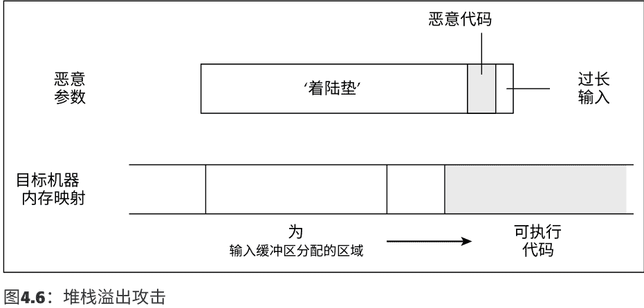

大部分早期的1960年代分时系统都受到了这个问题的困扰，并且进行了修复[549]。在70年代初，系统开发公司进行的渗透分析工作表明，“意外参数”问题仍然是最常用的攻击策略之一[799]。Intel的80286处理器在1982年引入了显式参数检查指令——验证读取（VERR）、验证写入（VERW）和验证长度，但大多数软件设计师都避免使用它们以防止架构依赖。在1988年，大量的Unix计算机被“互联网蠕虫”同时攻击，该蠕虫利用了上述的finger漏洞，从而引起了大众媒体对内存覆写攻击的关注[1206]。一篇1998年的调查论文将内存覆写攻击描述为“十年来的攻击”[329]。

然而，程序员仍然没有检查参数的大小，漏洞仍然不断被发现。这种攻击甚至不仅限于网络计算机系统：至少有一种智能卡可以通过传递比其程序员预期的消息更长的消息来被击败。

### 4.4.2 其他技术攻击

2002年，微软宣布了一个安全计划，要求每个程序员接受如何编写安全代码的培训。（他们为此编写的书籍，《编写安全代码》，由迈克尔·霍华德和大卫·勒布朗克撰写，非常好；我向我的学生们推荐它[627]。）其他技术公司也推出了类似的培训计划。尽管有培训和工具，内存覆写攻击仍然不断出现，给软件公司的管理者带来了巨大的挫折。然而，它们现在可能只占新漏洞的一半，而不是2001年的90%。

其他新的漏洞大多是相同主题的变体，即当语法A中的数据被解释为语法B中的数据时发生。堆栈溢出是指接受数据作为输入（例如URL）并最终以机器码的形式执行。它们本质上是类型安全的失败。

当机器接受输入数据作为格式化指令（例如在C命令`printf()`中的`%n`）时，会出现格式化字符串漏洞。这些通常发生在程序员尝试打印用户提供的数据并且粗心地允许打印命令解释字符串中的任何格式化指令时；这可能允许字符串的作者写入堆栈。主题上还有许多其他变体；缓冲区溢出可能是由于不正确的字符串终止、将不足大小的缓冲区传递给路径操作函数以及许多其他微妙的错误引起的。参见Gary McGraw的书《软件安全》[858]以了解分类法。

SQL注入攻击通常发生在粗心的Web开发人员将用户输入传递给后端数据库而不检查其是否包含SQL代码时。错误消息通常会泄露游戏的底细，一个有能力和积极性的用户可能会推断出足够的信息来发动攻击。

(事实上，2006年对商业网站的调查显示超过10%存在潜在的漏洞[1234]。) 其他语言，如PHP和perl，也存在类似的命令注入问题。一般的解决方法是将所有用户输入视为可疑并进行验证。当你正确计算缓冲区大小时，检查数据大小是很好的，但是当你犯了一个错误——例如，如果你没有考虑到所有边界情况——你可能会遭受另一种类型的攻击，称为整数篡改攻击。在这种情况下，溢出、下溢、环绕或截断可能导致“安全”代码向堆栈写入不适当数量的字节。

一旦处理了这种类型安全攻击，下一个可能是竞争条件（race condition）。这种情况发生在一个事务分为两个或多个阶段进行，并且在验证访问权限的阶段之后，有可能被某人篡改。我在第2章中提到过，如果在密码验证过程中可以覆盖用户ID，那么竞争条件可以允许用户以其他用户的身份登录。另一个经典的例子出现在Unix命令“`mkdir`”中，它分为两个步骤：分配存储空间，然后将所有权转移给用户。由于这些步骤是分开的，用户可以在后台启动一个“`mkdir`”，如果这个过程在被挂起之前只完成了第一步，那么可以使用第二个进程将新创建的目录替换为指向密码文件的链接。然后，原始进程将恢复，并将密码文件的所有权更改为用户。用于临时文件的`/tmp`目录经常被滥用；诀窍是等待特权用户运行的应用程序在此处写入文件，然后将其更改为指向其他位置的符号链接文件——当特权用户的应用程序尝试删除临时文件时，该链接文件将被删除。

各种各样的其他错误使用户能够假定为根用户，并接管系统。例如，PDP-10 TENEX操作系统存在一个错误，即程序地址可能会溢出到进程状态字的下一位，而该位是特权模式位；这意味着程序溢出可能会将程序置于监管者状态。另一个例子是，某些Unix实现具有这样的功能：如果用户尝试在打开的文件达到最大数目时执行命令 `su` ，则 `su` 无法打开密码文件，并通过给予用户根权限来回应。

在更现代的系统中，最棘手的用户到根用户的问题往往是功能交互。例如，我们一直在努力解决备份和恢复系统的问题。如果您可以让用户自行恢复其文件，而不必调用系统管理员，那将非常方便——但是如何保护信息资产免受时间旅行者的侵害，特别是如果恢复系统允许他组合路径名的部分以访问一直对他关闭的目录？而且，如果恢复功能被埋藏在他需要访问以完成工作的应用程序中，并且可以被操纵以获得根访问权限，那该怎么办？

还有许多漏洞导致了服务拒绝攻击。例如，Multics对可以同时打开的文件数量有全局限制，但没有局部限制。因此，用户可以耗尽这个限制并锁定系统，即使管理员也无法登录[774]。直到20世纪90年代末，大多数互联网协议的实现都为处理TCP/IP连接初始化的SYN数据包分配了固定的缓冲空间。结果是SYN洪泛攻击：通过发送大量的SYN数据包，攻击者可以耗尽可用的缓冲空间并阻止机器接受任何新连接。现在使用syncookies来解决这个问题，我将在第二部分中讨论。

最近发现的一类此类攻击是对系统调用包装器的攻击。这些是修改软件行为的软件产品，通过拦截系统调用并执行一些过滤或操作来实现。一些包装器产品进行虚拟化，其他产品为操作系统提供安全扩展。然而，Robert Watson发现这些产品可能存在同步错误和竞争条件，允许攻击者成为root用户[1325]。（我将在第18.3节中更详细地描述这些。）并发机制的普及，多处理器机器在多年的研究好奇心之后突然成为常态，可能导致竞争条件成为下一个重大攻击家族。

### 4.4.3 用户界面故障

最早设计的攻击之一是特洛伊木马，这是一个程序，管理员被邀请运行，如果他这样做，将会造成一些伤害。人们会编写游戏，偶尔检查玩家是否是系统管理员，如果是，则会创建另一个具有已知密码的管理员账户。

另一个技巧是编写一个与常用系统实用程序相同名称的程序，例如 `ls` 命令，该命令列出Unix目录中的所有文件，并设计它在调用真实实用程序之前滥用管理员特权（如果有的话）。下一步是向管理员投诉该目录出现问题。当管理员进入该目录并输入 `ls` 查看其中内容时，损害已经造成。修复很简单：管理员的 “PATH” 变量（在调用命令时将搜索适当命名程序的目录列表）不应包含 ‘.’（表示当前目录的符号）。最近的Unix版本默认情况下都已经带有此功能；但对于不谨慎的人来说，这仍然是一个不必要的陷阱。

也许最严重的用户界面失败例子是在Windows中。我指的是，在Vista出现之前，用户需要成为系统管理员才能安装任何东西。理论上，这可能有助于银行防止其分行员工在午餐时间运行游戏并感染病毒。

但大多数环境都没有那么受控制，许多人需要能够安装软件来完成工作。因此，数百万人拥有不需要的管理员权限，并且容易受到恶意代码的攻击，只需弹出一个框告诉他们做某事。谢天谢地，Vista正在摆脱这一点，但UAC对于必须以root身份运行、对外可见且包含软件漏洞的应用程序提供不了保护。

另一个可能被认为是界面失败的例子来自于各种主动内容的使用。这些可能会成为威胁，因为用户没有直观清晰的控制方式。网页中的Javascript和ActiveX，Office文档中的宏以及电子邮件附件中的可执行文件都曾被用于发起严重攻击。即使是Java，尽管被认为是安全的，也遭受了许多利用不慎实现的攻击[360]。然而，许多人（包括许多公司）不愿放弃主动内容所能提供的花哨功能，而且我们在第2章中看到，市场营销人员通常击败了安全人员（即使在银行等应用程序中也是如此）。

### 4.4.4 为什么会出现这么多问题

我们已经提到了操作系统安全设计师面临的基本问题：他们的产品庞大而且容易出错，并且由大量用户进行测试。大量用户并行测试，其中一些用户会公开他们的发现而不是向供应商报告。即使所有的错误都得到负责任的报告，这也不会有太大的区别；在过去几年中，几乎所有被广泛利用的漏洞都已经被修补。

（事实上，微软每个月的“补丁星期二”之后都会有“攻击星期三”，因为恶意软件编写者会逆向新的漏洞并在所有人修补之前对其进行攻击。）

还有其他结构性问题。其中一个更严重的失败原因是内核膨胀。在Unix下，所有的设备驱动程序、文件系统等都必须在内核中。直到Vista，Windows内核中仍包含了许多智能卡、读卡器等设备的驱动程序，其中许多是由设备供应商编写的。因此，大量的代码是受信任的，因为它们被放在安全边界内。其他一些系统，如MVS，引入了降低许多实用程序所需信任级别的机制。然而，在最常见的操作系统中，实现这一点的方法很少且相对非标准。

更严重的是，大多数应用程序开发人员使他们的程序以root身份运行。这样做的原因是经济上的而不是技术上的，而且很容易理解。一家试图建立市场份额的公司，比如操作系统，必须吸引其补充者——应用程序开发人员——以及其用户。如果程序可以以root身份运行，对开发人员来说更容易，所以早期的Windows产品就允许这样做。

一旦供应商占据了主导地位，商业逻辑就是增加安全性，并进行定制，以便更紧密地锁定应用程序开发人员和用户。随着Windows Vista呈现，访问控制机制变得越来越复杂，并且与Linux和OS/X不同，这种情况正在发生。从大型机到移动电话，其他平台也观察到了类似的模式，即在平台生命周期的早期阶段安全性过低，而在后期过多（错误类型）的情况。

让许多应用程序和实用程序以root身份运行反复引入了可怕的漏洞，而只需稍加思考和轻微的重新设计就可以使用更有限的权限。有许多系统，如 `lpr/lpd`——Unix的行打印机子系统——它不需要以root身份运行，但在大多数系统上仍然这样做。这在过去也是安全失败的一个原因（例如，将打印机排队到密码文件）。

一些应用程序需要一定数量的特权。例如，邮件delivery agents必须能够处理用户邮箱。但是，尽管谨慎的设计师会将此特权限制在应用程序的一小部分上，但大多数代理程序都是以root用户身份运行整个程序。经典示例是 `sendmail`，它有着严重的安全漏洞的悠久历史；但是许多其他MTA也存在问题。一般效果是一个错误只应妥协一个人的邮件可能会给外部攻击者赋予根权限。

所以，当开发人员开始适应UAC时，我们将会有一些时刻。先例并不都是令人鼓舞的。一些程序员在历史上通过将重要的共享数据结构和资源对所有用户开放来避免安装和运行非root软件的困难，这样做是不安全的。许多旧系统将邮件存储在每个用户的一个文件中，这使得邮件伪造变得容易。Unix文件utmp - 登录用户列表 - 经常用于各种安全检查，但也经常是可被所有人写入的！这应该被设计为一个服务而不是一个文件 - 但是一旦初始设计决策已经做出，解决这些问题可能很困难。我预计会看到所有1970年代多用户系统的旧问题再次出现，因为正确使用Vista机制的复杂性使许多非安全专家的程序员感到沮丧，他们只是急于让某些东西工作起来，以便完成任务，领取奖金并继续前进。

### 4.4.5 补救措施

一些漏洞类别可以使用自动工具修复。例如，堆栈溢出攻击主要是由于C语言（大多数操作系统都是用C编写的）中缺乏适当的边界检查。有各种工具（包括免费工具）可用于检查C程序的潜在问题，甚至有一个名为StackGuard的编译器补丁，将一个“canary”放在堆栈上的返回地址旁边。这可以是程序启动时选择的一个随机的32位值，并在函数关闭时进行检查。如果堆栈同时被覆盖，那么很有可能canary会改变[329]。这些工具的可用性以及微软等培训计划逐渐减少了堆栈溢出错误的数量。然而，攻击工具也在不断改进，攻击者现在发现了在1990年代没有引起太多关注的格式化字符串漏洞和整数溢出漏洞。

总的来说，需要在设计、编码和测试方面投入更多的努力。架构很重要；拥有清晰的接口，并以受过长期安全考验的有经验的人的监督下逐步演化，可以产生巨大的差异。（我将在第三部分更详细地讨论这个问题。）程序应该只具有所需的最低权限：最小权限原则[1102]。软件还应该设计成默认配置安全，通常情况下，最简单的方法应该是安全的。良好的架构对于实现安全的默认设置和使用最小权限至关重要。然而，许多系统都带有危险的默认设置和混乱的代码，可能会暴露各种接口，从而导致诸如SQL注入等攻击的发生。

### 4.4.6 环境渗透

我多次指出，许多安全故障是由于环境变化破坏了安全模型所导致的。在受限环境中足够有效的机制在更一般的环境中往往会失败。

访问控制机制也不例外。例如，Unix最初被设计为一个“单用户Multics”（因此得名）。然后它成为一个由一些熟练和值得信赖的人在实验室中共享一台机器使用的操作系统。在这种环境下，安全机制的主要功能是防止错误的发生；防止一个用户的打字错误或程序崩溃导致删除或覆盖另一个用户的文件。最初的安全机制对于这个目的来说是相当合适的。

但Unix安全性成为了一个经典的“成功灾难”。Unix被反复扩展，但没有适当考虑到保护机制也需要扩展。伯克利版本假设从单台机器扩展到一个局域网上的所有机器，并且都在一个管理下。诸如rhosts之类的机制是基于一个元组（用户名，主机名）而不仅仅是用户名，并且开始了信任的转移。

互联网机制（telnet，ftp，DNS，SMTP）起源于1970年代的Arpanet，最初是为主机编写的，位于一个安全的广域网上。主机是自治的，网络位于安全协议之外，并且没有授权的传输。因此，远程身份验证，伯克利模型开始变得谨慎，根本不被支持。Sun的贡献（NFS，NIS，RPC等）基于一个工作站模型的宇宙，具有多个局域网环境，分布式管理，但通常仍在一个组织内。（关于DNS和NFS等主题的适当教程超出了本书的范围，但在第21章的网络协议漏洞部分有一些更详细的背景材料。）

将所有这些不同的计算模型混合在一起导致了混乱。它们的一些最初的假设仍然部分适用，但没有一个全局适用。现在的互联网拥有数亿台个人电脑，数百万个局域网，数千个互连的广域网，以及不仅是独立的，而且可能存在冲突的管理（包括相互之间处于战争状态的国家和次国家组织）。许多个人电脑根本没有管理，而且越来越多的网络连接的传真机、路由器和其他嵌入式产品是Windows和Linux系统。这些产品从不进行修补。

用户们，不再是可信但偶尔无能的，现在主要是无能的 - 但有些人既有能力又具有敌意。代码以前只是有错误 - 但现在有相当多的恶意代码在那里。对通信网络的攻击过去是国家情报机构的专属领域 - 现在它们可以被脚本小子们进行，这些相对无技术的人从网络上下载了攻击工具并启动它们，却对它们的工作原理没有真正的了解。

因此，Unix和互联网安全给我们提供了另一个例子，一个最初设计得相当好但在不断变化的环境中被破坏的系统。

Windows Vista及其在NT产品系列中的前身比Unix拥有更广泛的保护机制，存在的时间要短得多。对于Oracle等数据库产品也是如此。实际上，我们只能说陪审团还没有做出决定。

## 4.5 总结

访问控制机制在系统中的多个层次上运行，从应用程序到中间件再到操作系统和硬件。更高级别的机制可能更具表达性，但也更容易受到攻击，原因有很多，从内在复杂性到实施者的技能水平不等。大多数攻击都涉及机会主义地利用漏洞，而非庞大、广泛使用的软件产品（如操作系统和数据库）尤其容易发现和公开安全漏洞。各个层次的系统也容易受到环境变化的影响，从而破坏其设计中所使用的假设。

访问控制的主要功能是限制特定群体、用户和程序可能造成的损害，无论是出于错误还是恶意。最重要的实例是Unix和Windows，它们在许多方面相似，尽管Windows更具表达性。数据库产品通常更具表达性（因此更难以安全实现）。访问控制也是特殊用途硬件设计的重要组成部分，如智能卡和其他加密设备。正在开发新技术来减少实现错误的数量，例如堆栈溢出攻击；但是新的攻击不断被发现，大型软件系统的整体可靠性只有缓慢提高。

从读、写和执行权限限制组和角色的访问控制的一般概念将一再出现。在一些分布式系统中，它们可能不会立即显而易见，因为底层机制可能非常不同。一个例子来自公钥基础设施，它们是对一个旧的访问控制概念——能力的重新实现。

然而，基本机制（及其问题）是普遍存在的。

## 研究问题

大多数访问控制问题在20世纪60年代或70年代初已经被识别出来，并在实验系统（如Multics [1139]和CAP [1344]）上得到解决。自那时以来，访问控制系统的大部分研究都涉及在新的上下文中重新处理基本主题，如面向对象系统和移动代码。

最近的研究方向包括如何将访问控制与用于提供多媒体操作系统中的服务质量保证的准入控制机制相结合，以及如何在大型复杂系统中高效实施和管理访问控制，使用角色和策略语言。

然而，在2003年至2006年期间，研究的最大单一主题是“可信计算”，以及如何在可信计算组提出的机制之上叠加各种信任机制。2007年1月发布的Windows Vista未能支持远程认证，这在一定程度上削弱了这一努力的动力。

我怀疑在接下来的几年里，一个有用的研究课题将是如何设计既强大又易用的访问控制机制，既适用于程序员，也适用于最终用户。原则上，分离是很容易的；可以为不同的任务使用不同的机器或不同的虚拟机。但是，如果一个电子银行应用程序与数字世界的其他部分被很好地隔离开来，以至于用户无法将银行对账单中的数字导出到电子表格中，人们会有多满意呢？

当我们讨论第8章中的强制访问控制时，我将更详细地讨论这个问题。

## 进一步阅读

关于访问控制问题的更详细介绍，最好的教材是Dieter Gollmann的《计算机安全》[537]。Carl Landwehr的技术报告提供了过去30年左右操作系统中发现的许多缺陷的有用参考[774]。关于这个主题（事实上关于计算机安全总体而言）最早的报告是由Willis Ware撰写的[1319]。最有影响力的早期论文之一是Jerry Saltzer和Mike Schroeder的[1102]，而Butler Lampson关于限制问题的有影响力的论文在[768]。

关于Unix安全的经典描述在Fred Grampp and Robert Morris的论文中[550]。关于这个主题最全面的教材是Simson Garfinkel and Eugene Spafford的《实用Unix和Internet安全》[517]，而关于互联网方面的经典著作是Bill Cheswick和Steve Bellovin的《防火墙和互联网安全》[157]，其中有许多关于Unix系统网络攻击的例子。

Windows的保护机制在Gollmann中简要描述。有关详细信息，请参阅Microsoft在线文档；毫无疑问，很快就会出现一些关于Vista的教科书。有关微处理器架构的历史可参考[128]，Java安全的参考书由其架构师李功[539]编写。

软件安全领域发展迅速；引起关注的攻击方式在细节上发生了显著变化（至少在细节上）从一年到另一年。我最近读过的最好的书是Gary McGraw的[858]。但要跟上时代，你不仅应该阅读教科书，还应该关注CERT和bugtraq等邮件列表上的最新通知，以及关于黑暗面的书籍，如Markus Jakobsson和Zulfikar Ramzan的[660]。

## 第5章 密码学

> ZHQM ZMGM ZMFM
> 
> — G. 尤利乌斯·凯撒

> KXJEY UREBE ZWEHE WRYTU HEYFS KREHE GOYFI WTTTU OLKSY CAJPO BOTEI ZONTX BYBWT GONEY CUZWR GDSON SXBOU YWRHE BAAHY USEDQ
> 
> — 约翰·F·肯尼迪

### 5.1 引言

密码学是安全工程与数学相结合的领域。它为我们提供了大多数现代安全协议的基础工具。它可能是保护分布式系统的关键技术，但是做好它却出奇地困难。正如我们在第3章“协议”中已经看到的那样，密码学经常被用来保护错误的东西，或者以错误的方式来保护它们。当我们开始详细研究真实应用程序时，我们将看到更多的例子。

不幸的是，过去25年来，计算机安全和密码学界已经分道扬镳。安全人员并不总是理解可用的加密工具，而加密人员也并不总是理解现实世界中的问题。这其中有许多原因，例如不同的专业背景（计算机科学与数学）和不同的研究资金（政府试图推动计算机安全研究，同时压制密码学）。这让我想起了一个医生朋友讲的一个故事。在她年轻的时候，她在一个国家工作了几年，由于经济原因，他们缩短了医学学位的时间，集中培养尽快成为专家。有一天，一个已经移除了两个肾脏并等待移植的患者需要重新做透析分流管。外科医生以没有尿液分析记录为由将患者送回手术室外。他根本没有想到没有肾脏的患者无法产生尿液。

就像医生需要了解生理学和外科手术一样，安全工程师需要熟悉密码学和计算机安全（以及其他很多方面）。本章面向没有密码学培训的人；密码学家在本章中几乎找不到他们不知道的内容。

由于我只有几十页，而现代密码学的适当阐述将需要数千页，所以我不会过多涉及数学内容（有很多书籍可以提供这方面的知识；请参考本章末尾的进一步阅读）。我只会解释那些似乎引起最大困惑的基本直觉和构造。如果你必须以一种类似于小说的方式使用密码学，那么我强烈建议你多读一些相关的内容，并与一些真正的专家交流。安全工程师保罗·科赫在2007年的Crypto大会上的主题演讲中指出，你可以预期任何一个不雇佣这个房间里的人的公司设计的加密产品都会打破。这其中有相当多的真实性。

计算机安全专家经常要求提供非数学定义的密码学术语。基本术语是：密码学指设计密码的科学和艺术；密码分析指破解密码的科学和艺术；而密码学（通常统称为密码）则是研究两者的学科。加密过程的输入通常称为明文，输出称为密文。此后，事情变得更加复杂。有许多密码学原语——基本构建模块，如块密码，流密码和哈希函数。块密码可以使用相同的密钥进行加密和解密，这种情况下午称为共享密钥（也称为秘密密钥或对称密钥），或者可以使用不同的密钥进行加密和解密，这种情况下称为公钥或非对称密钥。数字签名方案是一种特殊类型的非对称密码学原语。

在本章的其余部分，我将首先给出一些简单的历史例子来说明基本概念。然后，我将通过引入随机预言模型来进一步调整定义，这是许多密码学家使用的模型。最后，我将展示一些更重要的加密算法的实际工作原理，以及它们如何用于保护数据。

### 5.2 历史背景

苏埃托尼乌斯告诉我们，尤利乌斯·凯撒通过写‘D’代表‘A’，‘E’代表‘B’等方式来加密他的电文[1232]。当奥古斯都·凯撒登上王位时，他改变了帝国密码系统，现在用‘C’来代表‘D’代表‘A’，‘E’代表‘B’等等。用现代术语来说，他将密钥从‘D’改为‘C’。令人惊讶的是，贝尔纳多·普罗文扎诺（Bernardo Provenzano）也使用了类似的密码，他被称为西西里黑手党的首领，他用‘4’代表‘a’，‘5’代表‘b’等等。这直接导致他在2006年被意大利警方拦截并解密了他的一些消息后被捕[1034]。

阿拉伯人将这个想法推广到了单字母替代，其中使用关键字来排列密码字母表。我们将明文写成小写字母，密文写成大写字母，如图5.1所示：

```
abcdefghijklmnopqrstuvwxyz
SECURITYABDFGHJKLMNOPQVWXZ
```

**图5.1：单字母替代密码**

OYAN RWSGKFR AN AH RHTFANY MSOYRM OYSH SMSEAC NCMAKO; 但是破解这种密码是一个简单的纸上谜题，你可能在小学时就做过。诀窍在于一些字母和字母组合比其他字母更常见；在英语中，最常见的字母按顺序是 e, t, a, i, o, n, s, h, r, d, l, u。人工智能研究人员对编写解决单字母替代的程序表现出了一些兴趣。仅仅使用字母和二元组（字母对）的频率，他们通常可以成功解密大约600个密文字母，而猜测可能的单词等更聪明的策略可以将此数字减少到约150个字母。一个人类密码分析师通常需要更少的时间。

基本上有两种方法可以制作更强的密码——流密码和分组密码。在前者中，你使加密规则依赖于明文符号在明文符号流中的位置，而在后者中，你一次加密多个明文符号在一个分组中。让我们来看一些早期的例子。

### 5.2.1 早期的流密码——维吉尼亚密码

这种早期的流密码通常归功于法国人布莱兹·德·维吉尼亚（Blaise de Vigenère），他是一位为查理九世国王服务的外交官。它通过反复将密钥添加到明文中，使用约定‘A’=0，‘B’=1，...，‘Z’=25，并且进行模26的加法运算——也就是说，如果结果大于25，我们减去尽可能多的26的倍数，使其落在范围 [0, ..., 25] 内，也就是 [A, ..., Z]。数学家将其写为：

$$C = P + K \bmod 26$$

所以，例如，我们将 P（15）加上 U（20）得到35时，我们通过减去26将其减少到9。9对应于J，因此在密钥U下，P的加密（以及在密钥P下的U）是J。因此，在这种表示法中，尤利乌斯·凯撒的系统使用了一个固定密钥 $K = D$（注：此处原文可能指代偏移量为3，在某些文献中记作D），而奥古斯都·凯撒使用 $K = C$，维吉尼亚使用一个重复的密钥，也称为一个运行密钥。为了快速进行这种加法，发展了各种手段，包括印刷表格和用于现场使用的密码轮盘。无论实现技术如何，使用重复关键字进行加密的密钥将如图5.2所示。

许多人似乎已经找出了如何解决多表代换密码的方法，从花花公子贾科莫·卡萨诺瓦到计算机先驱查尔斯·巴贝奇。然而，第一个发表的解决方案是在1863年由普鲁士步兵军官弗里德里希·卡西斯基提出的[695]。他注意到，给定足够长的密文，重复的模式将出现在关键字长度的倍数处。

例如，在图5.2中，我们可以看到在九个字母后重复出现了‘KIOV’，在六个字母后重复出现了‘NU’。由于三同时被六和九整除，我们可以猜测关键字是三个字母。由此可知，密文的第一个、第四、第七个字母等都是在相同的密钥字母下加密的；因此，我们可以使用频率分析技术猜测出这个字母最有可能的值，然后对密钥的第二个和第三个字母重复这个过程。

### 5.2.2 一次性密码本

使这种类型的流密码免受攻击的一种方法是，密钥序列与明文一样长，并且永不重复。这是由吉尔伯特·弗纳姆在一战期间提出的[676]；其后果是，对于任何密文和相同长度的明文，都存在一个解密密钥，将密文解密为明文。无论对手能够进行多少计算，他们都不会知道，因为所有可能的明文都是同等可能的。这个系统被称为一次性密码本（One-time Pad）。Leo Marks在第二次世界大战中的特种行动执行部门的密码学书籍中[836]讲述了一次性密钥材料是如何印在丝绸上的，特工们可以将其隐藏在衣物中；每当使用一个密钥后，它就会被撕下并烧掉。

一个例子可以解释这一切。假设你截获了一条来自战时德国特工的消息，你知道它以“Heil Hitler”开头，而密文的前十个字母是 `DGTYI BWPJA`。这意味着一次性密码本的前十个字母是 `wclnb tdefj`，如图5.3所示：

```
明文       heilhitler
密钥       wclnb tdefj
密码       DGTYIBWPJA
```
**图5.3: 间谍的消息**

但是一旦他用他的密钥材料烧毁了丝绸片段，间谍可以声称自己实际上是反纳粹地下抵抗组织的成员，并且消息实际上是说“绞死希特勒”。这是完全可能的，因为密钥材料也可以是 `wggsb tdefj`，如图5.4所示：

```
密码       DGTYIBWPJA
密钥       wggsb tdefj
明文       绞死希特勒
```
**图5.4: 间谍声称他说的话**

现在在密码学中，我们很少能够无偿获得任何东西，而一次性密码本的完美保密性的代价是完全无法保护消息的完整性。例如，假设你想让这个间谍陷入麻烦，你可以将密文更改为 `DCYTI BWPJA`（图5.5）：

```
密码       DCYTI BWPJA
密钥       wclnb tdefj
明文       绞死希特勒
```
**图5.5: 操纵消息以诱捕间谍**

在第二次世界大战期间，克劳德·香农证明了密码具有完美保密性，当且仅当可能的密钥与可能的明文一样多，并且每个密钥的可能性相等；因此一次性密码本是唯一提供完美保密性的系统[1157, 1158]。

一次性密码本仍然用于某些外交和情报通信，但它消耗与通信量相同的密钥材料，这对大多数应用来说太昂贵了。流密码更常用适当的伪随机数生成器将短密钥扩展为长密钥流。然后通过逐位与数据进行异或（XOR）运算来加密数据。仅仅通过标准统计随机性测试的关键流并不足够：它还必须具有这样的属性，即使对手获得了相当多的关键流，他也无法推断出关键流的任何信息。密钥流位不应能够预测更多位。我将在下一节中更严格地形式化这个问题。

流密码现在在硬件应用中广泛使用，其中门的数量必须最小化以节省功耗。我们将在后面的章节中看到一些实际的设计，包括用于加密GSM手机通信的A5算法（在“电信系统安全”一章中），以及用于付费电视和DVD CSS的移位寄存器系统（在“版权和隐私保护”一章中）。然而，块密码更适合许多需要在软件中进行加密的应用，所以让我们接下来看看它们。

### 5.2.3 早期的分组密码 —— Playfair

最著名的早期分组密码之一是Playfair系统。它是由查尔斯·惠特斯通爵士（Sir Charles Wheatstone）于1854年发明的，他是一位电报先驱，也发明了手风琴和惠特斯通电桥。之所以不称为惠特斯通密码，是因为他向政治家Playfair演示了这个密码；Playfair又在晚餐后用餐巾纸向阿尔伯特亲王和帕默斯顿子爵（后来的首相）演示了它。

该密码使用一个5x5的网格，我们在其中放置字母，通过关键词进行排列，并省略字母'J'（见图5.6）：

| P | A | L | M | E |
|---|---|---|---|---|
| R | S | T | O | N |
| B | C | D | F | G |
| H | I | K | Q | U |
| V | W | X | Y | Z |

**图5.6: Playfair加密表**

明文首先通过将出现的'J'替换为'I'进行处理，然后将其分成字母对，通过在两个相同字母对之间用'x'分隔来防止重复字母，并在必要时添加'z'以完成最后一个字母对。Playfair在餐巾纸上写的例子是“Lord Granville's letter”，变成了“lo rd gr an vi lx le sl et te rz”。

然后，按照以下规则对其进行加密：

- 如果两个字母在同一行或同一列，则用其后继字母替换它们。例如，'am'加密为'LE'。
- 否则，这两个字母位于表格中一个矩形的两个角落，我们用该矩形的另外两个角落的字母替换它们。例如，'lo'加密为'MT'。

这种密码的变体曾被英国军队用作一种战地密码，在第一次世界大战中使用过，在第二次世界大战中被美国人和德国人使用过。它是对维吉尼亚密码的一个实质性改进，因为分析员可以收集到的统计数据是二字母组合而不是单个字母，因此分布更加平坦，需要更多的密文才能进行攻击。

同样，对于块密码的输出来说，仅仅看起来像是随机的是不够的。Playfair密码看起来是随机的；但是它们有一个特性，即如果你改变明文中的一个字母，那么密文中通常只有一个字母会改变。因此，使用图5.6中的密钥，'rd'加密为'TB'，而'rf'加密为'OB'，'rg'加密为'NB'。一个结果是，如果有足够的密文，或者有一些可能的单词，那么可以重建表格（或等效的表格）[512]。因此，我们希望块密码输入的微小变化能够完全扩散到输出中：改变一个输入位应该平均导致一半的输出位发生变化。我们将在下一节中进一步细化这些想法。

通过选择比两个字符更长的块长度，可以大大提高块密码的安全性。例如，广泛用于银行业的数据加密标准（DES）的块长度为64位，相当于八个ASCII字符，而许多应用程序正在取代DES的高级加密标准（AES）的块长度是其两倍。我将在下面讨论DES和AES的内部细节；暂时来说，一个八字节或十六字节的块大小本身是不够的。

例如，如果一个银行账号号码在每次涉及该账号的交易中总是出现在同一个位置，那么每次使用相同密钥对其进行加密时，很可能会产生相同的密文。这可能允许对手剪切和粘贴两个不同密文的部分，以生成一个看似真实但未经授权的交易。

假设一个坏人在银行的电话公司工作，并能拦截他们的通信。如果他监视了一个他知道说“支付IBM 10,000,000美元”的加密交易，他可能会向他的兄弟汇款1,000美元，导致银行计算机插入另一个交易，说“支付John Smith 1,000美元”，拦截这个指令，并从两个密文中编造一个虚假指令，解密为“支付John Smith 10,000,000美元”。因此，除非密码块与消息一样大，否则密文将包含多个块，我们通常需要一种将这些块绑定在一起的方法。

#### 5.2.4 单向函数

第三种经典密码类型是单向函数。这进化到保护消息的完整性和真实性，正如我们所看到的许多简单密码根本不保护的那样，在这些密码中，往往很容易以一种可预测的方式操纵密文，从而导致明文发生可预测的变化。

19世纪中叶发明了电报后，银行迅速成为其主要用户，并开发了用于电子转账的系统。当然，被‘连线’的不是钱本身，而是付款指令，例如：

> “给伦巴德银行，伦敦。请从我们在你们那里的账户号码1234567890上支付1000英镑给位于切斯特顿路456号的约翰·史密斯，他在剑桥汇丰银行有一个账户号码301234 4567890123，并通知他这是‘多琳·史密斯的婚礼礼物’。来自圣塔巴巴拉第一牛仔银行，美国加利福尼亚州。费用由我们支付。”

自从电报消息通过人类操作员从一个办公室传递到另一个办公室以来，操作员有可能操纵支付消息。在19世纪，银行、电报公司和航运公司开发了密码本，不仅可以保护交易，还可以缩短交易时间——考虑到当时国际电报的成本，这非常重要。密码本本质上是一个分组密码，它将单词或短语映射到固定长度的字母或数字组。因此，“请从我们的账户支付”可能变成“AFVCT”。20世纪20年代的一项竞争技术是转子机，这是一种机械密码设备，它产生非常长的伪随机数序列，并将其与明文结合以获得密文；这些设备由许多人独立发明，其中许多人梦想着将其卖给银行业。银行一般不感兴趣，但转子机成为第二次世界大战参战国主要使用的高级密码系统。

银行意识到机械流密码和代码书都不能保护消息的真实性。例如，如果‘1000’的代码词是‘紫红色’，而‘1,000,000’的代码词是‘洋红色’，那么那个能够将编码流量与已知交易进行比较的不正当电报员应该能够弄清楚并将一个替换为另一个。

对于银行的目的来说，关键的创新是使用代码书，但通过将代码组合成一个称为测试密钥（Test Key）的数字来使编码成为单向的。（现代密码学家会将其描述为哈希值或消息认证码，我稍后会更详细地定义这些术语。）

这里有一个简单的例子。假设银行有一本代码书，其中包含与支付金额对应的数字表，如图5.8所示：

| 金额倍数 | 0 | 1 | 2 | 3 | 4 | 5 | 6 | 7 | 8 | 9 |
| :--- | :--- | :--- | :--- | :--- | :--- | :--- | :--- | :--- | :--- | :--- |
| x 1000 | 14 | 22 | 40 | 87 | 69 | 93 | 71 | 35 | 06 | 58 |
| x 10,000 | 73 | 38 | 15 | 46 | 91 | 82 | 00 | 29 | 64 | 57 |
| x 100,000 | 95 | 70 | 09 | 54 | 82 | 63 | 21 | 47 | 36 | 18 |
| x 1,000,000 | 53 | 77 | 66 | 29 | 40 | 12 | 31 | 05 | 87 | 94 |

**图5.8：一个简单的测试密钥系统**

现在，为了验证一笔金额为£376,514的交易，我们将53（无百万），54（30,000），29（70,000）和71（6,000）相加。（通常忽略金额的不重要的数字。）这给我们一个测试密钥为207。大多数真实系统比这个更复杂；它们通常有货币代码、日期甚至收款人账号的表格。在更好的系统中，代码组长度为四位数而不是两位数，为了使攻击者更难重构表格，测试密钥被压缩：一个键‘7549’可能通过添加第一和第二位数字，以及第三和第四位数字，并忽略进位变成‘23’。

这使得这些测试密钥系统成为单向函数，即使知道算法，也可以从消息计算出一个测试值，但无法反向过程并从测试值中恢复消息——测试值中包含的信息不足。事实上，单向函数至少自17世纪以来就已经存在。科学家罗伯特·胡克在1678年发表了排序的变位词“ceiiinosssttuu”，两年后揭示它是从“Ut tensio sic uis”（“力与张力成正比”）派生而来的，或者我们现在称之为胡克定律。（目标是确立该想法的优先权，同时给他继续发展的时间。）

根据现代密码学的标准，测试密钥并不强大。根据设计细节，根据测试消息的数量在几十到几百之间，耐心的分析员可以重建足够的表格来伪造交易。通过帮凶在银行系统中插入几条精心选择的消息，甚至更容易。但是银行逃脱了：测试密钥从19世纪末到20世纪80年代都运行良好。在担任银行安全顾问并听取年长的银行审计员故事的几年里，我只听说过两起利用此漏洞的欺诈案件：一起涉及密码分析的外部尝试，因为攻击者不了解银行程序而失败，以及一起成功但规模较小的涉及不诚实员工的欺诈案件。我将讨论现代测试密钥系统，以及如何将密码身份验证机制与双重程序保护（如双因素认证）相结合的整个问题。在“银行和簿记”章节中，控制是一个经典的一次性函数用于身份验证的例子。

后面的例子包括在前面章节中讨论的应用程序中使用的函数，例如将密码存储在单向加密的密码文件中，以及根据身份验证协议中的挑战计算响应。

### 5.2.5 非对称原语

最后，一些现代密码系统是非对称的，即加密和解密使用不同的密钥。因此，例如，许多人在他们的网页上发布了一个公钥，用于加密发送给他们的消息；网页的所有者可以使用相应的私钥解密它们。

在计算机出现之前，也有一些例子；也许最好的例子是邮政服务。你可以通过给我写信并将其投入邮箱来给我发送私人消息。一旦完成，我将是唯一能够阅读它的人。当然，有很多事情可能会出错。你可能会因为错误或欺骗而得到错误的地址；警察可能会获得打开我的邮件的授权；信件可能会被不诚实的邮递员偷走；骗子可能会在我不知情的情况下重定向我的邮件；或者小偷可能会从我的邮箱里偷走信件。公钥密码学也存在类似的问题。虚假的公钥可以被插入到系统中，计算机可以被黑客攻击，人们可以被胁迫等等。我们将在后面的章节中更详细地讨论这些问题。

密码学的另一个非对称应用是数字签名。这里的想法是我可以使用私人签名密钥对消息进行签名，然后任何人都可以使用我的公共签名验证密钥来验证。同样，在计算机之前的手稿签名和印章中也存在类似的问题；同时，无论以前的方式还是现在的方式，都存在着一系列令人惊讶地相似的问题。

### 5.3 随机预言机模型

在深入研究现代密码设计之前，我想花几页的篇幅来精确定义各种类型的密码。（对于对理论计算机科学感到恐惧的读者，可以在第一遍阅读时跳过本节；我包含这部分内容是因为理解随机预言机的术语对于解读许多最近的密码学研究论文是必要的。）随机预言机模型试图图形化这样一个观点：如果以适当的方式观察，密码算法与某种类型的随机函数在不可区分的情况下被视为“好”。如果一个密码学原语通过了适当的统计和其他测试，就称之为伪随机函数。

无论我们使用的计算模型是什么，结论都会成立。当然，密码学原语实际上是一个算法，在硬件中实现为一组门电路，或者在软件中实现为一个程序；但输出应该“看起来随机”，即在我们的计算模型允许的测试类型和数量下，与合适的随机预言机不可区分。

通过这种方式，我们可以希望将设计密码与正确使用密码的问题分开。设计密码的数学家可以提供他们的密码是伪随机的证据。完全分开地，一个设计了密码协议的计算机科学家可以尝试在使用伪随机密码实现的假设下证明其安全性。这个过程并不是绝对可靠的，正如我们在协议正确性的证明中所看到的。定理和程序一样可能存在错误；问题可能被错误地理想化；数学家和计算机科学家可能使用不同的计算模型。事实上，密码研究人员之间存在着关于形式化模型和证明是否有价值的激烈辩论。但是密码理论可以帮助我们更好地理解密码的行为以及如何安全地使用它们。

我们可以将随机预言机想象成一个坐在黑匣子里的小精灵，他有一些物理随机性的来源和一些存储手段（见图5.9）——在我们的图片中用骰子和卷轴表示。这个小精灵会接受特定类型的输入，然后查看卷轴，看看这个查询是否曾经被回答过。如果是，它会给出在那里找到的答案；如果不是，它会通过掷骰子随机生成一个答案。我们还假设存在某种带宽限制——即每秒只能回答一定数量的查询。这个理想将被证明是一种改进我们对流密码、哈希函数、块密码、公钥加密算法和数字签名方案的概念的方法。

**图5.9：随机预言机**

最后，我们可以通过注意到加密不仅可以用于跨越距离保护数据，还可以用于跨越时间保护数据，从而得到我们概念模型的有用简化。一个很好的例子是在将数据存储到第三方备份服务之前对其进行加密，如果我们需要从磁盘崩溃中恢复，可能会在以后解密数据。在这种情况下，我们只需要一个单独的加密/解密设备，而不是在通信链路的每一端都需要一个。为了简单起见，让我们假设我们在这里建模的是这种类型的应用。用户将一个磁盘带到密码机，输入一个密钥，发出一条指令，然后数据以适当的方式进行转换。一年后，她回来解密和验证数据。

现在，我们将详细讨论各种不同的密码学原语的这个模型。

### 5.3.1 随机函数 — 哈希函数

第一种随机预言机是随机函数。随机函数接受任意长度的输入字符串，并输出一个固定长度的随机字符串，比如 $n$ 位。因此，精灵只需一个简单的输入输出列表，随着工作的进行而不断增长。（我们将忽略滚动条大小的任何影响，并假设所有查询都在常数时间内得到回答。）随机函数是我们对单向函数的模型，也被称为密码哈希函数，它们有许多实际用途。它们首先在20世纪60年代的计算机系统中用于密码的单向加密，并且如我在安全协议章节中提到的那样，今天在许多身份验证系统中使用。它们用于在取证应用程序中对文件进行校验和计算：当你拿到从嫌疑人那里查获的计算机时，你可以计算文件的哈希值来确定哪些文件是已知的（比如系统文件），哪些是新的（比如用户数据）。

哈希值也被用作检查文件完整性的手段，因为如果文件损坏，哈希值会发生变化。在消息应用中，哈希值通常被称为消息摘要；给定一个消息 $M$，我们可以通过一个伪随机函数得到一个摘要，称为 $h(M)$，它可以代替消息在各种应用中使用。一个例子是数字签名：如果消息很长，签名算法往往会很慢，所以通常方便的做法是对消息摘要进行签名，而不是对消息本身进行签名。

另一个应用是时间戳。如果我们想要证明我们在某个特定日期拥有某个电子文件，我们可以将其提交给在线时间戳服务。然而，如果文件仍然是机密的，例如我们计划申请专利的发明，并且只想要确定一个优先日期，那么我们可能不会将整个文件发送给时间戳服务，而只发送消息摘要。

#### 5.3.1.1 属性

随机函数的第一个主要属性是单向性。已知输入 $x$ 的情况下，我们可以轻松计算哈希值 $h(x)$，但是如果哈希值 $h(x)$ 没有被事先知道，那么找到相应的原像 $x$ 是非常困难的。（精灵只会为给定的输入选择输出，而不是反过来。）由于输出是随机的，想要反转随机函数的攻击者所能做的最好的事情就是不断输入更多的输入，直到他运气好为止。伪随机函数将具有相同的属性，或者它们可以用来区分它与随机函数，与我们的定义相反。由此可见，伪随机函数也将是一个单向函数，前提是存在足够多的可能输出，对手无法通过偶然找到所需的目标输出。这意味着选择输出为一个 $n$ 位数，对手无法进行接近 $2^n$ 次计算的任何操作。

伪随机函数的第二个特性是输出不会提供关于输入的任何信息。因此，通过将值 $x$ 与秘密密钥 $k$ 连接起来并计算 $h(x, k)$，可以实现对值 $x$ 的单向加密。然而，如果散列函数不够随机，以这种方式进行单向加密就会带来麻烦。

一个典型的例子来自GSM移动电话中的身份验证，基站发送一个16字节的挑战与手机中已知的16字节秘密密钥连接成一个32字节的数字，并通过散列函数生成一个11字节的输出 [226]。这个想法是，电话公司也知道 $k$ 并且可以验证这个计算，而窃听无线电链路的人只能获得一些随机挑战 $x$ 和相应的输出 $h(x, k)$ 的值。因此，窃听者不能获取关于 $k$ 的任何信息，也不能计算对于新的输入 $y$ 的 $h(y, k)$。但是，许多电话公司使用的单向函数不够单向，结果是，一个窃听者可以假装是基站，发送大约150,000个合适的挑战并获取响应，从而计算出密钥。我将在第20.3.2节中更详细地讨论这个失败。

具有足够长的输出的伪随机函数的第三个特性是，很难找到碰撞，即不同的消息 $M_1 \neq M_2$ 与 $h(M_1) = h(M_2)$。除非对手能够找到一种快捷攻击的方法（这意味着该函数实际上不是伪随机的），否则找到碰撞的最佳方法是收集一组大量的消息 $M_i$ 及其对应的哈希值 $h(M_i)$，对哈希值进行排序，并寻找匹配项。如果哈希函数的输出是一个 $n$ 位数，即存在 $2^n$ 个可能的哈希值，则敌人在期望找到匹配项之前需要计算的哈希值数量约为其平方根，即 $2^{n/2}$ 次哈希计算。这个事实在安全工程中非常重要，让我们更仔细地看一下。

### 5.3.1.2 生日定理

生日定理得名于以下问题。一位数学老师询问一个典型的30名学生的班级，他们认为两个人生日相同的概率是多少。大多数学生会直觉地认为这是不太可能的，然后数学老师要求学生依次报出他们的生日。由于结果对大多数人来说似乎不太可能，它也被称为“生日悖论”。一旦有23个学生被点名，匹配的概率超过50%。

生日定理最早是在20世纪30年代发明的，用于计算鱼的数量，因此也被称为“捕捉-再捕捉统计” [1123]。假设湖中有 $N$ 条鱼，你捕捉到其中的 $m$ 条，给它们戴上环并放回湖中，那么当你第一次捕捉到一个你已经戴过环的鱼时，$m$ 应该是大约 $N$ 的平方根 $\sqrt{N}$。这个结论的直观原因是，一旦你有 $\sqrt{N}$ 个样本，每个样本都有可能与其他样本匹配，所以可能的匹配数量大约是 $\sqrt{N} \times \sqrt{N}$ 或 $N$，这是你所需要的。更准确地说，从 $N$ 个鱼中随机选择 $m$ 个鱼都不同的概率为 $\beta = N(N - 1) \dots (N - m + 1) / N^m$，其渐近解为 $N \simeq m^2 / 2\log(1/\beta)$ [708]。

这个定理对于安全工程师来说有很多应用。例如，如果我们有一个生物特征系统，可以以一百万分之一的概率验证一个人对身份的主张，那么两个随机选择的主体被错误地识别为同一个人的可能性，这并不意味着我们可以将其作为一个可靠的识别手段在一个拥有两万名员工和学生的大学中使用。这是因为几乎有两亿个可能的配对。事实上，你期望找到第一个碰撞——系统中可以被认为是以彼此的第一对人——一旦你有一千多个人注册。

有一些应用程序中，碰撞搜索攻击不是一个问题，比如在挑战-响应协议中，攻击者必须能够找到刚刚发出的挑战的答案，并且你可以防止挑战重复。（例如，挑战是通过加密计数器生成的。）因此，在识别友军或敌军（IFF）系统中，常见设备的响应长度为48到80位。

然而，在其他应用中，冲突是不可接受的。在数字签名应用中，如果能够找到满足 $h(M_1) = h(M_2)$ 但 $M_1 \neq M_2$ 的冲突，那么黑手党拥有的书店网站可能会让你签署一条消息 $M_1$，内容类似于‘我在此订购一本售价32.95美元的橡胶恋物品第7卷’，然后将签名与一条 $M_2$ 一起呈现，内容类似于‘我在此以75,000美元抵押我的房子，请将款项支付给黑手党控股有限公司，百慕大’。因此，与数字签名方案一起使用的哈希函数通常具有足够大的 $N$，使其无冲突，即 $2^{N/2}$ 次计算对于对手来说是不切实际的。最常见的两种是MD5，它具有128位的输出，因此最多需要 $2^{64}$ 次计算才能破解，以及SHA1，它具有160位的输出和密码分析师的工作因素最多为 $2^{80}$。然而，碰撞搜索最多只能给出散列函数强度的上限，而这两个特定的函数都被证明是令人失望的，存在密码分析攻击，我将在第5.6.2节中描述。对于MD4和MD5来说，找到碰撞很容易，而对于SHA-1来说，大约需要 $2^{60}$ 次计算才能找到碰撞——一个拥有50万台机器的僵尸网络应该能在几天内完成。

无论如何，伪随机函数通常也被称为无碰撞或碰撞难以处理。这并不意味着碰撞存在——它们必须存在，因为可能的输入集大于可能的输出集——只是你永远不会找到它们。（通常未声明的）假设是输出必须足够长，并且散列函数的密码学设计必须是可靠的。

### 5.3.2 随机生成器 - 流密码

第二个基本的密码学原语是随机生成器，也被称为密钥流生成器或流密码。这也是一个随机函数，但与哈希函数的情况不同，它具有短输入和长输出。（如果我们有一个好的伪随机函数，其输入和输出都是十亿位长，并且我们从不想处理任何大于此的对象，我们可以通过丢弃输出中除了几百位之外的所有内容将其转换为哈希函数，并通过在输入中填充除了几百位之外的所有内容与常量一起将其转换为流密码。）然而，在概念层面上，将流密码视为输入长度固定而输出为非常长的比特流的随机预言机是很常见的。

它可以很简单地用于保护备份数据的机密性：我们去找密钥流生成器，输入一个密钥，得到一长串随机比特，然后将其与明文数据进行异或运算，得到密文，然后将其发送给我们的备份承包商。我们可以将精灵生成一个所需长度的随机磁带的过程想象为每次他被提供一个新的密钥作为输入时，他都会将其给我们，并在他的卷轴上保留一份副本以备将来参考，以防他再次得到相同的输入。如果我们需要恢复数据，我们回到生成器，输入相同的密钥，得到相同的长随机数据文件，并将其与密文进行异或运算，以再次得到明文数据。除非他们知道密钥，否则其他人无法生成相同的密钥流。

我提到了一次性密码本，以及香农的结果，即密码具有完美的保密性，当且仅当可能的密钥与可能的明文一样多，并且每个密钥的概率相等。这种安全性被称为无条件的（或统计的）安全性，因为它不依赖于计算机的计算能力对手，或者数学上没有未来的进展提供了对密码的快捷攻击。

一次性密码本系统非常符合我们的理论模型，只是它们通常用于跨越空间而不是时间来保护通信：有两个通信方事先共享了一份随机生成的密钥流。弗纳姆（Vernam）的原始电报密码机使用了打孔纸带；现代外交系统可能使用DVD，在一个防篡改的容器中通过外交包裹进行运输。已经使用了各种技术来进行随机生成。马克斯描述了SOE特工的丝质钥匙是如何由牛津的老太太们洗牌制造的。

密钥流生成器的一个重要问题是，我们希望防止同一个密钥流被多次使用，无论是用于加密多个备份磁带还是用于加密在通信渠道上发送的多个消息。在第二次世界大战期间，俄罗斯的外交通信量超过了他们事先分发的一次性密码本的数量，因此被重复使用。这是一个严重的错误。如果 $M_1 + K = C_1$ 并且 $M_2 + K = C_2$，那么对手可以将两个密文组合起来得到两个消息的组合：$C_1 - C_2 = M_1 - M_2$，如果消息 $M_i$ 具有足够的冗余，则可以恢复它们。事实上，文本消息包含足够的冗余，可以恢复很多内容，在俄罗斯通信中，这导致了Venona项目，美国和英国在战后解密了大量的俄罗斯通信，并瓦解了一些俄罗斯间谍团伙。俗话说：“避免使用两次密码本！”对于任何流密码，同样的考虑也适用，使用算法密钥流生成器时的正常工程实践是同时使用种子和密钥。每次使用密码时，我们希望它生成不同的密钥流，因此提供给密码的密钥应该是不同的。

因此，如果两个用户共享的长期密钥是 $K$，他们可以将其与一个消息编号 $N$（或其他随机数）连接起来，然后通过哈希函数生成一个工作密钥 $h(K, N)$。这个工作密钥实际上是输入到密码机中的密钥。随机数可以是一个单独的预先协商的密钥，也可以是随机生成的并与密文一起发送。然而，密钥管理的细节可能非常复杂，设计者必须注意攻击者欺骗主体在错误的密钥上进行同步的情况。实际上，必须设计一个协议，以确保双方即使在存在对手的情况下也能够同步使用正确的工作密钥。

### 5.3.3 随机置换 — 块密码

第三种类型的基元，也是现代商业密码学中最重要的，是块密码，我们将其建模为一个随机置换。在这里，函数是可逆的，输入明文和输出密文的大小是固定的。在Playfair中，输入和输出都是两个字符；在DES中，它们都是64位的比特串。无论符号的数量和底层字母表如何，加密都作用于一个固定长度的块。（因此，如果您想加密较短的输入，就必须像我们Playfair示例中的最后一个‘z’一样进行填充。）

我们可以将块加密可视化如下。与以前一样，我们有一个精灵在一个盒子里面，有骰子和一卷卷轴。左边是明文的一列，右边是密文的一列。当我们要求精灵加密一条消息时，它会在左手列中查找是否有记录。如果没有，它会使用骰子生成一个适当大小的随机密文（并且在卷轴的右手列中尚未出现），然后在卷轴中写下明文/密文对。如果找到记录，它会给我们提供右手列中对应的密文。

当被要求解密时，精灵做同样的事情，但是将列的功能反转：他接收输入的密文，检查它（这次在右侧滚动），如果找到它，他就给出之前关联的消息。如果没有找到，他随机生成一条消息（在左列中尚未出现），并记录下来。

块密码是一组带有密钥的伪随机置换。对于每个密钥， we 有一个独立于其他所有密钥的置换。我们可以将每个密钥视为对应不同的滚动。直观的想法是，密码机应该在给定明文和密钥的情况下输出密文，并在给定密文和密钥的情况下输出明文，但是在仅给定明文和密文的情况下不输出任何内容。

我们将使用在协议章节中建立的加密符号来编写一个块密码：$C = \{M\}_K$

随机置换模型还允许我们定义不同类型的攻击块密码。在已知明文攻击中，对手只给出了一些随机选择的输入和对应目标密钥的输出。在选择明文攻击中，对手被允许提出一定数量的明文查询并获得相应的密文。在选择密文攻击中，对手可以进行一定数量的密文查询。在选择明文/密文攻击中，对手可以进行任意类型的查询。最后，在相关密钥攻击中，对手可以进行使用与目标密钥 $K$ 相关的查询，例如 $K+1$ 和 $K+2$。

在每种情况下，攻击者的目标可能是要推断出他尚未提出的查询的答案（伪造攻击），或者恢复密钥（不出所料地称为密钥恢复攻击）。

关于攻击的这种精确性非常重要。当有人发现密码原语中的漏洞时，它可能与您的应用程序相关或不相关。通常情况下，它可能不相关，但可能会被媒体夸大其词，因此您需要能够清楚地向您的老板和客户解释为什么这不是一个问题。因此，您必须仔细查看以确定发现了什么类型的攻击以及参数是什么。例如，对数据加密标准算法宣布的第一个重大攻击需要 $2^{47}$ 个已知明文才能恢复密钥，而下一个重大攻击则将其改进为 $2^{43}$ 个已知明文。尽管这些攻击在科学上非常重要，但它们在实际工程效果上为零，因为没有实际系统提供那么多已知（更不用说已选择的）文本给攻击者。

这种攻击通常被称为认证攻击。然而，它们可能会对商业产生影响：对DES的攻击削弱了人们对其的信心，并开始将人们转向其他密码系统。在其他一些情况下，最初作为认证攻击开始的攻击已经通过后来的想法发展成为一种利用。

你应该担心哪种类型的攻击取决于你的应用程序。例如，在广播娱乐系统中，坏人可以购买一个解码器，观察大量材料并将其与加密的广播信号进行比较；因此，已知明文攻击是主要的威胁。但是，令人惊讶的是，有很多应用程序可能存在已知明文攻击的风险。

明显的例子包括IFF，敌人可以向任何一架飞机发送他选择的挑战，只要该飞机在他的雷达范围内；以及ATM机，如果允许客户更改他们的PIN码，攻击者可以通过一系列可能的值更改他的PIN码，并通过窃听从ATM机到银行的线路来观察到加密的等效值。一个更传统的例子是外交通信系统，已知某个主机政府曾经给一位大使一个要传输到他的首都的消息，该消息被特别设计用来帮助当地的密码分析员填补大使的密码本中的缺失部分 [676]。总的来说，如果对手可以向您的系统中插入任何类型的消息，那么您应该担心的是已知明文攻击。

其他攻击更加专业化。选择明文/密文攻击可能是一个担忧，威胁是一个午餐时间的攻击者：当授权用户不在时，某人暂时获得了一些密码设备的访问权限。相关密钥攻击是一个问题，其中块密码被用作哈希函数的构建块（我们将在下面讨论）。

### 5.3.4 公钥加密和陷门单向置换

公钥加密算法是一种特殊的块密码，其中精灵将根据请求者的特定密钥执行相应的加密操作，但只会为密钥的所有者执行解密操作。继续使用我们的类比，用户可以给卷轴一个只有她和精灵知道的秘密名称，使用精灵的公共单向函数来计算这个秘密名称的哈希值，发布哈希值，并指示精灵为引用此哈希值的任何人执行加密操作。

这意味着一个主体，比如说爱丽丝，可以发布一个密钥，如果鲍勃想要的话，他现在可以加密一条消息并发送给她，即使他们从未见过面。唯一必要的是他们可以访问这个预言机。还有一些细节需要注意，比如爱丽丝的名字如何与密钥绑定，以及这对鲍勃是否有意义；我稍后会处理这些问题。

实现公钥加密的一种常见方法是陷门单向置换。这是任何人都可以执行的计算，但只有知道陷门（如秘密密钥）的人才能逆转它。这个模型类似于密码哈希函数的“单向函数”模型。尽管如此，让我们正式陈述一下：公钥加密原语包括一个函数，给定一个随机输入 $R$，将返回两个密钥 $KR$（公共加密密钥）和 $KR^{-1}$（私有解密密钥），具有以下属性：

- 1. 给定 $KR$，计算 $KR^{-1}$ 是不可行的（因此也不可能计算 $R$）；
- 2. 有一个加密函数 $\{\dots\}$，应用于消息 $M$ 使用加密密钥 $KR$，将产生一个密文 $C = \{M\}_{KR}$；
- 3. 有一个解密函数，应用于密文 $C$ 使用解密密钥 $KR^{-1}$，将产生原始消息 $M = \{C\}_{KR^{-1}}$。

出于实际目的，我们希望在通信通道的两端复制该预言机，这意味着要么使用防篡改硬件，要么（更常见地）使用数学而不是金属来实现其功能。比这更苛刻的模型有几个，例如分析对手可以获取其选择的密文解密的安全性，除了目标密文之外。但现在先这样吧。

### 5.3.5 数字签名

我们在这里定义的最终密码原语是数字签名。基本思想是一个人可以创建一条消息的签名，但任何人都可以验证。因此，在电子世界中，它可以执行与纸质世界中普通签名相似的功能。应用包括对软件更新进行签名，以便个人电脑可以确定Windows的更新确实是由微软而不是坏人制作的。

签名方案可以是确定性的或随机的：在确定性方案中，对一条消息进行签名将始终产生相同的结果；在随机方案中，将产生不同的结果。此外，签名方案可能支持消息恢复，也可能不支持。如果支持消息恢复，则任何人可以根据签名恢复生成它的消息；如果不支持，则验证者需要在执行验证之前知道或猜测消息。

（还有更专业的签名方案，如盲签名和门限签名，但我现在将推迟对它们的讨论。）正式地说，一个签名方案，就像公钥加密方案一样，有一个密钥生成函数，它给定一个随机输入 $R$ 将返回两个密钥，$\sigma R$（私钥签名密钥）和 $VR$（公共签名验证密钥），具有以下属性：

- 1. 给定公共签名验证密钥 $VR$，计算私钥签名密钥 $\sigma R$ 是不可行的；
- 2. 有一个数字签名函数，给定消息 $M$ 和私钥签名密钥 $\sigma R$，将产生一个签名 $Sig_{\sigma R} (M)$；
- 3. 有一个签名验证函数，给定签名 $Sig_{\sigma R} (M)$ 和公共签名验证密钥 $VR$，如果签名是使用 $\sigma R$ 正确计算的，则输出 TRUE，否则输出 FALSE。

我们可以将一个简单的数字签名算法建模为一个随机函数，它将任何输入消息转化为一个固定长度的单向哈希值，然后再使用一种特殊的分组密码进行操作。在这种密码中，精灵只会执行一种方向上的操作，称为签名，只针对一个主体，而在另一种方向上，它将对任何人进行验证。

签名验证可以采用两种形式。在基本方案中，精灵（或签名验证算法）只会输出 TRUE 或 FALSE，取决于签名是否有效。但是在具有消息恢复功能的方案中，任何人都可以输入一个签名并获取与之对应的消息。在我们的精灵模型中，这意味着如果精灵之前见过这个签名，它将在卷轴上给出相应的消息，否则它将给出一个随机值（并将输入和随机输出记录为签名和消息对）。这有时是可取的：在通过低带宽信道发送短消息时，如果只需要发送签名而不是签名加上消息，可以节省空间。一个例子是机器打印的邮票，或称为印记，正在许多国家开始使用：邮票可能由一个由邮政计量器制作的带有数字签名的二维条码组成，其中包含诸如价值、日期和发件人和收件人邮政编码等信息。我们在第14.3.2节的末尾对此进行了更详细的说明。

然而，在一般情况下，我们不需要消息恢复，因为要签名的消息可以是任意长度的，所以我们首先将其通过哈希函数处理，然后对哈希值进行签名。由于哈希函数是单向的，所以得到的复合签名方案没有消息恢复功能——尽管如果底层签名方案有的话，可以从签名中恢复出消息的哈希值。

### 5.4 对称加密原语

现在，我们已经定义了基本的加密原语，我们将深入了解它们如何在实践中实现。虽然大多数解释都是针对研究生数学学生的，但我在这里的演示是基于我多年来与计算机科学学生一起开发的演示。所以我希望它能让非数学家掌握基本要点。事实上，即使在研究层面上，密码学的大部分内容也与计算机科学一样重要，而不仅仅是数学。对密码的现代攻击是通过猜测位、搜索模式、排序可能结果等方式组合而成的，而不是通过特别高深的方法。

在本节中，我们将重点讨论分组密码，然后在下一节中看看如何从分组密码构建哈希函数和流密码，反之亦然。（在后面的章节中，我们还将研究一些特殊用途的密码。）

### 5.4.1 SP网络

克劳德·香农在1940年代提出，可以通过重复组合替代和置换来构建强大的密码。例如，可以将一些密钥材料添加到输入文本块中，然后对输入的子集进行洗牌，并以此方式继续多次。他将密码的特性描述为混淆和扩散——添加未知密钥值将使攻击者对明文符号的值感到困惑，而扩散则意味着将明文信息传播到密文中。

分组密码需要扩散和混淆。

最早的分组密码是简单的网络，结合了替代和置换电路，因此被称为SP网络 [681]。

图5.10显示了一个具有16个输入的SP网络，我们可以将其想象为一个16位块的位，并且有两层4位可逆替代盒（或S盒），每个盒子可以被视为包含0到15之间某种排列的查找表。

这种安排的目的是，如果我们要在数字逻辑中实现一个任意的16位到16位函数，我们将需要 $2^{20}$ 位的内存——每个输出位的查找表需要 $2^{16}$ 位的内存。这是数以千计的门，而一个4位到4位的函数只需要 $4 \times 2^{4}$ 或64位的内存。人们可能希望通过选择适当的参数，通过迭代这个简单的结构产生的函数对于不知道密钥值的对手来说与随机的16位到16位函数无法区分。密钥可以由一些4位S盒的选择组成，或者在每一轮中添加以提供混淆，并将结果文本通过S盒进行扩散。

为了使这样的设计安全，需要完成三件事情：

- 1. 密码需要足够“宽”
- 2. 需要有足够的轮数
- 3. S盒需要选择得合适。

### 5.4.1.1 块大小

首先，对于操作16位块的块密码而言，其适用性将相当有限，因为对手可以在观察到明文和密文块时建立一个字典。生日定理告诉我们，即使输入的明文是随机的，他预计在观察到超过 $2^{8}$ 个块后就会找到一个匹配。因此，实际的块密码通常处理64位、128位甚至更多位的明文和密文。因此，如果我们使用4位到4位的S盒，我们可能会有16个（对于64位块大小）或32个（对于128位块大小）。

### 5.4.1.2 轮数

其次，我们必须有足够的轮数。图5.10中的两轮是完全不足够的，因为对手可以通过调整适当模式的输入位来推断出S盒的值。例如，他可以将最右边的12位保持不变，并尝试调整最左边的4位，以推断出左上角S盒中的值。（这种攻击比这更复杂，因为有时候对S盒的输入位进行微调不会产生任何输出位的变化，所以我们必须改变它的其他输入之一并再次微调。但是实施它仍然是一个简单的学生练习。）

我们所需的轮数取决于数据在密码中扩散的速度。在上面的简单示例中，扩散非常缓慢，因为每一轮S盒的输出位只连接到下一轮的一个输入位。与其使用简单的线路排列，不如使用线性变换更高效，其中每一轮的每个输入位都是前一轮的多个输出位的异或。当然，如果块密码用于解密和加密，这个线性变换必须是可逆的。在下面的Serpent和AES章节中，我们将看到一些具体的例子。

### 5.4.1.3 S盒的选择

S盒的设计也影响了所需的安全轮数，并且研究糟糕的选择使我们深入理解块密码的理论。假设S盒是将输入(0,1,2,...,15)映射到输出(5,7,0,2,4,3,1,6,8,10,15,12,9,11,14,13)的排列。那么输入的最高有效位将不变地成为输出的最高有效位。如果在上述密码的两轮中使用相同的S盒，那么输入的最高有效位将传递到输出的最高有效位。这通常是不好的；我们肯定不能声称我们的密码是伪随机的。

### 5.4.1.4 线性密码分析

对真实分组密码的攻击通常比这个示例更难发现，但它们使用相同的思想。可能会发现S盒具有输入的第一位等于输出的第二位加上第四位的属性；更常见的是，S盒存在与输入位、输出位和密钥位之间的线性近似，其概率为一定值。线性密码分析 [602, 843] 的过程是收集一些关系，例如“输入的第二位加上第五位等于输出的第一位加上第八位，概率为13/16”，然后寻找将它们组合成输入位、输出位和密钥位之间的代数关系的方法，该关系的概率与 0.5 不同。如果我们能够找到一个在整个密码中以概率 $p = 0.5 + 1/M$ 成立的线性关系，那么根据概率论，一旦我们拥有大约 $M^2$ 个已知文本，我们就可以开始恢复密钥位。如果最佳线性关系的 $M^2$ 值大于已知文本的总可能数量（即输入和输出的位数为 $n$），那么我们认为密码对线性密码分析是安全的。

### 5.4.1.5 差分密码分析

差分密码分析 [170, 602] 类似，但基于的概率是输入到S盒的变化将导致输出的某种变化。对于一个8位S盒的典型观察可能是“如果我们同时翻转输入的第2、3和7位，那么以11/16的概率，唯一会翻转的输出位是0和1”。实际上，对于任何非线性布尔函数，调整一些输入位的组合将导致一些输出位的组合以与 0.5 不同的概率发生变化。分析过程是查看所有可能的输入差异模式，并寻找那些值为 $\delta_i, \delta_o$ 的输入变化将产生具有特别高（或低）概率的输出变化。

就像在线性密码分析中一样，我们会寻找将事物连接起来的方法，以便我们可以将输入差异输入到密码中，并在多轮中产生一个已知的输出差异的有用概率。如果给定足够多的选择输入，我们将看到预期的输出，并能够对密钥进行推断。就像在线性密码分析中一样，如果用于攻击的文本数量大于该密钥的所有可能文本的总数，则通常认为密码是安全的。（但是我们必须小心极端情况，例如，如果您有一个32位块和128位密钥的密码，并且差分攻击在给定单个对的情况下成功概率为 $2^{-40}$。在许多密钥下的大量文本中，我们最终会解出当前密钥。）

这两个主题有很多变体。例如，我们可以寻找不可能发生的差异（或者仅在很少发生的情况下发生）。这被称为不可能密码分析，但对许多系统来说确实是可能的 [169]。

还有各种特殊的对特定密码的攻击。

分组密码设计涉及到多种权衡。例如，我们可以通过仔细设计轮函数来减少每轮的信息泄漏，从而减少所需的轮数。然而，一个复杂的设计在软件中可能会很慢，在硬件中可能需要很多门，因此使用简单的轮结构但增加轮数可能更好。简单的轮函数也可能更容易分析。谨慎的设计者还会使用比目前已知攻击所需的轮数更多的轮数，以便为未来的数学改进提供一定的安全余地。我们可能能够证明一个密码抵抗我们已知的所有攻击，但这对于它是否能够抵抗我们尚不知道的攻击几乎没有意义。（一个分组密码的一般安全证明似乎意味着对攻击者的计算能力的证明，这可能会导致类似于 $P=NP$ 这样的结果，从而彻底改变计算机科学。）

安全工程师应该记住的一点是，分组密码密码分析是一个复杂的主题，我们对此有相当广泛的理论。使用经过彻底审查的现成设计，由专家制定，而不是自己设计；如果有一个强烈的理由使用专有密码（例如，如果您想使用专利设计来阻止其他人复制产品），那么请请专家审查。密码设计不再是业余运动。

### 5.4.1.6 Serpent

作为一个具体的例子，加密算法“Serpent”是一个SP网络，其输入和输出块大小为128位。这些通过32个轮次处理，在每个轮次中，我们首先添加128位密钥材料，然后通过32个4位宽的S盒将文本传递，然后执行线性变换将每个轮次的输出传递给下一轮中的多个S盒的输入。与其说每个轮次中的每个输入位来自于上一轮的单个输出位，不如说它们之间的异或运算在二到七个之间。这意味着输入位的变化会迅速传播到密码中——所谓的雪崩效应，使得线性和差分攻击更加困难。在最后一轮之后，再添加128位密钥材料以得到密文。所需的33次128位密钥材料是从用户提供的最多256位的密钥计算得出的。

这是一个真实的密码，使用图5.10的结构，但进行了修改，使其足够“宽”，并且有足够的轮数。选择S盒是为了使线性和差分分析变得困难；它们对输入和输出位之间的最大线性相关性以及切换输入位模式的最大影响有相当严格的限制。给定轮中的32个S盒是相同的；这意味着可以使用位片技术在32位处理器上实现非常高效的软件实现。

其简单的结构使得Serpent易于分析，并且可以证明它经受住了目前已知的所有攻击。Serpent的完整规范在[60]中给出，并可以从[61]下载，其中包括多种语言的实现。

### 5.4.2 高级加密标准（AES）

这次讨论为我们描述了高级加密标准，也称为Rijndael，以其发明者Vincent Rijmen和Joan Daemen [342]命名。该算法作用于128位块，并且可以使用128、192或256位长度的密钥。它是一个SP网络；为了指定它，我们需要确定S盒、轮之间的线性变换以及密钥添加到计算中的方式。

AES使用一个单一的S盒，它作用于一个字节输入并产生一个字节输出。为了实现目的，它可以简单地被视为一个256字节的查找表；它实际上是由方程 $S(x) = M(1/x) + b$ 在域 $GF(2^8)$ 上定义的，其中 $M$ 是一个合适选择的矩阵，$b$ 是一个常数。这个构造给出了紧密的差分和线性界限。

线性变换基于将被加密值的16个字节排列成一个正方形，然后进行逐字节的洗牌和混合操作。（AES是从一个称为Square的早期密码中演变而来，引入了这种技术。）

线性变换的第一步是洗牌，其中顶部行的四个字节保持不变，而第二行向左移动一个位置，第三行向左移动两个位置，第四行向左移动三个位置。第二步是列混合步骤，其中一列中的四个字节使用矩阵乘法进行混合。这在图5.11中有所说明，该图以一个示例展示了第一列中第三个字节值的变化是如何传播的。这种组合的效果是，密码输入的变化可能在仅经过两轮后影响所有输出。

线性变换后，逐字节添加密钥材料。这意味着每轮需要16字节的密钥材料；它们通过递归关系从用户提供的密钥材料中派生出来。

该算法使用128位密钥的10轮，192位密钥的12轮和256位密钥的14轮。这提供了合理的安全保障；在撰写本文时（2007年），已知的最佳快捷攻击可以攻击128位密钥的7轮，以及192位和256位密钥的9轮。在分组密码界，普遍认为即使技术的进步使得对AES进行全轮攻击成为可能，这些攻击也将纯粹是学术攻击，因为它们将需要不可行的大量文本。

（AES对于只需可行数量的文本进行攻击的安全保障约为100%。） 虽然没有关于安全性的证明——无论是伪随机性的意义上，还是在已知类型的快捷攻击的意义上——但现在对于AES在所有实际目的上的安全性有很高的信心。自2005年以来，美国国家安全局已批准使用128位密钥的AES来保护机密信息，并使用256位密钥来保护绝密信息。

尽管我是Serpent的作者之一，它是AES竞赛中不成功的决赛选手（获胜者Rijndael获得86票，Serpent获得59票，Twofish获得31票，RC6获得23票，MARS获得13票），尽管Serpent的安全边界比Rijndael还要大，但我建议我的客户在需要通用块密码时使用AES。我推荐使用256位密钥版本，而不是因为我认为128位密钥变体的10轮很快就会被破解。更长的密钥更好，因为在实际产品中，一些密钥位经常泄漏，我将在关于防篡改和辐射安全性的章节中详细讨论。实施Serpent也没有意义，“以防AES被破解”：算法协商协议中致命错误的风险比任何人对AES进行生产攻击的风险大得多。（我们稍后将看到一些例子，其中使用多个算法或多次使用像DES这样的算法导致某些事情出现严重错误。）

AES的明确规范是联邦信息处理标准197，并且其发明者已经写了一本详细描述其设计的书[342]。其他信息，从勘误表到实现的链接，可以在AES Lounge网页上找到[16]。

一个警告：对于真实的AES实现，最有可能的实际攻击包括时序分析和功耗分析，我在第二部分的发射安全章节中进行了讨论。在时序分析中，风险在于对手观察缓存未命中并利用它们来推断密钥。这种攻击的最新版本可以根据执行几百个加密操作所需的精确时间测量来提取密钥。在功耗分析中，对手使用设备所消耗的电流测量数据——想象一下银行智能卡被客户放在黑帮拥有的商店终端上。这两者重叠；缓存未命中会导致像智能卡这样的设备消耗更多的功耗，并且对手可以通过测量加密所需的时间来观察远程机器上的情况。实现细节很重要。

### 5.4.3 费斯特尔密码

许多分组密码使用了一种更复杂的结构，这是费斯特尔（Feistel）和他的团队在20世纪50年代末和60年代初开发Mark XII IFF时发明的。然后费斯特尔转到IBM并创建了一个研究小组，该小组开发了数据加密标准（DES）算法，该算法仍然是金融交易处理安全的主要支柱。

费斯特尔密码的结构如图5.12所示。输入被分成两个块，左半部分和右半部分。一个轮函数 $f_i$ 作用于左半部分并通过异或（无进位的二进制加法）计算并与右半部分组合，尽管在一些费斯特尔密码中也使用了带进位的加法。（我们使用符号 $\oplus$ 表示异或。）然后，计算右半部分的函数 $f_2$ 并与左半部分组合，依此类推。最后（如果轮数是偶数），左半部分和右半部分互换。

你可能会看到的费斯特尔密码的一种表示是 $\psi(f, g, h, \dots)$, 其中 $f, g, h, \dots$ 是连续的轮函数。在这种情况表示法下，上述密码是 $\psi(f_1, f_2, \dots, f_{2k-1}, f_{2k})$。解密费斯特尔密码的基本结果——实际上也是他设计的整个目的——是：

$$\psi^{-1}(f_1, f_2, \dots, f_{2k-1}, f_{2k}) = \psi(f_{2k}, f_{2k-1}, \dots, f_2, f_1)$$

换句话说，要解密，我们只需按相反的顺序使用轮函数。因此，轮函数 $f_i$ 不必是可逆的，而 Feistel 结构使我们能够将任何单向函数转换为分组密码。这意味着我们在选择具有良好扩散和混淆特性的轮函数时受到的限制较少，并且还满足其他设计约束，如代码大小、表大小、软件速度、硬件门数等。

### 5.4.3.1 Luby-Rackoff结果

关于 Feistel 密码的关键理论结果是由 Mike Luby 和 Charlie Rackoff 在1988年证明的。他们证明了如果 $f_i$ 是随机函数，那么在选择明文攻击下， $\psi(f_1, f_2, f_3)$ 与随机置换无法区分，而这个结果很快被扩展，证明了在选择明文/密文攻击下， $\psi(f_1, f_2, f_3, f_4)$ 与伪随机置换无法区分。

我们忽略了一些技术细节。从工程角度来看，效果是，如果有一个非常好的循环函数，Feistel 的四轮就足够了。因此，如果我们对哈希函数有信心，就可以直接从中构建一个分组密码：使用 Feistel 网络中的四轮密钥哈希。

### 5.4.3.2 DES

DES 算法广泛应用于银行、政府和嵌入式应用中。例如，在自动取款机网络中，它是标准。它是一个 Feistel 密码，具有 64 位块和 56 位密钥。其轮函数在 32 位半块上操作，并由三个操作组成：

- 首先，将块从32位扩展到48位；然后，使用异或混合48位轮密钥；
- 结果通过八个 S 盒的一行，每个 S 盒接受六位输入并提供四位输出；
- 最后，输出的位根据固定模式进行排列。

轮密钥是根据用户提供的密钥通过在16个不同的轮次中使用每个用户密钥位来导出的，按照稍微不规则的模式。

DES的完整规范在[936]中给出；代码可以在[1125]或者从网上的许多地方下载。

DES于1974年引入，引起了一些争议。最具有说服力的批评是密钥太短。想要通过穷举法找到一个56位密钥，即尝试所有可能的密钥，将需要 $2^{56}$ 次加密的总耗时，平均解决时间为其一半，即 $2^{55}$ 次加密。惠特·迪菲和马丁·赫尔曼在1977年提出，DES密钥搜索机可以使用一百万个芯片构建，每个芯片每秒测试一百万个密钥；由于一百万约等于 $2^{20}$，这将平均需要 $2^{15}$ 秒，或者稍微超过9小时，才能找到密钥。他们认为这样的机器可以在1977年以2000万美元的价格建造[386]。IBM，其科学家发明了DES，回应说他们将向美国政府收取2亿美元来建造这样一台机器。（也许两者都是对的。）

在1980年代，有关DES密钥搜索机由各种情报机构建造的传闻一直存在，但第一次成功的公开密钥搜索攻击发生在1997年。在通过网络组织的分布式努力中，14,000台个人电脑花费了四个多月的时间才找到了一个挑战的密钥。在1998年，电子前沿基金会（EFF）以不到25万美元的价格建造了一台名为Deep Crack的DES密钥搜索机，它在3天内破解了一个DES挑战。它包含了1,536个以40MHz运行的芯片，每个芯片包含24个搜索单元，每个单元需要16个周期来进行测试解密。因此，搜索速度为每秒2.5百万个测试解密，每个芯片每秒6千万个密钥。这个破解器的设计是公开的，可以在[423]中找到。到2006年，Sandeep Kumar和他在波鸿和基尔大学的同事们使用了120个FPGA构建了一台成本为1万美元的机器，平均可以在7天内破解DES[755]。一个现代的僵尸网络拥有50万台机器只需要几个小时。因此，DES的密钥长度现在已经不足够，并且银行多年来一直在升级他们的支付系统。

DES的另一个批评是，由于IBM按照美国政府的要求保密其设计原则，也许存在一个可以让他们轻松访问的“后门”。然而，设计原则在1992年被公开发表，此前差分密码分析被发明和公开发表[326]。他们的说法是IBM在1972年发现了这些技术，而美国国家安全局（NSA）甚至更早。IBM按照NSA的要求保密了设计细节。我们将在24.3.9.1中讨论所有这些的政治方面。

我们现在对DES有了相当彻底的分析。最著名的快捷攻击，即比密钥搜索更少计算量的密码分析攻击，是使用 $2^{47}$ 个已知文本的线性攻击。DES在超过20轮时将是安全的，但出于实际目的，其安全性受到密钥长度的限制。我不知道有任何真实应用中攻击者可能获得甚至 $2^{40}$ 个已知文本。因此，已知的快捷攻击不是一个问题。然而，DES对密钥搜索的脆弱性越来越大，使其原始形式不可用。如果摩尔定律继续下去，到2020年，在单个个人电脑上找到一个DES密钥可能需要几个月的时间，因此即使是低级系统，如计程车计价器，也容易受到暴力破解密码分析的攻击。与AES一样，还存在基于时间分析和功率分析的攻击，但由于DES的结构，后者更为严重。

处理DES密钥搜索问题的常见方法是多次使用不同的密钥进行算法。银行网络在很大程度上已经转向了三重DES，这是自1999年以来的标准[936]。三重DES进行一次加密，然后一次解密，然后再进行一次加密，所有这些都使用独立的密钥。形式上：

$$3DES(k_0, k_1, k_2; M) = DES(k_2, DES^{-1}(k_1, DES(k_0; M)))$$

这种设计的原因是通过将三个密钥设置为相等，可以得到与单个DES加密相同的结果，从而为遗留设备提供向后兼容模式。（一些银行系统使用两个密钥的三重DES，其中设置 $k_2 = k_0$；这在单一DES和三重DES之间提供了一个中间步骤）。现在，新系统使用AES作为首选，但银行系统深深地致力于使用具有八字节块大小的分组密码，因为ATM、销售点终端和银行网络之间的许多协议使用的消息格式以及用于生成和保护客户PIN的分组密码的使用（我在第10章中讨论）。

在可预见的未来，三重DES是一种完全可用的分组密码。

防止密钥搜索（并使功耗分析更困难）的另一种方法是白化。除了56位密钥 $k_0$ 之外，我们选择了两个64位白化密钥。

使用密钥 $k_1$ 和 $k_2$，在加密之前将第一个密钥与明文进行异或操作，在加密输出之后将第二个密钥与密文进行异或操作。这个复合密码被称为DESX，并且被用于Win2K加密文件系统。

$$DESX(k_0, k_1, k_2; M) = DES(k_0; M \oplus k_1) \oplus k_2$$

可以证明，在合理的假设下，DESX具有你所期望的特性；它继承了DES的差分强度，但其抵抗密钥搜索的能力增加了白化的数量[717]。白化分组密码在一些应用中被使用。

## 5.5 操作模式

实际上，你如何使用加密算法通常比你选择哪个算法更重要。一个重要因素是“操作模式”，它规定了如何将具有固定块大小（DES为8字节，AES为16字节）的分组密码扩展为处理任意长度的消息。有几种标准的操作模式可用于对多个块使用分组密码[944]。理解它们，并选择适合工作的正确模式，是安全使用分组密码的重要因素。

### 5.5.1 电子密码本

在电子密码本（ECB）中，我们只需使用块密码对每个后续的明文块进行加密，就可以得到密文，就像我上面给出的Playfair密码一样。这对于许多简单操作来说是足够的，比如挑战-响应和一些密钥管理任务；它也用于加密现金机系统中的个人识别号码（PIN）。然而，如果我们用它来加密冗余数据，模式将会显现出来，让对手能够推断出有关明文的信息。例如，如果一个文字处理格式中有很多空字符串，那么密文中将有很多块的值是在当前密钥下对空字符进行加密的结果。

在20世纪80年代末的一种流行的企业电子邮件系统中，使用的加密算法是DES ECB，密钥是由一个八个字符的密码派生而来的。如果你查看这个系统生成的密文，你会发现某个块比其他块更常见 —— 对应于空字符串的明文。这为一个已部署的DES加密系统提供了最简单的攻击方法：只需使用字典中的每个密码对一个空块进行加密并排序答案。现在，你可以立即破解任何密码在你的字典中的密文。

此外，使用ECB模式加密长度超过一个块的具有真实性要求的消息，例如银行支付消息 —— 在块边界上可能会受到剪切和拼接攻击，因此这样做是愚蠢的。例如，如果银行消息中说“请支付账号 X 金额 Y，他们的参考号码是 Z”，那么攻击者可能发起一笔支付，以便将 X 的某些数字替换为 Z 的某些数字。

### 5.5.2 密码块链接

大多数加密超过一个块的商业应用程序使用密码块链接（CBC）模式。在此模式中，在加密之前，我们将前一个密文块与当前明文块进行异或运算（见图5.14）。这种模式可以有效地掩盖明文中的任何模式：每个块的加密都依赖于所有前面的块。输入的初始向量（IV）是一个初始化向量，它是一个执行相同功能的随机数，就像流密码中的种子一样，并确保固定模式的明文消息头部不会通过加密变成相同的密文块来泄露信息。

然而，一个知道一些明文的对手可能能够剪切和拼接一条消息（或几条在相同密钥下加密的消息的部分），因此完整性保护并不完全。实际上，如果在密文中插入一个错误，它只会影响解密时的两个明文块，所以如果明文没有任何完整性保护，敌人可以在他选择的位置插入两个块的随机数据混乱。

### 5.5.3 输出反馈

输出反馈（OFB）模式由重复加密一个初始值并将其用作上述类型流密码中的密钥流组成。

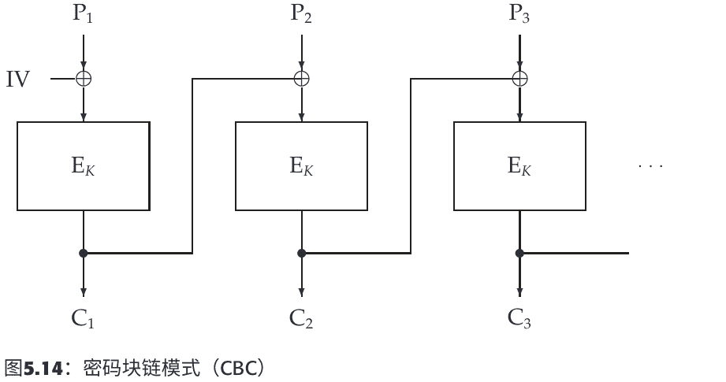

将IV写为初始化向量或种子，第 $i$ 个密钥流块将被给出：

$$K_i = \{ \dots \{\{IV\}_K\}_K \dots \text{ 总共 } i \text{ 次 } \}$$

这是将分组密码转换为流密码的一种标准方法。密钥 $K$ 被扩展为一长串密钥流 $K_i$。密钥流通常与消息块 $M_i$ 使用异或运算组合，得到密文 $C_i = M_i \oplus K_i$；这种安排有时被称为加法流密码，因为异或运算就是模2的加法（一些旧的手动系统使用模26的加法）。

所有加法流密码都存在一个重要的漏洞：它们无法保护消息的完整性。我在5.2.2节中提到过这一点，但重要的是要意识到，这不仅影响“完全安全”的系统，也影响“现实生活”中的流密码。例如，假设使用流密码来加密资金转账消息。

这些消息具有非常高的结构化；例如，您可能知道字节37-42包含转账金额。然后，您可以进行以下攻击。例如，您可以通过窃听使本地银行的数据流量经过您的计算机。您进入银行并向伙计发送一笔适度的金额（例如500美元）。密文 $C_i = M_i \oplus K_i$，准确地到达您的计算机。您知道字节37-42的 $M_i$，因此您知道 $K_i$ 并且可以轻松构造一个修改后的消息，指示接收银行支付的不是500美元，而是500,000美元！这是一种深度攻击的示例；这不仅是一次性密码提供的完全保密性的代价，也是更加普通的流密码的代价。

### 5.5.4 计数器加密

块密码加密的反馈模式的一个可能的缺点是延迟：反馈模式很难并行化。使用CBC，必须在每个块输入和块输出之间计算整个密码块；使用OFB，我们可以预先计算密钥流，但存储它需要内存。这在非常高速的应用中可能不方便，比如保护千兆骨干链路上的流量。在那种情况下，硅片很便宜，我们宁愿将加密芯片进行流水线处理，以便在尽可能少的时钟周期内加密一个新的块（或生成一个新的密钥流块）。

最简单的解决方案通常是通过加密计数器来生成密钥流：$K_i = \{IV + i\}_K$。与之前一样，然后将其与明文相加以获得密文（因此也容易受到深度攻击）。

当在非常高速的链路上使用64位块密码（如三重DES）时，这种模式解决了循环长度的问题。在OFB模式下，一个 $n$ 位块密码通常具有 $2^{n/2}$ 个块的循环长度，之后生日定理将导致密钥流开始重复。（一旦我们拥有超过 $2^{32}$ 个64位值，很可能会出现两个值匹配的情况。）

CBC模式，根据生日定理，在大约 $2^{n/2}$ 个块之后，我们将开始看到重复。然而，计数器模式加密有一个保证的循环长度为 $2^n$ 而不是 $2^{n/2}$。

### 5.5.5 密码反馈

密码反馈，或CFB模式，是另一种流密码。它被设计成自同步的，即使我们遇到突发错误并丢失一些位，系统也会在一个块长度后恢复同步。这是通过使用我们的分组密码加密最后 $n$ 位的密文，并将其中一个输出位添加到下一个明文位来实现的。在解密时，在图5.15中从右侧输入密文进行相反的操作。因此，即便我们遇到突发错误并丢失一些位，一旦我们接收到足够的密文位来填满移位寄存器，系统将重新同步。

密码反馈不再被广泛使用。它是为了在容易受到衰落影响的军用HF无线电链路中使用而设计的，在数字电子设备相对昂贵的时代。现在硅变得便宜，人们使用专用的链路层协议来进行同步和错误纠正，而不是尝试将它们与密码学结合在一起。

### 5.5.6 消息认证码

块密码的下一个官方操作模式不用于加密数据，而是用于保护其完整性和真实性。这是消息认证码（MAC）。使用块密码计算消息的MAC时，我们使用CBC模式对其进行加密，并丢弃除最后一个块之外的所有输出密文块；这个最后一个块就是MAC。（中间结果保密，以防止拼接攻击。）

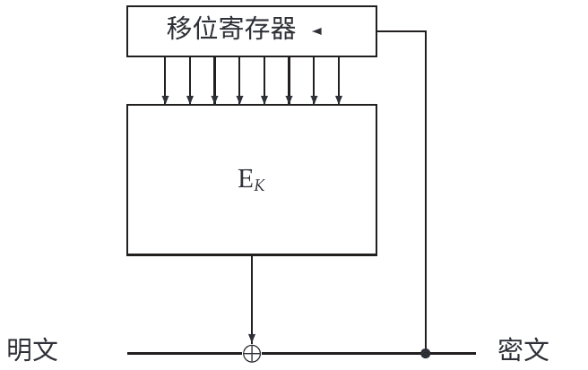

图5.15：密文反馈模式（CFB）

这种构造使得MAC依赖于所有明文块以及密钥。只要消息长度固定，它就是安全的；Mihir Bellare、Joe Kilian和Philip Rogaway证明，在这种情况下对MAC的任何攻击都会导致对底层块密码的攻击[147]。

如果消息长度可变，您必须确保在一个字符串上计算的MAC不能用作在另一个字符串上计算MAC的IV，这样对手就不能通过获取两个字符串的组合的MAC来作弊。为了解决这个问题，NIST已经标准化了CMAC，在最后一个加密之前对密钥的变体进行异或操作[945]。（CMAC基于Tetsu Iwata和Kaoru Kurosawa的提议[649]。）还有其他可能的MAC构造：常见的一种是使用带有密钥的哈希函数，在第5.6.2节中我们将更详细地讨论它。

### 5.5.7 组合操作模式

在需要完整性和隐私的应用程序中，标准过程是先使用一把密钥对消息进行MAC计算，然后使用另一把密钥进行CBC加密。（如果加密和认证使用相同的密钥，则后者的安全性不再得到保证；仍然可能发生剪切和拼接攻击。）

最近，NIST已经研究了另外两种结合加密和认证的操作模式。第一种是CCM，它将计数器模式加密与CBC-MAC认证结合起来。需要注意的危险是加密中使用的计数器值不能与MAC中使用的初始化向量相重叠；标准要求格式化函数防止这种情况发生[946]。

第二种组合模式是Galois计数器模式（GCM），该模式在撰写本书时（2007年）刚刚获得批准。这种有趣而创新的模式旨在并行化，以在快速数据链路上提供高吞吐量、低成本和低延迟。由于实现相对复杂，并且该算法在本书最终编辑时才获得批准，因此我不在此处提供详细信息，而是建议您参考官方规范[947]。简而言之，加密是在计数器模式的变体中进行的；生成的密文还与密钥材料和消息长度信息在 $2^{128}$ 次方的Galois域中进行乘法运算，以获得认证标签。因此，输出是与明文相同长度的密文，加上通常为128位的标签。标签计算使用了来自无条件安全认证码理论的通用哈希函数；我将在第13章“核心指挥与控制”中描述这一过程。

CCM和老式的CBC加上CBC-MAC，如果消息中的任何位发生变化，都需要计算一个全新的MAC。然而，GCM工作模式具有一个有趣的增量特性：可以通过改变的位数来计算新的认证器和密文，所需的工作量与改变的位数成比例。GCM是思科公司的David McGrew和John Viega发明的；他们的目标是创建一个高度可并行化的认证加密模式，用于高性能网络硬件，并且每个明文块只使用一个块密码操作，而不像CCM或老式的CBC加上CBC-MAC [862]。现在GCM已经成为标准，我们可以预期它将成为加密大容量内容的最常见的工作模式。

## 5.6 哈希函数

在第5.4.3.1节中，我展示了如何利用Luby-Rackoff定理从哈希函数构造块密码。也可以从块密码构造哈希函数。（事实上，我们还可以从流密码构造哈希函数和块密码 —— 因此，根据下一节中我将讨论的一些注意事项，给定这三个原语中的任何一个，我们可以构造另外两个。）

关键是将消息块逐个输入到我们的分组密码的密钥输入中，并用它来更新哈希值（初始值为 $H_0 = 0$）。为了使这个操作不可逆，我们添加了反馈：第 ($i-1$) 个哈希值与第 $i$ 轮的输出进行异或运算。这是我们分组密码的最终工作模式（图5.16）。

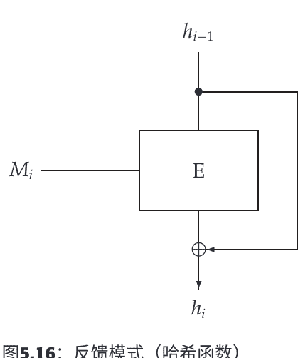

### 5.6.1 底层密码的额外要求

生日效应在这里再次出现，如果使用一个 $n$ 位分组密码构建一个哈希函数 $h$，那么可能找到两个消息 $M_1 \neq M_2$ 使得 $h(M_1) = h(M_2)$，其复杂度约为 $2^{n/2}$（略多于这么多消息 $M_i$ 并寻找匹配）。因此，64位分组密码是不够的，因为伪造一条消息的成本将达到 $2^{32}$ 条消息的数量，这是相当实际的。128位的AES密码可能刚刚够用，事实上，下一代DVD中使用的AACS内容保护机制使用了从AES派生的哈希函数“AES-H”。

生日限制不是哈希函数模式对底层分组密码要求更高的唯一方式，例如为了保密性而设计的CBC模式。一个很好的例子来自一个名为Treyfer的密码，它被设计用于在消费电子产品和家用电器中常见的8051微控制器中尽可能少地使用内存进行数据加密[1371]。（它只需要30字节的ROM。）Treyfer通过使用ROM中的256字节来“回收”其S盒，这些字节可以是代码，甚至可以是版权信息，以增加商业克隆的风险。在每一轮中，它通过将一个字节的文本与一个字节的密钥相加，通过S盒，将其加到下一个字节中，然后将结果向左旋转一位来处理八个字节的文本和八个字节的密钥（参见图5.17）。这种旋转处理了S盒在其位平面上可能出现的不均匀随机性的一些问题（例如，如果它包含ASCII文本，版权信息）。最后，该算法通过具有大量轮次（32）来弥补其简单的轮结构和可能不理想的S盒。

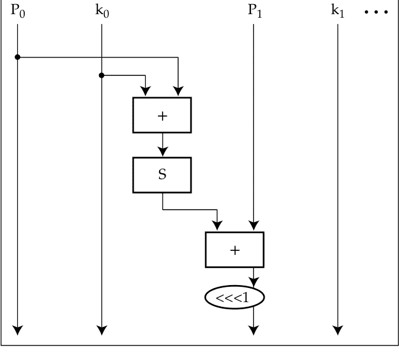

图5.17: Treyfer分组密码的基本组件

目前尚未发现针对Treyfer的攻击，因此可以用于保密性和计算MAC。然而，该算法存在一个弱点，不能用于哈希函数。它容易受到固定点攻击。给定任何输入，我们有很大的机会找到一个可以使输入保持不变的密钥。我们只需查看，对于每个输入字节，S盒是否假设输出，当添加到右边的字节时，会使其向右旋转一位。如果每个输入字节都存在这样的输出，那么很容易选择密钥值，在一轮后，数据保持不变，因此在32轮后也保持不变。我们能够做到这一点，概率取决于S盒³。这意味着如果Treyfer用作哈希函数，我们可以很容易地找到碰撞。实际上，哈希函数必须基于能够抵御选择密钥攻击的分组密码。

### 5.6.2 常见哈希函数及应用

类似Treyfer的算法已经在一些付费电视系统的密钥管理协议中用于哈希函数，但通常会进行修改以防止固定点攻击，例如在每一轮中添加轮数，或以某种方式混淆密钥的位（一个密钥调度算法）。

最常用的哈希函数都存在密码学上的问题。它们基于一个512位密钥和128位或160位的块大小的分组密码的变种：

- MD4有三轮和一个128位哈希值，在1998年发现了它的碰撞[394]；
- MD5有四轮和一个128位哈希值，在2004年发现了它的碰撞[1315, 1317]；
- 美国安全哈希标准（SHA-1）有五轮和一个160位哈希值，在2005年证明可以在计算复杂度为 $2^{69}$ 步而不是希望的 $2^{80}$ 步的情况下找到碰撞[1316]。

这些哈希函数的分组密码底层结构相似：它们的轮函数是32位处理器上可用的寄存器操作的复杂混合[1125]。

> ³ 有趣的是，一个置换的S盒总是容易受到攻击，而随机选择的一个则不那么糟糕。在许多密码设计中，置换的S盒是不可少的或至少是理想的。Treyfer是一个例外。

MD5在2004年被王小云和她的同事破解[1315, 1317]；现在可以轻松找到碰撞，即使在包含有意义的文本并遵循数字证书等消息格式的字符串之间也是如此。

王小云在随后的一年严重损害了SHA，提供了一种只需 $2^{69}$ 步就能找到碰撞的算法[1316]；在2007年的密码学会议上，人们认为找到碰撞的成本应该约为 $2^{60}$。志愿者正在为这项任务招募。所以看起来很快就会找到碰撞，SHA-1将被宣布为“破解”。

在撰写本文时，美国国家标准与技术研究院（NIST）建议人们使用扩展块大小版本的SHA，例如SHA-256或SHA-512。草案FIPS 180-3允许使用原始的SHA，但不鼓励使用；它规定了SHA-256和SHA-512，并且还支持从SHA-256和SHA-512派生的224位和384位哈希，通过改变初始值 and 截断输出来实现。NSA在其密码算法套件B中指定使用SHA-256或SHA-384与AES一起进行国防用途。NIST还组织了一场比赛，以寻找替代的哈希函数族[949]。

一个需要数月时间在数百台机器上进行工作（或在一个大型僵尸网络上几天）的碰撞搜索算法是否会对任何给定的应用程序构成风险是一个复杂的问题。如果银行系统实际上接受客户发送的消息“支付 X 金额 Y”，对其进行哈希并签名，那么一个弱哈希函数确实可能被利用：一个坏人可以找到两条消息“支付 X 金额 Y”和“支付 X 金额 Z”，它们的哈希值相同，获取其中一条签名，并将其与另一条交换。但是银行系统并不是这样工作的。它们通常在实际交易中使用MAC而不是数字签名，在公钥证书中仅依赖于签名来引导密钥管理协议；而且由受信任的CA使用相当受限的算法生成公钥证书，因此没有机会插入一对碰撞文本。相反，你需要找到与外部给定目标值发生碰撞的情况，这是一个更困难的密码分析任务。

哈希函数有很多用途。其中之一是计算MAC。一个天真的方法是简单地使用密钥对消息进行哈希：$MAC_k(M) = h(k, M)$。

然而，被接受的做法，称为HMAC，使用了额外的步骤在这个计算的结果再次被哈希。这两个哈希操作使用与两个不同常量进行异或运算得到的密钥的变体来完成。A是通过重复字节 0x36 直到必要的次数构建的，而 B 则类似从字节 0x5C 构建。假设存在一个可能比较薄弱的哈希函数，这样做被认为会使可利用的碰撞更难找到[741]。HMAC现在是FIPS 198，被FIPS 198-1取代。

哈希函数的另一个用途是制作稍后要公开的承诺。例如，我可能希望为数字文档添加时间戳，以确立知识产权优先权，但不公开内容。在这种情况下，我可以将文档的哈希提交给商业时间戳服务[572]。稍后，当我公开文档时，其哈希在给定时间戳的情况下可以证明我在那时就已经编写了它。再次，生成碰撞对的算法并不会破坏这一点，因为在进行时间戳时必须拥有这对碰撞。我想，工程师应该明确一个给定应用程序是否需要具有强碰撞抗性的哈希函数。

即使可能只有少数应用程序能够使坏人今天能够窃取真正的货币，但潜在的漏洞的存在仍然可能削弱系统的价值。2005年，澳大利亚悉尼的一名司机被指控超速，但新南威尔士道路和交通管理局未能找到专家证明MD5是安全的，因此司机被无罪释放。法官“无法超出合理怀疑的范围相信照片在拍摄后没有被篡改”，因此无罪释放了这名司机；这一判决在随后的上诉中得到了维持[964]。因此，即使漏洞不构成工程威胁，它仍然可能构成非常真实的认证威胁。

最后，在我们继续讨论非对称加密之前，有两个特定的哈希函数用途需要提及：密钥更新和自动密钥生成。

密钥更新意味着共享密钥的两个或多个主体在约定的时间通过单向哈希函数传递它：$K_i = h(K_{i-1})$。关键是，如果攻击者入侵了其中一个系统并窃取了密钥，他只能获得当前密钥，并且无法解密传输的数据。哈希函数的单向性打破了威胁链。这个属性也被称为向后安全。

自动密钥生成意味着共享密钥的两个或多个主体在约定的时间使用它们自上次密钥更改以来交换的消息进行哈希：$K_{i+1} = h(K_i, M_{i1}, M_{i2}, \dots)$。关键是，如果攻击者入侵了其中一个系统并窃取了密钥，那么一旦他们交换了一个他无法观察或猜测的消息，安全性将得到恢复，因为他无法再解密他们的数据。再次，威胁链打破。这个属性被称为向前安全。例如，在澳大利亚的EFT支付终端中使用了它[143, 145]。使用非对称加密允许一种稍强的向前安全形式，即一旦一个受损的终端与一个未受损的终端交换了一个对手无法控制的消息，安全性就可以恢复，即使该消息是明文可见的。接下来，我将描述这个技巧是如何工作的。

## 5.7 非对称密码原语

非对称密码学中常用的构建模块是公钥加密和数字签名，它们基于数论。在这里，我只会简要概述，并在第二部分中更详细地讨论一些机制。（如果你觉得描述假设了太多数学知识，我建议你跳过接下来的两节，从密码学教材中阅读相关材料。）

该技术的关键是将密码的安全性与解决某个数学问题的难度相关联。几乎所有实际系统中使用的两个问题是因子分解（用于大多数商业系统）和离散对数（用于许多政府系统）。

### 基于因子分解的密码学

质数是没有真因子的正整数；也就是说，只有1和这个数本身能够整除质数。根据定义，1不是质数；所以质数是 {2, 3, 5, 7, 11, ...}。算术基本定理表明，每个大于1的自然数都可以唯一地分解为质数的乘积，乘积的顺序不同。找到质数并将它们相乘得到一个合数很容易，但是将一个合数分解为其因子则更加困难。迄今为止，最大的由两个大随机质数相乘得到的合数是 RSA-200，一个663位二进制数（200位十进制数），于2005年分解。

这个因式分解是在多台计算机上完成的，相当于在一台 2.2GHz 的机器上工作了75年。可能会秘密地进行因式分解，也许使用僵尸网络；在2001年，当时的技术水平是分解512位二进制数，西蒙·辛格（Simon Singh）在他的《密码书》中提出了这样一个挑战，并由五名瑞典学生使用几百台计算机解决了这个问题 [24]。到2007年，512位的因式分解已经进入了主流商业。从2003年开始，Intuit 用强加密保护其 Quicken 文件，但留下了一个基于 512 位 RSA 密钥的后门，以便他们可以提供密钥恢复服务。Elcomsoft 似乎已经分解了这个密钥，现在提供了一种竞争性的恢复产品。

据信，分解 1024 位 RSA 模数需要一台特殊的机器，成本在 1000 万至 5000 万美元之间，并且每个因式分解需要一年的时间 [781]；但我没有听说有人认真计划建造这样一台机器。许多物理学家希望能够建造一台量子计算机，以便轻松地分解大数。因此，鉴于摩尔定律正在放缓，量子计算机尚未出现，我们可以总结现有技术的状态如下：两个随机质数的 1024 位乘积很难分解，而依赖于这种乘积的加密系统它们不会立即受到低至中等预算攻击者的威胁；NIST 预计它们在 2010 年之前是安全的，而根据因子分解记录的历史推断，第一个 1024 位的因子分解将在 2018 年发布。因此，那些希望密钥在很多年内保持安全的风险规避组织已经开始使用 2048 位数。

用于基于因子分解的公钥加密和数字签名的常用算法是 RSA，以其发明者 Ron Rivest、Adi Shamir 和 Len Adleman 命名。它使用费马小定理，该定理表明对于所有不整除 $a$ 的素数 $p$，$a^{(p-1)} \equiv 1 \pmod p$（证明：取集合 $\{1, 2, ... , p-1\}$，然后对每个元素与 $a$ 模 $p$ 进行乘法运算，然后两边消去 $(p-1)!$）。欧拉函数 $\phi(n)$ 是小于 $n$ 且与 $n$ 互质的正整数的数量；因此，如果 $n$ 是两个素数 $pq$ 的乘积，则 $\phi(n)=(p-1)(q-1)$（证明类似）。

加密密钥是一个难以分解的模数 $N$（取 $N = pq$，其中 $p$ 和 $q$ 是两个随机选择的大素数，每个素数都有 1024 位），再加上一个与 $p-1$ 或 $q-1$ 没有公因数的公共指数 $e$。私钥是保密的因子 $p$ 和 $q$。其中 $M$ 是消息，$C$ 是密文，加密定义为：

$$C \equiv M^e \pmod N$$

解密是相反的操作：

$$M \equiv \sqrt[e]{C} \pmod N$$

知道私钥——$N$ 的因子 $p$ 和 $q$——的人可以轻松计算出 $e$ 次方根。由于 $\phi(N) = (p-1)(q-1)$ 且 $e$ 与 $\phi(N)$ 没有公因数，密钥的所有者可以找到一个数 $d$，使得 $de \equiv 1 \pmod{\phi(N)}$ ——她分别在 $p-1$ 和 $q-1$ 模下找到 $d$ 的值，并将答案组合起来。

$\sqrt[e]{C} \pmod N$ 现在被计算为 $C^d \pmod N$，而解密是有效的，因为根据费马/欧拉定理：

$$C^d \equiv (M^e)^d \equiv M^{k\phi(N)+1} \equiv M \pmod N$$

同样地，私钥的所有者可以使用它对消息进行操作，从而生成一个签名：

$$Sig_d(M) \equiv M^d \pmod N$$

并且这个签名可以通过将其提升到 $e \pmod N$ 的幂（因此，使用 $e$ 和 $N$ 作为公共签名验证密钥）并检查恢复的消息 $M$ 进行验证：

$$M \equiv (Sig_d(M))^e \pmod N$$

RSA 加密和签名都不能单独使用，原因是加密是一个代数过程，它保留了某些代数属性。例如，如果我们有一个关系，如 $M_1M_2 = M_3$，在明文中成立的关系也会在密文中成立 $C_1C_2 = C_3$ 和签名 $Sig_1Sig_2 = Sig_3$。这个属性被称为乘法同态性；同态性是一种保留某种数学结构的函数。RSA 的同态性意味着它不符合公钥加密或签名的随机预言机模型定义。

公钥加密的另一个问题是，如果明文来自一个小集合，比如“攻击”或“撤退”，并且对手知道加密过程，那么他可以预先计算可能的密文，并在出现时识别它们。具体的算法也有具体的漏洞：对于 RSA，使用小指数 $e$ 来加密相同的消息发送给多个接收者是危险的，因为这可能导致代数攻击。为了防止猜测攻击、低指数攻击和基于同态性的攻击，合理地在加密之前在明文块中添加一些随机性和冗余性是明智的。然而，有好的方法和坏的方法来做这件事。

事实上，密码学理论家们已经苦苦思索了几十年，分析了所有可能出现问题的地方，以及整理它的方法。Shafi Goldwasser 和 Silvio Micali 提出了概率加密的形式模型，其中我们在加密过程中添加了随机性，以及语义安全性，这意味着攻击者无法获取任何关于明文 $M$ 的信息，即使他被允许请求解密任何其他不等于 $C$ 的密文 $C'$ [536]。有许多构造可以提供可证明的语义安全性，但它们往往对实际使用来说过于笨重。

常见的现实解决方案是最优非对称加密填充（OAEP），我们将消息 $M$ 与随机的 nonce $N$ 连接起来，并使用哈希函数 $h$ 将它们组合起来：

$$C_1 = M \oplus h(N)$$
$$C_2 = N \oplus h(C_1)$$

实际上，这是一个使用 $h$ 作为其轮函数的两轮费斯特尔（Feistel）密码。然后，将结果 $C_1, C_2$ 进行 RSA 加密并发送。接收者然后计算 $N$ 为 $C_2 \oplus h(C_1)$，并恢复 $M$ 为 $C_1 \oplus h(N)$ [148]。（这个构造带有一个安全证明，但随后发现了一个错误 [1167, 234]，引发了关于安全工程中数学证明价值的激烈辩论 [724]。）RSA 数据安全公司多年来一直授权 RSA 算法，开发了许多公钥密码学标准；PKCS #1 描述了 OAEP [672]。

对于签名，情况稍微简单一些。通常情况下，在应用私钥之前，只需对消息进行哈希处理即可：$Sig_d = [h(M)]^d \pmod N$；PKCS #7 描述了签署消息的简单机制。然而，在某些应用中，人们可能希望在签名块中包含更多的数据，例如时间戳，或者一些随机性，以使侧信道攻击更加困难。

许多实际实现中出现问题的原因与错误处理有关。一些错误可能直接影响加密机制。最引人注目的例子是当 Daniel Bleichenbacher 通过向受害者发送适当选择的密文并观察任何导致的错误消息来破解 SSL v3.0 中的 RSA 实现时。如果他能从目标那里了解到一个给定的 $c$，当解密为 $c^d \pmod n$ 时，是否对应于 PKCS #1 消息，那么他可以使用这个来解密或签名消息 [189]。其他攻击依赖于测量解密所需的精确时间；我将在关于发射安全性的章节中讨论这些攻击。还有一些涉及堆栈溢出的攻击，无论是通过将攻击代码作为密钥发送，还是作为实施不良的标准中的填充发送。不要假设对您的加密代码的唯一攻击是进行密码分析。

### 5.7.2 基于离散对数的密码学

虽然 RSA 在大多数 Web 浏览器中用于 SSL 协议，在用于远程登录计算机系统的 SSH 协议中也有使用，但还有其他产品和许多政府系统是基于离散对数进行公钥操作的。这些有多种不同的类型，有些使用“正常”的算术，而其他一些使用称为椭圆曲线的数学结构。我将解释正常情况。椭圆变种使用基本相同的思想，但实现更加复杂。

对于模 $p$，一个原根是一个其幂生成所有非零数的数；例如，在模 7 的情况下，我们发现 5 的平方等于 25，模 7 等于 4。然后我们可以计算 5 的立方为 5 的平方乘以 5 或者 4 乘以 5，得到 20，然后再对 7 取模，得到 6，依此类推，如图 5.18 所示：

| $x$ | $5^x \pmod 7$ |
| :--- | :--- |
| 1 | 5 |
| 2 | 4 |
| 3 | 6 |
| 4 | 2 |
| 5 | 3 |
| 6 | 1 |

因此，5 是模 7 的一个原根。这意味着对于任意的 $y$，我们总能解方程 $y \equiv 5^x \pmod 7$；$x$ 被称为模 7 的离散对数。像这样的小例子可以通过观察来解决，但对于一个大的随机素数 $p$，我们不知道如何进行这样的计算。

因此，映射 $f: x \to g^x \pmod p$ 是一个单向函数，另外还具有 $f(x+y)=f(x)f(y)$ 和 $f(nx)=f(x)^n$ 的性质。换句话说，它是一个单向同态。因此，它可以用于构建数字签名和公钥加密算法。

#### 5.7.2.1 公钥加密 – 迪菲-赫尔曼和埃尔加马尔

为了理解离散对数如何用于构建公钥加密算法，要记住我们希望一个加密系统不需要用户从一开始就共享一个秘密密钥。考虑以下“经典”场景。

> 假设安东尼想要将一个秘密发送给布鲁图斯，而唯一可用的通信渠道是一个不可信任的信使（比如，属于凯撒的奴隶）。安东尼可以将消息放入一个盒子中，加上挂锁，然后让信使将其送到布鲁图斯那里。布鲁图斯可以再加上自己的挂锁，然后让其送回给安东尼。安东尼再移除自己的挂锁，然后让其送回给布鲁图斯，布鲁图斯最终打开盒子。使用一个适当的可交换的加密函数也可以完成同样的操作，即 $\{\{M\}_{KA}\}_{KB} = \{\{M\}_{KB}\}_{KA}$。爱丽丝可以将消息 $M$ 用她的密钥 $KA$ 加密，得到 $\{M\}_{KA}$，然后发送给鲍勃。鲍勃再用他的密钥 $KB$ 再次加密，得到 $\{\{M\}_{KA}\}_{KB}$。但是可交换性质意味着这只是 $\{\{M\}_{KB}\}_{KA}$，所以爱丽丝可以用她的密钥 $KA$ 解密，得到 $\{M\}_{KB}$。她将这个消息发送给鲍勃，他可以用 $KB$ 解密，最终恢复出消息 $M$。如果这个机制被用作传统的公钥加密系统，密钥 $KA$ 和 $KB$ 可能是长期密钥，或者如果目标是建立具有前向保密性的密钥，则可能是短暂密钥。

如何实现适合的可交换加密？一次性密码确实可交换，但在这里不适用。假设 Alice 选择一个随机密钥 $xA$ 并发送给 Bob $M \oplus xA$，而 Bob 返回 $M \oplus xA \oplus xB$，然后 Alice 最终发送给他 $M \oplus xB$，那么攻击者可以简单地将这三个消息进行异或；因为对于所有的 $X$，$X \oplus X = 0$，所以 $xA$ 和 $xB$ 的两个值都会相互抵消，最后得到明文 $M$ 作为答案。

离散对数问题拯救了我们。如果基于原根 $p$ 的离散对数问题很难，那么我们可以使用离散指数作为我们的加密函数。例如，Alice 将她的消息编码为原根 $g$，选择一个随机数 $xA$，计算 $g^{xA} \pmod p$ 并发送给 Bob。Bob 同样选择一个随机数 $xB$ 并形成 $g^{xAxB} \pmod p$，然后传回给 Alice。Alice 现在可以去除她的指数：使用费马定理，她可以计算 $g^{xB} = (g^{xAxB})^{(p-xA)} \pmod p$ 并发送给 Bob。Bob 现在也可以去除他的指数，最终得到 $g$。这个方案的安全性取决于离散对数问题的难度。在实践中，将消息编码为原根是棘手的；但是有一种更简单的方法来实现相同的效果。

第一个公钥加密方案是由 Whitfield Diffie 和 Martin Hellman 于 1976 年发表的，它具有固定的原根 $g$，并使用 $g^{x_A x_B} \pmod p$ 作为共享密钥加密系统的密钥。值 $x_A$ 和 $x_B$ 可以是两个参与方的私钥。

让我们看看这如何提供公钥加密系统。素数 $p$ 和生成元 $g$ 对所有用户都是相同的。Alice 选择一个秘密随机数 $x_A$，计算 $A = g^{x_A} \pmod p$ 并在公司电话簿中与她的名字相对应地发布。Bob 也是这样做的，选择一个随机数 $x_B$ 并发布 $B = g^{x_B} \pmod p$。为了与 Bob 通信，Alice 从电话簿中获取 $B$，形成 $B^{x_A} \equiv g^{x_A x_B} \pmod p$，并使用它来加密发给 Bob 的消息。收到消息后，Bob 查找 Alice 的公钥 $A$ 并形成 $A^{x_B} \equiv g^{x_A x_B} \pmod p$，因此他可以解密她的消息。

需要稍微多做一些工作才能提供完整的解决方案。在选择参数 $p$ 和 $g$ 时需要小心；还有一些其他细节取决于我们是否需要前向安全性等属性。

Diffie-Hellman 主题的变体包括美国政府的密钥交换算法 (KEA) [939]，用于网络安全产品，如 Fortezza 卡，以及所谓的 Royal Holloway 协议，该协议由英国政府使用 [76]。

当然，公钥系统的一个大问题是如何确保你拥有的是电话簿的真正副本，并且你感兴趣的条目没有过时。我将在第 5.7.5 节中讨论这个问题。

#### 5.7.2.2 密钥建立

在这种协议中提供前向安全性的机制是独立的兴趣点，与之前一样，让素数 $p$ 和生成元 $g$ 对所有用户都是共同的。Alice 选择一个随机数 $R_A$，计算 $g^{R_A}$ 并将其发送给Bob；Bob 也做同样的事情，选择一个随机数 $R_B$ 并发送 $g^{R_B}$ 给 Alice；然后他们都形成 $g^{R_A R_B}$，这将作为一个会话密钥使用（图 5.19）。

- $A \to B: g^{R_A} \pmod p$
- $B \to A: g^{R_B} \pmod p$
- $A \to B: \{M\}_{g^{R_A R_B}}$

图 5.19: 迪菲-赫尔曼密钥交换协议

Alice 和 Bob 现在可以使用会话密钥 $g^{R_A R_B}$ 来加密对话。他们成功地从无中创造了一个共享的秘密。即使对手在此协议开始之前已经完全访问了他们两台机器，并且知道了他们所有存储的私钥，只要满足一些基本条件（例如，他们的随机数生成器是不可预测的），对手仍然无法窃听他们的通信。这是我在第 5.6.2 节中提到的前向安全性属性的强版本。对手无法从之前获得的密钥知识中向前推导。只要 Alice 和 Bob 在使用后销毁共享的秘密，他们还将具有后向安全性：随后获得他们设备访问权限的对手无法向后推导以破解他们的旧通信。

但是这个协议有一个小问题：尽管 Alice 和 Bob 最终获得了一个会话密钥，但他们都不知道他们与谁共享它。

假设在我们的挂锁协议中，凯撒刚刚命令他的奴隶把盒子带给他，并在安东尼旁边放上自己的挂锁。奴隶把盒子带回给安东尼，安东尼拆开他的挂锁，然后把盒子带回给凯撒，凯撒打开它。凯撒甚至可以运行两个协议实例，假议对安东尼说他是布鲁图斯，对布鲁图斯说他是安东尼。一个修复方法是让安东尼和布鲁图斯在他们的锁上加上他们的印章。

使用传统的迪菲-赫尔曼协议，相同的思路会导致中间人攻击。查理截取了 Alice 发给 Bob 的消息并回复了它；与此同时，他假装是 Alice 与 Bob 发起了密钥交换。他最终获得了一个密钥 $g^{R_A R_C}$，与 Alice 共享，以及另一个密钥 $g^{R_B R_C}$，与 Bob 共享。只要他继续坐在网络中间并在他们之间传递消息，他们可能很难察觉到他们的通信被破坏了。通常的解决方法是对临时密钥进行认证，有各种可能性。

在一个安全电话产品中，两个主要人物会朗读出他们生成的密钥的八位数哈希值，并在开始讨论机密事项之前检查它们是否相同。一个更一般的解决方案是，艾丽斯和鲍勃对彼此发送的消息进行签名。

还有一些其他细节需要正确处理，比如适当选择的值 $p$ 和 $g$。这背后涉及一些复杂的数学知识，最好由专家来处理。在实现中也有很多可能出错的地方，例如会生成或接受非常弱的密钥的软件，从而只给出保护的表面；需要花费很长时间解密而泄露密钥的程序；以及导致堆栈溢出和其他问题的软件漏洞。非专业人士实施公钥加密应该参考最新的标准文件和/或使用经过认证的工具包。

#### 5.7.2.3 数字签名

假设基数 $p$ 和生成器 $g$ 是以某种适当的方式选择的公共值，并且每个希望签署消息的用户都有一个私有签名密钥 $X$ 和一个公共签名验证密钥 $Y = g^X \pmod p$。一个 ElGamal 签名方案的工作原理如下。随机选择一个消息密钥 $k$，并形成 $r = g^k \pmod p$。现在使用 $k$、$r$、消息 $M$ 和私有密钥 $X$ 的线性方程形成签名 $s$。有许多方程可以实现这一点；在 ElGamal 签名中使用的是特定的方程：

$$rX + sk \equiv M \pmod{\phi(p)}$$

因此，$s$ 计算为 $s = (M - rX)k^{-1} \pmod{\phi(p)}$。当两边通过我们的单向同态映射 $f(x) = g^x \pmod p$ 时，我们得到：

$$g^{rX}g^{sk} \equiv g^M \pmod p$$

或

$$Y^r r^s \equiv g^M \pmod p$$

对于消息 $M$ 的 ElGamal 签名由值 $r$ 和 $s$ 组成，并且接收者可以使用上述方程验证它。

需要修正一些细节才能得到一个功能完善的数字签名方案。与之前一样，选择不当的 $p$ 和 $g$ 可能会削弱算法。我们还希望使用哈希函数对消息 $M$ 进行哈希，以便我们可以对任意长度的消息进行签名，并且对手不能使用算法的代数结构来伪造从未签名的消息的签名。

在处理这些细节并应用一两个优化后，我们得到了数字签名算法 (DSA)，它是美国的标准并广泛应用于政府应用中。

DSA（也称为 DSS，即数字签名标准）假设一个素数 $p$ 通常为 1024 位，一个素数 $q$ 为 160 位，可以整除 $(p - 1)$，一个在整数模 $p$ 中的阶为 $q$ 的元素 $g$，一个秘密签名密钥 $x$ 和一个公共验证密钥 $y = g^x \pmod p$。消息 $M$ 的签名 $Sig_x(M)$ 为 $(r, s)$，其中：

$$r \equiv (g^k \pmod p) \pmod q$$
$$s \equiv (h(M) + xr)k^{-1} \pmod q$$

这里使用的哈希函数是 SHA-1。

DSA 是一个经典的随机化数字签名方案，没有消息恢复功能。随着计算机速度的提高，标准发生了一些变化，用于分解大数的算法变种也可以用于计算类似大小的离散对数模基数。最初的质数 $p$ 可以在 512-1024 位范围内，但在 2001 年改为 1023-1024 位 [941]；提议的第三代标准将允许质数 $p$ 在 1024-3072 位范围内，$q$ 在 160-256 位范围内 [942]。在采用新的哈希函数标准之后，标准的进一步调整也是可以预见的。

### 5.7.3 特殊目的原语

研究人员发现了大量具有特殊属性的公钥和签名原语。迄今为止在实际产品中出现的两种是门限密码学和盲签名。

门限密码学是一种机制，可以将签名密钥或解密密钥分割成 $n$ 个主体，以便任何 $k$ 个主体可以签署消息（或解密）。对于 $k=n$，构造很容易。例如，使用 RSA，您可以将私钥 $d$ 分割为 $d = d_1 + d_2 + \dots + d_n$。对于 $k < n$，它稍微复杂一些（但不多——您可以使用拉格朗日插值公式）[382]。

门限签名用于独立处理事务并独立对结果进行投票的系统；它们还可以用于实施业务规则，例如“七名董事中的任意两名可以签署支票”。

盲签名是一种在不知道消息内容的情况下对消息进行签名的方法。例如，如果我们使用 RSA，我可以取一个随机数 $R$，形成 $R^e M \pmod n$，然后将其交给签名者计算出 $(R^e M)^d = R \cdot M^d \pmod n$。当他把这个给我时，我可以除以 $R$ 得到签名 $M^d$。现在你可能会问为什么有人会想在不知道文件内容的情况下签署文件，但确实有应用场景。

第一个应用场景是在数字现金方面；银行可能希望能够向客户发行匿名支付令牌，这可以通过让银行在不知道其序列号的情况下签署“数字硬币”来实现。在这样的系统中，银行可能同意以 10 美元的价格承兑任何带有唯一序列号和指定冗余形式的字符串 $M$，该字符串带有使用公钥 $(e, n)$ 验证为正确的签名。盲签名协议展示了客户如何让银行在不知道其序列号的情况下签署硬币。其结果是数字现金对于支付者来说是匿名的。（当然还有一些需要解决的技术细节，比如如何检测花费同一硬币两次的人；但这些问题是可以解决的。）盲签名和数字现金是由 Chaum [285] 发明的，他还发明了许多其他支持数字隐私技术，我稍后会讨论 [284]。它们曾在荷兰的道路通行费和布鲁塞尔的电子钱包的试点项目中短暂使用，但由于专利问题以及银行和政府都不希望支付是匿名的，它们未能在更广泛的范围内推广：现在的反洗钱法规限制了匿名支付服务的金额。匿名数字凭证现在被讨论，例如，在“身份管理”方面：你 PC 主板上的 TPM 芯片可以证明关于你的某些信息（比如你的年龄），而不实际透露你的姓名。

研究人员继续提出专门公钥机制的新应用。一个受欢迎的候选者是在线选举，这需要特定的匿名和问责制的混合。选民希望确保他们的选票已被计算，但也希望他们不能向任何其他人证明他们的投票方式；如果他们可以，那么购买选票和恐吓变得更容易。

### 5.7.4 椭圆曲线密码学

最后，离散对数及其类似物存在于许多其他数学结构中；因此，例如椭圆曲线密码学使用离散对数在一个椭圆曲线上——一个由方程 $y^2 = x^3 + ax + b$ 给出的曲线。这些曲线具有一个特性，即您可以在其上定义一个加法操作并将其用于密码学；代数变得有些复杂而且像这样的一般书籍不适合详细介绍。然而，椭圆曲线密码系统有两个有趣之处。

首先，他们提供了一些熟悉的原语版本，如 Diffie-Hellman 密钥交换和数字签名算法，这些版本使用更少的计算，并且变量稍微更短；这两者在智能卡和嵌入式处理器等受限环境中都是受欢迎的。例如，椭圆曲线密码学在 Windows Media Player 的权限管理机制中被使用，并且已被 NSA 采用为国防系统中的标准。

其次，一些椭圆曲线具有双线性配对，Dan Boneh 和 Matt Franklin 使用这种配对构建了公钥是你的名字的加密系统。回顾一下，在 RSA 和 Diffie-Hellman 中，用户选择了私钥，然后计算出相应的公钥。在所谓的身份为基础的加密系统中，你选择你的身份，然后去中央机构获取与该身份对应的私钥。有一个全局公钥，任何人都可以用它来加密发给你的身份的消息；你可以使用你的私钥解密。早些时候，Adi Shamir发现了一种身份为基础的签名方案，允许你使用私钥对消息进行签名，以便任何人都可以根据你的名字验证签名。在这两种情况下，你的私钥是由中央机构使用仅自己知道的系统范围私钥计算出来的。身份为基础的原语可能对专用系统有一些有趣的影响，但在普通公钥和签名系统的背景下，它们实现了与公钥的认证相同的结果，接下来我将讨论这个问题。

### 5.7.5 认证

现在我们可以进行公钥加密和数字签名，我们需要一些机制来将用户与密钥绑定。Diffie 和 Hellman 在发明数字签名时提出的方法是拥有一个系统授权用户的公钥目录，就像电话簿一样。一个更常见的解决方案，由 Loren Kohnfelder 提出，是由一个认证机构（CA）对用户的公钥进行签名，以提供包含用户姓名、授权等属性以及公钥的证书。

CA 可以由本地系统管理员运行，也可以是 Verisign 等第三方服务，其业务是在对公钥进行一些尽职调查后对其进行签名，以确定它们是属于其中的主体。

一个证书可以用符号描述为：

$$C_A = Sig_{K_S}(T_S, L, A, K_A, V_A) \quad (5.1)$$

其中（使用与 Kerberos 相同的符号表示法）$T_S$ 是证书的起始日期和时间，$L$ 是其有效期，$A$ 是用户的名字，$K_A$ 是她的公共加密密钥，$V_A$ 是她的公共签名验证密钥。通过这种方式，只需以可信的方式向所有主体传递管理员的公共签名验证密钥。

证书是困难的，有很多原因。我将在后面讨论不同的方面——在第 6 章“分布式系统”中讨论命名，在第 21 章“网络攻击与防御”中讨论公钥基础设施，在第三部分中讨论策略方面。在这里，我只想指出，协议设计方面比看起来要困难得多。

最早提出的公钥协议之一是由多萝西·丹宁和乔瓦尼·萨科在 1982 年提出的，他们建议两个用户，比如爱丽丝和鲍勃，按照以下方式设置一个共享密钥 $K_{AB}$。当爱丽丝首次想要与鲍勃通信时，她去认证机构获取自己和鲍勃的当前公钥证书的副本。然后她制作一个包含时间戳 $T_A$、会话密钥 $K_{AB}$ 和签名的密钥数据包，她使用自己的私钥对这些项目进行计算得到签名。然后她使用鲍勃的公钥对整个数据包进行加密并发送给他。符号化表示如下：

$$A \rightarrow B: C_A, C_B, \{T_A, K_{AB}, Sig_{K_A}(T_A, K_{AB})\}_{K_B} \quad (5.2)$$

1994 年，马丁·阿巴迪和罗杰·尼德姆指出这个协议存在致命的缺陷 [2]。鲍勃收到这条消息后，只要爱丽丝的时间戳 $T_A$ 仍然有效，他就可以冒充爱丽丝！为了看到这一点，假设鲍勃想要冒充爱丽丝去找查理。他去找山姆获取一个新的查理的证书 $C_C$，然后剥离外部加密 $\{\dots\}_{K_B}$。

来自上述协议中的消息 3。他现在用查理的公钥重新加密签名密钥数据包 $T_A, K_{AB}, Sig_{K_A}(T_A, K_{AB})$ ——他从 $C$ 那里得到——并编造了一个虚假的消息 3：

$$B \rightarrow C : C_A, C_C, \{T_A, K_{AB}, Sig_{K_A}(T_A, K_{AB})\}_{K_C} \quad (5.3)$$

令人震惊的是，这样一个简单的协议——本质上是一行程序——居然有如此严重的缺陷长期未被发现。对于一个只有几行代码的普通程序，你可能会期望只需要花一两分钟看一下，就能在其中找到一个错误。事实上，公钥协议的设计比使用共享密钥加密的协议更加困难，因为它们容易受到微妙而恶意的中间人攻击。这进一步促使使用形式化方法来证明协议的正确性。

通常，参与者的姓名并不是认证机制需要建立的最重要的事情。在美国政府和国防承包商使用的 STU-III 安全电话中，有一个用于建立临时密钥的协议；为了排除中间人攻击，用户有一个加密点火钥匙，这是一个便携式电子设备，他们将其插入电话中，不仅可以识别他们的姓名，还可以识别他们的安全许可级别。一般来说，教科书倾向于将身份识别作为认证和密钥管理协议的主要目标；但在现实生活中，授权通常更重要。这更加复杂，因为它开始将对应用程序的假设引入到协议设计中。（实际上，NSA 安全手册强调始终要知道房间里是否有未经审批的人。STU-III 设计是将这一点扩展到电子通信的自然方式。）

依赖公钥证书的一个严重弱点是让用户理解所有相关含义并正确管理它们的困难，特别是在它们不熟悉的手动控制系统的精确重新实现时 [357]。在系统工程层面上，认证可能出现许多其他问题，我将在下一章开始讨论。

### 5.7.6 非对称加密算法的强度

为了提供与对称分组密码相同级别的保护，非对称加密算法通常需要至少两倍的分组长度。椭圆曲线系统似乎达到了这个界限；一个 128 位的椭圆曲线方案可能与一个具有 64 位分组长度和 64 位密钥的分组密码的破解难度相当；而美国国家安全局的 Suite B 军用算法中使用的唯一公钥加密方案是 256 位和 384 位的椭圆曲线系统。基于因子分解和离散对数的常见方案不够健壮，因为存在一些整数是平滑的，即它们具有大量的小因子，这样的整数容易受到诸如数域筛法之类的快速攻击算法的攻击。当我在 2000 年写下这本书的第一版时，数域筛法已经被用于攻击长达 512 位的密钥，这个任务与对 56 位 DES 密钥进行密钥搜索的难度相当；到我在 2007 年为第二版重写这一章时， 64 位对称密钥已经被穷举破解， 663 位的 RSA-200 挑战数已经被分解。因子分解的进展历来主要归功于更好的硬件和更好的算法。我在 2000 年写道：“当前的共识是私钥加密算法的安全性取决于大整数的因子分解问题的难度。”

RSA 和标准离散对数系统的密钥长度应至少为 1024 位长，而 2048 位则提供了一定的安全保障；到了 2007 年， 1024 位 RSA 被广泛认为提供了与 80 位对称密钥相同的保护，设计师们开始转向用于长期使用的 2048 位密钥。 正如我上面提到的，最近的因式分解结果的外推表明，在我们看到 1024 位的挑战被因式分解之前可能需要十年的时间——尽管随着摩尔定律开始放缓，可能需要更长的时间。

没有人真正知道。（但我预计在几年内会看到 768 位 RSA 被因式分解。）

对量子计算机进行了大量研究——这些设备可以同时执行大量计算，使用叠加的量子态。Peter Shor 已经证明，如果能够构建一个足够大的量子计算机，那么因式分解和离散对数计算将变得容易 [1165]。到目前为止，只能构建非常小的量子计算机；在 2007 年，因式分解 15 是最先进的技术。许多人对技术是否能够扩展到威胁到真实系统持怀疑态度。但如果真的能够扩展，那么非对称加密可能需要发生根本性的变化。所以幸运的是，我们目前使用非对称机制做的许多事情也可以用对称机制来完成；大多数正在使用的身份验证协议可以重新设计为使用 Kerberos 的变种。

## 5.8 总结

许多密码因使用不当而失败，因此我们需要一个清晰的模型来描述密码的功能。随机预言模型提供了一个有用的直观感受：我们假设加密引擎返回的每个新值都是随机的，在统计上与之前看到的所有不同输出都是独立的。

对于对称密钥应用，块密码可以通过替代和置换的精心组合来构建；对于非对称应用，如公钥加密和数字签名，我们使用数论。在这两种情况下，都涉及到相当大量的数学知识。其他类型的密码——流密码和哈希函数——可以通过在适当的操作模式下使用块密码来构建。它们具有不同的错误传播、模式隐藏和完整性保护特性。

安全工程师需要理解的基本属性并不太难掌握，尽管有很多微妙的问题可能出错。

特别是，在组件故障（或被鼓励故障）时，以及密码机制与访问控制和物理安全等其他措施良好集成的系统构建起来令人惊讶地困难。我将在后面的章节中反复讨论这个问题。

## 研究问题

密码学研究中有许多活跃的线索。其中许多线索是密码学与数论、代数几何、复杂性理论、组合数学、图论和信息论等特定数学分支相结合的地方。业务的实证端关注的是在可用平台上设计加密、签名和复合操作的原语，并且在性能上表现得相当好。这两者在研究范围上相遇，涵盖了从密码分析到寻找将可证明安全性属性与良好性能相结合的原语，以及对公钥协议的攻击等主题。研究更多地发现有知识体系的驱动，而不是受应用的驱动，尽管也有例外：版权保护问题和“可信计算”近年来一直是刺激因素，正如美国政府在上世纪 90 年代末寻找高级加密标准一样。

了解正在发生的情况的最好方法是阅读过去几年的研究会议记录，如 Crypto、Eurocrypt、Asiacrypt、CHES 和 Fast Software Encryption 等，这些记录由 Springer 出版，收录在他们的计算机科学讲义系列中。

## 进一步阅读

Whit Diffie 和 Martin Hellman [385] 以及 Ron Rivest、Adi Shamir 和 Len Adleman [1078] 的经典论文是这个领域最接近必读的资料。最受欢迎的入门书籍是 Bruce Schneier 的《应用密码学》[1125]，它以非数学家能理解的水平涵盖了很多内容，但有点过时。Alfred Menezes、Paul van Oorshot 和 Scott Vanstone 的《应用密码学手册》[872] 是数学细节方面最接近标准参考书的资料。要了解密码分析的最新历史，可以尝试阅读 Mark Stamp 和 Richard Low 的《应用密码学分析》[1214]，其中包含了对 PKZIP、RC4、CMEA 和 MD5 等密码算法的最新攻击。

有许多更专业的参考资料。差分密码分析的圣经是由其发明者 Eli Biham 和 Adi Shamir [170] 所写的一本书，而关于线性和差分密码分析的良好简短教程是由 Howard Heys [602] 撰写的。Doug Stinson 的教科书对线性密码分析有另一个详细的解释 [1226]；而块密码的现代理论可以通过 Fast Software Encryption 会议系列中的论文追溯。关于操作模式的原始书籍是由 Carl Meyer 和 Steve Matyas [880] 所写。

Neal Koblitz 对公钥密码学背后的数学有一个很好的基础介绍 [723]；而数域筛法在 [780] 中有描述。

关于随机预言模型和理论密码学的好书很少：我看过的所有已出版的文本都非常技术性和晦涩难懂。可能最受推崇的来源是 Oded Goldreich [535] 的一本书，但是针对研究生数学学生的。关于随机性和算法的介绍不够全面，但更易读的是 [564]。在理论密码学的最新研究可以在 FOCS、STOC、Crypto、Eurocrypt 和 Asiacrypt 会议上找到。

四种简单的分组密码工作模式（ECB，CBC，OFB 和 CFB）可以追溯到 FIPS-81；它们的规范在 2001 年作为 NIST 特别出版物 800-38A [944] 重新发布，其中添加了 CTR 模式。这些复合工作模式在随后的论文中进行了描述。

密码学的历史非常有趣，许多古老的问题以现代的形式不断重现，安全工程师应该熟悉它。标准作品是 Kahn [676]；还有来自 Cryptologia 的历史文章的编译 [363, 361, 362]，以及关于第二次世界大战密码学历史的几本书 [296, 677, 836, 1336]。位于马里兰州福特乔治·米德堡的 NSA 博物馆以及英国的布莱切利公园的博物馆也值得一游。

最后，没有介绍公钥加密的章节是不完整的，没有提到詹姆斯·埃利斯在 1969 年左右首次发现了名为“非秘密加密”的加密方法。然而，由于埃利斯在英国政府通信总部（相当于美国国家安全局）工作，他的工作仍然是保密的。RSA 算法随后由克利福德·科克斯发明，并且也保密。这个故事在 [427] 中有所提及。保密的一个影响是他们的工作没有被使用：尽管它是由陆军密钥分发的费用所激发的，但英国国防部直到 1992 年才开始为其主要网络建立电子密钥分发系统。

还应该注意的是，保密社区并没有预先发明数字签名；它们是惠特·迪菲和马丁·赫尔曼的成就。

# 第 6 章 分布式系统

> 当你从来没听说过的计算机崩溃阻止你完成任何工作时，你就知道你有一个分布式系统。
> 
> ——莱斯利·兰波特

### 6.1 引言

在过去的几章中，我们已经看到人们如何使用安全协议进行身份验证（以及系统如何相互进行身份验证）；访问控制如何用于管理系统中哪些主体可以执行哪些操作；以及加密在分布式系统中支撑访问控制的一些机制。但是，构建安全的分布式系统远不止于实现访问控制、协议和加密。当系统变得庞大时，规模扩展问题并不是线性的；复杂性往往会发生质变，而在只有几台机器和主体的网络中处理起来很简单的一些事情（比如命名）突然变得很重要。在过去的 40 年里，计算机科学研究人员已经构建了许多分布式系统，并研究了并发性、故障恢复和命名等问题。这些理论得到了来自工业、商业和政府的日益丰富的经验支持。这些问题对于设计有效的安全系统至关重要，但通常处理得不太好。我已经描述了可以看作是并发性故障的安全协议攻击。

如果我们复制数据以使系统容错，则可能增加机密性受损的风险。最后，命名是一个特别棘手的问题。许多政府和组织都在努力建设更大、更扁平的命名空间——使用身份证为公民编号，使用 RFID 为物体编号 ——然而，命名问题破坏了在 1990 年代建立有用的公钥基础设施的努力。

## 6.2 并发性

如果进程同时运行，则称为并发，并引发了许多经过深入研究的问题。进程可能使用旧数据；它们可以进行不一致的更新；更新的顺序可能重要也可能不重要；系统可能发生死锁；不同系统中的数据可能永远不会收敛到一致的值；当重要的是按正确顺序进行事情，甚至知道确切的时间时，这可能比你想象的更困难。

系统正在迅速变得更加并发。首先，在线业务的规模迅速增长；谷歌可能最初只有四台机器，但现在它的服务器农场有数以千计。其次，设备变得更加复杂；一辆豪华汽车现在可能包含四十多个不同的处理器。第三，组件也变得更加复杂：你的个人电脑中的微处理器现在可能有两个，甚至四个 CPU 核心，并且很快会有更多，而图形卡、磁盘控制器和其他附件也都有自己的处理器。除此之外，虚拟化技术如 VMware 和 Xen 可以将少数几个真实的 CPU 转变为数百甚至数千个虚拟 CPU。

编写并发系统很困难；而且，不幸的是，大多数教科书上的例子来自相对稀有的操作系统内部和线程管理的世界。但并发控制也是一个安全问题。与访问控制类似，它的存在是为了防止用户无意或故意干扰彼此。此外，并发问题可能发生在系统的多个层面，从硬件一直到业务环境。接下来，我提供了一些关于并发对安全性的具体影响的例子。这些例子并不是详尽无遗的。

### 6.2.1 使用旧数据与支付传播状态

我已经描述了两种并发问题。首先，协议中存在重放攻击，攻击者设法通过使用过时的凭证来通过验证。其次，存在竞态条件。我提到了 Unix 中的 ‘mkdir’ 漏洞，其中一个特权指令在执行过程中的两个阶段中间可能被重命名的对象攻击。这些问题已经存在很长时间了。

在 IBM 的 OS/360 中的一个最早的多用户操作系统中，有一次尝试打开一个文件会导致其被读取并检查其权限；如果用户被授权访问它，则会再次读取。用户可以安排事情，以便在两次读取之间修改文件。

这些是时间检查到使用（Time-of-Check to Time-of-Use, TOCTTOU）攻击的示例。有系统的方法可以在文件系统中找到此类攻击 [176]，但随着我们的基础设施变得并发，攻击也会在其他层次上出现，例如虚拟化环境中的系统调用，这可能需要不同的方法（我将在第18章详细讨论这个具体案例）。它们也出现在业务逻辑层面。防止它们并不总是经济的，因为传播安全状态的变化可能是昂贵的。

例如，银行业管理着所有的热门信用卡列表（无论是被盗还是被滥用），但全球有数百万张信用卡，所以不可能在每个商户终端上保留完整的热门卡列表，而且用发卡银行验证所有交易也太昂贵。相反，存在多个级别的替代处理。终端可以处理一定限额（即离线的底限）的交易；更大额的交易需要与本地银行进行在线验证，该银行将了解所有本地热门卡以及正在被滥用的外国卡；超过另一个限额，可能会参考像 VISA 这样的组织的更大国际列表；而最大额的交易可能需要参考发卡机构。实际上，在使用之前只有本地或大额交易会立即进行检查。

信用卡系统很有趣，因为它们是管理全球安全状态传播的最大系统——它们通过假设大多数事件是本地的、价值低的或两者兼而有之来实现。他们教导我们，快速并在全球范围内撤销被损害的凭证是昂贵的。在20世纪90年代，当人们开始构建公钥证书基础设施来支持从网上购物到企业网络的一切时，人们担心最大的成本将是撤销更改地址、更改工作、私钥被黑客入侵或被解雇的主体的凭证。事实证明，这在一般情况下并非如此¹。撤销的成本的另一个方面可以在大型网络服务中看到，在这些服务中，每次用户访问其中任何一台机器时，检查用户的凭证将是昂贵的。一种常见的解决方案是使用 Cookie——给用户一个加密凭证，她的浏览器在每次访问时自动呈现。这样，只需要在服务器群的许多机器之间共享密钥。然而，如果快速撤销用户对应用程序很重要，就需要找到其他方法来实现。

¹ 针对基于网络的银行和购物服务的欺诈通常不涉及被入侵的证书。然而，撤销成为问题的一个应用是国防部，自1999年以来已向军事人员发放了1600万个证书，现在有一个1000万个被撤销的证书列表，每天都必须下载到所有安全服务器上 [878]。

### 6.2.2 锁定以防止不一致的更新

当多个人同时在一个文档上工作时，他们可以使用版本控制系统来确保每次只有一个人对其中的某个部分具有写访问权限。这说明了锁定作为管理资源争用（如文件系统）和减少冲突更新可能性的重要性。另一种机制是回调；服务器可以保持一个依赖于其安全状态的所有客户端的列表，并在状态更改时通知它们。

在安全分布式系统中，锁定和回调也很重要。信用卡再次提供一个例子。如果我拥有一家酒店，客户在办理入住手续时出示信用卡，我会向信用卡公司申请预授权，记录我将来会要扣款的事实；我可能会注册对她可用信用额度的“最高$500”的索赔。如果信用卡在第二天被取消，她的银行可以打电话给我，要求我联系警察，或者让她付现金（我的银行可能或可能没有保证给我这笔钱；这完全取决于我与银行谈判达成的合同的内容）。这是在分布式系统中进行强大授权的“发布-注册-通知”模型的一个例子（在 [105] 中有更一般的描述）。

回调机制并不提供一个通用的解决方案。发放凭证的机构可能不想运行回调服务，而且客户可能因为隐私问题而反对发放机构告知她的所有行踪。以护照为例。在许多国家，许多交易都需要政府身份证明，但政府不会提供任何保证，大多数公民都会反对政府记录每次出示身份证明文件的情况。事实上，对于英国政府提出的生物识别身份证的提议，经常有一个反对意见，即每次出示身份证时，将公民的指纹与数据库进行比对，会创建一个使用该卡的所有地方的审计跟踪。

一般来说，有一种区别，即那些使用凭证会对发行者产生一定义务的凭证（例如信用卡），以及其他凭证（例如护照）。其中一个区别是更新的顺序的重要性。

### 6.2.3 更新的顺序

如果有两笔交易到达政府的银行账户——比如存入50万美元和支出40万美元——那么它们被应用的顺序可能并不重要。但是如果它们到达我的银行账户，顺序将对结果产生巨大影响！事实上，决定交易应用顺序的问题没有明确的解决方案。这与如何并行计算的问题密切相关，并且构建高效分布式系统的艺术很大程度上取决于安排事务既是简单顺序的，又不完全并行的方式。

高效分布式系统的关键在于安排事务既是简单顺序的，又不完全并行。零售支票账户系统中通常的算法是在夜间批处理交易，并在应用所有借记之前为每个账户应用所有贷记。来自 ATM 和支票分拣机等设备的输入首先被批处理到日志中，然后在夜间进行对账。这样做的必然副作用是，反弹的付款必须被撤销——在 ATM 和其他已经发放现金的交易中，您可能会发现客户未经授权借款。实际上，失败付款的链条会终止，尽管理论上不一定如此。

一些银行间支付机制正在转向实时毛额结算，其中交易按到达顺序进行预订。这里的缺点是结果可能取决于网络的变幻。有些人认为这将限制非终止付款链可能导致世界银行系统崩溃的系统性风险，但对于哪种做法更好没有真正的一致意见。信用卡采用两种策略的混合运作，信用额度实时或接近实时运行（每次授权都会减少可用信用额度），而结算则与支票账户一样运行。这里的缺点是，通过进行大额预授权，商家可以占用您的卡片。

最近，检查账户方法成为并行系统社区研究的主题。这个想法是，断开的应用程序提出暂定的更新事务，然后应用到主副本上。可以使用各种技术来避免不稳定性；暂定更新的机制，例如银行日志，尤其重要 [553]。应用层的合理检查很重要；银行大致知道每天需要支付给对方的净额，大额现金流会得到验证。

在其他系统中，事务到达的顺序要不那么重要。护照是一个很好的例子。护照发行者只关心其创建和过期日期，不关心签证的盖章顺序（当然也有例外，比如某些国家不允许护照上有特定国家的盖章即入境，但大多数纯身份识别系统是无状态的）。

### 6.2.4 死锁

死锁是另一个问题。事情可能会因为两个系统都在等待对方先行行动而出现问题。死锁的一个著名例子是哲学家就餐问题，在这个问题中，一些哲学家围坐在一张桌子周围。每个哲学家之间都有一根筷子，只有当他能够拿起两边的筷子时才能吃饭。如果他们都试图同时吃饭，并且每个人都拿起（比如）他右边的筷子，就会发生死锁。这个问题以及可以用来避免它的算法在 Dijkstra 的经典论文 [388] 中有详细介绍。

当你有个锁的层次结构，并且它们分布在一些可能发生故障的系统上（特别是在故障可能导致锁不可靠的情况下），这个问题会变得非常复杂。在分布式系统文献中对这个问题有很多研究 [104]。但这不仅仅是一个技术问题；在业务流程中存在许多 Catch-22 的情况。只要流程是手动的，可以找到一些权宜之计来规避这个问题，但当它在软件中实现时，这个选项可能不再可行。

有时便无法去除掉这个虚假。在一个众所周知的商业问题中——形式之战（Battle of the Forms）——一家公司发布了一个附带自己条款的订单，另一家公司接受了该订单，但附带了自己的条款，交易继续进行，但没有就哪家公司的条件适用于合同达成任何协议。只有当出现问题并且两家公司最终进入法庭时，这个问题才能得到解决；即使在这种情况下，一家公司的条款可能指定美国法庭，而另一家公司的条款可能指定英国法庭。随着交易变得更加电子化，这种问题看起来会变得更加严重。

### 6.2.5 非收敛状态

在设计更新分布式系统状态的协议时，“母亲和苹果派”（即核心准则）是 ACID——事务应该是原子的（Atomic）、一致的（Consistent）、隔离的（Isolated）和持久的（Durable）。

- 如果一个事务是原子的，那么你要么全部完成，要么不完成——这样在故障后更容易恢复系统。
- 如果保持某个不变量，比如账本仍然平衡，那么它就是一致的。这在银行系统中很常见，通过坚持每个对一个账户的贷方都与另一个账户的借方相等（我将在第10章“银行和簿记”中更详细地讨论这个问题）。
- 事务是隔离的，如果它们对彼此看起来是相同的，即可串行化。
- 它们是持久的，一旦完成就无法撤销。

这些属性可能太多，或者不够，或者两者都有。一方面，它们中的每一个都可能以多种隐晦的方式失败或受到攻击；另一方面，设计系统为收敛通常就足够了。这意味着，如果交易量逐渐减少，最终整个系统将保持一致的状态 [912]。通常使用语义技巧（如时间戳和版本号）来实现收敛；在事务附加到文件而不是覆盖文件的情况下，这通常就足够了。

然而，在现实生活中，你还需要应对出现问题且无法完全恢复的方式。安全或审计经理的生活可能是与熵作斗争的不断过程：表面上的不足（和过剩）总是出现，有时根本无法解释。例如，不同的国家系统对银行交易记录中的哪些字段是强制性的或可选的有不同的理解，因此支付网关经常需要猜测数据以使事情正常运行。有时他们猜错；有时人们发现并利用了一些不被理解的漏洞，直到很久以后（如果有的话）。最后，通过添加一个修正因子（类似于“分支差异”）并设定一个目标，将事情弄得混乱不堪，以保持其在一定年度阈值以下。

耐久性是事务处理中的一个争议话题。网络钓鱼和键盘记录攻击的出现意味着一些小部分的银行账户将随时处于犯罪分子的控制之下；资金从这些账户中流动。当检测到账户被入侵时，银行会冻结该账户并撤销最近进行的任何付款。网络钓鱼者自然会尝试通过不执行交易撤销，或者最多缓慢且不情愿地执行交易撤销的机构或司法管辖区来转移资金。在这一方面建立了支付系统的可恢复性和韧性，另一方面又建立了交易的耐久性和最终性之间的紧张关系。解决方案可能在应用层面上，即向客户收取不可撤销付款的溢价，并让市场将相关风险分配给最能定价的银行。上述部分提到的表单之争就是一个不收敛的分布式非电子系统的例子。

在军事系统中，还存在着处理那些没有权限请求某些数据的用户的问题。例如，一个码头工人可能会询问一艘实际上正在执行秘密任务将武器运往伊朗的战舰的目的地。如果她没有权限知道这个信息，系统可能会编造一个掩盖真实目的地的故事。搜索可能需要与具体查询不同的处理方式；自从 911 事件以来，情报数据库的整合迫使系统构建者开始将权限与搜索查询一起发送，否则结果的排序将变得难以管理。所有这些都引发了一些困难的工程问题，可能会在原子性、一致性、隔离性和持久性之间产生严重的冲突（更不用提性能了），这将在第8章“多级安全”中更详细地讨论。

### 6.2.6 安全时间

安全工程师最关注的并发问题之一是准确的时间提供。由于身份验证协议（如 Kerberos）可能受到时钟错误的攻击，仅仅信任网络上的时间源是不够的。几年前，人们担心的是 Cinderella（灰姑娘）攻击：如果安全关键程序（如防火墙）中有一个带有时间锁的许可证，攻击者可能会将您的时钟向前调整，导致您的软件变成南瓜。自从操作系统（如 Vista）和具有内置 DRM 的媒体播放器出现以来，情况变得更加严峻；现在的担忧是有人可能通过使数百万台机器相信其所有者篡改了时钟，从而进行大规模的服务拒绝攻击，导致其文件无法访问。

无论如何，提供安全时间有几种可能的方法：

- 你可以为每台计算机配备一个无线电时钟，但这可能很昂贵，而且无线电时钟——即使是 GPS——如果对手很认真，也可能被干扰。
- 在研究文献中描述了一些时钟同步协议，其中多个时钟投票的方式应该能够显示时钟故障和网络延迟。尽管这些设计用于抵御随机（而不是恶意）故障，但通过对消息进行数字签名可以增强其安全性。
- 您可以放弃绝对时间，而是使用 Lamport 时间，只关心事件 A 是否在事件 B 之前发生，而不关心日期是什么 [766]。在安全协议中使用挑战-响应而不是时间戳就是一个例子；另一个例子是时间戳服务，它不断将所有提交给它的文档哈希成一个累计总数，并且可以提供某个特定日期存在某个特定文档的证明 [572]。

然而，在大多数应用中，你很可能会使用网络时间协议 (NTP)。这具有适度的保护，具有时钟投票和时间服务器的身份验证。它对许多目的来说足够可靠。

## 6.3 容错和故障恢复

故障恢复通常是安全工程中最重要的方面之一，但却是最被忽视的。多年来，大多数关于计算机安全的研究论文都涉及机密性，其余大部分涉及真实性和完整性；可用性一直被忽视。然而，典型银行的实际支出情况正好相反。也许三分之一的 IT 成本用于可用性和恢复机制，例如热备份处理站点和多重冗余网络；还有几个百分点用于完整性机制，例如内部审计；而几乎可以忽略不计的金额用于机密性机制，例如加密盒。当你阅读本书时，你会发现许多其他应用，从防盗警报到电子战争，再到保护公司免受基于互联网的服务拒绝攻击，本质上都是关于可用性的。容错和故障恢复是安全工程师工作的重要组成部分。

经典的容错通常基于日志和锁定等机制，并且在必须抵御对这些机制的恶意攻击时变得非常复杂。容错与安全在许多方面相互作用：故障模型、恢复性质、提供冗余的位置以及防御服务拒绝攻击。我将使用以下定义：故障（Fault）可能导致错误（Error），即不正确的状态；这可能导致系统行为偏离规范，即失效（Failure）。

我们在系统中构建的容错和故障恢复能力将具有多个组件，例如故障检测、错误恢复和必要时的故障恢复。“平均无故障时间”（MTBF）和“平均修复时间”（MTTR）的含义应该是显而易见的。

### 6.3.1 失败模型

为了决定我们需要什么样的弹性，我们必须知道预期的攻击类型。其中很多将来自于对我们系统操作环境的威胁分析，但也有一些一般性的问题值得一提。

#### 6.3.1.1 拜占庭故障

首先，我们关心的故障可能是正常的或者拜占庭的。拜占庭故障模型的灵感来自于这样一个想法：在拜占庭有 $n$ 个将军保卫着城市，其中有一些将军被贿赂，以尽可能在指挥结构中制造混乱。将军们可以通过信使传递口头消息，而信使是可信的，因此每个将军都可以与其他将军交换机密和真实的通信（我们可以想象他们对每条消息进行加密和计算 MAC）。

最多可以容忍多少叛徒？关键观察是，如果我们只有三个将军，比如安东尼、巴西尔和查拉拉姆波斯，而安东尼是叛徒，那么他可以告诉巴西尔“让我们进攻”和查拉拉姆波斯“让我们撤退”。现在巴西尔可以对查拉拉姆波斯说“安东尼说让我们进攻”，但这并不能让查拉拉姆波斯得出结论安东尼是叛徒。这同样可以是巴西尔撒谎；安东尼可以对他们两个都说“让我们撤退”，但巴西尔在说“安东尼说让我们进攻”时撒了谎。

这个美妙的洞察力归功于莱斯利·兰波特（Leslie Lamport）、罗伯特·肖斯塔克（Robert Shostak）和马歇尔·皮斯（Marshall Pease），他们证明了如果问题有解，那么必须满足 $n \ge 3t + 1$ [767]。当然，如果将军们能够签署他们的消息，那么没有将军敢对两个不同的同事说不同的话。这说明了数字签名的威力，特别是端到端安全机制的威力。依赖第三方来引入主体到每个其他或者处理它们之间的交易可以带来巨大的节省，但是如果第三方变得不可信任，那么它可能会带来重大的成本。

另一个教训是，如果一个组件发生故障（或者可以被对手诱导故障），给出错误答案而不是没有答案，那么使用它构建一个弹性系统就会更加困难。这在航空电子学中最近成为一个问题，在 2005 年 4 月颁布了一项紧急适航指令，要求对波音 777 进行软件升级，因为其中一架飞机发生了“飞行控制中断” [762]。

#### 6.3.1.2 与容错性的交互

我们可以通过多种方式限制故障率。最明显的两种方法是使用冗余和故障停止（fail-stop）处理器。后者会将纠错信息与数据一起处理，并在检测到不一致时停止；例如，银行交易处理通常会在处理任务后检测到不平衡条件时停止。这两种方法可以结合使用；IBM 的 System/88 小型计算机有两个磁盘、两个总线，甚至有两个 CPU，每个 CPU在检测到错误时都会停止；故障停止的 CPU 是通过在同一张卡上放置两个 CPU 并比较它们的输出来构建的。如果它们不一致，输出将断开电路，从而避免了拜占庭故障问题。

在一般的分布式系统中，冗余或故障停止处理可以使系统更具弹性，但它们的副作用却有所不同。虽然这两种机制都可以帮助保护数据的完整性，但故障停止处理更容易受到服务拒绝攻击的影响，而冗余则可能使保密性更难以实现。如果我有多个备份数据的站点，那么如果其中任何一个站点受到攻击，保密性可能会被破坏；而如果我有一些数据需要销毁，可能是作为对法院命令的回应，那么从多个备份磁带中清除数据可能会很麻烦。

可以说，复制提供了完整性和可用性，而防篡改性也提供了保密性。我将在后面回到这个主题。事实上，商业系统中复制的普遍存在以及军事系统中防篡改性的存在，反映了它们不同的保护优先级。

然而，有一些陷阱是对不谨慎的人来说的。在我作为专家被召唤的一个案例中，我的客户在商店使用信用卡时被逮捕，被指控使用伪造的卡，并被警察殴打。他坚决认为这张卡是真的。很久以后，我们让 VISA 检查了这张卡，确认它确实是真的。根据我们能够重建的情况，发生了以下事情：信用卡的磁条上有两种冗余——一种是通过使用异或将磁道上的所有字节组合在一起得到的简单校验和，另一种是我们将在第 10.5.2 节中详细描述的加密校验和。前者是为了检测错误，后者用于检测伪造。在这种特殊情况下，商家的刷卡机出现了对齐问题，导致偶数个位错误在简单校验和中相互抵消，而导致加密校验和失败。结果是一个虚假警报，给我的客户的生活带来了重大干扰。

在机械系统中，冗余已经足够难以处理了。例如，训练飞行员处理多发动机飞机涉及在模拟器中进行引擎故障程序的训练，然后在真实飞机上与教练一起进行。事实上，新手飞行员在多发动机飞机上发生引擎故障的可能性比在单发动机飞机上更高；对他们来说，在最近的田地上降落比应对突然的非对称推力更安全。对于仪表故障也是如此；如果在压力下，你依赖于坏掉的那个，那么在驾驶舱里有三个人工地平线也没有用。飞机比许多现代信息系统要简单得多——然而，当飞行员无法管理应该保持他们安全的冗余时，仍然会发生定期的空难。很多时候，系统设计师会加入多个保护机制，并希望在关键时刻一切都会好起来。

这可以与将一个 40 小时的新手飞行员绑在一架 Learjet 上并告诉他去玩相比。这真的不够好。如果你必须设计结合冗余和安全性的系统，请记住飞机的类比！正确做事方式是考虑系统的所有可能用例和滥用案例，仔细思考所有可能发生的故障模式（无论是偶然发生还是恶意引起的），并确定如何处理所有警报的组合方式以及由谁处理。然后撰写您的安全案例并由了解情况的人进行评估。我将在“系统评估与保证”章节中详细介绍这个问题。

即便如此，大规模系统故障往往会暴露出规划者没有考虑到的依赖关系。例如，英国在 2001 年遭遇了燃油罐车司机罢工，一些医院因人员短缺而不得不关闭。政府向医生和护士分配了汽油配给，但没有分配给教师。因此，学校关闭了，护士们不得不留在家里照顾孩子，这也导致了医院的关闭。我们对彼此的依赖越来越大，这使得应急计划变得更加困难。

### 6.3.2 弹性是什么？

当将冗余或其他弹性机制引入系统时，我们需要非常清楚它们的目的。一个重要的考虑因素是弹性是否仅限于单个组织内。

在第一种情况下，复制可以是服务器的内部特性，使其更可信赖。AT&T 构建了一个名为 Rampart 的系统，在该系统中有多个地理上不同的服务器可以分别执行计算，并使用阈值解密和签名来合并它们的结果 [1065]；这个想法是将其用于诸如密钥管理 [1066] 之类的任务。

地理上不同的服务器可以分别执行计算，并使用阈值解密和签名来合并它们的结果[1065]；这个想法是将其用于诸如密钥管理[1066]之类的任务。IBM开发了一个名为Proactive Security的变种，其中密钥定期通过系统刷新，而不管是否报告了攻击[597]。这个想法是即使在攻击者侵入服务器并简单地等待足够多的其他服务器也被攻破的情况下，仍然能够恢复。在许多设计认证机构服务的人中，通过在多台廉价的现成机器上构建一个安全的“虚拟服务器”的技巧被证明是有吸引力的，因为可以对组件服务器之一的攻击或错误产生非常强大的证据[337]。这也吸引了许多海军，因为关键资源可以分散在船上的多个个人电脑上，并且可以在大多数不会使其沉没的损坏情况下幸存下来[489]。

但通常情况下事情要复杂得多。服务器可能需要保护自己免受恶意客户端的攻击。例如，谨慎的银行会假设一些客户有机会欺骗它。有时问题恰恰相反，我们不得不依赖于多个服务，其中没有一个是完全可信的。例如，自从911事件以来，国际反洗钱控制已经加强，因此开设银行账户的人应该提供两个不同的能证明其姓名和地址的物品，比如煤气账单和工资单。（这在非洲引起了严重的问题，因为贫困人口也需要银行服务作为摆脱贫困的一部分，但他们可能住在连地址都没有的小屋里，更不用说公用事业了[55]。）

不信任的方向对协议设计有影响。面对多个不可信任的客户端和依赖可能不称职、不可用或恶意的多个服务器的客户端，都希望通过协议中的消息流来控制以限制服务拒绝的影响。因此，面对几个不可靠的服务器的客户端可能希望使用身份验证协议，例如我在3.7.2节中讨论的Needham-Schroeder协议；那么客户端可以使用旧的服务器票据不再是一个错误，而是一个特性。这个想法可以应用于一般的协议设计[1043]。它为我们提供了另一个洞察协议可能失败的原因，即负责设计的主体和承担欺诈成本的主体不同；以及为什么在现实世界中每个人（客户端和服务器）都不可靠且相互怀疑的系统进行设计是困难的。

在更高的层面上，重点可能是安全可更新性。付费电视是一个很好的例子：秘密密钥和其他订户管理工具通常保存在廉价的智能卡中，而不是昂贵的机顶盒中，这样即使所有秘密密钥都被泄露，运营商也可以通过邮寄新卡给订户来恢复。我将在第22章“版权和隐私保护”中详细讨论。

### 6.3.3 冗余性在哪个层面上？

系统可以在多个层面上对错误、攻击和设备故障具有弹性。与访问控制系统一样，随着系统层面的提高，这些系统变得越来越复杂且不可靠。

一些计算机在硬件层面上具有冗余性，比如我之前提到的IBM System/88。从20世纪80年代末开始，这些机器被广泛用于事务处理任务（最终普通硬件变得足够可靠，银行不再支付额外的资本成本和开发工作量来使用非标准硬件）。一些更现代的系统通过标准硬件在组件层面上，使用廉价磁盘阵列（RAID磁盘），或者在系统层面上通过大规模并行服务器群集来实现相同的目标。但是这些技术都无法防御错误或恶意软件，也无法防御利用此类软件的入侵者。

在更高一级，存在进程组冗余。在这里，我们可以在不同位置的多台服务器上运行多个系统副本，并比较它们的输出。这可以阻止对手获取机器的物理访问并篡改它的攻击，无论是通过机械破坏还是插入未经授权的软件并破坏或更改数据。它无法防御经授权用户的攻击或由恶意授权软件造成的损害，后者可以简单地命令删除关键文件。

下一级是备份。在这里，我们通常定期对系统进行一次副本（也称为检查点）。备份副本通常保存在无法覆盖的介质上，例如只读磁带或DVD上。我们还可以保留应用于检查点之间的所有事务的日志。一般来说，系统通过记录传入数据、尝试执行事务、再次记录并检查其是否成功的事务处理策略来保持可恢复性。无论细节如何，备份和恢复机制不仅使我们能够从物理资产破坏中恢复；它们还确保如果我们在逻辑层面遭受攻击，例如在特定日期删除我们的客户数据库的定时炸弹，我们有一些希望进行恢复。

然而，它们并非完美无缺。我所了解的任何一家银行都没有遭遇过灾难性的计算机故障，否则就会导致业务关闭。当其主机软件随着时间的推移变得越来越复杂时，回滚数周的处理并再次尝试就变得不可行了。

备份不等于回退。回退系统通常是一个能力较弱的系统，在主系统不可用时进行处理。一个例子是在电子终端故障时，使用手动压印机从卡片上获取信用卡交易信息。

回退系统是应用层中冗余的一个例子——我们可以将其放置在最高层。我们可能要求超过一定限额的交易由两名员工授权，要求对所有交易进行审计追踪，以及其他一些事项。我们将在银行和簿记章节中更详细地讨论这些安排。

重要的是要意识到这些是不同的机制，它们做着不同的事情。冗余磁盘不能防止恶意程序删除所有帐户文件，备份也不能阻止他，如果他不仅删除文件，而是编写代码逐渐插入越来越多的错误。这两者都不能很好地保护数据的机密性。另一方面，世界上最好的加密也无法帮助你，如果你的数据处理中心被烧毁。现实世界的恢复计划和机制可能变得非常复杂，并涉及所有上述因素的混合。

我之前提到的冗余的困难以及正确规划和培训的绝对必要性，同样适用于系统备份。当我在银行工作时，我们估计在我们的主要处理中心被摧毁后大约一个小时左右，我们可能会让我们的备份系统运行起来，但我们进行的测试受到了商业时间内不想冒险处理的限制。我见过的最令人印象深刻的准备工作是在英国一家超市，根据政策，他们每年一次在不通知操作员的情况下关闭主要处理中心。这是他们唯一能确保备份安排实际起作用，并且次要处理中心确实在一分钟左右切换的方法。银行出纳员可以在系统关闭几个小时内继续为客户提供服务；但是没有运行的收银通道的零售商无法做到这一点。

### 6.3.4 服务拒绝攻击

我们希望安全服务具有容错性的一个原因是为了使服务拒绝攻击变得不那么吸引人，更加困难，或者两者兼而有之。这些攻击通常作为更大攻击计划的一部分使用。例如，一个人可能会淹没一个主机，使其暂时下线，然后在同一局域网上获取另一台已经被入侵的机器来暂时扮演其身份。

另一种可能的攻击是关闭安全服务器，强制其他服务器使用缓存的凭证副本。

防止对服务进行选择性攻击是一种强大的防御手段。如果主体是匿名的 - 或者至少没有告诉对手攻击的名字服务 - 那么他可能无效。我将在入侵警报和电子战的背景下进一步讨论这个问题。

在这种情况下不可能，并且对手知道攻击的位置，那么就有一些类型的服务拒绝攻击可以通过冗余和弹性机制来阻止，而其他类型则不能。例如，TCP/IP协议对主机保护自身免受各种网络洪泛攻击的有效机制很少。对手可以发送大量连接请求并阻止其他人建立连接。

防御这种攻击往往涉及将您的站点迁移到具有专门的数据包清洗硬件的更强大的托管服务，或者追踪和逮捕肇事者。

分布式拒绝服务（DDoS）攻击在研究界已经被认为是可能的几年了。它们在1996年被用于使纽约的ISP Panix瘫痪了数天后才引起公众注意。

在20世纪90年代末，它们偶尔被脚本小子用来接管聊天服务器。2000年，我和同事们建议通过服务器复制来解决这个问题[1366]，并且在本书的第一版中我曾经简单提到过它们。在接下来的三年里，小规模敲诈者开始使用DDoS攻击进行勒索。作案手法是组装一个僵尸网络，即一组被攻击机器人控制的被感染的个人电脑网络，它们会向目标网络服务器发送大量数据包，直到其所有者支付赎金为止。典型的目标是在线博彩公司，通常要求支付10,000至50,000美元才能不再受到攻击。当这种攻击持续发生时，典型的博彩公司会首次支付赎金，但随后采取的解决方案是复制：运营商将其网站迁移到像Akamai这样的托管服务上，其服务器数量众多（且靠近客户），可以轻松应对任何普通僵尸网络可能带来的问题。最终，当博彩公司会面并同意不再支付任何赎金时，勒索问题得到解决，俄罗斯警方也被迫逮捕了负责的团伙。

最后，当存在一个更容易受攻击的备用系统时，一种常见的技术是通过服务拒绝攻击来强制使用它。经典的例子是在欧洲国家使用智能卡进行银行支付。智能卡通常比磁条卡更难伪造，但由于静电和磨损接触，可能有大约1%的智能卡每年失效。此外，外国游客仍然使用磁条卡。因此，卡支付系统具有备用模式，使用磁条进行支付。现在典型的攻击方式是使用伪造的终端或插入到真实终端和分支服务器之间的电缆中的漏洞，以捕获卡片详细信息，然后将这些详细信息写入已损坏芯片的磁条卡中（在接触点上施加20V电压可以很好地完成这项工作）。同样，依赖网络连接作为主要响应并回退到警报铃声的防盗警报系统，如果网络可以被攻击者中断，可能非常容易受到攻击：现在在线警报已成为常态，很少有人再关注警报铃声。

## 6.4 命名

命名是普通分布式系统中一个次要但令人烦恼的方面，在安全工程中变得令人惊讶地困难。上世纪90年代的一个典型例子是公钥证书上应该放置哪些名称的问题。一个简单地说“名为Ross Anderson的人被允许管理机器X”的证书几乎没有用处。在互联网搜索引擎出现之前，我只知道我自己是唯一的Ross Anderson；现在我知道有几十个我们。我在许多不同的系统中也以不同的名字被称呼。名称存在于特定的环境中，在安全系统中给主体命名变得越来越重要和困难。

工程师们当时观察到，使用比所需名称更多的名称会导致不必要的复杂性。例如，一个简单地说“持有此证书的人被允许管理机器X”的证书是一个直接的持有者令牌，我们知道如何处理；但一旦涉及到我的名字，我可能需要出示某种身份证明来证明我是谁，系统就会增加进一步的依赖。更糟糕的是，如果我的身份证被泄露，后果可能非常严重。

自911事件以来，这场辩论的术语有所转变，因为许多政府急于向其公民发放身份证。为了证明这种开销和麻烦的合理性，通常会对商业系统运营商施加压力，要求他们在此之前认为不必要的情况下对政府发行的身份证件产生一定的依赖。例如，在英国，您不能再仅凭购买机票时使用的信用卡登国内航班，您必须出示护照或驾驶执照才能兑现支票或进行超过1000英镑的银行转账。这些措施给各种系统带来了不便，并引入了新的故障模式。

毫无疑问，这种身份认同的痴迷将随着时间的推移而减弱，因为政府会找到其他事情来吓唬他们的公民。然而，世界朝着更大、更平坦的命名空间迈进的第二个原因是：从条形码（编码特定产品）到RFID标签（包含128位唯一标识符，编码特定物品）的转变。这对命名以外的问题产生了影响，涉及产品安全、供应链安全和竞争政策等问题。

目前，通过研究分布式系统中的命名问题，计算机科学研究人员已经学到了一些有用的知识。

### 6.4.1 命名的分布式系统视角

在二十世纪最后一个季度，分布式系统研究社区遇到了许多命名问题。用于将名称绑定到地址的基本算法被称为约会：主要的导出名称会在某个地方进行广告宣传，而寻求导入和使用名称的主体会进行搜索。明显的例子包括电话簿和文件系统中的目录。

然而，分布式系统社区很快意识到命名可以变得非常复杂，这些经验教训在Needham的经典文章[958]中有所阐述。我将总结主要观点，并看看它们中的哪些适用于安全系统。

- 1. **名称的功能是促进共享。** 这个观点仍然适用：我的银行账号存在是为了提供一种方便的方式，让我与上周存钱的出纳员共享这个信息，而我正试图从中提取钱。一般来说，当要共享的数据是可变的时，就需要名称。如果我只想提取与存入的金额完全相同的金额，那么一张持票存款证明就足够了。相反，如果数据不需要共享或链接，就不需要将名称与之关联；除非我打算用账户支付电话费，否则没有必要将我的银行账号与电话号码关联。
- 2. **命名信息可能不全在一个地方，因此解析名称会带来分布式系统的一般问题。** 这是非常重要的。银行账户和电话号码之间的链接假设它们都保持稳定。因此，每个系统都依赖于另一个系统，对一个系统的攻击可能会影响另一个系统。在电子银行还是拨号而不是基于Web的时代，一个使用来电线路ID识别客户的银行容易受到电话系统攻击的威胁（例如窃听公寓楼的配线架、黑客入侵电话公司计算机或贿赂电话公司员工）。现在一些银行正在使用双通道授权来对抗网络钓鱼攻击 - 如果您在线下订单支付，您会收到一条短信，上面写着“如果您想向账户Y支付X美元，请在浏览器中输入以下四位数代码”。这有点困难，因为手机通信是加密的 - 但要注意的一个薄弱环节是客户与他的电话号码之间的绑定关系。如果任何人都可以通知您客户电话号码的更改，那么您将陷入麻烦。
- 3. **假设只需要这么多的名字是不好的。** IP地址短缺，这促使了IP版本6 (IPv6) 的发展，已经被充分讨论过。较少人知道的是，信用卡行业所做的最昂贵的升级不是Y2K修复，而是从13位信用卡号码到16位的转变。发卡机构最初认为13位数字足够了，但最终系统中出现了成千上万家银行（许多银行有数十种产品），因此需要一个六位银行识别号码（BIN号码）是必需的。一些发卡机构有数百万的客户，因此九位数的账户号码是常态。还有一个检验位（其他数字的一位线性组合，附加在后面以检测错误）。
- 4. **全局名称给你带来的好处比你想象的要少。** 例如，IPv6中的128位理论上可以使宇宙中的每个对象都有一个唯一的名称。然而，为了进行业务，我的一端的本地名称必须解析为这个唯一名称，然后再解析回你的一端的本地名称。在中间调用一个唯一名称可能对我们没有任何好处；如果唯一命名服务需要时间、花费金钱或偶尔失败（肯定会发生），甚至可能妨碍我们。事实上，名称服务本身通常也必须是一个分布式系统，与我们试图保护的系统具有相同的规模（和安全级别）。因此，我们不能指望从这一方面得到任何解决办法。银行业对于像SET这样的倡议持谨慎态度，该倡议将为每个客户提供一个具有签署付款指令的公钥证书的密钥，因为银行已经为其客户拥有完全良好的名称（账户号码）。添加额外的名称可能会增加额外的成本和故障模式。
- 5. **名称意味着承诺，因此保持方案足够灵活以应对组织变化。** 这个声音原则在设计一个英国政府的安全电子邮件密钥管理系统[76]时被忽视了。在那里，主体的私钥是通过加密他们的名称在部门主密钥下生成的。因此，频繁的重组意味着安全基础设施每次都必须重新构建——并且必须花费金钱解决许多次要问题，例如人们如何访问旧材料。
- 6. **名称可以兼作访问凭证或能力。** 我们已经在第2章和第3章中看到了一些例子。一般来说，假设今天的名称不会成为明天的密码或能力是一个坏主意——记住我们在第3.5节中讨论的乌得勒支欺诈案例。（这是将所有名称公开密钥的论点之一——卡尔·埃里森的短语中的“密钥在网络空间中发言”——但我们已经注意到了将密钥与名称链接的困难。）我已经给出了许多例子，说明当一个名字开始被用作密码时会出现什么问题。但有时候名字和密码的角色是模糊的。为了进入我曾经在大学使用的停车场，我必须在栏杆处对着麦克风说出我的姓和停车证编号。所以如果我说，“安德森，123”，其中哪个是密码？实际上是“安德森”，因为任何人都可以走过停车场并记录下有效的停车证号码。从汽车挡风玻璃上的停车许可证上，可以得到许多合法的停车证号码。另一个例子来自医学信息学，是英国政府为研究而保留的大型医疗记录数据库，其中患者的姓名已被其邮政编码和出生日期替代。然而，许多医疗服务的访问要求患者只需向前台提供这两个信息来证明他们的身份。我稍后会有更多的话要说。
- 7. **如果一个错误的名字是明显的，事情就变得简单多了。** 在标准的分布式系统中，这使我们对缓存持宽容态度。在支付系统中，只要信用卡号码看起来有效（即，最后一位是前15位的正确校验位）且不在热卡列表中，信用卡号码就可以在终端离线时被接受。证书提供了同样基本概念的更高质量的实现。检查名字的地方很重要。信用卡校验位算法部署在销售点，因此是公开的。进一步的检查——磁条上的卡验证值——是使用秘密密钥计算的，但可以在发卡银行、收单银行甚至网络交换机上进行检查（如果信任这些第三方拥有密钥）。这更加昂贵，而且仍然容易受到网络中断的影响。
- 8. **一致性很难，而且经常被篡改。** 如果目录被复制，那么你可能会发现自己无法读取或写入，这取决于目录的数量是太多还是太少。命名一致性在电子商务中引发了一系列问题，其中可能最臭名昭著的是条形码系统。尽管在理论上这很简单——为每个产品分配一个唯一的数字代码——但在实践中，这可能是一场噩梦，因为不同的制造商、分销商和零售商在其数据库中对条形码附加了完全不同的描述。因此，通过“Kellogg's”搜索产品将根据是否插入撇号而产生完全不同的结果，这可能在供应链中造成极大的混乱。修复这个问题的提案可能会出奇地复杂[618]。还有上面讨论的收敛问题；即使在理论上，系统中的数据也可能不一致。还有及时性的问题，比如产品是否被召回。现在，许多公司提议转向包含全球唯一编号的RFID芯片：物品代码而不是产品代码。这可能会将名称解析上移；不再是商店的计算机识别出顾客在结账时出示了一包维生素C，而是可能去制造商那里查找。制造商出于安全考虑推动这一点；这样他们就可以确保产品没有过期并且没有被召回。但也增加了他们对供应链的控制力；他们可以检测和阻止可能破坏他们在不同城镇收取不同价格能力的灰色市场交易。
- 9. **不要太聪明。** 电话号码比计算机地址更可靠。对此表示赞同，但安全系统设计师经常忽视这一点。银行账号比曾经被认为地保护在线信用卡支付所必需和充分的公钥证书更容易处理。我将在第21.4.5.7节讨论公钥基础设施的具体问题。
- 10. **有些名称早绑定，有些名称不是；总的来说，如果可以避免，早绑定是一件坏事。** 审慎的程序员通常会避免编写绝对地址或文件名，因为这样会使升级或更换机器变得困难。他更愿意将这个任务交给配置文件或者像DNS这样的外部服务。（这也是不将地址放在名称中的另一个原因。）确实，安全系统通常希望具有稳定和可追溯的名称，因为任何用于最后一刻解析的第三方服务都可能成为攻击点。然而，设计者应该阅读Netgear的故事，他们让他们的家用路由器使用威斯康星大学的网络时间协议来获取时间。他们的产品非常成功；大学每秒收到数十万个数据包。Netgear最终支付给他们375,000美元来维护三年的时间服务。不久之后，D-Link重复了同样的错误[304]。

因此，尼德姆的十个分布式命名原则相当直接地适用于分布式安全系统。

### 6.4.2 还有什么问题

Needham的原则虽然非常有用，但并不足够。它们是为一个可以根据系统所有者的方便设计和强制实施命名系统的世界而设计的。当我们从抽象的分布式系统转向现实的现代基于网络的（和相互链接的）服务行业时，还有更多要说的。

#### 6.4.2.1 命名和身份

最明显的区别是安全协议中的主体可以被许多不同类型的名称所知 - 银行账号、公司注册号、个人姓名加出生日期或邮政地址，一个电话号码，一个护照号码，一个健康服务病人号码，或者一个计算机系统上的用户ID。

正如我在引言章节中提到的，一个常见的错误是将命名与身份混淆。身份是指两个不同的名称（或同一名称的实例）对应于同一个主体（在分布式系统文献中被称为间接名称或符号链接）。经典的例子来自于房地产的登记。很常见的情况是，一个想要出售房屋的人使用的名称与购买时使用的名称不同：他们可能在婚姻后改变了姓名，或者在犯罪定罪后改变了姓名。姓名的使用也很常见。例如，Bell-LaPadula系统的DE Bell在1973年的论文中将他的名字写成了“D. Elliot Bell”；但他一直被称为David，这也是他现在写名字的方式。一个土地登记系统必须 handle 很多类似这样的身份问题。

身份失效导致妥协的经典例子是支票欺诈。假设我偷了一张写给Elliott Bell先生的高价值支票。然后我以那个名字开了一个账户并兑现了它；美国和英国的银行法规规定只要将支票存入同名账户，银行就不承担责任。现代的开户程序要求开户人提供两份地址证明，比如水电费账单，这可能让坏人的工作更容易；有数百家水电公司，其中许多提供易于篡改的电子账单副本。在911事件之前，征求个人推荐可能更好。

在开户时验证政府发行的身份证明，还需要陈述诸如“拥有银行账号12345678的Elliott Bell是护照号码为98765432、出生日期为3/4/56的Elliott James Bell”之类的陈述。这可以被视为两个独立系统之间的符号链接——银行和护照办公室。请注意，这个“身份”的后半部分包含了进一步的陈述，可能是类似“美国护照办公室的文件编号98765432对应于Elliott James Bell在3/4/56出生登记簿中的条目”之类的陈述。一般来说，姓名可能涉及多个递归步骤，这给攻击者提供了多个目标的选择。

例如，很多护照欺诈都是预发行欺诈：坏人以真实公民的名义申请护照，而这些公民尚未申请过护照，而且出生证明的副本也很容易获得。事后申请也很常见。Second Life的运营商Linden Labs在2007年底推出了一项方案，通过提供驾驶执照号码或社会安全号码来证明你已经年满18岁。现在，通过网页搜索很快就能找到许多人的这些数据，比如说说唱歌手Tupac Amaru Shakur；是的，Linden Labs确实接受了Shakur先生的驾照号码，尽管该驾照已经过期，而且他已经去世了。

他已经去世了。事实上，还有其他人使用Mohammed Atta的驾驶执照验证他们的年龄[389]。

## 6.4.2.2 文化假设

名字所基于的假设往往在不同国家之间发生变化。在英语世界中，人们通常可以使用任意多的名字；名字只是你被称呼的方式。但是有些国家禁止使用化名，而其他国家则要求注册化名。

这可能导致一些有趣的骗局：至少有一个案例中，一位英国公民通过改名逃避了外国税务机构的追捕。在一个较低的层面上，追求学术事业并在婚后改名的女性可能希望保留她们的前夫姓氏以供职业使用，这意味着她们在科学论文上的名字与工资单上的名字不同。这在我的大学引入了一个与工资单名字相对应的统一身份证系统，但不支持化名，引起了一场争议。

一般来说，当试图统一两个具有不兼容假设的本地命名系统时，许多棘手的问题会出现。随着电子技术越来越多地渗入日常生活，系统之间的连接越来越多，冲突可能会传播并产生意想不到的远程影响。例如，我们大学卡的争议中，一位女教授也是英国图书馆的受托人，该图书馆根据持有人的家庭大学图书馆卡上的姓名发放自己的入场券。

甚至人类的命名规则也不统一。俄罗斯人以名字、父称和姓氏而闻名；冰岛人没有姓氏，而是以给定名字加上父称（男性）或母称（女性）而闻名。这在他们旅行时会引起问题。当美国移民遇到“Maria Trastadottir”并得知“Trastadottir”既不是姓氏也不是父称时，他们的标准做法是强迫她采用一个父称作为姓氏（例如，如果她的父亲叫卡尔，那么姓氏就是“Carlsson”）。这会引起不必要的冒犯。

最大的文化分歧通常被认为是英语国家（长期以来，出于隐私原因，身份证被认为是不接受的³）和被拿破仑或苏联征服的国家之间的分歧，在这些国家，身份证是常态。

还有进一步的细微之处。我认识一些德国人，他们拒绝相信一个国家在没有适当的人口登记和身份证系统的情况下能够正常运作，然而他们承认只有很少被要求出示身份证（例如，开银行账户或结婚）。他们的卡号不能作为姓名使用，因为它是一个文件号码，每次发放新卡时都会更改。一个瑞士酒店经理可能会乐意为一位德国客人登记，与其看到一张信用卡，不如看到一张身份证，但如果他发现一位德国客人退房后有些损坏，他可能就没那么幸运了。而英国护照办公室将会为一个公民发放多于一本护照，如果他说他需要它们进行商务旅行（比如去古巴和美国）；因此我们的瑞士酒店经理发现一位英国客人刚刚离开而没有付款时，不能依靠护照号码让他在机场被拦截。

关于政府和人名之间的隐藏假设还有很多，而且它们在不同国家之间有所不同，这可能导致意想不到的安全故障。

> ³ 除非它们被称为驾驶执照或医疗服务卡！

### 6.4.2.3 名称的语义内容

在没有足够的背景研究的情况下，从一种类型的名称更改为另一种类型会产生另一种危险。一家银行在从按账号存储客户数据转为按姓名和地址存储后被起诉。他们希望更准确地针对垃圾邮件，所以他们编写了一个程序来链接每个客户操作的所有账户。对于一个可怜的客户来说，他维护的账户的银行对账单被发送给了他的妻子，结果他们离婚了。

有时候命名很简单，但有时候只是看起来简单。例如，当我为当地的游泳池买了一个月票时，出纳员只是从一堆卡片中拿走了顶部的一张，通过读卡器刷了一下，告诉系统它现在是有效的，然后给了我。我被分配了一个随机的名字——卡片上的序列号。许多美国的道路收费系统都是以类似的方式工作的。有时候一个随机的匿名名称可以增加商业价值。在香港，可以用现金购买阿伯丁隧道的收费代币，或者以可充值卡的形式享受折扣。在英国将权力移交给北京之前，许多人更愿意支付额外费用以获得不易追踪的版本，因为他们担心新政府的监控。

名称的语义可以改变。我曾经得到过一张硬件商店的会员卡，上面有一个随机的账号（没有信用检查）。在超市接管了这家商店并开设了一家银行之后，我被提供了将其变成银行卡的机会。（这似乎忽略了所有新银行客户必须接受尽职调查的洗钱法规。）

为客户分配银行账号可能看起来没有问题，但正如上面的例子所示，系统可能开始对名称之间的关系进行误导和危险的假设。

### 6.4.2.4 名称的唯一性

人名的演变发生在我们的生活在小社区的时候。我们最初只有名字，但到了中世纪晚期，旅行的增长导致了政府强迫人们采用姓氏的过程。这个过程大约持续了一个世纪，与纸张在欧洲的引入有关，纸张作为一种更低成本和更难篡改的羊皮纸替代品；纸张使得人们以前用于道路通行费等的徽章、印章和其他持有人令牌被提及姓名的信件所取代。

1995年后的十年间，人们、商业和行政机构大规模迁移到互联网上，这种社会适应太快了，无法允许任何这样的社会适应。现在在线上的人（和系统）比我们处理过的要多得多。正如我在本节开始时所提到的，我过去只知道我自己是唯一的Ross Anderson，但多亏了搜索引擎，我现在认识了很多人。我们中的一些人从事我也从事过的领域，如软件工程和电力分配；我成为www.ross-anderson.com和ross.anderson@iee.org纯属运气——我先到了那里。（即使如此，rjanderson@iee.org也是别人的。）所以，即使是一个相对罕见的名字和一个专业化的职业的组合仍然是模糊的。换句话说，“传统的用户名虽然老派极客，但在现代互联网上不适用”[21]。

有时系统设计师会诱惑地通过给每个事物和每个人分配一个编号来解决唯一性问题。这在交易处理中非常常见，但如果你没有将唯一性放在正确的位置，可能会导致有趣的故障。一家英国银行想要向海外汇款2000万英镑，但操作员错误地输入了1000万英镑。为了纠正错误，又下了一笔1000万英镑的付款。然而，发送银行的系统从用于授权的文件中获取了交易序列号。两笔付款以相同的日期、收款人、金额和序列号发送到SWIFT，因此第二笔被视为重复项而被丢弃[218]。

### 6.4.2.5 名称和地址的稳定性

许多名称包含某种地址，然而地址会发生变化。剑桥电话簿中约有四分之一的地址每年都会发生变化；使用电子邮件的情况可能更高。一个开发加密电子邮件用户目录及其密钥的项目发现，更改条目的主要原因是电子邮件地址的更改[67]。（有些人认为这将是密钥的丢失或被盗；但实际上，这个原因的贡献是零。）

IPv6可能会出现严重问题。安全社区假设v6 IP地址是稳定的，因此公钥证书可以将各种类型的主体绑定到它们上。各种机制已被提出，用于将现实世界的名称、地址甚至文档内容不可磨灭地永久映射到128位字符串上（参见[573]）。另一方面，数据通信社区假设IPv6地址将会经常变化。更重要的位将会改变以适应更高效率的路由算法，而较不重要的位将用于管理本地网络。这些假设不能同时正确。

分布式系统的先驱们认为在名称中放置地址是一件坏事[912]。但是一般来说，可以有多个抽象层次，每个层次上的一些地址信息构成上层名称的一部分。此外，一个命名空间是否更好地扁平化取决于应用程序。通常人们在部门和组织层面上会有不同的名称（例如，在我的情况下是rja14@cam.ac.uk和ross.anderson@cl.cam.ac.uk）。因此，在名称和地址之间进行清晰的划分并不总是可能的。

授权具有地址的许多（但不是全部）属性。肯定定律告诉设计师，如果凭证包含可以使用的列表，那么列表上的项目越多，其有用期限就越短。类似的问题困扰着名称是复合的系统。例如，一些在线业务通过电子邮件地址和信用卡号的组合来识别我。这显然是不好的做法。除了我有几个电子邮件地址之外，我还有几张信用卡。我使用的那张信用卡将取决于它们中哪张目前提供最好的服务或最大的贿赂。

使用化名有很多好理由。对于儿童和年轻人来说，使用不容易与他们真实姓名关联的在线名称是明智的。这通常被提倡为一项保护儿童的措施，尽管在发达国家，被陌生人绑架和谋杀的儿童数量仍然幸运地保持在每1000万人口每年约1人的水平。更严重的原因是，当你22岁离开大学找第一份工作，或者45岁时申请CEO的工作时，你不希望谷歌找到你所有的青少年怒骂。许多人也会不时更改电子邮件地址以避免垃圾邮件；我在每个网站购物时都会提供不同的电子邮件地址。当然，有些警察和其他机构不希望人们使用化名，这使我们涉及到在线可追踪性的整个问题，我将在第二部分中讨论。

### 6.4.2.6 添加社会背景到命名

最近社交网络网站如Facebook的快速增长指向了一种更人性化和可扩展的命名管理方式。Facebook不给我一个可见的用户名：我使用自己的名字，并通过与几十个朋友建立联系来构建我的上下文。（尽管每个人个人资料都有一个唯一的编号，但这个编号不会出现在页面本身上，只会出现在URL中。）这解决了唯一性问题——Facebook可以有尽可能多的Ross Anderson，而且稳定性问题也得到了解决（尽管以将我锁定在Facebook上的代价来实现）。

分布式系统的专家们长期以来一直争论说，没有一个命名系统可以同时具备全球唯一性、分散性和人类可理解性。它只能具备这些属性中的两个（Zooko的三角形）[21]。过去，工程师们倾向于寻找既独特又有意义的命名系统，比如URL，或者既独特又分散的命名系统，如公钥证书⁴。像Facebook这样的网站的创新之处在于展示了在一个非常大的规模上，命名根本不需要是唯一的。我们可以利用社会背景来构建既分散又有意义的系统——这正是我们的大脑进化来应对的。

> ⁴ 卡尔·埃里森、巴特勒·兰普森和罗恩·里维斯特甚至提出了SPKI/SDSI证书系统，其中命名是相对的，而不是固定于中央机构。PGP信任网络以同样的非正式方式工作。

### 6.4.2.7 对名称使用的限制

命名与社会之间的互动使我们面临另一个问题：有些名称只能在受限制的情况下使用。这可能是法律规定的，就像美国社会安全号码（SSN）及其在许多欧洲国家的等效物一样。有时这是一个营销问题。在网上购物时，我宁愿不提供我的住址（或家庭电话号码），并且我会避免要求提供这些信息的企业。

受限制的命名系统以意想不到的方式相互作用。例如，医院通常使用患者编号作为医疗记录数据库的索引，因为这样可以允许研究人员在某些有限目的下使用伪名记录而无需进行进一步处理。当健康维护组织合并或国家卫生服务的新政策指令迫使医院引入统一名称时，就会出现问题。例如，在英国，两个记录数据库的合并——一个使用患者姓名，另一个使用伪名——引发了基于隐私原因的法律挑战的可能性。

最后，当我们涉及法律和政策时，对于一个名字的定义变得出人利用的棘手。允许警察收集通信数据的法规——也就是谁打给谁以及何时拨打的记录——通常比监视电话内容时的法规要宽松得多；在许多国家，警察可以通过向电话公司提出请求来获取这些数据。在英国，关于这是否使他们能够收集人们用来获取网页的URL，引发了一场激烈的公开辩论。URL经常嵌入了传递给搜索引擎的参数等数据。

显然，有些警察希望获得每个访问URL的人的名单，比如 http://www.google.com/search?q=cannabis+cultivation+UK ；同样明显的是，许多人认为这种大规模的搜寻是对隐私的不可接受的侵犯。警察辩称，如果他们受到限制，他们将无法有效地进行犯罪调查。监视IP地址时，他们可能难以追踪使用临时IP地址的犯罪分子。最终，议会在2000年通过《调查权法》解决了这场辩论：警察只能在通信数据的宽松制度下获取机器的身份。

## 6.4.3 名称类型

命名的复杂性在各个层面上都存在——组织、技术和政治。我在介绍中指出，名称不仅可以指代人（和代表他们行事的机器），还可以指代组织、角色（“值班官”）、群体和复合结构：角色中的主体——管理员的爱丽丝；委派——鲍勃的代表爱丽丝；并列——爱丽丝和鲍勃。并列通常表示隐含的访问规则：“爱丽丝作为分行经理加上鲍勃作为分行会计组成员”。

这只是个开始。名称也适用于服务（如NFS或公钥基础设施）和通道（可能是电线、端口或加密密钥）。同一个名称可能指的是不同的角色：“作为一个电脑游戏玩家的爱丽丝”应该比“系统管理员的爱丽丝”拥有更少的权限。安全文献中通常使用的抽象概念是将它们视为不同的主体。这意味着名称和主体之间没有简单的映射关系。

最后，功能紧张关系来自底层业务流程而不是系统设计。企业主要希望得到报酬，而政府希望唯一地识别人们。实际上，企业想要信用卡号码，而政府想要护照号码。构建既要满足企业需求又要满足政府需求的系统（正如许多政府所努力鼓励的）是一个泥潭。存在许多语义差异。你可以向一百万人展示你的护照，如果你愿意，但最好不要试图用信用卡这样做。银行希望为任何带着一些钱来的人开设账户；政府希望他们仔细验证人们的身份，以防止洗钱。这个列表很长。

### 6.5 总结

许多安全的分布式系统因为设计者忽视了构建（以及不构建）分布式系统的基本教训而产生了巨大的成本或者严重的漏洞。这些教训大多仍然适用，并且还有更多需要添加的。

大量的安全漏洞都是并发性失败的一种形式；系统使用旧数据，不一致地进行更新或者按照错误的顺序进行更新，或者假设数据在不一致的情况下是一致的。知道正确的时间看起来更困难。

容错性和故障恢复至关重要。为许多组织提供从安全故障和随机物理灾害中恢复的能力是保护预算的主要目的。在更技术的层面上，保护和弹性机制之间存在重要的相互作用。拜占庭故障——即有缺陷的进程共谋，而不是随机失败——是一个问题，并且与我们选择的加密工具相互作用。有许多不同的冗余方式，我们必须使用正确的组合。我们需要保护不仅免受故障和企图操纵的影响，还要防止有意拒绝服务的企图，这往往是更大攻击计划的一部分。

许多问题也源于试图让一个名称承担过多的任务，或者在一个特定的系统、文化或司法管辖区之外做出不成立的假设。例如，应该可以通过取消用户的用户名来撤销用户对系统的访问权限，而不会因为其他功能被撤销而被起诉。最简单的解决方案通常是为每个主体分配一个唯一的标识符，该标识符不用干任何其他目的，例如银行账号或系统登录名。但是，当合并两个使用不兼容命名方案的系统时，会出现许多问题。有时，这种合并甚至可能是意外发生的——一个例子是当两个系统使用共同的组合（例如“姓名加出生日期”）来跟踪个人，但使用不同的方式。

### 研究问题

在研究界，安全分布式系统往往被通信协议和操作系统专家作为一个次要问题来讨论，而不是作为一门独立的学科。因此，这是一个相对开放的领域，仍然有很大的潜力。

在本章中，我已经涉及了许多技术问题，比如我们如何设计安全的时间协议以及命名的复杂性。但是，也许最重要的研究问题是如何设计能够在恶意攻击面前具有弹性、能够优雅降级并且安全性能够简单恢复的系统。这可能意味着重新审视收敛应用的定义。在什么条件下可以从损坏的安全状态中恢复得干净利落？

我们需要从网络钓鱼和键盘记录攻击的开始中学到什么教训？这意味着在任何给定时间，一小部分（但非零）的客户账户将处于犯罪控制之下。我们是否需要重新制定恢复（经典形式上探索如何从备份磁带中重建数据库）为弹性，如果是这样，我们如何处理与经典的原子性、一致性概念之间的紧张关系？隔离和耐久性是分布式系统中收敛的关键吗？弹性机制和各种保护技术之间可以有哪些相互作用？保护和弹性机制在哪些方面应该保持一致，在哪些方面应该分离？拼图中还缺少哪些部分？

## 进一步阅读

有很多关于分布式系统的书籍；我发现Mullender [912]对研究生很有帮助和发人深省，而我们推荐给本科生的教材Bacon [104]也值得一读。

Geraint Price对容错和安全之间的相互作用进行了文献调查[1043]。并发性的研究文献，例如SIGMOD会议，偶尔会有一些宝藏。还有一份来自美国国家研究委员会的2003年报告，“谁在那里？通过隐私的视角进行身份验证”，讨论了身份验证和隐私之间的权衡，以及它们如何倾向于扩展性差[710]。

## 第7章 经济学

> 信息时代的巨大财富掌握在那些建立了专有架构并被大量锁定客户使用的公司手中。
> —— 卡尔·夏皮罗和哈尔·瓦里安

> 经过这么多年，有两件事我可以确定：社会对高保障软件的需求越来越大，而市场力量永远无法提供。
> —— 厄尔·博伯特

> 如果你试图违背市场，市场就会反过来对付你。
> —— 玛格丽特·撒切尔

### 7.1 引言

信息安全经济学最近成为一门蓬勃发展且快速变化的学科。我们在2000年左右开始意识到，许多安全系统的故障并不是由于技术错误，而是由于错误的激励机制：经典案例是保护系统的人员并不是在系统故障时受到损失的人员。事实上，安全机制往往是有意设计的，以转移责任，这往往会导致麻烦。

经济学一直对工程学非常重要，在成本会计的原始层面上；一个好的工程师是那个能够用一千吨混凝土安全地建造一座桥梁的人，而其他人都使用了两千吨。但在具有多个所有者的复杂系统中出现的反常激励使得经济问题变得更加重要和微妙。对于安全工程师来说。像互联网这样真正全球规模的系统是由数百万个具有不同利益的独立主体的行动产生的；我们希望合理的全球结果能够从自私的本地行动中产生。

一般来说，人们不会做某件事，除非他们有动机去做。市场通常是我们了解哪种机制起作用或失败的最好指南。市场也会失败；自计算机产业诞生以来，就一直受到垄断的困扰。现在我们已经理解了这一点，并且它们与安全的相互作用开始被认识到。当有人问“为什么微软的软件不安全？”我们现在可以给出一个有原则的答案，而不仅是诅咒雷德蒙德像坏天气一样。

安全经济学这个新领域不仅为隐私、漏洞、垃圾邮件和网络钓鱼等“安全”话题提供了有价值的见解，还为系统可靠性等更一般的领域提供了见解。例如，程序员和测试人员之间的努力的最佳平衡是什么？（答案请参见下面的第7.5.1节。）它还使我们能够分析安全技术日益引发的政策问题，例如数字版权管理等问题。当系统设计师使用保护机制来控制机器的所有者而不是保护她免受外部敌人的攻击时，竞争政策和消费者权益的问题就会出现，而经济学提供了讨论这些问题的语言。还有公共行动和私人行动之间的平衡问题。网络不安全有点像空气污染或拥堵，因为将不安全的机器连接到互联网上的人不承担其行为的全部后果。那么保护工作的多少（或应该）由个人承担，多少应该由供应商、监管机构或警察承担？

## 7.2 古典经济学

现代经济学是一个庞大的领域，涵盖了人类行为的许多不同方面。迄今为止，在安全领域中应用的部分主要来自微观经济学和博弈论。我将在下一节讨论博弈论；在这里，我将从微观经济学的角度进行一次直升机游览，介绍最相关的思想。这个练习的目的不是为了提供经济学或者信息经济学的教程——对此，我推荐你阅读卡尔·夏皮罗和哈尔·瓦里安的书《信息规则》[1159]——而是为了让你熟悉基本术语和思想，以便我们能够继续讨论安全经济学。

现代经济学的起源可以追溯到18世纪，当时工业革命和日益增长的贸易改变了世界，人们想要理解其中的原因。1776年，亚当·斯密的经典之作《国富论》[1192] 提供了初稿：他解释了自由市场经济中的理性自利如何导致经济福祉。专业化使得从小工厂到国际贸易的各个层面都能获得生产力的提升，而这是出于自利的动机。

许多个人和公司的努力推动了进步，因为人们必须生产出他人看重的东西才能在竞争激烈的市场中生存。用他著名的话来说，“我们的晚餐不是出于屠夫、酿酒师或面包师的善意，而是出于他们对自己利益的关注”。

这些思想在19世纪经济学家的努力下得到了完善；大卫·里卡多进一步阐明和加强了史密斯对自由贸易的论证，斯坦利·杰文斯、莱昂·瓦尔拉斯和卡尔·门格尔则建立了供求的详细模型。到世纪末，阿尔弗雷德·马歇尔将商品、劳动力和资本市场的供求模型结合成一个全面的“古典”模型。在均衡状态下，所有的超额利润都将被竞争消除，经济将高效运行。

到1948年，肯尼斯·阿罗和杰拉德·德布鲁通过证明市场在一定条件下能够产生高效结果，为此奠定了严谨的数学基础。经济学的许多兴趣——尤其是对于计算机行业和安全人员来说——来自于这些条件未能满足的情况，从而产生垄断和其他问题。

### 7.2.1 垄断

进入这个主题的一种快速方式是考虑一个简单的垄断案例教科书。

假设我们有一个大学城的公寓市场，学生们的收入不同。我们可能有一个富有的学生能够支付每月4000美元，可能有300人愿意支付每月2000美元，还有1000人愿意支付每月1000美元（为了方便起见，我们使用圆整数）。这给我们提供了如下所示的需求曲线（见图7.1）。

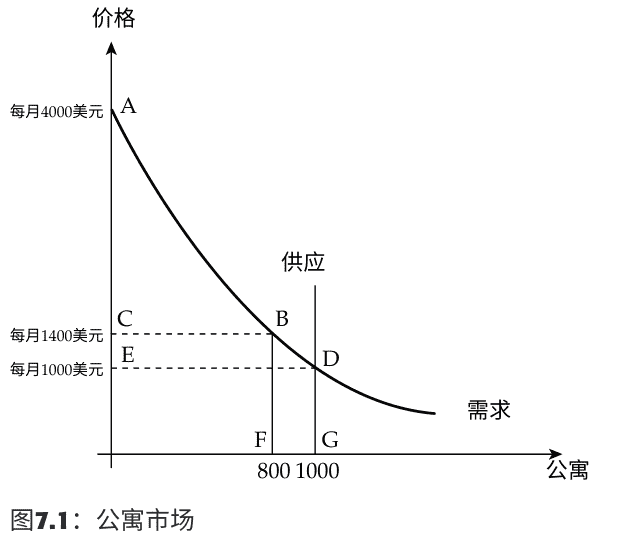

因此，如果有1000套公寓由许多竞争的房东出租，市场清算价格将在需求曲线与垂直供应曲线的交点处，即1000美元。但是假设市场被操纵了——比如房东们组成了卡特尔，或者大学让学生通过一个绑定的中介租房。为了简单起见，让我们假设只有一个垄断房东。他研究了需求曲线，并注意到如果他只出租800套公寓，他可以每月收取每套公寓1400美元。

现在每个月800次$1400是$1,120,000，比每个月从市场价格$1000赚的一百万美元还要多。（经济学家会说他的“收入盒子”是CBFO而不是EDGO。）所以他设定了一个人为高价，结果有200套公寓空着。

这显然是低效的，意大利经济学家维尔弗雷多·帕累托发明了一种简洁的方式来形式化这个问题。帕累托改进是指任何可以让一些人变得更好而不会让其他人变得更糟的改变，而分配是帕累托有效的，如果没有任何可用的帕累托改进。

在这种情况下，分配是不有效的，因为垄断者可以以更低的价格将一个空置公寓租给任何人，使他和他们都变得更好。现在，帕累托效率是一个相当弱的标准；完全的共产主义（每个人获得相同的收入）和完全的独裁统治（总统获得所有的收入）都是帕累托有效的。在这两种情况下，你都不能让任何人变得更好而不让其他人变得更糟！然而，这里描述的简单垄断甚至在这个非常弱的意义上也是不有效的。

那么垄断者能做什么？有一种可能性——如果他能向每个人收取不同的价格，那么他可以将每个学生的租金设定为他们愿意支付的准确金额。我们称这样的房东为歧视性垄断者；他向富有的学生收取准确的4000美元，以此类推，直到第1000个学生，他向他们收取准确的1000美元。相同的学生仍然能够租到公寓，但几乎所有的学生都变得更糟了。富有的学生损失了3000美元，这是他愿意支付但以前不必支付的钱；经济学家将他节省下来的这笔钱称为剩余。实际上，歧视性垄断者设法提取了所有的消费者剩余。

商人们自古以来就试图进行价格歧视。大马士革的地毯销售商向你提供“为你特别优惠的价格”就是在玩这个游戏，微软提供七个不同版本的Vista，以及提供不同价格的头等舱、商务舱和经济舱座位的航空公司也是如此。公司能够这样做的程度取决于许多因素，主要是它们的市场实力和所拥有的信息量。

市场力量是衡量商人接近垄断者的程度的一种指标；在垄断下，商人是价格制定者，而在完全竞争下，他只需接受市场所确定的价格（他是价格接受者）。技术往往会增加市场力量，同时降低获取客户信息的成本，这种组合是现代世界侵蚀隐私的主要因素之一。

### 7.2.2 公共物品

第二种市场失灵类型是当每个人都获得相同数量的某种物品，无论他们是否需要。典型的例子是空气质量、国家防御和科学研究。经济学家称这些为公共物品，其正式定义是它们是非竞争性的（我使用它们并不意味着你可用的就更少）和不可排除的（没有实际的方法来排除人们消费它们）。非协调的市场通常无法以社会最优数量提供公共物品。

公共物品可以直接由政府提供，例如国防，或者通过使用间接机制来协调市场。典型的例子是专利和版权法律，以鼓励人们生产发明、文学作品和音乐作品，通过给予他们一段有限的垄断期来使这些商品具有排他性。很多时候，公共物品是由公共和私人行动的混合提供的；科学研究是在一些得到公共补贴的大学中进行的，这些大学通过学生费用获得一些收入，并从工业界获得一些研究合同（工业界可能有用的发明获得专利，而基础科学研究则会公开发表供所有人使用）。

这种混合可能引起争议；全球变暖的辩论使那些希望通过“碳税”（这将是简单易行的）来实施直接政府行动的人与那些希望通过“配额交易”系统来交易排放许可证的企业和国家形成对立（在理想的情况下，这将导致企业以最低成本减少排放，但可能更容易受到滥用和逃避）。

对我们来说，安全的许多方面都是公共物品的重要组成部分。我家的屋顶上没有防空炮；防空威胁来自少数行动者，最有效的处理方式是政府行动。那么互联网安全呢？毫无疑问，涉及到强烈的外部性，将不安全的机器连接到互联网上会给其他人带来成本，就像烧有污染物的煤火一样。那么我们应该怎么办呢？可以想象一种对漏洞征税的政府政策，对发现漏洞的研究人员支付奖励，并对包含漏洞的软件公司处以更高的罚款。同样，早期的安全经济学论文中没有提出漏洞配额交易系统；那些不愿意使他们的软件安全的供应商可以从其他愿意改进产品的供应商那里购买许可证。（这两种安排都会遭到自由软件社区的抵制！）但是空气污染是正确的类比吗？还是防空？

威胁，如病毒和垃圾邮件，过去来自大量小的参与者，但自2004年以来，我们看到了很多整合，因为恶意软件作家和用户已经商业化。到2007年，严重垃圾邮件发送者的数量已经下降到ISP在整体垃圾邮件量上看到了显著波动的程度，因为大型垃圾邮件发送者运行特定的活动——不再有大数定律在起作用[305]。这表明了一种不同的也许更加集中的策略。如果我们1987年的防空威胁主要来自俄罗斯空军，而我们2007年的网络防御威胁主要来自少数几个俄罗斯团伙，并且他们对美国和欧洲的互联网用户和公司造成了巨大的成本，那么国家行动现在可能是必要的，就像当时一样。我们的政府可以不再告诉我们购买反病毒软件，而是向俄罗斯施加压力，将他们的网络黑帮抓起来并关进监狱。

我将在第三部分更详细地讨论这个问题；现在，对于安全工程师来说，概念如“垄断”和“公共物品”是重要的——实际上对于所有从事IT工作的人都是如此。只需想想那两个主导世界桌面和服务器操作系统的操作系统：Windows是一个垄断，而常见的Unix系统（Linux和OpenBSD）是由志愿者维护的公共物品。为什么会这样呢？为什么信息产品和服务的市场如此奇怪？

## 7.3 信息经济学

19世纪经济学家杰文斯和门格尔的一个见解是，在均衡状态下，商品的价格等于生产的边际成本。

当煤炭在1870年的价格为9先令一吨时，并不意味着每个矿井都以这个价格开采煤炭，只是边际生产者——那些勉强维持业务的人——可以以这个价格销售。如果价格下降，这些矿井将会关闭；如果价格上涨，其他更边际的矿井将会开采。这就是供应对需求变化的响应方式。

### 7.3.1 信息的价格

因此，在竞争均衡中，信息的价格应该等于其边际生产成本。但这几乎是零！这解释了为什么互联网上有那么多免费信息；零是它的公平价格。如果两个或多个供应商竞争提供一个操作系统、地图或百科全书，而且他们可以无成本地复制，那么他们的动机就是不断降低价格。这就是百科全书的情况；Britannica曾经售价1600美元，有32卷；然后微软推出了售价49.95美元的Encarta，迫使Britannica推出了廉价的CD版；现在我们有了免费的维基百科[1159]。一个接一个的公司不得不转向一种模式，即免费提供商品，而收入来自广告或其他平行市场。

Linux公司提供一个操作系统，并通过支持赚钱；许多Linux开发人员在大学期间免费为项目贡献时间，因为这有助于他们的简历并帮助他们毕业后找到一份好工作。

许多其他具有高固定成本和低边际成本的行业转向广告或服务模式；想想地面电视。其他行业也朝这个方向发展：大多数报纸的大部分收入来自广告，因此它们很容易转向免费的在线版加付费纸质版，从而将利润丰厚的广告展示给读者。而其他行业，如航空公司和酒店，则倾向于成为试图垄断特定航线或地区并向不同客户收取不同价格的垄断者。

**那么信息产品和服务行业的其他特征尤为重要吗？**

- 1. 通常存在网络外部性，即网络的价值随用户数量的增加而呈超线性增长。例如，在20世纪80年代，使用传真机的人越多，它们就越有用，直到1985年左右传真机突然火起来；每个企业都需要一台。大约在1995年，电子邮件也发生了类似的情况。网络效应也适用于更广泛的服务领域：任何想要拍卖一些商品的人通常会去最大的拍卖行，因为它会吸引更多的竞标者。它们也适用于软件：公司开发 Windows 软件，因为这样他们将拥有比开发 Linux 或 Mac 更多的用户，而用户则更喜欢 Windows，因为有更多的软件可用。（这被称为双边市场。）
- 2. 通常存在技术锁定，源于互操作性。一旦一个软件公司决定将 Windows 作为其产品的平台，更换平台可能会很昂贵；对于用户来说，更换平台也可能很昂贵。他们必须购买新软件，转换文件（如果可能的话），并重新培训自己。

这些特征分别可以导致拥有主导地位的行业；而一起使用，它们更有可能。如果用户只是想与其他用户（和软件供应商）兼容，那么他们逻辑上会从预计获得最大市场份额的供应商那里购买。

### 7.3.2 锁定的价值

由于Shapiro和Varian的一个有趣结果：软件公司的价值是其所有客户（由于技术和网络效应）的总锁定[1159]。为了看到这可能如何运作，考虑一个有100名员工使用Office的公司，每份Office的价格为500美元。它可以通过转向OpenOffice节省这50000美元，因此，如果安装该产品、培训员工、转换文件等成本（换句话说，总切换成本）低于50000美元，它将进行切换。但是，如果切换成本超过50000美元，那么微软将提高价格。

技术锁定在之前就存在，但转向数字经济后，它变得更加重要。如果你拥有一辆沃尔沃汽车，你就会被锁定在沃尔沃的备件和配件上；但当你对它感到厌倦时，你总是可以将其换成一辆奔驰。但如果你拥有一台苹果Mac电脑，你将拥有Mac软件、Mac打印机，还可能有成千上万首从iTunes上转存的音乐曲目。你还必须学会使用不同的命令和界面。转向Windows将比仅仅花700美元购买一台新笔记本电脑更加痛苦。你必须重新培训自己；你必须放弃Mac版的Office并购买Windows版的Office。如果你从iTunes音乐商店购买了很多音乐曲目，这可能会更加痛苦（你可能会决定将iPod与新的Windows机器一起使用，而不是转向Windows音乐播放器，尽管iPod在Mac上的使用效果更好）。

这说明为什么锁定可以如此持久；尽管每个设备（无论是Mac笔记本电脑、iPod还是打印机）都会磨损，但锁定在它们之间的互补关系中仍然存在。而且这不仅适用于个人电脑平台，还适用于互联网服务提供商、商业软件系统（如数据库）、电话交换设备以及各种在线服务。

这就是为什么在标准战和反垄断诉讼中会花费如此多的努力。这也是为什么现在有那么多安全机制旨在控制兼容性。在这种情况下，可能的黑客不是恶意的外部人，而是设备的所有者，或者试图通过制造兼容产品来挑战现有厂商的新公司。问题变得更加复杂的原因是创新往往是渐进的，产品在新公司为其找到杀手级应用程序时才会成功[607]。例如，PC最初是由IBM设计为运行电子表格的机器；如果他们将其限制为仅适用于此应用程序，那么将会失去一个巨大的机会。事实上，IBM PC比Apple Mac更加开放，这是其成为主导桌面平台的一个因素。

因此，许多国家的法律赋予公司逆向工程竞争对手的产品以实现兼容性的权利[1110]。越来越多的安全机制被用来试图规避这项法律：现有厂商试图使用加密和防篡改技术来限制其平台，以便即使竞争对手在法律上有权尝试逆向工程，他们在实践中并不总能成功。许多企业正在为控制供应链而展开残酷的权力斗争；例如，手机制造商试图在其手机中引入复杂的数字版权管理技术，但被网络运营商阻止，以求直接与客户建立业务关系。这些斗争为越来越多的安全产品的成功或失败创造了背景。

### 7.3.3 非对称信息

市场在垄断和公共物品之外还可能失败的另一种方式是某些委托人比其他人更了解情况。非对称信息的研究始于1970年的一篇著名论文，该论文讨论了“柠檬市场”[19]，乔治·阿克洛夫因此获得了诺贝尔奖。它提出了以下简单而深刻的见解：假设一个城镇有100辆二手车待售：50辆保养良好的车每辆价值2000美元，50辆“柠檬”每辆价值1000美元。卖方知道哪辆车是好车，但买方不知道。一辆二手车的市场价格是多少？你可能会认为是1500美元；但以那个价格没有好车会被出售。因此，市场价格将接近1000美元。

这是一个原因，导致了安全产品的质量普遍较差。当用户无法区分好坏时，他们可能会选择花10美元购买一个廉价的杀毒软件，而不是花20美元购买一个更好的，我们可能会看到价格竞争的下降。

进一步可以区分隐藏信息和隐藏行动。例如，沃尔沃以生产安全的汽车而闻名，但众所周知沃尔沃车主发生事故的次数更多。这是因为那些知道自己驾驶技术不好的人购买沃尔沃，以减少被杀的风险，还是因为沃尔沃车主开车更快？第一种情况是隐藏信息的情况，也被称为逆向选择，第二种情况是隐藏行动的情况，也被称为道德风险。这两种影响在安全领域都很重要，并且在特定情况下可能会结合起来。（在驾驶员的情况下，似乎越来越多的人一致认为人们会调整自己的驾驶行为，以保持他们所能接受的风险水平。这也解释了为什么强制安全带法律往往不能挽救生命，只是将死亡人数从车辆乘员转移到行人和骑自行车的人身上[10]。）

非对称信息解释了现实世界中许多市场失灵的原因，从二手车市场的低价到老年人在合理条件下购买保险的困难（知道自己生病的人倾向于购买更多保险，使得对健康人来说经济不划算）。这往往会导致监视或配给。

## 7.4 博弈论

如果你找不到或者自己制造不了想要的东西，实际上只有两种方法可以得到它。要么你制造出有用的东西并进行交易；要么你通过武力、选票或其他手段，拿走你所需的。在各种层面上，每天都会做出合作和冲突之间的选择，无论是人类还是动物。

我们可以用博弈论来研究和分析它们，我将其定义为“独立决策者之间合作和冲突问题的研究”。我们对策略游戏感兴趣，而不是机会游戏，我们对信息不完全的游戏更感兴趣，因为它们更有趣。我们试图通过抽象掉大部分细节来抓住游戏的核心。例如，考虑学校操场上的“匹配硬币”游戏：爱丽丝和鲍勃同时抛硬币并揭示结果，如果结果不同，爱丽丝得到鲍勃的硬币，如果结果相同，鲍勃得到爱丽丝的硬币。图7.2展示了这个博弈：

| | 鲍勃：H | 鲍勃：T |
| --- | --- | --- |
| **爱丽丝：H** | -1, 1 | 1, -1 |
| **爱丽丝：T** | 1, -1 | -1, 1 |

图7.2：匹配硬币

表中的每个条目首先显示了爱丽丝的结果，然后是鲍勃的结果。因此，如果硬币掉落（H, H），爱丽丝失去一分钱，鲍勃获得一分钱。这是一个零和游戏的例子：爱丽丝的收益是鲍勃的损失。

通常，我们可以通过编写像这样的支付矩阵来快速解决游戏。这是一个示例（图7.3）：

| | 鲍勃：左 | 鲍勃：右 |
| --- | --- | --- |
| **爱丽丝：上** | 1, 2 | 0, 1 |
| **爱丽丝：底部** | 2, 1 | 1, 0 |

图7.3：主导策略均衡

在这个游戏中，无论鲍勃玩什么，爱丽丝都最好选择“底部”；无论爱丽丝玩什么，鲍勃都最好选择“左”。每个玩家都有一种主导策略——无论对方做什么，都是最优选择。因此，爱丽丝的策略应该是恒定的“底部”，鲍勃的策略应该是恒定的“左”。（在博弈论中，策略只是一个算法，它接受一个游戏状态并输出一个移动。）我们称之为主导策略均衡。

另一个例子如图7.4所示：

| | 鲍勃：左 | 鲍勃：右 |
| --- | --- | --- |
| **爱丽丝：上** | 2, 1 | 0, 0 |
| **爱丽丝：底部** | 0, 0 | 1, 2 |

图7.4：纳什均衡

在这里，每个玩家的最佳策略取决于另一个玩家的行动，或者更准确地说，取决于他们认为另一个玩家会做什么。当艾丽斯的选择在鲍勃的选择给定的情况下是最优的，反之亦然，我们称两个策略处于纳什均衡。在这里，有两个对称的纳什均衡，一个在左上角，一个在右下角。你可以将它们看作是局部最优解，而占优策略均衡是全局最优解。

### 7.4.1 囚徒困境

现在我们准备看一个由约翰·纳什在1950年提出的著名问题，他因此获得了诺贝尔奖。它适用于许多情况，从国际贸易谈判到点对点文件共享系统中的搭便车问题，以及狩猎动物之间的合作。纳什最初在美国和苏联的国防开支背景下研究了这个问题；他的雇主兰德公司被委托思考战争中可能的策略。然而，纳什使用了以下简单的例子来展示它。

两名嫌疑人因涉嫌计划抢劫银行而被逮捕。警察分别对他们进行了审讯，并告诉他们以下内容：“如果你们两个都不承认，那么你们每个人都会因为携带未经许可的隐蔽武器而被判一年监禁。如果你们其中一个承认，他将获得自由，而另一个将因密谋抢劫而被判6年监禁。如果你两个都承认，你们每个人都会被判三年监禁。”囚犯们应该怎么做？让我们正式地将这个游戏写出来，如图7.5所示：

| | 本吉：承认 | 本吉：否认 |
| --- | --- | --- |
| **阿尔菲：承认** | -3, -3 | 0, -6 |
| **阿尔菲：否认** | -6, 0 | -1, -1 |

图7.5：囚徒困境

当阿尔菲看到这个表格时，他会这样推理：“如果本吉要承认，那么我也应该承认，这样我可以获得3年而不是6年；如果他否认，那我应该坦白，这样我可以自由，而不是一年。”本吉会做出类似的推理。他们两个都会坦白，并且每人都会被判三年。这不仅仅是纳什均衡，而且是一种主导策略均衡。每个囚犯都应该在逻辑上坦白，无论对方做什么。

但是等等，你说，如果他们同意保持沉默，那么他们每个人都会得到一年，这对他们来说是一个更好的结果！实际上，策略（否认，否认）是帕累托有效的，而主导策略均衡则不是。（这是为什么有概念如“帕累托有效”和“主导策略均衡”而不仅仅争论“最好”的原因。）

那么解决方案是什么？嗯，只要游戏只会被玩一次而且这是唯一的游戏，就没有解决方案。两个囚犯都会在逻辑上坦白，并且被判三年。只有通过改变游戏本身，我们才能改变这种状况。有很多可能性：可以有各种各样的法律，从国际贸易条约到黑帮的 omertà。实际上，囚徒困境游戏通过改变规则或背景来改变，从而将其转变为另一个均衡更有效的游戏。

### 7.4.2 进化博弈

一个重要的问题类别可以在游戏重复进行时解决——如果阿尔菲和本吉是职业罪犯，他们预计会再次相互交往。当然，他们可能有合作的动机。至少有两种建模方法。

在20世纪70年代，鲍勃·阿克塞尔罗德开始思考人们如何在囚徒困境中进行多轮游戏。他组织了一系列比赛，人们可以提交程序，这些程序在锦标赛中反复对战。他发现，总体上最好的策略之一是“以牙还牙”（Tit-for-Tat），即在第一轮合作，在每一轮后，你对对手做出他或她在上一轮中所做的。人们开始意识到策略演化可以解释很多事情。例如，在存在噪音的情况下，当一个玩家的合作行为被另一个玩家误读为背叛时，玩家倾向于陷入（背叛，背叛）的状态。因此，在这种情况下，偶尔“原谅”对方是有帮助的。

同时，约翰·梅纳德·史密斯和乔治·普赖斯[848]开辟了一种并行方法。他们考虑了如果你有一个攻击性和温顺个体的混合种群，即“鹰”和“鸽子”。鸽子合作；鹰从鸽子那里夺取食物；鹰之间争斗，有死亡风险。假设每个食物的价值为互动的价值为 $V$，每次鹰之间争斗的死亡风险为 $C$。然后，支付矩阵如图 7.6 所示：

| | 鹰 | 鸽子 |
| :--- | :---: | :---: |
| 鹰 | $\frac{V-C}{2}, \frac{V-C}{2}$ | $V, 0$ |
| 鸽子 | $0, V$ | $\frac{V}{2}, \frac{V}{2}$ |

图 7.6：鹰-鸽子博弈

在这里，如果 $V > C$，整个种群将变为鹰，因为这是主导策略，但如果 $C > V$（战斗太昂贵），那么存在一个平衡点，其中鹰的概率 $p$ 设置鹰的支付和鸽子的支付相等，即

$$p \frac{V-C}{2} + (1-p)V = (1-p) \frac{V}{2}$$

这个问题的解是 $p = V/C$。换句话说，在一个群体中可以同时存在具有攻击性和温顺性的个体，而攻击性个体的比例将在平衡时成为攻击成本的函数；成本越高，这样的个体就越少。当然，成本可以随时间变化，从进化的角度来看，多样性是一件好事，因为在战争爆发时，少数好斗个体的社会可能处于优势地位。再次强调，一个社会要达到平衡需要几代人的时间。也许我们当前的攻击事件发生率过高，因为它反映了黑暗时代甚至 50 万年前非洲高原的情况[1]。

这个巧妙的洞察力，以及鲍勃·阿克塞尔罗德提出的模拟方法论，使得从道德哲学家到动物行为学的学生都对进化博弈论产生了兴趣。它们深入地揭示了合作是如何演化的。

事实证明，许多灵长类动物都具有内置的公平感，并惩罚那些被视为作弊的个体——复仇的本能是强制社会性的机制的一部分。公平可以以不同的方式在不同的层次上运作。例如，哲学家布赖恩·斯基姆斯发现，如果鸽子能够相互识别并优先交互，它们可以在与鹰的对抗中取得更好的结果，从而为社会运动（如共济会）甚至一些宗教的建立提供了一个模型[1188]。

一些领先的人类学家认为，直到最近，部落间的战争在人类社会中是普遍存在的[777]。当然，报复的基本思想已经存在很长时间了。旧约中有“以眼还眼”，新约中有“己所不欲，勿施于人”；后者的表述显然更具容错性，并且在亚里士多德、孔子等地方都可以找到类似的版本。最近，托马斯·霍布斯在 17 世纪使用原始囚徒困境式的论证来证明了没有君主神权的国家的存在。

进化博弈论的应用不断增长。例如，自从 9/11 事件以来，人们对于鹰鸽博弈是否能解释在压力时期原教旨主义者如何接管宗教话语产生了兴趣。

从经济学家的角度来看，进化博弈解释了为什么即使在没有秘密交易的烟雾弥漫的房间中，也会出现类似卡特尔行为的产业。例如，如果有三家航空公司在一个有利可图的航线上运营，其中一家降低价格以争夺市场份额，其他公司可能会进一步降低价格以惩罚它并使航线变得不可盈利，希望这些折扣会被取消，大家可以继续剥削顾客。而且在安全领域也有一些有趣的应用，我稍后会谈到。

## 7.5 安全和可靠性的经济学

经济学家过去对经济和安全之间的相互作用非常了解；富裕国家能够负担得起庞大的军队。但是现在，在“经济学”和“安全”的网络搜索中，相对较少的文章出现。主要原因是在 1945 年之后，经济学家与战略研究人员渐行渐远；人们认为核武器使国家的生存与经济实力脱钩。次要因素可能是美国与苏联就安全问题进行对抗，但与日本和欧盟就贸易问题进行对抗。重新建立这种联系的任务落在了信息安全领域。

重新引起对安全经济学的兴趣的观察之一来自银行。在美国，银行通常对卡片欺诈的费用负责；当客户对一笔交易提出争议时，银行必须要么证明她试图欺骗银行，要么退还她的钱。在英国，银行通常声称他们的系统是“安全”的，并告诉抱怨的客户他们一定是错了或在撒谎。“幸运的银行家们，”你可能会想；然而英国银行在安全方面的支出更多，遭受的欺诈也更多。

这可能是一种道德风险效应：英国银行员工知道客户的投诉不会被认真对待，所以他们变得懒散和粗心，导致了欺诈的流行[33, 34]。

另一个观察是人们在购买反病毒软件方面花费的钱没有供应商希望的那么多。现在一个典型的病毒载荷是对微软的服务拒绝攻击；而一个理性的消费者可能愿意花费 20 美元用来阻止病毒破坏她的硬盘，她就不太可能这样做只是为了保护一个富有的人[1290]。还有许多其他例子，比如医疗主管和管理员购买的医院系统关心他们的利益，但不保护患者的隐私。开始出现的情况是系统安全失败，因为守卫系统的人不是那些遭受失败成本或特定类型失败的人。有时，正如我们将看到的，安全机制被用来将风险转嫁给他人，如果你是这些他人之一，你最好使用一个不安全的系统。换句话说，安全通常不是一个标量，而是一种权力关系；在给定系统中控制其含义的主体通常会利用它来推进自己的利益。

这是最初的洞察。但是一旦我们开始认真研究安全经济学，我们发现其中还有很多内容。

### 7.5.1 最薄弱的环节，或者努力的总和？

创立冲突理论的杰克·赫什莱弗（Jack Hirshleifer）讲述了一个关于安纳奇亚（Anarchia）的故事，这个岛屿的防洪设施是由每个家庭分别负责维护的。因此，这个岛屿的防洪设施取决于最薄弱的环节，也就是最懒惰的家庭。他将这个情况与一个城市的导弹防御相比较，这个防御依赖于最佳的防御射击[609]。最佳射击的另一个例子是中世纪的战争，有时两军之间会有一场单挑战斗。哈尔·瓦里安（Hal Varian）将这个模型扩展到了三种与信息系统可靠性相关的情况——性能取决于最小的努力、最佳的努力或者努力的总和[1292]。最后一种情况，即努力的总和，是现代战争的模型：我们纳税，政府雇佣士兵。这比最佳射击要高效得多（大多数人会在英雄的背后搭便车），而最佳射击又比最薄弱的环节好得多（每个人都会在最懒惰的人的背后搭便车）。

程序的正确性可能取决于最小的努力（最不小心的程序员引入了漏洞），而软件漏洞测试可能取决于每个人的努力之和。安全性还可能取决于最大的努力——安全架构师等个人冠军采取的行动。随着更多的代理人的加入，系统在总体努力情况下变得更可靠，但在最薄弱环节的情况下变得不太可靠。这有什么影响？嗯，软件公司应该雇佣更多的软件测试人员，而减少（但更有能力的）程序员。

### 7.5.2 管理修补周期

关于“开源安全性”以及更一般地寻找和披露漏洞是否社会上可取，一直存在很多争论。这是一场一再引发争议的辩论；正如我们在前言中所看到的，维多利亚时代的人们对于是否在书籍中公开讨论撬锁技术的社会责任感到痛苦，最终得出结论认为是可以的[1257]。最近人们更担心（例如）美国陆军《简易爆炸物手册》在网上的可获取性[1271]；帮助恐怖分子的风险是否足以证明需要进行在线审查？

安全经济学提供了一个理论和定量的框架，用于讨论这类问题。我在 2002 年证明，在可靠性增长的标准假设下，开放系统和专有系统的安全性是相同的；开放系统对攻击者和防御者都有帮助[54]。因此，开放安全问题通常是一个实证问题，取决于给定实际系统遵循标准模型的程度。

2004 年，Eric Rescorla 认为，对于存在许多潜在漏洞的软件，修复一个漏洞对攻击者后续发现其他漏洞的可能性几乎没有影响。由于利用通常基于从补丁中推断出的漏洞，他反对公开披露和频繁打补丁，除非同样的漏洞有可能被重新发现[1071]。Ashish Arora 和其他人的数据显示，公开披露使供应商更快地做出修复；攻击起初增加，但随着时间的推移，报告的漏洞数量减少[88]。2006 年，Andy Ozment 和 Stuart Schechter 发现，在六年的时间里，核心 OpenBSD 操作系统披露的唯一漏洞数量有所减少[998]。这些结果支持当前的负责任披露系统，即发现漏洞的人向 CERT 报告，CERT 再向供应商报告，并在补丁发布后公开它们。

这绝不是关于可靠性经济学的全部内容。供应商和客户之间存在着补丁发布的频率和时间的紧张关系；与补充者有关的问题；度量的困难；像 iDefense 和 TippingPoint 这样购买和出售漏洞信息的公司；甚至担心拥有特权访问漏洞报告的情报机构会将其用于对其他国家系统的零日攻击。我将在第三部分回顾所有这些内容。

### 7.5.3 为什么 Windows 如此不安全？

补丁周期的微观管理引发了一个更深层次的问题：为什么一开始就有这么多漏洞？特别是，为什么 Windows 如此不安全，尽管微软在市场上占据主导地位？编写更好的软件是可能的，而且在国防和医疗保健等领域，人们正在努力生产可靠的系统。为什么我们在商品平台上没有看到类似的努力，特别是考虑到微软没有真正的竞争对手？

说实话，微软的软件安全性正在改善。Windows 95 很糟糕，Windows 98 稍微好一些，然后 NT，XP 和 Vista 的改进也在继续。但是攻击者也变得更加强大，而 Vista 中的保护并不完全是为了用户的利益。正如 Peter Gutmann 所指出的，巨大的努力已经投入到保护高级视频内容中，而几乎没有努力投入到保护用户的信用卡号码中[570]。在其他平台产品中也出现了相同的模式，从旧的 IBM 主机操作系统到电话交换机再到 Symbian 手机操作系统。产品一开始就是不安全的，尽管随着时间的推移它们会改进，但许多新的安全功能对供应商和用户同样有利。

到现在为止，你应该不会感到惊讶了。高固定成本和低边际成本、网络效应和技术锁定的组合使得平台市场特别容易被单一供应商主导，如果他们能赢得市场主导地位，他们将获得巨大的财富。在这样的竞赛中，20 世纪 90 年代臭名昭著的微软理念——“星期二发货，第 3 版时做对”——是完全合理的行为。在这样的竞赛中，平台供应商必须至少同样吸引软件公司——这些公司决定是否为其平台编写应用程序，还是为其他平台编写。安全性会妨碍应用程序，并且它往往是一个劣质市场。因此，理性的供应商将允许（甚至鼓励）所有应用程序以 root 权限运行，直到他的地位稳固。然后，他将增加更多的安全性——但仍然有强烈的动机将其设计成最大化客户锁定的方式，或者吸引新市场（如数字媒体）的补充者。

从消费者的角度来看，具有锁定功能的市场通常是“便宜货然后是骗局”。你以 39.95 美元买了一台漂亮的新打印机，然后在几个月后发现你需要两个新的打印机墨盒，每个 19.95 美元。你想知道是否只买一台新打印机会更划算。

从应用程序开发者的角度来看，基于锁定的标准竞争的市场看起来有点像这样。起初，为它们编写代码非常容易；但是一旦你承诺了，就需要跳过更多的障碍。从可怜的消费者的角度来看，它们可以被描述为“先是差劲的安全性，然后是别人的安全性”。

有时情况可能比这更糟。在争夺主导地位时，供应商很可能会设计他们的产品，以便管理安全性的成本由用户承担，而不是应用程序开发者。一个经典的例子是 SSL/TLS 加密。这是在上世纪 90 年代中期被微软和网景采用，他们争夺浏览器市场的主导地位。正如我在第 2 章中讨论的那样，SSL 让用户评估网站提供的证书并决定是否信任它；这导致了各种网络钓鱼和其他攻击。然而，将合规成本转嫁给用户在当时是完全合理的，而且竞争的协议，如 SET，这将需要银行和商家更大的投资，却被允许在藤蔓上枯萎[357]。世界上不仅拥有一个相当不安全的互联网支付系统，而且普遍存在责任转嫁，这使得朝着一个更好的系统的进展变得困难。基础设施中太多的是最薄弱环节而不是各方共同努力的安全性。

### 7.5.4 隐私的经济学

隐私的一个大难题是人们说他们重视隐私，但行为却相反。如果你在街上拦住人们问他们的观点，大约三分之一的人说他们是隐私原教旨主义者，永远不会把个人信息交给营销人员或其他人；大约三分之一的人说他们不在乎；还有三分之一的人处于中间，表示他们会对任何披露的风险和利益采取务实的观点。然而，人们通过他们的购物行为所展示的行为——无论是在线还是离线——是完全不同的；绝大多数人对隐私几乎不加注意，并且会为了很少的利益泄露最敏感的信息。各种增强隐私的技术已经在市场上出售，但大多数都失败了。为什么会这样呢？

隐私是信息安全的一个方面，引起了经济学家在 2000 年之前的兴趣。1978 年，理查德·波斯纳（Richard Posner）用保密来定义隐私[1035]，并在随后的一年将其扩展为隐居[1036]。1980 年，杰克·赫什莱弗（Jack Hirshleifer）发表了一篇具有开创性意义的论文，他在论文中认为隐私不是关于从社会中退缩，而是一种组织社会的手段，源于进化的领土行为；对财产的内化尊重是自主权在社会中持续存在的原因。上世纪 70 年代的这些隐私争论在欧洲导致了通用的数据保护法律，而美国则仅限于一些特定行业的法律，如 HIPAA。经济学家对隐私研究的兴趣最近又因互联网、互联网泡沫和个人信息交易的激增而进一步增加。

关于隐私的一个早期现代观点可以在哈尔·瓦里安（Hal Varian）1996 年的一篇文章中找到，他从信息市场的角度分析了隐私[1289]。消费者希望不被无关的营销电话打扰，而营销人员则不希望浪费精力。然而，由于搜索成本、外部性和其他因素，双方都感到沮丧。瓦里安建议给予消费者关于自己的信息的权利，并允许他们将其出租给营销人员，但前提是未经许可不得转售。

最近复杂、信息密集的商业模式的蓬勃发展要求采用更广泛的方法。安德鲁·奥德里兹科在 2003 年提出，隐私侵蚀是为了对类似服务收取不同价格的欲望的结果[981]。技术同时增加了价格歧视的动机和机会。公司可以挖掘在线购买和互动的数据，揭示个体的支付意愿。从航空公司收益管理系统到复杂而不断变化的软件和电信价格，差异定价在经济上是高效的，但越来越受到反感。

彼得·斯瓦尔认为，我们应该更广泛地衡量隐私侵犯的成本[1237]。如果一个电话销售员拨打 100 个潜在客户的电话，向其中三个销售保险，并惹恼了 80个人，那么传统分析只考虑了对这三个人和保险公司的利益。然而，持续的烦恼导致数百万人选择不公开电话号码，晚餐时不接电话，或通过答录机筛选电话。长期的社会危害可能是相当大的。几项实证研究通过检查人们的隐私估值来支持这一观点。

我个人认为，公众需要时间来吸收隐私风险。大约三十年来，IT 政策专家一直在为隐私的消亡而苦恼，但直到最近，这仍然是极客的兴趣。现在，这一重要性开始渗透到像股市投资者这样的高级人士中：亚历山德罗·阿奎斯蒂和其他人发现，报告安全或隐私漏洞的公司的股价可能会下跌[8, 265]。只有当小报和脱口秀节目广泛报道普通人因“身份盗窃”和网络钓鱼而遭受实际损害的故事时，普通选民才会开始警觉并关注。有一些早期迹象表明这种情况正在开始发生（例如，越来越多的隐私专家像我一样受邀出现在广播和电视节目中）。但是，另一位行为经济学家乔治·洛温斯坦指出，人们对自己处境的大变化比对小变化更敏感：如果事情突然变得更糟，他们会感到担忧，但如果情况逐渐恶化，他们则不会感到担心。他们还会出人意料地习惯于他们认为无法改变的糟糕环境。

特别有趣的是，2007 年末，英国政府遭受了巨大的尴尬，当时他们丢失了所有国民儿童及其家庭的电子税务记录，包括银行账户详细信息，导致首相在议会上亲自道歉，并引发了大规模媒体对随后的隐私侵犯的报道。我将在第 9.4 节中详细讨论这个问题；隐私经济学家将关注的是，这是否会随着时间的推移改变公众的态度，并且这是否会改变公众的态度。

### 7.5.5 DRM 的经济学

版权管理技术也受到了经济审查。Hal Varian 在 2002 年指出，DRM 和类似机制也涉及到捆绑销售和价格歧视；他们的无限制使用可能会损害竞争[1291]。我在 2003 年写了一篇关于“可信计算”的常见问题解答，随后又写了一篇研究论文，在其中我指出了权利管理机制可能存在的竞争滥用的潜在问题；例如，通过将用户数据的控制权从存储数据的机器的所有者转移到存储数据的文件的创建者，锁定效应的潜力将大大增加[53]。想象一下上面的例子，一个由 100 名收费律师组成的律师事务所，每个律师都有一台价格为 500 美元的个人电脑上安装了 Office。他们支付给微软的 5 万美元大致等于切换到（比如）OpenOffice 的总成本，包括培训、文件转换等。然而，如果文件的控制权转移到成千万的客户手中，律所现在必须联系每个客户并请求数字证书以便迁移文件，那么显然切换成本已经增加了——因此你可以预期 Office 的成本也会随着时间的推移而增加。

关于音乐版权管理的辩论中存在一些有趣的角度。2004 年，费利克斯·奥伯霍尔泽和科尔曼·斯特朗夫发表了一篇如今已经臭名昭著的论文，在其中他们研究了音乐下载和唱片销售之间的相关性[978]。他们表明下载对音乐产业没有造成重大伤害。即使在最悲观的解释中，需要五千次下载才能取代一次专辑销售，而高销量的专辑实际上从文件共享中受益。这项研究当时受到音乐行业发言人的激烈争议，但后来被加拿大政府的研究证实，在点对点系统用户中下载和 CD 销售之间存在正相关，而在整个人口中不存在相关性[28]。

2005 年 1 月，哈尔·瓦里安做出了一个有争议的预测[1293]：更强大的数字版权管理将更有利于系统供应商而不是音乐产业，因为计算机行业更加集中（只有三个严肃的数字版权管理平台供应商——微软、索尼和主导公司苹果）。内容产业嘲笑了这一预测，但到了那年底，音乐出版商开始抗议苹果从在线音乐销售中获得的份额过大。随着供应链中的权力从音乐巨头转移到平台供应商，音乐产业中的权力似乎正在从巨头转向独立公司，就像航空业的放松管制有利于飞机制造商和低成本航空公司一样。这是经济分析的一个引人注目的证明。通过对一个不存在的威胁进行斗争，唱片行业帮助计算机行业打造了一个可能导致其失败的武器。

## 7.6 总结

许多系统失败是因为激励机制错误，而不是由于某些技术设计错误。因此，安全工程师需要了解基本经济学以及密码学、协议、访问控制和心理学的基础知识。安全经济学是一个快速发展的研究领域，它解释了我们过去认为只是“坏天气”的许多事情，比如 Windows 的不安全性。它不断提供有关各种问题的新见解，从如何优化修补周期到人们是否真的关心隐私，以及立法者可能会对数字版权管理采取什么行动。

## 研究问题

到目前为止，已经探索了两个与安全相关的经济学领域，即微观经济学和博弈论。行为经济学（经济学和心理学之间的边界）也开始产生洞察力。但经济学是一个广阔的学科。它还可能给我们带来哪些其他想法？

## 进一步阅读

关于信息经济学的最佳初步介绍是 Shapiro 和 Varian 的《信息规则》，这本书十年前写的，仍然非常新鲜和准确[1159]。我通常建议学生们先读这本书。对于那些想要继续研究这个学科的人，我建议阅读 Hal Varian 的教材《中级微观经济学》，它从学术的角度讲解材料，案例研究较少，数学内容较多[1284]。

目前安全经济学的研究主要发表在信息安全经济学研讨会（WEIS）上，该会议自 2002 年以来每年举行一次；有关 WEIS 和其他相关活动的详细信息可在 [58] 找到。目前（2007 年）有一份我与泰勒·摩尔共同撰写的领域调查报告，可在 [72] 找到。有两本收集研究论文的书籍 [257, 548]，以及布鲁斯·施奈尔的一本流行著作 [1129]；我还在 http://www.cl.cam.ac.uk/rja14/econsec.html 上维护着一个经济与安全资源页面。另外，还有两篇相关论文即将出版，一篇是我与雷纳·B·伯姆、理查德·克莱顿和泰勒·摩尔合著的关于欧洲内部市场安全经济学的报告 [62]，另一篇是米歇尔·范·伊滕和同事们撰写的 OECD 报告，该报告详细介绍了与信息安全利益相关的各方面的访谈 [420]。

许多经济学家研究相关领域。我提到了杰克·赫什莱弗的冲突理论；他的一些论文可以在一本书中找到 [610]。另一个非常重要的领域是犯罪经济学，这个领域由加里·贝克尔 [138] 开创，并且最近被史蒂夫·莱维特和...斯蒂芬·邓伯的《怪诞经济学》[787]。大部分分析都是关于贫困年轻男性的犯罪问题，这个问题我将在第11章中回顾；但一些学者也研究了有organized crime（有组织犯罪）[392, 473]。随着计算机犯罪越来越多地受到利润动机的驱动，而不是自我和吹嘘的权利，我们可以预期经济分析将变得越来越有用。

## 第8章 多级安全

> 大部分高保证工作都是在动力设备和被愚蠢机器控制的地狱机器领域完成的。随着信息处理技术对社会的重要性越来越高，这些关注点也扩展到以前被认为是无害的领域，比如操作系统。
> —— Earl Boebert

> 我简要地；你泄露；他/她通过泄露机密信息犯下了犯罪行为。
> —— 英国公务员动词

> 他们不断试图逃离外部和内部的黑暗，通过梦想着完美到没有人需要做好的系统来实现。
> —— T. S. Eliot

### 8.1 引言

我在引言中提到，军事数据库系统可以在不同级别的机密性（机密、秘密、绝密、...）上保存信息，必须确保只有至少与数据等级一样高的主体才能读取数据。他们实施的策略被称为多级安全或强制访问控制（MAC）。

多级安全系统很重要的原因是：

- 1. 大量的研究已经在它们上面进行，这要归功于美国计算机科学的军事资助。因此，保护的军事模型比任何其他模型都更详细，它给我们提供了许多实施安全策略严谨性的二阶甚至三阶效应的例子。
- 2. 尽管多级概念最初是为了支持军事系统中的机密性而开发的，但现在许多商业系统也使用多级完整性策略。例如，电信运营商希望他们的计费系统能够查看交换系统中发生的情况，但不会对其产生影响。
- 3. 最近，诸如 Microsoft Vista 和 Red Hat Linux 之类的产品开始整合强制访问控制机制，并且它们也出现在数字版权管理系统中。例如，Red Hat 使用 NSA 开发的 SELinux 机制来隔离在一台机器上运行的不同服务器，这样即使您的 Web 服务器被黑客攻击，也不一定会接管您的 DNS 服务器。Vista 具有多级完整性策略，默认情况下 Internet Explorer 在“低”级别下运行，这意味着即使它被接管，攻击者也不能更改系统文件或任何其他具有更高完整性级别的内容。这些机制对于普通计算机用户来说仍然基本看不见，但它们的专业使用正在增加；多级机密性的想法经常应用于它们无效甚至有害的环境中，因为它们背后有巨大的利益和动力。这可能是大型系统项目失败的一个因素，特别是在公共部门中。

以赛亚·柏林爵士曾著名地将思想家描述为狐狸或刺猬：狐狸知道许多小事情，而刺猬只知道一件大事。多层哲学是安全工程的刺猬方法。

### 8.2 什么是安全策略模型？

在可能的情况下，安全工程的自上而下方法通常采用“威胁模型 —— 安全策略 —— 安全机制”的形式。这个过程的关键部分通常被忽视，那就是安全策略。

通过安全策略，我们指的是明确而简明地表达保护机制的文件。它受到我们对威胁的理解的驱动，并进而推动我们的系统设计。它通常采用关于哪些用户可以访问哪些数据的陈述形式。它在指定系统的保护要求方面发挥着与规范功能相同的作用，评估是否满足了这些要求，这是系统规范对于一般功能所做的。事实上，安全策略可能是系统规范的一部分，并且像规范一样，其主要功能是进行沟通。

许多组织使用术语“安全策略”来表示一系列空洞的陈述。图 8.1 给出了一个简单的例子：

**Megacorp公司安全策略**
- 1. 该策略已获得管理层批准。
- 2. 所有员工都应遵守该安全策略。
- 3. 数据只能提供给那些“有必要知道”的人员。
- 4. 所有违反该策略的行为必须立即向安全部门报告。
（图 8.1：一个典型的企业信息安全策略）

这种空洞的陈述非常常见，但对安全工程师来说毫无用处。它的第一个缺点是回避了核心问题，即“谁确定‘有必要知道’以及如何确定？”其次，它混合了多个不同层次的陈述（组织对策略的批准在逻辑上不应该是策略本身的一部分）。第三，存在一种机制，它是隐含的而不是明确的：“员工应遵守” —— 但这意味着他们实际上必须做什么？必须通过系统来强制执行服从，还是用户“凭信用”？第四，如何检测违规行为，谁有责任报告它们？

我们必须做得比这个更好。事实上，由于术语“安全策略”被广泛滥用，意思是一系列管理主义的陈词滥调，因此出现了三个更精确的术语来描述保护要求的规范。

- **安全策略模型**：是系统或通用类型系统必须具备的保护属性的简明陈述。它的关键点通常可以写在一页或更少的纸上。这是一个文件，其中系统的保护目标与整个社区或客户的高层管理层达成一致。它还可以成为形式化数学分析的基础。
- **安全目标**：是对特定实现提供的保护机制以及它们与控制目标列表（其中一些但不是全部通常源自策略模型）之间关系的更详细描述。安全目标是产品测试和评估的基础。
- **保护配置文件**：类似于安全目标，但以一种与实现无关的方式表达，以便在产品和版本之间进行可比较的评估。这可能涉及使用半正式语言，或者至少使用适当的安全术语。保护配置文件是在通用标准[935]下进行评估的产品的要求（我讨论了通用标准第三部分的标准；它们与许多政府用于相互承认国防信息系统安全评估的方案相关）。

当我不需要那么精确时，我可能会使用术语“安全策略”来指安全策略模型或安全目标。我永远不会用它来指一系列陈词滥调。

有时，我们面临一个全新的应用程序，必须从头开始设计安全策略模型。更常见的情况是，已经存在一个模型；我们只需要选择合适的模型，并将其发展成为一个安全目标。这两个步骤都不容易。事实上，本书本节的目的之一就是提供一些安全策略模型，描述它们在实际系统中的上下文中，并研究安全目标可以使用的工程机制（以及相关的约束）来满足它们。

最后，你可能会遇到短语“安全策略”的第三种用法 —— 作为某些保护产品的具体配置设置的列表。在接下来的内容中，我们将称之为配置管理，或者偶尔称之为可信配置管理。

### 8.3 Bell-LaPadula 安全策略模型

安全策略模型的经典例子是由 Bell 和 LaPadula 于 1973 年提出的，以回应美国空军对分时共享主机系统安全性的担忧。到了 20 世纪 70 年代初，人们已经意识到许多商业操作系统提供的保护是很差的，而且没有任何改善。一旦修复了一个操作系统漏洞，就会发现其他漏洞（现代可靠性增长模型可以量化这一点，并确认悲观主义是正确的；我在第 26.2.4 节中进一步讨论它们）。人们不断担心即使是不熟练的用户也会发现漏洞并机会主义地利用它们；人们也越来越意识到恶意代码的威胁（病毒直到下一个十年才被发明；70 年代的担忧是关于特洛伊木马的）。当发现五角大楼的全球军事指挥和控制系统容易受到特洛伊木马攻击时，这引起了严重的恐慌；这导致其使用仅限于拥有“绝密”许可的人，这很不方便。最后，学术界和工业界的研究人员提出了一些有趣的保护新思想，我在下面进行讨论。

詹姆斯·安德森的一项研究使美国政府得出结论，一个安全的系统应该做一两件事情得当；而这些保护属性应该由足够简单的机制来强制执行，而且很少改变[29]。它引入了参考监视器（Reference Monitor）的概念 —— 操作系统的一个组成部分，它将调解访问控制决策，并且足够小以进行分析和测试，其完整性可以得到保证。在现代术语中，这些组件 —— 以及它们相关的操作程序 —— 构成了可信计算基（TCB）。更正式地说，TCB 被定义为一组组件（硬件、软件、人员等），其正确运行足以确保安全策略的执行，或者更形象地说，其故障可能导致安全策略的破坏。安德森报告的目标是使安全策略足够简单，以便 TCB 能够受到仔细验证的支持。

> 但是这些核心安全属性是什么，应该优先执行其他所有操作？

### 8.3.1 分类和许可

第二次世界大战和随后的冷战导致北约政府采用了一种用于标记文件敏感性的共同保护标记方案。分类是标签，从非机密到机密，再到绝密（见图 8.2）。细节会随时间而变化。最初的想法是，可能会危及生命的信息标记为“机密”，而可能会危及许多人生命的信息标记为“绝密”。政府雇员的许可取决于他们经过的审查程度；例如，在美国，“机密”许可需要检查 FBI 的指纹文件，而“绝密”许可还需要对过去五到十五年的就业背景进行调查[379]。

访问控制策略很简单：只有当官员的许可至少与文件的分类相同，他才能阅读文件。因此，被授权阅读“绝密”文件的官员可以阅读“机密”文件，但反之则不行。这样做的效果是信息只能向上流动，从机密到秘密再到绝密，但除非经过授权的人员做出有意的解密决定，否则信息永远不会向下流动。

还有文件处理规则；因此，“机密”文件可能会被放在普通政府办公室的锁定文件柜中。而更高级别可能需要经过批准的保险柜、带有对复印机的控制的保密房间等等（美国国家安全局的安全手册[952]对“绝密”情报数据的程序进行了总结）。系统很快变得更加复杂。用于分类文件的损害标准从可能的军事后果扩展到经济损失甚至政治尴尬。

英国在“非机密”和“机密”之间还有一个额外的级别，“限制级”；美国以前也有这个级别，但在《信息自由法案》出台后废除了它。现在美国有两个更具体的标记：“仅限官方使用”（FOUO）指的是根据《信息自由法案》无法发布的非机密数据，而“非机密但敏感”包括 FOUO 以及可能会根据《信息自由法案》请求而发布的材料。在英国，“限制级”信息实际上是自由共享的，但将所有东西标记为“限制级”可以使记者和其他参与泄密的人根据《官方机密法》受到起诉（它的另一个主要实际效果是，一份未分类的美国文件在被发送到大西洋彼岸后自动变为英国的“限制级”，然后在返回美国时变为“机密”。美国的军事系统构建者抱怨英国的政策破坏了美国的分类方案！）。

还有一套代码词系统，通过这套系统，特别是在秘密及以上级别的信息可以进一步限制。例如，可能会泄露情报来源或方法的信息，例如特工的身份或外国政府通信的解密，通常被分类为“特殊情报”或 TS/SCI，这意味着还会施加所谓的“需要知道”限制，并附加一个或多个代码词到文件上。其中一些代码词与特定的军事行动或情报来源相关，仅供一组指定的用户使用。要阅读一个文件，用户必须拥有附加到该文件的所有代码词。一个分类标签加上一组代码词组成了一个安全类别或（如果至少有一个代码词）一个隔离区，它是具有相同访问控制策略的一组记录。我在多边安全章节中会更详细地讨论隔离区。

还有描述符、警告和 IGO 标记。描述符是诸如“管理”、“预算”和“任命”之类的词：它们不会引发任何特殊处理要求，因此我们可以像处理一个标记为“机密-管理”的文件一样处理一个标记为“机密”的文件。警告是诸如“仅限英国”或美国等效的“NOFORN”的警告；还有国际组织（IGO）的标记，如北约。代码词、描述符、警告和 IGO 标记之间没有明显的区别，这是使系统变得混乱的因素之一。更详细的解释可以在[1051]中找到。

关于访问控制原则的最后一条普遍评论是，允许信息的单向流动也模拟了窃听的情况。在过去，窃听某人的电话意味着添加物理线路。在交换中；现在，一切都在电话交换软件中完成，效果有点像将目标呼叫变成会议呼叫多了一个参与者。通常的安全要求是调查目标不应该知道自己被窃听，所以第三方应该保持沉默 —— 并且其存在必须对目标保持未知。

例如，现在窃听被实现为无声会议呼叫，必须注意确保会议呼叫设施的费用归窃听者所有，而不是目标。窃听需要一个信息流策略，其中“高”主体可以看到“低”数据，但“低”主体无法确定“高”是否在阅读任何数据，更不用说是什么数据了。

### 8.3.2 信息流控制

正是在这种政府数据分类的背景下，1973 年制定了计算机安全的 Bell-LaPadula 或 BLP 模型[146]。它也被称为多级安全（MLS），实现它的系统通常被称为多级安全或 MLS 系统。它们的基本特性是信息不能向下流动。

更正式地说，贝尔-拉帕杜拉模型强制执行两个属性：

- **简单安全属性**：没有进程可以在更高的级别读取数据。这也被称为不向上读取（NRU）。
- **$\ast$-属性**：没有进程可以将数据写入较低的级别。这也被称为不向下写入（NWD）。

$\ast$-属性是贝尔和拉帕杜拉的关键创新。它是由对使用恶意代码进行攻击的担忧驱动的。一个未经批准的用户可能会编写一个特洛伊木马并将其留在一个系统管理员被批准为“机密”的地方，然后它可以将自身复制到系统的“机密”部分，读取那里的数据并尝试以某种方式将其传递下去。敌方特工也有可能在商业软件公司找到工作并嵌入一些代码，以寻找要复制的秘密文件。如果它能够将这些文件写下来以供其创建者阅读，那么安全策略将被违反。如果应用程序可以写入下方，信息也可能因错误而泄漏。

漏洞（如恶意和有缺陷的代码）被认为是已知的。还假设大多数员工都不小心，有些人是不诚实的；长期以来，在防御环境中一直采取了广泛的操作安全措施，以防止人们泄露纸质文件（当我年轻时在国防航空电子领域工作时，所有的电路图、蓝图等副本都有编号，并且必须进行核对）。因此，已经存在一种安全策略独立于用户行为的文化；转向计算机并没有改变这一点。必须澄清这一点，这就是贝尔-拉帕杜拉所做的：安全策略必须不仅独立于用户直接行为，还独立于用户的间接行为（例如他们运行的程序的行为）。

因此，我们必须防止运行在“机密”级别的程序向“非机密”级别的文件写入，或者更一般地防止高级别的任何进程向低级别的任何对象（或主体）发出信号。一般来说，当系统独立于用户行为执行安全策略时，被描述为具有**强制访问控制**（MAC），而不是像 Unix 这样的系统中用户可以自行决定对其文件的访问权限的**自主访问控制**（DAC）。

Bell-LaPadula 模型使得验证设计提供的保护声明相对简单。给定简单安全性属性（无读取上升）和星级属性（无写入下降），可以证明关于从给定起始状态可以达到的机器状态的各种结果，并且这简化了形式分析。有一些详细说明，例如一个受信任的主体 —— 一个被允许降级（解密）文件的主体。为了保持事情简单，我们将忽略这一点；我们也将暂时忽略不兼容安全级别的可能性，并在下一章中回到它们；最后，为了进一步简化问题，我们将从现在开始假设系统只有两个级别：高和低（除非有某种特殊原因命名个别隔间）。

多级安全可以通过多种方式实现。最初的想法是通过加强监督所有操作系统调用并检查访问权限以决定是否可以服务该调用的操作系统的一部分来实现参考监视器。然而在实践中，事情变得更加复杂，因为往往很难构建其可信计算基（TCB）远小于整个操作系统内核（加上相当多的实用程序）的系统。

随着硬件变得更便宜和更快，另一种越来越受欢迎的方法是复制系统。在 20 世纪 90 年代，这种复制通常是物理的，而自 2005 年以来，它可以使用虚拟机。一些有前途的最新工作建立在虚拟化产品（如 VMware 和 Xen）的基础上，在同一台计算机上提供不同安全级别的多个系统。例如，可以在低安全级别和高安全级别上运行两个数据库，分别在 Windows XP 的不同实例上运行，在 VMware 上运行，并在 SELinux 之上。稍后我将详细讨论复制。

### 8.3.3 Bell-LaPadula 的标准批评

BLP 的引入引起了很大的兴奋：这是一个直观理解清晰的安全策略，但仍然允许人们证明定理。但是约翰·麦克林（John McLean）表明，BLP 规则本身是不够的。他引入了 System Z，定义为具有额外功能的 BLP 系统，即用户可以要求系统管理员临时将任何高级文件从高级解密为低级。这样，低级用户可以读取任何高级文件而不违反 BLP 假设。

贝尔的论点是，系统通过执行模型不允许的操作（更改标签不是状态上的有效操作）来作弊，而麦克林的论点是，模型没有明确告诉他这一点。通过引入一个“安宁属性”（Quiescence Property）来处理这个问题。强安宁属性表示系统运行过程中安全标签不会改变，而弱安宁属性表示标签不会以违反定义的安全策略的方式改变。

弱属性的动机是，在实际系统中，我们经常希望遵守最小特权原则，并将进程从未清除的级别开始，即使进程的所有者被清除为“绝密”。如果她访问了一个机密电子邮件，她的会话会自动升级为“机密”；而且一般情况下，每次进程访问更高级别的数据时，它都会升级（这被称为高水位标记原则）。由于主体通常是内存管理子系统和文件句柄的抽象，而不是进程，这意味着状态在访问权限更改时发生变化，而不是在数据实际移动时发生变化。

实际的影响是，一个进程获取它读取的所有文件的安全标签，并且这些标签成为它写入的每个文件的默认标签集。因此，一个读取了“秘密”和“加密”文件的进程之后创建的文件将被标记为“秘密-加密”（至少）。这将包括对其他文件的临时副本。如果它随后读取了一个“绝密-水仙花”文件，那么之后创建的所有文件都将被标记为“绝密-加密-水仙花”，并且它将无法写入任何“秘密-加密”的临时文件。这对多级安全的应用程序产生的影响是一个严重的复杂性问题；大多数应用软件需要在 MLS 平台上进行重写（或至少修改）才能运行。

安全级别的实时更改引入了一个问题，即资源的访问可以在任何时候被撤销，包括在事务进行中。现在，撤销问题在现代操作系统中通常是无法解决的，至少在任何形式下，这意味着应用程序必须以某种方式应对。除非你投入一些关心和努力，否则你很容易发现一切最终进入最高的隔间 —— 或者系统分裂成成千上万个完全不相互通信的小隔间。我将在下一章中详细讨论这个问题。

BLP 的另一个问题，实际上是所有强制访问控制系统的问题，是分离用户和进程相对容易；困难的部分是当需要一些受控的交互时。大多数真实的应用程序都需要一种可以打破安全策略的“受信任主体”；一个例子是一个受信任的文字处理器，在情报分析员将其编辑为机密时，帮助她清除绝密文件[861]。BLP 对系统应该如何保护这样的应用程序保持沉默。它是否成为可信计算基的一部分？我将在下面更详细地讨论这个问题。

最后值得注意的是，即使有了高水位标记的改进，BLP 仍然无法处理主体或对象的创建或销毁（这是构建真正的 MLS 系统的难题之一）。

### 8.3.4 替代公式

多级安全属性已经以几种其他方式表达过。

第一个多级安全策略是 ADEPT-50 的一个版本，它是为 IBM S/360 大型机开发的强制访问控制系统，于 1967-1968 年编写[1334]。它使用了级别、隔间和组的三元组，其中组是文件、用户、终端和作业。由于程序（而不是进程）是主体，它容易受到特洛伊木马的威胁，并且比必要的更复杂。尽管如此，它为 BLP 奠定了基础，并且还导致了当前的 IBM S/390 大型机硬件安全架构[632]。

在此之后不久，许多团队制作了原始版本的格点模型（Lattice Model），我将在下一章中详细讨论。这些也对贝尔-拉帕杜拉工作做出了重要贡献，多数工程师也在 Multics 上工作。Multics 项目始于 1965 年的麻省理工学院，并发展成为霍尼韦尔的产品；它成为橙皮书中“可信系统”规范的模板，是 B2 级操作系统的启发性示例。保罗·卡格和罗杰·谢尔对其进行的评估具有巨大影响力，并且是第一次提出恶意软件可以隐藏在编译器中的想法[693]，这导致了肯·汤普森十年后的著名论文《对信任的信任》（Reflections on Trusting Trust）。Multics 本身发展成为一个名为 SCOMP 的系统，我将在下面的 8.4.1 节中讨论。

**非干涉**（Non-interference）是由 Joseph Goguen 和 Jose Meseguer 于 1982 年[532]引入的。在具有这种属性的系统中，High 的操作对 Low 能看到的内容没有影响。**非推导性**（Non-deducibility）是更不严格的，由 David Sutherland 于 1986 年[1233]引入。这里的想法是试图证明 Low 对 High 的输入不能以 100% 的确定性推断出任何信息。

Low 用户可以看到 High 的操作，只是不能理解它们；更正式的定义是，任何合法的高级输入字符串与每个低级事件字符串兼容。因此，对于 Low 能看到的每个跟踪，都存在一个类似的不涉及 High 输入的跟踪。但是，不同的低级事件流可能需要更改高级输出或重新排序高级/低级事件序列。

非推导性的动机是找到一个能够处理诸如局域网上同时存在低级和高级机器的应用程序的模型，其中高级机器对其局域网流量进行加密（要正确实现这一点，还需要很多其他工作，例如用空值填充高级流量以防止低级用户进行流量分析，甚至确保数据包大小相同 —— 参见 [1096] 以获取此类系统的早期示例）。

Nondeducibility在历史上具有重要意义，因为它是该思想的第一个非确定性版本。但它非常脆弱，没有任何东西可以阻止Low对High输入进行99%的推断。当我们试图证明关于数据库的结果时，还存在很多问题，必须考虑从数据结构中可以推断出的任何信息（例如从具有冗余的数据的部分视图）以及考虑执行程序的轨迹。我将在下一章中进一步讨论这些问题。

改进的模型包括广义非干扰和限制性。前者是指如果在合法的系统事件序列中修改了高级输入事件，则通过最多修改一个或多个后续高级输出事件，可以使结果序列合法。后者对可以发生高级输出修改的跟踪部分添加了进一步的限制。出于技术原因，这是必需的，以确保满足限制性属性的两个系统可以组合成一个第三个系统。参见[864]，其中解释了这些问题。

*Harrison-Ruzzo-Ullman*模型解决了如何处理文件的创建和删除的问题，这是BLP没有涉及的问题。它基于访问矩阵，并验证是否存在一系列指令，导致访问权限泄漏到最初不存在的地方[584]。这比BLP更具表达力，但更复杂，因此在验证方面更难处理。

John Woodward提出了一个分区模式工作站（*CMW*）策略，试图使用浮动标签来模拟信息的分类，而不是与BLP相关的固定标签[1357, 552]。然而，它最终失败了，因为标签要么上升得太快（如果正确执行），要么上升得太慢（但不能阻止所有恶意信息流的机会）。然而，CMW的思想已经导致了真正的产品——尽管这些产品提供的是分离而不是信息共享。

由 *Earl Boebert* 和 *Dick Kain* [198] 提出的类型强制模型，将主体分配给域，将对象分配给类型，并使用矩阵定义允许的域-域和域-类型交互。这在一种流行且重要的强制访问控制系统 *SELinux* 中得到了应用，它通过将主体和对象都放置在类型中，并具有允许的类型对的矩阵来简化了该系统 [813]。实际上，这是第二个访问控制矩阵；除了具有用户 ID 和组 ID 外，每个进程还有一个安全 ID。*Linux* 安全模块框架提供了可插拔的安全模块，其规则基于安全 ID 进行操作。

Badger 和其他人随后将类型强制扩展为域和类型强制 [106]。他们引入了自己的配置语言（*DTEL*），并基于路径名对文件进行隐式类型化；例如，可以声明给定子目录中的所有对象都属于给定域。

DTE比简单的MLS策略（如BLP）更通用，因为它们开始处理完整性和保密性问题。它们早期的一个用途是在LOCK系统中开始实施可信管道：这个想法是将一组可信进程限制在一个管道中，以便每个进程只能与前一阶段和下一阶段通信。这可以用来组装无法绕过的守卫和防火墙，除非至少有两个阶段被攻破[963]。例如，在Sidewinder防火墙中使用了类型强制机制。类型强制机制的另一个优点是它们可以识别代码与数据，并且权限可以绑定到代码；因此，它可以在执行时处理安全问题，而不是在读取数据时处理。这可以使事情变得更加可控。

TE/DTE的更大灵活性和表达能力的缺点是，由于状态爆炸，实现BLP并不总是直接的。当编写安全策略时，您必须考虑不同类型之间的所有可能交互。（因此，SELinux还实现了一个简单的MLS策略。我将在下面更详细地讨论SELinux。）

最后，近年来，研究人员对基于角色的访问控制（RBAC）模型非常关注，该模型由David Ferraiolo和Richard Kuhn [466, 467]引入。这为强制访问控制提供了比BLP更通用的框架，在该框架中，访问决策不取决于用户的名称，而取决于他们当前在组织中执行的功能。给定角色的持有人可以执行的事务被指定，然后提供了成为角色成员的机制（包括委派）。角色或组多年来一直是组织中用于管理访问控制的机制；RBAC模型开始对此进行形式化。它可以用于提供更细粒度的控制，例如，通过为“罗斯作为教授”、“罗斯作为规划和资源委员会成员”和“罗斯阅读私人电子邮件”授予不同的访问权限。实现方式各不相同；二十年前的银行系统将控制保留在中间件中，一些现代RBAC产品确实在应用程序层控制，这样很容易绕过。SELinux在TE的基础上构建，因此用户在登录时被映射到角色，角色被授权给域，域被赋予类型的权限。在这样的平台上，RBAC可以有用地处理完整性问题和机密性问题，通过允许在调用某些程序时修订角色成员资格。因此，例如，调用从网络下载的不可信软件的进程可能会失去写入敏感系统文件所需的角色成员资格。

### 8.3.5 Biba模型和Vista

Windows Vista中引入了一个多级完整性模型，重新引起了对Ken Biba [168]于1975年设计的安全模型的兴趣。教科书通常称之为“Bell-LaPadula颠倒”。Biba模型仅处理完整性，忽略了机密性。关键观察是机密性和完整性在某种意义上是对偶概念——机密性是对谁可以读取消息的约束，而完整性是对谁可以写入或更改消息的约束。

作为一个具体的应用，例如心电图等电子医疗设备可能有两种不同的模式：校准和使用。校准数据必须受到正常用户的损坏保护，因此他们可以读取但不能写入；当正常用户重置设备时，它将失去当前用户状态（即内存中的任何患者数据），但校准将保持不变。

为了对这样的系统进行建模，我们可以使用多级完整性策略，其中规则是我们可以在更高的级别读取数据（即，用户进程可以读取校准数据），并且可以向更低的级别写入数据（即，校准进程可以向用户进程的缓冲区写入数据）；但是我们绝不能向下读取或向上写入，因为这样可能会导致高完整性对象受到低（潜在不可靠）数据的污染。Biba模型通常以低水位标记原则来表述，这是上述高水位标记原则的对偶：对象的完整性是所有参与其创建的对象中的最低级别。

这是完整性的第一个正式模型。令人惊讶的是，有很多真实系统都遵循Biba的原则。例如，铁路的乘客信息系统可能会从信号系统获取信息，但肯定不能对其产生影响（除非通过受信任的接口，例如控制人员之一）。然而，很少有构建这类系统的人了解Biba模型或它可能教给他们什么。

Vista使用完整性级别标记文件对象，可以是低、中、高或系统，并实施了默认的NoWriteUp策略。关键的Vista文件默认为系统级别，其他对象默认为中级别——除了Internet Explorer，默认为低级别。其效果是使用IE下载的东西可以读取Vista系统中的大多数文件，但无法写入它们。这个想法是限制病毒和其他恶意软件可能造成的损害。我将在下面更详细地描述Vista的机制。

Vista的一个有趣的前身是LOMAC，它是一个Linux扩展，实施了低水位标记策略[494]。它提供了两个级别——高完整性和低完整性——系统文件为高完整性，网络为低完整性。一旦程序（如守护进程）从网络接收到流量，它会自动降级为低完整性。因此，即使流量包含一个分叉出一个root shell的攻击，这个shell也无法像普通的root shell那样写入密码文件。正如人们所预料的那样，一些系统任务（如日志记录）变得棘手，并需要可信任的代码。

正如你所预料的那样，Biba与Bell-LaPadula有着相同的基本问题。它无法很好地适应现实世界操作中的众多例外情况。例如，一个真实的系统通常需要可以覆盖安全模型的“可信”主体，但是单独使用Biba无法提供有效的机制来保护和限制它们；而且总的来说，它在现代软件环境中的工作效果不佳。最后，Vista取消了NoReadDown限制，并没有使用完整性模型来保护基本系统免受用户的影响。

Biba也无法表达许多真实的完整性目标，比如确保管道的安全。事实上，类型强制模型是由Boebert和Kain作为Biba的替代方案引入的。可惜的是，Vista没有整合TE。在第10章中，当我讨论银行和记账系统时，我将考虑更复杂的模型；这些模型更复杂，因为它们以双重控制机制、审计跟踪等形式保留安全状态。

## 8.4 多级安全系统的历史例子

在20世纪70年代末的一些研究产品（如KSOS [166]，一个基于内核的安全版本的Unix），在20世纪80年代初开始陆续出现了实现多级安全策略的产品。到1988年左右，许多公司开始实现他们操作系统的多级安全版本。多级安全概念被扩展到各种产品。

### 8.4.1 SCOMP

最重要的产品之一是安全通信处理器（SCOMP），它是1983年推出的Multics的一个衍生产品 [491]。这是一个不惜成本的实现，符合美国国防部对于处理多个级别的分类消息的需求。

它具有经过正式验证的硬件和软件，采用了最小内核和四个保护环（而不是Multics的七个）来保持简单。它的操作系统STOP使用这些环来维护最多32个独立的隔离区，并允许它们之间适当的单向信息流动。

SCOMP被用于诸如军事邮件保护等应用中。这些是专门的防火墙，通常允许邮件从低级别传递到高级别，但反之则不允许[369]。（一般来说，执行此操作的设备被称为数据二极管。）SCOMP的继承者XTS-300支持C2G，即指挥与控制保护。它被用于时间分阶段部队部署数据（TPFDD）系统，其功能是计划美军的部队移动和相关后勤。军事计划以高度机密级别的TPFDD形式制定，然后在适当的时间作为指令分发给下级以供执行。有意降低高度敏感信息的问题引发了一系列问题，其中一些我将在下文讨论。在TPFDD的情况下，保护程序在决定是否发布每个记录之前检查其内容。

SCOMP最重要的贡献是作为Orange Book[375]的模型——美国可信计算机系统评估准则。这是第一个针对安全计算机系统的系统化标准，于1985年引入，并于2000年12月最终停用。Orange Book不仅在美国具有巨大影响力，还在盟国中产生了影响；英国、德国和加拿大等国家都以此为基础制定了自己的国家标准，直到这些国家标准最终并入了Common Criteria [935]。

Orange Book允许对系统进行多个级别的评估，其中A1级别最高，然后依次向下为B3、B2、B1和C2到C1。SCOMP是第一个被评为A1级别的系统。它也在公开文献中有广泛的记录。作为第一个并且相当公开的系统，它为下一代军事系统树立了标杆。自那以后，很少有系统能达到这个标准；事实上，XTS-300只被评为B3级别（A1评估所需的正确性证明被取消了）。

### 8.4.2 Blacker

Blacker是一系列设计用于融合MLS技术的加密设备。以前，加密设备是使用独立的处理器来处理密文（即黑色端）和明文（即红色端）的。如果能够协调红色和黑色处理，就可以防止各种可能的故障。

还可以使设备更简单，并提供更大的操作灵活性：设备不仅限于分离两个逻辑网络，还可以选择性地提供加密和完整性保证，并与路由器进行有用的交互。但是，需要高度保证的是，“红色”数据不会通过“黑色”泄露出去。

Blacker于1989年投入使用，从中得到的主要教训是在分类级别模型中容纳管理流量的极端困难。直到1994年，它是唯一一个获得A1评估的通信安全设备。因此，它对后来的系统也产生了影响。尽管如此，它并没有被广泛使用，而它的后继者（摩托罗拉网络加密系统）只获得了B2评估。

### 8.4.3 MLS Unix和分区模式工作站

Unix的MLS版本开始出现在20世纪80年代末，例如AT&T的System V/MLS [27]。这增加了安全级别和标签，最初通过使用组ID记录中的一些位，后来通过使用此指向一个更复杂的结构。这使得可以引入MLS属性而对系统内核进行最小的更改。这类产品还包括 SecureWare（以及其衍生产品，如SCO和HP VirtualVault）和Addamax。截至撰写本文（2007年），Sun的Solaris已成为明确的市场领导者，成为高保证服务器系统和许多客户的首选平台。Trusted Solaris 8让位于Solaris Trusted Extensions 10，现在已经合并到Solaris中，因此每个Solaris副本都包含MLS机制，供那些有足够知识的人使用。

分区模式工作站（CMWs）是多级安全客户端的一个例子。它们允许不同级别的数据同时被人类操作员查看和修改，并确保信息附加的标签得到适当更新。最初的需求来自情报界，他们的分析师可能可以访问“绝密”级别的数据，例如解密和特工报告，并为政治领导人和现场官员等用户生成“机密”级别的报告。由于这些报告容易被获取，它们不能包含任何可能危及情报来源和方法的信息。

分区模式工作站允许分析师在一个窗口中查看“绝密”级别的数据，在另一个窗口中撰写报告，并具有防止意外将前者复制到后者的机制（即，可以从“机密”复制和粘贴到“绝密”，但反之则不行）。分区模式工作站在运营、后勤和毒品执法方面也证明了其有用性。关于在窗口系统中进行强制访问控制的工程问题，请参阅[437, 438]，这些文献描述了Trusted X的原型系统，该系统实现了多级安全但没有信息标签。它每个敏感级别运行一个X Windows实例，并且具有少量的可信代码，允许用户从低级别剪切和粘贴到高级别。关于Sun的CMW产品的具体架构问题，请参阅[451]。

### 8.4.4 NRL泵

很快就意识到简单的邮件守卫和加密盒子过于限制性，因为除了邮件之外，还开发了许多其他网络服务。传统的MLS机制（如盲目写入和定期读取）对于实时服务来说效率低下。

美国海军研究实验室（NRL）因此开发了Pump——一种单向数据传输设备（数据二极管），以实现安全的单向信息流动（图8.3）。主要问题在于，虽然从低级别到高级别的数据传输很容易，但需要确保传输可靠性，这意味着必须从高级别发送回确认消息到低级别。Pump通过使用缓冲和随机化确认消息的时机等多种机制来限制可能的反向泄漏带宽[685, 687, 688]。这种方法的吸引力在于可以使用泵将不同安全级别的独立系统连接起来构建MLS系统。由于这些系统不会处理多个级别的数据，因此它们可以由廉价的商业现成组件构建 [689]。随着硬件成本的降低，这通常是可能的首选选项。

**图8.3: NRL泵**

泵的故事在[691]中讲述。澳大利亚政府开发了一个名为 *Starlight* 的产品，它使用泵式技术与键盘开关相结合，提供了一个漂亮的MLS类型的窗口系统（尽管没有任何可见的标签），使用一些可信的硬件将键盘和鼠标与高和低系统连接起来[30]。没有可信的软件。它已经与NRL泵集成[689]。还引入了一些半商业数据二极管产品。

### 8.4.5 后勤系统

军事储备，就像政府文件一样，可以有不同的分类级别。一些信号情报设备是“绝密”的，而像喷气燃料和鞋带这样的东西则不是；但是，即使是这样简单的商品，在其数量或运动可能泄露有关战术意图的信息时，也可能变成“机密”。还有一些特殊情况：例如，和平时期库存中被分类为“机密”的惯性导航系统可能包含被分类为“秘密”的激光陀螺台座（因此安全级别是非单调的）。

管理所有这些系统似乎很难构建，因为美国和英国的MLS物流项目最终都变成了昂贵的灾难。在英国，皇家空军的物流信息技术系统（LITS）是一个为皇家空军的80个基地提供单一库存管理系统的10年项目（1989年至1999年），耗资5亿英镑[932]。它被设计为分为两个级别：“受限”级别用于喷气燃料和靴油，“机密”级别用于核弹等特殊物品。最初，它被实施为两个通过一个泵连接的两个独立数据库系统来强制执行MLS属性。

该项目成为了一个典型的成本逐步增加的故事，原因是需求不断变化。其中一个变化是随着冷战的结束，分类规则的放宽。结果发现，几乎所有的“机密”信息现在都是静态的（例如，空中投放核弹的操作手册现在存放在战略储备中心而不是空军基地）。为了节省开支，“机密”信息现在存放在光盘上并被锁在保险柜中。

物流系统通常也具有应用安全功能。经典的例子是军火控制系统通过将炸药和引爆装置放在同一辆卡车或弹药库中的用户发出警报，以防止违反安全规则 [910]。

### 8.4.6 Sybard套件

大多数政府的信息安全机构无法抵抗用户要求运行标准应用程序（如MS Office），这些应用程序在多级安全平台上不可用。对此的一种回应是来自英国Qinetiq的“Purple Penelope”软件，现在作为Sybard套件出售。它在Windows工作站上实现了高水位标记版本的MLS包装。它在后台显示设备的当前安全级别，并在需要时升级，以读取更敏感的资源。它确保生成的工作产品被正确标记。

与传统的BLP系统可能会阻止用户降级不同，它允许用户为其输出分配任何安全标签。然而，如果涉及到降级，用户必须通过可信路径接口确认数据的发布，从而确保没有特洛伊木马或病毒能够完全不被注意地发布任何内容。当然，一个非常聪明的恶意程序可以将机密材料附加在用户希望发布的内容上，因此还有其他技巧使其更加困难。还有一个审计跟踪记录所有降级的记录，以便在事后追踪错误和攻击（无论是用户还是恶意软件）[1032]。安全策略的一位作者向我描述为：“我们接受如果有人真的想要，我们无法阻止他们向《卫报》泄露战斗顺序；我们只是希望确保我们逮捕到正确的人。”

### 8.4.7 窃听系统

MLS的一个重要应用是窃听系统。通信情报通常是脆弱的；一旦目标知道他的通信被读取，他通常可以采取一些措施来阻止。传统的窃听设备，基于插入线路的“环延长器”，通常可以被熟练的目标检测到；现代数字系统试图避免这些问题，并且提供一个多级模型，其中不同级别的多个机构可以监视目标和彼此；警察可能会监听毒贩，反腐败单位可能会监视警察，依此类推。窃听常常被实现为带有无声第三方的电话会议，主要的保护目标是消除可能泄露监视存在的任何隐蔽通道。这并不总是能够实现。有关调查，请参见[1161]，该调查还指出纯MLS安全策略是不足够的：嫌疑人可以通过引入虚假信号音来混淆窃听设备。

因此，该政策应该包括抵抗在线篡改的能力。另一个次要的保护目标应该是防止软件篡改。在最近一个臭名昭著的案例中，希腊总理及其高级同事的手机上发现了窃听器；这涉及到手机公司交换设备中的未经授权的软件滥用合法拦截功能。当这些家伙的修改导致一些短信无法发送时，这一事实被发现[1042]。该电话公司被罚款7600万欧元（近1亿美元）。也许电话公司将来会不太愿意报告未经授权的窃听。

## 8.5 未来MLS系统

在本书的第一版中，我写道MLS行业试图将其产品作为防火墙、Web服务器和其他暴露系统的平台进行市场推广，但这种尝试失败了，因为在许多商业环境中，BLP控制并不能提供足够的保护效益来证明它们庞大的开发成本，而广泛使用的产品往往更好，因为它们通过大规模用户反馈的演化而得到改进。我还注意到研究使用强制访问控制来适应智能卡等环境中的机密性和完整性[692]，以及提供实时性能保证以防止服务拒绝攻击[889]。我认为“多级系统的真正未来也许不在于机密性，而在于完整性”。

过去的七年似乎证明了这一点。

### 8.5.1 Vista

多级完整性正在Vista中进入大众市场。正如我之前提到的，Vista基本上使用了Biba模型。所有进程都有完整性级别标签，所有可安全对象（包括目录、文件和注册表键）都可以有完整性级别标签。文件对象默认标记为“中”，而Internet Explorer（以及使用它下载的所有内容）标记为“低”。因此，用户需要采取行动来升级下载的内容，以便修改。现有的文件。这可能不是一个万能药：它可能成为所有已安装软件的例行要求，用户将被训练成顺从地按要求升级病毒。而且必须记住，大部分潜伏在普通家用电脑中的间谍软件是故意安装的（尽管粗心和对后果的不完全了解），在访问某些商业网站后安装的。所需软件和不需要的软件之间的重叠限制了对下载恶意软件的抵抗能力。我们将不得不等待并观察。

还可以使用Vista实施一个简单的BLP策略，因为您还可以设置“NoReadUp”和“NoExecuteUp”策略。这些策略不是默认安装的；原因似乎是微软主要关注恶意软件安装到系统中然后隐藏起来的问题。将浏览器保持在“低”级别会使安装变得更困难，并且允许所有进程（甚至是低级别的进程）检查系统的其他部分会使隐藏变得更困难。这意味着在低级别运行的恶意软件可以窃取您的所有数据；因此，一些用户可能会在敏感目录中设置“NoReadUp”。毫无疑问，这将破坏一些应用程序，因此谨慎的用户可能会为网络浏览、电子邮件和敏感项目设置单独的帐户。这些都在Joanna Rutkowska的[1099]中讨论；她还描述了一些基于虚拟化的有趣的潜在攻击。另一个问题是，Vista在受保护模式下仍然会写入高完整性的注册表部分，尽管微软表示不应该这样做[55]。

顺便提一下，值得一提的是，无论是传统的DRM类型还是最近的IRM类型，都是强制访问控制的一种情况。例如，Vista试图确保没有高清视频内容可以被不受信任的进程访问。稍后我会详细讨论这个问题，但现在我只想提一下，在多级系统中出现的许多问题也可能成为权利管理系统中的漏洞或障碍。相反，反对权利管理的人在试图破解Vista DRM机制时所付出的努力也可能会导致其完整性保护出现漏洞。

### 8.5.2 Linux

SELinux和Red Hat的情况与Vista有些相似，即新的强制访问控制机制的直接目标也是限制妥协的影响。SELinux [813]基于Flask安全架构[1209]，该架构将策略与执行机制分离；安全上下文包含Flask中与主体或对象相关联的所有安全属性，其中一个属性包括强制类型执行类型属性。安全标识符是与安全上下文相关联的句柄，由安全服务器映射。它有一个安全服务器，用于制定策略决策，这个服务器位于内核中，因为Linux具有单内核结构。

而设计者不希望为安全决策（特别是在内核持有锁的关键路径上发生的决策）需要内核用户空间调用[557]。服务器为内核的其余部分提供了一个通用的安全API，安全模型隐藏在该API后面。服务器在内部实现了RBAC、TE和MLS（或者准确地说，一个可以表达MLS或任何其他模型的通用约束引擎）。SELinux包含在许多Linux发行版中，Red Hat的使用是典型的。它的功能是分离各种服务。因此，攻击者接管您的Web服务器并不会获取您的DNS服务器。

Suse Linux采用了一条不同的路径来达到相同的目标。它使用由Novell维护的监控机制AppArmor，该机制保持了每个受保护应用程序使用的所有路径的列表，并阻止其访问任何新路径。

据称，它比SELinux模型更易于使用；但操作系统专家对其不信任，因为它依赖于路径名作为其决策的基础。因此，它具有模糊和可变的标识符；没有主体和对象的系统视图；没有处理非文件对象的统一抽象；以及没有有关运行时文件（如/tmp）的有用信息。通过强制策略以个别对象和文件系统布局而不是安全等价类的术语编写，它使策略更难分析。然而，在实践中，无论是AppArmor还是SELinux，您都需要对您计划保护的代码进行仪器化，观察它的行为几个月，并制定一个允许它仅执行所需操作的策略。即便如此，在您部署它之后，您仍然需要观察并处理一年左右的错误报告。现代软件组件往往如此复杂，以至于弄清楚它们需要什么访问权限是一个经验性和迭代的过程²。

值得注意的是，简单的完整性控制仅仅阻止恶意软件接管机器，而不能阻止其感染低权限区域并利用该区域作为传播的跳板。

完整性保护并不是SELinux的唯一用途。目前，政府的某些部门对其非常兴奋，因为它可以实现“部门间数据互通”的前景令人兴奋。并且它可以为共享服务提供一个共同的信任基础（英国内阁办公室），并允许用户以不同的分类级别访问多个独立会话（美国海岸警卫队）[505]。用单一终端替换多个终端，并从专有系统转向开放系统，有很多吸引人的原因。在同一台计算机上提供多个终端仿真器或浏览器之间的简单分离是很简单的。然而，传统的MAC可能不是唯一的解决方法。

²事实上，Vista承诺的一些强制访问控制机制，比如远程认证，在第一个版本中没有发布，并且微软研究院的许多论文都涉及到在复杂中间件中管理访问控制和安全策略的方法。得出你自己的结论。

### 8.5.3 虚拟化

另一种技术方法是虚拟化。像VMware和Xen这样的产品被用来提供不同级别的多个虚拟机。事实上，NSA已经开发了一个经过加固的VMware版本，称为NetTop，它在SELinux平台上优化运行多个Windows虚拟机。这有望同时满足用户的需求——拥有普通窗口框的外观和感觉——以及安全人员的需求，即在不同级别的分类材料之间实现高保证的隔离。到目前为止，关于NetTop的信息很少，但它似乎是进行隔离而不是共享。

一个当前的限制是现代个人电脑的技术复杂性；很难弄清楚像图形卡这样的东西实际上是做什么的，因此很难确保它们不包含巨大的隐蔽信道。确保麦克风或摄像头等设备真正连接到机密虚拟机而不是非机密虚拟机也可能非常困难。然而，考虑到微软在高清视频内容保证方面所付出的努力，至少有希望一些COTS机器最终能够提供合理的I/O保证。

下一个问题必须是强制访问控制是否会从政府部门走向企业界，而不仅仅用于完整性。最简单的应用可能是为公司提供员工分开使用的虚拟笔记本电脑，用于公司和家庭使用（无论是使用虚拟化还是强制访问控制）。从工程角度来看，虚拟化可能更可取，因为公司安全经理可能不希望两台虚拟笔记本之间有太多信息流动：从“家庭”到“工作”的流动可能会引入恶意软件，而从“工作”到“家庭”的流动可能会泄露公司机密。从商业角度来看，虚拟化是否会流行还不太清楚。许多公司宁愿假装公司笔记本电脑不会用于其他任何事情，而且由于软件行业通常按虚拟机而不是按机器收费，可能会涉及到一些非常规费用。我预计大多数公司将继续忽视这个问题，只会解雇那些机器引起明显麻烦的人。

最困难的问题通常是管理不同层级之间的接口，因为人们通常需要从一个层级获取材料以完成工作。如果信息流限制并且易于建模，就像泵和CMW一样，那么一切都很好；前进的方式可能是在虚拟机上托管泵或CMW功能。

(虚拟化本身并不能提供CMW —— 您需要一个可信的客户端，或者在可信服务器上运行的应用程序 —— 但是可以设想在同一台机器上运行的两个不同级别的可信度客户端加上虚拟机。因此，虚拟化可能应该被视为强制访问控制的补充，而不是竞争对手。

但是很多事情可能会出错，我将在下一节中讨论。

### 8.5.4 嵌入式系统

越来越多的现场系统实现了Biba模型的某个变体。除了已经提到的医疗设备和铁路信号应用程序之外，还有公用事业。例如，在电力公司中，运行系统（如电力调度）不应受到其他系统的影响。计量系统可以被计费系统观察，但不能受其影响。计费和电力调度都向欺诈检测提供信息，在链的末端，执行信息系统可以观察到一切，但对操作没有直接影响。这些单向信息流可以使用强制访问控制来实现，有迹象表明，鉴于对关键基础设施的脆弱性越来越担忧，一些公用事业开始关注SELinux。还有许多军事嵌入式系统。20年前的原始邮件保护已经被基于SELinux的不仅传递电子邮件，还传递聊天、Web服务和流媒体的保护所取代；[478]中描述了一个例子。还有许多更奇特的应用程序：例如，一些美国雷达不会显示性能被分类的美国飞机的速度，除非操作员具有适当的许可。

(我一直认为这是过度的，因为他可以使用秒表。) 无论如何，现在清楚的是，早期多级系统中学到的许多教训都适用于许多更广泛的应用。同样，许多故障模式也是如此，我现在将讨论它们。

## 8.6 发生了什么问题

正如我经常指出的那样，工程师从失败的系统中学到的东西比从成功的系统中学到的东西更多，而MLS系统无疑是一个有效的教师。为了遵循一个简单的策略并具有高度的保证，建立系统所花费的大量工作已经揭示了信息流控制的许多二级和三级后果。我将从更理论的方面开始，逐步过渡到商业和工程的端。

### 8.6.1 可组合性

考虑一个简单的设备，它接受两个“高”输入 $H_1$ 和 $H_2$；将它们进行多路复用；通过与一次性密码本（即随机生成器）进行异或运算对它们进行加密；在 $H_3$ 上输出密码本的另一个副本；并输出密文。密文使用具有完美保密性的密码系统加密，被认为是低（输出 $L$），如图8.4所示。

在隔离状态下，该设备被证明是安全的。然而，如果允许反馈，则可以将 $H_3$ 的输出反馈到 $H_2$ 中，结果是高输入 $H_1$ 现在出现在低输出 $L$ 中。时间不一致性也可能导致两个安全系统的组合不安全（例如参见McCullough [854]）。简单的信息流不能组合；非干扰性和非推导性也不能组合。

一般来说，如何将两个或多个安全组件组合成一个安全系统是困难的，即使在相对简单的理想组件的证明结果层面上也是如此。大多数低级问题是在系统中引入某种反馈时出现的；没有反馈，可以在一些形式模型下实现组合[865]。然而，在现实生活中，反馈是普遍存在的，并且安全属性的组合可以由详细的接口问题、功能交互等问题变得更加困难。例如，一个系统可能以如此之快的速度产生数据，以至于对另一个系统进行服务拒绝攻击。（我将在第18章“API攻击”中详细讨论一些与参考监视器相关的接口问题。）最后，安全组件或系统的组合往往受到更高级别的不兼容性的阻碍。组件可能根据两个不同的安全策略进行设计，或者根据不一致甚至不兼容的要求进行设计。对于BLP主题的不同变体来说，这已经够糟糕了，但是当其中一个策略是非BLP类型时，情况就更糟了，这将在接下来的两章中遇到。可组合性是一个长期存在且非常严重的可信系统问题；一个很好的最近的调查是CHATS项目的最终报告[963]。

### 8.6.2 级联问题

一个组合多级安全系统困难的例子是级联问题（图8.5）。在橙皮书引入一系列评估级别之后，这导致了关于系统可以跨越的级别数量的规定[379]。

例如，一个评估为B3的系统通常被允许在非机密、机密和绝密或机密、绝密和非机密之间处理信息；没有系统被允许同时处理非机密和绝密数据[379]。

如图8.5所示，连接两个B3系统以破坏此安全策略非常简单。第一个系统连接了不保密、机密和秘密级别，并且其机密和秘密级别与第二个系统通信，该系统还处理最高机密信息。（该问题在[622]中有更详细的讨论。）这说明了安全 Form 模型（和实际实现）必须考虑的另一种危险。

### 8.6.3 隐蔽通道

多级系统对这些跨度限制的原因之一源自一个著名且广泛研究的问题：隐蔽通道。Lampson于1973年首次指出，隐蔽通道是一种机制，它并非设计用于通信，但仍然可以被滥用以允许从高级到低级的信息传递。

典型的隐蔽通道出现在高级进程可以通过影响某些共享资源向低级进程发出信号的情况下。例如，它可以将磁头定位在驱动器外部，在时间 $t_i$ 时发出信号，表示顶级机密文件中的第 $i$ 位为1，并将其定位在内部以表示该位为0。

所有具有共享资源的系统必须在隐蔽通道容量、资源利用率和公平性之间找到平衡。如果一台机器被高级和低级共享，并且资源没有被固定分配，则高级进程可以通过填充磁盘驱动器或使用大量的CPU或总线周期来发出信号（有些人称前者为存储通道，后者为时序通道，但在实践中它们通常可以相互转换）。还有许多其他的通道，例如顺序进程ID、共享文件锁和文件的最后访问时间——在多级安全方式下重新实现所有这些通道是一项巨大的任务。已采用各种策略来最小化它们的带宽；例如，我们可以安排调度程序为每个级别分配一个固定的磁盘配额，并在每次向下传递控制时读取引导扇区；我们还可以将可用时间片的固定比例分配给每个级别的进程，并且不经常更改这些比例。

每次变化可能会导致一个或多个位被信号化，但这种策略可以极大地减少可用带宽。（更复杂的多级设计，在每个级别使用本地调度器以及一个全局调度器来维护整体一致性，在[686]中有描述。）

也可以通过引入噪声来限制隐蔽信道容量。一些机器为此目的而具有随机化的系统时钟。但是，几乎总会存在一些隐蔽信道容量。（分析隐蔽信道容量和系统性能之间的权衡技术在[554]中有讨论。）

许多隐蔽信道发生在应用层，对安全工程师来说是一个真正的关注点（尤其是因为它们经常被忽视）。社会保障领域的一个例子是英国提议创建一个全国儿童数据库，用于儿童保护和福利目的，其中包含每个儿童与之接触的所有专业人员的列表。现在，孩子X与家庭医生Y注册可能是无害的，但是孩子与社会工作部门的注册事实则一点也不无害——众所周知，这是有污名化的。例如，教师对他们知道与社会工作者接触过的孩子会有较低的期望。因此，家长（和孩子）希望保持任何此类接触记录的私密性是完全合理的[66]。

一个更微妙的例子是，通常从就诊性病诊所获得的个人健康信息在某种意义上是高风险的，因为它不能与患者的正常医生共享，因此不会出现在他们的正常医疗记录中（低风险），除非患者同意。在一个案例中，一个女人去性病诊所的访问泄露了，因为保险公司知道诊所已经做过一次涂片检查，并且不想支付两次。她的正常医生知道这是因为[886]。

另一个普遍感兴趣的案例出现在多级完整性系统中，例如银行和公用事业计费，其中一个在记账系统中插入了特洛伊木马代码的程序员可以通过一定的行为模式关闭一个账户的计费（例如在电话系统中，他可能连续拨打三个号码）。代码审查是阻止此类攻击的唯一真正方法，尽管在记账的特定情况下，平衡控制也可以提供帮助。

我所知道的最高带宽的隐蔽信道也是一个特定应用的特性。它出现在大型预警雷达系统中，其中高频率——雷达处理器——控制着数百个天线元件，用高速脉冲列照亮低频率——目标——并用伪随机噪声调制，以增加干扰的难度。在这种情况下，雷达代码必须是可信的，因为隐蔽信道的带宽达到了每秒多兆位。

开发人员在常规分时操作系统中使用BLP机密保护时，一直能够做到的最好的是每秒1比特左右。（这是美国国防部的目标[376]，有关系统分析的技术可以在Kemmerer [706]中找到。）每秒1比特在我们希望防止从TS/SCI用户泄露到“机密”用户的大型TS/SCI文件（如卫星照片）的环境中可能是可以容忍的。这远远低于恶意代码可能隐藏在出站流量中的数据速率，而这些数据速率将被守卫批准。然而，如果我们想要防止密码密钥的泄露，这是不足够的。这是进行加密的军事原则之一，即使用专用硬件而不是软件。

### 8.6.4 来自病毒的威胁

绝大多数病毒都存在于像个人电脑这样的大众市场产品上。然而，1983年，当科恩（Cohen）使用病毒轻易地渗透多级安全系统时，防御计算机社区感到震惊。在他的第一个实验中，一个只花了八个小时编写的文件病毒成功渗透了一个之前被认为多级安全的系统[311]。

病毒和其他恶意代码可以用多种方式进行此类攻击。如果引用监视器（或其他TCB组件）被破坏，那么病毒可以将整个系统交给攻击者，例如通过其发放未经授权的许可。因此，对于所谓的“封闭安全环境”，适用稍微宽松的规则，这些环境被定义为“系统应用程序充分受到恶意逻辑插入的保护”[379]。但即使TCB保持完好，病毒仍然可以利用任何可用的隐蔽信道向外传递信息。

因此，在许多情况下，TCB将提供一些保护措施，以防止病毒攻击，以及防止用户或应用软件的不慎泄露——这通常比恶意泄露更重要。然而，病毒对军事战略的主要影响是加强了多级安全的认知。论点是，即使人员是可信的，也不能依赖除了完全隔离以外的技术措施来阻止病毒向系统上层传播，因此必须尽一切合理可能的努力阻止它们向下传播信号。

### 8.6.5 多态实例化

研究界非常关注的另一个问题是多态实例化。假设我们的高级用户创建了一个名为“agents”的文件，我们的低级用户现在试图做同样的事情。如果MLS操作系统禁止他，那么它将泄露信息——即高级中有一个名为“agents”的文件。但是如果它允许他，那么现在将有两个同名的文件。

通常我们可以通过命名约定来解决问题，这可能是简单的，比如给低权限和高权限用户不同的目录。但是这个问题对于数据库来说仍然是一个难题[1112]。假设一个高权限用户将一个机密货物分配给一艘船。系统不会向低权限用户透露这个信息，低权限用户可能会认为这艘船是空的，试图分配另一个货物甚至改变目的地。

在美国，这类系统中采用的解决方案是高权限用户同时分配一个低权限的掩护故事和真正的高权限货物。因此，底层数据看起来类似于图8.6。

**图8.6：美国如何处理机密数据**

| 级别 | 货物 | 目的地 |
| :--- | :--- | :--- |
| 机密 | 导弹 | 伊朗 |
| 受限制 | —— | —— |
| 未分类 | 发动机备件 | 塞浦路斯 |

在英国，理论更简单——系统会自动回复“机密”给试图查看或修改高权限记录的低权限用户。两个可用的视图如图8.7所示。

**图8.7：英国如何处理机密数据**

| 级别 | 货物 | 目的地 |
| :--- | :--- | :--- |
| 机密 | 导弹 | 伊朗 |
| 受限制 | 机密 | 机密 |
| 未分类 | —— | —— |

这使得系统工程更简单。它还可以防止错误和隐蔽通道的发生，这些错误和隐蔽通道仍然可能在伪装故事中出现（例如，一个低级用户试图为塞浦路斯添加一个弹药容器）。缺点是每个人都倾向于需要最高可用的许可才能完成他们的工作。（当然，在实践中，伪装故事仍然被使用，以便不会过多地宣传隐蔽任务的存在。）在在线游戏世界中可能有一个有趣的新应用。

不同国家对在线内容有不同的规定；例如，美国限制在线赌博，而德国严禁展示纳粹德国的纳粹标志和其他徽章。现在假设一个二战重演协会想要在第二人生中运营。如果德国居民看到带有纳粹标志的旗帜，那里就会犯罪。

Second Life的运营商Linden Labs建议对用户的司法管辖权进行认证；但仅仅排除德国人是不够的，因为其中一个德国人可能会窥视过篱笆。另一个提议是为可见性标记替代对象，这样一个德国人在看库尔斯克战役时只会看到无害的符号。同样，一个美国人在浏览在线赌场时可能只会看到一座教堂。在这里，谎言也有其限制；当美国人试图进入那座教堂时，他会发现自己无法通过门。

### 8.6.6 其他实际问题

多级安全系统的建设和部署令人惊讶地昂贵和困难。成本和混乱的来源有很多。

- 1. MLS系统以小批量生产，并且通常符合高标准的物理健壮性，使用军事采购官僚机构驱动的详细文档、测试和其他质量控制措施。
- 2. MLS系统具有特殊的管理工具和流程。一个经过训练的Unix管理员不能仅仅通过进一步的培训来进行MLS安装。美国空军的一项调查显示，许多MLS系统在安装时没有使用其功能[1044]。
- 3. 许多应用程序需要重新编写或至少进行大幅修改才能在MLS操作系统下运行[1092]。例如，分隔模式工作站在不同窗口中以不同级别显示信息，并阻止用户从高级别到低级别进行剪切和粘贴操作，常常会遇到尝试操作颜色映射的代码问题。文件访问可能会有很大的不同，访问控制列表等内容的格式也可能不同。与商业软件的另一个冲突源是许可证服务器；如果高级用户调用一个需要向许可证服务器请求执行权限的应用程序，那么MLS操作系统将立即将服务器重新分类为高级并拒绝低级用户的访问。因此，在实践中，你通常会运行两个独立的许可证服务器，从而违反许可条款，或者 (b) 您拥有一个跟踪所有级别许可证的MLS许可证服务器（这限制了您的平台选择），或者 (c) 您只能在其中一个级别访问许可的软件。

4. 因为进程在看到新标签时会自动升级，所以它们使用的文件也必须如此。新文件默认为任何可能输入的最高标签。所有这些的结果是事物过度分类的一种长期倾向。

5. 处理“盲写入”通常很不方便——当低级应用程序向高级应用程序发送数据时，BLP阻止发送任何确认。结果是信息消失在一个“黑洞”中。对此的答案各不相同。一些组织将这个问题视为生活的一部分；用前NSA首席科学家的话说“当你向上帝祈祷时，你不会在说下一个祷告之前期望得到每个祷告的个别确认”。其他人使用泵而不是祈祷，并接受残留的隐蔽带宽作为生活的一部分。

6. 数据的分类可能变得复杂：

- 在军事行动前，诸如食品之类的“无害”商店的位置可能透露战术意图，因此可能会突然升级。因此，不能简单地假设安全性质。
- 分类不一定是单调的。在和平时期的库存中被分类为“机密”的设备可能很容易包含被分类为“秘密”的组件；
- 信息可能需要降级。情报分析员可能需要将一个被分类为TS/SCI的卫星照片粘贴到一个被“秘密”指挥官评估的报告中。然而，信息可能已经被病毒秘密隐藏在图像中，并在文件降级后再次检索。因此，降级程序可能涉及各种特殊的过滤器，例如图像的有损压缩和清理和重新格式化文本的文字处理器，希望只剩下明显可见的信息。（我将在版权标记的背景下更详细地讨论信息隐藏。）
- 我们可能需要担心攻击者可以获取的信息量。例如，我们可能会很乐意解密任何一张卫星照片，但是解密整个收藏将会揭示我们的监视能力和我们的情报优先级的历史。同样，政府的工资单本身可能并不是非常敏感，但是众所周知，记者经常可以通过研究几年来的演变来识别出在民用掩护下工作的情报人员。相关的例子还有几年的部门员工名单。（我将在9.3.2节中更详细地讨论这个问题——“聚合问题”。）相关问题是未分类程序对未分类数据的输出可能是分类的，这也与聚合问题有关。

7. 总是有一些系统组件——例如内存管理——必须能够在所有级别上读写。这个异议通过将其抽象化并假设内存管理是强制访问控制策略的一部分来解决。
- 实际结果是，操作系统的相当大的一部分（加上实用程序，加上窗口系统软件，加上数据库软件等中间件）最终成为了可信计算基础（TCB）的一部分。
- “TCB膨胀”不断推高评估成本并降低保证。

8. 最后，虽然MLS系统可以防止不希望发生的事情（例如信息泄露），但它们也会阻止希望发生的事情（例如从高级别降级到低级别的高效方式，这对于许多系统的有用性至关重要）。因此，即使在军事环境中，它们带来的好处也可能非常值得怀疑。相关的教义还为政府系统构建者设置了各种陷阱。最近的一个例子来自于关于将窃听扩展到互联网服务提供商（ISP）的英国法律的辩论。

> (我将在第三部分讨论窃听)。反对该法案的人迫使政府宣布针对已确定目标的拦截行动的信息将被归类为“机密”。这将使得对互联网流量进行窃听变得不可能，除非重新开发互联网服务提供商用于支持MLS安全策略的所有系统，这是完全不切实际的。因此，英国政府不得不宣布在这种情况下不会应用规定的标准，因为成本问题。

## 8.7 MLS的更广泛影响

到这一点，读者的反应可能是强制访问控制太难以正确实施；存在太多的复杂性。这可能是真的，我们将会看到这项技术在数亿个Vista个人电脑和Linux设备中的部署将会受到严峻考验。我们将会看到强制访问控制在多大程度上真正有助于遏制恶意软件威胁，无论是普通个人电脑还是托管中心的服务器。我们还将看到这里描述的问题的变体是否会对数字版权管理产生严重甚至致命的问题。

然而，贝尔-拉帕杜拉和Biba是我们所知道的最简单的安全策略模型，其他一切都更加困难。我们将在接下来的几章中看看其他模型。

无论如何，虽然MLS计划没有达到预期的效果，但它产生了许多有用的思想和专业知识。不仅担心一个安全系统可能被直接攻击的方式，还要担心保护机制的二阶后果，这在发展基础科学方面非常重要。在构建MLS系统的实际工作中，人们还研究了计算机安全的许多其他方面，例如可信路径（用户如何知道他正在与操作系统的真实副本交流？）、可信分发（用户如何知道他正在安装操作系统的真实副本？）和可信设施管理（我们如何确保一切都得到正确管理？）。实际上，对一个简化的保护示例进行详细研究，揭示了许多以前被忽视的事情。由此产生的教训可以应用于具有完全不同策略的系统。

这些课程是在NSA开发SCOMP和发布橙皮书后，由NSA制作的关于计算机安全的“彩虹系列”书籍中提出的。这些书之所以被称为“彩虹系列”，是因为它们有不同颜色的封面。该系列书籍在提高对操作和评估问题的意识方面做出了很大贡献，否则很容易忽视（或将其视为乏味的事情，最好留给最终购买者处理）。事实上，技术保护机制与操作和程序控制的整合是安全工程中最关键、最被忽视的方面之一。在本书的第三部分和一些案例研究中，我将对这个主题有更多的论述。

除了从MLS中得出的官方“教训”外，多年来还注意到了其他影响。特别是MLS计划对许多使用它的政府机构产生了负面影响。存在一种战术问题和一种战略问题。

战术问题在于可信系统组件的存在加上一大堆官僚指南很容易排挤关键思考。设计师们没有按照一种有条理的方式来确定系统的安全需求，而只是选择他们认为合适的安全级别的组件，然后将这个级别的描述作为整个系统的安全规范[1044]。

人类的动机和系统设计所带来的成本是不容忽视的。莫伊尼汉的书[907]对美国外交和军事事务中的过度保密的真实目的和巨大代价进行了批判性研究。在参议院的调查之后，他发现杜鲁门总统从未被告知Venona解密的事实，因为这些材料被认为是“军方财产”，尽管它是起诉阿尔杰·希斯的主要动机。正如他的书所说：“各个部门和机构囤积信息，政府变成了一种市场。秘密成为组织资产，永远不会被分享，除非以换取另一个组织的资产。”他报告说，例如，在1996年，原始分类机构的数量减少了959个，至4,420个（在冷战后的预算削减后），但1996财年报告的所有分类行动总数增加了62%，达到5,789,625个。

> 我在2001年的第一版中写道：“尽管保密工作大幅增加，但提供给政治领导层的情报质量似乎随着时间的推移而下降。效果受到机构间争斗和拒绝分享信息的破坏，以及缺乏有效的外部批评。”

因此，可以提出一个有力的观点，即通过使分类过程更容易并且控制数据共享更困难，MLS系统实际上削弱了操作效能。在该书出版几个月后，2001年9/11袭击事件使人们认识到，美国情报界的资源分散在二十多个机构和一百多个隔间中，未能将各种线索整合成一个整体图景。此后，已经做出了大量努力，以促使各机构共享数据。目前尚不清楚这是否有效；一些障碍被拆除，其他障碍被建立，官僚帝国建设游戏仍在继续。然而，有一些信息泄漏，这些泄漏应该被旧规则阻止。例如，2007年9月，基地组织在官方发布之前获得的本·拉登视频迅速传播到美国情报机构，并被官员泄露给电视新闻，危及消息来源[1322]。

在英国，分类系统与美国的系统基本相同，但该系统本身是保密的，只有高级官员才能获得完整的手册。这是一个公共丑闻的一个因素，税务局的一名初级官员写了一个包含全国所有儿童及其家庭个人信息的文件，并将其保存在两张光盘上，结果在邮寄过程中丢失了。他只是不知道这样敏感的数据应该更加小心处理[591]。我将在下一章中详细描述这个丑闻并讨论其影响。

因此，多级安全性可能是一把双刃刀。它已经深入到政府和安全产业复合体中，并且经常以不适当的方式使用。即使是长期从事情报工作的内部人员也已经记录了这一点[671]。我们需要成为“狐狸”而不是“刺猬”来解决许多问题。即使一个简单的强制访问控制系统可能是合适的，我们通常需要控制信息在不同层级之间的流动，而不是信息向下流动。医疗系统是一个很好的例子，我们将在接下来的内容中进行讨论。

## 8.8 总结

强制访问控制是为军事应用开发的，尤其是专门的防火墙（卫兵和泵）。它们正在被纳入像Vista和Linux这样的通用平台中。它们在更广泛的意义上非常重要，因为它们自20世纪70年代中期以来一直是计算机安全研究的主要主题，并且它们的假设构成了许多安全评估方案的基础。对于从业人员来说，了解它们的优点和局限性非常重要，这样在适当的时候可以借鉴大量的研究文献，并在不适当的时候避免错误。

### 研究问题

多级机密性似乎已经被DARPA资助的研究生们全面研究透彻了。现在的机会是探索如何利用Vista和SELinux等第二代强制访问控制系统以及VMware和Xen等虚拟化产品来更轻松地制定这些系统的策略，使其能够发挥作用；探索更好的机制来控制隔离区之间的信息流动；多级系统与其他安全策略的相互作用；以及使强制访问控制系统更易于使用的方法。

NSA推出SELinux后，Earl Boebert提出了一个更广泛的挑战，即将强制访问控制机制适应安全关键系统（请参阅本章开头的引用和[197]）。作为构建高保证、特殊用途设备的工具，类型强制执行和基于角色的访问控制等机制看起来在安全领域之外也会有用。通过限制预期的信息流动，设计师可以降低意外交互的可能性。

### 进一步阅读

对于任何对分类和许可制度感兴趣的人来说，沃克间谍团报告是必读的[587]：它详细描述了该系统最引人注目的已知故障。这让人深刻认识到在一个可能有三百万人同时拥有机密或绝密许可的系统中运行的复杂性，每年处理一百万个申请——尤其是当系统设计基于人们应该如何行为，而不是他们实际上如何行为。而且关于滥用分类过程来掩盖公共部门的浪费、欺诈和管理不善的经典著作是由查普曼[282]撰写的。

在技术方面，对MLS系统和数据库问题的介绍中，Gollmann的《计算机安全》[537]是较好的之一。Amoroso的《计算机安全技术基础》[27]是关于Bell-LaPadula、非干扰和非推导性安全模型的最佳介绍。

关于工程实际的MLS系统的大部分发表论文可以在三个会议的年度论文集中找到：IEEE安全与隐私研讨会（被称为“奥克兰”，因为它是在那里举行的），国家计算机安全会议（1995年改名为国家信息系统安全会议，其论文集由NIST出版，直到1999年会议结束），以及计算机安全应用会议（其论文集像奥克兰的论文集一样由IEEE出版）。弗雷德·科恩在他的书《计算机病毒简明课程》[311]中描述了他对使用病毒破坏MLS系统的实验。许多经典早期论文可以在NIST档案[934]中找到。

## 章节 9 多边安全

> 隐私是一个短暂的概念。它始于人们不再相信上帝能看到一切，终止于政府意识到有一个空缺需要填补。
> —— 罗杰·尼德姆

> 无论如何，你都没有隐私。别纠结了。
> —— 斯科特·麦克奈利

## 9.1 引言

通常我们的目标不是阻止信息在层级间的流动，而是阻止信息在部门间的流动。相关应用范围从医疗保健到国家情报，包括大多数涉及个人客户、公民或患者数据隐私的应用。

它们占据了大量的信息处理系统，但它们的保护通常设计和实施得很差。这导致了一些昂贵的灾难。

基本问题是，如果你集中存储包含敏感信息的系统，你就会面临创建一个更有价值的资产，并同时让更多的人访问它的风险。这在“Web 2.0”世界中现在是一个紧迫的问题，因为在线应用程序积累了人们的私人信息的千兆字节。而且不仅仅是谷歌文档；许多组织计划在线存储你的医疗记录。微软已经宣布了HealthVault，它将允许你的医生在线存储你的医疗记录，并让你对访问有一定的控制权；其他IT公司也有类似的计划。然而，隐私活动家指出，无论多么方便，在紧急情况下，它可以提供给保险公司、政府机构和任何获得法庭命令的人 [1332]。那么，这些系统的真正问题是什么，是否应该构建它们，如果应该，我们应该如何保护它们，是否有任何可以借鉴的先例？

一个教训来自银行业。在过去，一个想要获取你的银行对账单副本的私家侦探必须收买你账户所在分行的某个人。但是在20世纪80年代，银行将所有分行都联网后，他们通常允许任何出纳员查询任何客户的账户。这带来了在你不在城里时能够兑现支票的便利；但也意味着私家侦探以几百美元的价格买卖你的银行对账单。他们只需要贿赂每个银行的一个员工，而不是每个分行的一个员工。另一个例子来自英国国家税务局，他们的工作是征收税款；工作人员被发现非法访问名人的记录，向外部人员出售数据，并在赡养费案件中泄露收入细节 [129]。

在这样的系统中，一个典型的要求是阻止用户查看属于不同分支、不同地理区域或不同合作伙伴的记录，除非在严格的控制下。因此，与其说信息流控制边界是水平的，就像我们在Bell-LaPadula模型中看到的那样，不如说我们需要边界大部分是垂直的。

这些横向信息流控制可以是组织上的，比如情报机构希望将在一个外国保密的特工姓名与负责监视另一个国家的部门保密。它们可以是基于特权的，比如律师事务所需要将不同客户的事务和不同合伙人的客户保持分开。它们甚至可以是两者的混合，比如在医学领域中需要保护患者的机密性。

基于法律的控制患者权利，通常通过限制医疗记录访问特定医院部门来实施。

侧向信息流的控制是一个非常普遍的问题，我们将使用医学作为一个明确且经过深入研究的例子。医疗系统的问题对于非专业人士来说很容易理解，并且具有相当大的经济和社会重要性。我们所要讨论的大部分内容也适用于其他专业的实践，以及对特定团队或部门限制访问特定类型的机密数据的政府应用。

我们面临的一个小问题是术语的问题。我们感兴趣的类型的信息流控制有许多不同的名称；例如，在美国情报界，它们被称为分隔安全或分隔（compartmentation）。我们将使用欧洲术语多边安全（multilateral security），因为医疗应用比情报更大，并且该术语还涵盖了使用匿名技术的情况——典型案例是医疗记录的去标识化研究数据库。这是多边安全的重要组成部分。除了防止明显的信息流外，我们还必须防止通过统计和计费数据泄露信息。

去识别数据的使用具有更广泛的适用性。另一个例子是处理人口普查数据。一般来说，相关的保护技术被称为推理控制。尽管术语有时有所不同，但人口普查数据库和医学研究数据库的运营商面临的问题非常相似。

## 9.2 分隔、中国墙和BMA模型

在多边安全模型中，至少有三种不同的访问控制和信息流控制实现模型。这些是：间隔（compartments），被情报界使用；中国墙模型（Chinese Wall model），描述了防止利益冲突的机制在专业实践中使用；以及BMA模型，由英国医学协会开发，描述了医学伦理允许的信息流。

每个模型都有潜在的应用领域超出其初始领域。

### 9.2.1 分隔和格模型

多年来，美国和盟国政府一直采用密码词和分类的方式限制信息访问，这已成为标准做法。最好的例子是在二战期间，密码词Ultra在世界上得到了最详细的记录。

二战期间，英美解密德国的恩尼格玛密码机加密的消息时，使用了Ultra这个密码词。恩尼格玛密码机被破解的事实非常重要，几乎任何代价都值得保护。

因此，只有少数人获得了Ultra许可，除了密码分析师和他们的支持人员外，还包括盟军领导人、高级将领和精选分析师。任何曾经获得Ultra许可的人都不能冒险被俘，情报也不能以任何方式暗示希特勒怀疑他的主要密码已被破解。因此，当Ultra告知目标（例如北非的意大利船队）时，盟军会派遣一架飞机在攻击前大约一小时通过无线电报告其位置。这一政策通过特殊处理规则得到执行；例如，丘吉尔会收到他的Ultra摘要，放在一个他有钥匙而他的工作人员没有钥匙的特殊派遣箱中。由于可能适用这样的特殊规则，访问密码词有时被称为洗脑（indoctrination），而不仅仅是许可。（Ultra安全性在Kahn [677]和Welchman [1336]中有描述。）

今天，为了保护可能暴露情报来源或方法的信息，诸如特工姓名、密码分析成功、用于电子窃听的设备能力以及监视卫星的性能等，同样采取了许多相同的预防措施。

代码词的广泛使用导致了大量的隔离区，尤其是在机密级别高于绝密的情况下。其中一个原因是派生作品继承了分类，因此使用来自“秘密沙漠风暴”和“绝密Umbra”的来源编写的报告理论上只能被具有“绝密”许可和“Umbra”和“沙漠风暴”组的成员阅读。每个代码词组合都会形成一个隔离区，一些情报机构拥有超过一百万个活跃的隔离区。管理它们是一个重大问题。

其他机构允许高级许可的人有相对广泛的访问权限。但当控制机制失效时，结果可能是灾难性的。阿尔德里奇·埃姆斯（Aldrich Ames）是一名中央情报局官员，凭借长期服务和资历积累了大量隔间的访问权限，并且由于他在反情报工作中的工作性质，他能够背叛几乎整个美国在俄罗斯的特工网络。

代码词实际上是一种在计算机出现之前用于表示访问控制组的方法，并且可以使用一种名为贝尔-拉帕杜拉的变种来处理，称为格模型（lattice model）。分类与代码词一起形成了一个格子——一种数学结构，在这种结构中，任意两个对象 A 和 B 可以处于支配关系 A ≤ B。它们不一定要是：A 和 B 可能只是不可比较的（但在这种情况下，为了使结构成为格子，它们将具有最小上界和最大下界）。作为一个例子，假设我们有一个代码词，比如“密码”。然后，被授权为“绝密”的人将有权阅读被分类为“绝密”和“机密”的文件，但是除非他也有密码权限，否则无法访问“秘密加密”类文件。这可以如图9.3所示表达。

为了支持信息系统，我们需要将分类、许可和标签的本质提炼为一个安全策略，然后用来推动安全目标、实施和评估。事实上，贝尔-拉帕杜拉模型基本上没有改变。我们仍然有高和低之间的信息流，其中高是主导低的一个隔间。如果格子中的两个节点不兼容——如上图中的“绝密”和“秘密加密”——那么它们之间就不应该有任何信息流。

事实上，格子和贝尔-拉帕杜拉模型本质上是等价的，并且是同时开发的。

- 美国空军的罗杰·谢尔（Roger Schell）、彼得·唐尼（Peter Downey）和杰拉尔德·波佩克（Gerald Popek）在1972年提出了一个早期的格模型[1119]。
- 剑桥大学的杰弗里·芬顿（Jeffrey Fenton）的博士论文中包含了一种使用矩阵管理标签的表示方法[464]。
- 大约在这个时候，五角大楼的全球军事指挥和控制系统（WWMCCS）使用了一个简单的格模型，但没有 *-属性（star-property）。一项关于一个处理最高机密数据的现场关键系统容易受到特洛伊木马攻击的演示引起了一些不安[1118]。这意味着所有用户都必须被授权到机器中最高级别的数据。

- 凯尼斯·沃尔特、沃尔特·奥格登、威廉·朗兹、弗兰克·布拉德肖、斯坦·艾姆斯和大卫·舒姆韦是凯斯西储大学的研究人员，他们提出了一个更先进的格子模型，并解决了很多与文件和目录属性相关的问题，这些问题被他们提供给了贝尔和拉帕杜拉 [1312, 1313]。
- 最后，格子模型被丹宁 [368] 系统化和普及化。

为多级安全市场构建的大多数产品可以在分区模式下重复使用。但是，在实践中，这些产品并不像人们希望的那样有效。使用多级操作系统将数据保持在不同的分区中是很容易的——只需给它们不兼容的标签（“秘密郁金香”、“秘密水仙花”、“秘密番红花”……）。但是操作系统现在已经成为一种隔离机制，而不是共享机制；真正的问题是如何控制信息共享。

一种解决方案是使用某种算法在格子中施加最小上界。一个例子来自沙特阿拉伯政府用于管理朝觐的系统 [606]。虽然大多数隔间默认为非机密，但是不同隔间的数据组合是机密的。因此，“朝觐签证”和“政府客人”是非机密的，但它们的组合是机密的。

在许多情报系统中，用户已经在最高级别的许可下操作，数据所有者不希望在这一级别上再有一个可见的进一步分类级别。因此，从两个隔间派生的数据有效地使用格子模型创建了第三个隔间。数百万个隔间的增加对管理来说是复杂的，并且可能与应用程序交织在一起。因此，更常见的解决方案是使用标准的多级产品，例如邮件过滤器，以确保“不可信任”的电子邮件进入过滤器。但现在可信计算基础的核心是过滤器，而不是守卫。

更糟糕的是，守卫可能会丢失一些更重要的底层操作系统功能。例如，标准邮件守卫 [1193] 是建立在一个名为 LOCK 的操作系统之上的，其基本机制是类型强制执行，如前一章所述。LOCK 的后续版本支持基于角色的访问控制，这将是一种更适合直接管理隔离区之间关系的机制 [612]。仅将其用作支持 BLP 的平台可能是浪费的。

总的来说，情报系统用户面临的真正问题与在不同隔离区中组合数据以及在降级后处理数据有关。

### 9.2.2 中国墙

多边安全的第二个模型是中国墙模型，由 Brewer 和 Nash [224] 开发。它的名称源于金融服务公司从投资银行到会计师事务所都有内部规则，旨在防止利益冲突，他们称之为中国墙。

该模型的范围不仅限于金融。有许多专业和服务公司的客户可能彼此竞争：软件供应商和广告公司就是其他例子。一个典型的规则是“最近为某个公司在某个业务领域工作的合作伙伴不得查看该领域内任何其他公司的文件”。因此，一旦广告撰稿人为（比如）壳牌账户工作过，他将在一段固定的时间内不被允许为任何其他石油公司的账户工作。

因此，中国墙模型具有自由选择和强制访问控制的混合特性：合作伙伴可以选择为哪个石油公司工作，但一旦做出决定，他在该领域的行动将完全受限制。它还引入了职责分离的概念到访问控制中；一个给定的用户可以执行交易 A 或交易 B，但不能同时执行两者。

中国墙模型对安全研究社区的吸引力部分来自于它可以以一种与贝尔-拉帕杜拉（BLP）相当相似的方式表达。如果我们为每个对象 $c$，$y(c)$ 表示 $c$ 的公司，$x(c)$ 表示 $c$ 的利益冲突类别，那么它可以像 BLP 一样用两个属性来表达：

- **简单安全性属性**：主体 $s$ 只有在对于所有已读过的对象 $c'$，要么 $y(c) = y(c')$，要么 $x(c) \neq x(c')$ 时，才能访问对象 $c$。
- **星号属性**：主体 $s$ 只有在不能读取任何包含非对称敏感信息（即 $x(c') \neq \emptyset$）且属于不同公司（$y(c') \neq y(c)$）的对象 $c'$ 时，才能写入 $c$。

中国墙模型对访问控制理论做出了重要贡献。它还引发了关于其与 BLP 安全属性的一致性程度的辩论，并对这类系统的形式语义进行了一些研究（例如，与非干扰性相关的 Foley [480]）。还有一些有关隐蔽通道的有趣新问题。例如，一家石油公司是否可以通过询问可咨询的专家数量是否突然减少，来得知一家使用同一投资银行的竞争对手是否计划对第三家石油公司进行竞标？

然而，在实践中，中国墙仍然使用手动方法实施。一家大型软件咨询公司要求每个员工维护一个“非机密”简历，其中包含经过清理和与客户协商的条目。一个典型的条目可能是：

> 97年9月-98年4月：为一家美国大型零售银行的新分行会计系统咨询安全需求。

这不是唯一的控制。顾问的经理应该意识到可能的冲突，如果有疑问，不要将简历转发给客户；如果这种情况失败了，客户可以从简历中发现潜在的冲突；如果这种情况也失败了，那么顾问有责任在潜在的冲突出现时立即报告。

### 9.2.3 BMA模型

也许最重要、最有趣和最有教育意义的多边安全的例子可以在医疗信息系统中找到。在发达国家，医疗保健部门的支出占国民收入的比例要大得多，尽管医院的自动化程度仍然较低，但它们正在迅速赶上。美国卫生与人类服务部（DHHS）2006年的一项研究显示，对卫生信息技术的投资在三到十三年内可以收回成本，并且可以使医疗保健更安全、更高效 [1160]。

在许多国家，医疗保健安全和（尤其是）隐私已成为热门话题。在美国，1996年国会通过了《健康保险可携带性和责任法案》（HIPAA），此前发生了多起隐私泄露事件。在一个臭名昭著的案例中，马萨诸塞州牛顿市的牛顿韦尔斯利医院的一名已定罪的儿童强奸犯，作为一名骨科技师，使用一名前雇员的密码查看了954名患者（大多数是年轻女性）的记录，以获取女孩的电话号码，然后进行淫秽电话 [223]。他最终被判入狱，马萨诸塞州参议员爱德华·肯尼迪是 HIPAA 的赞助者之一。

还有许多不那么戏剧性的事件。同样在 1995-1996 年，英国政府试图将所有医疗记录集中管理，这引发了与英国医学协会（BMA）的对抗。BMA 聘请我制定了一项有关临床信息安全和隐私的政策，我将在下文中讨论。

争议持续不断。在 1990 年代末，冰岛进行了一个项目，建立了一个国家医疗数据库，不仅包括医疗记录，还包括遗传和家谱数据，以便跟踪遗传疾病在几代人中的传播，引起了轩然大波。11% 的人口选择退出；最终，冰岛最高法院决定数据库必须是“选择加入”而不是“选择退出”，现在大约有一半的人口参与其中。

2002年，布什总统修改并放宽了 HIPAA 法规，被称为“隐私规则”；随后在 2006 年进行了进一步的“行政简化”。现在美国的情况是，尽管医疗数据仍然必须在医院、诊所和保险公司中受到保护，但在医疗护理环境之外（例如研究人员、雇主和福利机构），其使用不受法规限制，因此受到的控制要少得多。没有人完全满意：健康隐私倡导者认为这一制度相当不足；医院抱怨它增加了他们的成本；患者倡导者指出 HIPAA 常被医院工作人员用作推脱的借口 [560]。

在撰写本文时（2007年），亚特兰大的皮德蒙特医院成为美国第一家接受安全和隐私法规合规审计的机构，这些法规于 2005 年生效。此次审计涵盖了从系统和数据的物理和逻辑访问到互联网使用以及员工违反安全规则等方面的内容，并帮助许多其他医疗服务提供商决定投资加密和其他保护技术 [1295]。此外，美国政府问责局（GAO）刚刚报告称，卫生与人类服务部（DHHS）需要采取更多措施确保患者隐私，特别是通过制定隐私总体战略并采取里程碑来处理全国范围内的医疗数据交换问题（这不仅仅是技术保护不足的问题，还涉及各州法律的差异）[735]。

在欧洲的各个国家，关于紧急医疗信息的安全和隐私制衡问题一直存在辩论。德国人将当前处方和过敏等数据放在居民携带的医疗保险卡上；其他国家则认为，如果将当前存储在人类可读的 MedAlert 手环上的数据（如过敏信息）转移到智能卡等机器可读设备上，那么在没有读卡器的地方（如飞机或外国度假胜地）生病的患者就面临风险。在英国，政府正在创建一个中央数据库上的“摘要护理记录”，其中包括处方和过敏信息，并可供许多医护人员使用，从急诊科医生到护理人员和非工作时间医疗求助热线服务的操作员。一个问题是患者当前的药物治疗常常透露出高度敏感的信息——例如治疗 HIV、抑郁症或酗酒——将这些信息提供给成千上万的人会带来巨大的滥用风险。患者被提供了选择退出该系统的权利。

还存在关于隐私和伦理问题的辩论与医疗信息的二次使用有关，例如在研究中。首先，人们担心隐私泄露，例如，当一位研究教授丢失了一台包含数百万患者记录的笔记本电脑时。尽管在研究中使用的记录通常已删除姓名和地址，但正确地去识别记录是一项非常困难的工作；我将在下面详细讨论这个问题。其次，涉及到伦理的问题。例如，一位虔诚的天主教妇女可能会反对将她的妇科数据用于开发更好的事后避孕药。第三，涉及到经济问题；如果我的数据被用于开发一种让一家公司赚取数十亿美元的药物，我难道不应该得到一份份额吗？

因此，医疗信息的保护对于安全工程师来说是一个有趣的案例历史。它涉及到许多丰富而复杂的权衡；对我们所有人都很重要；并且经常出现在新闻中。

医疗隐私也是保护其他个人信息的模型，例如公司和政府机构对个别客户所持有的信息。在所有欧洲国家（以及许多其他国家，如加拿大和澳大利亚），都有限制此类数据传播的数据保护法。我将在第三部分讨论数据保护法；对于目前的目的而言，值得注意的是，在某些数据类别（涉及健康、性行为、政治活动和宗教信仰）中，数据主体必须同意信息共享，或者拥有否决权，或者必须有一项明确的法律允许在公共利益的情况下共享，而这些情况已经足够明确，以便数据主体能够预测。这引发了一个问题，即如何构建一个安全策略，其中访问控制决策不是由中央机构（如 Bell-LaPadula）或系统用户（如自主访问控制）做出，而是由数据主体做出。

首先让我们看看访问控制方面。

#### 9.2.3.1 威胁模型

医疗隐私的主要威胁是内部人员滥用授权访问，最常见的威胁途径是社交工程。典型的攻击来自一个私人侦探，他给医生办公室或健康保险公司打电话，讲一个似是而非的故事：

> 你好，我是康奎斯特医院心脏科的 Burnett 医生。你的病人 Sam Simmonds 刚刚昏迷入院，他有一种奇怪的心室心律失常。你能告诉我他的病历中是否有相关信息吗？

这种攻击通常非常成功，以至于在英国和美国都有人以此为生 [411]。（这不仅限于医疗记录——2000年6月，托尼·布莱尔的筹款人列维勋爵在有人冒充他打电话给税务局后感到非常尴尬，发现他前一年只交了 5000 英镑的税 [1064]。但医疗背景是讨论这个问题的好机会。）

正如我在第 2 章中简要提到的，1996 年在英国进行了一项实验，一个卫生机构（一个政府拥有的保险公司，为数十万人的地区购买医疗保健）的工作人员接受了筛选虚假借口电话的培训。他们得到的建议在 [36] 中有描述，但其中最重要的要素是他们必须始终回拨电话——不是拨打来电者提供的号码，而是拨打电话簿中医院或其他机构的号码，即来电者声称所在的单位。结果发现每周有大约 30 个电话咨询是虚假的。

这些操作安全措施比大多数技术保护措施更重要，但它们很难实施。如果每个人都像情报机构的工作人员接受的培训那样不乐于助人，世界将陷入停滞。即使是世界上最好的员工培训也无法保护一个太多人看到太多数据的系统。总会有一些粗心或者不诚实的员工；他们能获取的记录越多，造成的伤害就越大。此外，组织机构有其建立的文化；我们甚至无法在医疗保健领域以任何规模嵌入轻量级的操作安全措施，因为人们不是这样工作的。员工专注于提供护理而不是互相质疑。过去几年中，只有少数几项真正的操作改进是在发生恐慌后进行的；例如，英国的产科单位现在有了合理的入口控制，这是在婴儿被从托儿所中偷走的事件之后实施的。此外，老年病房通常是上锁的，以防止痴呆患者走失。然而，大多数医院病房是完全开放的；任何人都可以从街上走进来看望他们的亲人，而频繁探访的临床益处超过了偶发的暴力事件。

个人电脑常被无人看管并登录到医院网络。最近，英国的一个卫生信息技术投资计划试图标准化访问控制，并向临床人员发放智能卡以登录医院系统；但由于作为 Jones 护士注销并再次作为 Smith 护士登录需要几秒钟的时间，员工们不会费心这样做。

一个更普遍的问题是，即使员工表现得道德，缺乏技术理解或者更恰当地说，糟糕的安全可用性会导致个人信息泄露。在二手市场上出售的旧电脑或者赠送给学校的电脑硬盘上通常还存在可恢复的数据；大多数人不知道通常的“删除”命令并不会真正删除文件，而只是将其占用的空间标记为可重用。摩根格伦费尔投资银行在二手市场上出售的一台个人电脑资产管理部门有一些包含前披头士乐队成员保罗·麦卡特尼的财务交易记录的可恢复文件 [254]；旧健康记录也存在类似问题。设备也会被盗：英国约有 11% 的家庭医生经历过诊所电脑被盗的情况，有一起案例是两位知名社会女士因此被勒索涉及人工流产的事情 [37]。英国政府对这一威胁的应对是努力说服家庭医生转向“托管”系统，即将诊所数据存储在区域服务器中心；但目前并不清楚是否存在净隐私收益。

数据盗窃可能会更加困难，但一旦数据集中，你可以预期访问权限的扩张；越来越多的公共机构将提出他们需要访问数据的理由。即使所有访问案例在个别情况下都是合理的，随着时间的推移，净效应可能对隐私造成相当大的破坏。

根本问题在于，资源被滥用的可能性取决于其价值和能够访问它的人数。将个人信息聚合到大型数据库中同时增加了这两个风险因素。简单地说，我们可以接受这样一种情况，即一位医生的接待员可以访问 2,000 名患者的记录：偶尔会有滥用，但在可容忍的低水平上。然而，如果可能与大型美国 HMO 合作的 5,000 名家庭医生的接待员，或者英国国家医疗服务的五个地区之一的员工，都可以访问可能有一千万患者记录的数据，那么滥用就变得不可避免。

只需要一个内部人员学会走到一台已登录的电脑前，使用别人的智能卡，读取一个文件，并将信息传递给私家侦探以换取现金。这不仅仅是医生的问题；在英国，每个地区都有数以万计的人员可以访问这些信息，包括护士、程序员、接待员、司机、餐饮员和清洁工。许多员工都是临时工，许多是外国人，许多人的工资接近最低工资标准。隐私问题不仅限于直接处理患者的机构：一些最大的个人健康信息收集机构是由健康保险公司和研究机构掌握的。我将在第 9.3 节中讨论它们的特殊问题。

在这样的环境中，需要进行横向信息流控制。一个没有这些控制措施的典型案例来自英国早期的一家医院系统，其设计者认为出于安全原因，所有员工都应该能够访问所有记录。这个决定受到老年病学家和儿科医生的游说影响，他们的患者经常在医院的多个专科部门接受治疗。他们对不同部门系统之间的不兼容性感到沮丧。该系统于 1995 年在汉普郡投入使用，当时的卫生部长杰里·马龙在那里担任议员。该系统使得医院病理实验室为当地医生进行的所有实验室测试对大部分医院员工可见。一位护士在她的家庭医生那里做了一项检查后，发现在巴辛斯托克的医院系统上找到了结果，向他抱怨，这引起了当地医生的愤怒，马龙在 1997 年选举中失去了议席（仅以两票之差）[46]。

那么我们如何避免让每个人都看到每一条记录呢？有很多临时措施可以采取：一个相当有效的措施是将前患者的记录保存在一个单独的档案中，只给少数入院人员将记录移动到主系统的权限。另一种方法是引入一个“蜜罐（honey trap）”：波士顿的一家医院在其系统中有一些虚假的“医疗记录”，上面写着肯尼迪家族成员的名字，以便它可以识别和惩罚浏览这些记录的员工。一项特别巧妙的提议由格斯·西蒙斯提出，是调查所有查阅患者记录但在三十天内没有向保险公司提交付款要求的员工；这将患者的隐私利益与医院最大化收入的利益相一致。

然而，一系列临时措施并不是保护系统的好方法。我们需要一个合适的访问控制策略，从第一原则出发并由对威胁的现实模型驱动。什么样的策略适用于医疗保健？

#### 9.2.3.2 安全策略

这个问题在 1995 年摆在了 BMA 面前。英国政府为国家医疗服务引入了一项 IT 战略，其中涉及将大量数据集中存储在中央服务器上，并且其安全策略是多级的：即艾滋病数据库将处于与“机密”相对应的级别，普通患者记录将处于“机密”级别，而药物处方和治疗账单等行政数据将处于“受限”级别。

很快就意识到这种方式行不通。例如，AZT 的处方应该如何分类？由于它是一份药物处方，所以应该是受限的；但由于它揭示了一个人的 HIV 阳性身份，所以必须是机密的。因此，所有“机密”的 AZT 处方必须从“受限”的药物处方文件中删除。但是几乎所有其他处方也必须如此，因为它们识别了针对具体个体的治疗方法，所以应该是“机密的”。但是这些处方文件对任何人有什么用呢？

第二个问题是该策略基于一个单一的电子病历（EPR）的概念，该病历将从受孕到尸检一直跟随患者，而不是传统的在不同医院和医生办公室中对同一患者有不同记录的系统（信息通过转诊和出院信件的形式在它们之间流动）。试图为 EPR 制定一个遵守现有伦理规范的安全策略很快变得难以管理 [558]。

在我负责的一个项目中，BMA 制定了一个填补空白的安全策略。关键的创新是将医疗记录定义为与患者相关的所有临床事实的总和，而不是最大值。与患者相关的一组事实，同一工作人员可以访问。因此，一个个体患者将有多个记录，这冒犯了电子病历的“纯粹主义”倡导者。但是，根据法律和实践，多个记录是必须的。根据所在的国家（甚至州），您可能需要为人类受精、性传播疾病、监狱医疗服务甚至出生记录（因为它们与母亲和孩子的健康有关，不能简单地在以后提供给孩子而不违反母亲的保密性）保留单独的医疗记录。随着遗传数据的广泛使用，这种情况可能变得更加复杂。

在包括所有欧洲人权公约缔约国在内的许多国家，患者同意在法律和医学伦理上都被赋予特殊地位。只有在患者批准或一定范围的法定例外情况下，才能与第三方共享记录，例如追踪与传染病（如结核病）患者接触的人。定义稍微有些不确定；在某些国家，HIV 感染是可通报的，而在其他国家则不是，并且在其他国家，数据是秘密收集的。

BMA 安全政策的目标是强制执行患者同意原则，并防止过多的人获取过多的可识别记录。它并没有尝试做任何新的事情，只是将现有的最佳实践编码化。它还试图表达医疗记录管理的其他安全特性，如完整性和问责制。例如，必须能够在过去的任何时间重建记录的内容，以便在提起医疗事故诉讼时，法院可以确定医生当时可获得的信息。需求分析的详细信息在 [37] 中。

该政策包括九个原则：

- 1. **访问控制**：每个可识别的临床记录都应标有访问控制列表，列出可以阅读和追加数据的人或人群。系统应防止未列入访问控制列表的任何人以任何方式访问记录。
- 2. **记录开放**：临床医生可以在访问控制列表上与自己和患者一起打开记录。当患者被转诊时，医生可以在访问控制列表上与自己、患者和转诊的临床医生一起打开记录。
- 3. **控制**：访问控制列表上的临床医生必须被标记为负责人。只有她可以更改访问控制列表，并且只能将其他医疗保健专业人员添加到其中。
- 4. **同意和通知**：负责的临床医生在打开病人记录的访问控制列表时必须通知病人列表上的姓名，以及所有后续的添加和责任转移。

还必须获得同意，除非在紧急情况下或根据法定豁免。

- 5. 持久性：在适当的时间段过去之前，任何人都不得删除临床信息。
- 6. 归属：所有对临床记录的访问都应标注在记录上，包括主体的姓名、日期和时间。还必须保留所有删除的审计日志。
- 7. 信息流：如果B的访问控制列表包含在A的访问控制列表中，则可以将从记录A派生的信息附加到记录B中。
- 8. 聚合控制：应采取有效措施防止个人健康信息的聚合。特别是，如果拟将任何人添加到其访问控制列表中的患者已经可以访问大量人员的个人健康信息，则必须向患者发送特别通知。
- 9. 可信计算基础：处理个人健康信息的计算机系统应具有有效执行上述原则的子系统。其有效性应由独立专家评估。

这个政策在技术术语上可能看起来只是常识，但在技术层面上却是全面和激进的。例如，它严格来说比上一章的贝尔-拉帕杜拉（Bell-LaPadula）模型更具表达力；它包含了一个BLP类型的信息流控制机制，但也包含了状态。（从访问控制的角度来看，以及针对技术受众，可以在[38]中找到更详细的讨论。）

其他医疗机构，包括瑞典和德国的医学协会、加拿大的健康信息学协会和一个欧盟项目，也制定了类似的政策（这些在[732]中进行了调查）。然而，BMA模型是最详细的，也经过了最严格的审查；它于1996年被欧洲医疗组织联盟（UEMO）采用。有关该政策的公众咨询反馈可在[39]中找到。

### 9.2.3.3 试点实施

在安全工程的自上而下方法中，首先应确定威胁模型，然后编写政策，最后通过观察政策在实际生活中是否有效来测试政策。

符合BMA标准的系统现已在英格兰哈斯廷斯（Hastings）开发的综合医院系统和普通诊所中实施，使用了一种角色和能力混合的方式来执行类似的访问规则。它具有如下规则：

- 病房护士可以查看所有在其范围内的患者记录。
- 过去90天内在该病房接受治疗的患者记录可以被医生查看。
- 一个医生可以查看她所在科室中所有病人的记录。
- 一位高级医生可以查看所有病人的记录，但如果她访问一个从未在她所在科室接受过治疗的病人的记录，那么负责该病人护理的高级医生将会收到通知。

（医院系统最初是独立于BMA项目设计的。当我们彼此了解后，我们对我们的方法有多么相似感到惊讶，并且对我们相对准确地捕捉到了专业期望感到放心。）[366, 367, 585]中讨论了所学到的经验教训。其中一个困难是构建一个小的可信计算基础。医院记录系统必须依赖于患者管理系统来告诉它哪些患者和护士在哪个病房。英国剑桥的一家医院的不同原型系统为员工提供了智能卡上的证书，他们用来登录。

## 9.2.4 当前隐私问题

2002年，英国首相托尼·布莱尔被说服拨款60亿英镑用于现代化英格兰的医疗服务计算。这导致了对合同的争夺，而安全则成为一个事后的考虑。最初的愿景是在每个地方卫生社区中实现更好的沟通；这样，如果一个糖尿病患者正在看家庭医生、医院糖尿病学家、社区护士和验光师，他们都能够看到彼此的笔记和测试结果。患者本人也可以上传数据（如血糖水平），查看她的医疗记录，并参与自己的护理。

这个愿景在利物浦附近的威拉尔地区首创。当合同过程的尘埃落定时，本地自治的愿景已被更加集中的方法所取代。合同分为五个地区，每个地区约有1000万人口，要求在2004年至2010年期间更换所有医院系统为标准系统。系统供应商的数量已经减少到两个——Cerner和iSoft——安全政策一直是争论的焦点。当前政策包括三个主要机制：

- 1. 访问控制的主要工具将是基于角色的访问控制，类似于在哈斯廷斯开创的那种，但更加复杂；计划中的角色数量将超过三百个。
- 2. 为了访问患者数据，工作人员还需要一个“合法的关系”。这是对哈斯廷斯“她的部门”概念的抽象。
- 3. 默认情况下，每个患者都有一个电子病历（EPR）。然而，患者还可以声明他们记录的某些部分是“封存”或“封存和锁定”的。在后一种情况下，记录只对特定的护理团队可见。在前一种情况下，它们的存在对于查看病人记录的其他员工来说是可见的，并且在紧急情况下可以打破封印。

初始实施中出现了一系列详细问题。例如，接受医院门诊精神科护理的患者过去将他们的笔记保存在精神科医生的文件柜中的纸上；接待员只知道史密斯夫人每月见一次琼斯医生。然而，现在，接待员也可以看到这些笔记。她的角色必须获得访问患者记录的权限，以便她可以查看和修改诸如预约时间之类的行政数据；如果她在琼斯医生办公室所在的医院翼楼工作，那么她就有“合法的关系”。由于尚未实施记录封存和锁定，她可以访问所有内容。这是为什么“EPR”每个患者一个记录的理念是个坏主意的一个很好的例子，而BMA多个链接记录的愿景更好；现在看来，精神病学、性健康等领域的所有记录可能默认情况下都需要封存（甚至封存和锁定）。然后，跨不同部门对这类患者的护理将开始引起问题，与多级安全系统一样，困难的不是分离系统，而是管理跨级别或跨隔室的信息流动。

然而，新的英国系统中中最棘手的问题可能是与患者同意有关。卫生服务允许人们选择退出“总结护理记录”——这是一个包含药物、过敏和重大病史等紧急医疗信息的中央数据库。这并不是什么大不了的事情；大多数人的记录中没有什么可耻的东西。（事实上，退休年龄以下的大多数人没有重大慢性病，没有总结记录也可以很好地生活。）

更重要的是，新的医院系统将使详细记录以前所未有的方式对第三方开放，用于研究、卫生服务管理甚至执法。以前，您的医疗隐私受到保护，因为一家医院可能有七十多个不同的部门记录系统，而您在家庭医生那里的记录则部分在纸上，部分在每天晚上六点关闭的个人电脑上，外人无法访问。一旦所有内容都存储在区域卫生服务器上的标准系统中，情况就会改变。以前，想要查看您的医疗记录的警察需要说服法官，证明他有合理的理由相信能找到犯罪的实际证据；然后他必须携带搜查令去找您的家庭医生或者您所在医院的医疗主任。这个程序的成本确保它只在极少数情况下被使用，比如恐怖主义、谋杀或强奸案件。然而，服务器中心是一个更容易攻击的目标——如果其中包含每个向医生坦白非法药物使用的人的数据，那就是一个诱人的目标。

事实上，从2007年6月起，所有英国医生都应该为吸毒者填写一个“治疗结果概况”调查表，询问他们是否在过去四周内犯下任何罪行，包括盗窃、攻击和贩卖毒品。很难相信这些信息最终不会落入警方手中。但是，当人们无法再信任他们的医生时，对公共卫生会产生什么后果——尤其是对最脆弱和边缘化的社会成员来说呢？自从卫生服务人口统计数据开始被用来寻找非法移民以来，已经出现了结核病患者逃亡的案例。

因此，即使在集中式系统中，安全策略与BMA策略的忠实实施相当（除了第八个非聚合原则外），也可能遇到问题。有些安全策略的方面是无法扩展的。创建大型敏感个人信息数据库本质上是危险的。它同时增加了滥用的动机和机会。即使控制措施完美地防止了非法滥用（无论是外部人员还是内部人员），这种数据库的存在也可能导致合法滥用——社会上的强大利益集团游说并获得了大规模访问某类数据的权利，而这是明智的人们不会允许的。

标准中央系统有一些优势。在美国，退伍军人管理局为其医院网络运行此类系统；在卡特里娜飓风之后，来自路易斯安那州的退伍军人成为难民，可以直接前往当地的退伍军人管理局医院，医生可以立即查看他们的病历。新奥尔良的许多其他医院和诊所的病历完全丢失。但是集中化确实会损害隐私。2006年5月，美国退伍军人事务部的一名员工未经授权将包括姓名、社会安全号码和某些残疾情况在内的2650万名美国退伍军人的个人信息带回家中，结果这些信息被盗。仅仅将医疗记录本身进行分隔是不够的：荷兰避免了记录集中化，但仍有一个名为“Vecozo”的数据库，其中包含公民的医疗保险详细信息，近80,000人可以访问该数据库，包括医生、药剂师、替代疗法医生甚至出租车公司。记者发现，一些著名政治家、罪犯和名人的私人地址和不公开电话号码很容易获取，引发了一场丑闻。（丑闻曝光后，保险公司和数据库运营商互相推卸责任，都不愿意承认他们向太多人提供了太多信息。）

因此，如果政治决策决定拥有一个大型集中式数据库，聚合问题将困扰详细设计和持续运营：即使一些人（或应用程序）被允许查看所有内容，不控制实际执行此操作的主体是一个极其糟糕的想法。如果你发现你医院的大多数医生只查看数据库中的几千条记录，而有一个人查看了所有记录，这意味着什么？这告诉你什么？你最好弄清楚²。但是，许多实际应用系统没有速率控制或有效的警报，即使存在警报，也经常不会采取行动。再举一个英国的例子，在一家医院中，有50多名医务人员查看了一位足球名人在医院的记录，尽管他们与其护理无关，但他们中没有人受到纪律处分。

即使不考虑医疗记录的有争议用途（如警方访问），保护相对无争议的用途（如研究）也存在严重问题。接下来我将转向这个问题。

## 9.3 推理控制

在直接为患者提供护理的医院和诊所中，医疗记录系统的访问控制已经足够困难。在用于研究、成本控制和临床审计等次要应用中，确保患者隐私更加困难。在这方面，医生保护数据的难度比律师要大；律师可以将他们的机密客户文件锁起来，永远不让任何外人看到，而医生则面临各种压力与第三方共享数据。

### 9.3.1 医学推理控制的基本问题

用于研究的医疗记录的标准保护方式是删除患者的姓名和地址，从而使其匿名化。事实上，隐私倡导者经常谈论“隐私增强技术”（PETs），去标识化就是一个经常被引用的例子。但这很少是绝对安全的。如果数据库允许详细查询，那么通常仍然可以识别个人，尤其是如果可以将不同临床事件的信息关联起来。

例如，如果我想知道一个政治家（他出生于1946年6月2日，曾在1967年5月8日大学橄榄球比赛后因肩膀骨折接受治疗）此后是否接受过药物或酒精问题的治疗，我可以在这两个日期进行查询，然后很可能从国家数据库中找到他的记录。即使出生日期被年份替代，如果记录详细或者不同个体的记录可以关联起来，我仍然很可能侵犯患者隐私。例如，一个查询“显示所有年龄为36岁，有14岁和16岁女儿且母亲和其中一个女儿患有银屑病的女性的记录”，也很可能在数百万人中锁定一个特定的个体。而且，研究人员想要进行的正是具有大量条件的复杂查询。

出于这个原因，美国医疗保健财务管理局（HCFA）为在医疗保险计划下提供治疗的医生和医院维护了三套记录。首先是完整的记录，用于计费。其次是加密的受益人记录，只有患者的姓名和社会安全号码被隐藏。这些仍然被视为个人数据（因为它们仍然包含出生日期、邮政编码等信息），因此只能由可信赖的研究人员使用。最后是公开访问的记录，已经剥离了识别符，只能以一般术语来识别患者，例如“一个70-74岁的住在佛蒙特州的白人女性”。尽管如此，研究人员发现许多患者仍然可以通过将公开访问记录与商业数据库进行交叉对比来进行识别。在隐私倡导者提出投诉后，美国政府会计署的一份报告批评了HCFA的安全性不力[520]。

美国法律（属于HIPAA隐私规则）现在将去识别的信息视为已经“正确”去识别的医疗数据。这意味着要么删除了18个特定的标识符，并且数据库操作员没有实际知识表明剩余的信息可以单独或与其他数据结合使用来识别主体；要么由合格的统计学家得出风险大大降低的结论。当这些数据对于研究不足够时，它还承认包含更多信息的“有限数据集”，但用户受合同和技术措施的约束，以保护信息并且不尝试重新识别主体。

许多其他国家的医疗监测系统采用类似的方法。德国有非常严格的隐私法律，并采取“去识别的信息”路线；柏林墙的倒塌迫使前东德癌症登记处迅速安装保护机制。新西兰采用“有限数据集”方法建立了一个加密受益者医疗记录的国家数据库；只有少数经过特别审查的医学统计学家可以访问，并且系统不会回答少于六条记录的查询。在瑞士，一些研究系统被隐私监管机构要求更换。

在其他国家，保护措施不够充分。英国的国家卫生服务在20世纪90年代建立了许多集中式数据库，使个人健康信息在政府范围内广泛可用，并因此与医生发生了冲突。政府成立了一个委员会，由Fiona Caldicott女爵士负责调查；她的报告发现了卫生服务中超过60处非法信息流动[46, 252]。一些研究数据集被去标识化；而其他数据（包括艾滋病毒/艾滋病患者的数据）在之后被重新识别，这使得那些在匿名承诺下提供数据的人和艾滋病慈善机构感到被欺骗了。随后议会通过了一项法律，赋予部长们对医疗数据的二次使用进行监管的权力。用于二次使用的数据保存了邮政编码和出生日期，由于英国的邮政编码通常只由几十户人家共享，这意味着大多数记录很容易被识别。

这仍然是一个有争议的问题。2007年，议会的卫生选择委员会对电子病历进行了调查，并听取了来自各种观点的证词——从认为法律应该强制信息共享用于研究的研究人员，到认为医疗隐私只应有极狭窄例外的医生、人权律师和隐私倡导者³。委员会提出了许多建议，包括允许患者阻止将他们的数据用于研究[624]。政府拒绝了这个建议。

最具争议的是冰岛的一个基因数据库，我将在下面更详细地讨论。剥离个人信息在许多其他领域中都很重要。在隐私增强技术（PET）的框架下，它最近在欧洲和加拿大的监管机构中被推广为一种通用的隐私机制[447]。但是，正如医学例子所示，研究人员对详细数据的渴望与数据主体保护隐私的权利之间存在严重的紧张关系。匿名化比看起来更脆弱；当它失败时，依赖它的公司和个人可能会遭受严重后果。

2006年，AOL发布了657,000人在三个月内进行的2,000万次搜索的“匿名”记录，引发了一场抗议风暴。搜索者的姓名和IP地址被替换为数字，但这并没有起到保护作用。调查记者查看了这些查询，并迅速确定了一些搜索者。这些数据最初是为研究目的发布的，但泄露事件导致投诉被提交给FTC，随后公司的首席技术官辞职，相关员工及其主管被解雇。

另一个例子是在电影隐私中。Netflix拥有一个评级系统来匹配电影和客户，并发布了50万名订阅者的观众评级（已删除姓名），以提供100万美元奖金征集更好的推荐算法。2007年11月，Arvind Narayanan和Vitaly Shmatikov通过将匿名记录与互联网电影数据库（IMDb）中公开表达的偏好进行比较，证明了许多订阅者可以被重新识别。这部分是由于“长尾”效应：一旦忽略了热门的100部电影，人们的观影偏好就变得非常独特。无论如何，美国法律保护电影租赁隐私，这次攻击对Netflix来说是一个严重的尴尬。因此，了解技术可以实现什么和不能实现什么非常重要。

### 9.3.2 推理控制的其他应用

推理控制问题最初是在人口普查数据的背景下认真研究的。人口普查收集大量关于个人的敏感信息，然后按地理单位提供统计摘要。这些信息用于确定选区、设定政府资金水平，并作为政策决策的输入。与医疗记录问题相比，人口普查问题稍简单，因为数据受限且格式标准（年龄、性别、收入等）。

根据数据在处理过程中是否进行去标识化，有两种广义方法：数据处理软件是可信的或不可信的。

第一种处理的一个例子来自20世纪60年代对美国人口普查数据的处理。当时的程序是，每一千条记录中抽取一条记录用于磁带公开——不包括姓名、精确地址和其他敏感数据。数据中还添加了噪声，以防止具有额外背景知识的人追踪个人。除了样本记录外，还提供了按各种属性选择的人的本地平均值。但是，具有极端值的记录（如极高收入）被抑制了。这样做的原因是，一个小村庄里的一个富裕家庭会显著影响人均收入，通过对比该村庄与附近村庄的平均收入，可以推断出该家庭的收入。

在第二种处理中，可识别的数据被保留在数据库中，隐私保护来自于控制可能进行的查询类型。早期的尝试并不成功。如果我们的人口普查系统允许进行各种统计查询，比如“收入在5万到5.5万之间的男性家庭数量”、“该群体中年龄在40至45岁之间的比例”等，攻击者可以迅速锁定一个人。这些查询通过添加额外的相关信息来打败平均值控制，被称为“追踪器”（trackers）。它们通常很容易构建。

与推理相关的一个问题是，对手可能从一系列未分类的文件中推断出敏感信息。例如，一位新西兰记者通过检查服务人员名单并寻找随时间变化的岗位模式，推断出了许多GCSB（该国的情报机构）官员的身份。如果对手在内部电话簿中找不到某个本应在某单位的人的名字，该情报官员的掩护身份就可能暴露。将低级来源结合起来得出高级结论被称为“聚合攻击”。这与数据库聚合时个人信息风险增加有关。用于应对聚合威胁的技术与用于数据库推理攻击的技术类似，尽管在多级安全策略中，推理或聚合威胁有时会造成特别困难的挑战。

### 9.3.3 推理控制理论

推理控制理论是由丹宁（Denning）等人在20世纪70年代末和80年代初开发的，主要是为了解决人口普查局的问题[369]。许多现代隐私系统的开发人员通常对这项工作一无所知，并重复了20世纪60年代的许多错误。

“特征公式”是用某种数据库查询语言表示的表达式，用于选择一组记录，称为“查询集”。例如“计算机实验室女性员工中的教授级别”。通过逻辑AND运算符对所有属性（或其否定）进行的最小查询集合称为“基本集合”或“单元格”。与查询集对应的统计数据如果符合特定标准（如集合过小），则可能是敏感统计数据。推理控制的目标是防止敏感统计数据的泄露。

如果我们让 $D$ 成为被披露的统计数据集合，$P$ 成为敏感且需要保护的数据集合，那么为了隐私，我们需要 $D \subseteq P'$，其中 $P'$ 是 $P$ 的补集。如果 $D=P'$，则保护被称为是“精确”的。不精确的保护通常会在查询范围上带来一些限制，并可能降低数据库的有用性。

### 9.3.3.1 查询集大小控制

最简单的保护机制是指定最小查询大小。如前所述，新西兰的国家系统会拒绝基于少于六个记录的统计查询。但这本身还不够。一个明显的追踪攻击是对六个记录进行查询，然后再查询这六个记录加上目标记录。由于这种攻击，该系统的设计者选择限制只有少数经过审查的统计学家可以访问。

即使如此，仍需要一个额外的控制：必须防止攻击者查询数据库中除一个记录之外的所有记录。一般来说，如果有 $N$ 条记录，查询集大小控制的阈值为 $t$ 意味着允许的查询集大小必须在 $t$ 到 $N - t$ 之间。

### 9.3.3.2 追踪器

统计数据库上最重要的攻击往往来自于追踪器。一个经典的例子：在我们的实验室中，只有一个全职女教授。因此，通过两次查询即可获知她的薪水：“教授的平均薪水？”和“男性教授的平均薪水？”。

这是一个“个体追踪器”的例子，即允许间接计算禁止查询答案的公式。还有一种“通用追踪器”——一组可以揭示任何敏感统计数据的公式。20世纪70年代末的一项研究发现，只要最小查询集大小 $n$ 小于总记录数 $N$ 的四分之一，并且对允许的查询类型没有进一步限制，通常很容易找到通用追踪器[372]。这种易受攻击性导致研究界一度认为推理安全性“太难了”，这也是许多后来者忽视该问题的原因之一。

### 9.3.3.3 更复杂的查询控制

除了简单的查询集大小控制外，还有许多替代方法。例如，美国人口普查使用“$n$ 个回答者，$k\%$ 占主导规则”：如果某个统计数据中 $k\%$ 或更多的数据由 $n$ 个或更少的值贡献，则不会发布该统计数据。其他技术包括抑制极端值。人口普查局可能在国家统计中包含高净值个人，但在本地数据中则会将其剔除。

***

² 在2007年11月，一名前杜邦科学家因窃取商业机密而被判刑，因为公司注意到他下载的内部文件比其他人都多。不仅仅是医院和间谍机构需要密切关注数据聚合！

³ 利益声明：我是该委员会的特别顾问。

而一些医疗数据库则对较少见的疾病采取相同的做法。例如，英国的处方统计系统会在本地统计数据中抑制艾滋病药物AZT的销售量。当它在20世纪90年代末设计时，有些县只有一个接受该药物的患者。

### 9.3.3.4 单元抑制

下一个问题是如何处理抑制某些统计数据的副作用。例如，英国的规定要求“任何统计单位在确定自己身份后，不太可能通过推理来识别国家统计输出中的其他统计单位。”为了具体说明，假设一所大学想要发布不同课程组合的平均分数，以便人们可以检查评分是否在各个课程之间公平。现在假设图9.4中的表格包含学习两门科学学科的学生人数，其中一门是他们的主修学科，另一门是他们的辅修学科。

英国的规定意味着我们的最小查询集大小为3（如果我们将其设置为2，则两个学习“地质与化学”专业的学生可以轻松地计算出对方的分数）。那么我们无法公布“地质与化学”专业的平均分。但是如果化学专业的平均分已知，则可以轻松地从“生物与化学”和“物理与化学”专业的平均分中重建该分数。因此，我们必须至少抑制化学行中的另一个分数，并且出于类似的原因，我们需要抑制地质列中的一个分数。但是，如果我们抑制“地质与生物”和“物理与化学”，那么我们最好也抑制“物理与生物”，以防止这些值被依次计算出来。我们的表现现在将看起来像图9.5。

这个过程被称为互补单元抑制。如果数据库模式中还有其他属性——例如，如果数字也按种族和性别细分，以显示符合反歧视法律的情况——那么可能会丢失更多信息。在数据库模式中包含 $m$ 个元组的情况下，清空一个单元格通常意味着抑制 $2m - 1$ 个信息。

| 专业: | 生物学 | 物理学 | 化学 | 地质学 |
| :--- | :--- | :--- | :--- | :--- |
| **辅修:** | | | | |
| 生物学 | - | 16 | 17 | 11 |
| 物理学 | 7 | - | 32 | 18 |
| 化学 | 33 | 41 | - | 2 |
| 地质学 | 9 | 13 | 6 | - |

**图9.4**: 包含数据的表格在单元抑制之前

| 专业 / 辅修: | 生物学 | 物理学 | 化学 | 地质学 |
| :--- | :---: | :---: | :---: | :---: |
| 生物学 | - | 空白 | 17 | 空白 |
| 物理学 | 7 | - | 32 | 18 |
| 化学 | 33 | 空白 | - | 空白 |
| 地质学 | 9 | 13 | 6 | - |

**图9.5**: 单元格抑制后的表格

其他单元格，以敏感统计数据为一个顶点排列成一个超立方体。因此，即使是精确的保护也会迅速使数据库无法使用。

有时可以避免使用互补单元格抑制，例如在全国范围内制表大额收入（或罕见疾病）并从地方数据中排除时。但是在发布微观统计数据时，通常是必要的，就像上面的考试成绩表格一样。当数据库在线查询开放时，我们可以通过隐含查询控制来实现相同的效果：只有当所有 $2^m$ 隐含查询集设置为true或false时，允许对 $m$ 属性进行查询，并且至少有 $k$ 条记录。

### 9.3.3.5 最大订单控制和格模型

为了使构建跟踪器变得更困难，我们可以尝试限制可以进行的查询类型。最大订单控制限制任何查询可以具有的属性数量。然而，为了有效，限制可能需要严格。一项研究发现，在1000份医疗记录中，三个属性是安全的，而使用四个属性，可以找到一个个体记录，使用10个属性，大多数记录可以被隔离。更彻底的方法（如果可行的话）是拒绝会将样本人口分成太多集合的查询。

我们看到了格可以在分隔安全中用于定义部分顺序，以控制允许的信息流动在隔间与编码词的组合之间。它们也可以在稍微不同的方式中用于系统化某些数据库中的查询控制。如果我们有，例如，三个属性 $A, B$ 和 $C$（比如居住地区，出生年份和医疗状况），我们可能会发现，虽然对任何一个属性的查询都是非敏感的，对 $A$ 和 $B$ 以及 $B$ 和 $C$ 的查询也是非敏感的，但是将它们组合起来 $A$ 和 $C$ 可能是敏感的。由此可见，对这三个问题进行调查也是不允许的。因此，这个格子自然地分为一个“上半部分”的禁止查询和一个“下半部分”的允许查询，如图9.6所示。

### 9.3.3.6 基于审计的控制

正如前面提到的，一些系统试图通过跟踪谁访问了什么来规避静态查询控制所施加的限制。被称为查询重叠控制，这涉及到拒绝用户的任何查询，这些查询与用户已知的信息相结合，可能会泄露敏感的统计数据。

这在理论上听起来很完美，但在实践中却有两个通常无法克服的缺点。首先，所涉及的处理复杂性会随着时间的推移而增加，通常是指指数级增长。其次，很难确定您的用户是否串通，或者一个用户是否以两个不同的名称注册。即使您的用户今天都是诚实和独立的个体，也有可能其中一个人明天接管另一个人，或者被一个捕食者接管。

### 9.3.3.7 随机化

我们的单元抑制示例表明，如果在统计数据库中仅使用各种查询控制作为保护机制，往往会有不可接受的性能损失。因此，查询控制通常与各种随机化技术结合使用，旨在从攻击者的角度降低信噪比，同时尽可能少地影响合法用户的信噪比。

最简单的技术之一是扰动，即向数据中添加均值为零且具有已知方差的噪声。实现这一点的一种方法是通过某种确定性规则对数据进行舍入或截断；另一种方法是交换一些记录。

扰动通常不如人们希望的那样有效，因为当样本集大小较小时，它往往会损害合法用户的结果，并在样本集较大时保持其完整性（在这种情况下，我们本来可以使用简单的查询控制）。还有一个担心是适当的平均技术可能会用于消除一些添加的噪声。同一主题的现代、复杂变体是受控制的表格调整，其中您可以识别敏感单元并替换它们，通过将值与“安全”（足够不同的值）进行替换，然后调整表中的其他值以恢复加法关系[330]。

通常，一个好的随机化技术是使用随机样本查询。这是普查局使用的另一种方法。这个想法是我们所有的查询集大小相同，从可用的相关统计数据中随机选择它们。因此，所有发布的数据都是从小样本计算出来的，而不是从整个数据库中计算出来的。如果使用针对输入查询的伪随机数生成器进行随机选择，则结果具有可重复性的优点。随机样本查询是大型医疗数据库的一种自然保护机制，其中正在研究的相关性通常需要几百个样本就足够了。

例如，当调查某种疾病与生活方式的某个方面之间的相关性时，只有在相关性很强时，医生才会建议患者改变他们的生活方式或采取其他可能产生不良副作用的行动。如果一个教学医院有500万名患者的记录，并且有5000名患者正在调查的疾病，那么随机选择的200名患者可能是研究人员能够使用的全部样本。

这在疾病罕见或其他原因导致相关统计数据很少的情况下效果不佳。这里的一个可能策略是随机响应，我们随机限制收集的数据（受试者的回答）。例如，如果正在调查的三个变量是肥胖、吸烟和艾滋病，我们可以要求每个HIV感染者记录他们是否吸烟或超重，但不能两者兼有。当然，这可能限制数据的价值。

## 9.3.4 通用方法的局限性

与任何保护技术一样，统计安全性只能在特定环境和特定威胁模型下进行评估。它是否足够取决于应用程序的细节，甚至比通常更重要。

一个有启发性的例子是用于分析药物处方趋势的系统。在这里，从药店收集处方（不包括患者姓名）。进一步的去识别阶段会删除医生的身份信息，然后将信息出售给药品公司的市场部门。该系统必须保护医生和患者的隐私：一个忙碌的家庭医生最不想被药品代表纠缠，推销竞争对手的品牌。

该系统的一个早期原型仅仅是用“医生A”、“医生B”等替换了四到五个实践中医生的姓名，如图9.7所示。我们意识到，一个警觉的药品代表可以通过注意到处方模式来识别医生，例如，“嗯，医生B一定是苏珊·琼斯，因为她在一月的第三周去滑雪了，看看这里处方的减少。而医生C很可能是她的合作伙伴梅尔文·史密斯，他会替她照顾工作。”

| 周: | 1 | 2 | 3 | 4 |
| :--- | :--- | :--- | :--- | :--- |
| 医生A | 17 | 26 | 19 | 22 |
| 医生B | 25 | 31 | 9 | 29 |
| 医生C | 32 | 30 | 39 | 27 |
| 医生D | 16 | 19 | 18 | 13 |

**图9.7**: 去识别化的药品处方数据样本

修复的方法是用每个医生处方中每种特定药品的百分比替换绝对处方数量，随机删除一些医生，并随机扰动时间，将数字向前或向后移动几周[847]。

这是一个很好的例子，这种系统的推理控制问题可以有一个强大的解决方案。应用程序定义良好，数据库不太丰富，允许的查询相当简单。事实上，这个系统成为了诉讼的对象；英国政府的卫生部起诉了数据库运营商，声称该数据库可能危及隐私。他们的动机是维持对行业提供此类信息的垄断地位。他们失败了，这奠定了一个先例，即（至少在英国）如果推理安全控制是强大的，统计数据可以被豁免为“个人信息”以受隐私法保护 [1204]。

总的来说，这并不容易。首先，去识别化并不可组合：很容易有两个独立的应用程序，它们通过相同数据的匿名版本提供相同的结果，但是如果攻击者可以访问这两个应用程序，他们可以很容易地识别个人。在一般情况下，上下文知识极其难以量化，并且很可能随着时间的推移而增长。Latanya Sweeney已经证明，即使是HCFA的“公共使用”文件也经常可以通过与商业数据库的交叉相关来重新识别 [1235]：例如，大多数美国公民可以通过他们的邮政编码加上性别和出生日期来识别。这种数据侦探工作是评估实际统计数据库提供的保护水平的重要组成部分，就像我们只对经过有能力的有动机的对手进行了广泛分析的加密算法有信心一样。

自2004年以来，社交网络的出现使得推理控制变得更加困难，无论它们在哪里被使用；当我们在第23.3.3节讨论社交网络时，我将详细讨论这个问题。即使没有交叉相关性，也可能存在内部可用的上下文信息。医学研究数据库的用户通常是医生，他们对患者记录数据库的部分内容具有正常访问权限，这些统计数据是从中提取的。

### 9.3.4.1 主动攻击

主动攻击特别强大。这些是用户具有向数据库中插入或删除记录的能力。用户可以添加记录来创建一个包含目标记录以及他自己创建的一些不存在的主体记录的组。一种（不完美的）对策是批量添加或删除新记录。将这种做法推向极端就是分区，即以组的形式添加记录，任何查询都必须对所有记录或无记录进行回答。然而，这又等同于发布微观统计表。

主动攻击不仅限于数据，还可以针对元数据。一个很好的例子是由Whit Diffie提出的选择性药物攻击。假设一家药品公司通过一个统计系统可以获得为各个患者群体花费的金额，并希望找出哪些患者正在接受哪种药物，以便更好地进行市场营销（魁北克曾发生过一起类似的推断攻击丑闻）。一个可能的技巧是设置药物价格，使得得到的方程容易解决。

世纪之交的一个著名案例是冰岛的医学研究数据库。计划是建立三个关联的数据库：一个是全国的医疗记录，第二个是整个人口的家谱，第三个是通过测序获得的遗传数据。其理论基础是，由于冰岛的人口主要是约一千年前定居在那里 的几个创始家族的后裔，与一般人类群体相比，基因变异要少得多，因此遗传性疾病的基因应该更容易找到。一家瑞士药品公司资助了数据库的建设，并且雷克雅未克政府将其视为现代化该国医疗信息技术基础设施的手段，同时在医学研究领域创造了几百个高科技工作岗位。然而，冰岛的医生们大多对此系统持消极态度，认为它既威胁了患者隐私，也威胁了专业自主权。

冰岛数据库中的隐私问题比一般情况更严重。例如，通过将医疗记录与家谱进行关联（家谱是冰岛人常见的爱好），患者可以通过他们的叔叔、阿姨、曾祖父母等因素来识别，实际上是通过他们的家族谱系来识别。关于设计是否能够在理论上满足法律隐私要求进行了很多争论[47]，欧洲隐私官员对于可能对欧洲隐私体系造成的后果表示了严重关切[349]。尽管如此，冰岛政府还是继续推进该项目，并提供了患者选择退出的选项。许多医生建议患者选择退出，11%的人口选择了退出。最终，冰岛最高法院认定欧洲隐私法要求该数据库采取主动选择加入而非默认加入。此外，许多冰岛人投资了该数据库公司，当其破产时他们损失了金钱。股价在互联网泡沫破裂时期末下跌。现在大约一半的人口选择加入这个系统，争议得到了缓解。

我个人的观点是，患者同意是有效医学研究的关键。这不仅可以完全访问数据，而且没有我们在本节中讨论的问题，还提供了有动力的受试者和比正常临床活动产生的更高质量的临床信息。例如，一个对肌萎缩侧索硬化症（剑桥天文学家斯蒂芬·霍金患有的运动神经元疾病）进行研究的网络在十几个国家的医生和其他研究人员之间共享完全可识别的信息，并得到了患者及其家人的充分同意。这个网络允许德国和日本之间进行数据共享，德国有非常严格的隐私法律，而日本几乎没有；即使在美国空军轰炸塞尔维亚时，美国和塞尔维亚的研究人员之间仍然继续共享数据。同意模式正在传播。英国最大的医学慈善机构正在资助一个“生物库”数据库，数十万名志愿者将被要求不仅回答一份广泛问卷的问题，并允许研究人员在其余生中完全访问他们的记录，还要提供血样，以便那些在晚年患上有趣疾病的人可以分析他们的基因和蛋白质组成。

### 9.3.5 不完全保护的价值

因此，正确进行去识别是困难的，并且问题可能带有政治色彩。解决推理控制问题的最佳方法是避免它，例如通过招募志愿者进行医学研究，而不是重新利用为其他目的收集的数据。但是有一些应用程序在使用它，也有一些应用程序只能使用它。一个例子是HIV/AIDS的流行病；在20世纪80年代和90年代，研究人员为了理解正在发生的事情，几乎没有选择，只能使用最初为其他目的收集的医学数据。当然，另一个例子就是人口普查。在这种应用中，您可以提供的保护是不完全的。你如何应对这个问题？

如果某种安全机制可以被破坏，那么它可能比没有用还要糟糕。弱加密就是一个很好的例子。世界各国的信号情报机构面临的主要问题是流量选择——如何从大量的国际电话、传真、电子邮件和其他流量中过滤出有趣的信息。一个乐于帮助加密重要流量的恐怖分子为警方做了一部分工作。如果使用的加密算法是可破解的，或者如果终端系统可以被黑客攻击，那么结果比明文传输更糟糕。

统计安全通常不是这样的。个人信息数据库的主要威胁往往是任务蔓延。一旦组织获得访问权限潜在有价值的数据，那么将会开发出各种利用其价值的方式。其中一些可能是非常令人反感的；一个当前的美国例子是将医疗记录转售给银行用于筛选贷款申请。然而，即使是一个不完善的去识别系统也可能破坏医疗数据对银行贷款部门的价值。如果只有百分之五的患者可以被识别出来，而且只能通过努力才能识别出来，那么银行可能会决定告诉贷款申请人自己购买保险，如果他们愿意的话，保险公司可以发送医疗调查问卷。

因此，去识别可以帮助防止任务蔓延，即使主要效果是预防未来的伤害而不是治疗现有的缺陷。

除了损害隐私外，任务蔓延还可能带来安全问题。在英国，糖尿病登记册于1990年代建立，用于监测糖尿病护理的质量；它们是数据库，可以由全科医生、医院顾问、护士和眼科医生上传测试结果，以便不会错过重要的指标。由于医院没有工作的电子邮件系统，它们很快被滥用为医院和全科医疗之间的基本消息传递系统。但是，由于糖尿病登记册从未被设计为通信系统，它们缺乏应该具备的安全和其他机制，如果要将其用于临床数据。即使是基本的去识别也可以防止这种滥用，并激励糖尿病学家使电子邮件正常工作。

因此，在统计安全性中，是否应该让最好的成为好的敌人的问题可能需要比其他地方更精细的判断。

## 9.4 剩余问题

上述两个部分可能已经让你相信，在即时护理（如医院）的背景下管理医疗记录隐私是相对简单的，而在二级数据库（如研究、审计和成本控制）的背景下，有一些统计安全技术可以在小心的情况下解决大部分问题。类似的技术可以用来管理高度敏感的商业数据，例如投资银行中即将进行的合并和收购的详细信息，甚至情报信息。（设计警察情报系统的人对BMA模型非常感兴趣。）在所有情况下，基本概念是真正机密的材料被限制在少数几个确定的个体的区域内，而较不机密的数据版本可以为更广泛的使用而制造。这不仅涉及抑制患者、间谍或目标公司的姓名，还涉及通过管理上下文和其他信息来防止它们被重新识别。

但是在现实生活中使这样的系统正常运行要比看起来困难得多。首先，确定信息的敏感级别非常困难，而且许多最初的期望都被证明是错误的。你可能会期望，例如，HIV状况是最敏感的医疗数据；然而许多HIV患者对他们的状况非常公开。你可能还期望人们更愿意将敏感的个人健康信息委托给医生或药剂师等医疗专业人员，而不是交给营销数据库。

然而，许多女性对购买女性卫生用品非常敏感，宁愿使用超市的自动结账设施购买，即使这意味着他们必须使用店卡和信用卡，以便购买与他们的姓名相关并永远留在营销数据库中的产品。使用卫生巾的尴尬感是即时的，超过了绝经后六个月收到婴儿服装折扣券的未来尴尬感。

其次，无论你多么努力地构建防水隔间，都极其困难排除单点故障。中央情报局的苏联资产被阿尔德里奇·埃姆斯泄露，他作为一名高级情报人员，可以访问太多的隔间。克格勃的海外行动也受到瓦西里·米特罗金的泄露影响，他是一名在1968年后对共产主义感到幻灭的官员，在等待领取养老金期间被派往档案馆工作。而在2007年3月，历史学家玛戈·安德森和威廉·塞尔策发现，与数十年的否认相反，1943年的人口普查数据被用来拘禁日裔美国人。那里的单点故障似乎是人口调查局局长JC Capt，他在财政部长HC Morgenthau的请求下非法泄露了数据给秘密服务局。人口普查局已公开道歉。

在医学中，许多困难问题都存在于处理医疗索赔付款的系统中。当患者接受治疗并向保险公司发送付款请求时，不仅包含疾病、治疗和费用的详细信息，还包括患者的姓名、保险号码和其他详细信息，如出生日期。已经有提议使用匿名信用卡进行付款[191]，但据我所知，没有一个提案得到实施。保险公司想要知道哪些患者和医生是最昂贵的。事实上，在1996年IEEE会议上关于医疗隐私的辩论中，当HIPAA法案正在通过美国国会时，一家大型系统公司的代表宣称，800万美国人的医疗记录是他们公司的战略资产，他们永远不会放弃。无论保险公司是私人保险公司（或雇主）还是政府拥有的卫生机构，如HCFA、VA或英国的国民保健服务，一旦保险公司拥有大量的个人健康信息，就会非常不愿意删除它。它在各种应用中的潜在未来价值，从成本控制到研究再到市场营销，都是立即明显的，而患者的隐私关切则不是。

在美国，保险公司、雇主和其他机构保留医疗记录的做法被广泛认为是一个严重问题。来自社区主义者阿米泰·埃茨尼 [441] 和自由主义者西姆森·加菲克 [515] 这样不同政治观点的作家在这一点上达成了一致，尽管在其他方面意见不一。正如前面提到的，HIPAA只授权DHHS对健康计划、医疗清算机构和医疗提供者进行监管，而许多处理医疗数据的组织（如律师、雇主和大学）则不在其范围之内。事实上，微软最近宣布将建立一个“HealthVault”来保护您的医疗记录，但隐私活动家对此做出了尖锐的反驳，因为微软不是HIPAA规定的“受覆盖实体”之一，将您的医疗数据放在那里将使其不受HIPAA的保护 [81] 。

### 从其他国家中可以得出哪些教训？

医疗隐私受到人们支付医疗费用方式的强烈影响。

在英国，政府为大部分医疗费用买单，并且为了成本控制和管理目的，连续几届英国政府试图集中医疗记录，这导致了十多年的与医生和患者协会的冲突。在德国，富人使用私人保险公司（受严格的数据保护法律约束），而穷人使用由医生管理的国家医疗保险公司，因此非医生无法访问记录。新加坡居民从工资中缴纳强制性储蓄账户，并用其支付医疗费用；政府会介入保险昂贵的手术，但大部分看医生的费用由患者直接支付。保持健康并积累盈余的患者可以将部分盈余用于养老金，并将其余部分传给继承人。

最激进的解决方案在日本，通过调控费用来控制成本：医生被鼓励以低于成本的价格进行昂贵的手术，如心脏移植。在20世纪90年代中期，日本的医疗费用占国民生产总值的约3%，而典型发达国家为7-9%，美国为15%；此后这些数字增加了约1个百分点，但总体排名保持不变。日本人（和新加坡人）支付的医疗费用比欧洲人少，而美国人支付的费用更多。有趣的是，日本人（和新加坡人）的寿命比欧洲人长，而欧洲人的寿命比美国人长。寿命和医疗费用似乎呈负相关。

总结一下，健康记录隐私问题不仅仅是一个社会技术问题，而是一个社会技术政治问题。医疗记录是否在一个数据库中积累取决于医疗保健系统的组织方式，以及在付款处理完成后是否销毁或去标识化更多地与制度结构、激励措施和监管有关，而不仅仅是技术问题。在这样的辩论中，安全工程师的一个角色是让决策者理解他们行动的可能后果。

隐私在那些未能适当调整激励措施的国家中最差，因此对个体治疗有详细成本监督——无论是由保险公司/雇主（如美国）还是由官僚机构（如英国）进行。在英国，2007年11月，税务机关丢失了2500万人的记录，引发了一场丑闻。全国所有儿童及其家庭的记录——包括姓名、地址、电话号码和父母的银行账户细节——被刻录在两张光盘上，准备发送给国家审计署，结果在邮寄过程中丢失。首相不得不向议会道歉，并承诺补偿任何由此导致的“身份盗窃”损失。事后，公众广泛质疑他的政府计划建立越来越大的公民个人信息中央数据库——不仅用于税收，还用于医学研究、卫生服务管理和儿童福利。截至我在2007年12月写作时，伦敦的感觉是国家身份证计划已经基本夭折，以及建立一个记录所有车辆行驶情况以便实施道路定价的数据库的提议也已经夭折。

国家卫生服务继续建设中央卫生数据库，尽管面临日益增长的医疗抵抗力，但反对党保守党（现在在民意调查中领先）承诺不仅废除身份证制度，还将废除提议的儿童数据库，如果他们赢得下一次选举。

其他隐私问题也往往涉及严重的政治纠葛。

银行客户隐私可能与银行内部政治有关；保护隐私的最强动力可能来自分行经理不愿让其他分行了解他们的客户。对犯罪记录和情报的访问取决于执法机构如何决定彼此共享数据，以及他们在内部关于是否将对有关来源和方法的高度敏感信息的访问分散化（冒险偶尔损失）还是集中化（带来较低概率但更高成本的叛徒风险）的选择。自9/11以来，世界已经急剧向中央集权方向发展；预计不久将出现像奥尔德里奇·埃姆斯（Aldrich Ames）这样的高调叛徒。

## 9.5 总结

在本章中，我们研究了确保医疗记录隐私的问题。这是一系列信息安全问题的典型例子，从保护国家情报数据到一般的专业实践，再到人口普查数据的保护。

事实证明，在医疗记录中存在一个简单的问题、一个较难的问题和一个非常困难的问题。

简单的问题是建立访问控制系统，以便将对特定记录的访问限制在合理数量的员工之内。这样的系统可以通过自动化现有的工作实践和基于角色的访问控制来设计。

目前，访问控制是首选的技术。较难的问题是统计安全性——如何设计医疗记录（或人口普查数据）的数据库，以便研究人员可以进行统计查询而不损害个人隐私。最困难的问题是如何管理两者之间的接口，特别是在医学领域，如何防止支付信息的传播。对于这个问题，唯一现实的解决方案是监管。

医疗系统还教会我们一些隐私增强技术的限制，例如去标识化。在研究数据库中使医疗记录匿名化可以帮助减轻未经授权访问的后果并防止任务扩展，但这并不是绝对安全的。关于真实人员的丰富数据通常可以重新识别。在医疗保健中用于解决这个问题的机制值得研究。

## 研究问题

在不久的将来，许多医疗治疗可能涉及基因信息。因此，您的医疗记录可能涉及有关您的父母、兄弟姐妹、堂 cousins 等个人健康信息。如何扩展隐私模型以处理多个个体？例如，在许多国家，您有权不知道亲属进行的遗传病DNA测试的结果，例如亨廷顿舞蹈症，因为这可能会影响您患病的几率。您的亲属有权知道，并且可能会告诉其他人。这不仅是技术问题，也是隐私法律问题[1231]。是否有任何方法将隐私的访问控制策略与统计安全性连接在一起？是否可以实现无缝隐私，使一切都完美契合？或者你最终会给患者提供一个极其复杂的访问控制选项集合——就像 Facebook 一样，但更糟糕——每个患者都必须浏览数十页的选项，并批准或拒绝在数十个次要应用程序和研究项目中使用她的数据的权限。简而言之，是否有任何有用且可用的抽象概念？

还有哪些其他编写隐私政策的方式？例如，有没有将 BMA 和中国墙结合起来的有用的方法？无论是技术上的还是经济上的，是否有任何方法可以将数据主体的利益与系统运营商和其他利益相关者的利益对齐？

## 进一步阅读

关于分隔模式安全性的文献有些零散：大多数公共领域的论文都在 NCSC/NISSC 的会议记录中。ACSAC 会议在第8章末尾详细引用。标准教科书，如 Amoroso [27] 和 Gollmann [537]，涵盖了格（Lattice）和中国墙模型的基础知识。

有关 BMA 模型，请参阅政策文件本身——蓝皮书 [37]，简短版本请参阅 [38]，会议记录请参阅 [43]。还请参阅关于黑斯廷斯（Hastings）试点系统的论文 [366, 367]。有关日本医疗保健的更多信息，请参阅 [263]。有关美国医疗隐私问题的国家研究委员会研究，请参阅 [951]；此外，还有一份关于在研究中使用去标识化数据的 HHS 报告，请参阅 [816]。

至于推理控制，这在过去几年中再次成为一个活跃的研究领域，定期举办关于“统计数据库隐私”的会议；请参阅这些活动的论文集以了解当前的前沿。Denning 的书 [369] 是经典参考资料，仍然值得一看；[374] 有更新。关于数据库安全的一本更现代的教材是 Castano 等人的 [276]。然而，从实际角度来看，最全面的资源可能是美国统计协会 [26] 的网站，该网站链接到各种应用领域的大量实际文献。从事政府工作的人们的标准参考资料是联邦统计方法委员会的“统计披露限制方法报告”，该报告提供了对标准工具的良好介绍，并描述了美国各个部门和机构使用的方法 [455]。作为一个完全不同应用的例子，Mark Allman 和 Vern Paxson 在 [23] 中讨论了网络系统研究中匿名化 IP 数据包跟踪的问题。

最后，Margo Anderson 和 William Seltzer 关于美国人口普查数据滥用的论文，特别是在第二次世界大战期间，可以在 [31] 找到。

## 章节 10：银行和簿记

> 律师和工程师的论点彼此之间像愤怒的鬼魂一样交错。
> — Nick Bohm, Brian Gladman 和 Ian Brown [201]

> 计算机和二等兵一样，还不能（尚未？）做出合理的判断。
> — Casey Schaufler

> 对于愚蠢，即使是众神也徒劳无功。
> — J.C. Friedrich von Schiller

### 10.1 引言

银行系统从现金机网络和信用卡处理（包括在线和离线），到高价值的银行间资金转移系统，再到后端簿记系统，用于跟踪和结算所有交易。从股票交易到提单，各种专门的系统应有尽有；大公司还拥有内部簿记和现金管理系统，这些系统与银行的许多功能重复。

这样的系统有很多重要原因。首先，了解事务处理是解决电子商务和欺诈等更广泛问题的先决条件。许多互联网公司在基本簿记上犯了严重错误；在筹集资金和建立网站的匆忙中，传统的商业纪律被忽视了。安然（Enron）公司的崩溃导致了对内部控制的董事会层面的加强问责制；诸如此类的法律——萨班斯-奥克斯利法（Sarbanes-Oxley Act）和格拉姆-利奇-布利利法（Gramm-Leach-Bliley Act）现在主导着信息安全的大部分投资。当你向客户提出保护机制时，你很可能会被问到它们在多大程度上有助于公司董事履行对股东的责任。

其次，簿记多年来一直是计算机行业的支柱，银行业是其最集中的应用领域。个人应用程序，如网络浏览器和办公软件，现在可能在更多的机器上运行，但会计仍然是普通企业的关键应用。因此，簿记系统的保护具有极大的实际重要性。它还为我们提供了一个被广泛理解的保护模型，在这个模型中，保密性的作用很小，但记录的完整性（以及一旦创建后的不可变性）至关重要。

第三，交易处理系统——无论是小额借记，如 50 美元现金机取款，还是数百万美元的电汇——都是商业密码学的应用。银行应用程序推动了加密算法和协议的发展，同时也推动了支持技术的发展，如防篡改的加密处理器。这些处理器提供了一个重要且有趣的例子，它是一个与多级安全上下文讨论的硬化操作系统非常不同的可信计算基础。在商业密码学领域，许多有教育意义的错误首先被犯下（或至少公开记录）。在开放研究社区之前，金融密码学家就已经研究了如何将加密与访问控制接口化的问题。

最后，银行系统提供了多边安全的另一个例子——但其目标是真实性而不是保密性。银行系统应该防止客户相互作弊，或者作弊银行；它应该防止银行员工作弊银行或其客户；并且它提供的证据应该足够强大，以至于这些主体中的任何一个都不能逃脱对另一个主体的虚假指控。

在本章中，我将首先描述用于跟踪资产的记账系统，尽管偶尔会出现腐败的员工，但这些系统与其他公司使用的会计系统相当典型。然后，我将描述银行的主要国际资金转移系统；类似的系统用于结算证券交易和管理诸如提单之类的贸易文件。接下来，我将描述越来越成为银行公众形象的 ATM 系统，其技术已被应用于公用事业计量器等应用；然后我将讲述信用卡的故事，它已成为在线主要支付机制。然后，我将介绍更近期的技术进展，包括最近在欧洲推出的智能卡、RFID 信用卡和非银行支付服务，如 PayPal。最后，我将总结一些关于反洗钱和真正对抗欺诈的控制措施的要点。

### 10.1.1 记账的起源

记账似乎始于新石器时代中东地区的公元前 8500 年左右，在农业发明之后 [1122]。当人们开始产生过剩食物时，他们开始储存和交易。突然间，他们需要一种方法来追踪哪个村民在公共仓库中存放了多少食物。首先，每单位食物（羊、小麦、油等）都由一个泥制的代币或封套代表，然后用仓库管理员的图案滚动封好。

(见图 10.1) 当农民想要取回他的食物时，封印会在见证人的面前由管理员打开。（这可能是已知最古老的安全协议。）到公元前 3000 年左右，这导致了书写的发明 [1018]；再过一千年，我们发现了等值的期票、提单等。大约在同一时间，金属锭开始被用作中间商品，经常由一名鉴定员在封套内密封。公元前 700 年，吕底亚的克罗伊索斯国王开始直接在金属上盖章，从而发明了硬币 [1045]；在伯里克利斯的雅典，有一些富有的商人从事银行业 [531]。

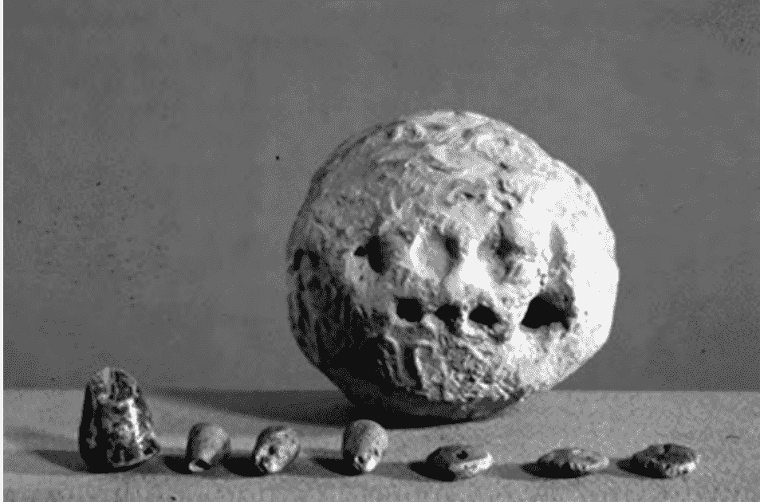

下一个重要的创新可以追溯到中世纪晚期。随着黑暗时代的结束和贸易的增长，一些企业变得太大，无法由一个家庭管理。最早的现代银行可以追溯到这个时期；通过在多个城市设立分支机构，它们可以高效地为贸易提供资金。但随着经济的增长，有必要从外部聘请经理人，业主的家族无法对他们进行密切监督。这带来了欺诈风险的增加，而演变出来的控制机制是复式记账。人们过去认为这是在意大利于 14 世纪某个时候发明的，尽管第一本关于它的书籍直到 1494 年印刷机出现后才出现 [355]。然而，最近历史学家在 12 世纪开罗发现了犹太商人创建的复式记录，现在人们认为意大利人从他们那里学到了这种技术 [1140]。

### 10.1.2 复式记账

复式记账的理念非常简单，就像大多数有巨大影响力的理念一样。每笔交易都会在两本独立的账簿上进行记录，一本借方，一本贷方。例如，当一家公司向客户以信用方式销售价值 100 美元的商品时，它会在销售账户上贷记 100 美元，并在应收账户上借记 100 美元。当客户支付款项时，公司会在应收账户上贷记款项（从而减少应收款项的资产），并在现金账户上借记款项。（会计学校教授的原则是“借方是收款人，贷方是付款人”。）每天结束时，账簿应该平衡，即总和为零；资产和负债应该相等。（如果公司获得了一些利润，那么这是对股东的一种负债。）除了最小的公司外，账簿将由不同的职员进行记录，并且每个月（在银行中，每天）都必须平衡。

通过合适的账本系统设计，我们可以确保每个店铺或分支都可以单独平衡。因此，每个收银员在晚上将她的现金盘平衡后锁在保险库中；现金账本中的借方应该与她收集到的实际纸币完全平衡。因此，大多数欺诈行为需要两个或更多员工的勾结；这种分割责任的原则，也被称为双重控制（Dual Control），由审计来补充。不仅年底对账簿进行审计，还会进行随机审计；一组检查员可能会突然到达一个分支机构，并要求员工在回家之前平衡所有账簿。

### 10.1.3 电子商务的电报历史

许多困扰电子商务的问题源于流行观念，即电子商务是在 1990 年代中期发明的全新事物。这是完全不真实的。

从古代开始，各种各样的视觉信号系统被部署起来，包括使用镜子在接收器上闪烁阳光的日光反射仪（heliographs），使用移动臂的位置来信号化字母和数字的号旗（semaphores）和旗帜。陆地系统通过一系列的信标塔发送消息，海军系统在船舶之间中继传递消息。起初，它们的使用是军事目的，但拿破仑战争后，法国政府将其日光仪网络开放给商业使用。很快，第一起欺诈行为就发生了。在被发现之前的两年里，两名银行家贿赂了一名操作员，通过在传输中制造错误，他们可以从安全距离观察到这些错误，以秘密地向他们传递股市的动向。其他技术被设计用来信号化赛马的结果。

政府曾试图通过各种法律来将这种行为定为犯罪行为，但这些法律是无效的。对于博彩商来说，唯一的解决办法是通过时钟来“宣布时间”，而不是等待结果并希望自己是第一个听到结果的人。

从 18 世纪 60 年代到 19 世纪 40 年代，电报机由许多先驱者开发，其中最有影响力的是塞缪尔·莫尔斯（Samuel Morse）。他在 1842 年说服国会资助一条从华盛顿到巴尔的摩的实验线路；这给人们留下了深刻的印象，从而开始了严肃的商业投资，到那个十年结束时，由 20 家公司运营的线路总长达到了 12,000 英里。这与 20 世纪 90 年代末的互联网繁荣非常相似。

银行是电报的首批大规模用户，他们决定需要技术保护机制，以防止不诚实的操作员在传输过程中篡改交易。（我在 5.2.4 节中讨论了他们为此目的开发的测试密钥系统。）电报也被用于创建国家市场。纽约的商品交易商首次可以在几分钟内了解到芝加哥拍卖会上的价格，而抵达波士顿的渔船船长可以了解到格洛斯特的鳕鱼价格。这一时期的历史表明，维多利亚时代的人们对电子商务的大部分概念和问题都很熟悉 [1215]。

你怎么知道你在和谁交谈？你怎么知道他们是否值得信任？你怎么知道货物是否会被送达，付款是否会到账？19 世纪找到的答案涉及中介机构，主要是帮助企业管理风险的银行，他们使用参考、担保和信用证等工具。

### 10.2 银行计算机系统的工作原理

银行是最早使用计算机进行簿记的大型组织之一。它们始于 20 世纪 50 年代末和 60 年代初，最初用于支票处理等应用。一旦它们发现即使是那个时代的慢速和昂贵的计算机也比大批文员便宜得多，它们就开始自动化其大部分后勤操作。

20 世纪 60 年代和 70 年代。20 世纪 60 年代，银行开始为其企业客户提供自动化工资单服务，到了 20 世纪 70 年代，它们开始支持基于电子数据交换（EDI）的企业间电子商务，通常是通用汽车到马克斯和斯宾塞等公司建立了系统，使他们能够将计算机与供应商的计算机连接起来，以便自动订购商品。旅行社建立了类似的系统，以实时从航空公司订购机票。自 20 世纪 70 年代以来，ATM 大规模出现，20 世纪 80 年代出现了在线银行系统，20 世纪 90 年代出现了基于网络的银行。然而，这些花哨的前端系统仍然依赖传统的后勤自动化来维护账户数据和进行结算。

用于簿记的计算机系统通常声称实现复式记账主题的变体。但是控制的质量很不稳定。复式记账功能可能只是用户界面中的一个外观，而底层文件格式没有完整性控制。即使分类账都保存在同一系统上，拥有根访问权限的人或者拥有物理访问权限和调试工具的人可能能够更改记录，以便绕过平衡控制。也可能以各种方式规避平衡控制；员工可能会注意到软件中的错误并利用它们。尽管存在所有这些问题，但在大多数发达国家的法律要求公司拥有有效的内部控制，并使管理者对其负责。这些法律是投资信息安全机制的主要推动力，但也是许多浪费投资的原因。因此，我们需要更详细地研究电子簿记的机制。

一个典型的银行系统有许多数据结构：
- **账户主文件**：其中包含每个客户的当前余额以及过去九十天的交易记录；
- **分类账**：用于跟踪现金和其他资产在系统中的流动；
- **日志**：用于保存从出纳台、现金机、支票分拣机等地收到但尚未输入到分类账中的交易；
- **审计追踪**：记录员工的操作及时间。

处理这些数据结构的处理软件将包括一套过夜批处理程序，将日志中的交易应用到各个分类账和账户主文件中。在线处理将包括多个模块，将交易记录到相应的分类账组合中。因此，当客户向他的储蓄账户存入 100 美元时，出纳员将进行一笔交易，将 100 美元的贷方记录到客户的储蓄账户分类账中，同时将同样金额的借方记录到现金分类账中，记录抽屉中的金额。所有分类账始终应该加起来等于零，这是一个重要的检查；如果银行（或其分支机构）的账目不平衡，将会触发警报，人们将开始寻找原因。

在隔夜批处理运行期间，账本系统提供的不变量每天进行检查，这意味着想要增加自己账户余额的程序员必须从其他账户中取钱，而不能通过调整账户主文件来凭空创造。

就像传统企业中有不同的分类账由不同的职员管理一样，在银行数据处理中心中，不同的子系统由不同的程序员负责管理。此外，所有代码都要经过内部审查员的审查，并由一个独立的测试部门进行测试。一旦获得批准，它将在一个只有批准的目标代码和数据的生产机器上运行，而没有开发环境。

### 10.2.1 Clark-Wilson 安全策略模型

尽管此类系统自 20 世纪 60 年代以来就已经存在，但直到 1987 年，才由 Dave Clark 和 Dave Wilson（前者是计算机科学家，后者是会计师）引入了它们的安全策略的正式模型 [295]。在他们的模型中，某些数据项受到限制，只能由一组特定的转换过程操作。

更正式地说，有特殊的程序可以将数据输入——从一个不受限制的数据项（UDI）转换为一个受限制的数据项（CDI）；完整性验证程序（IVP）用于检查任何 CDI 的有效性（例如，账目是否平衡）；以及转换程序（TP），可以在银行业务中被视为保持平衡的交易。在一般的表述中，它们维护 CDI 的完整性；它们还向一个只追加的 CDI（审计跟踪）写入足够的信息，以便可以重建交易。访问控制是通过三元组（主体，TP，CDI）实现的，这些三元组的结构使得双重控制策略得以执行。其规则如下：

- 1. 系统将具有用于验证任何 CDI 完整性的 IVP；
- 2. 对任何 CDI 应用 TP 必须保持其完整性；
- 3. 只能通过 TP 更改 CDI；
- 4. 主体只能对特定 CDI 发起某些 TP；
- 5. 三元组必须对主体实施适当的分离职责策略；
- 6. 某些特殊的 UDI 上的 TP 可以产生 CDI 作为输出；
- 7. 每个 TP 的应用都必须导致足够的信息被写入特殊的只追加 CDI，以便重建它；
- 8. 系统必须对试图启动 TP 的主体进行身份验证；
- 9. 系统只允许特殊主体（即安全官员）对授权相关列表进行更改。

关于 Clark-Wilson 有几点需要说明：

首先，与 Bell-LaPadula 不同，Clark-Wilson 涉及维护状态。即使忽略审计跟踪，这通常对于双重控制也是必要的，因为您必须跟踪哪些交易已经部分批准——例如，只有一个经理批准时需要两个经理批准的交易。如果使用访问控制机制实现双重控制，通常意味着将部分批准的交易保存在特殊的日志文件中。这意味着一些用户状态实际上是安全状态，这反过来使得可信计算基础更难定义。如果使用加密来实现，例如，让经理为他们批准的交易附加数字签名，那么管理所有部分批准的交易以便它们及时到达第二个批准者可能会出现问题。

其次，该模型并不能做到一切。它捕捉到了状态转换应该保持不变量（如余额），但并没有保证状态转换是正确的。这个模型并不能阻止错误的转换，比如将钱支付到错误的银行账户。

第三，克拉克-威尔逊回避了最难的问题，即：我们如何控制来自不诚实员工的风险？规则 5 指出必须支持“适当的责任分离政策”，但并没有明确说明这意味着什么。事实上，在会计文献中很难找到任何系统性的描述如何设计内部控制的内容，这是审计师往往在工作中学到的东西。公司的内部控制往往会随着时间的推移而根据实际或担心的事件而演变，无论是公司自身的经验还是审计师的经验。在下一节中，我试图从在银行和咨询领域工作了几年以及最近在我们大学的财务和其他委员会工作中积累的经验中提炼出一些原则。

### 10.2.2 设计内部控制

多年来，会计职业、股票市场和银行监管机构提出了许多关于会计和内部控制系统设计的标准。例如，在美国有赞助组织委员会（COSO），这是一个由美国会计和审计机构组成的团体 [318]。这种自我监管未能阻止互联网泡沫时代的过度行为，在安然（Enron）公司倒闭后，美国立法者通过 2002 年的萨班斯-奥克斯利法案进行了干预。该法案保护举报者（严重内部欺诈的主要信息来源），其第 404 条使管理人员负责维护“适当的财务报告内部控制结构和程序”。

它还要求审计师证实管理层对这些控制措施的评估，并披露任何“重大缺陷”。首席执行官还必须对财务报表的真实性进行认证。此外，还有 1999 年的格拉姆-利奇-布利利法案，在许多方面放宽了银行监管。

## 第10章 银行和簿记

这要求银行必须具备安全机制，以保护信息免受可预见的安全和完整性威胁。与医疗领域的HIPAA一起，《格拉姆-利奇-布雷利法案》（GLBA）和《萨班斯-奥克斯利法案》（SOX）推动了21世纪早期信息安全和内部控制的大部分投资。（其他国家也有类似的规定；在英国，这是金融报告委员会的特恩布尔（Turnbull）指导方针。）我将在第三部分回顾并更详细地讨论政策方面。

在本节中，我关注的是技术方面。现代风险管理系统通常要求公司识别和评估其风险，然后建立控制措施来减轻风险。公司的风险登记表可能包含许多页面，例如“内部人员进行大额未经授权的银行交易”。其中一些问题将通过非技术措施（如保险）来减轻，但其他问题将落到你的头上。那么，你如何解决这样的问题呢？

基本上有两种责任分离政策：双重控制和功能分离。

在双重控制中，两个或更多员工必须共同行动才能授权交易。经典的军事例子是核指挥系统，可能需要两名军官同时在无法单人同时到达两个锁的控制台上转动钥匙。我将在后面的章节中进一步讨论核指挥和控制。经典的民用例子是银行发出担保函，通常承诺在另一家银行的贷款出问题时承担损失。

担保函特别容易受到欺诈；如果你能让A银行为你从B银行获得贷款提供担保，那么B银行就在监督你的账户，而A银行的钱处于风险之中。一个不诚实的商人通过伪造或腐败地获得担保函，可以慢慢掠夺B银行的贷款账户，只有当他潜逃并且B银行要求A银行支付款项时，才会引起警报。如果一个单一的经理可以发出这样的工具，诱惑力将是巨大的。我将在第10.3.2节中进一步讨论这个问题。通过功能分离责任，两个或更多不同的员工在交易的不同环节上行动。经典的例子是公司采购。经理做出采购决策并告诉采购部门；一个职员在那里提出采购订单；店员记录货物到达；帐务部门收到发票；帐务职员将其与采购订单和存货收据进行核对并开具支票；帐务经理签署支票。

然而，它并不止于此。现在，经理每月在她的对账单上收到一笔借方，她的老板会审核账目，确保部门的利润目标有望实现，内部审计部门可以随时对部门的账簿进行随机采样。最后，当发现欺诈行为时，公司的律师可能会努力追回资金。

因此，该模型可以描述为：预防-检测-恢复。对于这三个方面的依赖程度将取决于应用场景。

在检测可能被延迟数月或数年，恢复因此可能非常困难的情况下，采取额外的预防措施是明智的，例如使用双重控制技术。

在预防困难的情况下，你应该确保检测足够快，恢复足够有力，以提供威慑效果。经典的例子是银行出纳员很容易拿走现金，所以你需要每天清点钱，并在之后抓住他们。

簿记和管理控制不仅是最早的安全系统之一，也催生了许多管理科学和民法。它们与公司的业务流程交织在一起，并存在于其文化背景中。在瑞士银行，几乎所有事情都需要两个经理的签名，而美国人则更加放松。在大多数国家的银行，员工需要进行背景调查，可以随机从一项任务转移到另一项任务，并被迫每年至少休假一次。这在典型的大学中是不可接受的，但在学术界，欺诈的机会要少得多。

设计一个内部控制系统很困难，因为它是一个高度跨学科的问题。财务控制员、人事部门、律师、审计师和系统人员都从不同的方向来解决问题，提供部分解决方案，无法理解彼此的控制目标，结果事情落入了中间的漏洞。人为因素往往被忽视，系统最终容易受到乐于助人的下属或专制管理者的攻击，导致双重控制失败。重要的不仅是将控制措施与文化相匹配，还要激励人们使用它们；例如，在管理良好的银行中，管理控制措施被营销给员工，作为保护他们免受勒索和绑架的手段。

迄今为止，安全研究人员主要关注问题的一小部分，即创建双重控制（或者一般情况下，存在多个主体时的共享控制）系统。即使这样也并不容易。例如，Clark-Wilson规则9指出安全人员可以更改访问权限——那有什么办法阻止安全人员为两个经理创建登录并将所有银行的钱转到瑞士呢？

理论上，你可以使用密码学，将签名密钥分割给两个或更多个主体。在Windows网络中，管理事物的明显方法是将用户放在单独管理的域中。在使用主机操作系统MVS的传统银行系统中，您可以在系统管理员和审计员之间分离职责；前者可以做任何他想做的事情，除了发现后者正在监视的活动。

但在现实生活中，双重控制很难从头到尾做到，因为存在许多系统接口，这些接口可能成为单点故障，而且在任何情况下，分割责任的系统管理是繁琐的。

因此，实际上，大多数银行系统管理员都有能力进行这种类型的欺诈。有些人尝试过，但是当后台平衡控制在一两天后触发警报，而洗钱控制则阻止其带走太多资金时，他们就失败了。我将在10.3.2节进一步讨论这个问题。在这里要记住的是，串行控制在预防、检测和恢复模型中通常比共享控制更重要。它们最终依赖于系统中的某些持久状态，并且与程序员希望通过使事务具有原子性来保持简单的愿望存在紧张关系。

还存在一些状态一致性问题。例如，一个会计师知道他明天将被提升为经理，他能否同时进行一笔大额转账的两个授权？对此的技术修复可能涉及支持原始的“X只有在他没有做Z时才能做Y”的中国墙机制（“只有在付款创建者的名字中没有他的名字时，经理才能确认付款”）。因此，我们将得到一些涉及个人、群组和对象标签的排除和其他规则；一旦规则数量变得很大（在真实的银行中会变得很大），我们需要一种系统的方法来检查这个规则集并验证它是否有任何可怕的漏洞。

在中期，银行安全政策——就像医疗安全政策一样——可能会在使用基于角色的访问控制（RBAC）方面找到最方便的表达方式，尽管这通常是在银行中间件中实施，而不是在诸如Windows或Linux之类的底层平台中实施。真实系统将需要使用并行元素（例如双重控制）和串行元素（例如沿着交易路径的功能分离）来管理分离职责政策。这表明访问控制机制应该靠近应用程序。但是，当然，它们很可能更复杂、专有，并且不像操作系统附带的机制那样被广泛研究。

银行内部控制的一个非常重要的方面——以及系统一般——是尽量减少“系统管理员”的数量，也就是说，减少具有对整个系统完全访问权限和更改权限的人员。几十年来，标准做法一直是将开发人员与实时生产系统完全分开。过去，传统银行通常会有两台主机，一台用于运行实时系统，另一台是备份机器，通常用于开发和测试。程序员将创建新软件，由测试部门进行测试，并由内部审计员进行源代码审查；一旦获得批准，将交由变更管理部门在下次升级时安装到实时系统中。实时系统将由运营团队运行，他们没有编译器、调试器或其他工具的访问权限，这些工具可以让他们修改实时代码或数据。

理论上，这可以防止程序员滥用权限，在实践中也可以相当好地发挥作用。然而，仍然存在一些漏洞。首先，总有一些系统管理员需要完全访问权限才能完成工作；其次，总会发生紧急情况。周末ATM系统崩溃，ATM团队的值班程序员被授予从家中访问实时系统的权限，以便修复错误。您尽可能地审计此类访问，但是如果您的高级系统管理员比您的审计员更有知识，他们确实可以做出不好的事情。实际上，在我帮助过的银行中，您可能会发现有三十或四十个人，您只能信任他们——首席执行官、首席交易员、高级系统管理员和其他一些人。了解这些人是很重要的，并且要尽量减少他们的数量。给他们高薪，并悄悄观察他们是否开始花更多钱。

对于涉及多个组织的交易来说，双重控制通常是不够的，因为争议解决很困难：“我的两个经理说钱已经汇出了！”“但是我的两个经理说没有！”

### 10.2.3 出了什么问题

盗窃可以采取多种形式，从纯粹的机会主义者到聪明的内部欺诈；但是经验表明，大多数公司的盗窃行为都是由内部人员造成的。有很多调查；一份典型的调查报告，由会计师事务所安永（Ernst and Young）进行，报告称最严重的欺诈行为中有82%是由员工犯下的；近一半的犯罪者在公司工作超过五年，其中三分之一是经理。

典型的计算机犯罪案例包括：

- 保罗·斯塔布斯（Paul Stubbs）是汇丰银行的密码重置文员，与不明身份的人合谋更改了AT&T用于访问其银行账户的密码。新密码被用于将1180万英镑（超过2千万美元）转移到离岸公司，但未能追回。斯塔布斯是一个脆弱的年轻人，在内部考试不及格后被雇为密码重置文员；法庭对他表示宽恕，他逃脱了五年的刑期。据称，一名AT&T员工涉嫌串谋掩盖这些交易，但该绅士被宣判无罪。
- 一家银行有一个悬而未决账户系统，如果交易中的一方无法被识别（例如在资金转账时输入错误的账号），则会暂时使用该系统。这是为了应对双重控制系统中的问题而添加的一种解决方法，用于处理无法立即平衡的交易或丢失的交易。由于这是一个潜在的漏洞，银行规定如果悬而未决账户在三天内未结清，将进行调查。其中一名职员利用这一点，设置了一个计划：她会将借方记入悬而未决账户，并将相同金额的贷方记入她男朋友的账户；三天后，她会再次记入借方以偿还第一笔借款。在将近两年的时间里，她获得了数十万美元的利润。最后，当她无法再追踪日益增长的虚假交易时，她被抓住了。（银行疏忽地忽视了一项监管要求，即所有员工必须连续休假至少十天，距离上次休假不得超过十五个月。）
- 一个教育机构的职员想要去澳大利亚探亲，为了筹钱，她创造了一个虚构的学校，包括员工，他们的工资被支付到她自己的银行账户。当有人注意到不同的记录给出了不同数量的学校时，才偶然发现了这一点。
- 英格兰黑斯廷斯的一名银行职员注意到分行的计算机系统没有审计地址更改。他选择了一个账户中有很多钱的客户，该客户一年才收到一次对账单；然后他将该客户的地址更改为自己的地址，发行了一张新的ATM卡和密码，随后将地址更改回原来的值。他从客户账户中盗取了8600英镑，当客户抱怨时，没有人相信她：银行坚称其计算机系统是绝对可靠的，所以提款一定是客户的错。只有当这名职员良心发现，开始在夜间通过分行的信箱塞入他偷来的现金时，这个问题才得以解决。由于人们通常不会白给银行钱，分行经理最终意识到出现了严重的问题。

大规模犯罪，如信用卡欺诈，通常依赖于责任规则。在许多欧洲国家，银行可以告诉投诉欺诈的客户“走开”，银行员工知道投诉不会得到适当调查，因此变得粗心。在美国，根据《E条例》（Regulation E），在有争议的交易案件中，证据责任完全落在银行身上。

我将在下面的第10.4节中详细讨论这个问题。所有真正大规模的欺诈案件——超过十亿美元的案件——都涉及松散的内部控制。巴林银行的崩溃是一个很好的例子：管理人员未能控制住贪婪的交易者尼克·利森（Nick Leeson），他们被他表面上的交易利润所蒙蔽，以此获得奖金。对于其他金融领域的欺诈案件也是如此，比如Equity Funding丑闻，其中一家保险公司的管理层在他们的计算机系统上创建了成千上万个虚假人物，对他们进行了保险，并将保单出售给再保险商；还有其他行业，例如罗伯特·麦克斯韦尔（Robert Maxwell）在英国掠夺了《每日镜报》的养老基金。（有关计算机犯罪案例的收集，请参阅Parker [1005]。）无论是受害者的高层管理层极其疏忽（如巴林银行的情况），还是管理层直接实施了骗局（如Equity Funding和Maxwell的情况）。

审计师也是一个问题。一方面，他们是由公司的管理层任命的，因此在检测管理层涉及的欺诈行为方面表现很差；因此，股东得到的保证比许多人想象的要少。（安然公司破产后的法律纠纷摧毁了其审计师安达信，从而将“五大”审计公司减少为“四大”；现在审计师竭力避免对欺诈承担责任。）其次，多年来存在着巨大的利益冲突，会计师提供廉价审计以便进入市场，然后通过系统咨询赚取真正的利润。（自安然公司以来，这一情况得到了极大的限制。）第三，大型审计公司有自己喜欢的控制措施清单，这些措施往往与客户的真实风险关系不大，甚至可能使情况变得更糟。

例如，我们大学的审计师每年都催促我们让所有员工每个月更改密码。这个建议是错误的，原因在第2章中解释——所以每年我们都指出这一点并质疑他们为什么要这样建议。但他们似乎无法学习，并且没有动力：他们可以预料到吹毛求疵，并忽视任何证据，直到证据变得压倒性为止。虽然不披露重大弱点可能会给他们带来麻烦，至少在美国是这样，但吹毛求疵已经成为他们的一项赚钱工具。据估计，审计师对《萨班斯-奥克斯利法案》的过度要求每年给美国上市公司平均造成240万美元的审计费用，以及70,000小时的内部工作以确保合规性；SOX的总成本可能高达1.4万亿美元。（根据我的建议，不要使用四大会计师事务所；较小的公司更便宜，我的学生泰勒·摩尔进行的一项研究未能找到任何证据表明由四大会计师事务所审计的公司在股票市场上表现更好。）

不断变化的技术也有侵蚀控制措施的习惯，因此需要不断关注和维护。例如，由于新的高速银行支票处理系统，加利福尼亚的银行几年前停止了对存款人要求支票有两个签名的要求。即使支票上印有“需要两个签名”，银行也只会接受一个签名的支票。这可能看起来是客户安全的问题，而不是银行的问题，但银行支票也可能存在风险，如果在商户交易中出现问题，银行仍然可能被起诉。

需要学到的教训包括：

- 并不总是明显哪些交易是安全敏感的；在不断变化的环境中维护一个正常工作的安全系统可能很困难；
- 如果你依赖客户的投诉来发现欺诈行为，你最好听取他们的意见；
- 总会有一些相对被信任的人能够骗取一段时间的钱；
- 没有安全政策会是完全严格的。总会有人为了应对现实生活而寻找变通方法；这些变通方法自然会产生漏洞。因此，交易错误率越低越好。

总会存在残留风险。管理这些残留风险仍然是最困难和最被忽视的工作之一。这不仅意味着技术措施，如将知识渊博的行业专家、审计师和保险人员纳入详细设计，并在一些损失历史可用后迭代设计。这还意味着培训经理、审计师和其他人员以便及时发现问题并做出适当反应。我将在第三部分重新讨论这个问题。

英语国家的银行的一般经验是每年有大约1%的员工被解雇。典型的罪行是小额挪用，损失几千美元。没有人找到有效的方法来预测哪些员工会变坏；之前忠诚的员工可能会因离婚等冲击而失控，或者随着时间的推移发展出赌博或酗酒习惯。每年失去几百名出纳员只是被视为一种经营成本。银行很难应对的是高层人员出现问题的情况——实际上，在我的经验中，有几起案例中，银行竭尽全力避免承认高级内部人员是不诚实的。经理们不愿面对的风险，他们往往无法控制。巴林银行的任何人都不愿意去想他们的明星交易员利森可能是个骗子；结果银行破产了。

最后，仅仅在审计或安全调查时检查账簿的内部一致性是不够的。同样重要的是检查其与外部现实的一致性。这一点在1938年麦克森和罗宾斯（McKesson & Robbins）公司的崩溃中被会计界深刻认识到，该公司是一家规模庞大、知名度高的药品和化学公司，报告的资产为1亿美元。结果发现，记录的资产和库存中有20%是不存在的。总裁菲利普·穆西卡原来是一个冒名顶替者，他之前有一项欺诈罪名；他和他的三个兄弟通过一个涉及虚假外国药品业务的假船务代理和一个虚假的蒙特利尔银行来夸大公司的财务数据。审计师在接受麦克森公司账目时没有对公司的老板进行询问，也没有检查库存，没有与客户核实应收账款，也没有考虑公司内部职责的分离。从那次事件中得到的教训显然没有学得足够好，因为同样的问题仍然经常发生，无论是在小公司和大公司的小分支，还是在像安然这样的大公司。

因此，如果你在一个金融（或其他）公司负责安全，你应该认真考虑你的哪些经理可能与客户或供应商串通欺诈你的公司。一个分行经理是否可能向他的表弟经营的可疑企业借款，并以伪造的抵押品作为担保？他是否可能向不存在的人出售人寿保险，并伪造他们的死亡证明？一个运营经理是否可能收受供应商的贿赂？你的呼叫中心员工是否可能将客户密码卖给黑社会？很多事情可能出错；你必须弄清楚哪些事情是重要的，以及如何找出答案。记住：一个可信任的人就是一个可以伤害你的人。谁可以伤害你，以及如何伤害你？这是一个内部控制设计者必须不断思考的基本问题。

## 10.3 批发支付系统

当人们想到电子银行欺诈时，他们常常想象一个好莱坞场景，在这个场景中，狡猾的俄罗斯黑客破解了银行的代码，并向避税天堂发送了数百万美元的电汇。电子转账系统确实是复杂犯罪的偶尔目标，而且在一个半世纪以来一直如此，正如我在5.2.4节中提到的那样，当我讨论测试密钥系统时。

到了20世纪70年代初，银行们开始意识到这个值得尊敬的古老维多利亚系统需要进行改革。

首先，大多数测试密钥系统在理论上至少对密码分析是脆弱的；一个观察了多个交易的人可以逐渐推断出密钥材料。

其次，尽管测试密钥表被保存在保险柜中，但实际上没有什么可以阻止员工在进行授权消息测试的同时，为未经授权的消息计算测试。理论上，你可能要求两名员工从保险柜中取出表格，坐在面对面的桌子旁进行计算。然而，在实践中，人们会在一个角落里依次工作（毕竟表格是秘密的），即使你能强迫他们一起工作，一个不诚实的员工也可能在计算授权消息的同时，心算出未经授权消息的测试。在一个授权的测试上进行测试，因此在现实中，测试密钥方案不支持双重控制。由一个员工计算测试并由另一个员工检查，风险加倍而不是减少。（有一些方法可以使用手动验证器进行双重控制，例如让两个员工使用不同的表格计算出不同的代码；还有其他技术用于核武器的控制，在13.4节中将进行讨论。）

第三，成本和效率是一个大问题。在银行的计算机打印出电传室的交易，手动计算测试，然后撰写给另一家银行的电传，检查测试，再输入到另一家银行的计算机中，这似乎没有什么意义。错误比欺诈更成问题，因为电传操作员会引入打字错误。错误地将大额支付存入客户账户后，客户有时只是花掉这笔钱。在一个案例中，错误的收款人花了一部分意外收入请聪明的律师帮助他保住了这笔钱。这震惊了整个行业。难道支付不能直接从一家银行的计算机流向另一家银行吗？

### 10.3.1 SWIFT

国际银行间金融电信协会（SWIFT）成立于20世纪70年代，由一家银行联盟组成，旨在为成员银行之间的支付指令传输提供比电传更安全和高效的方式。可以将其视为具有内置加密、身份验证和不可否认服务的电子邮件系统。它的重要性不仅在于每天用于全球数万亿美元的资金转移，而且在于其设计已被用于处理许多其他类型的无形资产，从股票到提单。

设计约束非常有趣：
- 银行不希望信任SWIFT，也就是说，不希望允许那里的不诚实员工伪造交易。
- 身份验证机制必须独立于保密机制，因为当时一些国家（如法国）禁止使用密码技术进行保密。
- 不可否认功能必须在没有数字签名的情况下提供，因为当时尚未发明数字签名。
- 最后，银行必须能够对银行间交易实施Clark-Wilson类型的控制。（Clark-Wilson也尚未发明，但其组成部分，如双重控制、平衡、审计等已经得到了很好的建立。）

SWIFT设计总结如图10.2所示。通过在发送银行计算消息认证码（MAC）并在接收银行进行检查来确保消息的真实性。用于此MAC的密钥曾经是端到端管理的：每当一家银行与海外建立关系时，负责谈判的高级经理都会与对方交换密钥，无论是面对面会议还是之后通过邮寄到对方家庭地址。通常会有两个关键组件。

## 第330章 银行和簿记

为了最小化被攻击的风险，通常会分别发送两个关键组件（因为即使银行经理的邮件在一个地方的邮箱中被犯罪分子阅读，也不太可能同时发生在两个地方）。只有在两家银行都确认已安全接收并安装了密钥后，密钥才会被启用。

这样，SWIFT在消息认证中没有任何参与；只要使用的认证算法是可靠的，他们的员工就无法伪造交易。所使用的认证算法被认为是商业机密；但由于银行希望他们的安全机制成为国际标准，一个自然的查找地点可能是ISO 8731 [1094]中描述的算法。通过这种方式，他们得到了最糟糕的情况：算法在没有公开分析的情况下投入使用，但一旦需要更改就变得非常昂贵！在ISO 8731消息认证算法中发现了一种攻击，并在[1040]中发表，但幸运的是，需要超过100,000条消息才能恢复一个密钥——这对于谨慎使用的典型系统来说太大了，不会受到实际攻击的影响。

尽管SWIFT本身在消息认证的信任范围之外，但它提供了不可否认的服务。每个国家的银行将其消息发送到区域总处理器（RGP），该处理器记录并将其转发给SWIFT，SWIFT也记录并将其发送给接收者通过其所在国家的RGP，该处理器也记录。通常，RGPs由不同的设施管理公司运营。因此，一个银行（或一个不诚实的银行员工）想要不诚实地否认已完成的交易，不仅需要破坏本地SWIFT应用程序及其周围的控制，还需要破坏两个不同国家的独立承包商。请注意，多重日志记录的否认控制比完整性控制更好。一个不诚实的银行想要声称已完成的交易实际上没有完成，可以尝试在其他银行和其RGP之间插入消息；而一个不诚实的银行员工可能只是直接将虚假的传入消息插入到本地系统中。因此，日志记录可以是使否认变得困难的强大方式，对于法官来说，比起加密术更容易理解。

图10.2: SWIFT架构

机密性依赖于银行之间和RGP节点之间以及这些节点与主要SWIFT处理站点之间的线路加密设备。首先，密钥管理是直接的。密钥是通过租用线路两端的设备之间的EEPROM芯片携带的。在机密性是非法的国家，可以省略这些设备而不会损害真实性和不可否认性机制。

通过使用专用终端（在小型银行中）或可以与银行的主要生产系统集成的主机软件包来提供双重控制。通常的操作方法是由三个独立的员工进行SWIFT交易：一个输入，一个检查，一个授权。（由于检查员可以修改消息的任何方面，这实际上只提供了双重控制，而不是三重控制——并且维护接口的程序员始终可以攻击系统）。通过将交易与从对应银行电子接收的每日对账单进行核对来提供对账。这意味着成功将伪造消息放入系统的人将在两三天内引起警报。

### 10.3.2 出了什么问题

SWIFT在二十年间没有一起外部欺诈报告。在1990年代中期，通过添加公钥机制对其进行了改进；MAC密钥现在使用公钥密码学在对应银行之间共享，并且MAC本身可能进一步通过数字签名进行保护。密钥管理机制已被确立为ISO标准11166，而该标准又被其他系统（如CREST）所使用，CREST用于银行和股票经纪人注册和转让英国股票和股份。关于这种架构的安全性存在一些争议 [73, 1094]。除了由于采用公钥密码学而带来的信任集中化（即中央认证机构可以错误地认证一个密钥属于一家银行，而实际上并不属于该银行），CREST采用了512位的公钥，而这个长度太短了：正如我在密码学章节中提到的，至少有一个这个长度的RSA公钥被一群学生秘密地分解了 [24]。

然而，对这些系统的主要实际攻击并没有涉及支付机制本身。典型的攻击来自银行程序员将虚假消息插入处理队列中。通常失败是因为他不了解系统中的其他控制措施，或者围绕大额转账的程序控制措施。例如，银行之间保持彼此的账户，所以当银行A向银行B的客户汇款时，实际上是发送一条指令“请从我们在你们那里的账户中支付给这个客户以下金额”。由于这些账户既有余额又有信用额度，大额支付不是完全自动处理的，而是需要交易室的干预，以确保所需的货币或信用额度可用。因此，一百万美元左右的转账往往需要管理层的干预，而技术人员对此一无所知；此外，还有一些过滤器用于查找大额交易，以便银行在需要时向洗钱机构报告。还有常规因素，即任何开设银行账户、收到大额汇款，然后疯狂转移资金的人过去需要一个非常有说服力的借口。（自9/11以来，常识已经不再是一个后盾，因为客户尽职调查和反洗钱规定已经变得正式和繁琐；银行员工更多地依赖于打勾，这对坏人来说更容易 [55]。）无论如何，将虚假交易插入系统的程序员通常在他来领取现金时被逮捕。如果你的人生目标是从事银行欺诈，那么最好获得会计或法律学位，在贷款办公室工作，而不是玩弄计算机。

其他可能的技术攻击，例如将特洛伊木马软件插入银行经理用于发起交易的个人电脑，窃听从分行到银行主机的连接，颠覆银行经理用于登录的认证协议，甚至在分行局域网中插入虚假交易以使其出现在相关打印机上——也将受到业务流程控制的限制。事实上，大多数大规模银行欺诈案件的成功并不是通过技术攻击，而是利用了程序漏洞。

- 经典的例子是保函。一个国家的公司为另一个国家的公司提供贷款担保是很常见的。这可以设置为SWIFT消息，甚至是纸质信函。但是，由于在此时没有现金交易，因此平衡控制是无效的。如果一个伪造的保函被接受为真实，“受益人”可以从接受银行借钱，洗钱并消失。只有当受害银行意识到贷款已经变坏并试图追索保函时，伪造行为才会被发现。
- 在1986年，发生了一起有趣的欺诈案件，发生地点在伦敦和约翰内斯堡之间。当时，南非政府设立了两个汇率，而在一家银行中，负责决定每笔交易适用哪个汇率的经理与伦敦的一个富人串通。他们以七兰特兑换一英镑的汇率将资金汇出到约翰内斯堡，然后在第二天以四兰特兑换一英镑的汇率将资金汇回。经过两周的这种操作，当局开始产生怀疑，警察上门调查。在看到他们进入交易室后，经理立即逃离，甚至没有停下来拿上他的夹克，他驾车越过边境前往斯威士兰，然后经内罗毕飞往伦敦。在那里，他向媒体吹嘘自己是如何欺骗邪恶的种族隔离制度的。由于英国没有外汇管制，外汇管制欺诈不是一项罪行，因此他无法被引渡。阴谋者们逃脱了数百万的损失，而银行甚至无法起诉他们。
- 也许最著名的资金转移诈骗案发生在1979年，当时计算机顾问斯坦利·里夫金（Stanley Rifkin）从Security Pacific National Bank盗取了一千万美元。他通过同意从瑞士的俄罗斯政府机构购买一大批钻石来规避洗钱控制。他通过观察内部用于口头指示转账给电汇部门的授权代码，然后通过电话简单地使用该代码进行转账（这是一个系统接口上的双重控制失效的典型案例）。他甚至在美国银行假日前夕进行交易，给自己争取了额外的逃跑时间。他的错误在于没有计划在收集到钻石后该怎么办。如果他把钻石藏在欧洲，回到美国并帮助调查诈骗，他很可能会逃脱；但事实上，他最终逃亡失败并被捕获。

系统设计课程没有改变：我们必须时刻警惕那些违背双重控制理念的事情。然而，随着时间的推移，我们必须从更广泛的背景中来看待它。即使我们能够解决系统管理、接口等技术问题，仍然存在业务流程问题，即我们控制的内容——很多关键交易在初步检查时并不显眼。

## 10.4 自动取款机

通过研究自动取款机（ATM）的安全性，我们可以得出关于双重控制的困难和限制的另一组教训。自动取款机，也被称为现金机，是20世纪最具影响力的技术创新之一。

自动取款机是第一个大规模零售交易处理系统。它们于1938年由发明家卢瑟·西姆杰安（Luther Simjian）设计，他还设计了电子提示器和自动对焦相机。他说服花旗银行于1939年在纽约安装他的“Bankamat”机器；然而六个月后，他们撤回了机器，称“使用机器的只有一小部分妓女和赌徒，他们不想面对出纳员”。商业上的引入可以追溯到1967年，当时德拉鲁公司制造的一台机器被巴克莱银行安装在伦敦恩菲尔德。全球安装基数现在估计约为1,500,000台。为它们开发的技术现在也被用于商店的刷卡支付终端。

现代分组密码首次在ATM网络上大规模使用：它们用于在ATM内部和银行计算机中心中生成和验证安全硬件设备中的PIN。包括这项技术、分组密码、防篡改硬件和支持协议最终被用于从邮政邮票机到彩票终端等许多其他应用中。简而言之，ATM是推动现代商业密码学和零售支付技术发展的“杀手级应用”。

### 10.4.1 ATM基础知识

大多数ATM使用IBM在1970年代末为其3624系列现金机开发的某种系统的变体进行操作。卡片包含客户的主账号号码，即PAN。一个名为“PIN密钥”的秘密密钥用于加密账号号码，将其转换为十进制并截断。这个操作的结果被称为“自然PIN”；可以添加一个偏移量以得到客户必须输入的PIN。偏移量没有真正的加密功能；它只是让客户选择自己的PIN。图10.3展示了该过程的一个示例。

| 步骤项目 | 数据值 |
| :--- | :--- |
| 账号 PAN | 8807012345691715 |
| PIN密钥 KP | FEFEFEFEFEFEFEFE |
| DES的结果 {PAN}KP | A2CE126C69AEC82D |
| {N}KP 十进制表示 | 0224126269042823 |
| 自然PIN | 0224 |
| 偏移量 | 6565 |
| 客户PIN | 6789 |

图10.3: IBM生成银行卡PIN的方法

在第一台使用个人识别码（PIN）的自动取款机中，每台自动取款机都包含一份PIN密钥的副本，每张卡片上都包含了偏移量以及主账号。因此，每台自动取款机都可以验证所有客户的PIN。早期的自动取款机也可以离线操作；如果您的每周取款限额是500美元，卡片上会有一个计数器。近年来，网络变得更加可靠，自动取款机趋向于仅在线操作，这简化了设计；现在磁条上的现金计数器和偏移量已经消失，而是保存在服务器上。在过去几年中，一些国家，尤其是欧洲，已经在磁条上增加了智能卡芯片；我将在后面描述智能卡系统。然而，基本原则仍然是：使用密码学生成和保护PIN。

该系统使用防篡改硬件实现了双重控制。银行的服务器房间中保存着一个称为加密处理器（也称为安全模块）的设备，它将对客户的PIN和相关密钥进行一系列定义的操作，以实施双重控制策略。这包括以下内容：

- 1. 对客户PIN的明文值和用于计算或保护它们的密钥的操作都在防篡改的环境硬件中进行，明文值永远不会提供给银行员工的任何单个成员。
- 2. 因此，例如，卡片和PIN通过分开的渠道发送给客户。卡片在一个设备上个性化，该设备具有凸字和磁条打印机，而PIN邮件则在一个附有安全模块的打印机连接的独立设施中打印。
- 3. 每台ATM机都会提供一个终端主密钥，以两个打印的组件的形式提供给每个ATM机，这两个组件由两个不同的官员携带到分行，通过ATM机键盘输入，并组合成密钥。类似的过程（但使用三个官员）用于在银行和VISA等网络交换机之间设置主密钥。
- 4. 如果ATM机要在本地进行PIN验证，则PIN密钥将在终端主密钥下加密，然后发送到ATM机。
- 5. 如果PIN验证要在网络上集中进行，则PIN将在使用终端主密钥设置的密钥下加密。然后，它将从ATM机发送到中央安全模块进行检查。
- 6. 如果银行的ATM机要接受其他银行的卡片，则其安全模块使用以ATM密钥加密的PIN进行交易，解密并重新加密为其目标，例如使用与VISA共享的密钥。这个PIN转换功能完全在硬件安全模块内部完成，因此银行的程序员永远不会获得明文的PIN值。VISA将类似地解密PIN，并使用与发行卡的银行共享的密钥重新加密，以便能够知道相关PIN密钥的安全模块进行验证。

在20世纪80年代和90年代，硬件安全模块变得越来越复杂，因为为了支持更复杂的金融应用程序，从在线交易到智能卡，添加了越来越多的功能。一个领先产品的例子是IBM 4758——这也有公开在线学习的文档（参见 [641] 命令集和 [195] 架构和硬件设计）。我们将在关于防篡改的章节中讨论这个问题。

但是，将双重控制安全策略从单个银行扩展到全球数万家银行，就像现代ATM网络所做的那样，不是完全直接的。

- 当人们在20世纪80年代中期开始建立ATM网络时，许多银行使用软件加密而不是硬件安全模块来支持ATM。因此，理论上，任何银行的程序员都可能访问其他银行客户的PIN码。解决办法是推动安全模块使用的标准。在许多国家（例如美国），这些标准在很大程度上被忽视；但即使在尊重这些标准的地方，一些银行仍然继续使用涉及自己客户的软件进行交易。因此，一些密钥（例如用于与ATM通信的密钥）也必须以软件形式提供，并且了解这些密钥可以用来破坏其他银行客户的个人识别号码（PIN）。（我稍后会详细解释这一点。）因此，硬件TCB提供的保护很少是完整的。
- 10,000家银行之间共享密钥是不可能的，因此每家银行都连接到由VISA或Cirrus等组织提供的交换机，并且这些交换机中的安全模块将流量转换。这些交换机还进行会计核算，并使银行能够通过单一的电子借记或贷记与系统中的所有其他银行结算每天的交易。交换机是非常可信赖的，如果出现问题，后果将是严重的。在一个案例中，不仅存在安全问题，还存在不诚实的员工。交换机经理最终成为逃犯，而解决问题的费用高达数百万美元。在另一个案例中，与Y2K相关的软件升级在一个交换机上搞砸了，结果是在一天或两天内，某个国家的持卡人发现即使他们的账户是空的，他们也可以取款。这也导致了一笔非常巨大的费用。
- 为了降低处理大量交易的成本，有时会采取简化措施。例如，经常关闭授权响应的身份验证。因此，任何能够访问网络的人都可以通过简单地重放正向授权响应，使特定的ATM接受任何被呈现的卡。网络管理员声称，如果有欺诈行为发生，身份验证总是可以重新启用。这似乎是合理的；涉及操纵授权响应的攻击非常罕见。同样，在英国银行将智能芯片放入银行卡后，其中一些仍然接受磁条交易，这样只要能够读取磁条，带有损坏芯片的卡仍然可以使用。但是，即使在风险和成本方面看起来合理，这样的捷径意味着以ATM网络安全为由拒绝客户投诉，并声称交易必须是客户的错，这是不真实的。这可能使银行及其董事面临欺诈指控。而且，突然改变网络的操作方式以应对欺诈行为可能很困难；它可能暴露严重的可靠性问题或导致不可接受的拥塞。这让我们想起了罗杰·尼德姆的一句话：“优化是将一个工作的东西替换为一个不完全工作但更便宜的东西的过程。”

在理论上，自动取款机网络可以被攻击的方式还有很多，我将在接口安全的背景下稍后讨论其中的一些：几十年来使用的硬件安全模块的设计非常糟糕，程序员可以通过向设备的接口与服务器发出适当的命令序列来提取PIN码和密钥，而无需破解加密算法或硬件防篡改。然而，关于这些系统的有趣之处之一是，它们已经存在了足够长的时间，并且已经受到内部人员和外部人员的足够多的攻击，以便为我们提供了很多关于此类系统在实践中失败的数据点。

### 10.4.2 出了什么问题

自动取款机欺诈是一个有趣的研究对象，因为这是一个成熟的系统，拥有庞大的交易量和广泛的运营商。自从上世纪90年代初以来，已经出现了一系列的自动取款机欺诈行为，这些行为非常重要。在每一波中，都会利用一组漏洞，然后最终修复；但是，快速增长的支付卡操作规模也带来了新的漏洞。

保护的技术和法规方面之间存在着迷人的相互作用。

第一波大规模的欺诈行为可能持续了1990年至1996年左右，利用了早期系统的糟糕实施和管理。在英国，一位名叫安德鲁·斯通（Andrew Stone）的欺诈犯被判了三次ATM欺诈罪，最后一次被判入狱五年半。他陷入欺诈行为是因为偶然发现了我在协议章节中讨论的“加密替代”技巧：他将银行卡上的账号改成了他妻子的账号，并偶然发现他可以使用自己的PIN码从她的账户中取钱。实际上，他可以使用自己的PIN码从该银行的任何账户中取钱。这是因为他的银行（至少还有其他两家银行）在将加密的PIN码写入卡的磁条时，并没有任何可靠的方式将其与账号号码关联起来（例如，使用上述的“偏移”方法）。他的第二种方法是“肩膀冲浪”：他会站在受害者后面排队，观察输入的PIN码，并捡起被丢弃的ATM小票。当时大多数银行在小票上打印了完整的账号号码，只要卡上没有其他正确的信息，就可以使用该卡。

斯通的方法通过他训练的同伙以及他在监狱中写的一本“如何”手册传播开来。大约有两千名受害者（和其他人）联合起来对十三家银行提起集体诉讼，以取回他们的钱；银行方面通过技术上的法律论证击败了这一诉讼，认为每个案件的事实都不同。我是这个案件的专家，并用它写了一份关于出了什么问题的调查报告 [33]（在 [34] 中还有更多材料）。这种欺诈行为蔓延到了荷兰、意大利，最终蔓延到全球，成为犯罪分子的手段。学到了一些简单的黑客技巧。在这里，我将总结我们学到的更重要和有趣的教训。

在20世纪70年代和80年代设计 ATM 安全系统的工程师（我就是其中之一）曾经假设犯罪分子会相对复杂，对系统设计相当了解，并且在选择攻击方法时是理性的。除了担心许多银行迟迟不购买安全模块和实施漏洞，例如在授权响应中省略身份验证代码，我们还苦恼于加密算法是否足够强大，防篡改的盒子是否足够防篡改，以及用于制造密钥的随机数生成器是否足够随机。我们知道我们无法正确执行双重控制：银行经理认为触摸键盘是有失身份的，因此在维护访问后，他们大多数人会将两个密钥组件都交给ATM工程师。我们担心修理工会拿到银行的PIN密钥，大量伪造卡片，关闭整个系统，并破坏公众对电子银行的信心。

然而，实际的“幽灵提款”大部分似乎有以下三个原因之一：

- 简单的处理错误占据了很多争议。由于美国客户每年进行大约50亿次ATM提款，即使每十万次交易只有一个错误，也会导致每年产生5万次争议。实际上，错误率似乎在1万分之一到10万分之一之间。我们追踪到的一个错误来源是，一家大型银行的ATM在从主机接收到确认消息之前，如果网络中断，会再次发送交易；定期，主机本身会崩溃并忘记未完成的交易。我们还发现一些客户的账户被其他客户的交易扣款，还有一些客户的卡交易根本没有扣款。（我们过去称这些卡为“董事卡”，并开玩笑说它们是给银行董事发行的。）
- 邮件盗窃也非常严重。据估计，它们占所有英国付款卡损失的30%，但大多数银行的邮政控制程序一直很糟糕。例如，1992年2月我搬到剑桥时，我向银行要求增加卡的限额：银行寄出了不止一张，而是两张卡和密码。这些卡片在入侵者得到我们公寓楼的邮件并撕毁寻找贵重物品的几天后才到达。结果发现，这家银行没有系统能够通过挂号邮寄发卡。（我曾要求他们将卡寄到分行供我领取，但分行员工只是将信封重新寄给了我。）现在许多银行要求您致电呼叫中心激活卡后才能使用。这对欺诈率造成了一定影响。
- 银行员工的欺诈行为似乎是幽灵的第三大原因。我们在10.2.3节中提到了黑斯廷斯案例；还有很多其他案例。例如，在苏格兰的佩斯利，一名ATM维修工在ATM内安装了一个便携式计算机，记录了客户的卡片和PIN码数据，然后用伪造的卡片疯狂消费。在伦敦，英格兰，一家银行愚蠢地在其实际和测试系统中使用了相同的加密密钥；维护人员发现他们可以使用测试设备计算出客户的PIN码，并以每张卡50英镑的价格向当地的犯罪分子提供此服务。内部欺诈在像英国这样的国家特别普遍，因为法律通常要求客户承担欺诈的责任，而在像美国这样的国家则较为罕见，因为银行承担了责任；英国银行员工知道客户的投诉不会得到认真调查，所以他们变得懒散、粗心，有时甚至是不可诚实的。

这些故障都比我们担心的要简单和直接得多。事实上，我们唯一担心并且实际上发生了很大程度的欺诈是离线处理。在20世纪80年代，许多自动取款机在网络中断时仍会处理交易，以提供24小时服务；犯罪分子，尤其是在意大利和后来的英国，学会了开设银行账户，复制卡片，然后在网络中断时一夜之间大量盗取自动取款机的资金 [775]。这迫使大多数自动取款机操作在1994年之前只能在线上进行。

然而，还有很多以非常意外的方式发生的欺诈行为。我已经在第3.5节中提到了乌得勒支案例，其中利用一个车库销售终端的窃听装置来获取卡片和密码数据；还有斯通的“加密替代”诡计。还有很多其他案例。

- 斯通的肩膀冲浪技巧是站在自动取款机队列中，观察顾客的个人识别码（PIN），拾起被丢弃的票据并复制数据到一张空白卡上。事实上，这并不是他发明的。这个技巧在1980年代中期首次在纽约报道，并且在1990年代中期在湾区仍然有效。到那时，这个过程已经被自动化了；斯通（以及湾区的犯罪分子）使用带有运动传感器的摄像机来窥探个人识别码（PIN），无论是通过租用俯瞰自动取款机的公寓还是停放租来的货车。视觉复制很容易阻止：现在的标准技术是只在票据上打印账号的最后四位数字，并且磁条上还有一个三位数的“卡验证值”（CVV）不应该被打印。因此，即使恶棍的摄像头足够好以从卡的正面读取账号和有效期，也无法制作出有效的复制品。

就像签名条上的三位数安全码一样，但是不同的是，每个安全码都是通过使用适当的密钥对账号和到期日期进行加密计算得出的）。令人惊讶的是，这种情况仍然存在；我有一封来自英国银行的信，日期是2007年5月，声称一系列与恐怖主义有关的ATM欺诈行为是通过闭路电视进行的。这相当于承认CVV并不总是被检查。

- 由于银行的编程错误，造成了一些损失。一个小机构给所有客户发放了相同的PIN码；另一家银行的提款机有一个特性，当电话卡在ATM机上插入时，它会认为上一张卡再次被插入。骗子们排队等候，观察客户的PIN码，并自行取款。
- 由于ATM供应商的设计错误，造成了一些损失。在20世纪80年代很常见的一种型号是，当在键盘上输入特定的十四位数字序列时，它会从最低面额的非空钞票抽屉中输出十张钞票。一家银行在其分行手册中打印了这个序列，三年后突然出现了一连串的损失。所有使用该机器的银行都不得不仅发布一个补丁来禁用测试交易。

尽管我在1993年和2001年的第一版中都有记录，但类似的事件仍然在2007年报告。一些商店使用的ATM机可以被重新编程，让它们认为自己在发放1美元的钞票，而实际上它们在发放二十美元的钞票；只需要一个在广泛可获得的在线手册中打印的默认主密码。任何知道这一点的路人都可以走到机器前，重置钞票面值，提取400美元，并从他的账户中扣除20美元。租用这些机器的商店所有者并不知道这个漏洞，他们需要自己承担损失[1037]。

- 一些银行想出了校验位方案，使得离线ATM机能够验证PIN码，而无需提供银行的PIN密钥。例如，某家英国银行的客户得到的信用卡PIN码是第一位加第四位等于第二位加第三位，而借记卡PIN码是一加三等于二加四。

骗子们发现他们可以在离线设备中使用盗窃的卡片，通过输入一个PIN码，例如4455。

- 许多银行的运营安全程序简直糟糕。1993年8月，我的妻子带着一个证人进入我们银行的一家分行，告诉他们她忘记了她的PIN码。出纳员热心地从柜台后面连接的一台PC打印了一个新的PIN邮件给她，就这样！这不是我们账户所在的分行。没有人认识她，她提供的所有身份证明只有我们的银行卡和她的支票簿。当任何一个抢了一个手提包的人可以随便走进来时，如果你在街上找到一张带有密码的卡片，无论使用多少加密技术，都无法保证安全。（该银行后来成为了接管的受害者。）
- 在上世纪90年代初，一种迅速增长的作案方式是使用虚假终端收集卡片和密码数据。第一份报告来自1988年的美国；在那里，骗子们建造了一台自动售货机，可以接受任何卡片和密码，并提供一包香烟。1993年，两个恶棍在康涅狄格州的巴克兰德山购物中心安装了一台假冒的自动取款机[667, 962]。他们设法获得了一台正规的自动取款机和一个软件开发工具包，所有这些都是用信用购买的。不幸的是，他们决定在纽约使用伪造的卡片，而纽约的取款机都安装了隐藏的摄像头，而且由于他们越过了州界，他们最终在联邦俱乐部度过了很长一段时间。

因此，在20世纪80年代初到中期设计ATM安全系统时，我们犯的第一个错误是担心犯罪分子聪明，而不是担心我们的客户——银行的系统设计师、实施者和测试人员——愚蠢。加密通常只是一个非常庞大系统的一部分。它引起了很多关注，因为它在数学上很有趣；但是对于培训、可用性、标准和审计等“无聊”的部分很少关注，所以坏人很少需要破解加密来破坏一个系统。还值得记住的是，对于像ATM网络这样的大型系统，我们必须预料到偶然漏洞的发现和利用，这些漏洞在测试中很难被发现。

我们犯的第二个错误是没有弄清楚哪些攻击可以被产业化，并专注于这些攻击。在ATM的情况下，伪终端攻击是取得巨大成功的一种攻击方式。有组织犯罪的第一个迹象出现在1999年的加拿大，当时在多伦多地区逮捕了数十名涉嫌东欧有组织犯罪的人，他们部署了篡改过的销售终端[85, 152]。此后，这项技术变得更加复杂；在东欧制造的“偷卡器”被安装在现金机的读卡口上，用于读取磁条并使用微型摄像头捕获密码。我将在下一节中详细讨论这些内容。

尽管通过从磁条卡转向智能卡来解决虚假终端攻击的尝试，但它们已经变得普遍。消除它们将是困难且昂贵的。

### 10.4.3 激励和不公正

在美国，银行必须承担与新技术相关的风险。这是在历史性的先例中决定的，即Judd诉花旗银行案，其中银行客户Dorothy Judd声称她没有进行一些有争议的取款，而花旗银行表示由于其系统安全，她必须已经进行了。法官裁定花旗银行声称绝对正确是错误的，因为它对他提出了无法满足的证明负担，并返还了她的钱[674]。

美国联邦储备系统将此纳入“E条例”，要求银行退还所有有争议的交易，除非他们能够证明客户存在欺诈行为[440]。这导致了一些轻微的滥用——据估计，客户的不实陈述每年给美国平均银行造成约15,000美元的损失——但这是可以接受的成本（尤其是因为破坏行为造成的损失通常是这个数额的三倍）[1362]。

在其他国家，如英国、德国、荷兰和挪威，银行多年来一直声称他们的ATM系统是完美无缺的。他们坚持幽灵提款是不可能存在的，投诉幽灵提款的客户一定是弄错了或者在撒谎。然而，当斯通和其他一些人因ATM欺诈而被判刑时，这个问题在英国被彻底揭穿了，无法再否认了。然而，在这之前，银行发生了一些非常不愉快的事件，给银行带来了很多负面宣传。最糟糕的可能是蒙登案件。

约翰·蒙登是我们当地的一名警察，驻扎在剑桥郡的博蒂沙姆，他的巡逻范围包括我当时居住的洛德村。1992年9月，他从度假回家后发现他的银行账户里一分钱都没有了。他要求一份对账单，发现有六笔共计460英镑的提款记录，他不记得自己进行过这些提款，并提出了投诉。他的银行回应是起诉他企图通过欺诈手段获取钱财。在审判过程中，揭露出银行的系统实施和管理方式一团糟；有争议的交易没有得到适当的调查；银行提出了各种荒谬的声明，比如他们的ATM系统不可能出现错误，因为其软件是用汇编语言编写的。尽管如此，这成为他的话与银行的话相对立的情况。他于1994年2月被判有罪，并被开除出警察部队。

这起司法错误在上诉中被推翻，并以一种有趣的方式。就在上诉即将开始之前，检察机关提交了一份来自银行审计师的庞大报告，声称系统是安全的。辩方要求获得与银行系统相同的访问权限，以供其专家使用。银行拒绝了，并且法庭因此不允许使用其所有的计算机证据，包括银行对账单。上诉成功，约翰被恢复职位。但这只发生在1996年7月，他在漫长的等待中度过了将近四年的时间，他的家人承受了巨大的压力。如果这起事件发生在加利福尼亚州，他可能会获得巨额惩罚性赔偿金，这是银行家们在其系统全球化和客户可以随处存在的情况下应该考虑的一个问题。

最近，同样的戏剧再次上演，英国伯顿特伦特的简·巴德格因抱怨虚假提款而受到起诉。她的案件在2008年1月崩溃。这家被称为Egg的银行是花旗集团的子公司。

从这些案例中可以得出的教训是，双重控制是不够的。如果一个系统要提供证据，那么它必须能够经受住敌对专家的审查。实际上，银行使用了错误的安全策略。他们真正需要的不是双重控制，而是不可否认性：交易中的主体事后能够证明发生了什么。这可以通过安装ATM摄像头来实现；尽管这些摄像头在一些美国州使用，但在英国并未使用。事实上，在1992年至1994年的一波ATM欺诈中，少数安装了ATM摄像头的银行受到其他银行的压力，被迫撤回了这些摄像头；摄像头的证据可能会动摇银行在集体诉讼中采取的立场，即他们的系统是绝对可靠的。

从整个事件中可以看出一个奇怪的事实，即尽管美国银行面临着更严厉的责任制度，但它们实际上在安全方面的支出比英国银行少，而英国银行遭受了更多的欺诈。这似乎是一种道德风险效应，也是引起安全经济学兴趣的异常之一。安全系统需要正确对齐的激励措施。

## 10.5 信用卡

消费者支付系统的第二个主题是信用卡。在1950年代发明后的许多年里，大多数银行将信用卡视为亏损的吸引高价值客户的筹码。最终，在大多数国家，商家和持卡人的数量达到了临界质量，交易突然飙升。在英国，大多数银行花了将近二十年才发现这项业务有利可图；然后突然之间它变得非常有利可图。支付系统具有强大的网络外部性，就像通信技术或计算机平台一样：它们是双边市场，服务提供商必须招募足够的商家来吸引持卡人，反之亦然。因此，由于向数以万计的银行、数百万商家和全球数十亿客户推出新的支付系统所涉及的巨大投资，任何新的支付机制可能都需要一些时间来建立。（潜在有趣的例外是将支付与其他服务捆绑在一起，比如谷歌结账。）

无论如何，当你在商店使用信用卡支付购买时，交易流程从商家到他的银行（收单行），在扣除通常为4-5%的商家折扣后支付给他。如果该卡是由另一家银行发行的，交易现在流向由品牌（如VISA）运营的交换中心，该中心收取佣金并将其传递给发卡行进行支付。银行和品牌之间的日常支付结算净现金流。发卡行还从商家折扣中获得一部分收入，但大部分收入来自以通常远高于银行间利率的利率向持卡人提供信贷。

### 10.5.1 欺诈

使用盗窃的卡进行欺诈的风险传统上通过热卡列表和商家限额系统进行管理。每个商家都有一个本地的热卡列表——以前是纸质的，现在存储在他的终端上——以及一个由收单行设置的限额，超过该限额他们必须进行授权。用于此目的的呼叫中心或在线服务可以访问全国热卡列表；超过更高的限额，他们将联系VISA或MasterCard，后者拥有正在国际上使用的所有热卡的完整列表；超过更高的限额，交易将被追溯到发卡行进行检查。

最近，通信成本的下降导致许多交易被授权到发行方，但仍存在广泛的备用处理能力。这是因为在网络上保持99.9999%的可用性，以及处理感恩节前的周三和圣诞节前的周六的高峰交易量的能力，仍然比偶尔离线和代理处理的欺诈成本要高得多。

20世纪70年代引入的邮购和电话订购（MOTO）交易意味着商家没有顾客在场，也无法检查卡片。有什么办法阻止有人使用从丢弃的收据中获得的信用卡号码来订购商品呢？银行通过使用到期日期作为密码、降低底限、增加商家折扣并坚持交付到持卡人地址来管理风险，这在授权过程中应该进行检查。

但主要的变化是将责任转移给商家，使其承担全部纠纷风险。如果您对在线信用卡交易（或实际上是根据MOTO规则进行的任何交易）提出质疑，那么全额款项将立即退还给商家，同时还会收取相当大的手续费。无论是欺诈、纠纷还是退货，都适用同样的程序。

最近的一个发展是“VISA认证”计划，商家可以将在线信用卡交易直接提交给发卡银行，发卡银行可以使用其首选的方法对持卡人进行身份验证。商家的激励是，该交易将被视为持卡人亲自进行的交易，因此商家不再承担风险。问题在于，参与的银行提供的身份验证质量差异很大。

在最高级别的银行中，使用的是双通道身份验证：当您在线购物时，您会收到一条短信，内容类似于“如果您真的想向Amazon.com支付76.23美元，请在浏览器中输入代码4697”。在最低级别的银行中，要求您直接在浏览器中输入ATM密码，从而使他们的客户成为特别严重网络钓鱼攻击的目标。对于持卡人来说，这是一个明显的不利因素，在许多国家，无论当地的身份验证方法质量如何，他们现在可能要承担责任。

当然，即使持卡人亲自出席，也不能保证欺诈行为会很少发生。多年来，大多数欺诈行为都是亲自使用被盗的卡片进行的，而受到重创的商店往往是那些销售易于典当的商品，如珠宝和消费电子产品的商店。银行通过降低最低限额来应对。最近，随着技术保护机制的改进，涉及从未被真正客户收到的卡片的骗局有所增加。这种预发行欺诈可能涉及从邮件中窃取许多‘预批准’卡片，这些卡片通常出现在垃圾邮件中，或者甚至是以存在且有信用的人的名义申请，但这些人并不知道这个申请（‘身份盗窃’）。这些对系统的攻击本质上很难仅通过技术手段解决。

### 10.5.2 伪造

在20世纪80年代初，引入了电子终端，销售员可以通过刷卡自动获得授权。但是，销售凭证仍然是通过压花方式获取的，所以骗子们想出了如何使用一个被盗卡片的帐号和有效卡片的到期日期重新编码磁条的方法，他们通常是通过从昂贵餐厅的垃圾桶中找到被丢弃的收据来获取这些信息。重新编码的卡片将完全获得授权，但当商家提交付款的草稿时，帐号号码与授权码（通常通过对帐号、日期和金额进行加密生成的六位数）不匹配。因此，商家没有得到付款并且大发雷霆。

然后银行引入终端草稿捕获，在卡带上使用的数据自动打印销售草稿。骗子的反应是伪造卡片的洪水，其中许多是由三合会帮派制造的：1989年至1992年间，磁条伪造从偶尔的麻烦变成了一半的欺诈损失[7]。VISA的反应是卡片验证值（CVVs）——这些是在卡带内容（帐号、版本号、到期日）上计算的三位数MAC，并写在带的末尾。它们最初效果很好；在1994年第一季度，VISA国际的欺诈损失下降了15.5%，而Mastercard的上升了67%[269]。因此，Mastercard也采用了类似的校验和。

骗子转向了刷卡盗取——在真实顾客刷卡时，通过额外的、未经授权的终端刷卡，抓取磁条的副本，然后将其重新编码到真实卡上。银行的反应是入侵检测系统，首先尝试通过相关顾客的先前购买历史来识别犯罪业务。

在20世纪90年代末，由于犯罪技术的另一个简单创新，信用卡诈骗急剧上升：那些不正当经营的企业的经营者，这些窃取卡片数据的人承担了顾客交易的成本，而不是将其计入账单。你在一个黑帮拥有的餐馆吃饭，刷卡，签字，但没有注意到账单上没有出现这笔费用。也许一年后，突然出现了一张巨额的珠宝、电器或者甚至赌场筹码的账单。那时你已经完全忘记了那顿饭，而银行从来没有记录过它[501]。

在21世纪初，随着电子犯罪的专业化，高科技犯罪分子变得更加有组织。网络钓鱼涉及恶意软件编写者、僵尸网络控制者、网络钓鱼网站运营者和现金提取专家，他们通过聊天室中的黑市联系在一起。这已经从针对在线交易扩展到零售终端的攻击。在美国和加拿大使用的假终端和终端窃听设备只记录磁条卡和PIN码数据，用于制作用于ATM机的卡片克隆。在远东地区，窃听设备被用来大规模获取卡片数据[792]。在欧洲，情况更加复杂，因为引入了智能卡，但现在有很多设备可以将EMV标准的智能卡复制到用于接受磁条交易的磁条卡终端上。其中一些设备利用了EMV协议的漏洞，所以在下一节中描述完银行智能卡的使用后，我将回来讨论它们。

### 10.5.3 自动欺诈检测

自从1990年代中期以来，对更复杂的金融入侵检测进行了大量的工作。一些通用系统使用神经网络等技术进行滥用检测，但它们的有效性尚不清楚。当一年的欺诈案件减少时，最新的欺诈发现系统[101]被誉为成功，而当几年后的数字上升时，供应商们则悄悄地让这个问题过去[1191]。

更有说服力的是由特定商店连锁进行的寻找已知滥用模式的项目。例如，纽约地区的一个电器连锁店观察到，通过年龄、性别、种族等来进行犯罪画像是无效的，而是使用购买画像来在一年内减少82%的欺诈。他们的技术不仅仅是对高价值购买持怀疑态度，还培训员工在客户对购买不慎、花费比平常少时间讨论选项和功能时要小心。这些因素也可以在线监控，但纽约成功的一个重要方面对于网站来说更加困难：员工奖励。银行每捕获一张坏卡就给予50美元的奖励，而许多商店则将这笔钱留下，这样他们的员工就不会努力发现卡片或冒着与顾客对抗的尴尬风险。在纽约，一些商店的员工每周都能获得150美元或更多的奖金[840]。

通过在线购物，唯一可以利用的心理学是恶棍的心理学。有人建议电子商务网站应该有一个过于昂贵的“白金”选项，很少有真正的客户会想要购买。这两个功能：首先，它可以帮助您进行基本的购买分析。其次，它符合经济学家Hal Shapiro和Carl Varian提出的“金发女孩定价”模型，他们指出航空公司提供头等舱票价的真正效果是提高商务舱座位的销售量，以便旅客现在可以说服他们的老板（或自己）他们是“经济”的[1159]。另一个想法是对可疑交易进行精心设计的响应：如果你只是说“坏卡，换一张”，那么欺诈者很可能会这样做。你甚至可能成为骗子们使用的一个在线服务，告诉他们哪些被盗的卡片在黑名单上，这可能会让你假的银行不高兴（尽管银行应该对系统设计负责）。一个更好的方法是声称你的库存已经售罄，这样坏人就会去别处[1199]。

对于电子银行业来说，使入侵检测系统与较低级别的机制更好地配合起来变得越来越重要。一个很好的例子是实时中间人攻击。在荷兰的银行向其在线银行客户提供密码计算器之后，网络钓鱼者的反应是实时进行网络钓鱼：受害者会登录到网络钓鱼网站，然后该网站会登录到银行网站并传递给受害者输入到计算器中的挑战。对此的快速解决办法是注意来自同一IP地址的大量登录次数。当然，这可能是一场漫长的斗争；到明年，坏人可能会使用僵尸网络来托管中间人软件。

### 10.5.4 欺诈经济学

关于信用卡欺诈有很多错误信息，统计数据被选择性地引用以达到某种目的。一个很好的例子是，据报道，VISA声称在同一天内，卡片欺诈案件上升了，而卡片欺诈案件下降了[598]。

> 但是可以从贸易出版物中挖掘出一致的数字模式。在1990年代，信用卡欺诈的实际成本约占VISA和Mastercard处理的所有国际交易的0.15% [1087]，而国内比率从美国的1%到英国的0.2%，再到法国和西班牙的不到0.1%不等。主导的商业文化对比率有很大影响。例如，美国银行更愿意发送大量预先批准的信用卡邮件来扩大他们的客户群，并将不可避免的发卡前欺诈视为业务成本。在其他国家，银行更加风险规避。

法国的情况很有趣，因为乍一看，似乎是一种特定技术带来了实际的好处。法国银行在1980年代末为所有国内交易引入了芯片卡，这将损失从1987年的营业额的0.269%降低到1993年的0.04%和0.028%在1995年。然而，现在跨境欺诈的数量正在增加。法国恶棍使用外国磁条卡——尤其是来自英国 [498, 1087]——而法国芯片卡在非芯片国家的商家处使用 [270]。但欧洲最大的减少并不是在法国，而是在西班牙，该政策是将所有商家的限额降至零，并使所有交易在线进行。这将他们的损失从1988年的营业额的0.21%减少到1991年的0.008%[110]。

教训似乎是首先，卡片欺诈是循环的，随着新的防御措施的引入，恶棍们学会了如何击败它们；其次，最复杂和昂贵的技术解决方案不一定在实际中起作用最好。事实上，恶棍们一直在变得更聪明。在英国从磁条卡转向芯片卡的过程中，不到十八个月的时间，骗子们就将窃取的卡片数据转移到国外进行工业化处理：到2007年，我将很快讨论。

### 10.5.5 在线信用卡诈骗 - 炒作和现实

现在转向传统信用卡诈骗到在线诈骗，我首先在1987年帮助警方调查了一起在线信用卡诈骗案件。在那个案例中，坏人从他在一家超市工作的女朋友那里得到了一张热门信用卡号码列表，并用它们从加利福尼亚的公司购买软件，然后下载给他的客户下订单。这起案件成功是因为当时的热门卡列表只包含那些在该国家被欺诈使用的卡片；这也保证了银行无法扣款无辜客户。恰巧的是，犯罪分子在还没有足够证据将他抓住之前就退出了。一场暴风雨冲走了他家对面的河堤，暴露出了警方为了监视他而建造的一个藏身之处。

从1995年开始，人们在互联网的起步阶段非常担心在互联网上使用信用卡会导致大量的欺诈行为，因为“邪恶的黑客”会拦截电子邮件和网络表单，并以百万计的方式获取信用卡号码。这些担忧促使微软和网景引入SSL/TLS来加密从浏览器到Web服务器的信用卡交易。（还有一种更安全的协议，SET，其中浏览器将从发卡银行获得证书，并实际上对交易进行签名；由于设计者没有正确设置激励措施，这种协议未能成功推广。）

关于信用卡号风险的炒作过度了。拦截电子邮件确实是可能的，但在实践中却出奇地困难——以至于政府不得不强迫互联网服务提供商安装窃听设备在他们的网络上，以便更容易进行法庭授权的窃听 [187]。我将在第三部分进一步讨论这个问题。实际的威胁是双重的。首先，有增长的趋势自2004年以来，网络钓鱼已经存在；正如我在第2章中所提到的，这个问题更多的是心理学而不是密码学。TLS本身并不能帮助，因为坏人也可以获得证书并加密流量。

其次，大部分在网上交易的信用卡号都是因为有人入侵了商家的计算机而落入坏人手中。VISA多年来一直有规定，禁止商家在交易完成后存储信用卡数据，但许多商家都选择忽视这些规定。

从2000年开始，VISA增加了新规定，商家必须安装防火墙，保持安全补丁的最新状态，加密存储和传输的数据，并定期更新防病毒软件[1262]。这些规定也没有得到执行。最新的规定是由VISA和Mastercard共同努力制定的支付卡行业数据安全标准，其他品牌也支持这些规定；它们说的大致都是一样的，我们将拭目以待是否能够更好地执行。这个新系统被称为“PCI”，显然引起了一些困扰；2007年10月，美国国家零售联合会要求信用卡公司停止强迫零售商完全存储信用卡数据（目前他们应该临时存储卡号以防止退款）[1296]。

商家面临的真正激励是，首先是争议的成本，其次是（截至2007年）在34个美国州生效的安全漏洞披露法律，以及欧洲指令中拟议的法律。披露法律在美国已经产生了明显的影响，受到安全漏洞影响的公司股价可能下跌几个百分点。至于争议，许多国家的消费者保护法律使得撤销交易变得很容易。基本上，顾客只需要打电话给信用卡公司并说“我没有授权那笔交易”，商家就要承担账单。在几乎所有信用卡交易都在本地进行且大多数交易金额较大的时代，这是可行的。如果顾客欺诈性地撤销了一笔交易，商家将通过法院追究他们的责任，并使用当地的信用参考机构对他们进行骚扰。此外，银行的系统通常能够验证本地持卡人的地址。

但是互联网与旧的邮购/电话订购制度不同，在许多交易中涉及国际事务，金额较小，并且通过信用卡系统验证海外地址存在问题。通常，呼叫中心操作员只能检查商家在正确的国家中读取地址时是否自信。因此，撤销交易并逃脱惩罚的机会会大大增加。对于向色情网站付款的撤销率特别高。毫无疑问，其中一些争议是在受荷尔蒙冲动影响下进行的交易出现在家庭信用卡账单上，持卡人不得不否认它以挽救婚姻；但是许多争议是操作员明目张胆的欺诈行为的结果。一个常见的骗局是提供网站的“免费旅游”，并要求提供信用卡号码，据称是为了验证用户是否年满18岁，然后还是向他收费。一些网站甚至向从未访问过它们的其他消费者收费[620]。即使是看似庞大和“值得尊敬”的网站如playboy.com也因此受到批评，在色情行业的底层，情况更糟。

对于邪恶网站来说，主要的制约是信用卡退款。一家银行通常会对每笔退款向商家收取100-200美元的费用，并从商家账户中扣除交易金额。因此，如果你的交易中有超过一小部分受到客户质疑，你的利润将会被侵蚀。如果退款超过10%，你的银行可能会撤销你的卡片获取服务。这已经发生在许多色情网站上；一个更普通的例子是运动服装商boo.com的崩溃，因为他们的业务模式假设了一个无条件换货或退款政策，类似于高街折扣服装店的运营方式。然而，他们预期之外的发货中有很多尺寸不对、颜色不对或者顾客不喜欢的情况。

退款比退单要便宜，但是信用卡罚款还是让公司破产了 [1199]。退单也会激励商家采取措施，警惕异常订单（例如购买四只手表的订单），来自可疑国家的订单，使用免费电子邮件服务的客户，要求加急送货等等。但是把邮购交易的大部分责任留给商家是次优的选择：银行对欺诈模式了解得更多。

历史表明，纯技术性的解决方案可能并不容易，而且最有效的控制措施至少部分上是程序性的。一些信用卡发行机构提供一次性使用的信用卡号码；当他们通过网站一次向客户发放一张信用卡时，这也有助于为他们的广告商带来大量流量 [324]。其他银行发现，投资地址验证可以获得更好的结果 [102]。然而，近年来的重大投资是在新的卡片技术上，欧洲用符合EMV“芯片和PIN”标准的智能卡替代了信用卡和借记卡，而美国银行则开始推出基于RFID的银行卡。

## 10.6 基于智能卡的银行业务

在20世纪60年代和70年代，有各种人提出将集成电路放入银行卡中。德国人认为智能卡是由Helmut Gröttrup和Jürgen Dethloff在1968年发明的，当时他们提出并申请了在卡片中放置定制集成电路的专利；法国人Roland Moreno提出在1973年将存储芯片放入卡片中，Michel Ugon在1977年提出添加微处理器。法国公司Honeywell-Bull在1982年申请了一项包含存储器、微控制器和完成交易所需的一切的芯片专利；它们开始在法国的公用电话中使用。从1983年起，它们开始在银行业中使用，正如上面10.5.4节中所讨论的。

智能卡从一开始就被营销为法国对信息时代的贡献，并获得了巨额政府补贴。

在世界其他地方，进展较慢。有许多试点项目，尝试了不同的协议和不同的应用领域中的智能卡。我已经在3.8.1中提到了COPAC系统；我们在1991-2年为那些通信设施较差的国家开发了这个系统，它在俄罗斯销售最好。挪威的商业银行在1986年开始发行智能卡，但储蓄银行拒绝发行；当央行向银行施压采用共同的技术时，磁条技术获胜，智能卡在1995年被撤回。英国的国民西敏银行在90年代初开发了Mondex电子钱包系统，在斯温顿进行了试点，然后将其出售给万事达卡。VISA（已购买了COPAC的权利）和万事达卡之间发生了专利争夺战。比利时银行实施了一种名为“Proton”的电子钱包，用于向停车计时器等设备进行小额支付；德国随后推出了“Geldkarte”，成为欧洲标准EN1546，现在也可以作为“Moneo”电子钱包在法国使用。离线系统如Mondex在处理损坏的卡片时存在问题。

如果后端系统没有进行完全平衡，那么当客户投诉卡片停止工作时，银行只能退还客户声称卡上的金额，或者告诉她滚蛋；所以大多数现代系统都进行平衡，这意味着它们的运营成本并不像人们希望的那样便宜。这一切都是很好的学习经验。但是，为了使支付卡真正有用，它必须在国际范围内使用 —— 尤其是在欧洲，许多小国家紧密相连，在那里，即使是一小时的购物车旅行也可能涉及国际旅行。因此，银行最终与供应商共同制定了一项标准。

### 10.6.1 EMV

EMV标准以参与机构Europay、Mastercard和VISA（Europay开发了比利时Proton卡）的名字命名。截至2007年，几亿欧洲持卡人现在拥有符合这一标准的借记卡和信用卡，并且可以在英国、爱尔兰、法国、德国和其他参与国家中实现更多或更少的互操作性。在英国和爱尔兰等英语国家，EMV被称为“芯片和PIN”（尽管标准也支持基于签名的交易）。标准的支持者希望它们将成为全球卡付款的标准，尽管这还没有完全确定：日本和越来越多的美国正在采用无接触支付的RFID标准，我将在下一节中讨论。无论如何，在很大程度上在世界各地，EMV标准充当着“欺诈推土机”，在支付系统领域中移动，使某些类型的欺诈行为变得不太常见，而其他类型的欺诈行为变得更加常见。

EMV协议文档[429]并不是一个单一的协议，而是一套协议。仅VISA版本的协议就有超过3,600页，而这些仅仅是兼容性方面的内容 —— 还有其他专门针对个别银行的文件。这样复杂的规范不可能是无缺陷的，我将在接下来的章节中描述其中一些缺陷。最明显的问题是，这些文件允许许多选项，其中一些选项是危险的，无论是单独使用还是组合使用。因此，EMV可以被看作是构建支付系统的工具包，可以根据各种参数的设置、在故障时调用的回退模式以及连接的其他系统来构建相当安全或非常不安全的系统。

为了理解这一点，我们需要简要地看一下EMV机制。

每张客户卡都包含一个智能卡芯片，具有验证PIN和认证交易的能力。这些卡分为两种类型：低成本卡只进行对称加密，并使用一组被称为静态数据认证（SDA）的协议；而更昂贵的卡可以生成数字签名，支持被称为动态数据认证（DDA）和组合数据认证（CDA）的协议。

### 10.6.1.1 静态数据认证

SDA是默认的EMV协议，其工作原理如下。顾客将她的卡插入“芯片和PIN”终端，终端向卡发送数字证书、账号和在老式磁条上找到的其他数据，以及来自发卡银行的数字签名（银行选择要签名的数据项）。终端验证签名并输入付款金额；终端请求输入PIN；顾客输入PIN；然后明文发送给卡。如果PIN被接受，卡会告诉终端一切正常，并在提供的数据（商户ID、金额、序列号、随机数等）上生成一个称为“应用数据密文”的MAC。

用于计算此MAC的密钥在卡片和客户的银行之间共享，因此只能由发卡银行进行验证。（因此，银行可以使用任何它喜欢的算法，但默认是DES-CBC-MAC，最后一个块使用三重DES。）此外，终端唯一能够检查交易是否真实的方法是在线获取确认。由于这并不总是方便，一些商家设有“最低限额”，在此限额以下允许离线交易。这个协议存在一些已经广为人知的漏洞。

> 最常被利用的漏洞之一是与磁条卡的向后兼容性：由于证书包含了伪造所需的所有信息，而且引入了芯片和PIN码意味着人们现在在任何地方输入PIN码而不仅仅是在ATM上，一些团伙利用各种嗅探器从终端收集卡片数据并使用磁条伪造进行取款。

许多ATM和商家终端即使在EMV采用国家也会回退到磁条处理以确保可靠性，而且有许多国家 —— 从美国到泰国 —— 根本没有采用EMV。攻击有两种方式：一种是与卡片详细信息一起收集PIN码，另一种是单独收集PIN码。

首先，在卡阅读器和密码键盘是分开的设备的情况下，它们之间的窃听器将获取到PIN码和卡片数据。自2005年以来，有关在东欧制造的嗅探设备的报告已经出现，这些设备在意大利的商店中被发现；它们收集卡片和PIN码数据，并通过短信发送给安装它们的坏人。这可能是在伪装的“维护”访问下进行的，也可能是由腐败的商店员工进行的。还有关于加油站在更换了被篡改的密码键盘后发生卡片克隆的报告；尽管我写这篇文章时这些案件还在等待审判，但我和两位同事调查了密码键盘的防篡改性能，发现主要品牌非常容易受到攻击。

例如，英国2007年最广泛部署的终端之一Ingenico i3300存在一系列设计缺陷。它的后部有一个用户可访问的隔间，如图10.4所示，用于插入可选的额外组件。这个空间并非设计为防篡改，即使被覆盖，持卡人也无法检查它。这个隔间可以访问电路板的底层。这不能直接访问敏感数据，但是设计师选择提供了攻击者使用的1毫米直径的孔（用于定位可选组件）和通过电路板的通孔。从那里，一个简单的金属钩可以接触串行数据线。我们发现，一个1毫米直径的通孔，传输串行数据信号，可以很容易地使用弯曲的回形针访问。这可以通过塑料外壳周围的孔插入，并且不留下任何外部痕迹。结果是，攻击者可以设计一个小型窃听电路，它可以隐身地放置在终端内部，并收集卡片和PIN数据。这个电路可以从终端本身供电，并且可以包含一个小型手机，将战利品发送短信给制造商。

2006-2007年，英国爆发了一起欺诈流行病，显然涉及到在英国的加油站的卡终端和分行服务器之间的布线中插入嗅探设备。由于在这种应用中，卡阅读器通常具有内置的PIN键盘，所以PIN码可能会被加油站工作人员通过肉眼收集，其中许多人是从斯里兰卡内战中作为难民来到英国的泰米尔人。据说泰米尔猛虎组织恐吓他们参与其中。当泰国警方在普吉岛抓到持有5000张伪造的英国借记卡和信用卡的人时，这一发现被揭示出来，这些卡片被复制到“白色塑料”上。

**图10.4**：刚性导线插入Ingenico的隐蔽隔间墙上的孔中，以截取智能卡数据。设备的正面显示在右上方。

利用MAC无法被商家读取的攻击包括“yescards”。这些卡片被编程为接受任何PIN（因此得名），并使用外部提供的证书参与EMV协议，返回MAC的随机值。拥有yescard并可以访问真实卡证书的恶棍（可能通过窃听商家终端）可以将证书复制到yescard上，将其带到具有合理限额的商家，并使用任何PIN进行交易。这种攻击已在法国报道，并在英国引起怀疑[122]；这推动法国从SDA转向DDA。然而，英国大多数此类欺诈仍然使用磁条回退：如果芯片无法工作，许多ATM和商家将使用磁条。

EMV的另一个问题系列与身份验证方法有关。每张卡片和每个终端都有一个首选方法列表，可能会说：

- 首先尝试在线PIN验证；
- 如果不支持，则使用本地明文PIN验证；
- 如果不可能，则无需对客户进行身份验证。

“无身份验证”可能会让人感到惊讶，但通常会出现在不具备PIN键盘的设备上，例如停车票售卖机。一个问题是身份验证方法列表本身没有经过身份验证，因此坏人可能会在伪终端或中继攻击中操纵它。另一种可能性是拥有两张卡：一张是你自己的卡，你知道PIN码；另一张是被盗的卡，你不知道PIN码，插入一个可以在它们之间切换的设备中。你将第一张卡片呈现给终端并验证PIN码；然后将交易呈现给被盗的卡片，将验证方法更改为“无身份验证”。被盗的卡片计算MAC并扣款。然后银行告诉受害者，由于他的芯片被读取并使用了PIN码，他对这笔钱负责。

一个正在考虑的对策是将验证方法插入交易数据中；另一个是重新编程卡片，从可接受选项列表中删除“无认证”。如果你的银行选择后者，你最好在车里的烟灰缸里放些零钱！另一个对策是重新编程客户卡片，使“无认证”只在某个限额内有效，比如200美元。

银行现在可以在现场重新编程客户卡片，这也是一种新颖的方法。该机制使用共享密钥材料，并在卡片处于在线终端（如ATM）时启动。我们发现的一个严重漏洞是用于保护这些消息的加密实现非常糟糕，银行内部人员可以轻松从硬件安全模块中提取密钥[12]。当我们深入研究API安全的复杂问题时，我们将更详细地讨论这种类型的漏洞。远程可重新编程技术是由付费电视台在与克隆智能卡的盗版者作战时首创的；它可以是一个强大的工具，但也可能被严重滥用。例如，它打开了内部不满的可能性，发动一场快速清除银行所有客户卡的服务拒绝攻击。

然而，除了这些银行家的噩梦之外，EMV的实际安全性在很大程度上取决于实施细节，例如本地ATM机中回磁条处理的可用性，本地商店对各种类型的偷卡器攻击的开放程度（无论是因为人员脆弱性因素还是因为有许多使用单独的刷卡机和PIN码键盘的连锁店），以及 —— 如常 —— 刺激因素。银行是否像美国那样为欺诈行为负责，这使得他们小心谨慎，还是能够将成本转嫁给商家和持卡人，就像欧洲的大部分地区那样，这削弱了他们坚持高标准的动力？事实上，在一些国家 —— 尤其是英国 —— 银行似乎并不把EMV视为减少欺诈的技术，而是视为一种责任工程技术。在过去，他们通常为基于签名的交易支付欺诈费用，但经常将基于PIN码的交易归咎于客户（“你的PIN码被使用，所以你一定是疏忽大意”）。将大多数店内交易从签名改为PIN码的吸引力是显而易见的。

底线问题当然是，它是否自给自足。在英国，它没有。由于被盗银行卡数量大幅增加，欺诈案件一开始在过渡期间有所上升。由于邮件的原因，当地的欺诈案件据说有所下降；尽管如此，这是通过对数字进行一些相当明显的操纵来实现的。例如，从2007年4月起，银行客户被禁止向警方报告卡片欺诈案件；欺诈案件必须向银行报告。哦，而且银行已经接管了仍在调查卡片欺诈案件的小型警察部门的大部分资金。这有助于政府将犯罪统计数据向下调整，并让银行业控制发生的这类起诉。与此同时，由于泰米尔猛虎组织和盗窃银行卡号码的活跃国际贸易，海外欺诈案件激增。结果是，到2007年10月，欺诈案件同比增长了26% [83]。

### 10.6.1.2 动态数据认证

DDA是一种更复杂的EMV协议，在德国使用。它与SDA的不同之处在于，卡片能够进行公钥加密：每张卡片都有一个RSA公钥对，其中公钥部分嵌入在卡片证书中。密码学用于两个功能。首先，当卡片首次插入终端时，它会收到一个随机数，并对其进行签名。这确保了终端知道卡片存在（某个地方）。然后，终端使用卡片的公钥对交易数据和PIN进行加密，并且卡片像以前一样返回应用数据密文。

这提供了一定程度的额外保护（尽管以更昂贵的卡片为代价 —— 可能是每张1美元而不是50美分）。特别是，PIN码不会明文传输在PIN键盘和终端之间，因此匈牙利式窃取器无法起作用。（在这种情况下，泰米尔猛虎攻击仍然有效，因为店员使用肉眼收集了PIN码。）

尽管如此，仍然存在重大漏洞。即使假设加密是安全的，软件编写正确，接口设计良好，并且卡片价格昂贵，但公钥操作证明新鲜度并接受PIN的硬链接缺失，以及计算MAC的共享密钥操作，意味着仍然可以进行双卡攻击。

### 10.6.1.3 组合数据认证

CDA是EMV协议中的劳斯莱斯。它类似于DDA，只是卡片还会对MAC进行签名。这将交易数据与公钥以及进行PIN验证的事实绑定在一起（假设银行选择在交易数据中包含PIN验证标志）。

但是该协议仍然不是百分之百安全，因为客户没有可信的用户界面。一个恶意商家可以在支付终端上安装一个虚假的前台，以便客户认为她支付了5美元买一盒巧克力，而实际上她授权支付了2500美元。（由于有200多种经过批准的终端类型，期望客户能够区分真正的终端和伪造的终端是不合理的。）一个不良商家还可以进行中继攻击。我的两个学生将其作为一个电视节目的概念验证实施了出来；在一个咖啡馆里，一个虚假的终端通过WiFi和笔记本电脑连接到一个虚假的卡片上。当一个傻瓜在咖啡馆里支付5英镑买蛋糕时，他的卡片被连接到另一个人携带的伪造卡片上，后者正在书店里等待购买50英镑的书。50英镑的交易成功进行了[401, 915]。

在洗钱中，中继攻击提供了一种有趣的否认可能性。EMV交易现在常常用于高价值交易，比如购买汽车和游艇，由于它们直接在银行账户之间进行，所以很少引起当局的注意。因此，一个位于伦敦的坏人想要向莫斯科的骗子支付10万美元，只需安排给他买一辆宝马。通过中继，他可以在与目击者进行本地交易后进行这笔交易，他可能会带他的议员去吃一顿饭。如果受到质疑，他可以声称汽车购买是欺诈行为，而警方在银行否认此类事情发生的情况下很难证明交易中继。

还有常见的“社交工程”攻击；例如，不诚实的商家观察顾客输入密码，然后偷走卡片，无论是将其藏在手中并给她还回之前偷来的同一银行发行的卡片，还是跟踪她并从她的包中偷走（或抢走）卡片。自从银行卡出现以来，此类攻击就一直存在。它们可以自动化：一个虚假的自动售货机可能会保留一张卡片并还回一张之前被盗的卡片；或者更为恶劣的是，使用临时持有的卡片进行大额在线购买。对于使用同一张卡片进行网上银行业务的系统，存在一种恶意变种：邪恶的停车计时器上线并在你以为只是扣除2.50美元的几秒钟内将你的所有钱都发送到俄罗斯。

### 10.6.2 RFID

在美国，由于联邦储备系统的存在，银行和商家面临的激励较少扭曲，银行业一直对移向EMV的数十亿美元成本持怀疑态度，认为这种成本是否能够通过减少损失来证明其合理性。与其转向EMV，该行业更倾向于跳过一代并等待下一种支付方式 —— 所谓的“RFID”或“非接触式”支付卡。

几年来，非接触式支付在从伦敦到东京的许多交通系统中已经成为现实。当你购买季票时，你会得到一张“非接触式”智能卡——一种使用短程无线电或磁信号与嵌入在闸机中的终端进行通信的设备。自动化使得销售的交易种类比传统的季票更多样化；你可以按需付款并随时充值。将这项技术转化为通用支付工具具有许多优势。

一个有趣的新发展是NFC（近场通信）。NFC是一种将非接触式/RFID通信功能集成到手机等设备中的方法。这意味着你的手机可以作为你的季票；在日本的地铁闸机上，你只需将手机触摸到支付面板上即可通过。小额支付可以快速自动处理，而对于大额支付，手机可以提供可信赖的用户界面，这是EMV式支付系统所缺乏的严重问题。

有很多问题需要解决。首先，如果RFID支付卡也可以在传统信用卡系统中使用，那么坏人可以通过与受害者的卡片进行RFID交易并在街上擦身而过的方式来获取信用卡号码、安全码和到期日期，或者通过读取已寄送给客户的卡片而不打开信封[601]。

其次，与射频传播有关的实际问题：如果你的钱包里有三张卡，你把钱包在地铁闸机上挥动，哪张卡会被扣款？（全部？）

第三，我们的老朋友中间人攻击（以及他邪恶的孪生兄弟转发攻击）带着复仇回来了。当我的学生们在EMV上实施转发攻击时，他们不得不花几个星期来构建邪恶读卡器和伪造卡片的自定义电子设备。一旦RFID和NFC变得普及，制作设备只是一个编程任务，甚至不是一个非常棘手的任务。任何两个NFC手机都应该能够作为伪终端和邪恶卡片一起运行。而且似乎没有人对保护RFID支付问题负责；业界的每个参与者似乎都希望别人来解决这个问题[56]。

## 10.7 家庭银行和洗钱

在信用卡和借记卡之后，消费者级别的电子银行的第三个威胁是家庭银行。1985年，苏格兰银行成为世界上第一个提供此类服务的银行，其客户可以使用英国电信运营的专有电子邮件系统Prestel进行付款。当史蒂夫·戈尔德和罗伯特·希弗林入侵了Prestel——正如在密码一章中所描述的那样——最初使新闻界和银行家们感到恐慌。他们意识到黑客们很容易就能够捕获和修改交易。

但是一旦尘埃落定，人们仔细思考细节后，他们意识到实际风险很小。该系统只允许在您自己的账户之间以及向您之前通知银行的账户（例如您的燃气和电力供应商）之间进行支付。这种高调黑客攻击的模式——虽然引起了极大的困扰，但经过冷静思考后实际上并不是什么大问题——从那时起一直持续至今。

为了恢复这个简短的历史，20世纪80年代末和90年代初见证了呼叫中心的快速增长，尽管有关网络的吹嘘声，呼叫中心仍然可能是2007年最大的企业对消费者电子商务交付渠道³。驱动力是削减成本：呼叫中心比银行分支机构更便宜。大约在1999年左右，银行急于建立网站以进一步降低成本，在这样做的过程中他们也采取了捷径。在普遍的欢欣鼓舞中，限制您可以支付和支付金额的银行后端控制被废除了，正如我们所见，从2004年开始，网络钓鱼者们开始大量出现。网络钓鱼者并不是唯一的威胁，尽管在英语世界中他们似乎是主要的威胁；在欧洲大陆，有人怀疑键盘记录器可能对更多的账户劫持负责。

正如我在密码章节中提到的，主要变化是参与金融犯罪的团伙越来越专业化。一家公司编写恶意软件，另一家组织僵尸网络；还有一些专家接受黑钱并进行洗钱。（请注意，如果不法程序员很容易与能干的洗钱者联系上，这可能对SWIFT等系统面临的欺诈风险产生实质性影响。这将破坏我们当前的隐含分工政策，因为懂得如何入侵消息队列的技术人员并不了解如何从系统中取出钱。）2007年的热门话题是如何阻止网络钓鱼者逃脱从被攻击的银行账户中窃取的资金，而网络钓鱼者面临的洗钱问题与不诚实的程序员工本相同。直到2007年5月，首选的途径是eGold，这是一家在佛罗里达州运营但在加勒比地区注册的公司，提供无监管的电子支付服务。对罪犯的吸引力在于eGold的支付是不可逆转的；他们的员工会拖延银行调查人员追踪被盗资金的进展。eGold最终被FBI突袭并起诉。

恶棍们的第二个手段是通过芬兰的银行向他们在波罗的海国家的子公司，然后再转到俄罗斯发送资金；毫无疑问，芬兰的监管机构将在本书出版时解决这个问题。第三种选择是像西联汇款这样的电汇公司，以及俄罗斯和中东的各种电子货币服务。我为美国联邦储备银行撰写了一份调查报告；参见[55]。

在撰写本文时，为网络钓鱼者洗钱的人们最喜欢的做法是招募“骡子”在从被入侵的账户向西联汇款时充当傀儡。[545] 骡子们通过垃圾邮件被吸引，提供了可以在家工作并获得佣金的工作。他们被告知将成为外国公司的代理人；他们的工作是每周收到几笔付款，扣除自己的佣金，然后通过西联汇款将余额转发。钱款按时到达他们的账户，他们支付大部分款项。几天后，被盗取资金的银行注意到并撤销了信用。可怜的骡子留下了巨额透支，发现无法从西联汇款中取回资金。在英语世界，这就是全部；在德国，骡子也会受到起诉并入狱。（甚至一些德国银行家认为这太严厉了，因为典型的骡子是一个在东德共产主义下长大的年长的工人阶级人士，甚至不理解资本主义，更不用说互联网了。）随着消息传开，从2007年中期开始，招募骡子的垃圾邮件数量迅速增加，招募骡子变得越来越困难。顺便提一下，由于许多网络钓鱼攻击的真正受害者是可怜的骡子，这意味着银行报告的网络钓鱼损失可能是一个相当大的低估。

从观察钓鱼者们的行为中，我们学到的另一件事是，最有效的对策不是改进身份验证，而是加强资产回收。2006年英国银行损失的3500万英镑中，有超过3300万英镑是由一家银行损失的。竞争对手向我保证，他们成功的秘诀在于快速发现账户被接管，并积极跟进；如果钱被发送到一个中间人的账户，他可能在到达西联汇款之前就发现自己的账户被冻结了。所以钓鱼者们避免这些账户。这再次强调了后端控制的重要性。仅仅依靠身份验证机制是不够的；你需要让审计和入侵检测机制与其一起工作。

我们学到的另一件事是，责任转嫁不仅普遍存在，而且对安全性有害。迅速转向在线银行业务导致许多金融机构采用了一项条款和条件，根据这些条款和条件，他们对电子交易的记录是决定性的；这与消费者法律和传统银业务实践相冲突[201]。不幸的是，欧盟2007年的支付服务指令允许所有欧洲银行在其条款和条件中设定争议解决程序，并削弱了解决问题的动力。

银行能够将其客户归咎于欺诈行为的能力也导致了许多粗心的做法。在英国，当人们发现通过公共终端访问巴克莱银行的电子服务时，下一个用户按下浏览器的“返回”按钮就可以被黑客攻击时，他们试图归咎于客户没有清除他们的网络缓存[1249]。（如果在法庭上反对这一点，我会很有趣地发现有多少巴克莱的分行经理知道什么是缓存，并且银行董事会在何时被告知这种知识现在对于正确进行零售银行业务是必不可少的。）

## 10.8 总结

银行系统在许多方面都很有趣。

记账应用程序为我们提供了一个成熟的系统示例，其安全性是以真实性和问责制为导向，而不是保密性。它们的保护目标是防止和检测由不诚实的内部人员犯下的欺诈行为。克拉克-威尔逊安全策略提供了它们运作的模型。它可以总结为：“所有交易必须保持系统的不变量，即账簿必须平衡（因此一个账簿中的负数条目必须由另一个账簿中的正数条目平衡）；一些交易必须由两个或多个员工执行；交易记录在提交后不能被销毁”。这是基于古老的记账程序，并引导研究界考虑除了Bell-LaPadula的变体之外的系统。

但手动记账系统不仅使用双重控制。虽然有些系统确实需要两个或更多员工并行授权交易，但分工政策更常以串行方式工作，即不同的人在交易通过系统时执行不同的操作。设计良好的记账系统是一个困难且常被忽视的问题，需要多个学科的输入。另一个常见的要求是不可认性——即主体应能够生成、保留和使用有关其他主体相关行为的证据。

另一个主要的银行应用程序，远程支付，对各种商业活动变得越来越关键。事实上，资金的电汇可以追溯到维多利亚时代中期。由于攻击这些系统存在明显的动机，并且偷走大量资金并被抓到的恶棍通常会受到起诉，支付系统是了解出错原因的宝贵信息来源。

它们的损失历史教会我们最小化背景错误率的重要性，防止破坏技术控制的程序攻击（例如邮件中的ATM卡盗窃），并具备足够的控制措施来防止和检测内部欺诈。

支付系统在密码学的发展和应用中也起到了重要作用。一个创新的想法是使用密码学将应用程序的关键部分限制在可信的计算基础上，该基础由防篡改处理器组成，这种方法在许多其他应用中也得到了使用。

最近在欧洲采用了各种智能卡支付机制——EMV，在美国和日本采用了RFID技术——这正在改变欺诈行为的格局。这为更安全的支付系统提供了可能性，但这并不是完全保证的。在每种情况下，平台只是提供了一个工具包，银行和商家可以使用该工具包来实施良好的系统或糟糕的系统。

最近对电子银行系统的攻击历史表明，通过账户劫持——通过网络钓鱼者和在较小程度上使用键盘记录器——提出了一个可能会变得更加深入和普遍的挑战。到目前为止，银行人员——从运营人员到监管机构再到系统设计师——都认为使命是维护金融系统的完整性。我们可能不得不接受这样一个世界，即在任何给定时间内，也许有一万个客户账户中的一个被攻击。相反，我们将不得不讨论金融系统的弹性。

## 研究问题

设计内部控制仍然是前科学的；我们可以使用工具来帮助我们更系统化、更少错误的方式进行。会计师、律师、金融市场监管机构和系统工程师似乎都认为这是别人的责任。这是一个引人注目的机会，可以进行有潜力的跨学科研究，具有极大的实用价值。

在更高级的技术层面上，我们甚至没有完全理解有状态访问控制系统，例如 Clark-Wilson 和 Chinese Wall。在分离职责方面，一个是否比另一个更多做？双重控制系统应该如何设计？我们可以将多少授权逻辑从应用程序代码抽象出来，放入中间件中？我们可以将策略和实施分离，使企业范围的策略更容易管理吗？

至于加密系统的稳健性、安全机制的可用性和保证性，这些都是庞大的主题，仍然只有部分被探索。稳健性和保证性部分得到了理解，但可用性仍然是一个非常模糊的领域。在安全研究中，活跃的数学家比应用心理学家更多，这一点是显而易见的。

最后，如果账户劫持变得普遍，并且一个典型的银行在任何时候都有0.01%的客户账户在俄罗斯黑手党的控制下，那么会有什么影响？我说过，我们不应该谈论金融系统的完整性，而是应该谈论其弹性。但是这是什么意思？没有人确切知道在这种情况下弹性意味着什么。

最近的经验表明，将内部控制的原则扩展并将其与积极的欺诈检测和资产追回相结合可能是工程师们开始的好地方。但是这意味着什么更广泛的影响？

就个人而言，我怀疑我们对洗钱的监管方法需要彻底改革。在美国爱国者法案通过后，恐慌中引入的措施已经产生了反效果，也许现在情绪已经平息到政府可以更加理性的程度。但是我们应该做什么？西联汇款是否应该被联邦政府关闭，就像eGold一样？那可能过于过分了——但我我认为洗钱控制应该对身份不那么过分追求，而更关注资产追回。

## 进一步阅读

我不知道有关银行计算机系统的任何综合性书籍，尽管国际清算银行有很多关于特定支付系统的论文可供参考[114]。当涉及到开发强大的管理控制和业务流程，以限制任何一名员工可能造成的损害时，很明显缺乏硬性材料（尤其是考虑到格兰姆-利奇-布莱利法案和萨班斯-奥克斯利法案的要求）。1997年有一个学术会议[657]，我所知道的关于内部控制设计和演变的最好的书籍是由史蒂文·鲁特撰写的，早于安然公司的事件[1082]。由于四大会计师事务所对这些新法律的解释对内部控制产生了重大影响，而且它们的过度保护给经济造成了很大损失，因此更多的出版物和讨论肯定符合公众利益。我将在第三部分重新讨论这个话题。对于金融交易处理系统的具体内容，引用的文章[33, 34]提供了基本介绍。更全面的资料，尽管有些过时，可以参考[354]，而[525]描述了CIRRUS网络在80年代中期的情况。

保罗·斯塔布斯（Paul Stubbs）审判记录展示了2004年更好的电子银行系统中的内部控制情况[975]；例如，对于明显的内部控制失效，请参见[1038]。关于技术的最详尽的公共领域资料——尽管有些晦涩难懂——可能是EMV [429]等标准的庞大在线手册以及支持它的设备，如IBM 4758和CCA [641]。

## 第11章 物理保护

> 因为如果一个人看得太久，很可能会睡着。
> —— 弗朗西斯·培根

> 我认为最大的错误就是没有意识到自己的错误。
> —— 托马斯·卡莱尔

### 11.1 引言

现今大多数安全工程师主要关注电子系统，但是物理保护不能完全忽视，有几个原因。首先，如果你在为一家公司的整体风险管理策略提供建议，那么墙壁和锁是一个因素。其次，由于更容易教授具有电气工程/计算机科学背景的人物理安全的基础知识，而不是反过来，物理保护与逻辑保护之间的交互将由系统人员来管理。

第三，你经常会被要求对客户的安装提出意见——这些安装通常是由当地承包商安装的，他们对系统问题的了解有限，但在客户那里很有名。你需要能够给出明智但圆滑的答案。

第四，许多安全机制如果坏人能够物理接触到它们，无论是在工厂、运输过程中还是在安装之前，都可能被破坏。第五，许多锁最近被“撞击”技术完全破解，这是一种简单的隐蔽进入技术；它们的制造商（即使是那些销售“高安全性”设备的制造商）似乎对使其产品迅速被绕过的漏洞毫不知情。最后，你的客户的托管中心通常是最坚固的设施，并由系统经理负责，他们经常寻求你的建议。

大部分物理安全都是常识，但也有一些不明显的技巧，而且在技术方面有了重大进展，尤其是在撬锁和其他形式的隐蔽进入方面。有来自犯罪学和建筑学的想法，可以减少设施周围犯罪的发生率。而且最重要的是，还有防盗警报系统——它们有一些有趣的系统方面。

例如，为了击败一个防盗警报，只需使其停止工作，或者—在许多情况下—说服其操作员它已经变得不可靠。这引发了拒绝服务攻击的威胁，这种攻击变得越来越重要，但往往很难处理。正如我们所见，军事通信系统旨在强制保密性，簿记系统的目标是保留记录的真实性，监控应用程序给我们提供了系统设计为可靠可用的经典示例。如果我的银行金库里有一个盗贼，那么我不太在乎谁知道（所以我不担心保密性），或者是谁告诉我的（所以真实性不是一个主要问题）；但我非常在乎告诉我的尝试不会被挫败。现在，从历史上看，大约90%的计算机安全研究是关于保密性的，约9%是关于真实性的，1%是关于可用性的。但实际攻击—和公司的支出—倾向于相反：在可用性上花费的比在真实性和保密性上花费的更多。而且，最重要的是，正是警报系统可以教会我们有关可用性的知识。

### 11.2 威胁和屏障

物理保护在本质上与计算机安全没有区别：你进行威胁分析，然后设计一个涉及设备和程序的系统，然后进行测试。系统本身通常有多个元素：

- 威慑
- 检测
- 警报
- 延迟
- 响应

一个设施可以通过硬方法（如保安和铁丝网围栏）或软方法（如不引人注目）来威慑入侵者。然后，它将有一个或多个屏障和传感器层，其任务是阻止随意入侵者，检测有意入侵者，并使他们很难迅速击败您的安全措施。这种深度防御将由一个警报系统补充，以及及时将响应带到现场。这些屏障将在其中设置门，以供授权人员进出；这意味着需要某种入口控制系统，可以是金属钥匙或生物识别扫描仪等。最后，这些措施将得到运营支持控制。例如，你如何应对你的设施经理被恶棍劫持家人的情况？

正如我之前提到的，让员工接受双重控制并将其融入工作文化的一种方式是这些控制不仅保护资产，也保护他们自己。除非安全的运营方面融入到公司的文化中，否则它们将无法发挥良好的作用，这同样适用于物理安全和计算机安全。在物理、业务和信息领域实现统一的运营安全也非常重要：如果一个坏人可以将虚假的交付订单悄悄放入你的系统，并派遣一辆DHL货车到接待处取走价值1亿美元的钻石，那么花费1000万美元保护一个保险库是没有意义的。这也是为什么作为信息安全人员，你必须关注物理方面的原因之一，否则你将无法获得全面的保护。

### 11.2.1 威胁模型

一个重要的设计考虑因素是攻击者可能具有的技能水平、装备和动机。像《诱捕》这样的电影可能是很好的娱乐，但不能给出现现实世界中盗窃的真实视角。正如我们在一个又一个的背景中所看到的，“安全”并不是一个标量。在没有上下文的情况下，问“设备X是否安全？”是没有意义的：“安全对抗谁，在什么环境下？”

在没有“国际标准窃贼”的情况下，我所知道的最接近的工作分类是由一位美国陆军专家[118]开发的：

- **德里克（Derek）**：是一个19岁的瘾君子。他正在寻找一个低风险的机会，偷走一些他可以卖掉换取下一次的毒品。
- **查理（Charlie）**：是一个40岁的无能之人，有七项盗窃罪记录。他在过去的二十五年中有十七年在监狱里度过。虽然他不是很聪明，但他狡猾而有经验；他在狱中学到了很多“知识”。他从小店和郊区的房屋中偷窃，拿走他认为可以卖给当地贼赃商的任何东西。
- **布鲁诺（Bruno）**：是一个“绅士罪犯”。他的生意主要是偷艺术品。作为掩护，他经营着一个小艺术画廊。他在墙上挂着一张（伪造的）艺术史学位，并且有一项十八年前的抢劫定罪记录。在监狱里呆了两年后，他改了名字并搬到了这个国家的另一个地区。他曾为了情报机构做过偶尔的“黑袋子”工作，这些机构了解他的过去。他想从事计算机犯罪，但到目前为止，他所做的最多的就是在上世纪90年代从一所大学的个人电脑上拆下价值10万美元的内存芯片，当时正值内存饥荒时期。
- **阿卜杜拉曼（Abdurrahman）**：领导着一个由十几名大多数接受过军事训练的激进分子组成的小组。他们拥有步兵武器和爆炸物，其中有博士学位的成员提供技术支持，并由一个声誉不好的国家提供支持。阿卜杜拉曼本人在那个国家的军事学院中排名第三，但由于他来自错误的民族群体，所以没有被提升。他认为自己是一个好人而不是一个坏人。他的使命是偷取钚。

所以Derek不熟练，Charlie熟练，Bruno高度熟练，可能有一个不熟练的内部人员，比如清洁工，而Abdurrahman不仅高度熟练，而且拥有丰富的资源。他甚至可能得到一个技术人员或其他被收买的熟练内部人员的帮助。（确实，如今许多恐怖分子甚至没有Charlie那么熟练，但是在设计核电站时，假设Charlie是最高级别的攻击者是不明智的。）

虽然社会学家关注Derek，犯罪学家关注Charlie，军事学家关注Abdurrahman，但我们主要关注的是Bruno。他不是最高级别的“平民”犯罪分子：这个称号可能属于为毒品团伙洗钱的不正当银行家和律师。（我将在后面的章节中谈论他们。）但是银行和计算机房间的物理防御往往是以Bruno这样的人为设计对象。（这是否合理，或者是一种夸大，将取决于您的客户所从事的业务。）

### 11.2.2 威慑

首要考虑的是，你是否能够阻止坏人试图闯入。如果可能的话，最好让你的资产匿名和低调。它可能是郊区的一座不起眼的建筑物；在像香港这样物价飞涨的地方，它可能是一座不起眼摩天大楼的半层。

地理位置很重要；有些社区的犯罪率比其他地方低。部分原因是附近的其他财产是否受到了严格保护，以及犯罪能否轻易判断哪些财产受到了保护。如果一些业主只安装可见警报器，他们可能会将犯罪转移到邻居身上；但是那些能够让犯罪被抓住而不仅仅是被送到隔壁的隐形警报器可能会产生强烈的正外部性。例如，Ian Ayres 和 Steven Levitt 研究了Lojack对汽车盗窃的影响，Lojack是一种无形地嵌入在汽车中的无线电标签，可以让警察在汽车被盗时找到它们。在很多汽车都安装了Lojack的城镇中，汽车贼很快就会被抓住，用于拆解被盗汽车的“拆车厂”也会被关闭。Ayres 和 Levitt 发现，尽管安装 Lojack 的车主每年要支付大约100美元，但他这样做的社会效益——他人遭受的汽车犯罪减少——为1500美元[100]。一个推论是，良好的警报服务可能在自由市场上供应不足，因为许多人会依赖邻居：只有富人，或者拥有新车的人，或者是特别是对于风险厌恶的人，会安装警报。同样的原则也适用于房地产；一个上层社区中，有相当数量的房屋安装了高级警报，悄悄地呼叫警察，对于一个入室盗窃者来说，这是一个危险的地方。

然而，这还远远不够。自20世纪60年代以来，关于使用环境设计来转移和阻止威胁的大量文献已经出现。

其中很大一部分是在低收入住房的背景下发展起来的，犯罪学家和建筑师们了解到哪些设计会增加或减少犯罪的可能性。1961年，伊丽莎白·伍德敦促建筑师提高公寓住户的可见性，并创造出人们聚集和观察公寓入口的公共空间，从而促进社会监视；那些不被看到的区域更容易受到攻击[1355]。1972年，奥斯卡·纽曼将这一概念发展成了“可防御空间”的概念：建筑物应该被设计成“释放居民的领土感和社区感”[968]。

小庭院比大公园更好，因为入侵者更容易被识别，居民更有可能挑战他们。同时，雷·杰弗里 (Ray Jeffery) 开发了一个基于心理学而不是社会学的模型，因此考虑到个体罪犯之间的广泛差异；这反映在我们的四个“模型”恶棍中。入侵者并不都是一样的，也不都是理性的[1079]。

杰弗里 (Jeffery) 的“环境设计犯罪预防”对许多陈旧的威慑观念产生了影响并提出了挑战。老一辈人喜欢明亮的安全灯；但它们会产生眩光，并在其中形成阴影区，恶棍可以潜伏其中。最好有一个文明的前台，窗户俯瞰人行道和停车场。在过去，带有铁丝网的飓风围栏被认为是一件好事；但它们传达了个人控制的缺失。一个经常发生活动的公共区域，配有野餐座位，具有更大的威慑效果。树木也有帮助，因为它们使共享区域更安全（也许是对祖先环境的回归，草地上有一些树木帮助我们看到潜在的捕食者并躲避它们）。访问也很重要；可防御的空间应该有单一出口，这样潜在的入侵者就会害怕被困住。

例如，已经发现CCTV摄像头只能在只有一个出口的停车场等设施中起到阻止犯罪的作用[527]。多年来还发展了许多技巧，从利用经过的车辆增强场地可见性，到在窗户下种植低矮的荆棘灌木。关于这些问题的建议可以在更现代的标准中找到，比如[229]。

另一个有影响力的观点是乔治·凯林和凯瑟琳·科尔斯的破窗理论[700]。他们指出，如果一栋建筑有一个未修复的破窗，很快就会有更多的破窗，也许会有流浪汉或毒贩搬进来；如果人行道上有垃圾，最终人们会开始在那里倾倒垃圾。道德是，问题应该在它们还很小的时候修复。凯林被聘请为顾问，帮助纽约清理被破坏的地铁，并激发了警察局长威廉·布拉顿的零容忍执法运动，他严厉打击公共饮酒者、擦窗工和其他麻烦事。纽约的小罪行和严重犯罪都大幅下降。犯罪学家仍在争论下降是由于零容忍政策，还是由于其他同时发生的变化，如人口统计学[787]和持枪权法律[814]。

罗纳德·克拉克的情境犯罪预防理论中可以找到一系列相关的思想。这建立在杰弗里和纽曼的工作基础上，比仅仅涉及财产犯罪更广泛；它提出了一些原则，通过增加风险和努力、减少回报和挑衅以及消除借口来减少犯罪。它的重点主要是设计产品和日常生活中的犯罪；它是实用主义的，以应用为驱动，而不是依靠心理学和社会学理论 [298]。它涉及对具体威胁的详细研究；例如，汽车盗窃被认为是许多不同问题，如青少年的狂欢、夜间回家的盗窃、零部件盗窃以及专业团伙为了拆解或出售而进行的盗窃 —— 这些威胁可以通过完全不同的措施来应对。这种经验研究经常受到具有社会学背景的犯罪学家的批评，认为它们缺乏“理论”，但它们正在获得影响力，并且与安全工程师所做的工作并不相距。本书讨论的许多机制很容易适应应用层面的机会减少框架内。

当需要时，该框架自然地适应了环境控制向其他主题的扩展。因此，例如，如果您计划将您的场所匿名作为针对有针对性攻击的防御，您必须考虑如何限制知道您的诺里奇销售办公室地下室实际上包含您的主要托管中心的人数。这引入了内部控制、文化甚至信息安全政策。政府通常使用多级政策来实现这一点；可能有一个规定所有公共部门托管中心位置为 “受限” 的规则。即便在一个不承担多级安全所有开销的商业公司中，我在第8章中讨论的一些想法可能也会有用。

## 11.2.3 墙壁和屏障

无论如何，一旦您决定使用哪些环境特征来阻止德里克或查理试图闯入您的站点，以及如何使布鲁诺更难找到他应该闯入的站点，那么您就面临设计物理屏障的问题。

第一个任务是弄清楚你真正想要保护什么。在过去的日子里，银行为了让抢劫犯的生活变得非常艰难而付出了很大努力，但这是有限度的：抢劫犯总是可以威胁要开枪打死顾客。所以一代人之前，这种理念已经转变为“给他所有他能看到的现金”。这种理念已经传播到零售业的其他领域。1997年，星巴克在一起抢劫事件后审查了物理安全措施，其中三名员工被枪杀。他们决定将保险柜从经理办公室搬到店铺前面，并通过闭路电视摄像头使这些保险柜不仅对员工、顾客和过路人可见，而且对控制室也可见。一个附带的好处是改善了客户服务。新设计在美国的几个地点进行了测试，销售额增加和损失减少为投资带来了良好的回报[341]。事实上，我注意到年轻人越来越倾向于把车钥匙放在家门口；如果有人闯入你的房子来偷车，你真的想与他们进行肉搏战吗？

其次，确定了保护目标后，您需要决定用于什么目的以及在哪里设置安全边界或范围。最近，一个增长的行业是提供车辆陷阱以防止汽车炸弹靠近标志性恐怖主义目标。然而，常见的问题是过于关注罕见但“令人兴奋”的威胁，而忽视了平凡的威胁。常见的情况是，建筑物的墙壁坚固，但屋顶容易被渗透。例如，也许一个恐怖分子会在您的主门口引爆自己，但一个环保抗议者可以通过爬上屋顶、切割一个洞并丢下一些燃烧的报纸来瘫痪您的工厂，造成数亿的生产损失。

因此，像NIST、建筑五金制造商协会、保险人实验室以及其他国家的类似组织都有大量的测试结果和标准，用于评估障碍物抵抗攻击者的时间，攻击者通常具备一定的资源，如手工具或电动工具。

普通的建筑材料几乎没有什么延迟；一个人可以用铁锤在不到一分钟的时间里穿过一个空心砖墙，而且无论你在前门上安装多好的锁，警察突击队通常会用撬棍把门撞开。同样，强盗也可以。因此，多年来，数据中心、银行金库等的设计师们更喜欢采用钢筋混凝土墙壁、地板和屋顶，以及钢门框。当然，如果坏人能够在整个周末都不受干扰地工作，那么即使是八英寸厚的混凝土也无法阻止他们进入。

还有一个问题是，认证锁具、保险柜和金库的组织通常对攻击者可用的工具设置了不切实际的限制。你汽车方向盘上的锁具被认为能够承受一个人的重量；而汽车小偷只需使用脚手架杆，就能产生足够的杠杆力量将其打破。典型的银行金库被认证为能够抵抗攻击十分钟，然而你当地的消防部门只需两分钟就能用磨盘进入其中。如果坏人能够获得合适的爆炸物，例如成形装药，它们可以在几秒钟内穿透几乎任何东西。

另一个问题是热切割器，或者称为燃烧棒，它可以快速切割穿透大多数屏障材料：安全工程师使用它们进入一个组合密码丢失的保险库。盗贼也可以得到它们。因此，屏障不能孤立地看待。您必须在威胁的前提和入侵检测和响应的背景下对它们进行评估。

## 11.2.4 机械锁

过去几年，锁匠行业受到了两个发展的严重冲击，揭示了许多低成本机械锁的脆弱性。

其中之一是撞击技术。这种技术使得许多锁可以被不熟练的人使用现在容易获得的工具快速无损地打开。它的主要目标是林纳斯·耶鲁于1860年申请专利的插销锁（见图11.1）。实际上，这种锁在古埃及就被使用过，但耶鲁重新发现了它，因此它通常被称为“耶鲁锁”，尽管现在许多公司都制造类似的版本。

这些锁内部有一个圆柱形插销，插销被一些针柱阻止旋转。每个针柱通常由两个或三个针组成，一个在另一个上面。底部针或钥匙针与钥匙直接接触，它后面是一个弹簧加载的顶部针或驱动针，它将底部针尽可能地推到钥匙孔中。当插入正确的钥匙时，顶部针和底部针之间的间隙与插销的边缘对齐形成一个剪切线；现在可以旋转插销。一个典型的住宅或办公室锁可能有五个或六个针，每个针的间隙可以有十个不同的位置，理论上的钥匙多样性为10^5或10^6个可能的钥匙。

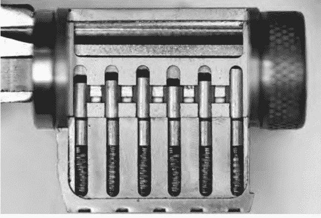
图11.1：一个切割开的针柱锁（由Marc Weber Tobias提供）

实际数字会更少，因为机械公差和钥匙切割限制。

多年来已经知道这种锁可以被撬开，只要使用特殊的工具。你可以在MIT开锁手册[1258]或Marc Weber Tobias的专著中找到详细信息[1253]：基本思想是用扳手稍微扭动插芯，然后用开锁工具操纵锁芯，直到所有锁芯都与剪切线对齐。情报机构、锁匠和高级骗子都使用这些技术；但是这需要很多练习，并且在许多司法管辖区域拥有这些工具是非法的（有关美国的法律，请参见[1255]）。直到最近，撬锁一直被认为只对高价值目标构成威胁，其中对攻击者特别有价值的是秘密入侵，例如投资银行和大使馆。

新的发现是，攻击者可以插入一个特制的凸缘钥匙，每个齿位都设置在最低的锁芯位置，肩部略微圆润。（这样的钥匙也被称为“999”钥匙，因为所有的齿位都在最低位置，或者称为切割位，即数字9。）然后，他可以用手指轻轻扭曲钥匙，并用橡皮锤敲击钥匙头。冲击力使得锁芯上升，施加的扭力使得锁芯在回弹时卡住，但与锁芯边缘之间有一定的间隙。结果是，用几下橡皮锤就可以打开锁。

这个技巧多年来一直被人们所知，但最近由于更好的工具和技术而变得更加有效。这是由荷兰的“开放组织锁匠”（TOOOL）的Barry Wels和Rop Gonggrijp在2005年撰写的一篇白皮书所公开的，这是一个荷兰的“锁匠运动”团体（业余锁匠活动开始被称为[1337]）。电视报道将这一信息传播给了广大观众。随后，锁匠专家Marc Weber Tobias [1254]进行了技术分析；在他看来，凸缘钥匙的主要威胁是削弱了开锁技能。其后果可能是严重的。例如，已经发现美国邮箱中的锁和占据美国国内市场70%的锁芯锁都可以轻松被打开。荷兰的研究报告以及随后的宣传引发了一场军备竞赛，供应商推出了更复杂的设计，而业余锁匠则报告了对其中许多锁的凸缘攻击。

直到最近，Medeco的锁被认为是无法撬开的（并且被认证为无法撬开），该公司在高安全锁市场上占据主导地位。Medeco使用的是次级钥匙，不是通过侧条，而是通过钥匙上切割的角度来实现。在这个“双轴”系统中，倾斜的切割会旋转销子以使其与滑块配合。2005年，Medeco推出了m3，它也有一个简单的侧条，是通过在钥匙侧面切割一个滑块来实现的。2007年，Tobias报告了对m3和双轴锁的攻击，使用弯曲的纸夹设置滑块，然后结合撞击和撬锁来旋转插芯[1256]。

一个房主能做些什么？作为一个实验，我更换了自己前门的锁。在一个小时的车程内，我只能在商店里找到一个高安全性的产品，结果发现它是以色列的Mul-T-Lock设备的再包装。安装时出现了两次卡住的情况；然后花了大约一周时间让家人学会使用更复杂的死锁，如果操作不慎，它很容易失效。下次有情报背景的人来访时，他评论说在英国只有毒贩才会安装这样的锁；所以如果警察经过，我可能会被怀疑是一个涉嫌贩毒的人而被记录在他们的数据库中。这种对我家安全的可疑改进花费了我200美元，而标准产品的价格不到20美元；实际上，一个入室盗窃者总是可以打破窗户，我们的实际保护更多地取决于我们的位置和我们的狗，而不是任何硬件设备。事实上，Yochanan Shachmurove和他的同事对康涅狄格州格林威治的居民进行了调查，并建立了一个模型来研究采取的预防措施与家庭入室盗窃之间的关系；锁和死锁几乎没有效果，因为总是有其他进入途径，比如窗户。最有效的威慑手段是警报器和显示有人居住的迹象，比如停在车道上的车辆[1154]。

对于商业公司来说，情况稍微好一些（但并不多）。在美国，高安全锁的通常标准UL 437和ANSI 156.30规定了防撬和防钻的要求，但没有防撞的要求；尽管抗撬锁通常更难被撞击，但这并不能保证。

确实有关于哪种锁设计能够抵御撞击的知识存在，但你必须去寻找（Tobias的论文和www.toool.org是很好的起点）。UL最近刚刚开始关注撞击问题，并成立了一个工作组来确定是否应该将这种攻击方法纳入他们对高安全锁的测试中。BHMA/ANSI也在关注这个问题。

因此，购买者面临着柠檬市场——正如人们可能会怀疑的那样，许多锁供应商的市场宣传材料都很华丽，但缺乏技术内容。即使是昂贵的抗撬锁也经常被建筑商或原始设备制造商安装不当；当我曾经试图破解一个装有非常昂贵锁的加密处理器时，我发现它可以轻松地被杠杆打开，因为锁转动的凸轮是由软金属制成的。事实上，Tobias最近发布的一份安全警报披露，其中一种最受欢迎的高安全死锁可以通过在钥匙孔中插入一把细螺丝刀，将螺栓卡住并转动，甚至无需破坏锁内的大量安全保护措施。这种设计已经存在了二十多年，制造商在披露之前对此漏洞一无所知。许多高安全安装都使用这种或类似的硬件。

第二类最近的问题是主钥匙攻击。这些问题对于锁匠来说也不是什么新鲜事，但最近已经有所改进和发布，比如Matt Blaze。主钥匙系统的设计是这样的，除了建筑物中每个门的个别钥匙外，还可以有一个顶级主钥匙可以打开所有门 - 比如，供清洁工使用。更复杂的方案很常见；例如，在我们的建筑物中，我可以打开我的学生们的门，而系统管理员和清洁工可以打开我的门。在插销锁中，这些方案是通过在一些插销堆栈中增加额外的切割来实现的。因此，不再是只有一个顶部插销和一个底部插销之间有一个切割，一些插销堆栈还会有一个中间插销。

主钥匙攻击是逐个搜索额外的切割。假设我的钥匙切割是557346，而我走廊的主钥匙是232346。我制作了一个切割为157346的钥匙，并尝试在锁上使用。它不起作用。然后我将第一个位置的切割修整为257346。由于2是第一个插销的有效切割，这打开了锁，而且它与我的用户切割5不同，我知道它是该插销的主钥匙切割。对于每个插销，我将平均尝试四个切割，如果有三个插销是主钥匙的，那么我将在大约十二次测试后拥有一个主钥匙。因此，主钥匙允许建筑物的居民和盗贼都更加方便。这非常重要，因为大多数大型商业场所都使用主钥匙。有一些主钥匙系统可以抵御这种攻击 - 例如，奥地利的锁匠Evva有一个涉及嵌入金属钥匙中的磁铁的系统，这些钥匙更难复制。但大多数实际使用的系统似乎容易受到攻击。

另一个需要担心的事情是，一如既往地是吊销。持钥者离开，并可能变得敌对。他们可能已经复制了他们的钥匙，并将其卖给攻击者。机械锁单独更换很容易，但是锁定系统通常对吊销处理非常差。主钥匙攻击在这里很重要，以及撞击。事实上，许多昂贵的、抗撬锁实际上使问题更加严重。它们通常依赖于第二个钥匙机制，如侧条：钥匙看起来像两个正常的针插锁钥匙焊接在一起，如图11.2所示。侧条通常对建筑物中的所有锁都是相同的（主钥匙系统通常需要共同侧条在共享主钥匙的锁中）。因此，如果一个坏人能够拿到属于我的学生的真正钥匙，他可能能够将其变成一个可以打开我的门的撞击钥匙，实际上是建筑物中的每扇门，如图11.3所示。这在正常的商业场所可能不是一个问题，但对于银行、金条交易商和批发珠宝商来说，绝对是一个问题。

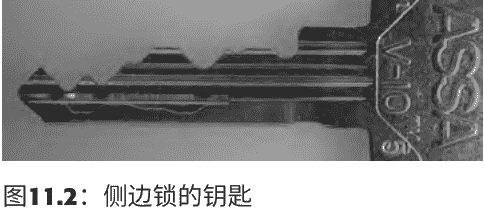

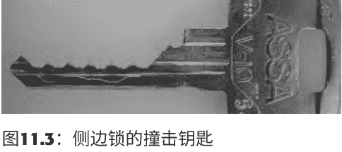

攻击者可能花两年时间策划一次袭击。事实上，如果这样的设施使用侧边锁的主钥匙系统，并且有员工甚至被怀疑泄露了一把钥匙，明智的做法将是替换每一个锁。

撞击、糟糕的死锁、主钥匙攻击和其他最近的发现的综合效果可以总结如下。在几年内 - 随着工具和知识的传播 - 像查理这样的职业犯罪将能够快速打开几乎任何房屋锁，而且不留下任何法医痕迹，而像布鲁诺和阿布杜拉曼这样的更专业的攻击者也将能够打开大多数商业场所的锁。房屋锁可能并不重要，因为查理只会通过窗户进入；但是商业场所中大多数机械锁的脆弱性可能具有更复杂和严重的影响。如果您的职责包括计算机或其他资产的物理保护，现在是时候开始思考它们了。

## 11.2.5 电子锁

吊销的困难只是电子锁开始获得市场份额的一个原因。它们已经存在很长时间了 - 自从1970年代以来，酒店一直在使用磁卡锁。有各种各样的产品供选择，使用各种机制，从非接触式智能卡到PIN键盘再到生物识别。其中许多可以通过各种方式绕过，本书的大部分章节都可以在设计、评估和保证它们的过程中应用。还有一些机电一体化锁，结合了机械和电子（或磁性）组件；对于其中一些，除了物理破坏之外，我们根本不知道如何攻击。但是，从一个使用锁来保护敏感场所的公司的角度来看，真正的问题不是锁本身，而是如何在建筑物中连接数十个或数百个锁。想象一下一个研究实验室，其中一些房间里有尚未申请专利的有价值的发明，或者一家律师事务所，办公室里可能有即将进行的收购的高度敏感文件。在这里，你不仅要担心外部人员，还要担心内部人员。

从长远来看，建筑物可以通过多个传感器意识到谁在哪里，并将物理与逻辑访问控制集成起来。实时了解谁通过了哪扇门可以实施有趣的安全策略；例如，如果正在处理机密材料，如果房间里有没有正确权限的人，可以触发警报。建筑物不仅可以监控人员，还可以监控物品；在我们实验室的一个实验中，人员和设备都携带了用于位置跟踪的主动徽章[1318]。电子系统可以始终在线，使吊销变得容易。

智能建筑除了执行安全策略外，还可以提供其他好处，例如通过关闭灯光和根据人员存在情况调整空调来节省能源。但我们还没有达到那个阶段。我们在建造新的实验室大楼时遇到了一个实际问题，即只有少数几家公司销售交钥匙式入口控制系统。 最初，我们希望基于虹膜扫描仪实现生物特征入口控制，因为虹膜扫描仪是我的一位教职同事约翰·道格曼发明的。 但是在2000年，我们无法做到这一点。 供应商的协议不支持该设备，而且我们没有时间和人力从零开始构建自己的入口控制系统。 （而且，如果一个计算机科学系都做不到，普通客户就更没有机会了。） 我们了解到现有供应商的运作方式与其他系统公司相同：他们通过锁定（在经济意义上而不是锁匠意义上）来赚钱。 然而，购买的系统可能非常麻烦、功能失调且昂贵。 你最终会为一把门锁支付2000美元，而其制造成本可能只有10美元，这是因为专有的布线系统和卡片设计。 锁定的主要限制是整个系统的更换成本，因此供应商喜欢使用专有的布线。

我们实验室现在正在转向基于标准非接触式智能卡的更开放系统，这些卡可以从多个供应商获得。 经验告诉我们，入口控制系统应该像任何其他计算机系统采购一样进行管理，非常注意维护成本、标准、可扩展性和总拥有成本。 我们渴望获得一个我们自己可以安装和维护的系统，并且允许我们以相当抽象的级别指定安全策略。 （我们的旧系统只有一个矩阵，指定哪个钥匙打开哪个锁。） 我们刚刚开始看到能够实现良好系统集成的组件，例如以建筑物标准以太网为基础的价格合理的门锁。 简而言之，锁匠行业正处于竞争和现代化的时机。

它将像大多数其他行业一样数字化。

这让我想起电话公司和计算机公司之间的长期冲突。 电话公司有他们稳定、成熟的做事方式，并假设他们可以对计算机行业规定数据在他们的线路上如何传输。 他们失败了； 计算机公司更灵活、更有企业家精神，并且更了解技术。 我预计锁具行业也会发生同样的情况。 在十年内，商业入口控制系统将只是计算机系统，尽管有一些专门的外围设备。

它们将由您的系统管理员运行，而不是由现在控制您站点警卫的退休警察。 它们将最终与环境控制、人员系统和警报集成，使智能建筑成为现实。 入口控制行业将会抵制一段时间，并使用多年来积累的所有复杂的政府和保险认证要求，就像电话公司使用自己的监管机构一样。试图扼杀几乎所有创新，从早期数据网络到VOIP。正如计算机公司在进入在线系统时不得不学习可靠性一样，当进行物理安全时也有其他可靠性课程需要学习。这将引导我们进入物理安全最自动化和复杂的方面，即警报。

## 11.3 警报

警报用于处理远不止盗窃的问题。它们的应用范围从监控超市的冷冻柜温度（以防员工“意外”关闭冷冻柜，希望得到食物带回家），一直到伊拉克和其他地方的自制爆炸装置，有时会设置陷阱。然而，在讨论它们时，将它们放在盗窃和保护计算机设备和其他资产的房间的背景下是方便的。警报还使我们对服务拒绝攻击问题有了很好的基础，这是电子战的主要业务，并且在其他地方也是一个问题。

不同国家和不同风险类型之间的警报标准和要求各不相同。通常情况下，你会使用当地的专业公司来完成这种工作；但作为一名安全工程师，你必须意识到其中的问题。

警报通常会影响更大的系统设计：在我的专业实践中，这包括了内置在自动取款机中的警报，以及对于保护大风险（如批发珠宝商）的警报系统所使用的通信安全性的评估，还有用于保护银行计算机房的持续人员值班的系统。

银行保险库中的警报受到非常好的防篡改保护（至少对于外部人员来说），因此是一个相对简单的情况。为了更全面地研究这个问题，我将考虑为艺术画廊设计警报系统的任务。

这更有趣，因为攻击者可以在白天以公众成员的身份进入并捣乱。我们假设攻击者是布鲁诺——受过教育的专业艺术盗贼。布鲁诺的普遍观点是，他会对警报系统进行狡猾的攻击，花费数天时间研究当地市政厅的建筑平面图。你可能每年都会在报纸上读到这种犯罪几次。

**如何偷一幅画（1）**

一幅毕加索的画从一个据说着有着“尖端”报警系统的画廊被盗，小偷移走了一打屋顶瓦片，然后用绳子降下来，以免触发地毯下的压力垫。他抓住画，又没有接触地板，可能以25万美元的价格将画卖给了一个富有的可卡因贩子。媒体喜欢这种事情，而且这种事情时有发生。现实既简单又奇怪。让我们系统地分析威胁场景。

### 11.3.1 如何不保护一幅画

设计报警系统时常见的错误是被最新的传感器技术所吸引。市场上有很多令人印象深刻的东西，比如一根光纤电缆，你可以将其绕在受保护的物体上，如果电缆被拉伸或放松的程度小于100纳米（一毫米的万分之一），它就会发出警报。现代科学真是奇妙啊！所以天真的画廊主人会购买几英尺的这种神奇电缆，将其粘贴在他珍贵的毕加索画作的背面，并将其连接到一个报警公司。

**如何偷一幅画（2）**

布鲁诺的攻击是以游客的身份访问并藏在一个储物柜里。凌晨一点钟，他出现了，抢走了画，朝着消防出口走去。警报响了，但又怎样！不到一分钟，布鲁诺就会骑上摩托车。警察到达的时候已经过了十二分钟，他已经消失了。

这种盗窃比从屋顶上用升降机偷窃要常见得多。这通常很容易，因为警报系统很少与建筑物入口控制良好地集成。许多设计师没有意识到，除非你能确切地记录下白天进入场所的所有人，否则采取一些预防措施来防止“留守”的恶棍可能是明智的，即使这只是在画廊关门后进行的巡视。因此，严格的物理安全意味着对人员进行严格的控制。事实上，RSA密码系统的第一次记录使用（在1978年）并不是为了加密通信，而是为了为员工提供数字签名，以通过爱达荷福尔斯的钚反应堆的入口障碍。这些凭证包含了诸如体重和手部几何形状等数据。但是，我仍然对我访问的大多数安全场所的建筑物入口控制如此容易被击败感到惊讶，无论是通过轻微的技术手段，比如坐在别人的肩膀上通过入口亭，还是仅仅是通过乐于助人的人们开门。

此外，警报响应过程通常没有经过仔细思考。（对最新的高科技过度依赖的“泰坦尼克效应”常常使人们对常识视而不见。）正如我们将在下面看到的，这导致了对大多数系统的更简单的攻击。

因此，我们不能孤立地考虑警报机制。如上所述，物理保护系统有几个步骤：阻止-检测-警报-延迟-响应，重点会因应用而异。如果我们的对手是Derek或Charlie，我们将主要关注威慑。在Abdurrahman感兴趣的目标中，几乎肯定会检测到攻击；主要问题是延迟足够长的时间让海军陆战队到达。Bruno是最有趣的情况，因为我们没有军事预算来阻止他进入，而且比起Abdurrahman，更多的场所的防御者担心Bruno。因此，您必须仔细考虑情况，并决定检测、延迟或响应哪个问题更大。

### 11.3.2 传感器失效

防盗警报使用广泛的传感器，包括：

- 震动探测器，用于感知围栏干扰、脚步声、破碎玻璃或其他对建筑物或周界的攻击；
- 门窗开关；
- 被动红外设备（PIR），用于检测体热；
- 使用超声波或微波的运动探测器；
- 微波或红外光束的隐形屏障；
- 地毯下的压力垫，在极端情况下，可能会延伸到在每个瓷砖下安装压力传感器；
- 视频摄像机，可能带有运动探测器，以自动报警或提供实时视频到监控中心；
- 设备上的运动传感器，从简单的绑缚电缆到光纤环路。

大多数传感器都可以通过某种方式被规避。通过跳过围栏可以击败围栏干扰传感器；通过缓慢移动可以击败运动传感器；通过破墙可以击败门窗开关。设计一个良好的传感器组合取决于技能和经验（后者并不总是保证前者）。关于传感器安装的标准参考资料是[283]（尽管有点过时）。

主要问题是限制虚警的数量。超声波在移动空气（如中央供暖入口）附近表现不佳，而振动探测器可能会被交通噪音使得无法使用。恶劣天气，如闪电，会触发大多数系统，而飓风会使一个城镇警察部门每天接到的电话数量从几十增加到数千。在某些地方，即使是正常天气也会使保护变得困难：一个入侵者可能能够滑过你的传感器（甚至越过你的围墙），这对安全工程师来说是一个有趣的挑战。（有关在雪区的核电站的入侵者检测的教学实例，请参见[118]）。但无论你是在阿拉斯加还是亚利桑那，主要的困境是，你离被保护的对象越近，你就越能控制环境，从而降低虚警率。相反，在边界上很难降低误报率。但是为了让警卫有足够的时间赶到，外围正是你需要可靠传感器的地方。

**如何偷一幅画（3）**

所以布鲁诺的下一步攻击是等待一个黑暗而风雨交加的夜晚。他以某种方式触发了警报，小心不要被闭路电视或其他方式抓住，也不要留下任何证明警报是真实的硬证据。他退到几百码外并藏在灌木丛中。警卫出来却什么都没发现。他等了半个小时，然后再次触发了警报。这次警卫们不再理会，所以他就进去了。

无论是故意引发的还是非故意引发的，误报都是这个行业的祸根。它们对警报响应部队构成了直接的拒绝服务攻击。来自电子战领域的经验表明，大于15%的误报率会降低雷达操作员的性能；而大多数入侵警报响应者的误报率都远远超过了这个阈值。

故意引发虚假警报对那些没有全天候警卫的场所尤其有效。许多警察部队有一个政策，即在一定数量的来自同一地点的虚假警报之后（通常是一年内的三到五次），他们将不再派遣警车到那里，直到警报公司或其他持钥人到场检查。

虚假警报会以其他方式破坏系统。它们由天气条件和交通噪音等环境刺激引起的速率限制了可以有效部署的传感器的灵敏度。此外，警报行业的成功大大增加了警报的总数，从而降低了警方对虚假警报的容忍度。一个常见的策略是将远程视频监控作为第二道防线，以便警报公司的调度员可以检查客户的场所；许多警察部队优先处理通过这种方式确认的警报[661]。但即使是在在线视频链接也不是万能的。攻击者可以关闭照明或纵火。他可以在同一条街上的其他建筑物中触发警报。电话交换机的故障，如洪水或飓风，很可能导致机会主义性的抢劫。

在交通和天气等环境限制之后，布鲁诺的下一个目标是时间。植被长到传感器光束的路径上，围栏变得松弛，因此振动传感器的工作效果不好，犯罪团伙学会新的诡计，与此同时哨兵变得自满。

因此，对于有严格物理保护要求的场所通常有几个同心圆形的围墙。传统的方法是设置外围围栏以防止醉鬼、野生动物和其他低级入侵者进入；然后是带有埋藏传感器的平坦草地，然后是带有红外障碍的内围围栏，最后是足够坚固的建筑物以延迟坏人的到来，直到援军到达。国际原子能机构对于持有超过15克钚的场所制定的规定是一本有启发性的读物[640]。一个现代化的托管中心可能会采用相同的策略；它可能位于一座不起眼的建筑物中，其墙壁阻挡醉鬼和老鼠，但内部墙壁和传感器保护着机房。

在大多数场所，这种保护是不可能的。这将会太贵了。即使你有很多钱，你可能会在像香港这样房地产非常紧张的城市，你的银行计算机房只能是办公楼的一层，你必须尽力保护它。无论如何，你选择和安装的传感器和物理屏障仅仅是故事的一半。

### 11.3.3 特性交互

入侵警报和屏障与其他服务以多种方式交互。其中最明显的是电力。停电会使许多场所变得黑暗和无保护，因此严肃的警报安装需要备用电源。一个不太明显的交互是与火警和消防的交互。

**如何偷一幅画（4）**

布鲁诺以游客的身分参观画廊，并在定时器上放置了烟雾弹。它在凌晨一点爆炸，触发了火警，进而导致防盗警报忽略其被动红外传感器的信号。（如果不忽略，警报调度员也会忽略它们，因为他专注于将消防车送到现场。）布鲁诺通过一个防火出口闯入并抓住了毕加索的画。他可能会在混乱中成功逃脱，但如果他没有成功，他有一个狡猾的计划：声称自己是一个见义勇为的旁观者，看到火灾并冒着生命危险拯救了城市无价的文化遗产。警察可能不会相信他，但他们将很难起诉他。

火灾和入侵之间的相互作用有多种方式。在核反应堆中，通常有一个安全规定，即如果发现炸弹，则将现场封锁，不允许任何人进入或离开；而在火灾发生时，大部分员工必须撤离（可能还包括部分当地居民）。这引发了一个有趣的问题，即如果炸弹爆炸，哪个规定会优先执行。而且只有在有效防止无辜闯入者的手段存在时，才能采取某些防火措施。

许多计算机房间都配备了自动灭火器，由于对臭氧层的担忧导致溴氟烷不可用，因此现在使用二氧化碳（CO2）灭火。对于未经训练的人员来说，CO2排放是致命的。当能见度降低时，凭借肺部中的空气逃离房间要比看起来困难得多。几英寸之内，你被可怕的尖叫声所迷惑。一个故障的入侵者警报器让一个醉鬼进入你的计算机房间，他点燃了一支香烟，很快被你的灭火器处决，这可能会引起反吸烟活动人士的一些笑声，但不太可能让你的律师很开心。

无论如何，最严重的特征交互是警报系统和通信系统之间的交互。

### 11.3.4 通信攻击

一个复杂的攻击者攻击通信系统的可能性至少与攻击传感器的可能性一样大。有时这意味着传感器和警报控制器之间的电缆。

**如何偷一幅画（5）**

布鲁诺进入一家艺术画廊，趁着员工分心，他剪断了窗户开关上的电缆。他在那天晚上回来并自取其便。

你的员工或清洁工被贿赂、诱惑或胁迫以创造漏洞是完全有可能的（对于银行现金处理中心和钻石交易所等真正高价值目标的攻击通常涉及内部人员）。因此，频繁的操作测试是一个好主意，以及传感器重叠，检测设备替换的方法（如封条），严格的配置管理和防篡改电缆。重要的场所认真对待内部人员被收买的可能性，坚持由两个人而不是一个人进行警报维护和测试；另一个边缘案例是监狱系统，那里对传感器、电缆甚至建筑物本身的攻击如此频繁，以至于持续的测试和检查计划是必不可少的。如果你的一半员工是在日间释放的罪犯，你会怎么做？保护警报传感器和控制器之间的通信的传统方法是物理的：为每个传感器铺设多根电线并将其埋入混凝土中，或者使用装甲气压电缆。更现代的方法是加密通信。一个例子是Argus，这是一个最初为核实验室开发的系统[483]。

但是对通信的更常见的攻击是针对警报控制器和提供或组织响应力量的安全公司之间的链接。

**如何偷一幅画（6）**

布鲁诺给他的竞争对手画廊打电话，声称自己来自处理他们报警的安全公司。他说他们正在更新他们的电脑，所以可以请他们告诉他报警控制器单元的序列号？一个办公室的初级员工乐意这样做——没有意识到盒子上的序列号也是保护通信的加密密钥。布鲁诺以200美元购买了一个完全相同的控制器，并在学习如何使用EEPROM编程器的半小时后，他有了一个功能完全相同的单元，他将其接入他的竞争对手的电话线。即使出现问题，它仍然报告“一切正常”。

替换虚假的报警设备，或者模拟它的计算机，被称为“欺骗”。多年来，有关各种报警控制器的“黑盒子”的报告一直存在。早在1981年，盗贼偷走了从中国进口的价值150万美元的玉雕和黄金首饰，导致进口商破产。保护其在新泽西州哈肯萨克的仓库的报警系统被切断。通常情况下，这将触发安全公司的报警，但是盗贼将一个自制的电子设备连接到外部电缆上，以保持持续电压[581]。

通过更好的现代系统，要么金库中的警报控制器发送一个加密的伪随机序列给警报公司，如果被中断，警报公司会假设最坏的情况，要么警报公司向控制器发送周期性的随机挑战，这些挑战会被加密并返回，就像IFF（敌我识别）一样。然而，设计通常存在缺陷，因为它是由没有接受过安全协议培训的工程师完成的。加密算法可能很弱，或者密钥可能太短（无论是因为无能还是出口管制）。即使不是这样，布鲁诺可能能够记录伪随机序列并稍微慢一点地重放它，这样到星期一早上，他可能已经积累了五分钟的“松弛时间”来应对一次闪电袭击。

故障的更常见原因是严重的设计失误。一个典型的例子是为远程维护设置一个拨号调制解调器端口，并使用大多数用户从未更改的默认密码。另一个例子是将加密密钥设置为设备序列号。除了容易受到社交工程攻击外，序列号通常出现在采购订单、发票和其他文件中，许多人都能看到。（总的来说，用现金购买警报控制器是个好主意。这也使得你不太可能买到被“植入”的产品。但是大公司通常很难做到这一点。）

到目前为止，你可能已经决定不从事艺术画廊业务了。但是最后我保留了最好的。这是对防盗警报系统进行的最强大的攻击。这是(3)的一个变种，但与其针对传感器不同，它针对的是通信。

**如何偷一幅画（7）**

布鲁诺切断了他竞争对手画廊的电话线，并躲在几百码外的灌木丛中。他数着穿着蓝制服的人的数量，以及离开的人数。如果这两个数字相等，那么可以合理猜测看门人说过：“哦，烦死了，我们明天再修理”，或类似的话。他现在知道他有几个小时的时间来工作。

这几乎是攻击银行保险库的标准方法，也被用于计算机系统。作案手法可以从简单地将卡车倒进电话公司的路边接线盒，到更复杂的试图在不同的地点引发多个同时警报，从而淹没当地警察力量。（这就是为什么它比仅仅摇晃围栏要强大得多。）

在一个案例中，新泽西的盗贼切断了三条主要的电话线，导致三个警察局和哈肯萨克草地地区的数千个住宅和企业的电话和报警设备瘫痪。他们利用这个机会从美国分销商那里盗取了卢西恩·皮卡德手表，批发价值210万美元，零售价值可能达到800万美元[581]。

在另一个案例中，俄克拉荷马州的一名副警长切断了图尔萨市5万个住宅的电话线，然后闯入一个贩毒仓库[1275]。在第三个案例中，一个恶棍炸毁了一个电话交换机，导致伦敦珠宝区的几十家商店服务中断。这种类型的全面服务拒绝攻击，会使应对力量的能力饱和，就像核打击一样，是盗窃者的等效行为。

未来，这种攻击可能不再涉及爆炸物，而是基于软件的分布式拒绝服务攻击网络设施，因为计算机和通信正在融合。与其让一个社区的所有警报器响起（可以通过大量派遣警力来一定程度上保护），不如在纽约各地同时触发几千个警报器，创造出类似飓风或停电的效果，但在盗贼方便的时间进行。另一种可能性是对报警公司的控制中心进行服务拒绝攻击。

一个严重关注的问题是，电话公司的员工可能被贿赂制造虚假警报。因此，保险公司更希望报警通信由匿名数据包组成，这样大多数电话公司的员工就无法与任何特定的警报相关联。这将使有针对性的服务拒绝攻击更加困难。但是，承载大部分警报信号流量的电话公司更喜欢将其集中在交换机中，这使得有针对性的服务拒绝攻击更容易。警方对匿名通信也普遍持怀疑态度。这些紧张关系在[957]中进行了讨论。

出于这些原因，伦敦保险市场（全球大部分再保险业务都在此进行）的规定是，保险额超过2000万英镑的地方的报警控制器必须具备两种独立的通信方式。其中一种选择是租用线路和数据包无线电服务。另一种选择是具有两个天线的无线电系统，每个天线都会在发生警报时发送信号，互为冗余。^1 在核能世界中，国际原子能机构的规定规定，含有500克钚或2千克U-235的场所必须在场内设有报警控制中心和应急力量[640]。

当你要保护的资产不是金库而是托管中心时，网络对你的运营也至关重要。如果连接你与网络的单根光纤通过路边的接线盒，那么即使你有八英寸厚的混凝土墙和屋顶也没有意义。你会希望有两根埋在地下的光纤连接到两个不同的电信公司，而且你希望它们使用来自不同供应商的交换机和路由器。即使如此，一个有经验的对手要关闭一个托管中心的最简单方法通常是切断其通信。这就是为什么公司会有两个、三个甚至四个中心的原因。但是，只需要四个、六个或八个洞就可以关闭你的运营。谁愿意挖，挖到哪里，你能及时发现吗？

最后，值得记住的是，许多物理安全事件是由进入工作场所的愤怒人群引起的，无论是配偶、前雇员还是顾客。报警系统应该能够应对白天和晚上发生的事件。

### 11.3.5 教训

读者可能仍然会问，为什么一本本质上关于计算机系统安全的书要花费几页的篇幅来描述墙壁、锁和报警系统。有很多原因：

- 处理服务拒绝攻击是许多安全系统设计中最困难的部分。随着坏人们了解系统级漏洞，这也往往是最重要的。入侵警报系统为我们提供了最大的适用知识和经验。
- 必须从入侵、检测、报警、延迟和响应等整体系统的角度来看待问题，这是广泛适用的，但在通用分布式系统中越来越难以实现。
- 最外层的边界防御是您最希望依赖的，但也往往是最不可靠的，这也是相当普遍的。
- 在安全工程中，错过警报率和虚警率之间的权衡是一个普遍存在的问题——即接收器工作特性（ROC）。
- 从警报业务中我们可以学到一些经验教训。例如，美国交通安全管理局会在机场行李中插入虚假警报，以确保安检人员保持警惕；还有一些X射线机器的软件会每班次插入一次枪支或炸弹的图像，还有一些渗透团队会在真实的行李中插入真实的物品。然而，这仍然效果不佳——2006年的一份报告显示，在洛杉矶机场有75%的威胁通过了安检，在奥黑尔机场有60%的威胁通过了每个检查站。但它可能是可修复的：在旧金山，安检员为一家私营公司工作，每班测试几次，只有20%的威胁通过[492]。
- 无法理解威胁模型——为查理（低级入侵者）设计并希望阻止布鲁诺（专业盗贼）——导致许多现实生活中的失败。有必要了解实际出错的原因，而不仅仅是犯罪作家认为出错的原因。
- 最后，你不能把安全工程项目的技术方面完全交给专业的分包商，因为关键的东西总会掉进裂缝中。

除了这些系统级的教训，还有许多其他应用领域可以借鉴防盗警报行业的经验。我已经提到了即兴爆炸装置；在后面的章节中，我将讨论设计用于检测拆解企图并通过销毁所有加密密钥材料来做出反应的防篡改处理器。

^1 我曾经想过，当我还是一个银行家的时候，两个坏人是否可以同时剪断两根电缆。我得出结论，对于只有大约10万美元现金的银行分行来说，这种威胁不值得担心。我们的大型现金处理中心每天24小时运营，因此威胁模型主要关注内部人员不诚实、劫持等问题。

## 11.4 总结

不管你喜不喜欢，安全工程师必须处理物理保护以及计算机和密码系统。事实上，就像计算机和电信的融合使得计算机行业的标准和工作方法取代了旧的电话公司的做事方式一样，物理保护系统的自动化越来越多将使得障碍物、锁和警报器的世界进入我们的视野。未来的建筑很可能会有更多集成的入口控制、警报器和系统安全。它们的管理将由系统管理员而不是退休警察来负责。

在本章中，我强调了一些值得注意的事情。首先，环境保护很重要；建筑、景观和照明等因素都会产生影响，而且对它们已经有了相当多的了解。

其次，物理锁并不像你想象的那么安全。最近对隐蔽进入技术的发展导致了对最广泛使用的机械锁的安全性重新评估。

广泛使用的高安全性锁。用于此类攻击的撞击钥匙和其他工具在网上很容易获得。

第三，我们可以从物理安全的一个方面中学到很多，即警报系统，这已经相当自动化了。警报系统为我们提供了一个很好的例子，其安全策略依赖于可用性而不是保密性或完整性。在处理其他情境中的服务拒绝攻击时，它们可以给我们一些有用的见解。

## 研究问题

在战略层面上，物理安全和系统安全的融合必然会带来各种新问题。我预计，首先在新应用中探索信息/物理安全边界的人将发现一些新的研究挑战。从安全经济学的角度来看，我渴望看到锁匠行业是否会因与数字系统的碰撞而被打破，或者现有企业是否能够适应。我怀疑这将是有争议的——但这对于现有行业应该如何采取策略来适应数字化世界教给我们什么呢？

在技术层面上，我们可能需要更好的中间件，以便指定和实施可以管理物理和其他形式保护的策略引擎的机制。至于低级机制，我们需要更好的工具来管理嵌入式系统中的密钥。正如飞利浦的一位工程师对我说的那样，智能建筑是否意味着每次更换灯泡都需要执行安全协议？

## 进一步阅读

我所知道的关于警报系统的最全面的参考资料是[118]，而系统问题则在[957]中简洁地讨论。特定国家的资源通常可以通过贸易协会（如美国工业安全协会[25]）和当地的保险业获得；许多国家都有像美国的Underwriters' Laboratories [1268]这样的非营利机构，以及用于认证产品、安装或两者的计划。关于撬锁和相关主题的进展，我会关注像Toool团队、Marc Weber Tobias和Matt Blaze这样的麻烦制造者；Matt还写过关于开保险柜的文章[186]。关于最新传感器技术的研究论文可以在IEEE Carnahan会议[643]上找到。最后，用于监测核军控条约合规性的系统在[1171]中有所介绍。

## 第12章 监控和计量

> 市场不是资本主义的发明。它已经存在了几个世纪。它是文明的发明。
> —— 米哈伊尔·戈尔巴乔夫

### 12.1 引言

许多安全系统关注监控和计量环境。它们已经存在很长时间了。蒸汽机的发明者詹姆斯·瓦特使用密封的计数器来测量发动机的转数；他的检查员定期读取这些数据，并向许可证持有人收取版税。

使用密码学和防篡改技术的电子系统正在迅速取代旧的机械系统，并开辟了各种新的应用。票务是一个巨大的应用领域，从交通票到体育票再到剧院票；我在票务方面的案例研究是用于燃气和电力等公用事业的仪表。然后我将转向车辆系统；其中最熟悉的可能是出租车计价器，但我主要讨论的是速度和工作时间记录设备——在欧洲用于记录卡车和长途客车司机的速度和工作时间，在美国用于记录银行卡车的进出情况。我的第三个案例研究是用于盖章信件的电子邮资表。

你会记得，为了打败一个防盗警报，只需让它看起来不可靠。此类服务拒绝攻击可能很棘手；计量器增加了更多的细微差别。当我们讨论银行保险库中的警报时，我们要关注通信攻击（尽管传感器的失效也很重要）。

但是许多计量系统在物理上更加容易受到攻击。出租车司机（或车主）可能希望计价器显示的里程数或分钟数比实际工作的要多，因此他可能操纵其输入或试图干扰它以使其过度计量。对于车速记录仪来说，情况正好相反：卡车司机通常希望超速行驶，或者工作时间过长，因此他希望车速记录仪忽略部分驾驶记录。公用事业消费者同样有动机让他们的计量器忽略一部分电力消耗。在这些情况下，攻击者可以造成设备产生错误读数，或者简单地使其失效。还有一些市场面向那些可以销售漏洞的不良人士，无论是伪造电力计量器的票据还是销售可以安装在车辆中以欺骗计价器或车速记录仪的设备。

在许多计量和车辆监控系统中（事实上，包括核验证），我们也关注证据。对手可以通过操纵通信（例如重放旧消息）或虚假声称其他人已经这样做来获得优势。至于邮政邮资系统，仅仅导致故障是不够的（因为那样的话他就不能寄信了），但威胁模型有一些有趣的变化：邮局主要关注阻止大规模欺诈，例如贿赂邮政员工将一车邮件放入系统中。因此，它更多地是内部导向的。

计量系统与旨在强制执行软件和其他数字媒体版权的系统有很多共同之处，我将在后面的章节中讨论。

### 12.2 预付费计量器

我们的第一个案例研究来自预付费计量。有许多系统用户在一个地方支付一个令牌——无论是一个魔法数字，还是带有磁条的纸板票，甚至是可充电的令牌，如智能卡——并在其他地方使用这个存储的价值。

例如，在图书馆中操作复印机的储值卡、滑雪胜地的电梯通行证以及大学宿舍中的洗衣机代币等都是例子。许多交通票据都很相似，特别是如果验证票据的终端安装在公交车或火车上，因此通常不联网。

这些系统的主要保护目标是防止储值代币被大规模复制或伪造。复制一张地铁票并不太困难，第二次重复一个魔术数字也很简单。如果我们使所有代币都是唯一的并记录它们的使用情况，这个问题就可以忽略不计。但是，当接受代币的设备没有与票务发行方的通信渠道时，情况就变得更加复杂，因此所有的重放和伪造检测必须在离线终端中进行。

这种终端通常容易受到物理攻击。因此，如果我们仅仅使用一个通用的主密钥对所有代币进行加密，恶棍可以从被盗的终端中提取出来并在销售代币的企业中设立。

服务器端也存在攻击。我们当地一家超市员工食堂使用的自动售货卡系统也遭受了一种巧妙的攻击。攻击利用了一张卡充值时的过程：自动售货机首先读取旧金额，然后要求付款，最后写入修改后的金额。攻击者的方法是在一张空白卡上放置一张带有一定金额（例如49英镑）的卡。然后将顶部的卡取出，并在机器中插入一枚1英镑硬币，这样机器就会将50英镑写入空白卡中。这样，攻击者就得到了两张总价值为99英镑的卡。这种攻击本应该被机器中的两个延伸杆阻止。然而，通过剪掉顶部卡片的角落，攻击者很容易就能够绕过这个防护措施（见图12.1）[749]。这种攻击很有趣，因为对卡片内容进行任何加密都不会有任何影响。虽然理论上可以通过在两端保留日志来阻止这种攻击，但这些日志必须比通常更加仔细地设计。但我们不能被这种巧妙的对策所迷惑，否则我们将再次忽视系统级问题而陷入“泰坦尼克效应”。

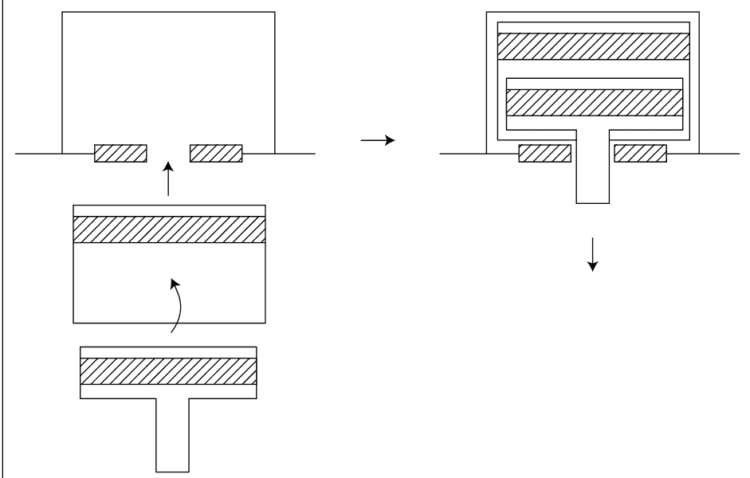
图12.1：叠加两张付款卡

在大多数售票系统中，小规模欺诈很容易发生。一个免费乘客可以越过地铁站的栏杆；电表可以通过一个旁路开关绕过；像条形码滑雪卡和停车场停车券这样的东西可以被伪造、扫描和打印。目标是防止欺诈成为系统化。因此，小额欺诈至少应该稍微不方便，而且更重要的是，应该有更严格的机制来防止任何人大规模伪造票据，以发展可能影响您客户业务的黑市。

我将详细讨论的第一个例子是预付电表。我选择这个例子，因为我有幸参与了一个在南非供电计划300万户家庭的项目（这是纳尔逊·曼德拉上台时做出的一个核心选举承诺）。这项工作在[59]中有详细描述。大部分所学到的经验可以直接应用于其他售票系统。

#### 12.2.1 公用事业计量

在一些欧洲国家，无法获得信用的住户（因为他们领取福利、有法院判决等原因）使用预付费电表和煤气表购买燃气和电力服务（图12.2）。在过去，它们是使用硬币操作的，但硬币收集的成本导致供应商开发了基于令牌的计量表。英国现在有360万个电表和200万个煤气表。在南非，由于一个国家优先项目要为城镇提供电力，发展非常迅速；由于许多房屋是非正式建造的，业主甚至没有地址（更不用说信用评级了），预付费是唯一的选择。现在南非有550万个这样的计量表在使用中，已经向非洲、拉丁美洲和其他地区出口了150万个。

顾客去商店购买一个令牌，可以是智能卡，也可以是一张带有磁条的一次性纸板票，甚至只是一个魔术数字。英国的电表中，有240万使用智能卡，有120万使用磁性票。南非的大部分电表使用一个魔术数字。对于顾客来说，这可能是最方便的，因为不需要特殊的售货设备：可以在超市收银台、自动取款机甚至电话上发放票据。

令牌实际上只是一个包含一个或多个指令的比特串，使用独特于电表的密钥进行加密，解码并执行这些指令。大多数令牌会显示类似于“电表12345 - 发放50千瓦时的电量！”的内容。其思想是电表将发放购买的电量，然后中断供电。有些令牌还具有工程功能。例如，如果电力公司对白天和晚上收费不同，电表可能需要知道相对价格和 tariffs 变化的时间。特殊的令牌可以用于更改这些设置，以及更改钥匙。

这些智能卡中有160万张被重新包装在塑料钥匙中；另外80万张是普通的智能卡。包装可能提高可用性，特别是在黑暗的房间里，但不会影响加密安全性。使用智能卡的电表能够向电力公司报告用电模式、篡改尝试等情况；然而，磁卡和魔术数字电表没有这样的反馈渠道。

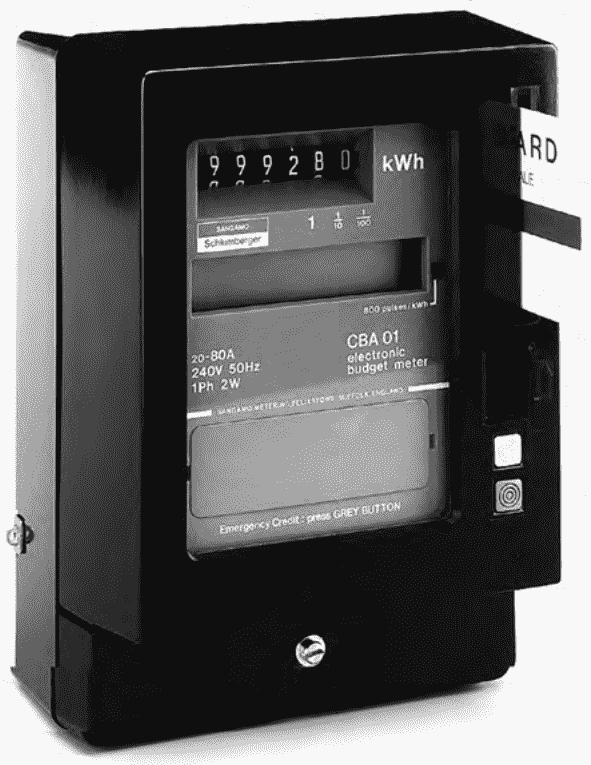
图12.2：预付费电表（由斯伦贝谢提供）

这些电表的制造已经成为一项大生意。第三世界的增长势头强劲：预付费计量是南非政府能够迅速实现数百万户家庭通电承诺的唯一途径。在发达国家，推动预付费计量的主要动力是降低行政成本。电力公司发现计费系统可能占到零售客户收入的20%，当你把抄表、计费、信用控制、坏账等成本加起来时。预付费系统的成本通常低于10%：销售代币的商店得到5%，而电表和基础设施的成本大致相同。

#### 12.2.2 系统如何工作

预付费电表的安全要求似乎很简单。令牌不应易于伪造，而真正的令牌不应在错误的电表中工作，或者在正确的电表中工作两次。一种策略是使用某种智能卡芯片使令牌具有防篡改功能；另一种选择是将每个令牌与唯一的电表绑定，以便某人不能在两个不同的电表中使用相同的魔术数字，并且使用序列号或随机数使每个令牌都是唯一的，以便不能在同一个电表中使用相同的令牌两次。但是，需要大量的现场经验才能将这个想法发展成为一个强大的系统。

电表需要一个加密密钥来验证来自售电站的指令。原始系统为每个社区提供了一个售电机，通常位于当地商店。该机器具有一个售电密钥 $K_V$，它充当了一个社区的主密钥，并在需要时通过将电表ID加密在售电密钥下生成设备密钥：

$$K_{ID} = \{ID\}_{K_V}$$

这是在第3章中描述的停车场访问设备的相同密钥分散技术。将售货机密钥 $K_V$ 分散到一组计量器密钥 $K_{ID}$ 提供了一个非常简单的解决方案，所有令牌都在本地购买。然而，一旦系统推出，我们发现现实生活并不那么简单。在英国，电力行业的解除管制导致了众多的电力公司，它们从发电厂购买电力并通过共同基础设施向家庭销售，因此计量系统必须支持具有不同费率结构的多个电力公司。在南非，许多人从乡镇或家园长途通勤到工作地点，因此他们在工作时间不在家，并希望在工作地点购买车票。因此，我们必须支持多个零售商，让客户在区外的售货站注册。这意味着需要协议将客户计量器密钥从拥有计量器的售货站发送到另一个站点，并在相反方向上传递销售数据以进行平衡和结算，有点类似于ATM网络。最新的发展（2007年）是在线售货；客户可以从中央令牌服务器通过互联网或手机购买一个魔法数字。这个服务器可以直接处理四百万个客户，还有大约一万个在线售货点，比如ATM。

统计平衡用于检测被委婉地称为非技术损失的事物，也就是通过篡改计量器或未经授权地直接连接到主电缆来窃取电力。机制是将供电计量器（可能为30户供电）的读数与这些户的代币销售进行比较。这事情看起来比想象的要难。客户囤积票据，计量员在读取计量器的日期上撒谎，还有很多其他问题。售货统计数据也用于传统的平衡系统，就像第10章中讨论的那样。

曾经有几起售货机被盗并被用来与公用事业竞争销售代币的案例。这些“幽灵供应商”非常难以追踪，早期的供应商通常一直经营到所有计量器的钥匙被更换。对策是为了使售货机在防篡改安全处理器中保持信用余额，还要保护售货机密钥和外国电表密钥。每次销售时，余额会减少，只有在将现金存入当地运营公司后，才会再次充值售货机的信用。运营公司反过来必须向分销网络的一上级报账，依此类推。因此，我们在销售点通过值计数器来执行会计系统，而不仅仅是在保险库的服务器上保留分类数据。在理论上，可以通过更高层次的统计和平衡检查来发现价值计数器的破坏。

这种安全状态的分布在其他应用中也有，比如一些基于智能卡的电子钱包方案。然而，电力售卖的战略方向现在被认为是集中化。现在通信基础设施更加可靠，许多最初的1200台售货机将被在线售货点取代，它们可以实时从中央服务获取令牌。（在银行业中，随着通信变得更加可靠，也在逐渐摒弃离线操作。）那么，问题出在哪里？

#### 12.2.3 有什么问题

服务拒绝仍然是一个重要问题。当电表与售电站之间没有返回通道时，售电设备本身是唯一的售电记录证据。操作售电机的代理商通常是小商店老板或其他乡镇企业家，他们资金有限，因此被允许赊账售电。在某些情况下，代理商在月底无法支付电费给运营公司，只能丢弃他们的设备并声称被盗。对于小代理商来说，这是可以管理的，但是当像地方政府这样的组织被允许通过多个渠道销售大量电力时，肯定存在风险。处理不可信任（以及相互不信任）的主体需要很多复杂性。

与防盗警报系统一样，环境的稳健性至关重要。除了极端的温度范围（南非和美国大陆一样多变）外，许多地区还有严重的雷暴：电表实际上是一个带有3kV避雷器的微处理器。当仪表被闪电摧毁时，客户抱怨并获得了他们声称仍未使用的价值的信用。因此，他们的下一步是将活电线插入仪表中，以模拟闪电的影响。结果发现，如果仪表电路的特定部分（位于令牌插槽下方）被摧毁，某种型号的仪表将提供无限信用。因此，服务拒绝攻击足够成功，以至于变得流行起来。

情况变得更糟。该计划中最昂贵的安全故障发生在索韦托的孩子们观察到，当电压从220V降至180V时，某种型号的仪表会达到最大信用。很快，孩子们开始将钢链扔到11kV馈线上，并为附近所有的仪表充值。这是仪表ROM中一个简单错误的问题，因为未指定进行电压降低测试。根本问题在于发达国家的环境标准不适用于非洲，并且必须进行重写。对业务的影响是必须拆除并重新编程10万个仪表；负责的公司几乎破产。

还有许多其他的错误。一个型号的电表没有售出指定的电量，而是以某种价格售出了相应价值的电。事实证明，收费标准可以由售货员设置为极小的金额，以便它几乎永久运行。另一个允许退款，但退款的令牌副本仍然可以使用（在后续的令牌命令中列入黑名单的序列号退款令牌是困难的，因为令牌被囤积并且按顺序使用）。另一个只记住最后一个输入的令牌序列号，因此通过交替输入两个令牌的副本，它可以无限充电。

与现金机一样，真正的安全漏洞是由于错误和失误导致的，这些错误和失误可能相当隐晦，但是却是偶然发现并以相当机会主义的方式利用的。这些漏洞有时规模很大，修复的成本高达数百万。

我们在[59]中总结了其他的教训：

- 只要你控制营销渠道，预付款可能很便宜，但是当你试图通过第三方（如银行和超市）销售预付款令牌来降低成本时，它可能会迅速变得昂贵、复杂和风险高。这主要是由于各个组织之间的相互不信任所造成的安全工程问题；
- 如果对业务流程进行更改会对安全基础设施产生很大的开销。例如，销售计量令牌给远离的商店以支持通勤者的要求是没有预料到的，并且实施起来代价高昂；
- 如果可能的话，尽量使用回收技术，因为它很可能比从一张白纸上设计的东西有更少的错误。我们在预付款计量方面所需的很多东西都是从现金机的世界借鉴来的；
- 使用多个专家。一个专家通常无法涵盖所有问题，即使是最好的专家也会漏掉一些事情；

> 无论做什么，小错误都会带来巨大的后果。因此，您绝对需要进行长期的现场测试。这就是许多错误和不切实际之处首先显现的地方。

计量器是一个很好的售票案例研究。交通票务、剧院票务和体育票务可能是更大的应用，但我不知道有关它们故障模式的严肃且公开可用的研究。一般来说，终端系统（如计量器或闸机）相对较软，因此主要关注的是防止大规模欺诈。这意味着要非常关注中间服务器，如自动售货机，并加强它们以确保它们能够抵抗操纵 and 篡改。在伦敦交通票务的情况下，铁路的放松管制导致了有关火车公司通过在他们获得更高收入比例的车站预订车票来操纵售票的问题的报告。显然，如果您设计一个将收入分配给多个供应商的系统，您应该考虑如何将套利机会降至最低。人们仍然会尽力防止终端用户对难以检测的终端系统进行系统性攻击。

现在我将研究一类应用程序，在这些应用程序中，对终端系统进行了严重和长时间的攻击，因此必须使其比电表更难篡改。威胁模型包括传感器操纵、服务拒绝、会计欺诈、程序失效和操作人员的腐败。这个典型的研究领域是车辆监控系统。

### 12.3 出租车计价器、车速记录仪和卡车限速器

有许多系统用于监控和控制车辆。最熟悉的可能是你的汽车里的里程表。购买二手车时，你会担心车辆被调表，也就是里程数被减少。随着里程表变成数字化，调表正在成为一种计算机欺诈；已经有一定犯罪案件[274]。一个相关的问题是芯片化，也就是更换或重新编程发动机控制器。这可以出于两个基本原因。首先，发动机控制器充当远程钥匙输入系统的服务器，该系统保护大多数现代汽车免受盗窃，如第3章所述；因此，如果你想偷一辆没有钥匙的车，发动机控制器是自然的目标（你可以在街上更换控制器，或者拖车后再更换或重新编程控制器）。其次，人们重新编程他们的汽车发动机控制器，使其加速，而制造商不喜欢这样做，因为会增加因发动机烧毁而产生的保修索赔。因此，他们试图使控制器更加抗篡改，或者至少具有抗篡改的迹象。

这场迷人的军备竞赛在[426]中有所描述。一些车辆现在在维修期间会保留日志并上传给制造商。通用汽车在1990年开始为一些车辆配备黑匣子以记录碰撞数据。到1999年，日志记录已经公开，约有六百万辆车被装备，这一披露引起了隐私活动家的抗议[1282]。事实上，现在有一个完全专注于汽车电子安全的会议，名为ESCAR。

除了发动机制造商提供的监控系统外，还有其他一些独立的监控系统，其中最熟悉的可能是出租车计价器。如果出租车司机能够逃脱检查，他们有动机操纵计价器显示更多的里程数（或等待时间）。还有其他各种类型的“黑匣子”用于记录从飞机到渔船再到装甲银行卡车的车辆移动情况，它们的操作者有不同程度的动机来篡改它们。最近的一个发展是由销售“按行驶里程计费”的保险公司提供的黑匣子，这些黑匣子包含卫星导航设备，让保险公司可以按照每英里几便士的价格收费，白天在乡村道路上行驶，晚上在市区行驶则是每英里几美元[1264]。可以想象，在未来几年内，这可能是许多年轻人唯一可获得的保险类型；如果危险驾驶者涌向任何仍然提供固定费率合同的保险公司，这些保险可能变得无法负担。在这种情况下，任何想要在周六晚上开车在城里引起女孩注意的年轻人都有强烈的动力去击败黑盒子。

#### 12.3.1 速度记录仪

我要在这里使用的案例研究是速度记录仪。这些是用来监控卡车司机速度和工作时间的设备；它们最近在欧洲进行了一项大规模实验，旧的模拟设备正在被数字设备取代。这为我们提供了一些关于这种设备如何工作和可能出现故障的有趣数据；这是数字技术并不一定使事情变得更好的一个例子。它包含了对试图在恶劣环境中进行模拟监测系统现代化的工程师们有用的警告。

由于司机在驾驶过程中睡着导致的车祸比酒后驾驶造成的车祸多几倍（例如，在英国，占事故的20%，而酒后驾驶只占3%）。由于卡车的质量较大，所以涉及卡车的事故更有可能导致致命伤害。因此，大多数国家都对卡车司机的工作时间进行监管。虽然美国使用称重站和司机日志簿来执行这些法律，但欧洲国家使用记录车辆速度的速度记录仪。直到2005-2006年，这些数据是记录在一个圆形的蜡纸图表上的（图12.3）；从那时起，

**图12.3**：一个速度记录仪图表

数字速度记录仪已经推出，两个系统目前并行运行。最终，模拟系统将被逐步淘汰；与此同时，它们提供了一个关于模拟和数字系统相对优势和劣势的有趣研究。首先，让我们来看看旧的模拟系统，它仍然在欧洲大多数卡车上使用。

图表被加载到速度表/里程表单元的速度记录仪中。它在仪器内部的一个转盘上缓慢转动，并由连接到速度表的细针记录出速度历史。除了一些我们不必关心的例外情况，如果你在欧洲驾驶卡车而没有速度记录仪是违法的；如果是模拟系统，你必须安装一个图表，并在上面写下你的起始时间和位置。你还必须随身携带几天的图表，以证明你已经遵守了相关的驾驶时间规定（通常每天8.5小时，每天休息时间和每周休息日的规定）。如果是数字系统，你必须插入一张驾驶员卡；卡片和车辆单元都会保留记录。

自2004年8月以来，在英国注册的车辆必须安装数字系统，自2005年6月以来发行了卡片，自2006年8月起，新车中使用数字系统已成为强制性要求；其他欧盟国家的日期略有不同。

欧洲法律还限制卡车在高速公路上的时速为100公里/小时（62英里/小时），在其他道路上更低。这不仅通过警察的测速陷阱和车速记录仪来执行，还通过车速限制器直接驱动车速记录仪来执行。车速记录仪图表还用于调查其他违法行为，如非法倾倒有毒废物，并由车队运营商用于检测燃油盗窃。因此，卡车司机可能有很多理由想要篡改他的车速记录仪。事实上，在安全工程中有一个普遍原则，就是不应该集中目标。因此，北约规定禁止在装有机密信息的容器中携带货币或其他贵重物品——您不希望那些试图偷窃您团队的工资单的人也带走您的间谍卫星照片。迫使卡车司机击败他的车速记录仪以规避他的车速限制器，反之亦然，是一个严重的设计错误——但现在已经根深蒂固，很难轻易改变。

我们所说的大部分内容同样适用于计程车计价器和其他监测设备。卡车司机希望他的车辆看起来行驶的距离更短，而出租车司机希望相反。这对实际的篡改技术几乎没有影响。

## 12.3.2 出了什么问题

根据1998年对1060名司机和运营商的定罪调查，违法行为分布如下。

### 12.3.2.1 大多数车速记录仪篡改的方法

约70%的定罪违法行为不涉及篡改，而是利用程序上的漏洞。例如，一家在邓迪和南安普敦设有办事处的公司应该有四名司机，以便每天每个方向运营一辆车，因为距离约为500英里，行程大约需要10小时——这对于单个司机每天都这样做是非法的。标准的欺骗手法是有两名司机在中间点（如彭里斯）会合，更换卡车，并将新的纸质图表插入车速记录仪中。因此，从南安普敦来的司机现在用邓迪的车返回回家。当被拦下并要求出示他的图表时，他展示了从彭里斯到南安普敦的当前图表，前一天的从南安普敦到彭里斯的图表，前天的从彭里斯到南安普敦的图表，依此类推。通过这种方式，他可以给出错误的印象，即他每隔一天在彭里斯过夜，从而合法。这种（广泛存在的）在工作日中途更换车辆的做法被称为“幽灵操作”。在欧洲大陆，这种做法更难被发现，司机可能在法国的一个车队工作，星期二在比利时，星期三在荷兰。

更简单的欺诈行为包括错误设置时钟，假装搭便车的人是替班司机，并将起点记录为一个非常常见的村庄，比如英国的“米尔顿”或西班牙的“拉霍亚”。如果被拦下来，司机可以声称他是从附近的米尔顿或拉霍亚出发的。这种诡计通常涉及司机和运营商之间的勾结。

当要求运营商提供图表和支持文件，如工资记录、过磅站凭条和渡轮票时，他的办公室很可能方便地被烧毁。（令人惊讶的是，有多少卡车公司在离他们的卡车一定安全距离的小廉价木棚里运营。）

### 12.3.2.2 篡改供应

欺诈的下一个最大类别占总数的约20%，涉及篡改给计程仪的供应，包括干扰电源和脉冲供应、电缆和封条。

旧式的车速记录仪使用旋转的钢丝缆绳——就像早期的汽车速度表一样——这种钢丝缆绳很难被篡改；如果你卡住了卡车的里程表，很可能会剪断钢丝缆绳。更近期的模拟车速记录仪是“电子式”的，它们使用电缆而不是旋转的钢丝。输入来自变速箱中的传感器，它在传动轴旋转时发送电脉冲。这使得篡改变得更容易！一种常见的攻击是将传感器松开约十分之一英寸，这会导致脉冲停止，就像车辆停止一样。为了防止这种情况发生，传感器被用线缆和铅封固定在原位。安装人员被贿赂以逆时针包裹线缆，而不是顺时针，这样当传感器被松开时，线缆会松动而不是断裂。封条发放给车间而不是个别安装人员，这增加了起诉的复杂性。

但大多数的小把戏还是相当简单的。司机会短路电缆或者用一个烧毁的保险丝替换车速记录仪的保险丝。（一个制造商试图通过将卡车的防抱死制动系统与同一根保险丝连接来阻止这种把戏。许多司机更喜欢尽快回家而不是开一辆安全的车辆。）再次，图12.3中的图表显示了电源中断的证据：在上午11点左右，有几个地方，外部轨迹中显示的速度突然从零增加到100公里/小时以上。这些表示电源中断，除非距离轨迹中也有不连续性。

在那里，这个装置是开放的。

### 12.3.2.3 操纵仪器

第三类欺诈是对车速记录仪本身的篡改。这占到了6%的违法行为，但在20世纪90年代逐渐减少了，因为通过数字通信进行篡改要比篡改旋转的导线电缆容易得多。这类犯罪的典型行为是误校准，通常是与安装人员串通一起进行的，但有时也是由驾驶员打破设备上的封条进行的。

### 12.3.2.4 高科技攻击

1998年调查时的篡改技术状态如图12.4所示。照片左侧的塑料圆柱标有“电压调节器-日本制造”，但它显然不是电压调节器（实际上似乎是意大利制造）。它被拼接到车速记录仪电缆上，并由驾驶员使用遥控钥匙控制。第一次按下会使显示的速度下降10%，第二次按下会使速度下降20%，第三次按下会使速度降为零，第四次按下会使设备恢复正常运行。

这种设备只占不到1%的定罪数量，但其使用被认为更为广泛。这种设备非常难以找到，因为它可以隐藏在卡车的电缆束的许多不同位置。警察在停下一辆装备有这种设备的超速卡车时，如果找不到它，就很难定罪：密封和明显校准正确的车速记录仪与他们的雷达或摄像头的证据相矛盾。

**图12.4**：由司机使用无线钥匙控制的带有中断器的车速记录仪。（由英国汉普郡警察提供）

## 12.3.3 数字车速记录仪项目

针对车速记录仪操纵采取的对策因国家而异。在英国，卡车会在路边进行随机检查，由车辆检查员进行，而特别可疑的卡车可能会被跟踪到全国各地。在荷兰，检查员更喜欢突击一家卡车公司，并查看他们的交货文件、司机的时间表、燃料记录等。在意大利，高速公路的收费站数据被用来起诉超过限速的司机（你经常可以看到卡车停在意大利收费站前）。但这些措施只能部分起效，司机可以在不同的监管体制之间进行套利。例如，一名在法国和荷兰之间运营的卡车司机可以将他的文件放在法国的一个仓库里，荷兰的车辆检查员无法接触到这些文件。

因此，欧盟采取了主动措施，设计了一个统一的电子速度记录仪系统，以取代现有的基于纸张的图表，并采用智能卡。每个司机现在都可以获得一张包含他过去28天驾驶时间记录的“驾驶员卡”。每辆新车都有一个车辆单元，可以存储一年的历史记录。还有两种其他类型的凭证：由机械师使用的工作卡，用于校准设备，以及执法人员使用的控制卡，在路边读取记录。1998年，我被英国交通部聘请，研究这个新计划，并尝试弄清楚会出现什么问题。在与警察、车辆检查员、速度记录仪供应商和事故调查员等各类人员进行广泛交流后，我撰写了一份报告。在撰写本书第二版时，我在2007年重新研究了这个领域；令人高兴和沮丧的是，我大部分正确预测了问题。然而，也出现了一些有趣的新变化。

对该项目提出的最重要的反对意见是，目前还不清楚如何通过数字化来解决占目前总数的70%的程序欺诈问题。事实上，我们的两名司机在邓迪和南安普顿之间的“鬼影”行驶将变得更加容易。可能需要十年的时间——一辆卡车的寿命——才能完全转换到新系统，与此同时，一家不正当的公司可以运行一辆新的数字化卡车和一辆旧的模拟卡车。每个司机现在将有一个图表和一张卡片，每天各有五个小时，而不是两个图表，他们可能在停车时不小心混淆。这证明是有根据的。在英国，现在估计有20%的车辆队列使用数字式的车载记录仪——比预期的要多一些——这表明运营商在需要之前就已经安装了数字设备，因为它们更容易被篡改。（因此，至少在短期内，设备供应商似乎从系统的糟糕设计中获利：在中期，如果欧洲政府决定再次进行技术更改，他们可能会获得更多利润。）

另一个反对意见是，详细的速度和驾驶时间信息的丢失会使执法变得更加困难。早在1998年，德国人就希望驾驶员卡是一个存储设备，这样它就可以包含详细的记录；而法国人坚持使用智能卡，因为他们为自己的智能卡行业感到自豪。因此，驾驶员卡只有32K的内存，只能包含有限数量的报警事件。（事实上，直到最后一刻的规定变更之前，它根本不包含有关休息时间的数据。）选择智能卡而不是存储卡可能是整个计划中最关键的错误决定。

### 12.3.3.1 系统级问题

对于这个问题的回应因国家而异。德国采用了一种接受数字式车载仪表数据、现有纸质图表的数字化版本、燃料数据、交付数据甚至工资单的车队管理系统基础设施，以及将所有这些数据进行对账，为卡车公司提供管理信息和警察的监控数据。英国也有类似的系统，尽管由警察决定要检查哪些公司；除非他们这样做，否则有关驾驶违规行为的数据只对雇主可用。德国还引入了一种重型货车的道路定价系统，为车队管理系统提供进一步的输入。

英国最初考虑采用道路定价，将卡车上的车载仪表数据与GPS位置传感器相关联，并利用该国的自动车牌识别（ANPR）摄像头网络。全国性的道路收费计划已经陷入困境，因为最初的计划涉及对汽车的道路收费，并遭到了汽车组织的强烈反对。

因此，在英国，ANPR已成为补充监视的主要手段。最初，在伦敦周围安装ANPR是为了使IRA的爆炸袭击更加困难，现在已经扩展到全国范围。最初，它是基于检测逃税车辆的基础上进行的辩护，但事实证明它在许多其他执法任务中也很有用。我们看到越来越多的案件中使用ANPR数据，从恐怖主义到入室盗窃都有。“剥夺犯罪分子使用道路的权利”现在已成为英国警察教义的一部分。

在驾驶员工时执法的情况下，策略是将一部分记录的行程与ANPR数据库进行核对；如果发现差异，将对该公司的运营进行更严格的审查。

然而，对于隐私问题和国家经济利益的分歧阻碍了欧盟范围内的标准化。是否要求卡车公司下载和分析卡车数据取决于各个国家。即使在要求如此的国家中，车队管理系统也不是万能的，因为存在套利问题。例如，德国警方在执行驾驶员工时规定方面更加积极。而意大利的同行则不然。因此，在模拟系统下，一个意大利司机在越过阿尔卑斯山时会将图表放入机器中，而德国卡车司机则会取出图表。总体效果是，同一国家的所有驾驶员都受到相同程度的执法。但是，如果意大利司机的驾驶数据定期从卡车上传并保存在罗马的卡车公司的电脑上，那么他们将受到意大利的执法水平的约束（如果意大利警方决定不关心德国的事故，甚至可能更少）。解决这个问题的方法是领土外适用法；如果意大利卡车司机在德国被拦下，如果他不能出示在越境前一周在意大利的驾驶记录，他可以在德国受到起诉。

### 12.3.3.2 其他问题

因此，从模拟到数字的转变并不总是一种改进。除了电子信号相对于机械信号的抗干扰性较低以及安全状态的位置无法以统一的方式解决之外，数字式的车载记录仪还存在一些有趣的问题。

对于政策制定者来说，一个有趣的问题是，数字式的车载记录仪首次导致了大量数字签名在法庭上出现。

多年来，安全研究人员一直在撰写学术论文，其中包含类似“法官将X的Y次方提升到Z，发现它等于Z，并将鲍勃送进监狱”的笑话。现实情况与此截然不同。显然，法官们认为数字签名太“困难”了，因为它们都是十六进制的。警察总是乐于助人，他们通过应用标准程序来“保护”数字证据来解决这个问题。当他们突袭一个可疑的货运公司时，他们会对计算机的磁盘驱动器进行镜像，并将副本封存在证据袋中的DVD上。其中一份交给辩护方，另一份留作上诉。记录复制过程的纸质日志可供法官们检查。每个人都很开心，卡车司机像以前一样被罚款。

从运营的角度来看，主要的新问题是许多司机有多张驾驶员卡。这在任何地方都是违法的，但这并不能阻止它！一种获取卡片的方法是从偶尔使用它们的司机那里借用——例如因为他们通常驾驶模拟卡车或3.5吨以下的卡车。另一种情况是许多司机有多个地址；图卢兹的让·穆兰也可能是安特卫普的让·穆兰。一个名为“Tachonet”的数据库被建立起来，试图在欧洲各国之间捕捉重复的申请，但似乎效果不太好。例如，司机可能会在他们居住国家的其中一个国家忘记他们的中间名。

其次，将会出现新的服务拒绝攻击（以及传统的涉及变速器传感器、保险丝等的攻击）。一名卡车司机可以通过给智能卡供电来轻松摧毁它（事实上，甚至卡车的24伏特也可以）。根据规定，他可以在等待替换期间驾驶15天。由于静电每年会摧毁大约1%的卡片，因此很难指控司机偶尔这样做。类似的卡片破坏攻击已经在银行智能卡系统上发生，以迫使商家回到不太强大的备用操作模式。

第三，我提到了图表上详细冗余数据的丢失使执法更加困难。目前，经验丰富的车辆检查员对于图表是否正确有一种“感觉”，但模拟轨迹被二进制信号取代，该信号要么表示驾驶员违反了规定，要么表示他没有违反规定。这也影响到其他执法任务；例如，模拟图表经常用于收集非法有毒废物倾倒的证据，因为记录的速度模式通常能让有经验的检查员对卡车的路线有一个很好的了解。

接下来，系统中的一些卡片（特别是用于设置仪器的车间卡和警察和车辆检查员使用的控制卡）非常强大。它们可以用来抹去错误行为的证据。例如，如果你使用车间卡将车辆单元的时间从7月10日回拨到7月8日，那么7月9日和10日的记录将变得无法读取。（当然，供应商应该实现一个适当的追加式文件系统，但他们只有32Kb的智能卡，而不是32Mb的存储卡。）因此，一些国家为了尽量减少落入坏人手中的车间卡的数量而付出了很大努力。例如，在英国，卡车技工必须通过犯罪记录检查才能获得车间卡；然而，这并不是百分之百可靠的，因为通常是公司被定罪，而腐败的卡车维修公司的富有的所有者只是成立新公司。没有公司许可制度，虽然违法者可以被列入有执照公司的董事黑名单，但骗子们只是躲在代理董事的背后。

可能存在各种技术攻击。在20世纪90年代晚期评估所提出设计的安全性时，我担心恶棍可能会对卡片进行物理逆向工程，提取其主密钥并使强大的车间或警察卡片伪造成为可能。此后，防篡改性能得到了改善，因此攻击变得更加昂贵；而我在1998年的批评帮助将设计从共享密钥转变为公钥加密，限制了单张卡片被破坏的损害。但是对智能卡系统的最新攻击确实令人担忧。例如，考虑中继攻击，其中通过使用移动电话将伪造的卡片连接到伪造的读卡器，使得A国家的智能卡看起来在B国家。在第10章中，我讨论了这作为银行欺诈的手段。在车载记录仪领域，其影响是不同的。如果任何警察卡片或车间卡片都可以用来抹除犯罪证据，那么有什么能阻止西西里岛或罗马尼亚的腐败机械师或警察从使用他的卡在伦敦或柏林销毁证据吗？这真的是套利的复仇。如果来自治理不善的国家官员可以进行远程存在感，那么英国警察或德国警察的诚实已经不再足够。也许我们需要为警察设置区域编码，就像我们为DVD设置的一样。

这有助于说明密钥管理一如既往地困难。这是车辆安全系统的一个普遍问题——不仅仅是计程车计价器和车速记录仪，甚至包括像卡门锁和用于防止汽车收音机被盗的PIN码这样简单的设备。如果车库必须始终能够覆盖安全机制，并且三分之一的车库技工有犯罪记录，那么你购买的是什么样的保护？（根据我的经验，有PIN码保护的收音机只是车库的一种保护勒索——当你的电池没电时，你最终要支付车库20英镑才能告诉你PIN码。）

### 12.3.3.3 复活的小鸭子

在1990年代末，欧盟的一项法规规定，为了阻止如图12.4所示的中断器的使用，所有数字式车速记录仪都必须对从变速器传感器到车辆单元的脉冲信号进行加密。由于这两个设备都包含一个微控制器，并且数据传输速率相对较低，理论上这不应该成为一个问题。但是我们怎么分发密钥呢？如果我们只是建立一个车库可以拨打的热线电话，那很可能会被滥用。历史上有很多技师与卡车司机串通一气，以破解系统，还有车库员工滥用热线电话获取被盗汽车的解锁数据，甚至是被盗收音机的PIN码。

一个解决方案是采用复活的小鸭子安全策略模型。这是根据一个事实命名的，即从蛋中孵化出来的小鸭子会将第一个发出声音的移动物体视为自己的母亲：这被称为印记。同样，一个刚刚从包装中取出的“新生”车辆单元可以将第一个发送给它一个秘密密钥的变速器传感器视为其所有者。传感器在上电时执行此操作。一旦接收到此密钥，车辆单元就不再是新生的，并将其在其“寿命”内始终忠于变速器传感器。如果传感器损坏并需要更换，可以使用一个车间卡来“清除”车辆单元的密钥存储，并将其复活为新生状态，然后可以在新的传感器上进行印记。每次复活的行为都会被不可磨灭地记录在车辆单元中，以增加滥用的难度。（至少在理论上如此——实际实现的问题是，在一个单元中，传感器重新密钥的错误代码与断电的错误代码相同。）

密钥管理的复活小鸭模型最初是为了处理将数字温度计或其他医疗设备安全地印记到医生的PDA或床头监护仪上而开发的。它也可以用于将消费电子产品安全地印记到遥控器上，以使偷窃设备但未偷窃遥控器的小偷难以使用。

另一个可能的应用是武器安全。许多在执勤中被枪杀的警察都是被自己的枪杀死的，因此对安全机制产生了一些兴趣。一种方法是设计枪支，只有在离警官佩戴的戒指约一英尺左右的范围内才能发射。问题在于管理戒指和枪支的关系，一个可能的解决方案是让枪支在任何戒指上印记，但延迟一分钟左右。对于从军械库签出枪支的警察来说，这不是什么大问题，但对于抢劫犯来说却是个问题。（可以假设如果警察在一分钟内无法制服抢劫犯或逃跑，那么无论如何他都是个完蛋。）这种机制还可以减轻军事武器在战场上被俘获的影响，因为密码通常是不可接受的。

然而，关于安全传感器的想法最后出现了一个问题，在过去两年中，自从数字式车载记录仪开始发货以来。意大利的人们给你带来了一个新产品。这是一个包含电磁铁和电子设备的黑盒子，用于模拟变速箱。错误的卡车司机拧下他的变速箱传感器，并将其放入这个虚拟的变速箱中。该盒子配有自己的电缆和一个传感器，他将其插入他的实际变速箱中。系统现在像以前一样运行；根据命令，它将要么忠实地传递脉冲，要么丢弃它们，要么过滤掉中的一些。有问题的脉冲序列像以前一样到达车载记录仪，但这次使用三重DES进行了美丽的加密。安全感知比看起来更困难！

## 12.4 邮资计量器

我关于计量的第三个案例是邮资计量器。邮票于1840年由罗兰德·希尔爵士在英国引入，以简化邮费收费，并发展成为一种特殊货币，可用于特定目的，从支付邮费到支付某些税款和增加邮政汇票的价值。邮政系统的大量用户在19世纪末开始发现邮票不令人满意，邮资计量器于1889年由约瑟夫·鲍曼发明。它在1903年首次在挪威商业化使用；在美国，亚瑟·皮特尼和沃尔特·鲍曼于1920年获得了一种计量器的批准，并建立了一个大型企业。早期的邮资计量器是模拟的，会在信件上打印一个邮票（称为印记），或者在贴在包裹上的带子上打印。印记上有一个日期，以防止旧的印记被剥离和重复使用。每个计量器都有一个机械计数器，受到物理封印的保护；每隔一段时间，您会将计量器带到邮局进行读数和重置。欺诈预防依赖用户将邮件带到当地邮局，邮局了解他们；职员可以检查日期和邮资计量器序列号。

1979年，Pitney Bowes推出了一项“电话重置”服务，使公司能够通过电话购买额外价值500美元的信用；实施涉及机械一次性密码本，计量器内含有连续充值代码的磁带[328]。1981年，这一系统升级为基于DES的系统，使计量器能够以任意金额充值。充值代码部分是根据价值计数器计算的——因此，如果公司对使用的邮资撒谎，他们将无法充值设备。

然而，这些仪表仍然产生了有墨迹的标记。1990年，皮特尼·鲍斯的何塞·帕斯托尔建议用数字签名保护的数字标记取代邮票和标记[1007]。这引起了美国邮政局的注意，他们开始进行一个调查项目，以确定密码学是否能够帮助生产更好的邮资表。一个担忧是彩色扫描仪和复印机的可用性是否会使邮票和标记过于容易伪造。道格·泰加尔、贝内特·叶和内文·海因茨为他们进行的威胁分析揭示了一个大问题，那就是伪造或复制邮票，甚至是篡改邮资表以获取额外邮资并不是最大的问题。最大的问题是大量邮件寄送者贿赂邮政局员工，以便将大量垃圾邮件装入系统而不付费[1265]。

作为一个大量邮件发送者，如果他严重篡改计量器，就会引起警觉员工的怀疑，因此有诱惑将他们卷入交易中；然后自然而然地伪造一个计量器基板，其引导邮局在其他地方。到1990年，美国邮政服务的损失已达到九位数，到20世纪90年代，有许多高调的大量邮件发送者被定罪，他们操纵计量器并逃脱了数百万美元的免费邮资[190]。

这导致了一个开发计划，基于数字签名的设计，由防篡改处理器在邮资计量器中生成，这些处理器是从Pastor的想法发展而来的，成为一个开放标准，可供多个竞争制造商使用。基本思想是，可机读的印记包含了发件人和收件人的邮政编码、计量器号码、日期、邮资费率、计量器已售出的邮资金额以及剩余的信用，所有这些都受到数字签名的保护。私密签名密钥保存在计量器的处理器中，而相应的公共签名验证密钥保存在邮政服务目录中，按计量器序列号进行索引。通过这种方式，邮政检查员可以在分拣办公室对大量邮件进行抽样检查，以确保每个物品不仅被盖上邮戳，而且在其表面来源到目的地的逻辑路线上。

美国在2000年引入了这项技术，德国在2004年，加拿大在2006年；其他国家也在紧随其后。到2006年，美国在总市场规模为160万的情况下，已经有约45万个数字电表，而且它预计到2012年，数字设备将完全取代传统设备。此外，到2006年，所有美国邮政设施都配备了读取新标识所需的扫描仪，其中一个示例如下图所示。

## 第12章 监测和计量

这种标识可以由邮资机生成，它们是传统设备的即插即用替代品；你称重一封信，盖上邮戳，月底结算账单。你不需要把邮资机拿去读取，因为可以通过互联网进行读取，而如果你购买预付费邮资机，可以通过打电话给呼叫中心购买一个魔法号码来充值。这与本章前面讨论的预付费电表的工作方式非常相似。防篡改性用于实现实际上是预付费数字现金（或预授权数字信用）的功能，该现金存储在客户机上的邮资机中。

印记（Indicia）也可以在本地无需任何特殊设备的情况下制作；您可以通过简单指定发件人和目的地邮政编码在互联网上购买邮票。这个设施“在线邮资”面向小型企业和在家工作的人，他们不发送足够的邮件来购买邮票。无论是计量邮资还是在线邮资都比邮票更便宜分发。此外，通过跟踪邮件的数量和盈利能力，可以更好地管理系统，直到地方层面。这很重要，因为许多国家的邮政系统已经放开了竞争。尽管有人预测电子邮件会取代物理邮件，但邮件量每年仍以1%的速度增长，事实证明宽带用户实际上收到更多的邮件。

**图12.5**: 美国邮政计量器的新格式之一 (由Symbol Technologies提供)

所以，总的来说，数字邮资计量器比旧的模拟计量器更具灵活性，既能满足用户的需求，也能满足邮政服务的需求。但是安全性如何呢？

从某种角度来看，邮资计量器可以看作是公用事业计量模型的一种扩展。邮资计量器中有一个防篡改处理器，可以是计量器本身，也可以是在线邮资的情况下连接到Web服务器上的。它具有一个价值计数器和一个加密密钥。它通过创建所需面额的印记来分发价值，直到价值计数器耗尽。然后，它需要通过来自链条上层的控制单元的加密保护消息进行补充。每种情况下都有一些额外的功能。许多邮资计量器包括一个“Clark-Wilson”功能，其中价值计数器实际上由两个计数器组成，一个升序注册（AR）包含计量器曾经分发的总价值，一个降序注册（DR）表示剩余信用。平衡控制是 AR + DR = TS，即‘总设置’（Total Set），即该设备所进行的所有销售总额或授权总额。

如果余额失败，仪表将锁定，只能由检查员访问。

看待邮资计量器的另一种方式是它们构成了一个分布式的造币厂。在罗兰德·希尔爵士的原始英国邮资系统中，邮票是在造币厂印刷的；直到今天，邮资工程师仍然将生成印记的步骤称为“铸币”，无论是在计量器中的防篡改处理器中完成还是在在线服务器中完成。这些系统可以为任何想设计新颖的支付和电子货币协议的人提供很多有用的经验。

完整的威胁模型包括被盗的邮资计量器，被篡改以提供免费邮资的计量器，被未经授权的人使用的真实计量器，具有不足以支付重量和服务类别的印记的邮件，以及有效印记的直接副本。使用各种抽样和其他测试来控制这些风险。细微之处包括如何处理诸如认证邮件和回复邮件等功能。在事项上还存在国家间的差异，包括使用哪些身份验证算法以及计量器必须上传到邮政服务的什么类型的使用数据。

一个有趣的发展是，随着运营商对数字邮政计量的真实经验，行业正在从使用数字签名的初始设计转向使用消息认证码（MAC）。

签名之所以吸引人，是因为它们很优雅；但在现实生活中，签名验证是昂贵的，而且也被证明是不必要的。主要分拣办公室的设备必须每分钟处理数千件邮件，即使使用低指数RSA，这也需要大量计算。签名的一个论点是，即使中央服务器离线，也可以验证标记；但在实际操作中，邮政服务通常将标记验证为离线批处理操作。这意味着伪造的邮件一开始就会通过，并且只有在滥用模式出现后才会被拦截。一旦离线验证完成，这可以很容易地成为MAC验证，也可以是签名验证。（中央服务器具有硬件安全模块，使用经过多样化的主密钥生成每个计量器的MAC密钥。事实证明，只需要MAC的两个数字就足以在其变得显著之前检测到任何系统性滥用[328]。）

最近的优化是邮政服务根本不进行任何加密，而是将其外包给计量器供应商。这反过来意味着邮票只在本地邮政系统中进行验证，因为海外系统通常使用不同的供应商。（因此，如果您想贿赂一名邮政员工让大量垃圾邮件进入系统，现在可以在边境口岸进行。）远离公钥加密的结果是架构的多样性，有时一个国家中会有多个架构。例如，加拿大在其邮票上同时使用签名和MAC。

在现实生活中，事物实际上是如何破裂的——一如既往——是有教益的。在德国邮局的“Stampit”计划中，用户购买“智能PDF”文件，与邮局联系以表示它们正在被打印，而不需要与用户或其软件进行任何交互。如果纸张卡住，或者打印机没有墨粉，那就没办法了。

因此，用户安排复印邮票，或者将其从一个文件复制到另一个文件，以便在需要时可以再次打印。英国的系统从中吸取了教训：尽管当用户的个人电脑打电话回家并表示已经打印了邮票时，邮票被列入灰名单，但只有当邮票出现在分拣办公室时，灰色才会变成黑色。语法上的差异微妙：德国系统试图阻止您打印邮票超过一次，而英国系统更现实地试图阻止您多次使用它[592]。

总的来说，转向数字邮政邮票涉及到一项不可忽视的投资，但比起过去，它能够提供更好的控制。过去，邮政检查员必须参考纸质记录的机械读数。硬件防篡改性也有助于预付费商业模式的发展，将服务范围扩展到更多的客户，并改善服务的现金流和信用控制。与数字车载仪表盘不同，数字邮政邮票似乎是一个成功的案例。

### 12.5 总结

许多安全系统都涉及监测或计量环境的某个方面。它们从公用事业计量器到出租车计价器、车载仪表盘和邮政邮票。在后面的章节中，我们还将遇到更多的计量和支付系统，包括用于停止打印机墨盒在打印一定数量页面后失效的机制，以及用于移动电话预付费的刮刮卡，可能是世界上最大的应用特定支付机制。

许多监控、计量和支付系统正在重新设计，因为世界正在从模拟技术转向数字技术。其中一些重新设计是成功的，而其他则不是。新的数字预付费电表已经取得了成功，并在发展中国家推广，作为一种能够让公用事业公司向没有地址、更不用说信用评级的人出售电力的技术。数字式车载记录仪则不那么令人印象深刻；它们只是做了旧的模拟系统所做的事情，但不够好。我们的第三个例子，邮资计量器，似乎取得了成功。

与防盗警报系统一样，这些系统的保护与可靠性密切相关；如果你正在设计这样一个系统，你必须仔细考虑系统组件可能面临的各种服务拒绝攻击。

密钥管理可能是一个问题，特别是在低成本广泛分布的系统中，无法证明需要一个中央密钥管理设施或者没有足够可信赖的人员基础存在的情况下。系统可能需要处理许多相互不信任的参与方，并且通常必须在成本最低的微控制器上实施。其中许多常常落入对手之手。如果你希望你的设计成功，就必须理解各种应用层面的微妙之处。

### 研究问题

由于这里描述的系统类型，我们逐渐获得了一套安全嵌入式计量的实例。我们还没有一个真正通用的工具集来构建它们。在组件级别上，我们有像第5章中所见的加密算法，像第3章中描述的协议，像我在第10章中描述的Clark-Wilson安全策略，以及我稍后将描述的防篡改处理器。然而，我们没有很多概念、抽象或中间层来帮助我们将这些组件整合成更大的构建块。尽管为自动取款机网络开发的机制（和产品）可以被调整，但设计工作的大部分必须重新进行，并且最终结果通常存在漏洞。关于如何将加密和其他机制集成到一系列监控和售票系统中的顶层标准可能会为工程师节省很多工作。与此同时，我们必须依赖于像这里所呈现的案例历史。计量应用特别有用，因为由于竞争的商业实体、每个层次上存在的不诚实员工及客户，以及大部分设备都在攻击者的控制下，导致了普遍的相互不信任。

再次，对于安全经济学家和商学院的研究人员来说，还有一些问题。为什么一些现有计量系统的数字化效果很好（公用事业、邮政），而其他一些则不那么令人印象深刻（车速记录仪）？为什么现有供应商成功过渡到更好的数字系统并在很大程度上挫败了来自互联网创业公司的竞争？

### 进一步阅读

预付电表的描述见[59]。车速记录仪的相关论文见[45]；与交通相关的其他论文出现在每年的ESCAR电子汽车安全会议上。关于邮政计量器的早期研究见[1265]，美国的规定可在[894]中找到。然而，关于邮政计量器安全性的最详细阐述是由Francotyp-Postalia的科学家Gerrit Bleumer撰写的一本书，他在该项目中发挥了重要作用[190]。

## 第13章 核指挥与控制

> 在德国和土耳其，他们看到了特别令人痛苦的场景。在跑道上停着一架德国（或土耳其）的快速反应警戒飞机，装载着核武器，驾驶舱里有一名外国飞行员。这架飞机随时准备起飞，核武器完全可操作。唯一能看到美国控制的证据是一名孤独的18岁哨兵，手持卡宾枪站在停机坪上。当德国机场的哨兵被问及如果飞行员突然决定起飞（无论是出于个人任性还是德国指挥的命令绕过美国指挥），他打算如何控制核武器时，哨兵回答说他会射击飞行员；阿格纽指示他射击炸弹。
>
> ——杰罗姆·威斯纳向肯尼迪总统报告古巴危机后的核武器指挥与控制

### 13.1 引言

未经授权使用核武器或核技术传播给不适当的国家或次国家组织可能造成的灾难性危害，导致美国和其他核大国花费巨额资金保护核弹头以及支持基础设施、工业和材料。对全球变暖的日益关注使核保护变得更加重要：我们如何在不大大增加坏人获取武器或裂变材料的风险的情况下建造新的核电站？

令人惊讶的是，大量核安全专业知识已经发表。事实上，即使认为有必要，也对能够保密的内容设置了严格限制。许多国家有能力生产核武器，但他们决定不这样做（日本、澳大利亚、瑞士等），因此在民用环境中对核材料进行控制。非扩散的真正力量在很大程度上是文化上的，通过多年的外交和核大国的克制建立起来，自1945年以来，即使面对非核国家的失败，他们也不使用这些武器。

这种文化得到了国际防扩散协议的支持，例如《核材料物理保护公约》[640]，由国际原子能机构 (IAEA) 执行。每年民用反应堆产生十一吨钚，如果人类长期依赖核能，那么我们将在反应堆中燃烧它，而不仅仅仅是作为燃烧铀的副产品。因此，必须找到保护这些物质的方法，并且这些方法必须激发国际间的信任，不仅仅是政府之间，还要来自一个越来越怀疑的公众。

因此，核计划衍生出了广泛的安全技术。美国能源部的武器实验室——Sandia、劳伦斯利弗莫尔和洛斯阿拉莫斯——已经工作了两代人，使核武器和材料尽可能安全，几乎没有限制的预算。我已经提到了一些更普通的衍生品，从发现在战场条件下超过十二位数的密码不可用，到高端防盗报警系统。将光纤缠绕在需要保护的设备周围，并利用干涉效应来检测长度变化小于一微米的变化的技巧，也是他们的发明——它被设计成绕过军械库中的弹头，并在任何弹头移动时都能发出警报。

在后面的章节中，我们将看到更多核能技术。例如，虹膜识别是目前已知最准确的个体生物识别系统，是使用美国能源部的资金开发的，用于控制进入钚储存设施，并且大部分防篡改和防篡改感知技术的专业知识最初是为了防止被盗武器或控制设备的滥用。自911事件以来，紧张局势加剧，尤其是一旦意识到恐怖分子并不需要获得像钚或铀-235这样的裂变材料。“脏弹”——一种会在城市街区散布放射性物质的装置——也是一个真实的威胁，恐怖分子曾经谈论过这个问题。它可能不会杀死任何人，但可能引发恐慌，在金融中心可能造成巨大的经济损失。例如，2007年3月，美国政府问责局（GAO）的调查人员设立了一家虚假公司，并获得了核能监管委员会的许可，授权他们购买同位素，以便建造这样的放射性扩散装置。

此外，许可证是印在普通纸上的；调查人员修改了它，改变了他们被允许购买的材料数量，然后使用它来订购含有镅-241和铯-137的许多湿度密度计[757]。这一事件表明，物质控制可能在经济中广泛传播，并可能涉及本书中描述的许多技术的广泛部署。

核安全不断教会我们关于保证的限制。例如，如果某个你不希望发生的行为通过人为错误的概率是10分之1，那么通过让五个不同的人进行检查，你可以将概率降低到10万分之1。美国空军也这样认为。然而，在2007年10月，一架从北达科他州的米诺特空军基地飞往路易斯安那州的巴克斯代尔的飞机上，被错误地装载了六枚装有实弹的巡航导弹，导致六枚美国氢弹失踪了36个小时。这本应该由处理人员在储存区检查所有导弹并与时间表进行核对，地勤人员在等待检查完成后才移动任何导弹，地勤人员检查导弹（他们没有查看小玻璃窗口以确定弹头是真实的还是假的），司机向控制中心报告识别号码，最后是导航员在飞行前检查。飞机起飞后，飞往路易斯安那州，降落后，在跑道上无人看管了九个小时，直到地勤人员到达卸载导弹并发现它们是实弹[127, 380]。这说明了共享控制的局限性。人们会依赖他人并偷懒——这也是医疗安全领域已知的教训。事实上，在美国空军的案例中，事实证明空军人员已经用他们自己的“非正式”时间表取代了官方程序。那么，你如何设计不会以这种方式失败的系统呢？

在本章中，我将描述核安全环境和一些可能仍然适用（或构成威胁）于其他地方的技巧。本章是从公开来源汇编而成的，但即使从可用材料中，也可以得出有用的教训。

### 13.2 指挥与控制的演变

第一颗在战斗中使用的原子弹是在广岛投放的“小男孩”。它带有三个引爆器，武器官员应该在飞机起飞后将绿色的假引爆器替换为红色的真引爆器。然而，有许多装载重量过重的B-29轰炸机在从使用的基地天宁起飞时坠毁。埃诺拉·盖伊号的武器官员，海军上校迪克·帕森斯认为，如果埃诺拉·盖伊号坠毁，引信可能会爆炸，引爆炸弹并摧毁整个岛屿。因此，他在袭击前一天花了一整天的时间练习拆卸和重新安装引信，引信是一个大小与面包差不多大的火药装药，这样他就可以在起飞后安装它。

教条主义已经从武器安全程序的即兴创作中远离了。如果说现在我们正处于另一个极端，那就是机制和程序经过多个不同机构的专家测试、演练、分析。这当然是一个演化过程。当武器开始搭载在单座战术飞机上，并且开始悬挂在机翼下而不是在弹舱中时，人们就不再能够手动插入火药袋了。于是就出现了组合锁：飞行员在起飞后通过一个带有有线封盖的特殊键盘输入一个6位数的代码来激活炸弹。这样可以实现一定程度的控制；飞行员可能只在飞行后才收到代码。然而，早期战略系统中的技术和程序控制都很原始。

#### 13.2.1 肯尼迪备忘录

古巴导弹危机改变了一切。美国政策制定者突然对世界大战可能因意外而爆发感到非常担忧。数百枚美国核武器被保存在希腊和土耳其等盟国，这些国家并不特别稳定，偶尔还会互相争斗。这些武器仅由美国的象征性保管部队保护，因此在危机时刻，没有任何物理原因阻止这些武器被夺取。还有一些担心美国指挥官可能未经授权使用核武器的情况。这些担忧得到了总统科学顾问杰罗姆·威斯纳进行的三项紧急研究的证实。

肯尼迪总统的回应是国家安全行动备忘录160号[153]。该备忘录要求美国分散到北约指挥部的7,000枚核武器应通过技术手段得到积极的美国控制，无论它们是由美国还是盟国掌握。尽管这项政策被销售给国会作为保护美国核武器免受外国人侵害，但对于精神病患者“奇爱博士”的担忧也是真实存在的：它们实际上位于威斯纳的担忧列表的顶部，尽管在政治上被淡化了。

能源部已经在研发核武器安全装置。基本原则是在武器启动之前必须感知环境的一个独特方面。例如，导弹弹头和一些自由落体炸弹必须经历零重力，而炮弹必须经历数千G的加速度。只有一个例外：原子炸药（ADMs）。这些是由地面部队带到目标地并使用定时引信引爆的。似乎没有范围来防止意外或恶意引爆的独特环境传感器。

当时正在开发的解决方案是一种秘密的启动代码，它会激活埋藏在武器核心的钚坑深处的电磁铁安全锁。主要的工程问题是维护。例如，当锁暴露时，用于更换电源，代码可能会泄露。因此，每个武器中使用相同的代码是不可接受的。群组代码是一种可能性——仅由一小批战斗部共享的发射代码。

在肯尼迪备忘录之后，提议使用代码锁保护所有核弹，并且只有总统或其合法继任者才能发出“通用解锁”行动消息。问题是如何安全地将此代码转换为大量的个别发射代码，每个代码都可以启用一小批武器。当战略原则从大规模报复变为“有限反击”时，问题变得更加严重。总统现在需要能够武装选择的批次（例如“德国的所有核炮兵”），这显然开始引导我们进入一个相当复杂的系统，特别是当我们意识到我们还需要解除武装代码以进行维护，并且我们需要一些方法来权衡武器安全性和有效指挥之间的权衡。

#### 13.2.2 授权，环境，意图

因此，深层次的问题是核安全系统和指挥系统应该执行的安全策略。出现的规则是“授权，环境，意图”。要使弹头爆炸，必须满足三个条件：

- **授权**：使用所涉武器必须经过国家指挥当局（即总统及其合法继任者）的授权。
- **环境**：武器必须感知到适当的环境因素。（对于原子炸药装置，此要求被使用特殊容器取代。）
- **意图**：指挥飞机、船只或其他单位的军官必须明确地命令使用武器。

在早期系统中，“授权”意味着在设备中输入一个四位数的授权码。

“意图”的信号方式取决于平台。飞机通常使用六位数的武器装备或“使用控制”代码。指挥控制台则用于发出指令。

洲际弹道导弹由两名军官操作，每人都必须输入并转动钥匙才能发射火箭。无论实现方式如何，共同的概念是必须有一个唯一的信号；从一个六位数代码中得到的有效22位被认为是在可用性和最小化意外武装风险之间的良好权衡[908]。

## 13.3 无条件安全认证

核指挥与控制导致了一次性认证码理论的发展。这与保护电报汇款所发明的测试密钥类似，即对消息应用了一个密钥变换以产生一个短的认证码，也被称为认证器或标签。由于密钥只使用一次，认证码可以做到无条件安全。因此，它们对于认证的作用就像一次性密码本对于保密性的作用一样。

回顾第5章“密码学”，一个计算上安全的系统可能会被某些已知的计算破解，这取决于这个计算过程是否太困难，而一次性密码本提供的完美安全性则与攻击者可用的计算资源无关。

然而，认证码和一次性密码本之间存在差异。由于认证码是有限长度的，对手总是有可能猜测出来，并且成功猜测的概率可能因对手是尝试从开头开始猜测一个有效消息（冒充）还是修改现有有效消息以获得另一个消息（替换）而有所不同。

一个例子可以使这一点清楚。假设指挥官与下级达成了一项认证方案，根据该方案，指令将被编码为从000到999的三位数。指令可能有两个值：“攻击俄罗斯”和“攻击中国”。其中一个将被编码为偶数，另一个将被编码为奇数：哪个是哪个将成为秘密密钥的一部分。消息的真实性将通过使其除以337的余数等于一个秘密数字来证明，该秘密数字是密钥的第二部分。假设密钥是这样的：

- “攻击俄罗斯”的代码转换为偶数，“攻击中国”的代码转换为奇数。
- 一个真实的消息在被337除时余数为12。

所以“攻击俄罗斯”是“686”（或“012”），“攻击中国”是“349”。一个敌人占领了指挥官和下级之间的通信渠道，他知道方案但不知道密钥，成功冒充指挥官的概率只有337分之一。

然而，一旦他看到一个有效的消息（比如“攻击俄罗斯”的“686”），然后通过添加337很容易将其改变为另一个国家的消息，所以（只要他理解其含义）他可以将导弹发射到另一个国家。因此，在这种情况下成功进行替代攻击的概率为1。

与计算安全认证一样，无条件安全认证可以提供消息保密性或不提供：它可以像块密码一样工作，也可以像明文消息上的MAC一样工作。同样，它可以使用仲裁者，也可以不使用。甚至可能希望有多个仲裁者，这样它们就不必被单独信任。如果第一个仲裁者错误地支持被欺骗的一方，那么多种仲裁者方案允许他的受害者揭发他。方案可以将无条件安全与计算安全相结合。例如，一个没有保密性的无条件代码可以通过使用传统的密码系统对消息和认证器进行简单的加密来添加计算安全的保密性。

认证在某种意义上是编码的对偶，因为在后者中，给定一个错误的消息，我们希望高效地找到最接近的正确消息；而在前者中，除非你已经看到过它或被授权构造它，否则我们希望找到一个正确的消息是不可能的。正如纠错码的设计者希望在给定的错误恢复能力下获得最短的码长一样，认证码的设计者希望最小化所需的密钥长度，以实现对欺骗概率的给定界限。

值得注意的一个应用是块密码的新GCM工作模式，简要介绍在第5章“密码学”中。实际上，这使用用户提供的密钥在明文上生成一个无条件安全的认证码；它只是密钥和明文的多项式函数。结合明文的计数器模式加密，这提供了一种只需要通过块密码进行一次而不是CBC加上MAC所需的两次传递的认证加密模式。在民用和军用应用中使用的认证术语略有不同[1172]。更重要的是，威胁模型是不同的。

士兵们通常不太担心不可认性——除非在执行与其他国家的条约时，后者可能会否认通过“叛逃者”泄露密钥的消息。在商业领域，大多数欺诈行为都是由内部人员进行的，因此共享控制系统是设计认证机制时的主要问题。

在拥有完全功能的指挥和控制系统之前，还需要解决很多细节。您必须想出将密钥控制机制嵌入弹头的方法，以抵抗未携带解除武装密钥的人员的解除武装或拆卸。您需要生成密钥并将其嵌入武器和控制设备的机制。您必须考虑攻击者可能通过社交工程手段攻击维护人员的所有方式，以及您将采取的措施来防止这种情况。还有一个要素密码学复杂性。如何引入单向性的元素，以便维修人员在解除炸弹更换电池时不会知道通用解锁码？您需要能够从通用解锁码中推导出解锁此特定设备的代码，但不能反过来。此外，您需要可恢复和重新设置密钥的可维护机制，以防危机导致您授权某些武器，而这些武器幸运地被解除而不使用。美国系统现在使用公钥密码学来实现这种单向性，但您也可以使用单向函数。无论哪种情况，您最终都会得到一种有趣的无条件和计算安全性的混合。

## 13.4 共享控制方案

随着从1970年代末开始担心苏联对美国国家指挥当局进行斩首打击可能会使武器库保持完好但无用，核指挥与控制业务变得更加复杂。还有一种担忧，即在达到一定的准备程度之后，不明智地假设当局与现场指挥官之间的通信可以维持，因为电磁脉冲可能造成的损害以及对通信的其他可能攻击。

解决方案在另一个被称为秘密共享的密码学分支中找到，它的发展也受到了它的启发。这个想法是，在紧张时刻，备用控制系统将被激活，其中办公室持有人或现场指挥官的组合可以共同允许武器被装备。否则，维护大量武器的详细中央控制的问题可能会变得无法解决。在潜射弹道导弹中有一些先例。它们的存在部分是为了提供第二次打击能力——也就是说，对摧毁你国家的国家进行报复的能力。在这种情况下，除非潜艇指挥官从总统那里获得一个代码，否则他将无法装备他的武器。因此，装备材料被保存在船上的保险柜中，由船上的官员控制，以及来自指挥当局的关于使用武器的情况的命令。

现在有一种明显的方法来进行共享控制——只需将身份验证密钥的一半分配给两个人之一。缺点是，您需要两倍的密钥长度，假设原始安全参数必须适用于即使其中一个被收买。另一种方法是为每个人分配一个数字，并让他们两个人相加得到密钥。这就是自动取款机密钥的管理方式。但这可能还不够在指挥应用程序中，这还不够，因为无法确定操作设备的人员是否会在没有讨论或查询的情况下同意引发世界末日。因此，布莱克利（Blakley）和沙米尔（Shamir）在1979年独立发明了一种更通用的方法[181, 1146]。其基本思想如下图所示（图13.1）。

（注：此处原文提及图13.1）

假设英国想要实施的规则是，如果首相被暗杀，武器可以由任意两名内阁部长或任意三名将军或一名内阁部长和两名将军装备。为了实现这一点，让点 $C$ 在 $z$ 轴上成为必须提供给武器的解锁代码。现在，我们随机画一条穿过 $C$ 的直线，并给每个内阁部长在直线上随机分配一个点。现在，他们中的任意两个人可以一起计算出直线的坐标，并找到它与 $z$ 轴相交的点 $C$。类似地，我们将直线嵌入一个随机平面，并给每个将军在平面上随机分配一个点。现在，任意三名将军或两名将军加一名部长可以重建平面，从而得到发射代码 $C$。通过将这种简单构造推广到 $n$ 维几何或线和平面之外的一般代数结构，该技术使得武器、指挥官和选项能够以仅受可用带宽限制的复杂性相互关联。关于秘密共享的介绍可以在[1226]中找到，更详细的阐述可以在[1173]中找到。这激发了阈值签名方案的发展，如第5章“密码学”所述，并可用于强制执行诸如“公司的任意两名副总裁可以签署支票”的规则的产品中。

与认证码一样，共享秘密在民用和军用视角上有所不同。在典型的军事应用中，采用二选一的控制方式；$n$ 必须足够大，以确保至少有两个密钥持有人能够在战斗损失中完成任务。许多细节需要注意。例如，指挥官的死亡不应该让他的副手获得两半密钥，还有一些琐碎的问题，比如同一方的谁对谁开枪。

然而，在许多民用应用中，许多内部人可能会合谋破坏你的系统。经典的例子是付费电视，黑客可以购买几十张订户卡并对其进行逆向工程以获取秘密。因此，付费电视运营商希望系统能够抵御多个受损的订户。我将在版权章节中更详细地讨论这个叛徒追踪问题。

> **脚注：**
> 1. 使用加法或异或运算来组合密钥在自动取款机中是一个糟糕的主意，因为它会使系统暴露在我将在后面讨论的“API安全”下的攻击中。然而，在无条件安全的身份验证代码的背景下，加法通常是可以接受的。

## 13.5 防篡改性和可编程阵列逻辑器件

在现代武器中，电磁铁安全锁已被规定行动链路（也称为允许行动链路，无论哪种方式，PALs）所取代，用于保护大多数美国核设备。关于PALs的已发表信息摘要可在[153]中找到。PAL的开发始于大约1961年，但部署进展缓慢。即使二十年后，仍有约一半的美国在欧洲的核弹头使用四位数代码锁。随着引入更复杂的武装选项，代码的长度从4位增加到6位，最后增加到12位。设备开始具有多个代码，具有单独的“启用”和“授权”命令，还具有在现场更改代码的能力（以恢复误报）。

PAL系统还配备了各种编码开关系统和操作程序。在像原子爆破弹药（ADM）这样的武器中，PAL无法使其核心无法访问，该武器还存储在称为PAPS（用于规定行动保护系统）的防篡改容器中。用于防止意外引爆的其他机制包括故意削弱引爆系统的关键部件，以使其在特定异常环境下失效。

无论使用哪种系统组合，都有惩罚机制来阻止盗贼从被盗武器中获得核产量。这些机制因武器类型而异，但包括气瓶通过变形坑和其中的钚氢化物、形状炸药来摧毁诸如中子发生器和氚增强器等组件，以及非对称爆炸导致钚扩散而不是核产出。事实上，大多数武器都有一个自毁程序，如果被敌人俘获，将使其永久失效，没有产量。销毁代码始终是首要任务。假设一个叛逆的政府准备派遣“恐怖分子”来窃取一批炸药，他们将准备牺牲一些炸药（和一些技术人员）来获得一个可用的武器。

为了执行授权维护，必须禁用防篡改保护，并且这需要一个单独的解锁码。保存各种解锁码的设备本身也受到类似武器的保护。保证目标在[1223]中总结：

> 目前认为，即使某人获得了这样一种武器，拥有一套图纸，并且具备国家实验室的技术能力，也无法成功引爆而不知道密码。

实现这样一个雄心勃勃的目标需要非常大的努力。有几个需要注意的例子：

- 在测试显示1毫米芯片碎片在空中指挥所携带的控制设备的保护引爆后仍然存活后，软件被重写，以便所有关键材料都存储为两个独立的组件，这些组件在芯片表面上的地址相隔超过1毫米。
- 所谓的“足球”，即总统身后携带的指挥设备，之所以如此厚，是因为担心形状炸药可能用于禁用其保护机制。（这可能是一个都市传说，也可能不是。）形状炸药可以产生速度为8000m/s的等离子射流，理论上可以用于禁用防篡改传感电路。因此，可能需要一定的距离，以使警报电路有足够的时间将代码存储器清零。

这种关心必须延伸到实施和运营的许多细节。武器测试过程不仅包括独立验证和确认，还包括竞争机构进行的敌对“黑帽”渗透尝试。即使如此，也采取了一切实际措施来防止可能的对手进入。这些设备（包括弹药和控制设备）由武装部队进行深度防御；经常进行零通知挑战检查；员工可能随时重新参加相关考试，无论白天还是黑夜。我将在后面的章节中更详细地讨论防篡改技术，因为它在从付费电视到银行卡的应用中越来越广泛使用。

然而，防篡改技术、秘密共享和一次性认证器并不是唯一从核工业的兴趣中受益的技术。还有更微妙的系统教训。

> **脚注：**
> 1. 布鲁斯·布莱尔表示，战略空军（SAC）抵制了新的教义，并将Minuteman的授权代码保留在“00000000”处直到1977年，对一系列总统和国防部长撒谎[180]。其他研究人员声称这不是授权码，而只是使用控制码。

## 13.6 条约验证

使用各种验证系统来监测遵守核不扩散条约的情况。例如，国际原子能机构（IAEA）和美国核监管委员会（NRC）监测持有许可的民用核电站和其他设施中的裂变材料。

一个有趣的例子来自于设计用于监测《全面禁止核试验条约》的防篡改地震传感器设备[1170]。在这个应用中的目标是在每个签署国的试验场地部署足够敏感的传感器，以高概率检测任何违反条约的行为（例如测试过大的装置）。这里的防篡改感知相当简单：地震传感器安装在钢管中，并插入钻孔中，然后用混凝土填充。整个装配非常坚固，地震仪本身可以可靠地检测到篡改事件的发生，概率相当高。这种物理保护还通过随机挑战检查来加强。

认证过程变得更加复杂，因为人们必须假设普遍存在欺骗。由于缺乏双方都信任的第三方，并且每天传输的地震数据量约为 $10^8$ 比特，因此使用了数字签名方案（RSA）而不是一次性认证标签。但这只是答案的一部分。例如，一方可以否认签名的消息，称生成该消息的官员已叛变，因此签名是伪造的。因此，在双方封存地震包后，需要在地震包内部生成密钥。此外，如果一方构建设备，另一方将怀疑其具有隐藏功能。提出了几种“剪切和选择”（cut-and-choose）协议，其中一方将制造多个设备，而另一方将拆解样本进行检查。这些问题中的一些已经在电子商务中重新出现。（如果系统设计者们读过Gus Simmons在[1170]中对这些条约监测系统的描述，他们可能会减少很多痛苦。）

## 13.7 什么出错了

尽管在开发高科技保护机制、核控制和安全系统方面投入了大量资金，但似乎仍然存在与其他系统相同的设计缺陷、实施错误和粗心操作的问题。

英国主要的废物再处理厂 Sellafield 处理着大量的钚，一直饱受一系列丑闻的困扰。废物文件已被伪造；辐射泄漏已被掩盖；工人篡改入场证以便将他们的汽车带入限制区域；还有关于破坏行为的报告。核警察部队只能解决158起盗窃案中的17起和20起刑事损害案中的3起[776]。前苏联的情况似乎要糟糕得多。一项关于核安全的调查描述了苏联解体后他们的安全机制变得破旧不堪，核材料偶尔出现在黑市上，而举报者则被起诉[644]。

在受攻击的情况下，与可靠性有关的通信和其他系统也存在一些问题。如何确保总统与世界各地的许多站点之间的通信安全？我将在“电子和信息战争”章节中稍后讨论这些问题。

还发生了一些有趣的高科技安全故障。一个例子是在核裁军条约上发现的一种可能的攻击，导致了密码数学的一个新分支的发展——潜意识通道（subliminal channels）的研究——并与后来的版权标记和隐写术的讨论相关。

这个故事在[1176]中有所讲述。在卡特政府时期，美国提议与苏联达成一项协议，双方将合作验证洲际弹道导弹的数量。为了保护美国的“民兵”（Minuteman）导弹免受可能的苏联首次打击，提议将100枚导弹随机移动到1000个导弹井中的一个领域中，通过巨型卡车进行移动，观察者无法确定它们是否在移动导弹。因此，苏联必须摧毁所有1000个导弹井才能成功进行首次打击，在拟议的军控背景下，这被认为是不切实际的。

这引发了一个有趣的问题，如何向苏联保证导弹井区最多只有100枚导弹，但又不让他们知道哪些导弹井被占用。提出的解决方案是导弹井将配备俄罗斯的传感器装置，用于检测是否存在导弹。导弹会将这一信息进行签名，并通过美国的监测设施发送到莫斯科。在部署之前，传感器会被美国随机打乱，以防俄罗斯人将“满”或“空”的信号与特定的导弹井关联起来。问题在于只能发送这一位信息；如果俄罗斯人能够在消息中夹带更多信息，他们可以迅速找到满载的导弹井——因为只需要十位地址信息就能指定一个导弹井。（还有许多其他安全要求，以防止双方作弊或错误地指责对方作弊：更多细节请参见[1175]。）

为了了解潜在信道的工作原理，可以考虑密码学章节中描述的数字签名算法（DSA）。系统范围的值是一个素数 $p$，一个除 $p - 1$ 外的素数 $q$，以及一个 $F_p^*$ 的阶为 $q$ 的子群的生成元 $g$。消息 $M$ 的签名是 $r$ 和 $s$，其中 $r = (g^k \pmod p) \pmod q$，而 $k$ 是一个随机会话密钥。从 $k$ 到 $r$ 的映射相当随机，因此希望将十位信息隐藏在这个签名中进行秘密传输的签名者首先需要约定如何隐藏这些位（例如“第72-81位”），然后尝试一个又一个 $k$ 的值，直到得到的 $r$ 在约定的位置上具有所需的值。

这可能导致安全协议的灾难性失败，因为曾经有一个协议，监控消息将首先使用俄罗斯方案进行身份验证，使用俄罗斯设备，然后再使用美国方案进行身份验证，使用美国设备。如果俄罗斯人指定了类似DSA的签名方案，那么他们可能会泄露占用的导弹井的位置，并获得对Minuteman力量进行首次打击的能力。

最后，正如在大众媒体中所称的“导弹壳游戏”（missile shell game），并没有被使用。1980年选举后的关系冷却使事情暂停了。最终，《中程导弹条约》（INF）使用了统计方法。俄罗斯人可以说“我想看看以下20个导弹井”，然后这些导弹井将被苏联卫星解封以供观察。随着冷战的结束，检查变得更加亲密，使用有人驾驶飞机进行检查飞行，双方都有观察员参与，而不是使用卫星。

然而，亚林·西蒙斯（Gus Simmons）发现了潜在的通道，这是非常重要的。滥用的方式包括将HIV状况或重罪定罪事实放入数字护照或身份证中。如果这是不可接受的，并且发卡机构不足以信任不这样做，那么解决方案就是使用完全确定性的签名方案，如RSA，而不是使用随机会话密钥的方案，如DSA。

## 13.8 保密还是公开?

最后，核工业提供了一个很好的保密案例。在20世纪30年代，来自许多国家的物理学家自由分享了导致原子弹发展的科学思想，但在“原子间谍”（福克斯、罗森伯格和其他人）将广岛和长崎设备的设计泄露给苏联之后，情况发生了逆转。美国采取了一个政策，即原子知识是机密的。这意味着，如果您在美国管辖范围内，并且有与核武器相关的想法，无论您是否持有安全许可证，甚至是否在核工业中工作，您都必须保守秘密。这显然与宪法相矛盾。随着保护问题得到详细考虑，情况已经大大放松。

> “我们在新墨西哥州有一个数据库，记录了高温高压下钚的物理和化学性质”，一位美国核安全前负责人曾告诉我。“我应该将其分类到什么级别？”谁会偷走它，他们会从中得到什么好处？俄罗斯人已经拥有了这些数据。以色列人可以弄清楚。卡扎菲呢？他会用它做什么？

随着这些问题的解决，相当多的技术已经解密，有时至少概述性地发表。从20世纪80年代初在科学会议上公开发表关于认证码和潜意识通道的结果开始，公开设计审查的好处已经被发现超过了对手广泛了解正在使用的系统的可能优势。

然而，许多实施细节仍然保密；可以促进破坏的信息，例如设施的五十座建筑物中哪一座包含了警报应对力量，被标记为非机密受控核信息（UCNI），为安全策略模型增加了另一层复杂性。

然而，整体情况是开放的（或者我们被保证是这样），并且命令和控制技术曾经明确地提供给其他国家，包括敌对国家，如苏联。减少意外战争可能性的好处被认为超过了保密的可能好处。911事件之后，很明显我们宁愿在巴基斯坦拥有良好的核指挥和控制系统，而不愿冒着他们的武器被一些受宗教狂热影响的中级军官使用来对付我们的风险。这是克尔霍夫原则（Kerckhoffs's Principle）的现代再现，该原则首次在19世纪提出，即系统的安全性必须依赖于其密钥，而不是其设计保持模糊不清[713]。

事实上，核武器的教训应该得到更广泛的学习。911事件之后，包括英国和欧盟在内的一些政府开始炒作恐怖分子使用生物武器的可能性，并对细菌学、病毒学、毒理学乃至医学的研究和教学施加各种控制。我在这些学科的同事对此深感不满。英国顶级病毒学家之一告诉我：“你根本不用担心炭疽病。真正可怕的是自然界创造的东西，如HIV、SARS和禽流感。”如果这些政策意味着下次尼罗河上游出现病毒时喀土穆没有能力的公共卫生人员，我们会后悔的。

## 13.9 总结

从保护国家指挥系统的完整性到监测国际军控条约，核武器的控制和附属活动对安全技术的发展做出了巨大贡献。

无论代价如何，保护武器和裂变材料的理性决策推动了许多数学和科学的发展，并在其他领域找到了应用。本章中我们看到的特定例子包括认证码、共享控制方案和潜意识通道。本书的其余部分还有其他例子，从警报到虹膜生物识别，从防篡改电子设备到封条。

### 研究问题

我在2001年第一版的最后一章提出的研究问题是“为在这一领域开发的技术寻找有趣的应用，例如认证码”。最近标准化的Galois计数器模式（GCM）是对这一挑战的很好回应。还可能有什么其他的呢？

### 进一步阅读

由于我对这个主题的经验相对间接，仅限于在20世纪70年代从事核能飞机航空电子学方面的工作，所以本章节是从已发表的资料中汇编而成的。关于核武器的公共信息的最佳来源之一是美国科学家联合会（FAS）[460]。最近解密许多核武器技术的原因是详细介绍可在[460]中找到。解密问题在[1361]中有所讨论，关于PALs的公开资料由Bellovin [153]汇编。

Simmons是认证码、共享控制方案和潜意识通道的先驱。他的书[1172]仍然是本章节中大部分技术材料的最佳参考资料。关于认证和秘密共享的更简洁介绍可以在Doug Stinson的教科书[1226]中找到。

核设施的控制失效在许多地方都有记录。俄罗斯设施的问题在[644]中有讨论；美国核安全由核监管委员会[976]监督；英国设施的缺陷在卫生与安全执行机构[586]的季度报告中有记录。

## 第14章 安全印刷和封条

> 一个封条的好坏取决于携带它的人。
> —— Karen Spärck Jones
> 如果你不知道如何破解它，就无法使某物变得安全。 —— Marc Weber Tobias

### 14.1 引言

许多计算机系统在某种程度上依赖于安全印刷、包装和封条来保证其保护的重要方面。

- 大多数安全产品在你安装它们之前，如果坏人能够接触到它们，就可以被击败——无论是为了修补它们、损坏它们还是替换它们。封条和防篡改包装通常可以帮助实现可信分发，即向用户保证产品离开工厂后没有被篡改。
- 许多软件产品通过封印和包装来防止伪造。它们至少可以增加大规模伪造的成本。
- 我们看到监控系统（如出租车计价器）通常使用封印来防止用户篡改输入。无论加密有多复杂，封印的被破坏都可能导致系统的失败。
- 我还讨论了无接触系统（如护照和身份证中使用的芯片）容易受到中间人攻击的问题。如果你在允许供应商的工程师进入你的托管中心之前仔细审查他的身份证，不仅仅是电子读取，还要亲眼查看，这可能是个好主意。如果你只是进行后者，他可能会将交易转发到其他地方。因此，即使有电子身份证，安全印刷仍然很重要。
- 许多安全令牌，如智能卡，很难真正做到防篡改。对手可能会拆卸设备并探查内容。一个更现实的目标可能是防篡改证据，而不是防篡改性：如果有人拆卸他们的智能卡并取出密钥，他们不应该能够将其重新组装成可以通过仔细检查的东西。安全印刷可以在这方面提供帮助。如果一张银行智能卡真的是防篡改的，那么银行可能会告诉其客户，只有在他们能够完整地出示卡片时才会考虑纠纷。（然而，银行可能无法逃脱这一点，因为消费者保护律师将要求他们公平对待失去卡片或被盗的诚实客户）。

除了直接应用于印刷和封装技术之外，现代彩色扫描仪和打印机可以轻松制作出伪造品，这开辟了另一个领域。现在，钞票打印机正在推广数字保护技术[178]。其中包括可以检测伪造品的隐形版权标记，可以帮助自动售货机识别真正的货币，并在图像处理软件中设置警报，如果您尝试扫描或复制它们[562]。与此同时，彩色复印机和打印机的供应商在打印品中嵌入了包含机器序列号、日期和时间的取证跟踪代码[425]。因此，数字世界和“有趣的墨水”世界正迅速接近。

### 14.2 历史

印章有着悠久而有趣的历史。在银行系统的章节中，我讨论了记账系统是如何起源于美索不达米亚的新石器时代仓库管理员使用的泥板或印章作为产品收据的。5000多年前，印章系统被改进，通过让仓库管理员将印章烧制在一个带有他标记的泥信封中来解决争议。

印章在古代和古代中国常被用于验证文件。在中世纪欧洲，它们被用作纸张出现之前的社会控制手段；一个车夫会在一个收费站得到一个铅封，然后在下一个收费站交还；而朝圣者会从圣地得到铅质代币以证明他们已经进行了朝圣（事实上，年轻的古腾堡通过发明一种在铅封中嵌入小片镜子以防止伪造和保护教堂收入的方法而获得了他的第一个商机）[559]。(译者注：古腾堡是德国印刷术的发明者)

即使在手写签名取代信件的主要认证机制之后，它们仍然作为次要机制存在。直到19世纪，信件没有放在信封中，而是多次折叠并使用热蜡和印章戒指密封。

在中国、日本和韩国，印章仍然是重要文件的首选认证机制。在其他地方，它们的重要性在公司印章和公证印章上得以保留，并且一些国家元首在档案副本上使用国家印章。

然而，在上个世纪中叶，它们在西方国家的文件中的使用变得不那么重要，而在认证包装方面的使用变得更加重要。从散装商品到包装商品的转变，以及品牌的日益重要，不仅为更好的质量控制提供了潜力，也为坏人篡改产品提供了漏洞。美国发生了一系列篡改事件，特别是软饮料和医疗产品，导致1993年报告的案例达到了235起。这促使许多制造商开始制作防篡改产品。

从1980年代中期开始，软件的易于复制以及消费者对技术复制保护机制的抵制，使软件公司越来越依赖包装来阻止伪造者。这只是一个更大的市场中的一部分，该市场旨在防止高价值品牌商品的伪造，包括香水、香烟、飞机零件和药品。简而言之，大量资金涌入印章和其他类型的安全包装。不幸的是，大多数印章仍然相当容易被破解。

现在，典型的封条由具有安全印刷的基底组成，然后粘贴或绑在被封物体周围。因此，我们必须首先看一下安全印刷。如果整个封条容易被伪造，那么无论多少胶水或绳子都无济于事。

### 14.3 安全印刷

拿破仑在19世纪初将纸币引入欧洲，而其他有价证券和护照等有价值文件的引入，则引发了安全印刷商和伪造者之间的斗争，展现出捕食者和猎物共同进化的许多特征。摄影（1839年）帮助了攻击者，然后彩色印刷和钢蚀刻（1850年代）帮助了防御者。近年来，彩色复印机和廉价扫描仪成为了对抗的对象。全息图和其他光学可变装置对抗了复印机和廉价扫描仪。有时，同一批人在双方都参与其中，比如一个政府的情报机构试图伪造另一个政府的护照，甚至是货币，就像双方在第二次世界大战中所做的那样。

偶尔，纸币设计师会陷入“泰坦尼克效应”，过于相信最新技术，并对某些特定的技巧过于信任。一个例子来自于20世纪90年代的英国纸币伪造。这些纸币有一个窗口线——一条穿过纸张的金属条，宽约1毫米，每8毫米就会出现在纸张表面。因此，当你在反射光下观察纸币时，它看起来像是有一条点状的金属线横穿其中，但当你举起来透过透射光观察时，金属条则变得黑暗而坚实。

复制这个过程被认为很困难。然而，一个犯罪团伙想出了一个巧妙的方法。他们使用了一种廉价的热压工艺，在纸张表面上放置了一条金属条，然后使用白色墨水印刷了一系列实心条纹，以使预期的金属图案可见。在审判中发现，他们在几年的时间里伪造了价值数千万英镑的纸币。(还存在一种自满情绪问题；欧洲银行家认为，伪造者会选择美元，因为当时美元只有三种颜色。)

#### 14.3.1 威胁模型

一如既往，我们必须在威胁模型的背景下评估保护技术。广义上说，威胁可以来自一个资金充足的组织（比如试图伪造其他国家货币的政府），来自一个中型组织（无论是一个每月伪造数百万美元的犯罪团伙，还是一个伪造古董酒标签的经销商），或者来自家里或办公室里使用设备的业余爱好者。

在纸币业务中，二十世纪末的大增长领域是业余伪造。在印刷行业中，人们已经传播了如何制造许多纸币的高质量伪造品的知识，这可能会增加专业伪造的水平。但是，高质量彩色扫描仪和打印机的普及使得许多从未想过涉足伪造的人面临了诱惑，在以前需要使用混乱的湿墨时代。业余爱好者曾被认为是一个小小的麻烦，但自从1997年或1998年以来，他们占据了美国检测到的大多数伪造品（在不同国家有所不同；大多数英国伪造者使用传统的平版印刷，而在西班牙，与美国一样，喷墨打印机已经取代了[628]）。业余伪造者很难对抗，因为他们人数众多；他们大多在小规模上工作，以至于他们的产品需要很长时间才能引起当局的注意；而且他们不太可能有犯罪记录。他们制造的纸币质量通常不好，足够通过银行出纳员，但在黑暗和嘈杂的夜总会等地方说出来。

该行业区分了三个不同的检查级别，伪造的银行票据或文件可能会或可能不会通过[1279]：

- 1. 初级检查是由一个未经训练的经验不足的人员执行的，例如公众成员或商店的新收银员。通常，初级检查员没有动力，甚至有负面动机。如果他得到一张感觉有点可疑的钞票，他可能会试图将其传递，而不必仔细查看它以决定是成为帮凶还是去麻烦地报告它；
- 2. 二级检查是由一个有能力和积极性的人员在现场执行的，例如银行票据的经验丰富的出纳员或产品标签的训练有素的制造商检查员。这个人可能有一些特殊设备，如紫外灯、带有化学试剂的笔，甚至是扫描仪和个人电脑。然而，这些设备在成本和体积上都有限制，并且会被严肃的伪造者完全了解；
- 3. 一个第三方检查是在制造商或发行银行的实验室进行的。设计安全印刷的专家（甚至可能是基础工业过程）将会在场，配备大量设备和支持。

安全印刷技术的现状可以总结如下。在初级检查中，让伪造品通过通常很容易，而在第三方检查中，如果产品和检查过程经过了合理的设计，通常是不可能的。因此，次级检查是战场——除了在一些应用中，如纸币印刷，现在开始关注初级水平。（在那里，激励机制是错误的，如果我仔细查看一张纸币并发现它是伪造品，我有法律义务上交并失去价值。）在现场，次级检查员能够检测到哪种伪造的主要限制与所需设备的体积和成本有关。

#### 14.3.2 安全印刷技术

传统安全文件使用多种印刷工艺，包括：

- 凹版印刷，一种使用雕刻图案将墨水压在纸上的过程，以极大的力量留下凸起的墨水印记，具有高清晰度。这通常用于纸币和护照上的卷轴图案；
- 凸版印刷，墨水被滚在凸起的字体上，然后压在页面上，留下凹陷。纸币上的数字通常以这种方式印刷，通常使用不同大小的数字和不同的墨水，以防止使用现成的编号设备；
- 特殊的印刷机，称为Simultan印刷机，可以同时将所有墨水转移到纸上，包括正面和背面。因此，正面和背面的印刷可以准确对齐；图案可以部分印在正面，部分印在背面，以便在光线下完美匹配（透光注册）。据信，这在廉价彩色印刷设备上很难复制。Simultan印刷机还具有特殊的导气装置，使墨水颜色沿线变化（rainbowing）；
- 用于背书文件或将照片密封在文件上的橡皮图章；
- 还用于密封照片的压花和层压材料，以及用于提高伪造成本的银行卡。压花可以是物理的，也可以使用激光雕刻技术将照片烧入身份证中；
- 水印是将保护特征放入纸张中的一个例子。它们是通过在制造过程中改变纸张的厚度来插入纸张中的更透明的区域。许多其他特殊材料，如荧光线，用于类似的目的。一个极端的例子是澳大利亚的10美元纸币，它是印在塑料上并具有透明窗口的。

更现代的技术包括：

- 光变油墨，例如加拿大20美元纸币上的补丁，根据观察角度从绿色变为金色；具有磁性、光致变色或热致变色特性的油墨；
- 只能通过特殊设备看到的印刷特征，例如美国纸币上的微型印刷需要放大镜才能看到，以及使用紫外线、红外线或磁性油墨进行印刷（最后一种用于美国纸币上的黑色印刷）。
- 金属线和箔，从简单的虹彩特征到箔纸颜色复制，再到具有光学变化效果的箔纸，例如全息图和动态图像，就像英国纸币的最新版本上所发现的那样。全息图通常是光学产生的，看起来像一个实体物体在薄膜后面，而动态图像是由计算机产生的，可能会显示出从稍微不同的角度看到的多个惊人不同的视图；
- 屏幕陷阱，例如扫描不正确的细节，以及包含与常见扫描仪和复印机的点分离产生干涉效应的正确尺寸的细节的别名带结构；
- 数字版权标记，可以从直接隐藏在傅里叶变换中的图像到通过颜色复印机、扫描仪或打印机识别并导致其停止的扩频信号变化。
- 独特的材料，例如在制造过程中随机分布磁性纤维的纸张，使得每张纸都具有特征性的图案，可以通过条形码在文档上进行数字签名和打印。

有关新版美国100美元钞票的设计，请参阅[921]；有关伪造纸币的研究，以及哪些特征提供了什么证据的分析，请参阅[1280]。一般来说，通过检查单个安全特征很难确认纸币的真实性。许多旧技术和一些新技术都可以通过初步检查的方式进行模仿。

凹版和凸版印刷的触觉效果会消失，所以折叠和弄脏伪造的纸币是标准做法，而熟练的纸币伪造者会用淡灰色印刷来模仿水印（尽管水印对业余者仍然非常有效）。全息图和动态图像可能会受到人们使用电化学技术制作机械复制品的威胁，如果没有，那么恶棍们可能会自己从头开始制作他们自己的母版。

1988年，当莎士比亚的全息图出现在英国银行卡上时，我作为一家银行的代表参观了工厂，并自豪地被告知，由于行业要求提供第二个供应来源，他们已经将一套备用版给了一家大型安全印刷公司——而这个竞争对手却无法制造出可接受的箔纸。（莎士比亚箔片是第一个商业上使用的全彩色且随着视角变化而移动的衍射全息图）。无疑，这样的设备无法被伪造，即使是拥有真正印刷版的大型安全印刷公司也无法提供完全保护。但是当我七年后访问新加坡时，在跳蚤市场上买到了一个类似（但更大）的莎士比亚全息图。这显然是制造商的夸耀，他如果愿意，可以伪造英国银行卡。当时，一位警方专家估计中国有100多名具备制作可通过的伪造品的技能的伪造者[969]。

因此，技术不断发展，而帮助坏人的发明来自于意想不到的方向，技术控制几乎没有用处。例如，离子束工作站——用于创建动态全息图的母版的机器——过去需要数百万美元。虽然在上世纪90年代中期出现了，但在冶金实验室工作中它们被证明非常有用，销售量飙升，价格暴跌，现在有很多机构以每小时几百美元的价格出租机器时间。

扫描电子显微镜更加普遍，可以与自制的附件一起使用电子束光刻技术创建新的运动图。因此，依赖单一的保护技术是不明智的。即使一个防御措施完全被击败（例如，制作金属箔的机械复制变得容易），你至少还有一个完全不同的技巧可以依靠（例如，光变油墨）。

但设计安全文件要比这困难得多。在保护、美观和稳固性之间存在复杂的权衡，业务重点也可能发生变化。多年来，钞票设计师的目标是防止伪造品通过二次或三次检查，而不是常见的初级检查。花费了很多时间纠结于培训人们正确检查文件的困难，而没有足够关注典型用户（如钞票）在潜意识中如何决定其是否可接受的研究。

换句话说，技术重点已经取代了业务重点。这个缺陷现在受到了严重关注。迄今为止得出的教训是[1279]：

- 安全功能应传达与产品相关的信息。因此，最好使用彩虹色墨水打印纸币的面额，而不是一些模糊的特征；
- 它们显然应该属于它们所在的位置，以便它们嵌入到用户对对象的认知模型中；
- 它们的效果应该明显、独特和可理解；
- 它们不应该有现有的竞争对手，可以为模仿提供依据；
- 它们应该被标准化。

这项工作值得更广泛的关注，因为纸币社区是我们行业中为安全可用性投入了大量思考的少数子学科之一。（我们一次又一次地看到安全产品的主要缺陷是忽视了可用性。）当涉及到除纸币以外的其他文件，如护照时，还存在与国家的政治环境和社会风俗相关的问题[874]。

在第二线检查中，可用性也很重要，但问题更加微妙，重点在于检查员必须遵循的过程，以区分真伪。对于纸币来说，理论上是设计一张可能有二十个对公众不公开的特征的纸币。一些特征被告知给银行员工等二级检查员。随着时间的推移，这些特征会被伪造者所知晓。随着时间的推移，越来越多的特征会被揭示。最终，当所有特征都被揭示时，该纸币将被撤回并更换。随着重点从手动验证转向自动验证，这个过程可能变得更加困难。一个偷走自动售货机、拆解它并读取软件的小偷，获得了当前使用的检查的完整准确描述。一旦花费了几个星期或几个月进行这样的操作，第二次会变得更加容易。

所以当中央银行告诉制造商第二级数字水印的秘密多项式（或其他内容）时，这个消息被传播出去后，他可以在几天内窃取另一台机器并获取新的数据。因此，与手动系统相比，故障可能更突然且更完全，发现的周期可能比过去更快。

在产品包装方面，典型的商业模式是找到并带到实验室的伪造样品，科学家们会找到它们的一些不同之处——也许全息图不完全正确。然后为现场检查员制作工具包，以便他们出去追踪来源。如果这些工具包又大又贵，那么可以使用的工具包就会减少。如果有许多不同的来自不同公司的伪造检测设备，那么很难说服海关官员使用其中任何一个。诸如在塑料产品收缩膜上打印个体微观紫外线条形码的想法通常会因显微镜、笔记本电脑和在线连接的成本而失败。与纸币一样，您可以通过多种功能获得更强大的系统，但这会进一步增加阅读设备的成本和体积。现在有大量的研究工作致力于开发独特的标记，例如含有蛋白质甚至DNA分子的特殊化学涂层，这些标记可以编码隐藏的序列号，并使一种类型的验证设备能够检查许多不同的产品。

在金融工具中，尤其是支票方面，篡改比从头开始复制或伪造要严重得多。在许多骗局中，恶棍们通过预付定金或以现金方式预订并取消订单等手段从企业获得真实支票。受害者如实寄出一张支票，然后将其改为更大的金额，通常使用易于获得的国内溶剂。标准的对策是使用油墨进行背景打印，油墨在溶剂存在时会变色和流动。但是，由于去除激光打印机碳粉（甚至简单的事情，如打字机纠正带），保护并不完全。一个有远见的恶棍甚至向受害者赠送了易于去除墨水的笔[5]。

尽管安全文献对借记卡欺诈（由于ATM使用的加密系统对技术人员来说很有趣）有很多讲解，对信用卡欺诈（因为网络上关于信用卡欺诈的讨论很多）也有一些讲解，但对支票欺诈的讲解非常少。然而，支票欺诈的价值比信用卡欺诈高出许多倍，而借记卡几乎可以忽略不计。尽管支票欺诈非常重要，但研究认为它很无聊。

对于银行来说，实际问题是每天处理的支票数量巨大。这使得仔细检查除了非常大的金额之外是不可能的——而小额支票诈骗者偷走的金额可能根据受害组织的标准来说很小（比如几千到几万美元）。在远东地区，人们使用个人的印章或签名印章来签署支票，而不是手稿签名，低成本的自动印章验证是可能的 [630]。然而，对于手写签名，以可接受的错误率进行自动验证仍然超出了现有技术的范围（我将在第15.2节中讨论）。在一些国家，比如德国，通过企业使用银行转账而不是支票（即使是小额客户退款），支票欺诈问题已经基本得到了遏制。

这样的变化意味着克服巨大的文化惯性，但欧元的推动正在推动欧洲朝这个方向发展。尽管现在大约有二十多个国家使用共同的货币，但它们的国家银行系统仍然存在，结果是在欧元区内，电子支付比支票支付更快捷和更便宜。可以预见，在线支付的成本降低也将最终说服美国企业进行转变。

对于典型银行的信用卡部门来说，改动也是一个大问题。改变卡片上的磁条要比重新生成全息图简单得多。直到20世纪80年代初，卡片交易还是使用zip-zap机器进行机械记录的；然后银行开始通过在线终端验证卡片的磁条数据以节省授权成本。这意味着授权是根据磁条上的卡号进行的，而交易是根据凸字上的卡号进行的。恶棍们开始拿走被盗的卡片，并将其重新编码为信用额度高的人的账户详细信息，例如从高档餐厅外面的废碳中捕获的信息。然后银行会否认该交易，因为授权码与记录的账户号码不匹配。因此，银行开始与其公司客户争夺责任，并改变了系统，以便从磁条中电子捕获草稿。现在，全息图真的没有任何有用的目的，至少对于有能力的恶棍来说。

重要的是要注意这些部分修改是否会与系统的其他部分产生不愉快的交互。当然，修改不仅仅是一个银行问题。

大多数伪造的旅行文件是通过修改而不是从头开始伪造的。更改名称，替换照片，或添加和删除页面。

## 14.4 包装和封条

这使我们面临着包装和封条的额外问题。根据洛斯阿拉莫斯漏洞评估团队的定义，封条是“一种防篡改的装置，旨在留下不可擦除、明确的未经授权进入或篡改的证据。”

并不是所有的封条都是通过将具有安全印刷的基底粘贴到被封条的物体上来工作的。我提到过用于防止篡改卡车速度传感器的铅封和线封，还有许多产品遵循相同的基本原理，但使用不同的材料，例如易于紧固但难以松开而不剪断的塑料带。我们还提到了用于使产品或产品批次可追溯的特殊化学涂层、微观条形码和其他技巧。

然而，大多数使用的封条都是通过在基底上施加某种安全印刷来获得标签，然后将此标签固定在要保护的材料上。从财务角度来看，最重要的应用可能是保护药品免受伪造和篡改，但也有其他一些应用，从核不扩散到货物集装箱再到选票箱。

### 14.4.1 基底属性

一些系统向基底材料添加随机变化。我们提到过用磁纤维加载纸张的技巧；还有一种水印磁性技术，在卡条中嵌入随机高矫顽力信号，可以使用标准低矫顽力设备进行读写，而不会破坏独特的随机模式。它们在瑞典的银行卡、韩国的电话卡以及我大学的一些建筑物的门禁卡中使用。

类似的想法在军备控制中使用。许多武器和材料具有独特的表面；例如，参见图14.1中的纸张表面。其他材料表面可以制作成独特的；例如，可以使用小型爆炸装置在坦克炮管上侵蚀一个补丁。该模式使用激光散斑技术测量，并且可以记录在日志中或作为机器可读的数字签名附加到设备上[1172]。这使得很容易识别资本设备，例如重型火炮，其中识别每个炮管足以防止任何一方作弊。

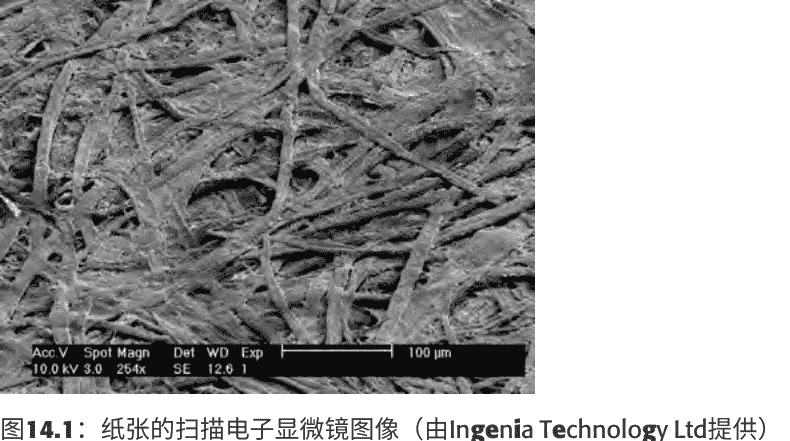

最近，在读取和记录材料的微观随机性技术方面取得了显著进展。一种系统是由Russell Cowburn及其同事开发的激光表面认证系统[236]。他们扫描文件或包装的表面，并使用激光散斑将其表面粗糙度编码为一个256字节的代码，该代码非常耐用，可以抵抗折叠、干燥、涂鸦甚至烧焦。（利益声明：我曾与Russell合作研究过这种技术的安全性。）一个典型的应用是在生产线上的所有快速消费品纸箱上注册。手持激光扫描仪和与LSA代码在线数据库的链接的检查员不仅可以验证包装是否真实，还可以唯一地识别它。这比RFID更便宜，并且在数据库访问方面也更可控。因此，对于担心内部控制或想要打击灰色市场交易的公司来说，这可能特别有吸引力。从长远来看，我不会对这种技术在纸币上的使用感到惊讶。

### 14.4.2 胶水的问题

尽管标签的独特性能可能是其制造的副作用，但大多数封条仍然通过将安全印刷的标签固定在目标物体上来工作。这引发了一个问题，即如何将这件美丽的彩虹印刷艺术品附着在一个粗糙的物体上，以使其很难被移除。

在防篡改包装的特定情况下，附件是工业过程的一部分；它可以是一个带有弹出按钮或断裂盖的加压容器。通常的答案是使用比封条基质本身更强的胶水，这样如果被拉开，封条将会撕裂或至少明显变形。这是饮料盖下的铝箔封条、许多泡罩包装以及当然还有软件包装上的封条的情况。

然而，在大多数产品中，实施情况相当糟糕。许多封条容易被手工具和一点耐心直接移除。

拿一把锋利的刀，试验一下接下来到达的几封自封信封的字母。这些信封中的许多都应该撕开，而不是剥开；为此，信封盖上可能有几个垂直的槽。但是，这种希望的防篡改通常假设人们会通过将信封盖从身体上拉开来打开它们。通过稍微抬起信封盖并来回移动刀子，通常可以在不损坏信封盖的情况下剪开胶水，从而打开信封而不留下可疑的痕迹。（有些胶水应该先用吹风机加热软化，或者通过冷冻使其更加脆弱。）或者从另一端打开信封，那里的胶水不是设计成稍微防篡改的。无论哪种方式，仔细检查后，你可能会发现信封看起来稍微皱巴巴的。如果这是显眼的，把皱纹熨平。这种攻击通常对初级检查有效，可能无法通过三级检查，但很可能通过二级检查：信件在邮寄过程中本来就会出现皱纹。

市场上的许多封条都可以使用类似简单的技巧来破解。例如，有一种彩色胶带，当撕下来时会留下一个警告，比如‘危险’或‘禁止使用’。警告被印在两层胶水之间，底层胶水更强，如果封条被篡改，底层胶水应该留在原位。但是，只有在从上方拉扯的情况下，胶带才会表现出这种特性。通过从侧面切割，可以完整地移除胶带并重新使用它[749]。

### 14.4.3 PIN邮寄

一个有趣的最新的发展是银行使用特殊的印刷材料激光打印客户的PIN码。在过去，PIN邮寄使用多部分文具和冲击打印机；你通过撕开信封并拿出一张印有PIN码的纸条来获取PIN码。

从冲击打印技术转向激光技术导致许多公司发明了一种信纸，你可以拉动一个标签来阅读PIN码。这个想法是，就像封条不能移动而不留下可见证据一样，使用这种信纸也无法提取秘密而不留下可见证据。

一个典型的机制是在纸上贴有一个模糊的图案，并且上面还有一层粘性薄膜，上面印有PIN码。在薄膜后面有一张纸上的切割标签，可以拉开，从而去除模糊的背景，使PIN码可见。

我的学生迈克·邦德、史蒂文·默多克和乔利昂·克鲁洛在这些产品的连续版本中发现了一些漏洞，他们玩得很开心。早期的产品可以通过将其举到光线下来读取，这样光线以大约10度的角度反射到表面上；不透明的墨粉清晰地显示在光亮的胶片上。下一次攻击是扫描将打印件导入到Photoshop中，并从中滤除墨粉的浓黑色与底层打印的灰色。另一种方法是热转印；将一张空白纸放在邮件上方，然后用熨斗烫过。另一种方法是使用吸墨纸和有机溶剂进行化学转印。这项工作于2004年向银行业报告，并最终于2005年发表[205]。

银行现在已经发布了邮件测试标准。然而，直到今天，我们仍然收到一些邮件，其中的PIN很容易被读取：最新的邮件有拉标签时会改变颜色的墨水，并且附带一个信封和一张传单，上面写着‘如果点是蓝色的，请拒绝这个PIN邮件并给我们打电话’；但是攻击者只需要将其替换为一张传单，上面写着‘如果点不是蓝色的，请拒绝这个PIN邮件并给我们打电话’。

这是一个不起作用的系统的例子，但是没有人在意。

仔细思考，如果一个坏人知道我要得到一张新的银行卡，并且能够偷我的邮件，他会同时拿走卡片和PIN。很难想象‘防篡改’的PIN邮件能够防止任何真正的攻击。它可能偶尔防止家庭成员无意中了解到PIN；同样，可能会有偶尔的客户在不断开标签的情况下读取PIN，然后取出大量的钱，然后声称他没有这样做，在这种情况下，银行必须否认自己的邮件。但是与所有这些花哨的文具相比，威胁微不足道。也许银行将其视为‘安全剧院’；或者也许涉及的管理人员只是不想放弃这个系统，并发送打印在普通纸上的PIN，因为他们为浪费了这么多钱而感到尴尬。

## 14.5 系统性漏洞

现在我们转向对特定印刷技巧和胶水的具体威胁，转而讨论系统级威胁，其中有很多种。

一个可能有用的例子是图14.2。在我们当地的游泳池，拥挤问题通过在繁忙时期向游泳者发放手环来解决。大约每二十分钟发放一种不同颜色的手环，然后定期要求所有佩戴特定颜色手环的人离开。手环是由蜡纸制成的。一端有印刷图案和序列号，另一端有胶水；纸张是交叉切割的，所以如果你粗心地撕下来，它会完全被破坏。（它与一些机场使用的行李封条非常相似。）

最简单的攻击方式是打电话给供应商；100个手环的成本约为8美元。如果你不想花钱，你可以每次使用一次手环，然后通过从不同方向交替拉动轻松地将其取下，得到照片中的结果。印刷品虽然完好无损，但损坏并不足以被泳池旁边的工作人员看到，实际上可能是由于使用不当造成的。关键是造成的损害通过两次仔细修复，它与一个天真的用户修复一次的效果几乎无法区分。（更强大的攻击是根本不需要从封条上撕掉背胶，而是使用其他手段——安全别针或自己的胶水——来固定。）

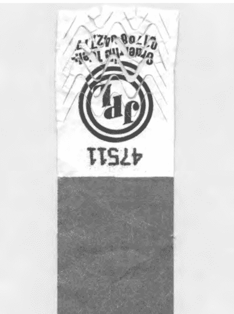
图14.2：我们当地游泳池的手环封条

尽管如此，手环封条完全符合目的。几乎没有作弊的动机：那些每次游泳两个小时的奥运有望者在拥挤时段不使用游泳池。他们还购买了季票，这样他们可以随时出去获取当前颜色的手环。但它展示了许多可能出错的事情。顾客是敌人；是顾客贴上封条；封条重复使用的效果与随机故障的效果无法区分；未使用的封条可以在市场上购买；仿冒封条也可以以很低的成本制造；有效的检查是不可行的。（然而，这种游泳池封条仍然比许多用于高价值工业应用的封条产品更难攻破。）

### 14.5.1 威胁模型的特殊性

我们曾经见过系统中，你的客户就是你的敌人，比如银行业。在军事系统中，敌人是单个不忠诚的士兵，或者是对方的特种部队试图破坏你的装备。在核监测系统中，敌人可能是托管政府试图从合法的民用反应堆转移裂变材料。

但是在商业领域中，一些最困难的封条任务出现了。同样，通常是敌人会施加封条。一个典型的应用场景是，一家公司将其产品的制造外包给承包商，并担心承包商会生产超过约定数量的产品。超产是全球伪造商品的主要来源；办案者可以获得授权的制造过程和原材料，灰色市场提供了自然的分销渠道。即使是检测此类欺诈行为 - 更不用说向法庭证明它们 - 也很困难。

对于高价值商品（如化妆品），一个典型的解决方案可能涉及从多家不同公司采购包装材料，这些公司的身份对最终装配工厂保密。

其中一些材料可能以各种方式嵌入序列号（例如通过激光雕刻在瓶子玻璃上，或者使用只在紫外光下可见的油墨在纸膜上打印）。可能存在一种在线服务，制造商的现场代理商可以验证在商店随机购买的样品的序列号，或者包装上可能有一个数字签名，将所有不同的序列号链接在一起进行离线检查。

单独使用封条的效果是有限的。有时，品牌所有者本身就是恶棍，比如当一个葡萄酒园将一千箱实际上是由外购混合葡萄酒制成的葡萄酒错误地标记为年份。因此，南非葡萄酒的瓶子都带有一个由政府监管的唯一序列号的封条；在这里，封条不能证明欺诈，但它使一个不诚实的酿酒商更难逃避其他的控制措施，如检查和审计。因此，封条机制通常必须考虑审计、测试和检查过程的设计。

检查比人们想象的要困难。在灰色市场上购买了假冒商品的经销商，相信它们是真货，可能会试图欺骗检查员，但没有任何犯罪意图。在灰色市场成为一个问题的地方，从“弗雷德”购买的产品将迅速推向客户，确保检查员只能看到他库房里的授权产品。此外，经销商可能完全不知情；可能是他的员工在兜售假货。一个众所周知的骗局是航空公司员工在远东购买假冒香水、手表等产品，在飞行中向乘客销售，并将收益装进自己的口袋[783]。航空公司仓库（以及飞机降落后的免税车）中的库存都是完全真货。因此，通常需要派出代理人进行样品购买，并且密封机制必须支持此操作。

### 14.5.2 反欺骗措施

密封物是否正确粘附在被密封的物体上也可能取决于低级员工的诚实和勤奋。我在第12.3.2.2节中提到过，在卡车速度限制系统中，变速器传感器是使用一根导线固定的。校准车间用铅盘夹紧的一根导线来固定。攻破的方法是贿赂车间机械师将导线绕错方向，这样当传感器从变速器上拧下来时，导线会松动而不是紧固并破坏密封。没有必要去业余雕塑课程上学习，以便用青铜铸造一对密封钳（除非你想节省贿赂费用，或者陷害车间）。

施加密封的人可能既粗心又腐败。在过去几年中，一些机场在乘客托运行李通过登机口附近的机器进行X光检查后，开始使用胶带密封。在我的行李上，大约有一半的情况下，胶带粘得不好；要么没有穿过箱子和盖子之间的扣件，要么一端脱落，或者箱子有几个足够大的隔间可以容纳炸弹，但只有一个扣件被密封。

最近关于封条的有趣研究大部分集中在可用性方面。一个巨大的问题是如何检查员工是否真的检查了封条。*Gundecking*是一个海军术语，用来指那些假装完成了任务，实际上却在炮台上抽烟的人。所以，如果你任务是在港口检查成千上万个运输集装箱上的封条，你如何确保你的员工真的看了每一个？

洛斯阿拉莫斯的漏洞评估团队提出了一些用于封条的反欺骗设计。一种方法是在每个集装箱封条中加入一个带有密码流生成器的小处理器，每分钟产生一个新的数字，就像我在第三章中讨论的密码生成器一样。然后检查员的任务是访问所有进口集装箱并记录它们显示的数字。如果检测到篡改事件，设备会擦除其密钥，并且无法生成更多的数字。如果你的检查员没有从其中一个集装箱中带回一个有效的封条代码，那么你就知道有问题了，无论是与集装箱还是与检查员有关。这种封条也被称为“反证据”封条：其思想是在设备未被篡改时存储信息，并在发生篡改时销毁，不给对手留下任何可以伪造的东西。

粗心和腐败相互作用。如果足够多的员工在申请或验证印章时粗心大意，那么如果我贿赂其中一个，由此产生的缺陷本身并不能证明不诚实。

### 14.5.3 随机故障的影响

当印章因完全无辜的原因而破裂时，也会产生类似的影响。例如，当卡车发动机进行蒸汽清洗时，速度限制器的印章经常会破裂，因此如果交通警察只能找到破裂的印章作为证据，司机将不会被起诉篡改。（卡车司机知道这一点。）

还有其他后果。例如，在打开一个封得太好的信封后，恶棍可以用一个贴纸再次封上，上面写着“海关开启”或“在运输过程中破裂-由邮局封好”。他甚至可以只用胶带封上，并在前面写上“送错地址，请再试一次”。

这种故障和攻击的后果必须经过仔细思考。如果保护目标是防止产品的大规模伪造，偶尔的破损可能无关紧要；但如果是为了支持起诉，自发的封条破损可能是一个严重的问题。在极端情况下，过于信任封条的稳固性可能导致司法错误，并完全破坏封条产品的证据（以及商业）价值。

### 14.5.4 材料控制

另一个常见的漏洞是封条材料的供应无法控制。公司印章是一个很好的例子。在英国，这些通常由两个金属压花板组成，插入到特殊的钳子中，用于夹紧重要文件。有几家供应商制造这些板子，一位订购了数百个的律师告诉我，从未进行过检查。虽然为‘Microsoft Corporation’订购一个印章可能稍微有些风险，但几乎可以为任何不太知名的目标制作印章：你只需要写一封看起来像来自律师事务所的信件即可。

一个更严重的例子是制药行业对泡罩的依赖，有时还会补充全息图和变色墨水。所有这些技术都可以自由购买，并且价格也不是特别昂贵。或者考虑一下一些快递公司使用的塑料信封，它们被设计成在打开时能够拉伸和撕裂。只要你能从街上走进快递站并拿到未使用的信封，它们不太可能阻止那些在计划攻击时投入一些时间和思考的人；他可以在包裹通过快递网络之前或之后替换包装。

还有一个‘城市传说’是警察和安全机构无法无痕地打开用胶带加固过的信封（我最近收到了一份银行的文件，就是用这种方式密封的）。这并不完全可信——即使没有警察实验室发明出一种神奇的溶剂来溶解胶带胶水，19世纪沙皇时代的警察已经使用叉子状的棍子将信封卷起来，以便可以将其拉出、阅读，然后放回去[676]。

即使胶带能够在信封上留下可见的痕迹，人们也必须假设警察的信封蒸汽部门没有存货与之相媲美的信封，并且收件人会足够警觉，能够察觉到伪造的信封。考虑到一个带有公司标志的信封可以很容易地被扫描并使用廉价的彩色打印机复制，这些假设相当有雄心。无论如何，台式彩色打印机的出现使得许多组织停止使用预印的文具。这使得伪造者的工作变得更加容易。

### 14.5.5 保护错误的事物

我提到过在20世纪80年代晚期，信用卡容易受到攻击，因为授权终端读取磁条，而支付草案捕获设备使用凸字。只改变磁条而不改变凸字的骗子打败了系统。还有涉及部分修改的攻击。例如，信用卡上的全息图仅覆盖最后四位数字，攻击者可以随时更改其他十二位。

当银行用于生成信用卡号码的算法被知晓时，这只涉及到对卡片的其余部分进行平整、重新打印和重新压花，这可以使用廉价设备完成。

这样的攻击现在很少见，因为恶棍们现在意识到很少有商店员工会检查小票上打印的账号与卡片上压花的账号是否相同。因此，磁条上的账号与卡面上压花的数字完全没有任何相似之处。实际上，全息图只是在说‘这曾经是一张有效的卡片’。

最后，食品和药品生产商经常使用收缩膜或泡罩包装，如果设计得很好，对于业余者来说，伪造这种包装以经受近距离检查可能是相当困难的。然而，在选择保护措施时，您必须非常清楚威胁模型——是伪造、篡改、复制、模拟、转移、稀释、替代还是其他什么？ [1025]如果威胁模型是一个持有注射器的精神病患者，那么简单的泡罩或收缩膜包装就不够了。

真正需要的是一个感应破坏的薄膜，即使是微小的渗透也会产生可见且不可逆的反应。（这样的薄膜存在，但对于消费品来说仍然太昂贵。我将在关于防篡改的章节中讨论其中之一。）

### 14.5.6 检查的成本和性质

行业中有很多关于恶棍用兔子代替鸽子在银行卡上更换全息图的故事，而商店主人的反应只是说：“哦，看，他们改变了全息图！”这不是对全息图的批评，而是一个更深层次的应用心理学和公众教育问题。当引入新钞票时，银行家们会感到担忧——在每个人都熟悉新钞票的几个星期内，这对于伪造者来说是一个发财机会。

相关问题是护照、驾驶执照、信头、公司印章和包装的巨大多样性。没有真品样本进行比较，检查基本上只限于初级水平，因此伪造很容易。即使银行职员有外国纸币的图片手册，移民官员也有外国护照的图片，通常只有很少的安全特征信息，而且无论如何，缺乏真实的物理样本意味着无法检查产品的触感方面。

索尼娅·特鲁希略在2006年3月的圣巴巴拉第七届安全封条研讨会上进行了一项有些令人震惊的实验。她用低技术攻击干扰了30种不同的食品和药品中的九种，并邀请了71位篡改检测专家来区分它们。每个受试者被要求选择他们认为已被篡改的十种产品中的三种。即使告诉他们篡改已经发生，大多数专家的表现也不比随机好，而且他们所花的时间远远超过每个产品四秒的指导时间。如果连专家都无法检测篡改，那么普通消费者有什么机会呢？

因此，可以由公众或经过最低限度培训的员工检查，并且无需访问在线数据库的封条仍然是理想的。防篡改包装的主要目的是向客户提供保证；次要目的包括最小化产品退货、尽职调查和减少陪审团赔偿金额。阻止无能的篡改者可能就在其中。

像大型软件公司这样严肃对待伪造问题的公司，已经采用了许多由纸币印刷商首创的技术。但是高价值的产品包装比纸币更难保护。熟悉度很重要：人们对他们经常接触的东西有一种‘感觉’，比如当地的货币，但是对于他们很少见到的东西，比如最新版本的微软办公软件，他们可能每五年才购买一次，很少会注意到有什么问题。因此，过去几年来，保护软件产品免受伪造的工作大部分已经转向在线注册机制。

其中一种可能性是将公众作为检查员，不仅仅检查包装，还要检查唯一的序列号。供应商可以将这些序列号打印在产品标签上，而不是将其隐藏在RFID芯片中，那些担心是否购买到真正产品的人可以打电话进行验证。这样做通常可以更好地调动激励，但实际上看起来更困难。例如，当微软首次发布其反间谍软件测试版时，我将其安装在家庭电脑上，结果我的Windows副本立即被指责为邪恶的。那台电脑是在一家常规商店购买的，我只是不想为此事烦恼。我特别不喜欢他们最初的谈判立场，即解决办法是我给他们寄更多的钱。最终商定的解决办法是他们给了我另一份Windows XP的副本。但有多少人能够协商呢?

### 14.6 评估方法

这个讨论提出了一种系统评估给定应用程序的密封产品的方法。与其只是问：“你能以其他明显的方式除去密封吗？”我们需要从设计和现场测试，到制造、应用、使用、检查、销毁，最后到退役的整个过程进行跟踪。以下是一些应该提出的问题：

- 如果密封被伪造了，谁应该发现它？如果是公众，那么他们多久才能看到真正的密封？供应商是否进行了实验，这些实验在应用心理学的标准下能够通过，以确定可能的错误接受和错误拒绝率？如果是你们现场的检查员，他们的设备和培训会花费多少？这些检查员（无论是公众还是专业人士）对于发现和报告缺陷真的有多大动力？
- 有没有真正知道他们在做什么的人努力尝试去击败系统？而击败到底是什么意思——篡改、伪造、改变、证据价值的侵蚀还是对你商业信誉的“公关”攻击？
- 设计团队的声誉如何——他们有成功击败对手产品的历史吗？
- 它在领域中存在多长时间，进展会使击败变得更容易吗？
- 密封材料有多广泛可获得——还有谁可以购买、伪造或窃取供应品？
- 施加封印的人会粗心或腐败吗？如果是这样，你将如何应对？
- 封印的使用方式是否保护产品的正确部分（或足够）？
- 有哪些质量问题？污垢、油、噪音、振动、清洁和制造缺陷会产生什么影响？产品是否需要经受户外天气、汽油溅泼、贴身携带或掉入啤酒杯中的考验？或者它是否应该在发生这种情况时有可见的反应？随机封印失效会有多频繁，对此会产生什么影响？
- 是否存在任何证据问题？如果你最终要上法庭，除了你自己（或供应商）之外，还有其他专家可以依赖吗？对方能否依赖？如果答案是否定的，那么这是好事还是坏事？为什么陪审团应该相信你，系统的发明者，而不是那个坐在被告席上的可爱老太太？法官会不会因为你的技术主张难以反驳而在公平审判的基础上放过她？（这正是在Judd vs Citibank案件中发生的情况，该案件解决了美国关于从提款机中进行“幽灵提款”的法律[674]。）
- 产品使用后，封条将如何处理——如果有人从垃圾中找回一些旧封条，你会在意吗？

记住，打败封条是关于愚弄人们，而不是打败硬件。因此，请认真考虑申请和检查封条的人是否会忠实有效地履行他们的任务；分析动机、机会、技能、审计和问责制。在敌人（如合同制造商）或容易受贿的人（如渴望赢得卡车公司业务的汽车修理厂）施加封条的地方要特别谨慎。最后，要从客户公司、对手以及无辜系统用户和法律证据的角度，全面考虑封条失效和检查错误可能带来的后果。

当然，这种全生命周期的保证过程也应该应用于计算机系统的一般情况。我将在第三部分中详细讨论这个问题。

### 14.7 总结

大多数商用封条产品相对容易被破解，尤其是当封条检查由未经训练的人员随意进行时。封条必须在封条的整个生命周期内进行评估，包括制造、材料控制、应用、验证和最终销毁；在关键应用中强烈建议进行敌对测试。

封印通常依赖于安全印刷，关于这一点可以做出广义上相似的评论。

### 研究问题

已经在这个领域的研究和产品开发上花费了大量的资金。但其中很多资金并没有有效地使用，它具有柠檬市场的特征，因为低成本和用户无知导致了三流产品的主导。毫无疑问，会有很多新奇的技术被吹捧用于产品安全和防伪检测，从纳米颗粒到铁磁流体再到DNA；但只要市场破裂，人们忽视系统层面的问题，它们有什么用呢？

这些技术是否具有新颖的特性，使我们能够解决初级可检查性和防止作假的难题？自动检测系统可能是一种前进的方式；也许在未来，如果容器被篡改，产品的RFID标签将自动停用。

目前这样的设备成本很高；在几年内它们可能会成本很低。但是哪些供应商会部署它们，用于什么应用呢？激励措施将在哪里？而且，最难的是，这对消费者有什么帮助呢？大部分假冒伪劣产品都是在零售环节引入的，保护零售商在这方面没有帮助。

### 进一步阅读

关于安全印刷的权威教材是van Renesse [1279]，它不仅介绍了全息图和动态图等技术诀窍，还介绍了它们在从纸币印刷到护照再到包装等各种应用中的工作原理。这是非常重要的背景阅读。

关于封条的基本写作可以在洛斯阿拉莫斯国家实验室的Roger Johnston封条漏洞评估团队的许多出版物中找到（例如，[668]）。

假冒伪劣产品的历史非常有趣。从独立战争到内战，美国人使用的是私人银行发行的纸币，而不是政府发行的，假冒伪劣现象普遍存在。银行可以对当地的伪造者采取行动，但到1800年左右，已经形成了一支由雕刻师、造纸商、印刷商、批发商、零售商和传递者组成的网络，在佛蒙特州和加拿大边境的荒地上有安全的避风港；美国和加拿大政府都不愿意承担这个问题责任。

在许多方面，它让人想起了当前对抗网络钓鱼的斗争。

## 第 15 章 生物特征识别

> 基列人在以法莲人之前占领了约旦河的渡口。当逃脱的以法莲人说要过去时，基列人对他们说：“你是以法莲人吗？”他若说：“不是”，他们就对他说：“请你说‘示播列’。”他却说：“西播列”，因为他不能正确发音。他们就在约旦河的渡口抓住他，杀了他。那时以法莲人被杀的有四万二千人。
> ——《圣经·士师记》12:5-6

### 15.1 引言

上述引文可能是第一个记录的军事安全协议的使用，其中身份验证依赖于人类的某个特性，例如他的口音。（在此之前，还有一些较不正式的使用，比如以撒通过身体上的毛发试图辨认以扫，但被雅各欺骗了，或者人们通过面部相识——我稍后会讨论。）生物特征识别通过测量个体解剖学或生理学的某些方面（例如手部几何形状或指纹），某些根深蒂固的技能或行为（例如手写签名），或两者的组合（例如声音）来识别人们。

在过去的一个世纪左右，人们开发了大量的生物特征设备。自从9/11事件以来，市场真的起飞了，包括国际生物特征旅行文件、美国访问计划对访问美国的人进行指纹采集、欧洲申根签证、各种身份证计划以及各种注册旅行者计划。一些大型系统已经存在，比如FBI的指纹数据库，现在正在扩展以包含一系列生物特征数据，用于身份识别和法医目的。

生物特征系统市场据报道在2005年价值超过15亿美元[675]，从1998年的5000万美元大幅增长。我已经提到过在20世纪70年代末使用手形几何来识别核反应堆工作人员。但是最早确立的生物特征技术甚至早于计算机时代，包括手写签名、面部特征和指纹的使用。我将首先介绍这些技术，然后再介绍更高级、更“高科技”的技术。

### 15.2 手写签名

手写签名在古代中国被使用，但雕刻的个人印章被认为更高地位；它们仍然在中国、日本和韩国的重要交易中使用。而在欧洲则相反：印章在中世纪时代被使用，但随着文艺复兴后写作的传播，人们越来越多地只是写下自己的名字以表示同意文件。

随着时间的推移，签名被接受为标准。每天，价值数十亿美元的合同通过手写签名在文件上达成；如何用电子机制取代这些签名仍然是一个热门的政策和技术问题。

单独来说，手写签名是一种非常脆弱的身份验证机制（容易伪造），但由于它们的使用背景，它们在几个世纪以来一直运作良好。一个重要的因素是伪造的责任。英国法律规定，伪造的手写签名是完全无效的，这一规定在当时是大英帝国的许多国家的法律中仍然存在。这意味着伪造签名的风险落在依赖它的一方身上，银行无法利用其标准条款和条件将风险转嫁给客户。

因此，手写签名对于客户来说更好，而现在取而代之的PIN码和电子令牌对于银行来说更好。

这并非在所有地方都是如此；一些瑞士银行要求客户对伪造的支票负责。在美国，E条例使银行对其部署的电子系统负责，因此引入电子技术并没有改变游戏规则太多。不用说，欧洲银行在让客户摆脱手写签名方面比美国银行走得更远。

现在，伪造签名被接受为真实签名的概率主要取决于检查时所采取的注意程度。许多商店的银行卡交易甚至不会看一眼卡上的样本签名，以至于许多美国人甚至不费心在信用卡上签名。但即使是勤勉的签名检查并不能将欺诈风险降至零。一项实验显示，105名专业文件鉴定员进行了144次两两比较，错误归因了6.5%的文件。与此同时，34名受过相同教育水平的未经训练的普通人在这方面的错误率达到了38.3% [682]，而非专业人士的表现无法通过给予他们经济激励来改善 [683]。专业人士的错误是业界持续讨论的话题，但被认为反映了鉴定员的先入之见 [137] 和背景 [403]。由于这些测试的参与者获得了合理的手写样本，而不仅仅是签名，因此可以合理地假设对于支票或信用卡凭证上的签名进行验证的结果会更糟糕。

因此，手写签名被许多国家围绕着一系列的惯例和特殊规定所包围，这些规定因国家而异，并且远远超出了银行业务的范畴。例如，在英国购买房屋并使用从非你所在的银行借来的钱时，程序是去律师事务所，携带护照等文件，签署房产转让和贷款合同，并让律师在合同上签字。政府要求提供政府签发的照片身份证明是为了让抵押贷款人满意，而要求房地产购买合同以书面形式进行是几个世纪前政府为了征收房地产交易税而制定的规定。其他类型的文件（如专家证词）可能需要按特定方式公证。许多奇怪的异常情况可以追溯到19世纪和打字机的发明。一些国家要求机器书写的合同在每一页上签字，而有些国家则不要求，这些差异有时已经持续了一个多世纪。规定的冲突仍然导致严重问题。在一个案例中，西班牙的一笔房地产交易被认为无效，因为交易是通过传真完成的，而一家英国公司因此破产了。

然而，在大部分讲英语的世界中，大多数文件不需要通过特殊措施进行认证。签名的本质是签署者的意图，因此文盲在文件上的“X”与受过教育的人的花哨签名一样有效。实际上，在电子邮件消息底部的明文姓名也具有同样的法律效力[1358]，除非有特定的法规相反。每个国家的法律中可能有许多零散的签名规定。

在法庭案件中，签名争议实际上非常罕见，因为大多数情况下上下文都能清楚地表明是谁做了什么。因此，我们有一个在实践中工作相当好的非常脆弱的生物识别机制，但它被各国和各应用的程序规则和责任陷阱所束缚。

解决这个混乱，并对电子文件实施合理统一的规则，是国际上的一个重要议题。关于这些问题的摘要可以在[1359]中找到，各国的分析可以在[109]中找到。我将在第三部分中进一步讨论这些问题。同时，需要注意的是，签名的形式，它易于被伪造，以及在给定环境中是否具有法律效力，这些问题在很大程度上是独立的。

有一个应用程序可以更好地自动识别手写签名。这是支票清算。银行的支票处理中心通常只会验证一定金额以上的支票——也许是1000美元，也许是10000美元，也许是过去三个月账户余额的一定比例。签名验证是由一个操作员完成的，该操作员同时在屏幕上显示支票图像和客户的参考签名。除非可以自动化，否则对小额支票进行验证是不经济的。

因此，许多研究人员致力于开发自动比较手写签名的系统。由于真实签名之间的变化性，这事实上是一个非常困难的图像处理任务。一个更简单的选择是使用签名平板。这是一个传感器表面，用户在上面签名；它不仅记录曲线的形状，还记录其动态特性（手的速度，笔离开纸张的位置等）。送货司机使用平板收集货物收据；自上世纪90年代初以来，已经有产品可以将捕获的签名与之前登记的样本进行比较。

像报警系统一样，大多数生物识别系统在误拒绝率和误接受率之间存在权衡，银行业通常称之为欺诈率和侮辱率，生物识别文献中称之为类型1和类型2错误。许多系统可以调整以偏好其中之一。这种权衡被称为接收者操作特性，这个术语最早由雷达操作员使用；如果你将雷达增益调得太高，你就看不到目标，因为有太多杂波，而如果调得太低，你根本看不到目标。操作员需要在这条曲线上选择一个合适的点。等误差率是指系统被调整得误接受和误拒绝的概率相等。对于基于平板电脑的签名识别系统，等误差率最好为1%；对于纯光学比较，它可以达到几个百分点。在像支票处理中心这样的操作中，这并不是致命的，因为自动比较只是用作人工操作员审查可疑支票的过滤器。然而，在面向客户的应用程序（如零售店）中，这是一个无法接受的问题。如果每一百笔交易中有一笔失败，对客户来说是无法容忍的。因此，英国银行设定了生物识别的欺诈率为1%，侮辱率为0.01%，这已经超出了签名验证和指纹扫描的当前技术水平。

有什么办法可以弥补差距？肯特大学在英格兰进行了一项有趣的实验，旨在减少在南安普敦附近的一家邮局领取福利的欺诈行为。该系统的新颖之处在于，它像支票处理中心一样用于筛查签名并支持人类决策，而不是做出决策本身。因此，它不是为了低侮辱率而调整，而是具有相应的高欺诈率，欺诈和侮辱率几乎相等。当一个签名被拒绝时，这只是告诉工作人员要更仔细地观察，并要求提供驾驶执照或其他照片身份证明。从343名顾客中取得了8500个样本，98.2%的样本在第一次尝试时被正确验证，三次尝试后升至99.15% [452]。但是这个比率是通过排除“山羊”（生物特征社区用于无法很好分类的人的术语）来实现的。如果包括它们，误拒绝率为6.9% [453]。由于这种令人失望的表现，签名识别技术的销售额仅占生物特征市场总额的1.7%；自动化使其失去了生物特征市场的领导地位。

一般来说，生物特征机制在协助保安员而不是取代保安员的情况下更加稳健。虚警率实际上可以通过保持保安员警觉起到帮助的作用。

### 15.3 人脸识别

通过面部特征识别人是人类最古老的识别机制，至少可以追溯到我们早期的灵长类祖先。生物学家认为，我们的认知功能的一个重要部分进化出来是为了提供有效识别他人面部特征和表情的方式[1076]。例如，我们非常擅长判断另一个人是否在看着我们。在正常的社交应用中，人类通过面部识别他人的能力似乎比迄今为止生产的任何自动面部识别系统都要好得多。

由于广泛依赖于照片身份证明，人类识别面孔的能力对安全工程师来说非常重要。驾驶执照、护照和其他类型的身份证不仅用于直接控制进入计算机房间，还用于引导大多数其他系统的启动。密码、智能卡或用户注册的问题，或者使用其他技术（如虹膜识别）在生物特征系统中注册，通常是一个过程的终点，该过程是由该人在申请工作、开设银行账户或其他事项时出示照片身份证明开始的。

但是，即使我们在现实中能够很好地识别朋友，我们能够通过照片身份证明来识别陌生人吗？

简单的答案是不行。威斯敏斯特大学的心理学家们与一家超市连锁店和一家银行合作进行了一项有趣的实验[705]。他们招募了44名学生，并为每个学生发放了四张信用卡，每张卡上都有不同的照片：

- 其中一张照片是“好的、好的”照片。它是真实而最近的；
- 第二张是“坏的、好的”照片。它是真实的，但有点旧，而且学生现在的服装、发型或其他方面有所不同。在其他情况下，换句话说，这是大多数人在他们的照片身份证上拥有的典型照片；
- 第三张是一个“好的、坏的”。从一堆大约一百张不同人的随机照片中，调查人员选择了最像被调查对象的那一张。换句话说，这是犯罪分子如果他们有一堆偷来的卡片时可能得到的典型匹配；
- 第四张是一个“坏的、坏的”。它是随机选择的，只是与被调查对象的性别和种族相同。换句话说，这是真正懒惰、粗心的犯罪分子可能得到的典型匹配。

实验在正常营业时间结束后的超市进行，但是有经验的收银员在岗，并且知道实验的目的。每个学生都使用不同的卡片多次经过结账台。结果发现，没有一个收银员能够区分“好的、坏的”照片和“坏的、好的”照片。事实上，他们中的一些人甚至不能区分“好的、好的”和“坏的、坏的”。现在，这个实验是在最佳条件下进行的，有经验的员工，充足的时间，并且如果一张卡被拒绝，没有尴尬或暴力的威胁。可以预期实际情况会更糟。事实上，许多商店不会将信用卡公司提供的奖励传达给他们的收银员，以便捕获被盗卡片。因此，即使是最基本的激励也是缺失的。

银行业对这个实验的反应是矛盾的。至少有两家银行在信用卡上尝试使用照片后，欺诈行为显著下降，其中一家苏格兰银行的欺诈行为不到预期的1% [107]。总体结论是，照片身份证的好处主要在于其威慑效果 [471]。

也许人们在身份识别的情境中不会有效地使用他们的面部识别技能，或者也许我们用于在社交情境中识别人们的信息与我们通过观察单张照片获得的信息在大脑中存储方式不同。（识别陌生人比识别认识的人要困难得多。据估计，误认是错误监禁的主要原因，有20%的证人在身份阵容中犯错误 [1360] ——与将面孔与照片进行比较时几乎随机的结果相比，这还算不错。）

但无论如何，照片身份证似乎不起作用，这是尝试自动化该过程的原因之一。尝试可以追溯到19世纪，当时弗朗西斯·高尔顿为面部测量设计了一系列弹簧装置的“机械选择器” [510]。但自动人脸识别实际上涵盖了许多单独的问题，在大多数问题中，我们无法奢侈地对主体进行仔细的三维测量。在典型的身份验证应用中，主体直视摄像机，在受控照明条件下，将其面部与文件中的面部进行比较。

在取证中，存在一个相关但更困难的问题，即我们可能试图确定嫌疑人的面部是否与安全视频上的低质量录像相匹配。最困难的是监视，目标可能是在机场扫描一个移动的人群，并尝试识别出任何在数千个已知嫌疑人名单上的人。然而，在911事件之后，自动人脸识别是安全工业复合体中就被炒作的技术之一[1084]。

即使从一张人群的图像中挑选出脸部也是一个非常非凡的计算任务[798]。一项关于不同面部特征提取方法鲁棒性的学术研究发现，在合理的光照、视角和表情变化下，没有任何一种方法单独足够，并且错误率高达20%[13]。使用多种技术组合的系统可以降低错误率，但无法达到许多其他生物特征识别的水平[898, 1370]。2002年，美国国防部进行的现场试验发现，一款领先的人脸识别产品仅能正确识别270个人中的一个，正确识别范围在10个参与者内的准确率为81%[852]。（涉及的供应商在9月11日下午发布了一份新闻稿，并在交易恢复后的一周内看到股价大幅上涨[782]。）到2003年，该技术有所改进，其中一家供应商在超过30,000个人的数据库中识别出64%的主体，尽管在户外的性能较差。英国国家物理实验室（NPL）在2001年对多种生物特征技术进行的测试发现，人脸识别几乎是最差的，仅优于静脉图案；其单次尝试的等误率几乎达到了百分之十[834]。2005年英国护照办公室的一项试验更接近实际条件，发现仅能识别69%的用户（对于残疾参与者，这一比例降至48%）[1274]。

因此，从工程角度来看，这项技术仍然不太好。但是，在某些应用中，它可能会产生影响。例如，伊利诺伊州机动车辆管理局使用它来检测以虚假姓名申请额外驾驶执照的人 [454]。在可以惩罚违法者的地方，即使只能抓住其中四分之一的人（这仍然比我们抓到的大约8%的入室盗窃犯要好），也值得尝试去检测他们。

人脸识别也被用作布鲁斯·施奈尔所称的“安全剧场”。1998年，伦敦纽汉姆区在主要街道上显眼地放置了视频摄像头，并进行了一场公关活动，宣传他们的新计算机系统不断扫描人群中的面孔，以寻找几百名本地已知的罪犯。他们成功地显著减少了入室盗窃、商店扒窃和街头犯罪。这个系统甚至引起了公民自由主义者的担忧，但它完全是通过安慰剂效应起作用的 [1227]。警方后来承认，他们的系统上只有20或25个罪犯的面孔，而且从未识别出其中任何一个[871]。在佛罗里达州坦帕市，一个类似的系统在美国公民自由联盟提出信息自由请求后被放弃了。发现它没有识别到任何恶棍[1072]。美国公民自由联盟欢迎它的消失，并评论道：“每个走在街上的人都在没有他们的同意下接受了一次电子警察排队。”（考虑到这项技术根本不起作用，这可能有点过分。）在波士顿的洛根机场也尝试过面部识别；通过安全检查的乘客被观察并进行匹配。发现该系统不切实际，无法在错误匹配和虚假警报之间取得有用的平衡[222]。

然而，面部识别已经是第二大销售生物特征学的技术，占市场的19%。然而，其中很大一部分与人类比较的自动存储的面部图像有关，例如新的生物特征护照芯片上存储的照片。自动识别市场规模要小得多。也许随着时间的推移和技术的改进，它的潜力（以及隐私担忧）将会增加。

## 15.4 Bertillonage

19世纪的发明家们花了很多精力试图通过身体测量来识别人们。其中最著名的是阿方斯·贝蒂永（Alphonse Bertillon），他最初是巴黎警察记录部门的一名职员，在那里的一个重要任务是识别连环犯。1882年，他发表了一个基于身体测量的系统，如站立和坐姿的身高，脸部的长度和宽度，以及耳朵的大小和角度。这些主要用于索引一组记录卡，这些卡片还包含了嫌疑人的照片和指纹，可以用来确认身份。这个系统被称为“人体测量学”，也被称为“贝蒂永法”以纪念其创始人。最终，一旦警察部队了解了如何索引和搜索指纹，这个系统就不再受欢迎了。

这种技术以手形几何读取器的形式卷土重来。除了自1970年代以来在核设施入口控制中的使用外，手形几何现在也被美国移民和归化服务用于机场，为频繁旅行者提供“快速通道”。它的实施简单且相当稳健，NPL试验发现单次尝试的等错率约为百分之一[834]。（护照检查比人们最初想象的不太关键，因为航空公司工作人员还会检查护照与乘客名单，并将这些名单提供给国土安全部人员。）手形几何现在据说占据了生物识别市场的8.8%。

## 15.5 指纹

自动指纹识别系统（AFIS）是迄今为止最大的单一技术。1998年，AFIS产品占据了惊人的78%——在5000万美元的生物识别技术销售额中占43.5%，但自那时以来，该行业的巨大增长使其在百分比上降至2005年的1539百万美元（约15.39亿美元），但它仍领先于所有其他自动识别选项。AFIS产品查看覆盖指尖的摩擦脊线并对脊线的分支和端点等细节进行分类。有些还会查看脊线皮肤上的毛孔。关于自动指纹识别系统的最新技术参考书是[832]。

使用指纹来识别别人的身份是独立发现的，多次发现。马克·吐温在1883年的《密西西比河上的生活》中提到了指纹，他声称是从一个老法国人那里了解到的，这个老法国人曾经是一个监狱看守；他在1894年的小说《普丁黑德·威尔逊》中使这个想法在美国流行起来。在那之前很久，指纹在中国七世纪的法典中被接受为印章或签名的替代品，并且在八世纪的日本法典中要求一个文盲男子想要与妻子离婚时必须提供指纹。几个世纪前，它们也在印度使用。在显微镜发明之后，英国植物学家纳撒尼尔·格鲁在1684年提到了它们，意大利的马塞洛·马尔皮吉在1686年提到了它们；在1691年，爱尔兰伦敦德里的225名市民使用他们的指纹签署请愿书，要求国王威廉对该市的围攻进行赔偿。第一个现代系统化使用指纹的地方是印度，从1858年开始，由威廉·赫歇尔（William Herschel）（天文学家的孙子，也是殖民地法官）引入。他引入了手印和指纹来签署合同，阻止已故养老金领取人的冒名顶替，并防止富人支付穷人来替他们服刑。医学传教士亨利·福尔兹在日本独立发现了指纹，并提出了使用犯罪现场的潜在指纹来识别罪犯的想法。福尔兹将指纹引起了查尔斯·达尔文的注意，达尔文进而激励弗朗西斯·高尔顿对其进行研究。高尔顿在《自然》杂志[510]上发表了一篇文章，这使他与退休的赫歇尔取得了联系，赫歇尔的数据使高尔顿相信指纹在一个人的终生中是持久存在的。高尔顿继续收集更多的指纹，并设计了一套对其模式进行分类的方案[511]。印度的历史由钱达克·森古普塔（Chandak Sengoopta）讲述，他的书还指出指纹识别拯救了两个有些可疑的帝国制度，即契约劳工制度和鸦片贸易[1145]。

这项技术的实际引入很大程度上归功于爱德华·亨利爵士，他曾孟加拉担任警察。他在1900年写了一本书，描述了一种更简单、更健壮的分类方法，包括环、螺旋、拱和帐篷，这是他与助手阿齐兹尔·哈克和亨姆·钱德拉·博斯共同开发的，至今仍在使用。同年，他成为伦敦大都会警察局局长，从那里这项技术迅速传播到全球²。亨利的真正科学贡献是将高尔顿的分类方法发展成为一种索引系统。通过为嫌疑人的十个手指中的每一个是否有螺旋纹（一种圆形图案）分配一个比特，他将指纹文件分成了1024个存储区。通过这种方式，可以将需要搜索的记录数量减少数个数量级。与此同时，由于英国停止将罪犯流放到澳大利亚，人们认为有必要识别以前的罪犯，以便对他们判处更长的监禁。

指纹现在被世界各国的警察部队用于基本上两个不同的目的：识别人员（在美国的主要用途）和犯罪现场法医学（在欧洲的主要用途）。现在我将依次讨论这两种技术。

### 15.5.1 验证正面或负面身份声明

如今在美国，就像19世纪的英国一样，相当多的罪犯在出狱后改名换姓并搬到新的地方。当罪犯改过自新时，这是好的，但是对于逃犯和累犯呢？美国警察部队历来使用指纹来识别被逮捕嫌疑人，以确定他们是否被其他机构通缉，是否有犯罪记录以及是否以其他名字引起注意。FBI维护着一个大型在线系统，用于此目的；每月识别约八千名逃犯[1208]。它还用于筛选求职者；例如，任何想要获得美国政府机密或更高级别许可的人都必须进行FBI指纹检查，还会对一些申请与儿童或老年人工作的人进行检查。每天进行多达100,000次指纹检查，有900,000名联邦、地方和州执法人员可以访问。

现在有一个项目正在扩展，以包含其他生物特征，以保存外国公民的数据，并提供“rap-back”服务，该服务将提醒雇主有清白记录的人员是否与法律有纠纷——所有这些都令民权组织感到不安[927]。自9/11事件以来，指纹也被用于移民。美国访问计划（US-VISIT）对抵达美国港口的所有外国人进行指纹采集，并与全球其他警察部队和情报机构的黑名单进行比对。

这些都是身份验证的一种类型的例子——检查（隐含的）声明是否不在黑名单上。另一种类型是系统检查声称具有某种已知身份的要求。指纹在美国用于建筑入口控制和福利支付[405]；而银行则在印度和沙特阿拉伯等国家使用它们来识别客户，这些国家已经普遍使用墨水指纹，因为识字率较低。

指纹在北美或欧洲的银行系统中并没有真正流行起来，因为它们与犯罪有关，尽管一些美国银行在你兑现支票时会要求指纹，而你不是他们的客户。他们发现这样可以将支票欺诈减少一半。有些人甚至对新客户进行指纹识别，并发现客户的抵抗程度低于预期，尤其是如果他们使用扫描仪而不是墨水和纸[497]。这些应用程序并不是常规的身份验证，而更像是试图识别后来被证明是不良的客户，另一个例子是英国一家大型货车租赁公司，在你租赁货车时要求留下拇指印。如果车辆没有归还，或者如果它被用于犯罪活动，然后发现是用盗窃的信用卡租赁的，拇指印将被交给警方。

因此，它们实际上是一个“犯罪现场取证”应用程序，我将在下一节中讨论。

那么自动指纹识别系统有多好呢？一个很好的经验法则（如果可以这样称呼它）是，要验证身份声明，可能只需要扫描一个手指就足够了，而要将某人与数百万犯罪黑名单进行比对，最好扫描全部十个手指。事实上，美国访问计划（US-VISIT）最初只打算扫描每位到访者的两个食指，但却被虚假匹配结果所困扰。在数据库中有600万名罪犯的情况下，2004年的虚假匹配率为0.31%，漏配率为4% [1347]。

尽管这些数字在2007年可以通过使用我们现有的最佳算法来改善一些，但该计划现在正在转向所谓的“10个指纹”，即每位访客将依次出示双手的四个手指，然后是两个拇指进行三次扫描。

这是关于误判和漏判之间的权衡的全部内容：

- 接收操作特性（ROC），在前一节中有所描述。

2001年，NPL研究发现常见产品的误匹配率为1%，误接受率为8%。到现在为止，更好的产品的等错误率略低于每个手指1%。误接受是因为为了降低误拒率而引入的特征和特征选择的灵活性[1080]。以足够高的概率发现返回的逃犯，以威慑他们并以足够的确定性拘留他们（这意味着将误报保持在可控水平）将需要匹配几个手指——也许是十个中的八个。但是要求每个乘客的每个手指在入境时都要进行正确扫描可能会导致延迟；英国护照办公室的一项研究发现，约有20%的参与者在进行10个指纹采集时未能正确注册，而10个指纹的验证需要超过一分钟[1274]。这将随着时间的推移而降低，但即使有额外的时间，每位乘客30秒，一个机场每15分钟有300名国际旅客到达，就需要额外的10个工作移民通道。

额外的建筑和人员成本可能会超过硬件和软件的任何花费。（有关算法和系统的更多信息，请参见[832, 656, 831]。）错误不是均匀分布的。许多人，如体力劳动者和抽烟者，经常损坏指纹，年轻人和老年人的指纹模糊[275]。自动化系统也存在与截肢者、先天缺陷（如额外手指）以及根本没有传统指纹模式的人[764]的问题。

指纹损坏也可能影响识别。当我还是个孩子的时候，我在切苹果时划伤了我的左手中指，留下了大约半英寸长的疤痕。当我把这个手指放在1989年FBI用于建筑入口控制的系统上时，我的疤痕使扫描仪崩溃了。即使疤痕不会导致系统严重故障，它们仍然会增加错误率。

指纹识别系统可以通过多种方式进行攻击。一个老的诡计是让骗子分散（或贿赂）警官的注意力，使得手指在亨利系统下的索引变为‘01101’而不是‘01011’，这样他的记录就不会被找到，他会因为初犯而获得较轻的判罚[764]。最近的一批头条新闻出现在2002年，当时松本力（Tsutomu Matsumoto）引起了行业的极大恐慌；他和他的同事们展示了指纹可以使用明胶快速、廉价地制作和克隆[845]。他测试了11个商用指纹读取器，并轻易地欺骗了所有的读取器。这促使德国计算机杂志C'T在汉堡的CeBIT电子展销会上测试了一些生物识别设备——九个指纹读取器、一个人脸识别系统和一个虹膜扫描仪。它们都很容易被欺骗——低成本的电容传感器经常被一些简单的技巧所欺骗，比如对着指纹扫描仪呼吸，以重新激活之前授权用户留下的潜在指纹[1246]。最新的指纹也可以使用胶带重新激活或转移。更昂贵的热扫描仪仍然可以被橡胶模制的手指所击败。

然而，指纹系统仍然主导生物识别市场，并且正在迅速扩展到相对低保证的应用领域，从高尔夫俱乐部停车场的入口到学校图书馆的自动借书。（大多数欧洲国家的隐私机构已经禁止在学校使用指纹扫描仪；英国允许使用，但需遵守政府指导方针，理由是指纹无法从模板中反向工程化，因此隐私得到保护[132]。正如我稍后将讨论的，这种推理是错误的。）指纹识别系统成功的一个重要方面不是它们在实验室条件下的错误率，而是它们的威慑效果。这在福利支付系统中尤为明显。尽管用于认证福利申请人的廉价指纹读取器的错误率高达5% [267]，但它们已经被证明是一种有效减少福利人数的方法，因此在一个又一个地方被采用[890]。

### 15.5.2 犯罪现场取证

指纹识别的第二个用途是在犯罪现场取证中。在欧洲，取证是主要的应用。在犯罪现场发现的指纹与数据库记录进行匹配，任何与之匹配程度超过一定水平的指纹都被视为嫌疑人曾经到过犯罪现场的确凿证据。它们通常足以单独确定罪。在一些国家，所有公民和外国居民都需要提供指纹。

近年来，取证应用中的错误率变得极具争议，关键限制在于从犯罪现场获取的图像的大小和质量。质量和程序规则因国家而异。英国曾要求指纹在十六个点（对应细节）上匹配，一位英国警察专家估计，这种匹配的概率在四十亿分之一到一百亿分之一之间[764]。希腊接受10个点，土耳其接受8个点，而美国没有设定限制（而是对鉴定人员进行认证）。这意味着在美国，可以找到质量较差的指纹匹配，但可能存在疑问。

在英国，指纹证据在近一个世纪内没有成功的挑战；16个点的指纹匹配被认为是无可争议的证据。法院对此的信心被臭名昭著的麦基案[867]所打破。苏格兰警察女官员雪莉·麦基（Shirley McKie）基于必要的十六个点的指纹匹配而被起诉，苏格兰刑事记录办公室的四名鉴定人确认了这一点。她否认这是她的指纹，并发现她无法找到一个英国的独立专家来支持她；这个行业合力保持沉默。她请来了两名美国鉴定人，他们提供证词证明这不是一个身份确认。

犯罪现场的指纹在图15.1中，她的档案指纹在图15.2中。

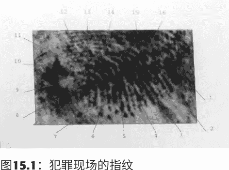
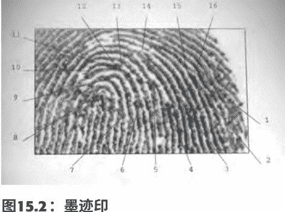

她被无罪释放[866]，这导致了一场政治剧，持续了多年。第一个问题是对她的指控的性质[867]。一些高级警官曾试图说服她作出虚假陈述，以解释在一起可怕谋杀现场发现的被误认的印迹的存在。她拒绝这样做，结果被控以伪证罪，以此来败坏她的名誉。她的无罪释放实际上表明格拉斯哥警察官员不是可靠的证人。一个直接的影响是被判谋杀罪的大卫·阿斯伯里在上诉中被无罪释放，并起诉警察要求赔偿。一个长期的影响是破坏了对指纹作为法庭证据的信任。政府随后以伪证罪起诉了其四名指纹专家，但这并没有取得任何进展。这个问题一次又一次地回到了苏格兰议会。警方拒绝恢复雪莉的职位，涉案的警官们得到了晋升，争议变得更加激烈。最终，她从政府获得了75万英镑的赔偿[130]。

麦基案引发了广泛的专家讨论，讨论的焦点是指纹识别的价值[522]。它还导致了指纹证据在其他一些国家成功被质疑。美国发生了两起备受关注的案件，分别是斯蒂芬·考恩斯（Stephan Cowans）和布兰登·梅菲尔德（Brandon Mayfield）。考恩斯在1997年因抢劫后射杀一名警察而被判有罪，但在六年后的上诉中被无罪释放，他辩称他的指纹被错误识别，并且攒够了足够的钱来对证据进行DNA测试。DNA不匹配，波士顿和州警察重新分析了指纹，随后意识到它并不匹配。布兰登·梅菲尔德是一名俄勒冈州的律师，被FBI错误地认定为马德里爆炸案的肇事者之一，并被拘留了两周，直到马德里警方逮捕了另一名指纹更匹配的男子。

FBI曾称他们的比对结果“毫无争议”，并同意在2006年支付梅菲尔德200万美元。

在随后的一项研究中，心理学家Itiel Dror向五名指纹鉴定员展示了一对指纹，并告诉他们这些指纹来自梅菲尔德案件，并询问他们FBI哪里出错了。其中三名鉴定员认为这些指纹不匹配，并指出了原因；一名鉴定员不确定；而另一名鉴定员坚持认为它们是匹配的。只有他一个人是正确的。这些指纹并不是梅菲尔德的指纹，而是每个案例中鉴定员自己最近一起犯罪案件中匹配的一对指纹[402]。Dror又对六名专家进行了类似实验，每个专家观察了八对指纹，这些指纹都是他们在前几年的实际工作中鉴定过的。只有两名专家保持了一致的判断；其他四名专家在他们之间做出了六次不一致的决定。这些指纹的难度各不相同，只有一半的案例提供了具有误导性的背景信息[403]。

我们是如何到达一个这样的点，即执法机构坚持对陪审团声称法医结果是无误的，而FBI的熟练考试早已有大约百分之一的错误率[141]，而误导性的上下文信息可能会将此提高到百分之十或更高？

有四点评论：

- 如图15.1所示，指纹印迹通常非常嘈杂，被污垢遮挡。因此，错误是相当可能的，而检查员的技能（和偏见）在方程中起着更大的作用。直到麦基案、梅菲尔德案和它们引起的普遍骚动之前，这是被接受的。德罗尔的工作证实误认案件往往是困难的[403]。然而，法医文化是这样的，只有确定性是可以接受的；国际鉴定协会（IAI），最大的法医团体，认为作证关于“可能、可能或可能鉴定应被视为...不端行为。”[141] 即使在十六个点上的错误匹配的概率是十亿分之一($10^{-10}$)，如警方乐观主义者所声称的那样，一旦许多指纹相互比较，概率论开始起作用。一个系统在旧日子里作为犯罪现场的指纹会与一百五十七个已知本地入室盗窃犯的记录手动比较，但一旦每年与数百万在线数据库进行比较，就会崩溃。不可避免的是迟早会有足够的匹配来找到一个16点不匹配。事实上，由于大多数在指纹数据库中的人是小偷，他们将无法提出像雪莉·麦基那样坚决的辩护，如果没有其他错误定罪，我会感到惊讶。事实上，情况可能会变得更糟，因为2007年欧洲警察部队之间达成了一项协议，他们将连接他们的生物特征数据库（包括指纹和DNA），以便警察部队可以在所有欧盟成员国中搜索匹配[1261]。我预计他们将发现他们需要更好地理解概率以及处理误报的更强大的方法。
- 任何安全机制都是绝对可靠的信念会导致满足和粗心大意，从而破坏其正确使用。在引入计算机匹配时，似乎没有考虑增加所需点数从十六个到（比如）二十个。十六是传统的，系统是绝对可靠的，当然没有理由为被告的专家提供公共资金。在英国，所有的专家都是警察或前警察，因此没有独立的专家可供雇佣。即使如此，可以使用随机匹配和多个专家；但是如果指纹局在（比如）四个专家中有一个不同意的情况下，必须告知辩护方，那么更多的被告将被宣判无罪，指纹服务将被视为不那么有价值。
- 绝对无误的信念确保了最终失败的后果将是严重的。就像第10.4.3节中描述的Munden案例一样，这有助于击败关于现金机安全的说法，对一个安全机制的绝对无误的假设会导致程序、文化假设甚至法律的出现，以确保它的最终失败将被拖延尽可能长的时间，并且在无法再延迟时将产生严重的影响。在苏格兰案例中，似乎出现了一种层级风险规避文化，没有人愿意搅局，所以考官们倾向于确认同事（尤其是资深同事）所做的鉴定。这种风险规避在四名考官因伪证而受审时适得其反。

然而，即使我们有一个正确的匹配，其含义也不总是完全明显。使用胶带可以转移指纹，或者可以使用最初为警察使用的技术制作模具，甚至在目标人物不知情的情况下。因此，有可能在犯罪现场发现嫌疑人的指纹是被另一个罪犯（或警方——大多数指纹伪造案件涉及执法人员而不是其他嫌疑人[179]）陷害的。当然，即使罪犯没有被陷害，他也可以声称自己被陷害，陪审团可能会相信他。

在美国，最高法院的多伯特判决[350]规定，审判法官应该筛选法庭背后的原则和方法论以确保其相关性和可靠性。法官应该考虑经过同行评审的科学文献——在指纹方面，这方面的研究相对较少，因为执法机构通常不愿意将其检查程序提交进行严格的双盲测试。最近有一些与法庭指纹证据相关的多伯特听证会在美国举行，FBI通常占优势[523]。然而，该局以前声称指纹检查具有零错误率，现在被广泛嘲笑[1208]。

## 15.6 虹膜编码

现在我们转向传统的人员识别方式，转向现代和创新的方式。通过眼睛虹膜中的模式来识别人员是自动化系统在实验室条件下测量时具有最佳错误率的技术。该主题的研究是由能源部资助的，他们希望拥有最安全的控制入口的方法，例如钚储存设施，以及技术现在被用于移民等应用。最新的国际机读旅行文件标准要求使用照片，并允许使用指纹和虹膜。

据所知，每个人的虹膜都是可测量的独特的。在视频图像中很容易检测到，它不会磨损，并且由角膜隔离于外部环境（角膜本身具有自己的清洁机制）。虹膜模式包含大量的随机性，并且似乎具有比指纹更多的自由度。

它在妊娠的第三个月到第八个月之间形成，并且（像指纹模式一样）是表型的，即似乎有有限的遗传影响；形成它的机制似乎是混沌的。因此，即使对于同卵双胞胎（以及单个人的两只眼睛），这些模式也是不同的，并且它们似乎在整个生命中是稳定的。

约翰·道格曼发现了从虹膜图像中提取信息的信号处理技术，生成了一个256字节的虹膜代码。这涉及在瞳孔和虹膜外部之间的一些同心圆环上进行圆形小波变换（图15.3）。生成的虹膜代码具有一个有趣的特性，即从同一虹膜计算出的两个代码通常在90%的位上匹配[351]。这比指纹扫描仪中的定向和分类细节要简单得多。虹膜编码的速度和准确性已经导致了许多商业虹膜识别产品[1327]。虹膜代码提供了任何已知验证系统中最低的误接受率——在美国国防部的测试中为零。

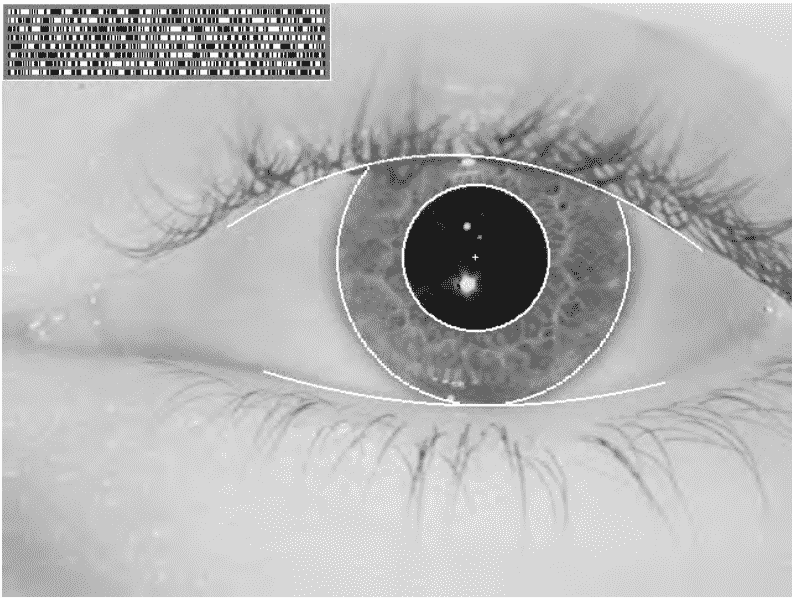

**图15.3：** 带有虹膜代码的虹膜（由约翰·道格曼提供）

在NPL [834] 的测试中，等错误率已被证明比一百万分之一更好，如果一个人愿意容忍一万分之一的错误拒绝率，那么理论上的错误接受率将小于一万亿分之一。实际上，错误拒绝率要高得多；许多事物，从睫毛到宿醉，都可能导致相机无法看到足够的虹膜。美国国防部在其2002年的现场试验中发现了6%的错误拒绝率；护照办公室的试验发现正常用户的错误拒绝率为4%，残疾用户的错误拒绝率为9%。另一个问题是注册失败；护照办公室的试验中有10%的参与者注册失败，而在黑人用户、60岁以上和残疾人中，这个比例更高。

虹膜扫描的一个实际问题曾经是以廉价的方式获取图片而不会过于侵入。虹膜很小（不到半英寸），需要包括几百个虹膜像素的图像。一个合作的对象可以将其他的眼睛放在离视频摄像机几英寸的地方，而最好的标准设备可以在两到三英尺的距离内工作。

可以假设与进入计算机房间的入口控制进行合作。但是在一般的零售应用中，这种做法不太被接受，因为有些人觉得离摄像头太近会感到不舒服。所有目前的虹膜扫描系统都使用红外光，有些人在眼睛被照射时会感到不舒服。（中国政府以此为借口拒绝了最新的香港身份证采用虹膜扫描，而选择了指纹[771]。）

随着更先进的摄像头，具备自动面部特征识别、平移和缩放功能，现在可以在走廊上秘密地捕捉到乘坐航班的旅客的虹膜代码[841]，毫无疑问，成本将会随着时间的推移而降低（特别是一旦关键专利在2011年到期）。这很可能会使公开使用变得不那么令人反感；但是对过路人进行秘密识别具有奥威尔式的意味，在欧洲，数据保护法可能成为一个阻碍因素。

虹膜识别系统可能遭受的攻击包括——至少在无人值守的情况下——对目标虹膜的简单照片。这在进入受监管场所的门禁控制中可能不是一个问题，但如果每个人都开始使用虹膜代码来验证银行卡交易，那么你的代码将为许多组织所知晓。目前有一些可用的终端可以检测这种简单的伪造，例如通过测量瞳孔直径的自然波动，大约在0.5赫兹左右。但是广泛销售的廉价终端不会这样做，如果活体检测变得普遍，毫无疑问攻击者将尝试更复杂的伎俩，例如将目标虹膜图案打印在隐形眼镜上。

由于虹膜识别相对较新，我们对其了解不如指纹识别丰富。迄今为止，最大规模的部署是在阿拉伯联合酋长国，用于对入境旅客进行筛查，以防止之前因非法工作而被驱逐出境的人员。截至2007年7月，黑名单中有595,000人——1.19百万个虹膜——到目前为止，已有150,000名被驱逐者被抓到试图重新进入国家。典型的被捕者是一位有妓女前科的女士，她以一个新名字从一个低收入或中等收入的亚洲国家带着一个真实（但是腐败发放的）护照返回。一个典型的攻击是被驱逐者在飞机上使用阿托品眼药水，扩大瞳孔；现在这样的旅行者被拘留直到他们的眼睛恢复正常。然而，阿托品的把戏可能对发达国家的黑名单应用程序构成问题。还可能存在证据问题，因为虹膜识别依赖于计算机处理；没有人类‘专家’能够可靠地识别眼睛，而且人类是否能够这样做值得怀疑，因为约翰·道格曼的算法所依赖的信息主要是相位信息，而人眼对此不敏感。

（然而，在发达国家，典型的应用是一个频繁旅行者计划，允许注册者在机场绕过护照检查；在那里，用户希望被识别，而不是不希望被识别。例如，英国就有一个拥有20万注册者的计划。在这里，证据实际上并不是一个问题。）

尽管存在困难，虹膜码仍然是一个非常有竞争力的选择，因为在正确的情况下，它们可以比任何其他方法更确定地提供前面的个体与最初在系统上注册的个体是同一个人。它们是唯一能够实现零误接受的自动识别目标的方法。

## 15.7 语音识别

语音识别——也被称为说话人识别——是识别一个短语音片段中的说话人的问题。虽然语音识别系统关注的是转录语音并需要忽略语音的个人特点，但语音识别系统需要放大和分类这些特点。存在许多子问题，例如识别是否依赖于文本，环境是否嘈杂，操作是否必须实时以及是否只需要验证说话人还是从大量人员中识别他们。

与指纹技术一样，该技术既用于身份识别也用于取证。在法庭语音学中，任务通常是将一段录音的电话对话（例如炸弹威胁）与多个嫌疑人的语音样本进行匹配。典型的技术包括从频谱中进行滤波和提取特征；有关更多详细信息，请参阅[721]。在某些电话系统中，更直接的生物特征认证目标是验证对身份的主张。这些系统从电话银行到军事人员识别等各个领域都有应用，市场上有十几个系统。Campbell描述了一种可以与美国政府的STU-III加密电话一起使用并且误差率约为1%的系统[264]；还有NSA维护一个用于评估说话者识别系统的标准测试数据语料库[655]。最近的一个应用是在英国使用语音识别来追踪寻求庇护者；他们将被要求每周多次打电话[1260]。这类系统倾向于使用来电显示来确定人们的位置，并且还用于像足球流氓这样的人，他们受到法院禁令，不得在特定时间去特定地点。

这些系统存在一些有趣的攻击方式，与一个恶棍可能以某种设备可接受的方式训练自己模仿你的声音的可能性完全不同。在[506]中，对一种在美国EP-3飞机上部署的系统进行了简要描述，该系统将来自敌机和地面控制器的拦截消息分割成四分之一秒的片段，然后进行剪切和粘贴以提供新的欺骗性消息。与现在可以通过数字信号处理所能做到的相比，这是原始的。一些知情人士预计，在未来几年内将会有支持实时语音和图像伪造的产品可用。

粗糙的语音变声系统已经存在，并且使得电话性骚扰的女性受害者能够用男性的声音接电话。已经有研究致力于改进这些系统，使得呼叫中心可以始终由同一个‘人’来接听电话；而音频混音产品也在不断改进。远程语音生物特征识别看起来越来越难以抵挡一个有能力的动机的对手。

## 15.8 其他系统

还有许多其他生物特征识别技术被提出[890]。打字模式在20世纪80年代的产品中被使用过，但似乎并不成功（打字模式，也被称为击键动态，有一个著名的前身，即通过无线电电报操作员的拳头来识别他们的方式）。静脉模式在一两个系统中被使用过，但似乎并没有广泛销售（在NPL试验中，静脉识别的ROC曲线几乎全部在其他曲线之外；它是最差的）[834]。

最近对于通过写作风格识别匿名作者的兴趣日益增长。当然，文学分析已经存在了很多年；年轻时，著名的密码学家威廉·弗里德曼被一位古怪的百万富翁雇佣来研究培根是否写了莎士比亚的作品。（最终他驳斥了这个想法，但在在这个过程中对密码学产生了兴趣。）计算机使得运行更加微妙的统计测试成为可能；应用范围从试图识别发布极端网站论坛的人员到平凡的抄袭检测[3]。有可能这种软件将从法庭应用转向实时监控，这样它将成为一种生物特征识别技术。

其他提议包括面部热图（通过红外图像得出的面部表面温度图），耳朵的形状，步态，唇纹和手部静脉的模式。贝尔蒂永在19世纪的巴黎使用了耳朵的形状，但其他大部分奇特的特征似乎没有作为产品推出。其他技术在未来可能提供机会。例如，为了食品和饮料行业的质量控制而进行的数字嗅觉的巨额投资可能会导致一种通过气味识别主人的“数字狗”。

最后一个生物特征学值得一提——DNA分型。这已经成为犯罪现场法医学和确定子女抚养案件中的有价值工具，但对于像建筑入口控制这样的应用来说，它仍然太慢。由于是基因型而不是表型，其准确性也受到单卵双生子发生率的限制：大约每120个白人中就有一个相同的孪生兄弟。还存在一个隐私问题，即很快就可以通过DNA样本重建一个人的大量信息。在实验室程序不严谨的情况下，出现了重大的程序问题，导致错误匹配。还存在重大的数据质量问题；英国警方拥有世界上最大的DNA数据库，记录了约四百万人的信息，但其中约有五十万人的姓名拼写错误甚至错误[588]。适用于地方警务的流程并不总是适用于全国范围——从记录输入错误到嫌疑人提供虚假姓名但从未被发现因为没有起诉，这些小错误与实验室错误一起累积，直到误报率成为一个严重的操作和政治问题。有关法医DNA分析的调查以及如何使国家DNA数据库与隐私法一致的建议，请参阅[1124]。

## 15.9 出了什么问题

与安全的其他方面一样，我们发现了由于错误、失误和自满而导致的一系列故障。例如，DNA鉴定面临的主要问题是最初的假阳性率很高，这是由于粗心的实验室程序造成的。这使一些警察部队退缩了，他们提交了来自不同志愿者的样本，并得到了错误的匹配结果，但也导致了争议的法庭案件和冤案。这让人想起了指纹故事，并让人想起了第5章开头Lars Knudsen的一句话：“如果它被证明是安全的，那么它可能不是安全的。”任何被认为是绝对可靠的保护措施都会让操作人员变得粗心大意，从而破坏它。生物识别技术也和许多其他物理保护机制（警报、封条、防篡改外壳等）一样，受环境条件的影响可能会造成混乱。噪音、污垢、振动和不可靠的照明条件都会产生影响。一些系统，如说话人识别系统，对酒精摄入和压力有脆弱性。

环境假设的变化，例如从封闭系统到开放系统，从小系统到大系统，从有人参与到独立运行，从合作到不合作的主体，以及从验证到识别，都可能破坏系统的可行性。

有一些有趣的攻击是针对生物特征系统的，适用于多种类型的生物特征：

- 法庭生物特征往往没有人们想象的那么多信息。除了警察可能植入指纹或DNA样本的可能性外，它可能只是旧的。指纹的年龄无法直接确定，而在公共区域的指纹几乎没有意义。银行门上的指纹比被抢劫的金库里的指纹信息少得多。因此，在容易遭到抢劫的场所，清洁程序可能对证据至关重要。如果在银行柜台上发现了嫌疑人的指纹，并且他声称三天前曾去过那里，那么他可能会被证据证明该分行的柜台每天晚上都会擦拭。将这个问题放在系统层面上，新鲜度通常是一个关键问题，一些非常意外的事情可能会出现在'可信计算基础'内部。
- 新鲜度的另一个方面是，大多数生物识别系统在理论上至少可以使用合适的录音进行攻击。我们提到了对语音识别的直接攻击，对虹膜扫描仪的攻击（通过隐形眼镜上的照片），以及指纹模具的攻击。甚至更简单的是，在像南非这样的国家，指纹被用来支付养老金，有关“奶奶的指纹在腌菜罐中”的持续传说成为她留给家人最有价值的财产。从这里可以得出的教训是，生物识别认证设备的无人操作是棘手的。攻击并不总是直截了当的；尽管从一个好的指纹[281]制作模具很容易，但人们在门把手、啤酒杯等上留下的法医级别的指纹通常太模糊和残缺，无法通过识别系统。然而，攻击肯定是可能的，也肯定会发生。
- 大多数生物特征识别对所有人都不够准确，而且一些人群无法像其他人一样可靠地被识别出来（甚至根本无法被识别出来）。老年人和体力劳动者经常有损坏或磨损的指纹。眼睛黑的人和瞳孔大的人给出的虹膜代码较差。没有手指或没有眼睛的残疾人在这种系统普及的情况下面临被排除的风险。文盲们画一个'X'更容易受到签名伪造的风险。生物特征工程师有时会轻蔑地称这些受试者为“山羊”，这是愚蠢和冒犯的。一个（或被视为）社会倒退的生物特征系统——将残疾人、贫困人口、老年人和少数民族置于更大的冒名顶替风险中——可能会遭到有原则的抵制。事实上，生物特征系统可能会因为多种原因而被法律挑战击败[1046]。它也可能容易受到（或假装是）残疾人的恶棍的攻击。必须提供备用的操作模式。如果这些模式不够安全，那么强制使用它们可能会导致攻击，而如果它们至少与生物特征识别一样安全，那么为什么要使用生物特征识别呢？
- 由此得出的一个观点是，系统可能容易受到串谋的攻击。爱丽丝开了一个银行账户，她的同伙贝蒂从中取钱；然后爱丽丝抱怨被盗，并提供了一个无懈可击的不在场证明。除了让贝蒂拿爱丽丝的手指橡皮印外，爱丽丝还可以自愿降低自己的书写能力；通过提供几个稍微不同的幼稚样本签名，她可以迫使机器接受比平常更低的阈值。她可以花几个星期当砖匠，在她的花园周围建一堵墙，并把她的指纹压平，以降低指纹系统的注册。她可能在醉酒时注册一个语音识别系统。
- 统计数据通常被系统设计者所不理解，而生日定理尤其被低估。例如，在一个数据库中有10,000个生物特征，大约有50,000,000对。因此，即使误接受率只有一百万分之一，只要有一千多人（实际上是1609人）注册，至少一个错误匹配的可能性就会超过一半。因此，识别比验证更困难[352]。实际的后果是，一个设计用于认证的系统在你试图依赖它作为证据时可能会失败。
- 当设计师假设通过结合生物特征来降低错误率时，统计学的另一个方面就发挥作用。有趣的是，结合通常会改善接受率或假拒绝率中的一个，同时使另一个变得更糟。从某种角度来看，如果在家中安装两个不同的防盗警报系统，那么它们同时被击败的概率会降低，而误报的次数会增加。在某些情况下，例如当一个非常好的生物特征与一个非常不精确的生物特征结合时，效果可能更糟糕[352]。
- 许多供应商声称他们的产品保护隐私，因为存储的不是你的脸部、指纹或虹膜的图像，而是从中派生的模板，有点像单向哈希函数，你无法被识别。从这一点可以得出结论，生物特征数据在隐私法律上不属于个人数据，因此可以无限制地传播。这些说法已经被安迪·阿德勒驳斥了，他提出了一种针对人脸识别系统的有趣的hill-climbing攻击。给定一个输出输入图像与目标模板相似度的识别器，输入的人脸会被逐步改变以增加匹配度。通过测试的系统，这很快导致了一个可识别的目标图像——一个打印出来的图像将被接受为目标的脸部[14]。然后他展示了如何使用这种爬山技术攻击其他生物特征，包括一些基于指纹的生物特征[15]。
- 自动化生物特征可以微妙地改变安全协议的工作方式，以至于以前有效的东西现在不再有效。一个例子是包含您的数字照片、可能还有指纹和虹膜数据的生物特征护照或身份证，存储在RFID芯片上。该芯片可以通过将内容复制到另一个RFID芯片（或通过具有NFC接口的手机进行重放）来克隆。世界各地的护照办公室认为这不是一个大问题，因为数据是签名的，所以芯片不能被修改。然而，警察对护照有另外一个用途——如果你被保释，他们要求你把护照交给他们。如果你可以通过快速通道通过重放你的虹膜数据通过你的手机离开国家，那么该协议现在就会失效。当研究人员发现尽管有数字签名，他们仍然可以修改RFID内容——通过用一个导致读卡器崩溃的位串替换JPEG人脸图像[1374]。这反过来引发了一个问题，即是否可以设计一个更巧妙的位串来修改读卡器的行为，以接受伪造的护照。我想教训是，当护照办公室数字化他们的系统时，他们应该阅读本书的全部内容，而不仅仅是关于生物特征和加密的章节。
- 当人类和计算机意见不合时，值得思考会发生什么。虹膜数据根本无法由未经辅助的人类匹配；那种技术完全是自动化的。但是，当一个保安和一个程序在一个主体的脸是否与文件照片相匹配上意见不合时，或者手写识别软件说一个银行经理的书写看起来像一张潦草的赎金字条，而对人眼来说却完全不同，会发生什么呢？心理学家建议生物特征系统应该以支持和增强人类认知的方式使用，并符合我们的社会规范[404]。然而，我们工程师常常发现将用户视为必须适应我们的技术的麻烦更容易。这可能会降低人类的表现。例如，当自动化指纹数据库提取出它认为最可能的指纹并呈现给检查员时：他不可能对其有偏见吗？如果给他三个最佳匹配加上两个差匹配来测试其警觉性，那会起作用吗？
- 最后，基督教原教旨主义者对生物识别技术感到不安。在启示录13:16-18中，他们发现有关敌基督的文字：“他又叫众人，无论大小、贫富、自主的和为奴的，都在右手上，或在额上，立一个印记，又要叫人不能买，不能卖，若不有这印记，就是那兽的名字，或是他名字的数字。”因此，生物识别技术可能在左翼和右翼上引起政治反对。

因此，在生物识别技术逐渐走向大众市场使用的过程中，存在一些非平凡的问题需要克服。但尽管成本高昂且错误率高，它们在许多应用中已经证明了其价值，尤其是在威慑效果有用的地方。

## 15.10 总结

自古以来，各种生物特征测量方法都被用来识别人们，包括手写签名、面部特征和指纹等传统方法。已经建立了自动化识别系统，利用这些传统方法和新的方法，如虹膜模式和声纹。这些系统有不同的优点和缺点。

在自动操作中，大多数系统的错误率约为1%（虹膜识别更好，手部几何稍好，面部识别更差）。在误接受率（欺诈率）和误拒绝率（冒犯率）之间总是存在权衡。错误率的统计数据具有迷惑性和难度。

如果任何生物特征被广泛使用，那么在无人操作中存在伪造的风险：语音合成器、虹膜照片、指纹模具甚至传统的伪造签名都必须在系统设计中考虑。这并不排除使用生物特征的可能性，因为传统方法如手写签名在实践中仍然可用，尽管错误率很高。这个特殊案例告诉我们，上下文很重要；即使是一个弱的生物特征，如果其使用方式嵌入社会和法律矩阵中，也可以发挥作用。

生物特征识别在有人参与的操作中通常更加强大，在良好的系统设计下，人类守卫和机器识别系统的相对优势和劣势可以相互补充。取证使用存在问题，法院对指纹证据的信任远不如十年前。最后，许多生物特征识别系统主要通过威慑犯罪分子而不是实际识别他们来实现大部分或全部结果。

## 研究问题

1. 许多实际的研究问题与生物特征识别系统的设计或改进有关。除了虹膜扫描之外，是否有可能构建一个满足银行目标的系统，即1%的欺诈率和0.01%的侮辱率？
2. 是否有可能构建一个静态签名验证系统，其错误率足够低（例如1%），以便用于筛查所有支票的图像，而不仅仅是高价值支票的人工检查的预筛选阶段？
3. 是否有任何全新的生物特征识别技术在某些情况下可能有用的？

我在写第一版时想到的一个想法是，在2000年与William Clocksin和Alan Blackwell的对话中，通过检测司机操作变速器和离合器的方式来识别司机。如果你的车认为被盗了，它会向控制中心发送GPS定位信息，然后中心会给你打电话确认。最近有研究表明，使用触觉系统的用户可以通过他们使用工具的方式来识别 [990]。

## 进一步阅读

指纹的历史很有趣且可读性强。标准参考文献是Lambourne [764]，而Block有一本关于美国案例历史的好书 [195]，Sengoopta [1145]讲述了印度指纹的历史。McKie案例在Ian McKie和Michael Russella的一本书中有描述 [867]。关于自动指纹识别系统的良好技术参考书是Maltoni、Maio、Jain和Prabhakar的书 [832]；还有一本早期的书是Jain、Bolle和Pankanti的 [655]。至于面部和手写识别，在文中还有一个IBM实验系统的描述 [684]，以及一篇文献综述 [288]。关于虹膜编码的标准工作是Daugman的书 [351]。

对于语音识别，可以在[264]中找到一个关于说话人识别的教程，而对于取证方面，请参阅Klevans和Rodman [721]。可以在《IEEE会议录》的两个专题中找到技术现状的对照——即生物识别系统的第85卷第9期（1997年9月）和第94卷第11期（2006年11月）。

## 第16章 物理防篡改

构建一个加密系统，如果它按预期工作并正确使用，那么它是安全的相对容易。但是，在被错误使用或其中一个或多个子组件失败（或被“鼓励”出现异常）的情况下，构建一个不会损害其安全性的系统仍然非常困难...这现在是唯一一个封闭世界在安全领域仍然遥遥领先于开放世界的领域，商业加密系统中的许多失败为此提供了一些证据。

> — 布莱恩·格拉德曼

> 对于给定的安全设备、系统或程序，所进行的仔细、批判性的安全思考与其使用的高科技数量成反比。
>
> — 罗杰·约翰斯顿

### 16.1 引言

低成本的防篡改设备几乎无处不在。到目前为止，我已经讨论的例子包括：

- 智能卡在移动电话中用作SIM卡，在欧洲用作银行卡；
- 用于打印机墨盒、移动电话电池和游戏机内存模块的附件控制芯片；
- 用于支持硬盘加密、数字版权管理和软件注册的PC和Mac中的TPM芯片；
- 用于管理银行PIN码的安全模块，不仅仅在银行服务器农场中，还在ATM和销售终端中；
- 嵌入在自动售货机中的安全模块，可以销售从火车票到邮票再到激活您的电表的魔法数字的一切。

市场上的许多设备都非常糟糕，就像我在第10.6.1.1节中描述的银行终端一样：尽管这些终端经过了VISA的评估并使用了通用标准框架，但使用简单工具在不到一分钟的时间内就可以轻松被攻破。

然而，一些防篡改处理器的性能非常出色。例如，我知道有一家公司花费了50万美元试图逆向工程游戏机供应商使用的协议，但最终失败了。但几年前情况并非如此。严格的防篡改技术是由希望保护其产品的公司和希望破解这些产品的公司之间的竞争而产生的。其中一些攻击者是合法行使反向工程以实现兼容性的公司。其他人是律师，他们通过反向工程产品来证明侵犯专利。有六家专门为律师和法律反向工程师工作的公司。还有一些学术界的人士通过黑客手段来推动技术的发展，以及像付费电视盗版者这样的坏人克隆订户卡。最后还有很多灰色地带。如果你找到了一种解锁特定品牌手机的方法，使其可以在任何网络上使用，那算不算犯罪？答案是，这取决于你所在的国家。市场上现在有很多声称具有防篡改功能的产品，从廉价的微控制器到昂贵的加密处理器。其中一些产品很好，许多产品一般，还有一些产品非常糟糕。对于安全工程师来说，了解什么是防篡改以及它能做什么和不能做什么变得越来越重要。在本章中，我将带您回顾过去的十五年左右，介绍越来越巧妙的攻击是如何遭遇越来越复杂的防御的。

长期以来，使计算机抵抗物理篡改一直很重要，因为攻击者在原则上可以更改软件并使机器按照他的意愿运行。当计算机是庞大的物体时，这涉及到前几章讨论的技术——物理屏障、传感器和警报。在某些应用中，计算机仍然被制作成庞大的物体：自动取款机基本上是一个带有纸币发放器和警报传感器的个人电脑，而用于检测非法核试验的传感器装置可能位于几百英尺深的钻孔底部，并填充混凝土。

在仅需要完整性和可用性的情况下，有时可以使用复制来实现防篡改，而不是物理保护。最终，内存模块被破解了，但这需要一个配备芯片测试设备和七位数预算的定制实验室。服务可以在不同站点的不同服务器上同时执行交易并对结果进行投票；而在第13.4节讨论的阈值方案也可以为密钥材料提供机密性。但是，防篡改设备也可以为数据提供机密性。这是一个原则上可以用数学或金属来完成许多事情的方面。

### 16.2 历史

在密码学中使用防篡改技术已有数百年的历史 [676]。海军密码本被加重以便在即将被捕获时扔入海中；至今，英国政府部长助手用来携带国家文件的发文箱都是铅衬的，以便沉没。密码和最近的战时密码机密钥都使用可溶于水的墨水印刷；俄罗斯的一次性密码本则是用硝酸纤维素印刷的，以便在点燃时猛烈燃烧；而一种美国的战时密码机则配备了自毁热烈炸药，以便快速销毁。

但是这些机制依赖于操作员的警惕性，密钥材料经常在突袭中被捕获。因此，人们尝试自动化这个过程。早期的电子设备以及一些机械密码机都被设计成打开外壳会擦除密钥设置。

在一些密钥材料被密码人员出售给对方的案例中（例如美国臭名昭著的沃克家族将美国海军密钥材料出售给俄罗斯长达20年 [587]），工程师们开始更加关注如何保护密钥在传输过程中的安全。目标是“将密钥材料的市值降至零”，这可以通过无法提取密钥的防篡改设备或者明显可见密钥提取的防篡改装置来实现。

纸质密钥曾经被放在“告密容器”中，设计用于显示篡改的证据。当电子密钥分发出现时，一个典型的解决方案是“填充枪”：一种便携式设备，以受控的方式分发加密密钥。现在，这个功能通常使用智能卡等小型安全处理器来执行；就像电表一样，它可以被打包成“加密点火钥匙”。控制协议的范围从限制密钥分发次数，到使用公钥密码学机制确保密钥只加载到授权设备中。密钥材料的控制也具有更广泛的目的。在美国和英国，它被集中化并用于强制使用经过适当批准的计算机和通信产品。只有在系统经过适当认证后，才会提供活动密钥材料。

一旦初始密钥被加载，可以使用各种身份验证和密钥协商协议分发进一步的密钥。我已经在第一部分的协议章节中讨论了许多基本工具，如密钥分散，而且我将在本章的API攻击部分中进一步讨论协议。在这里，我首先要看的是防止篡改的物理防御措施。

### 16.3 高端物理安全处理器

一个值得研究的例子是IBM 4758（图16.1和16.2）。这对于三个原因很重要。首先，它是第一个成功评估到最高防篡改级别（FIPS 140-1级别4）[938]的商用处理器，由美国政府设定。其次，有大量公开文献介绍它，包括其设计演变的历史、其保护机制和支持的事务集 [1195、1328、1330]。第三，作为第一个4级评估产品，它是世界上防篡改最高曝光度的目标，在2000年至2005年期间，我和我的学生们花了一些精力攻击它。

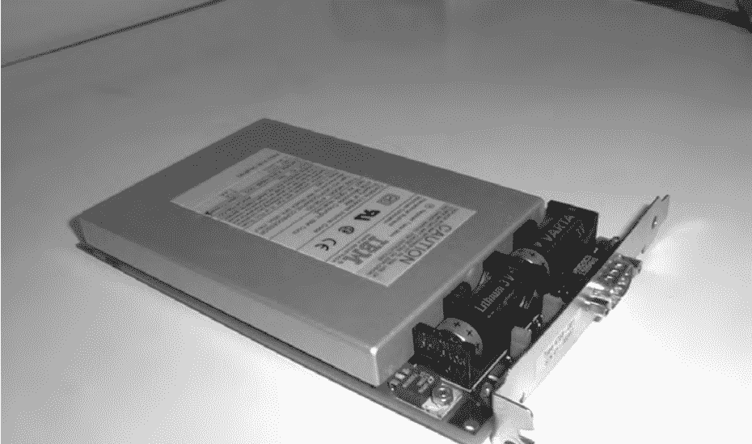

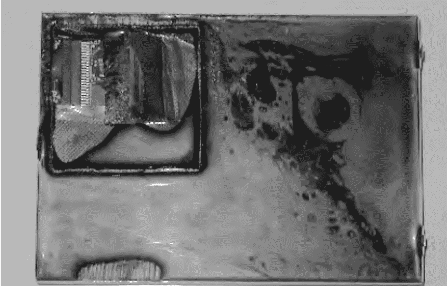

导致该产品的演变如下所述。多用户操作系统的普及以及其保护机制中经常发现的错误意味着大量的人可能会访问正在处理的数据。军事计算机社区的反应，我在第9章中描述过，是安德森报告和多级安全。银行界的反应是专注于特别敏感的数据——特别是长期的加密密钥和银行客户用于向取款机确认身份的个人识别号码（PIN）。早在1980年代初就意识到商业操作系统提供的保护水平可能仍然不足以保护这些“皇冠珠宝”。

这导致了独立安全模块的开发，其中第一个在商业上取得成功的是IBM 3848和VISA安全模块。这两个都是封装在坚固金属外壳中的微型计算机，具有加密硬件和特殊密钥存储器，这是静态RAM设计的，当外壳打开时会被清零。这是通过将电源通过多个盖子开关连接到密钥存储器来实现的。

因此，每当维护人员来更换电池时，他们会打开盖子并销毁密钥。完成后，设备操作员会重新加载密钥材料。通过这种方式，设备的所有者可以放心地知道其密钥完全受到自己员工的独特控制。

### 如何黑掉一个加密处理器 (1)

对这样的设备的明显攻击是操作员窃取密钥。在早期的银行安全模块中，主密钥存储在PROM中，这些PROM在初始化期间加载到设备的特殊插座中进行读取，或者作为数字字符串在控制台上键入。PROM可以很容易地被放入口袋中，带回家并使用业余设备读取出来。明文纸质密钥甚至更容易被窃取。

修复的方法是共享控制——使用两个或三个PROM与主密钥组件，然后将设备主密钥设置为所有组件的异或。然后，可以将PROM存放在不同的保险柜中，由不同的部门控制。（事后看来，使用异或来实现这个目的是一个错误，应该使用哈希函数。我马上会解释为什么。）

然而，这个过程很繁琐，而且这样的过程往往会导致质量下降。理论上，当设备维护时，其保管人员应该打开盖子以擦除活动密钥，让维护工程师加载测试密钥，然后重新加载活动密钥。负责保管的经理通常会将他们的PROM交给工程师，而不是自己麻烦。我甚至遇到过自动提款机的主密钥被保存在银行分行的信件文件中，任何员工都可以查看。

谨慎的密码学设计师试图尽量减少因维护或电力故障而需要重新加载密钥的次数。因此，现代安全模块通常配备备用电池以备份主电源供应（至少备份密钥存储器）。因此，在实践中，保管人员只需在设备首次安装后以及偶尔的维护访问后加载密钥。

关于频繁或不频繁加载密钥哪种方式更好一直存在争议。如果密钥加载非常不频繁，那么负责人员很可能从未执行过此任务，并且可能因为无知而将其委托给他人，或者被技术更熟练的员工欺骗以不安全的方式执行（有关此情况的案例历史，请参见[33]）。现代趋势是在制造之后但分发之前，在安全设施中生成主密钥（或加载主密钥）。但并非所有密钥都可以在工厂内嵌入处理器中。一些密钥可以保存在智能卡上，并用于处理器之间的密钥共享和备份；其他密钥可能在分发后生成，特别是出于法律原因，签名密钥始终应由客户独立控制。

### 如何黑掉一个加密处理器 (2)

早期设备容易受到攻击者切割外壳的攻击，以及维护工程师在一次访问中禁用盖子开关的攻击，然后在下一次提取密钥。第二代设备解决了这些问题中较容易的物理攻击问题，通过添加进一步的传感器，如光电池和倾斜开关。这些对于保存在受控的安全区域的设备来说可能足够了。但是，难题是如何防止维护人员的攻击。

许多优秀产品采用的策略是将所有可以维修的组件（如电池）与设备的核心（如防篡改传感器、加密处理器、密钥存储器和警报电路）分离开来。然后，将核心部分浇注成坚固的块状物，如环氧树脂。其想法是任何物理攻击都将被“明显的”，因为它涉及到切割或钻孔等行为，这些行为可以被陪同维护工程师进入银行计算机房间的保安人员检测到。（至少在理论上是这样；我的经验表明，要求一名最低工资的保安人员确保一位使用某些工具而不是其他工具修理某种奇特设备的专家是有点过分的。）至少在事后应该留下篡改的证据。这是符合FIPS标准下中等级评估所需的保护级别。

### 如何黑掉一个加密处理器（3）

然而，如果一个有能力的人能够在没有监督的情况下短时间内接触到设备——而且，实际情况是，即使是在保安紧盯着他的情况下，维护工程师可能也有这样的机会——那么对设备核心进行封装是不够的。例如，通常可以用刀刮掉封装层，然后将逻辑分析仪的探针放在核心的总线线路上。大多数常见的加密算法，如RSA和DES，具有这样的特性：能够在计算过程中监视任何位平面的攻击者可以恢复密钥 [580]。因此，一个能够在设备运行时任意地插入探针的攻击者很可能能够提取秘密密钥材料。

因此，高端产品具有一个能够感知篡改的屏障，一旦被渗透就会触发内部秘密的销毁。早在20世纪80年代中期，IBM的μABYSS系统中就出现了一个早期的例子。这个系统使用了40号镍铬丝的环，松散地绕在嵌入环氧树脂中的设备上，然后连接到一个感应电路 [1328]。像铣削、蚀刻和激光烧蚀这样的大规模去除技术会断开导线，从而擦除密钥。

但是使用环氧树脂技术的导线可能容易受到喷砂的缓慢侵蚀的影响；当感应导线在封装表面可见时，可能会连接绕过它们的分流器。因此，IBM的下一个主要产品，4753，采用了金属屏蔽层和印有导电墨水图案的薄膜以及由类似化学成分的更耐用材料包围。这个想法是任何攻击都会高概率地破坏薄膜。

### 如何黑掉一个加密处理器 (4)

攻击者可以尝试的下一类方法涉及对内存残留的利用，即许多种类的计算机内存保留了一些存储在其中的数据的痕迹。有时候只需要长时间存储相同的数据。攻击者可能贿赂垃圾车司机以获取银行丢弃的安全模块：正如 [69] 中所报道的，某个安全模块在使用相同的主密钥运行了几年，这些密钥的值被烧入到设备的静态RAM中。开机后，大约90%的相关位会假定相应密钥位的值，这已经足够恢复密钥了。

记忆残留不仅影响静态和动态RAM，还影响其他存储介质。例如，磁盘驱动器的磁头随时间改变对齐，因此可能无法完全覆盖之前写入的数据。相关的工程和物理问题在 [566] 和 [568] 中讨论，而 [1184] 则解释了如何从微控制器的闪存中提取数据，即使它已经被多次“擦除”。

NSA已经发布了预防残留攻击的指南（“森林绿皮书”），例如对要重复使用的媒体进行仔细的去磁处理 [378]。

更好的第三代设备具有RAM保存器，其功能与屏幕保护程序类似；它们将数据在RAM中移动以防止其在任何地方被烧毁。

### 如何黑掉一个加密处理器 (5)

另一个问题是计算机内存可以被低温冻结。到了1980年代，人们意识到在约 -20°C 以下的温度下，静态RAM的内容在断电后可以持续几秒钟。在液氮温度下，这个时间可以延长到几分钟。因此，攻击者可以冷冻设备，切断电源，穿过防篡改传感屏障，提取包含密钥的RAM芯片，并在测试装置中重新启动它们。RAM的内容也可以通过电离辐射进行烧录。（对于1980年代的存储芯片，这需要一个严重的工业X射线机器；但据我所知，没有人测试过当前更小的存储芯片设计。）

因此，更好的设备具有温度和辐射报警功能。这些功能的正确实现可能很困难，因为现代RAM芯片表现出各种各样的记忆残留行为，其中一些甚至在室温下也可以保持数据几秒钟。更糟糕的是，随着特征尺寸的缩小，残留现象似乎变得更长，并且在标准产品线内部也是不可预测的。总之，尽管您的安全模块可能通过使用某个品牌的SRAM芯片进行残留测试，但如果一年后购买了相同品牌的芯片，它可能无法通过相同的测试。这显示了依赖于某个组件的某个属性的危险性，而对于该属性的控制对制造商来说并不重要。

温度传感器对安全模块供应商来说也是一个真正的难题，因为如果被冻结的设备自毁，就无法通过正常的分销渠道可靠地发送。（我们在eBay上购买了加密处理器，发现它们在到达时已经损坏。）

### 如何黑掉一个加密处理器（6）

对加密硬件的下一组攻击要么涉及监视设备发射的射频和其他电磁信号，要么注入信号并测量其外部可见的效果。这种技术，也被称为“Tempest”、“功耗分析”、“侧信道攻击”或“辐射安全”，是一个如此庞大的主题，我将在下一章中专门讨论它。就4758而言，策略是采用坚固的铝屏蔽和低通滤波器来阻止在内部计算中使用的频率上的任何信号的出口。

4758还具有改进的防篡改膜，其中有四个重叠的锯齿状导电图案掺入了一张聚氨酯薄片中，这张薄片被封装在一种化学相似的物质中，以至于攻击者即使切割设备也很难检测到导电路径，更不用说连接到它了。这种封装包围着金属屏蔽层，而金属屏蔽层又包含了加密核心。该设计在 [1195] 中有更详细的描述。

### 如何黑掉一个密码处理器（7）

我不知道如何攻击4758的硬件。我和我的学生发现了一些新颖的软件漏洞，稍后我会在API攻击章节中进行描述。但是对于渴望尝试硬件攻击的研究生，这里有一些想法：

- 直接的方法是设计一种方式来侵蚀保护封装，检测网格线，并绕过它们连接分流器。值得一试的是磁力显微镜。
- 一个可能的方法是发明一种钻孔长度为八毫米，宽度仅为0.1毫米（也就是远小于网孔直径）的手段。使用标准机械钻头并不直接，激光消融和离子铣削也是如此。然而，我猜测纳米技术和石油行业的思路结合起来，最终可能实现这样的钻孔。然后，人们可以有很大的概率在不破坏电路的情况下穿透保护网。
- 在了解了设备的硬件并拆解了几个实例之后，攻击者可能会试图在反应之前摧毁防篡改电路。一种可能的方法是使用工业X射线机器；另一种方法是使用形状爆炸物来向设备发送等离子喷流，这种喷流在第13.5节中讨论过。

这种攻击的成功是不确定的，并且在相当长的时间内超出了普通恶棍的资源范围。

到目前为止，对基于4758的系统的攻击涉及到的是逻辑上的漏洞而不是物理上的漏洞。该设备的操作系统已经经过正式验证，因此主要风险存在于允许对设备提供的交易进行操纵的应用程序设计错误中。4758的大多数用户使用一个名为CCA的应用程序，该应用程序在 [619] 中有描述，并包含许多使其难以正确使用的功能（这些功能主要是以前的加密设备的遗留问题，4758用户希望与之向后兼容）。从2000年开始，我们发现4758暴露给主机的应用程序编程接口（API）存在一些严重的缺陷。（市场上的大多数其他安全模块都更糟糕。）其结果是，拥有主机访问权限的程序员可以向安全模块发送一系列命令，导致其泄露PIN码或密钥。我将在第18章中讨论这些API攻击。

最后，应该提到安全处理器的设计和制造的主要限制与我们在更一般的警报中遇到的限制非常相似。在误报率和漏报率之间存在一种权衡，因此在安全性和鲁棒性之间存在一种权衡。

振动、电源瞬变和电磁干扰可能是一个问题，但温度是最严重的。我提到了通过正常的运输渠道将自毁于 -20°C 的安全处理器通过的困难，因为货物经常在飞机货舱中遭受 -40°C 的温度。军事装备制造商面临相反的问题：他们的设备必须在 -55°C 到 +155°C 的范围内评级。一些军事设备使用保护性爆炸；存储芯片被封装在精确计算的热烈充电的钢罐中，以在不引起罐内气体释放的情况下摧毁芯片。同时满足防篡改性、温度容忍性、辐射硬化和重量目标可能是昂贵的。

### 16.4 评估

在讨论更便宜的设备之前，我想先谈一下对防篡改设备的评估方面的一些建议。

IBM的一篇论文描述了4753设计 [6]，提出了以下攻击者分类，该分类自那时以来被广泛使用：

1.  **一类攻击者——“聪明的外部人”**：通常非常聪明，但对系统了解不足。他们可能只能使用中等复杂度的设备。他们通常试图利用系统中已存在的弱点，而不是试图创建弱点。
2.  **二类攻击者——“知识渊博的内部人”**：拥有丰富的专业技术教育和经验。他们对系统的某些部分有不同程度的理解，但可能能够接触到大部分系统。他们通常拥有高度复杂的工具和仪器进行分析。
3.  **三类攻击者——“资助组织”**：能够组建一支由相关和互补技能的专家团队，并获得大量资金支持。他们能够对系统进行深入分析，设计复杂的攻击，并使用最先进的分析工具。

在这个方案中，典型的SSL加速器卡旨在阻止聪明的外部人；早期的4753旨在阻止聪明的内部人，而4758则旨在（并获得认证）阻止资助组织。（顺便说一句，这种分类已经有点过时了；我们看到一类攻击者租用三类设备等等。最好为您的应用程序创建一个攻击者配置文件，而不是尝试重用这些旧的行业标准配置文件。）

FIPS认证方案由美国政府许可的实验室运营。最初的标准FIPS 140-1规定了四个保护级别，其中级别4是最高级别，并且这一级别在接下来的版本FIPS 140-2中保持不变，该版本于2001年引入。撰写本文时，只有三家供应商——IBM、AEP和Thales——成功获得了4级产品的认证。4级和下一个级别之间存在很大差距，3级只需要封装，攻击者仍然可能利用电磁泄漏、存储记忆、钻孔、喷砂等进行攻击。（我曾经使用瑞士军刀从3级认证设备上刮掉封装。）因此，虽然FIPS 140-1 3级设备可以被IBM意义上的1类攻击者攻破，但升级到FIPS 140-1 4级预计可以阻止IBM 3类对手。没有与IBM的2类防御相对应的FIPS级别。

事实上，关于评估级别的原始论文是由IBM工程师撰写的 [1330]，提出了六个级别；FIPS标准采用了这些级别中的前三个作为其1-3级，并将提议的第6级作为其第4级（4758设计师Steve Weingart在 [1329] 中讲述了这个故事）。常常被称为“3.5级”的差距是许多更好的商业系统的目标所在。这种设备确实试图阻止1级攻击群体的入侵，同时对2级攻击增加了难度，对3级攻击增加了成本。

撰写时（2007年），NIST发布了修订版的联邦标准FIPS 140-3供咨询。通过添加需要额外测试的第五级，将级别数量从四个增加到五个。然而，该标准未解决API攻击问题，实际上FIPS 140-1和140-2也未解决。不幸的是，FIPS标准仅涵盖设备对直接侵入性和半侵入性硬件的抵抗能力。

攻击，如本章所讨论的那种攻击，以及对非侵入式攻击使用的技术，例如功耗分析，在下一章中我会讨论。

## 16.5 中等安全处理器

“3.5级”产品的好例子是达拉斯半导体的 iButton 和 5002 安全处理器，以及用于保护美国军事通信的 Capstone 芯片，达到“机密”级别。虽然 4758 的成本为 2000 美元，但这些产品的成本大约为 10-20 美元。然而，对它们进行攻击远非易事。

### 16.5.1 iButton

达拉斯半导体的原始 iButton 设计为最小化的、自包含的密码处理器，用于邮政邮票等应用。它具有微控制器、用于存储密钥和软件的静态 RAM、时钟和防篡改传感器，封装在一个钢罐中，带有锂电池，可以在设计寿命为十年的情况下保持 RAM 中的密钥（见图16.3）。它足够小，可以佩戴在戒指上或作为钥匙扣携带。早期的应用是作为“电子红盒子”的访问令牌，这是一种为英国政府部长使用的安全笔记本系统。为了访问机密文件，部长必须将他的戒指按在笔记本电脑侧面的读卡器上。（其中一个设计准则是：“部长不得使用密码。”）其他应用包括伊斯坦布尔大众交通系统的票务、阿根廷的停车收费表和酒吧工作人员用于快速登录收银机的令牌。

当我在 2000 年写第一版时，iButton 是一个纯粹的安全产品，甚至有一些版本还有一个加密处理器来进行公钥操作。1999 年 12 月，第一次破解 iButton 发生了；打印机供应商 Lexmark 在 1998 年开始在一些打印机墨盒中加入了 iButton，以阻止售卖兼容墨盒的售后供应商，而 Static Control Components 最终破解了该系统，并在 1999 年 12 月生产了一款兼容芯片 [1221]。从那时起，达拉斯已成为 Maxim 的子公司，iButton 已经发展成为一个更广泛的产品范围。现在有一些版本包含温度传感器，可以提供货物在运输过程中可靠的温度历史记录，还有一些简单的版本实际上只是 RFID 令牌，以及一些复杂的版本包含一个 JVM。因此，并不是所有的 iButton 都是“安全”的：任何给定的设备可能没有被设计成安全的，或者可能已经被编程（有意或无意地）不安全。然而，该系列仍然包括使用 SHA-1 来支持加密认证的防篡改设备，并且在安全应用中仍然广泛使用。

图16.3：iButton 内部结构（由达拉斯半导体公司提供）

如何攻击安全的 iButton? 与 4758 最明显的区别是缺乏防篡改屏障。因此，可以尝试从侧面钻入，然后在设备运行时进行探测，或者禁用防篡改电路。由于 iButton 有盖子开关来检测罐子是否被打开，并且处理器倒置安装在电路板上，并且还受到芯片顶部金属层中的网格保护，因此这不太可能是一项简单的任务，可能需要建立定制夹具和工具。我在第一版中写道，“这是下一个聪明的研究生想要成为硬件黑客的明星目标”，而 SCC 似乎已经应对了这一挑战。（然后 Lexmark 根据 DMCA 对他们提起诉讼并失败了；我将在附件控制的第 22.6 节中进一步讨论这个问题。）

### 16.5.2 达拉斯 5000 系列

Maxim / Dallas 的另一种中等级安全设备是 5000 系列安全微控制器，广泛应用于诸如销售点终端等设备，用于加密客户的个人识别号码（PIN）。这个设备背后的巧妙想法是总线加密。该芯片增加了硬件，可以在数据加载和存储时实时加密内存地址和内容。这意味着该设备可以与外部存储器一起工作，并不局限于可以安装在低成本防篡改封装中的少量 RAM。每个设备都有一个唯一的主密钥，在其上电时随机生成。然后将软件通过串口进行加密加载，并写入外部存储器。然后，该设备可以使用。必须始终保持电源供应，否则保存主密钥的内部寄存器将丢失；如果检测到物理防篡改事件（与 iButton 一样，DS5002 芯片的顶部金属层内置了一个防篡改网格），也会发生这种情况。

5002 的早期版本（1995 年）被马库斯·库恩（Markus Kuhn）的巧妙协议攻击所破，这是一种密码指令搜索攻击 [748]。这个想法是处理器的一些指令具有可见的外部效果，比如 I/O。特别地，有一条指令会导致内存中的下一个字节输出到设备的并行端口。所以诀窍是在处理器和内存之间拦截总线，使用测试夹子，在指令流的某个点输入所有可能的 8 位指令字节。其中一个应该解密并输出并行输出指令，输出下一个“加密内存”字节的明文版本。通过改变这个字节，可以建立相应的明文和密文的表格。使用这种技术学习七或八个字节序列的加密函数后，攻击者可以加密并执行一个短程序来转储整个内存内容。

详细信息稍微复杂一些。问题已经得到解决，达拉斯正在销售后续产品，如 5250。然而，对总线加密的攻击是一个很好的例子，当尝试为第一次实现一个聪明的新安全概念时，会出现完全意想不到的问题。

### 16.5.3 FPGA 安全和 Clipper 芯片

1993 年，当美国政府推出 Clipper 芯片作为 DES 的替代品时，安全界震动了。Clipper，也被称为托管加密标准（EES），是一个防篡改芯片，它在一个协议中实现了 Skipjack 分组密码，旨在允许美国政府解密使用 Clipper 加密的任何流量。其想法是，当用户提供 Clipper 与一串数据和一个用于加密的密钥时，芯片不仅返回密文，还返回一个“执法访问字段”（LEAF），其中包含用户提供的密钥在设备中嵌入并为政府所知的密钥下加密。为了防止人们作弊并发送错误的 LEAF 与消息一起发送，LEAF 具有使用所有可互操作的 Clipper 芯片共享的“家族密钥”计算的密码校验和。这个功能延续到了下一代芯片，称为 Capstone，它们集成了 ARM 处理器来进行公钥加密和数字签名操作。

几乎在 Capstone 芯片上市后不久，就发现了一个协议漏洞 [183]。由于用于将 LEAF 与消息绑定的加密校验和只有 16 位长，因此可以将消息密钥输入设备直到获得具有给定 LEAF 的设备，从而使得能够使用 LEAF 发送一条对政府来说无法渗透的消息。Clipper 计划被放弃，并被旨在控制密码学“扩散”的其他政策所取代，但 Capstone 悄然进入政府服务，并广泛用于 Fortezza 卡中，这是一种用于在 PC 上加密数据的 PCMCIA 卡。Skipjack 分组密码最初是保密的，现在已经进入公共领域 [939]。

更有趣的是使用的是防篡改机制，这可能是当时任何单芯片设备中最复杂的机制，并且当时声称足以抵御“非常复杂、资金充足的对手” [937]。尽管声称 Clipper 芯片是非机密且可出口的，但我从未能够获得一个进行拆解，尽管多次尝试。

它的继任者是 QuickLogic 军用 FPGA。这是为了使用户能够向客户隐藏专有算法，并被宣传为“几乎不可能逆向工程”。与 Clipper 类似，它使用 Vialink 只读存储器 (VROM)，其中位通过在芯片的金属 1 层和金属 2 层之间熔断来设置。使用足够高的电压的编程脉冲用于通过将两个金属层之间的多晶硅熔化来形成导电路径。更多细节和显微照片可以在相关数据手册的一篇论文中找到 [547]。

FPGA 安全性已成为一个蓬勃发展的研究领域。逆向工程抗熔丝器件基本上有四种方法：

- 读取 FPGA 的最简单方法通常是使用提供的测试电路，在编程过程中读取和验证位流。直到最近，许多芯片在编程后熔断一个单独的保险丝来禁用此功能。如果您能够获得样品设备和编程器，您可以找出此保险丝的位置，例如通过差分光学探测 [1186]。然后，您可以使用聚焦离子束工作站修复保险丝。一旦您重新启用测试电路，就可以读取位流。将此转换为电路图并不完全简单，但只要有耐心，就不是不可能的。这种攻击技术不仅适用于抗熔丝 FPGA，还适用于 Flash 和 EEPROM 类型。
- 使用反熔断 FPGA，有时可能滥用编程电路。该电路设计用于发送脉冲以熔断保险丝，但一旦电阻降低，就会停止，因为这意味着金属已经熔化并建立了接触。如果脉冲没有停止，金属可能会蒸发并再次断路。因此，编程电路具有传感器来检测保险丝是否断路或短路，如果在编程后这些传感器没有被充分禁用，则可以用于读取比特流。
- 暴力方法是使用光学或电子显微镜确定熔断反熔断的存在，例如通过直接移除芯片的顶层金属层并查看通孔。这可能非常繁琐，但是某些安全处理器已经遭受了暴力攻击。
- 如果设备实现了加密算法或其他相对紧凑的逻辑部件，使用侧信道数据的推理攻击可能是最快的方式。大约在 2000 年之前制造的大多数设备对功耗分析非常脆弱，可以通过研究设备的功耗来重构分组密码的密钥以及分组密码设计。我将在下一章中详细描述这一点。更直接的攻击是直接将微探针放在门阵列的总线线上并查看信号。其他可能的传感器包括光学探测、电磁线圈、电压对比显微镜和越来越多的其他芯片测试技术。无论如何，重点是通过观察芯片上的信号来重建算法可能比进行完整的电路重建更快。

因此，这项技术并非完美无缺，但如果智能地使用，它肯定具有潜力。如今，它的主要用途是用于保护设计免受逆向工程的 FPGA。

近年来，大多数销售的 FPGA 都采用传统存储器而不是反熔丝技术，这意味着它们可以被重新编程。它们还具有更高的存储密度，尽管在功耗、尺寸和性能方面与 ASIC 或反熔丝设备相比会付出一些代价。目前市场上的领先者是使用 SRAM 的易失性 FPGA，许多芯片除了比特流编码的晦涩性外，实际上没有任何保护措施；在上电时，您可以读取传输到 FPGA 上的未加密比特流。其他芯片在非易失性存储器中保存了一个或多个嵌入式密钥，并在上电时上传并解密比特流。非易失性设备通常使用 Flash 存储比特流，并且重新编程涉及向设备发送带有消息认证码的加密比特流以保证完整性。在这两种情况下，可能会有一些保护密钥材料和保护状态的保险丝。更好的设计是这样安排的，以至于攻击者必须找到几个保险丝和反熔丝，并以特定的方式连接它们才能提取比特流。Saar Drimer 对 FPGA 设计安全性进行了调查 [400]。

这些 FPGA 被用于从路由器到打印机再到相机的设备中，主要的威胁模型是制造分包商可能会试图过度制造设计，以便在灰色市场上销售额外的产品，或者竞争对手会试图制造兼容的配件。在前一种情况下，供应商可以将编程与装配分开，并且还可以使用升级周期会削弱任何黑市副本的价值。在后一种情况下， FPGA 逻辑通常实现某种身份验证机制。

设计使用 FPGA 的可升级产品时要注意防止通过升级机制进行服务拒绝攻击。例如，Flash FPGA 通常只有足够的内存来存储一个比特流，而不是两个；因此，通常的做法是先读取比特流进行解密和验证 MAC，然后再读取一次来实际重新编程部件。

如果第二次提供的比特流损坏，则可能的结果是一个无效的产品。典型的基于 SRAM 的 FPGA 没有比特流认证，所以人们通常可以重放旧的比特流，从而逃避升级。如果攻击者让您的产品加载一个随机加密的比特流，这可能会导致短路并造成永久性损坏。因此，值得思考是否有人可能出于恶意试图通过损坏升级来摧毁您的已安装产品基础，如果是这样，您可能需要考虑您的产品是否需要一个安全的比特流加载器。

## 16.6 智能卡和微控制器

从数量上看，现在最常见的安全处理器是包含非易失性存储器、I/O、通常是一个 CPU、通常还有一些专用逻辑以及一些防止内存内容被读取的机制的自包含单芯片安全处理器。它们的范围从低端带有内存保护位的微控制器，到现在大多数计算机主板上配备的智能卡和 TPM。智能卡具有相当广泛的功能。低端的电话卡成本不到一美元；然后是可以进行传统加密的银行卡，配备 8/16 位处理器；在高端，有可以进行公钥加密并且通常配备 32 位处理器的银行卡。还有一种“非接触式”智能卡——基本上是可以执行加密协议而不仅仅是发射静态数据的 RFID 设备——它们用于交通票务等应用。

由于这些设备便宜且销量大，对手通常可以获得许多样本并带走以便随意探索。因此，对它们的许多攻击已经被开发出来²。特别是付费电视订户卡已经遭受了许多克隆攻击，并且现在有很多特殊的保护机制。在本节中，我将讲述智能卡安全是如何随着连续的攻击和防御而发展的故事。

² 由于这本书在 2007 年底即将出版，柏林的混沌计算机俱乐部会议上宣布了一个消息，即广泛使用的 Mifare 非接触式系统已经被逆向工程并发现使用了一个弱 48 位流密码。

### 16.6.1 历史

尽管智能卡被宣传为一种“新”的安全解决方案，但实际上它们已经存在很长时间了，早期的专利（从 1960 年代末到 1970 年代中期）早已过期 [383]。关于智能卡发展的历史，请参阅 [563]。多年来，它们主要在法国使用，原始开发工作大部分是在政府的支持下完成的。在 1980 年代末和 1990 年代初，它们开始在法国以外的大规模使用，主要作为 GSM 手机的用户身份模块（SIM 卡）和付费电视站的用户卡。

它们在 1994 年开始在法国用作银行卡，并在 2005 年左右开始在欧洲其他地区使用。

智能卡是一种自包含的微控制器，具有微处理器、内存和串行接口，集成在一个芯片中，并封装在塑料卡中。在银行使用的智能卡使用标准尺寸的银行卡，而在大多数手机中使用更小的尺寸。智能卡芯片也可以以其他方式封装。例如，许多英国预付电表使用塑料钥匙封装，Nagravision 付费电视机顶盒也是如此。在美国政府使用的 STU-III 安全电话中，每个用户都有一个“加密点火钥匙”，它也被封装成看起来和感觉像实体钥匙。内置在计算机主板上的 TPM 芯片用于支持“可信计算”，实际上是带有并行端口的公钥智能卡芯片。非接触式智能卡包含一个智能卡芯片和一个线圈天线。在接下来的内容中，我将主要忽略封装形式，并只将这些产品称为“智能卡”或“芯片卡”。

它们最广泛的应用是 GSM 移动电话系统，在一些美国网络和几乎所有美国以外的国家中都是标准。电话手持设备是商品化物品，并且通过 SIM 卡为每个用户个性化定制。SIM 卡不仅包含个人电话簿、通话记录等信息，还包含用于向网络进行身份验证的加密密钥。

使用廉价的智能卡提供更昂贵的消费电子设备的个性化和身份验证功能的策略具有许多优势。昂贵的设备可以批量生产，每个单位完全相同，而智能卡在成功攻击的情况下可以相对快速和廉价地替换。这导致许多付费电视运营商采用智能卡。卫星电视天线和解码器成为商品消费耐用品，而每个订户都获得包含解密所订阅频道所需密钥材料的个性化智能卡。

芯片卡还用于从酒店钥匙到公共电话亭等一系列其他应用中，尽管在这些应用中，仍然常见到不含微处理器但只含有一些 EEPROM 的低成本设备内存用于存储计数器或证书，并具有执行简单身份验证协议的一些逻辑。

预付费电表等设备通常基于微控制器构建，微控制器与智能卡具有相同类型的功能，但保护措施较为简单。通常，这包括设置一个单独的“内存保护”位，以防止攻击者轻易读取 EEPROM 内容。特定产品中存在许多设计缺陷；例如，一种名为 iKey 的计算机身份验证令牌使用 MD5 散列其主密码，并将其存储在处理器外部的 EEPROM 中，因此用户可以用已知密码的散列值覆盖它并完全控制设备 [719]。有关针对微控制器的攻击的更多详细信息，请参阅 [68, 1181, 1183]。

### 16.6.2 架构

典型的智能卡由一个面积最多为 25 平方毫米的硅片组成，其中包含一个微处理器（较大的硅片在卡片弯曲时更容易破裂）。廉价产品使用 8 位处理器，如 8051 或 6805，而更昂贵的产品则使用 32 位处理器，如 ARM，或者使用专用的模块化乘法电路来进行公钥加密。智能卡还具有串行 I/O 电路和三类存储器层次结构——ROM 或 Flash 用于存储程序和不可变数据，EEPROM 用于存储客户特定数据，如注册用户的姓名和账号，以及加密密钥、值计数器等；RAM 寄存器用于在计算过程中存储临时数据。

按照正常计算机的标准，存储器非常有限。2007 年销售的典型智能卡可能具有 64 K 字节的 ROM，8-32 K 字节的 EEPROM 和 2K 字节的 RAM。设备外部不可用总线连接；提供的唯一连接是电源、复位、时钟和串行端口。

物理、电气和低级逻辑连接以及类似文件系统的访问协议在 ISO 7816 中进行了规定。这些规范自 2000 年以来并没有发生太大变化；几百张卡片的价格也没有太大变化（也许 8 位卡片可以进行 DES 和 AES 加密，价格为 3 美元，具备椭圆曲线加密的卡片价格为 7 美元，足够进行 RSA 加密的卡片价格为 12 美元）。大量用户支付的费用要低得多。过去七年的主要变化是开发工具包现在广泛可用，而在 2000 年时，大多数供应商会对购买者进行筛选并强制实施保密协议。当然，这意味着如果对手能够逆向工程您的智能卡应用程序，她将毫无困难地购买和编程卡片。

### 16.6.3 安全演进

当我第一次听到智能卡供应商的销售宣传时（1986 年，当时我还在银行工作），我问他们这个设备为什么安全。可以放心的是，由于制作这张卡所需的机器成本为 2000 万美元，就像制作纸币一样，这个系统必须是安全的。我不相信这一点，但当时没有时间或工具来证明这个说法是错误的。后来我从行业高管那里得知，直到 1995 年左右，他们的客户都没有准备好为严格的安全性付费，因此在那之前，他们依靠设备的小尺寸、设计的晦涩以及芯片测试工具的稀缺性来增加攻击的难度。

改变这一切的应用是卫星电视。电视运营商通过广播信号覆盖大范围，比如整个欧洲，并为每个订户提供一张卡片，用于计算解密他们已付费的频道所需的密钥。由于运营商通常只购买了一两个国家的电影播放权，他们无法在其他地方销售订户卡。这就是在付费电视卡片市场上创造了一个黑市，可以在其中销售伪造的卡片。一个关键因素是，人们在欧洲从英国卫星广播中多年来一直收看的《星际迷航》在 1993 年突然加密了。在一些国家，比如德国，它根本无法以任何价格合法获取。这激发了很多热衷于寻找漏洞的年轻计算机科学和工程学学生。

自那以后，已经发生了许多使用克隆卡进行的大规模金融欺诈。首次报道的事件涉及一张用于给葡萄牙农民提供燃油折扣的智能卡。恶棍与加油站合谋，以注册其他燃油销售并获得收益份额的虚假卡片。据报道，这起欺诈事件发生在 1995 年 2 月/3 月，涉及约三千万美元 [900]。

### 如何黑掉智能卡 (1)

最早的黑客攻击针对的是卡片使用的协议。例如，一些早期的付费电视系统为每个客户提供一张可以访问所有频道的卡片，然后通过无线电发送消息，在介绍期后取消那些客户未订阅的频道。这打开了一种攻击方式，即在智能卡和解码器之间插入一个设备，拦截并丢弃发送给卡片的任何消息。订户可以取消订阅而供应商无法取消他们的服务。

同一种攻击也曾针对德国电话卡系统发起过。一名黑客向德国电信公司提供了一个线索，称可以制作出能够提供无限免费通话的电话卡。他通过在卡片和电话之间放置一台笔记本电脑来分析通信流量，从而发现了这一点。德国电信公司的专家拒绝相信他，因此他利用自己的知识在妓院和庇护所中销售手工制作的芯片卡 [1210]。这种低成本攻击对电话公司来说尤为令人痛心，因为采用智能卡的主要原因是为了降低在线验证更便宜的令牌的成本 [124]。我将在本章进一步讨论这些协议失效问题。

关于版权执行系统。还存在一系列标准的计算机攻击，比如通过发送过长的参数来进行堆栈覆写。接下来，我们将重点关注针对智能卡的攻击。

## 如何黑掉智能卡（2）

由于智能卡使用外部电源，并在EEPROM中存储安全状态，如加密密钥和值计数器，攻击者可以通过移除编程电压 $V_{pp}$ 来冻结EEPROM内容。早期的智能卡通过主机接口上的专用连接接收 $V_{pp}$。

这导致了非常简单的攻击：通过用胶带覆盖 $V_{pp}$ 接触点，持卡人可以防止取消信号影响他们的卡。同样的技巧也可以用于一些电话卡片；在适当的接触点上贴上胶带的卡片具有“无限单位”。

修复方法是使用电压倍增器电路从供电电压 $V_{cc}$ 内部生成 $V_{pp}$。然而，这并不完全可靠，因为电路可以被攻击者破坏。因此，一个谨慎的程序员，在用户输入错误的PIN后（例如），会读取并检查重试计数器。她还会检查每次重置卡片时内存写入是否实际有效，否则，那个摧毁了电压倍增器的坏人可以重复重置卡片并尝试每个可能的PIN。

## 如何黑掉智能卡（3）

另一种早期攻击是通过反复重置智能卡并以 $n$ 次、$n+1$ 次等方式逐步执行交易，从而减慢卡片的执行速度。在某张卡片上，可以在重置后的适当交易中读取出RAM内容，因为工作内存没有被清零。使用电子显微镜可以读取芯片表面的电压，这在很多智能卡上都是可能的。（大学里普遍可用的低成本扫描电子显微镜在电压对比显微镜方面的最高频率只有几十千赫兹，因此需要降低执行速度。）

因此，很多智能卡处理器都有一个电路来检测低时钟频率，并冻结或重置卡片；其他一些使用动态逻辑来实现相同的效果。但是，就像防盗警报器一样，误报率和漏报率之间存在着一个权衡。这导致智能卡芯片制造商提供的许多警报功能并没有被OEM厂商或应用开发者使用。例如，使用廉价的读卡器时，当卡片上电时，时钟频率可能会出现剧烈波动，导致误报率很高，因此一些开发者不使用该功能。因此，低时钟频率检测器需要仔细设计。

## 如何黑掉智能卡（4）

一旦付费电视运营商解决了大部分简单攻击，盗版者就转向使用物理探测的攻击。直到几年前，大多数智能卡在防物理篡改方面没有任何保护，除了电路的微观尺度、芯片表面的薄玻璃封装层和通常是一种环氧树脂的封装。解封装芯片的技术是众所周知的，并在半导体测试的标准著作中详细讨论，例如[136]。在大多数情况下，只需要几毫升的浓硝酸就可以溶解环氧树脂，并在需要探测的地方去除封装层。

探测站由带有微操纵器的显微镜组成，用于将细探针着陆在芯片表面。它们广泛用于半导体制造业对生产线样品进行手动测试，并且可以以不到1万美元的价格获得二手设备（见图16.4）。它们可能还配有专用配件，例如用于在芯片的封装层上打孔的激光器。

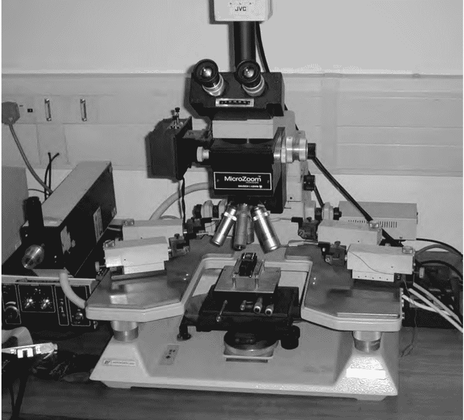
图16.4: 低成本探测站

探测攻击的常见目标是处理器的总线。如果总线流量可以被记录下来，这将给出程序在代码和数据方面的操作的跟踪。如果攻击者幸运的话，卡片设计者会在复位后立即计算出内存的校验和（这是一种推荐的国防工业做法），这将给他提供卡片内存内容的完整列表。因此，攻击者将识别总线并暴露总线线路以进行探测（参见图16.5）。实际上，如果芯片正在执行一个已知的具有良好理解的算法的加密协议，那么除非有一些防御机制，例如大量的虚拟指令，否则从单个总线线路的跟踪很可能会泄露密钥[580]。

付费电视卡行业对这种攻击的第一个防御措施是为每张卡片配备多个密钥和/或算法，并安排事情，以便只有当前使用的密钥或算法会出现在处理器总线上。每当盗版卡片出现在市场上时，会通过空中发出命令，使合法卡片激活来自以前未使用的内存区域的新密钥或算法。通过这种方式，盗版者的客户将遭受服务中断，直到探测攻击能够再次进行并且新的盗版卡片或现有卡片的更新可以以某种方式分发。

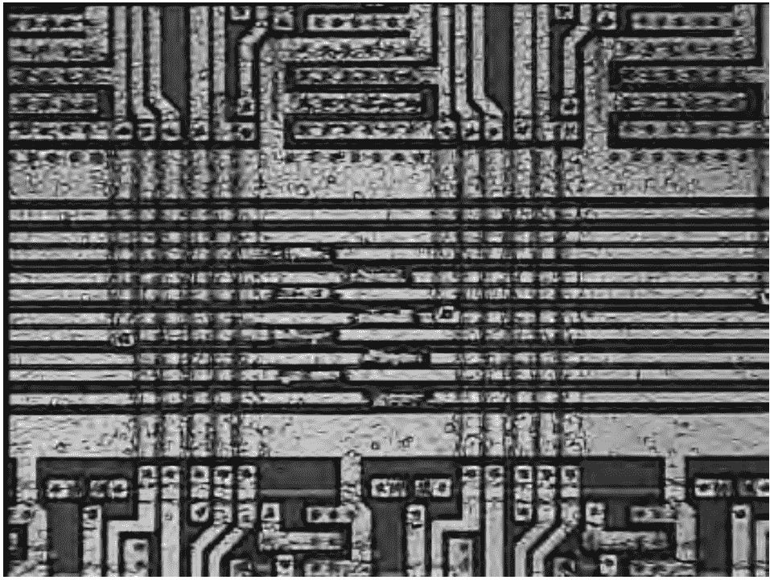
图16.5: 通过使用激光射击在ST16智能卡的钝化层上挖掘八个沟槽，准备进行探测的数据总线（照片由Oliver Kömmerling提供）

## 如何黑掉智能卡 (5)

这种策略的失败是由Oliver Kömmerling的内存线性化攻击造成的，在这种攻击中，分析师会损坏芯片的指令解码器，使得除了通过递增之外改变程序地址的指令（如跳转和调用）无法执行[733]。一种做法是将接地的微探针放在指令锁存器的控制线上，这样无论上电时指令锁存器中有什么指令，都会被重复执行。现在可以从总线上读取内存内容。实际上，一旦了解了设备的一些只读存储器（ROM）和可擦写存储器（EEPROM），攻击者可以跳过不需要的指令，并使设备只执行他选择的指令。因此，通过单个探针针，他可以让卡片执行任意代码，并理论上可以让其通过串口输出其秘密密钥材料。但是，通常更方便的是从总线上探测内存内容。

在实践中，指令解码器中经常有几个地方，接地的针会阻止控制流程中的编程更改产生效果。因此，即使处理器没有完全理解，通过试错法通常可以实现内存线性化。一些更现代的处理器具有防止内存线性化的陷阱，例如硬件访问控制矩阵，除非提供了一些特定的命令序列，否则阻止读取特定内存区域。但是，这样的电路通常可以通过使用激光或离子束精心选择的门进行击穿来击败。

内存线性化是故障诱导攻击的一个例子。这方面有很多例子；故障可以通过多种方式注入到智能卡和其他安全处理器中，从硬件探测到电源瞬变，再到我们的老朋友，堆栈溢出。对卡片测试电路的攻击是这一主题的一个变体。典型的智能卡芯片在ROM中有一个自检例程，在工厂中执行并允许读取和验证所有内存内容。与FPGA一样，然后在芯片中烧断保险丝，以阻止攻击者使用相同的功能。攻击者所要做就是在那个机制中引发故障——通过找到保险丝并修复它。这可能就像用两根探针桥接它一样简单。更谨慎的设计可能会将测试电路放在硅片被切割成单个芯片时被锯掉的部分上。

也有可能利用已经存在的硬件漏洞。例如，Adi Shamir指出，如果CPU的乘法单元存在错误——即使只有一个计算 $ab = c$ 的结果在一个位上始终返回错误——那么就有可能向其发送一个RSA密文进行解密（或者RSA明文进行签名），构造出的计算结果在模 $p$ 下是正确的，但在模 $q$ 下是错误的；如果这个结果返回给攻击者，他就可以立即计算出私钥[1148]。因此，一个细心的程序员会检查关键计算的结果。

## 如何黑掉智能卡 (6)

付费电视卡行业尝试的下一个方法是将硬件加密处理器整合到卡中，以迫使攻击者重构硬件电路，而不仅仅仅是克隆软件，并迫使他们在盗版卡中使用更昂贵的处理器。在第一个这样的实现中，加密处理器是一个单独的芯片封装到卡中，它有一个有趣的协议故障：它总是能够计算出解密当前视频流所需的密钥，然后将其传递给CPU，由CPU决定是否将其传递给外部世界。黑客通过开发一种方法来窃听两个芯片之间的连线来破解这个问题。

后续的实现将加密硬件集成到CPU本身中。

如果电路只有几千个门，攻击者有可能通过从芯片的显微照片中手动重建电路来实现。但是对于更大的门数和深亚微米工艺，成功的攻击可能需要自动布局重建：逐层蚀刻芯片，拍摄电子显微照片，并使用图像处理软件重建芯片的三维地图，或者至少识别其组成单元[196]。

然而，组装所有设备，编写软件并集成系统需要巨大的工作和费用。

更简单、更常见的攻击方式是海盗向现有的几家商业逆向工程实验室之一请教，以重建芯片的相关区域。这些实验室的大部分业务来自于代表芯片制造商的竞争对手分析集成电路，寻找专利侵权。他们还会逆向工程用于消费电子设备附件控制的芯片，因为这样做是为了兼容性而不是盗版，是完全合法的。因此，他们习惯于在一定的保密条件下操作，至少有一个案例是海盗通过假装是合法企业，让一家正规公司对付费电视卡进行逆向工程。

## 如何黑掉智能卡 (7)

卡片行业想出的下一个防御措施是在芯片上提供保护性表面网格，实现在顶层金属层上的地线、电源线和传感器线的蛇形图案。这个想法是，一旦芯片上的图案出现任何断裂或短路，一旦芯片通电就会被感知到，并触发自毁机制。

我们在与达拉斯处理器相关的内容中提到了这样的网格；在经历了一系列的实施失误后，它们被证明是一种有效提高攻击成本的方式。击败它们的合适工具是聚焦离子束工作站或 FIB。有关 FIB 和其他可用于逆向工程的半导体测试设备的详细描述，请参阅 Martin [837]。

简而言之，FIB 是一种类似于扫描电子显微镜但使用离子束而不是电子束的设备。通过调节束流，它可以用作显微镜或铣床，具有小于10纳米的有用分辨率。通过引入适当的气体，该气体会被离子束分解，可以以几十纳米的精度制造导体或绝缘体。

FIB在各种应用中非常有用，从半导体测试到冶金学和法医学再到纳米技术，它们正在迅速普及并且价格也在下降。许多大学和工业实验室现在都有FIB，可以从许多机构租用几百美元一小时的时间。

给定一个FIB，攻击未供电的传感器网格是很简单的。只需在网格上钻一个孔，到达传递所需信号的金属线，然后用绝缘材料填充孔洞，再在绝缘材料中心钻另一个孔，用金属填充，并在顶部镀上一个接触点——通常是几微米宽的铂‘L’或‘X’，很容易用针从探针站接触到（见图16.6）。

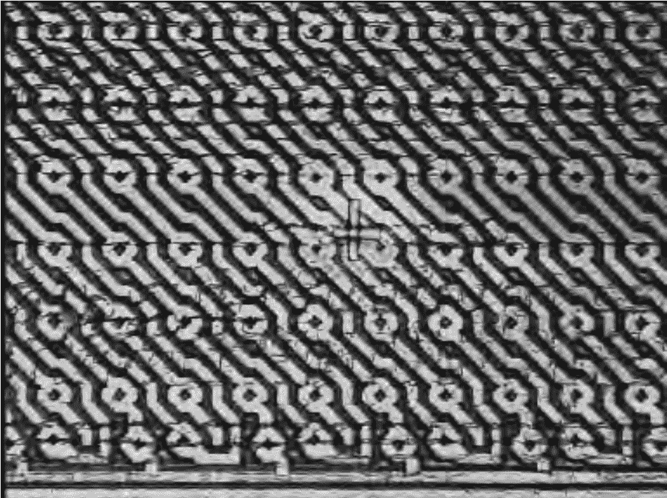
图16.6：带有FIB交叉的ST16智能卡的保护网格，可见下方的总线线路（照片由Oliver Kömmerling提供）

击败持续供电的传感器网格要困难得多，但是有一些工具存在。例如，有一些技术可以通过装备有适当设备的离子束刻蚀仪从芯片的背面穿孔，并直接与电子器件接触，而不会干扰传感器网格。

许多其他的防御技术可以迫使攻击者做更多的工作。一些芯片的包装玻璃比普通封装层要厚得多。这样设计的目的是为了防止明显的去除方法（如氢氟酸）对芯片造成损坏。其他芯片则采用硅碳化物或氮化硼等物质的保护涂层。（带有保护涂层的芯片在马里兰州弗特米德的NSA博物馆展出）。这样的涂层可以迫使离子束刻蚀仪操作员缓慢操作，以避免通过电荷积累损坏芯片。

## 如何黑掉智能卡 (8)

1998年，当保罗·科赫宣布了一种名为差分功耗分析的新攻击时，智能卡行业受到了震动。这依赖于不同的指令消耗不同的功耗这一事实，因此通过测量智能卡芯片消耗的功耗，可以提取密钥。这一理论上一直被认为是可能的，但科赫提出了高效的信号处理技术，使其变得容易，并且我将在下一章节中描述有关发射安全性的内容。他提出了基于时间的更简单的攻击方法；如果加密操作不需要相同数量的时钟周期，这也可能泄露密钥材料。在更大的处理器上，情况可能更糟；许多研究人员已经开发出基于缓存未命中的密码算法攻击。功耗和时间攻击是侧信道攻击的例子，对手可以在进行加密计算时获取和利用处理器状态的额外信息。事实上，当时市场上的几乎所有智能卡都容易受到功耗分析或其他侧信道攻击的影响，这延缓了该行业的发展几年，直到开发出相应的对策。

我们将机械探测分类为侵入性攻击，因为它涉及穿透钝化层，而功率分析则被归类为非侵入性攻击，因为智能卡保持不变；攻击者仅仅观察其操作。非侵入性攻击可以进一步分为本地攻击和远程非侵入性攻击。本地攻击需要对设备进行访问，如功率分析；而远程非侵入性攻击则可以在任何地方进行。时序攻击和协议攻击是后者的例子。

在20世纪90年代末和21世纪初，大量的工程努力投入到使非侵入性攻击更加困难。实际上，这比起看起来更加复杂，因为采取的措施可能会使另一种非侵入性攻击变得更容易。我将在下一章更详细地讨论这些问题。

## 如何黑掉智能卡 (9)

机械探测技术在2000年代初之前起作用，但由于特征尺寸缩小，它们变得越来越困难。下一个攻击技术的发展是光学探测。1995年，美国圣地亚哥国家实验室首次报道了一种使用激光器直接读取电压的方法[17]。自2001年以来，光学探测已经发展成为一种有效且低成本的技术，主要由我的同事Sergei Skorobogatov在剑桥大学推动。2002年，我们报告了使用显微镜上的照相闪光灯，在探测站的显微镜上诱发IC中选定晶体管的瞬态故障[1187]。光电离硅，导致晶体管导通。一旦你能够将光聚焦在单个晶体管上，无论是通过使用金属掩膜还是从闪光灯升级到激光器，这就可以对许多芯片进行直接攻击。例如，微控制器可以通过击中锁存其保护状态的触发器来打开。

那年晚些时候，谢尔盖报告说他使用同一台廉价显微镜上安装的激光器直接读取了微控制器的内存内容[1111]。基本思想很简单：如果你使用激光器使一个晶体管导通，除非它已经导通，否则这将增加设备的功耗。通过扫描激光器在设备上的位置，可以制作出哪些晶体管是关闭的，哪些是打开的地图。我们将这一点发展成了一种相当可靠的读取内存单元的方法[1111]。

## 如何黑掉智能卡 (10)

在撰写本文时（2007年），智能卡供应商正在使用0.18和0.13微米的工艺，通常有七层金属层。由于特征尺寸和金属层的阻挡，从芯片表面对逻辑进行直接光学探测攻击现在变得困难。因此，引起的故障更加随机且不太有针对性。此外，芯片的巨大尺寸和复杂性使得很难确定瞄准的位置。这一点由于使用了粘合逻辑——基本上是随机的放置和布线——而变得更糟。

正如您在图16.7中所看到的，旧的MC68设备具有明显可区分的块，并且通过观察可以了解它的结构和组织。总线可以被挑选出来并成为攻击的目标。

然而，在图16.8中的SX28看起来只是一个随机的门海。唯一容易区分的特征是EEPROM（左上角）和RAM（右上角）。而SX28是一个相对较旧的设计；更现代的芯片通过化学机械抛光进行平面化处理，因此除非使用红外光，否则几乎看不到更多细节。

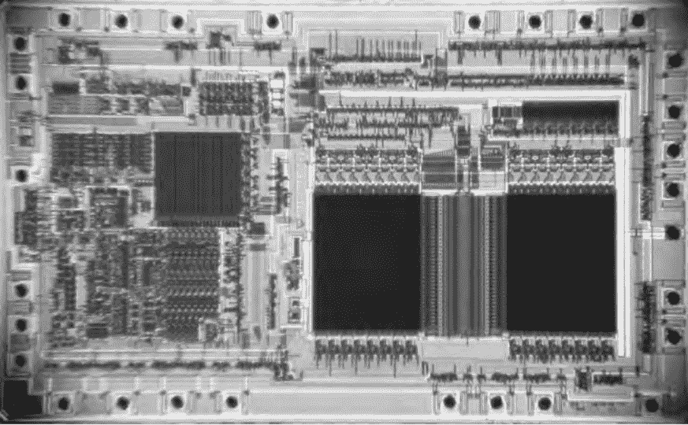
图16.7：MC68HC705P6A微控制器（由Sergei Skorobogatov提供）

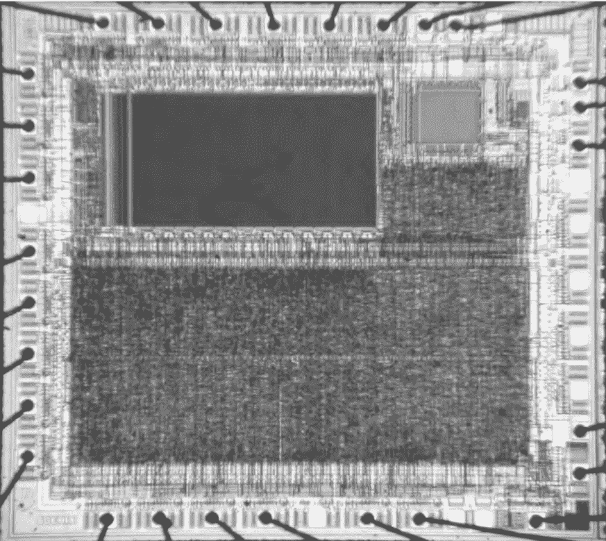
图16.8：带有“粘合逻辑”的SX28微控制器（由Sergei Skorobogatov提供）

目前存在的两个漏洞窗口是内存和后侧。静态SRAM单元仍然相当大；即使使用0.13微米工艺，SRAM单元的尺寸也约为1.2乘以1.7微米，因此可以单独进行针对性攻击，无论是为了引发故障还是为了读取其内容。后侧光学攻击利用硅在大于1.1微米波长时是透明的，而后侧探针攻击则使用了用于此目的的具有特殊设备的离子束刻蚀机。

## 16.6.4 现有技术水平

最好供应商提供的物理防篡改级别在过去几年中有了显著改进。这主要得益于最新设备的更小特征、更多金属层和更复杂的设计。在本书的2001版中，我写道：“我所知道的没有任何技术或技术组合能够使智能卡对熟练和决心的攻击者具有抵抗力”。这几乎仍然是正确的，但现在，要渗透一个良好的设计可能需要很多时间和金钱。如果你找不到更简单的方法并且不得不对整个芯片进行逆向工程，那么你将不得不处理成千上万个以随机方式布局的逻辑门和可能有七个金属层的晶体管。一种方法是使用复杂的布局重建软件；另一种方法是将显微照片发送给中国的分包商，让他们投入大量人力解决这个问题。无论哪种方式，你可能需要一年的延迟、超过一百万美元的预算，而且并不确定能否成功。

我知道有一个案例，公司花费了大量的金钱（和几年时间）试图逆向认证芯片。那就是索尼的MagicGate，这是一款在Playstation配件中发现的芯片，被Playstation的图形芯片中的安全逻辑所识别。这使用了一些有趣的保护技巧，以及一个既简单（以便无法找到协议攻击），又随机化（以便攻击者无法从重复的交易中学到任何东西）的认证协议。大多数设计并不那么好。许多芯片仍然容易受到诸如功耗分析之类的侧信道攻击的影响，我将在第17章中讨论这个问题。许多芯片过于复杂，或者随着时间的推移变得复杂，导致逻辑漏洞；我将在第18章中讨论API攻击。

最后一个问题是我们的老朋友，柠檬市场。市面上有一些智能卡产品提供非常高的保护级别，也有一些不提供。不用说，供应商都声称他们的产品是安全的。其中一些已经进行了公共标准评估，但这些评估很难解释；至少有一个芯片被宣传为具有非常高的评级，但很容易被探测到（仔细阅读评估证书会发现它仅适用于卡片的操作系统，而不适用于硬件）。

因此，尽管从硅级别来看，智能卡通常比磁条卡更难复制，但它们在实际应用中提供的保护级别将严重依赖于您选择的产品和您如何巧妙地使用它们。

那么，如果您正在设计一个依赖于智能卡的系统，有哪些可用的策略呢？

### 16.6.4.1 深度防御

第一种策略是深度防御，这种策略被付费电视公司采用。智能卡可能使用非标准处理器、具有自定义指令集的硬件加密处理器、使用动态RAM而不是静态RAM的寄存器以防止单步执行，并使用晦涩的专有加密算法。通常情况下，使用自制的加密方案是不好的：Kerckhoffs原则几乎总是最终占上风，而一个糟糕的方案一旦公开，可能会导致灾难。付费电视的深度防御提供了一个有趣的例外。目标是尽可能地减少快捷攻击的可能性，并迫使攻击者费力地对整个系统进行逆向工程。如果您准备在收入保护上投入大量资金，并且拥有专业知识，那么全定制的路线是正确的选择。然而，仅仅依靠技术措施是不够的。重要的是要仔细考虑商业模式。在20世纪的最后几年，付费电视行业成功将盗版损失从收入的5%以上降低到几乎可以忽略不计的比例。更复杂的智能卡发挥了一定作用，但改善的大部分来自对盗版的法律行动，以及使技术和法律措施高效地协同工作。（我将在版权章节中进一步讨论这个问题。）如果您能确保对手在威胁您的收入之前必须完全重建您的芯片，并且您相信这将花费他一年和一百万美元，那么您可以让他永远落后一年，这可能足够了。如果您还能够快速刷新您的安全性，例如向订户发送新的智能卡，那么您可以进一步削弱他的收入预期，并阻止他参与这场游戏。

### 16.6.4.2 止损

是否采用防御性深度方法往往取决于限制由单张卡成功探测而导致的损失的程度。在早期付费电视系统中，系统架构要求所有客户卡包含相同的主密钥。一旦这个秘密被泄露，盗版卡可以随意制造，卡基座必须被更换。目前用于数字广播的付费电视系统使用具有不同密钥的加密协议，以便吊销克隆卡。这使得卡片变得不那么有吸引力。

在其他系统中，如电话SIM卡和EMV银行卡，每个设备都包含一个用于授权交易（无论是通话还是借记）的密钥，用于单个客户的账户。从卡片中探测密钥与窃取卡片或以目标人的名义建立账户并获得真实卡片相当。成本高昂的攻击研究和每张卡片成千上万的执行成本通常不是真正的问题。主要威胁来自非侵入性攻击，即人们被欺骗将卡片插入恶意终端。虽然这样的终端可能进行功耗分析攻击，但实际上协议漏洞提供了最薄弱的环节。因此，银行和电话公司使用廉价的通用卡是相当合理的。

商户楼层限制系统、随机在线授权、热门卡片列表等等，限制了可能的损害。（尽管如此，银行说“我们使用安全的智能卡，因此任何有争议的交易都是你的错”仍然是令人反感的。）

## 16.7 发生了什么问题

涉及防篡改处理器的系统存在故障模式，与设备是低成本智能卡还是高端银行安全模块无关。

### 16.7.1 受信任的接口问题

上述部分描述的设备都没有真正可信的用户界面。一些银行安全模块在前面有一个或两个物理锁，以确保只有持有特定金属钥匙（或智能卡）的人可以执行某些特权交易。但是，无论您使用一台价值2000美元的4758还是一张价值2美元的智能卡进行数字签名，您仍然信任驱动它们的个人电脑。如果它显示一段文本，说‘请支付amazon.com 37.99美元购买安德森的《安全工程学》’，而实际发送给签名的消息是‘请将我的房子重新抵押在13号阿卡西亚大道，并将所得款项支付给黑手党房地产公司’，那么防篡改性并没有给您带来太多好处。事实上，它甚至可能使您的情况变得更糟。许多国家的银行在转向电子系统时，利用机会改变他们的合同条款和条件，以削弱消费者保护[201]。

特别是在英国，智能卡技术更多地成为了一种责任工程技术，而不是一种保护性技术；对于投诉，常常会得到一个标准的回答：“你的芯片和PIN卡被使用了，所以是你的错。”

这通常是一个用户界面问题，尽管并不总是如此。回想一下我们在第12章中讨论的数字式转速表；在供应商将传感器变成一个安全处理器，并具有自己独特的加密密钥之后，攻击者构建了一个围绕它的变速箱仿真器，并向传感器输入篡改的数据。即使你在一个防篡改设备中投入了一些努力来构建用户界面，它也可能会受到环境的影响；这里的经典例子是安装在自动取款机的卡槽上的窃取器，它在你插卡时读取你的卡片，并使用一个微型摄像头捕获你的PIN码。

防篡改处理器通常能够在不需要对用户进行身份验证或感知环境（除了检测篡改企图）的情况下增加更多的价值。回想一下第13章中的预付电力计量的例子：在那里，防篡改处理器用于在令牌销售机被盗时限制损失。令牌是使用保存和解密值计数器的加密处理器生成的，每个售货机上都强制执行信用额度限制。邮政邮票机的工作方式完全相同。关键的区别在于银行应用程序需要对客户进行身份验证，而电力和邮政计量应用程序则不需要。

其他使用加密芯片但不关心谁使用的应用程序范围从打印机墨盒和游戏机的附件控制到预付电话卡。在那里，供应商只关心只有一个人使用该产品，而且通常只使用这么多。

### 16.7.2 冲突

另一组问题是，当一个应用程序在多个设备上由不同方控制时，您必须考虑每个方攻击其他方时会发生什么。在银行业中，发卡方、终端机所有者和客户是不同的；克隆卡、虚假终端和作弊银行的所有交互都需要经过深思熟虑。这与建筑入口控制应用程序完全不同，其中一个公司拥有卡片和终端；电话卡处于中间位置。

Bruce Schneier 和 Adam Shostack 在 [1136] 中提出了一个分析框架。想象一下，客户从一个安全的个人电脑开始；比如一个带有生成数字签名软件的掌上电脑。现在考虑一下，当您将其分割开来时会发生什么，例如要求她使用由他人控制的远程键盘和屏幕，或者要求她使用由他人控制的智能卡进行加密。然后想想当这些组件中的任何一个暂时被破坏时会发生什么：客户的卡被盗，或者她的计算机被感染。这给我们很多滥用案例需要考虑，而设计师们往往会忽略其中一些（尤其是那些难以解决其产品的案例，或者对其客户尴尬的案例）。

每次您将一个分割引入系统中，接口都会创造新的可能性对于混乱；一项商业评估实验室发现的缺陷调查显示，其中大多数缺陷出现在物理、逻辑和组织措施之间的接口上 [213]。我将在API攻击的章节中更详细地讨论这个问题。

位移还存在其他问题。设计师常常认为，只因为他们的产品包含了安全处理器，就意味着其保护需求已经得到满足。安全盒已经打勾。但由于接口和其他问题，这种情况很少发生。冲突和漏洞的另一个来源是许多防篡改的用户是实施限制客户对其产品使用的商业模型的公司，如权利管理和附件控制。从某种意义上说，他们的客户是他们的敌人。他们不仅可以访问产品，还有动机如果可能的话对其进行篡改。

### 16.7.3 柠檬市场，风险倾销和评估

从硬件安全模块到智能卡再到微控制器，这里讨论的每个产品类别都有各种各样的产品，提供的保护质量也存在极大的变异性。虽然有相当多的产品经过评估，但这些评估实际上并没有太大意义。

首先，在最高保护级别（FIPS-140级别4或Common Criteria级别4以上）的产品非常少。在较低级别有很多产品，这些测试相对容易通过，供应商也可以选择一个容易通过的实验室。这导致了一个柠檬市场，除了最了解和积极参与的参与者，其他人都会被诱惑选择最便宜的3级产品，甚至是未经评估的产品。

其次，评估证书并不意味着它们看起来的那样。在2001年购买4758的人可能会认为它的4级评估意味着它是不可破解的，然后当我们破解它时会感到惊讶。实际上，FIPS证书只涉及硬件，而我们发现了软件中的漏洞。反过来也发生过：有一张智能卡经过Common Criteria 6级评估，但这只涉及操作系统，而该操作系统在没有真正防御微探针的芯片上运行。我将在第三部分更详细地讨论我们评估系统的缺陷。

第三，许多公司的目标是使用安全处理器来转嫁风险而不是最小化风险。那些声称“你的芯片和PIN卡被使用了，所以是你的错”的银行绝不是孤立的。从医疗到国防，有许多环境中，人们通常寻求的是安全证书而不是真正的保护，而这与评估系统中的缺陷以许多方式相互作用。事实上，安全评估的主要用户恰恰是那些专注于尽职调查而不是风险降低的系统运营商，他们也是使用防篡改处理器的不成比例的用户。

### 16.7.4 安全性通过模糊性

直到最近，加密处理器的设计师们一直努力保持他们产品的设计模糊。你必须签署保密协议才能获得智能卡开发工具，直到1990年代中期，关于智能卡如何受到攻击的严肃信息几乎没有。他们的供应商根本没有想到攻击者可能会购买二手半导体实验室工具，并找到巧妙的方法来探测数据。在通用标准下评估许多智能卡的安全目标仍然是保持设计的模糊性。芯片掩模必须保密，员工必须经过审查，开发人员必须签署保密协议——这些要求增加了行业的成本 [448]。模糊性也是出口批准的常见要求，这引起了一种怀疑，即它掩盖了故意插入的漏洞。例如，我们测试的一张卡片在被指示生成私钥/公钥对并输出公共部分时，总是产生相同的值。

简而言之，该行业的安全文化是不合适的。几乎没有实际攻击使用内部信息的智能卡系统。其中大部分都是从零售购买的卡片上进行探测攻击或者侧信道攻击。该行业没有对自己的产品进行敌对攻击，因此产品薄弱，最终被他人进行敌对攻击。文化正在发生变化，一些组织，如VISA，规定进行渗透测试 [1300]。然而，激励机制仍然是错误的；明智的供应商会选择最容易通过评估实验室的方式，而不是选择一个能够发现产品中数十个额外漏洞并破坏产品按时上市机会的顶级攻击团队。我们将在第26.3.3.1节中回到这个主题，讨论评估的基本经济学和政治学。

### 16.7.5 与政策的互动

与政策世界有许多其他意想不到的互动。一个很好的例子是在互联网繁荣时期开始的推动，希望智能卡成为人们与政府互动时首选的设备。欧盟通过了一项法律，对使用批准的智能卡进行电子签名给予了强有力的有效性推定。考虑到缺乏可用用户界面，这是不合理的；对于签署文件，最好使用类似PDA的设备，至少客户可以看到自己在签署什么，并且可以通过常识保护设备 [111]。然而，智能卡供应商进行了大力游说，并获得了他们的法律。幸运的是，这完全是适得其反的：该法律将伪造签名的责任从依赖方转移到了表面上使用密钥的一方。通过接受这样的设备，你实际上是在说，“我同意受到任何看起来是由该设备生成的签名的约束，无论我是否实际生成它。”这是不吸引人的，并且已经帮助限制了数字签名的使用范围，仅限于特定应用。

### 16.7.6 功能蔓延

我们已经看到了许多例子，功能蔓延和环境条件的变化破坏了安全系统，破坏了它们的设计假设。我提到过，例如，用电子护照（易于复制）替代纸质护照（独一无二）会破坏解释系统；等待审判的罪犯可以使用他们护照的副本逃离国家。一个更普遍的问题是将多个应用程序放在同一张卡上。如果您部署了一个电话银行系统，那么之前只是用于将人们身份识别给电话公司的SIM卡现在成为控制访问他们银行账户的令牌。由此可见，它可能会吸引更高级别的攻击者。这重要吗？在当前（2007年）日益增长的网络钓鱼攻击环境中，我认为这可能并不重要；使用短信来确认银行交易提供了一个有价值的第二身份验证渠道（正如第2章所述，主要风险可能是欺诈者说服电话公司向错误的人发放SIM卡）。

但是五到十年后会发生什么呢？一旦每个人都这样做了呢？如果iPhone像苹果希望的那样火起来，每个人都不仅把它当作手机，而且把它当作网络浏览器，那会怎么样呢？突然之间，两个身份验证通道变成了一个；短信和银行网站的IP流量都通过同一个操作系统，而这个操作系统的规模足够大，足以引起俄罗斯的注意。

## 16.8 那么应该保护什么呢？

很常见的情况是，技术最初被发明或推广的目的并不是它真正火起来的原因。蒸汽机最初是为了从煤矿中抽水而发明的，而电话则是为了让邮局职员能够向电报员朗读文本，而不是通过气动管道发送。同样，智能卡的发明者认为它们会在银行业大获成功；然而它们首先在电话卡和付费电视领域取得了成功。尽管它们在欧洲的银行业中得到了应用，但在像美国这样的市场上，银行客户享有更好的法律保护，智能卡仍未流行起来。最低成本的加密芯片的最大销售量是在配件控制应用程序中，如打印机墨盒和游戏机。

那么防篡改设备实际上能添加什么价值？

- 首先，它们可以通过将信息处理与单个物理令牌链接起来来控制信息处理。付费电视订户卡可以在灰色市场上买卖，但只要不被复制，电视台运营商就不会太担心。另一个例子来自于诸如索尼MagicGate之类的附件控制芯片；任何PlayStation都应该能与任何PlayStation存储卡一起使用，但不能与廉价的韩国竞争对手一起使用。另一个例子是在政府网络中使用加密来强制执行评估标准：如果只有在系统经过检查和认证后才能获得密钥材料，那么连接未经许可的任何规模的系统到机密政府网络就是不方便的。这使您能够将信息保护与物理和操作保护相结合。
- 其次，它们可以用于控制价值计数器，就像第12章和第16.7.1节中讨论的电力预付和邮政计量一样。这些通常使用诸如iButton之类的设备来保存密钥和信用计数器。即使设备被盗，它可以提供的服务总价值也是有限的。相关应用是在打印机中，墨盒通常被编程为只释放一定量的墨水，然后宣布自己干燥。
- 第三，它们可以减少对人员的信任需求。它们在一些政府系统中的主要目的是“将关键材料的市值降低到零”。STU-III的加密点火钥匙应该只允许窃贼冒充合法所有者，前提是他能够接触到实际的STU-III设备，并且只有在钥匙和电话都没有被损失的情况下才能持续。在ATM网络中也适用相同的一般考虑因素：没有一家银行愿意让自己客户的安全依赖于另一家银行员工的可信度。实际上，它们不仅实施了责任分离政策，还将信任的很大一部分转移到了物品上。如果这些物品可以被物理控制——无论是通过它们的分类还是它们的质量——那么这将减少来自背叛和粗心的风险。

这只是一个不完整的列表。但是这些应用程序及其基本原理的共同之处在于，安全属性可以独立于周围环境的可信度提供。换句话说，在使用防篡改设备来弥补缺乏可信接口时要小心。这并不意味着在接口有问题的情况下完全没有价值可以增加。例如，在ATM网络中使用的防篡改加密模块无法防止使用伪造的ATM进行小规模盗窃；但是如果正确使用，它们可以防止大规模的PIN泄露。总的来说，防篡改设备通常是一个有用的组件，但很少提供完全工程化的解决方案。

## 16.9 总结

防篡改设备和系统有着悠久的历史，早在电子计算机的发展之前就存在。计算机可以通过多种方式来防止物理篡改，例如将其锁在一个受保护的房间中。还有一些更便宜和更便携的选择，从成本数千美元并经过认证以抵抗目前已知的所有攻击的硬件安全模块，到硬件现在相当难以渗透的智能卡，再到低成本的安全微控制器，通常可以在几小时到几天的工作中被击败。

我已经讲述了硬件防篡改是如何在1990年代通过一系列攻击和改进的防御中发展起来的，并给出了许多应用示例。几乎无论价格如何，安全处理器通常容易受到接口（人类、传感器或系统）的攻击，但在需要将处理与物理对象链接并在没有可靠的在线服务的情况下跟踪价值的应用中，它们通常可以提供价值。

## 研究问题

在防篡改处理器设计的研究中，基本上有两个方向。

第一个方向是关注如何使“更快、更好、更便宜”的处理器：如何将高端设备提供的保护带到中端价格和尺寸的产品中，以及如何将中端保护带到智能卡中。第二个方向是关注如何推动攻击技术的发展。如何利用最新的芯片测试技术来进行“更快、更好、更便宜”的攻击？

这些方向与辐射安全和应用程序编程接口的保护研究相互交织，我将在接下来的两章中进行讨论。

## 进一步阅读

我和同事们写了一篇关于安全处理器的调查报告 [65]，如果你想了解更详细的内容，我建议你阅读这篇文章。此外，Sergei Skorobogatov在 [1186] 上有一篇教程。

目前该领域的最佳研究成果通常出现在CHES（密码硬件和嵌入式系统研讨会）的论文集中。FPGA安全性在 [400] 上有评述，其他值得一读的书籍包括Bunnie Huang关于黑客攻击Xbox的书籍 [629]。

关于密码学的早期历史，包括加权码本和可溶性墨水等内容，当然可以参考卡恩的著作 [676]。关于中后期1990年代芯片卡技术的手册，请参阅 [1056]，而关于对这些一代卡的篡改攻击的详细信息，请参阅 [68, 69, 733]。IBM和达拉斯的产品都有广泛的在线文档 [641]，您还可以在那里找到美国FIPS文件 [936]。

## 章节 17 发射安全

> 两军的嗡嗡声仍然响着，几乎可以听到守卫的秘密窃窃私语；火焰互相回应，透过烟雾每一场战斗都能看到对方的模糊面容。
> 
> —— 威廉·莎士比亚，《亨利五世》第四幕

### 17.1 引言

发射安全，或称Emsec，是防止使用妥协辐射，即传导或辐射的电磁信号进行攻击的技术。它有许多方面。军事组织非常关注 *Tempest* 防御，它可以防止计算机和其他电子设备发射的杂散射频被对手捕获并用于重构正在处理的数据。近来，*Tempest* 也成为电子投票的一个问题，荷兰的一个团队发现他们可以从远处判断选民在投票机上选择了哪个党派。智能卡行业对功耗分析非常关注，通过测量CPU的电流和使用这些测量结果重构密钥，可以观察智能卡执行的计算（例如数字签名）。这些威胁密切相关，并有许多共同的对策。研究人员还发现了利用各种设备的杂散光学、热学和声学辐射的攻击。

这种技术也被称为侧信道攻击，因为信息是通过与通信无关的信道泄漏出去的。人们经常低估了Emsec的重要性。然而，在二十世纪最后一个季度，世界的军事组织在Emsec上的花费与加密术上的花费相当。在商业世界中，智能卡的普及在那个世纪的最后几年受到了重大的挫折，因为人们意识到当时市场上的所有智能卡都极易受到简单攻击的影响，攻击者只需欺骗客户使用一个特制终端，在少数交易期间分析其所绘制的电流。这些攻击并不涉及侵入卡片，因此可能不留下任何痕迹。一旦部署，它们比探测攻击要便宜得多，并且有可能对毫无戒备的持卡人群体进行大规模的卡片克隆攻击。

已经对其他商业系统进行了电磁窃听攻击的演示，包括自动取款机。它们可以与恶意软件进行交互，即恶意软件可以使计算机发出比正常情况下更强的信号，甚至调制信号以使被盗数据通过企业防火墙。还有关于破坏性电磁攻击的警报，即恐怖组织可能使用高能微波源来摧毁目标组织的计算机而不伤及人员。（我将在有关电子战章节中更详细地讨论这些问题。）

主动和被动的电磁安全措施与电磁兼容性（EMC）和射频干扰（RFI）密切相关，这些干扰可能会意外地干扰系统。如果你经常乘飞机，你会熟悉机长说类似于“现在必须关闭所有电子设备，并在我关闭安全带指示灯之前不得再次打开。”随着一切变得电子化和时钟频率的提高，这个问题正在变得越来越严重。那么，你如何遵守机长的规定，现在越来越多的设备都是“始终开启”的，所以“关闭”开关只会关闭绿色的指示灯？

随着越来越多的日常设备连接到无线网络，并且处理器速度提高到千兆赫范围，所有这些问题——RFI/EMC、Emsec和各种电子战威胁——都将变得更糟。

### 17.2 历史

电话线之间的串扰在19世纪的电话先驱们中是众所周知的，他们的双线电路堆叠在支撑杆上的交叉树层上。处理这个问题的一种方法是使用“转位”，即在一定间隔处交叉线路，使电路成为扭曲对。这个问题似乎首次引起军方的注意是在1884-1885年英国军队远征尼罗河和苏埃金期间 [923]。

在战争中，已知的第一个利用泄漏信号的案例发生在1914年。为了连接陷入佛兰德斯泥潭的部队与他们的指挥部，铺设了野战电话线，这些线路经常延伸数英里，与敌方战壕平行，距离仅几百码。电话电路是一根单芯绝缘电缆，为了减轻重量和体积，使用地线回路。很快发现地漏电导致了很多串扰，包括来自敌方的信息。很快建立了监听站，并采取了保护措施，包括使用扭曲对电缆。到1915年，电子管放大器已将地漏电监听范围扩展到电话通信的100码和莫尔斯电码的300码。人们发现，无人地带的废弃电报线提供了一个很好的通信渠道，并向德国泄漏了大量的通信，清理它成为一个耗费生命的任务。到1916年，在前线3000码范围内已经废除了地线回路。当美国加入战争时，这些技术被传授给了他们 [869, 923]。

第二次世界大战带来了雷达、被动定向和低概率拦截技术的进步，我将在有关电子战的章节中讨论这些技术。到了20世纪60年代，在英国的“电视探测车”中，国内电视机的本地振荡器信号泄漏被定向设备所瞄准，电视机主必须支付年费来支持公共广播服务。计算机安全界的一些人也意识到信息可能从交叉耦合和杂散射频中泄漏。最早的已发表参考资料似乎是由威利斯·韦尔（Willis Ware） [1319] 于1970年撰写的兰德公司报告。

情报界也开始利用侧信道攻击。在1956年苏伊士危机期间，英国通过窃听器破译了埃及大使馆的哈格林密码机的设置。在1960年，首相在有关加入欧洲经济共同体的谈判中下令对法国大使馆进行监视时，他的安全服务科学家们注意到大使馆的加密流量携带了一个微弱的次级信号，并构建了设备来恢复它。结果证明，这是明文，以某种方式泄漏了密码机 [1363]。这比人们想象的更常见；有过不止一个密码机在无线电频率上明文广播的案例（尽管通常有理由怀疑供应商的政府已经知道这一点）。

在20世纪70年代，发射安全成为一个高度机密的话题，并从公开文献中消失。1985年，荷兰研究员Wim van Eck发表了一篇文章，描述了他如何通过修改电视机，在远距离上重建VDU上的图像。Tempest攻击不仅仅是可行，而且可以使用简单的自制设备进行。这让计算机安全行业感到恐慌。

发射安全和相关主题的研究在1990年代下半叶开始蓬勃发展。1996年，Markus Kuhn和我报告称，许多智能卡可以通过在其电源或时钟线上插入瞬变或故障来破解。Paul Kocher还表明，许多常见的加密系统实现可以通过精确测量所需的时间来破解。1998年，Kuhn和我展示了通过适当的软件措施，可以使PC的许多泄露辐射变得更好或更糟。1998-1999年，Kocher展示了可以通过对智能卡所绘制的电流的精确测量进行适当处理来恢复使用的加密密钥。尽管智能卡供应商从20世纪80年代末就意识到可能存在问题，但Kocher的差分功率分析提供了一种简单而强大的信号处理技术，可以完全击败行业提供的相对原始的防御措施。

近年来，结果一直稳步增长。2002年，关于光学泄漏的结果出现了：Markus Kuhn表明，可以通过光学方式恢复VDU屏幕的内容，即使是从房间墙壁或操作员的脸上反射的散射光 [750]。同时，Joe Loughry和David Umphress还发现了许多数据串行线上的LED状态指示器中的串口数据 [815]。2004年，Dmitri Asonov和Rakesh Agrawal表明，键盘上的不同按键发出的声音足够不同，可以通过声学辐射捕捉到某人的打字声音 [91]；2005年，Li Zhuang、Feng Zhou和Doug Tygar改进了这一方法，利用键盘特征和文本统计来解密在随机键盘上打字十分钟的录音文本，而之前没有访问过该键盘以训练识别软件 [1376]。2006年，Steven Murdoch表明，许多计算机通过热泄漏来显示其CPU负载；时钟偏差是环境温度的函数，可以远程测量。他假设甚至可以用来计算目标机器的纬度和经度 [914]。这些结果似乎不断涌现。

### 17.3 技术监视和对策

在沉迷于高科技玩具（如Tempest监视接收器）之前，我们应该停下来思考一下窃听器。利用电磁频谱进行的最简单和最广泛的攻击不是利用无害设备的某些意外特性，而是攻击者引入的定制设备。

无论在传输或存储过程中如何受到加密和访问控制的保护，大多数高度机密的信息最初都是以语音或在个人电脑上的按键输入的形式存在。

如果对手能够在此阶段捕获到信息，那么后续的保护措施可能不会有太大帮助。

因此，市场上提供了一系列非凡的窃听器：

- 在低端市场上，只需花费几十美元就可以购买一个简单的无线麦克风，当你访问目标时可以将其藏在桌子下面。电池寿命是这些设备的主要限制。它们通常只有几百码的范围，寿命为几天到几周。
- 在更高一级的设备中，它们从电网、电话线缆或其他外部电源获取电力，因此一旦安装就可以无限期地持续使用。有些是简单的麦克风，对手可以在电缆管道中迅速安装，只需在房间里独自待几分钟。其他的则是通过在墙壁或地板上钻孔的方式从相邻的建筑物或公寓中插入。还有一些看起来像电源适配器，但实际上包含了麦克风、无线电发射器和电视摄像头。其他的则是监控数据，例如在电缆连接器中包含窃听硬件的特洛伊木马计算机键盘。
- 许多现代窃听器使用现成的手机技术。它们可以被视为稍作修改的手机手柄，在被呼叫时悄无声息地摘机。这使它们具有全球范围；它们是否能持续超过一周取决于安装时是否能连接到电源。
- 一种奇特的设备，在位于马里兰州福特·米德堡的NSA博物馆展出，于1946年由一群学童赠送给美国驻莫斯科大使。这是一个木制的美国国徽复制品，大使将其挂在他住所办公室的墙上。1952年，人们发现它内部有一个共振腔，当外部的微波照射到它时，它会充当一个麦克风，重新传输在办公室内进行的对话。直到冷战结束，莫斯科的大使馆仍然经常受到微波辐射，因此可以推测类似的技术仍在使用中。
- 激光麦克风的工作原理是将激光束照射到一个反射或部分反射的表面上，例如窗户玻璃，在目标对话所在的房间内。声波调制了反射光，可以在一定距离上接收和解码。
- 现今由政府使用的高端设备，可能需要花费超过$10,000，采用低截获概率的无线电技术，如频率跳变和突发传输。它们也可以远程开关。这些功能使它们更难被发现。
- 人们不断提出创造性的新想法。最近的一个是抖动器（Jitterbug），它可以放在键盘电缆中。它将按键数据，如密码，调制成几乎察觉不到的按键延迟。这意味着，即使连接被加密，窃听你的连接的攻击者也可以更容易地猜到你输入的密码。

一些对策可以在一定程度上保护免受此类攻击，前提是它们由经验丰富的专家使用。

- 非线性结点探测器（Non-linear junction detector）是一种可以在近距离找到隐藏电子设备的设备。它的工作原理是电子设备中的晶体管、二极管和其他非线性结点对入射的射频信号进行整流。非线性结点探测器广播一个弱无线电信号，并监听奇数次谐波。它可以在几英尺的范围内检测到未屏蔽的电子设备。然而，如果窃听器已经被植入或靠近现有的电子设备中，那么非线性结点探测器就没有太大帮助。还有一些昂贵的窃听器设计成完全不再重新辐射。在20世纪70年代初，调查记者邓肯·坎贝尔（Duncan Campbell）发明了一种变种，用于检测电话窃听：当时安全机构使用的放大器会将谐波重新辐射到线路上。在他的住所遭突袭后，这个设备的计划被查封；然后在政府实验室中“发明”，并归功于一位政府科学家。
- 市场上有许多监视接收器。更好的接收器每隔几十秒就会扫描从大约10千赫兹到3吉赫兹的无线电频谱，并寻找无法解释为广播、警察、空中交通管制等的信号。（在3吉赫兹以上，信号被建筑材料衰减得很厉害，设备天线也可以很定向，因此一般的频谱搜索不再像非线性结点探测器和物理搜索那样有效。）与普遍的观念相反，一些低截获概率的技术并不能提供完全的保护。通过功率谱可以识别直接序列扩频信号，而频率跳变器在连续扫描中通常会在不同频率上被观察到。突发传输效果更好。然而，监视接收器的有效性越来越受到使用与合法移动电话或无绳电话相同频率和协议的窃听器的限制。注重安全的组织可以试图禁止使用手机，但这往往在军队之外不会持续太久。例如，英国的议会在1997年之前禁止使用手机，但在政府改变后该规定被推翻。
- 打破视线，比如在实验室周围种植树木，可以有效防止激光麦克风，但通常不切实际。
- 军事组织的一些设施被放置在完全屏蔽的建筑物或地下，即使引入了窃听器，它们的信号也无法在外部听到。这是非常昂贵的；但是如果你可以将秘密对话限制在一个房间内，那么有一些供应商销售带有声学和电磁屏蔽的预制房间。另一个选择是确保在建筑物建造时不安装诸如有线麦克风等设备，进行频繁的清扫，并且将不受信任的访客（以及清洁人员等承包商）拒之最敏感的区域。但这看起来更困难。莫斯科的一座新美国大使馆建筑因在结构中发现大量的麦克风而被放弃，英国的反情报机构不得不拆除并重建新总部建筑的一部分，花费约5000万美元，因为其中一名建筑承包商的员工被发现与临时爱尔兰共和军（PIRA）有过联系。

这里的紧张关系在于技术防御（可以有效但非常昂贵）和程序控制（便宜但繁琐）之间。

尽管如此，技术发展正在逐渐使黑客的生活变得更加容易，而对防御来说更加困难。随着越来越多的设备获得智能和短程无线电或红外通信，作为“思考的事物”变成“喋喋不休的事物”，攻击的范围越来越大，而不是需要部署的东西。例如：

- 与电话相关的风险远远超出了许多人的想象。越来越多的人为了方便起见使用无线电话，并忘记了它们容易被窃听。电话可以被篡改，以便在远程控制下摘机；一些数字电话已经内置了这样的功能（据说有些国家将其作为进口许可的条件）。此外，一些PBX的制造商可以重新编程以支持这种监视。
- 典型的笔记本电脑配备了一个可以在软件控制下打开的麦克风，并且越来越有可能时不时地联网。攻击者可以通过恶意软件感染它，监听房间内的对话，将其压缩、加密并发送给其创建者。
- NSA在其建筑物中禁止使用Furby玩具，因为Furby会记住（并随机重复）其所在场所的话语。

但是，现有的电子设备还有许多其他被对手利用的方式。

## 17.4 被动攻击

首先，我们将考虑被动攻击，也就是对手利用他所接收到的任何电磁信号而不需要他自己创造这些信号的攻击。我暂时排除光学信号，尽管光也是电磁的；我将在稍后讨论它们以及声学攻击。

广义上讲，电磁攻击可以分为两类。信号可以通过某种电路（如电力线或电话线）进行传导，也可以作为无线电频率能量辐射出去。军方将这两类威胁分别称为“劫持”（Hijacking）和“风暴”（Tempest）。

它们并不是互斥的；射频威胁通常具有传导成分。例如，计算机发射的无线电信号可以被主电路捕捉并传导到附近的建筑物中。然而，这是一个合理的工作分类，大部分时间都是如此。

### 17.4.1 通过电源和信号电缆的泄漏

自19世纪以来，工程师们就意识到高频信号无处不在，并且需要小心处理，以防止它们引起问题，而且，正如我所指出的，自1914年以来，这种泄漏已被用于军事目的。通过仔细设计，可以在很大程度上抑制信息的传导泄漏，使用适当的电源和信号电缆过滤和抑制。这在军用和民用电子设备之间构成了显著的成本差异的一部分。

#### 17.4.1.1 红/黑分离

红色设备（携带明文等机密数据）必须通过滤波器和屏蔽与黑色设备（可以直接向外界发送信号的设备）隔离开来。同时具有“红色”和“黑色”连接的设备，例如密码机，特别难以正确处理。这更加昂贵，因为发射安全性的标准，例如NACSIM 5100A（规定Tempest受保护设备的测试要求）及其北约等效物AMSG 720B，是机密的（尽管它们已经泄漏，我将在17.4.2节中讨论）。

因此，适当防护的设备往往只有少量可用，并且专门为国防市场制造。这使得它非常昂贵。然而，成本并不止于此。一个空军基地的操作室可能有数千根导线引出；过滤所有这些导线，并实施足够严格的配置管理以保持红黑分离，可能需要花费数百万美元。

#### 17.4.1.2 时间分析

1996年，保罗·科赫（Paul Kocher）证明了许多公钥算法（如RSA和DSA）的实现通过所需时间泄漏了密钥信息。他的想法是，在进行指数运算时，软件通常逐位遍历秘密指数，并且如果下一位是1，则进行乘法运算。这使得一个知道指数的前 $b$ 位的对手可以通过观察多个指数运算来计算出第 $b+1$ 位。攻击和防御曾经共同上演了一段时间，许多人认为如果使用中国剩余定理，他们的实现是安全的。但是在2003年，大卫·布鲁姆利（David Brumley）和丹·博内（Dan Boneh）使用OpenSSL对Apache进行了一次时间攻击，并展示了如何通过计时约一百万次解密从远程服务器提取私钥。现在，好的公钥算法实现使用盲化（blinding）来防止此类攻击（OpenSSL提供了盲化选项，但Apache没有使用它）。

约翰·凯尔西、布鲁斯·施奈尔、大卫·瓦格纳和克里斯·霍尔在1998年指出，使用大型S盒的分组密码（如AES）可能容易受到基于缓存未命中的时序攻击的影响。攻击者可以通过预测猜测值是否会在S盒查找时导致缓存未命中，并通过观察来验证这一点，从而验证对密码的第一轮输出的猜测。自那时以来，许多研究人员改进了这种攻击方法，现在一个简单的AES实现可以通过观察几百次加密而被破解。

#### 17.4.1.3 功耗分析

通常人们在发现漏洞之前并不意识到需要过滤信号。一个非常重要的例子来自对智能卡的功耗攻击的发现。由于智能卡通常是一个非常薄的载体中的单个硅芯片，因此几乎没有余地来使用额外的元件（如电感和电容器）来过滤电源——而且考虑到智能卡的成本在批量购买时为50美分至1美元，而一个电容器的成本为10美分，这很少是经济上合算的。

电源也可能受到敌人的控制。如果你使用你的银行智能卡在黑帮拥有的商店购物，那么终端可能内置了额外的电子设备来欺骗你。

到了1990年代初期，付费电视黑客和一些政府机构似乎已经知道，通过简单地测量智能卡中进行的计算，可以从电源中吸取的电流中收集到大量信息。这种攻击被称为电源分析或轨迹噪声分析，可能只需要在地址线上插入一个 $10\,\Omega$ 电阻，并将数字存储示波器连接在其上以观察设备所吸取的电流的波动。图17.1显示了从微控制器中猜测密码并在正确的字节被猜测时查找不同的功率迹线时，密码被提取的示例。

不同的指令具有不同的功耗特性，并且，功耗还取决于正在处理的数据。在许多情况下，主要与数据相关的贡献来自总线驱动器晶体管，它们相当大。根据设计的不同，每个状态改变的总线的每个位的电流可能在几百纳秒的时间内变化几百微安。因此，攻击者可以获得每个数据字节与前一个字节之间的汉明重量（即过渡计数）。在某些设备中，每个数据字节的汉明重量也是可用的。EEPROM的读写操作可以提供更大的信号。

**图17.1**: 在对汽车防盗器的微控制器中存储的服务密码的第一个字节进行256次单次猜测时测得的电流图（由Markus Kuhn和Sergei Skorobogatov提供）。

这种泄漏的影响不仅限于密码提取。了解（或猜测）密码实现方式的攻击者可以获取有关卡片机密的重要信息，并在许多情况下推断出正在使用的密钥的值。这是非侵入性攻击，可以通过经过适当修改的终端设备对不知情的客户携带的智能卡进行。这意味着一旦攻击者费心了解一张卡片并设计攻击，就可以以很小的边际成本威胁到大量的卡片。

1998年，通过开发一种有效的信号处理技术，从一系列功率曲线中提取用于块密码（如DES）的关键位，而无需了解卡片软件的任何实现细节，向智能卡提出了功率分析的威胁。这种技术，即保罗·科赫的差分功率分析（DPA），工作原理如下：

攻击者首先通过执行已知交易与目标卡收集一些曲线（通常为几百个）——这些交易的加密算法和明文或密文是已知的。

然后，她猜测密码的一些内部状态。对于DES，密码的每一轮都有八个表查找，其中当前输入的六位与六位密钥材料进行异或运算，然后用于从S盒中查找四位输出。因此，如果攻击者可以访问密文，她将猜测最后一轮中S盒的六个输入位。然后，将功率曲线根据这个猜测分为两组并进行同步。然后计算并比较平均曲线。两个平均曲线之间的差异称为差分轨迹。

对于目标S盒的64个可能的六位输入，重复此过程。通常发现正确的输入值将功率曲线分为两组，每组具有不同的S盒输出值——将导致具有明显峰值的差分轨迹。然而，错误的输入值通常导致随机排序的曲线，因此差分轨迹看起来像是随机噪声。通过这种方式，可以找到进入所讨论的S盒的六个密钥位，然后找到密码的最后一轮中使用的其他密钥位。对于DES，这给出了56个密钥位中的48个，其余的可以通过穷举搜索轻松找到。如果密码有更多的密钥位，那么攻击者可以逐轮展开它。

其后果是，即使能够构建出抵抗探测攻击的卡片，除非特定的功率分析防御措施被内置进去，否则很可能仍然容易受到攻击（事实上，市场上所有的智能卡都似乎容易受到攻击）。此外，即使攻击者没有探测设备的访问权限，也可以以低成本、快速地发起攻击。这一发现得到了广泛的宣传，并延迟了智能卡的部署，人们开始研究防御措施。在某些情况下，协议级别的防御是可能的；EMV银行卡协议（从4.1版本开始）要求用于计算交易MAC的密钥必须是通过对卡上的主密钥进行加密计算得到的会话密钥。通过这种方式，不应该使用相同的密钥生成在卡片外可见的两个密文。但是，大多数现有的协议都已经根深蒂固，无法进行根本性的改变。

另一个想法是在加密过程中插入随机性。一个（不好的）想法是，在DES的每一轮中，可以以随机顺序查找八个S盒；这只是使差分轨迹中的一个大峰变成了八个峰，每个峰的振幅是原来的八分之一，所以攻击者只需要收集更多的功率曲线。一个更好的想法是通过引入一些偏移量来掩盖计算，并重新计算S盒以进行补偿。这样，密码的实现每次调用时都会发生变化。

现在在更好的设备中部署的防御措施依赖于特殊硬件。市场领先的一款卡片具有硬件，在每64个机器指令中插入一个虚拟操作；另一款卡片具有一个内部时钟，与外部时钟松散耦合，并且每64个周期改变频率。这两种方法都不是绝对可靠的，因为攻击者可能使用信号处理技术来重新对齐功率曲线进行平均。

关于功率分析有很多变种。基于缓存未命中的攻击不仅可以通过测量功耗和加密所需的时间来进行，因为未命中会激活大量电路来读取非易失性存储器；所以仅仅确保每次加密都需要恒定的时钟周期并不能阻止对AES的缓存攻击。另一种变种是使用不同的传感器：David Samyde和Jean-Jacques Quisquater创建了电磁分析，他们在芯片表面上移动一个微小的拾音线圈来接收局部信号，而不仅仅依赖于设备的电源供应。最新的变化是由Sergei Skorobogatov发明的，他使用激光照亮测试设备中的单个目标晶体管，每次测试运行时间为一半。这不仅可以访问计算的汉明重量，还可以访问单个位；即使设备使用胶水逻辑构建，攻击者仍然可以针对存储结构的感应放大器进行攻击。

### 17.4.2 通过射频信号泄漏

当我在1972年在格拉斯哥学校计算机中心学习编程时，我们有一台早期的IBM机器，时钟频率为1.5 MHz。在机房里调谐到这个频率的收音机会发出一声响亮的哨声，其变化取决于正在处理的数据。许多人注意到这个现象，其中一些人将其用作调试辅助工具。我的一个学校同学有一个更好的主意：他编写了一组不同长度的子程序，通过按顺序调用它们，计算机可以演奏一首曲子。当时我们没有考虑到安全问题。

现在转向更现代的设备，所有的VDU（视频显示单元）都会发射出一个弱的电视信号——一个VHF或UHF无线电信号，其调制了当前显示的图像的畸变版本——除非它们经过精心设计以避免发射。视频信号可以在设备的多个位置获得，特别是在与其调制的电子束电流中。该信号包含了点频率的许多谐波，其中一些由于电缆和其他组件在其波长上共振而辐射得更好。通过合适的宽带接收器，可以接收并重建这些辐射。

与普遍观念相反，液晶显示器对窃听者来说也通常很容易；一个典型的笔记本电脑通过铰链连接系统单元和显示器，这个铰链传输视频信号（图17.2）。其他研究人员很快确认了从传真机到以太网的所有设备都可能被远程窃听的可能性。一些公司开始销售“干扰器”，但这很难做到正确：它们可能会干扰电视和其他服务。军方使用“Tempest”屏蔽设备，但在商业领域通常不可用。无论如何，它通常是过时的一代，并且比现成的个人电脑贵五倍。银行业的观点通常是将其放入“太难”处理的文件中。这种观点在20世纪90年代末受到了一些动摇，当时Hans-Georg Wolf演示了一种Tempest攻击，可以从8米的距离恢复卡片和PIN数据。

**图17.2：** 来自东芝笔记本电脑的射频信号通过三道石膏板墙重建，距离几个房间（由Markus Kuhn提供）。

在国防领域之外，Tempest预防措施仍然很少见，但最近的一个例外来自投票机领域。2006年10月，一个反对电子投票机的荷兰团体证明了荷兰用于收集90%选票的投票机可以从几十米的距离窃听。这导致荷兰政府要求投票设备进行“Zone 1-12 dB”的Tempest测试。

区域（Zone）系统的工作原理如下。被认证为0区的设备不应该在一米的距离内发出任何可以被利用的信号；即使对手在隔壁房间，墙壁是薄薄的石膏板，也应该保护数据免受电子窃听。1区设备应该在20米的距离内安全，因此荷兰的“1-12 dB区域”标准意味着投票机不应该向5米外的窃听者泄露任何投票信息。2区和3区分别表示120米和1200米。

自冷战结束以来，区域系统已经广泛应用于政府部门，这削减了军事预算，迫使政府机构使用商业现成设备而不是专门为自己使用开发的硬件。经过测试，商业现成设备往往在区域2内，其中一些特别嘈杂的设备在区域3内。通过了解哪些设备会辐射出什么，您可以将大部分敏感数据放在离设施边界最远的设备上，并且只在必要时才进行屏蔽。最敏感的系统（如国家情报）和面临最高威胁的系统（如海外大使馆）仍然要么被屏蔽，要么被放在屏蔽房间中。分区技术极大地降低了辐射安全的成本，但在北约政府机构中的总费用每年仍超过十亿美元。

我和Markus Kuhn开发了一种低成本的保护技术，称为“软暴风雨”（Soft Tempest），已经在一些产品中部署，从电子邮件加密软件PGP到最新的荷兰选举机器。软暴风雨使用软件技术来过滤、掩盖或使计算机系统的信息传输电磁辐射变得难以理解。

我们发现大部分从VDU发出的信息载体RF能量集中在频谱的顶部，因此需要过滤掉这个组成部分。是一个逻辑上的第一步。我们通过与适当的低通滤波器卷积来去除标准字体的傅里叶变换的前30%（参见图17.3和17.4）。

这对用户在屏幕上看到的内容几乎没有察觉到的影响。图17.5和17.6显示了从图17.3和17.4中得到的两个视频信号的屏幕照片。

然而，发射的RF差异非常明显，如图17.7和17.8中的照片所示。这些照片展示了一个潜在的受到威胁的辐射，由Tempest监测接收器观察到。

虽然软件Tempest技术可以为VDU提供的保护级别只有10-20 dB的量级，但在一个像政府这样规模的组织中，这可以节省很多钱[70]。还有其他攻击，软件技巧可以完全阻止。例如，当微控制器循环扫描所有按键直到遇到按下的按键时，计算机键盘可以被窃听。当前按下的键被调制到键盘的射频辐射上。通过加密按键扫描的顺序，可以完全阻止这种攻击。

## 17.5 主动攻击

然而，仅仅加密键盘扫描模式是不够的，因为攻击者可以使用主动和被动技术。对于键盘，技术是以其共振频率辐射电缆。由于非线性结效应，按键编码被调制到返回信号中，该信号由电缆重新辐射。

这可以在50-100码的距离内接收到。为了防止这种情况，必须对从键盘到计算机的信号进行加密[753]。

### 17.5.1 Tempest病毒

还有很多其他可能对各种系统进行主动攻击的方式。我们观察到的IBM 1401的现象——一个合适的程序会导致计算机在无线电上播放一首曲子，实际上将其变成一个低级无线电发射器——在现代PC上很容易重新实现。图17.9和17.10展示了当视频信号是2 MHz的射频载波，以300 Hz和1200 Hz的纯音调制时，PC屏幕的样子。

图17.9: 300 Hz AM信号
图17.10: 1200 Hz AM信号

利用这样的现象，可以编写一个Tempest病毒，感染目标计算机并将其窃取的秘密数据传输到附近隐藏的无线电接收器。即使机器没有连接到网络，也可能发生这种情况。接收器不需要昂贵；一个带有磁带录音机的短波收音机就可以，并且已经发布了利用代码。通过更复杂的技术，如扩频调制，攻击者可以使用更昂贵的设备获得更好的范围[753]。

这些方法中的一些已经为情报界所知。

有报道称CIA在经济间谍活动中使用基于软件的射频漏洞攻击某些欧洲国家（例如，在[725]的一部电视纪录片中）。最近由NSA根据FOIA请求[869, 666]解密的材料揭示了使用代号“Teapot”来指代“对电信和自动化信息系统设备的有意破坏性辐射（即敌对诱导或挑衅引起的辐射）的调查、研究和控制”。另一个例子是通过微波辐射通过通风口攻击经过屏蔽和Tempest认证的设备，直到某个频率（比如3 GHz），在这个频率上，通风口变得透明[753]。

使用恶意代码进行攻击的可能性是Tempest测试的一个原因，这就是为什么测试不仅仅仅是被动地监听被测试设备的辐射，还要向其中注入信号，如长线性反馈移位寄存器序列。这些信号产生了一个扩频信号，很可能在设备外部被检测到，从而模拟了最坏情况下的攻击，即对手使用软件漏洞接管设备[177]。

我了解普通的Tempest认证不考虑通过这些技术可以获得的过程增益。

### 17.5.2 不间断

另一类主动方法，被美国军方称为Nonstop [87]，是利用附近的无线电发射器和其他无线电源意外引起的射频辐射。如果在处理敏感数据的设备附近使用移动电话，那么电话的发射器可能会通过非线性结合效应在设备中引起电流，并将敏感数据调制并重新辐射出去。

因此，过去禁止在机密设备的5米范围内使用移动电话。Nonstop攻击也是舰船和飞机的主要Emsec关注点；在这里，能够靠近足够远以进行被动Tempest攻击的攻击者可能会造成比窃听更严重的危害，但由于军舰和飞机通常携带非常强大的无线电和雷达设备，必须小心确保它们的信号不会意外调制为对敌人有用的内容。

### 17.5.3 故障

在智能卡领域，主动电磁安全威胁也非常重要，其中最著名的是故障攻击[68]。在这里，对手向卡片的电源或时钟供应中插入瞬变，希望引发有用的错误。

例如，早期银行应用中使用的一种智能卡具有一个特性，即只有在经过多个周期后，不可接受的高时钟频率才会触发复位，以便瞬变不太可能引起误报警。

因此，可以用两个更窄的脉冲替换单个时钟脉冲，而不会引起复位卡片的警报。这可靠地导致处理器执行NOP指令，而不管它原本应该执行什么指令。这导致了一种选择性代码执行攻击，可以非常强大。例如，攻击者可以跳过跳转指令，从而绕过访问控制。

### 17.5.4 差分故障分析

即使攻击者不详细了解卡片的软件，故障攻击仍然可能是致命的。丹·博内、理查德·德米洛和理查德·利普顿注意到，如果能够引发随机错误，一些公钥加密算法就会失效[206]。例如，在进行RSA签名时，秘密计算 $S = h(m)^d \pmod{pq}$ 是在模 $p$ 下进行的，然后在模 $q$ 下进行，最后将结果组合起来，因为这样更快。但是，如果卡片返回一个有缺陷的签名 $S_p$，它在模 $p$ 下是正确的，但在模 $q$ 下是错误的，那么我们就会遇到问题。

$$p = \gcd(pq, S_p^e - h(m))$$

这将立即破坏系统。如果卡片没有受到故障的保护，这些攻击很容易实施，并且还可以轻松扩展到许多对称算法和协议。例如，埃利·比哈姆和阿迪·沙米尔指出，如果我们有能力将内存的某个位设置为零（或一），并且我们知道密钥存储在内存的哪个位置，我们可以通过进行加密、将前导位清零、再次进行加密并查看结果是否不同，然后将下一个位清零，依此类推，找出密钥[171]。光学探测可能正是这个问题的解决工具。

我们随后发现光学探测的力量意味着攻击者可以通过获取芯片表面的访问权限并识别相关的内存结构[1111]来常规实施此类攻击。

### 17.5.5 组合攻击

其他攻击使用主动和被动方法的组合。我在第一部分中提到过一个技巧，可以用来在被盗的智能卡中找到PIN码。早期的卡系统会要求客户输入PIN码，如果错误则会减少重试计数器。由于这涉及向EEPROM写入一个字节，卡片消耗的电流会随着电路中用于提升供应电压Vcc到编程电压Vpp的电容器的充电而明显增加。注意到这一点后，攻击者可以简单地重置卡片并尝试下一个候选的PIN码。

目前最主要的主动-被动方法是Sergei Skorobogatov的光学增强位置锁定功率分析[1185]，它使用激光部分电离目标晶体管进行功率分析，并在17.4节中进行了讨论。通过增加激光功率，可以将其扩展为主动攻击，以使目标晶体管导通。

### 17.5.6 商业利用

并非所有的Emsec攻击都涉及秘密的军事监视或对防篡改设备的实验室攻击。我已经提到过英国使用的电视探测车来抓捕未缴纳电视许可费的人，以及荷兰关于投票机的骚动。还有一些市场应用。美国场馆运营商SFX Entertainment通过接收来自收音机本地振荡器的杂散射频信号，监控顾客在驶入场馆停车场时所播放的音乐。尽管合法，但这令隐私倡导者感到恼火[1212]。同样的设备已经销售给汽车经销商、商场经营者和广播电台。

### 17.5.7 防御措施

用于防御主动Emsec威胁的技术与被动情况下使用的技术类似，但并不完全相同。

使用时间随机性（抖动）仍然是有用的，因为一个天真的对手可能不再准确地知道何时插入故障。然而，一个聪明的对手可能能够实时分析处理器的功率曲线，并将其与代码进行比较，以便发现关键的目标指令。此外，使用抖动很难阻止故障攻击，因为代码中故障的精确位置通常并不关键。

在某些情况下，防御性编程就足够了。例如，在17.5.5节中描述的PIN搜索可以通过递减计数器、请求PIN，然后如果正确就再次增加计数器来防止。如果你只是检查结果，对公钥协议进行故障攻击会变得更加困难。

其他系统使用特定的保护硬件，例如将卡复位与检测过高或过低的时钟频率的电路集成在一起。正常的复位会将时钟频率减半几个周期，因此如果攻击者找到某种方法来禁用监控，他很可能无法在上电时重置卡片功能[733]。

因此，我们原则上知道如何防御侧信道攻击（尽管广泛的设备测试始终是明智的）。光学探测更加困难；现在卡片可能面临的攻击类型是来自一个将其放入测试装置、启动密码操作，并在精确测量的时间点对芯片发射激光以引起单个设备故障的对手。使用电动台，每小时可以尝试数百个不同的目标。

我和剑桥的同事们设计并原型化了一种防御技术，可以抵抗这样的攻击，使用双轨自时逻辑。在这种逻辑中，我们不是通过单一线路上的高电平表示‘1’，低电平表示‘0’，而是为每个逻辑位使用两条线路。我们通过‘高低’表示‘1’，通过‘低高’表示‘0’，逻辑操作的结束是‘低低’。这种逻辑已经被人们熟知了一些年头，它具有这样的特性：如果系统中出现了‘高高’状态，它会很容易在芯片上传播，将芯片锁定并使设备无法操作，直到被重置。我们将这一特性视为优点，将‘高高’定义为‘警报’状态，并重新设计了门电路，使得单一事件的干扰会引起警报的传播。我们还在芯片中添加了一些警报传感器。由于逻辑是平衡的，功耗不太依赖于数据；通过功耗分析可能被利用的信号降低了约20 dB [903]。一些其他研究人员最近开始研究这种独特的设计风格，并且一些产品已经开始出现。冗余设计可能相当昂贵，成本至少是标准CMOS的三倍，但每个晶体管的成本现在可能已经降到了合理的程度。

## 17.6 光学、声学和热侧信道

近年来，关于新颖的侧信道攻击的有趣新结果不断涌现。你是否曾经在夜晚俯瞰城市，看到有人在办公室里加班，他们的脸和衬衫被电脑显示器的漫反射光照亮？你是否曾经想过，这种光中是否可能恢复出任何信息？2002年，Markus Kuhn表明答案几乎是“一切都可以”：他将一个高性能光电倍增管连接到示波器上，发现常见VDU管使用的蓝色和绿色荧光物质的光在几微秒后衰减。因此，漫反射的光中包含了大量屏幕信息，以时间域编码。因此，通过使用望远镜、光电倍增管和适当的图像处理软件，可以通过解码从银行家的脸或衬衫上散射的光来读取他所看的计算机屏幕[750]。

下一个标题来自乔·洛夫里和大卫·安弗雷斯，他们研究了PC、调制解调器、路由器和其他通信设备上的数据串行线上的LED状态指示器。他们发现其中有相当数量的设备在光学上传输串行数据：12个调制解调器中有11个，7个路由器中有2个，还有一个数据存储设备。设计师们只是通过串行数据线上的指示灯来传输数据，却没有意识到LED具有足够的带宽将数据传输给等待的望远镜[815]。

接下来是声学。一直以来有一个‘民间传闻’，即间谍可以通过记录旧IBM Selectric打印机的声音来判断某人在打字什么，并且有报道称可以从点阵打印机的噪音中恢复数据[228]。2004年，德米特里·阿索诺夫和拉克什·阿格拉瓦尔表明键盘上的不同按键发出的声音足够不同。他们训练了一个神经网络来识别目标键盘上按键所产生的点击声，并得出结论，通过声学辐射可以准确地捕捉到某人的打字，错误率仅为几个百分点[91]。现在，宋黎明、大卫·瓦格纳和田旭清也表明SSH加密会话会泄露大量信息，因为按键击发送在单独的数据包中，攻击者可以看到它们之间的时间延迟；他们指出，这将使攻击者在猜测已观察到的加密密码时具有约50倍的优势[1203]。

2005年，李壮，冯舟和道格·泰加将这些线索结合起来，提出了一种更强大的攻击方法。给定一个未知键盘上某人打字约十分钟的录音，他们识别出了各个按键，然后利用按键之间的时间间隔和英文的已知统计数据来确定每个按键的含义。因此，他们可以从一段他们从未接触过的键盘录音中解码出文本。

2004年，埃兰·特罗默和阿迪·沙米尔将声学分析的想法降到了更低的层次：他们证明了键盘通过PC的声学辐射泄漏，主要是由主板上的电容器在10KHz以上的频率产生的。

**最新的发展是热隐蔽信道。**

2006年，史蒂文·默多克发现典型计算机的时钟偏差可以远程测量，并显示出昼夜变化，他意识到这是环境温度的函数。他的实验表明，除非机器的所有者采取对策，否则任何可以从中提取准确时间戳的人都可以测量其CPU负载；这就引出了一个问题，即攻击者是否可以找到隐藏机器的位置。经度来自时区，纬度（变化较慢）来自季节。因此，隐藏在匿名服务后面，如Tor可能并不像看起来那么容易 [914, 916]。

## 17.7 Emsec攻击有多严重?

技术监视及其对策——窃听器——是Emsec中最重要的方面，无论是在政府还是在工业领域。它们很可能会保持如此。可以轻松购买的窃听器和其他监视设备的范围越来越大。人们对竞争对手、员工和情人进行监视的动机将继续存在。如果说有什么变化的话，那就是向有线世界的转变将使电子监视变得更加重要，而对策将占据更多的安全预算。

Emsec的那些与非监视设计的设备有关的方面——Tempest、Teapot、Hijack、Nonstop以及各种类型的电源和故障攻击——将成为许多技术中的另一个，这些技术最初在政府部门得到发展，但在商业产品设计中变得重要。

### 17.7.1 政府

对于驻扎在敌对国家的大使馆来说，Emsec威胁是真实存在的。如果你的国家被Lower Slobovia的总统迫使将大使馆设在一个办公楼的二楼，而该楼的一楼和三楼被当地的秘密警察占据，那么安全就成了一个难题。屏蔽所有电子设备（除了用于欺骗的设备）将是解决方案的一部分。这并不是全部；你的清洁女工无疑会受到Slobovian安全部队的贿赂，会帮助松动你设备的Tempest密封垫，就像她们更换房间里的窃听器电池一样。

在威胁较小的环境中，硬件Tempest屏蔽的成本效益更加可疑。尽管Tempest行业在冷战期间一直保持着炒作，但人们对于是否有任何实际的Tempest攻击曾经由外国特工在美国发动的怀疑越来越大。充斥着轶事。例如，据说在整个北美洲，唯一已知使用这种监视技术针对美国利益的是加拿大情报人员，他们无意中听到了美国外交官讨论对中国的粮食销售的底线。2007年4月，洛克希德·马丁公司被曝出在美国海岸警卫队船只上安装设备时忽视了Tempest标准，引发了一场丑闻。文件被留在海岸警卫队的Deepwater项目网站上，并最终出现在一个活动主义网站cryptome.org上，该网站一度被关闭。这些文件不仅揭示了发射安全缺陷的问题——错误的电缆类型，违反电缆隔离规则，错误的接地，缺失的滤波器，红/黑违规等等——还揭示了一个更普遍的失败工作。这些船只还存在船体裂缝，不防水的户外无线电设备，以及安全闭路电视安装不完善的问题，无法提供指定的360度覆盖，以及更多[338]。这导致了一次国会调查。至少这些文件提供了一些对否则被分类的Tempest和Nonstop认证程序的见解。

我必须承认，如果海岸警卫队人员只是将Tempest防御放在低优先级，我可能会有些同情。在英国的一个城镇里寻找Tempest信号，我可以证明，在实践中进行这样的攻击要比理论上看起来困难得多，而我们现在面对的对手与旧苏联的情报机器完全不同。政府对Tempest风险的放松程度比二十年前更合理。

### 17.7.2 企业

在私营部门，情况正好相反。发现故障攻击和电源攻击对智能卡行业来说是一件大事，并且在那些尚未承诺使用智能卡的国家中，这延迟了智能卡在银行应用中的部署，可能延迟了两年。目前部署的设备仍然不完美；攻击被一堆临时机制阻挡，其有效性取决于有能力的设计师理解问题并且他们的管理者仍然担心这个问题。随着“DPA”恐慌的消退，设备变得越来越复杂，预计剩余的漏洞将重新显现。构建真正阻止侧信道攻击的芯片尺寸设备很困难，很少有客户愿意为此付费。那么未来呢？

排放管理的“非安全”方面，即RFI/EMC，变得越来越重要。越来越高的时钟速度，加上各种无线设备和网络的引入，以及数字电子学在许多以前是模拟或机械的设备中的普及，使得电磁兼容性成为一个越来越困难且重要的问题。许多不兼容的标准由不同的行业组织管理，其中许多正在迅速过时 - 例如，不要求在1 GHz以上进行测试，或者假设不再合理的保护距离[715]。

在“安全”方面，攻击可能变得更容易。软件无线电的出现 - 在中频阶段对信号进行数字化并在软件中进行解调和后续处理 - 将是重要的。这些以前是昂贵的军事好奇心[761]，但现在正在像蜂窝无线电基站这样的地方找到应用。下一代可能是消费者设备，旨在作为GPS接收器、GSM手机、无线局域网基站，并支持当地已获得许可的任何其他无线电基于软件的服务 - 只需更改软件即可。一旦人们学会如何编程它们，他们很可能会将它们用于Tempest攻击。

最后，Emsec问题与电子战并不完全无关。随着社会对易受强无线电频率信号攻击的设备（如军用雷达产生的高功率微波）的依赖越来越深，发动攻击的诱惑也会增加。我将在下一章中讨论高能无线电频率攻击。

## 17.8 总结

发射安全涵盖了一系列威胁，其中系统的安全性可能会被妨害的辐射泄漏所破坏，无论是来自植入的窃听器，无意中的无线电频率或传导电磁泄漏，还是以某种方式诱导的辐射泄漏。尽管最初是国家情报界关注的问题，但Emsec现在对于构建智能卡和现金机等安全产品的公司来说是一个真正的问题。许多这些产品可以通过观察杂散的射频或传导信号来击败。保护免受此类威胁并不像看起来那么简单。

## 研究问题

- 我们需要一套全面的商业排放安全标准。军事标准——北约SDIP-27和美国NSTISSAM——是保密的，尽管它们已经泄露，如17.4.2节所述。
- RFI/EMC标准——民用IEC/CISPR 22和更严格的MIL-STD-461E——并不是为了保护信息而设计的。
- 荷兰最近关于Tempest窃听投票机的恐慌表明，需要制定标准，以便设备购买者和供应商可以对任何特定应用是否需要进行评估。

## 进一步阅读

Emsec方面的开放文献很少。经典的van Eck文章[408]仍然值得一读，而计算机安全领域唯一一本当（直到现在）有关该主题的书是Russell和Gangemi的[1098]。我们在[753]中介绍了关于Soft Tempest、Teapot和相关主题的工作。关于功率分析，请参阅Kocher的论文[728]和Messergues等人的论文[877]；更多论文定期出现在CHES研讨会上。Joel McNamara在[869]上运行一个非官方的Tempest网站。对于时序和功率分析，Paul Kocher和同事的原始论文是经典参考文献[727, 728]；还有一本由Stefan Mangard、Elisabeth Oswald和Thomas Popp撰写的书[833]。

## 章节 18 API攻击

> 一次是偶然，两次是巧合，三次就是敌人的行动。
> — 高尔德芬格

> 简单是终极的复杂。
> — 莱昂纳多·达·芬奇

### 18.1 引言

许多被认为安全的设备都有某种应用程序编程接口（API），不可信任的人和进程可以调用该接口以执行某些任务。

- 银行的服务器将向连接的硬件安全模块询问：“这是一个客户账号和PIN码，PIN码使用我们与VISA共享的密钥进行加密。PIN码是否正确？”
- 如果您启用了JavaScript，那么您的浏览器将公开一个应用程序编程接口——JavaScript，您访问的网站的所有者可以使用它来执行各种操作。
- 安全的操作系统可以通过引用监视器或其他包装器限制应用程序的调用，以执行防止从高级到低级的信息流等策略。

一个自然的问题是，将任务分为可信组件和不太可信组件是否安全，最近人们意识到答案往往是否定的。设计安全的API是一个非常困难的问题。

API安全与我已经讨论过的一些问题有关。例如，多级安全系统对静态数据施加流控制，而安全API通常试图在紧密和动态交互的情况下阻止某些信息流动——这是一个更困难的问题。它还与协议安全有关：正如我将很快讨论的那样，银行安全模块通常是不安全的，因为它们支持的多个不同协议之间存在相互作用。它涉及软件安全：Firefox中的JavaScript实现允许调用程序扫描现有插件设置的所有变量——这可能通过泄露有关您的浏览器习惯和网络邮件使用情况的信息来危及您的隐私 [543]。JavaScript开发人员只是没有考虑为每个访问的网站设置单独的沙箱。事实上，最常见的API故障模式是在组合中安全的事务在孤立时变得不安全，无论是因为应用程序语法、功能交互、信息泄漏还是并发问题。

还有许多其他例子。在嵌入式系统的背景下，例如，我讨论了预付电表；代币售货机使用防篡改安全模块来保护密钥和价值计数器。在那里，攻击是将电费改为最低可能值，并发放使接收者能够以远低于市场价值的价格获得电力的代币。设计错误在于没有将电费报告绑定到端到端协议设计中。

一个潜在的关键例子是“可信计算”。这个倡议在今天大多数PC和Mac主板上放置了一个用于安全加密密钥存储的TPM芯片。根据微软的计划，未来的应用程序将在Windows之上运行一个传统的“不安全”部分，以及一个在新的安全内核Nexus之上运行的“安全”部分或NCA，该内核将经过正式验证，因此对软件攻击更加抵抗。Nexus和NCA将保护应用程序的加密密钥和其他关键变量。这就引发了一个问题，即如何保护应用程序和NCA之间的接口。

简而言之，当一个可信的计算机与一个不太可信的计算机进行通信时，它们使用的语言至关重要。你必须预料到不太可信的设备会尝试各种意想不到的命令组合，以欺骗更可信的设备。我们如何系统地分析这个问题呢？

### 18.2 API对安全模块的攻击

我们从银行用于保护PIN码和加密密钥的硬件安全模块（HSM）的故障中学到了很多关于API安全的知识。1988年，Longley和Rigby在为安全模块供应商Eracom [811] 工作时，确定了分离密钥类型的重要性。1993年，我们报告了一个由于向安全模块添加的自定义事务而引起的安全漏洞 [69]。然而，这个主题真正开始于2000年，当我开始系统地思考是否可能有一系列可以从安全模块调用的事务会破坏其安全性 [52]。我问道：“那么你如何确保没有一系列的17个事务会泄露出一个明文密钥？”翻阅手册，我发现了以下漏洞。

### 18.2.1 XOR-至-空键攻击

硬件安全模块由主机发送给它们的事务驱动计算机来驱动。每个事务通常包括一个命令、一个序列号和几个数据项。响应包含序列号和几个其他数据项。安全模块包含一定数量的主密钥，这些主密钥存储在防篡改响应内存中，如果设备被打开，则会清零。然而，设备中通常没有足够的存储空间来存储可能需要使用的所有密钥，因此密钥被加密存储在设备外部。此外，这些工作密钥的加密方式为它们提供了一种类型系统。例如，在VISA提供的安全模块中，用于从帐号中派生PIN的密钥（如第10.4.1节所述）被加密存储在特定的一对主DES密钥下。

在VISA安全模块的交易中，可以发现支持生成ATM的终端主密钥。你可能还记得第10章提到的ATM安全是基于双重控制的，因此必须找到一种方法来生成两个可以由银行带到ATM的分行经理和分行会计手中，并在键盘上输入的分离密钥。因此，VISA设备有一个用于生成密钥组件并在附加的安全打印机上打印其明文值的交易。它还将其值加密返回给调用程序，加密密钥为相关主密钥 $KM$，该密钥保存在防篡改硬件中：

```
VSM → 打印机: KMT_i
VSM → 主机: {KMT_i}_KM
```

它还有另一个交易，将两个这样的组件组合起来生成终端密钥：

```
主机 → VSM: {KMT_1}_KM, {KMT_2}_KM
VSM → 主机: {KMT_1 ⊕ KMT_2}_KM
```

这个想法是，为了第一次生成终端密钥，你会使用这些交易中的第一个交易两次，然后是第二个交易。然后，你会有 $KMT = KMT_1 ⊕ KMT_2$。然而，没有任何阻止程序员使用任意旧的加密密钥并在第二个交易中使用两次的措施，导致程序员可以得到一个已知的终端密钥（全零密钥，因为密钥与自身进行异或运算）：

```
主机 --> VSM: {KMT_1}_KM, {KMT_1}_KM
VSM --> 主机: {KMT_1 ⊕ KMT_1}_KM
```

现在我们成功地将一个已知密钥插入系统中。可以对它做什么呢？好吧，该模块还有一个交易，可以对任何使用 $KM$ 加密的密钥进行加密，该密钥本身又是使用 $KM$ 加密的。听起来很复杂吗？好吧，这就是事情出错的地方。这个奇怪的交易的目的是使银行能够将其PIN验证密钥加密在终端主密钥下，以便将其发送到ATM机进行离线PIN验证。更重要的是，密钥类型“终端主密钥”和密钥类型“PIN验证密钥”是相同的。这样做的效果是灾难性的。程序员可以检索银行的PIN验证密钥——这也是保存在安全模块外部、使用 $KM$ 加密的密钥，并将其加密在他现在已经插入系统中的零密钥下：

```
主机 --> VSM: {0}_KM, {PIN}_KM
VSM --> 主机: {PIN}_0
```

程序员现在可以解密PIN验证密钥——银行的皇冠珠宝——并且可以计算出任何客户账户的PIN码。安全模块的目的已经完全失败了；银行可能就像使用加密软件一样计算出PIN码，或者将其明文保存在数据库中。

上述攻击长时间未被发现，因为很难理解“使用在 $KM$ 下加密的任何其他密钥下加密的任何密钥来加密提供的任何密钥的交易”的含义。很明显，设备中的各种类型的密钥应该做什么，以及类型系统必须具备哪些安全属性以实现其目标，这一点并不清楚。

实际上，似乎根本没有对保护目标进行正式说明；该模块只是从早期更简单的设计逐渐演变而来，因为银行要求增加更多功能。

下一个攻击是使用形式化方法发现的。我的学生迈克·邦德建立了设备中使用的密钥类型的形式化模型，并立即发现了另一个缺陷。密钥类型“通信密钥”用于MAC密钥，其特性是您可以输入一个明文的MAC密钥，并通过“任何本身已加密的密钥”对其进行加密 $KM$。所以这是另一种将已知密钥输入系统的方法。您可以将一个帐户号码放入系统中，假装它是一个MAC密钥，并使用PIN验证密钥对其进行加密——这将给您直接获得客户的个人识别码（PIN）。（困惑吗？最初每个人都是——现代API太复杂了，以至于无法在随意检查中显现出错误。无论如何，完整的细节在 [65] 中。）

### 18.2.2 对4758的攻击

接下来，我们发现了对VISA API模块和其IBM等效模块4758 [641] 的加密攻击。例如，它们都为密钥生成“校验值”——通过在密钥下加密一串零来计算密钥标识符。这导致了生日攻击，也被称为时间-内存折衷攻击。假设你想破解一种无法从设备中提取的DES密钥。现在，DES密钥可以在大约 $2^{55}$ 的工作量下被破解，但这需要很多工作。然而，在安全模块架构中，破解给定类型的任何密钥通常足够，因为数据可以在它们之间进行转换。你还能够生成任何给定类型的大量密钥——每秒几百个。

因此，攻击过程如下：

- 1. 生成大量终端主密钥，并收集每个的校验值。
- 2. 将所有的校验值存储在哈希表中。
- 3. 通过猜测一个密钥并用它加密固定的测试模式，执行暴力搜索。
- 4. 通过在哈希表中查找（一个O(1)操作），将得到的校验值与所有存储的校验值进行比较。

对于一个 $2^{56}$ 的密钥空间，一个能够生成 $2^{16}$ 目标密钥的攻击者（可以在午餐时间完成），一个目标密钥应该会有大约 $2^{56} / 2^{16} = 2^{40}$ 的工作量（你可以在一周左右在你的个人电脑上完成）。这也被称为“meet-in-the-middle”攻击，反映了HSM生成密钥所花费的工作量和暴力搜索检查密钥所花费的工作量的相遇。

在短时间内，迈克·邦德提出了对4758的实际攻击。这真的震惊了整个行业，因为该设备已经通过了FIPS 140-1 4级认证；实际上，美国政府曾表示它是无法破解的。除了中间人攻击，他还利用了一个更加隐蔽的设计错误，即密钥复制。

随着DES在1980年代变得容易被密钥搜索攻击，金融机构开始将系统迁移到双密钥三重DES：块首先使用左密钥进行加密，然后使用右密钥进行解密，最后再次使用左密钥进行加密。模式：将左密钥设置为等于右密钥，加密将恢复为单DES。这个巧妙的设计使得向后兼容成为可能。4758通过分别存储左密钥和右密钥来增加了巧妙性。IBM采取了预防措施以防止它们混淆——左密钥和右密钥以不同的方式进行加密，使它们具有不同的类型——但未能将两个部分绑定在一起。

因此，攻击者可以使用中间会面的技巧，在4758中获取两个具有已知值的单个DES密钥，然后交换左半部分和右半部分以获得已知真正的三重DES密钥。然后可以使用此密钥导出其他有价值的密钥。在 [202] 中描述了此攻击的几个变体；该攻击实际上已在黄金时段电视上进行了实施和演示 [306]。

### 18.2.3 多方计算和差分协议攻击

对安全模块API的下一组攻击是由Jolyon Clulow于2003年发起的 [309]，它们依赖于操纵应用逻辑的细节以泄露信息。

他的第一次攻击利用了错误消息。常用的PIN块格式之一是通过异或运算将PIN和账号号码组合起来，然后对它们进行加密；这是为了防止攻击，例如我在10.4.2节中描述的那种攻击，其中加密的PIN与客户账号号码没有关联。然而（与合并密钥一样），结果证明异或运算是一种不好的方法。原因是：如果错误的账号号码与PIN块一起发送，设备将解密PIN块，异或运算账号号码，发现（有合理的概率）结果不是十进制数，并返回错误消息。结果是，通过向安全模块发送一系列具有错误账号号码的交易，您可以快速找出PIN。

然后，迈克·邦德和皮奥特·齐林斯基发现了一种更简单的攻击方法。回想一下IBM（以及大部分行业）用于生成PIN的方法，如图18.1所示：

| 项目 | 数据内容 |
| :--- | :--- |
| 账号 PAN | 8807012345691715 |
| PIN密钥 KP | FEFEFEFEFEFEFEFE |
| DES的结果 {PAN}KP | A2CE126C69AEC82D |
| {N}KP 十进制表示 | 0224126269042823 |
| 自然PIN | 0224 |
| 偏移量 | 6565 |
| 客户PIN | 6789 |

**图18.1: IBM生成银行卡PIN的方法**

客户账号使用PIN验证密钥进行加密，得到一个由16个十六进制数字组成的字符串。前四个数字通过用户提供的函数转换为十进制数字，用作PIN：即十进制化表。这样得到的是自然PIN；然后添加一个偏移量，其作用是使客户能够选择一个容易记住的PIN。客户的PIN是自然PIN加上偏移量。最常见的十进制化表是0123456789012345，它只是将DES输出取模10。

问题在于十进制化表可以被操纵。如果我们将表设置为全零（即0000000000000000），然后生成并返回加密形式的PIN码'0000'。然后我们使用重复调用修改表中的某一位。如果加密结果发生变化，我们就知道DES输出的前四位数字中包含一个特定数字。通过选择几十个合适的查询，可以找到PIN码的值。由于该方法比较了重复但稍微修改的相同协议的运行，我们将此攻击称为差分协议分析。

行业最初的反应是对允许的十进制化表格施加规则。例如，一个供应商规定，一个表必须至少有八个不同的值，且没有一个值出现超过四次。这实际上行不通（尝试0123456789012345，然后1123456789012345，以此类推）。唯一真正的解决方案是彻底删除十进制化表格；您可以向安全模块供应商支付额外费用，以销售给您一个已经将您自己的银行的十进制化表格硬编码的机器。

从哲学层面上看，这清楚地说明了设计一个能够执行安全多方计算的设备的困难之处——在计算过程中需要使用来自一方的秘密信息和一些可以被敌对方操纵的输入 [64]^1。即使在这个极为简单的情况下，也非常困难，以至于你不得不放弃IBM的PIN生成方法，或者至少将其参数固定得如此之硬，以至于你可能根本就不需要在第一时间进行参数调整。

从实际层面上看，它说明了API失败的主要原因之一。它们变得越来越复杂，以适应越来越多样化的客户需求，直到突然遭受攻击。

### 18.2.4 EMV攻击

你可能会认为在2001年公开发布了一批API攻击之后，安全模块设计师会开始小心添加新的交易。事实并非如此！银行业一次又一次地要求添加新的交易，从而增加了不安全性。

一个有趣的最近的例子是由EMV联盟下达的一笔交易，用于支持智能卡和银行安全模块之间的安全通信。目标是当银行卡出现在在线交易中时，银行可以命令其更改某些参数，例如新密钥。到目前为止还不错。然而，规范存在一个严重的错误，已经出现在一些实现中 [12]。

交易“密钥安全通信”允许服务器命令安全模块使用一种类型的密钥对文本消息进行加密，然后跟随一个密钥，以便与银行智能卡共享。加密可以采用CBC或ECB模式，文本消息的长度可以是可变的。这样攻击者可以选择一个消息长度，使得目标密钥的一个字节刚好跨越一个加密块的边界。然后可以通过发送一系列长度增加一个字节的消息来确定该字节，其中额外的字节会循环遍历所有可能的值，直到找到密钥字节为止。然后攻击者可以逐个攻击其他密钥字节。通过这种方式可以从模块中提取任何可导出的密钥。（还有一个交易用于提取PIN的密钥安全通信，但是如果可以窃取所有主密钥，谁还需要逐个提取PIN呢？）

总结一下：过去一个世纪的银行业所销售的安全模块几乎完全不安全，因为API设计得非常糟糕。在某个时间点，我们发现市场上每个安全模块的至少一个版本都受到了攻击。随着时间的推移，供应商通过软件升级停止或减轻了大部分这些攻击。

然而，银行业这些客户不断想出与支付网络有关的新酷玩意，这些新玩意又一次打破了API。典型的攻击涉及多个交易，技术原因是特性交互（尤其是设计不慎的应用特性）或者信息泄漏缓慢。与我们领域的许多领域一样，根本原因是特性过多。人们使API变得如此复杂，以至于它们会出错，而这些错误并不明显。

### 18.3 操作系统上的API攻击

第二类API攻击涉及并发，并且由Robert Watson在系统调用包装器 [1325] 中发现的漏洞很好地说明了这一点。

系统调用包装器用于增强系统的安全性；第8章讨论的参考监视器就是一个例子，反病毒软件是另一个例子。包装器拦截应用程序对操作系统的调用，解析它们，审计它们，并能在一些修改后将它们传递下去：例如，一个试图访问高级数据的低级进程可能会被重定向到虚拟数据或给出错误消息。有各种可用的框架，包括Systrace、通用软件包装工具包（GSWTK）和CerbNG，使您能够为常见操作系统编写包装器。它们通常在内核的地址空间中执行，检查所有系统调用的进入和退出状态，并仅封装安全逻辑。

当约翰·安德森在1972年提出参考监视器的概念时，他规定它应该是防篡改的、不可绕过的，并且足够小以进行验证。从表面上看，今天的包装器是如此的——直到你开始思考时间。包装器通常假设系统调用是原子的，但事实并非如此；现代操作系统内核非常高度并发。系统调用与彼此之间不是原子的，也与包装器不是原子的。两个系统调用之间存在许多可能性竞争访问共享内存，这导致了在第6章中简要提到的时间检查到使用（TOCTTOU）攻击。

一个典型的攻击是通过在不方便的时候使内核进入睡眠状态来竞争用户进程内存，例如通过页面错误。在对GSWTK的攻击中，沃森调用一个名字超过一页边界一个字节的路径，导致内核在获取页面时进入睡眠状态；然后他替换了内存中的路径。事实证明，竞争窗口很大且可靠。

处理器的并发性越来越高，每个CPU芯片中的处理器数量随着时间的推移而增加，并且操作系统被优化以利用它们。这种类型的攻击可能会变得越来越成为问题；事实上，随着代码分析工具使堆栈溢出变得更加罕见，竞争条件可能成为攻击的首选。

有什么办法可以限制它们吗？唯一真正的解决方案是重写API。在理想的世界中，操作系统将转向消息传递模型，这将消除（或至少大大减少）并发问题。对于依赖向后兼容性的操作系统供应商来说，这几乎是不切实际的。一个务实的妥协是在操作系统中构建专门处理并发攻击的功能；Linux安全模块和基于TrustedBSD的Mac OS/X 10.5都做到了这一点（沃森曾在其中工作）。

简而言之，标准操作系统暴露的API存在许多已知弱点，但是在高并发环境中，包装器解决方案，即在易受攻击的API之前插入另一个API，看起来非常脆弱。为了完全有效，包装器必须相当全面地了解内存布局，这将使其与试图保护的操作系统一样复杂（和易受攻击）。

### 18.4 总结

接口会随着时间的推移变得更加丰富、更加肮脏、更加恶劣。接口设计缺陷在密码处理器领域、各种嵌入式系统领域以及杀毒软件和操作系统领域都很普遍。系统本身。无论在哪里，受信任的软件与不太受信任的软件进行通信，接口很可能泄漏比受信任软件的设计者预期的更多信息。

故障往往源于复杂性。我已经讨论了两个主要的案例历史——密码处理器，它们积累了超出设计者理解能力的交易，以及系统调用包装器，它们试图审计和过滤对操作系统API的调用。从纯计算机科学的角度来看，我们可以将前者视为组合问题或安全多方计算问题的实例，将后者视为并发故障。然而，这些是工业规模的系统，而不是黑板系统。安全模块可能有数百个交易，在每次升级时都会添加一批新的交易。在应用层面上，许多故障可以看作是功能交互作用。还有一些特定的故障，比如由设计不良的加密系统缓慢泄漏信息，对于单个交易来说可能不严重，但当对手能够控制服务器并每秒注入数百个交易时，就会变得致命。

API安全已经很重要了，随着计算机变得更加复杂、多样化和并发性更强，它变得更加重要。如果微软在未来的Vista版本中发布了承诺的原始机制，那么API将变得更加关键——应用程序开发人员将被鼓励编写包含“更可信任”的NCA和“不太可信任”的普通应用程序的代码。即使是为安全模块公司工作的专业人士也会发布带有严重错误的API；如果每个人都开始设计他们的安全API，那么NCAs提供价值的机会有多大呢？

可以做些什么呢？嗯，我们从中吸取的教训之一是，除非API足够简单易懂且可验证，否则“安全”的处理器并不安全。如果你负责银行的加密工作，明智的做法是为你的需求定制一个安全模块，使其仅包含你实际需要的交易。如果这不太方便或太昂贵，可以过滤交易并丢弃除了必要交易之外的所有交易。（在决定哪些交易是必要的之前，请仔细阅读研究文献！）正如Watson的工作所示，对于高并发系统来说，复杂的API可能无法通过这种方式修复。如果你有依赖于这样一个平台的关键应用程序，那么也许你应该制定迁移计划。

最后，与交互应用程序相关的API问题可能会很多。随着世界向相互通信的网络服务转变，它们的API被开放给第三方开发者——就像Facebook刚刚发生的那样。仅仅复杂性就已经够糟糕了；我将在第23章中讨论社交网络网站特别是在安全策略方面如何推动复杂性限制，因为它们试图捕捉人类的一个重要子集。社会行为。管理API的演变是安全工程中最困难的工作之一（我将在第25章中详细介绍）。将这一点与经济压力推动Web应用程序朝着不安全的默认设置相结合，例如使所有内容可搜索，并且不是所有的第三方开发者都是善意的——这应该清楚地表明我们可能会遇到问题。

## 研究问题

计算机科学方法处理API安全问题的方式是尝试使用形式化方法工具来证明接口的安全性。关于这个问题已经有越来越多的文献，但这些方法仍然只能处理相当简单的API。验证一个单独的协议已经足够困难了，研究界在1990年代花了很多时间学习如何做到这一点。然而，一个协议可能由2-5个消息组成，而一个加密处理器可能有数百个事务。

作为在协议世界中的一种替代方法，是尝试提出鲁棒性原则来指导设计者。就像在那个领域一样，鲁棒性在某种程度上是关于明确性的。检查是否存在一些晦涩的交易序列会破坏您的安全策略已经足够困难了；当您的策略甚至没有明确定义时，它看起来是不可能的。

然而，鲁棒性并不是一切。在战术层面上，API安全性的故事教会了我们很多东西。原子性确实很重要（以及一致性、隔离性和持久性，这些是事务处理系统的其他可取属性）。在更低的层面上，我们已经看到了几个使用异或运算符来组合密钥或PIN码是一个非常愚蠢的想法的原因；以前没有人理解这一点。我们应该放弃哪些其他常见的设计实践？

## 进一步阅读

要了解更多关于API安全性的信息，您应该首先阅读我们的调查论文[63, 64, 65]，以及Robert Watson关于并发攻击的论文[1325]。现在有一个年度会议，国际安全API分析研讨会，您可以在那里了解最新的研究。

## 2. Related Work

### 2.1 Unsupervised Domain Adaptation

Recently, unsupervised domain adaptation (UDA) has been attracting more and more attention because it addresses the issue of lack of labels in target domains [11, 23, 24, 25]. A wide range of methods have been proposed. For example, some approaches aim at aligning features from different domains by minimizing certain distances, such as maximum mean discrepancy (MMD) [18, 19] or adversarial loss [5, 29]. Some other methods focus on learning domain-invariant features using domain-adversarial neural networks (DANN) [4, 28].

For source-free UDA, the problem becomes even harder as we cannot access source data anymore. There have been several attempts to address this issue, such as SHOT [14], which uses information maximization and self-supervised pseudo-labeling to adapt the model. Another method, 3C-GAN [13], utilizes a generative model to synthesize target-style images for training.

### 2.2 Source-free Domain Adaptation

Standard UDA methods usually require access to source data during the adaptation process, which may raise data privacy or security concerns. Source-free domain adaptation (SFDA) has been proposed to overcome this limitation. In SFDA, only the pre-trained source model and the unlabeled target data are available during the adaptation stage.

Among them, a branch of researches focus on pseudo-labeling techniques. For example, SHOT [14] learns the target representations by freezing the classifier and updating the feature extractor with a combination of information maximization and self-supervised pseudo-labeling. G-SFDA [30] proposes a local structure clustering method to improve the quality of pseudo-labels.

Another line of research works on learning a generative model to reconstruct the source data or synthesize source-like images from the target data. For instance, 3C-GAN [13] introduces a conditional generative adversarial network to generate target-style source images. USFDA [12] uses a generative model to produce source-like data to facilitate the adaptation.

Our method falls in the category of pseudo-labeling-based methods. However, unlike previous methods that only use hard pseudo-labels, we propose a soft pseudo-labeling strategy based on neighborhood information to achieve more robust adaptation.

# 第19章 电子与信息战争

> 所有的战争都是基于欺骗的...设下诱饵引诱敌人。假装混乱，然后粉碎他。
> —— 孙子，《孙子兵法》，1.18-20

> 力量和欺骗是战争中的两个基本美德。
> —— 托马斯·霍布斯

## 19.1 引言

几十年来，电子战一直是与计算机安全分开的一个主题，尽管它们使用一些共同的技术（如加密学）。随着这两个学科的元素融合形成了信息战的新学科，情况开始发生变化。五角大楼在二十世纪末将信息战作为一个口号，确立了它的重要性，即使它的概念、理论和教义仍然不完善。2007年俄罗斯对爱沙尼亚的拒绝服务攻击已经牢牢地出现在许多政策议程上，尽管目前尚不清楚这些攻击是否由俄罗斯政府进行，据我们所知，这可能只是一群俄罗斯黑客所为。

对于安全工程师来说，了解电子战的知识还有其他原因。许多最初为战士开发的技术已经被改编为商业用途，并且有很多有启发性的相似之处。

控制电磁频谱的斗争已经吸引了如此多聪明的人和数以十亿计的资金，以至于我们发现欺骗策略和战术具有独特的深度和巧妙。这是唯一的领域，电子安全领域经历了一段长时间的攻击和防御的共同演化。

当涉及到服务拒绝攻击时，电子战也是我们的主要教师，这是计算机安全人员多年来忽视的一个话题。几年前，由于对商业网站的拒绝服务攻击以及勒索者开始攻击互联网赌博网站并要求赎金，这个话题突然变得严重起来。

在我开展这个讨论时，我将尝试揭示电子战与其他信息安全问题之间的相似之处。总的来说，尽管人们说计算机安全涉及保密性、完整性和可用性，但电子战却将其颠倒过来。优先级如下：

- 1. 服务拒绝，包括干扰、模仿和物理攻击；
- 2. 欺骗，可以针对自动化系统或人员；以及
- 3. 利用，不仅包括窃听，还包括从敌方电子系统的使用中获取任何具有操作价值的信息。

## 19.2 基础知识

电子战的目标是控制电磁频谱。它通常被认为包括：

- 电子攻击：如干扰敌方通信或雷达，并使用高功率微波干扰敌方设备；
- 电子保护：从设计抗干扰系统，到加固设备以抵御高功率微波攻击，再到使用反辐射导弹摧毁敌方干扰器；
- 电子支援：提供必要的情报和威胁识别，以实现有效的攻击和保护。它允许指挥官搜索、识别和定位有意和无意的电磁能源的来源。

这些定义来自Schleher [1121]。传统的密码学主题，即通信安全（Comsec），只是电子保护的一小部分，就像它正在成为更一般系统中信息保护的一小部分一样。电子支援包括信号情报（Sigint），其中包括通信情报（Comint）和电子情报（Elint）。前者收集敌方通信，包括消息内容和通信单位的流量数据，而后者则关注识别敌方雷达和其他非通信电磁能源的来源。

欺骗是电子攻击的核心。目标是通过操纵敌人的感知来误导敌人，以降低他的情报和目标获取的准确性。其有效使用取决于对欺骗对象、欺骗内容和持续时间的明确认识，以及对人类欺骗目标的傲慢、贪婪、懒惰和其他恶习的利用。欺骗可以非常具有成本效益，并且越来越与商业系统相关。

物理破坏是整体方案中的重要组成部分；虽然一些敌方传感器和通信链路可能会被干扰（所谓的“软杀”），但其他通常会被摧毁（“硬杀”）。成功的电子战依赖于协调使用可用工具。

电子武器系统与其他武器类似，包括传感器（如雷达、红外和声纳）、将传感器数据传输到指挥与控制中心的通信链路，以及诸如干扰器、激光器、导弹、炸弹等输出设备。首先，我将讨论通信系统问题，因为它们是最自成体系的，然后是传感器和相关的干扰器，最后是其他设备，如电磁脉冲发生器。

一旦我们完成了电子战，我们将研究我们可以应用到信息战的教训。

## 19.3 通信系统

军事通信直到大约1860年都以物理调度为主，然后到1915年以电报为主，最近则以电话为主[923]。现如今，典型的指挥与控制结构由各种战术和战略无线电网络组成，支持数据、语音和图像，在点对点链接和广播上运行。如果没有态势感知和指挥部队的手段，指挥官很可能无能为力。但保护通信的需求比人们最初意识到的要广泛得多，威胁也更加多样化。

- 一个明显的流量类型是固定站点之间的通信，例如军队总部和政治领导之间的通信。在这里，一个重要的历史威胁是密码安全可能被渗透，命令、情报报告等可能被泄露，无论是由于密码分析还是更有可能的设备破坏、人员颠覆或密钥材料的盗窃。在某些情况下，插入虚假信息也可能构成威胁。但密码安全通常还包括对流量分析的保护（例如通过链路加密）以及传输消息的机密性和真实性。次要威胁是链路可能会中断，比如电缆或中继站的破坏。
- 与地下情报人员等秘密资产的通信有更严格的要求。在这里，除了密码安全问题，位置安全也很重要。特工将不得不采取措施来最小化由于通信监视而被抓的风险。如果他使用敌人可以监视的媒介发送消息，比如公共电话网络或无线电，那么他的大部分努力可能会用于挫败流量分析和无线电定位。
- 战术通信，比如总部与野战排之间的通信，也有更严格（但略有不同）的需求。无线电定位仍然是一个问题，但干扰可能至少同样重要，而且故意误导性的消息也可能是一个问题。例如，有一种设备可以捕获敌方空中控制员的语音命令，将其切割成音素，并将其重新拼接成欺骗性命令，以在空中战斗中获得战术优势[506]。随着语音变声技术的商业化发展，对未受保护的通信进行欺骗性攻击的风险将增加。因此，密码安全可能包括真实性以及机密性和隐蔽性。
- 控制和遥测通信，例如从飞机发送到刚刚发射的导弹的信号，必须受到干扰和修改的保护。如果它们能够隐蔽（以免触发目标的警告接收器），那将是理想的，但这与击败防御干扰系统所需的功率水平存在紧张关系。

一个解决方案是使通信自适应——在低截获概率模式下开始，并在需要时增加功率以应对干扰。因此，通信的保护将根据情况需要一些混合，包括内容保密性、真实性、对流量分析和无线电定向查找的抵抗力，以及对各种干扰的抵抗力。这些相互作用的方式并不明显。例如，上世纪80年代初设计用于东欧持不同政见组织的一台无线电在通常被美国之音和BBC世界服务占用的无线电频段上运行——这些频段经常受到俄罗斯的干扰。这个想法是，除非俄罗斯准备关闭他们的干扰器，否则他们将很难进行定向查找。

攻击通常需要多种技术的结合——即使目标不是分析或定位，而只是简单地拒绝服务。欧文·刘易斯简洁地总结道：根据苏联的教义，对军事通信基础设施的全面而成功的攻击将包括物理上摧毁三分之一的设施，通过干扰、木马或欺骗等技术剥夺有效使用三分之一的设施，然后允许对手通过最后三分之一的安装能力尝试传输所有流量来使剩余的三分之一失效[789]。即使在游击战中也适用；在马来亚、肯尼亚和塞浦路斯，叛军设法削弱了电话系统，迫使警察建立无线电网络[923]。

北约在80年代制定了一项类似的教义，称为反指挥、控制和通信行动（C3，发音为“C立方”），它在海湾战争中取得了首次成功。当然，攻击军队的指挥结构比这还要古老；在射击士兵之前射击军官是一项基本原则。

### 19.3.1 信号情报技术

在攻击通信之前，必须先对敌方网络进行映射。信号情报中最昂贵且关键的任务是从无线电信号的混乱和庞大的通信流量中识别和提取有趣的材料。使用的技术大部分是保密的，但有些方面是公开的。

在无线电信号的情况下，通信情报机构使用能够识别各种信号类型的接收设备，以维护广泛的信号数据库——哪些台站或服务使用哪些频率。在许多情况下，可以通过信号分析来识别单个设备。这些组件可以包括任何非意识的频率调制、发射机开启瞬态的形状、精确的中心频率和最终级放大器的谐波。这种射频指纹识别 (RFF) 技术在上世纪90年代中期被解密，用于识别克隆的手机，其制造商声称成功率达到95% [534, 1121]。它是第二次世界大战期间通过无线电电码识别无线电操作员的直接后代——通过他使用摩尔斯电码的方式来识别他的“手腕”[836]。

无线电定向寻找(RDF)也是至关重要的。在过去，这涉及到使用定向天线在两个监测站点上对感兴趣的信号进行三角定位。所以间谍可能有几分钟的时间发送消息回家，然后再行动。现代监测站使用到达时间差(TDOA)来快速、准确和自动地定位可疑信号，通过比较两个站点接收到的信号的相位；超过一秒钟的传输时间可能会暴露身份。

流量分析——查看源和目的地的消息数量——也可以提供非常有价值的信息，不仅仅是关于即将发生的攻击（在第一次世界大战中，攻击的增加量是一个信号——无线电消息）以及部队行动和其他更常规的事务。然而，流量分析在筛选公共网络上的流量时真正发挥作用，其重要性（无论是国家情报还是警察目的）难以估量。直到几年前，流量分析是情报机构的领域——当NSA的人自称为“猎人-采集者”时，流量分析是他们的“猎物”的一部分。

然而，在过去几年中，流量分析已经摆脱了阴影，并成为了一个重要的研究课题。其中一种基本技术是雪球搜索。如果你怀疑爱丽丝从事间谍活动（或贩毒活动，或其他活动），你会记录她打过电话的每个人，以及给你打过电话的每个人。这样你就得到了一份嫌疑人名单。你会排除那些接到太多人的电话的银行和医生（你的白名单），然后对每个剩下的号码重复这个过程。经过多次递归执行这个过程后，你会得到成千上万个联系人的名单，就像一个滚下山坡的雪球一样不断积累。现在你要筛选你收集到的这个雪球，例如，找出已经在你的黑名单上的人，以及出现多次的电话号码。所以如果鲍勃、卡米拉和唐纳德是爱丽丝的联系人，鲍勃和卡米拉与伊芙有联系，那么所有这些人都可能被视为嫌疑人。现在你要绘制一个友谊树，这个树绘出了对爱丽丝网络的初步近似，并通过与其他情报来源的整合来完善它。自9/11事件以来，隐蔽社区检测已经成为一个非常热门的话题，研究人员尝试了各种层次聚类和图分割方法来解决这个问题。

截至2007年，领先的算法是由马克·纽曼[966]提出的；它使用谱方法将网络划分为其自然社区，以最大化模块化。但即使有了分析抽象网络的良好数学工具，现实仍然很混乱。人们可以有多个号码，人们也可以共享号码。当阴谋者采取积极的对策时，情况变得更加困难；鲍勃可能会在工作电话上接到爱丽丝的电话，然后从电话亭打给伊芙。（如果你在经营一个恐怖分子小组，你的信号官员应该在牙医诊所、医生诊所或其他可能被列入白名单的地方找到一份工作。）此外，你还需要一些方法来将电话号码与人员进行关联。

即使你可以访问电话公司的未列出号码数据库，预付费手机可能会带来严重的麻烦，克隆手机和黑客入侵的PBX也是如此。将IP地址与人员关联起来更加困难；ISP并不总是保留Radius日志很长时间。我将在后面的章节中详细讨论所有这些问题；现在，我只想提一下匿名通信并不是什么新鲜事物。几代人以来一直有信箱和公共电话亭。但是它们并不是对于犯罪来说是一个通用的答案，因为正确使用匿名通信的学科超出了大多数犯罪的能力。例如，据报道，9/11事件的策划者哈立德·谢赫·穆罕默德在巴基斯坦使用了一张在瑞士购买的预付费SIM卡，与另一次基地组织行动中使用的SIM卡是同一批次购买的，因此被抓获。

信号收集不仅限于让电话公司提供电话通话内容和详单记录的访问权限。它还涉及一系列专门设施，从昂贵的固定设施复制国际卫星链路，到临时的战术安排。尼基·哈加尔的一本书[576]描述了由美国、加拿大、英国、澳大利亚和新西兰运营的主要固定收集网络。被称为Echelon，它由多个固定收集站组成，监视国际电话、传真和数据流量，并使用称为“字典”的计算机搜索经过的流量，以寻找有趣的电话号码、网络地址和可机读内容；这是由情报分析师输入的搜索字符串驱动的。人们可以将其视为世界电话系统的一种谷歌（尽管考虑到现在的数据量，内容通常必须实时选择；即使是NSA也负担不起存储互联网和电话网络上的所有数据）。

这个固定网络根据需要补充战术收集设施；例如，哈加尔描述了澳大利亚和新西兰海军护卫舰在1980年代军事政变期间监视斐济国内通信的情况。科赫和斯珀伯在[725]中讨论了美国和德国设施；富尔格姆在[506]中描述了空中信号收集；卫星也用于信号收集，还有一些秘密收集设施，主机国家并不知道。

但是尽管有如此巨大的资本投资，整个操作中最困难和昂贵的部分是流量选择而不是收集[770]。因此，与人们最初的期望相反，密码学可能会使通信变得更容易受到攻击（如果使用不当，通常是这样）。如果你只加密你认为重要的流量，那么你已经标记了它，使敌人可以收集。而且，如果你的密码安全性是完美的，你刚刚帮助敌人绘制了你的网络地图，这意味着他可以收集你与第三方共享的所有未加密的流量。

现在，如果每个人都加密他们的所有流量，那么隐藏流量可能会更容易（这就是信号情报机构阻止广泛使用密码学的原因，即使它对个人是免费提供的）。这就引出了攻击的话题。

### 19.3.2 通信攻击

一旦你映射了敌方网络，你可能希望对其进行攻击。人们经常用“破解代码”来谈论，但这是一种过度简化。首先，虽然一些系统已经被缜密密码分析破解，但这种情况相当罕见。大多数实际攻击都涉及密钥材料的盗窃，例如例如，在第二次世界大战期间，美国驻罗马大使的侍者偷走了国务院密码书，或者在密钥材料的制造和分发过程中出现错误，例如对苏联外交流量的“Venona”攻击[676]。即使基于密码分析的攻击是可能的，由于操作错误的存在，它们通常变得更加容易，例如在第二次世界大战期间对德国恩尼格玛流量的攻击[677]。

这种模式一直延续至今。苏联在冷战期间的情报史表明，美国的技术优势在很大程度上被苏联在“使用人力情报支持信号情报”方面的技能所抵消，这主要包括招募出卖关键材料的叛徒，比如沃克家族[77]。

其次，访问内容通常不是期望的结果。在战术情况下，目标通常是检测和摧毁节点，或者干扰通信。干扰不仅可以插入噪音，还可以进行主动欺骗。在第二次世界大战中，盟军利用德语演讲者作为虚假控制器向德国夜战机发送混乱的指令，鉴别技术的发明和被击败成为一场智力较量。最近，正如我在生物识别一章中提到的，美国空军已经部署了基于语音变声的更复杂的系统。我在早期章节中提到了情报和行动单位之间的紧张关系：前者希望监听对方的通信，而后者则希望阻止对方使用通信[103]。在这些目标之间找到妥协可能很困难。仅仅干扰你无法阅读的通信是不够的，因为这会告诉敌人你可以阅读什么！

如果对手使用密码学，尤其是他们很有能力且你无法读取他们的加密流量，事情就可以简化。这样可以消除运维/情报之间的紧张关系，并根据需要切换到无线电测向（RDF）或破坏受保护的链接。这可能涉及到硬杀伤法，比如挖掘电缆或轰炸电话交换机（盟军在海湾战争期间都这样做过），也可能涉及到软杀伤法，比如干扰，或者两者的经济组合。干扰在需要短时间内中断链接的情况下很有用，但通常很昂贵；不仅会占用设施，而且干扰器本身也会成为目标。在卫星链接方面，干扰比物理攻击更有效的情况包括，上行链路经常可以使用来自隐藏位置的窄束波束进行干扰，只需使用适量的功率。

民用基础设施的日益使用，尤其是互联网的使用，引发了一个问题，即是否可以使用系统性的拒绝服务攻击来干扰流量。（在波斯尼亚战争期间，有关塞尔维亚信息战部队试图对北约网站进行分布式拒绝服务攻击的轶事。）这种威胁仍然被认为是真实存在的，以至于许多西方国家在政府和军事使用上有单独的内部网络。

### 19.3.3 保护技术

从上面可以清楚地看出，通信安全技术不仅涉及保护内容的真实性和机密性——这可以通过加密和认证协议相对简单地实现——还涉及防止流量分析、定向寻找、干扰和物理破坏。如果在链路层应用加密，加密可以延伸到第一个问题，这样所有的链路在任何时候都会有一个恒定速率的伪随机比特流，而不管是否有任何消息流量。但是仅仅依靠链路层加密并不总是足够的，因为敌方可能捕获一个节点就会使整个网络面临风险。

仅仅依靠加密无法防止流量分析、干扰和链路或节点的破坏。为此，需要不同的技术。明显的解决方案有：

- 冗余专用线路或光纤；
- 高度定向传输链路，如使用红外线激光器的光学链路或使用高度定向天线和极高频率的微波链路；
- 低截获概率 (LPI)，低定位概率 (LPPF) 和抗干扰无线电技术。

这些选项中的前两个相对容易理解，并且在可行的情况下通常是最好的。有线网络非常难以完全破坏，除非敌人知道电缆的位置并且能够物理接触并剪断它们。即使在大规模炮击下，斯大林格勒的电话网络仍然在围困期间（双方都）继续使用。

第三个选项本身是一个重要的主题，现在我将对其进行简要描述。

一些低截获概率/低定位概率/抗干扰技术被统称为扩频通信。它们包括频率跳变、直接序列扩频 (DSSS) 和突发传输。从第二次世界大战开始，扩频技术已经衍生出一个庞大的产业，该技术（尤其是DSSS）已经应用于许多其他问题，从全球定位系统中的高分辨率测距到数字图像中的版权标记（稍后将讨论）。我将依次研究这三种方法。

#### 19.3.3.1 频率跳变

频率跳变器是最简单的扩频系统，易于理解和实现。它们正如其名所示，快速地从一个频率跳到另一个频率，跳频序列由授权主体所知的伪随机序列决定。

它们是由女演员海蒂·拉玛尔和编剧乔治·安泰尔在1940年的晚餐上发明的，他们设计这种技术是为了控制鱼雷而不被敌人察觉或干扰其传输[763]。在同一时间，德国人也独立开发了频率跳变雷达[1138]。

对于不知道跳频序列的对手来说，跳频器具有抗干扰能力。如果跳频速度较慢且附近的对手拥有能力，那么一种选择可能是跟踪干扰——观察信号并在频带上跟随它，通常用单音干扰每个连续的频率。然而，如果跳频速度足够快或传播延迟过大，对手可能需要干扰整个频带，这需要更多的功率。输入信号带宽与传输信号带宽之比被称为系统的过程增益；因此，一个在10MHz上扩展的100比特/秒信号的过程增益为 $10^7/10^2 = 10^5 = 50\text{dB}$。干扰余量，即干扰功率与信号功率的最大可容忍比率，基本上是过程增益除以最小比特能量噪声密度比。对于无法预测或有效跟随跳频序列的对手来说，最佳的干扰策略是部分频带干扰——干扰足够的频带以在信号中引入不可接受的误码率。跳频技术在一些民用应用中使用，例如蓝牙，在低成本下提供了相当程度的干扰鲁棒性。在军事领域，虽然跳频器可以提供较大的干扰余量，但对于方向查找几乎没有保护作用。一个扫描所关注频带的信号分析接收器通常会拦截到它们（根据相关带宽、扫描速率和停留时间，它可能会多次拦截到跳频信号）。

由于频率跳变器易于实现并提供有用的干扰抵抗水平，它们经常在战斗网络中使用，例如人载无线电，跳频速率为每秒50-500次。为了干扰这些通信，敌人将需要一个快速或强大的干扰器，这对战场来说是不方便的。快速跳频器（理论上定义为跳频速率超过比特率；实际上，跳频速率为每秒10,000次或更多）可以超越甚至大型干扰器的限制。跳频器比我接下来要描述的技术更不具备低概率侦听（LPI）性质，因为使用扫描接收器的对手可以检测到信号的存在；而慢速跳频器对窃听和定向搜索有一定的脆弱性，因为使用适当的宽带接收设备的对手通常可以跟踪信号。

#### 19.3.3.2 直接序列扩频

在直接序列扩频中，我们将信息载波序列乘以一个远高于比特速率的伪随机序列，通常由某种流密码生成（参见图19.1和19.2）。这样可以通过增加带宽来扩展频谱。这项技术最早由瑞士工程师古斯塔夫·瓜内拉在1938年的专利申请[1138]中首次描述，并在1950年代在美国得到广泛发展。它首次在1959年在柏林投入使用。

与跳频类似，直接序列扩频也可以提供相当大的干扰容限（两个系统具有相同的理论性能）。但它也可以使信号变得更难拦截。关键是要安排好事情，使得在拦截位置，信号强度非常低，以至于在噪声底线中丢失，除非对手知道用于恢复它的扩频序列。当然，要同时做到这两点更困难，因为反干扰信号应该是高功率的，而 LPI / LPPF 信号则是低功率的；通常的策略是在被敌人发现之前（例如，进入雷达范围时）以 LPI 模式工作，然后将发射机功率提升到反干扰模式。

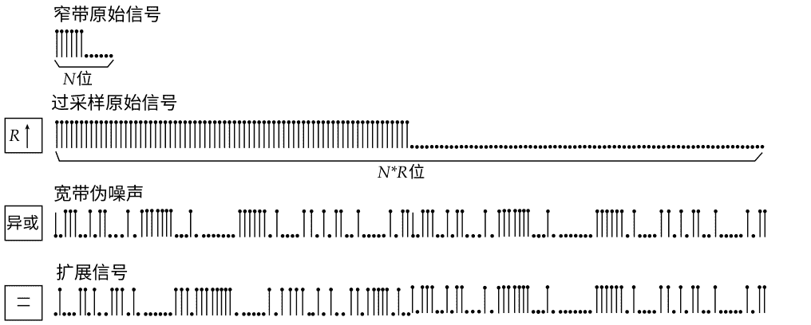
图19.1: DSSS中的扩频（由Roche和Dugelay提供）

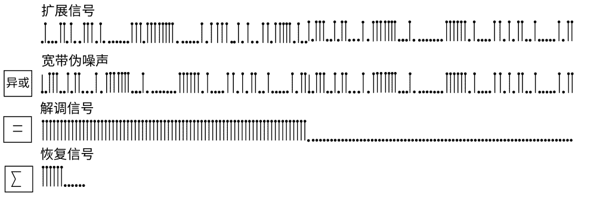
图19.2: DSSS中的解扩（由Roche和Dugelay提供）

关于DSSS有大量的文献，这些技术现在已经被商业界采用，作为各种移动无线电和电话系统中的码分多址 (CDMA)。特别是第三代移动电话依赖于CDMA来提高性能。

DSSS有时被称为“加密射频”，有多种变体。例如，当底层调制方案是FM而不是AM时，它被称为啁啾。关于底层数学和技术的经典介绍是[1026]；由于各种原因，工程复杂性比频率跳跃更高。例如，同步是特别关键的。一种策略是让用户轮流提供参考信号。如果用户可以访问参考时间信号（如GPS或原子钟），您可以依赖于此；但是，如果您无法控制GPS，您可能会受到同步攻击的威胁，即使您可以控制GPS，GPS信号也可能被干扰。据报道，2000年法国在希腊干扰了GPS，试图破坏英国向希腊政府出售250辆坦克的交易，而法国是竞争对手。这导致英国坦克在试验中迷路。当这个计谋被发现时，希腊人觉得这一切很有趣[1269]。现在GPS干扰器已经成为商品，我将在下面更详细地讨论它们。

#### 19.3.3.3 爆发通信

- 爆发通信，顾名思义，涉及将数据压缩并以敌人难以预测的短暂爆发方式传输。
- 它们也被称为时间跳跃。
- 它们通常不太抗干扰（除非更高的数据速率扩展了频谱），但比DSSS更难检测；如果占空比低，扫频接收机很容易错过它们。
- 它们经常用于特种部队和情报人员的无线电中。

真正高级的窃听器通常使用爆发技术。

一种有趣的变体是流星爆发传输（也称为流星散射）。这依赖于每天撞击地球大气层的数十亿颗微米陨石，每颗陨石都留下一个持续大约三分之一秒的长离子化轨迹，为母站和大约百英里长、几英里宽的区域之间提供临时传输路径。母站持续传输；每当一个子站在这样的区域内时，它听到母站并开始以高速发送数据包，母站回复。在秘密行动中使用的低功率水平下，平均数据速率约为 50 bps，平均延迟约为 5 分钟，范围为 500-1500 英里。在更高的功率水平和更高的纬度下，平均数据速率可以达到几十千比特每秒。

除了特种部队外，美国空军在阿拉斯加还使用流星散射作为备份通信，用于预警雷达。它也被用于民用应用，比如在第三世界偏远地区监测降雨。在低比特率和高延迟可以被容忍的利基市场上，流星散射可能很难被超越，但设备的尺寸和成本非常重要。该技术在[1120]中有详细描述。

#### 19.3.3.4 结合隐蔽性和干扰抵抗

不同的低概率侦察 (LPI)、低概率拦截 (LPPF) 和干扰抵抗特性之间存在一些相当复杂的权衡，以及与衰落和多径、以及同时容纳的用户数量等性能方面的其他因素。它们在面对专门的干扰技术时也会表现出不同的行为，比如扫频干扰（干扰者反复扫过目标频带）和跟踪干扰。某些类型的干扰可以在不同模式之间转换：例如，一个功率不足以完全阻塞信号的对手可以通过发射覆盖其利用频谱一部分的脉冲，在DSSS上进行部分时间干扰，或者通过部分频带干扰对频率跳变进行干扰。

还存在工程权衡。例如，从功率角度来看，直接序列扩频比频率跳变大约高效两倍，但是频率跳变在给定设备复杂度的情况下提供了更大的干扰余量。另一方面，使用直接序列扩频信号更难以使用定向导向技术进行定位[461]。

系统的生存能力要求可能会施加进一步的限制。防止一个已经捕获了一台无线电并提取了其当前密钥材料的对手使用它来干扰整个网络可能是至关重要的。

因此，典型的现代军事系统将使用一些紧密组合的窄波束、直接序列扩频、跳频和突发传输。

- 英国武装部队使用的 Jaguar 战术无线电在九个 6.4 MHz 频段中跳频，并且还具有一个可指向干扰器或敌对拦截站的可定向空洞天线。
- DSSS和跳频都与TDMA一起用于联合战术信息分发系统 (JTIDS) ——一种由AWACS用于与战斗机通信的美国数据链系统[1121]。TDMA将传输与接收分离，并让用户知道何时可以期望到达他们的时隙。它具有 57.6 KHz 数据速率和 10 MHz 码片速率的 DSSS 信号（因此具有 36.5 dB 的干扰余量），在 255 MHz 频段内跳频，最小跳跃为 30 MHz。跳频码可供所有用户使用，而扩频码仅限于个别电路。其理由是，如果设备被捕获导致扩频码泄露，这将只允许对单个 10MHz 频段进行干扰，而不是对整个 255 MHz 频段进行干扰。
- MILSTAR 是一个美国的卫星通信系统，具有 1 度的波束从地球同步轨道上发射（下行 20 GHz，上行 44 GHz）。窄波束的效果是用户可以在离敌人三英里的范围内操作而不被发现。干扰保护来自跳频：它的信道在 2 GHz 的频带中每秒跳动数千次。
- MX导弹控制系统的设计在[530]中有描述，并提供了一个极端生存能力工程的例子。为了能够经受住核打击，该系统必须经受住节点破坏、干扰和大气噪声的严重程度。采用的设计是一个 450 KHz 的频率跳频器，具有动态可重构网络。最终没有部署。
- 法国战术无线电具有遥控功能。士兵可以在离无线电一百码的范围内使用手持机。这意味着对高功率发射器的攻击不必那么危及部队 [348] 。

还有一些系统级的技巧，比如干扰消除——这里的想法是在你正在干扰的频段上进行通信，并且你自己的无线电已知干扰波形，因此它们可以将其消除或者绕过。这可以通过迫使敌人将可用功率分散到更大的带宽上来使干扰变得更加困难，并且也可以使信号情报变得更加困难[1074]。

### 19.3.4 民用和军用之间的互动

通信的民用和军用用途日益交织在一起。在沙漠风暴行动（对伊拉克的第一次海湾战争）中，广泛利用了海湾国家的民用基础设施：在短时间内建立了一个庞大的战术通信网络，使用卫星、无线电链路和租用线路，并且来自美国各个军种的专家称通信能力对战争的影响是绝对决定性的[634]。可以预料到，军事和亚国家组织都会攻击民用基础设施以剥夺对手的使用权。正如我所指出的，卫星链路已经容易受到上行干扰的影响。

另一个增长相互依赖性的例子是全球定位系统（GPS）。它最初是美国军事导航系统，具有选择性可用性功能，除非用户拥有相关的加密密钥，否则精度限制在大约一百码。在沙漠风暴期间，由于军用GPS设备不足，不得不关闭此功能，并使用民用设备代替。随着时间的推移，GPS被证明非常有用，特别是在民航领域，因此美国联邦航空局帮助找到了打败选择性可用性的方法，使其精度达到约 3 码而标准军用接收器声称的精度为 8 码[431]。最后，在2000年5月，克林顿总统宣布结束选择性可用性。一些人尝试干扰GPS，结果发现并不那么困难，并且对过度依赖GPS所带来的系统性漏洞进行了一些讨论[490]。

美国政府仍然保留关闭GPS或引入错误的权利，例如如果认为恐怖分子在使用它。但是现在许多不同的系统都依赖于GPS，并且其中许多系统都有动机的对手；一些国家开始使用GPS进行道路定价，或者通过电子脚环来执行假释条件。

因此，GPS干扰器在2007年的汽车杂志上以700美元的价格出现；随着卡车司机试图欺骗道路收费系统和汽车司机试图击败按里程计费的保险计划，价格肯定会下降。一旦它们的使用变得普遍，对其他GPS用户的影响可能会令人震惊。也许解决方案在于多样性：俄罗斯拥有一个独立的导航卫星系统，欧洲正在考虑建立一个。无论如何，导航信号的安全性正在成为一个研究课题[751]。

民用基础设施还提供了一些防御系统，供政府组织（特别是情报领域）使用。我提到了预付费手机，它提供了相当程度的匿名性；安全的Web服务器提供了一些可能性；另一个例子是匿名转发器——一种接受加密电子邮件、解密并将其发送到外部加密信封中包含的目的地的设备。由美国海军开创的Tor网络为网页提供了类似的功能，通过一组代理服务器提供了一种低延迟的浏览网页的方式。我将在第23.4.2节中更详细地讨论这项技术；海军将其提供给互联网上的每个人，以产生大量的伪装流量来隐藏自己的通信[1062]。事实上，许多未来的军事应用可能会使用互联网，这将引发许多有趣的问题——从攻击敌对或中立国家的信息基础设施的伦理问题，到如何将各种类型的军事流量隐藏在民用数据包和比特流中的细节。

确实可能存在一些收敛。尽管网络上的通信安全在很大程度上被解释为消息的保密性和身份验证，但未来可能更像军事通信，干扰、服务拒绝、匿名和欺骗将变得越来越重要。我稍后会回到这个主题。

接下来，让我们看看与目标获取和武器引导有关的电子战方面，因为这些是干扰和欺骗艺术最为发达的地方。（实际上，尽管在将电子攻击和防御应用于雷达和通信方面，公开文献中有很多内容，但很多相同的材料都适用于两者。）

## 19.4 监视和目标获取

尽管一些传感器系统使用被动定位，但主要用于检测敌对目标和引导武器的方法是声纳、雷达和红外线。最早开发的是声纳，它是在第一次世界大战中发明和部署的（以“Asdic”为名）[574]。除了在潜艇战中，关键的传感器是雷达。尽管雷达是在1904年作为一种海上防撞装置发明的，但它的严肃发展只发生在20世纪30年代，并且被所有主要参与者在第二次世界大战中使用[578, 670]。

为此开发的电子攻击和保护技术往往比使用其他传感器的系统更为成熟。在雷达的背景下，“电子攻击”通常指干扰（尽管在理论上也包括隐身技术），而“电子保护”则指用于至少保留一些雷达功能的技术。

### 19.4.1 雷达的类型

目前使用了各种各样的系统，包括搜索雷达、火控雷达、地形跟随雷达、反炮击雷达和天气雷达。它们具有各种信号特征。例如，具有低射频和低脉冲重复频率（PRF）的雷达对搜索更为适用，而高频率、高 PRF 的设备对跟踪更为适用。关于这项技术的一本好教材是 Schleher 的 [1121]。

用于搜索应用的简单雷达设计可能具有一个旋转的天线，发射一系列脉冲并检测回波。这是在数字电子技术出现之前实现雷达的一种简单方法；显示管中的扫描可以与天线同步机械旋转。火控雷达通常使用圆锥扫描：波束将在目标位置周围的圆圈中跟踪，并且回波的幅度可以直接驱动定位伺服系统（和武器控制）。现在，波束通常通过多个天线元件电子生成，但跟踪环路仍然是核心。许多雷达具有距离门，该电路专注于距离天线一定范围内的目标；如果雷达必须跟踪从零到100英里之间的所有物体，那么其脉冲重复频率将受到无线电波传播200英里所需的时间的限制。这将对角分辨率和跟踪性能产生影响。

多普勒雷达通过返回信号中的频率变化来测量目标的速度。在区分移动目标和来自地面的回波杂波时，它非常重要。多普勒雷达可能具有限制关注天线相对于目标的径向速度在一定范围内的目标的速度门。

### 19.4.2 干扰技术

电子攻击技术可以是被动的或主动的。

最早广泛使用的对抗措施是箔条，它是被切割成目标信号波长一半的薄导电箔，并分散以提供虚假回波。第二次世界大战结束时，盟军飞机每天投放2000吨箔条以削弱德国的防空能力。箔条可以由试图突破防御的飞机直接投放（这并不理想，因为它们将处于一个拉长信号的顶点），或者由支援飞机投放，或者使用火箭或炮弹向前发射适当的模式。对抗箔条的主要对抗措施是使用多普勒雷达；由于箔条非常轻，它几乎立即停止运动，并且可以很容易地与移动目标区分开来。

其他的诱饵技术包括使用主动中继器重新传输雷达信号的小型诱饵和仅仅反射雷达信号的大型诱饵；有时候一个车辆（比如直升机）作为另一个更有价值的车辆（比如航空母舰）的诱饵。这些原则非常普遍。使用 RDF 追踪目标的武器会被发射特殊无人机发送诱惑性射频信号的诱饵所欺骗，而红外制导导弹则会被使用烟雾弹进行偏离。

被投入最多资金的被动对抗措施是隐身技术——减小车辆的雷达截面积（RCS），使其只能在非常短的距离内被探测到。这意味着，例如，敌人必须将他的防空雷达放置得更加紧密，因此他必须购买更多的雷达。隐身技术包括广泛的技术范围，适当的讨论超出了本书的范围。有些人认为它是“非常昂贵的黑漆”，但实际上它比这更复杂；由于飞机的雷达截面积通常是其方位角的函数，它可能具有一个连续展示低雷达截面积方位角的飞控系统，以识别敌对发射源。

主动对策更加多样化。早期的干扰器只是在目标雷达使用的频率范围内产生大量噪音；这种技术被称为噪音干扰或弹幕干扰。一些系统使用系统化的频率模式，例如脉冲干扰器或扫频干扰器，它们遍历感兴趣的频率范围（也被称为扫频振荡器）。

但是这种信号相当容易被屏蔽——一个技巧是使用一个邻近频率上的守护带接收器，并在该接收器显示干扰信号时屏蔽信号。还应该注意到，干扰不仅限于一方；除了雷达的对手使用干扰，雷达本身也可以从辅助天线发送合适的虚假信号来掩盖真实信号或简单地过载防御系统。

在另一端的是硬杀伤技术，例如反辐射导弹（ARMs），通常由支援飞机发射，它们追踪源头。敌对信号。对抗这种武器的防御措施包括使用诱饵发射器，并将发射器闪烁切换。

中间有一个大型的欺骗干扰技术工具包。用于自我保护的大多数干扰器都是某种形式的欺骗干扰器；弹幕和ARM技术更适合支援车辆使用。

自我保护干扰器的常见目标是阻止攻击者获得距离和方位信息。基本的技巧是反增益干扰或反增益幅度调制。这是基于这样的观察：攻击者的天线方向性通常不完美；除了主波束外，它还有旁瓣波束通过这些波束也传输和接收能量，尽管效率要低得多。通过观察发射信号可以绘制旁瓣响应图，然后生成干扰信号，使得净发射信号与天线的方向响应相反。对于攻击者的雷达来说，效果是信号似乎来自各个方向；而不是雷达屏幕上的一个“点”，你会看到一个以自己的天线为中心的圆。反增益干扰对于旧的圆锥扫描火控系统非常有效。

更一般地，该技术是通过延迟和/或频率的系统性变化来重新传输雷达信号。这可以是非相干的，在这种情况下，干扰器被称为转发器，或者是相干的——也就是说，具有正确波形的时候，它是一个中继器。（现在通常将接收到的波形存储在数字射频存储器（DRFM）中，并使用信号处理芯片进行处理。）

一个基本的对策是烧穿。通过降低脉冲重复频率，增加停留时间，从而使返回信号更强——但代价是精度降低。一种更复杂的对策是距离门拉开（RGPO）。在这种情况下，干扰器发送一些比真实脉冲更强的假脉冲，从而捕获接收器，然后将它们移出相位，使目标不再在接收器的距离门范围内。类似地，对于多普勒雷达，基本技巧是速度门拉开（VGPO）。对于旧雷达，成功的RGPO会导致雷达失去锁定并且目标从屏幕上消失。现代雷达可以非常快速地重新获得锁定，因此RGPO要么必须重复执行，要么与另一种技术结合使用——通常是与反增益干扰同时破坏角度跟踪。

一个基本的反对措施是使脉冲重复频率抖动。每个发出的脉冲要么延迟要么不延迟，这取决于由流密码或随机数生成器生成的滞后序列。这意味着干扰器无法预测下一个脉冲何时到达并且必须跟随它。这种跟随干扰只能产生看起来更远的虚假目标。因此，反对反对措施，或者(反对)³-措施，是雷达具有一个前沿跟踪器，它只响应第一个返回脉冲；而(反对)⁴-措施可以包括干扰，使干扰器功率很高，以至于接收机的自动增益控制电路被捕获。另一种选择是覆盖干扰，其中干扰脉冲足够长，以覆盖最大的抖动周期。

下一个扭曲的手段可能涉及战术。箔条通常用于迫使雷达进入多普勒模式，这使得脉冲重复频率抖动困难（因为连续波形比脉冲波形更好用于多普勒），而前沿跟踪器可以与频率灵活性和智能信号处理相结合。例如，真实目标返回波动，并具有真实的加速度，而简单的转发器和中继器则发出一个或多或少稳定的信号。当然，设计师总是有可能过于聪明；米格-29可以通过快速拉升在水平飞行中比一些雷达设计师预期的更快减速，所以飞行员可以利用这个动作来打破雷达锁定。

现在，CPU的性能足够强大，可以制造逼真的虚假返回。

### 19.4.3 高级雷达和对抗措施

使用了许多先进技术，以在干扰器上获得优势。

脉冲压缩最早在二战时期由德国开发，使用了一种直接序列扩频脉冲，并通过匹配滤波器对返回信号进行压缩。这可以提供10-1000倍的处理增益。脉冲压缩雷达对应答器干扰器具有抵抗力，但对于带有数字射频存储器的中继器干扰器来说是脆弱的。

然而，如果你不希望目标在你之前察觉到你，使用LPI（低拦截概率）波形是很重要的。

脉冲多普勒与多普勒雷达非常相似，发送一系列相位稳定的脉冲。它已经在许多高端市场占据主导地位，并被广泛用于对抗低空入侵者的下视射击系统。与基本脉冲跟踪雷达一样，不同的射频和脉冲重复频率会产生不同的特性：我们希望低频/PRF用于无歧义的距离/速度测量，并减少杂波，但这可能会导致许多盲区。需要应对许多威胁的机载雷达使用高PRF，并且只关注某个阈值以上的速度，比如100节，但在尾追方面较弱。通常的折衷方案是中等PRF，但在机载操作中会产生严重的距离模糊。此外，搜索雷达需要长时间、多样化的脉冲，但跟踪只需要短时间、调谐的脉冲。脉冲多普勒的一个优势是可以区分一些非常特定的信号，比如喷气发动机中涡轮叶片提供的调制信号。针对脉冲多普勒使用的主要欺骗策略是速度门拉开，尽管还有一种新的变种是通过欺骗性返回激发多个速度门。

单脉冲正成为最流行的技术之一。例如，在福克兰战争中，它被用于Exocet导弹中，这些导弹被证明很难被干扰。这个想法是有四个链接的天线，这样可以使用干涉技术从每个回波中计算方位角和仰角数据。单脉冲雷达很难被昂贵地干扰，除非可以利用设计缺陷；通常的技术包括一些诡计，如编队干扰和地形反弹。通常，首选的防御策略就是使用拖曳诱饵。

最近的一个技巧是被动相干定位。洛克希德的“无声哨兵”系统根本没有发射器，而是利用商业无线电和电视广播信号的反射来检测和跟踪空中物体 [807]，英国的“Celldar”项目旨在利用移动电话基站的信号来实现相同的目的 [246]。由于接收器是被动的，很难定位和攻击；摧毁该系统意味着破坏重要的民用基础设施，对手通常不愿出于法律和宣传原因这样做。被动相干定位对一些隐身技术有效，特别是那些需要调整飞机以使其雷达截面对可见发射器呈现零点的技术。

由于数字无线电频率存储器和其他软件无线电技术的到来，攻击和防御可能变得更加复杂。无论是雷达还是干扰波形，都可以根据战术情况进行更灵活的调整。但是，光谱、时间和空间特性的花式组合并不能完全解决问题。有效的电子攻击很可能继续需要不同被动和主动工具与武器和战术的有效协调。情报的重要性以及精心策划的欺骗计划可能会增加。

### 19.4.4 其他传感器和多传感器问题

我所说的大部分关于雷达的内容也适用于声纳，并且一定程度上适用于红外线。被动诱饵——烟雾弹——对早期使用机械旋转探测器的热导导弹非常有效，但对于现代集成信号处理的探测器来说效果较差。烟雾弹和箔条类似，它们相对于目标的减速非常快，因此攻击者可以根据速度或加速度进行过滤。它们也像中继干扰器一样，它们的信号相对稳定且强于真实目标。

主动红外干扰比雷达干扰更困难，因此更少见；它倾向于利用敌对传感器的特征，通过以一定的频率或模式脉冲来引起混乱。一些红外防御系统开始使用激光来禁用入侵武器的传感器；而且已经承认一些“不明飞行物”目击事件实际上是由各种干扰（包括雷达和红外）引起的 [119]。

一个增长领域是多传感器数据融合，通过将雷达、红外传感器、视频摄像头甚至人类的输入结合起来，可以提供比任何单独使用更好的目标识别和跟踪。例如，Rapier防空导弹使用雷达获取方位角，而在视觉条件下进行光学跟踪。

数据融合可能比看起来更困难。正如我在第15.9节中讨论的那样，将两个警报系统结合起来通常会改善误报率或漏报率之一，同时使另一个变得更糟。如果你在雷达或红外上看到一个信号时就派出你的战斗机，那么会有更多的误报；但如果你只在两者都看到时才派出战斗机，那么敌人更容易对你进行干扰或潜入。

当攻击者自身处于易受反击的平台上时，系统问题变得更加复杂，比如战斗轰炸机。他将拥有威胁识别、方向寻找和导弹接近警告等系统，而这些系统中的接收器将被他的干扰器所淹没。通常的诡计是在随机的短暂“窥视”期间关闭干扰器。

随着多个友方和敌方平台的存在，情况变得更加复杂。双方可能拥有专门的支援车辆，配备高功率专用设备，这在一定程度上成为一场能量之战——“拥有最多瓦特的人获胜”。一个地对空导弹系统可能拥有多个不同频率的雷达，以增加干扰的难度。干扰的总体效果（就像隐形技术一样）是降低雷达的有效范围。但干扰余量也很重要，以及谁拥有最多的车辆和采用的战术。

在多个参与的车辆中，还需要一种可靠的方法来区分友军和敌军。

## 19.5 IFF系统

识别友军或敌军 (IFF) 系统既至关重要又备受争议。在伊拉克发生了大量的“友军误伤”事件，原因是美国和盟军之间的装备不兼容。美国飞机轰炸英国士兵的事件对英国公众对战争的支持造成了重大影响，尤其是在两国当局试图掩盖此类事件以保护技术安全并尽量减少政治尴尬之后。

IFF在非技术形式上可以追溯到古代；例如，在第15章中引用了士师记12:5-6，以“Shibboleth”是否能正确发音来识别士兵。第二次世界大战证明了需要能够应对雷达的系统；钻石山的一名雷达操作员看到了朝珍珠港飞来的日本飞机，但却误以为是一群美国飞机。最初的措施是程序性的；返航的轰炸机应该在特定时间到达特定地点，而落后的飞机则会通过一些预先安排的动作来宣布它们没有敌意，比如飞行中在穿过海岸之前的等边三角形。（德国飞机在无线电操作员怀疑他们时会翻滚，从而在他们的雷达横截面上产生一个“blip”。）也有一些早期的自动化尝试，其中“Mark I”系统是机械调谐的，不太可用。也有早期的欺骗尝试。

朝鲜战争双方都出现了喷气式飞机和导弹，这使得目标的视觉识别变得不切实际，并且必须具备自动的IFF。早期的系统只是使用了车辆序列号或“当天的代码”，这很容易被欺骗，世界各国的空军开始研究密码身份验证。

自20世纪60年代以来，美国和其他北约国家的飞机一直使用Mark XII系统。这使用了两个带有DES前身的块密码的加密单元，并且可供非北约客户使用替代的块密码。

然而，加密并不是困难的部分，而是在第三章中讨论的协议问题。Mark XII有四种模式，其中安全模式使用32位挑战和4位响应。这是由其前身Mark X设定的先例，如果挑战或响应过长，雷达的脉冲重复频率（以及其准确性）将会降低。因此，出于雷达安全原因，需要使用短的挑战-响应对，出于加密安全原因，需要使用许多挑战-响应对。Mark XII以系列方式发送12-20个挑战，在原始实现中，响应结果会在屏幕上显示，位置偏移为实际响应和预期响应之间的算术差。这样一来，当敌人的响应为空或随机时，“朋友”的响应将在屏幕中心或附近亮起。反射攻击被阻止，中间人攻击变得更加困难，因为挑战使用的是聚焦天线，而接收器是全向的。（实际上，用于挑战的天线通常是火控雷达，在旧系统中是锥形扫描的。）

当两个中队（或海军舰队）相遇时，这种机制仍然不能完全阻止“ack战争”。与此同时，系统变得越来越复杂。有一个计划创建一个与现有的Mark X/XII系统向后兼容的NATO Mark XIIA，以及一个使用扩频波形的美国Mark XV。军用飞机中使用的系统还具有与飞机使用的民用系统兼容的模式，用于向二次监视雷达发送其ID的“squawk”。然而，这仅适用于空对空的IFF，而真正的问题现在是空对地。NATO的IFF系统是根据冷战时期的情景演变而来，当时每一方都有数千架战术飞机；它们在像伊拉克或阿富汗这样的现代冲突中表现如何？

从历史上看，约有10-15%的伤亡是由于“友军误伤”，但在第一次海湾战争中，这一比例上升到了25%。这样的伤亡更有可能发生在空地战和海陆之间的接口处。由于不同服务的做事方式不同，联合行动因此特别危险。由于不同国家的系统不同，联合行动也增加了风险。在此经验的基础上，开发了几个实验性系统，以扩展IFF到地面部队。一个美国系统结合了激光和射频组件。射手有激光，士兵有应答器；当士兵被适当的挑战照射时，他的设备会使用跳频无线电广播一个“不要射击我”的消息 [1372]。一种扩展允许飞机在毫米波无线电上广播目标意图。英国开始开发一种更便宜的系统，其中友方车辆携带一个LPI毫米波发射器，射手携带一个定向接收器 [599]。（与美国同行不同，英国步兵没有被认为值得保护。）一个原型系统在2001年准备好，但没有投入生产。其他国家开始开发其他系统。

但是当海湾战争2爆发时，没有什么像样的东西被部署。英国国家审计署2002年的一份报告描述了发生了什么错误 [930]。在一个不仅由国家购买防御装备，而且由这些服务内的派系购买防御装备的世界中，在立法者试图通过阻止与盟友的技术合作来向选民展示他们的“爱国主义”时，这是困难的。制度和政治结构并不利于提供防御的“公共产品”，比如一个能够在北约范围内工作的良好的IFF系统。而北约是一个广泛的联盟；正如一位内部人士告诉我，“试图找到一个既满足美国的期望，又满足希腊（例如）的期望的解决方案几乎是一项无望的任务。”项目的复杂性是一个问题：阻止你的空军飞机相互射击并不太难，但要阻止它们向你的舰艇或坦克射击就要复杂得多，而当涉及到数十个国家时就更加困难。

仍在寻求技术解决方案；例如，最新的美国软件无线电项目，联合战术无线电系统（JTRS，或称“jitters”），可能最终为所有服务提供互操作的无线电，并至少具备两种IFF模式。然而，它已经晚了，超出了预算，并且分散成由不同服务管理的子项目。在伊拉克，一些部队使用的一些先进系统让所有士兵能够实时在头盔上的显示器上看到彼此的位置。它们极大地增加了移动战争中的力量能力，使得部队能够执行危险的机动，比如穿越彼此的杀伤区，但在伊拉克等复杂战争中并非万能解决方案：在那里，关键的网络是社交网络，而不是电子网络，很难自动化具有未知可信度的节点的网络 [1116]。

无论如何，迄今为止的经验告诉我们，即使有像船只和飞机相互识别的“硬核”IFF，最困难的问题也与经济、政治和教义有关。在北约内部长达十多年的争论中，美国希望一个昂贵的高科技系统，其国防工业正在大力游说，而欧洲国家希望一个更简单、更便宜的系统，他们也可以自己建造，例如通过正常的指挥和控制系统跟踪部队，并在国家之间建立良好的接口。但是美国出于“安全”原因拒绝向任何其他国家透露其部队的位置。美国在国防方面的支出超过了其盟友的总和，并且相信它应该发挥领导作用；而盟友们不希望自己的能力进一步边缘化，过度依赖美国供应商。

这加剧了基本的教义紧张局势。美国的教义，即唐纳德·拉姆斯菲尔德提倡的所谓“军事事务革命”（RMA），基于一个电子系统，不仅超出了盟友们的预算，而且不被信任，因为它基于通过庞大的物质和技术优势来最小化自己的伤亡人数。欧洲人认为，我们不应该自动对付来自村庄的狙击手火力，因为除了杀死十名叛乱分子外，还会杀死一百名平民，并招募他们的几百名亲属加入圣战。美国对此的反驳是，欧洲太弱和分裂，甚至无法应对波斯尼亚的种族灭绝。结果陷入僵局；各国决定寻求国家解决方案，而在二十年间没有取得真正的互操作性进展。在伊拉克和阿富汗的盟军部队只能在车顶上涂上大块彩色标记，希望空袭能够绕过他们。然而，美国飞机却照常轰炸并杀死了一些盟军人员，这削弱了联盟。也许从长远来看，我们会实现融合，因为欧洲国家试图赶上美国的军事系统，而美国军队则重新采用更传统的战斗模式，发现在与伊拉克基地组织作战中赢得当地部落盟友的优势。然而，要使融合的解决方案稳定下来，我们可能需要进行一些机构重组。

## 19.6 自制爆炸装置

在2004年至2007年期间，已经投入了大量的精力来对抗伊拉克和越来越多的阿富汗叛乱分子所使用的自制爆炸装置（IED）。自2003年3月美军首次遭受IED袭击以来，已经发生了81,000起袭击事件，仅2007年就有25,000起。这些炸弹已经成为伊拉克战争的“标志性武器”，就像机枪是第一次世界大战的标志性武器，激光制导炸弹是海湾战争一样。（现在，无人机由爱好者用约1000美元的价格制造，使用模型飞机零件、GPS接收器和乐高Mindstorms机器人套件，我们甚至可能看到自制巡航导弹。）

总之，已经制造并运送给联军的干扰器超过33,000个。国防部在2006年花费了超过10亿美元进行了这项行动，根据内部人士的说法，这是“国防部在战争中面临的最大技术挑战，规模上一直没有过的，只有第二次世界大战才有过” [94]。五角大楼的联合IED打击组织的整体预算到2006年底据称接近40亿美元。从2006年初到2007年底，由无线电遥控的IED的比例从最高70%下降到10%；由命令线触发的比例增加到40%。

自1605年盖伊·福克斯试图炸毁英国议会大厦以来，叛乱分子一直在制造炸弹。许多其他民族主义和叛乱组织使用了简易爆炸装置，从无政府主义者到二战期间的俄罗斯抵抗运动，再到伊尔古恩组织、巴斯克祖国与自由组织和越南民族解放阵线。

爱尔兰共和军在排水沟和水渠中隐藏简易爆炸装置的技术如此高超，以至于英国军队不得不使用直升机而不是陆路车辆在爱尔兰边境附近的“盗匪地区”进行行动。他们还在20世纪多次对英国进行了爆炸袭击。在这些袭击中，从1970年到1994年，他们在布莱顿的格兰德酒店引爆炸弹，当时玛格丽特·撒切尔在那里参加党派大会，造成了她的几位同事的死亡；之后，伦敦发生了两起爆炸事件，爱尔兰共和军引爆了装满自制炸药的卡车，造成广泛破坏。对抗爱尔兰共和军的斗争中使用了7000枚简易爆炸装置，这使得英国国防科学家在干扰技术方面积累了丰富经验：在VIP车辆上安装了干扰器，可以使简易爆炸装置提前或延迟引爆。这些干扰器也提供给了盟友；在2005年，这样的干扰器拯救了巴基斯坦总统穆沙拉夫的生命，当时基地组织试图摧毁他的车队。

伊拉克的电子环境比贝尔法斯特或西北边境要困难得多。炸弹袭击者可以使用任何可以在远处切换开关的设备，从钥匙链到手机都有。与此同时，伊拉克的射频环境变得复杂而混乱。数百万伊拉克人使用未受监管的手机、对讲机和卫星电话，因为大部分光纤和铜基础设施在2003年的战争中被摧毁或之后被抢劫。15万联军部队也发出了各种各样的无线电信号，随着部队的轮换，这些信号不断变化。使用了超过80,000个无线电频率，并使用了300个数据库进行监控，其中许多数据库之间无法交互操作。只有在数百名海军电子战专家部署在巴格达后，联军才开始解决这个问题；在那之后，联军的干扰行动得到了更好的协调，并开始减少通过无线电引爆的简易爆炸装置的比例。

但是电子战中的“成功”并没有导致盟军伤亡的减少。制造IED的人只是从无线电控制的炸弹转向了压力板、指令线、被动红外或志愿者引爆的装置。现在的重点正在转向一种策略的混合：像更好的车辆装甲这样的“爆炸之后”措施，以及像破坏炸弹制造网络这样的“爆炸之前”措施，比如破坏炸弹制造网络（英国和以色列多年来一直以爱尔兰和黎巴嫩为目标）。至少更好的装甲正在产生一些效果：2003年几乎每个IED都造成了联军伤亡，现在平均需要四个装置 [94]。装甲车辆也是其他叛乱中的关键策略。然而，网络干扰是一种长期的策略，它在很大程度上取决于建立良好的人类情报来源。

## 19.7 定向能武器

在20世纪30年代末，有传言称纳粹德国发展了一种高功率无线电波束，可以烧毁车辆点火系统。英国科学家研究了这个问题，并得出结论认为这是不可行的 [670]。他们是正确的——考虑到相对低功率的无线电发射机和20世纪30年代的简单但坚固的车辆电子设备。

随着原子弹的出现，情况开始发生变化。核装置的爆炸会产生大量的伽马射线光子，通过康普顿散射从空气分子中排斥电子。大的感应电流产生了电磁脉冲 (EMP)，可以被认为具有非常短上升时间的高幅度无线电波脉冲。

当核爆炸发生在地球大气层内时，EMP能量主要集中在VHF和UHF频段，尽管在较低频率上也有足够的能量使得无线电闪光可以在数千英里之外被观察到。在距离爆炸点几十英里的范围内，无线电频率能量可能引起足够大的感应电流，从而损坏大多数未经硬化的电子设备。在地球大气层外爆炸的影响被认为更加严重（尽管从未进行过测试）。伽马光子可以在击中地球大气层之前行程数千英里，这可能使其电离形成一个大陆尺度的天线。据估计，北欧地区的大多数电子设备可能会在北海上方250英里高度的一次百万吨级爆炸中被烧毁。因此，关键的军事系统都经过了精心屏蔽。

苏联在80年代中期开始研究非核电磁脉冲武器后，西方对EMP的担忧日益增长。当时，美国正在欧洲部署“中子弹”——能够杀死人而不破坏建筑物的增强辐射武器。苏联将此称为“资本主义炸弹”，声称它能够摧毁人类而保留财产完好，并威胁要使用“社会主义炸弹”来摧毁电子设备而保留周围的人类。

到第二次世界大战结束时，腔体磁控管的发明使得建造足够强大以破坏无保护的雷达成为可能。

在几百码的范围内对电子电路进行干扰。从真空管到晶体管和集成电路的转变增加了大多数商用电子设备的脆弱性。理论上，恐怖组织可以在卡车上安装雷达，并在城市的金融区域四处行驶，摧毁银行。

事实上，银行的地下服务器农场可能不受影响；真正的损害将会对日常电子设备造成。例如，一些电子车钥匙对射频非常敏感，如果放在手机旁边可能会被破坏 [1073]。更换一个城市所依赖的数百万个设备将会非常繁琐。

对于战场使用，如果武器可以内置到标准炸弹或炮弹的外壳中，而不是需要装载到卡车上，那将非常有用。据说苏联曾经制造过高能射频（HERF）设备，而美国则以自己的武器库作出了回应：一种名为“吹火炬”的设备曾在伊拉克试用，用于炸毁简易爆炸装置中的电子设备，但效果不佳 [94]。在 [737] 中有一份关于可用技术的调查，描述了如何使用爆炸泵浦磁流压缩发生器、磁流体力学设备以及传统的高功率微波设备来产生太瓦级的功率脉冲。

到了1990年代中期，对恐怖分子可能从前苏联获得这些武器的担忧促使各机构试图向商业和工业界推销电磁屏蔽的想法。这些努力被认为是夸大其词。就个人而言，我倾向于同意。物理学表明，电磁脉冲受空气的介电强度和天线的截面积的限制。

在核电磁脉冲中，对于大气内爆炸，有效的天线尺寸可能为几百米，而对于大气外爆炸，可能高达数千公里。但在“普通”的电磁脉冲/高能射频中，天线通常只有几米。根据引用的论文，电磁脉冲弹需要从飞机上投放并在爆炸前部署天线，以获得良好的耦合，即使如此，对于普通电子设备来说，其致命半径也只有几百米。北约规划者得出结论，已经针对核电磁脉冲进行了强化的军事指挥和控制系统不应受到影响。

至于恐怖分子而言，我在本书的第一版中写道：“至于民用基础设施，我怀疑恐怖分子可以用一吨化肥和燃油制造一个老式卡车炸弹，而他不需要物理学博士学位来设计一个！”那是在9/11事件发生几个月前发表的。当然，波音767比卡车炸弹造成的破坏更大，但卡车炸弹仍然造成了很大的破坏，正如我们在伊拉克经常看到的那样，甚至是基地组织在2005年伦敦使用的小型简易爆炸装置也足以杀死足够多的人以产生严重的政治影响。此外，对恐怖行为心理学的研究支持这样的观点，即致命袭击几乎无论经济损失如何都比非致命袭击更加可怕。所造成的破坏（我将在第三部分回来讨论这个问题）。因此，我预计恐怖分子将继续更喜欢一车装满化肥而不是一车装满磁控管的情况。

仍然存在一个严重的问题：一次在250英里高度爆炸的核电磁脉冲将造成巨大的经济损失，但直接杀死的人很少 [80]。这给了伊朗和朝鲜等有核野心但技术落后的国家一个勒索武器。朝鲜最近向日本附近的海域发射了一枚导弹，这与他们的核试验一起发出了一个明确的信号：“我们可以随时关闭你们的经济，而且不会直接杀死一个日本平民。”日本会如何回应？（他们正在匆忙测试反导系统。）那么，如果金正日将一枚导弹安装在一艘船上，驶向巴拿马运河，并在美国中部250英里的高空发射核弹，美国会怎么做？这可能会使整个海岸的计算机和通信瘫痪。对于依赖电子通信的国家，如美国和日本，电子通信的大规模攻击相对于不依赖电子通信的国家，如朝鲜（或伊朗），更具威胁性。

这个观察结果也适用于对互联网的攻击，所以现在让我们转向“信息战”。

## 19.8 信息战

从大约1995年开始，短语“信息战”开始广泛使用。它的流行程度得到了在沙漠风暴中的作战经验的提升。在那里，空中力量被用来削弱伊拉克的防御，然后进行地面攻击，而支持盟军的NSA人员的一个目标是使最初的攻击能够在没有伤亡的情况下进行，尽管当时伊拉克的防空系统仍然完好并保持警惕。这次攻击涉及到了诸如干扰器和反辐射导弹等标准电子战技术的混合使用；对指挥中心进行巡航导弹攻击；特种部队潜入伊拉克并从沙漠中挖出通信电缆；以及据称使用黑客技巧来禁用计算机和电话交换机。（到1990年，美国军队已经开始招标生产病毒 [825]。）该行动成功地实现了在空袭的第一夜确保零盟军伤亡的任务。军事规划者和智囊团开始考虑如何在此基础上取得成功。在9/11事件之后，信息战在一定程度上被安全-工业复合体所遮蔽，他们的关注点从机场安检转向了自制爆炸装置的检测。但在2007年4月，爱沙尼亚的事件使信息战再次成为议程的焦点。在那里，政府通过移动一座旧的苏联战争纪念碑激怒了俄罗斯，不久之后，该国遭受了一系列分布式拒绝服务攻击。

源自俄罗斯 [359]。爱沙尼亚的计算机应急响应团队以冷静的专业精神解决了这个问题，但他们的国家领导层没有。他们的惊慌反应成为了世界头条新闻 [413]；他们甚至考虑激活北约条约并呼吁美国军方对抗俄罗斯。幸运的是，理智最终战胜了。似乎这些数据包风暴只是由俄罗斯的僵尸网络操纵者发起的，他们通过聊天室相互煽动，而不是国家侵略行为；袭击事件中唯一被判有罪的人是爱沙尼亚的一个俄罗斯少年。以色列和巴勒斯坦黑客之间也发生过类似的争斗，印度人和巴基斯坦人之间也有。爱沙尼亚还发生了一些由粗鲁的俄罗斯族群反对拆除雕像引起的小规模街头骚乱；“网络战争 1”似乎是数字等价物。然而，此后有新闻报道称中国对美国和英国的政府系统发起了攻击，包括服务拒绝攻击和入侵尝试，造成“轻微行政中断” [973]。国防内部人士泄露报告称中国拥有大规模攻击西方的能力 [1063]。这是严重的，还是只是机构为了更多资金而摇动罐子？

但是信息战到底是什么呢？关于定义几乎没有一致意见。传统观点源自沙漠风暴，由 Waltz [1314] 提出：

> 战略家...应该在常规攻击和行动之前使用（信息武器）作为先导武器来使敌人失明。

与此同时，更激进的观点是，正确进行的信息行动应该包括从信号情报到宣传的一切，并且考虑到现代社会对信息的依赖，它应该足以在不战斗的情况下打破敌人的意志。

### 19.8.1 定义

事实上，关于信息战的含义大致有三种观点：

- 它只是“机构几十年来一直在做的事情的重新包装”，旨在维持机构在冷战后的预算；
- 它包括广义上的“黑客攻击”的使用——网络攻击工具、计算机病毒等等——在国家或亚国家团体之间的冲突中，为了否定关键的军事和其他服务，无论是出于作战还是宣传目的。例如，有人观察到互联网被设计成可以承受热核轰炸，但被莫里斯蠕虫击垮；
- 它扩展了控制电磁频谱以控制与冲突相关的所有信息的电子战学说。

因此，它扩展了传统的电子战技术，如雷达干扰器，同时还融入了各种黑客技术，但也包括了宣传和新闻管理。

第一个观点是一些愤世嫉俗的国防内部人士所持的观点。第二个观点是在报纸文章中和 Waltz 的观点中找到的普遍观点。这是我在本节中使用的指南，但不对其是否在技术上或教义上真正包含任何新内容表达立场。

第三个观点由 Dorothy Denning [370] 提出，她对信息战的定义是“以目标或利用信息媒体来获得对抗方的某种优势的行动”。它的解释非常广泛，不仅包括黑客行为，还包括所有的电子战和现有的情报收集技术（从信号情报到卫星图像到间谍），以及宣传。在后来的一篇文章中，她讨论了互联网在科索沃战争周围的宣传和活动主题中的作用 [371]。然而，她的书的大部分内容都是关于计算机安全和相关主题的。

一个类似的信息战观点，来自一个背景是防御规划而不是计算机安全的作家，由 Edward Waltz [1314] 提出。他将信息优势定义为“在利用或否认对手能力的同时，收集、处理和传播不间断的信息流的能力”。理论认为，这种优势将使得在没有有效对抗的情况下进行作战成为可能。这本书在计算机安全问题上的技术细节比 Denning 少，但提出了制定信息作战军事学说的首次尝试。

### 19.8.2 学说

当像 Denning 和 Waltz 这样的作家将宣传行动纳入信息战时，愤世嫉俗的国防内部人士会评论说没有什么改变。从罗马和蒙古试图宣传无敌神话，到第二次世界大战和冷战期间双方使用宣传广播电台，再到科索沃战役期间对塞尔维亚电视台的轰炸和俄罗斯机构对车臣网站的拒绝服务攻击 [320] ——工具可能会改变，游戏仍然是一样的。

但是有一个转折，也许要归功于政府和军事领导人对互联网的陌生。当十几岁的孩子们破坏美国政府部门的网站时，一位经验丰富的计算机安全专业人士很可能会将其视为在公共建筑墙壁上涂鸦。毕竟，这很容易做到，也很容易清除。但是信息战争社区可以将其描述为削弱一个国家必须展示以遏制侵略的信息主导地位。

因此，在政治和军事领导层开始清晰地思考这些问题之前，需要进行大量的揭露工作。例如，经常有人说信息战提供了一种无伤亡的赢得战争的方式：“只需黑掉伊朗的电网，看他们如何求和”。明显的三点评论如下：

- 到目前为止，在没有使用实际武力的情况下对信息系统进行的拒绝服务攻击大多只产生了暂时的影响。计算机崩溃了；操作员们找出发生了什么；他们从备份中恢复系统并重新启动。几个小时的中断可能足以让一架轰炸机安然通过，但不太可能使一个国家陷入困境。在这种情况下，千年虫未能造成预期的破坏可能是一个有用的警示。
- 只要存在漏洞，发达国家更容易受到影响。美国或英国的电网可能比发展中国家更加计算机化。
- 最后，如果这样的攻击导致数十人在医院死亡，伊朗人不太可能认为这与杀死同样数量的人的传统军事攻击有什么不同。实际上，如果信息战比其他方式更多地针对平民，那么攻击者的领导人很可能被描绘为战争罪犯。在皮诺切特案件中，一位前政府首脑仅因健康原因逃脱引渡，这应该引起人们的思考。

在这一部分的其余讨论中，我将限制在技术问题上。

### 19.8.3 电子战中的潜在有用经验教训

也许来自电子战领域最重要的政策教训是，进行涉及多个军种的行动看起来要困难得多。当陆军、海军和空军部队需要协调时，情况已经够糟糕了——在美国入侵格林纳达期间，一位地面指挥官不得不去公用电话亭，使用信用卡打电话回家，以便请求空袭，因为不同军种的无线电设备不兼容。（实际上，这就是软件无线电发展的动力 [761]。）当情报机构参与其中时，情况更糟，因为他们在和平时期不与作战人员一起训练，所以需要很长时间。

一旦战斗开始，变得高效率是很重要的。地盘争斗也会成为阻碍：根据当前的美国规定，空军可以决定轰炸敌方电话交换机，但必须得到国家安全局和/或中央情报局的许可才能对其进行黑客攻击 [103]。美国陆军的通信战略现在已经在考虑到了需要跨越传统指挥层级进行通信，并广泛利用现有的民用基础设施 [115]。

在技术层面上，有许多概念可以从电子战转移到一般的信息保护中：

- 电子战社区使用守卫频带接收器来检测干扰信号，以便可以将其滤除（例如，通过在扫频干扰器通过其频率时精确地关闭接收器）。检测垃圾邮件的诱饵地址的使用本质上是相同的概念。
- 病毒识别和雷达信号识别之间也存在类比关系。病毒编写者可能会使其代码具有多态性，即在传播过程中改变其形式，以使病毒扫描器供应商的工作更加困难；同样，雷达设计师使用非常多样的波形，以使在数字射频存储器中存储足够的波形进行一致性干扰变得更加困难。
- 我们的老朋友，误接受率和误拒绝率，继续主导战术和策略。就像防盗警报器或雷达干扰一样，引起许多虚假警报的能力（无论多么粗糙）总是有价值的：一旦虚假警报率超过15%，操作员的性能就会下降。至于过滤，通常可以作弊。
- 攻击和防御中的经济限制因素将越来越多地成为软件成本以及新工具的创建和部署速度。
- 当遭受干扰时，让干扰者不知道他的攻击是否成功或者如何成功是有用的。在军事通信中，对干扰的回应通常是降低比特率而不是增加功率；同样，当在您的网站上出现一个不存在的信用卡号码时，您可以说“对不起，卡号错误，请重试”，但第二次发生这种情况时，您需要另一种回应（否则攻击者将继续尝试）。类似于“对不起，您请求的商品暂时缺货，将在五个工作日内发货”可能会起到作用。
- 尽管深度防御通常是一个好主意，但你必须小心不同防御之间的相互作用。电子战中的经典案例是当干扰物被释放以防御来袭的巡航导弹时，击毁了防空炮。防御的副作用也可以被利用。网络上最常见的情况是邮件炸弹攻击者伪造了看似来自受害者的攻击性新闻组消息，然后对受害者进行了一系列的辱骂和攻击。
- 最后，可以从电子战中硬杀和软杀的不同角色中得出一些观点。干扰和其他软杀攻击更便宜，可以用于对抗多个威胁，并且具有较小的政治后果。但是损害评估很困难，你可能只是把武器转移到另一个目标上。由于大部分信息战都是软杀，这些评论也可以预料到会被广泛传播。

### 19.8.4 电子战与信息战的区别

除了相似之处外，传统电子战与潜在的网络攻击之间存在差异：

- 大致上有两种战争形式——公开战和游击战。电子战主要用于前者，如空战、大部分海战和沙漠战。在森林、山区和城市中，持有AK47的人仍然可以对抗机械化部队。游击战在电子战社区中基本上被忽视，除非他们制造和销售用于探测狙击手和隐藏的迫击炮的雷达。在网络空间中，“森林、山区和城市”指的是属于友好或中立平民和组织的大量不安全主机。分布式拒绝服务攻击是利用数百万台无辜机器进行操纵，并用来轰击目标网站的流量，这在电子战领域中没有真正的类似物。然而，它很可能成为发动攻击的平台，即使是对于“公开”目标，如大型商业网站。因此，在网络空间中，实际上并不清楚开放的乡村在哪里。
- 游击队的另一个可能的非对称优势来源是复杂性。大国拥有许多不兼容的系统，当与另一个同样不兼容的大国作战时，这几乎没有任何区别，但对于一个拥有简单一致系统的小团体来说，这可能使他们处于不利地位。
- 未来任何试图攻击美国的人都不太可能重复萨达姆·侯赛因在坦克战中挑战西方的错误。非对称冲突现在是常态，虽然网络空间在这方面有一些潜力，但实际攻击远比网络攻击更具影响力——无论是像基地组织那样的恶性攻击，还是像动物权利活动人士那样的低层次骚扰人们的攻击，他们的目标是骚扰而不是谋杀，并且始终保持在一个严重国家采取极端措施的门槛以下将会采取的反应。一个希望保持这个水平的团体——这样它的成员面临的是短期监禁而不是处决——如果同时使用物理和电子骚扰，可能会产生更大的影响。作为剑桥大学的治理机构之一，理事会，我在几个月内遭受了这种麻烦，因为动物权益狂热分子抗议我们心理学系建造新楼以容纳猴子的计划。我也目睹了骚扰对同事的影响。垃圾邮件泛滥很容易处理；当抗议者在深夜唤醒他们和他们的家人时，向他们的房顶扔石头并大声辱骂，人们会更加不安。我将在第三部分稍后讨论这个问题。
- 没有电子战的类似于脚本小子——那些下载攻击脚本并在不真正理解其工作原理的情况下启动它们的人。这样的工具在虚拟空间中是普遍可用且免费的，这在现实世界中几乎没有类似之处。你可以将其与阿富汗等国家的无法无天地区进行比较，在那里所有男人都携带武器。但俄罗斯脚本小子对爱沙尼亚造成的破坏与阿富汗部落对盟军造成的破坏相比微不足道——无论是在现在的阿富汗战争还是在其19世纪的前身中。

## 19.9 总结

电子战比大多数其他信息安全领域发展得更为成熟。从技术层面到战术层面再到规划和战略问题，有很多值得学习的经验教训。我们可以预期，如果信息战从一种时尚概念转变为确立的原则和实践，这些经验教训将对工程师们变得重要。

## 研究问题

一个有趣的研究问题是如何将电子战领域的技术和经验应用到互联网上。本章只是对可能的相似之处和差异的初步概述。

## 进一步阅读

关于雷达的一个很好（虽然非技术性的）介绍是由 P.S. Hall [578] 撰写的。关于电子战技术方面的最全面的参考资料，从雷达到隐身技术再到EMP武器，是由 Curtis Schleher [1121] 撰写的；Doug Richardson [1074] 写了一个很好的总结。关于扩频序列的抗干扰特性的经典介绍是由 Andrew Viterbi [1301] 撰写的；关于扩频技术的历史由 Robert Scholtz [1138] 生动地讲述；关于扩频技术的数学基础的经典介绍是由 Raymond Pickholtz、Donald Schilling 和 Lawrence Milstein [1026] 撰写的；而标准教材是由 Robert Dixon [393] 撰写的。关于通信干扰的最详尽参考资料是由 Richard Poisel [1029] 撰写的。一本关于英国电子战和科学情报的整体历史，由一位真正的内部人士撰写，不仅揭示了技术发展的过程，还深入了解了战略和战术欺骗，是由 R.V. Jones [670, 671] 撰写的。

## 第 20 章 电信系统安全

> 我很少需要采取技术攻击。公司可以花费数百万美元用于技术保护，但如果有人基本上可以通过电话联系某人，并说服他们在计算机上做一些降低计算机防御或揭示他们正在寻找的信息的事情，那么这些都是浪费。
> ——凯文·米特尼克

> 有两种愚蠢的人。一个人说，“这是旧的，所以它是好的。”另一个人说，“这是新的，所以它更好。”
> ——迪恩·威廉·英吉

### 20.1 引言

保护电信系统是一个重要的案例研究，有很多原因。首先，许多分布式系统以不明显的方式依赖固定或移动电话网络，而这些网络的可靠性正在下降。例如，POTS（普通电话系统）通常要求交换机备有备用发电机，足以在电力供应中断六周的情况下存活，而移动通信系统通常使用电池，最多可持续48小时。更糟糕的是，电力公司依赖移动电话来指导他们的工程师修复故障。当人们意识到这可能会导致停电持续超过两天的严重问题时，电力公司开始购买卫星电话作为备用。

其次，电信安全失败的历史非常有教益。早期的攻击是由爱好者（“电话破解者”）对电话公司进行的，目的是获取免费通话；然后电话系统的漏洞开始被利用，以逃避警方窃听为目的；随后，犯罪分子开始利用电话系统的漏洞，然后引入了高费率通话，从而引发了大规模的欺诈行为；然后在电信市场自由化后，一些电话公司开始对彼此的客户进行攻击；甚至一些电话公司之间也发生了攻击。在每个阶段，采取的防御措施不仅非常昂贵，而且往往不足以应对各种原因。互联网上正在重复着相同的模式，只是历史进程加快了。与有线电话出现的政策问题一样，如窃听，在互联网上再次出现。最后，从消费者级别的 VOIP 到电信提供商采用 IP 网络作为基础技术的最新发展，进一步增加了相互作用。Skype 在 2007 年 8 月 Microsoft 的补丁星期二后两天的故障就是一个例子。系统变得更加复杂和相互依赖，并且通常没有按照旧标准进行工程设计。

### 20.2 电话窃听

对通信服务的滥用可以追溯到几个世纪以前。在罗兰德爵士发明邮票之前，邮费由收件人支付。无请示邮件成为一个巨大的问题——尤其是对于名人——因此收件人可以检查一封信并拒绝支付。人们很快就想出了一些方案，可以在被对方拒绝的信封上发送短信。出台了规定来阻止这种情况，但从未真正起到作用 [979]。

随着电报的出现，出现了第二类滥用行为。早期的光学电报使用信号旗或日光信号器工作，被人们滥用来在比赛中下注；如果你能在书商之前知道哪匹马赢了，那你就赚大了。人们会贿赂操作员，或者通过望远镜观察最后一个日光信号站来“黑掉本地环路”。在这方面，试图通过立法解决问题是失败的 [1215]。当电报降低成本时，问题变得更加普遍；更大量的通信和内置和顶部的更大灵活性导致了更复杂和更多的滥用。

电话并没有什么不同。

### 20.2.1 对计量的攻击

早期的计量系统容易被滥用。

- 在20世纪50年代，一些系统的操作员必须听到硬币掉落在金属板上的声音，以确定电话亭的客户是否已经付款。

因此，一些人掌握了用金属敲击投币箱发出正确音调的技巧。

- 最初，操作员无法知道来电的电话号码，所以她必须询问来电者的号码。他可以给出其他人的号码，而其他人将被收费。这在自己的电话上做是有风险的，所以人们选择在电话亭里这样做。操作员开始回拨以验证国际电话的号码，因此人们想出了社会工程攻击的方法（“这里是IBM，我们想预订一次通往旧金山的电话，由于时差，我们的总经理今晚能在家里听吗？他的号码是xxx-yyyy”）。因此，电话亭线路增加了一个功能来提醒操作员。但在英国的实施中存在一个错误：从电话亭给操作员打电话的客户可以按下重拨键约一秒钟，然后被断开并重新连接（通常连接到另一个操作员），这次没有信号表明这次通话是从电话亭发出的。然后他可以拨打任何地方的电话并将其计费到任何本地号码。
- 早期系统还通过一个或多个脉冲来表示硬币的进入，每个脉冲由线路中的电阻插入和一个短暂的断路组成。在许多学院，有些有进取心的学生在学生会的电话亭中安装了“魔术按钮”，可以模拟这种情况，这样人们就可以免费打电话。（在这种情况下，账单寄给了学生会，对于学生会来说，魔术按钮就不那么有趣了。）

对计量机制的攻击仍在继续。许多国家已经将他们的公用电话转换为芯片卡，以削减硬币收集和破坏的成本。一些实施方式很差（正如我在关于防篡改的章节中所提到的），恶棍们制造了大量的伪造电话卡。其他攻击方式涉及所谓的“夹在一起”：物理上将电话连接到别人的线路上以窃取他们的服务。

在20世纪70年代，当国际电话呼叫非常昂贵时，外国学生会将自己的电话夹在住宅电话线上，以便打电话回家；一个毫不知情的房主可能会收到一张巨额账单。尽管在大多数国家，电缆是电话公司的法定责任，直到房屋的服务插座，但电话公司大多坚持认为房主应该支付，并且可以威胁将他们列入黑名单，如果他们不支付的话。现在长途电话呼叫变得便宜，夹在一起的欺诈行为的经济激励基本上消失了。但这仍然是一个问题，以至于挪威电话公司设计了一个系统，在墙壁插座安装的认证设备和交换软件之间进行挑战和响应交换，然后才提供拨号音。

夹在欺诈对克拉姆林顿的一个家庭产生了灾难性的影响，这是英格兰东北部的一个小镇。他们第一次发现有麻烦是听到了一声他们线路上的一次对话。接下来是警察的到访，他们说有人投诉骚扰电话。投诉人是三位女士，她们的号码与这个家庭所打的号码只有一位数字不同。当检查了这个家庭的账单后，发现还有一些打给一群号码的电话，结果发现这些号码是公用电话；这些电话突然在骚扰电话开始的同时出现。当这个家庭后来向电话公司投诉故障时，他们的连接被重新路由，问题得到了解决。

但是电话公司否认了窃听的可能性，尽管他们维护人员的报告指出家庭的电话线已经在配电柜处被篡改。（电话公司后来声称这份报告是错误的。）事实证明，一个毒贩住在附近，合理推断他窃听了他们的电话线以便在公用电话亭里联系他的送货员。他不仅节省了电话费，而且有更好的机会逃避警方的监视，通过使用一个无辜家庭的电话线而不是自己的电话线。但是警方和当地电话公司都拒绝进入毒贩曾经住过的房子，声称那里太危险了，尽管毒贩现在已经被判六年监禁。

挪威电话公司拒绝接受有关防御剪裁的邀请。结果是，订户被判定为进行骚扰电话，这个案件被广泛认为是一次司法错误。当时有关于电话公司和警察之间是否存在官僚反应或更加阴险的讨论。自从9/11以来，许多电话公司被发现多年来一直为警察提供了轻松访问系统的便利，通常不需要搜查令，以换取好处。逻辑上的结果是，政策是掩盖任何可能涉及这个领域的事情，即使掩盖行动会造成附带损害。我将在本书的第三部分中详细讨论所有这些问题。

从无线电话中窃取拨号音是这个主题的另一种变体。在1990年代，这在巴黎变得如此普遍，以至于法国电信打破了电话公司的传统，宣布这种情况正在发生，并声称受害者使用的是容易伪造的非法进口无线电话。然而，直到今天，我还不知道有任何一种无线电话——无论是否经过授权——具有良好的空中链路认证。新的数字无线电话使用DECT标准，允许使用挑战-响应机制，但迄今为止销售的设备似乎只是向基站发送一个手持机序列号。

社交工程也很普遍。一个骗子打电话给你，假装是来自AT&T安全部门的人，并询问你是否在你的电话卡上给秘鲁打了大量电话。当你否认时，他说这些电话显然是假的，并且为了取消这些费用，他能确认你的卡号是123-456-7890-6543吗？不，你说（如果你不是真的警觉），它是123-456-7890-5678。现在123-456-7890是你的电话号码，5678是你的密码，所以你刚刚给那个打电话的人能够向你收费。

在20世纪90年代，高价电话服务的增长也导致了骗子们开发各种诡计来让人们给他们打电话：寻呼机信息、招聘广告、关于亲戚的紧急信息、带有0900接入号码的“低成本”电话卡，你说得上的都有。（事实上，欺骗人们拨打昂贵的高代价号码的整个业务使骗子们能够开发出我们现在在电子邮件中看到的一些用于网络钓鱼攻击的技术。）加勒比地区的809区号曾经是针对美国用户的骗子们的首选掩护；许多人不知道“国内”的号码（在美国的+1国际直拨代码范围内的号码）也延伸到相对便宜的美国（和加拿大）之外。即使现在许多人已经知道+1 809是“国外”的和更昂贵的，但是还有更多加勒比地区的区号，比如开曼群岛的+1 345，使得识别高代价号码变得更加困难。

电话公司建议他们的客户“不要回复陌生的电话号码”，并且“小心传真、电子邮件、语音邮件和页面要求回复陌生号码”[22] — 但这有多实际呢？正如银行现在训练他们的客户点击营销邮件中的链接，从而使他们容易受到网络钓鱼攻击的影响，我也曾经接到过来自电话公司的垃圾营销电话 — 即使我已经在不接电话名单上。至于政府，他们倾向于设立弱势监管机构来监督国内电话系统的滥用，并避免任何可能使他们卷入试图监管海外高费率诈骗的事情。例如，他们让电话公司骚扰他们的客户支付海外服务的账单，即使他们知道海外流量是欺诈的。

事实上，并不是所有的高费率诈骗都涉及明显可疑的公司经营性服务热线；正如我在2007年写的那样，英国媒体充斥着关于电视公司如何通过让客户拨打高费率电话来参与各种节目的报道。结果证明，其中许多是录音的，所以这些电话完全是徒劳的；即使是实时的电话也是经过管理的，以至于住在错误地区或者说话带有错误口音的人没有机会。当局试图将这个问题留给“自我监管”和电视台老板的公开道歉，直到2007年10月，公众的强烈抗议（被竞争对手煽动）导致该案件被送交警方。一个反复出现的模式是，最大的诈骗往往是由“体面”的公司而不是俄罗斯黑帮经营的。

### 20.2.2 对信令的攻击

术语“电话窃听”既指对信令的攻击，也指纯粹的话费欺诈。直到20世纪80年代，电话公司仍然使用在语音电路中发送音调脉冲的信令系统。

我听说的第一次攻击可以追溯到1952年，到了20世纪60年代中期，美国和英国的许多爱好者都找到了重新路由呼叫的方法。先驱之一乔·恩格雷西亚（Joe Engresia）具有绝对音高，并在童年时发现他可以通过吹响一种他在长途电话中听到的音调来打免费电话。他的同事们通常使用自制的音调发生器，其中最常见的被称为蓝盒子。诀窍是拨打一个0800号码，然后发送一个2600赫兹的音调，这将在远端清除线路，即断开被叫方的连接，同时保持呼叫方与交换机连接的干线。现在，呼叫者可以输入他真正想要的号码并连接，而无需支付。电话破解是计算机黑客文化在湾区扎根并发展演变的根源之一 [835]。例如，史蒂夫·乔布斯和史蒂夫·沃兹尼亚克在进入计算机领域之前首先制造了蓝盒子 [502]。

电话破解最初具有强烈的意识形态元素。在那些日子里，大多数电话公司都垄断市场。它们庞大、无面孔且不负责任。在美国，AT&T是一个虐待性垄断公司，最终被法院拆分；欧洲的大多数电话公司都是政府部门。那些家庭电话线路曾遭受服务盗窃的人发现他们被迫承担这些费用。如果曾追求过你女儿的年轻人（你对他一无所知）是一个未支付给公司的电话破解者，你会突然发现公司试图勒索他的姓名或付款。电话公司也与国家安全机构合作。许多国家的电话破解者发现了信令代码或交换机功能，使警察或间谍可以在办公桌上轻松监听你的电话，而无需派人安装窃听器。回到越南战争和学生抗议的时代，这是具有煽动性的事情。电话破解者是反主流文化的英雄，而电话公司则与黑暗势力紧密合作。

由于电话信令在带内传输，无法阻止蓝盒攻击，因此电话公司花费了多年时间和数十亿美元升级交换机，将信令移出带外，在订户无法轻易访问的独立信道中传输。逐渐地，世界逐个地对蓝盒攻击进行了封锁。仍然有一些地方还存在。例如，美国空军在1994年首次遭到非战斗人员的“信息战”攻击，两名英国黑客通过阿根廷的一套古老电话系统的模拟连接侵入了罗马空军基地，用以阻碍调查人员 [1202]。窃听系统中还存在一个有趣的遗留漏洞：常见的窃听设备设计为与带内信令向后兼容，结果你可以使用蓝盒欺骗警方设备，从而逃避监视。你挂断了电话。电话交换机忽略了这个信号，所以你仍然在电话上，但是警察的录音停止了 [1151]。

但是要击败现代电话网络——而不是它的执法附加功能——需要不同的技术。

### 20.2.3 对交换和配置的攻击

第二波攻击针对的是进行交换的计算机。通常这些计算机是交换机中的局域网上的Unix机器，还有一些具有管理功能的机器，比如计划维护。通过黑客攻击这些较不受保护的机器，骇客可以穿越局域网并侵入交换设备，或者进入其他次要系统，如用户数据库。关于PacBell的经验调查，请参阅 [271]；关于Bellcore的经验调查，请参阅 [722]。

使用这些技术，可以找到未列出的电话号码，可以在没有用户知情的情况下转发电话，并且可以进行各种恶作剧。1985年至1988年，加利福尼亚的电话窃听者凯文·普尔森（Kevin Poulsen）获取了PacBell的许多交换机和其他系统的根访问权限：这显然涉及到盗窃行为，而不仅仅是黑客攻击（他最终被判犯有密谋拥有15个或更多伪造、未经授权和盗窃的访问设备的罪名）。他做了一些小事，比如获取名人的未列出的电话号码，并从洛杉矶电台KIIS-FM赢得了一辆保时捷。每周KIIS都会给第102个来电者一辆保时捷，所以普尔森和他的同伙屏蔽了所有打往该电台25条电话线的电话，只留下他们自己的电话，然后打第102个电话并拿到了保时捷。他还被指控非法窃听和间谍活动，但这些指控被驳回。事实上，FBI对他采取了严厉的打击，以至于有人声称该机构与电话公司之间存在不当关系，类似于“你在需要时帮我们窃听电话，我们将调查你们的黑客问题” [472]。

尽管对Poulsen的未经授权窃听指控被驳回，但FBI的敏感性确实凸显了外国情报机构可能利用对电话公司计算机的攻击进行远程窃听的可能性。在 [271] 中提到的一些攻击来自海外，这种技巧可能被用于在信息战攻击的背景下使整个电话系统崩溃，这多年来一直让NSA [495, 754] 感到担忧。那些进口电话交换机而不是自己建造的国家处于更糟糕的境地；明智的国家将假设其电话交换设备存在已知于其购买国政府的漏洞。（值得注意的是，在2001年入侵阿富汗期间，喀布尔有两个交换机：一个旧的机电交换机和一个新的电子交换机。美国空军只轰炸了第一个。）

但尽管高科技攻击确实发生过，而且关于电话窃听的报纸文章往往夸大了“邪恶黑客”的方面，但大多数真正的攻击要简单得多。许多攻击涉及内部人员，他们故意错误配置系统以提供免费通话（或通过）优选号码。当电话公司的边际成本接近零时，这并不重要，但随着增值服务的现代大量普及，有权访问系统的人可能会被诱使拨打（或伪造）大量的通话到同伙的性服务电话。放松管制和移动电话的出现也使欺诈行为严重，因为它们导致电话公司之间的现金支付。内部人员还会对依赖电话网络安全的服务进行恶作剧。在一个让人想起Poulsen的黑客事件中，英国电信的两名员工在一次电话抽奖活动中每人赢得了十张协和号机票，而该活动只有一千个随机选择的电话才能接通，结果他们被解雇了。

对于外人来说，除了Poulsen之外的另一个“超级黑客”是Kevin Mitnick，他在一系列入侵事件中被逮捕和定罪，其中许多事件涉及电话系统，这使他成为FBI追捕的目标。他们最初认为他是一个滥用美国电话系统以窃听敏感美国目标的外国特工。正如我在第2章中提到的，他在出狱后作证，几乎所有他的壮举都涉及社交工程。他在本章开头引用了这句话：“公司可以花费数百万美元用于技术保护，但如果有人基本上可以打电话给某人，并说服他们在计算机上做一些降低计算机防御或泄露所寻找信息的事情，那就是白费。” [895] 因此，电话公司系统易受粗心的内部人员和恶意的内部人员攻击，就像医院系统和我们讨论过的许多其他系统一样。

一个令人担忧的最新发展是组织机构的切换漏洞的出现。电话公司之间使用的协议进行呼叫转接，特别是5ESS，不是特别安全，因为从带内信令到带外信令的转变本应限制对可信方的访问。但是，不断变化的环境再次破坏了安全假设。现在，不仅有很多创业型电话公司，而不是只有少数几个大公司，各种人都可以访问切换功能。一个例子是位置服务。移动网络以收费方式提供此服务；您可以在网站上注册您的孩子的手机或员工的手机，并跟踪它们。一位创业者通过使用当地电信公司提供的切换接口来打破了英国的此项服务的价格。虽然此类问题通常可以通过合同、诉讼和监管来解决，但仍然存在一种令人担忧的可能性，即攻击者可能通过利用对其切换和网络管理的访问来使电信公司瘫痪。随着电信公司的迁移，这种担忧正在增加，他们的网络转向IP，并开始与提供用户访问IP层的VoIP服务融合。我稍后会回到VoIP。

### 20.2.4 不安全的终端系统

在对电话公司设施上的系统进行直接攻击之后，现代电话系统的下一个主要漏洞是不安全的终端设备和功能交互。

曾经有过一些案例，恶棍利用了人们的答录机。同一技术可以用于至少两个不同的目的：一个相对无害的目的是欺骗某人拨打高费率号码，或者更阴险的目的是将他们的答录机用作语音邮件的秘密转发器。问题出在电话公司的交换机上，当对方挂断电话后，你要等待十二秒才能听到拨号音。因此，一个想要给同事发送不可追踪指令的恐怖分子可以在你的答录机上录制十三秒的空白，然后是拨打同事号码和秘密消息所需的音调。然后他再次打电话，让答录机播放其消息，并挂断电话。

但是真正的大型欺诈行为是针对不安全的终端系统的，目标是公司和政府部门。对企业私人分支交换系统（PBX）的攻击已经成为20世纪90年代中期的大生意，并且每年给企业造成数十亿美元的损失 [322]。PBX通常配备了重新拨号呼叫的功能，也被称为直接内部系统访问（DISA）。典型的应用是公司的销售团队可以拨打0800号码，输入个人识别码或密码，然后再次拨打电话，利用大公司可以获得的低费率进行长途电话 [911]。正如你所预料的那样，这些个人识别码会被人知晓并被坏人交易 [911]。结果被称为透过拨号的欺诈。

在许多情况下，个人识别码由制造商设置为默认值，并且从未由客户更改。在其他情况下，个人识别码被骗子截获，他们监视酒店的电话流量以窃取信用卡号码、电话卡号码和PBX个人识别码，这是一个有用的副业。许多PBX设计都有固定的工程密码，允许远程维护访问，而谨慎的人们认为任何PBX都至少有一个由制造商安装的后门，以便轻松访问执法和情报机构（据说这是出口许可的条件）。当然，这些功能会被发现并被滥用。在一个案例中，苏格兰场的PBX系统遭到入侵，并被坏人用于重新拨号呼叫，给警察局造成了100万英镑的损失，他们因此起诉了他们的电话安装商。这些罪犯从未被抓到过 [1244]。这尤其令人痛心，因为在这种情况下，罪犯的动机之一是获取不会被监听的通信。遭受此类犯罪的企业仍然发现警方不愿调查的一个原因是电话公司并不特别乐意提供帮助——可能是因为他们不喜欢有争议的账单 [1088]。

在另一个案例中，中国黑帮参与了劳工市场的勒索活动——将中国福建的非法移民走私到英国，在血汗工厂、农场等地让他们工作——黑帮入侵了一个英国地方议会的PBX系统，并用它重新拨打了价值超过一百万英镑的电话到中国。该黑帮在一些劳工死亡后被警方追捕；他们在莫克姆湾捡贝壳时被潮水淹死。议会现在已经发现了电话账单的差异，并起诉电话公司要回自己的钱。电话公司辩称自己没有责任，尽管他们提供了不安全的PBX系统。在这里，黑帮不仅仅是为了省钱，还为了逃避监视。（事实上，他们通过一个被入侵的阿尔巴尼亚PBX系统将电话路由到中国，这样跨境段的通话最有可能被机构监视的部分是在白名单号码之间；在苏格兰场案件中似乎也使用了同样的技巧，罪犯们通过美国拨打电话。）

除此之外，通过拨号欺诈主要是由高费率服务驱动的：主要罪魁祸首是与高费率电话线拥有者串通的骗子。大多数公司不理解保护他们的“拨号音”的必要性，即使他们想要保护也不知道如何保护。PBX通常由对安全知之甚少的公司电信经理运行，而安全经理通常对电话知之甚少。这正在改变，尽管缓慢，因为VoIP技术接管并且公司电话网络与数据网络合并。

不安全的终端系统的漏洞有时也会影响国内用户。一个臭名昭著的案例是摩尔多瓦诈骗案。1997年，一个色情网站的用户被告知下载一个“查看器”程序，该程序会断开他们的电话线并将他们连接到摩尔多瓦的一个电话号码（关闭调制解调器扬声器以免被察觉）。新的连接一直保持到他们关闭电脑为止；成千上万的用户产生了数十万美元的国际长途费用，每分钟超过2美元。他们的电话公司试图收取这笔钱，但引起了强烈抗议。最终，用户拿回了他们的钱，并且联邦贸易委员会禁止并起诉了犯罪者 [456]。从那时起，出现了许多模仿的骗局 [870]；但随着越来越多的人转向有线调制解调器或宽带，并且他们的个人电脑无法再通过普通电话系统拨号，这种滥用行为变得越来越少见。最新的变种是高费率移动恶意软件：例如，2006年，Red Browser蠕虫通过向俄罗斯发送5美元的短信进行了套现 [633]。

高费率骗局和匿名呼叫并不是唯一的动机。现在手机被越来越多地用于诸如投票、保护公寓楼入口、检查违规者是否遵守假释条件以及验证金融交易等任务，因此产生了更多的动机来进行更具创造性的恶作剧，尤其是那些能够绕过呼叫者线路识别的黑客攻击。例如，呼叫者线路识别黑客攻击使得对支付系统进行中间人攻击变得更加容易；短信欺骗和底层网络中的SS7信令进行攻击可能产生类似的影响 [897]。

有时候，攻击是由正直的公民出于完全正当的动机进行的。一个很好的例子是由乌迪·曼伯（Udi Manber）提出的。假设你买了一件东西，但它坏了，而制造商的帮助热线只有一个答录机。为了获得服务，你必须将答录机停用。通常可以通过录制答录机的消息，并将其播放回来，使其看起来像是客户的留言来实现这一点。带着运气，机器的主人会认为它坏了，然后送去维修。

### 20.2.5 特性交互

越来越多的电话操纵案件涉及特性交互。

- 在华盛顿州的克拉勒姆湾矫正中心，只允许囚犯进行代收电话，他们发现了一个有趣的漏洞，这个系统是电话公司（“Fone America”）引入的用于自动处理代收电话的系统。系统会拨打被拨号的号码，然后一个合成的声音会说：“如果你愿意接受来自...（呼叫者的名字）...请在你的电话上按两次数字3。” 囚犯应该说出他们的名字以供机器记录和插入。该系统还具有一个额外的功能，即可以用西班牙语播放问候语。囚犯这样做了，当被要求确认身份时，他们说：“如果你想听这条消息的英文版本，请按33。” 这种方法经常奏效，他们可以通过企业PBX系统并说服操作员给他们一个外线。华盛顿大学多次受到这种骗局的袭击 [476]。
- 许多电话查询服务会将你连接到他们刚刚给你的号码，这是为了方便那些开车时无法拨号的司机。但是这经常被用来破坏依赖于终端识别的机制。通奸者使用它来防止配偶在家庭电话账单上看到情人的号码，调皮的孩子使用它来拨打性服务热线 [977]。

- 呼叫转移是许多骗局的源头。在过去，它被用于恶作剧，比如孩子们通过社交工程欺骗电话公司操作员将某人的电话转接到性服务热线。现在，这往往既是职业的又是恶意的。例如，一个骗子可能告诉受害者通过拨打一系列数字来确认她的电话号码，这会将她的来电转接到攻击者控制的号码。因此，当客户不知道一定的拨号数字序列可以改变她手机的行为时，银行的回拨机制就会失效。

- 英国电信推出了一个名为“回铃”的功能。如果你拨打一个占线号码，你可以输入一个短代码，一旦被叫号码空闲，你的手机和对方的手机都会响起来。接听电话的费用由你支付。然而，当你在公用电话上使用回铃功能时，账单却由电话的拥有者承担。私人公用电话的拥有者，如酒吧老板和店主，损失了很多钱，最终电话公司被迫退款[652]。

- 电话会议也会带来很多麻烦。例如，一些国家的足球流氓被要求在比赛期间宵禁，必须在家中，并通过拨打监管服务的电话来证明这一点，监管服务会使用来电显示来验证他们的号码。诀窍是让你的孩子与监管服务和你带到比赛的手机进行电话会议。如果监管官员询问人群的噪音，你告诉他那是电视声音，你不能调低音量，否则你的朋友会杀了你。（如果他想回拨电话，你让你的孩子转接电话。）

这使我们面临着许多移动电话的问题。

## 20.3 移动电话

自从20世纪80年代初作为昂贵的奢侈品开始以来，移动电话已经成为一个巨大的技术成功故事。到2007年，我们现在拥有超过十亿的用户；据说今年将销售超过十亿部手机，总用户数可能上升到二十亿。在发达国家，大多数人至少拥有一部手机，许多新的电子服务正在其之上建立。斯堪的纳维亚在这方面处于领先地位：你可以通过向自动售货机发送短信来获得赫尔辛基的渡轮票，也可以通过同样的方式获得一罐可乐。你还可以用手机相机扫描公交车站的条形码，在下一班公交车到达前90秒收到一条短信；这样你就不必在雪地里等候了。

在发展中国家，增长也很快，有时候有线网络经常是破旧的，人们过去要等几年才能安装电话服务。在一些地方，移动电话服务的到来连接了村庄与世界。犯罪分子也大量使用手机，不仅仅是用于通信：在第三世界的大片地区，手机已经成为一种事实上的货币。如果你在卡唐加被绑架，绑匪们会告诉你在金沙萨的亲戚购买手机充值卡并将验证码发给他们。在发达国家，犯罪分子主要关注的是通信，现在大多数警方监听的是手机号码。

因此，对于安全工程师来说，手机非常重要，既是基础设施的一部分，也是服务交付的渠道。它们还可以教我们很多关于欺诈技术和对策的知识。

### 20.3.1 手机克隆

第一代移动电话使用模拟信号，没有真正的认证。手机只是通过无线链路以明文形式发送其序列号。（在美国系统中，有两个序列号：一个用于设备，一个用于用户。）因此，恶棍们建造了设备来从附近的通话中捕获这些序列号。（我甚至见过一个学生通过简单的软件黑客攻击重新编程的手机。）主要客户之一是非法销售电话服务并以低价转售的运营商，通常是给想要打电话回家的移民或学生。非法销售运营商会在已知地点与克隆手机一起出现，他们的客户会排队支付几美元打电话回家。

因此，手机序列号的黑市出现了。非法销售市场与犯罪分子的匿名通信市场相辅相成：有进取心的工程师建造了每次通话都使用不同身份的手机。被称为“混淆器”，这些手机对警方来说特别难以追踪[636]。对序列号的需求迅速增长，满足需求变得越来越困难，即使通过监听像机场这样的地方开启了很多手机。因此，价格上涨，除了被动监听，还开始使用主动方法。

现代移动电话是蜂窝式的，运营商将服务区域划分为多个小区，每个小区由一个基站覆盖。移动电话会使用信号最强的基站，并且存在协议来实现从一个小区到另一个小区的通话切换，以便顾客可以漫游。（关于移动电话技术的调查，请参见[1061]。）主动攻击包括一个伪造的基站，通常位于交通繁忙的地方，如高速公路桥梁。当手机经过时，它们会听到一个更强的基站信号，并尝试通过发送序列号来注册。

尝试了许多机制来减少欺诈的数量。大多数运营商开发或购买了入侵检测系统，用于监视可疑活动模式。开发了许多启发式算法。例如，真正的移动设备会定期漫游并拨打家庭电话，但之后停止拨打家庭电话，通常是被盗；其他指标包括过快的移动速度（例如在一个小时内从纽约和洛杉矶拨打电话）以及通话量或持续时间的快速增加。在电子战章节中，我提到了射频指纹识别——一种曾经被机密的军事技术，利用手机发射器中由制造变异性引起的信号特征来识别个体设备并将其与声称的序列号联系起来[534]。

尽管这种技术有效——在英国，Vodafone几乎消除了模拟手机的克隆欺诈——但它很昂贵，因为它涉及修改基站。（Vodafone还使用了一种入侵检测系统，跟踪客户呼叫模式和移动性，详见[1283]；他们的竞争对手Cellnet则只是阻止了模拟手机的国际呼叫，这有助于将其高价值客户转移到更现代的数字网络。）另一个提出的解决方案是采用加密身份验证协议，但在不改变整个网络的情况下，能做的有限。例如，可以使用挑战-响应协议来修改序列号[485]。但是，人们提出的许多加强模拟手机安全性的机制都被证明是脆弱的[1305]。

最终，该行业决定升级到新的数字系统。收入保护是一个问题，但远非唯一的问题；数字系统提供了更高效的带宽利用率，以及一系列新功能——包括更容易的国际漫游（在欧洲，有很多小国紧密相连很重要），以及发送和接收短信的能力。（短信几乎是事后才想到的；设计师们没有意识到它们会非常受欢迎。）从运营商的角度来看，转向标准数字设备降低了成本并实现了快速、大规模的部署。

### 20.3.2 GSM安全机制

第二代移动电话采用了数字技术。全球大多数手机使用全球移动通信系统（GSM），旨在方便国际漫游；该系统于1987年由15家公司签署GSM协会成立，并于1992年启动服务。截至2007年，GSM系统覆盖超过200个国家的20亿部手机；典型的发达国家的手机数量超过人口数量[133]。美国、日本、韩国和以色列采用了不同的第二代数字标准（尽管美国也提供GSM服务）。自2001年左右，大多数国家也提供第三代服务，我将在下一节中介绍。

GSM的设计者致力于保护系统免受克隆和其他攻击的影响：他们的目标是使GSM至少与有线系统一样安全。他们所做的、他们成功的地方以及他们失败的地方，构成了一个有趣的案例研究。

认证协议在许多地方都有描述，例如[232]（该文还描述了不兼容的美国系统中的机制）。最初，该行业试图保密构成GSM协议核心的加密和其他保护机制。但这并没有奏效：一些机制最终泄露，其余机制则通过逆向工程被发现。我将在这里简要描述它们。

每个网络都有两个数据库，一个是本地位置寄存器（HLR），用于存储自己移动设备的位置，另一个是访客位置寄存器（VLR），用于存储从其他网络漫游而来的移动设备的位置。这些数据库使得来电可以正确转发到相应的基站。

手机是商品化的物品。使用订阅者身份模块（SIM）进行个性化，即在注册网络服务时获得的智能卡，然后将其加载到手机中。SIM卡可以看作包含三个号码：

- 1. 可能会有一个用于解锁卡片的个人识别号码（PIN）。理论上，这可以阻止被盗的手机被使用。实际上，许多网络将初始PIN设置为0000，大多数用户从不更改它甚至不使用它。
- 2. 还有一个国际移动用户识别码（IMSI），它是一个映射到您的手机号码的唯一号码。
- 3. 最后还有一个用于验证IMSI的128位号码，被称为用户鉴权密钥 $K_i$，它被您的家庭网络所知。

与使用主密钥生成个人识别号码的银行不同，电话公司决定主密钥太危险。因此，不是将主密钥 $KM$ 分散以制造鉴权密钥，而是随机生成密钥并将其保存在附加到HLR的鉴权数据库中。

用于将手机身份验证到网络的协议如下运行（见图20.1）。开机时，SIM卡可能会请求客户的PIN码；如果未配置或输入正确，SIM卡会发出IMSI，然后手机将其发送到最近的基站。它会被转发到用户的HLR，生成五个三元组。每个三元组包括：

- RAND，一个随机挑战；
- SRES，一个响应；以及
- $K_c$，一个加密密钥。

这些值之间的关系是，用SIM卡的认证密钥 $K_i$ 加密的RAND会产生一个输出，该输出是SRES与 $K_c$ 连接在一起的：

`{RAND}_{K_i} = (SRES | K_c)`

进行这种加密的标准方法是使用一个称为Comp128或A3/A8的单向函数。(A3指的是SRES的输出，A8指的是 $K_c$ 的输出)。Comp128是一个具有40轮的哈希函数，详细描述在[226]中，并且像大多数在20世纪80年代和90年代在暗中设计和悄悄部署的专有算法一样，它被发现容易受到密码分析的攻击。函数的基本设计与图5.9中的设计非常相似——每一轮由表查找和混合组成。有五个表，每个表分别具有512、256、128、64和32字节的条目，并且哈希函数在每个五轮的块中依次使用它们；总共有八个这样的块。这可能看起来非常复杂，但一旦它的设计变得公开，就很快发现了一个漏洞。

第二轮输出的四个字节仅取决于输入的相同字节的值。这个四字节到四字节的通道被称为“窄管道”，并且可以通过调整输入字节来探测它，直到检测到碰撞。一旦所有细节都被解决，结果发现你需要大约150,000个适当选择的挑战来提取密钥[1306, 1307]。

结果是，如果获得了由使用Comp128的网络发行的SIM卡的访问权限，可以使用现在免费提供的软件在几个小时内提取出认证密钥。

这种攻击是使用只有少数几个朋友评估过的秘密加密原语的危险的又一个例子；找到缺陷所需的密码分析技术是众所周知的[1287]，如果Comp128对公众的审查是公开的，那么这个缺陷很可能会被发现。幸运的是，电话公司可以用适当的哈希函数（如SHA-256）替换Comp128，而不会影响其他人；哈希函数仅存在于其为客户发行的SIM卡和其HLR上的软件中。无论如何，似乎没有基于易受攻击的哈希函数的大规模攻击；普通用户没有任何动机从他的SIM卡中破解出他的 $K_i$，因为这不会让他向任何人计费通话（或窃取通话）。

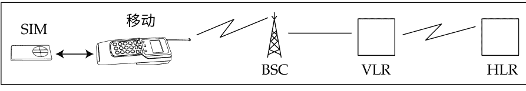
**图20.1：GSM认证系统组件**

无论如何，三元组被发送到基站，现在向移动设备呈现第一个RAND。它将此传递给SIM卡，计算SRES。移动设备将其返回给基站，如果正确，则移动设备和基站现在可以使用加密密钥 $K_c$ 进行通信。因此，整个认证协议如图20.2所示运行。

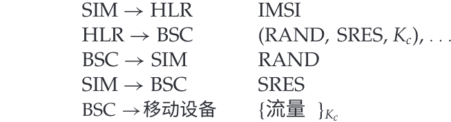
**图20.2: GSM认证协议**

该协议存在几个漏洞。首先，在大多数国家，基站和VLR之间的通信在微波链路上未加密传输。因此，攻击者可以发送自己选择的IMSI，然后拦截返回本地基站的微波链路上的三元组。

一家德国移动运营商提供了10万德国马克的奖励，给那些能够将通话计费到一个持有SIM卡的移动号码的律师办公室的人[44]。

其次，三元组可以被重放。一个不道德的外国网络可以在你漫游时获取五个三元组，然后继续重复使用它们，让你随意打电话。（家庭网络可以通过合同来阻止这种情况，但他们没有这样做。）因此，访问网络不必再向您的家庭网络请求进一步的授权，即使他们这样做，也不能保护您，因为访问网络可能在一周或更长时间内不向您计费。因此，当您漫游时，您的家庭网络无法可靠地关闭您，而且可能仍然有责任向漫游网络支付费用。不诚实的网络还通过虚假计费记录来欺诈漫游客户，这是一种我将在后面更详细地描述的做法。因此，即使您认为通过使用预付费SIM卡限制了您的责任，您仍然可能面临网络试图向您收取费用的情况。这就是为什么在使用预付费SIM卡进行漫游时，通常会要求您提供信用卡号码的原因。您可能会被收取比您预期更多的费用。

[^1]: 设备可以加密流量，但普通电话公司没有切换密码学的动机。事实上，情报机构经常监视主要交换节点附近的后向链路，以有效地获取无需许可的流量访问权，如果电话公司切换加密，可能会发现有人开始干扰链路以使其停止。

GSM的引入导致了犯罪模式的显著变化。认证机制使手机克隆变得困难，所以恶棍们改变了作案方式，使用盗窃的信用卡购买手机，使用盗窃的身份或贿赂内部人员[1352]。抢劫是另一个问题。在英国，我们有很多关于孩子因为手机而被抢劫的媒体报道。的确，1995年至2002年间手机犯罪增加了190%，但要将其放在背景下，同期订阅者数量增加了600%[583]。其中一部分是欺凌行为——孩子们拿走小孩子的手机；一部分是订阅者的保险欺诈，他们把手机掉进马桶里并报告称被盗，因为他们的保险不包括意外损坏；但是有一部分是抢劫，抢劫犯拿走手机并将其卖给贼赃交易者。许多贼赃交易者要么在有授权访问重新编程国际移动设备识别码 (IMEI) 的工具的手机店工作，要么与有组织的犯罪分子有联系，后者将手机运往国外。巴西的情况更糟，那里绑架案件猖獗：现在有假绑架案件，罪犯抢走一个孩子的手机，然后给其父母打电话要求赎金[^2]。

从大约1997年开始，预付费手机被引入。这引发了行业的快速增长，因为技术变得可用，人们无需信用评级。例如，在墨西哥，预付费手机占市场的90%，而在美国只占15%。全球范围内，预付费手机占一半以上，并且还在增长。它们还使匿名通信变得更加实用，许多犯罪分子开始使用它们。问题不仅包括逃避警方的窃听，还包括跟踪、敲诈勒索、欺凌和其他形式的骚扰。预付费手机还便于简单的欺诈行为；如果在购买手机时不核实身份，如果使用被盗信用卡进行充值，对您来说几乎没有风险[343]。

不过必须说，大多数将预付费手机用于犯罪的人只能获得轻度的匿名性，并且之所以未被发现，只是因为警方没有投入大量精力来抓捕小偷。如果发生了真正严重的犯罪行为，将使用通信分析，并且大多数犯罪分子对于停止这种分析所需的操作纪律水平毫无概念。正如我已经提到的，所谓的9/11策划者哈立德·谢赫·穆罕默德在使用与另一名基地组织成员使用过的预付费SIM卡相同批次的卡时被抓获；在21/7伦敦爆炸未遂案发生后，嫌疑炸弹制造者侯赛因·奥斯曼逃到了罗马，但很快被抓获。他在途中更换了手机中的SIM卡；但是通话记录不仅显示来自SIM卡的IMSI，还显示来自手机的IMEI。如果你被全世界的警察追捕，仅仅更换SIM卡是远远不够的。操作安全需要对网络运作方式的详细技术理解，以及在国家情报机构之外非常罕见的培训和纪律水平。

最后，预付费手机成了不诚实的通话销售运营商的礼物。由于计费基础设施只在电话挂断时被调用，坏人可以让一个电话通话持续一整天：他的每个客户所拨打的号码只是一个接一个地添加到一个长时间的电话会议中。在一天结束时，电话挂断，产生了数千美元的账单，警报响起，坏人把电话扔进了河里。第二天他再买一个。这就是为什么网络运营商通常会终止持续几个小时的通话。

除了身份验证之外，GSM系统还应提供两种进一步的保护——位置安全和通话内容保密。

位置安全机制是一旦移动设备注册到网络上，就会被分配一个临时移动用户标识 (TMSI)，它在网络中漫游时充当其地址。对这种机制的攻击使用了一种称为IMSI捕获器的设备，这种设备被出售给警察部队[488]。IMSI捕获器通常由跟踪嫌疑人的警车操作，它假装成一个GSM基站。由于IMSI捕获器比真正的基站更近，它的信号更强，移动设备会尝试与其注册。IMSI捕获器声称无法理解TMSI，因此移动设备会乐意地将明文的IMSI发送给它。如果要实现移动设备在不断开通话的情况下从一个网络漫游到另一个网络，并从VLR的故障中恢复，就需要这个功能[1283]。警方现在可以获得拦截与该移动设备通信的许可证，或者如果他们着急的话，可以进行中间人攻击，即假装成网络与移动设备通信，同时又假装成移动设备与网络通信。

GSM系统应该在认证和注册完成后，通过加密手机和基站之间的通信来提供通话内容的保密性。语音被数字化、压缩并分割成数据包；每个数据包都通过与密码键 $K_c$ 和数据包编号生成的伪随机序列进行异或运算来加密。在欧洲常用的算法是A5/1。

A5/1和Comp128一样，最初是保密的；和Comp128一样，它也被泄露出来，并且很快就发现了攻击方法。该算法如图20.3所示。有三个长度分别为19、22和23的线性反馈移位寄存器，它们的输出通过异或运算组合在一起形成输出密钥流。这个生成器中的非线性来自于一个多数时钟的安排，即将三个移位寄存器的中间位 $c_i$ 进行比较，并将中间位相同的两个或三个移位寄存器进行时钟控制。

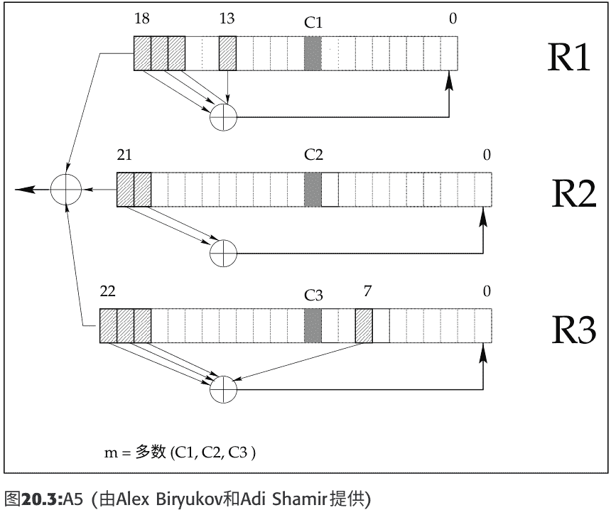

对这种排列的明显攻击是猜测两个较短的寄存器然后计算出第三个寄存器的值。由于有41位要猜测，人们可能认为平均需要 $2^{40}$ 次计算。实际上比这稍微复杂一些，因为生成器会丢失状态；许多状态有多个可能的前驱，因此需要更多的猜测。这导致了一种使用大量FPGA的攻击，售价约为$1m[^3]$。然后Biryukov和Shamir发现了一些优化和权衡，使得可以用更少的工作量来破解A5。他们的基本思想是计算一大批特殊点的文件，这些点是算法状态收敛到的点，然后寻找与观察到的流量匹配的点。在给定这个预计计算文件的情况下，攻击可以使用几秒钟的流量和几分钟的计算工作，或者几分钟的流量和几秒钟的工作时间[173]。对实际系统进行逆向工程还显示A5的密钥设置被故意削弱。尽管在理论上A5有一个64位的密钥（移位寄存器的初始加载），但实际实现将最低有效密钥位设置为零。无论如何，GSM供应商对这些披露的回应是引入第三个密码，即A5/3，它基于一种称为Kasumi的强分组密码，也用于第三代移动电话。

[^2]: 还有完全虚假的绑架案，坏人只是撒谎：他们说他们绑架了孩子，如果他们打电话给孩子，孩子就会被杀死。这些犯罪的肇事者通常在监狱里，没有什么可失去的。20%的父母仍然选择支付赎金而不是冒险。

[^3]: 一个由15个盒子组成的系统，每个盒子有20张卡片，每张卡片有18个集成电路，每个集成电路有32个核心，每个核心以150MHz的速度运行，每秒检查一个密钥，需要7.5秒钟，并且消耗15KW的电力。

然而，这种解决内容保密性问题的尝试已经被一种利用底层认证协议的攻击所破坏，并且现在正在被警察和监视人员广泛使用。

它依赖于许多国家的电话公司使用的弱化版本的A5/1，称为A5/2。移动电话通常可以使用任一算法，以便可以自由漫游。这种攻击是由Elad Barkan、Eli Biham和Nathan Keller [117]发明的，并且运行如下：如果你跟踪一个使用手机的嫌疑人，你记录通话，包括挑战和响应的初始协议交换。一旦他完成，你打开你的IMSI捕获器，并使他在你的虚假基站上注册。IMSI捕获器告诉他的手机使用A5/2而不是A5/1，并且设置了一个密钥——IMSI捕获器发送了之前使用的挑战。因此，移动电话生成与之前相同的密钥 $K_c$。由于这现在在一个弱密码中使用，可以快速破解，从而获得对之前记录的目标对话的访问权限。实际上，无论是使用中等安全性的A5/1还是高安全性的A5/3来保护，都无关紧要。存在低安全性算法、密钥由两个主体之一确定以及密钥在算法之间共享的事实，共同使整个系统变得脆弱。

A5/1漏洞是在欧洲情报机构的压力下引入的，表面上的理由是他们不希望将安全性较好的技术出口给潜在的敌对国家，因为这样会更难对其进行监视。阴谋论者对此大肆炒作，例如，澳大利亚曾因使用A5/2而引发了一场政治争议，因为这被视为欧洲政府将澳大利亚视为情报目标而不是盟友的暗示。

事实总是更加微妙。弱密码在某些战术情况下确实有帮助。考虑我在电子战章节中提到的情况，新西兰海军派遣一艘护卫舰监视斐济政变。如果斐济电话公司被允许使用A5/1而不是A5/2，这将不会阻碍任务的执行：信号情报官员可以从微波链路中获取三元组，入侵位置注册表，如果一切都失败了，还可以强行破解密钥。但是能够快速破解通信非常方便。

另一方面，对不发达国家实施弱密码安全措施也会带来运营成本。2007年，塔利班开始窃听英国士兵与家人和朋友之间的手机通话，然后拨打这些号码。一名英国皇家空军军官的妻子被告知：“你再也见不到你的丈夫了——我们刚刚杀了他。”数小时后，她才确认他仍然安全无恙[603]。英国军队现在被禁止使用手机——这对士气并没有什么帮助。

在国内或友好国家的行动中，情况更加复杂。情报机构可以合法获取电话公司的明文数据，但有时候授权程序过于繁琐（或被认为过于繁琐）。因此

## 第20章 电信系统安全

与一些电话公司达成特殊协议以在没有授权的情况下获取访问权限，这最近引发了一系列丑闻。例如，据透露，AT&T多年来一直向美国当局提供详单数据的访问权限。与曾经是垄断企业的公司达成特殊协议曾经很常见，但随着大多数国家现在对电信进行了解除管制，这种情况变得越来越少见，现在有数百家电话公司而不仅仅是一家。一些电话公司不受当局的信任，因为它们是外国人或甚至是黑帮所拥有的。其他一些公司规模很小，以前从未被窃听过，警方不知道该找谁。其他公司是正派的，愿意遵守授权，但无法做到。多年来，英国最严密保守的执法和情报秘密之一是无法方便地窃听其中一个移动电话网络。

工程师们试图将他们复杂而混乱的系统与情报机构复杂而混乱的系统连接起来，但项目偏离了轨道，他们无法使其正常工作。警方真的很担心罪犯可能会发现这一点，并大规模迁移到该网络。

我们如何理解这个混乱的局面？承认有很多原因，有些光荣，有些不太光荣，政府雇员可能希望通过技术手段而不是使用法定接口来获得交通数据。但这并不意味着应该允许这种访问。西方自启蒙运动和工业革命以来在自由、繁荣和生活质量方面取得的巨大进步在很大程度上归功于我们用法治下的自由取代了君主的神权。我们选举立法者制定规则，如果我们通过他们决定警察不能再对嫌疑人施加酷刑，那么他们最好不要尝试。同样，如果我们的立法者决定警察和情报机构应该获得窃听令，那么这些机构必须像其他人一样遵守法律。GSM安全故事提供了一个很好的例子，说明故意插入漏洞可能会产生广泛而意想不到的工程后果。还必须说，现在要求电话公司和互联网服务商提供适当授权的执法访问的设施通常设计得很差，可以被滥用[1151]。2004-2005年，不知名的人通过篡改内置在Vodafone希腊网络中的窃听设施，窃听了希腊总理和该国约一百名政治、执法和军事精英的手机。Vodafone和他们的设备供应商Ericsson都受到了重罚[1042]。我和同事们多年前就警告过这个问题[4]，我预计情况会变得更糟。我将在第三部分更详细地讨论这个问题。

位置隐私还存在其他政策问题。1997年瑞士发生了一场风暴，媒体发现电话公司经常向警察提供位置数据[1030]，而在美国，联邦通信委员会要求移动电话公司能够定位人们，以便进行911呼叫，以便被派往正确的地方。这是强加给每个移动电话用户的，而不是让用户决定是否购买移动位置服务。隐私活动家对此不满意。

无论如何，最初的GSM安全机制提供了比有权使用A5/1的国家中的有线网络稍微更好的保护，而在其他地方提供了稍微更差的保护，直到协议攻击被发现和利用。现在隐私在任何地方都稍微更差，因为有合适的设备的人可以相对容易地访问流量。但这可能并不是一个大问题。相对较少的人会被专业窃听设备的调查人员跟踪——如果你是这样的人，那么检测和防止对你的手机进行半主动攻击的方法只是你需要了解的技术的一小部分。如果你是一个普通的用户，隐私威胁来自电话公司可能滥用收集的数据，如详单数据。从这个角度来看，通信安全机制中的漏洞既不会使您面临额外的窃听，也不会阻止可能给您带来最大痛苦的欺诈行为。

### 20.3.3 第三代移动通信 - 3GPP

数字移动电话的第三代最初被称为通用移动通信系统(UMTS)，现在被称为第三代合作伙伴计划(3GPP，或简称3G)。这些系统现在几乎遍布全球，唯一的例外是中国，中国正在开发自己的专有变种。在其他地方，安全性与GSM基本相同，但升级以应对GSM已知的一些漏洞。第三代系统于2003年至2004年投入使用；3G相对于GSM的主要优势是更高的数据速率；而不是GSM的9.6 kb/s和GPRS的几十千位每秒，第三代数据速率在几十万到几百万比特每秒。愿景是3G将实现各种移动服务，从移动电视到随时上网的笔记本电脑。

整体安全策略在[1310]中描述，安全架构在[1298]中描述。密码算法A5/1、A5/2和COMP128被称为Kasumi [696]的各种操作模式所取代。

Kasumi是公开的，基于Mitsuru Matsui设计的Misty，经过适当的同行评审，并经受了十年的公众审查 [844]。所有密钥现在都是128位。加密用于保护消息内容和信令数据的完整性和机密性，而不仅仅是内容的机密性，并且至少从手机到相当中心的节点进行保护，而不仅仅是到本地基站。

这意味着从微波回程中获取三元组或明文不再是一种攻击。认证现在是双向的，而不是单向的，从而消除对恶意基站的漏洞；因此，IMSI捕获器无法对第三代移动设备起作用。相反，存在一个经过适当工程化的接口用于合法拦截 [1299]。这可以提供密钥材料和明文，因此如果警方跟踪嫌疑人，在录音过程中识别出移动设备，他们可以稍后解密该通话，而不仅仅局限于电话公司在获得授权后记录的明文通话。

协议机制的工作方式如下（见图20.4）。在基本的3GPP协议中，认证被推迟到访客位置寄存器（VLR）而不是基站控制器。家庭位置寄存器现在被称为家庭环境（HE），SIM卡被称为UMTS SIM卡（USIM）。家庭环境像以前一样选择一个随机挑战RAND，并使用USIM认证密钥K对其进行加密，生成一个响应RES，一个机密性密钥CK，完整性密钥IK和匿名密钥AK。

{RAND}_K = (RES | CK | IK | AK)

还有一个序列号SEQ，HE和USIM都知道。在RAND和SEQ上计算MAC，然后通过与匿名密钥进行异或运算来掩盖序列号。挑战，预期响应，保密密钥，完整性密钥和掩盖的序列号组成一个认证向量AV，从HE发送到VLR。然后VLR将挑战，掩盖的序列号和MAC发送给USIM；USIM计算响应和密钥，解除掩盖的序列号，验证MAC，如果正确则将响应返回给VLR。

| 发送方 | 接收方 | 传输内容 |
| :--- | :--- | :--- |
| USIM | HE | IMSI（可选择加密） |
| HE | VLR | RAND, XRES, CK, IK, SEQ ⊕ AK, MAC |
| VLR | USIM | RAND, SEQ ⊕ AK, MAC |
| USIM | VLR | RES |

**图20.4: 3GPP认证协议**

UMTS标准中还包括许多其他功能，包括序列号生成、身份和位置隐私机制的详细信息，与GSM的向后兼容性，从HE到VLR的认证向量在传输过程中的公钥加密机制，以及各种可选的加密机制的协商。

净效果是，相对于GSM，机密性将得到改善：通过更高质量的机制防止了对空中链路的窃听，并且排除了对骨干网络的当前攻击或虚假基站的攻击。警方的窃听是在VLR上进行的。在一些国家，警方在最初几年里很难窃听第三代移动电话，因为他们必须学会通过正式渠道操作，并且还要将他们的系统与网络运营商的系统集成。在第二阶段，建议实现端到端加密，以便从一个手机到另一个手机保护呼叫内容和一些相关信令。这导致政府要求使用密钥托管协议——一种在需要时向警察和情报机构提供密钥的协议。问题在于，如果一次手机通话是从英国手机公司的用户使用美国手机到漫游在法国的德国公司的用户使用芬兰手机，并且通话通过位于加拿大的长途服务并使用瑞典交换设备，那么这些国家的情报机构将有哪些有权访问这些密钥？[1299]（传统上，他们中的大多数人都可以以某种方式访问通话内容。）

英国和法国机构推动的一个解决方案是所谓的Royal Holloway协议[663]，主要由Vodafone设计，它允许访问用户所在的国家（在这种情况下是英国和德国）。这是通过使用Diffie-Hellman密钥交换的变体来实现的，其中用户的私钥是通过当地电话公司和/或情报机构知道的超级秘密主密钥下加密其姓名来获得的。尽管这个协议已经在英国公务员机构和法国卫生服务机构中采用，但它与电话公司的安全理念相悖，即主密钥是一件坏事。该协议也很笨重和低效[76]。

因此，3GPP不会提供革命性的保密性，只是一个小的改进。与GSM一样，它的设计目标是使安全性与有线网络的安全性相当[621]，而这看起来正在实现。

### 20.3.4 平台安全

我在这里需要强调的最后一点是，随着移动电话的普及和可编程性的增强，它们可能会遭受困扰个人电脑的恶意软件问题。它们遵循了安全经济学所预测的模式。起初，平台供应商——如Symbian、微软和Linux等操作系统销售公司——并没有加入太多安全措施，因为这样会妨碍应用程序开发者，并且在建立具有网络外部性的新市场份额时，吸引补充者是至关重要的。然后，当一个平台领先于其他平台时，恶意软件作者就会针对它。2007年，Symbian手机每年检测到约300个病毒和蠕虫，而其他手机每年只有一两个。Symbian已经开始了一个加强他们平台的计划，包括越来越复杂的访问控制、代码签名等等。

移动电话平台也已经获得了DRM机制。开放移动联盟DRM版本1支持下载铃声，而版本2支持音乐和视频下载，具有更通用的机制。版本1被广泛使用，但版本2因为一个有趣的争议而被搁置。主要的OMA推动者诺基亚希望成为移动音乐的首选分销渠道，就像苹果通过iTunes成为个人电脑的首选分销渠道一样。然而，网络运营商非常不愿意让诺基亚直接与他们的客户建立业务关系，这一点一直阻碍了部署。

总的来说，由于提供移动电话服务给客户的长而复杂的供应链，安全性变得更加困难。像ARM这样的IP公司拥有芯片设计；像英飞凌这样的晶圆厂制造芯片；像三星这样的手机设计师制造实际的手机；Symbian提供操作系统；诺基亚可能为下载界面提供一些软件；像Vodafone这样的网络运营商提供国家基础设施；然后由当地的运营公司向客户计费。

在这个链条中，每个人都倾向于将安全视为一个问题，将其抛给两边的公司。除此之外，游戏供应商可能提供应用程序，而企业应用程序如车队管理可能由第三方软件公司提供。再加上基于位置的下一代服务和来自谷歌和eBay等公司的产品，整个事情变得复杂到难以置信。

移动电话平台的最后一个方面是锁定。在许多国家，手机是通过未来的通话收入来补贴的：你可以通过与网络签订一年的合同来获得一部廉价手机。缺点是你的手机被锁定在网络上。甚至一些预付费手机也是锁定的，并且隐含着未来预期代币销售的补贴。然而，在一些国家，这种商业模式是不允许的。因此，解锁工具和服务的交易迅速兴起，其中一些是通过找到手机软件中的漏洞来设计的，而其他一些则使用了我在第16章中描述的硬件逆向工程技术。在苹果推出iPhone之后，手机公司和解锁服务之间的法律斗争达到了顶峰，iPhone对这种商业模式进行了一些改变：你可以购买的网络是那些为此付给苹果最多费用的网络。这让iPhone购买者感到恼火，因为美国的首选网络AT&T速度相当慢。iPhone很快被破解，AT&T派出律师追击解锁者。它还发布了一个禁用解锁手机的软件升级。

关于锁定和解锁的法律差异很大。在美国，数字千年版权法（DMCA）禁止干扰任何执行版权的技术机制，但对手机解锁有特定的例外，以防止版权法被滥用以扼杀手机市场上的竞争。现在有人争论这个例外只适用于解锁自己手机的人，而不包括解锁工具或服务的销售[821]。因此，在美国，如果你是一个客户，解锁是合法的（尽管供应商可能会使你的手机变砖），如果你以商业方式进行解锁，可能会面临挑战。在另一方面，法国和德国的法院认为手机锁定是非法的：如果苹果公司要销售该产品，就必须提供解锁的型号。法律和商业实践的这种差异导致了一个蓬勃发展的灰色市场，手机从一个国家运往另一个国家；这反过来又推动了解锁工具和各种欺诈的二级市场的发展。

### 20.3.5 移动安全是成功还是失败？

无论移动电话安全是成功还是失败，取决于你问谁。

从密码学的角度来看，它是一个失败。一旦公开，COMP128哈希函数和A5加密算法都被破解了。事实上，GSM经常被引用为Kerckhoffs原则的一个教训——密码安全应该存在于密钥的选择中，而不是机制的混淆中。机制迟早会泄漏，最好在生产一亿个单位之前，而不是之后，让它接受公众审查。对于大多数密码学家来说，GSM安全当然不是一场灾难，因为它提供了大量的研究论文机会。

从电话公司的角度来看，GSM是一个成功。像Vodafone这样的GSM运营商的股东赚了大量的钱，其中（一小部分）归功于GSM中的挑战-响应机制阻止了克隆。密码弱点是无关紧要的，因为它们从未被利用过（至少没有对通话收入造成重大损害的方式）。

有一两个诈骗行为仍然存在，例如长时间的电话会议骗局；但总体而言，GSM设计对手机公司来说是有益的。

从犯罪分子的角度来看，GSM也很好。它并没有阻止他们窃取电话服务：作案手法只是改变了，成本转嫁给了信用卡公司或个人的“身份盗窃”或街头抢劫受害者。它并没有阻止来自匿名电话的呼叫；预付费手机行业的崛起使得这些呼叫变得更加容易。（手机公司对这两个变化都很满意。）当然，GSM对拨号欺诈无能为力。

从大国情报机构的角度来看，GSM很好。他们已经可以访问明文的本地和国际通信，而弱化的A5版本有助于对发展中国家进行战术情报收集。而且第二波GSM设备带来了一些有趣的功能，例如运营商对手机的远程控制[1061]。如果你能够篡改（或冒充）运营商，那么似乎没有什么可以阻止你在目标手机上悄悄打开并监听房间里的对话。

从警察和资源有限的情报机构的角度来看，情况并不那么乐观。问题不在于GSM网络增加的技术复杂性：法庭授权的窃听可以交给电话公司处理（尽管如果嫌疑人在移动中，找到要窃听的号码可能会很麻烦）。问题在于预付费手机的引入。这不仅降低了流量分析算法的信噪比，使得窃听目标更加困难，还鼓励了勒索和跟踪等犯罪行为。

从客户的角度来看，GSM最初被宣传为完全安全。这是准确的吗？空中链路的加密确实阻止了偶尔会发生的模拟手机窃听，这是一种偶尔的麻烦。（曾经有一些知名案例，包括英国的查尔斯王子在与他的情妇卡米拉·帕克-鲍尔斯离婚前被窃听到的对话，以及美国的一起涉及纽特·金里奇的案件。）但几乎所有的电话窃听都是由大型情报机构进行的，对他们来说，加密并没有太大的区别。

当我们看到计费时，事情变得更加不乐观。手机的加密认证无法阻止由高价运营商和电话公司实施的许多欺诈行为。事实上，这使得摆脱虚假费用变得更加困难，因为电话公司可以在法庭上说你的智能卡和PIN码一定是在打电话的手机上使用过。同样的情况也适用于第三代手机。唯一的小小补偿是GSM促进了预付费手机的普及，这可以限制风险。

因此，GSM中设计的安全功能对用户帮助不大。它们的设计目的是从电话公司的角度提供“安全”：它们转嫁了大部分的欺诈风险，同时不中断高价业务的流动——无论是真实的还是欺诈的。

中期来看，对于可怜的用户来说，唯一的安慰是手持设备和服务的日益复杂可能会产生监管压力，以便使客户能够控制自己的账单金额。有许多因素推动这一点，例如平台对恶意软件的日益脆弱性；还有一些因素朝着相反的方向推动，例如电话公司希望保持定价的不透明性，以便欺骗客户。我指的不仅仅是电话公司经常欺诈客户的严格意义上，还指的是俚语意义上的混乱定价是电话公司经济的重要组成部分。我将在下一节中详细介绍这一点，我将在探讨电信经济学与欺诈和滥用的关系。

### 20.3.6 语音传输

电话的最新发展是互联网电话（VOIP），其中语音流量被数字化、压缩和路由到互联网上。这在1970年代有过实验性的开始；产品开始在1990年代出现；但是良好的通话质量需要大约80 kbit/sec的带宽，这超过了拨号调制解调器所能提供的。因此，只有在大量家庭拥有宽带连接后，VOIP才真正开始起飞。自2005年左右以来，VOIP已经成为一项大生意，eBay于2006年以26亿美元收购了Skype。实际上，大多数普通电话都是数字化并通过属于电话公司的IP网络发送的，因此从技术上讲，几乎所有电话都是“VOIP”，但根据常见用法，我只会将该术语用于由客户直接通过他们的ISP访问的IP服务进行的呼叫。VOIP市场仍然分散，并且遭受许多预料之中的问题。大多数产品在追求市场的竞争中迅速发货，安全性最多只是一个事后的考虑。在实施层面上，出现了一系列常见的堆栈溢出和其他漏洞。最流行的VOIP协议，会话初始化协议（SIP），事实证明存在漏洞，使第三方能够错误地向订户计费[1375]。这可能导致VOIP服务和其客户之间产生困难的争议。

VOIP存在许多问题，随着市场的震荡。领先的系统Skype是一个使用专有协议的封闭系统，而其许多竞争对手则是分散的。一个商机是“点击通话”，其中广告可以包含一个VOIP链接，使潜在客户可以点击与代表交谈；早期的努力遇到了兼容性问题。技术问题涉及不同的协议，以及如何处理因互联网上的服务质量变化而引起的抖动（时间延迟变化），以及如何处理网络地址转换和防火墙。

与安全的互动是复杂的。企业安全策略可能导致防火墙拒绝传递VOIP流量。如果通过VOIP进行电话通话，可以更安全，因为加密很容易添加，并且对于某些服务（如Skype），默认情况下已经启用。至少在一段时间内，警察和情报机构可能更难获取通话内容和通话记录；许多服务尚未解决与执法界面的工程问题，在Skype的情况下，其点对点的性质可能会使这更加困难。FBI目前正在推动将CALEA法规严格应用于VOIP提供商，而行业和公民自由团体正在抵制。（我将在第三部分中详细介绍这个问题。）窃听并不是唯一的问题；在社交网络网站的背景下，点击通话显然会涉及其他安全、隐私和安全问题，尤其是那些被未成年人使用的网站。

一个更高调的监管问题是政府希望通过VOIP服务进行的紧急呼叫能够可靠地工作，并提供呼叫者的位置信息。这很困难；一个IP数据包流可以来自任何地方，而且没有人拥有足够的互联网资源来保证服务质量。在更深层次上，对可靠性的争论只是计算机公司和电话公司之间长达四十年的战争中的最新争斗，我时不时地提到过这一点。计算机公司富有创新精神和企业家精神，竞相推出几乎足够好的产品；电话公司行动缓慢，受到严格监管，产品周期长达十五年，服务可用性达到99.999%。自从上世纪60年代人们开始大规模使用调制解调器以来，一次又一次的战斗接踵而至——而计算机公司几乎总是获胜。

2007年8月，Skype的两天停机事件可能提供了一个未来的样本，这是由于协议设计不良造成的。在微软的“补丁星期二”安全更新后，大量计算机重新启动，数千万个Skype客户端同时尝试连接网络。拥堵导致网络故障，但客户端仍在不断尝试连接。我们可能会遇到更多的故障。尽管VOIP电话看起来像电话，工作起来也像电话，但在可靠性方面更像电子邮件。如果断电，你的服务也会中断。

除此之外，主要问题与电话公司的商业模式和互联网的性质不兼容有关。电话公司通过对不同类型的内容收取截然不同的费率来赚钱：他们的典型费率为有线电视每兆字节百分之一美分，有线电话每兆字节八美分，移动电话每兆字节三美元，短信每兆字节高达三千美元。VOIP利用的机会是对这些费率进行套利，电话公司尽力阻碍VOIP与其电话服务竞争；这在移动IP服务中尤为明显。出于这些原因，我们最好研究电话公司的经济学和与安全的相互作用。

## 20.4 电信安全经济学

电话公司是极高固定成本和极低边际成本的典型例子。建设全国范围的网络需要数十亿美元，而处理额外电话呼叫的成本基本上为零。正如我在第7章的经济学中讨论的，这有一些影响。首先，存在向垄断市场的趋势，其中赢家通吃。事实上，多年来，电话服务被认为是大多数国家都认为电话服务是一种“自然垄断”，由政府运营；主要的例外是美国，那里的旧AT&T系统受到严格的监管。在AT&T解散后的反垄断案件和玛格丽特·撒切尔夫人对英国电信的私有化之后，世界转向了一种不同的模式，即受监管的竞争。具体细节因国家而异，但总体上，某些领域（如移动电话）有一定数量的允许竞争对手；其他领域（如长途通信）则允许公司自由竞争；还有一些领域（如本地环路供应）则仍然是事实上的垄断，但受到监管。

其次，由于服务提供的边际成本为零，竞争性部门（如长途通话）的价格迅速下降到非常低的水平——在许多情况下低于回收投资所需的水平。（在互联网泡沫期间进行的大量投资最终被视为沉没成本。）

在这样的市场中，公司将尽其所能通过各种手段来维持价格歧视。在许多电信市场中，结果是混乱的定价——产品不断变动，新的产品提供慷慨的首次折扣以与低成本提供商竞争，但之后偷偷提高价格。其效果是区分“愿意花钱节省时间的人”和“愿意花时间节省钱的人”。如果你愿意不断检查价格，你可以得到非常好的交易，但通常以冷漠的服务为代价。如果你没有时间不断审查你的电话账单，以及来自互联网服务提供商的最新电子邮件，你可能会发现你在法国出差期间从手机打回家的电话吃掉了整个月的储蓄。最终，你可能每个月支付的金额与过去相同。电话公司经济学学者安德鲁·奥德利兹科建议最终的前进方式将是固定价格合同：每月一定金额，您将获得家庭电话、互联网服务、几部手机以及一定数量的通话时间和短信[982]。与此同时，电信定价仍然模糊、有争议且远非透明。这直接导致滥用。

### 20.4.1 电话公司的欺诈行为

其中一个不断增长的骗局是不道德的电话公司向不知情的用户收取大量小额费用。它以各种方式收集电话号码。（例如，如果您拨打800号码，那么您的号码将被传递到远程，无论您是否尝试阻止来电显示。）然后，邪恶的电话公司向您收取几美元。您自己的电话公司会转嫁这笔费用，您会发现没有有效的争议方式。有时，这种骗局利用了法律漏洞：如果您在美国拨打800号码，公司可能会说“我们可以立即给您回电吗？”如果您同意，那么您被视为接受了可能是高额溢价费率的费用。如果您在通话过程中回应语音提示，也可能发生同样的情况。这些做法被称为填塞（Cramming）。

我自己曾经成为一次欺诈企图的受害者。在巴塞罗那度假期间，我妻子的包被抢了，所以我们打电话取消了里面的手机。几个月后，我们收到了我们的移动运营商的一份要求，要求我们支付几十美元的漫游费用，这是由那张在西班牙使用的SIM卡最近产生的。很有可能，西班牙的手机公司只是在向他们之前见过的一个号码收取一些费用，他们通常可以逃脱惩罚。我的移动服务提供商最初坚称，即使我取消了该号码，我仍然对几个月后计费的通话负责并且必须支付。我之所以没有被收费，仅仅是因为我在学术研讨会上遇到了该公司的首席执行官，并且能够让他的私人办公室解决这个问题。没有这种访问权限的客户通常会吃亏。事实上，英国的电话公司对投诉的回应是向其客户提供针对欺诈性收费的“保险”。他们能够逃脱惩罚，这是明显的监管（甚至是执法）失误。

另一个问题是猛烈攻击（Slamming）——未经许可更改用户的长途电话服务提供商。攻击者告诉你的本地电话公司，你选择了他们的服务；你的电话公司通过他们路由你的长途电话；他们希望你没有注意到这个变化并对账单提出异议；然后电话费用就会被提高。一些本地电话公司，如贝尔大西洋公司，允许他们的客户冻结他们选择的长途运营商[22]。

认为猛烈攻击和填塞只是小型的夜以继日的操作者是错误的。AT&T是最严重的违规者之一，不仅因为猛烈攻击而被罚款30万美元，还因为实际上使用伪造的用户签名，使其看起来好像他们同意转换到他们的服务。当他们伪造了德克萨斯州一位用户已故配偶的签名时，他们被抓住了[390]。至于英国，直到2005年才将猛烈攻击定为非法。

另一个问题是那些靠夜以继日的电话公司。由于在美国，任何人都有合法权利成立一家电话公司，因此很容易设立一家公司，从用户那里收取一些现金，然后在互联互通费用的发票到来后消失。公司还会用正常的电话号码来宣传性服务，以诱骗不警惕的人，然后向用户的住址发送巨额账单，并试图威胁他付款。对溢价电话服务提供商及其商业行为的监管是一个普遍存在的问题。

而且，不仅仅是小型运营商会从事不正当行为。甚至一些大型电话公司也存在国际呼叫短时终止的问题。尽管溢价电话号码用于一些或多或少合法的目的，如软件支持，但其中许多利用未成年人或患有强迫行为障碍的人。因此，监管机构已经强制许多国家的电话公司向用户提供溢价电话号码屏蔽功能。电话公司通过将溢价电话号码伪装成国际号码来规避这一问题。我在上面的第20.2.1节中提到了关于加勒比地区号码的骗局。现在，许多其他来自监管不严的小国家的电话公司也加入了这一行列，并向性服务运营商提供一系列号码以分享收入。

通常情况下，打给一个小国家的电话公司的电话并不会到达其表面目的地附近。用于实现这一点其中一种黑客技术被称为短终结，以下是几年前出现的一个例子。通常情况下，对于太平洋小国图瓦卢的电话会经由澳大利亚珀斯的Telstra公司通过卫星转发。然而，这些性服务热线号码在Telstra的系统中被标记为无效，因此它们会自动通过第二选择的运营商——新西兰的一家公司发送。（这些女孩——或者更准确地说，假装年轻女孩的年迈退休妓女们——实际上在英国曼彻斯特。）从技术上讲，这是一种有趣的情况，即将备用机制用作攻击工具。从法律上讲，很难对此提出质疑，因为有一个国际协议（内罗毕公约）禁止电话公司有选择性地阻止国际目的地。因此，如果你想阻止你的孩子给图瓦卢的性服务热线打电话，你必须阻止所有国际电话，这会让给你德国的重要客户打电话更加困难。

像这样的问题最终是监管失灵，而且这种情况越来越常见。（例如，在我之前提到的摩尔多瓦骗局中，电话并没有打到摩尔多瓦，而是打到了加拿大[251]。）随着技术使新的复杂服务成为可能，这种情况正在变得越来越糟，而监管机构却无法跟上。

### 20.4.2 计费机制

计费机制是问题的一个日益增长的来源，因为上述经济力量导致了越来越复杂的费率表。甚至电话公司自己有时也会陷入日益复杂的困境。有时候，他们的费率变得如此复杂，以至于人们可以对其进行套利；曾经有过不止一个案例，一个企业家发现他可以建立一个国际高价电话服务，并以每分钟更高的价格接听，而使用最优惠的折扣率拨打该电话的成本却比这个价格低。电话公司曾试图通过法院追回这种交易利润，声称存在欺诈行为，但结果参差不齐。

计费机制的安全性涵盖了更广泛的问题范围。目前的安排因为多种原因而不足够：

- 只有在呼叫电话挂断后才会生成通话详单记录（CDR）。这是有线网络的一个长期存在的特性，但是一旦环境变成移动网络，它就成为了一个严重的问题。正如我上面提到的，一个运行呼叫销售业务的人可以使用被盗或预付费的移动电话建立一个长时间的会议呼叫，客户一个接一个地加入和离开。电话会持续不断地保持摘机状态数小时。一旦电话挂断，就会生成数千美元的CDR，并且警报会响起。操作员将电话扔进河里并开始使用下一个电话。到1996年，这个问题变得如此严重，以至于沃达丰对所有移动电话通话引入了六小时的限制。但是，仅仅在六小时后断开所有3GPP呼叫是不可接受的。预计许多用户将始终保持联网状态（例如使用笔记本电脑），大部分时间的数据包传输量相对较小。

- 更严重的是，后端的计费系统是在电话公司还是沉睡的政府部门或国家垄断时设计的，当时没有高费率服务可以从系统中提取真正的金钱。因此，它在审计和不可否认方面几乎没有任何内容。实际上，电话公司A告诉电话公司B：“请从您的客户号码X中扣除$Y并将钱发送给我”——并且它确实这样做。即使这些扣款是错误的或欺诈的，电话公司B也没有争论的动机，因为它会得到一部分。正如我们在上面的欺诈案例中看到的那样，随着内部人员滥用系统，欺诈行为逐渐增加。在许多电话公司存在的世界中，这已经不再适用，其中有相当多的电话公司是不道德的。监管机构并不有效，唯一真正的反向压力来自越来越多的预付费客户。

- 电话公司还希望能够通过基于位置的服务（“给我一张地图，告诉我就如何开车到最近的麦当劳”）扩展当前的高价值产品和服务交付，包括音乐和视频下载以及额外的服务，如芬兰渡轮票、自动售货机上的可乐罐和伦敦停车收费器。如果要实现这一潜力，记账系统将不得不变得更加强大，争议解决机制也将变得更加公正和透明。

- 所有这些都与平台安全性相互作用。如果恶意软件在移动电话上广泛传播，那么控制被篡改电话的僵尸网络操纵者将能够通过让被感染的机器发送短信来支付各种商品和服务。最近的历史表明，任何可以规模化赚钱的攻击都会被利用。

那么如何改进手机支付系统呢？实现这一点的一种提议是将微支付机制[92]纳入其中。这个想法是，手机将定期发送支付给每个需要支付通话费用的网络或服务提供商。这些支付可以被看作是电子硬币，并且受到密码学保护，防止伪造。在通话开始时，手机将通过重复哈希计算一定数量的电话支付：$t_1 = h(t_0)$，$t_2 = h(t_1)$，以此类推，其中$t_k$（通常为$2^{10}$个单位）由手机公司签名。然后，手机将定期释放支付以支付通话过程中的服务。它从释放$t_{k-1}$开始，然后是$t_{k-2}$，以此类推。

如果随后有争议的费用——无论是由订户还是网络运营商提出——声称有（例如）$j$个支付，必须展示$t_{k-j}$和$t_k$的支付，后者带有证书。由于哈希函数$h$是单向的，除非手机实际上释放了那么多支付，否则这应该很难做到。支付$t_{k-j}$可以通过将哈希函数应用于它$j$次并验证结果是否为$t_k$来进行检查（这个协议是多个同时发现的例子，它在1995年由我们在剑桥的团队，Pedersen和Rivest和Shamir独立发明[40, 1013, 1077]）。支付的一个优点是，除了保护手机公司免受电话会议欺诈的侵害，它还可以保护订户免受更多欺诈的侵害。它可以使手机应用程序设计师以新的方式赋予用户权力：例如，您可以默认决定接受通话，或执行其他功能，只要它们的费用低于一美元，并且需要用户干预才能进行更昂贵的操作。目前，除了通过将一定数量的通话时间加载到手机中这种笨拙的机制之外，这种功能还不可用。

行业提出的解决方案是重新设计通话数据记录，以包含更多信息。除了时间、持续时间和被呼叫号码之外，它还将具有数据量、位置和服务质量的字段。这不仅是为了支持可能的未来差异化收费服务，还可以帮助紧急呼叫跟踪，并遵守2002年欧洲电信指令，要求所有移动运营商至少保存一年的手机位置信息，以供执法目的。有一个关于在线成本控制机制的提案，以限制每个用户产生的费用[901]，但这似乎已经停滞不前。

成本控制机制并没有标准化，但可以涉及将计费数据从本地网络或网关转发到家庭环境，如果可用信用用尽（与预付费SIM卡类似）或使用看起来是欺诈性的，则可以终止通话。很容易将其与北约在不同国家武装部队之间无法正确运行IFF（敌我识别）的失败进行类比，我在第19章中讨论过。公共利益（在这种情况下，透明可靠的成本控制）对于必须共同努力实现的利益相关者来说，并不是首要任务。事实上，情况更糟。很难找到一个在北美或欧洲的将军不同意良好的IFF是一件好事；但是许多主要利益相关者的存在依赖于混乱的定价，并且会将良好的计费系统视为严重威胁。

工程一个全球解决方案的极大困难使得市场对各种地方解决方案敞开了大门。在美国，有一个将RFID信用卡与支持NFC的手机整合的趋势。在英国，主要移动运营商于2007年推出了一个名为PayForIt的计划，旨在用基于WAP的协议替代高级短信服务，该计划“提供统一的支付体验”，并要求在确认购买之前提供“清晰的定价、条款和条件以及商家联系方式”。O2，其中一个大型网络，要求所有用户从2007年6月开始切换。他们说会有“减少客户关怀问题”。

就个人而言，我持怀疑态度，因为缺乏可靠的客户保证；条款和条件规定“任何关于商品和服务的查询或投诉必须向供应商提出”，而宣传PayForIt交易获取的公司则报出固定价格，并似乎准备接受所有人，无论是否受人尊敬。也许这个方案只会通过使手机支付变得更加繁琐并限制其在更强大的手机上使用来阻碍手机支付的增长，而不解决潜在的信任问题。强制执行客户权利的法律对所有人都更好。在其缺席的情况下，电话公司似乎正在建立一个银行系统，但没有银行稳定性和可信度所需的监管和控制，这是长期而痛苦的经验所证明的。在文明国家，黑帮不被允许经营银行。但是黑帮分子有一个基本的人权（至少在美国）拥有电话公司。因此，电话公司不应经营银行。

## 20.5 总结

电话诈骗是一个引人入胜的案例研究。几十年来，人们一直在欺骗电话公司，而最近电话公司也在积极地回敬。首先，系统根本没有得到真正的保护，很容易逃避费用并重定向呼叫。为了防止这种情况发生，采用的机制——带外信令——被证明是不足够的，因为系统的快速增长使得更多的漏洞暴露出来。这些漏洞范围从对用户的社会工程攻击，到对终端设备（如PBX）的设计和管理不善，再到对各种难以预测的功能交互的利用。

在移动领域，保护GSM及其第三代继任者的尝试是一个有趣的案例研究。他们的工程师专注于通信安全威胁，而不是计算机安全威胁，并且他们专注于电话公司的利益，而忽视了客户的利益。他们的努力并非完全徒劳，但也没有给出一个明确的解决方案。

总体而言，电信业的安全问题是环境变化的结果，包括放松管制，引入了许多新的电话公司。但主要变化是引入了高价号码。以前电话公司销售的服务几乎没有边际成本，突然涉及到真正的金钱；以前唯一严重的操纵系统的好处是免费通话或者难以被警方窃听的通话，突然可以赚到大笔钱。现有的保护机制无法应对这种演变。然而，主要的电话公司受到价格竞争的威胁，他们的商业模式现在是基于混乱定价的。因此，改革计费机制的动力并不存在。

最终，我怀疑监管机构将不得不介入。在美国，最好的解决方案可能是将电子银行监管法规E扩展到电话公司，因为它们已经成为事实上的银行。当你可以用手机购买渡轮票和歌曲，给停车收费器交费时，它执行着电子钱包的所有功能，如果由传统的支付服务提供商如VISA或Mastercard发行，将完全符合E监管法规。此外，我认为FCC或美联储应有权禁止已知的罪犯拥有或管理受监管的电话公司。欧洲在监管方面已经有一些行动：一项草案指令将要求公司向受影响的客户披露电信安全漏洞，类似于2007年在30多个美国州实施的漏洞通知法律。至少这将是一个开始。

## 研究问题

在与电话公司和情报机构实验室之外，对于电话欺诈和窃听有关的问题进行的研究相对较少。对于流量分析的兴趣日益增长，我将在后面讨论；对于下一代增值服务的可能影响也越来越关注，这些服务必然会引入新的功能交互和其他漏洞。所有通信（尤其是移动通信）、平台安全性以及用于保护分布式系统安全性的机制之间的相互作用，看起来都是有趣的研究和昂贵的工程错误的肥沃领域。社会对电话系统的弹性和可用性的期望要大于对互联网的期望，例如为了与紧急服务联系，而随着这两个系统的融合，将会出现一些有趣的保证问题。

## 进一步阅读

关于电话欺诈有很多零散的文章，但我不知道有什么东西将所有内容汇集在一起。有很多参考书介绍了底层技术，例如关于GSM的[1061]，还可以在网站上找到更多信息，例如[1190]。关于UMTS的概述可以在[642]中找到，还有一些相关的研究论文可以在[92]中找到。为了跟上电话欺诈的步伐，一个有用的资源是《折扣长途通讯摘要》[390]。NIST有一份关于如何评估您的PBX漏洞的指南[943]。最后，移动支付论坛有一份关于移动支付系统威胁的调查报告，概述了2002年的情况[897]。

---

## 21 网络攻击与防御

> 任何认为自己的问题可以通过密码学解决的人，都不了解自己的问题，也不了解密码学。
> ——罗杰·尼德姆和巴特勒·兰普森相互归因

> 如果你在咖啡上花的钱比在IT安全上花的多，那么你将被黑客攻击。而且，你应该被黑客攻击。
> ——理查德·克拉克，前美国网络安全特使

### 21.1 引言

到目前为止，我们已经看到了大量针对个人计算机和其他设备的攻击。但是，攻击越来越依赖于连接性。考虑以下示例：

- 一名办公室职员在电子邮件中点击附件。这会感染她的个人电脑，并通过窃取在局域网上传输的密码来危及她办公室中的其他机器。
- 她点击附件的原因是该电子邮件来自她的母亲。恶意软件已感染她母亲的计算机，然后向母亲通讯录中的每个人发送了一封带有自身附件的最新电子邮件副本。
- 她的母亲又被一个老朋友感染了，他为他的ISP账户选择了一个常见的密码。当网络上有很多机器时，坏人不需要挑剔；他们不是试图猜测特定账户的密码，而是为数百万个账户尝试同一个密码。给定一个网络邮件账户，他们可以向整个联系人列表发送恶意邮件。
- 另一种只在网络环境中有意义的攻击技术是Google黑客。在这种情况下，坏人使用搜索引擎找到运行易受攻击应用程序的Web服务器。
- 恶意软件编写者使用一系列诡计，或多或少地随机感染了大量个人电脑。然后，他们寻找有价值的目标，例如可以窃取大量信用卡号码的公司内部机器，或者可以用来托管网络钓鱼页面的Web服务器。这些目标可能被拍卖给专家来进行利用。最后，他们以不到一美元的价格将剩余的被感染机器出售给一个僵尸网络的控制者，他将这些机器租给垃圾邮件发送者、网络钓鱼者和敲诈者。
- 其中一个应用是快速变换（Fast Flux）。这会每隔20分钟改变一个网站的IP地址，使得它更加难以被关停。僵尸网络中的不同机器充当主机（或代理真实主机），每次IP地址改变时，阻止这样的地址最多只有暂时的效果。快速变换主机是最好的网络钓鱼团伙用于伪造银行网站的方式之一。

一旦我们有大量机器联网，就会出现许多攻击和防御。这些取决于许多因素，其中最重要的是网络使用的协议。第二组因素与网络的拓扑结构有关：每台机器能否与其他每台机器联系，还是只能直接访问少数其他机器？在我们上面的例子中，病毒通过社交网络传播自己——从一个朋友到另一个朋友，就像流感病毒一样。

我之前已经涉及了攻击和防御的网络方面，尤其是在电信和电子战的章节中。然而，在本章中，我将试图将安全的网络方面整合到一个连贯的框架中。首先，我将讨论网络协议，然后是恶意软件；然后是防御技术，从过滤和入侵检测到广泛使用的加密协议TLS、SSH、IPsec和无线局域网加密。最后，我将讨论网络拓扑。这些技术的最直接应用是保护PC网络免受恶意软件的攻击；然而，随着其他设备上网，这些经验也将适用于其他领域。此外，许多网络安全技术可以用于多种目的。如果你发明了一种更好的防火墙，那么无论你喜不喜欢，你也同时发明了一种更好的在线审查工具和更好的警察窃听设备。相反，如果移动性和虚拟私人网络给防火墙设计师带来困难，它们也会给审查员和警察窃听部门带来麻烦。

## 21.2 网络协议中的漏洞

背景摘要如下：互联网协议（IP）是一种无状态协议，用于将数据包从一台机器传输到另一台机器；IP版本4使用32位IP地址，通常写成0-255范围内的四个十进制数，例如172.16.8.93。人们已经开始迁移到IP版本6，因为在2011年和2015年之间，将分配完40亿个可能的IPv4地址；IPv6使用128位地址。大多数现代设备都准备好使用IPv6，但公司可能会逐个局域网进行改变，这无疑会带来一些有趣的问题。域名系统（DNS）允许将诸如www.ross-anderson.com之类的助记符名称映射到任一类型的IP地址；有一个DNS服务器的层次结构，从十三个顶级服务器到ISP和本地网络上的机器，它们为了性能和可靠性而缓存DNS记录。

互联网的核心路由协议是边界网关协议（BGP）。互联网由许多自治系统（AS）组成，例如ISP、电信公司和大型企业，每个自治系统控制一段IP地址。路由器——在互联网上传输数据包的专用计算机——使用BGP交换关于如何到达特定IP地址块的路由信息，并维护路由表以便选择高效的路由。

大多数互联网服务使用一种称为传输控制协议（TCP）的协议，它建立在IP之上并提供虚拟电路。它通过将数据流分割成IP数据包并在远端重新组装，自动重传任何未被确认接收的数据包。

IP地址通过域名系统（DNS）转换为熟悉的互联网主机地址，DNS是一个全球分布式服务，高级别的名称服务器指向特定域的本地名称服务器。本地网络主要使用以太网，其中设备具有唯一的以太网地址（也称为MAC地址），使用地址解析协议（ARP）将其映射到IP地址。由于IP地址短缺的日益严重，大多数组织和ISP现在使用动态主机配置协议（DHCP）根据需要为机器分配IP地址，并确保每个IP地址都是唯一的。因此，如果您想追踪一台做了坏事的机器，通常需要获取将MAC地址映射到IP地址的日志。

协议套件中还有许多其他组件，用于管理通信和提供更高级别的服务。它们中的大多数是在网络只有可信主机而安全不是一个问题的好日子里开发的。因此，几乎没有内置身份验证。这是一个对DNS和BGP来说的特殊问题。例如，如果一个小的ISP错误地向一个大邻居宣传它对互联网的大部分路由都很好，它可能会被流量淹没。至少在这里有一些经济激励措施，即ISP要么交换路由，要么为路由付费；BGP安全实际上是通过手动干预来修补的。

DNS更加棘手，因为中断通常是恶意的，而不是错误的。DNS服务器可能会提供错误的信息，以将客户端引导到一个邪恶的网站。这可以通过对大型ISP的DNS服务器进行攻击，或者在本地层面上完成。例如，许多家庭都连接了一个无线路由器到宽带连接上，而路由器包含客户端使用的DNS服务器的地址。在一种名为Drive-By Pharming（驾车嫁接攻击）的攻击中，恶棍诱使您查看一个包含设置您路由器DNS服务器为其控制下的代码的网页[1213]。其结果是，下次您尝试访问www.citibank.com时，您可能会被引导到一个仿冒网站。因此，更改家庭路由器上的默认密码是一个非常好的主意。

### 21.2.1 本地网络攻击

假设攻击者控制了你的一台个人电脑。也许是你的员工不小心了；或者他已经变坏了，想要冒充别人的身份来欺诈你，或者做一些其他坏事，比如下载违禁材料，希望能够陷害某人。对于他来说，有几种可能性：

- 1. 他可以安装数据包嗅探软件来获取密码，获取root密码，从而接管一个合适的账户。如果你使用挑战-响应密码生成器，或者像Kerberos或SSH这样的协议来确保明文密码不会通过局域网传输，那么密码嗅探攻击可以被阻止。我在第3章中介绍了Kerberos，稍后我会介绍SSH。
- 2. 另一种方法是冒充目标用户已经登录的机器，比如系统管理员。攻击者通常可以简单地设置自己的MAC地址和IP地址与目标一致。理论上，目标机器应该在看到不是响应自己数据包的IP地址流量时发送“重置”数据包；但是现在许多机器都有个人防火墙，会丢弃“可疑”的数据包。因此，警报不会被触发[300]。
- 3. 有许多针对旧式局域网的技术地址劫持攻击。我在第一版书中举了一个例子，攻击者对ARP消息给出错误答案，声称自己是目标，并可能阻止目标机器察觉到这一点，通过发送虚假子网掩码来引发警报。另一种可能性是发送虚假的DHCP消息。这样的攻击可能对现代交换式以太网起作用，具体取决于其配置方式。
- 4. 另一组攻击针对特定平台。例如，如果目标公司使用Linux或Unix服务器，它们很可能使用Sun的网络文件系统（NFS）进行文件共享。这允许工作站将网络磁盘驱动器视为本地磁盘，并且对于同一局域网上的攻击者来说具有一些众所周知的漏洞。当一个卷首次挂载时，客户端从服务器获取一个根文件句柄。这实际上是一个访问凭证，它指向挂载文件系统的根目录，但不依赖于时间或服务器生成号码，并且无法撤销。没有针对每个用户的身份验证机制：服务器必须完全信任客户端，或者根本不信任。此外，NFS服务器经常回复来自与请求到达的网络接口不同的网络接口的请求。因此，有可能等待管理员使用文件服务器，然后冒充他来覆盖密码文件。文件句柄也可以被网络嗅探截获，尽管交换式以太网使这变得更加困难。

> Kerberos可用于对客户端和服务器进行身份验证，但许多公司不使用它；在异构环境中使其正常工作可能很困难。

因此，您的网络上的一台坏机器可以接管其他机器的容易程度取决于您对网络的严格控制程度，而坏机器可能造成的损害将取决于本地网络的规模。系统管理员的权力是有限的；您的公司可能需要运行一套复杂的遗留系统，而Kerberos无法正常工作。此外，一个注重安全的系统管理员可能会带来实际成本。在我们的实验室，我们与系统管理员争论了多年，试图为访客提供互联网访问，而他们在技术保护和政策方面都持抵制态度（我们的学术网络不应该对商业用户开放）。最后，我们通过建立一个与商业ISP而不是大学骨干网连接的独立访客网络来解决了这个问题。

这引发了一个更广泛的问题：网络边界在哪里？在过去，许多公司都有一个单一的内部网络，通过某种防火墙连接到互联网。但是，根据我在第9章中讨论的内容，分隔通常是有意义的：为每个部门设置单独的网络可以限制受损机器可能造成的损害。如果您的某些部门可能具有较高的保护要求，而其他部门需要更大的灵活性，这可能有特别强的理由。例如，在我们的大学中，我们不希望学生和工资人员使用同一个局域网；实际上，我们将学生、员工和行政网络分开，前两者还根据学院和部门进行分隔。最近，移动性和虚拟网络使得定义清晰的网络边界变得更加困难。这场辩论被称为去边界化（de-perimeterization），并且我将在稍后回到它。

在本地网络攻击方面，有一个最后的攻击是值得一提的，那就是“流氓接入点”。偶尔在公共区域（如机场）会发现恶意部署的WiFi接入点。操作员可能坐在机场休息室，使用通过付费WiFi服务连接到互联网的笔记本电脑，并宣传一个免费的WiFi；如果你使用它，他能够嗅探到你输入的任何明文密码，例如你的网络邮件或亚马逊账户，如果你尝试进行在线银行业务，他甚至可能将你引导到一个恶意网站。因此，效果有点类似于驱动式劫持，尽管更可靠且规模较小。此外，流氓接入点也可能是员工为了方便而违反公司政策安装的设备，甚至是被错误配置以不加密流量的官方节点。无加密的WiFi流量是否重要取决于具体情况；稍后在讨论加密时，我将详细讨论这个问题。

### 21.2.2 使用互联网协议和机制的攻击

现在转向互联网协议套件，基本问题是相似的：默认机制中没有真正的真实性保护。这在较低级别的TCP/IP协议中尤为明显，并引发了许多攻击。

例如，考虑Alice用于初始化与Bob建立TCP连接并设置序列号的3次握手。这个协议可以以令人惊讶的多种方式被利用。现在，服务拒绝变得非常重要，让我们从最简单的服务拒绝攻击开始：SYN洪泛。

#### 21.2.2.1 SYN洪泛

攻击很简单，只需发送大量的SYN数据包，并且不回应任何回复。这会导致接收方（图21.1中的Bob）累积比其软件处理能力更多的SYN数据包记录。这种攻击自1980年代以来就已经被理论上认为是可能的，但在1996年用于使纽约的ISP Panix瘫痪数天后才引起公众注意。

在Linux和其他一些系统中已经加入了技术修复。这就是所谓的“SYN cookie”。与其保留传入的SYN数据包的副本，$B$只需将其作为序列号$Y$的加密版本发送出去。这样，它就不需要保留关于半开放会话的状态。尽管如此，SYN洪水仍然是一个重大问题，在2006年的报告攻击中占据了最大的比例（27%），尽管从流量总量上来看只排在第三位（18%，落后于UDP洪水和应用层攻击）[86]。

> 这里有一个重要的总原则：当你设计一个可以被任何人调用的协议时，不要让恶意用户轻易消耗诚实用户的资源。不要让世界上的任何人强制你的软件分配内存或进行大量计算。在在线世界中，这只会带来麻烦。

#### 21.2.2.2 Smurfing

在90年代，一种常见的使主机崩溃的方法是Smurfing。这利用了Internet控制消息协议（ICMP），它使用户能够向远程主机发送回显数据包以检查其是否存活。问题出在被多个主机共享的广播地址上。一些互联网协议的实现对广播地址和本地地址的ping请求都有响应——所以你可以测试局域网上的存活主机。这样的主机集合在广播地址上被称为一个smurf放大器。坏人会构造一个源地址伪造成受害者的数据包，并将其发送到多个smurf放大器。

然后，这些放大器会向目标发送大量数据包，从而可能使其瘫痪。Smurf攻击通常被孩子们用来接管互联网中继聊天（IRC）服务器，以便他们能够控制聊天室。有一段时间这是一个大问题，协议标准在1999年8月进行了更改，以便不再回答发送到广播地址的ping数据包[1144]。修复的另一部分是社会经济学的：私刑网站制作了smurf放大器列表。勤奋的管理员发现他们的网络出现在列表中并进行了修复；懒惰的管理员发现坏人使用了越来越多的带宽，从而被迫解决问题。到现在为止（2007年），smurf攻击基本上已经修复；不再是许多人使用的攻击方式。

但是有一个有用的道德教训：不要创建放大器。当你设计网络协议时，一定要非常小心，确保一个数据包进去，不能得到两个数据包。还要避免反馈和循环。一个经典的例子是源路由。这是早期IP的一个特性，使发送方能够指定数据包的路径。一个数据包不仅可以指定其目的地，还可以指定它应该经过的路由。这使得攻击变得太容易了：你只需要从A发送一个数据包到B，再到C，再到B，再到C，依此类推，直到最终目的地。现在大多数ISP都会丢弃带有源路由设置的数据包。（在2007年初，当发现源路由重新出现在IPv6规范中时，引起了一场警报，但现在已经修复了[417]。）

#### 21.2.2.3 分布式拒绝服务攻击

随着一个个聪明的创建服务拒绝攻击的方式被关闭，坏人们越来越多地转向暴力手段，例如通过从被感染的机器发送大量的UDP数据包。分布式拒绝服务（DDoS）攻击于1999年10月首次亮相，当时对纽约ISP Panix进行了攻击。在DDoS中，攻击者在一段时间内或在给定的信号下，篡改了大量的机器，然后这些机器都开始向目标发送大量的流量[391]。有趣的是，1999年至2000年左右的第一批僵尸网络中的大多数机器都是美国的医疗网站。FDA坚持认为，用于某些临床用途的医疗Unix机器必须具有已知的配置。一旦发现了这个配置中的漏洞，就会有大量易受攻击的机器；这是一个关于单一文化危险的教训。

如今，僵尸网络是通过各种漏洞组装而成的，而且已经出现了一个市场，专门从事黑客攻击机器的人可以将他们的产品卖给专门从事控制这些机器和提取价值的人。受损机器通常会传递一种价值链；它们首先用于有针对性的攻击，然后用于发送垃圾邮件，然后（一旦它们被垃圾邮件过滤器识别）用于快速变换等应用，最后（一旦它们被列入黑名单）用于分布式拒绝服务攻击。

分布式拒绝服务攻击已经针对多个知名网站发起，包括亚马逊和雅虎，但如今主要网站拥有如此大的带宽，很难受到影响。下一个发展是勒索者在热门赛事之前攻击在线赛马博彩网站，这些赛事本应该带来大量业务，然后勒索赎金以免再次攻击。一些博彩公司将他们的业务转移到高带宽托管服务（如Akamai），这些服务高度分布且能够处理大量数据包，而其他公司则转移到具有数据包过滤设备的专业互联网服务提供商，以高速过滤掉恶意数据包。然而，对于勒索来说，真正的解决办法并不是技术上的。首先，博彩公司聚在一起，交流经验，并决定将来不再支付任何赎金。其次，俄罗斯政府被迫处理主要的犯罪团伙；2004年有三名男子被逮捕，并于2006年被判入狱八年。

有一段时间，存在着技术军备竞赛。攻击者开始伪造源IP地址，并将数据包反射到无害的主机上[1011]。一种对策是追踪：当路由器转发数据包时，它还会向目标发送一个ICMP数据包，概率约为20,000分之1，其中包含前一跳、下一跳和尽可能多的数据包细节。因此，大规模的洪水攻击可以追溯到负责的机器，即使源IP地址被伪造[154]。然而，这场军备竞赛在很大程度上已经平息，原因有很多。首先，微软改变了他们的网络堆栈，使得感染的机器更难以发送带有伪造IP地址的数据包；现在你需要入侵操作系统，而不仅仅是任何旧应用程序。其次，越来越多的网络边缘设备不接受伪造的数据包，现在大约有一半的宽带ISP对其进行过滤[86]。

然而，停止军备竞赛的主要原因与经济有关。追踪数据包在不同的自治系统之间无法工作；例如，如果你是一家大型电信公司，你不会给竞争对手的技术人员提供网络访问权限。因此，坏人发现在实践中没有人追捕他们，于是停止使用欺骗。此外，一旦在2004年左右出现了用于购买和出售僵尸网络机器的市场（连同信用卡号码、垃圾邮件合同和其他犯罪服务），被感染机器的价格下降得如此之低，僵尸网络也变得如此之大，整个游戏就改变了。坏人不再使用少数被感染的机器通过使用欺骗的源地址发送巧妙的攻击，而是直接利用数千台报废的僵尸网络机器发送恶意数据包。剑已被卡拉什尼科夫步枪取代。

最近，在2005-2007年期间，有人试图攻击核心服务，例如DNS，并因此导致整个互联网瘫痪。DNS现在已扩展到13个服务器（这是协议支持的最大数量），其中许多使用了任播协议——当您请求将主机的域名解析为IP地址时，您得到的结果取决于您所在的位置。其结果是，DNS已成为一个使用许多非常快速的机器连接到非常高容量网络的大规模分布式系统。最终，现代DDoS攻击的蛮力简单地被更多的蛮力所回应。如果有一百个农民持有卡拉什尼科夫步枪向你开枪，你最好买一辆装甲足够强大以吸收火力的坦克。

目前，对关键服务的大规模DDoS攻击似乎相对平静。尽管如此，还存在一些残留的担忧：

- 有一股DDoS攻击的浪潮是意外而非恶意导致的。例如，2003年威斯康星大学麦迪逊分校发现自己每秒收到数十万个请求时间的数据包。事实证明，Netgear公司销售了大约70万台硬编码的路由器，这些路由器会向时间服务器询问时间。如果没有收到响应，它们会在一秒后再次询问时间。Netgear最终支付给大学以维护一个高带宽的时间服务器。类似的事件已经发生了几十次[303]。
- 垃圾邮件发送者和网络钓鱼者经常试图阻碍他们活动的组织网站进行DDoS攻击，例如Artists Against 419和Spamhaus。
- 人们担心DDoS攻击可能以更大规模回归。截至2007年9月，有几个僵尸网络拥有超过五十万台机器[742]。这些网络的操作者可以发送数据包洪水，使除了最大的网站之外的所有网站都无法正常运行。这些担忧在某些领域被2007年对爱沙尼亚的攻击所放大。
- 即使我们从未见过互联网被一个巨大的僵尸网络攻击瘫痪，攻击仍然可以针对较小的目标进行。在爱沙尼亚事件之前，吉尔吉斯斯坦的一个反对党服务器曾遭受过DDoS攻击，当该网站迁至北美时，这些攻击也随之而来[1081]。毫无疑问，DDoS为黑帮提供了一种可以租借给各种不良人士的武器。
- 话虽如此，我们不能忘记在线活动主义。如果有成千上万的人给白宫发送电子邮件抗议某项政策，这算是DDoS攻击吗？抗议者不应被视为重罪犯；但是在立法上划分界限可能很难。

#### 21.2.2.4 垃圾邮件

在某些方面，垃圾邮件与DDoS攻击类似：通常由僵尸网络发送的大量不受欢迎的流量，通常具有明确的犯罪意图。技术方面有关联，因为电子邮件和Web协议（SMTP和HTTP）错误地假设较低层次是安全的。就像DDoS僵尸网络可能伪造IP地址一样，垃圾邮件僵尸网络可能伪造发件人的电子邮件地址。

然而，垃圾邮件在很多方面与分组级DDoS不同。首先，它足够令人讨厌和成本高昂，以至于对于ISP来说存在真正的压力。如果你是一个中型ISP，你通常会尽可能与其他ISP进行对等连接，并且只在无法交换时才从大型电信公司购买路由；如果其他ISP将你视为垃圾邮件的来源，他们可能会取消你的对等连接安排，这将造成实际损失。因此，一些ISP开始进行出口过滤：他们监视自己网络中的垃圾邮件，然后将受感染的个人电脑隔离到一个只能访问防病毒软件等少数资源的“封闭花园”中[300]。

其次，与分布式拒绝服务攻击（DDoS）不同，垃圾邮件似乎没有减少的趋势。看起来垃圾邮件发送者正在整合，因为大部分垃圾邮件来自几十个大型团伙。这一点从垃圾邮件统计数据的“不连续性”中可以看出。因此，与其在垃圾邮件过滤器上花更多的钱，不如让警方逮捕这些团伙更划算。然而，趋势随时间而变化。

在2006年至2007年期间，我们看到了对垃圾邮件发送者伪造的电子邮件地址发送的回溯邮件数量下降。其中很大一部分来自反病毒产品，并且有人指出，这些厂商经常违反反垃圾邮件法，发送带有“产品X在您发送的邮件中发现了蠕虫Y”的消息。如果蠕虫Y已知使用地址伪造，发送这样一条消息给没有发送有问题邮件的一方的唯一可能目的就是为了宣传产品X。与此同时，招募“骡子”的垃圾邮件数量大幅增加。

#### 21.2.2.5 DNS安全和Pharming攻击

到目前为止，我已经给出了两个例子，其中用户被欺骗并被引导到恶意DNS服务器，结果是当他试图访问他的银行网站时，他最终输入密码到一个假网站中。这通常被称为Pharming（域名嫁接攻击）。我提到了驱动式嫁接，其中人们的家庭路由器被下载的恶意JavaScript重新配置，并且恶意攻击者提供WiFi服务给受害者，然后完全控制他的未受保护的流量。

还有其他几种变体，包括向真实服务器提供虚假的DNS记录。旧的DNS服务器会接受额外的记录而不进行检查；如果他们询问你的服务器X在哪里，你可以自愿提供Y的IP地址。这个问题已经修复了，但仍然有一些正在使用的旧服务器是有漏洞的。这种攻击通常被称为DNS缓存污染，因为它们基本上影响了信任被攻击机器缓存的关于目标的信息的用户。它们不仅被用于嫁接攻击，还被用于简单的破坏行为，比如用一些冒犯性的东西替换目标公司的网站。它们还可以用于审查制度；一些机构多年来一直在对待不同政见的网站使用DNS欺骗。

许多研究人员一直在致力于提升DNS安全的建议升级，但由于经济原因，这些建议很难得到实施；大部分保护DNS所需的功能都可以通过TLS来完成，而无需新的基础设施，只有在足够多的网络运营商采用这些功能之后，个别网络运营商才能从DNS安全中获得足够的好处[997]。

## 21.3 木马、病毒、蠕虫和Rootkit

计算机安全专家早就意识到恶意代码的威胁。第一个这样的程序被称为特洛伊木马，得名于希腊人留给特洛伊人的一匹马，据说里面藏着士兵，他们打开了特洛伊城的大门，让希腊军队进入。将这个术语用于恶意代码的意思可以追溯多年（参见 [774] 第7页的讨论）。还有病毒和蠕虫，它们是自我传播的恶意程序，我在之前的章节中提到过。关于它们的确切定义存在争议；通常的用法是，特洛伊木马是一个在被不知情的用户运行时执行恶意操作（如捕获密码）的程序，而蠕虫是一种自我复制的程序，病毒是一种附着在其他程序上进行复制的蠕虫。

最后，最迅速增长的问题是 rootkit——一种软件，一旦安装在机器上，就会秘密地将其置于远程控制之下。Rootkits 可以用于有针对性的攻击（执法机构使用它们将嫌疑人的笔记本电脑变成窃听设备）或者用于金融欺诈（它们可能带有捕获密码的键盘记录器）。如今，rootkits 的最显著特点之一是隐身性；它们试图隐藏在操作系统中，以便无法使用标准工具找到并删除它们。但是，rootkits 迟早会被识别出来，并编写出用于删除它们的工具。另一方面，大多数以这种方式感染的个人电脑最终会成为僵尸网络的一部分，因此问题的另一个方面是如何设置、维护和使用僵尸网络。现在，rootkit 供应商提供售后服务，为僵尸网络的管理者提供升级 rootkits 的工具，而这些 rootkits 的删除工具也正在变得越来越多。

### 21.3.1 恶意代码的早期历史

恶意代码，或恶意软件，在足够多的用户共享计算平台时似乎很可能出现。它至少可以追溯到 20 世纪 60 年代初，当时的机器速度很慢，它们的 CPU 周期被仔细地分配给不同的用户组——学生经常处于队列的末尾。学生们发明了一些技巧，比如在计算机游戏中写入一个特洛伊木马，以检查程序是否以 root 权限运行，如果是，则创建一个已知密码的额外特权帐户。到了 20 世纪 70 年代，大学的大型分时系统成为越来越多涉及特洛伊木马的恶作剧的目标。各种各样的技巧被开发出来。1978 年，施乐 PARC 的约翰·肖赫 (John Shoch) 和乔恩·哈普 (Jon Hupp) 编写了一个他们称之为“蠕虫”的程序，它在网络上复制自己，寻找空闲处理器以分配任务给它们。他们在 1982 年的一篇论文中讨论了这个问题 [1164]。

1984 年，肯·汤普森写了一篇经典论文《关于信任的信任》，在其中他展示了即使系统的源代码经过精心编写，经过检查并且已知没有漏洞，仍然可以插入一个后门 [1247]。汤普森的技巧是将后门嵌入到编译器中。如果编译器意识到正在编译登录程序，它会插入一个后门，比如一个可以在任何账户上使用的主密码。（这个想法最早由保罗·卡格和罗伯特·谢尔在 1974 年的 Multics 评估中提出 [693]。）当然，有人可能会尝试通过检查编译器的源代码，然后从头开始重新编译它来阻止这一点。所以下一步是确保，如果编译器意识到它正在编译自身，即使源代码中没有漏洞，它也会插入漏洞。所以即使你可以购买一个操作系统、应用程序和工具都经过验证安全的系统，编译器二进制文件仍然可能包含木马。结论是漏洞可以在工具链的任何环节插入，所以你不能完全信任一个你没有完全自己构建的系统。

1984 年也是计算机病毒公开出现的一年，这是在 Fred Cohen 的论文工作之后。他进行了一系列实验，使用不同的操作系统展示了代码如何从一台机器传播到另一台机器，以及（正如我在第 8 章中提到的）如何从多级系统的一个隔间传播到另一个隔间。这引起了恐慌和困惑，在大约三年后，我们开始看到第一个真正的野生病毒$^1$。几乎所有的病毒都是 PC 病毒，因为 DOS 是主导的操作系统。当用户通过软盘或公告板共享程序时，它们从一个用户传播到另一个用户。

一个早期的创新是“圣诞”病毒，它在 1987 年 12 月传播到 IBM 大型机上。它是用主机命令语言 REXX 编写的程序，头部写着“不要阅读我，执行我”，如果执行，它会在屏幕上绘制一棵圣诞树，然后将自己发送给用户联系人列表中的每个人。它是作为一个恶作剧而编写的，而不是出于恶意；通过使用网络（IBM 的 BITNET）传播，它领先于其时代。

接下来的一年，互联网蠕虫出现了，这引起了媒体和公众的关注。

---
$^1$ 那是我第一次接触它们，当时我是一名在银行工作的安全人员；我们现在得知，第一个在野外出现的计算机病毒是由一个九年级学生在 1981 年为 Apple II 编写的 [1101]。

### 21.3.2 互联网蠕虫

第一个著名的服务拒绝攻击案例是 1988 年 11 月的互联网蠕虫 [421]。这是由罗伯特·莫里斯（Robert Morris Jr）编写的一个程序，利用了多个漏洞从一台机器传播到另一台机器。

其中一些是通用的（例如，在猜测攻击中使用了 432 个常见密码，并且机会主义地利用了 .rhosts 文件），而其他一些是系统特定的（sendmail 的问题和第 4.4.1 节中提到的 fingerd 漏洞）。这个蠕虫采取了掩盖自己的措施；它被称为 sh，并且加密了它的数据字符串（尽管使用了凯撒密码）。

作者声称这段代码并不是对互联网的蓄意攻击，只是一个实验，看看代码是否能够从一台机器复制到另一台机器。这个实验是成功的。但是它也有一个 bug。它应该能够识别已经感染的机器，并且不再感染它们，但是这个功能没有起作用。结果是大量的通信流量堵塞了互联网。

考虑到互联网（或者更准确地说，它的前身 Arpanet）被设计成对抗攻击具有非常高的韧性，甚至包括战略核打击，一个学生写的程序竟然能够完全瘫痪它，这是非常了不起的。

很少有人注意到，这个混乱在一两天内就被清理干净，正常服务恢复了；它只影响了伯克利 Unix 及其衍生版本（这可能说明了今天微软单一文化的危险性）；那些保持冷静并且没有断开网络连接的站点恢复得更快，因为他们可以了解到发生了什么并且得到修复。

### 21.3.3 病毒和蠕虫的工作原理

病毒或蠕虫通常有两个组成部分——复制机制和有效载荷。当蠕虫运行时，它只是在其他地方复制自己，可能是通过侵入另一个系统（如互联网蠕虫所做的那样）或将自己作为附件发送到受感染系统的地址列表上的地址（如许多最近的蠕虫所做的那样）。在 DOS 病毒的时代，病毒复制的最常见方法是将自己附加到可执行文件中并进行修补，以便执行路径跳转到病毒代码，然后返回到原始程序。

在给定的特定平台上，病毒编写者通常还有其他技巧可用。例如，如果目标系统是一个名为 `ACCOUNTS.EXE` 的 DOS PC，可以引入一个名为 `ACCOUNTS.COM` 的文件，DOS 将优先执行该文件。DOS 病毒还可以攻击引导扇区或分区表，甚至还有可打印的病毒——所有操作码都是可打印 ASCII 字符的病毒，因此它们甚至可以在纸上传播。有很多 DOS 病毒在 [817] 中进行了详细研究。

病毒的第二个组成部分是载荷。这通常会被触发器激活，例如日期，并且可能会执行一项或多项恶意操作：

- 对机器的保护状态进行选择性或随机更改（这是我们在多级安全系统中担心的问题）；
- 更改用户数据（一些早期病毒会破坏您的硬盘，而一些最近的病毒会加密您的硬盘并要求您支付赎金以获取解密密钥）；
- 锁定网络（例如，以最大速度复制）；
- 执行一些邪恶任务（例如使用 CPU 进行 DES 密钥搜索）；
- 让您的调制解调器拨打高费率号码，以将您的钱转移到电话骗子那里；
- 在您的计算机中安装间谍软件或广告软件。这可能只是告诉营销人员您在线上做什么——但它可能会窃取您的银行密码并从您的账户中提取钱款；
- 安装一个 rootkit——隐藏在你的机器上并控制它。这通常用于将你的机器招募到僵尸网络中，以便以后用于垃圾邮件、网络钓鱼和分布式拒绝服务攻击。

恶意软件的历史以及对策有一些有趣的曲折。

### 21.3.4 恶意软件的历史

到了 20 世纪 80 年代末和 90 年代初， PC 病毒已经成为一个严重问题，催生了整个反病毒软件编写和咨询行业。许多人认为这种情况不会持续下去，从 DOS 到像 Windows 这样的“正式”操作系统的转变将解决这个问题。一些反病毒先驱甚至出售了他们的公司；其中一位在 [1198] 中讲述了他的故事。

然而，转向 32 位操作系统只是暂时的喘息。很快，解释性语言的传播为恶作剧提供了肥沃的土壤。在 20 世纪 90 年代末，坏的 Java 小程序在人们发现透过浏览器渗透 Java 实现的方法时大量出现 [859]。到 21 世纪初，主要的传播途径是像 Word 这样的宏语言产品，而主要的传输机制已经变成了互联网 [95, 209]；到 2000 年，宏病毒几乎占据了所有移动恶意代码事件的比例。事实上，一位内部人士表示，互联网“拯救了”杀毒软件行业 [669]。更加愤世嫉俗的观点是，该行业从未真正受到威胁，因为人们总是希望分享代码和数据，在没有可信计算平台的情况下，可以预期恶意软件会利用任何他们使用的共享机制。另一个观点是，微软应该负责，因为他们在各种产品中鲁莽地加入了如此强大的脚本功能。正如他们所说，你的经验可能会有所不同。

顺便提一下，恶意数据也可能是一个问题。一个有趣的例子是由 David Mazières 和 Frans Kaashoek 提到的，他们在 MIT 运营了一个匿名转发器。这个设备解密来自网络上任何地方的传入消息，解压缩并对其进行操作。有人给他们发送了一系列由一行文本重复多次组成的 25 兆字节的消息；这些消息在输入时压缩得非常好，因此只是很小的密文，但是在解压缩后很快就填满了溢出文件并导致系统崩溃 [849]。对于其他进行解压缩的程序，如 MPEG 解码器，也存在类似的攻击。然而，最严重的情况不是恶意数据，而是恶意代码。

无论如何，恶意软件演化的下一个阶段可能是 2000 年的“爱情虫”。实际上，这是一种自我传播的蠕虫；它通过将自己发送给受害者通讯录中的每个人来传播，并且主题行“我爱你”旨在引诱人们打开它。从理论上讲，公司可以通过过滤掉微软可执行文件来防御此类事物；但在实践中，事情并不那么简单。一家拥有 85,000 名员工的加拿大大型公司就是这样做的，但是他们的许多员工在基于 Web 的电子邮件服务中拥有个人帐户，因此“爱情虫”病毒在未经过防火墙的邮件过滤器的情况下进入了公司。该公司配置了员工的邮件客户端，以便每个人在个人通讯录中都有整个公司目录。结果是，85,000 个邮件客户端试图向 85,000 个地址发送电子邮件，导致系统崩溃。“爱情虫”之后出现了许多类似的蠕虫，它们通过提供安娜·库尔尼科娃、布兰妮·斯皮尔斯和帕丽斯·希尔顿等名人的照片来诱使人们点击它们。还有一些“闪电蠕虫”，它们通过扫描整个互联网寻找易受某种攻击的机器并接管它们；这类蠕虫，如 Code Red 和 Slammer，在几小时甚至几分钟内感染了所有易受攻击的机器，并引起了关于可能及时反应的防御措施的一些警报 [1220]。

大约在同一时间，在 2000 年代初，我们看到了间谍软件和广告软件数量的显著增加。间谍软件是一种在未经所有者授权的情况下收集和转发有关计算机使用的信息的技术，或者最多只是一个弹出框，要求用户同意执行某些模糊的功能，以至于即使那些不仅仅是机械地点击它的人也不会真正知道他们正在同意什么。这在欧洲数据保护和不公平合同法下不符合“同意”的要求，但执法力度较弱。广告软件可能会向用户发送广告弹窗，并且可能与间谍软件捆绑在一起。这些令人厌烦的垃圾软件的供应商甚至起诉了将其列入黑名单的杀毒软件公司。这一切都使一切变得复杂。

大约在 2004 年左右发生了一次重大变化。在那之前，我们看到了各种不同的病毒和载荷。大多数病毒编写者之所以这样做，是为了好玩，为了炫耀，为了给女朋友留下印象——基本上，他们都是业余爱好者。从那时起，信息商品中出现了有组织的犯罪经济，使整个业务变得更加专业化。恶意软件作家的目标是招募可以出售给僵尸网络控制者以及其他利用手段的机器，以获取现金。

20 世纪 80 年代和 90 年代的大多数病毒都非常不稳定；尽管报道了成千上万种不同的病毒，但实际上很少有病毒在野外传播。编写一个能够正确传播的病毒实际上相当困难；如果它的传染性不够强，它就不会传播，而如果你让它传染性太强，它就会很快被注意到并处理掉。然而，那些传播的病毒往往传播得非常广泛，感染了数百万台机器。

广泛自我复制的蠕虫可能会给一个十几岁的程序员带来巨大的自我膨胀感，但对于黑手党来说并不是最佳选择。这样的蠕虫成为头条新闻，几个小时内，全球的反病毒厂商都在升级他们的产品以检测和删除它。甚至大众媒体也参与其中，告诉公众不要点击某个邮件中的任何链接。现在，作家们关注的是金钱而不是炫耀权利，他们发布更多但有限的攻击。此外，现代趋势不再使用自我复制的蠕虫——这些蠕虫通过堵塞互联网来吸引注意力——而是向手动控制的利用活动转变。

在 2007 年 9 月，最大的僵尸网络可能是 Storm 网络，拥有大约一百万台机器。它的控制者不断招募更多的机器，使用一个又一个主题。例如，在 9 月 6 日开始的美国国家橄榄球联盟赛季之后，他们在 9 月 9 日发送垃圾邮件，简单地说“足球...还需要说什么吗？了解所有的比赛，时间，频道和所有的统计数据。再也不会被这个在线游戏追踪器搞得一头雾水了”，随后附带一个链接到一个 URL，从中易受骗的人下载一个名为 tracker.exe 的文件，该文件会在他们的机器上安装一个 rootkit。使用类似这样的技术——本质上是专业的在线营销——他们不断扩大他们的网络。尽管媒体将 Storm 称为“蠕虫”，但实际上它不是：它是一个特洛伊木马和一个 rootkit。

受害者在安装它之前必须点击多个警告；Windows 会警告他们它没有签名，并询问他们是否真的想要安装它。然而，Windows 弹出了太多烦人的对话框，大多数人都被训练得点击它们。在 Storm 的案例中，它于 9 月 11 日被微软的恶意软件移除工具针对，雷德蒙德报告称已清理了 25 万台机器；他们还估计 Storm 拥有 50 万台活跃机器，可能还有几十万台没有被积极使用。这个网络——地球上最强大的超级计算机——通过出租给泵和倾销操作者以及药店骗子来谋生。另外两个网络也被确认拥有超过 50 万个僵尸；Gozi 和 Nugache 使用与 Storm 相同的点对点架构，到 2007 年底，这些网络变得越来越复杂，并探索新的犯罪商业模式。

因此，恶意软件业务现在已经达到了工业规模，顶级僵尸网络控制者控制的机器数量与谷歌相当。大型企业已经建立在用户已经被训练点击内容的事实上。随着恶意软件的工业化，特洛伊木马比病毒更常见；当后者从被感染的机器上发送电子邮件时，它们会引起注意，机器更有可能被清理，而特洛伊木马则是僵尸网络控制者直接发送感染流量，这也给了他更好的控制权 [1239]。一旦你安装了某个东西，就无法确定它是一个 rootkit，还是恶意间谍软件，它将使用键盘记录器窃取你的银行密码，或者是一个“正常”的间谍软件，它只会收集你的个人数据以卖给出价最高的人。说实话，这些类别很难清晰地区分开来。

### 21.3.5 对策

在 1987 年第一批个人电脑病毒出现后的几个月内，公司开始销售防病毒软件。这导致了一场相互竞争的军备竞赛，每个人都试图智胜对方。早期的软件基本上分为两种类型，扫描器和校验器。

扫描器是一种搜索可执行文件中已知病毒字节串的程序。病毒作者采取了各种方式进行回应，例如对流行的防病毒程序进行特定的反击；最常见的技术是多态性。这里的想法是每次病毒或蠕虫复制时都改变代码，使编写有效的扫描器更加困难。通常的技术是使用简单的密码对代码进行加密，并包含一个小的工作头部，其中包含解密代码。每次复制时，病毒都会使用不同的密钥重新加密自身，并通过替换等效的指令序列来调整解密代码。

校验和生成器会在系统上保留所有授权的可执行文件列表，以及原始版本的校验和，通常使用哈希函数计算。主要的对策是隐身，在这个背景下意味着病毒会监视由校验和生成器使用的操作系统调用，并在进行检查时隐藏自己。

研究人员还研究了恶意软件复制的理论。为了使病毒感染自我维持，它需要通过一个流行阈值——在这个阈值上，它的复制速率超过了它被移除的速率 [711]。这不仅取决于病毒本身的传染性，还取决于易受攻击的连接机器的数量（和比例）。医学中的流行病模型在一定程度上适用，尽管由于软件交流的不同拓扑结构（软件共享高度局部化），它们预测的感染率比实际观察到的要高。人们还尝试使用免疫系统模型来开发分布式的恶意软件检测策略 [482]。

有一个医学教训似乎适用的是，最有效的组织对策是使用集中报告和响应的选择性疫苗接种 [712]。在实际世界中，杀毒软件和管理纪律在一定程度上是可以替代的，但要真正有效，必须结合工具、激励和管理。在 DOS 为基础的文件病毒的旧时代，这归结为为所有事件提供一个集中报告点，并控制组织机器上加载的所有软件。主要风险是通过在家中使用的个人电脑（用于工作和其他事情，如孩子玩游戏）和来自其他组织的文件进入。但是，如何让员工对所有传入的电子邮件和软盘进行病毒扫描呢？在伦敦一家律师事务所采取的一种有效策略是，奖励发现病毒的人一盒巧克力，然后将其开具给发送感染文件的公司。

现在，恶意软件主要通过电子邮件附件或网页传播，事情通常更加技术化，具有自动筛选和集中报告功能。公司可以在防火墙上过滤可执行文件，并确保用户在系统上具有明智的默认设置，例如禁用浏览器上的活动内容和禁用文字处理文档中的宏。当然，这会与可用性产生冲突。人们还会创建各种未经授权的通信渠道，因此您必须假设筛选不可能是完美的；员工仍然必须接受培训，不要打开可疑的电子邮件附件，并了解恢复程序，以便处理受感染的备份。简而言之，问题更加复杂和分散。但与有机疾病一样，预防胜于治疗；软件卫生可以与非法软件复制和未经授权的设备私自使用的控制措施相结合。

最近，杀毒软件似乎越来越不起作用。僵尸网络和机器利用的商业化意味着恶意软件编写者拥有良好的工具和培训。几乎所有的特洛伊木马和其他攻击在首次启动时都无法被当前的杀毒产品检测到——因为它们的编写者会进行充分的测试——并且其中许多会运行到完成（通过招募目标数量的机器），而不会引起杀毒行业的注意。其结果是，尽管杀毒软件在 2000 年代初几乎可以检测到所有流通的攻击，但到 2007 年，典型的产品可能只能检测到其中三分之一。

至于这些漏洞留下的 rootkit，它们的编写质量也比几年前好得多，很少给机器的所有者带来麻烦。一些 rootkit 甚至安装了最新的杀毒软件，以阻止任何竞争的僵尸网络接管机器。它们还使用各种隐蔽技术来躲避检测。更重要的是，销售 rootkit 的专家提供售后服务；如果发送了一个移除工具包， rootkit 供应商将迅速发送对策。

目前尚不清楚技术防御是否跟得上恶意软件的发展。在全球范围内，需要采取警方行动打击这些大型团伙，尽管已经开始加大力度，但还有很长的路要走。管理良好的公司可以利用管理纪律来遏制威胁，但对于使用 Windows 机器的个人用户来说，前景并不特别乐观。一项调查显示，8% 的新电脑销售是那些已经放弃了被广告软件和其他垃圾软件感染到无法使用的机器的人；而且还有一个日益严重的威胁，即记录键盘输入的键盘记录器 (keyloggers)，它们可以记录用户在自己的机器上所做的一切。其中一些只是将信息出售给营销人员的间谍软件；其他一些则会寻找银行密码和其他关键数据，以直接进行欺诈。

## 21.4 防御网络攻击

在防御网络攻击方面，一般有四组可用工具：

- 管理：保持系统更新和配置，以最小化攻击面；
- 过滤：使用防火墙阻止木马和网络攻击，并检测攻击和妥协的迹象；
- 入侵检测：使用程序监视网络和机器的恶意行为迹象；
- 加密：使用 TLS 和 SSH 等协议，保护网络中的特定部分免受特定攻击。

让我们依次来解析这些内容。

### 21.4.1 配置管理和操作安全

2000 年至 2007 年期间，系统遭受的大多数技术攻击都是利用已知漏洞。典型的循环是微软每月公布一组安全补丁；一旦发布，攻击者就开始逆向工程它们；几天内，他们修复的漏洞就被理解并出现了攻击利用。一个良好运营的公司会在补丁发布当天快速测试其操作系统，并应用补丁，前提是补丁不会破坏重要功能。如果补丁导致问题，将尽快修复。

严格的配置管理不仅仅是补丁。许多软件产品都使用不安全的默认设置，例如众所周知的默认密码。

密码。最好有一个专门负责理解和解决这些问题的人。从机器中删除不必要的服务也很常见；通常情况下，公司中的每台工作站都没有运行邮件服务器、FTP服务器和DNS的理由，而且简化这些内容可以大大减少攻击面。频繁重新安装也是一个强大的工具：当麻省理工学院在Project Athena期间首次尝试这一方法时，每晚重新安装所有软件的策略大大减少了需要管理学生机器的系统管理员数量。像呼叫中心这样的运营商也经常采取同样的做法；这样，如果有用户想要安装未经授权的软件，他们必须在每个班次都重新安装，而且更容易被发现。还有一些网络配置问题：您需要了解您的网络拓扑，并有一些方法来查找类似恶意接入点的东西。如果所有这些都能够胜任地完成，那么您就可以应对大多数常见的技术攻击。（您需要单独的程序来处理您自己代码中出现的错误，但由于现在大多数软件都是购买而不是编写的，配置管理就是大部分战斗。）

有很多工具可以帮助系统管理员完成这些任务。有些工具可以实现集中式版本控制，以便可以在夜间应用补丁并保持一致；其他工具则用于查找网络中的漏洞。当第一个这样的工具出现时（Satan [503]），引起了很多争议；这导致一些国家通过了反对“黑客工具”的法律。现在有数十种这样的工具，但必须小心使用。

然而，让系统管理员在源头上停止所有漏洞的策略比看起来更困难；即使是勤奋的组织可能发现一次性修复所有安全漏洞的成本太高。补丁可能会破坏关键应用程序，而且似乎普遍规律是组织的最关键系统运行在最不安全的机器上，因为管理员不敢应用升级和补丁，以免丢失服务。

这使我们进入了操作安全和使用防火墙等过滤工具的领域。

操作安全，如第2章和第8章所提到的，是关于培训员工不要因愚蠢的行为而暴露系统。在那里，我们主要关注涉及电话的社交工程攻击；获取未经授权的信息的主要方式仍然是打电话并假装成有权知道的人。

现在，2007年机器被入侵的主要方式是因为人们点击电子邮件中的链接，导致他们下载和安装rootkit。当然，你必须培训你的员工不要点击邮件中的链接，但不要指望仅凭这一点就能解决问题；许多银行和其他企业希望他们的客户点击链接，你的许多员工也必须点击才能完成工作。你可以通过不给低级员工管理员访问权限来保护他们的机器，并且你可以通过让员工购买Mac电脑来提高安全性；但仍然存在一定的风险。处理这个问题的一种常见方法是在防火墙上剥离所有可执行文件。

## 21.4.2 过滤：防火墙、垃圾邮件过滤器、审查软件和窃听装置

解决“互联网安全问题”的最广泛销售的解决方案是防火墙。这是一台位于本地系统和互联网之间的机器，可以过滤可能有有害的流量。“一盒解决方案”的想法对许多组织具有很大吸引力，现在已被广泛接受，被视为公司尽职调查的重要组成部分。（这本身就会带来风险——许多公司更喜欢昂贵的防火墙而不是好的防火墙。）防火墙只是检查数据包流并执行过滤操作的系统的一个例子。坏数据包可以被丢弃，或者以使其无害的方式进行修改。它们也可以被复制到日志或审计跟踪中。非常类似的系统也用于互联网审查和执法窃听；我在本节中讨论的几乎所有内容也适用于这些应用。这些领域的任何发展都可能影响其他领域；实际系统可能具有重叠的功能。例如，许多企业防火墙或邮件过滤器会屏蔽色情内容，一些甚至会屏蔽不良语言，而ISP系统会审查儿童色情或持不同政见的言论，并自动向当局报告违规者。

过滤器基本上有三种类型，取决于它们是在IP数据包级别、TCP会话级别还是应用程序级别进行操作。

### 21.4.2.1 数据包过滤

最简单的过滤器只检查数据包的地址和端口号。这个功能也可以在路由器、Linux和Windows中使用。防火墙可以通过确保只有“本地”数据包离开网络，只有“外部”数据包进入来阻止IP欺骗。它还可以阻止发送给主机的格式错误数据包的拒绝服务攻击。也很容易阻止与“已知坏”IP地址之间的流量。例如，IP过滤是中国防火墙的审查机制的重要组成部分；坏IP地址列表可以保存在路由器硬件中，从而实现高速数据包过滤。

基本的数据包过滤也可以作为大多数机器的标准功能，并且可以用于更普通的防火墙任务。例如，数据包过滤器可以被配置为阻止除特定端口号上到达的所有流量之外的所有流量。初始配置可能是允许常见服务（如电子邮件和网络流量）使用的端口，然后随着受保护的机器或子网使用它们而打开端口。

然而，数据包过滤器可以被一些技巧所击败。例如，数据包可以被分片，以便初始分片（通过防火墙的检查）被后续分片覆盖，从而用违反防火墙安全策略的源地址替换它。另一个限制是维护黑名单很难，尤其是当你想要阻止的不是特定的IP地址，而是解析为IP地址，尤其是在短暂的基础上。例如，网络钓鱼者开始使用诸如快速流量转发之类的技巧，其中一个网站的IP地址每小时变化多次。

### 21.4.2.2 电路网关

更复杂的安排是一个更复杂的安排，即一个电路网关，它在第4层操作，通常通过重新组装和检查每个TCP会话中的所有数据包来实现。这比简单的数据包过滤更昂贵；它的主要优点是它还可以提供虚拟专用网络的附加功能，即通过互联网传输的企业流量从防火墙到防火墙都是加密的。我将在本章的最后一节讨论用于此目的的IPSEC协议。

TCP级别的过滤可以用于做一些其他事情，例如DNS过滤。然而，它无法在应用程序级别上筛选出坏东西，例如恶意代码、图像垃圾邮件和非法儿童虐待图像。

因此，它经常被编程以将特定类型的流量定向到特定的应用程序过滤器。一个例子是英国电信的CleanFeed系统，它试图阻止其客户访问儿童色情内容。由于一些不良网站托管在公共网络服务上，阻止该服务下的所有网页将是过度的，因此使用TCP/IP过滤器将流量重定向到可以详细检查的代理服务器。

### 21.4.2.3 应用程序中继

第三种类型的防火墙是应用程序中继，它充当一个或多个服务的代理。例如，邮件过滤器试图过滤垃圾邮件，而Web代理则阻止或删除不良内容。经典的例子是企业关于剥离代码的规定，无论是简单的可执行文件，网页中的活动内容，还是传入的Word文档中的宏。在2000年至2007年期间，这一直是防火墙供应商、垃圾邮件发送者和试图规避控制以完成工作的人之间的持续军备竞赛。

大约在2000年左右，Word宏病毒的泛滥导致许多公司从电子邮件中剥离了Word宏（甚至所有Word文档）。工作人员通过先将文档压缩成ZIP文件来绕过这个问题。防火墙开始解压缩这些文档以进行检查，于是人们开始使用ZIP的密码功能对其进行加密，并将密码明文放在电子邮件中。一旦防火墙开始应对这个问题，垃圾邮件发送者开始将ZIP密码放在附加的图像中，最终，许多公司开始采用不发送Word文档而是发送PDF文档的政策；这不仅使绕过防火墙更容易，而且还阻止了人们粗心地发送包含最后几十次编辑的文档。不用说，垃圾邮件发送者现在发送PDF附件——而且他们的僵尸网络有能力使所有附件都不同，例如通过组合文本、图像和一些随机颜色块作为背景。Rootkit可执行文件现在经常作为网页链接分发；2007年8月，大量消息告诉人们他们收到了一张卡片，而9月则是链接到一个虚假的NFL网站。为了完全保护，您还必须在您的Web代理中过滤可执行文件（但这将对希望运行最新应用程序的用户造成很大的阻碍）。这种情况并没有迹象表明这场军备竞赛会减弱。

应用程序中继也可能成为一个严重的瓶颈。这不仅适用于企业应用程序，还适用于审查制度。一个例子是中国的防火墙，它试图阻止与禁止主题相关的邮件和网页内容。尽管防火墙可以通过简单的IP过滤来阻止“已知的坏站点”，但查找禁止的词汇需要进行深度数据包检查——这需要更多的计算能力。Richard Clayton、Steven Murdoch和Robert Watson的调查显示，实际上并没有阻止不良内容；中国的机器只是向出现不良词汇的连接的两端发送“重置”数据包。这几乎可以肯定是因为他们需要一些额外的机器来进行过滤，而不是在路由器中进行过滤；一个副作用是您可以通过忽略这些重置数据包来绕过防火墙[308]。（当然，中国境内这样做的入最终可能会受到当局的访问。）

特别是在应用层面上，创新的速度使得防火墙供应商（以及审查员和窃听者）远远落后。一个很好的例子是转向基于边缘的计算。谷歌的文字处理器——谷歌文档——被许多人用来在线编辑文档，仅仅为了节省购买微软Word的成本。作为副作用，它的用户可以立即与彼此共享文档，从而创建了一个经典过滤器不知道的新的通信渠道。因此，这项服务可能被用来将机密文件从公司走私出去，击败政治审查员，或进行秘密通信。（它甚至模糊了大多数国家对窃听合法监管中的流量和内容之间的区别。）更加深奥的通信渠道是随时可用的——阴谋者可以加入一个在线多用户游戏，并通过第六个地牢中的银龙传递他们的消息。

另一个问题是应用级过滤可能非常昂贵，尤其是对于高带宽的网络内容。这就是为什么许多网络过滤系统是混合型的，比如上面提到的CleanFeed机制，只有那些包含一些不良内容的域名才会被发送到完整的HTTP代理过滤器。内容将被发送到完整的HTTP代理过滤器。应用代理还可以与其他保护机制进行交互。垃圾邮件发送者（和其他人）不仅可以使用加密来防止内容检查，而且一些企业网络代理还可以通过对TLS进行中间人攻击来破解加密。即使你认为你正在向亚马逊提供加密的信用卡号码，你的加密会话可能只是与雇主的网络代理进行的，而它会与亚马逊的网络服务器进行另一个加密会话。我将在本章后面讨论TLS。

### 21.4.2.4 入口过滤与出口过滤

目前，大多数防火墙都是向外看，试图阻止不良事物进入，但越来越多的防火墙开始向内看，试图阻止不良事物离开。先驱是军事邮件系统，它们监视出站流量以确保没有机密信息明文传输；大约在2005年，一些互联网服务提供商开始检查出站邮件流量以尝试检测垃圾邮件。原因是托管了大量感染机器并因此大量发送垃圾邮件的互联网服务提供商会损害与其他互联网服务提供商的对等关系，这将造成实际损失；因此，已经开发了各种系统来帮助它们发现感染机器，然后将其限制在一个“封闭的花园”中，可以访问防病毒软件，但不会有太多其他功能[300]。

如果公司的机器被用于服务拒绝攻击，就像[1285]中提出的那样，那么出口过滤至少在原则上可以用于检测和阻止这种攻击。然而，目前并没有相应的激励措施，所以尽管人们关心垃圾邮件泛滥问题，几乎没有人在ISP层面上关注数据包泛滥问题。随着攻击的加剧或者监管环境的变化，这种情况可能会改变。

另一个可能的发展是出口过滤用于隐私保护，考虑到间谍软件的不断增长。软件可能因版权执行和营销目的而“打电话回家”，这可能会泄露诸如本地硬盘目录之类的高度敏感的信息。审慎的组织将越来越希望监控和控制这种类型的流量。从长远来看，我们预计‘普适计算’将会让我们我们的家里充满各种各样的设备进行通信，所以我不会对能够让房主控制哪些设备“打电话回家”以及出于何种目的而打电话回家的家庭防火墙感到惊讶。

### 21.4.2.5 架构

许多公司只是购买防火墙，因为这是审计师想要看到的检查清单中的一项。在这种情况下，明智的选择是一个简单的过滤路由器，它不需要太多的维护工作，也不会妨碍其他工作。当安全问题被认真对待时，一个可能的方法是投资于一个真正严肃的防火墙系统，它可能由一个数据包过滤器连接外部世界和一个屏蔽子网（也被称为军事禁区/DMZ）组成。DMZ中包含一些应用服务器或代理服务器，用于过滤邮件、网页和其他服务。然后，DMZ可以通过进一步的过滤器与内部网络连接，进行网络地址转换。

在[323]中，有一个关于如何在汉斯康姆空军基地部署防火墙的案例研究。这项工作包括调查用户社区以确定需要的网络服务；制定网络安全策略；使用网络监视器发现正在使用的意外服务；以及安装前的实验室测试。一旦它开始运行，问题包括持续维护（由于人员更替）、与其他军事基地的（未监控的）通信以及调制解调器池的存在。很少有非军事组织会如此细心。

另一种方法是拥有更多的网络，但规模较小。在我们的大学，我们有防火墙来分隔各个部门，尽管我们有一个共享的网络骨干，并且有一些共享的中央服务。没有理由让学生和财务部门在同一个网络上，计算机科学系与神学系有着完全不同的需求（和用户）——因此网络安全策略也应该不同。无论如何，保持每个网络的规模较小可以限制任何妥协的范围。

你甚至可能会发现一个大型企业防火墙和部门边界。在国防承包商那里，你可能不仅会在边界处找到一个高级防火墙，还会有将在不同安全级别下运行的网络分隔开的泵，还有过滤器以确保机密信息不会泄露出去（图21.2）。

哪个更好？这取决于。在设计网络安全架构时需要考虑的因素包括简单性、可用性、可维护性、去边界化、欠阻塞与过阻塞以及激励措施。

首先，由于防火墙只执行少量任务，因此可以使其非常简单，并从底层操作系统中删除许多复杂组件，从而消除许多漏洞和错误的来源。如果您的组织拥有大量异构的计算机，那么尽可能将安全管理任务加载到少量简单的设备上是有意义的。另一方面，如果您运行的是像呼叫中心这样的机构，拥有一千台配置相同的个人电脑，那么将精力放在保持这种配置的严密性上是有意义的。

其次，详细的中央安装不仅会增加更多的运营成本，而且可能会妨碍工作，以至于人们会安装后门，例如绕过防火墙的电缆调制解调器，以完成他们的工作。在1990年代，英国外交官对政府供应商提供的“安全”电子邮件系统等待得不耐烦了；他们需要访问电子邮件，以便与更喜欢使用它的人交流。其中一些人只是从当地商店购买了个人电脑，并在AOL上获得了帐户，从而将敏感数据暴露给任何截取网络或猜测AOL密码的人。事实上，当超过一百个国家的外交官愚蠢到依赖Tor进行消息保密时，他们的网络邮件帐户遭到了攻击，被恶意的Tor出口节点攻击（这是我将在第23.4.2节中讨论的一个事件）。因此，明智的系统管理员将确保他了解实际的网络配置，而不仅仅是“策略”所述的配置。

第三，防火墙（和其他过滤产品一样）只能在一段时间内起作用，直到人们找到绕过它们的方法。早期的防火墙通常只允许邮件和网页流量通过；因此，从电脑游戏到匿名代理的应用程序的开发者重新设计了他们的协议，使得客户端-服务器流量看起来尽可能像正常的网页流量。当然，现在在Web 2.0的世界中，越来越多的应用程序实际上是基于Web的；因此，我们可以预料到同样的游戏将在Web代理中再次上演。对于坚持要求向服务器发送请求的软件产品，存在特定的问题。例如，当你第一次使用Windows Media Player时，它会告诉你需要进行“安全升级”。实际上正在发生的是，它通过生成一对公私钥并将公钥发送给Microsoft来“个性化”自己。如果你的防火墙不允许这样做，那么WMP将无法播放受保护的内容。Microsoft建议你使用他们的ISA防火墙产品，它将自动传递WMP流量。这可能引发一系列关于信任、透明度和竞争的问题！

接下来，有去边界化——最新的流行词。进步使得将所有的保护措施都放在边界上变得越来越困难。通过存储器的普及、笔记本电脑的普及以及用于曾经在台式机上完成的功能的个人数码助理的普及，维护边界的技术能力受到了破坏。台式电脑的普及以及涉及更多外包功能的业务方法的改变（无论是正式地外包给分包商还是非正式地外包给广告支持的网络应用程序），都进一步削弱了在边界上进行操作的动力。如果组织中的某些部分无法得到很好的控制（例如销售团队和研发实验室），而其他部分必须得到控制（例如财务办公室），则需要使用分开的网络。边界的崩溃将因移动性和网络应用程序的普及而变得更加严重。这得到了在边界上进行操作的动力减弱的补充，因为有用的事情变得越来越难做。新的脚本语言不断侵蚀了代码和数据之间的差异；不允许在公司中使用JavaScript的决心很快就会被需要它的流行网站所侵蚀；等等。

然后还有我们的老朋友接收操作特性或ROC曲线。没有完全精确的过滤机制，所以在阻止和过滤之间不可避免地存在权衡。如果你在公共图书馆运行一个用于阻止儿童访问色情网站的审查系统，你是选择阻止不足，让一些图片通过，惹恼家长和教堂，还是选择阻止过多，被起诉侵犯言论自由权利？更糟糕的是，用于过滤性、暴力和不良语言的防火墙系统也倾向于阻止言论自由的网站（因为其中许多网站批评了防火墙供应商，并提供了绕过阻止的技术建议）。

最后，安全至少与技术一样依赖于激励机制。一个负责管理一个由他认识的一百人使用的部门网络，并且个人必须清理任何入侵或配置错误造成的混乱的系统管理员，比起仅仅是一个大团队中的一员负责管理数千台机器的人更有动力。

## 21.4.3 入侵检测

假设攻击会发生是一个好主意，通常预防一些攻击和检测其余攻击的成本比试图预防一切要便宜。用于检测不良事件发生的系统通常被泛称为入侵检测系统。我之前讨论的防病毒软件产品就是一个例子；但这个术语通常用于放置在您的网络上并寻找攻击迹象或受损机器的设备上。

- 来自您网络中的机器的垃圾邮件；
- 伪造源地址的数据包，例如声称来自子网外部的数据包，或声称来自内部的数据包；
- 一台机器试图联系一个已知的恶意服务，例如用于控制僵尸网络的IRC频道。

在这种情况下，入侵检测系统基本上告诉系统管理员需要清理和重新安装特定的机器软件。我们在之前的章节中看到了其他入侵检测的例子，包括检测手机克隆和银行柜员欺诈的机制。还有一些银行系统会查看客户对信用卡欺诈的投诉，试图找出哪些商家泄露了卡片数据，以及股票市场系统会尝试通过寻找价格敏感公告之前交易量的增加和其他可疑的活动模式来检测内幕交易。机场安检人员还会保留一份“嫌疑人”名单；如果你的名字在上面，你将被“随机”选中进行额外的安检。尽管这些入侵检测系统都在执行非常相似的任务，但它们的开发人员之间很少交流。人们总是一次又一次地重新发明同样的轮子。但随着美国政府在这个问题上投入了数亿美元，这个领域正在逐渐成为一个更加连贯的学科。

研究计划实际上始于1990年代中期，并且是由于认识到许多系统没有有效地使用日志和审计数据。例如，在Sun的操作系统Solaris的情况下，我们在1996年发现审计格式没有记录，并且没有可用的工具来读取它们。审计功能似乎是为了满足政府系统购买者的正式检查清单要求，而不是执行任何有用的功能。至少有希望改进这一点将有助于系统管理员检测攻击，无论是事后还是在攻击仍在进行中。当然，自911事件以来，重点已经转向对政府和商业数据的大规模数据挖掘，寻找阴谋。

### 21.4.3.1 入侵检测的类型

最简单的入侵检测方法是在超过阈值时发出警报。三次或更多登录失败，信用卡支出超过过去三个月移动平均值的两倍，或者手机通话持续时间超过六个小时，都可能引起对相关账户的关注。

更复杂的系统通常分为两类。

滥用检测系统使用对入侵者可能行为的模型进行操作。银行系统可能会在用户连续三天从取款机上提取最大允许金额时发出警报；而Unix入侵检测系统可能会通过发出警报来寻找用户账户被接管的迹象，例如之前天真的用户突然开始使用编译器等复杂工具。事实上，大多数滥用检测系统（如防病毒扫描器）都会寻找一个签名——即特定攻击的已知特征。

异常检测系统试图在没有明确模型的情况下寻找异常行为模式。

攻击者的作案手法。希望能够检测到以前未被识别和分类的攻击。这类系统通常使用人工智能技术——神经网络曾一度流行。

滥用和异常检测之间的界限有些模糊。一个很好的边界案例是本福德定律，它描述了随机数字中数字的分布。人们可能期望以数字“1”、“2”、...“9”开头的数字是同样常见的。但实际上，对于来自随机自然来源的数字，它们的分布与它们所表示的数字系统无关，分布是对数的：大约30%的十进制数字以“1”开头。那些编造数字来篡改账簿的不诚实职员，甚至使用不了解本福德定律的随机数生成器的人，经常会被它抓住[846]。

另一个边界情况是蜜罐——留下一些诱人的东西来吸引注意力。我提到过，例如，一些医院有虚假记录用名人的名字，以便陷害不尊重医疗保密的员工。

### 21.4.3.2 入侵检测的一般限制

有些入侵是非常明显的。如果你担心的是一个脚本小子破坏你的公司网站，那么明显的防御措施是在某个地方有一台机器定期获取页面，检查它，并在它发生变化时发出非常响亮的警报。（确保你通过一个外部代理来做这个，并且不要忘记这不仅仅是你自己的系统有风险。小子可能会用色情图片替换你的广告商的图片，然后你会想要迅速删除与他们的链接。）

但是在一般情况下，入侵检测是很困难的。科恩证明了检测病毒（在决定一个程序是否会做坏事的意义上）与停机问题一样困难，所以我们永远不能期望有一个完整的解决方案[311]。

另一个基本限制来自于事实，基本上有两种不同类型的安全故障——一种是导致错误的故障（我们在6.3中定义为不正确的状态），另一种是不导致错误的故障。前者的一个例子是从银行盗窃，在审计追踪中留下了痕迹。后者的一个例子是由外国情报机构在你的房间里放置的无线麦克风引起的未被发现的保密性故障。前者可以通过对你可用的数据进行适当的处理来检测（至少在原则上是这样的，暂时忘记停机问题）。但是后者无法检测。设计系统时尽可能多地使故障属于前者的类别是一个好主意，但并不总是可行的[289]。

还有定义的问题。一些入侵检测系统被配置为阻止任何可疑行为的发生，并在极端情况下关闭受影响的系统。除了打开大门之外，服务拒绝攻击将入侵检测系统转变为防火墙或访问控制机制；正如我们已经看到的，访问控制是一个困难的问题，并涉及各种安全策略问题，人们经常意见不一或者简单地出错。

我更倾向于将入侵检测系统定义为监视日志并引起管理机构对可疑事件的关注。这更接近移动电话运营商的工作方式。这在金融调查中也至关重要；参见[1095]，美国国内税务局的特工对追踪隐藏资产和收入来源时寻找的内容进行了讨论。很多事情都取决于基于长期经验的教育怀疑。例如，一张25美元的水电费账单可能会揭示一个隐藏在代名人背后的25万美元的第二套房子。构建一个有效的系统意味着让人和机器各自承担他们最擅长的工作；这意味着让机器进行初步过滤。

然后还有误报的成本。例如，我过去每年五月都会去旧金山，我习惯了在连续五天使用我的英国借记卡在ATM机上之后，它会停止工作。这不仅让顾客感到不满，而且坏人们很快就学会了如何利用这一点。（顾客们也是如此——我只是开始确保在前五天取出足够的美元，以供整个旅行使用。）在许多安全工程问题中，欺诈率和侮辱率之间的权衡是关键的——正如第15.9节所讨论的，你不能指望通过查看许多不同的指标来改善这种权衡。一般来说，你必须预计对手如果足够耐心并且攻击速度很慢，或者进行大量的小攻击，他总能越过阈值。

商业入侵检测系统面临的一个困难政策问题是红线问题。当保险公司使用邮政编码的索赔统计数据来决定收费水平时，发现许多贫困和黑人地区的保费很高，或者根本无法获得保险。

在许多司法管辖区，这种做法现在是非法的。一般来说，如果您基于数据挖掘技术构建入侵检测系统，您将面临严重的歧视风险。如果您使用神经网络技术，您将无法向法庭解释您决策背后的规则，因此辩护可能很难。不透明的规则也可能违反欧洲数据保护法，该法赋予公民了解处理其个人数据所使用的算法的权利。

早在1997年，美国阿拉伯反歧视委员会就曾谴责针对美国航空旅客进行恐怖主义风险分析的系统，以便对其进行更严格的安检。自从9/11事件以来，这些问题变得更加严重。我们如何判断平衡点，超过该点我们只会激化人们并导致更多的袭击？我将在第三部分回到这个问题。

## 21.4.4 检测网络攻击的具体问题

现在转向检测网络入侵的具体问题，这个问题比（比如）检测手机克隆要难得多，原因有很多。网络入侵检测产品仍然工作得不太好，漏报和误报率都很高。通常直到事后才能检测到实际的入侵——虽然一旦通过其他方式检测到入侵，日志中的痕迹就可以找到。

性能差的原因包括以下几点，没有特定的顺序：

- 互联网是一个非常嘈杂的环境——不仅在内容层面上如此，而且在数据包层面上也是如此。任何一个大型站点都会收到大量的随机垃圾数据，其中足够多的数据可以被解释为敌对数据，从而导致显著的误报率。Bellovin的一项调查报告[149]显示，许多恶意数据包是由软件漏洞引起的；另一些是过时或损坏的DNS数据的错误；还有一些是本地数据包逃逸后经过世界旅行再返回的。
- 攻击数量太少。如果每百万次会话中有十次真实攻击——这几乎可以肯定是一个高估——即使系统的误报率低至0.1%，虚假报警与真实报警的比例也将达到100。我们曾讨论过与防盗警报系统类似的问题；对于运行HIV等疾病筛查程序的医务人员来说，这是一个众所周知的问题，其中测试误差超过了有机体的流行率。一般来说，当信号远低于噪声时，警卫会疲劳，甚至会错过真实的报警。
- 许多网络攻击是针对特定软件版本的，因此一个通用的误用检测工具必须拥有一个庞大且不断变化的攻击签名库。
- 在许多情况下，商业组织似乎只是为了满足保险公司或顾问的要求而购买入侵检测系统，以便打勾“尽职调查”的框框。这意味着产品并不总是保持最新状态。
- 加密的流量不容易被内容分析，就像不能被恶意代码过滤一样。
- 我们在防火墙的背景下讨论的问题在入侵检测中也同样适用。你可以在数据包层面进行过滤，这样速度很快，但容易被数据包分片攻击；或者你可以重建每个会话，这需要更多的计算，所以不适合网络骨干；或者你可以检查应用数据，这更加昂贵，需要不断更新以应对新的应用和攻击的出现。
- 你可能需要在本地和全局都进行入侵检测。在本地机器上可能需要进行防病毒处理，特别是如果恶意软件通过加密的网络会话传输；另一方面，有些攻击是隐蔽的，对手每天向可能的10万个主机发送1-2个数据包。这样的攻击很难通过本地监控发现，你需要一个中央监视器，记录源地址、目的地址和端口的数据包直方图。

因此，单一产品解决方案似乎不太可能奏效。未来的入侵检测系统很可能涉及在网络（骨干、局域网、个别机器）和协议栈（数据包、会话和应用程序）中协调多个监控机制的工作。

## 21.4.5 加密

在防止网络攻击的背景下，许多人已经习惯于思考加密。加密通常做得比你希望的要少，正如本章开头的Butler Lampson和Roger Needham的引语所示。但它有时是有用的。在这里，我将简要描述四种最相关的网络加密场景：SSH；WiFi、蓝牙和HomePlug提供的本地链路保护；IPsec；以及TLS。最后，我将简要讨论用于支持后两者的公钥基础设施（PKI）。

### 21.4.5.1 SSH

当我使用我的笔记本电脑在我的台式机上阅读电子邮件，或者与我们实验室中的任何其他机器进行任何操作时，我使用一种称为安全外壳（SSH）的协议，它提供了Unix和Windows主机之间的加密连接[1369, 1, 988]。因此，当我通过网络从家里进入时，我的流量是受保护的，当我从我的办公桌上的个人电脑登录到实验室中的另一台机器时，我使用的密码不会明文传输到局域网中。

SSH最初是由芬兰赫尔辛基理工大学的研究员Tatu Ylönen于1995年编写的，此前该大学遭受了密码嗅探攻击。它不仅在机器之间建立了加密连接，以防止登录密码明文传输到网络中，还支持其他有用的功能，例如转发X会话，这导致它迅速被广泛采用。（事实上，这是一个如何使安全产品在市场上得到接受的经典案例研究；请参阅[1083]进行分析。通常人们不愿意使用加密产品，直到有很多其他人也在使用它们，这是由于网络效应；因此，诀窍是将一些真正的其他好处与产品捆绑在一起。）

Ylönen的公司有一种专有的SSH产品，还有一些开放实现，如OpenSSH和Putty；还有一个相关的文件传输协议SCP（“secure copy”）。有各种配置选项，但在最简单的情况下，每台机器都有一个公钥-私钥对。私钥由用户在键盘上输入的密码短语保护。要从（例如）我的笔记本电脑连接到实验室的服务器，我确保我的公钥已加载并由服务器信任。

手动密钥安装既是一种优势，也是一种劣势；它在管理直观性方面很强大，但在扩展性方面不太好。无论如何，当我想登录服务器时，我会提示输入我的密码短语；然后设置一个密钥；流量既加密又经过身份验证。在一个小时或交换了一千兆字节的流量后，会设置新的密钥。

使用SSH可能存在的问题包括最早的版本SSH 1.0由于密钥交换协议不佳而容易受到中间人攻击；而且如果你每次只输入一个字符，那么每个字符都会被单独发送在一个数据包中。数据包的到达时间间隔可以泄露出关于你输入内容的内容的意外信息[1203]。然而，最糟糕的可能是大多数SSH密钥都是明文存储的，没有受到任何密码的保护。这意味着如果一台机器被入侵，同样的情况也可能发生在信任安装了SSH密钥的其他所有机器上。

### 21.4.5.2 WiFi

WiFi是一种用于无线局域网的技术，被广泛应用：人们在家中使用它将电脑连接到家用路由器，企业也使用它，将设备如收银机和支付终端以及电脑连接起来。游戏机甚至手机也越来越多地使用无线局域网。

自1997年推出以来，WiFi已经带来了一系列的加密协议。第一个广泛使用的协议是WEP（有线等效隐私），即使配置正确，也被证明相当容易被破解。WEP在1999年与IEEE 802.11标准化，使用RC4流密码仅对数据进行加密，并使用循环冗余检查进行完整性验证。Nikita Borisov、Ian Goldberg和David Wagner表明，这导致了深度攻击。已知明文允许剥离并重用密钥流；此外，加密中使用的初始值仅为24位，这导致了IV碰撞的发现，进一步加深了攻击的深度。虚假消息可以被加密并注入到无线局域网中，从而使其面临其他攻击。更重要的是，早期实现中的密钥只有40位，这是由于美国的出口规定；因此，密钥可以被强制破解。

那只是激发了密码分析师的胃口。不久之后，斯科特·弗卢赫尔、伊扎克·曼廷和阿迪·沙米尔发现了一种非常毁灭性的攻击。这是RC4流密码中的初始化弱点，与WEP设置其初始化向量的方式相互作用[479]；亚当·斯塔布菲尔德、约翰·伊奥安尼迪斯和阿维·鲁宾迅速将其转化为对WEP的实际攻击[1230]。供应商修补了他们的产品，以便不使用初始攻击程序中利用的特定弱密钥；后来的程序使用了更广泛的弱密钥范围，攻击逐渐改进。攻击演变的历史在[993]中有所介绍；最新的攻击由埃里克·特夫斯、拉尔夫-菲利普·魏曼和安德烈·皮什金在85,000个数据包内恢复了95%的所有密钥[1245]。现在有公开可用的工具，可以在观察几分钟的流量后提取WEP密钥。

更强的加密系统，被称为Wi-Fi保护访问（WPA），旨在解决这个问题，并且在大多数新产品上可用。WPA于2003年发布，并且是一个中间解决方案，仍然使用RC4。WPA2于2004年发布；它也被称为强大的安全网络（RSN），并且在CBC-MAC模式下使用AES块密码。几年后，随着旧设备变得过时，WPA2应该解决密码安全问题。

那么我们对WiFi安全应该怎么看？媒体上一直有很多关于人们应该在家庭路由器上设置密码的噪音，以防止坏人在你家外停下来并使用你的网络下载儿童色情内容。然而，对于WEIS 2006年的安全专家的一项草民调查显示，大多数人并不费心加密他们的家庭网络；驶入式下载是一个相当遥远的威胁。对于英国或美国的大多数人来说，为了方便起见，为您的客人提供一个开放的网络，并且您和邻居可以互相使用彼此的网络作为备份是很方便的。在付费下载带宽的国家情况就不同了；在那里，家庭路由器密码大多被设置。

由于有针对性的攻击可能性，对于企业来说情况有所不同。如果你使用的是开放的Windows共享的Windows机器，那么你局域网上的某个人可能会利用这一点感染你的计算机。

对于一个普通的房主来说，风险可能不大——因为僵尸网络的机器只值一美元左右，所以没有人会开车四处感染机器。但是如果你是一个高价值目标，那么情况就会发生显著变化。2007年3月，零售连锁店TJ Maxx报告称，其系统中有4570万张信用卡号码被盗取；这些信用卡号码主要与2003年和2004年的销售有关，而且是在2005年被盗取的，但直到2006年12月才被发现。《华尔街日报》报道称，明尼苏达州圣保罗的一个不安全的WiFi连接是导致此事的原因[1014]；该公司关于此事件的SEC文件在[1252]处，而加拿大隐私专员则得出结论：“该公司收集了过多的个人信息，保存时间过长，并依赖于弱加密技术来保护这些信息，从而使数百万客户的隐私面临风险”[1047]。银行起诉了该公司，VISA声称因为6500万个账户的泄露而遭受了超过6800万美元的欺诈损失；最终银行们达成了4100万美元的赔偿 [544]。自2007年6月以来，银行业的支付卡行业数据安全标准（PCI DSS）要求处理信用卡数据的公司满足某些数据安全标准，VISA或Mastercard可以对不符合标准的成员银行处以罚款。（然而，执法历来薄弱：事实证明VISA已经知道TJX的合规问题，并允许他们延期至2009年[1349]）。

最新的WiFi实现带有机制，鼓励用户设置WPA加密，对于其他本地连接协议来说，可用性也很重要。

### 21.4.5.3 蓝牙

蓝牙是另一种用于短距离无线通信的协议。它的目标是个人区域网络，例如将耳机与手机连接起来，或将口袋中的手机与汽车中的免提电话接口连接起来。它还用于将相机和手机连接到笔记本电脑，键盘连接到个人电脑等等。与WiFi一样，最初部署的安全协议被发现存在缺陷。在最初的版本中，设备相互发现，用户通过在键盘上输入相同的PIN码来确认他们希望两个设备配对。在此配对过程中，存在的攻击者可以观察流量，然后通过暴力破解PIN码。更糟糕的是，Ollie Whitehouse、Yaniv Shaked和Avishai Wool找到了一种方法，可以强制两个设备重新运行配对协议，从而可以对已经配对的设备进行破解PIN码的攻击[1341, 1156]。Denis Kügler还展示了如何操纵跳频以进行中间人攻击[747]。可以通过只在安全的地方进行配对并拒绝重新密钥请求来减轻这些漏洞。

现在，从2.1版本开始（发布于2007年），蓝牙支持安全简单配对，这是一种改进的协议[802]。这使用椭圆曲线迪菲-赫尔曼密钥交换来防止被动窃听攻击，但中间人攻击更加困难；通过生成一个六位数进行数值比较来处理，以降低攻击成功的几率为一百万分之一。然而，由于一个或两个设备可能缺乏键盘或屏幕（或两者都缺乏），在一个设备上生成六位数并在另一个设备上输入作为密码也是可能的；并且还有一种“即插即用”模式，完全容易受到中间人攻击的影响。

最后，还可以通过其他设备使用的某些其他协议来加载密钥。

### 21.4.5.4 HomePlug

HomePlug是一种用于通过电力线进行通信的协议。早期版本的比特率较低，但HomePlug AV从2007年开始提供支持宽带。（利益声明：我是该协议的设计者之一。）它旨在允许电视、机顶盒、个人视频录像机、DSL和有线调制解调器等设备在家庭中进行通信，无需额外的布线。我们面临着与蓝牙团队相同的设计限制：并非所有设备都有键盘或屏幕，而且我们需要降低成本。经过深思熟虑，我们决定只提供两种操作模式：安全模式，在此模式下，用户手动在网络控制器中输入每个设备标签上打印的唯一AES密钥；以及强大或“简单连接”模式，在此模式下，密钥在没有身份验证的情况下交换。实际上，在这种模式下，密钥甚至没有加密；它的目的不是提供安全性，而是防止错误的关联，例如当您的扬声器错误地从隔白公寓获取其音频信号时。

我们考虑过提供一个公钥交换协议，就像蓝牙一样，但得出的结论是它并没有取得多大成就。如果有一个中间人攻击，攻击者使用干扰器击垮你的机顶盒，并连接一个相同类型的伪造机顶盒到你的电源，那么你很可能会去你的网络控制器（PC上的某个软件）并看到一条消息“机顶盒类型为飞利浦123，寻求加入网络。证书哈希值 = 12345678。承认/拒绝？”在这种情况下，大多数人会按下“承认”并允许攻击者进入。防止他们的唯一方法是让他们从设备标签上阅读证书哈希值并输入它——如果他们要这样做，他们可能会直接输入密钥[967]。简而言之，我们的设计是基于可用性的，我们并不认为公钥加密实际上给我们带来了任何好处。

时间会告诉我们哪种方法是最好的。如果我们最终证明是错误的，HomePlug（就像蓝牙和最新版本的WiFi一样）允许通过带外机制从其他协议设置密钥。因此，办公室或手中的所有设备最终可能通过单一机制或设备来管理其密钥；这可能很方便，也可能是漏洞的源头，这取决于未来安全工程师的构建方式。

### 21.4.5.5 IPsec

另一种方法是在IP层使用一套被称为IPsec的协议套件进行加密和/或身份验证。IPsec将安全关联定义为用于保护特定数据流的密钥、算法和参数的组合。受保护的数据包可以是加密的，也可以是经过身份验证的（或两者兼有）；在后一种情况下，会添加一个身份验证头，使用HMAC-SHA1保护数据完整性，而在前一种情况下，数据包会被加密并封装在其他数据包中。（不建议使用没有身份验证的加密，因为它是不安全的[151]。）还有一个用于设置密钥和协商参数的Internet密钥交换（IKE）协议。IKE已经经历了多个版本（其中一些修复的错误在[465]中讨论）。

IPsec被防火墙供应商广泛使用，他们在产品中提供了一个虚拟私有网络设施；也就是说，通过在每个分支的本地局域网和路由器之间安装他们的盒子，所有内部流量都可以加密通过互联网传输。理论上，个人计算机，如员工的笔记本电脑和家庭个人计算机，可以加入支持IPsec的VPN，但这看起来要困难得多。兼容性一直是一个主要问题，不同制造商的产品之间无法正常工作；尽管防火墙之间的兼容性最近有所改善，但让随机的个人计算机与给定的VPN配合工作仍然是一个碰运气的事情。

IPsec有潜力阻止一些网络攻击，并在设计强大的分布式系统中发挥作用。但它并不是万能药。事实上，虚拟私有网络加剧了已经讨论过的“去边界化”问题。如果你有成千上万台机器放在员工的家中，既在网络中（因为他们通过VPN连接）又连接到互联网（因为他们的浏览器直接通过家庭的电缆调制解调器与互联网通信），那么它们就成为一个潜在的弱点。（事实上，美国司法部在2007年裁定员工不能使用自己的个人计算机或个人数字助理设备进行工作；所有用于部门业务的移动设备必须进行集中管理[108]。）

### 21.4.5.6 TLS

回想一下，当讨论公钥加密时，我提到服务器可以发布一个公钥 $KS$，然后任何网络浏览器都可以使用 $KS$ 加密发送包含信用卡号的消息 $M$: {$M$}$_{KS}$。这实质上就是TLS协议（以前称为SSL）的工作原理，尽管在实践中更加复杂。它的开发目的是支持双向加密和身份验证，以便对HTTP请求和响应进行保护，防止窃听和篡改。当你在浏览器工具栏上看到挂锁图标时，就表示该协议已激活。

下面是用于保护请求信用卡号的网页的版本的简化描述：

- 1. 客户端向服务器发送一个客户端问候消息，其中包含客户端名称 $C$，事务序列号 $C\#$ 和随机数 $N_C$；
- 2. 服务器回复一个服务器问候消息，其中包含服务器名称 $S$，事务序列号 $S\#$，随机数 $N_S$ 和包含公钥 $KS$ 的证书 $CS$。现在客户端将证书 $CS$ 与由Verisign等公司颁发并存储在浏览器中的根证书进行验证；
- 3. 客户端发送一个密钥交换消息，其中包含一个在服务器公钥 $KS$ 下加密的预主密钥 $K_0$。它还发送一个带有消息认证码（MAC）的完成消息，该消息是在所有消息上计算得出的。至今为止的所有消息。此MAC的密钥是主密钥 $K_1$。该密钥通过使用客户端和服务器发送的随机数与预主密钥进行哈希计算得出：$K_1=h(K_{CS}, N_C, N_S)$。从此时开始，所有的流量都是加密的；我们将其写为 $\{... \}_{K_{CS}}$ 在客户端-服务器方向上，以及 $\{... \}_{K_{SC}}$ 从服务器到客户端。这些密钥是通过使用随机数与 $K_1$ 进行哈希计算生成的。

4. 服务器还发送了一个完成消息，该消息上计算了所有迄今为止的消息的MAC。然后最终开始发送数据。

```markdown
C -> S: C, C#, Nc
S -> C: S, S#, Ns, CS
C -> S: {K0}ks
C -> S: {完成, MAC(K1, 所有数据)}kcs
S -> C: {完成, MAC(K1, 所有数据)}ksc, {数据}ksc
```

设计目标包括减少浏览器的负载，然后减少服务器的负载。因此，公钥加密操作由客户端完成，解密由服务器完成；标准加密方法（密码套件）使用RSA，其中加密可以安排得比解密快得多。（这是一个错误的设计决策，因为浏览器通常比服务器有更多的计算周期；这为Web服务器的加密加速器板创建了一个活跃的二手市场。）此外，一旦客户端和服务器建立了预主密钥，就不再需要更多的公钥操作，因为可以通过将其与新的随机数进行哈希运算来获得更多的主密钥。

完整的协议比这个更复杂，并且经历了多个版本。它支持多种不同的密码套件，因此出口版本的浏览器可以限制为40位密钥——这是美国政府多年来强加的出口许可条件。

其他密码套件支持签名的Diffie-Hellman密钥交换以提供前向和后向保密性。TLS还具有双向身份验证的选项，以便如果客户端也有证书，服务器可以进行检查。此外，工作密钥 $K_{CS}$ 和 $K_{SC}$ 可以包含用于加密和认证的单独子密钥。例如，最常用的密码套件使用流密码RC4用于前者，使用HMAC用于后者，这些需要单独的密钥。

尽管早期版本的SSL存在一些错误[1308]，但从版本3开始（自版本3.1起称为TLS），似乎是可靠的（但必须小心实施[189]）。它们被用于远远超出电子商务的范畴——一个例子是医疗隐私[280]。在我们的当地教学医院，临床人员被发放带有TLS证书的智能卡，使他们能够登录包含患者记录的系统。这意味着，例如，研究人员可以在紧急情况下从家中访问临床数据，或者在大学办公室进行研究。TLS从Windows 2000开始，它还可以作为Windows的身份验证选项之一使用；如果你愿意，你可以使用它来替代Kerberos。

另一个应用是在邮件中，越来越多的邮件服务器现在在与另一个准备使用TLS的邮件服务器交换邮件时机会主义地使用TLS。这可以阻止被动窃听，尽管它仍然存在中间人攻击的可能性。为了阻止这些攻击，你需要一些用于验证所使用的公钥的手段，这就引出了公钥证书的话题。

### 21.4.5.7 PKI

在互联网热潮期间，一些公司通过垄断公钥证书市场而获得了天文数字的估值。领先的欧洲证书提供商巴尔的摩在2001年之前市值达到了11位数。投资者相信每个设备都需要一个公钥证书才能与其他设备连接；你需要每两年支付巴尔的摩（或Thawte、Verisign）十美元来更新你的烤面包机上的证书，否则它将无法与你的冰箱通信。

正如我上面所讨论的，冰箱和烤面包机等设备中的密钥最好由本地机制设置，例如蓝牙和HomePlug配对机制。但公钥基础设施仍然在许多应用中使用。首先，有网站在TLS中使用的证书，激活您浏览器中的安全图标。其次，还有私有基础设施，例如银行用于为SWIFT设置密钥，移动电话公司用于在家庭位置寄存器之间交换消息，以及使用TLS对其网络用户进行身份验证的公司。

“公共（密钥基础设施）”和“（公钥）基础设施”之间经常存在语义混淆。在第一种情况下，基础设施可以被任何新应用程序使用；我将其称为开放式PKI。在第二种情况下，它不能；我将其称为封闭式PKI。

PKI具有许多固有的限制，其中许多与第一种解释有关——即基础设施作为公共服务提供给任何人使用。我在第7章中讨论了许多潜在问题。命名是困难的，一个说“Ross Anderson有权管理foo.com机器”的证书在一个有数十个同名人（和机器）的世界中意义不大。此外，还有肯特定律：应用程序越依赖于证书，其有用寿命就越短。这是一个“一个密钥还是多个密钥”的争论。随着世界变得数字化，我应该期望有一个单一的数字密钥来替代我目前携带的金属钥匙、信用卡、刷卡通行证和其他令牌吗？还是每个令牌都应该由不同的数字密钥来替代？多个密钥保护了客户：我不想使用一把可以从公用电话打电话并重新抵押房子的密钥。这太容易了通过让设备显示另一个无害的消息，欺骗人们签署一条消息²。

> ²我甚至不知道如何对我自己的电子签名感到自信，即使在我自己的个人电脑上——而且我在安全领域工作了十五年以上。检查显示和签名软件之间的关键路径上的所有软件远远超出了我的耐心范围。

然而，凶手最终被商业需求揭示出来。对于企业来说，多个密钥更加方便，因为共享访问令牌可能导致更大的管理成本和责任问题。有很多尝试共享密钥的企图；智能卡行业试图通过在上世纪90年代推出“多功能智能卡”来推广银行卡、电表卡甚至建筑门禁卡。新加坡甚至实施了这样的方案，即军事身份证也可以作为银行卡使用。然而，这样的方案已经基本消失了。在我参与的一个项目中，即将银行卡重新用于电表的方案中，问题在于对客户群体的控制以及开发、升级和重新发行卡片的过程。在其他情况下，项目失败是因为无法达成共识，即哪家公司的标志将出现在智能卡上。

现在，标准的PKI机制（X.509协议套件）主要是为了提供电话簿的电子替代品而开发的，因此它倾向于假设每个人都有一个独特的名称和独特的密钥在开放的PKI架构中。政府希望实现“一把钥匙适用于所有”的世界模式，以便他们可以授权和控制密钥。但是，在大多数应用程序中，自然的解决方案是每个企业运行自己的封闭PKI，可以将其视为在系统级别为客户提供一个不与任何其他人共享的唯一帐户号码。从那时起，CA市场已经分裂；在1990年代末，Internet Explorer只配备了少数几个CA密钥（给控制它们的公司带来了巨大的、虽然是暂时的财富），而现在Windows XP中的版本包含了数百个。这反过来引发了信任问题。你真的不知道谁控制着一个被典型浏览器接受的密钥的签名。其他问题还包括：

- 如果你从Windows XP的Service Pack 2中删除其中一个200多个根证书，那么Windows会默默地替换它——除非你有能力解剖出执行此操作的软件[613]。Vista带有较少的根证书——但你根本无法删除它们。这对于不想信任竞争对手的公司或不想信任外国人的政府来说可能是个坏消息。例如，大型CA机构Verisign还为美国政府进行窃听工作；因此，如果是中国的领导人，我不希望任何中国的个人电脑信任他们的证书（因为Verisign不仅可以签署恶意网页，还可以签署中国机器会安装和运行的代码）。可用性非常糟糕，因为许多网站使用过时的证书或与错误公司对应的证书。因此，用户经过良好的训练，会忽略安全警告。例如，当一个新西兰银行它的证书出了问题，结果用户收到警告说它与银行不符，但只有一个用户中止了操作——其他用户都继续进行了业务[569]。
- 糟糕的是，用户们不在乎证书是否有效；而证书颁发机构似乎也不在乎。英国的证书颁发机构Tscheme是根据电子通信法由行业自行设立的自我监管机构，用于为所有类型的电子商务和电子政务交易提供独立保证，特别是对于依赖可靠、安全的在线身份的交易。在2006年7月注意到 https://www.tscheme.org/ 的证书链配置错误：链中缺少一个证书，因此除非手动添加缺失的证书，否则验证将失败。到2007年12月，问题仍未得到妥善解决。根据文档，“HMG Root CA”应该对所有内容进行认证，但它没有对Tscheme “Trustis FPS Root CA”进行认证，而且这两者都没有包含在标准的Firefox发行版中。在证书颁发机构的世界中，似乎每个人都想成为根证书，而且没有人希望别人在他们的密钥上签名，因为那样他们就没有存在的理由了。所以事情仍然无法正常工作。
- 许多用户在他们的浏览器上禁用了安全功能，即使这些功能在软件发货时默认情况下没有被禁用。回想一下，TLS协议的第三步是客户端浏览器检查证书与其存储的根证书是否匹配。如果检查失败，浏览器可能会要求客户端允许继续；但是许多浏览器被配置为无论如何都继续。
- 证书将公司名称与DNS名称绑定在一起，但是它们的供应商通常对两者都不是权威；他们在进行简单的尽职调查后发放证书，并且他们的“认证实践声明”中明确否认所有责任。
- 仍然存在技术上的不足之处。例如，主要的证书格式（X.509）没有像信用卡行业发展的那种灵活和可扩展的“热卡”系统，而是假设任何依赖于证书的人都可以从发行机构下载证书吊销列表。此外，证书被设计用于认证名称，而对于大多数情况，人们希望认证的是授权。

在所有这一切混乱的背后，通常是安全经济学。在1990年代的互联网繁荣时期，SSL协议（当时称为TLS）胜出于一种更复杂和笨重的协议SET，因为它对开发人员的负担较小[72]。这正是操作系统如Windows和Symbian最初开发时安全性较低的原因——它们在一个双边市场中竞争领先位置。在这种情况下的缺点是合规成本转嫁给了用户，而用户无法应对[357]。

简而言之，虽然公钥基础设施在某些应用中可能有用，但它们并不是解决安全问题的普遍解决方案，正如它们的支持者在1990年代末所声称的那样。可惜一些政府仍然认为他们可以将PKI作为帝国建设和社会控制的机制。

## 21.5 拓扑学

网络的拓扑结构是节点连接的模式。传统上，互联网被认为是一个云，所有的机器都连接在一起，因此实际上每台机器（潜在地）与其他每台机器都有联系。因此，从一个机器直接传播到另一个机器的闪电蠕虫，而无需人为干预，并且通过随机选择下一个攻击的机器，可以将网络视为完全连接的图。然而，在许多网络中，每个节点只与有限数量的其他节点通信。这可能是由于物理连接，例如在孤立的局域网上的个人电脑之间，或者通过蓝牙进行通信的相机和笔记本电脑之间；或者可能来自逻辑连接。例如，当病毒通过向受感染机器的地址簿中的每个人发送自己来传播时，它正在感染的网络是一个其节点是易受攻击的电子邮件客户端用户，边缘是它们在彼此的地址簿中的存在的网络。

当网络生效时，我们可以采用其他想法和工具像这样的社交网络。近年来，物理学家和社会学家合作应用热力学模型来分析复杂的社交互动网络；新兴的网络分析学科在[965]中进行了综述，并应用于从犯罪学到新技术扩散的研究。

网络拓扑结构在服务拒绝攻击中非常重要。统治者们几个世纪以来都知道，在镇压不同政见者时，最好集中精力对付头目；当音乐行业的执法者试图关闭点对点文件共享网络时，他们也会针对最突出的节点进行打击。现在有了坚实的科学基础支持这一点。事实证明，社交网络可以被建模为一种具有幂律分布顶点顺序的图形；换句话说，少数节点有大量以它们为终点的边。这些连接紧密的节点有助于使网络对随机故障具有弹性，并且易于导航。然而，Reka Albert、Hawoong Jeong和Albert-László Barabási表明，它们也使这种网络容易受到有针对性的攻击。删除这些连接紧密的节点，网络就很容易断开连接。

这促使了关于拓扑与冲突相互作用的进一步研究。例如，Shishir Nagaraja和我扩展了Albert，Jeong和Barabási的工作，将其应用于动态情况，在每一轮中，攻击者根据攻击策略摧毁一些节点，然后防御者根据防御策略替换相同数量的节点。我们将攻击和防御策略相互对抗；在面对斩首攻击时，我们找到的最佳防御是细胞结构。这有助于解释为什么具有环形结构的点对点系统很脆弱——以及为什么革命者倾向于以细胞的形式组织起来[924]。George Danezis和Bettina Wittneben将这些网络分析思想应用于隐私，并发现通过对几个互联良好的组织者进行流量分析，警察部队可以识别出令人惊讶的多个异议组织成员。原因是，如果您监视每个与典型社交网络的主要组织者通话或被通话的人，您将获得大多数成员——除非在第一次组织时花费了精力以细胞结构组织[345]。

出于多种原因，这些技术可能对网络攻击和防御变得更加重要。首先，早期的社交网络技术已经取得了实际成果；萨达姆·侯赛因的捕获就使用了分层社交网络分析[623]。其次，随着人们试图攻击（和防御）使用WiFi和蓝牙等技术组织的临时本地网络，拓扑结构将变得更加重要。第三，社交网络网站以及使用介绍来获取新客户的更传统的服务（如Google邮件）拥有大量的社交网络信息，可以用来追踪人员；如果钓鱼者使用Google邮件，警方可以寻找介绍他的人，然后寻找他们介绍的其他人员，以寻找联系人。第四，随着社会结构开始被用来对付违法者（以及被压制政权对付公民），人们将投资于细胞结构组织和其他隐蔽技术来对抗它。最后，拓扑信息可以潜在地实现各种有用的事情。例如，人们可能能够判断“附近”设备是否值得信任，如果流量只能来自少数来源而不是整个互联网，那么您可能不需要如此努力地过滤流量。这并不完全简单，因为系统随着时间的推移以方式改变，破坏了构建者的信任假设，但仍然值得考虑。

## 21.6 总结

防止和检测通过网络发起的攻击，特别是通过互联网发起的攻击，可能是安全工程中最引人注目的方面。这个问题不太可能在短期内得到解决，因为许多不同类型的漏洞为攻击者的工具包做出了贡献。理想情况下，人们会在可信任的平台上运行精心编写的代码。在现实生活中，这并不总是发生，甚至很少发生。在企业界，有希望通过防火墙阻止最严重的攻击，通过仔细的配置管理阻止大部分攻击，通过入侵检测捕获大部分攻击残留物的基础。家庭用户的情况不太好，我们今天看到的大规模僵尸网络中的大多数机器都是连接到DSL或电缆调制解调器的家庭机器。

黑客技术部分依赖于主要供应商意外引入的漏洞的机会性利用，部分依赖于社会工程技术来诱使人们运行不可信任的代码。导致的大多数问题与一代人前发生的相同问题相似，但规模更大、速度更快、自动化程度更高，并且全球分散，这使得执法机构无所适从。

尽管如此，互联网并不是一场灾难。当考虑到我们在本章讨论的问题时，作为一名安全工程师，总是有可能陷入绝望和沮丧之中。然而，互联网给数十亿人带来了巨大的好处，而在线犯罪的水平远低于现实世界犯罪的水平。在第三部分的政策讨论中，我将更详细地讨论这个问题；现在请注意，2006年美国因网络钓鱼而损失的20亿至100亿美元远低于涉及支票等普通欺诈行为，更不用说毒品交易甚至盗窃汽车交易了。

群体效应很重要。对于数百万台不安全的计算机来说，一个有用的类比是曾经在非洲草原上漫游的数百万只角马群。狮子可能会让任何一只角马的生活变得艰难，但它们中的大多数通过依靠数量来躲避风险而存活了多年。互联网也是如此。存在着类似于白猎人的人物，他们会仔细追踪一只重要的猎物动物；因此，如果有人可能以这种方式看待你，你需要格外小心。

如果你认为媒体上关于“邪恶黑客摧毁互联网”的警报与一个饥饿的非洲农民偷猎野生动物是等价的，那么请记住那些有资本将草原分成10万英亩的殖民牧场公司所造成的更大破坏。经济问题很重要，我们仍在摸索着能够给我们一个相对稳定的平衡的监管方式。事实上，我和同事们为欧洲网络与信息安全机构撰写了一份关于可能有助于政策激励的报告[62]。我将在第三部分回到政策问题。

## 研究问题

七年前，网络安全研究的重心是技术方面：我们忙于寻找对协议和应用程序的新攻击。随着拒绝服务攻击的潜在威胁开始变得清晰起来。现在，在2007年，有更多的研究方向。确保协议正确仍然很重要，但令人遗憾的是（尽管从商业角度来看可以理解），许多公司仍然快速发布产品，然后再修正错误。这导致了对供应商责任的呼吁，例如来自英国议会的一个委员会[625]。

在安全经济学领域，有很多有趣的工作可以在合理的度量方面进行，以衡量实际的邪恶行为，并将其不仅纳入政策辩论，还纳入执法。

系统人员在测量互联网以了解其随着越来越多的设备、人员和应用程序的加入而发展的方式方面做了大量的工作。在理论层面上，越来越多的计算机科学家正在研究网络协议如何与利益相关者的利益相一致，以便参与者没有作弊的动机[971]。

### 进一步阅读

早期关于互联网安全的经典著作是由史蒂夫·贝洛文和比尔·切斯威克[157]撰写的；其他可靠的书籍是由西姆森·加菲克尔和尤金·斯帕福德关于Unix和互联网安全[517]，以及特里·埃斯卡米利亚关于入侵检测[439]。这些书籍很好地介绍了网络攻击（尽管像这个快速发展的领域中的任何印刷作品一样，它们都稍微有些过时）。关于病毒的开创性工作是由弗雷德·科恩[311]完成的，而关于Java安全的讨论则由加里·麦格劳和埃德·费尔顿[859]以及设计它的李功[539]进行。埃里克·雷斯科拉有一本关于TLS细节的书[1070]；另一个有用的描述——比埃里克的短但比我上面给出的长——是由拉里·保尔森[1010]撰写的。我们为ENISA撰写的政策文件可以在[62]找到。

了解攻击历史的一些知识非常重要，因为它们会反复出现，并且要及时了解当前的情况。关于1990年代末互联网上的安全事件的调查可以在约翰·霍华德的论文[626]中找到。CERT [321]和bugtraq [239]的警报是了解事件的一种方式，还有像 www.phrack.com 这样的黑客网站值得关注。然而，随着恶意软件的商业化，我建议你也要关注那些测量僵尸网络、垃圾邮件和网络钓鱼的人。

截至2007年，我推荐Team Cymru网站 http://www.cymru.com/ ，反网络钓鱼工作组网站 http://www.antiphishing.org/ ，Shadowserver基金会网站 http://www.shadowserver.org/ ，Symantec的半年威胁报告网址 www.symantec.com/threatreport/ ，以及我们的博客网站 www.lightbluetouchpaper.net 。

# 章节 22 版权和数字版权管理

> DeCSS案几乎可以肯定是我认为是网络审查的决定性战斗的先兆。在我看来，这将不是为了色情、新纳粹主义、炸弹设计、亵渎或政治异议而战斗。相反，数字控制的末日，真正的死亡之战将在版权上进行，这是过去和未来之间的党派之争。
> —— 约翰·佩里·巴洛

> 非常高兴你的个人电脑不安全——这意味着在购买后，你可以破解并安装任何软件。你想要的，而不是索尼、华纳或美国在线想要的。
> —— 约翰·吉尔莫

## 22.1 引言

版权和数字版权管理（DRM）一直是数字时代最具争议的问题之一。在政治层面上，正如巴洛在上述引语中所暗示的那样，存在着冲突。信息控制自威廉·廷代尔（剑桥大学出版社的创始人之一）以来一直是政府关注的核心问题，他因印刷英文圣经而被烧死。这种敏感性一直延续到现代版权法的建立，从1709年的安妮法令开始，经过18世纪关于新闻审查的斗争，到启蒙运动和美国宪法的制定。版权与审查之间的联系有时会被技术所掩盖，但它有一种再次出现的习惯。版权机制的存在是为了阻止未付费的人获取信息，而审查者则是为了阻止满足其他标准的人获取信息。如果互联网服务提供商被迫...安装过滤器可以防止客户下载受版权保护的内容，这些过滤器也可以用来防止下载煽动性内容。

在过去几代人中，文学版权、电影和音乐所积累的巨大财富创造了另一个强大的控制利益。尤其是音乐和电影行业担心数字复制会导致销售额下降，他们游说通过了一系列严密法律——美国的DMCA法案，以及欧洲的一系列知识产权指令——为执行版权的机制提供了特殊的法律保护。这些法律现在被用于各种其他目的，从关闭网络钓鱼网站到阻止人们重新填充打印机墨盒。

然而，这些法律的表面目标仍然是用于产品中的数字版权管理机制，例如Windows Media Player和Apple的iTunes，用于控制在线购买的音乐和视频的复制。

我将描述DRM的工作原理。基本机制是提供一个加密的媒体文件，然后单独销售一个“许可证”，该许可证是使用用户唯一的密钥对媒体文件进行加密的密钥，以及一些关于用户可以对内容进行的操作的“权利管理语言”中的陈述。我还将描述一些有趣的变体，如卫星电视加密系统、版权标记、叛徒追踪和蓝光。当然，在当今的版权讨论中，没有提到文件共享系统以及好莱坞用来尝试关闭它们的机制是不完整的。

最后，所有这些都涉及一些棘手的政策问题。经济学家指出，更强大的DRM对平台行业的帮助大于音乐行业，他们的警告已经成为现实：苹果赚更多的钱，音乐巨头赚得更少。对视频的可能影响是有趣的。最后，使用权管理系统存在一些严重的隐私问题。你真的希望许可证管理服务器（无论是在Redmond还是Cupertino）知道你曾经听过的每一首音乐和看过的每一部电影吗？

## 22.2 版权

多年来，版权保护一直是电影、音乐和图书出版行业的迷恋（通常被计算机行业人士集体称为好莱坞，并带有贬义）。但这并不是从互联网开始的。在许多国家，关于空白音频或视频磁带是否应该征收一项税款，并将其收入分配给版权所有者的问题引发了长期而激烈的争议；而这个问题并不局限于电子媒体。在英国，数百万英镑每年分配给从公共借阅图书馆借阅书籍的作者[1050]。回到19世纪，人们担心摄影的发明会摧毁图书出版业；而在16世纪，活字印刷的发明被大多数当权者，包括王子、主教和工会，视为高度颠覆性的。

我们可以从历史例子中学到很多东西，比如图书出版和付费电视。但我将从软件保护开始讲起——因为大部分当前的版权问题都发生在个人电脑和游戏软件市场上。此外，音乐产业迫使计算机产业引入数字版权管理（DRM），声称没有它们将会破产——而计算机产业多年来一直回应说音乐产业应该改变其商业模式，所以将软件作为基准是有意思的。最后，计算机产业经常在与音乐巨头的争斗中辩称，在像个人电脑这样的开放平台上，阻止人们复制比特流是困难的——那么他们自己是如何应对的呢？

### 22.2.1 软件

早期计算机的软件是由硬件供应商免费提供的，或者由用户编写并共享的。IBM甚至在20世纪60年代设立了一个计划，让用户可以共享他们编写的程序。（其中大部分程序都是无用的，因为它们过于专业化、文档不完整，或者很难适应。）因此，保护软件版权并不是一个问题。几乎所有拥有计算机的组织都是大型且值得尊敬的；软件往往需要熟练的维护；因此，他们通常有由硬件供应商雇佣的全职系统工程师在现场提供支持。仍然有一些行业采用这种商业模式。例如，一家银行交易室软件供应商认为，任何盗版他们代码的人都是欢迎的，因为没有熟练的技术支持使用它将是银行损失数百万的快速途径。

但是当迷你计算机在20世纪60年代出现时，软件成本开始变得显著。硬件供应商开始额外收费以获取他们的操作系统，并出现了第三方系统公司。起初，他们主要销售完全定制的系统——硬件、软件和维护——所以盗版并不是一个大问题。到了20世纪70年代中期，其中一些公司已经将定制系统转变为软件包：最初为一个面包店编写的软件会被参数化并销售给许多面包店。那个时代最常见的版权纠纷是当一个程序员离开你的公司加入竞争对手时，他们的代码突然获得了一些你的功能；问题是他是否带走了代码，还是重新实现了它。

解决这类问题的标准方法是查看软件的特征，例如寄存器推送和弹出的顺序等软件实现的特点。这仍然很重要，有各种代码比较工具可用——其中许多是在大学开发的，用于检测学生在编程作业中作弊。（这个研究领域导致了通用的抄袭检测工具，可以遍历自然语言和代码，并根据出现在其中的最不常见的单词对文本进行索引[589]，然后用于人文学者用于确定培根是否写了莎士比亚的工具，以及试图根据编码风格识别病毒作者的工具[746]。）

随着时间的推移，人们发明了许多有用的软件应用。因此，购买了一台小型计算机用于库存控制（或在计算机服务中租用时间）的公司，可能会被诱惑运行一个统计程序，以准备管理报告。与此同时，安装的计算机数量足够大，以至于软件共享不再只是偶尔发生。因此，一些系统公司开始采取版权保护机制。一个常见的机制是检查处理器序列号；另一个是时间炸弹。当我在1981年为一家销售零售库存控制系统的公司工作时，我们会每隔几个月弹出一条消息，类似于“故障编号WXYZ-请致电技术支持”。WXYZ是许可证序列号的加密版本，如果来电者声称来自该客户，我们会给他们一个密码，以重新启用系统的下几个月。（如果不是，我们会派一个销售员过去。）这种机制如果“客户”理解了它，很容易被击败，但实际上它运行良好：大部分时间都是低级职员遇到故障消息并打电话给我们的办公室。

软件盗版真正成为一个问题是在20世纪70年代末和80年代初微型计算机的出现时，创造了一个大众市场，软件公司开始发货不需要支持安装和运行的产品。最初的反应各不相同。1976年，微软成立一年后，比尔·盖茨写了一封著名的公开信，抱怨不到10%的微型计算机用户为他们的BASIC付费[502]。

> “谁在乎参与其中的人是否得到报酬？”他问道。“这公平吗？”他的信结论是：“没有什么比能够雇佣十个程序员并向业余市场提供优质软件更让我高兴的了”。

对人们公平竞争的呼吁只能走到这一步，接下来，该行业抓住了小型计算机和微型计算机之间的明显差异——后者没有处理器序列号。尝试了三种常见方法：在机器上添加唯一性，创建其中的唯一性，或者利用已经存在的偶然唯一性。

- 1. 添加硬件唯一性的标准方法是使用加密狗——一种设备，通常连接到计算机的并行端口，可以被软件查询。最简单的加密狗只有一个序列号；最常见的执行一个简单的挑战-响应协议；而一些高端设备实际上执行了计算的一部分关键部分。
- 2. 一种更便宜且非常常见的策略是将软件安装在计算机的硬盘上，以抵抗简单的复制。例如，硬盘的一个扇区会被标记为坏扇区，并将代码或数据的关键部分写入其中。现在，如果使用操作系统提供的工具从硬盘上复制产品，那么隐藏在坏扇区中的数据将不会被复制，因此复制品将无法工作。同一主题的变体是要求存在一个已经定制过的主盘片，例如通过奇怪的方式进行格式化，甚至用激光在上面烧洞。然而，总体上应该区分保护副本和保护主盘片；通常要求人们可以制作备份副本，但不能制作副本的副本（这被称为复制生成控制）。
- 3. 我曾经参与开发的一个产品存储了个人电脑的配置信息——哪些卡片存在、有多少内存、打印机的类型——如果这些信息发生了太大的变化，它会要求用户打电话给技术支持。实际上，个人电脑中有很多独特的标识符，这一点相当令人惊讶；以太网地址和磁盘控制器的序列号只是其中更明显的一些。只要你有一些处理升级的手段，你就可以使用组件详细信息将软件与特定的机器绑定在一起。

对大多数这些防御措施来说，一种通用的攻击方法是通过调试器查找并删除所有调用复制保护程序的代码。许多爱好者出于娱乐而这样做，并竞相在软件产品发布后尽快将未受保护的版本放到网上。即使是拥有正版软件的人也会获取未受保护的版本，因为它们更容易备份，通常更可靠。你可以通过将关键代码放在无法复制的地方（例如加密狗）来阻止这种情况发生，但这场竞赛的教训是，那些拥有调试器的年轻人最终总能破解你的方案。

供应商还使用了心理技巧。

- 许多商业程序的安装程序会在屏幕上嵌入注册用户的姓名和公司，例如在工具栏中。这不会阻止盗版分发已注册的副本，但它会阻止合法用户随意将副本交给同事。
- 行业宣传员传播了一些组织因未支付关键软件升级而遭遇困境的故事。其中一个最受欢迎的故事是美国在德国的军事基地没有支付VAX VMS操作系统的费用，并在未获得安全补丁后遭到黑客攻击（在第2.5.4节中描述）。
- 如果早期的微软软件（Multiplan, Word或Chart）认为您正在使用调试器运行它并试图跟踪它，它会显示消息“邪恶之树结出苦果。现在正在清除程序磁盘。”然后它会寻找软盘上的零并发出“rrnt, rrnt, rnt”的声音。

在20世纪80年代中后期，市场分裂了。游戏市场朝着硬件保护的方向发展，并最终由闭源架构的游戏主机产品主导，其中软件以专有的插卡形式销售。这是因为消费者对产品的贴价比总体拥有成本更敏感，所以从后期软件销售中补贴游戏主机的成本是有意义的（这一策略后来被打印机制造商采用，他们通过墨盒补贴打印机的成本）。这一策略导致了严格的配件控制，其中硬件保护被用来阻止竞争对手销售未支付适当版税的软件或其他附加组件。

然而，商业软件供应商通常不再试图主要采用技术手段来保护大众市场产品。原因有几个：

- 除非你愿意花钱购买严密防篡改的硬件加密狗来执行你的关键代码，否则这些机制将被那些将其视为知识挑战的人所击败，并且未受保护的代码将被匿名发布。本来就没有受保护的代码更不具有挑战性。
- 随着处理器速度的提高和代码的复杂化，操作系统接口变得更高级，而软件保护例程的“坏磁盘扇区”类型变得更难编写。现在可以使用VMware或Xen在Linux上运行Windows NT系统，应用软件可以完全屏蔽机器特定的例如以太网地址。其结果是保护和盗版的成本和复杂性增加。
- 保护是一种麻烦。多个加密狗会妨碍彼此或甚至相互干扰。软件保护技术往往会使产品变得不够稳健，并给您带来问题——例如当他们的硬盘损坏并从备份恢复到新的硬盘时。
- 随着软件产品变得越来越复杂，技术支持变得越来越重要，只有付费购买软件才能获得技术支持。保护机制还可能导致来自不同供应商的软件不必要地不兼容，在某些情况下无法在同一台机器上运行。
- 计算机病毒的出现对行业影响很大。它迫使企业客户投资于软件卫生，这反过来意味着不能轻易容忍随意复制。几年内，杀毒程序使得防拷设计变得更加困难，因为非标准操作系统的使用往往会引起病毒警报。
- 对个人用户进行骚扰并不能赚到太多钱，因为他们通常只是随意使用产品，而不愿意付费。
- 一定程度的盗版对业务是有好处的。那些获得盗版工具并喜欢的人通常会购买正版，或者说服雇主购买一份。
- 对于微软来说，客户对他们的恐吓信息的反应非常负面。
- 许多供应商宁愿不用担心软件是否授权给用户（这样他可以将其迁移到新机器上）还是授权给机器（这样他可以将带有软件的计算机二手出售）。由于这两种做法都很常见，使其中一种或另一种变得非常困难的机制会引起问题。可以轻松处理这两种情况的机制（如加密狗）往往很昂贵，无论是在实施上还是在呼叫中心支持成本上。
- 最后，Borland通过推出Turbo Pascal彻底改变了这个行业。在此之前，一个典型的语言编译器售价约为500美元，并且附带的文档质量很差。Borland的产品售价为49.95美元，技术上优于竞争对手，并且附带的手册与第三方产品一样好。“堆积起来并廉价销售”证明了一种有利可图的商业模式——即使对于像编译器这样的专业产品也是如此。

然后行业转向了法律解决方案。主要的举措是在大多数国家建立反盗版贸易组织（如美国的软件出版商协会），对曾经纵容广泛使用盗版PC软件的大公司进行高调起诉。随后，他们还骚扰中小企业，要求其提供有关公司执行版权政策的详细信息。使用各种花招来让盗版者自证其罪。一个典型的诡计是“盐渍名单”；例如，我参与开发的一个贸易目录产品中包含了一些虚假公司的详细信息，电话号码直接转接到出版商的帮助台，工作人员会要求来电者的公司并将其与付费订阅者名单进行核对。

最终，行业发现法律不仅提供了执法工具，还设定了限制。使用定时炸弹的古老技术现在在许多司法管辖区被发现是非法的。例如，1993年，英国斯肯索普的一家软件公司董事根据英国计算机滥用法被判犯罪，因为他使用定时炸弹来强制支付一张有争议的发票[313]。现在，许多司法管辖区认为除非在购买时充分告知客户，否则定时炸弹是不可接受的。

重点现在有些向技术机制倾斜。使用许可证服务器来执行站点许可协议，这些服务器有点像加密狗，但是它们是在企业网络上的个人电脑上实施的，并限制了应用程序可以同时运行的副本数量。虽然仍然可以通过反汇编应用程序代码来破解，但随着代码变得越来越大，这变得更加困难，并且结合法律诉讼的威胁，通常是足够的。

软件行业正在趋于的模式是将技术和法律措施相结合，理解两者的限制，并接受一定程度的复制（以此来提高完全付费销售）。比尔·盖茨说过的一句话很有启示性：

> 尽管中国每年销售约三百万台计算机，但人们并不为软件付费。不过，总有一天他们会付费的。而且只要他们偷我们的软件，我们就希望他们偷我们的。他们会上瘾的，然后我们会在接下来的十年里想办法收取费用[518]。

最新的重点是在线注册。如果你设计你的产品让客户与你的网站互动——例如，下载最新的汇率、病毒签名或安全补丁，那么你可以保留使用你的软件的每个人的日志。但这可能是危险的。当微软在Windows 95中尝试使用注册向导时，引起了一场抗议风暴。此外，我的一个同事发现他无法在他的游艇上升级Windows 98，因为它总是离线的。当我第一次在我们家使用Windows XP的计算机上尝试使用微软反间谍软件Beta版时，它被指责为盗版——尽管这台电脑是在当地商店合法购买的。微软为我解决了这个问题，但是构建稳定的注册机制显然是需要花费资金的，如果你通过复杂的供应链销售大量产品，那么构建稳定的注册机制并不是一件简单的事情。（事实上，将安全补丁限制在注册许可证持有人之内是违背公众利益的；我们对这个问题进行的安全经济学分析建议禁止这种做法[62]）

值得注意的是，针对不同的威胁使用不同的方法来进行反制。通过在线注册产品序列号来监测大规模商业仿冒可能会被发现，但是这样的操作会被调查机构通过追踪产品的供应链来关闭。例如，微软在解决了他们的产品注册问题后，发现在德国销售的Office副本中有三分之一是假冒的，并将其追踪到了剑桥附近几英里外的一家小工厂。几乎所有工厂的员工都不知道这个骗局，他们相信这家公司是微软的合法供应商。

这基本上是个人和小型企业所做的，但对于中型和大型企业来说，主要风险是购买的合法副本数量少于运行它们的机器数量。通常的对策是将软件贸易协会的法律压力与网站许可证和举报者奖励相结合。微软等公司主要从企业而不是个人客户那里获得绝大部分销售额，这是很重要的。

许多公司仍然不愿意使用在线注册来对个人用户进行版权侵权的严厉打击；潜在的额外收入相对较小，可能会带来公众的强烈反对。其他考虑因素包括追踪更改地址或二手交易个人电脑的人的困难。维护数百万小客户的高质量数据库非常昂贵。

对于那些资金雄厚的公司，比如谷歌，一个选择是不仅提供软件，还提供处理器来运行它。值得注意的是，软件即服务（SaaS）可能是最终的版权保护或数字版权管理。对于软件（或任何其他可以在线存在的内容）：你不能购买它，冻结你正在运行的版本，或者离线使用它。你还可以控制所有客户的数据，给你令人印象深刻的锁定。

除此之外，在21世纪初可用的大众市场保护技术中，没有一种是百分之百可靠的，特别是面对一个坚决的对手。但通过正确组合它们，大型软件供应商通常可以获得可接受的结果——尤其是如果价格不过分高昂，供应商也不那么不受欢迎的话。小型软件公司面临的压力较小，因为他们的产品往往更专业化，复制的风险较低，所以他们通常可以逃脱对复制的控制。

还有许多替代的商业模式。其中一种是提供一个有限版本的产品，并在线销售解锁其完整功能的密码。Unix通过免费提供给大学而变得流行，而公司则需要付费；一个变种是免费向个人提供基本软件，但向公司收费，就像Netscape一样。更激进的模式是完全免费提供软件，并通过销售服务来赚钱。Linux行业通过咨询和支持赚钱，而像Google文档这样的Web应用则通过广告赚钱。

这种经验使许多计算机人相信，好莱坞问题的解决方案在于改变商业模式。但在我们深入研究保护多媒体内容的世界之前，让我们简要地看一下一些历史先例。

### 22.2.2 书籍

Carl Shapiro和Hal Varian在书籍出版的崛起中提供了有用的历史教训[1159]。1800年，英国只有8万名经常读者；直到那时，大部分书籍都是严肃的哲学或神学著作。小说的发明之后，出现了一个大众市场的书籍，并出现了为其提供服务的流通图书馆。受过教育的阶层感到震惊，印刷商担心图书馆会剥夺他们的销售。

但是图书馆激发了人们对书籍的兴趣，到1850年，读者数量增长到了5,000,000。随着人们购买了他们先从图书馆借来的书籍，书籍销量飙升。图书馆运动事实证明是印刷业的最大盟友，并帮助创建了一个全新的大众图书市场。

### 22.2.3 音频

盗版者在复制音乐和其他音频方面的时间比复制软件长得多。帕格尼尼非常担心人们会复制他的小提琴协奏曲，所以他在排练和演出前刚好分发乐谱给乐团，然后再收回来。（结果，他的许多作品就此失传。）

近年来，产业界出现了几次关注的高潮。当磁带录音机在20世纪60年代出现时，唱片行业游说并在一些国家获得了对音频磁带的税收，以分发给版权持有人。还尝试了技术措施。披头士的专辑《Sergeant Pepper》中包含一个20 KHz的破坏音，理论上应该与磁带的21 KHz偏置频率结合产生一个1 KHz的哨声，以破坏声音。实际上这并没有起作用，因为许多唱机的带宽无法接收到破坏音。但实际上这并不重要。磁带并不是一个巨大的问题，因为在家用设备上质量的下降是明显的；许多人只是用它们来录制音乐在车里听。

然后，在20世纪80年代，索尼随身听的出现使磁带成为了一个大生意，尽管有一些复制行为，但预录音磁带的销量非常大，音乐行业获得了巨大的利润。数字音频磁带（DAT）的引入引起了下一个担忧，因为可以制作出CD内容的完美副本。最终的解决方案是引入了串行复制管理系统（SCMS）——磁带头部的一个位表示是否可以复制轨道[648]。这个想法是从CD制作的副本将被标记为不可复制，这样人们可以复制他们已经拥有的CD，在移动时进行收听，但不能复制副本。这种方法效果不好，因为许多录音机都会忽略不再复制的位，并且可以通过简单的滤波器来打败它。再次，这并不重要，因为DAT并没有被广泛使用。（CD-ROM中的音轨头部也有一个不可复制的位，但几乎被普遍忽略。）

由于MP3音频压缩格式，音频复制再次成为一个引人关注的问题。以前，数字音频通过其大小受到保护：一个装满未压缩音乐的CD可以占用650 Mb。然而，MP3使人们能够将一个音频CD轨道压缩到几兆字节，并且普遍的宽带使得这样大小的文件可以轻松共享。在大学中的使用尤其频繁；到1998年，麻省理工学院的40%的网络流量是MP3流量。一些学生成为地下DJ，并在校园中传播音频流——而不向版权所有者支付版税。

行业最初的反应是推动技术修复。这导致了版权管理行业的增长。它起源于对工作的研究在数字出版和用于保护付费电视及DVD的机制中，让我们先来看看这些内容。

### 22.2.4 视频和付费电视

早期的录像带历史就像音频磁带一样。起初好莱坞感到恐惧，并拒绝让人们在家里观看电影。同样，他们采取了技术措施来防止复制，例如向家用录像机添加虚假同步脉冲的Macrovision系统，但是这些措施被技术熟练的用户轻易突破。然后好莱坞对视频租赁店感到恐慌，就像图书出版商对图书馆一样；但是能够租赁视频大大增加了家庭录像机的数量，并激发了人们对拥有自己最喜欢的电影的渴望。家庭录像机和录像带成为大众市场产品，而不再是摇滚明星的玩具，现在预录磁带的销售收入占据了迪士尼等公司的大部分收入。商业模式已经发生了变化，电影院上映实际上只是为了视频销售做广告。

现在，许多世界的青少年要求父母为他们建立一个迪士尼卡带收藏，就像他们的朋友一样。一个录像带盗版必须使包装看起来和原创一致，这将问题简化为一个工业伪造问题。与在线注册之前的大众市场软件或者今天的香水和瑞士手表一样，执法涉及派出现场特工购买卡带，寻找伪造品，追踪供应链并提起诉讼。

在最近几代付费电视设备中，已经构建了更加有趣的技术保护机制。付费电视的出现，无论是通过有线还是卫星传输，都创造了一种对条件访问机制的需求，该机制允许电视台运营商以各种方式限制频道的接收。如果他只购买了在波兰放映电影的权利，那么他必须阻止德国或俄罗斯的观众在卫星覆盖范围内观看。色情频道运营商需要阻止在英国和爱尔兰等有严格审查法律的国家接收。大多数运营商还希望能够对特定事件（如拳击比赛）收取额外费用。

#### 22.2.4.1 典型系统架构

早期系统的演变主要由解密视频的硬件成本决定（有关机顶盒的历史，请参见[293]）。自1970年代以来，第一代系统是粗糙的模拟设备，使用了诸如不时反转视频信号、干扰同步以及插入尖峰来干扰电视的自动增益控制等技巧。这些系统很容易实现，但也很容易被攻破；攻破它们不需要密码分析，只需要示波器和毅力。

第二代系统出现在20世纪80年代末，采用了模拟和数字技术的混合：广播是模拟的，用户控制是数字的。这些系统包括Videocrypt和Nagravision等，通常有三个组成部分：

- 站点上的订阅管理服务对外发出的视频进行加密，嵌入各种授权管理消息（EMMs）和授权控制消息（ECMs），并向订户发放智能卡等访问令牌；
- 一个机顶盒将有线或卫星信号转换为电视可以处理的信号，这包括对信号进行解密；
- 订户智能卡个性化设备并控制机顶盒可以解密的节目。它通过解释ECM并向机顶盒中的解密电路提供密钥来实现这一点。

这种安排意味着复杂、昂贵的过程（如大规模视频加密）可以在长寿命的大规模定制芯片中完成，而可能需要在黑客攻击后迅速更换的安全关键功能可以以低成本的令牌形式销售给客户，并且易于更换。如果机顶盒本身每次系统被黑客攻击时都必须更换，那么经济效益将大大降低。

基本机制是机顶盒解码输入数据流中的ECM并将其传递给智能卡。智能卡解密ECM以获取控制消息（例如“智能卡号码123356，您的订户未付款，请停止使用直到另行通知”）和称为控制词的密钥，这些密钥传递给机顶盒。然后，机顶盒使用控制词对视频和音频流进行解密。1991年由NDS [314]提交的专利中有详细描述。

#### 22.2.4.2 视频加扰技术

由于在1990年代初期，低成本可用的芯片存在限制，混合系统通常通过对图像元素应用置换密码来加扰视频。一个典型的方案是使用剪切和旋转算法，例如Videocrypt。这种方法每次对一行视频进行加扰，通过在由控制字节确定的位置进行切割，并交换左右两半部分（图22.1）：

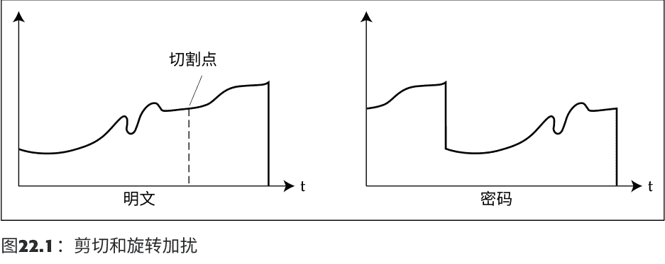

这涉及将视频信号进行模拟到数字的转换，存储在缓冲区中，并在旋转后进行数字到模拟的转换——这个过程在1990年之前几乎可以被塞入低成本的定制VLSI芯片中。然而，这种系统的一个系统性漏洞是视频具有高度冗余性，因此可能可以使用信号处理技术来重构图像。

这是由马库斯·库恩于1995年首次完成的，需要在埃尔朗根大学的超级计算机上实时完成。图22.2显示了一个加密视频的帧，图22.3显示了处理后的同一帧。到目前为止，可以在个人电脑上完成这项工作[1222]。如果此攻击在早些时候是可行的，它将完全破坏系统，因为无论智能卡如何管理密钥，视频信号都可以在没有密钥的情况下被检索出来。混合系统仍然被一些电视台使用，尤其是在不发达国家，同时频繁更换密钥以使盗版者的生活变得不便——他们的问题是如何在破解密钥后将密钥分发给他们的客户。

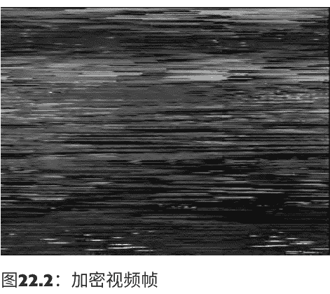

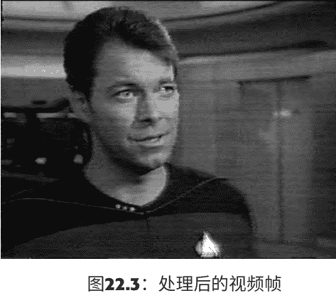

至于主要发达国家的运营商，他们在2000年代初转向了数字系统。这些数字系统的工作原理相同——一个带有加密硬件的机顶盒和一个智能卡，用于保存从ECM中解密内容密钥的个人密钥。然而，现在的加密通常使用块密码来保护整个数字视频流。我将在下一节中描述当前的数字视频广播系统。

混合加扰技术持续了足够长的时间。然而，它们有一些有趣的教训可以教给我们，因为它们在1995年之后的十年里受到了相当有决心的攻击，所以我将花一点篇幅讲述出了什么问题。

#### 22.2.4.3 对混合加扰系统的攻击

给定一组将解密广播视频的机顶盒和一串控制字，下一个问题是确保只有付费客户能够生成控制字。一般来说，可以通过白名单或黑名单来实现。但是，上一代付费电视系统可用的带宽很低——通常每秒只能发送大约十个ECM，或者一天超过五十万个。因此，黑名单方法是主要方法。对于拥有五百万用户的订阅者基数，向每个用户发送单独的消息将需要一周以上的时间。

基本协议是，客户智能卡解释ECM。如果当前节目是订户被允许观看的节目之一，则使用存储在卡中并提供给机顶盒作为控制字的主密钥计算一系列ECM的键控哈希值——本质上是消息认证码（MAC）：

$$CW = MAC(K; ECM_1, ECM_2, ECM_3, ECM_4)$$

因此，如果订户停止支付订阅费，他的卡可以通过发送一个ECM来停止发放控制字，从而使其失效；它需要访问ECM流以便完全计算控制字。因此，只有符合要求的设备应该能够访问主密钥 $K$，并且它们应该在需要时“自杀”。那么会出现什么问题呢？

最初的攻击是对协议的。由于从智能卡发送到机顶盒的控制字对于当前解密节目的每个机顶盒都是相同的，一个人可以通过在智能卡和机顶盒之间放置一台电脑，并将控制字流发布到互联网上来记录控制字流。其他人可以录制加密的节目，并在下载控制字流后解密它们[850]。为此，“密钥记录攻击”存在了一些服务器，但对付费电视行业只是一个小麻烦；很少有观众愿意为了将电脑连接到机顶盒而购买特殊适配器。

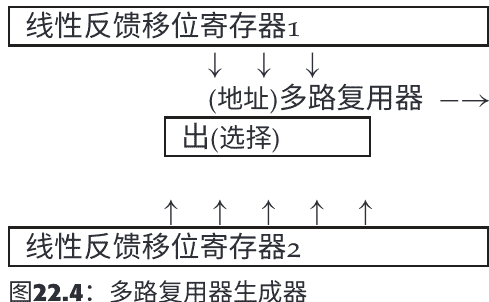

密码分析也给黑客们提供了机会。每隔半秒左右，智能卡会向机顶盒提供一个新的控制字，并将其加载到一个工作原理如下的密钥流生成器中。在Eurocrypt系统中，有两个长度为31和29的线性反馈移位寄存器（LFSR），它们生成长的线性序列。寄存器1的一些位被用作多路复用器的地址线，该多路复用器选择寄存器2的一个位；这个位成为密钥流序列的下一个位。每个连续的输出字节都成为反加扰器的控制字节（图22.4）。

设计师们打算通过让破解者猜测密钥来提高难度，由于密钥长度为60位，平均需要 $2^{61}$ 次猜测，这在当时是不经济的。但事实证明这个密码有一种捷径攻击：诀窍是猜测寄存器1的内容，利用这个地址信息将观察到的密钥流位放入寄存器2中，如果这导致冲突，则拒绝当前对寄存器1的猜测。（我在1985年发现了这种攻击，这是我对密码学产生兴趣的原因。）这样做的效果是，由于每个控制字的高阶四位或者更多可以通过行间相关性轻松推断出来——真正需要努力的是最低有效位。因此，你可以轻松地从密钥流的一部分中获取大约一半的位，并使用密码分析重构控制字。但这种计算仍然与完整的信号处理攻击相当，并且只对爱好者而不是大众市场感兴趣。

其他业余攻击包括“阻塞器”，它可以防止发送给卡的关闭ECM被传递；这样，您可以取消订阅而不让电视台操作员能够取消您的服务[850]。也许最强大的“业余”攻击之一是利用了主密钥泄漏：有人购买了一台二手电脑，出于好奇查看硬盘上是否有任何有趣的已删除文件，并成功恢复了一个完整的付费电视运营商的订户管理系统，包括嵌入式主密钥。这使得可以编写完全模拟订户智能卡的软件——实际上，它可以被“改进”，即在收到ECM的关闭命令时不会关闭自身。

无论如何，一旦这些“低悬的果实”被摘取，商业盗版者就会转向使用微探针技术进行反向工程智能卡。在第16章中，我描述了攻击者和防御者之间的军备竞赛。但硬件级别的修复仅限于新卡发行，运营商不希望每年发行新卡超过一次，因为每个订户的成本为几美元，而订阅费通常不到20美元/月。因此，必须找到其他防御技术。

诉讼虽然在进行，但是花费了时间。一场诉讼在爱尔兰输给了一个海盗，这使得爱尔兰一度成为了海盗通过邮购在整个欧洲销售卡片的避风港。行业的游说力量被动员起来，以推翻都柏林的法律，但这需要几年的时间。例如，到1995年中期，英国主要的卫星电视台（Sky-TV）损失了5%的收入给海盗卡片。

所以在整个1990年代中期，海盗和运营商之间进行了一场反制和反反制的战争。运营商会购买海盗卡片进行分析，并开发各种技巧来导致它们失效。运营商面临的问题是：当系统中的所有秘密都被泄露时，如何仍然对抗海盗？

运营商想出了各种狡猾的技巧。其中一种更有效的方法是将ECM的数据包内容作为代码在智能卡上执行；通过这种方式，现有的卡片基础可以在飞行中升级，并且可以利用真正的卡片和海盗卡片之间的实现差异。任何在两个平台上给出不同答案的计算——即使只是由于无意中的时间差异导致的——都可以输入到MAC算法中，并用于使海盗卡片提供无效的控制字。

其中一个系统（Eurocrypt）从一开始就设计了一个高效的吊销方案。每个订阅者智能卡都包含一个订阅者密钥 $k_i$，并且有一个连接订阅者密钥与当前活动主密钥 $K_M$ 的二叉树中间组密钥 $KG_{ij}$。每张操作卡都知道它与主密钥之间路径上的所有组密钥，如图22.5所示。

在这个方案中，如果密钥 $k_2$ 出现在盗版卡中并需要吊销，那么管理员将发送一系列数据包，让所有其他订阅者卡计算出新的主密钥 $K_{M'}$。第一个数据包将是 $\{K_{M'}\}_{KG_{12}}$，这将让一半的订阅者一次性计算出 $K_{M'}$；然后会有一个 $K_{M'}$ 在更新版本的 $KG_{11}$ 下加密；依此类推。这样即使有一千万的客户，操作员只需传输不到五十个ECM就能完成一次完整的密钥更换。当然，这并不是一个完整的解决方案：还需要考虑如何处理包含多个订阅者密钥的盗版卡，以及如何在不必破解盗版卡的情况下识别泄漏的密钥。但这是一种在对抗措施战争中常用的工具。

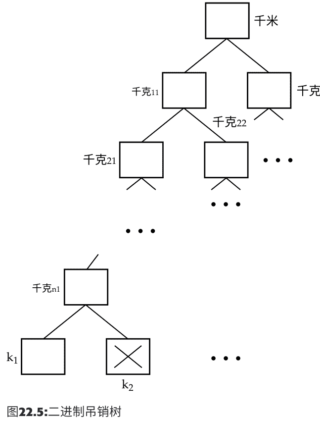

此外还使用了心理策略。例如，一家有线电视台广播了一个免费T恤的特别优惠，并阻止合法观众看到拨打0800的电话号码；这样他们就得到了盗版客户的名单。经济因素在这里也很重要，付费电视盗版者的成功与传统软件公司一样依赖于产品推出时间：一个能在三周内制作出99%正确伪造品的盗版者将击败一个在三个月后制作出99.9%伪造品的竞争对手。因此，盗版者像合法供应商一样争分夺秒，盗版卡也会有漏洞。对经济学的理解有助于你有效地利用它们：最好在你关闭他之前让一个盗版者建立起大量用户群，因为这给他时间消灭他的竞争对手，而且一旦他建立起来，关闭他的卡片会比立即回应对更多潜在客户造成破坏，从而打击他的信誉。但是如果你等他太久，他可能会获得财务和技术资源，成为一个持久的问题。

付费电视行业学会了提前计划安全恢复，并在产品中隐藏了一些最初未使用但可以后续激活的功能。（和往常一样，几年前，另一个行业——在这个特定案例中是纸币印刷商——已经学到了同样的教训。）

最终，智能卡通过在处理器硬件中包含专有的加密算法，使得伪造变得更加困难。由于攻击者无法简单地使用探针读取算法，而是必须对芯片中的数千个门进行逆向工程，他们将具备技术能力进行攻击的实验室数量减少到几十个。其中许多实验室是通过咨询协议或其他赞助方式被吸引到该行业的。那些留在“帐篷”外面并构成威胁的人受到了密切监视。严格的法律执法提供了链条中的最后一环。该行业追捕了主要的商业盗版者，并让他们倒闭，无论是让他们入狱还是通过诉讼淹没他们。

在20世纪最后一个大型付费电视盗版案中，英国盗版者克里斯·卡里被判伪造了他通过加拿大一家公司逆向工程设计的Sky-TV智能卡，花费了105,000美元。然后他通过爱尔兰的一家前台公司销售伪造的卡片，因为当时在爱尔兰这并不违法[922]。因此，Sky TV的安全顾问渗透到他在都柏林的销售办公室，并悄悄复印了足够的文件证明该操作实际上是由英国运营的[645]。英国当局起初不想起诉，所以Sky提起了私人诉讼并使其被判有罪。当他后来从监狱逃脱时，Sky的私人侦探不懈追捕他，并最终在新西兰抓住了他，当时他正使用一个死人的名字和护照潜逃[575]。

因此，付费电视的历史强调了一个教训，即必须使版权保护的工程和法律方面相互配合。单独一个方面都不太可能足够。

#### 22.2.4.4 DVB

数字视频广播（DVB）主要使用一套标准进行操作，这些标准自1996年以来已经发展了十年，并由DVB联盟控制。这些标准非常复杂，涉及到IPTV、数字地面电视、卫星电视，以及免费电视和付费电视。

保护机制仍在不断发展中，其中一些受到保密协议的保护。付费电视的条件访问机制与混合系统类似：内容加密是数字化的，但密钥是由订户智能卡生成的，这些智能卡在EMM和ECM上运行。加密使用DVB通用扰码算法，该算法仅在保密协议下可用。智能卡没有标准化（除了接口层），因此每个广播公司都可以使用自己喜欢的加密技巧和供应商；到目前为止，盗版问题仍然存在。似乎涉及智能卡克隆，但自2005年以来，没有任何主要系统被完全破解（NDS在Cary案中表现出的无情可能起到了威慑作用）。

当前的标准化工作集中在内容保护和复制管理（CPCM），这是一套在数字内容解密后在家中提供保护的机制。目标是使机顶盒和其他消费电子设备能够协同工作，这样从付费电视购买电影的客户可以将其存储在个人视频录像机或个人电脑上，并在以后观看。基本思想是在一个家庭中的所有符合CPCM标准的设备将加入一个“授权域”，在该域中可以共享媒体并记录使用信息。这项工作仍处于概念验证阶段。已经建立的数字版权管理（DRM）供应商，如微软，已经有机制可以在其专有生态系统内的符合标准的设备之间移动受保护的内容，并且DRM供应商有强烈的经济激励来保持其系统不兼容。供应商也存在激励问题：如何阻止每个个体设备供应商尽可能削减其保护措施？

一个不好的例子来自于DVD的世界。

### 22.2.5 DVD

消费电子行业在1996年推出了数字视频光盘（DVD），后来改名为数字多用途光盘。和往常一样，好莱坞感到恐慌，并表示除非DVD有一个良好的副本保护机制，否则一流的电影将不会发布。因此，在最后一刻加入了一种叫做内容加密系统（CSS）的机制；对此的争论拖延了DVD的发布，并且它是匆忙设计的。

DVD具有区域编码：它将世界分为五个区域，并且光盘只能在某些指定区域的播放器上运行。目标是支持传统的做法，即先在美国发布电影，然后在欧洲等地发布，以最大程度地减少制作胶片的成本以及电影失败造成的财务损失。但是，强大的区域编码实现对供应商来说并不重要；很明显，用户更喜欢购买可以关闭区域编码的DVD播放器，因此供应商争相确保每个人都知道如何在他们的产品中关闭它。随着互联网的推动，区域编码变得不那么重要了，电影制片厂趋向于在全球范围内同步发布电影。

区域编码的失败是另一个例子，说明当必须实施某种保护措施的人不是遭受失败成本的人时会发生什么。这导致了CSS的漏洞，DVD发布时该漏洞已经为人所知[1004]。我听说设计师们被告知在两周内提出一个副本保护方案，使用不超过3,000个门，并将密钥长度限制在40位，以便设备不会违反当时的美国出口法规。无论责任归谁，他们的系统实际上能够坚持三年是相当奇怪的。CSS的详细描述是许多诉讼的主题，美国法院曾对发布它的网站发出许多禁令。

事实上，备受争议的《数字千年版权法案》（DMCA）常常用于美国的诉讼，旨在加强其技术保护。法律威胁的泛滥适得其反，好莱坞只是激怒了所有人。1999年，加利福尼亚法院禁止发布DeCSS，但不禁止指向其实现的链接；纽约法院在对黑客杂志《2600》的案件中则增加了对链接的禁止。这些禁令被视为审查制度，解密CSS的软件开始出现在美国以外的网站上，出现在T恤上、歌曲中，以及其他享有宪法保护的言论形式中。这只是使软件更广泛地分发，并使好莱坞看起来很愚蠢[772]。他们的律师继续犯错，说服挪威政府起诉一名少年Jon Lech Johansen（DeCSS的作者之一）。他在1999年10月发布了代码，2003年上诉时被无罪释放，最终在2004年，挪威政府决定不再重审。

这是CSS¹的简要描述。它基于一个流密码，类似于图22.4中的密码，只是多路复用器被一个完整的加法器所替代：每个连续的密钥流位通过将移位寄存器的下两个输出与进位相加来获得。将移位寄存器的异或操作与组合器的加法进位相结合，如果有五个长度互质且大于70 [1093]的移位寄存器，实际上可以得到一个强密码；但在CSS中，只有两个长度为17和25的寄存器，因此存在一种 $2^{16}$ 的快捷攻击。当密码用于保护密钥而不是数据时，还有一个进一步的混淆步骤；但这只会增加复杂性到 $2^{25}$。

每个播放器都有一个或多个特定于制造商的密钥，每个DVD光盘都有一个在每个制造商密钥下加密的光盘密钥 $k_d$。

> ¹ 律师注意：这是在2001年第一版中发表的。

（其中409个在1999年）$km_i: \{kd\}_{km1}, \{kd\}_{km2}, \{kd\}_{km3}, \dots, \{kd\}_{km409}$。还有一个通过将 $kd$ 加密自身计算得出的哈希值：$\{kd\}_{kd}$。实际内容受到从 $kd$ 派生的扇区密钥的保护。当然，鉴于密码可以在 $2^{25}$ 的努力下被破解，任何磁盘密钥都可以从单个磁盘哈希值中找到。

DVD联盟希望通过经济压力保持足够数量的制造商密钥保密：这个想法是，如果任何制造商的主密钥泄漏，那么它将不会在未来的光盘上使用，因此他的播放器将无法播放新的发行版。因此，制造商将实施良好的防篡改措施——或者希望如此。但CSS的设计不支持这一点：在系统中给定任何一个密钥，所有其他密钥都可以立即找到。

此外，大规模生产的消费电子产品的经济学就不允许为了一个防篡改处理器多花几美元。实际上，CSS违反了柯克霍夫原则，因为它依赖于保持秘密来保护自己，这是不现实的。我不认为联盟认为可以把一家大型电子公司列入黑名单，因为这不仅会引发恶性诉讼，而且还意味着数百万诚实的消费者购买了该公司的产品后，他们将不得不去购买一台新的DVD播放器。这种抗议声将会太大；如果这个按钮曾经被按下，我预计政府可能会迅速通过法律要求所有DVD都有所有主密钥。（我将在后面讨论行业如何希望通过新的蓝光标准更好地管理吊销。）

另一个问题来自于是个人电脑是一个开放平台的事实。DVD联盟要求制作DVD播放器软件的人对其代码进行混淆，以使其难以逆向工程。相应的论文介绍了系统软件混淆的技巧[96]。这些技巧可能会使逆向工程的成本从几天的工作增加到几周的工作，但一旦CSS设计出来，就没有其他办法了。

来自Linux的一个更严重的问题，这是数百万人使用的开源PC操作系统。DVD联盟的理念和架构与向Linux社区提供DVD驱动程序的一致性不符。因此，随着带有DVD驱动器的个人电脑开始取代带有CD驱动器的个人电脑，Linux用户社区要么必须破解CSS，要么放弃使用Linux而转向Windows。在这种情况下，有人会找出CSS并出现DeCSS只是时间问题。

无论如何，DVD遵循了通常的模式：好莱坞感到恐慌，并拒绝发布他们最好的电影；采取技术措施来防止复制，但这些措施被破解；然后进行诉讼。我在2001年写道：“一个理智的人可能希望工作室最终会明智地从销售DVD中获得大量利润。当然会有复制，但这还不完全是微不足道的——即使使用DSL调制解调器，将4GB的DVD电影发送出去也需要几个小时。朋友，而且个人电脑的磁盘空间也是一个问题。”这已经成为现实；尽管有些工作室坚持了一两年，但他们都在几年内加入了DVD的行列，迪士尼现在大部分的收入都来自DVD销售。点对点共享是一个问题，但由于带宽和磁盘空间的限制，对于电影来说不像音乐那样严重。

那么，我们会看到高清视频重复出现相同的模式吗？接下来，让我们看看正在引入的新一代DVD格式，希望抓住为高清电视制作的录音市场，以及更长的视频录制和其他数据的大规模存储。

### 22.2.6 高清DVD和蓝光

当我在2007年写这一章节时，两种DVD的继任者之间的格式战正在激烈进行，每种都得到了一个大型工业联盟的支持。HD-DVD和Blu-ray在许多方面都很相似；它们都使用较短的波长激光比传统的DVD更密集地编码信息，因此标准光盘可以存储25 GB，双层光盘可以存储50 GB。它们都使用一种名为AACS的内容加密系统，而Blu-ray还添加了一个有趣的额外机制称为SPDC。（在2008年初我在校对时，很明显Blu-ray获胜了。）

#### 22.2.6.1 AACS — 广播加密和叛徒追踪

高级访问内容系统（AACS）具有开放的设计，文档化在[647]中。其设计目标包括在嵌入式和通用计算机上提供强大的可更新保护，以限制受保护材料的输出和记录仅限于批准的方法。加密使用AES完成。

密钥管理基于广播加密方案。这个基本思想，由李功和大卫·惠勒提出，是给每个用户一些不同的密钥，从一个大的密钥池中选择，并安排事情，使得任意两个用户都能找到一些共同的密钥子集[540]。

因此，大量的人可以互相交流而不需要为每个用户提供唯一的密钥（或公钥证书，或Kerberos服务器）。Amos Fiat和Moni Naor将此应用于付费电视：广播公司为每个解码器提供一小组密钥，并设置内容密钥，以便每个解码器可以使用其密钥的子集来计算它们[469]。当解码器被破坏时，它的密钥将不再使用，许多研究人员致力于优化事物（使解码器不需要保存太多密钥，并且在密钥材料需要更新之前可以撤销其中很多）。AACS为每个解码器提供256个设备密钥，并且与光盘捆绑的信息告诉解码器使用哪些密钥以及如何创建处理密钥。这个想法是每个处理密钥只用于一组光盘。该机制是一个媒体密钥块，告诉解码器如何通过组合现有的媒体密钥来获取处理密钥。目标是能够像图22.5中的吊销树一样移除单个设备，尽管细节有所不同；AACS基本上使用了一个子集差异树，使得每个解码器都能得到相同的结果（详见规范[647]）。当解码器被吊销时，可以分发一个新的MKB，但该解码器将无法使用。处理密钥反过来保护一个卷唯一密钥（VUK），该密钥又保护一个标题密钥，该密钥加密了内容。

这样可以较小地影响吊销已经被未经授权的转录软件整合的播放器的密钥。与传统的DVD不同，制片公司不再需要吊销所有该制造商的播放器，AACS允许他们吊销单个机器；广播加密方案使他们能够针对数十亿个播放器中的一个，而不是数百个制造商中的一个。

它有用吗？目前，从软件DVD播放器中提取密钥的稳定流正在进行中，基本上是通过从内存中读取它们并发布。首先，这些是VUKs，而那已经够糟糕的了：一旦一个VUK被知道，任何人都可以解密该磁盘的内容。但最近，处理密钥也被发布了。理论上，出版商应该使用许多不同的处理密钥，但现在看来，许多人都在为所有磁盘使用同一个处理密钥。当它被破坏时，他们会更换它，但黑客似乎并不太难从DVD播放器软件中找到处理密钥，而每个处理密钥都可以让人们解密直到下一个密钥更换的所有内容。通常，律师们发布威胁信、禁令和下架通知给出现处理密钥的网站，而那些不喜欢好莱坞的人则喜欢以各种创新的方式发布这些密钥。第一个被发布的处理密钥出现在T恤上并注册在域名上；它出现在Digg.com上，当管理员将其删除时，Digg的用户起义并迫使他们退缩。这又是一次似曾相识的经历。

因此，尽管广播加密是一个不错的想法，但似乎仅靠它本身无法阻止人们解密电影。

AACS中有一些功能似乎尚未被使用。例如，有一个叛徒追踪方案。叛徒追踪的想法是给每个副本添加一些独特的标记，因此如果解密内容出现在点对点网络上，制片公司就知道该起诉谁。这种方法已经在电影院电子发行中使用过，目标是识别允许盗版者用摄像机记录新电影的电影院。另一个应用是在奥斯卡颁奖典礼上，学院成员会收到候选电影的DVD副本。这些副本过去经常泄漏；但在2004年，制片公司开始对其进行个性化处理后，演员卡米内·卡里迪被判支付30万美元，因为取证技术确认他是信息来源。泄露的屏幕副本在21个国家[1250]中提供了母版，用于非法复制。从那时起，学院成员变得更加谨慎。

在小规模分发中，可以在生产过程中标记副本，但在大规模生产光盘时不可行。因此，在解密过程中需要一种方法来增加唯一性。AACS是如何支持这一点的，如下所示。通常，每个单元（时间段）都由一个标题密钥解密，但发行者可以插入一个序列密钥单元——每个单元都使用不同的段密钥加密，一个光盘中最多可以有32个序列密钥单元。密钥管理机制被安排得不同的播放器将派生出不同的段密钥。因此，如果解密的内容出现在某个地方，内容所有者可以看到使用了哪些段密钥，并从中推断出使用了哪个播放器。每个段的实际标记可能是来自生产过程的明显特征，例如演员穿的衬衫的颜色，或者更可能是一个强大的隐藏标记（稍后我会描述）。然而，AACS中的叛徒追踪机制似乎迄今尚未部署。

#### 22.2.6.2 蓝光和SPDC

因此，HD-DVD中的内容保护开始显得有些不稳定，这有助于竞争格式蓝光，因为它还支持一种称为自我保护数字内容（SPDC）的新颖保护机制。

SPDC是一个非常巧妙的想法，试图解决潜在的激励问题——虽然是制片厂想要保护内容，但提供保护的是设备制造商。创新之处在于每个播放器都包含一个虚拟机，可以运行与每个标题唯一相关的内容保护代码。制片厂编写此代码，并且可以在一个光盘到下一个光盘，甚至在同一光盘的不同版本之间进行更改。这为制片厂提供了多种应对妥协的选择，并且他们可以直接采取行动，而不必通过贸易协会、标准机构或供应商来解决问题。

- 如果某个特定的播放器被发现泄露内容，他们可以在以后的光盘中将其列入黑名单；
- 如果某种特定类型的播放器泄露内容，他们可以安排它只输出低分辨率视频；
- 在追踪方面，他们可以自己做；内容可以在解码后标记。

这不仅避免了依赖AACS机制来识别受损播放器或播放器类型，而且在音频和视频中可以更广泛地嵌入标记。出于这些原因，SPDC提供的保护比AACS中的密钥管理和设备吊销机制更具弹性；它在一份评估报告[637]中有所描述。截至2008年初，制片厂一直在与使用SPDC的电影的初期问题作斗争，但他们决定支持它；现在看来SPDC帮助蓝光赢得了格式战争。

数字版权管理工程师面临两个工程挑战。首先，人们越来越希望将他们购买的内容从一台设备转移到另一台设备。如果你购买并下载了最新的马勒第五交响曲录音，你希望不仅可以在笔记本电脑和iPod上播放，还可以在家庭音响系统上播放；如果你购买并下载了一场棒球比赛，你希望在宽屏电视上观看。其次，随着你将内容和保护内容的密钥在越来越多的平台上提供，泄漏的风险也随之增加，而激励措施可能会越来越不协调。

无论如何，随着越来越多的数字内容使用DRM在线分发，我们需要关注下一步。

## 22.3 通用平台

在1990年代中期，许多研究人员开始研究如何控制通过互联网向个人电脑客户销售和分发数字商品。最初的应用包括从科学期刊[221]分发报纸和文章，尽管人们一直知道音乐和视频会在网络带宽足够的时候跟进。

基本问题在于，作为通用计算机，PC原则上可以复制任何文件并将其发送给任何其他计算机；与模拟复制不同，复制是完美的，因此可以从一个原始文件制作成数百万个副本。问题的复杂性在于，从内容供应商的角度来看，PC所有者是“敌人”。音乐行业认为无限复制会摧毁他们的业务；计算机行业告诉他们，在通用计算机上实现DRM是不可能的，所以他们最好找到一个新的商业模式。尽管音乐和电影行业的规模只有计算机行业的分之一，但在国会中有更大的影响力（一位微软的人告诉我，这是因为普通国会议员更愿意与麦当娜合影，而不是与比尔合影）。所以好莱坞得到了它想要的。结果是一些通常被称为数字版权管理或DRM的产品。

有趣的是，尽管在1990年代，计算机界和好莱坞之间关于DRM是否可能或可取的争论非常激烈，但现在似乎他们两方都可能站错了队！更强大的DRM事实证明对平台供应商（如苹果）的利益更大，而不是内容公司（经济学家曾经预测过这一点）。尽管所有DRM机制似乎迟早会被破解，但对复制的适度限制确实对业务产生影响。

但是，随着下载网站开始销售无保护的MP3文件，目前还不清楚这是否是严格必要的。然而，我稍后会回到政策问题上。首先，让我们来看看最常见的DRM机制，Windows Media Player。

### 22.3.1 Windows Media Rights Management

在撰写本文时，Windows Media Player（WMP）随每个销售给普通PC的Windows副本捆绑在一起。这将会改变，因为欧洲法院认为这种捆绑是一种反竞争行为，并命令微软提供没有捆绑的Windows。然而，人们仍然可以免费下载它，并且考虑到使用Windows Media文件格式的网站数量众多，它肯定会继续是一个重要的平台。

WMP在Windows 98发布时取代了早期的媒体播放器应用程序。它使用户能够播放音乐、观看视频和查看照片，并具有各种功能，从MP3播放器支持到卡拉OK歌词同步。然而，我们在这里的主要兴趣是它能够播放使用Windows Media Rights Management (WMRM) 保护的文件。其工作原理如下。

希望销售数字媒体的商店使用内容密钥对每个项目进行加密，并将加密文件放在通常与其网站相关联的流媒体服务器上。为了访问媒体对象，客户必须获取许可证，其中包括对象标识符、许可证密钥种子以及一组使用权限管理语言的指令，说明她可以对其进行哪些操作；她可以播放多少次，是否允许将其刻录到CD上等等。许可证由许可证服务器生成并使用她的公钥进行加密。许可证获取可能需要她访问注册或付款页面，或者可能在后台默默进行[1049]。

为了使用这个系统，客户必须首先个性化她的媒体播放器，这是在她第一次访问受保护的内容时自动完成的。播放器生成一个公钥/私钥对（WMP使用椭圆曲线密码学），并将公钥发送到许可证服务器。架构与付费电视条件访问非常相似，因为保护音乐或视频的批量加密任务与密钥管理的个人任务分离，所以视频不必为每个客户重新加密。就像付费电视智能卡在密钥泄露或密钥管理机制受损时可以被替换一样，WMRM的密钥管理功能是在软件的“个性化黑盒”（IBX）组件中执行的，根据需要进行替换。

微软没有公开记录IBX的内部情况，但根据2001年逆向工程WMP版本2的人们的描述，基本组件包括用于公钥加密的椭圆曲线密码学；用于对称加密的DES、RC4和专有密码；以及用于哈希的SHA-1 [1141]。客户的私钥被黑盒遮蔽并隐藏在一个文件中。客户先前获取的许可证存储在许可证存储中；当遇到新对象时，软件会查找对象ID和密钥ID，如果尚未为它们存储许可证，则发送一个会话密钥，使用许可证服务器的公钥进行加密。会话密钥用于加密返回的许可证。一旦客户端软件使用会话密钥解密许可证，它将被添加到许可证存储中。存储的许可证还有进一步的加密层，可能是为了防止人们读取明文密钥或操纵权限：内容密钥使用客户的公钥进行加密，并且还有数字签名。当然，到现在为止，协议可能已经进行了调整——因为微软不得不多次从黑客攻击中恢复，并且因为WMP现在已经拥有了更多的功能。

WMRM最基本的用途是提供流媒体服务，使人们更难从新闻网站和互联网广播中录制音乐和视频。（供应商似乎已经放弃了音频，因为在解密后将音频传递给声卡时很容易录制音频；但是微软在Vista中正在努力阻止人们以这种方式获取视频[570]。）WMRM的更复杂的用途包括音乐订阅服务，您可以下载任意数量的歌曲，但如果您停止付费，所有歌曲都将无法播放；以及地理位置相关的服务，例如MLB.com，除了球队所在地区之外的所有地方都可以观看美国职业棒球大联盟比赛——这些权利通常已经以巨额费用出售给当地电视台。

### 22.3.2 其他在线版权管理系统

微软的提供是相当典型的版权管理系统。苹果的FairPlay，在iPod和其媒体播放器QuickTime中使用，也有以主密钥加密的曲调，并且当用户购买曲调时，会发送以随机会话密钥加密的主密钥，以及会话密钥以他的iTunes播放器的RSA公钥加密。会话密钥在苹果的服务器上进行在线备份。与Windows一样，出现了一些程序可以解锁受保护的内容，然后苹果公司相应地升级了iTunes以阻止这些程序在2006年9月之后的使用。

在2000年代中期，消费者和行业团体呼吁DRM系统变得更具互操作性。Real Networks是PC的另一个主要媒体播放器软件供应商，其RealPlayer使用自己专有的DRM。在类似于20世纪80年代的文字处理文件格式战争的争斗中，Real在2004年使他们的音乐曲目可被iTunes读取；苹果公司以诉讼相威胁，并在2006年的升级中终止了兼容性。这应该不会让任何人感到惊讶：回想一下第7.3.2节中讨论的软件公司价值如何取决于其客户的完全依赖。2007年，苹果的史蒂夫·乔布斯呼吁音乐行业以无DRM的形式销售音乐；这令人惊讶，考虑到苹果面临的激励。然而，这个赌注似乎正在取得成功，因为一些音乐唱片公司现在开始提供无保护的音乐，但价格更高且规模不足以威胁苹果对其iTunes的客户基础。苹果的收入继续飙升，而音乐巨头则看到销售额下滑。

开放移动联盟 (OMA) 是一个促进移动设备上互操作数字版权管理的标准的联盟。其OMA DRM 1.0版本广泛用于保护手机铃声；它主要由一个简单的权利管理语言组成，其最重要的特性是“前向锁定”：一种标记内容的方式，使手机知道它不能将对象转发给任何其他设备。下载保护通常使用标准的TLS机制。2.0版本在表达能力上与WMRM或FairPlay类似，但仍未被广泛使用。网络运营商反对任何其他人直接访问他们的客户基础的想法。

### 22.3.3 点对点系统

点对点文件共享已成为在线音乐分发的主要方式之一。在音乐行业律师关闭Napster的初始音乐共享服务之后，Gnutella和Freenet等系统借鉴了抗审查系统的思想，建立了没有中心节点的网络，这些网络无法通过法律攻击关闭。

我是一个早期抗审查系统的设计者，即永恒服务。当一个早期的匿名转发者，anon.penet.fi，因为被科学教派的法律诉讼而关闭时，我感到震惊[590]。它被用来发布一条让他们不悦的消息。其中包含了一位他们教会的前牧师的宣誓书，其要点据报道是指控一旦成员完全入门，他们会被告知整个人类都在受到虚假意识的折磨；而事实上，耶稣才是坏人，而路西法才是好人。历史上有很多宗教都谴责竞争对手既被蒙蔽又邪恶；科学教派的创新之处在于声称这些细节是他们的版权。他们在多个司法管辖区成功提起诉讼。

永恒服务的设计目的是通过将文件片段分布在网络上来提供长期文件存储，加密以使托管它们的人无法知道他们拥有哪些片段，只能通过转发机制进行重建[41]。这个系统的后续版本是Publius，它还提供了一个抗审查的匿名发布机制[1309]。

1999年，18岁的辍学生肖恩·范宁通过创建Napster服务彻底改变了音乐业务，使人们能够共享MP3音频文件之间的互相交换[931]。Napster并没有将文件集中存储，这样做会引发法律诉讼，而是提供了一个索引，以便想要某个音轨的人可以找到谁还拥有它并愿意共享或交换。它吸引了数千万用户，然后遭到好莱坞的诉讼，于2001年关闭。它留下的空白迅速被Gnutella和Freenet等点对点网络填补[297]，这些网络受到早期抗审查系统的启发。随后出现了商业系统，如Kazaa和eMule，也成为音乐行业律师的目标（其中许多系统被认为充斥着间谍软件）。

美国版权局将点对点网络定义为直接连接计算机而不是通过中央服务器连接的网络。没有可以被法院关闭的服务器，这给音乐行业的执法者带来了了一个有趣的问题。他们试图通过宣传来解决问题，通过宣传那些不小心将P2P程序设置为共享整个硬盘而不仅仅是音乐文件的人的故事。但音乐行业所依赖的两种策略是起诉上传者和对系统进行技术攻击。

在第21.5节中，我解释了社交网络通常容易受到斩首攻击的脆弱性，因为它们的连通性依赖于少数几个特别连接的节点。关闭这些节点将使网络断开连接。同样，点对点网络有着连接良好的节点，在文件共享系统中，也有一些节点的所有者贡献的上传内容超过了他们应贡献的份额。音乐行业多年来一直以来法律行动来针对关键节点，自2003年以来已经提起了超过20,000起诉讼。在许多情况下，人们同意停止侵权并支付一小笔罚款，而不是打官司；但在2007年10月，明尼苏达州杜卢斯的联邦陪审团判定30岁的贾米·托马斯因在Kazaa上分享材料而被判侵犯版权，并命令她为该案件涉及的24首歌曲中的每首歌曲支付9,250美元。

在技术对策方面，人们早就知道音乐行业的公司会上传损坏的音乐文件来垃圾邮件系统（这通常是合法的），并且有人怀疑他们还进行了拒绝服务攻击（在许多司法管辖区内是非法的）。但是没有证据。然后在2007年9月，一家名为Media Defender的公司，该公司为音乐行业从事“文件共享缓解”工作，遭受了数千封内部电子邮件泄露的尴尬，因为一名员工将他的电子邮件转发到了Gmail，并且他的密码被泄露。这些电子邮件不仅透露了许多“缓解”策略的细节，还揭示了该公司与纽约州检察长办公室密切合作的事实，这可能会让人感到尴尬，因为该行业可能非法攻击计算机并侵犯隐私。事实证明，Media Defender的商业模式是每张专辑收费4000美元。

---
注2：对于非美国读者：革命家亚历山大·汉密尔顿、约翰·杰伊和詹姆斯·麦迪逊在写《联邦党人文集》时使用笔名普布利乌斯，这是一部于1787-8年在纽约州报纸上发表的85篇文章，帮助说服纽约选民批准美国宪法。

每个月2,000美元，每个月每个轨道2,000美元，用于对1500万个P2P网络用户进行攻击的“保护”[1009]。

据说康卡斯特也曾对点对点系统进行攻击，通过发送伪造的重置数据包来中断其客户使用BitTorrent的连接。康卡斯特可能更希望其客户通过其有线网络观看电视，以便看到其广告，而不是通过文件共享；但如果这是真的，这些指控将引发一些公共政策问题：BitTorrent与福克斯和米高梅等内容所有者合作，而康卡斯特不是执法机构[155]。无论如何，对文件共享者的骚扰正在推动一场军备竞赛；在2006年至2007年期间，加密的BitTorrent流量比例从4%上升到40%[1346]。

### 22.3.4 半导体IP的权限管理

另一个现实问题是保护用于半导体的授权设计。像ARM这样的公司通过设计处理器和其他组件来谋生，然后将其销售给制造定制芯片的公司，无论是通过设计特定应用集成电路（ASIC）还是使用现场可编程门阵列（FPGA）。

第一个问题是超产。一个相机公司许可了一个电路，他们将其集成到一个加载到FPGA中的比特流中，然后成为一个新相机中的关键组件，他们在中国的工厂中制造。他们支付了10万个许可证，但市场上出现了20万台相机。有两种故障模式：相机公司可能订购了额外的产量并对IP所有者撒谎，或者中国工厂可能欺骗了相机公司。实际上，他们两者都可能在作弊，每个人都决定多制造5万台。现在相机公司可以使用一些技术机制，例如在制造后为每个相机个性化设置序列号等等，但这可能会增加作弊的难度。

第二个问题是如何知道一个产品是否包含特定的电路。相机公司可能已经授权了一个处理器或者滤镜给某个型号，然后又将其内置到另一个更便宜的型号中，而没有声明。

这些风险导致了部分市场失效，因为大型知识产权供应商通常更愿意将他们最好的设计授权给其他值得信赖的大公司，所以小型初创公司很难在平等的条件下竞争[1348]。它们还压低了可编程逻辑器件（FPGAs）的销售额，这些器件的制造商非常希望有一个用于设计知识产权的权利管理系统。到目前为止，已经做到的最好的是通过分发加密的位流和整个芯片的更新来解决第一个问题；而第二个问题要困难得多，因为芯片设计工具将完全处于信任边界之内。客户需要能够评估设计并调试设计，同时保持一定的控制权。目前，通常能做到的最好的是使用侧信道进行取证。半导体IP的所有者可以购买可疑商品的样本，对其进行操作，并观察芯片的精确功耗、电磁辐射、热特征等，这通常可以揭示特定功能组件的存在。

这引出了版权标记的问题，这已经发展成为一个庞大而复杂的研究领域。

## 22.4 信息隐藏

好莱坞对于寻找保护版权的新机制的兴趣与军方对于不引人注目的通信以及公众对于政府控制加密的担忧在20世纪90年代中期汇聚在一起，开始推动信息隐藏领域的快速发展。这主要指的是使数据隐藏在其他数据中的技术，例如将秘密消息隐藏在MP3音频文件中，或者将程序的序列号嵌入某些指令执行的顺序中。

好莱坞的兴趣在于版权标记，这些标记可以悄悄地隐藏在数字音频、视频和艺术品中。这些通常是隐藏的版权信息的水印，或者是隐藏的序列号的指纹。例如，当你从苹果的iTunes音乐商店下载一个MP3文件时，它包含了嵌入在音频中的一个指纹，用来识别你的身份。这样，如果你将你的副本上传到一个文件共享系统中，版权所有者可以起诉你。（这并不普遍：有些人认为指纹识别会因为法律风险而降低整体销售额。例如，亚马逊不会对MP3下载进行标记[577]。）

隐私的兴趣在于隐写术，其目的是将一条消息嵌入到某个覆盖媒体中，以使其存在不可检测。概念模型，由Gus Simmons [1169, 1176]提出，如下所示。爱丽丝和鲍勃被关在监狱里，希望策划一个逃跑计划；他们所有的通信都要经过看守威利；如果威利发现任何加密的消息，他将通过将他们投入单独监禁来破坏他们的计划。所以他们必须找到一种方法将他们的秘密消息隐藏在一个看似无害的文本中。就像密码学领域一样，我们假设正在使用的机制为看守所知，因此安全性必须完全依赖于爱丽丝和鲍勃某种方式共享的秘密密钥。

与电子战有一些相似之处。首先，如果将隐写术视为一种低截获概率的通信方式，那么版权标记就类似于相关的抗干扰通信技术：它可能使用相同的方法，但为了抵抗有针对性的攻击，它的比特率很可能要低得多。我们可以将威利视为试图通过扭曲音频或视频信号，以使版权标记检测器失效的海盗。其次，像直接序列扩频等最初用于电子战的技术正在信息隐藏领域得到广泛应用。

当然，版权标记不必隐藏才能发挥作用。一些电视台将其标志以可见但不显眼的方式嵌入到画面的角落，许多数字版权管理系统将控制标签与内容捆绑在一起并且相当明显可见。在许多情况下，这将是适当的技术。

然而，在接下来的内容中，我们将集中讨论隐藏的版权标记。

### 22.4.1 水印和复制生成管理

DVD联盟担心数字视频或音频可能被解码为模拟格式，然后重新分发（所谓的“模拟漏洞”）。他们着手发明一种能够在模拟信号下工作的复制生成管理系统。这个想法是，一个视频或音乐轨道可能没有标记，或标记为“永不复制”，或标记为“仅复制一次”；符合要求的播放器不会记录标记为“永不复制”的视频，并且在记录标记为“仅复制一次”的视频时，会将其标记更改为“永不复制”。商业销售的视频将被标记为“永不复制”，而电视广播和类似材料将被标记为“仅复制一次”。通过这种方式，提供给消费者的DVD播放器可以无限制地复制家庭视频和时移观看电视节目，但不容易被滥用用于商业盗版。

所提出的机制依赖于在内容中隐藏一个或多个版权标记，并在[193, 800]中进行了审查。对于每个磁盘，选择一个票据$X$，它可以是一个随机数，加上复制控制信息，再加上可能是一些与物理介质唯一相关的信息，比如引导轨道中的摆动。使用单向哈希函数 $h$ 计算 $h(X)$，然后计算 $h(h(X))$。将 $h(h(X))$ 嵌入视频中作为隐藏的版权标记。确保符合规定的设备寻找水印，如果找到水印，将拒绝播放一首曲目，除非提供 $h(X)$，并通过哈希它并将其与标记进行比较。最后，安排事情，使得符合规定的设备只有在给定 $X$ 的情况下才会记录一个带有标记的曲目，此时只会写入一个 $h(X)$ 到新的光盘中。这样，原始介质中的“仅复制一次”曲目就变成了新介质中的“不再复制”曲目。DVD音频使用了这样的标记机制；SDMI还使用了一个易损的水印，它会被未经授权的处理损坏。（我将在下一节讨论去除标记的技术。）

使用视频内容标记的主要用途将是，如果蓝光胜出高清DVD的标准战争。然后，SPDC处理器将能够实时嵌入解密内容的唯一指纹。从解码器派生的每个明文副本都可以是唯一的，制片厂可以使用取证技术确定它来自哪个解码器。除非解码器本身被破坏，标记机制可以提供一种更具弹性的方式来识别泄露内容的订阅者。这引发了一些问题。首先，标记的效果如何？其次，标记的可扩展性如何？第三，政策方面如何？

质量让我们回到我们的老朋友，ROC。对于一个标记机制来说，无论是用于副本管理还是用于叛徒追踪，仅仅具有低的漏报率是不够的；它还需要低的误报率[892]。如果你的合法DVD播放器错误地检测到你婚礼视频中的“禁止复制”标记，那么你就必须购买一个盗版播放器来观看它。那么有哪些标记是可能的，它们对伪造、欺骗和其他攻击有多么强大？

### 22.4.2 通用信息隐藏技术

信息隐藏甚至可以追溯到密码学之前，它的根源在于伪装。希罗多德记录了希腊人和波斯人之间战争中使用的技巧，包括将消息隐藏在猎人携带的野兔的肚子里，将其刺青在一个剃光头发后又长出来的奴隶的头上，以及将其写在一个写字板的蜡下的木底上[595]。弗朗西斯·培根提出了一种系统，通过在书中使用两种不同的字体，每个字母一位地嵌入二进制消息[1016]。直到相当现代的时候，大多数作家认为隐藏机密信息比加密机密信息更重要[1345]。

军事组织仍然大多持有这种观点，并使用了各种技术，从二十世纪大部分时间间谍使用的微点到低截获概率的无线电。

当涉及将数据隐藏在其他数据中时，现代术语的主题如下[1023]。版权标记，或者在隐写术中，嵌入的文本，被隐藏在覆盖文本中，产生标记文本，或者在隐写术中，被隐藏在隐写文本中。在大多数情况下，此过程中使用了额外的秘密信息；这是标记密钥或隐写密钥，并且通常需要其某个函数来恢复标记或嵌入的文本。在这里，词‘文本’可以根据需要替换为‘音频’、‘视频’等。

已经提出了各种各样的嵌入方案：

- 许多人提出了将标记或秘密消息隐藏在音频或视频信号的最低有效位中。这通常不是一个很好的策略，因为隐藏的数据在统计上很容易被检测到（最低有效位不再与图像的其余部分相关），并且很容易被移除或替换。它也受到有损压缩技术的严重破坏。
- 更好的技术是将标记隐藏在由秘密密钥确定的位置上。这最早是在古代中国发明的。发送者和接收者都有一张带有随机位置的孔的纸面具的副本。发送者会将他的面具放在一张空白纸上，在孔上写下他的消息，然后取下面具并编写一条包含秘密嵌入消息字符的封面消息。这个技巧在16世纪被意大利数学家卡尔丹重新发明，并且现在被密码学家称为卡尔丹格栅[676]。
- 一般来说，引入噪声或失真——就像在有损压缩中发生的那样——会在几乎所有的嵌入方法中引入错误到隐藏的数据中，除非添加某种错误纠正码。一种用于纸币标记的系统，Patch-work，使用了重复码——密钥选择了两个像素子集，其中一个通过增加亮度标记，另一个通过降低亮度标记。这嵌入了一个单一的一位；纸币要么使用该密钥进行水印标记，要么不使用[160, 562]。你可以将其视为差分功率分析：密钥告诉你如何将输入数据分成两堆，如果密钥正确，它们会明显不同。
- 在一般情况下，可能希望嵌入多个位，并且使嵌入的数据能够经受非常高水平的引入错误。因此，一种常见的技术是使用从电子战中借用的直接序列扩频技术。你有许多秘密序列，每个序列编码一个特定的符号，并将其中之一添加到内容中进行标记。
- 扩频编码通常在变换空间中进行，以使其效果对常见的压缩形式更不易察觉且更加稳健。这些技术通常与感知滤波一起使用，强调在图像或音乐轨道中感知上最重要的部分、最嘈杂或感知度最高的部分进行编码，而在音乐的安静段落或大片颜色中减弱其影响[208]。
- 有些方案利用特定媒体的特性，例如通过将文本行上下移动三百分之一英寸的方式标记印刷媒体[221]，或在感知阈值以下的音乐中添加额外的回声[160]。到目前为止，这些技术似乎没有像基于变换空间、扩频和感知滤波的通用技术那样稳健，也没有被广泛使用。

版权标记和隐写术的进展在20世纪90年代末非常迅速：人们发明了一些标记方案，其他人破解了这些方案，直到最终技术变得更加成熟和稳定。

### 22.4.3 对版权标记方案的攻击

在本书中，我们看到了对密码系统的攻击，有时涉及密码分析，但更多地依赖于错误的假设、保护错误的东西、协议故障和实现错误。而且在技术的整个历史中，发明往往最终被用来解决与发明者最初思考的问题有些不同的问题。版权标记在这方面并没有什么不同。

- 起初，很多人认为主要市场将是嵌入隐藏的版权信息，以便在法庭上证明作品的所有权。这是错误的。知识产权律师几乎从不在证明展品所有权方面遇到任何困难；他们不依赖可能会让陪审团困惑的技术措施，而是依赖于与乐队和模特签订的合同等文件。
- 通常情况下，许多设计师忽视了克克霍夫原则——即系统的安全性应该存在于密钥的选择中，而不是算法的使用中。但是当标记要用于证据时，这个原则的适用力比平时更大，因为这意味着在法庭上披露它们。事实上，由于甚至标记密钥可能需要被披露，可能需要保护带有多个标记的对象。例如，可以有一个系统范围的带有秘密密钥的标记，用于识别哪个客户在违反许可证的情况下重新销售受保护的内容，以及一个带有唯一密钥的第二个标记，可以在法庭上披露。
- 许多标记只是简单的加法。这打开了一系列可能的漏洞。例如，如果视频中的所有帧都带有相同的标记，可以对它们进行平均以获取标记，然后将其减去。更简单的攻击是向标记系统提供一些已知内容，并比较其输入和输出。即使这是不可能的——比如说标记是在解密后立即由防篡改处理器应用的，并且每个设备都添加了不同的标记——那么如果标记由在内容中离散点处添加的小信号组成，对手只需使用几个不同的设备解密内容并进行比较即可去除标记。
- 已经有各种尝试开发一个与公钥密码学等价的标记，以便（例如）任何人都可以插入只有一个主体能够检测到的标记，或者任何人都可以检测到只有一个主体能够插入的标记。如果可以在制造封面音频或视频时插入标记，前者似乎是可行的[334]。后者是好莱坞特别感兴趣的情况。然而，它看起来比它看起来要困难得多，因为存在一个非常普遍的攻击。给定一个能够检测标记的设备，攻击者可以通过对图像进行小的更改来移除标记，直到解码器无法再找到它[1015, 803]。因此，我们希望有一些机制，使您能够在内容的每个实例中放置一个不同的标记，因为内容已解密。
- 一些巧妙的隐写分析技术被开发出来破解特定的嵌入方案。例如，当标记通过增加或减少图像的亮度来添加时，导致亮度图中的峰值变成双峰，这意味着标记可以在许多图像的大部分区域被滤除[826]。
- 第一个大型标记系统供应商——Digimarc——建立了一个用于追踪网络上知识产权的服务。他们提供了工具，让图片所有者嵌入看不见的指纹，但是他们最初的实现很容易被猜到主密码或修改标记软件以覆盖现有标记。他们还有一个'Marc蜘蛛'，一个爬行网络寻找标记图片并向版权所有者报告的机器人，但是有很多方法可以击败它。例如，典型的网络浏览器呈现一系列图像时，它们会连续显示，没有间隙；因此，一个带标记的图像经常可以被分割成较小的图像，在网页上一起显示时看起来与原始图像完全相同，但是版权标记不会被检测到（图22.6）[1019]。

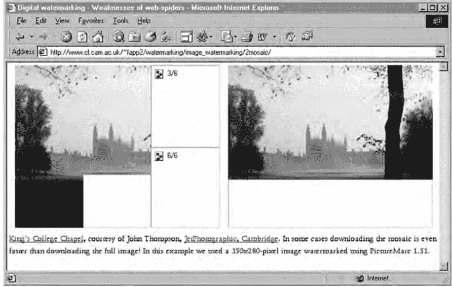
图22.6: Mosaic攻击 (由Jet Photographic提供, 网址: www.jetphotographic.com)

Digimarc现在已经修复了漏洞, 并专注于监控广播流; 这使得广告商能够检查他们付费的广告是否真正发布。但他们发现, 将数字技术引入安全印刷领域是一个更大的业务: 他们在身份证件中加入水印以防止复制, 并将其标记技术授权给中央银行作为防伪措施。例如, 它被应用在新的欧元纸币上, 可以防止使用最新设备进行扫描或复制[1373]。诸如Photoshop和Paintshop Pro之类的软件包现在拒绝处理带有标记的图像。

- 然而, 已知对版权标记方案的最常见攻击是选择合适的扭曲。音频标记可以通过随机复制或删除声音样本来消除, 以引入不可听见的抖动; 用于去除点击声和重新采样的技术也是强大的标记消除工具。对于图像, 我的学生们开发了一个名为Stirmark的工具, 它将相同类型的错误引入图像中, 就像使用高质量打印机打印并再次使用高质量扫描仪扫描一样。它会应用微小的几何扭曲: 图像会被轻微拉伸、剪切、平移和/或旋转一个不可察觉的随机量 (见图22.7)。这几乎击败了当时存在的所有标记方案, 并成为版权标记鲁棒性的标准基准[1019]。总的来说, 这并不清楚如何设计标记方案，以抵抗攻击者对标记方案的理解并对内容进行最大程度的破坏而对标记内容造成最小程度的破坏。

有关对版权标记方案的攻击的更详细说明，请参见[1019，1020]。技术的改进速度很慢，但限制因素似乎是一旦标记检测算法被知晓，设计的标记方案就很难保持稳健。如果基于标记的任何副本控制方案在个人电脑软件或低成本防篡改处理器中实施，算法泄露只是时间问题；届时预计会出现相当有效的去标记软件。

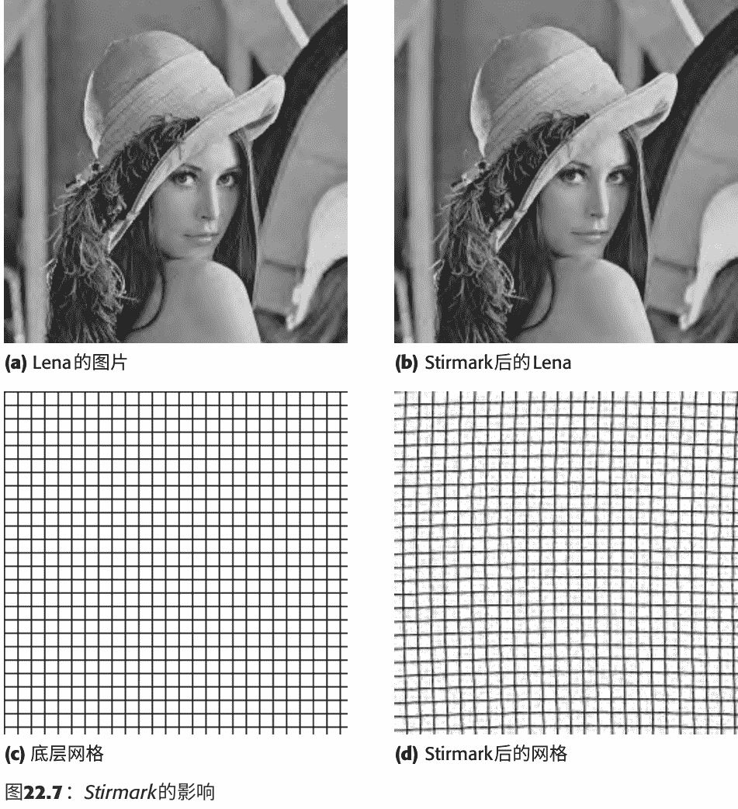

安全性通过模糊性问题至少引发了一场政治争议。商业图形软件中使用的Digimarc软件以防止加载货币图像的方式只能在签署保密协议后获得。因此，强制使用该软件的立法将使开源图形软件（如Gimp）面临危险。

### 22.4.4 版权标记方案的应用

标记技术的应用远不止于DVD和纸币。在美国销售的彩色复印机将其序列号隐藏在复印品的位模式中，作为检测货币伪造者的额外手段[1331]。另一种技术是在拍摄静态图片时嵌入易碎标记，以便法医实验室可以轻松检测到修改[769]。

另一类提出的应用与便利性或安全性有关，而不仅仅是防止恶意行为。有人提议，广播中播放的音乐应该标记为CD的编号，这样喜欢的人可以通过按下按钮自动订购CD。在医学中，数字化的X射线版本经常与患者的详细信息分离，因为各种专有文件格式在多次协议转换中被破坏；通过直接嵌入图像中的患者详细信息可能解决这个安全问题。

最后，信息隐藏研究的相当一部分并不针对好莱坞的要求，也不针对美国国库印刷局的要求，而是针对隐私目的的信息隐藏。我将在下一章讨论这些应用。

## 22.5 政策

IP政策辩论在1990年代和2000年代初变得激烈，因为一系列法律，从版权期限延长到美国数字千年版权法（DMCA），以一种让计算机行业和其他地方的许多人感到威胁的方式，将权力转移到了‘知识产权’的所有者——版权、专利和商标。更严格的版权执法侵犯了言论自由权利，例如：法律曾经提供‘合理使用’或‘公平交易’的例外，使您能够对他人的作品进行模仿或批评，但在更新版权法期间，并非所有国家都尊重这些例外。此外，DMCA赋予版权所有者（‘通知和下架’）强制要求ISP下架侵权材料的权力。虽然还有一项规定（‘通知和恢复’）允许用户提交反通知，并在14天内将其内容恢复，除非版权所有者提起诉讼，但实际上，许多ISP宁愿终止客户的服务，而不愿涉足诉讼。

对于DMCA对图书馆的影响仍然存在持续的担忧，尤其是随着越来越多的材料变成电子形式：允许图书馆借阅的法律控制正在被技术控制所取代[730]。例如，当我申请扩建厨房的规划许可时，我必须提交四份本地计划的副本；而我们大学图书馆的地图软件只允许打印三份副本。这当然是有意为之的。法律控制由访问控制补充，并且DMCA赋予这些访问控制法律特权，从而创建了一个被许多法学学者批评为“准版权”的新权利束[364]。实际上，版权法规不再由华盛顿或布鲁塞尔的立法者制定，而是由微软或苹果的程序员即兴制定。根据像拉里·莱西格和帕梅拉·塞缪尔森这样的版权法批评家的说法，这导致了版权用户权利的大幅减少。

与此同时，版权法突然变得与数百万人相关。过去，这只是出版商等专业人士关心的问题，现在它触及到每个下载音乐、使用TiVo进行时间转移电影或维护个人网页的人的生活。随着法律未能跟上技术的步伐，它允许的事情与人们实际做的事情之间的差距变得更大。例如，在英国，将CD转移到iPod上在技术上是非法的，然而，由于这是人们现在购买CD的主要原因之一，英国唱片业协会（行业组织）慷慨地表示不会起诉任何人。随着我们越来越多地进入混音文化，法律与规范之间的差距只会变得更大，以及以前在私人或未记录的公共空间中发生的许多次小的侵权行为（例如在酒吧唱歌）转移到在线平台（例如当手机视频剪辑中的歌曲出现在某人的社交网络页面上）。约翰·特赫拉尼计算出，一位典型的法学教授每天会犯80多项侵犯版权的行为，这些行为的法定处罚金额超过1000万美元[1243]。

另一方面，还存在隐私问题。在过去的日子里，人们会用现金购买书籍或唱片；转向下载意味着由微软和苹果等公司运行的DRM许可服务器记录了人们观看和听取的内容，这些内容可以被传唤。（同样可以说，转向在线书籍销售也在亚马逊上创建了类似的记录。）这些记录也被用于营销。加拿大隐私专员的一项调查发现了许多侵入性行为，包括电子书软件对个人进行个人资料分析，图书馆服务中的Double-Click广告，通过IP地址跟踪个人的系统，以及供应商声明的隐私政策与观察到的行为之间的矛盾，包括与第三方的未公开开通信。在被测试的组织中，没有一个组织遵守测试人员要求披露关于他们的个人信息的要求。看起来这样的DRM系统也违反了欧洲的隐私法，因为它基于相同的原则。特别是2005年出现了一个极端情况，微软决定索尼的XCP系统是“间谍软件”和“rootkit”，因此将被Windows Defender和恶意软件删除工具移除[884]。所以下次当你听到一个大公司抱怨它的用户通过复制它的音乐或软件来违法时，请记住它可能也是一个违法者。这一切将会导向何方？直到最近，版权法的辩论一直是企业游说者与学者和自由软件社区等活动人士之间的直接对抗；后者有着论据，但前者总是在立法机构中占据优势。现在情况已经发生了两个有趣的变化。首先，知识产权游说团体开始失去动力，其次，好莱坞开始意识到更强大的数字版权管理将会将权力从内容所有者转移到平台供应商。

### 22.5.1 IP游说团

首先，IP游说团。这源于上世纪70年代，药品公司Pfizer试图将其药品的专利保护范围从美国扩展到巴西和印度等不发达国家。彼得·德拉霍斯和约翰·布雷思韦特的一本历史书中讲述了这个故事[398]；总结起来，Pfizer和其他药品公司与音乐和电影行业（希望减少盗版和复制）、奢侈品行业（希望减少廉价仿冒品数量）以及其他一些美国参与者（包括商业软件联盟）结盟，并说服美国政府向不发达国家施加压力，使其专利、版权和商标法与美国保持一致。从1980年代中期开始，这主要是双边行动的问题，但在1994年签署了关于与知识产权有关的贸易方面的协议（TRIPS），随后在1996年签署了世界知识产权组织（WIPO）的两项协议。基本上，美国和欧盟联合起来欺负印度和巴西等抵抗的国家。

这些条约的实施在发达国家引起了很多反对意见，人们开始意识到他们可能会受到影响。在美国，1998年的数字千年版权法案（DMCA）使绕过版权保护机制成为一种犯罪行为，而在欧盟，2001年的版权指令产生了类似的效果。

这被视为使供应商能够创建封闭平台并控制竞争；这也被自由和开源软件运动以及安全研究人员视为一种威胁 —— 尤其是在俄罗斯研究人员德米特里·斯克利亚罗夫（Dmitry Sklyarov）在美国的一次会议上被Adobe的请求逮捕之后，他的雇主已经出售了绕过PDF文档密码保护的工具。

还有许多其他引人注目的事件；例如，我曾经在2001年信息隐藏研讨会的程序委员会上，当时美国唱片业协会（RIAA）试图强迫程序主席撤销Ed Felten和他的学生关于一个数字音乐标准中被吹捧的版权标记方案中的漏洞的论文。这导致了一场官司，Ed起诉了RIAA，这成为了一起具有里程碑意义的学术自由案件。讽刺的是，这个挑战的发起者曾向学者和其他人公开挑战他们的方案。下一个案例是Bunnie Huang的书《黑客攻击Xbox》：这本书详细描述了他作为麻省理工学院的学生如何克服了微软游戏机第一版的保护机制。

他写的那本书让他的出版商吓了一跳，但他找到了另一本，并且这样的宣传对他的销售应该没有造成任何伤害。无论如何，受到权利管理机制和反黑客法律威胁的自由受到了侵犯，导致了数字权利非政府组织在许多国家的增长（其他国家已经因为“加密战争”的结果而拥有了这些组织；我将在第三部分中更详细地讨论所有这些）。

转折点似乎出现在2003-2004年，当知识产权游说团体试图通过布鲁塞尔进一步推动一项措施，即《知识产权执法指令》。这将进一步提高对侵权者的处罚，并消除基于言论自由或合理使用的公共利益辩护的前景。这一次，反对该措施的人设法组建了一个足够强大的利益联盟，反对更强大的知识产权执法，该措施得到了实质性的修正。到那时，已经有了像第7.5.5节中提到的第一个结果那样的体面的经济论证，即下载实际上并不损害音乐销售；与此同时，知识产权游说团体已经严重超越了自己的权力。

例如，IP专家试图迫使欧洲每个国家将专利侵权变成犯罪行为，而不仅仅是民事问题。这是由领先的药品公司设计的，旨在削弱药品专利过期后制造和销售仿制药的公司。目前，药品公司试图通过“常青化”来延长他们的专利权 —— 提交附属、后期专利，并提出通常可疑的派生权利主张 —— 仿制药制造商通过向其分销商提供免责保证来应对赔偿问题。将侵权行为变成刑事问题将打乱这些安排。这导致仿制药制造商与超市、汽车零部件经销商和消费者团体一起强烈反对该指令。

甚至软件行业也开始感到紧张：我们向微软指出，成千上万家公司认为微软侵犯了他们的专利，但没有足够的资金在民事法庭上打官司。如果专利侵权成为犯罪行为，他们肯定会向警方提出投诉吧？比尔会冒险在未来的欧洲之行中被逮捕吗？

事后看来，这是知识产权运动的最终命运。

> 一个富有、强大的游说团体不会被美丽的言辞或大学教授和自由软件活动家的愤怒所阻止（例如约翰·佩里·巴洛在本章开头）。当它遇到另一个富有、强大的游说团体推动的相反方向时，它才会停下来。这一点现在似乎已经过去了；例如，2007年6月，世界知识产权组织放弃了知识产权游说团体就广播达成新条约的尝试。

知识产权运动可能已经达到了最高水平，但它还没有完全消亡；在尼古拉·萨科齐当选法国总统后，他们说服他支持一项法律，使互联网服务提供商对版权执法负责 —— 这将增加他们的成本并使他们不那么具有竞争力[115]。有趣的是，法国的互联网服务提供商 —— 或者欧洲委员会 —— 是否能够在这个问题上反击；尽管潮流不再向知识产权游说团体的方向流动，但在法律最终稳定之前，肯定会有很多类似的小冲突。

版权问题还有其他一些问题，人们最终会担心。一些版权活动家认为，一旦版权过期 —— 或者假设大量材料可以在创作共用许可证下提供 —— 那么一切都会很顺利。

我怀疑。整理旧的位元需要花钱，就像整理旧的手稿一样；实际上，电影业最近发现，存档数字制作实际上比过去支付的费用更高，当时他们只是把主要副本锁在一个旧盐矿中。在数字制作过程中产生了大量的位元，每隔几年将它们复制到新的磁盘上并不便宜。从长远来看，一旦位元不属于任何人，谁会为它们的维护付费？一些律师希望无限期延长版权期限，但这违反了版权所基于的社会契约，而且也不能正确解决问题：许多出版商未能妥善管理自己的旧目录，并不得不从国家存储库中检索副本。当非政府组织的同事和我考虑这个问题时，我们能想到的最好的解决方案是制定数字保存法律并建立由纳税人资助的数字存储库[418]。

### 22.5.2 谁受益？

正如我在第7.5.5节中讨论的，2005年出现了进一步的重要发展。在那年的一月份，谷歌的首席经济学家哈尔·瓦里安在柏林的一次DRM会议上发表了讲话，问道谁会从更强大的DRM中受益。他指出，在经典经济理论中，两个行业之间的技术联系通常会使更为集中的行业受益（例如，汽车制造商和汽车零部件）。现在，平台行业更加集中（苹果、微软），而音乐行业则不太集中（四大唱片公司和许多独立公司）：那么为什么音乐行业希望从更好的DRM中获胜呢？经济理论认为，平台供应商应该获得更多胜利。

音乐行业嘲笑了这一说法，然而到了那一年的年底，他们开始受到伤害 —— 游说政府和欧洲委员会对苹果“采取行动”，比如强迫其开放其FairPlay DRM方案。现在，越来越明显的是，音乐下载（有或无DRM）正在改变音乐行业的结构和动态。乐队过去依靠唱片公司来宣传他们，但现在他们可以通过在自己的网站上免费提供专辑来自我推广；他们总是通过演出赚取大部分收入，现在比以往任何时候都赚得更多。

在本书的第一版中，我预测大乐队可能会采用Linux商业模式：‘免费提供产品’，通过‘维护’（巡回演出、T恤、粉丝俱乐部...）来赚钱，而对于更专业的演出，‘诀窍可能是更精确的定价和/或吸引收藏家的包装’。到目前为止，这个预测是正确的。我还写道：“我还预计好莱坞将效仿软件行业，并对复制采取更成熟的态度。毕竟，占价值1000亿美元市场的70%要比占价值500亿美元市场的98%更好。正如一定程度的复制有助于推广软件一样，它也可以帮助音乐销售：感恩死者乐队（Grateful Dead）鼓励盗版录音，因为他们发现这并不会损害他们的销售。”就目前情况而言，CD销售额持续下降，而下载销售额开始上升，但增长速度还不足以弥补。我们将不得不等待并观察。

## 22.6 附件控制

在20世纪90年代末和21世纪初，人们担心通过DMCA以好莱坞的要求引入的反向工程禁令会对竞争产生恶劣影响。事实上，自通过DMCA以来，加密机制和权利管理技术的最重要和迅速增长的用途之一就是附件控制。一个熟悉的例子是打印机墨盒。

这种做法始于1996年的施乐N24（有关墨盒芯片的历史，请参见[1221]）。在典型的系统中，如果打印机检测到第三方墨盒或重新填充的墨盒，它可能会自动将分辨率从1200 dpi降至300 dpi，甚至拒绝工作。2003年，添加了到期日期和墨水使用控制：HP BusinessJet 2200C的墨盒在放入打印机30个月后或制造后4.5年后过期[827]；现代墨盒现在限制了电子方式释放的墨水量，而不是等待物理用尽。最新的发展是区域编码：你不能在最近购买的英国HP打印机中使用美国的墨盒。

所有这些引起了抱怨；欧洲议会批准了一项“废弃电子电器设备指令”，旨在强制成员国禁止公司绕过欧盟回收规定设计带有芯片的产品，以确保其无法回收利用[230, 332]。但是到实际监管时，当局已经放松了。打印机公司进行了激烈的游说，最终的规定是只要供应商接受空墨盒进行处理，他们就履行了对环境的义务[1323]，而英国政府表示，由于墨盒是消耗品，法律不适用[1097]。

在美国，这个问题在法庭上得到了解决。打印机制造商Lexmark起诉了SCC，后者（正如我在第16.5.1章中所述）逆向工程了他们的打印墨盒加密，指控违反了《数字千年版权法》。虽然他们在第一审中获胜，但在2004年的上诉中败诉[790]。在类似的案例中，制造车库门开启器的Chamberlain起诉了制造兼容开启器的Skylink，也在2004年的上诉中败诉。这似乎将美国法律偏向于自由市场的密码学家，这在DMCA出现之前一直是立场[1110]。想要使用加密芯片控制其售后市场的公司可以自由聘请最聪明的密码学家来构建非常难以破解的认证芯片，而其竞争对手则可以自由聘请最聪明的密码分析师来尝试逆向工程。其他使用加密进行附件控制的领域包括游戏主机软件和附件，以及手机电池。

其他行业正在关注这项技术。例如，汽车制造商大众以不同价格生产各种型号的汽车，这在零部件的价格上有所体现；你可以花费12美元购买斯柯达的空气滤清器，花费40美元购买大众的相同空气滤清器，以及花费100以上美元购买奥迪的相同空气滤清器。将来我们会看到汽车对其主要零部件进行身份验证，以防止套利吗？（如果汽车行业足够聪明，它将被营销为一种“安全措施”，以阻止不安全的外国零部件 —— 这是摩托罗拉在引入手机电池身份验证芯片时采取的策略。）附件控制是否令人反感？经济学家哈尔·瓦里安对此进行了分析[1286]：

> 答案取决于市场竞争的程度。以喷墨打印机市场为例。如果墨盒利润率很高，但打印机市场竞争激烈，竞争将推动打印机价格下降以弥补高价墨盒的成本。
> 限制购买后的使用会加强墨盒的垄断地位（因为它阻碍了再次填充），但这只会使卖家更加竞争，导致打印机价格降低市场。这只是“送走剃须刀，卖刀片”的老故事。

然而，在许多其他行业中，这可能是反竞争的；这取决于行业的集中程度，在赢者通吃的平台市场中，这可能特别令人反感[53]。所以幸好早期对于逆向工程的合法禁止的担忧在很大程度上是没有根据的。当然，逆向工程的权利并不等同于成功进行逆向工程的权利，因此在未来可能会出现一些情况 —— 随着特征尺寸的缩小和复杂性的增加，逆向工程变得更加困难 —— 被市场排斥的公司将不得不使用反垄断法来获得准入。

## 22.7 总结

数字内容的技术保护防止未经授权的复制是一个技术上和政治上都很困难的问题。从技术上讲，这很困难，因为通用计算机可以无成本地复制位串；从政治上讲，好莱坞试图强加权利管理技术于不情愿的计算机行业，造成了很多附带损害。人们曾经苦苦思索的一些问题，包括对兼容性的逆向工程的影响，都没有出现，但仍然存在着真正的复杂性。在技术层面上，DRM系统之间的兼容性是一个重大问题，而且目前还不清楚DRM在未来的家庭中将如何工作，人们将期望在多个设备上播放他们购买的音乐和视频。在政治层面上，音乐行业似乎通过坚持更强大的DRM给自己带来了困扰，因为这只是将供应链中的权力从自身转移到了平台供应商（尤其是苹果）。尚不清楚同样的事情是否会发生在好莱坞身上：高清视频的转变是否会导致微软窃取他们的午餐？至少他们有一种策略可以反击 —— 通过使用SPDC机制来承担部分平台所有者的角色。

无论如何，过去十年中版权和权利管理系统的发展都是一个令人着迷但坎坷的过程，而未来十年的发展也肯定如此。

## 研究问题

版权管理中存在许多有趣的研究问题。其中一些问题我们已经提到过，比如如何构建更便宜的防篡改硬件令牌，以及在数字媒体中嵌入版权标记的更好方法（如图片和声音）。但是从90年代中期到2005年左右，这些问题上进行了大量的研究；存在许多竞争性的提案，律师们正在通过专利纷争。新颖的想法肯定会引起许多利益相关者的兴趣，但是现在可能已经没有 low-hanging fruit 可以摘取了。

## 进一步阅读

软件的拷贝保护技术在[561]中有详细讨论；关于音频和视频技术保护机制的简要历史在[487]中有介绍；而有关付费电视系统攻击和防御的生动描述在[850]中有。关于付费电视和DVD的更多信息可以在各种网站上找到（由于法律纠纷可能会发生变动），而[565]提供了律师的观点。

在IEEE的特刊中，有关信息隐藏技术的概述，包括隐写术和信息隐藏[822]；特别是对标记方案的攻击，请参阅[1019, 1020]。有关更详细的信息，请参考最近的一本关于这个主题的书[697]。卡恩的历史背景阅读一如既往地好[676]。戈登的美国版权法指南非常有用[546]。关于信息隐藏的研究工作可以在信息隐藏研讨会的论文集中找到[42, 97, 1022]。最后，关于版权的章节离不开对拉里·莱西格的书籍[784, 785]和帕姆·塞缪尔森的著作[1107, 1108, 1109, 1110]的引用。

---

## 第23章 领先的边缘

> 信息消耗的内容是相当明显的：它消耗了接收者的注意力。因此，大量的信息会导致注意力的贫乏，需要将注意力有效地分配给可能消耗它的过多信息来源。—— 赫伯特·西蒙

> 投票机软件是一个特殊情况，因为对安全的最大威胁来自那些应该对其负责的人。—— 理查德·斯托曼

### 23.1 引言

我们在剑桥的安全小组运营着一个博客，www.lightbluetouchpaper.org，在那里我们讨论最新的黑客攻击和破解。我们甚至在我们使用的WordPress博客软件中发现了一些漏洞，并向维护者报告了这些漏洞。但我们并不是唯一发现缺陷的人，在2007年10月，这个博客本身被一个俄罗斯的脚本小子入侵，试图发布一些药物广告。这次攻击本身只是一个麻烦，因为我们很快发现并从备份中恢复了，但它让我们意识到我们已经变得非常依赖于各种应用程序，而我们没有时间去评估它们。而博客文章本身显示出许多攻击和安全研究的前沿工作都依赖于特定的应用程序。仍然会有针对Windows和Symbian等平台的攻击，但在应用程序中存在更多的漏洞。随着微软改进自身行为，以及搜索引擎使得查找运行特定应用程序的机器更加容易，行动可能会转移到那里。

就博客软件而言，WordPress的安全工程并不令人印象深刻，但其竞争对手更糟糕；而这一个应用程序就暴露了成千上万的机器受到威胁。有很多很多的应用程序，它们的开发者通常在被黑客攻击之前并不关心安全问题。自2000年以来，微软经历的学习过程将在一个领域又一个领域中重复出现。但并不是所有的应用程序都是一样的；虽然有些应用程序（如博客软件）只是简单地将个人电脑暴露给僵尸网络招募，但还有其他一些应用程序可以直接提取金钱，还有一些人们依赖于隐私，还有一些调节权力的应用程序。

我已经讨论了一些或多或少的“嵌入式”应用程序，从银行业务到警报系统再到预付费电表。在本章中，我将简要描述构成安全研究前沿的四种应用程序类型。它们是我们发现创新攻击、新颖保护问题和棘手政策问题的地方。它们包括：

- 在线游戏；
- 拍卖、社交网络和搜索等Web应用程序；
- 匿名代理等隐私技术；
- 电子选举。

游戏和Web 2.0凸显了互联网的真正“杀手应用”是其他人。随着越来越多的人在不同的情境下上网，我们正在创造前所未有的复杂社会技术系统。这意味着全新的攻击、利用、争斗和争议。我们已经看到了几个例子，比如点击欺诈和印象垃圾邮件，以及对旧骗局的新变种。

匿名系统自然而然地出现：如果你想要享受网络应用的一些好处，但又不想暴露你的隐私给它们，你可能希望使用一个化名。几十年来，人们一直在讨论实现这一点的机制，并且真正的系统已经出现；但正如我们在第9章中讨论的推理控制一样，匿名性比看起来要困难得多。

最后，选举是一个经典的例子，其中需要匿名性，但与问责制相结合：你希望选民能够满足自己的投票已经被计算，但不能向任何其他人证明他们投票给了谁（这样他们就不能被贿赂或恐吓）。选举也是社交计算和权力之间的关键接口。

### 23.2 电脑游戏

游戏是最早的应用之一 —— 就在世界上第一台真正的计算机EDSAC投入运行的时候，研究生们就开始为其编写游戏。早期的人工智能研究者开始编写国际象棋程序，他们相信一旦解决了这个问题，计算机就能够像人一样运行。在我自己的青春期，第一个我编写的密码分析程序是为了让我能够窥视地牢游戏的房间。

在象棋等完全信息的游戏中，作弊的机会有限，尤其是与计算机对战时。但是在其他游戏中，有很多作弊的方法，而且这已经成为一个大问题。数百万人玩在线游戏，其中许多人聪明但很多人贫穷；大型在线世界的营业额超过了一些小国家；成千上万的人靠在线游戏谋生，从创建和维护游戏的开发人员到中国的金农（Gold Farmers）。因此，作弊的动机存在；而游戏是软件，软件有漏洞，作弊的手段也存在。然而，如果作弊变得普遍，就会破坏乐趣。人们不喜欢不公平的战斗 —— 即使成功的作弊者也会感到无聊（除非作弊和反作弊成为新的游戏）。甚至作弊的感知也会破坏玩家的乐趣，所以他们会去其他地方，游戏供应商会损失大量金钱。因此，供应商会付出巨大努力来阻止作弊。总的来说，在线游戏为黑客研究提供了一流的社会实验室，游戏安全已成为严肃研究的课题。

计算机游戏也是一个大产业，几十年来一直如此。它们推动了1970年代家用电脑的繁荣，进而催生了个人电脑行业；游戏机一直是微处理器和存储芯片的巨大市场；而游戏无论是在游戏机还是个人电脑上，都在很大程度上推动了计算机图形的发展[1367]。到2001年，美国的游戏销售额达到94亿美元，超过了83.5亿美元的电影票房销售额。比较这两个行业并不简单，因为电影明星还有其他收入来源，而且这两个行业越来越交织在一起，越来越多的电影使用计算机图形效果制作。但是从数量级来看，计算机游戏可能与电影具有相当的经济重要性。当然，现在一款畅销的在线游戏的总收入要比一部畅销电影多得多；随着游戏走向在线化，你销售的是订阅服务，而不仅仅是一次性门票[203]。

在游戏中，“安全”一词在不同的年代有不同的含义。20世纪70年代的早期街机游戏主要集中在保护硬币盒免受抢劫的攻击。当任天堂将家用游戏机带入家庭时，他们通过后期软件卡带和其他附件的销售来补贴游戏机，因此他们花了很多精力来控制可以使用哪些配件，正如我在第22.6节中所讨论的那样；从世嘉到索尼和微软的后来竞争对手最终陷入了与逆向工程师的法律和技术战斗。对于个人电脑游戏软件的防拷措施也是一件大事，就像电影的预发行泄漏一样，独立游戏也有预发行泄漏。然而，转向在线电脑游戏后，这些问题得到了缓解。由于游戏关键部分在服务器上运行，客户端软件可以免费提供，剩下的问题就是玩家是否能够获得不公平的优势。这就是我现在要重点关注的。

### 23.2.1 作弊类型

基本上有三种作弊方式。

第一种是原始游戏存在已知的漏洞，这些漏洞可能会传播到在线世界，并可能变得更糟。例如，合同桥牌的一手牌以玩家轮流叫牌来开始，他们认为自己能够赢取多少个小局。每手牌有四名玩家，分为两个队伍，在叫牌过程中，除了公开的叫牌之外，任何人都不能向自己的搭档透露手中的牌的任何信息。在竞技比赛中，在叫牌过程中，桌子上会斜放一个屏幕，以防止任何人看到他们的搭档。然而，仍然有时会怀疑一些秘密的沟通发生，例如在玩家的语气中。

在现实世界中，作弊的指控由经验丰富的玩家组成的陪审团听取，他们会对结果是否比诚实的玩法更好发表意见。即便如此，一些决定仍然存在争议多年：玩家可能非常熟练或者幸运，多年来一起玩牌的搭档可能会在无意识的情况下进行沟通。桥牌是两个更普遍的问题的例子，即利用游戏规则和串通作弊，这两个问题在计算机出现之前就存在。转向在线游戏既是一个机会，也是一个问题。

机会在于如果玩家诚实，所有的出价都可以通过系统进行调解：没有语调引起争议。问题在于，如果四个人在自己的家中一起玩在线桥牌，那么没有什么可以阻止一对人建立一个单独的通信渠道——只需一条手牌的短信即可。技术能帮助吗？嗯，在线桥牌意味着在线记录，因此您可以挖掘大量游戏的记录，以确定嫌疑人是否比他们应该做得更好。它还使得同时由许多玩家使用相同的牌局进行比赛的锦标赛更容易发现作弊行为。最后，它促进了新的组织游戏方式：如果您有一个全天候可用的在线游戏服务器，人们可以单独参加游戏，并在四个人到达时开始游戏。因此，人们与许多合作伙伴一起玩，而不仅仅是一个；既减少了作弊的动机和手段，同时增加了风险。

当存在一个单一的论坛，比如一个主导服务器时，你也可以构建全局控制。例如，在一些游戏中存在逃避的问题，即当一个人正在输的时候，他会简单地断开连接。通过使用全局服务，你可以通过将逃避行为记录为失败来消除这种激励（但前提是你的服务是可靠的——一些游戏服务器在四分之一的会话中会崩溃，这种策略在那里不会受欢迎）。在现实世界的游戏中还发现了其他一些漏洞，包括假装不比你更熟练，输掉几场比赛，然后在对方玩得更多钱时赢得胜利；台球室和扑克鲨鱼们已经使用这样的策略很久了，而且还有很多团队变体。

在一些游戏中，通过拥有多个玩家并让一些玩家杀死其他玩家来积累积分可以获得优势。在线游戏易受此类操纵的影响程度在很大程度上取决于身份是否持久。如果人们可以轻易地创建或廉价购买新的身份，那么使用多个前端身份操纵游戏就变得更简单。（这被称为 Sybil 攻击，在点对点系统中也是一个问题 [396]。）解决这个问题的一种方法是声誉系统——这是一个我们在讨论拍卖时将回到的话题。在其他情况下，与其由一个人类玩家操作许多角色，不如使用连续人类操作者的轮班操作一个角色；这通常在在线多人游戏中完成，目标是积累在线时间和积分。

第二种作弊方式是已知的计算机安全问题直接应用于游戏世界。Symantec 在 2007 年上半年测量的恶意软件中，有百分之五是针对在线游戏的，其中最常见的两种是设计用于窃取 GamePass 和 Lineage 玩家账户信息的木马程序 [1239]。还有很多其他类型的攻击，从简单的网络钓鱼到拒绝服务攻击，通过增加对手的网络延迟来在闪电战国际象棋中击败对手。本书中的很多内容都与游戏相关：作弊者入侵服务器，窃听通信，篡改客户端内存以使墙壁变得不可见（在 [1368] 中有一份调查和分类）。政策问题，如隐私问题，在这里也很重要：Second Life 中的很多人对一家有远见的公司建立了一个搜索引擎，该搜索引擎可以浏览他们的家并索引他们的物品感到恼火。就像在其他应用程序中一样，很多漏洞的利用都是因为偶然发现了错误，比如在一个游戏中，你可以开着吉普车开到墙壁前，按下“下车”按钮，然后立即出现在墙壁的另一边 [203]。许多游戏都存在这种类型的故障，而且这些故障的知识传播得很快。

第三种类型是由于计算机游戏的性质而出现的新作弊策略，尤其是在线游戏。例如，在战术射击游戏中，成功应该取决于玩家的策略和射击技巧，而不是游戏机制。然而，游戏的物理模型总是存在缺陷，通常是由于网络延迟和游戏设计师为处理延迟而使用的优化引入的。实际上，开发者试图让你相信他们的世界与自身和牛顿定律一致，但实际上并非如此。例如，在射击对决中，通常情况下，如果你具有最低的网络延迟或者先动手，你会占据优势。然而，许多游戏客户端使用的预测算法可以将这种情况扭曲成异或运算：高延迟的玩家如果先动手，就会占据优势。这是因为客户端会缓存有关附近玩家的信息，所以如果你绕过一个角落，看到敌人并开枪，那么速度较慢的玩家，你的网络连接越慢，他就越久才能看到你并回应。（这类策略有很多种：参见 [203] 进行讨论。）

在一些有趣的边界情况中，一个活动可以根据情况被视为技能或作弊。迈克·邦德（Mike Bond）创造了“新-战术”这个术语，用来指代下意识地利用网络效应的玩家，比如首次行动者的延迟优势。新战术是天才还是作弊？就像桥牌一样，一个很容易被误认为是另一个。但是大多数人会说，如果你在发动攻击之前使用机械辅助工具，比如在发动攻击之前减慢数据包流的代理服务器，那肯定是作弊。

### 23.2.2 自动瞄准和其他未经授权的软件

这就引出了一个经典的游戏作弊方式，即机器人。一个持久的作弊策略是拥有自己的代码来提供自动化和支持。人们编写了各种各样的工具，从简单的例程（重复点击射击按钮，用于破解那些射击速度是一个因素的游戏），到拦截传入网络数据包、识别坏人、检查你的射击并优化瞄准的代理服务器。这些自动瞄准器的复杂程度不同，有些代码可以完成所有的目标获取和射击，而有些只是改善你的瞄准。它们可以作为代理服务器钩入数据包流，钩入图形卡，甚至钩入客户端代码。同一主题的另一种变体是透视作弊，玩家修改软件以透视墙壁——例如，通过改变图形软件使其半透明而不是不透明。

销售第一人称射击游戏的游戏公司认为，作弊软件严重破坏了其他玩家的乐趣，因此他们使用加密和身份验证机制来保护数据包流。（这些通常是专有的且易受攻击的，但这无疑会在时间上得到修复。）他们还使用了防护软件，例如 Punkbuster，该软件使用反病毒技术来检测游戏代码或其所依赖的驱动程序的钩子尝试。《使命召唤4》中的一个最新创新是提供击杀的动作重播，从击杀者的视角来观看：这使被击杀的玩家可以看到他是否被“公平地”击杀。这不仅可以减少作弊行为，还可以减少对作弊行为的感知——这对游戏运营商来说几乎同样具有破坏性 [204]。

不适当的软件也可以在游戏服务器上运行。常见的黑客手法是让一个物体（例如枪）并行运行多个脚本副本——这是一种原本可以通过服务器上的适当资源计算来防止的技巧。然而，服务器面临着关键的实时需求，其设计师试图尽可能地保持简单。自我复制的对象被用来进行服务拒绝攻击，或者用来创建临时建筑以逃避对永久结构的资源控制。而且人们会编写魔法剑来做出意想不到的花招。

不过必须说，相对不受控制的游戏脚本语言使得这种可能性成为现实。人们已经意识到游戏引擎可以用来渲染整个三维电影；虽然质量可能不如皮克斯的渲染农场那么好，但它能够工作，而且基本上是免费的。这导致了一种全新的艺术形式的发展，即机器电影 (machinima)。正如人们所说的，罕见的风也能给人带来好处。

### 23.2.3 虚拟世界，虚拟经济

机器人也被用于农场，企业家里通过积累游戏物品（如金币或魔法剑）来完成繁琐的工作，以便出售给急切的玩家。然而，大部分农场工作是由来自罗马尼亚到中国等低工资国家的真实人员完成的。“金币农场”现在已经成为一个重要的出口，为偏远村庄的年轻人创造了新的经济机会。一个大型在线社区的经济规模，比如《魔兽世界》——拥有 800 万订阅用户，其中有 50 万人随时在线——超过了一些国家的经济规模。

这意味着宏观经济效应，如汇率和租金开始变得重要。例如，Second Life 本质上是一个由 Linden Labs 运营的 3D 聊天室，该公司向第三方出租空间，然后这些第三方可以根据自己的需求自定义自己的财产。它有一种名为 Linden dollars 的本地货币，可以用美元购买，也可以通过 Linden Labs 或第三方经纪人使用信用卡进行购买。这种货币使得游戏内的企业家能够出售增值物品，如服装、艺术品、色情作品和服务。

在 FBI 打击在线赌场之后，Second Life 中的赌博引起了人们的兴趣激增；因此，在 2007 年 4 月，联邦调查局访问了 Linden Labs [1006]。在访问之前，有 26% 的公告与赌博有关；在访问之后，商业租金下降了。当 Linden Labs 开始区分“已验证”和“未验证”账户时（前者是指玩家使用信用卡订阅的账户），反洗钱控制的世界出现了。

游戏商品市场也变得更加有组织。几年来，魔法剑和金币在 eBay 的灰色市场上进行交易，但从 2005 年开始，游戏运营商开始运营正式的拍卖网站，玩家可以用真钱交易游戏商品。2006 年，我们收到了第一起严重欺诈的报告：骗子使用盗用的身份信息在韩国游戏《天堂》上设置了数十万个账户，据称有内部帮助，并通过出售一些价值 1500 万美元的游戏物品 [758] 进行了套现。所有这些都有助于提高游戏的赌注，并使稳定性变得更加重要。这也自然地将我们带到了 eBay 和其他“现实世界”的网络应用程序。

## 23.3 网络应用程序

虽然在线电脑游戏部分在服务器上实现，部分在客户端软件中实现，但越来越多的服务完全在线并通过标准的网络浏览器访问。它们从拍卖服务（如 eBay）到搜索引擎（如 Google 和 Yahoo），在线邮件服务（如 Hotmail 和 AOL），在线文字处理器（如 Google 文档）以及销售各种好东西（和坏东西）的电子商务网站都有。一些行业，如旅游、娱乐、保险和图书销售，已经将其销售的大部分转移到了在线平台。最近的社交网络趋势带来了各种新的角度。

所有类型的网站都存在许多共同的问题。其中一个问题是，Web 服务器通常对来自用户的输入不够谨慎，例如导致我在第 4.4.2 节中讨论的 SQL 注入攻击。另一个越来越常见的漏洞是跨站脚本攻击 (XSS)。诸如 JavaScript 之类的脚本语言应该遵守同源策略，即脚本只能对来自同一域的数据进行操作；你不希望来自黑帮色情网站的脚本对你的电子银行数据进行操作。但是这个策略已经多次被绕过，利用了一切，从粗心编写的允许用户上传包含其他用户可以读取和执行的脚本的 Web 服务，到虚拟机设计中的错误——例如在第 18 章中讨论的 Firefox JavaScript 漏洞。

诸如 Hotmail、Orkut、Myspace 甚至 PayPal 等 Web 服务都曾被使用 XSS 漏洞入侵，从您的网站完全删除它们需要非常小心地处理所有用户提供的 HTML 代码。然而，即使您自己的网站是干净的，您的客户仍然可能存在漏洞。最新的技巧涉及使用 Web 服务来洗钱：例如，攻击者将目标网站与自己的一些恶意脚本混合在一起，然后让受害者通过 Google 翻译等代理来查看它 [1239]。

当一个公司提供多种服务时，问题会变得更加复杂。例如，Google 提供从搜索到地图再到邮件和文字处理的一切，其他大型服务公司也有广泛的服务。当许多服务位于同一个域中时，同源策略的作用不大，在 Google 和其他地方的应用程序之间确实存在一些 XSS 类型的漏洞。服务聚合还会带来隐私后果，稍后我会详细介绍。

与网络服务相关的另一个问题是它们的结构通常至少部分对外开放，可以进行检查。当用户进行浏览、搜索、产品选择和付款等过程时，他会从一个页面传递到另一个页面；攻击者可以读取 HTML 和 JavaScript 源代码，观察参数的传递方式，并寻找可以被操纵的 SQL 查询等敏感信息 [78]。他还可以查看输入选项是否通过 JavaScript 进行筛选，并尝试绕过以查看是否可以进行有趣的操作（这不一定意味着缓冲区溢出，甚至只是简单的诸如以折扣价格订购商品等简单黑客技巧）。他还可以操纵隐藏字段，以查看它们是否用于传递有趣的数据。谨慎的开发人员会假设客户端是恶意的，但大多数开发人员并不会这样做；数百万企业的在线推进速度已经完全超过了可用的安全技能（和工具）。因此，许多服务不仅存在错误，而且容易受到操纵。

现在，大量的个人信息存储在基于网络的应用上，一个成功的攻击者可以窃取大量可利用的数据。在 2007 年 11 月，Salesforce.com 承认其员工被钓鱼攻击后失去了一些客户的联系人列表；例如，其客户 SunTrust 的 40,000 名客户中有 500 人抱怨收到了似乎来自 SunTrust 的垃圾邮件 [743]。这些邮件试图在他们的计算机上安装恶意软件。在早期的事件中，Monster.com 的简历数据库遭到入侵，130 万求职者的信息被泄露。（这些事件引发了对当前违规披露法律的质疑，其中许多法律不认为某人的电子邮件地址和他们的商业联系人的姓名是需要通知的“个人信息”，但显然这样的损失应该通知。）至于一般的漏洞问题，就此打住。现在让我们来看看一些常见网络服务的具体问题。

### 23.3.1 eBay

领先的拍卖网站及其支付服务公司 PayPal 对安全工程师来说有很多重要性的原因。首先，它们是网络钓鱼者最主要的目标，也是许多传统欺诈行为的平台。针对 PayPal 的网络钓鱼攻击与我在第 2 章中讨论的针对银行的攻击并没有太大区别（除了 PayPal 不是银行，其客户没有银行法律的保护，如美国的 E 条例，并依赖于 PayPal 的善意来弥补损失）。许多其他欺诈行为都是旧商业骗局的变种。例如，骗子会通过电子邮件向拍卖的底价竞标者提供类似于拍卖品的商品，但事实上是次品或不存在的。eBay 上最大的骗局之一是由盐湖城的一名交易者在网上销售笔记本电脑。起初，他诚实交易，合法出售 750 台笔记本电脑，并积累了良好的声誉；然后他拿了 1000 多人的钱却没有交货。这种交易策略自商业诞生以来就存在。

但拍卖网站又增加了一个新的变化。它提供了一个声誉服务，诚实的交易者可以从他们的交易伙伴那里获得良好的参考，许多小规模的偶尔卖家已经获得了高度的信任评级。因此，越来越常见的攻击是劫持他们的一个账户——无论是通过猜测密码、钓鱼还是其他更技术性的手段——并利用这个账户进行欺诈。据报道，从 2007 年初开始，账户劫持事件迅速增长 [542]。

利用劫持的账户进行欺诈的简单方法是出售不存在的商品，拿走钱然后逃走，但也有许多变种。2007 年越来越流行的一个诡计是假托管网站。坏人提供一辆车出售；你赢得了拍卖；然后他建议你使用一个托管服务，他将把车运送到那里，你支付钱款。真正的托管服务确实存在，比如 escrow.com，但也有许多由欺诈团伙设立的可疑服务 [57]；如果你将钱汇给他们，那将是你最后看到的钱。托管骗局是声誉盗窃的一个例子，这让我们想到了谷歌。

### 23.3.2 谷歌

谷歌的安全经理在未来五年内可能会拥有最有趣的工作之一，就像微软的同行在过去五年里一样。谷歌的活动规模之大使其成为各种邪恶行为的目标和渠道。再说一遍，其中一些是古老的罪恶，但其他攻击则相当新颖。

一个很好的例子是谷歌黑客攻击，人们使用搜索引擎寻找易受攻击的机器。在线的谷歌黑客数据库有数百个搜索字符串的例子，可以找到从未打补丁的服务器到包含密码的文件。适当的搜索也可以用于针对人类目标：可以搜索任何以某种特定方式暴露自己的人，例如通过在网上公开他们的社会安全号码，或者搜索某个特定人的可用数据。如果你是一个可能的目标，最好先进行搜索。例如，我曾经是一个动物权利恐怖组织的目标，所以我使用主要的搜索引擎找出我的家庭地址在哪里可以找到。公司和政府经常搜索自己的机密。自从 AltaVista 在十多年前问世以来，搜索已经彻底改变了世界；以前需要一个主要政府的资源才能进行的查询现在可以在任何人的笔记本电脑或手机上在几秒钟内完成。尽管这一革命的好处远远超过了成本，但成本并非为零。

使谷歌能够超越其他搜索引擎的两个主要创新是 PageRank 算法（它根据链接到该页面的其他页面数量对页面进行排名）以及将搜索与定向广告相结合的想法（而不是早期引擎如 AltaVista 使用的横幅广告）。一些小型文本广告被放置在搜索结果页面上，并且广告商在持续的拍卖中相互竞标特定的搜索词。当用户点击其广告时，广告商会被收费。谷歌还允许发布者在其网页上放置链接，其中谷歌会提供与页面内容相关的广告，并向他们支付点击收入的一部分。这被证明非常受欢迎和有利可图，并且已经彻底改变了分类广告。

然而，它带来了一波又一波的攻击。2006 年的一个大问题是点击欺诈；你公司的竞争对手反复点击你的广告，从而耗尽你的广告预算。点击欺诈也可以由出版商进行，他们希望最大化他们的佣金。谷歌添加了各种算法来尝试检测点击欺诈：例如，来自同一 IP 地址的重复点击在计费时会被折扣处理。攻击者随后发现广告出现的顺序取决于点击率，因为谷歌通过将热门广告排名更高来优化自己的收入。这导致了进一步的服务拒绝攻击，即展示垃圾邮件，在这种攻击中，你的竞争对手反复调用包含你的广告的结果页面，但不点击它们。这会导致你的点击率下降，因此你的广告会被降级。

2007 年，一个重大问题是谷歌套利。出版商购买廉价广告来吸引流量到他的网站，然后在网站上写有吸引更昂贵广告的主题。如果以廉价方式到达他的网站的客户通过更昂贵的途径离开，他就会获利。对此的态度是不一致的。购买广告以销售广告已经有很长的历史了；你当地的报纸可能靠分类广告生活，并且可能在城里到处张贴海报。一些广告商认为这是欺诈行为：他们支付给刚刚从搜索引擎上来的人点击广告的费用，却得到了那些逃离无聊网页的人的二手流量。谷歌不时采取行动打击套利者，他们的利润在年底逐渐减少。但这只是一个更大问题的一小部分，即“为广告而生”的网站 (MFA)。

我们发现的一个模式是虚假机构：骗子复制了一个现有的慈善或教育网站，只对内容进行了微小的更改，并使用这个仿冒网站来托管高点击成本的东西，比如招聘广告。这个想法是，如果网站排名很高，它们的复制品也会排名很高：一些假慈善机构甚至打算与真正的机构交换链接，以进一步混淆问题 [注3]。

> [注3] 当他们向我主持的信息政策研究基金会提供广告交换时，我们偶然发现了这个网络。

另一系列的网站由一家购买废弃域名的公司运营，编写相关的编辑内容，并用广告填充它们。（内容由新闻学院的学生免费撰写，他们在课程中寻找实习机会）。当我在 Google 上介绍这些网站的分析时，反应褒贬不一。这里存在一个严肃的政策问题：尽管人们对内容评价不高，但从某种意义上说，这是一种新的文学体裁，它是在 AdSense 模式的支持下出现的，就像肥皂剧是在电视台开始通过快速消费品广告进行资助后出现的一样。Google 员工的观点是，这样的网站应该由市场力量来决定。但显然在滥用和仅仅令人厌烦之间存在一些难以判断的情况。

这里有许多有趣的研究问题，比如如何识别和映射虚假社区（其中链接被制造出来以创建真实社交或经济活动的假象，以欺骗 PageRank 算法），以及隐藏的社区（比如基于废弃域名的网站网络）。至少后者与警察和情报机构搜索叛乱组织面临的问题相似，而区分虚假社区和真实社区也可能越来越依赖于越来越复杂的流量分析和社交网络分析，这些分析在 19.3.1 节、21.5 节和 24.3.2 节中讨论过。这不可避免地引出了大多数观察者认为是 Google 的致命弱点的问题：隐私。隐私问题存在于许多层面：

- 首先，存在未经授权的数据访问。当一个拥有数以万计员工的公司持有数亿人的个人数据时，信息泄露的风险是明显的——可能是通过不满的内部人员，或者可能是通过某种漏洞利用。这些基本上是我在第 9 章讨论的问题，只是规模比以往任何时候都要大得多。
- 其次，还有隐私法。例如，欧洲委员会对于点击流数据的保存时间存在争议：谷歌同意在 18 个月后对点击流进行“去标识化”，但这并不能真正满足委员会的要求。在 9.3.1 节中，我讨论了 AOL 发布匿名搜索历史用于“研究”的情况，一些用户很快就被根据他们的搜索模式识别出来；从技术角度来看，通过匿名实现隐私需要频繁更换伪名。（我将在处理政策时再回到隐私问题。）
- 第三，存在对授权数据的合法访问，比如 FBI（或离婚律师）携带传票来到 Mountain View。

出于各种原因，各种人都希望限制可能导致隐私泄露的各种类型的潜在损害。

随着关于我们的更多信息变得可用和可搜索，紧张局势似乎将变得越来越严重。

但在我们继续研究隐私技术之前，还有第三种类型的网络服务可以收集更多亲密和普遍的信息：社交网络网站。

### 23.3.3 社交网络网站

自2004年以来，像MySpace和Facebook这样的社交网络网站迅速兴起，并且现在被大量年轻人用来组织他们的社交生活。其他网站旨在组织专业人士。

这个领域正在迅速发展，但截至我在2008年1月写作时，主要用户仍然是年轻人，典型的网站不仅提供了一个存储主页的地方，还提供了与朋友主页链接的方式。关键思想是网站反映了底层社交网络：增加的价值在于通过帮助您更方便地与朋友交流和结交新朋友来增强您的社交网络。访问控制机制通常允许您的朋友查看更多您的内容；还有诸如论坛、聊天室和即时通讯等消息服务，以支持社交互动；还有各种结构化的方法来了解人们。在某些网站上，您必须由共同的熟人介绍；在其他网站上，您可以搜索符合年龄、地点、音乐口味、爱好、性别和性取向等特定标准的人。社会当然一直有这样的机制，以俱乐部的形式存在，有些人仅将社交网络视为一种在线鸡尾酒会。然而，社交网络革命使人们用于建立友谊、寻找伴侣以及建立专业和商业关系的机制得以快速创新。

所谓的商业模式首先是，用户向这些网站的运营商提供的大量信息将使得定向广告比谷歌还要好；其次，友谊网络可以产生巨大的锁定效应，这是信息产业的价值来源。如果你的朋友都在Facebook上，很难不在上面拥有一个页面，而且有一亿人将他们的通讯录和消息存档放在你的服务器上而不是自己的个人电脑上，这似乎就是一种印钞机的许可证⁴。

> 4 但不要忘记时尚：在英国，几乎每个人在2006年都有一个MySpace页面，现在大多数人都有一个Facebook页面——但巴西人使用Orkut，谁能说2012年会流行什么？

设计社交网络网站时，你应该预见到哪些问题呢？许多政府的建议都集中在恐吓方面：年轻人在社交网站上透露了很多关于自己的信息，可能会吸引性侵犯者。毫无疑问，互联网对性犯罪产生了影响，而对他其他犯罪类别没有检测到显著影响。它在美国各州和其他国家的普及与“离家出走”（即未满18岁的未经父母许可离家的人）有所增加有关。一些离家出走的人无疑是逃离不满意的家庭或者只是出去寻找机会的孩子；关键问题是其中有多少人受到虐待。数据显示，互联网的普及与报告的强奸案件数量下降有关，并且谋杀率没有增加[709]。人们可能担心离家出走的青少年会从事性工作，但随着互联网的普及，卖淫行为也减少了。可能仍然有人认为，离家出走的青少年遭受性虐待的增加被整体性犯罪的大幅下降所掩盖，而整体性犯罪的下降又是由于色情作品的更广泛可得性所引起的；但是，性犯罪的下降仅在15-24岁的男性犯罪者中显著，并且没有相应年龄较大的犯罪者的增加。我与年轻人交谈过，他们认为抵御年长男性的不受欢迎的进展只是生活的一部分，无论是线下还是线上。

如果您正在构建这样的系统，您对所有这些的看法可能取决于您的网站是面向远程网络还是面向涉及物理关系的网络，例如来自不同大陆的摄影师在Flickr上交换照片和技巧，或者像MySpace一样允许任何人加入。在第二种情况下，下一个问题是您是否将会员资格限制为青少年及以上，就像Facebook一样，还是像MySpace一样允许任何人加入。ENISA [615]对政策和技术问题进行了合理的讨论。至于年幼的孩子，家长明显应该密切关注在线活动；我们家的小成员可以在厨房使用计算机，这也有助于传达互联网是公共空间而不是私人空间的信息。ENISA还建议学校应该鼓励而不是禁止社交网络的使用，以便可以报告和处理欺凌行为。欺凌问题一直是学校的一个低级问题，偶尔会导致自杀或杀人悲剧的发生。在互联网出现之前，受欺凌的孩子可以在家里和朋友那里逃避很长一段时间；现在，嘲笑可以跟随他们到卧室。如果他们的互联网使用是秘密和偷偷摸摸的，这可能会使他们更加痛苦。解决办法是将事情公之于众。

当然，这些是广泛适用于互联网使用的问题，而不仅仅适用于社交网络网站。从表面上看，你可能会认为社交网络网站比随机在线聊天室更安全，因为服务提供商有动机限制恶意滥用行为，以避免声誉风险。但是，有哪些有趣的安全工程问题呢？

社交网络系统的一个新兴特性是安全策略的复杂性。在第4章中，我讨论了访问控制在硬件上是简单的，但随着向上移动到操作系统、中间件和应用程序，变得更加复杂。社交网络应用程序试图封装人类行为的一个重要子集。在群组中，结果是越来越复杂的规则集，这对用户来说非常难以管理。

例如，设置Facebook的隐私策略在2007年10月意味着需要浏览至少六个屏幕的访问选项——实质上是一组访问控制列表，用于不同部分的个人资料。而且这些控制不是线性的；例如，照片有一个选择加入和退出的策略。如果我在某人的页面上的照片中认出你，我可以给那张照片打上你的名字的标签，但在照片所有者同意之前，标签不会公开显示（选择加入）。如果你是Facebook的成员，你会收到通知，如果你想的话，你可以删除该标签（选择退出）[450]。然而，你可能没有注意到这个标签，如果照片很尴尬的话，这可能会产生后果——比如说，一个醉酒派对。

例如，在2008年新年的第一天，在巴基斯坦的贝娜齐尔·布托遇刺后，英国媒体刊登了一张她的儿子和政治继承人比拉瓦尔·布托的照片，他穿着恶魔服装，戴着红色的角，参加万圣节派对，这张照片是他的一位学生朋友在Facebook网站上发现的。

许多人根本不理解访问控制中使用的术语的含义。例如，如果你将照片提供给“社区”，这意味着默认情况下，任何在你机构内拥有电子邮件地址的人都可以访问——这导致校园警察与上传各种违规活动的照片的人进行讨论[463]。Facebook也无法处理多个角色；例如，我是计算机科学家罗斯，技术政策人员罗斯，音乐家罗斯，家庭人罗斯等等——由于无法区分它们，我只在Facebook上添加了我认识的来自前两个社区的人为好友。

还有一些非常微妙的政策问题：例如，你会认为发布已经公开的信息是可以的吗？错了！当Facebook添加了一个新闻动态功能，通知所有朋友你的状态变化时，引起了一场巨大的争议。以前，如果你和女朋友分手了，这个信息本来就是公开可见的（假设你将合作数据公开）。突然之间，这样的变化被自动且即时地广播给你的整个社交圈，这让很多人感到不满。

问题不仅在于该网站自动化了一些社交方面的八卦；它突然让社交失礼变得非常明显[216]。现在可以关闭这个功能，但是额外的复杂性只会让人们更难以管理自己的隐私。

另一个例子是搜索。大多数网络服务公司都会诱惑地在公共搜索中使用私人数据以使其更精确。早期（2004年），Friendster的搜索结果泄露了私人数据：一系列适当选择的搜索可以推断出用户的姓氏和邮政编码，即使这些数据被设置为私人[902]。教训是公共搜索永远不应该返回基于私人数据的结果。

另一个应该更广泛学习的教训是，一旦社交网络被知晓，推断控制变得更加困难。Friendster已经修复了它的系统。然而，这个漏洞在2007年重新在Facebook中被发现：Facebook只是让用户决定是否要关闭私人搜索，而实际上几乎没有人这样做[1197]。

这个问题现在已经解决了，但当Facebook向Google提供用户简化版本的个人资料时，问题又出现了。一次又一次，用户被要求意识到这个风险并关闭相关功能，但几乎没有人这样做[694]。Facebook似乎有一个策略，即将所有真正困难的安全决策推给用户——这样他们就可以通过责怪用户没有关闭X和Y功能来回应批评。默认情况下的可搜索性可能符合他们的短期财务利益，但最终结果很容易是无法使用的安全性和不安全的默认设置。

公司增长和安全可用性之间的另一个紧张关系是最近决定允许第三方应用程序开发人员访问个人资料数据。当有人开发一款允许人们从Flickr导出照片到Facebook的应用程序时，我们如何评估呢？即使两个系统在隔离状态下是安全的，也不能保证它们能够组合在一起，特别是当系统具有复杂且不断变化的API和复杂难以使用的隐私政策时。然后，在2007年末，Facebook在引入“Beacon”（一种广告系统）后，面临着用户的反抗，该系统会告诉用户的朋友他们在其他网站上刚刚购买了什么，并且该功能是默认开启而非默认关闭的。创始人兼首席执行官马克·扎克伯格为网站的用户对处理此事不当表示了道歉。（尚不清楚未来的营销理念是否会采用默认选择加入的方式。）这里涉及到了“软性”和“硬性”问题。在软性问题上，人们在不同的网站上展示不同的个人形象；例如，在Flickr和Facebook上放置不同类型的照片[1276]。在更恶劣的情况下，并非所有的应用程序都是由大型可信赖的公司编写的。然而，一旦您授权第三方应用程序访问您的个人资料，它可以做几乎任何您可以做的事情，包括向您的朋友发送垃圾邮件并将他们的个人信息出售给第三方。在某种程度上，与在Facebook上“交朋友”相当于没有保护的性行为——您会暴露于他们所拥有的一切。

所有关于言论自由和审查之间的常见争论也会出现。例如，在Flickr上，除非将照片标记为“受限制的”（即成人内容），否则您不应该上传您不愿向您的母亲展示的照片。如果您在德国，您将不被允许查看此类材料，或在新加坡搜索此类材料。然而，一位上传了艺术裸照的同事却被列入“不安全”的黑名单，尽管他很乐意向他的母亲展示他的作品。就数据保护法而言，Facebook往往会透露数据主体的种族、性生活、健康状况、宗教信仰、政治信仰以及是否属于工会等信息，而这些正是在欧洲隐私法下受到特殊保护的“敏感”类型的数据[235]。

在技术和社会机制之间的接口还存在一系列问题。例如，您将机密信息提供给您的朋友之一，他的帐户被入侵，您的数据最终变为公开。当这首次报道时（2003年），先驱们预计社会压力会使用户更加谨慎[961]，但事实并非如此。潜在的原因可能很熟悉：在强网络外部性的世界中，系统开始时不安全，以便尽快增长。但是，尽管Windows和Symbian在建立两边市场的主导地位时是不安全的，以吸引补充者，但社交网络网站运营商会偏向于通过调整算法和展示方式来让人们尽可能多地注册朋友。这破坏了任何可能的社会纪律。

其他的社会技术攻击包括跨站脚本漏洞，其中有很多 [902]。垃圾邮件正在迅速增长，而一个特别令人担忧的问题可能是网络钓鱼结构化。印第安纳大学最近进行了一个实验，向一组学生发送了网络钓鱼邮件，要求他们访问一个校外网站并输入他们的大学密码。控制组的成功率为16%，但使用从社交网络中收集的数据进行定向攻击的组更加容易受到攻击——他们中的72%被网络钓鱼攻击所欺骗 [653]。目前在MySpace上已经有大量的网络钓鱼报告 [796]。

我将通过提出另外两个一般性观点来结束本节。首先，正如社交网络网站从经验中迅速学习并改进一样，中期最大的问题可能是现实世界中的社会问题，例如欺凌的在线迁移；其次，许多青少年在网上发布的内容可能会让他们以后后悔，例如对饮酒、吸毒和性方面的实验的吹嘘，在他们申请工作时被挖出来。在首尔，一个女孩被要求捡起她的狗留下的一些粪便，但她拒绝了；一个旁观者拍摄了这个场景，她因此被称为“狗屎女孩”，并且被逼离开了大学 [1201]。虽然这是一个极端的例子，但这个原则并不是真正新的：在旧的网络新闻系统上发布过度言论的人有时会被‘过去的网络帖子之鬼’所困扰 [507]；而且几个世纪以来，有许多社交失礼的故事毁掉了人们的生活、家庭和财富。但是，尽管在古代，最有可能让你陷入麻烦的是在宫廷中的礼仪失误，现在在地铁上的礼仪失误也可能会给你带来麻烦。

世界正在稳步变得更加记录——更像我们大多数人在十八世纪之前生活的村庄，每个人的行动都是众所周知的。那时候，村里的闲话家常会给当地的任何人提供各种各样的小道消息——有些是真实的，有些是虚假的——人们在形成观点时会使用这些消息。如今，谷歌已经接管了那个角色，并且它对于纠正错误的社会压力要小得多，或者原谅其他正派人士偶尔的失误。此外，人们在工业革命期间搬到城镇中获得的许多匿名性正在丧失。持久社会记忆对社会问题的影响将是复杂的。欺凌问题可能会得到缓解，因为有记录留下来，而尴尬问题可能会通过对年轻人更加放松的态度以及年轻人更加谨慎的行为的某种组合得到解决。我们将不得不等待并观察哪种情况占主导地位，但早期迹象表明人们变得更加放松：皮尤互联网与美国生活项目发现，2007年有60%的美国人对自己留下的“数字足迹”不担心，而在2000年的一项调查中，84%的人担心。所以我们正在学会应对[1229]。（谨慎是应对的一部分，这可能涉及使用一个对外人来说不太容易与你的真实身份联系起来的化名或昵称，但我将在下一节中讨论所有这些。）

其次，社交网络系统有很大的潜力做很多好事。哈佛大学社会学家罗伯特·普特南在他有影响力的书籍《独自打保龄球》中记录了美国和其他地方的社交网络是如何受到电视的出现、搬到郊区甚至是妇女进入职场的影响（尽管电视造成的伤害最大）[1052]。

与我们的父母相比，与电视一起长大的婴儿潮一代更不可能加入俱乐部、认识邻居、经常与朋友见面或参加团队运动，而接下来的“X一代”则更不可能。现在社交性似乎再次上升。电视和大众消费文化带走的东西，个人电脑和手机可能正在回馈。更容易的沟通不仅使人们更多地进行交流，而且以不同的方式进行交流；基于地理位置的旧社区正在被共同兴趣的社区所补充。

我们学术界是最受益的人群；对密码学、协议或数论感兴趣的人群多年来一直通过互联网和会议交流保持联系。现在这些好处正在传播到每个人身上，这太棒了。

社交网络网站还为快速实验和创新提供了一个平台，以新的方式建立和维护友谊。对于怪异、害羞、丑陋以及患有边缘性阿斯伯格综合症的人来说，这些网站可能非常出色。但是，随着它们试图封装越来越多真实社交生活的复杂性，它们的政策将变得越来越复杂。

正如我们在构建大型软件系统时受到技术复杂性的限制一样，社交网络系统可能会在政策复杂性方面探索一个新的领域，这也许是增长的最终限制之一。这将是一个有趣的观察过程。

## 23.4 隐私技术

随着业务转移到在线平台，大量的信息开始被收集。在过去，你走进一家唱片店用现金购买一张专辑；现在你从服务器下载一首歌曲，服务器会下载一个许可证到你的电脑上。中央许可证服务器准确地知道谁购买了什么和何时购买。市场营销人员认为这是伟大的；隐私倡导者则感到震惊[410]。普适计算的发展也大大增加了他人对我们的信息的掌握程度——例如，如果人们开始使用手机应用程序来跟踪他们的社交网络并帮助他们更好地管理时间 [407]。未来肯定会有各种各样的‘必备’应用程序收集关于我们的数据，这意味着对于谁将有什么数据的不确定性越来越大。

技术已经对一些社会习俗造成了压力。在非技术社会中，两个人可以离开其他人一小段距离，进行一次没有硬证据的对话。如果爱丽丝声称鲍勃试图招募她参与一次叛乱，那么鲍勃总是可以声称相反——即爱丽丝是提议推翻国王的人，而他是因为忠诚而拒绝的人。换句话说，许多通信是可以否认的。合理的否认仍然是一些通信的重要特征，从日常生活到最高层的情报和外交。有时可以通过约定来解决这个问题：例如，在英国，诉讼当事人可以写一封标有‘不得作为证据’的信件给另一方提出和解，这封信件不能作为证据使用。

但是大多数情况下缺乏这样明确和方便的规则，而电子通信的本质往往意味着“只是出去一分钟”的选择并不可行。那么怎么办呢？

另一个问题是匿名性。直到工业革命之前，大多数人生活在小村庄里，搬到城镇里是一种解脱——实际上是一场革命。你可以改变你的宗教，或者投票支持土地改革候选人，而不会被你的房东赶出农场。如今，“电子村庄”这个词不仅捕捉到了电子通信缩小距离的方式，还捕捉到了它们会缩小我们自由的担忧。

技术能做些什么来帮助吗？让我们考虑一些“用户”——一些有特定隐私问题的人：

1. 安德鲁是德克萨斯州的一名传教士，他的网站吸引了一些在沙特阿拉伯改变宗教的人。该国对改变宗教的公民进行处决。他怀疑一些人是联系他的人并不是真正的皈依者，而是宗教警察在寻找叛教者。他无法分辨警察和真正的皈依者。他应该使用什么样的技术来与他们私下交流？
2. 贝蒂是你十岁的女儿，她的老师告诫她在网上保持匿名。你应该给她什么样的培训和工具来帮助她管理这个问题？
3. 查尔斯是硅谷一家仍处于隐蔽模式的初创公司的工程师，他正在运营一个博客，违反了公司的规定。他如何避免被抓住并被解雇？
4. 戴是越南的人权工作者，与试图建立独立工会、小额信贷合作社等组织的人们保持联系。警察经常骚扰她。她应该如何与同事们交流？
5. 伊丽莎白在一家投资银行工作，该银行正在为一项合并提供咨询。她希望在调查一个被收购目标时不让目标察觉到她的兴趣，甚至不让任何人知道有人感兴趣。
6. 菲罗兹是一个住在德黑兰的同性恋者，而在那里，同性恋是一项死罪。他希望能找到一种下载色情内容而不被绞死的方法。
7. 格拉齐亚诺是巴勒莫的一名法官，他正在建立一个热线，让人们向当局举报黑手党活动。他知道未来一些在办公室工作的警察将受到黑手党的贿赂，而潜在的线人也知道这一点。他如何限制未来腐败警察可能造成的损害？

这有助于说明隐私不仅仅是关于加密电话或网络流量。例如，如果安德鲁告诉他的信徒下载和使用特定的加密程序，那么警察间谍也会这样做；而国家防火墙将被设置为检测使用该程序发送或接收消息的任何人。安德鲁必须让他的流量看起来无害，这样即使宗教警察完全了解离教者的流量特征，也无法发现他们。

虽然适当的技术措施可能解决了安德鲁的一部分问题，但对贝蒂来说并没有太大用处。她面临的风险主要是她会不小心泄露可能会让她后悔的信息。过滤软件可以帮助她——如果她不被允许在互联网上公布她的家庭地址，过滤器可以搜索并在她不小心的时候发出警报——但大部分工作将需要用于培训她。

保护的级别也存在很大的差异。贝蒂的保护主要需要在应用层提供，因为主要问题是通过内容的意外泄露；查尔斯也是如此。然而，查尔斯可能面临更复杂的分析，比如由伊丽莎白这样的人进行的分析：她可能会搜索他的帖子，寻找图像中的相机序列号、文档中嵌入的工作组名称甚至打印机名称，以便弄清楚他在他的秘密项目上与谁合作。

攻击的强度也会有所不同。查尔斯和菲罗兹可能只面临零星的兴趣，而戴伊则受到持续的监监。她将使用匿名通信，不仅是为了保护自己，更是为了保护那些还未引起警方注意的人。保护激励存在巨大的差异：安德鲁可能会费很大劲让他的网站对访问者无害（例如，通过将其托管在许多无害服务的同一台机器上），而菲罗兹感兴趣的网站对他的安全性并不太在意。安德鲁、戴伊和格拉齐亚诺都必须认真考虑不诚实的内部人员。不同的概率阈值标志着成功和失败之间的差异；对于查尔斯来说，可信性的否认可能足以让他脱身，而仅仅是怀疑就会挫败伊丽莎白的计划。而失败的代价也不同：如果被抓到，伊丽莎白可能会损失一些钱，而菲罗兹可能会失去生命。

我们之前遇到过匿名机制，当我们讨论那些不想被电话追踪的人购买预付费手机，使用一段时间后将其丢弃。即使这样都很困难，甚至基地组织也做不到。那么在线隐私的前景如何？

### 23.4.1 匿名电子邮件——餐饮密码学家和混合

正如我们在几个情境中所提到的，对手通常从流量分析中获取大部分信息。即使Alice和Bob之间的通信是加密的，密文隐藏在MP3文件中，即使在检查时，Alice的笔记本电脑和Bob的笔记本电脑没有任何可疑材料，仅仅是Alice与Bob进行了通信这一事实可能会泄露秘密。

这就是为什么犯罪分子更看重匿名通信（例如使用预付费手机）而不是加密的原因。除了我们上面列出的人群之外，还有许多合法用途，包括滥用受害者的匿名帮助线；揭发企业内部问题的举报者；希望为政府设置陷阱的抗议团体；对教授进行匿名学生反馈；会议论文提交的匿名评审；以及使用一次性密码在线获取购买的测试工具包的匿名HIV测试结果。你可能想申请一份工作，而不让你现在的雇主发现；与不使用加密的人交换私人电子邮件；或者与一个有害和报复性的邪教进行斗争。

有两种基本机制，都是由大卫·肖姆在1980年代发明的。第一种是餐饮密码学问题，受到了“就餐哲学家问题”的启发。

密码学家们围坐在一张餐桌旁吃饭，服务员告诉他们餐费已经由一个匿名赞助者支付了，这个赞助者可能是参与者之一，也可能是国家安全局（NSA）。密码学家们想知道是谁支付了餐费。

所以，两个主体共享一个一次性密码本，之后每个主体输出她的“我付款了 / 我没有付款”位的函数，然后每个人可以后来计算出所有这些位的总奇偶校验。只要不超过一个密码学家说“我付款了”，偶数校验意味着国家安全局支付了，而奇数校验意味着其中一个用餐者支付了，即使没有人能够弄清楚是谁支付的[286]。这个机制可以被认为是一次性密码本的匿名等价物；它提供了“无条件的匿名性”，尽管需要一个费力的协议和大量的密钥材料。已经提出了各种扩展，包括一个扩展，其中“就餐毒贩”可以拍卖一批可卡因，而不会向其他竞标者或卖方透露竞标者的身份。除了买方和卖方之外，没有人知道谁赢得了拍卖；即使卖方在交易之前也无法得知最高竞标者的身份[1219]。

然而，对于实际的匿名应用，Chaum的开创性创新是另一个想法，即混合或匿名转发器（Mixes）[284]。它接受加密的消息，剥离加密，然后将其重新发送到内部的地址。在其最简单的形式中，如果Alice想通过Charlie和David给Bob发送匿名电子邮件，她会将消息发送给他们：

> $$A \rightarrow C:\left\{D,\left\{B,\{M\}_{K_B}\right\}_{K_D}\right\}_{K_C}$$

Charlie现在剥去外层包装，找到David的地址加密文本，并将密文发送给David。David解密并找到Bob的地址加密文本，然后将密文发送给Bob。Bob解密后得到消息 $M$。

匿名转发器在1990年代开始使用。起初，人们使用单个转发器，但正如我在第22.3.3节中提到的，早期的转发器在被科学教派采取法律行动后关闭，因为它被用来发布批评他们的材料。很多人仍然依赖于提供简单、低成本匿名性的服务，如Hotmail和Hushmail，但如果你可能会受到法律强制（或复杂的技术攻击），最好不要有单一故障点⁶。链式转发器最初由密码朋克（Cypherpunks）开发；它们不仅对外部传出的流量进行嵌套加密，还支持一个回复块——一组嵌套的公钥和电子邮件地址，让接收者可以回复给你。还有一些匿名邮件服务器可以存储回复块并自动处理匿名回信。

目前最常见的设计是Mixmaster remailer，它也通过填充消息并对其施加随机延迟[899]，可以防止基本的流量分析。

一个常见的应用是匿名发布包含敏感内容的邮件列表——应用范围从报告安全漏洞到滥用支持再到匿名政治言论。当然，匿名remailer可能成为情报机构的一个有吸引力的陷阱操作，因此通常会通过一系列连续的remailer发送消息，并安排大部分remailer必须共谋才能破坏流量。即使如此，选择性的服务拒绝攻击是可能的；如果NSA运行remailer X和Y，而你尝试通过X和Z的路径，他们可以导致它不起作用；所以你然后尝试X和Y，这样“工作”了，你很高兴（他们也是）。remailer运营商也可能受到各种攻击，从传票和诉讼到垃圾邮件洪水（旨在将运营商列入黑名单）；David Mazières和Frans Kaashoek在运营此类服务时有一篇论文[849]。这项技术仍在不断发展，最新提议不仅包括更强大的固定长度数据包和一次性回复块机制，还包括目录和声誉服务，允许用户监控选择性的服务拒绝攻击[344]。

## 23.4.2 匿名网络浏览器 - Tor

匿名连接不仅限于电子邮件，还可以包括任何通信服务。随着网络在在线应用中的主导地位，洋葱路由器（Tor）已成为最广泛使用的匿名通信系统，拥有超过200,000个用户。Tor最初是作为一个实验性的美国海军实验室系统而诞生的，被称为洋葱路由，因为消息像洋葱的层一样嵌套[1062]。海军将其开放给全世界，可能是因为你通常只能在人群中保持匿名。如果Tor被限制在美国情报界，那么任何接收Tor流量的网站都可以得出一个明显的结论。美国海军人员在中东使用Tor连接回驻扎在马里兰州的服务器。他们不把它看作是一个匿名系统，而是一个个人安全系统：他们不希望任何人在他们所在的房子里监视他们的关联，也不希望任何人在马里兰州的服务器上监视他们的位置。实际上，他们隐藏在当地（伊拉克和马里兰州）寻找色情片的男人中间；色情片流量也隐藏了第三世界的人权工作者。Tor可能是我们几位代表性隐私用户（查尔斯、戴伊、伊丽莎白、菲罗兹，甚至格拉齐亚诺）采用的解决方案的一部分，所以我现在将讨论其设计和限制⁶。

> ⁶ 通过声明利益，我持有Tor项目的一项资助，用于支付我的一位博士后研究员的工资，以帮助开发他们的软件。还有一些商业服务，例如Anonymizer [79]，可以让您匿名浏览网页，但它们经常被压制性政府封锁。

Tor软件包括Tor客户端（用于转发TCP流量的网络代理，通过该代理与您的浏览器通信）以及可选的“Tor按钮”（它作为Firefox浏览器的扩展，可以快速切换正常浏览和匿名浏览）。在后一种模式下，Tor按钮禁用了cookie、JavaScript和所有其他插件。具有高带宽连接的志愿者使Tor客户端也能充当服务器，每次可能有几千个活动服务器。当您打开Tor客户端时，它通过找到三个Tor服务器来建立一个电路，通过这些服务器连接到外部世界。它与第一个服务器协商建立一个加密会话，然后通过这个会话与第二个服务器协商建立另一个加密会话，最后通过第二个服务器建立第三个加密会话。您的网络浏览器流量从出口节点明文传输到目的地。

这立即引起了一个广为人知的Tor漏洞——恶意退出节点。2007年9月，有人建立了五个Tor退出节点，监视通过它们的流量，并发布了有趣的内容[917]。其中包括一些大使馆使用的一些网络邮件账户的登录名和密码，包括伊朗、印度、日本和俄罗斯的使馆。（这揭示了密码的强度策略：乌兹别克斯坦以“s1e7u0l7c”这样的密码排名第一，而突尼斯只使用“突尼斯”，印度使馆使用“1234”。）然而，Tor的文档和网站明确指出退出流量是可以被读取的，所以有见识的人要么使用支持TLS加密的网络邮件服务（如Gmail），要么使用PGP等电子邮件加密软件。

匿名浏览网页的第二个问题是现代内容通过许多副通道回调到主页。这就是为什么Tor客户端附带的代理会禁用cookie和JavaScript的原因，但这只是个开始。如果Firoz下载了一部色情电影，然后他的Windows Media Player直接调用色情服务器获取许可证，从他的IP地址到一个“已知邪恶”的网站的数据流量可能会暴露他的身份；但是，如果他阻止了许可证请求，他将无法观看这部电影。ActiveX控件、Flash和其他浏览器插件也可以在代理之外建立连接。有关网站如何击败匿名服务的调查，请参阅[1091, 1194]。

第三，虽然Mixmaster和后来的转发器可以通过切割、填充和延迟流量来增加流量分析的难度，但这会引入延迟，大多数Web应用程序是无法接受的。低延迟、高带宽的系统（如Tor）在本质上更容易受到流量分析的影响。像NSA这样的全球对手，在互联网的许多点上窃听流量，肯定可以通过相关其活动来恢复一些Tor电路的信息；事实上，他们只需要窃听少量的密钥交换点就可以得到流量的良好样本[920]（所以如果美国政府在您的威胁模型中扮演角色，频繁设置新的Tor电路可能是明智的）。

最后，许多应用程序要求用户明确地进行身份验证，而其他应用程序则要求用户在不知情的情况下泄露关于自己的信息。在9.3.1节中，我讨论了来自AOL的据称匿名的搜索历史如何识别出许多用户：本地搜索（告诉您居住地）和特殊兴趣搜索（揭示您的爱好）的组合可能足以识别您。因此，如果您使用Tor进行匿名搜索，并且有最小的可能性您的对手可能能够向搜索引擎发出传票，您最好频繁设置新的电路和伪名。

如果你的对手能力较弱，那么流量模式可能仍然会泄露游戏的秘密。首先，假设你想浏览一个已知且稳定结构的禁止访问的网站；一个现代商业网页可能包含大约30个对象，大小从几百字节到几百千字节不等。这种模式通常是独特的，即使在TLS加密后仍然清晰可见。即使Tor流量（从用户附近的窃听器看到的）经过了三层Tor加密，即使单元格被填充到512字节，随机网页仍然泄露了大量关于其身份的信息。因此，如果安德鲁希望他的信徒通过Tor查看他的网站，并且存在被抓到就可能被杀的真实风险，他应该认真考虑。他应该填充他的网页，使得加密后它们的大小与一个受欢迎且无害的网站相同吗？他应该在YouTube上发布与流行音乐曲目长度相同的简短布道吗？还是他应该完全使用不同的技术？

一个偶尔能够控制被禁止网站的对手可以玩更多的把戏。格拉齐亚诺担心黑手党接管警方的黑手党线人网站，应考虑以下攻击。黑手党技术人员在加载页面时对所有Tor服务器进行了多次探测，并根据服务器负载的影响，可以确定下载路径。然后他们去当地的ISP，贿赂或胁迫ISP交出显示在相关时间与入口节点建立连接的流量日志[919]。（所以从格拉齐亚诺的角度来看，最近的欧洲指令强制ISP保留流量日志可能并不总是对警方有帮助。）

毫无疑问，Tor是一种非常有用的隐私工具，但必须小心使用。在浏览尊重用户隐私的网站时，它更有效；而在浏览试图破坏用户隐私的网站时，它的效果较差；通常与其他工具结合使用。例如，在不发达国家，人权工作者通常将它与Skype和PGP一起使用。

### 23.4.3 保密和匿名电话

我在第20章中讨论了寻求匿名通信的犯罪分子通常只是购买预付费手机，使用一段时间后就扔掉。它们对其他人也是有用的；在我们的代表性隐私用户安德鲁可能会考虑告诉他的信徒们使用它们。但它们不是唯一的选择，也不能提供防止窃听的保护。如果你的对手有技术能够对电话流量进行自动关键字搜索或说话者识别，就像美国国家安全局一样，或者有足够的人力来进行大量窃听，就像典型的第三世界专制国家一样，那么你可能要考虑使用IP语音（VoIP）。

理论上，你可以通过像Tor [665]这样的代理运行VoIP通信；但在实践中，很少有人这样做；而匿名通常意味着隐藏在人群中，这就带我们来到了Skype。Skype不仅是最大的VoIP运营商，这就意味着安全性更高；它还具有点对点的架构，所以你的通话是端到端的；而且流量是加密的，具有经过独立评估的机制[165]。

那么什么可能出错？好吧，如果安德鲁要用Skype与他的信徒交谈，那么他最好不要用相同的用户名与所有人交谈；否则，宗教警察会从他们的虚假信徒那里得知这个用户名，并搜寻所有使用它的人。幸运的是，你可以获得多个一次性的Skype用户名，只要安德鲁为每个联系人使用不同的用户名，Skype可能是一个合适的机制。下一个问题是，对于至少一些应用程序来说，Skype作为一个由美国大公司拥有的公司，很可能会对传票做出回应⁷。因此，如果你的威胁模型包括美国政府，最好假设一旦NSA确定你的流量具有兴趣，通话内容可以被解密。如果你反对乌兹别克斯坦等与美国有情报共享协议的政府，你可能面临风险；如果Skype的母公司eBay在你试图隐藏流量的国家设有办事处，你也可能面临风险。因此，如果安德鲁对于eBay是否会帮助沙特政府感到不确定，他可以将Skype主要用作匿名机制，并使用像PGP这样的产品加密传输文件。

像戴伊这样的人权工作者确实使用Skype加PGP加Tor来保护他们的流量，他们遭受的攻击是情报技术的内容。警察秘密进入他们的家中植入rootkit来嗅探密码，并安装房间窃听器来监听对话。当你加密电话时，你不禁要想秘密警察是否从隐藏的麦克风中获取到其中一方（或两方）的内容。对抗这种攻击也需要相应的情报技术。其中一些就像间谍电影中的情节：留下线索以侦测秘密入侵，随身携带笔记本电脑，并在难以窃听的地方进行敏感对话。其他方面则有所不同：作为人权工作者（与记者和间谍不同）已知于东道国政府，他们需要避免违法，并且他们需要培养支持结构，包括来自海外非政府组织和政府的公开支持。他们还需要在间歇观察下与不受怀疑的人进行秘密接触。

### 23.4.4 电子邮件加密

在1990年代的“加密战争”期间，网络活动家为了加密电子邮件而与他们的政府进行斗争，而政府则推动限制加密的法律。我将在下一章中讨论政治问题。然而，这场斗争的一个焦点，加密产品 *Pretty Good Privacy (PGP)*，以及兼容的免费产品如GPG，已经在极客中相当广泛地使用。典型的用途是由计算机应急响应团队 (CERTs) 在彼此分享关于攻击和漏洞的信息时进行加密。许多个人也拥有PGP加密密钥，一些人默认情况下对彼此进行流量加密。

PGP具有许多功能，但在其最基本的形式中，每个用户生成一个私钥/公钥对。为了保护一条消息，您使用私钥对其进行哈希签名，然后使用随机选择的会话密钥同时加密消息和签名，并使用每个预期接收者的公钥加密会话密钥。因此，如果爱丽丝想要向鲍勃和查理发送加密邮件，她会组成消息：

$$ \{KS\}_{K_B}, \{KS\}_{K_C}, \{M, \{h(M)\}_{K_A}^{-1}\}_{KS} $$

密钥的管理留给用户自行处理，其理由是一个集中的认证机构会成为一个非常有吸引力的目标，很可能会被破解或受到法律强制。因此，预期的操作方式是每个用户收集她打算通信的人的公钥，并将它们捆绑到她保存在系统上的公钥环中。公钥可以通过任何方便的方法进行验证，例如将它们打印在她的名片上；为了使这更容易，PGP支持一个称为“密钥指纹”的功能，它是公钥的单向哈希值，以十六进制字符串的形式呈现。另一种机制是用户相互签署彼此的密钥。这可能仅用作对其公钥环的完整性保护机制，但如果签名被导出，则变得更有趣。

公开可见的PGP签名集合构成了信任网络（Web of Trust），可以看作是密码学领域的早期社交网络，吸引了对密码学感兴趣的人。另一种机制是建立密钥服务器；然而，由于任何人都可以上传任何密钥，我们最终得到了一些与你所想的人不相关的地址密钥，比如 president@whitehouse.gov。我和同事们还出版了一本重要的公钥书籍[67]。

在1990年代的PGP部署和使用中，我们学到了很多东西。其中最重要的是可用性。在一篇开创性的论文中，Alma Whitten和Doug Tygar对PGP 5.0进行了认知步骤分析和实验室测试，以评估有动机但密码学知识不够深入的用户是否能够充分理解程序的运行情况，以安全地使用该程序——理解生成公钥/私钥对的需求，弄清楚如何生成，根据需要加密消息和签名密钥，并避免犯下诸如意外未加密或信任错误等严重错误。分析结果显示了不安全的设计决策和默认设置，例如从MIT服务器下载密钥而没有明确说明这一点。实际测试中出现了更糟糕的问题。只有12个受试者中的四个能够正确地向其他受试者发送加密电子邮件，其中只有三个对来自密钥服务器的密钥表示任何怀疑。每个受试者都至少犯了一个重大错误[1342]。结论是，如果你要让没有数学或计算机科学学位的人使用加密技术，你必须将其透明地嵌入到另一个产品中（比如在线电脑游戏）或者对他们进行培训，并在之后进行测试。因此，PGP和类似的产品可以成为人权工作者的选择（并且他们确实在使用）；但对于处于敌对国家的孤立转变者来说，仅仅依靠加密是可疑的。

加密电子邮件只是解决方案的一部分，可能还有其他原因。在包括俄罗斯、津巴布韦和英国在内的一些国家，警察有权要求你解密他们扣押的密文，甚至交出密钥。许多其他国家的民事法庭和许多税务机构也有这种权力。其他可能存在强制问题的情况包括士兵或情报人员可能被俘虏的情况；警察滥用职权，例如以所谓的刑事调查为由扣押密钥，而实际上他们被贿赂以获取商业机密信息；甚至在私人住宅中（如我在医疗隐私一章中所指出的，孩子可能受到父母的虐待，住户有时会被抢劫犯拷问以获取银行卡密码和打开保险柜的方法[1326]）。

阻止“橡皮管密码分析”（Rubber-hose cryptanalysis）是困难的，但至少可以阻止对旧消息的访问。例如，美国国防消息系统仅支持使用公共加密密钥一次。每个用户都有一个密钥服务器，可以根据需要提供一个由用户签名密钥签名的新的公共加密密钥，用户接收并解密消息后销毁解密密钥。这种前向保密性（Forward Secrecy）属性也存在于Skype中；从某人那里逼出密码并不能让你解密旧的对话。至于存储的数据，使其抵抗强制带我们来到了隐写术的话题。

### 23.4.5 隐写术和取证对策

当你的威胁模型包括胁迫时，仅仅销毁旧密钥可能不足以防止伤害，因为受保护材料的存在本身就足以造成伤害。在这种情况下，可以通过使用隐写术来提供更完整的可信否认，即将数据隐藏在其他数据中。例如，Fabien Petitcolas 编写了一个名为MP3stego的程序，它可以将您想要隐藏的一些信息（例如加密消息）隐藏在音频中：它使用MP3算法对音频轨道进行压缩，并在可以进行随机选择的地方使用此方法隐藏下一个消息位。据报道，中央情报局曾经有一台相机，可以将数据隐藏在最低有效位的随机选择像素中[1020]。网络上有很多隐写术程序，但其中大多数很容易破解：它们只是将您的消息隐藏在音频或视频文件的最低有效位中，这很容易检测到。回顾我们在第22.4节中对隐写术理论的讨论：两个参与者，Alice和Bob，必须通过一个监视者Willie进行通信，如果监视者甚至能够检测到隐藏消息的存在，他就赢得了这个游戏。

隐写术的经典用途是将敏感数据（如密文，引起怀疑的）隐藏在无害的通信中，尽管现在人们越来越担心保护存储的数据。大多数海关当局有权要求旅行者解密笔记本电脑硬盘上发现的任何材料，以检查是否存在颠覆性材料、色情等。有许多粗糙的方法可以隐藏文件的存在；在大多数边境上，只要有一台苹果笔记本电脑或者硬盘上运行Linux的独立分区就可以，因为常规的海关工具无法处理这些。但这个问题最终会得到解决，而且对于有能力的对手来说，这些低级技巧可能是无效的。

文件可以使用隐写术工具隐藏在更大的多媒体文件中，但这是低效的。

Adi Shamir、Roger Needham和我发明了隐写文件系统，它具有这样的特性：用户可以提供对象的名称（如文件或目录）和密码；如果这些对于系统中的一个对象是正确的，将提供对它的访问权限。然而，一个没有匹配的对象名称和密码，并且缺乏猜测它的计算能力的攻击者，无法获取关于命名对象是否存在任何信息。这甚至比Bell-LaPadula更强的属性；Low甚至无法证明High的存在。在我们最初的设计中，整个磁盘都被加密，文件的片段散布在其中的位置取决于密码，具有一些冗余以恢复由低权限用户意外覆盖的高权限数据[75, 856]。

近年来，诸如TrueCrypt之类的文件加密程序采用了这个想法，尽管在TrueCrypt的情况下，实现更简单：每个加密卷的空闲空间都被随机数据覆盖，其中可能有一个隐藏的卷，可以通过正确的密码向用户显示。

现在，TrueCrypt是人权工作者常用的工具之一；Firoz是否也应该使用它呢？答案通常是“这取决于情况”。如果伊朗宗教警察通常只发现人权工作者安装了TrueCrypt，那么如果他被突袭并发现了，他很可能会被视为其中之一。一般来说，如果一个产品的存在本身就是罪证，他可能也想要隐藏起来。

鉴于目前的情况，法证调查人员面临的根本问题是数据量庞大，当他们搜查一个房子时，可能会发现分散在笔记本电脑、手机、相机、iPod和存储设备上的数千兆字节的数据。如果你不希望找到一根针，就建造一个更大的干草堆。因此，Firoz可能在公寓里散落着很多电子垃圾，作为实际上包含了隐藏的TrueCrypt容器中禁止的图片的存储器的掩护。他甚至可能在普通的加密卷中放一些直接的色情片，这样如果警察折磨他，他就有东西可以交给他们。而且，有很多临时的方法可以使内容对一般搜索者不可访问；他可能以某种可修复的方式损坏存储器。如果他有一个WMV格式的禁止电影，他可能会从WMP商店中删除其许可证，因此在播放电影之前必须从备份中恢复许可证存储。（一个许可证不再可用的电影比TrueCrypt卷更不可疑。）简而言之，随着世界适应数字时代，人们采用了一些做事的方式，而这些程序又有弱点，这使我们回到了间谍技术。有效的方法因地区和时间而异，因为它取决于当地的对手实际上做了什么。但是有一些原则。例如，匿名性喜欢伴侣；在人群中比在沙漠中更容易隐藏。在某些应用中，否认可能已经足够：Crowds是一个系统，用户可以组成群体并相互进行网页转发，因此如果其中一个人下载了一个颠覆性的网页，秘密警察就有几百个嫌疑人要处理。一位知名公司的首席执行官设计了一个类似的方案，每天早上，他随机借用他的经理们的其中一个手机，并让他的总机转接他的电话。

取证工作与其他工作有微妙的不同：警察往往只有针对最流行的产品的工具。他们通常可以在Windows PC上搜索到“明显的”邪恶行为，但通常无法在Mac上搜索；他们有工具可以从三四个最流行的手机中提取通讯录，但不能从晦涩的手机中提取；他们可以窃听大型ISP的通信，但通常无法窃听小型企业的通信。

他们通常也稍微落后一些。他们现在可能知道如何处理Facebook，但在2004年可能还不知道。时髦的孩子和狂热的科技迷可能总是领先几步。

### 23.4.6 将所有内容整合起来

现在回到我们列出的典型隐私技术用户的列表，我们能说些什么？

1. 传教士安德鲁面临着最困难的安全通信任务之一。他无法与他的信徒见面，教他们如何正确使用Tor和PGP，而宗教因素可能会阻止他们通过参加在线电脑游戏来进行秘密通信，其中他们扮演龙、巫师等角色。对他来说，最简单的解决方案可能是Skype。

2. 就你女儿贝蒂而言，所有的证据表明，家长对互联网的担忧被严重夸大了。与其试图让她使用Tor浏览网页（如果她的朋友们不使用的话，她会觉得很可怕），你最好把诈骗、网络钓鱼和其他滥用行为作为一个常规但不过分热衷的话题放在晚餐桌上讨论。（一旦她有信心加入对话，她可能会讲出比你更好的故事。）

3. 企业工程师查尔斯可能面临的主要风险是，如果他从工作机器上发布帖子，即使他使用一次性的网络邮件地址，他可能会无意中在文档中包含一些信息，比如本地打印机或工作组名称，或者相机序列号，然后被企业安全人员在谷歌上找到。最简单的解决办法是使用没有与工作材料交叉污染的家庭设备。基本上，这是一种多层策略，类似于第8章讨论的那种策略。

4. 人权活动家戴拥有最艰难的工作之一，但由于她经常受到警察的敲诈，并与其他活动家保持联系，她至少有机会随着时间的推移改进自己的技术。

5. 并购分析师伊丽莎白可能会发现Tor非常适合她的需求。她的主要问题将是正确使用它（即使我曾经发现我错误地配置了我的系统，以至于我以为我正在通过Tor浏览，但实际上并不是——而我本来应该是一个安全专家）。

6. 菲罗兹的情况非常糟糕，坦率地说，如果我处在他的境地，我会移民。如果这不可能，那么他不仅应该使用Tor，还应该获得一台Mac或Linux电脑，这样他就不容易受到色情网站恶意软件的攻击。一些加密隐藏、伪装和欺骗的组合可能会拯救他。如果他被警察突袭，他的生命可能会受到威胁；也许他应该加入革命卫队，这样警察就不敢首先突袭他。

7. 格拉齐亚诺也有一份非常艰巨的工作。保护一个隐秘网络免受客户端一两个叛徒的攻击已经够糟糕了（就像安德鲁必须做的那样）；在服务器端防御偶尔的背叛更加困难。如果我设计这样一个系统，我会制定明确的公共政策和期望，保护通知者的身份，这样未来一个腐败的网站管理员企图破坏程序的任何尝试都会被发现。我还会定期测试系统，让卧底警察作为通知者来报告情报，并追踪他们的揭示，以发现泄露信息的腐败警察。当通知者故意或者意外地暴露自己时，我会确保只有一个处理人员和他的主管知道这一点。

邪恶的人也会使用匿名，当然，许多关于他们失败的故事强调了在现代世界中找到真正匿名的困难。在英国陶顿的一个儿童监护案中，妻子的律师给父亲发送了一份虚假的法律判决书，假装这封电子邮件来自一个父权慈善机构。当父亲在法庭上宣读这封邮件时，律师站起来指责他伪造证据。愤怒的父亲追踪到这封电子邮件来自伦敦托特纳姆庭院路的一家商店，店员记得有人来使用他们的服务，并从他们的闭路电视摄像头中找出了静止图像，确认了律师布鲁斯·海曼的身份[397]。海曼先生在布里斯托尔刑事法庭被判入狱十二个月。他是一位证据专家，也是现代英国首位因妨碍司法公正而被监禁的大律师。

Richard Clayton在网络空间的匿名性和可追溯性方面写了一篇论文，[300]号文章，也许Hyman先生应该读一读。有很多方式使试图匿名的人失败；也有很多方式即使没有特别努力隐藏自己的人最终无法被追踪。当滥用流量来自一个多住户学生宿舍的电话线路，或者当有人从一个被呼叫线路ID屏蔽的电话上访问一个免费ISP的拨号帐户时，很难确定责任。ISP通常也保留不充分的日志，并且无法事后追踪滥用流量。因此，实际上，与理论相反，匿名性已经相当普遍。随着时间的推移，这可能逐渐减少，因为对等流量、垃圾邮件和网络钓鱼的压力可能使ISP更加严格管理事务并更好地回应投诉。例如，英国ISP的观点是“匿名性应该明确地由相关工具支持，而不是作为一种毯式现状，可以被使用和滥用”[307]。

随着隐私技术的发展，它可能改变隐私和监视之间的权衡关系，这种权衡关系受到在线技术的大规模发展的制约。隐私技术在一定程度上受到逃避版权的欲望、各种政治解放议程和犯罪创新的推动。为了保护守法公民和我们支持的外国违法者的隐私，发明了一些工具，这些工具偶尔也会被我们国家的犯罪分子使用。到目前为止，还没有太多迹象，但这种情况迟早会发生。因此，一些人提出了身份托管方案，网络用户拥有伪名，这些伪名通常提供身份保护，但可以根据法院的命令移除[255]。但是，这种系统会直接危害我们在本节中讨论的大多数隐私用户。此外，托管机制往往昂贵且脆弱，并引发意想不到的副作用[4]。

在下一章中，我将描述“加密战争”——政府在1990年代通过要求存储密钥来控制密码学的长期斗争。最终他们放弃了这个想法；相同的论点也适用于匿名系统。我相信我们只需要接受这样一个事实，即为我们认可的人提供隐私意味着偶尔会有一些我不认可的人也会使用它。正如数字签名的发明者和领先的密码战士惠特·迪菲所说：“如果你为自由而奋斗，你很可能会发现自己在酒吧的错误一端与坏人共饮。”

## 23.5 选举

所有民主国家都赞同的一个应用，并且几乎所有国家都要求匿名性的应用就是选举。然而，转向电子投票一直备受争议。在美国，国会在2000年佛罗里达州的选举丑闻后投票批准了近40亿美元用于升级各州的选举系统，但其中很多钱都被浪费在了不安全的投票机上。其他地方也发生过类似的丑闻，包括英国和荷兰。

对电子选举机制的研究可以追溯到20世纪80年代初，当时David Chaum发明了数字货币——一种匿名、不可追踪和不可链接的支付媒介[285, 287]。在第5.7.3节中，我描述了机制：顾客向银行提交一张钞票，通过一个随机因素进行盲化，以便银行无法看到序列号；银行对钞票进行签名；然后顾客解盲；现在她拥有一张银行不知道序列号的电子钞票。要使系统可行，还有一些细节需要解决，例如确保顾客的匿名性在她花费钞票两次时失败[287]。数字货币并没有取得成功，因为数字货币既不与反洗钱制度兼容，也不与银行的商业模式兼容⁸。然而，仍有许多研究团队正在进行的应用是数字选举。选民可以获得一张使用与数字货币相同的一般技术制造的选票；她可以将其用于所选候选人；如果她通过双重花费作弊，她可能会被抓住。

对电子投票系统有许多进一步的要求，其中可能最难同时满足的是选民应能确信自己的选票已被正确计算，且不应能向他人证明自己的选票。如果她能够这样做，那么就会打开贿选和恐吓的大门。

同时正确地实现匿名性和可审计性取决于良好的物理安全和计算机安全机制的结合。

直到2000年，数字选举仍然是一种学术边缘的事物，当时美国总统选举的结果取决于佛罗里达州的少数争议选票。当时，我正在新奥尔良参加应用安全会议，我们组织了一场辩论；很快就明显，即使政治家认为机械或纸质投票系统应尽快被电子投票系统取代，安全专家并不同意。绝大多数与会者（包括许多国家安全局和国防承包商的员工）投票（通过举手）表示他们不信任电子选举⁹。尽管如此，国会还是在2002年通过了《帮助美国投票法案》，为各州更新选举设备提供了38亿美元的资金。

到了次年，这桶猪肉已经堕落成为一个全国性的丑闻。在2002年选举中报告了许多问题[551]；然后，在接下来的夏天，领先的投票机供应商迪博尔德将其投票系统文件放在一个公开的网站上，这是一个惊人的安全失误。约翰霍普金斯大学的阿维·鲁宾和他的同事们对此进行了调查，发现这些设备的安全标准甚至低于其他领域的最低标准。选民可以无限投票，内部人员可以识别选民，外部人员也可以入侵系统[731]。几乎按照计划，迪博尔德的首席执行官沃尔登·奥德尔，他在竞选连任布什总统的活动中积极参与，并写道“我致力于帮助俄亥俄州在明年将其选举选票交给总统”[1320]。这引起了轩然大波。

电子设备实际上在美国的一些地区已经被用来计票，但有许多不同的方法可以做到这一点。一种选择是光学扫描，即使用纸质选票，但将其输入到一个识别选票的系统中，让操作员裁决困难情况，并输出计数。这样做的好处是，如果计数受到质疑，官员（或法院）可以要求原始选票并手动计数。另一种选择是选票标记机：选民在触摸屏上进行选择，然后机器打印出一张选票，选民可以进行视觉检查并投入选票箱。许多（但不是全部）问题都来自“直接记录电子”（DRE）投票系统，其中选民的选择直接输入到在当天结束时计算投票并输出结果的终端中。如果此类设备中的软件存在错误或容易被操纵，它可能会给出错误的结果；除非结果与常识相去甚远，否则根本无法判断。许多型号上唯一的验证程序是再次按下“计数”按钮以再次打印出计数结果。尽管投票机由联邦选举委员会（FEC）认证，但FEC规则不要求计数结果可以独立审计。根据大多数专家的观点，这是错误的，他们现在认为所有投票系统都应该有一个可供选民验证的审计轨迹。扫描系统会自动完成此操作；Rebecca Mercuri主张DRE设备应在窗口后面的纸卷上显示选民的选择，并在投票前让选民验证。（这是1992年的事情，并在她2000年关于电子投票的论文中再次强调[875, 876]。）美国选举的最新一轮来自加利福尼亚、佛罗里达和俄亥俄州。加利福尼亚州秘书长Debra Bowen授权并支付了一支由加利福尼亚大学教授David Wagner和Matt Bishop领导的大型计算机科学家团队，对该州的投票系统进行了全面评估，包括源代码审查和红队攻击，以决定在2008年选举中可以使用哪种设备。

这些报告于2007年5月发布，阅读起来令人沮丧 [215]。所有被检查的投票系统都存在严重的设计缺陷，直接导致了特定的漏洞，攻击者可以利用这些漏洞来影响选举结果。之前获得批准的所有投票机器 —— 由Diebold、Hart和Sequoia制造 —— 都被撤销了认证，并被告知需要进行大量的修复工作才能重新获得认证。ES&S公司提交的一个系统也被取消了认证。加利福尼亚州仍然可以采取这样的激进行动，因为在2004年，约有900万人中大约四分之三的人使用纸质或光学扫描选票进行投票。当本书于2007年12月出版时，鲍文女士刚刚表示电子投票系统仍然不足以被信任用于州级选举。‘当政府发现一辆汽车不安全时，会下令召回’，她说。‘在这里，我们谈论的是用于投票和计票的系统，这是民主的最基本工具’。[1343]。

佛罗里达州立大学的科学家们也对佛罗里达州的设备进行了类似的检查；他们在2007年7月报告了Diebold设备的一系列新漏洞[514]。俄亥俄州也效仿了他们；他们关于选举设备和标准的评估得出了类似的结论。所有经过评估的设备都存在严重的安全缺陷：本应加密的数据没有加密；加密不当（例如，密钥明文存储在密文旁边）；缓冲区溢出；无用（和错误应用的）物理安全；SQL注入；可被篡改的审计日志；以及未记录的后门[855]。有趣的是，佛罗里达州和俄亥俄州的团队发现了加利福尼亚州团队所错过的许多新漏洞，而且所有团队都在迅速行动；这引发了关于这些系统中安全漏洞总数的有趣问题。

我们在英国的经验基本上是相似的，尽管细节有所不同。

托尼·布莱尔政府逐渐扩大了邮寄和其他缺席形式的选票使用，这受到了反对党的批评，因为它使得购买选票和恐吓更加容易。党的工作人员（布莱尔的工党更多）可以向选民施加压力，要求他们选择邮寄选票，然后收集他们的选票表格，填写并提交。计划将选票从邮寄扩展到电子邮件和短信，因为这样的现有低级滥用更加容易，也可能被自动化利用。最后，在2007年5月的地方政府选举中，英国在11个地区进行了电子投票试点。我的两个博士后在贝德福德选举中担任监票员，并观察到了在美国各地的各种选举中报道的混乱情况。计票速度比纸质计票慢；系统（从西班牙购买的光学扫描软件）的错误率很高，导致比预期更多的选票被发送给人工裁决员做决定。这是因为打印机在打印过程中更换了墨水，一半的选票是错误的黑色。更糟糕的是，软件有时会将同一张选票发送给多个裁决员，而且不清楚他们的决定中哪些被计算。最后，为了让每个人都能回家，选举主任接受了供应商当场写的保证信，表示没有任何选票会因此被错误计算。然而，这次演习让各个政党的代表们产生了严重的疑虑。组织志愿者的开放权利组织报告称，对于观察到的地区的选举结果，它无法表达信心[987]。

荷兰发生了一件有趣的事情。DRE投票机在1990年代逐步引入，网络权益活动家们担心可能发生篡改和欺诈，就像在美国观察到的那样。他们发现领先供应商Nedap的机器容易受到Tempest攻击：使用简单的设备，站在投票站外的观察者可以看到选民选择了哪个党派[541]。从安全工程师的角度来看，这是一件很棒的事情，因为它导致了德国情报人员解密了大量的冷战Tempest材料，正如我在17.4.2节中讨论的那样（Nedap机器也在德国使用）。活动家们也取得了成果：2007年10月1日，阿姆斯特丹地方法院取消了所有Nedap机器的认证。

至于其他国家，情况各不相同。OpenNet Initiative（我自2006年以来一直是成员）监测第三世界的选举滥用行为。我们发现在一些不发达国家的选举中，政府系统地审查反对党的网站并进行拒绝服务攻击；在其他国家（通常是最落后的国家），选举通过更传统的方法操纵，如绑架和谋杀反对派候选人。电子作弊的证据不太明确，但经常受到怀疑。以俄罗斯为例。我在2001年的第一版中写道：“我真诚地希望弗拉基米尔·普京当选为俄罗斯总统与国家选举报告系统无关，该系统由FAPSI运营，FAPSI是1991年成立的俄罗斯信号情报机构，是克格勃第8和第16总局的继任者。该机构的负责人Starovoitov将军被报道为老克格勃成员；他的机构直接向选择普京为继任者的叶利钦总统汇报”[509, 678]。然而，到普京的政党在2007年再次当选时，作弊行为变得如此明目张胆——媒体严重偏袒和国家雇员被命令投票支持执政党——以至于国际社会不接受该结果是自由和公正的。

无论你走到哪里，在选举期间，电子滥用和对电子选举设备的滥用只是权力者用来保持权力的众多工具之一。值得记住的是，在2000年的佛罗里达州，由于登记滥用而被剥夺选举权的选民比因悬挂的选票而引起争议的选票还要多。就像政府可以通过让没有汽车的人投票更困难来偏向某个候选人一样，他也可以通过让没有电脑的人投票更困难来偏向某个候选人。对于使投票变得如此复杂以致剥夺了受教育程度较低的人的选票，这并不罕见。大规模的滥用甚至可以打败技术上的选票隐私；例如，在许多不发达国家，选举了“错误”候选人的选区受到了惩罚。（尽管我们对津巴布韦发生的事情感到悲伤，但当英国政府向边缘选区的学校和医院提供额外资金时，我们只是耸耸肩。）事实上，我想到了这样一点，如果在任者想要改变不是1%的选票，而是10%——比如将一场40-60的失败变成60-40的胜利——那么贿赂或恐吓选民可能会提供更稳固的结果，而不是对选票计算机进行调整。被贿赂或恐吓的选民比被欺骗的选民更不太可能骚乱。俄罗斯的被恐吓的选民没有骚乱；肯尼亚的被欺骗的选民却骚乱了。

因此，高科技作弊不应该占据选举监察员的全部或大部分注意力。但是它需要得到一些关注。而且，当政治家们希望通过最新的高科技手段来获得连任时，公民们比平时更应该持怀疑态度。最后，即使政治家们拥有舒适的多数席位，并且没有刻意作弊，他们通常也容易受到计算机销售员的影响，因为他们害怕被指责对技术感到恐惧。只有极客们才有信心说停！

## 23.6 总结

21世纪初期，一些最具挑战性的安全工程问题与席卷全球的新在线应用有关，从在线游戏到搜索和拍卖再到社交网络。本章只是对新服务和它们衍生出的新作弊策略进行了简要介绍。

在线服务出现的许多问题与匿名服务和数字选举的问题一样，都是我们在其他地方见过的——常见的错误和失误，是在赶时间上市或者早期系统的开发人员没有理解保护要求。特别是选举，为一个已知敏感的应用程序开发专有系统提供了一个令人警醒的案例历史，而开发人员则提出了各种安全声明；然而，一旦他们的产品暴露在新鲜空气和阳光下，它们就变得糟糕透顶。

越来越多的人类生活转移到在线平台上，因此在线应用程序的关键性和复杂性也在同步增长。许多熟悉的问题一次又一次地以越来越难以解决的形式回归。在大型医院中执行隐私保护已经足够困难，但还是可以做到的。在像谷歌这样庞大的系统中如何执行隐私保护？在像Facebook这样复杂的系统中如何执行隐私保护？当越来越多的功能被提供给越来越多的人，由不断增长的经验不足的程序员编写的越来越多的代码时，如何进行安全架构？传统的软件工程工具帮助开发人员在复杂性山上走得更远，然后他们摔下来。你如何确保你不会摔下来，或者如果你摔下来，你不会摔得太重？

## 研究问题

这使我建议，在现在和本书的第三版（如果有的话）之间的关键研究问题之一将是保护机制如何扩展。

硬件机制设计问题可能是如何在具有数十亿用户的社会技术系统中发展“安全性”（或任何其他新兴属性）。在过去的百万用户政府应用程序中，中央机构可以强制执行一些基本规则 - 当你去上厕所时，必须将“机密”文件锁在文件柜中，而“机密”计算机系统需要进行橙皮书评估。但是这样的规则从来都不是自然的，人们总是不得不打破它们来完成他们的工作。

试图将访问控制规则扩展到像Facebook这样的社交网络网站可能已经超出了复杂性限制，而这场革命才刚刚开始。

在一个真正复杂的社会技术系统中，你可以预期规则将以技术和行为相互适应的过程中不断演变。但目前系统开发者面临的激励也是错误的；网站运营商想要搜索，而用户想要隐私。

政府希望参与其中，但他们的速度太慢，而且有着自己的扭曲动机。那么，有哪些机制可以用于规则协商呢？它是否只是适者生存，以时尚的驱动力为调味，就像一个社交网络站点取代另一个一样？或者是否有一些法律框架可以提供帮助？

## 进一步阅读

目前关于游戏安全的标准参考是Greg Hoglund和Gary McGraw的书[617]。关于计算机游戏和作弊的历史，请阅读Jeff Yan和Brian Randell在[1367]中的内容；Jeff的论文讨论了在线桥牌[1364]。每年都有一次的NetGames会议通常会有一些关于作弊的论文，而Terra Nova博客上关于虚拟世界的定期文章也会涉及作弊。

我所知道的关于Web服务安全的最好的综合性工作是Mike Andrews和James Whitaker的《如何破解Web软件》[78]。有许多关于特定服务的书籍，比如John Battelle关于Google的书[125]和Adam Cohen关于eBay的书[310]；如果你需要向管理层解释问题，请阅读（或给他们）Jeremy Epstein、Scott Matsumoto和Gary McGraw关于Web服务开发人员如何在软件安全方面出错的文章[436]。

至于社交网络，我认为还没有出版权威的书籍。至于隐私技术，对匿名转发的最好介绍可能是[849]。我不知道有关隐私和匿名技术在现实世界中的良好处理方法；安德鲁和其他人的上述小插曲是我自己填补这个空白的谦虚尝试。要深入研究这个主题，请查阅Roger Dingledine、Nick Matthewson和George Danezis维护的匿名参考书目[82]，以及George Danezis和Claudia Diaz编写的匿名系统调查[347]。对于流量分析，你可以从Richard Clayton和George Danezis的调查开始[346]。

现在关于电子投票已经有相当多的文献。问题基本上与邮寄或电话投票相同，但并不完全相同。Mike早期撰写了一份对需求和可能出错的事情的调查报告。

***

⁸ 在可信计算中，变体可以用于匿名凭证[220]。

⁹ 最有力的论据之一是一个简单的问题：你知道如何清除Internet Explorer的缓存吗？由于酒店没有互联网连接，我们不得不在此处的一个咖啡馆里检查我们的电子邮件，那里有两台电脑，一台装有Netscape，另一台装有IE。与会者更喜欢Netscape，因为它很容易阻止下一个用户从缓存中检索您的密码。

Shamos [1149], 他也是电子投票的杰出捍卫者[1150]; 而Roy Saltman (多年来是NIST的权威人物) 在[1103]中讨论了美国出现的问题以及NIST的各种建议。

目前电子投票安排的主要批评者包括David Dill的Verified Voting Foundation, 以及Rebecca Mercuri, 在她2000年的关于“电子投票计算-检查与平衡”[876]的论文中, 可能应该更加重视, 还有加利福尼亚州关于互联网投票可行性的早期报告[253]。 当然, 加利福尼亚[215]、佛罗里达[514]、俄亥俄[855]和英国[987]最近的评估报告对怀疑的观点提供了强有力的证实。

## 第24章 恐怖、正义和自由

> 基地组织在这次事件上花费了50万美元，而美国在事件及其后果中损失了至少5000亿美元，这是最低估计。
> 
> —— 奥萨马·本·拉登

> 经验应该教会我们，在政府的目的是善意的时候，我们要最谨慎地保护自由...对自由的最大威胁潜伏在热衷于事业的人们的潜移默化中，他们虽然善意但缺乏理解。
> 
> —— 最高法院法官路易斯·布兰代斯

> 那些可以放弃基本自由以获得一点暂时安全的人既不配拥有自由也不配拥有安全。
> 
> —— 本杰明·富兰克林

### 24.1 引言

2001年9月11日对纽约和华盛顿的袭击对安全工程领域产生了巨大影响，而后来对马德里、伦敦和其他地方的袭击进一步加深了这种影响。正如每个人现在肯定已经意识到的 —— 正如奥萨马·本·拉登的引语直截了当地表明的那样 —— 现代恐怖主义主要通过引发过度反应来起作用。

有许多棘手的问题。首先，有一个政治问题：西方社会是否特别脆弱 —— 因为我们是开放的社会，拥有民主和自由媒体，这种互动促进了恐慌煽动 —— 如果是这样，我们应该采取什么措施（如果有的话）？这些袭击挑战了我们的核心价值观 —— 在美国表现为宪法，在欧洲表现为人权公约。我们共同的民主和法治传统，自18世纪以来缓慢而痛苦地建立起来，可能已经被认为是根深蒂固的，尤其是在我们在冷战中成功捍卫了它之后。然而，911事件之后，一个又一个政府引入了从机场指纹识别、身份证到大规模监控、无审判拘留甚至酷刑的威权主义措施。我们几乎没有考虑这些措施是否真的有效：我们在第15章中看到，美国-VISIT指纹识别计划并没有起作用，并且考虑到底层技术的误报率，它永远不可能合理地期望它能起作用。我们不仅损害了我们的原则，还浪费了数十亿美元进行了糟糕的工程，并破坏了整个行业。我们难道找不到更好的捍卫自由的方式吗？

其次，还有一个经济问题：为什么要花费如此巨额的资金在几乎没有价值的安全措施上？仅美国就在筛查航空乘客上花费了超过140亿美元，却没有抓到一个恐怖分子——而且很难再次相信911的战术会起作用，因为无论是机组人员还是乘客都不会再像以前那样被动了（事实上，在911事件中，这些战术只在前71分钟起作用）。正如我在第1章中指出的，政治领导层忽视了筛查地勤人员、加固驾驶舱门以及在地面过夜期间保护飞机的众所周知的漏洞。别管它们只需要花费一小部分乘客筛查的成本就可以解决：看不见的措施没有政治影响力，也无法争取到预算资金。所以我们在让乘客烦恼的措施上花费了巨资，却没有让飞行更安全，并且根据哈佛大学的一项研究，这些措施甚至不符合其他非政治筛查计划的基本质量标准[801]。除了等待更多的袭击之外，有没有更明智地确定保护优先级的方法？

第三，对我们行业的影响。艾森豪威尔总统在他的告别演讲中警告说，我们必须防范军工复合体在军事工业中获得不应有的影响力，无论是有意还是无意。灾难性的权力滥用的潜在可能性存在，并将持续存在。在9/11事件之后，我们看到了安全供应商、咨询公司和情报机构为了宣传、金钱和权力而疯狂争抢。我们正在看到一个安全工业复合体的出现，它以与冷战初期国防工业相同的方式控制政策。人们可能认为技术进步会对自由和安全之间的权衡产生积极影响；更好的传感器和更智能的处理将使ROC曲线向更高的精确度转变。然而，现实世界的结果似乎经常相反。有公民意识的工程师该如何应对这个问题？

第四，技术安全论点经常被用来支持不好的政策。尽管爱尔兰的恐怖活动，英国警方必须在四天内对被捕的恐怖嫌疑人提出指控。但是在9/11之后，这个时间被迅速延长到28天；然后政府表示需要90天，声称他们可能难以解密从嫌疑人那里查获的计算机数据。事实证明，这个论点是误导性的：真正的问题是警方在管理法医学方面的低效。现在，如果警方只是说“我们需要拘留嫌疑人90天，因为我们没有足够的索马里口译员”，那么常识就可以发挥作用；议会可能会告诉他们使用商业翻译机构的员工。但是安全技术论点一再被用来迷惑立法者，而那些为拥有丰厚政府合同的公司工作的工程师可能很难发表意见。

最后，还有对影响安全工程师直接的公共政策的溢出效应，如窃听、监视和出口管制，以及对更‘民用’政策问题（如消费者保护和责任）的忽视。即使在9/11之前，政府也在努力寻找在网络空间中的角色，并且并没有做得特别好。这些攻击及其后果使他们的努力偏离了正轨，引发了普遍而有时相当困难的自由和正义问题。西方政府的专制行为也为缅甸到津巴布韦等地的规则提供了借口，以审查通信并监视其公民。

> 现在存储成本的降低可能使增加的监视不可避免；但是“反恐怖战争”正在加剧这一情况，并可能催生比我们预料的更深入和更快速的变化。

在本章中，我将讨论恐怖主义问题，然后讨论与之直接相关的监视和控制问题，然后讨论其他一些IT政策问题，并试图将整个问题放入背景中。

### 24.2 恐怖主义

政治暴力并不新鲜；人类学家发现早期人类之间的部落战争是普遍存在的，正如黑猩猩之间也是如此[777]。恐怖主义长期以来以来一直被用来压制被统治群体——被玛雅人、印加人、威廉征服者所使用。‘现代’恐怖主义的形式可以追溯到几个世纪前：盖伊·福克斯在1605年试图炸毁英国议会大厦；他的继任者，爱尔兰共和军，对英国进行了多次战役。在最近的一次战役中（1970年至1994年），大约有三千人死亡，爱尔兰共和军甚至炸毁了玛格丽特·撒切尔在一次党派大会期间下榻的一家酒店，造成她的几位同事死亡。

在冷战期间，俄罗斯不仅支持了爱尔兰共和军，还支持了德国的巴德尔·迈因霍夫团伙以及其他许多组织；西方国家在第二次世界大战中支持和武装了法国的游击队，并支持了1980年代与苏联作战的圣战分子在阿富汗的活动。一些恐怖分子，如巴德尔和迈因霍夫，最终被关进监狱，而其他人，如爱尔兰共和军领导人杰里·亚当斯和马丁·麦吉尼斯、伊尔古恩领导人梅纳赫姆·贝京、法国抵抗运动领导人查尔斯·戴高乐以及非洲反殖民主义领导人乔莫·肯雅塔、罗伯特·穆加贝和纳尔逊·曼德拉，最终进入政府。从这段历史中可以得出哪些普遍教训？好消息和坏消息都有。

#### 24.2.1 政治暴力的原因

第一条好消息是恐怖暴力的趋势一直在下降[909]。20世纪60年代和70年代发生了许多叛乱，有些是种族叛乱，有些是反殖民主义叛乱，有些是意识形态叛乱。许多叛乱是由苏联或其盟友资助的，作为冷战中的代理冲突，尽管其中一小部分（尤其是尼加拉瓜反政府游击队和对抗苏联的阿富汗抵抗组织）是由西方资助的。冷战结束后，动机和资金都消失了。

第二个（相关的）观点是内战冲突的原因主要是经济因素。世界银行的保罗·科利尔和安克·霍夫勒进行的一项有影响力的研究调查了1960年至1999年间的战争，以确定它们是否主要由不满（如高度不平等、缺乏政治权利或种族和宗教分裂）或贪婪（某些叛乱比其他叛乱更具经济可行性）引起[315]。数据明确表明不满情绪几乎不起作用；叛乱的发生主要取决于它是否能够持续下去。（事实上，西塞罗两千年前就说过‘无尽的金钱是战争的筋骨’。）因此，爱尔兰共和军的活动在很大程度上是因为苏联集团和美国爱尔兰裔的支持；当前者消失而后者决定恐怖主义不再可接受时，枪支被废弃。同样，塞拉利昂的冲突是由冲突钻石推动的，斯里兰卡的泰米尔反叛由美国和印度的泰米尔族人提供资金支持，基地组织则由海湾国家的富有捐助者提供资金支持。因此，经济分析明确提供了如何应对叛乱的建议：切断他们的资金供应。

#### 24.2.2 政治暴力的心理学

心理学、政治学和媒体学者得出的结论不太令人鼓舞。我在2.3.2节中提到了情感启发式：人们依赖情感或情绪，对概率的计算往往被忽视。像中奖一样的快乐事件，比如中彩票，会让大多数人忽视长期的几率和低预期回报；同样，像恐怖袭击这样的可怕事件，会让大多数人忽视这类事件极其罕见的事实[1189]。自9/11以来，大多数因此而死亡的美国人是在决定开车而不是乘飞机后发生车祸的。

在心理学和文化之间的边界还有其他影响。汤姆·皮什琴斯基、谢尔顿·所罗门和杰夫·格林伯格对恐怖心理学进行了研究，研究了人们如何应对死亡的恐惧。他们在亚利桑那州图森市找来了22名市政法院法官参与实验。在这个问题中，他们被要求为一个吸毒的妓女设定保释金[1053]。

首先，他们都要填写一个人格问卷，其中一半人被问到诸如“请简要描述你对自己死亡的想法引发的情绪”之类的问题，以提醒他们我们都会有一天死去。当死亡意识变得明显时，法官们设定的平均保释金为455美元，而对照组设定的平均保释金为50美元——对于这样的实验来说，这是一个巨大的影响。进一步的实验表明，死亡意识组并没有变得刻薄：他们愿意给予执行某些公共行为的公民更大的奖励。事实证明，对死亡的恐惧使人们更加坚守文化规范并更加坚决地捍卫自己的世界观。

思想家们早就知道，在如此庞大而奇特的宇宙中，鉴于人类存在的短暂性，人们通过宗教、子女、创造性工作、部落和国家来寻找意义和永恒。不同时代的哲学家们用不同的语言对此进行了理论化，从中世纪的“memento mori”到精神分析学，再到最近关于我们需要缓解存在性焦虑的著作。皮斯琴斯基和他的同事们现在提供了一种实验方法来研究这个问题；例如，结果表明，死亡意识加剧了利他主义和对英雄的需求。9/11袭击事件使人们对死亡变得更加关注，同时也是对国家和文化自豪感的攻击。回应自然包括了宗教（自1950年代以来的最高教堂出席率）、爱国主义（以总统的高支持率形式）和加剧的偏见。随着对袭击事件的记忆逐渐淡化，社会核心价值观的分歧而重新极化是自然而然的。分析还可以支持建设性的建议：例如，未来一位国家领导人在袭击事件后试图保持国家团结时，不断提醒人们他们在为什么而战是明智的。结果表明，当他们被提醒到他们将有一天死去时，无论是保守派还是自由派都会对外国学生写的反美文章持更加极端的观点——除非在实验中他们首先被提醒宪法[1053]。

一些国家在面对恐怖主义时采取了两党合作的方式——比如德国面对巴德-迈因霍夫帮，英国面对IRA。在其他国家，政治家们屈服于利用恐惧来获得连任的诱惑。美国政治学家约翰·穆勒（John Mueller）记录了布什政府在对约翰·克里（John Kerry）的竞选中夸大恐怖威胁的行为[909]；在英国，我们看到托尼·布莱尔（Tony Blair）提议引入身份证，这一举措在2005年选举前夕巧妙地分裂了反对党保守党（威权主义的保守党领袖迈克尔·霍华德（Michael Howard）支持，但他的影子内阁中的自由主义多数派迫使他改变了立场）。我们如何理解一个以这种基础做出重大决策并产生巨大成本和影响的世界？

#### 24.2.3 政治制度的作用

事实上，有一个完整的学科——公共选择经济学——致力于解释政府的行为方式，其创始人詹姆斯·布坎南（James Buchanan）于1986年获得诺贝尔经济学奖。正如他在获奖演讲中所说，“经济学家应该停止像被一位仁慈的专制君主雇佣一样提供政策建议，而应该关注政治决策所处的结构。”许多政府行为可以很容易地解释为个体公共部门决策者面临的激励。官员们自然而然地会扩大自己的权力范围，因为他们的排名是根据控制范围而不是像工业界那样根据利润来评估的。同样，政治家们更关注连任的机会而不是公众的抽象福祉。理解他们的决策需要方法论个体主义——考虑到个别总统、国会议员、将军、警察局长和报纸编辑面临的激励，而不是一个国家可能获得的利益或损失。我们知道，明智的做法是设计机构，使其领导人的激励与其目标一致——我们给公司经理提供股票期权，使他们像股东一样行事。但在政治体制中，这更加困难。

如何定义国家利益？公共选择学者认为市场和政治都是交换的工具。在前者中，我们个体地寻求优化我们的效用，而在后者中，我们通过集体行动来实现我们在市场上无法达到的目标，因为存在外部性或其他失败。政治过程因此容易出现特定类型的失败，比如财政赤字。代际协商很困难：政客很容易借钱来买选票，而把账单留给下一代。但是为什么有些国家的公共债务比其他国家严重？简短的答案是制度很重要。政治结果在很大程度上取决于限制政治行动的规则。

尽管公共选择经济学是在20世纪60年代针对公共财政问题而出现的，但它有一些明确的教训。宪法很重要，因为它们制定了政治游戏的基本规则。行政结构也很重要，因为官员也是自利的代理人。例如，在英国，对911事件的最初反应是增加安全服务的预算；但是这一亿美元左右的预算并没有给安全工业带来真正的好处。所以所有的宠物项目都被拿出来，而政治美丽大赛的胜利者是一个国家身份证，这个宏大的项目在最初的形式中将耗资200亿英镑（400亿美元[809]）。观察华盛顿的人士指出，类似的动态也参与了入侵伊拉克的决定：尽管2001年对阿富汗的入侵取得了成功，但它并没有给那些花费职业生涯组建坦克、主力舰和战斗轰炸机舰队的五角大楼巨头们带来太多的作用。愤世嫉俗者指出，这对国防工业也没有带来太多回报。类似的事情在第一次世界大战后也有人说过，归咎于“死亡商人”。我想我们必须等待历史学家的裁决。

#### 24.2.4 新闻媒体的角色

第三个关注点无疑是新闻媒体。正如谚语所说：“血腥的新闻才是头条”，坏消息比好消息卖得更多。编辑们想要卖更多的报纸，所以他们倾听当天故事中最可怕的版本。例如，在1997年，当我提到英国电信在修复错误方面花费的资金比韩国同行多几亿时，我得到了一些新闻报道：我问，BT是在浪费钱，还是中等收入国家的基础设施有风险？1999年，在我们检查了所有大学系统之后，我得出结论，尽管有些东西会出现问题，但它们都不重要。我写了一篇论文，并让大学发出新闻稿告诉人们不要担心。几乎没有人感兴趣。直到1999年的最后一个午夜，电视上还有些末日预言者；但“我们不会全部死去”并不是一个新闻故事。

> 媒体所有者的自利与政客的结合，他们希望连任，官员希望建立帝国，供应商希望销售安全设备。他们察觉到并放大了恐怖袭击自然引发的暂时的爱国情绪和对英雄的需求。

恐吓政客上了头条新闻，并帮助他们控制议程，以使他们的对手始终处于不利地位并紧随其后。

#### 24.2.5 民主党的回应

这是绝望的建议吗？我不这么认为：人们会随着时间学习。2005年7月7日，四名自杀式炸弹袭击者在伦敦的公共交通工具上杀死了52人，造成约700人受伤。公众的最初反应是坚毅的顺从：“哦，好吧，我们知道会发生这样的事情 - 如果你在那里，那就倒霉了，但生活还要继续。” 这对人口的心理影响远不及 9/11 袭击对美国的影响 - 这肯定是由于 25 年的 IRA 爆炸袭击。有一个奇怪的事情是，新闻界在这个问题上跟着一起走了几天：然后恐怖主义的爆发就来了。看起来部长们需要一两天的会议来整理他们的购物清单，并决定他们将尝试从会议中摆脱什么。

无论是炸弹袭击者还是恐吓者，随着时间的推移，他们的影响力都会减弱。随着人口的学习，政治精英也会学习。约翰·穆勒写了一本关于美国历届政府对恐怖主义态度的历史[909]。肯尼迪、约翰逊、尼克松和福特总统都忽视了恐怖主义。总统卡特对伊朗人质危机非常重视，就像 911 一样，这在开始时给了他很大的支持，但后来结束了他的总统任期。他的国务卿赛勒斯·范斯后来承认，他们应该淡化危机，而不是给那些绑架美国外交官的“学生”不应得的信誉。里根总统大多数时候忽视挑衅，但在黎巴嫩人质问题上屈服于诱惑，向伊朗运送武器以确保他们的释放。然而，一旦他与这个错误保持距离，他的评级很快恢复。现在布什总统基于恐惧的政策已经导致了世界各地的严重问题和声望的下降；2008年选举的候选人都提出了各种政策变革。

在英国也发生了类似的情况，托尼·布莱尔离任时，人们松了一口气，执政的工党在民意调查中反弹。他的继任者戈登·布朗禁止部门使用“反恐战争”这个词汇。信息已经传达出去了：危言耸听可以带来短期的政治收益，但选民最终会看穿。就在本书付印之际，即2008年1月初，爱荷华州的选民选出了一个共和党候选人，他说“赢得伊拉克的最快方式就是取得胜利”，还选出了一个民主党候选人，他承诺结束伊拉克战争，并成为一个“明白9/11事件不是用来恐吓选民而是应该团结美国和世界对抗21世纪共同威胁的总统”。所以看起来选民将发表自己的意见。

### 24.3 监控

911事件的一个副作用是技术监视的巨大增加，无论是通过窃听还是通过政府机构对商业数据源的挖掘。最近披露了一些国家非法监视的情况，加上美国和欧洲在隐私问题上的不同观点，使问题政治化了。窃听在上世纪90年代已经成为一个问题，关于它已经写了数百万字。在本节中，我只能合理地尝试提供一个直观的概述：将辩论置于背景中，勾勒出正在发生的事情，并提供主要来源的指引。

#### 24.3.1 政府窃听的历史

统治者一直试图控制通信。在古代，信使在海关处受到检查，从中世纪开始，许多国王要么经营邮政垄断，要么将其授予亲信。早期现代国家的信件拆封和破解密码设施，即所谓的“黑色密室”，在大卫·卡恩的历史著作[676]中有描述。

电子通信的发明引发了一种防御反应。在大多数欧洲国家，电报服务是作为邮局一直由政府拥有。即使在那些地方，监管通常也非常严格，导致该行业的增长受到严重阻碍，使美国在竞争中占据明显的优势。大量的国家规定，有时相互冲突，以至于激怒了每个人，因此在1865年设立了国际电报联盟[1215]。

这并不满足每个人。在英国，电报行业在1869年被国有化。电话的发明进一步增加了政府对监视的兴趣以及对其的法律和技术抵制。在美国，最高法院在1928年的奥尔姆斯德诉美国案中裁定窃听并未违反对住宅的搜查和扣押的第四修正案规定；布兰代斯法官有着著名的异议。

1967年，法院在卡茨诉美国案中改变了自己的立场，裁定修正案保护的是人，而不是地点。次年，国会通过了《综合犯罪控制和安全街道法》（简称“第三章”），将联邦窃听合法化，以应对有组织犯罪的规模。1978年，在对尼克松政府滥用职权的调查之后，国会通过了《联邦情报监视法》（FISA），用于控制国家安全的窃听活动。1986年，电子通信保护法（ECPA）放宽了第三章的搜查令规定。到了20世纪90年代初，从移动电话到呼叫转移的服务的放松管制开始削弱当局实施窃听的能力，技术发展如带外信令和调制解调器中的自适应回声消除也起到了同样的作用。

因此，1994年《通信协助执法法案》（CALEA）要求所有通信公司按照FBI批准的方式使其网络可窃听。到1999年，根据1350项法庭命令，超过2,450,000次电话会话被合法窃听。相关法律是美国法典第18章（18 USC）2510-2521条款，而FISA对外国情报收集的监管现已在美国法律中以50 USC 1801-1811条款的形式编纂。

即使在9/11之前，一些严肃的分析师认为，至少有与授权的窃听一样多的未经授权的窃听[387]。首先，存在电话公司勾结：虽然电话公司必须在他们提供搜查令的情况下给予警方访问权限，在许多国家，他们也被允许在其他情况下提供访问权限 - 多年来有许多关于电话公司与政府关系密切的报道。其次，存在情报机构勾结：如果国家安全局想要在没有搜查令的情况下窃听美国公民，他们可以让盟友来做，并在以后回报（据说玛格丽特·撒切尔曾使用加拿大情报机构窃听被怀疑不忠的部长）[496]。第三，在一些国家，如果其中一个用户同意，窃听是不受控制的 - 所以电话亭的通话可以被窃听（电话亭的所有者被认为是同意的一方）。

最后，在许多国家，警察通过传票而不是搜查令（在2007年6月之前，美国也是如此）来获取电子邮件和其他存储的通信记录（795）。但是，即使官方数据需要翻倍或翻三倍，民主政权使用窃听的情况也远远少于威权政权。例如，合法的窃听在1999年美国总共达到63,243线天，平均每天运行173个窃听设备。而前东德则安装了大约25,000个电话窃听设备，尽管人口只有美国的一小部分（474）。此外，还广泛使用了技术监视措施，如房间窃听器和身体窃听器。（难怪裸体度假胜地在那个悲惨的国家非常受欢迎。）

窃听的发生率在民主国家内部和之间也存在很大的差异。例如，在美国，只有大约一半的州使用窃听设备，多年来，大部分窃听设备都集中在纽约、新泽西和佛罗里达等“黑手党”州（尽管最近，宾夕法尼亚和加利福尼亚也迎头赶上）（582）。在欧洲也存在类似的差异。尽管荷兰在其他问题上持自由主义立场，但窃听设备在那里非常普遍（248）：他们一次最多可以进行1,000次窃听，而人口只有美国的二十分之一。

例如，在一起谋杀调查中，通常会在受害者的通讯录中监视每个人一周，以观察他们对死讯的反应。拥有最多窃听的发达国家是意大利，这要归功于其有组织犯罪的传统[794]。在英国，窃听需要获得部长的授权，而且相对较少；但警方在严重案件中经常使用房间窃听器和类似技术（包括计算机漏洞）。在某种程度上，这些技术是可以互换的：如果你能在一个匪徒的笔记本电脑上安装一个rootkit，你就可以记录并发送回家附近的一切对话，无论是在同一个房间里说的，还是通过电话说的。

窃听的成本是一个问题。在1993年引入CALEA之前，美国警察机构只花费了5170万美元进行窃听——这可能是在这个问题政治化之前它们的价值的一个很好的估计[582]。尽管CALEA没有涵盖互联网服务提供商，但其实施据说已经花费了超过5亿美元。联邦通信委员会最近（2006-2007年）将CALEA规则扩展到了VOIP，这引发了行业对遵守成本增加、IP服务提供的一些灵活性丧失、创新机会丧失以及VOIP服务潜在安全问题的抱怨。无疑，窃听VOIP电话要困难得多：正如批评者指出的那样，“VOIP窃听的典型困难范例是两个经常更换位置的商务旅行者之间的通话，例如，可能从波士顿的咖啡馆打电话到巴黎的酒店房间，一个小时后又从剑桥的办公室打电话到卢浮宫的礼品店”[156]。那么决策者们如何判断是否值得呢？如果机构必须面对窃听的全部经济成本，他们会削减开支并花钱吗？还要更多的侦探吗？一旦你开始塑造一个满足需求的基础设施，而不仅仅是成本和效率，就有人需要付费：随着基础设施变得越来越复杂，账单也在不断增加。如果其他人需要支付这些费用，激励机制就会被扭曲，效率低下可能成为结构性问题。

然而，自从9/11事件以来，关于监控的经济论点已经或多或少地被搁置。袭击事件发生后43天，国会通过了《爱国者法案》，该法案以多种方式促进了电子监控；例如，它允许执法部门增加对存储记录（包括财务、医疗和政府记录）的访问，允许在业主不知情的情况下对住宅和商业进行“偷偷窥视”搜索，并允许FBI使用国家安全信函来获取对财务、电子邮件和电话记录的访问权限。虽然访问电子邮件通常被视为窃听，但访问通话记录实际上是流量分析，我将在下一节中讨论，并可能占据大部分拦截的实际量。

结果是窃听的稳定增加，而不是一次性的改变。1999年，州和联邦法院批准的窃听达到了1350次，2000年下降到了1190次，2001年上升到了1491次，2002年下降到了1358次，然后在2003年上升到了1,442次，在2004年达到了1,710次，在2005年达到了1,773次。FISA令状的增加更为明显，从2001年的934次增加到了2002年的1228次，2003年的1724次，最终在2006年达到了2176次[435]。这反映了对外国人的更大兴趣，以及《爱国者法案》规定FISA令状可在国家安全案件中使用的条款。（这些以前非常罕见：例如，在1998年，联邦调查局的12,730起定罪中，只有45起涉及司法部所分类的内部安全或恐怖主义问题[1259]）。

2005年12月，纽约时报披露，NSA在没有授权的情况下非法窃听美国人民。政府提议修改FISA以合法化这一活动，结果是最近通过的“保护美国法案”，该法案修订了FISA并在2008年提前失效。根据这项法案，NSA甚至不再需要FISA授权即可窃听电话，如果有一方被认为在美国境外或者是非美国人。这实际上允许对大量美国电话进行无需授权的监视。然而，由于总统和国会在美国窃听法上的明显争议，目前尚不清楚国会将如何在续期时修改这一法案。目前的行动（2007年10月）是为了给与非法窃听活动合作的电话公司授予追溯豁免权。

### 24.3.2 关于交通分析的不断争议

然而，在发达国家，大部分警方通信情报并非来自内容的监视，而是来自电话通话记录和其他通信数据的分析。我在电信安全章节中，我研究了犯罪分子如何通过使用预付费手机和PBX黑客等技术将其信号隐藏在无害的通信中，以及警方追踪犯罪联系网络所使用的技术。

同样，这并不是什么新鲜事。统治者长期以来一直利用对邮政服务的控制来追踪嫌疑人的通信者，即使信件没有被打开。1840年邮票的引入对于保护隐私是一项进步，因为它使得匿名发送信件变得更加容易。一些国家对叛乱和诽谤的威胁非常担心，以至于通过法律要求信封背面写上寄件人地址。另一方面，电报的发展对于监视是一项进步；因为消息会被发送者、接收者和字数记录下来，可以编制通信总量，并被发现是经济活动的有效指标[1215]。第一次世界大战使作战方意识到从监听敌方无线电通信中获得的情报的价值，即使无法方便地解密[676, 923]。后来的冲突加强了这一点。

交通分析仍然是提供大部分警方通信情报的主要方式。例如，在美国，1998年批准了1,329个窃听申请（这是我写第一版这本书时可比较的统计数据的最后一年），而对于电话注册（记录特定电话线路拨打的所有号码的设备）和陷阱和追踪设备（记录呼入电话的呼叫线路ID，即使呼叫者试图阻止）的传票（加上延期）分别为4,886个（加上4,621个延期）和2,437个（加上2,770个延期）。换句话说，通信数据的授权令数量是内容授权令数量的十倍以上。而且，这些数据比窃听的数据还要不完整。近年来的趋势（甚至在9/11事件之前）是转而使用传票获取电话公司数据库中的通话详单记录，而不是直接从交换机获取电话注册数据（这一举措得到了CALEA的支持）。例如，贝尔大西洋公司表示，在1989年至1992年期间，它对213,821名客户的通行费账单记录收到了25,453份传票或法庭命令的回应，而NYNEX公司报告称，仅在1992年就处理了25,510份传票，涵盖了无法记录的客户数量。

在全国范围内扩大规模，这意味着可能每年有大约五十万客户的记录被查封，并且可能收集到大约一百倍于被窃听的人数的通信数据。自从9/11事件以来，统计数据变得更加零散和间歇，但没有理由相信通信数据变得不那么重要：多年来，它们一直非常重要，并且在许多国家都是如此。（事实上，最近我们得到了进一步的定性增加的监控数据，我将在下面讨论。）为什么会这样呢？

窃听非常昂贵，需要听和转录，因此大多数警察部队只把它们当作最后的手段。相比之下，嫌疑人所拨打的号码以及打给他的号码可以快速概述他的联系模式。此外，虽然窃听通常有相当严格的授权要求，但大多数国家对警察使用通信数据几乎没有或没有任何限制。在美国，直到ECPA出台之前，不需要任何文件。即便在那之后，它们也很容易获得：根据18 USC 3123 [1272]，调查人员只需向法官证明“通过这种安装和使用可能获得的信息与正在进行的刑事调查相关”。

这可以是任何犯罪行为——重罪或轻罪——在联邦或州法律下。与窃听不同，法院无权拒绝传票，一旦正式正确的申请被提出，而且一旦获得许可，就没有法院监督。自CALEA通过以来，仍然需要对此类通信数据进行授权，例如订户发送电子邮件的地址，但基本的通话记录可以在传票下获得——并且订户不需要被通知。

最具争议的当前问题可能是访问多代通话数据，甚至整个电话公司数据库。在第19.3.1节中，我描述了雪球搜索，调查人员不仅查看目标通话的对象，还查看他们所拨打的对象，以此类推，递归地累积第n代联系人，就像一个滚下山坡的雪球，然后最终筛选出已知嫌疑人或可疑模式。如果对搜索中的每个节点都需要使用钢笔注册、陷阱和跟踪或通话详单传票，行政成本将增加。因此，多年来在许多国家都有传言称电话公司只是向情报机构提供（甚至复制）他们的数据库。

### 24.3.3 非法监视

2006年，传言证实是正确的。AT&T确实向NSA提供了数百万美国人的通话记录；该机构的目标是“创建一个国内通话的数据库”，以便为反恐战争绘制整个美国社交网络[277]。显然，现在已经收集了AT&T、Verizon和BellSouth这三家美国最大的电话公司的2亿用户的数据。该计划始于9/11事件之后。Qwest没有合作，因为当时的CEO Joe Nacchio不相信NSA声称Qwest不需要法庭令（或FISA批准）。NSA通过威胁不提供机密合同来对Qwest施加压力，Qwest的律师要求NSA将其提案提交给FISA法庭。NSA拒绝了，称法庭可能不会同意他们的观点。

后来发现，甚至在9/11之前，NSA就向Qwest施压要求交出数据[528]。2007年10月，民主党参议员进一步证实，Verizon向他们承认已经向FBI提供了第二代通话数据。自2005年以来，仅仅针对国家安全信函，NSA就已经720次获取了其客户的通话数据；而在2007年11月，华盛顿邮报披露，NSA还监听了大量纯国内电话和通信数据，并且还监听了AT&T在旧金山的互联网交换中心以获取互联网通信数据[926]。

除了执法机构，电话和计算机服务记录还可以提供给其他机构根据18 USC 2703(c)；例如，我们发现弗吉尼亚州和马里兰州计划使用移动电话跟踪数据来监测首都环线的拥堵情况[1179]。当通过这项法律时，国会明确设想了通行费数据用于营销目的。然而，移动电话记录的日益可获得性现在也使得犯罪分子能够使用它们，从而追踪目标并了解他们的同事是否在报警[830]。

在英国，电话费用票据的文件在欧洲法律强制政府在2000年的调查权法规中进行监管之前，没有任何控制。长期以来一直有传言称大型电话公司会将他们的详单数据库副本交给间谍机构。从那时起，通信数据只需要高级警官的通知即可提供给电话公司或ISP，而不需要搜查令；数据可以提供给各种公共部门，就像在美国一样。（政府在该法案下发布的法规引起了公众的强烈抗议，这些法规明确规定，任何人，从你的教区委员会到蛋营销委员会，都可以查看你的手机通话记录。）

### 24.3.4 搜索词和位置数据的访问

一个问题是通信数据和内容正在混合在一起，因为在一个抽象层次上的内容在下一个抽象层次上往往是通信数据。人们可能认为URL只是要获取的页面的地址，但是像 `http://www.google.com/search?q=marijuana+cultivation+UK` 这样的URL包含了输入到搜索引擎中的搜索词以及搜索引擎的名称。显然，一些警察希望得到每个提交此类查询的人的名单。同样明显的是，大规模将这种数据提供给警察会对在线讨论产生冷漠的影响。

在美国，司法部向一些搜索引擎发出传票，要求交出两个完整月份的搜索查询以及其索引中的所有URL，声称需要这些数据来支持其主张，即儿童在线保护法不违反宪法，并且过滤可以有效对抗儿童色情。（回想一下，在9.3.1节中我们讨论过，当AOL发布了一些搜索历史记录时，其中一些很容易被识别为个人。）AOL、微软和雅虎默默地遵守了，但谷歌抵抗了。一位法官裁定，司法部将获得没有搜索查询，并且只提供了最初寻求的50,000个URL的随机样本[1353]。

在英国，政府在通过议会时试图将URL定义为流量数据，并且警方将无限制地访问每个用户输入的URL——他们的点击流——这引起了公众对“大浏览器”的强烈抗议，通信数据的定义也被修剪了。对于一般的互联网流量，它指的是IP地址，但也包括电子邮件地址。只需一位高级警官的通知就可以要求所有这些。

电话系统中还存在更多微妙之处。在英国，关于移动电话位置的所有信息都被视为通信数据，并且官员可以轻松获取；但在美国，上诉法院在2000年裁定，当警方获得移动电话位置的搜查令时，活跃的基站足够，要求在设备上进行三角定位（警方所希望的解释）将侵犯隐私权[1273]。此外，即使是基站级别的位置信息也无法在适用于电话注册订阅传票的较低标准下获得。传票也被发现对于后续拨号的数字不足以区分，因为无法事先区分用于路由呼叫和用于访问或提供信息的数字。实际上，这意味着如果目标去7-11店购买一张几美元的电话卡，警方无法在没有完整的窃听搜查令的情况下获取他打给谁的通话记录。他们只能通过传票获取他拨打电话卡运营商的号码，而无法获取他之后拨打的号码。

### 24.3.5 数据挖掘

通话数据分析只是更广泛问题的一个方面：执法数据匹配，即来自多个来源的数据处理。最早严肃使用多源数据的情况似乎出现在20世纪70年代末的德国，用于追踪Baader Meinhof恐怖组织使用的安全屋。调查人员寻找租用的公寓使用不规则的能源峰值，并且租金和电费通过远程信用转账从一系列不同的地点支付。这样做是有效的：它得到了几百个公寓的列表，其中包括几个安全屋。用于进行这种分析的工具现在随用于流量分析和重大警务调查管理的一些产品一起提供。它们的使用程度取决于当地的监管环境；在英国，警方对药剂师填写的处方数据库的访问权引发了争议，而在美国，医生对调查人员从健康保险公司传唤个人健康信息的频率感到担忧。商业和政府数据处理器使用的许多专有数据格式的理解成本也存在实际限制。但是，这取决于警察至少可以访问公用事业数据，例如电费账单。这些数据被搜寻以查找大麻种植者是很常见的。

然而，有很多迹象表明，更积极的搜索和不断增长的数据量使得自9/11事件以来的数据挖掘操作变得不那么有效。恐怖分子在人口中只占极小比例，所以如果你要使用任何测试来“检测”他们，就需要非常高的敏感性，以免陷入大量的误报。增加更多的数据并不一定有帮助；正如我在第15.9节中解释的那样，结合多个传感器是困难的，你不太可能同时改善误报和漏报的错误率。简而言之，如果你在一堆干草中寻找一根针，你最不需要做的就是建造一个更大的干草堆。正如IBM数据挖掘部门的首席科学家杰夫·乔纳斯所说，“通过观察人们的行为来预测恐怖主义意图的技术远远没有达到必要的准确性水平，我认为它们只是侵犯公民自由的工具” [519]。

最后，警察（甚至离婚律师）越来越多地使用传票来获取服务提供商的电子邮件，一旦收件人阅读了它。法律的理由是，虽然需要拦截令才能让邮递员交出物理邮件，但一旦信件落在你的门垫上，只需要一份简单的搜查令就可以了；因此，虽然需要适当的授权才能在通过ISP发送给您的电子邮件上查封，但一旦它存储在您的AOL或Google邮件文件夹中，它只是存储的数据。你可能认为明智的做法是使用一个在您阅读后删除邮件的邮件服务提供商；但至少在英国，法院认为要求ISP保留他们通常会覆盖的电子邮件的警察是合法的[974]，并且在2006年3月，欧盟通过了一项指令，要求成员国制定法律，强制通信服务保留6个月至两年的通信数据。目前尚不清楚有多少ISP会费心删除电子邮件内容；如果他们必须保留标头，他们可能会干脆全部保留。从长远来看，任何被监视和记录的东西都有可能被传唤。

### 24.3.6 通过ISP进行监视 - 食肉动物和其后代

最近的一个重大发展是在互联网服务提供商(ISPs)进行侵入式监视。窃听数据流量比语音要困难得多；存在许多障碍，例如大多数客户使用的临时IP地址以及流量日益分散的特点。在过去的日子里（比如2002年），ISP可能有调制解调器机架和一个局域网，可以在其中放置窃听设备；现在许多客户通过DSL进入，提供商使用的是通常没有明显位置可以放置窃听设备的交换网络。

许多国家有法律要求ISP协助窃听，大型ISP通常通过已经安装的设备来分割目标网络，以便将感兴趣的数据包副本发送到一个单独的分类网络中，该网络配备了窃听设备。小型ISP通常没有这样的设施。在1990年代末，FBI开发了一个名为Carnivore的系统，当需要窃听时，他们可以携带该系统到较小的ISP，它是一台带有软件的个人电脑，可以配置为记录嫌疑人的电子邮件、浏览网页或其他特定的流量。

2000年，一个ISP在法庭上对此提出了质疑，这引起了争议；它被用来记录电子邮件头部作为流量数据，而无需窃听许可证。国会在2001年的《爱国者法案》中将这种做法合法化，并在大约2002年将Carnivore退役，改用更现代化的设备。我们最近获得了关于FBI当前窃听网络DCSNet的FOI披露，这是非常高效的——允许特工远程和几乎即时地访问参与的电话公司的流量和内容[1178]。

由于多种原因，警察和情报机构对ISP的访问是不稳定的。没有人关心小型ISP，但它们可以迅速发展；大型ISP的系统很难与执法设备集成，而且该项目可能因为没有收入而在开发积压中停滞多年；第一次接触监视世界的ISP通常没有经过审查的员工来操作政府设备；而且窃听设备往往设计不良[1151]。因此，警方通常无法在数月甚至数年内窃听特定的ISP，并且关于哪些供应商具有窃听抵抗能力的信息是保密的。（聪明的坏人仍然使用小型ISP。）此外，当局通常很难在没有完整窃听许可证的情况下获取IP流量数据；由于各种技术原因，通常方便提供的所有流量数据都是ISP已经保留的日志的摘录。而且，警方经常因为不了解ISP而出错；他们传唤错误的东西，或者提供不准确的时间戳，以致错误的用户与IP地址关联起来。有关故障模式的分析，请参阅Clayton [300]。

### 24.3.7 对外目标的通信情报

我在第19章讨论了信号情报的技术方面；现在让我们简要地看一下政治和组织方面。大部分的通信情报，无论是涉及窃听、流量分析还是其他技术，都不是为了执法目的而进行的，而是为了外国情报。在美国，负责这方面工作的主要机构是国家安全局(NSA)，该机构拥有庞大的设施和数以万计的员工。尽管执法机构一次可能有150-200个活跃的窃听，但国家安全局完全超过了这个数量。

在其他国家也是类似的情况。许多国家也是如此；英国的政府通信总部（GCHQ）拥有数千名员工和约十亿美元的预算，而多年来，伦敦新苏格兰场的一名警察负责管理所有的警方窃听（还做其他事情）。

关于现代信号情报行动的规模和效果，信息逐渐流传出来。David Kahn对密码学的影响深远的历史描述了二战开始前发生的许多事情[676]；一位匿名的前NSA分析师，后来被确认为Perry Fellwock，于1972年揭示了NSA行动的规模[462]。他写道：“NSA的信息收集工作已经完成。它涵盖了外国政府正在做什么、计划做什么、过去做过什么：军队在哪里移动以及对谁发动进攻；空军在哪里移动以及它们的能力是什么。NSA真的没有任何限制。它的任务从越南呼叫B-52轰炸机到监视苏联太空计划的各个方面。”

虽然Fellwock的动机是反对越南战争，但下一个主要的告密者是英国二战时期的密码破译员Frederick Winterbotham，他希望写一本关于他在战争中取得的成就的回忆录，并且在临终时并不担心被起诉。1974年，他揭示了盟军在那场战争中破解德国和日本密码系统的成功[1350]，这导致了许多关于二战情报的进一步著作[296, 677, 1336]。此后，调查记者逐渐揭示了一些内幕，其中许多消息来源担心官员滥用设施和滥用权力，例如监视不应该监视的国内政治团体。例如，告密者Peg Newsham揭示了NSA非法监听参议员Strom Thurmond的电话[258, 259]。

詹姆斯·班福德从开放源和与前雇员交谈中整理了大量关于NSA的信息[112]，而关于美国和盟国信号情报组织和方法的最重要的最近来源是由新西兰记者尼基·哈格尔[576]整理的，此前新西兰情报界未遵守总理的命令降低与美国的情报合作。冷战结束后迫使这些机构找到新的理由来证明他们的预算，一个常见的主题是对竞争对手国家进行经济情报行动。这加速了关于来源和方法的信息流动。对美国经济间谍活动最高调的揭露发生在1999年向欧洲议会提交的一份报告中[443]，该报告担心在苏联解体后，欧盟成员国成为NSA的主要目标[262]。

从这些来源得出的图片显示了一个由美国、英国、加拿大、澳大利亚和新西兰共同运营的全球信号情报收集系统，名为Echelon。数据、传真和电话在许多节点上被收集，这些节点包括国际通信电缆(或者在水下秘密监听)，通过观察商业通信卫星和特殊信号情报卫星上的通信，以及在成员国驻外大使馆中的监听站点，收集对敌对国家的通信。收集到的通信通过被称为“字典”的计算机实时搜索，根据发送者或接收者的电话号码或IP地址，以及关键词搜索电子邮件的内容等标准。这些搜索条件由成员国的情报分析师输入；然后字典收集满足条件的通信并将其返回给分析师。Echelon似乎非常类似于Google，只是它不是搜索网页，而是实时搜索全球的电话和数据网络通信。

## 24.3.8 情报优势和劣势

Echelon似乎令人印象深刻——如果不是可怕的话。但是有几点值得注意：

- 首先，NSA及其盟友建立的网络主要针对前苏联，那里的人类情报很难获取，大量电话记录至少能提供一些了解。但是由此产生的政治和经济情报结果很差；西方国家认为俄罗斯的经济规模大约是实际规模的两倍，并对其在1989年后的崩溃感到惊讶（情报机构强调威胁的动机是明确的）。无论如何，大部分工作都是军事方面的，旨在了解苏联的雷达和通信，并在位置、干扰和欺骗方面获得决定性优势。没有进行电子战的能力，现代国家在空中、海上或地面坦克战争中无法与他国竞争。因此，NSA的大部分人员都是军人，其主任一直是现役将军。他们仍然在努力了解潜在对手的信号。

- 其次，对恐怖分子已经取得了一些成功，特别是在逮捕了被指控为9/11策划者哈立德·谢赫·穆罕默德之后，他使用了一批在瑞士被一名已知恐怖分子购买的手机SIM卡。但是在伊拉克对抗叛乱分子的电子战被证明是无效的，正如我在第19章中讨论的那样。而且很明显，应该更加努力地加强人类情报工作。在9/11之前发表的一篇文章中，一位分析师写道：“中央情报局可能没有一个真正合格的阿拉伯语熟练的中东背景的官员，他能够扮演一个可信的穆斯林原教旨主义者，愿意在阿富汗的山区度过几年的生活，吃着糟糕的食物，没有女人。天哪，大多数情报官员住在弗吉尼亚的郊区。我们不做那种事情。”另一位更加直言不讳地说：“以腹泻作为生活方式的行动是不会发生的”[521]。远程技术情报加上大规模火力的组合非常合适官僚和设备供应商的私人利益，使联军在反叛乱行动中无效，因为敌人与平民人口融为一体。类似的反向激励阻碍了军队的发展。例如，英国正在花费数十亿美元建造两艘新航空母舰，并对核威慑力进行现代化改造，但即使在9/11事件发生六年后，我们仍然没有培训足够的士兵能够用阿拉伯语进行基本对话。五角大楼正在酝酿的重大争议不仅仅涉及情报问题，还涉及如何在各个方面演变出更智能的反叛乱方法。

- 第三，移动电话、无线局域网和在线服务的普及为情报机构提供了大量的新信息来源，但信息量是一个巨大的问题。即使拥有每年数十亿美元的预算和数万名员工，甚至国家安全局也无法在全球范围内收集所有的电子通信。他们已经无法像过去那样用一架16轨磁带录音机记录所有的跨大西洋电话。确实存在用于窃听高速骨干链路的设备，但价格昂贵。Sprint的预算比国家安全局还要大，并且用于购买低成本的商业产品而不是高成本的机密产品，因此他们可以更快地安装线路，而国家安全局则无法快速窃听这些线路。数据量的增加迫使大多数流量选择在本地和实时进行。假设国家安全局对英国的大学系统感兴趣——假设每个大学以每秒2 Gbit的速度传输数据。他们无法将所有数据位传输到米德堡，因为跨大西洋带宽不足。窃取日本所有公司的所有数据流将更加困难一个数量级。

- 第四，尽管其他国家可能抱怨美国的信号情报收集，但对于他们来说，对此进行道德批判是虚伪的。其他国家也进行情报行动，并且在进行经济和其他非军事间谍活动时往往更加积极。真正的区别在于，没有其他国家建立了Echelon的“系统”。的确，在信号情报和其他领域可能存在网络效应：网络的价值增长速度超过其规模，而且您窃听的越多，成本就越低。因此，已经有行动来构建一个涉及欧洲大陆国家的“欧洲Echelon”，包括警察和情报机构。

我认为，信号情报对一个国家的生存是必要的，但也具有潜在的危险性，就像它所服务的武装部队一样。军队可以成为一个好仆人，但很可能成为一个无法容忍的主人。问题不在于是否应该存在这样的资源，而在于如何使其负责任。在美国，1975年丘奇参议员的听证会详细说明了一些滥用行为，例如非法监视美国公民。现在，外国情报收集受到美国法律的监管，以50 USC 1801-1811的形式进行，这将FISA编码化。这并不完美；正如前面已经指出的，这是行政部门和立法机构之间激烈争论的主题。

最近的规定是，只要其中一方被认为不是美国人，NSA就可以窃听美国的电话。甚至在此之前，FISA令状的数量自9/11以来稳步增长，超过了普通（第三章）窃听令状的数量。但至少国会已经产生了兴趣。而美国很幸运：在大多数国家，情报监督甚至没有被讨论过。

最后，糟糕的问责制不仅会导致自由的侵蚀和偶尔的政治滥用，还会造成更多的成本。情报机构的扩散实际上是一种真正的运营成本，在战斗开始后往往变得几乎无用。在冷战期间的华盛顿，各个机构之间的仇恨远远超过对俄罗斯的仇恨。在英国，最激烈的情报战争不是针对IRA，而是警察和MI5之间关于谁将领导对抗IRA的斗争。有很多关于情报低效和内斗的报道，来自内部人士，比如R.V.琼斯[671]。在这种官僚势力斗争的背景下，我现在将描述上世纪90年代的“加密战争”，这对许多政府（和非政府组织）在监视和技术政策问题上都是一次重要经历。

## 24.3.9 密码战争

在1990年代，技术政策主要由于关于密钥托管的激烈争论所主导——这一理论认为，任何加密数据的人都应该向政府提供密钥的副本，以便民用密码学不会干扰NSA和其他情报机构的情报收集。

尽管对密码学的一些限制已经存在多年，令学术研究人员和民用用户感到不满，但是它们在1993年成为头条新闻。当时，克林顿总统以更为广为人知的名字“Clipper芯片”出人意料地惊艳了IT行业。这是一个提议替代DES的方案，内置了后门密钥，以便政府机构可以解密任何通信。NSA曾试图向布什总统的内阁推销这个计划，但失败了；但新政府乐于提供帮助。

美国的意见分化。政府认为，由于密码学是保持消息机密的手段，它可能被犯罪分子用来阻止警方从窃听中收集证据；IT行业（除了少数例外）持相反观点，认为密码学是保护电子商务的唯一手段，因此对于网络的未来发展至关重要。民权组织与行业站在一起，并声称密码学将成为保护隐私的关键技术。到1994年，NSA已经得出结论，他们将与微软进行一场比尔·盖茨会赢的战争，因此他们将政策领导权移交给了FBI，同时继续在幕后指导事务。

这场辩论迅速与武器出口管制纠缠在一起，而密码学传统上是受到管制的手段。美国软件公司不被允许出口含有过于难以破解的密码学产品（通常指密钥长度超过40位）。一位美国软件作者菲尔·齐默曼因为他编写的程序PGP在互联网上“泄露”而被大陪审团传唤，被指控为军火走私。他立即成为民间英雄，并因其产品占据市场领导地位而发了一笔财。这场冲突变得国际化：美国国务院努力说服其他国家也加强对密码学的控制。这成为副总统戈尔的个人使命之一（这也是为什么许多人在雷德蒙德和硅谷为布什的竞选活动做出贡献的原因之一）。结果是参差不齐的。一些有着压迫政权记忆的国家，如德国和日本，抵制了美国的花言巧语。而其他国家，如俄罗斯，借机通过了严厉的密码控制法律。法国通过放宽对非政府使用密码学的传统禁令来嘲笑，而英国则顺从地从上世纪90年代中期的自由放任政策转变为托尼·布莱尔颁布的严厉法律。

2000年的《调查权力法》赋予警察要求我交出我所拥有的密钥或密码的权力，而2002年的《出口管制法》则要求我如果发送任何使用超过56位密钥的密码软件到欧洲以外的地方，必须获得出口许可证。哦，政府还获得了审查危险学科（如计算机科学）的外国研究生和拒绝签发那些他们认为是扩散风险的签证的权力。

作为一名学术界的一员，我的研究和教学都受到了拟议的控制措施的威胁。1998年，我是创立信息政策研究基金会的人之一，该基金会是英国领先的互联网政策智库，致力于处理加密政策、出口政策、版权和相关问题。在接下来的几节中，我将简要介绍加密战争的背景，然后描述出口控制对今天的影响，以及我们可以从政府未能有效应对互联网问题中学到的东西。

### 24.3.9.1 加密政策的背景故事

19世纪中叶，许多国家制定了法律，禁止在电报中使用密码学，甚至禁止使用了除了批准名单上的语言之外的其他语言。普鲁士甚至要求电报操作员保留所有消息的明文副本[1215]。有时候，借口是执法——防止人们在“官方”传输之前获取赛马结果或股票价格，但真正的关注点是国家安全。这种模式在二十世纪再次重复出现。

在第二次世界大战期间，盟军在密码分析和信号情报方面取得了巨大的成功后，英国和美国政府于1957年同意继续情报合作。这被称为UKUSA协议，尽管加拿大、澳大利亚和新西兰很快加入。成员国实施了一项主要目标是防止密码设备和专业知识的扩散的加密政策。直到20世纪80年代，几乎唯一制造密码设备的公司是向政府市场销售的公司。他们大多数情况下可以信任不会向海外销售会让他们的主要客户感到不安的任何东西。这得到了出口管制的加强，出口管制以尽可能隐蔽的方式进行，对于任何想要获得出口许可证的人提供最少的公开指导。大多数事情都是在官员和潜在出口商的可信代表之间进行幕后谈判的[142]。

在这些谈判中，当局会尽量引导申请人在可能的情况下使用弱密码学，并在面对更复杂的用户时，会设法确保系统有一个“后门”（在行业中被称为“红线”），以便访问流量。任何试图在国内销售良好的加密产品的人都可能会受到各种手段的阻止。如果他们是一家大公司，他们将面临失去政府合同的威胁；如果是一家小公司，他们在努力获得电信和其他产品批准时可能会被红色的官僚程序所束缚。

“防扩散”控制范围远远超出了密码学，计算机也在其范围之内。到了20世纪80年代中期，孩子们卧室里的家用电脑被视为军火，制造商们为出口订单做了大量的文书工作。这让官僚们感到高兴，因为这给了他们工作和权力。这种权力经常被滥用：在一个案例中，一份大量出口到南斯拉夫学校系统的英国制造家用电脑的出口订单被美国当局坚持阻止，理由是其中包含了美国的微处理器；一家美国公司随即获得了在这个市场上出口的许可证。尽管像这样的事件使该系统声名狼藉，但它至今仍然存在。在这些年里，加密政策的运作方式与导弹技术出口的控制相同：只放出足够的东西以防止其他国家的公司开发可行的市场。每当加密控制变得如此繁琐，以至于像巴西或南非这样的银行开始让当地的电子公司定制加密设备时，出口许可证就会放松，直到威胁过去为止。而且，正如我在有关API安全的章节中所描述的那样，这种硬件安全模块在整个银行业销售。这个时期的界面设计非常糟糕，攻击它们是轻而易举的。

银行加密的漏洞只是稍微增加了欺诈风险，但其他地方的糟糕加密却使其用户面临监视。瑞典政府得知他们广泛使用的Lotus Notes的“出口版本”被故意削弱了加密以允许NSA访问后感到不满；至少有一台（美国出口批准的）密码机在VHF频段明文广播。但最臭名昭著的例子是Bühler案件。

汉斯·Bühler在瑞士公司Crypto AG担任销售员，该公司是向没有技术能力自行构建加密设备的政府提供加密设备的领先供应商。他于1992年在伊朗被捕，当局指控他出售了被篡改的密码机，以便NSA能够获取明文。在他在监狱中度过一段时间后，Crypto AG支付了14.4亿里亚尔（约100万美元）的保释金，但在他回到瑞士后却解雇了他。然后，Bühler在瑞士广播电视台声称该公司秘密受德国情报机构控制，并且多年来一直参与情报工作[238]。通常对此的解释是最终控制权归NSA（Crypto的创始人鲍里斯·哈格林一直是NSA首席科学家威廉·弗里德曼的终身朋友），并且设备通常被“红线”标记[824]。另一种竞争性解释是这些指控是NSA捏造的，旨在破坏该公司，因为它是第三世界少数几个加密设备的来源之一。Bühler的故事在[1228]中有详细叙述。

### 24.3.9.2 DES和密码研究

尽管早期银行加密系统的实现质量非常差，但NSA在七十年代仍然担心银行业可能会发展出逃逸到野外的好算法。许多国家仍在使用转子机或其他可以使用二战中开发的技术破解的设备。银行业如何满足对一种体面密码的渴望，不仅在美国而且在海外，而不会导致该密码被外国政府采用，从而增加情报收集的成本？

解决方案是数据加密标准（DES）。当时，正如我在5.4.3.2节中提到的，关于56位是否足够存在争议。我们现在知道这是故意的。NSA当时没有进行DES密钥搜索的机器，这是后来才有的。但是通过给人们留下他们拥有这种机器的印象，他们设法阻止了大多数外国政府采用它。转子机继续服役，在许多情况下使用微控制器重新实现，并且通信继续进行。收获用这样的密码加密重要数据的外国人只是解决了NSA的流量选择问题。

第二个举措是破坏密码学的学术研究。在20世纪70年代，这是直接通过骚扰相关人员来完成的；到了20世纪80年代，它演变成了更加微妙的策略，声称已经发表的研究工作都是老掉牙的。机构们通过说“我们三十年前就做过所有这些事情；为什么纳税人要为此付费两次？”这种暗示DES可能被插入了“后门”与这种策略非常契合。我们现在仍然面临的一个副作用是，密码和计算机安全社区在20世纪80年代初分离开来，因为NSA努力压制一个并发展另一个。

到了20世纪90年代中期，这条路线已经走到了尽头。在设计各种密钥托管系统时，机构的失误显示出他们在密码学方面没有与开放研究社区相比的特殊专长，而且干预资金以影响学术研究的尝试变得不那么有效，也变得不那么常见。

### 24.3.9.3 Clipper芯片

1993年，随着Clipper芯片的推出，加密政策开始公开化。直接的刺激是AT&T计划引入一种高级加密电话到美国国内市场，该电话将使用Diffie-Hellman密钥交换和三重DES来保护通信。NSA认为政府可以利用其巨大的购买力来确保不同标准的成功，其中备用密钥将可供机构用于解密通信。这引发了公众的强烈抗议；AT&T的计算机科学家Matt Blaze在Clipper [183]中发现了一个协议漏洞，提案被撤回。

随后还进行了几次试图推广以各种形式获得政府密钥访问的加密技术。密钥托管获得了各种新名称，例如“密钥恢复”；保留客户私密解密密钥副本的认证机构被称为“可信第三方”（TTPs）——这在某种程度上强调了NSA对可信组件的定义，即能够破解安全性的组件。在英国，为公共部门引入了密钥托管协议，并试图让私营部门采用该协议；但是该协议也存在一些漏洞[76]。

真正的政策影响力主要与出口许可证有关。由于典型的美国软件公司大部分产品都是出口的，而为出口而维护一个单独的产品线是昂贵的，许多公司可能会因为禁止出口而放弃提供强加密。具有“批准”密钥托管功能的产品随后获得了优先的美国出口许可证待遇。这场斗争的历史仍待完全书写，但第一稿可从Diffie和Landau [387]获取，许多美国的源文件根据FOIA获得，并已在[1135]中发表。

从整个过程中得出的一个工程教训是，正确地进行密钥托管是困难的。将双方安全协议转变为三方协议会增加复杂性和严重设计错误的风险，而集中托管数据库则会形成巨大的目标[4]。在需要托管的情况下，通常最好使用简单的本地机制。在一支军队中，一个优雅的解决方案是每个军官都必须将自己的口令写在一张纸上，放入一个信封中，盖上“机密”印章，然后交给他的指挥官，指挥官将其放入办公室的保险柜中。这样，密钥就保存在与其保护的电子版本相同的位置，没有中央数据库可以被飞机轰炸或间谍窃取。

## 24.3.10 加密战争有关吗？

当1994-1995年英国开始进行密钥托管辩论时，我采取了当时不受欢迎的立场，既不支持托管派，也不支持反对托管派。托管派认为，由于加密提供了机密性，而机密性可以帮助犯罪分子，因此需要有一种方法来打败它。反对托管派认为，由于加密对于隐私是必要的，因此不能有一种方法来打败它。我在[35]中认为，这些论点背后的所有前提都是错误的。大多数加密应用程序（在现实世界中，而不是学术界）与身份验证而不是机密性有关；它们帮助警察而不是阻碍他们。至于犯罪分子，他们需要不引人注目的通信方式——加密电话是引起机构注意的好方法。至于隐私，大多数违规行为是由内部人员滥用授权访问造成的。

最后，对于调查电子犯罪的警察来说，一个更为严重的问题是找到可接受的证据，而合适的身份验证可能会有所帮助。

这并不是说警察对窃听器没有用处。虽然许多警察部队在没有窃听器的情况下过得很愉快，而且亲窃听器游说团体提出的许多数字是不诚实的[387]，但在某些情况下，窃听器作为一种调查工具可能是经济的。沃尔什报告——由一位澳大利亚高级情报官员撰写——对这些问题进行了相对平衡的审查[1311]。沃尔什比较了窃听器、物理监视的操作优点，并指出在某些情况下，窃听器是最便宜或唯一的调查技术。尽管如此，他发现“在加密方面早期进行监管或立法没有令人信服的理由或优点”，但他建议允许警察和情报机构黑客入侵目标计算机以获取访问权限或证据²。它认为，虽然技术进步会带来一些警务成本，但也会带来机会：例如，感染嫌疑人的计算机并将其变成窃听设备的软件。这一点说得很准确。警察部门——就像情报机构一样——正在从现代技术中获得丰厚的收获。

当然，我们都知道，支持密钥托管的警察部队是按照命令行事，并作为间谍的幕后人物³。现在，警察和间谍的目标和目的并不完全相同，混淆它们已经使事情变得模糊。也许过于简化了，前者试图在国内防止犯罪，而后者试图在国外犯罪；但这样的格言揭示了一些潜在的紧张关系。

例如，警察希望在间谍喜欢随意伪造或否认文件的同时保留证据。在关于欧洲密钥托管（“欧洲夹子”）的讨论中，导致了电子签名指令，德国政府要求只托管机密性密钥，而不是签名密钥；而英国希望签名密钥也被托管。英国的观点遵循了欺骗至少与窃听同样重要的军事原则，而德国支持了避免破坏随后被扣押的任何证据价值的调查技术的警察原则。

情报界在1990年代的主要目标，正如我们后来了解到的，是通过默认情况下减少使用加密的系统数量。如果有相当大比例的数据流量被加密，那么像Echelon这样的系统所进行的自动关键字搜索将会受到很大的挫败。NSA非常清楚，在互联网繁荣时期，许多新的网络系统正在迅速建立，如果在开始时没有构建密码学，那么后期进行改装通常会过于昂贵。因此，NSA每年都会坚持加密控制，这意味着未来几十年将有数十个系统可以进行监视。从这个角度来看，这项政策是成功的：世界上很少有网络流量是加密的，主要的例外情况包括受DRM保护的内容、Skype、少数受TLS保护的网页、邮件服务器之间的机会性TLS加密、企业VPN和在线电脑游戏。其他几乎所有的东西都可以被拦截，包括公司之间的大量高度敏感的电子邮件。

---
² 沃尔什报告有一个有趣的出版历史。最初于1997年发布为一个未分类的文件，三周后被撤回，因为人们问为什么它还没有在商店里出售。然后经过删节的形式重新发布。然后研究人员在许多图书馆中找到了未经删节的副本。因此，这些副本被发布在网上，删节部分立即引起了政府关注的问题。直到1999年，澳大利亚政府仍在试图压制这份报告[1311]。

³ 这在1996年由负责加密政策的欧洲机构的英国代表在一个不谨慎的时刻承认[596]。

最后，由于阿尔·戈尔（Al Gore）在2000年感到有必要争取硅谷的支持，美国的加密战争结束了，并放弃了这一倡议（太晚了——那一年有许多软件百万富翁支持共和党），而在欧洲，因为欧洲委员会认为它妨碍了建立在线银行和商务的信心——所以他们通过了一项电子签名指令，实际上说签名密钥不能被托管，否则将失去法律效力。德国人赢得了争论。至于它是否重要，自那时以来，美国政府关于第三章窃听的报告只披露了一个案例，其中加密技术阻止了当局恢复明文[435]。

### 24.3.11 出口管制

密码战争的主要溢出是比以前更严格的出口管制，尤其是在欧洲。在[736]有一个密码法的调查；这是一个快速总结。

国际军控协议（COCOM和Wassenaar）约束大多数政府对密码设备实施出口管制，后者由欧盟通过一项EU法规实施，强制成员国对双用商品进行控制和许可——即既有民用又有军用的商品。密码分析产品属于军事制度，而仅仅使用密码进行保护的大部分软件属于双用商品。

> 但是各国的实施情况各不相同。英国法律直到2002年才控制无形资产的出口，因此密码软件可以通过电子方式出口；比利时政府几乎为任何东西发放许可证；瑞士仍然是一个大型密码设备出口国。国内控制也有所不同。

法国政府起初禁止几乎所有的民用加密技术，然后逐渐实现了几乎完全自由化，而英国则走了相反的道路。

在20世纪90年代，这在实践中意味着像我这样的欧洲研究人员可以编写加密软件并在我们的网页上发布，而美国的同行却被美国国际武器贸易管制法规（ITAR）所阻止。非美国公司开始获得竞争优势，因为它们可以以无形的形式出口软件。美国政府感到恼火，在1997年，阿尔·戈尔说服即将上任的英国首相托尼·布莱尔将出口控制扩展到无形资产。与此同时，美国放宽了自己的控制，所以现在形势已经逆转，欧洲拥有最严格的规定。

成千上万的小型软件公司通过出口包含超过56位密钥的产品（甚至是赠送软件）而不知不觉地违法了。有几种处理这个问题的方法。在许多国家，人们会无视法律，如果不幸被执法部门盯上，他们会支付贿赂。在北欧，一种做法是尝试使用各种开放性通用出口许可证（OGELs），为特定产品和活动提供特定豁免，但这需要繁琐的注册过程，并且通常不适合创新公司。另一种方法是利用出口法中用于将材料置于公共领域的豁免；使您的软件（或其中相关部分）免费或开源，并通过支持和服务赚钱。在英国，至少还有一种方法是利用将某物放在Web服务器上不是出口的事实；在法律上，出口商是下载它的欧洲以外的任何人。因此，开发人员可以将材料在线留待下载而不犯罪。另一种方法当然是实际申请出口许可证，但许可证系统针对少数大型出口军事硬件的大公司，这些公司为许可机构所知。如果大量小型软件公司向他们涌来申请许可证，系统将崩溃。目前，一些官员正试图通过向学术界“提高对出口管制的意识”来扩大权力；值得庆幸的是，没有迹象表明这些管制正在向软件行业推广。

## 24.4 审查制度

我在第一版中写道，“上世纪九十年代关于加密政策的辩论很可能只是一个测试，接下来将会有一个更大的战斗，这场战斗将涉及匿名、审查制度和版权。” 尽管（正如我在第22章中讨论的那样）版权法已经基本稳定下来，但好莱坞仍然对互联网服务提供商进行压力，要求其过滤文件共享流量。然而，近年来，审查制度已经成为一个更大的问题。

审查制度出于各种动机而进行。中国不仅封锁异见网站，甚至封锁提及被禁运动的电子邮件。一些国家在选举期间或危机后会启动审查制度；缅甸在镇压一波示威浪潮后实行宵禁。美国的现场辩论是关于既是互联网服务提供商又是电话公司的ISP是否应该能够阻止VOIP，以及既是互联网服务提供商又经营有线频道的ISP是否应该能够阻止P2P：网络中立原则认为ISP应该平等对待所有数据包。在欧洲，网络中立性不是那么重要，因为ISP之间的竞争更加激烈；问题在于不同的欧洲国家禁止不同类型的内容（例如，法国和德国禁止销售纳粹纪念品，并且不允许亚马逊销售《我的奋斗》的副本）。许多国家已经试图对儿童色情进行一些控制——这已经成为政客们想要“对互联网做点什么”的标准借口——正如我所写的，欧洲正在推动一项禁止激进主义的倡议伊斯兰主义网站。最后，审查有时会在民事纠纷的背景下由法院强制实施，例如禁止发布我在第22章中提到的DeCSS代码。

审查还采取了许多形式，从阻止某些类型的流量到IP地址过滤、DNS污染、内容检查以及对下载（或被指控下载）被禁材料的个人进行惩罚等。我现在将看一些案例。（利益声明：由于Open Net Initiative的资助，我的学生和博士后一直忙于测量许多国家的审查。）

### 24.4.1 专制政权的审查

统治者长期以来一直审查书籍，尽管印刷机的发明使他们的工作变得更加困难。例如，约翰·威克里夫在1380-1年将圣经翻译成英语，但他发起的洛拉德运动以及农民起义被镇压。当威廉·泰恩代尔在1524-5年再次尝试时，现在的技术让他迅速传播了这个消息，以至于王子和主教们无法压制。他们把他烧在了火刑柱上，但为时已晚；新约圣经已经印刷了超过50,000本，宗教改革开始了。在那之后，印刷商受到严格的许可和控制；直到18世纪才有所放松。

互联网的发明在某些方面使审查员的工作更容易，在其他方面则更困难。对于当局来说，更容易命令对不受多少人关注的材料进行更改：例如，法院判定报纸有诽谤行为时，会命令删除有问题的材料，而在过去，当历史记录是实体副本存放在图书馆中时，无法进行更改，而现在则可以通过在线存档进行更改。对于当局来说，更容易观察到不被批准的材料的传输，因为他们可以更容易地监控电子通信的内容，而不是物理包裹。但对他们来说，大多数情况下更困难了，因为现在每个人都可以成为出版商；政府仍然可以打击主流出版商，但必须应对成千上万的博客作者。

有希望的一个好理由来自于那些努力审查内容的国家的观察，比如中国。中国在2006年底拥有1.37亿互联网用户，其中四分之一生活在大城市中。胡锦涛政府致力于控制，并在过滤技术上投入了巨大的资金。人们称之为“中国的防火墙”，尽管事实上该国的控制措施是一个复杂的社会技术系统，可以对从色情材料到宗教材料再到政治异议的各种材料进行多层次的防御。

首先，有外围防御。中国大部分的互联网流量都通过深圳靠近香港的路由器流过，这些路由器根据IP地址进行过滤，以阻止访问像美国之音和BBC这样的已知“坏”网站；他们还使用DNS缓存污染。此外，在TCP层面上进行深度数据包检查，用于识别包含禁止词汇（如“法轮功”）的电子邮件和网页：对这样的连接，会向两端发送TCP重置数据包以终止连接。（我在第21.4.2.3节中描述了这些机制，并指出虽然它们可以相对容易地被规避，但是那些经常这样做的人可能会受到警方的拜访。）基于约1000个恶意词汇的关键词过滤也在中国的搜索引擎和博客中实施，而一些个别的互联网服务提供商也实施了自己的阻断措施，而且根据法律规定，网吧也必须实施阻断措施。

其次，还有应用层面的防御。一些服务被阻断，而一些则没有，这取决于服务提供商在多大程度上配合政权。当谷歌同意在中国进行搜索结果审查时，引起了一场巨大的争议（实际上他们所做的是使用从中国内部搜索的蜘蛛来填充他们的中国索引，因此只能看到在那里可见的材料）。中国快速增长的市场所创造的激励使其政府能够欺凌大型国际公司以达到顾及的目的。其中一个影响是，随着越来越多的在线活动转移到跨国公司运营的服务器农场，重要的边界是公司的边界而不是国家的边界[918]（这可能仍然是一种改进，因为新公司比新国家更容易成立）。

第三，有社会防御措施。这些措施包括3万名在线警察，通过审判网络异议人士和要求网吧识别顾客的法律，以及一对互联网警察卡通形象（晶晶和茶茶），他们在网上随处可见，提醒用户他们处于社交空间而不是私人空间。

然而，这些控制措施似乎落后了。中国有超过2000万个博客，尽管在线警察积极删除公然煽动性材料，但对于地方新闻事件的在线讨论导致了一个真正的“舆论”，这是第一次不受媒体经理的控制[985]。这不仅仅是电子邮件和博客的作用，还包括移动电话使用的快速增长。腐败官员的土地征用等地方事件现在可以迅速成为新闻议程，使政府面临以前没有的压力。看到中国在2008年举办奥运会并在此之后继续发展的情况将会很有趣。

一个稍微不同的例子是缅甸。在那里，2007年8月燃油价格的突然上涨引发了大规模抗议，并在9月26日起遭到军队的暴力镇压，可能导致数百人死亡。在抗议活动和镇压开始时，缅甸公民利用互联网和手机服务向外界发送照片、视频和其他信息，导致他们的起义成为世界头条新闻，而镇压则受到了全球范围内的谴责。尽管缅甸是世界上只有30个国家的人口在线比例低于1%的国家之一，但这种情况仍然发生了。

其他威权主义国家，如俄罗斯、乌干达和也门，在选举和其他政治事件期间实施了互联网审查，最初缅甸军政府集中过滤来自海外的政治信息。但是，全球范围内的头条新闻显然带来了痛苦，镇压开始于9月29日，也就是镇压的第三天，互联网关闭了。这是第一次使用批发互联网封锁来阻止新闻传播[986]。10月4日后，服务恢复得不稳定；从4日到12日实行宵禁，只有晚上10点到凌晨4点可以连接；在第三阶段，一些网吧于10月11日重新开放，但速度限制为256 kbit/sec；其他网吧则被关闭并没收设备。似乎大多数缅甸人一直在使用绕过审查的工具，如代理服务器。事实上，这次起义被称为‘g-lite革命’，以一款流行的Gmail代理服务器命名，网址为 http://glite.sayni.net 。如果从这起悲惨事件中可以得到的教训是，即使1%的互联网使用也能动摇一个独裁政权，而且即使是独裁政权也难以在没有互联网的情况下生存，那就相当令人鼓舞了。

### 24.4.2 网络中立性

许多不发达国家封锁语音传输服务（VOIP）以便更容易进行电话窃听，并保持国家电话公司的盈利。不发达国家的电话公司往往从外国人打电话到该国所支付的费用中获得大部分收入，而VOIP则让外籍人士免除了这些费用。

然而，大多数VOIP运营商遇到的问题都出现在发达国家，尤其是美国。许多互联网服务提供商也是电话公司，他们使用技术手段来干扰VOIP服务，例如在数据包流中引入抖动或短暂中断。这不仅影响有线提供商，也影响移动公司。因此，在华盛顿爆发了一场关于网络中立性的激烈辩论。一方面，VOIP行业主张通过法律强制互联网服务提供商平等对待所有流量；另一方面，电话公司反驳说‘不要对互联网进行管制’。这个问题不仅仅关于VOIP。电话公司总是对不同类型的流量收费不同：考虑到他们有高固定成本 and 低边际成本，他们有充分的动机进行价格歧视。AT&T主席埃德·惠特克尔在2005年引发了这场辩论，他认为像谷歌、雅虎或Vonage这样的公司免费使用‘他的’宽带管道来为自己赚钱是‘疯狂的’[1340]。这一问题在国会中广泛分为两派，民主党支持网络中立性，而共和党支持电话公司。

在欧洲，网络中立性不是一个很大的问题，因为我们在ISP市场上有更多的竞争。监管机构倾向于认为，如果一些ISP从事流量整形（礼貌地称之为），那么只要客户可以切换到不从事流量整形的其他ISP，这就无关紧要。还有一些残留问题与移动运营商有关，因为从移动电话打国际长途很贵，但监管机构正在试图直接解决高费用问题，而不是担心人们是否可以在GPRS上使用Skype。

### 24.4.3 点对点、仇恨言论和儿童色情

在发达国家，互联网审查的倡导者所抨击的三个问题是文件共享、仇恨言论和儿童色情。

文件共享系统引发了一些网络中立性问题；例如，Comcast一直在干扰BitTorrent，使用了在中国防火墙中观察到的相同的伪造重置数据包技术[409]。在Comcast的情况下，作为一家有线电视运营商，他们希望他们的客户在他们的有线频道上观看电视，而不是下载，以最大化他们的广告收入。其他ISP有不同的激励措施；许多人注册宽带服务，特别是为了下载东西。这是否对ISP有利取决于新客户产生多少流量以及背程成本是否超过他们的订阅费用。总的来说，ISP从P2P中赚钱，尽管他们经常不得不限制带宽使用。主要主张对点对点流量进行过滤的参与者是音乐公司。许多大学在面临诉讼威胁的情况下被迫限制学生局域网上的此类流量；其他人仅仅为了节省带宽费用而削减流量。尽管我在第22章中讨论了有关文件共享对音乐销售影响较小的经济证据，音乐行业仍然认为通过更广泛地实施这种审查可以维护其利益。ISP抵制审查，称过滤的成本太高。因此，看到各国是否出于“道德”目的引入强制过滤是有趣的，音乐行业也可以利用这一点。

最近在欧洲有一次试图要求互联网服务提供商过滤仇恨言论和圣战网站的尝试。欧洲有这样的限制历史：法国和德国都禁止销售纳粹纪念品。（我记得有一位德国司法部长在一次政策会议上说她在任职期间最大的成就就是阻止亚马逊在德国销售《我的奋斗》这本书，她最大的愿望是阻止他们在亚利桑那州销售。）我对这样的法律是否能让欧洲更安全持怀疑态度；禁止激进的德奥班迪穆斯林教派的著作，可能会加剧社区紧张局势而不是其他任何事情。此外，研究表明，大部分在英国清真寺内外分发的仇恨文献是由来自沙特阿拉伯的宗教机构自身或其资助的[857]。我们政府的回应不是对阿卜杜拉国王采取行动，而是邀请他进行国事访问。这里（以及其他地方）的互联网审查似乎是一种转移注意力的行为；它让政府声称他们正在采取行动。这也可能鼓励所有谴责互联网言论自由的第三世界独裁者和亚洲强人。我认为最好的做法是像美国一样将这些材料公开，让警方监控最糟糕的网站的流量，而不是驱使穆斯林青年学习中国人和缅甸人使用代理的技巧。最后，对欧洲委员会的政策建议是：他们应该训练警察更好地运用现有的法律[442]。而且，让执法部门保持技术中立：警察还应该监控在清真寺里出售仇恨传单的年轻人（如果他们有勇气起诉他们违反现有的煽动谋杀法律，那就更好了）。

第三个骑士是儿童色情。在20世纪90年代，当政府寻求对互联网进行一些控制时，出现了这样一种观点：明确的儿童性虐待图像是所有国家都能够一致同意禁止的事物。当最新的压制措施辩护时，比如密钥托管，政府会找来儿童慈善机构的人士，他们会激情地辩称当下的斯大林主义对于拯救儿童免受伤害至关重要[272]。不用说，我们这一辩论中的自由派更希望这些慈善机构将他们的资金用于呼吁解决更严重且有潜在解决方案的儿童保护问题，例如地方政府抚养院中的儿童虐待和未成年人卖淫；当IT政策和儿童保护之间出现一个真正严重的问题时——建立一个将数百万儿童的个人信息暴露给数十万公共部门工作者的全国儿童福利数据库的提案[66]——这些值得尊敬的儿童保护者保持沉默。

在大多数国家，儿童色情辩论已经平息，因为恐怖主义已经取代了儿童色情成为行政当局的王牌论点——没有人敢质疑的论点。但是这种歇斯底里确实产生了一些恶劣的影响。在英国，这种歇斯底里导致了更广泛的在线监控以及一个国家高科技犯罪单位的正当化。该单位进行了“奥尔行动”（Operation Ore），在该行动中，约有八千名英国公民因涉嫌购买儿童色情而遭到警方突袭。结果发现，他们中的大多数人可能是信用卡欺诈的受害者。色情小组不了解信用卡欺诈，也不想了解；他们只关注获取色情定罪，甚至不让得出的专家考虑其他可能性。数千名男子因被错误逮捕而生活受到干扰，甚至长达数月甚至数年，这些罪行在当时被高度污名化，而在撰写本文时（2007年），仍然有一股无罪判决的浪潮，针对警察部队的民事诉讼要求赔偿，以及呼吁进行公开调查。邓肯·坎贝尔在[260, 261]中讲述了警方拙劣的处理和掩盖的悲惨故事。对于一些人来说，警方搞砸的事实揭示得太晚了；面对可能摧毁他们家庭的公开起诉，超过三十名男子自杀了。至少有一人，即直布罗陀英军司令大卫·怀特上将，似乎是无辜的[594]。

俄罗斯是一个显著的例外；普京利用儿童色情作为对政治对手进行审查的主要借口，而他的警察对该国的许多色情片制作者和其他在线犯罪分子几乎不采取行动。

所有这一切的原因是非法色情网站的运营商购买了信用卡号码列表，然后通过他们用于收款的门户网站进行预订——可能是因为许多人不敢向警方报告此类服务的被盗刷。尽管警方声称他们的行动将减少对儿童的伤害，但“奥尔行动”中的实际儿童色情供应商却逃脱了起诉。（主要门户的运营商Thomas Reedy确实被判有罪并被判在德克萨斯州监狱服刑1000多年，但他只是收集信用卡付款的替罪羊。在印度尼西亚和巴西组织和拍摄儿童虐待的黑帮似乎没有受到严肃追究。）

美国实际上比英国处理这个案件更好。在Reedy的服务器上发现了大约30万个美国信用卡号码；警方将这些姓名用于情报而不是证据，将这些姓名与他们的数据库进行匹配，确定涉嫌人员，如与儿童合作的人，并进行悄悄调查。随后有100多人因实际儿童虐待而被定罪，据我所知没有错误定罪。与圣战网站一样，注重传统的良好警务比恐吓和大政治姿态要好得多。

## 24.5 取证和证据规则

这自然地将我们带到了司法领域的最后一个主要主题，即如何从计算机、手机和其他电子设备中恢复信息以供作为证据使用。近年来，三个重大变化是：首先，数据量的巨大增加；其次，搜索引擎和其他工具的增长以找到相关材料；第三，法院逐渐变得更加放松和能干。

### 24.5.1 取证

如今，当警方突袭一个小毒贩时，他们可以获取超过一太字节的数据：几台笔记本电脑，半打手机，几个iPod，也许还有一盒存储器。嫌疑人还可能在网上拥有数十个用于网络邮件服务、社交网络网站和其他服务的账户。他可能拥有一些有趣的小工具，比如保存他位置历史的导航仪（其中很多信息也可以通过他的手机记录获得，但分辨率较低）。安全研究人员已经找到了从数据中提取信息的各种聪明方法——例如，你可以从CCD阵列的模式噪声中识别出照片是由哪个相机拍摄的[818]，这类技巧的数量只会增加。

在大多数国家，将所有这些材料作为证据使用，都取决于遵循某些程序。材料必须合法收集，无论是通过搜查令还是等同的权力；并且法医人员必须保持证据的连续性，也就是能够向法庭证明证据在之后没有被篡改。具体细节可能因地区而异，我将在下一节中描述它们。

基本的程序是使用经过适当测试和评估的工具来制作可信赖的数据副本，这可能意味着计算数据的单向哈希值以便以后验证其真实性；记录所有操作；并且有适当的方法处理发现的任何私人材料（例如特权律师-客户邮件或嫌疑人雇主的商业机密）。详细信息可以在标准的取证教材中找到，例如Sammes和Jenkinson [1105]，而技术复杂性主要来自移动电话、个人数字助理（PDA）、iPod和其他存储设备的普及，从而需要从业人员能够处理这些设备。事实上，随着时间的推移，专门处理手机和其他不常见设备的公司正在涌现。

计算机取证面临越来越复杂的工程问题。最近的一个例子是，许多警察部队采用了一种严格的程序，总是关闭个人电脑，以便可以镜像硬盘并制作多个副本供起诉和辩护律师使用。Rockphish团伙利用这一点，使他们的网络钓鱼软件常驻内存。警察会到达一个包含网络钓鱼服务器的房屋，告知吃惊的房主他的个人电脑正在被用于邪恶目的，关闭该机器——并且丢失了所有能够让他们追踪真正服务器的信息，而这台被查封的机器一直充当代理服务器。

一个相关的问题是，Windows Vista附带了一个名为Bitlocker的磁盘加密工具，它将密钥存储在主板上的TPM芯片中，因此除非你知道密码，否则在关闭机器后无法使用文件。虽然英国现在有一项法律允许法院监禁那些不提供密码的人，但大多数国家没有这样的法律；因此，周到的警察部队现在会根据警官的自由裁量权决定是否关闭机器。是否冒着丢失数据的风险关闭机器，还是在机器运行时进行镜像，冒着辩护律师认为它被篡改的风险，这是一个判断的问题。说实话，然而，法医普通罪犯中仍然没有发现任何很大的技术复杂性。

另一个问题是，在进行法庭复制时可能需要尽量减少干扰，特别是当机器属于被逮捕嫌疑人之外的人时。即使从嫌疑人那里没收了一台机器，如果你花费太长时间来检查它，也可能会出现问题。例如，在我之前提到的 Operation Ore 案件中，许多后来证明是无辜的人，其个人电脑被拿走并存放了数月甚至数年，因为警方没有足够的法医能力来处理。结果是，他们在怀疑的阴影下停留的时间比合理的要长得多；这对受监管职业的人们产生了不利影响，导致了对警察的诉讼。

还有一个问题是数据访问的丧失，对于个人或小型企业来说可能是灾难性的。我认为现在对于学生来说，明智的做法是具备抗没收的离线备份，例如通过获取一个 Gmail 账户并定期将论文的副本发送到那里。否则，你的房子可能会被突袭，你的电脑和备份都会被警方取走送到法医实验室进行数月甚至数年的调查。而且这可能不是你的错；也许二楼的那个家伙在吸大麻，或者在运行一个音乐文件共享系统中的超级节点。你永远无法预料。

另一个法医学的陷阱是依赖于从争议一方的系统中提取的证据，而不对其可靠性的主张持足够的怀疑态度。回想一下我在第 10.4.3 节中描述的 Munden 案例。一个人在抱怨他的银行账户被未经授权的提款后，被错误地指控并错误地定罪了。在上诉中，他的辩护团队获得了法庭的命令，要求银行向辩方专家开放其系统，就像对检方所做的那样。银行拒绝了，银行的对账单被裁定为不可接受的证据，案件崩溃了。因此，当依赖于争议方提供的法医证据时，事先考虑它是否能经受住敌对专家的审查是值得的。

一般来说，在设计系统时，你应该停下来思考一下取证方面的问题。你可能希望它不提供证据；一个例子是微软在与美国政府的反垄断战斗后采取的政策，由于尴尬的电子邮件被曝光，公司采取了一项政策，即除非有人采取积极行动保存它们，否则所有电子邮件都应在一定时间后被丢弃。在其他情况下，你可能希望你的系统提供证据。然后不仅仅是相关数据是否被保留，以及保留多长时间的问题（如果你所在地的民事索赔时效是七年，你可能希望至少保留业务数据这么长时间），还有数据如何被提取的问题。在许多司法管辖区，法庭规则只有在通过某些测试后才允许证据出庭，例如它是在正常业务运营过程中生成的。

所以我们需要接下来看看这些要求。

### 24.5.2 证据的可采性

当法院在 20 世纪 60 年代首次面对计算机证据时，人们对其可靠性有很多担忧。不仅存在数据准确性的工程问题，还存在计算机生成数据是否可作为证据的法律问题。不同的立法机构对此问题采取了不同的处理方式。在美国，大部分法律规定都可以在《联邦证据规则》中找到，其中计算机记录通常被引入为商业记录。我们可以在 803(6) 中找到：

> 定期进行的活动记录。在定期进行的业务活动中，由具有知识的人员制作的在或接近该时间内的备忘录、报告、记录或数据编制，以及根据该业务活动的常规做法制作的备忘录、报告、记录或数据编制，所有这些都可以通过保管人或其他合格证人的证言证明，除非信息来源或准备方式或情况表明不可靠。本段中所使用的“业务”一词包括各种类型的业务、机构、协会、职业和行业，无论是否以盈利为目的。

英国也是如此：《民事证据法 1995》涵盖民事诉讼，而《警察与刑事证据法 1984》处理刑事事务[^1]。要求机器在正常业务过程中操作可能在机器需要以异常方式操作以提取信息时引发问题。在我个人经历的一个案例中，一名女子被指控从邮件中偷走了一张借记卡，警方希望确定她钱包中发现的一张 PIN 邮件的撕裂角是否会激活被盗的卡。因此，他们让分行经理将卡放入分行的对照单打印机中，输入 PIN 码，然后将卡没收。经理作证称，卡被没收的方式表明是因为账户已关闭而不是 PIN 码错误。然而，法院裁定此证据不可采纳。

英国、美国、加拿大、澳大利亚、南非和新加坡等普通法国家的电子证据规则进行了详细分析，由斯蒂芬·梅森 [838] 撰写；有关美国相关案例的摘要，请阅读奥林·科尔 [714] 的著作。

针对特定技术，有一些特殊的法律规定，其中许多是在互联网繁荣时期或其后不久制定的，立法者试图在不真正理解问题的情况下为电子商务铺平道路。许多行业游说者声称，电子商务受到不确定性的阻碍。

关于那些要求特定交易以书面形式进行的法律是否接受电子文件作为“书面”（典型的例子是房地产转让和专利许可），存在争议。因此，从犹他州开始，立法机构制定了授予数字签名特殊地位的法律。在大多数情况下，这些法律没有产生影响，因为法院持理性观点认为电子邮件和信件一样都是书面形式：签名的本质是签署人的意图，而法院长期以来一直以这种方式判决案件。例如，一名被拖拉机压死并在轮胎上勉强写下“全部给妈妈”的农场工人被认定为制定了合法的遗嘱 [1358, 1359]。有关数字签名法律的调查，请参阅 [109, 524]。

然而，在一个案例中，急于立法的立法者完全搞错了，那就是欧洲。2000 年生效的电子签名指令强制所有成员国给予高级电子签名特殊效力，这基本上意味着使用智能卡生成的数字签名。欧洲的智能卡行业认为这将给他们带来大量的利润。然而，它产生了相反的效果。目前，纸质支票被伪造的风险由依赖方承担：如果有人伪造了我的支票，那么这不是我的签名，我也没有授权银行从我的账户扣款；所以如果他们疏忽地依赖伪造的签名并这样做，那是他们的责任[^2]。然而，如果我愚蠢到接受高级电子签名设备，那么任何看起来是用它生成的签名都会被假定为有效。突然间，风险从银行转移到了我身上。我对世界上的任何人都负有责任，无论这个签名是否真的是我做的！而且，智能卡没有受信任的用户界面，大多数人用来提供这个界面的个人电脑容易被篡改，且频繁被篡改，这使得电子签名立即变得不吸引人。

最后，关于点击式合同的一点说明。2000 年，美国国会通过了《全球和国家商务电子签名法》（ESIGN 法），该法赋予了任何“声音、符号或过程”在消费者同意某事情时具有法律效力。因此，按下电话键盘（“按 0 同意或按 9 终止此交易”），点击超链接进入网站，或者在软件安装程序上点击“继续”，消费者即同意受约束于合同 [457]。这使得点击许可在美国有效。欧洲的律师普遍认为它们在这里可能不起作用，但没有人急于提起第一起案件。

## 24.6 隐私和数据保护

数据保护是一个在欧洲使用的术语，意味着保护个人信息免受不当使用。个人信息通常指任何保存在可识别的自然人身上的数据（即数据主体），例如银行账户详细信息和信用卡购买模式。它大致对应于美国的计算机隐私术语。术语上的差异伴随着法律和态度上的巨大差异。这很可能仍然是一个全球业务面临的问题，并且可能会变得更糟。

欧洲法律赋予数据主体检查个人数据的权利，如果不准确可以更改，了解其处理方式，并在许多情况下阻止其在未经同意的情况下被传递给其他组织。国家安全有例外，但它们并不像情报机构希望的那样完整：当发现处理跨银行支付的 SWIFT 数据被复制到国土安全部门而没有告知数据主体时，引发了一场大争议。欧洲隐私机构裁定 SWIFT 违反了欧洲、比利时和瑞士的隐私法，并要求其在 2009 年底之前停止在美国处理欧洲数据 [995, 996]。

几乎所有商业数据都受到保护，对于涉及健康、宗教、种族、性生活和政治关联等私密事项的数据，有特别严格的控制。最近的法律规定，个人数据不得发送给法律保护不可比拟的国家的组织。实际上，这意味着美国和印度，这两个国家的隐私法律保护不完善。到目前为止，解决方案是安全港协议，即美国或印度的数据处理器承诺遵守欧洲法律。许多公司都这样做，其中包括花旗银行，他们建立了这样的安排来处理德国持卡人在南达科他州的数据。但是，这给感觉自己的权利受到侵犯的欧盟公民带来了实际的执行问题；他们无法参与合同，可能很难说服美国商务部采取行动来对可能完全遵守当地法律的美国公司进行处罚。因此，安全港规定在法庭上可能会失败。有关讨论，请参见 [1339]。我们将不得不等待测试案例进入欧洲法院。

如果安全港失败，愤世 cynical 的解决办法可能是将服务器放在一个执法非常宽松的欧洲国家，比如英国，但即使如此也存在问题：英国目前与欧洲委员会存在争议，后者声称英国法律在十一个不同的要点上不符合欧洲要求 [406]。另一种方法是坚持要求客户在与他们做生意之前同意共享他们的个人数据。这在一定程度上起作用。但在目前的程度（这是美国医疗保险公司逃避滥用的方式），对于数据保护来说，这种强制同意是被明确禁止的 [66]。

欧洲隐私法并非凭空产生，回顾其起源可能会有所帮助。

### 24.6.1 欧洲数据保护

科技恐惧并不是二十世纪末的发明。早在 1890 年，沃伦和布兰代斯法官就警告过“最近的发明和商业方法”对隐私构成的威胁，具体指的是摄影和调查性新闻 [1321]。多年后，在 20 世纪 50 年代大型零售企业开始使用计算机，20 世纪 60 年代银行紧随其后，人们开始担心如果一个公民的所有交易都能被收集、整合和分析，这将带来社会影响。在欧洲，大企业通过提出只有政府才能负担得起足够多的计算机来逃避谴责，因为这对隐私构成了严重威胁。一旦人们意识到政府通过使用所有公民的个人数据作为预测基础来扩大其掌控是经济和合理的，这就成为了一个人权问题，尤其是在大多数欧洲国家都还记得纳粹统治的情况下。

从 1969 年开始，一系列数据保护法开始出现，最早是在德国的黑森州。由于技术变化的速度，成功的法律一直保持技术中立。它们的共同主题是一个监管机构（无论是国家级还是州级），用户必须向其报告个人数据的使用情况，并可以要求他们停止不当处理。实际效果通常是普通法通过大量领域特定的实践准则来表达。

随着时间的推移，跨国企业的处理也成为一个问题，人们意识到纯粹的地方或国家倡议可能对他们无效。根据 1980 年 OECD 发布的自愿行为准则，数据保护在 1981 年 1 月由欧洲理事会通过的公约中得到巩固，并于 1985 年 10 月生效。尽管严格来说这个公约是自愿的，但许多国家为了不失去数据处理市场的准入权而签署了该公约。它要求签约国家通过国内立法来实施至少某些最低保障措施。数据必须合法获取和公正处理，并且各国必须确保在违规时提供法律救济。

实施质量差异很大。例如，在英国，玛格丽特·撒切尔毫不掩饰地尽可能少地遵守欧洲的要求，建立了一个数据保护机构，但缺乏资金和技术专长，并为受欢迎的选民提供了许多豁免法律[^3]；

在强硬的隐私国家，如德国，数据保护机构成为了严肃的执法机构。许多其他国家，如澳大利亚、加拿大、新西兰和瑞士，在 1980 年代和 1990 年代初通过了类似的隐私法律：有些国家采用了德国模式，而其他国家（如冰岛）采用了英国模式。

到 1990 年代初，国家法律之间的差异已经明显制造了贸易壁垒。许多企业通过将数据处理转移到美国来完全避开了控制。因此，数据保护在 1995 年通过《数据保护指令》[444] 正式成为了完整的欧洲法律。该指令设定了比大多数国家之前要求的更高的最低标准，特别是对于高度敏感的数据（如健康、宗教、种族和政治倾向）有严格的控制。它还防止个人信息被运送到美国等“数据避风港”，除非有合同强制执行的相应控制。

### 24.6.2 欧洲和美国之间的差异

美国的历史在 [933] 中进行了调查；基本上，商业界成功地说服政府将隐私主要交给了“自我监管”。尽管有一些州和联邦法律的拼凑，但它们是应用特定的且高度分散的。总的来说，联邦政府记录和通信中的隐私受到相当严格的监管，而商业数据则基本上没有受到控制。有一些法规的例外，比如 1970 年的《公平信用报告法》，它规定了信用信息的披露，并且与欧洲的规定基本相似；《视频隐私保护法》（又称“博克法案”），在华盛顿一家报纸公布罗伯特·博克法官被提名为美国最高法院法官后的视频租赁历史之后颁布；《驾驶员隐私保护法》，在女演员丽贝卡·谢弗被一个痴迷的粉丝雇佣私家侦探通过 DMV 记录找到地址并谋杀后颁布；以及《健康保险便携性和责任法》（HIPAA）保护医疗记录。然而，美国的隐私法还包括几个侵权行为，它们为民事诉讼提供了依据，并且涵盖了令人惊讶的多种情况。2006 年还有一起具有里程碑意义的案件，Choicepoint 支付了 1000 万美元以解决联邦贸易委员会提起的诉讼，因为它未能适当审查订户，导致骗子购买了超过 16 万名美国人的个人信息，造成至少 800 起“身份盗窃”案件 [459]。

这可能已经引起了首席执行官对隐私的关注。然而，总体而言，与欧洲相比，美国的隐私监管较为松散。态度也有所不同。一些研究人员报告称，在美国，人们越来越感到对其个人信息的使用失去了控制，而在一些欧洲国家，隐私被视为一项需要有力立法支持的基本人权；在德国，它已经在宪法中确立 [1339]。但必须说，这里存在着一个持久的问题。正如我在第 7.5.4 节中讨论的那样，人们说他们重视隐私，但行动却相反。无论是在美国还是欧洲，绝大多数人都会为了微小的优势而放弃他们的隐私。增强隐私保护技术已经有售，但大多数在市场上失败了。

关于隐私法律方面，美国和欧洲之间的差距如何发展，目前还无法预测。近年来，欧洲变得越来越不一致：特别是英国，越来越向美国的模式靠拢，执法越来越宽松；而曾经是苏联或南斯拉夫成员国的新加入国则没有引起太大波澜。商业活动确实正在朝着美国的方向发展。技术既创造了更大的价格歧视的动机，也提供了收集越来越多个人数据的手段。

然而，在其他国家，法院在 911 事件后更加保护公民权利。在德国，通常采取最严厉的立场，隐私权优先于“反恐战争”：最高法院认为，2001 年警方对来自穆斯林占多数国家的 30,000 多名男性学生进行档案建立的行动是违宪的，尽管没有人因此被逮捕。它认为，这样的行动只能作为对具体威胁的回应，而不能作为预防措施 [244]。

隐私法的反面是信息自由法。大卫·布林 [227] 提出了一个激进的版本。他认为，数据获取、传输和存储成本的下降将使得普遍监视技术可供当局使用，所以真正的问题只是它们是否也可供其他人使用。他描绘了两个未来的选择——一个是公民生活在对警察国家的恐惧中，另一个是官员受到公众监督的制约。他认为基本上所有的信息都应该是公开的，包括我们的银行账户等。这方面已经尝试过较弱的版本：冰岛和一些瑞士州发布纳税申报表，这种做法减少了逃税，因为富人担心低申报收入会带来社会地位的损失。还有如美国和英国的信息自由法案，在确保公民与国家之间的信息流动不是单向的方面仍然有一些积极作用。随着技术的不断发展，隐私和信息自由的界限无疑将涉及大量的争斗。

有一些有趣的工程问题。例如，尽管美国的重罪定罪记录将永久保留，但许多欧洲国家都有复权法（Rehabilitation Laws），根据犯罪的严重程度，大多数定罪记录会在一段时间后消失。但是，既然有网络搜索引擎存在，这样的法律如何执行呢？德国的回应是，如果你想引用一个刑事案件，你应该从法庭获得一个官方的去标识化的记录。在意大利，一名被定罪的商人通过法院命令从政府网站上删除了他的定罪记录。但是，如果电子报纸档案可以在线搜索，这有什么好处呢？除非所有罪犯的身份都被阻止在电子报道中？最近关于监控前儿童性犯罪者的辩论很多，一些州的法律要求注册罪犯的信息对公众可见。在一个有谷歌的世界里，你如何康复罪犯？例如，在报纸报道的审判中，你是否给罪犯的名字加上一个过期日期，并通过法律强制搜索和档案服务尊重这些日期？

结果是，即使数据是公开的，在欧洲隐私法下仍然可能引发违法行为。这在美国引起了奇怪的困难，因为法院一直将第一修正案解释为在和平时期除了少数情况外，你不能阻止真实陈述的重复[^4]。因此，当前欧洲和美国在隐私问题上的争端并不令人意外。直接的导火索是欧盟法律要求不再需要时删除个人数据，而谷歌构建了其系统以无限期保留诸如点击流等数据。2007 年，欧洲数据保护机构向谷歌提出了这个问题；这个搜索引擎已经同意在 18 个月后去标识化点击流。鉴于正确进行推理控制的困难性，这个声明无疑将受到欧洲当局的密切审查。即便在美国，CDT 和 EFF 也呼吁建立一个类似于“不接收电话”的“不跟踪”名单，以便人们可以选择退出；其他活动人士持不同意见，称这将破坏有用的网络服务的广告模式 [1333]。

无论如何，少于百分之一的人会费心使用广告拦截软件。我们将不得不等待并观察。

## 24.7 概要

政府和公共政策与安全工程师的工作越来越纠缠在一起。“加密战争”是这一趋势的先兆，同样还有版权、数字版权管理和可信计算等问题。当前的问题还包括监视、隐私、证据的可采用性和质量，以及美国和欧洲在处理这些问题上的分歧。在不发达国家，审查制度是一个重大问题，尽管根据我们迄今所掌握的数据，互联网仍然是一个明确的正面力量。

然而，最大的一系列问题取决于自 9/11 袭击以来制造的恐惧氛围。这导致了一个安全产业复合体的增长，它通过销售适得其反的措施来蚕食我们的自由、生活质量甚至安全。理解并反击这种愚蠢是安全工程师的最高优先事项，他们有能力参与公共生活——无论是直接参与还是通过我们的写作和教学。研究也有助于此。个别学者无法与大众媒体上的国家领导人竞争，但多年来的缓慢、谨慎的知识积累可以并将其破坏。我不仅指的是为什么极端机场安检措施是浪费金钱的知识；我们还必须传播关于导致政府行为失调的经济学和心理学的知识。

越多的人了解“发生了什么”，它就会越早停止。

## 研究问题

技术政策涉及科学、工程、心理学、法律和经济之间的复杂相互作用。跨学科研究实在太少，加快这个过程的举措几乎肯定是一件好事。引入心理学家、人类学家和历史学家也是积极的。自 2002 年以来，我一直在帮助建立安全经济研究社区；现在我们必须扩大这个范围。

## 进一步阅读

技术政策的论点很容易在某个或多个角落与现实脱节，许多用来引起关注和获得资金的噩梦实际上是中世纪地图上出现的怪物的现代等价物，用来掩盖制图师的无知。一个想要建造可靠持久系统的工程师有责任不要过分沉迷其中。因此，挖掘原始来源尤为重要——这些材料是由经验丰富的内部人士如 R.V. 琼斯 [671] 和杰拉德·沃尔什 [1311] 编写的。

有一本关于窃听和密码政策历史的好书，作者是 Whit Diffie 和 Susan Landau，他们在政策方面有很长时间的参与。

***

[^1]: 后者曾要求机器操作员提供证明设备正常工作的证书，但由于这导致来自被黑客攻击的机器的证据出现问题，因此这一要求被取消。
[^2]: 一些国家，如瑞士，允许其银行通过条款和条件将欺诈风险转嫁给账户持有人，但英国一直禁止这样做。
[^3]: 在一个你期望有例外的情况下却并没有：在笔记本电脑上保存了识别人员笔记的记者在要求时必须向数据主体提供这些信息的副本。
[^4]: 经典例子是受监管的职业，比如证券交易。

在密码政策方面，过程 [387]，NRC 的研究也有影响力 [950]；还有一些主要材料的编译 [1135]。还有一些有用的东西可以在组织的网站上找到，例如 EPIC [432], EFF [422], FIPR [484], CDT [278], Privacy Exchange [1048]，以及邮件列表，如 Politech [1031] 和 UKCrypto [1267]。

关于在线审查有很多资源，也许可以从 OpenNet Initiative 开始；而无国界记者组织出版了一本“博客和网络异议者手册”，不仅包含了如何规避审查的指南，还有许多关于博客如何帮助在不那么自由的国家开放媒体的案例历史 [1069]。

关于计算机取证的标准工作是由 Tony Sammes 和 Brian Jenkinson [1105] 完成的，还有一篇关于在起诉一些英国年轻人黑入美国空军罗马空军基地时出现的取证和证据问题的文章，作者是 Peter Sommer [1202]。美国司法部的“搜索和扣押计算机的指南”也值得关注 [381]。关于计算机犯罪案例的收集，可以参考 Peter Neumann [962]、Dorothy Denning [370] 和 Donn Parker [1005] 的著作。关于普通法国家的计算机证据，Stephen Mason [838] 的著作是标准工作。

关于数据保护的主题，有大量的文献，但我不知道有没有简明指南。[1339] 提供了一个很好的历史概述，对欧洲和美国之间即将发生的冲突有一个视角。Simson Garfinkel [515] 和 Michael Froomkin [504] 对隐私和监视问题进行了调查，这些问题与美国有特殊的相关性。

## 第25章 管理安全系统的开发

> 根据我的经验，具备清晰、表达能力强的安全要求的开发人员可以构建一个非常安全的系统。他们不必成为安全专家，但他们必须理解他们试图构建的内容以及它应该如何工作。
> ——瑞克·史密斯

> 在技术和系统变得越来越普及的今天，我们面临的最重要的问题之一是错过那些微妙的、人性化的细节，这可能是成功与失败、公平与不公平、对与错之间的区别。没有 IBM 计算机有人文教育。
> ——汤姆·沃森

> 管理是没有算法的领域。只要有算法存在，那就是管理。
> ——罗杰·尼德姆

### 25.1 引言

到目前为止，我们已经讨论了各种各样的安全应用、技术和问题。如果你是一名从事 IT 管理或咨询工作的人，被要求构建一个安全系统，那么你现在应该在寻找一种系统化的方法来选择保护目标和机制。这就引出了系统工程、风险分析以及最后的秘诀：如何管理一个团队来编写安全代码。

商学院认为管理培训应主要通过案例历史进行，以法律、经济学和会计学为基本课程进行加强。在本书中，我广泛遵循了他们的模式。我们讨论了协议、访问控制等基础知识。然后我们看了很多不同应用的案例历史。

现在我们需要把各个方面联系起来，讨论如何解决一般的安全工程问题。组织问题在这里很重要，技术问题也很重要。了解将操作您的控制系统的员工的能力很重要，例如保安和审计员，要考虑到他们所面临的管理和工作组的压力，并从他们那里获得反馈，以便系统不断发展。您还必须向开发团队灌输适当的思维和工作方式。成功不仅仅取决于技能，还取决于态度和工作方式。存在着紧张关系：如何让人们像犯罪分子一样思考，但又为产品的利益而积极工作？

### 25.2 管理安全项目

项目经理工作中最困难的部分通常是弄清楚需要保护什么以及如何保护。威胁建模和需求工程是将优秀团队与普通团队区分开来的关键。

第一个关键问题是理解风险和回报之间的权衡。安全人员通常过于关注前者而忽视后者。如果客户的营业额为 1000 万美元，利润为 100 万美元，盗窃损失为 15 万美元，安全顾问可能会提出关于“如何将利润增加 15%”的减损建议；但即使这将使损失增加到 45 万美元，股东们也可能对将营业额翻倍增至 2000 万美元感兴趣。假设利润率保持不变，现在的利润为 185 万美元，增长了 85%。

因此，如果你是公司的所有者，请不要陷入认为对漏洞的唯一可能反应是修复它，并且不信任那些只会谈论“加强安全性”的顾问的陷阱。通常情况下，安全团队（无论是内部开发人员还是外部顾问）往往有动机夸大威胁，并且由于在这个领域拥有更多专业知识，很难反驳。在公司中，驱使国家对恐怖事件过度反应的机制也同样存在。无论是内部开发人员还是外部顾问，安全团队通常都有夸大威胁的动机，并且由于在这个领域拥有更多专业知识，很难反驳。

#### 25.2.1 三个超市的故事

为了说明这一点，我有一个关于三个超市的缩略图案例。

运营零售连锁店的大部分成本包括收银和安全人员的工资，以及由于盗窃而导致的库存损失。收银队列会让你的顾客感到恼火，所以减少员工并不总是一个选择，而且让他们工作更加努力可能意味着更多的库存损失。那么技术能做些什么来帮助呢？

南非的一家超市决定完全自动化。所有的产品都将携带 RFID 标签，这样整个购物车的商品可以自动扫描。如果这个方法成功了，它可以一举两得；相同的 RFID 标签可以减少员工数量并增加盗窃的难度。有一个试点，但这个想法无法与条形码竞争。顾客必须使用一个特殊的购物车，它又大又丑陋——而且 RFID 标签也需要花钱。在 RFID 上已经投入了大量的投资，但仍然存在一个问题：固定在导电商品上的标签，如罐装饮料，很难可靠地读取。

另一个欧洲国家的超市认为他们的损失很大程度上是由于一群专业小偷，想要使用 RFID 来减少这种情况。当他们最终意识到这不起作用时，他们开始谈论建立一个人脸识别系统，以便在已知的恶棍进入商店时警告保安。但是目前的技术无法以足够低的错误率实现这一点。最终，选择的方法是民事赔偿。当一个扒手被抓住后，即使当地的治安法官罚款几块钱，超市也会在民事法庭起诉她浪费时间、失去收入、律师费用以及其他一切他们能想到的事情；然后拿着几千块钱的判决书去她家里扣押所有的家具。到目前为止还不错。但是他们的管理层把时间和精力花在对小偷的报复上，而不是增加销售额。很快他们开始失去市场份额，股价也下滑。将精力从市场营销转移到安全上可能是他们衰落的症状，而不是原因，但可能对此有所贡献。

我在 2001 年写第一版时，似乎表现最好的超市是英国的 Waitrose，他们刚刚引入了自助扫描服务。当你进入他们的商店时，你需要在一台机器上刷你的会员卡，然后会出来一个便携式条形码扫描器。你在挑选商品时，可以边扫描边放进购物袋。在出口处，你需要将扫描器交还，得到一张打印的购买清单，然后刷卡付款，最后去停车场。这可能看起来相当冒险——但在传统杂货店的货物都在柜台后面的日子里，自助超市也是如此。实际上，有几个微妙的控制机制在起作用。将服务限制在会员卡持有者之间不仅可以排除已知的扒手，还有助于推广会员卡。

拥有会员卡可以让你在购物时获得可信的身份，这对于你遇到的邻居来说是可见的——所以失去会员卡（无论是因为被抓偷窃，还是更有可能是因为拖欠付款）可能会令人尴尬。而且，信任他人会减少作弊的动机，因为在打败系统方面并没有什么荣誉感。当然，如果监视屏幕上的保安看到有人在百元红酒架附近可疑地逗留，可以安排系统在嫌疑人到达结账处时“故障”，这样员工就有了一种非对抗性的方式来重新检查袋子的内容。

从那时起，英国的其他超市也采用了自助服务，但实施质量差异很大。最具防御性的商店——在设计中安全人员发言过多——强制你在专门设计的自助结账通道上扫描，并在扫描后将每个物品放在包装台上称重，以便检测是否有人在未扫描物品的情况下装入。这些系统不稳定，经常打断顾客并投诉，表达了不信任。Waitrose 似乎越来越强大，而最具防御性的商店（拥有最具攻击性的系统）正面临着收购要约。

#### 25.2.2 风险管理

安全政策往往来自公司的风险管理机制。风险管理是世界上最大的行业之一：它不仅包括安全工程师，还包括消防和意外事故服务、保险公司、道路安全行业以及很大一部分法律行业。然而，令人惊讶的是，关于这个主题我们所知甚少。工程师、经济学家、精算师和律师都从不同的角度来解决这个问题，使用不同的语言，并得出完全不兼容的结论。文化因素也起着重要作用。例如，如果我们将已知赔率但结果未知的情况称为风险，将连赔率都不知道的情况称为不确定性，那么大多数人对不确定性的抵触程度要大于对风险的抵触程度。在赔率直接可感知的情况下，风险通常会直观处理；但即使在那种情况下，我们的反应也会受到第 2 章讨论的各种认知偏差的影响。在科学未知或不确定的情况下，人们可以投射各种恐惧和偏见。但风险管理不仅仅是由心理学影响的精算科学问题。组织也很重要，无论是政府还是企业。

商业的目的是利润，而利润是风险的回报。安全机制通常可以对风险/回报方程产生真正的影响，但最终公司董事会有责任找到平衡点。在这个风险管理任务中，他们可能会寻求各种建议——律师、精算师、安全工程师——并且会倾听他们的市场营销、运营和财务团队的意见。一个健全的企业风险管理策略涉及的不仅仅是对信息系统的攻击；还有非 IT 操作风险，如火灾和洪水，以及法律风险、汇率风险、政治风险等等。公司老板需要全局视角来做出明智的决策，而他们任务中的一个困难部分是确保来自不同学科的顾问之间足够密切地合作，但又不陷入群体思维。

在恩隆和萨班斯-奥克斯利之后形成的文化中，风险管理被认为是推动内部控制的。理论和实践有些不同。从理论上讲，内部控制是关于减轻和管理员工在最大化股东效用和最大化自身个人效用之间的紧张关系。在犯罪方面，这包括对公司的盗窃和欺诈；我在第 10 章中讨论了如何控制这一点。然而，内部控制也涉及到更软性的利益冲突。经理们建立帝国；研究人员解决有趣的问题而不是有利可图的问题；程序员选择能够在他们的简历上看起来好的工具和平台，而不是最适合公司任务的工具和平台。大量的组织理论应用微观经济分析来研究公司内部的行为，试图理解这一点。其影响之一是越来越多地使用股票期权和奖金计划来试图使员工的利益与股东的利益保持一致。

风险管理的实践主要是根据四大审计公司在对萨班斯-奥克斯利法案做出回应时制定的规则。一个典型的公司将通过保持一个风险登记簿来展示它履行责任的情况，该登记簿识别了对其财务绩效的主要风险，并按某种顺序对其进行排名。然后风险会被分配给负责监测它们并决定任何具体对策的高级经理。因此，财务总监可能会被分配汇率和利率风险，其中一些风险他会进行对冲；保险公司将管理像火灾和洪水这样的运营风险；而 IT 总监可能会承担系统风险。实际的控制措施往往会随着时间的推移而发展，我将在第 25.4.1.2 节中更详细地讨论这个过程。

#### 25.2.3 组织问题

毋庸置疑，顾问应该了解彼此的角色并共同合作，而不是试图互相破坏。但是，人性使然，顾问们可能会互相亲近并坚持一种逐渐偏离现实的共识观点。因此，首席执行官或其他负责人必须提出艰难的问题并搅动局势。拥有各种专家并不断引入新人也非常重要。恩隆事件后最重要的变化之一是期望公司定期更换审计师；而安全工程师最有价值的任务之一是作为独立的外部人员被请来挑战群体思维。

在我做的咨询任务中，大约有三分之一的客户公司至少有一个人清楚问题所在以及如何解决它——他们只需要一个可信的雇佣兵来打击那些陷入困境的同事们。这也是为什么那些散发出高质量和确定性氛围的知名咨询公司可能比专家更具竞争优势，但综合顾问可能具有的一个原因。很难确定十个不同的内部异议意见中的哪一个必须被听取。

尽管政府的目标和管理结构可能略有不同，但完全相同的原则适用。风险管理通常更加困难，因为人们更习惯于遵守标准而不是逐案要求工程。在公共部门，帝国主义是一个特别的问题。James Coyne 和 Normal Kluksdahl 在 [331] 中提出了一个关于 NASA 信息安全失控的经典案例研究。在那里，军方参与航天飞机运营的结束导致在休斯顿的任务控制中心设立了一个安全团队，以填补国防部的离开所留下的真空。这个团队被赋予了雄心勃勃的任务；它独立于开发和运营；它的限制与预算和运营约束越来越无关；它与组织的其他部分的关系越来越对抗性。最后，它必须被推翻，否则什么都不会完成。

主要问题在于，在进行安全需求分析时，仅仅了解警卫（以及审计员、结账人员和信任范围内的其他人员）的教育、培训和能力是不够的。动机至关重要，许多系统失败是因为它们的设计者对动机做出了不切实际的假设。组织结构也很重要。还存在可能引入不稳定性的风险动态。例如，最初的欺诈率较低可能会使人们变得自满和粗心，直到突然爆发。此外，组织中的外部诱发变化（如合并、政治不确定性）可能会破坏士气，从而影响控制。

（我作为安全顾问的一部分，曾经去过一些由于当地创伤导致银行欺诈激增的地方，比如 1989 年的香港。）

因此，在设计中必须考虑人类弱点通过人们在组织中的行为表现出来的方式。

##### 25.2.3.1 安全工程学中的自满循环和风险恒温器

美国的电话诈骗有一个七年周期：在任何一年中，通常都有一个“Baby Bells”遭受重创。他们雇佣专家，清理事务并控制一切——在这时，另一个成为首选目标。在接下来的六年里，事情逐渐放缓，然后又回到原点。这是组织自满的典型例子。

这是怎么发生的？

关于人们如何管理风险暴露，已经进行了一些有趣且相关的研究。约翰·亚当斯研究了强制安全带法律，并确定它们实际上并不能拯救生命：它们只是将伤亡人数从车辆乘员转移到行人和骑车人身上。安全带让驾驶员感到更安全，所以他们会开得更快，以恢复他们的感知风险水平。它的先前水平。他称之为风险恒温器，这个模型在其他应用中也得到了证实 [10, 11]。冷漠循环可以被看作是风险恒温器的企业表现。经理每两年换一次，企业每五年重组一次，这样的公司无法对不是整个管理层广泛知识的事情保持长期的企业记忆；而已经“解决”的问题往往会被遗忘。

但风险管理是一项涉及各种反馈和补偿行为的互动业务。由此产生的系统可能是稳定的，就像道路交通事故一样；或者可能是振荡的，就像 Baby Bells 一样。反馈机制也可以限制风险减少系统的性能。攻击、事故或组织试图防止的任何事件的发生率将降低到足够少的程度——就像第 10 章中描述的警报系统或第 21.4.4 节中描述的入侵检测系统一样。然后哨兵们就会入睡，或者真正的警报被虚假警报淹没，或者组织预算被侵蚀到（并超过）危险点。

我在第 12 章中提到过，美国空军在 50 年间从未丢失过核武器。然后，五个应该独立检查巡航导弹是否携带实弹还是空弹的人都没有这样做——每个人都依赖其他人。六枚弹头确实丢失了 36 个小时。上校们将受到军事法庭的审判，炸弹将被仔细计数一段时间。但最终军事法庭将被遗忘。（你会如何重新组织它？）

##### 25.2.3.2 与可靠性的交互

贫弱的内部控制通常是由于系统中大量的交易经常出错并需要手动纠正。就像在电子战中一样，噪音会降低接收器的工作特性。对混乱的高容忍度会破坏控制，因为它会同时为许多保护机制产生高误报率。这也会引诱员工：当他们看到错误没有被发现时，他们会得出结论说盗窃也不会被发现。

质量和安全之间的相关性是文献中的一个重要主题。例如，已经证明软件质量的投资将减少计算机安全问题的发生率，无论安全是否是质量计划的目标；并且从安全角度来看，最有效的质量措施是代码审查 [470]。知道自己的输出将被阅读和批评对许多程序员有益。

当试图说服客户的董事会同意保护措施时，可靠性可能是你最大的卖点之一。错误会造成损失；没有人真正理解软件的作用；如果发现错误，欺诈行为应该更加明显；而且所有这些都可以在双方都不尴尬的情况下向高层管理层传达。

##### 25.2.3.3 解决错误的问题

面对一个棘手的问题，人们常常会疯狂攻击一个相关但更容易的问题；我们在 24.3.10 节的公共政策背景下看到了这种影响。在私营部门中，这种替代活动也很常见，一个例子来自智能卡行业。正如在 16.7.4 节中讨论的那样，保护智能卡免受探测和功耗分析攻击的困难导致该行业集中精力保护芯片掩模。技术手册仅在签署保密协议后才可获得；参观工厂的访客必须在接待处签署保密协议；很多技术资料根本无法获得；而供应商设施几乎具有核级物理安全性。过度的物理安全可能会给天真的客户留下深刻印象——但几乎所有针对实际智能卡系统的攻击都是使用不依赖设计信息的技术攻击。

组织的一个驱动因素是无法处理不确定性。管理者更喜欢可以通过勾选清单来实施的方法。因此，如果一个组织需要处理实际风险，就需要找到一种将其作为一个过程并阻止其变成尽职调查清单项目的方法。但是，不断有压力要用清单替换流程，因为清单对管理注意力和努力的要求较低。质量官僚主义在这里成为了阻碍；公司希望获得质量保证认证，就被迫记录其业务流程并使其可重复。我在第 8.7 节中指出，官僚指南往往有很强的排挤批判性思维的倾向；设计师们在思考系统的保护要求时，只是拿出他们的清单。

另一个组织问题是，当风险敏感时，可能会使用一些伪装。典型的例子是攻击来自内部人员还是外部人员的问题。我们在一个又一个系统中看到，内部人员是主要问题，无论是因为其中一些人是恶意的，还是因为其中大多数人是粗心的。但是，对于一线级管理人员和 IT 人员过于明显地执行控制措施往往很困难，因为这会疏远他们，而且很难让他们自己管理这些控制措施。对于典型公司的董事会来说，很难说服他们需要适当防范内部攻击，因为这会质疑向他们报告的员工的诚信和可靠性。大多数公司董事会都是（完全正确地）充满创业精神、积极向上的人，对他们的员工充满信心，并对未来有着宏伟计划，而不是想要更严格控制每个人的脾气暴躁的会计师。因此，多年来信息安全经理们抱怨董事会不关心的问题，实际上可能不是一个错误，而是一个特点。

通常安全经理会要求并获得资金来防御不存在的“邪恶黑客”，以便他可以将大部分资金用于管理控制措施，真正的威胁是不诚实或粗心的员工。我对这种策略持谨慎态度，因为没有明确理由的保护机制很可能在运营压力下被削弱，尤其是如果它们被视为官僚主义的强制措施。通常需要一定程度的巧妙和谈判技巧，控制措施必须被宣传为减少错误和保护员工的方式。银行经理喜欢双重控制的保险柜锁，因为他们明白这样可以降低家人被劫持的风险；而在超过一定限额的交易上要求两个签名意味着出了问题时有额外的肩膀来分担责任。但在其他地方，对于保护措施的共识往往是缺乏的。

##### 25.2.3.4 无能和经验不足的安全经理

当一个有能力的 IT 安全经理不得不使用狡诈来为许多管理同事视为纯粹成本的活动筹集资金时，情况已经够糟糕了。在现实生活中，情况更糟糕。在许多传统公司中，晋升到高级管理职位是一种资历和人脉的问题；所以如果你想成为首席执行官，你可能需要在公司里待上 20 或 30 年，而且不能冒犯太多人。作为安全经理，这绝对是你最不想做的事情，因为这意味着你要一直对人说不。毫不奇怪，美国政府机构的计算机安全经理的平均任期只有七个月 [605]。

在重新组织中，中央计算机安全部门可能会每隔几年创建和销毁一次，而 IT 审计职能则在 IT 部门、内部审计部门和外部审计师或顾问之间摇摆不定。与其他业务流程相比，安全功能更不可能得到持续关注和分析思考，更有可能屈服于一个勾选方框的尽职调查心态。此外，机构记忆的丧失通常是一个严重的问题。

##### 25.2.3.5 道德风险

公司通常设计系统，以便将风险转嫁给第三方。这很容易造成道德风险，因为它消除了人们关心的动机，也消除了公司投资风险管理技术的动机。

我在第 10 章中提到，一些国家的银行声称他们的 ATM 绝对不会出错，所以任何争议都必须是客户的错。这导致了欺诈行为的增加，因为员工变得懒惰甚至不诚实。因此，除了公共政策方面之外，风险否认往往会使问题变得更糟：一家公司可能会让自己面临员工欺诈的风险，而知道起诉将会太尴尬。

当制定系统设计决策的人不太可能对自己的行为负责时，就会产生另一种道德风险。这可能有很多原因：IT员工的流动率可能很高，很多依赖于合同员工；一个即将晋升的管理明星可能会作为设计团队的用户参与其中；即将进行的业务流程再造可能会让忠诚的员工变成秘密求职者。无论如何，当你参与设计安全系统时，最好环顾你的同事，并问问自己在三年后出现问题时，他们中的哪些人会承担责任。

当组织的一部分为某项活动所产生的利润而得到赞誉，而另一部分在事情出错时承担费用时，另一种常见的激励失败就会发生。很多时候，市场部门因销售增加而受到赞扬，而财务部门则承担了坏账。一个理性的公司应该在风险和回报之间取得平衡，但内部政治可能导致公司行为非理性。上述三家超市的案例只是一个例子。公司在多年的时间里可能从冒险家变成过度回避风险的人，然后又回到冒险家（尽管较少）。约翰·亚当斯发现，冒险和回避风险与不同的个性类型密切相关：前者倾向于个人主义者，即公司的企业家，而后者倾向于等级制度者。由于后者通常主导官僚机构，所以稳定、成熟的组织往往比理性经济学所建议的更加回避风险。

那么，有哪些工具和概念可以帮助我们穿越官僚争斗的迷雾，从第一原则确定系统的保护要求呢？

本章的其余部分将按照以下方式组织：下一节将讨论基本的方法论问题，例如自上而下与迭代式开发。之后，我将讨论这些如何应用于安全需求工程的具体问题。在设定背景之后，我将回到风险管理并研究技术工具。然后我将回来讨论如何管理人员。这真的很关键。你如何让人们关心漏洞和错误？这在一定程度上是激励因素，也在一定程度上是文化；两者相互加强，而很多公司都做错了。

## 25.3 方法论

软件项目通常比计划时间更长，成本超出预算，并且有比预期更多的错误。（这有时被称为“吉奥普斯法则”，以伟大金字塔的建造者命名。）到了20世纪60年代，这被称为软件危机，尽管“危机”这个词并不恰当。对于一个已经持续了两代的状态（如计算机不安全），术语软件工程是由布莱恩·兰德尔在1968年提出并定义为：

> 软件工程是建立和使用健全的工程原则以便在真实机器上获得经济高效的可靠软件。

这包括了希望问题可以通过相同的方式解决，就像建造船舶和飞机一样，具有经过验证的科学基础和一套设计规则[954]。从那时起取得了很大进展。

然而，进展的结果出乎意料。在20世纪60年代末，人们希望我们能够将大型软件项目的失败率从当时观察到的约30%降低下来。现在，我们仍然看到大约30%的大型项目失败——但失败的规模更大。这些工具让我们在复杂性山上走得更远，然后才会掉下来，但失败率似乎是外生的，由公司经理对风险的胃口所决定。

无论如何，软件工程是关于管理复杂性的，其中有两种。有一种是使用不合适的工具进行编程时涉及的偶发性复杂性，例如早期机器所支持的汇编语言；在这样的语言中编写具有图形用户界面的现代应用程序将是极其繁琐和容易出错的。还有一种是处理大型和复杂问题的固有复杂性。例如，银行的行政系统可能涉及数千万行代码，对于任何一个人来说都太复杂了。

偶发性复杂性主要通过技术工具来处理。其中最重要的是高级语言，它们隐藏了处理机器特定细节的大部分繁琐工作，并使程序员能够以适当的抽象级别开发代码。还有一些形式化方法，可以检查特别容易出错的设计和编程任务。明显的安全工程示例是BAN逻辑用于验证加密协议，详见第3.8节。

内在复杂性通常需要方法论工具，帮助将问题分解为可管理的小问题，并限制这些子问题之间的交互程度。市场上有许多工具可以帮助你做到这一点，你使用哪个工具可能取决于客户的政策。但基本上有两种方法——自顶向下和迭代。

### 25.3.1 自顶向下设计

系统开发的经典模型是由温斯顿·罗伊斯（Win Royce）在1960年代为美国空军开发的瀑布模型[1090]。这个想法是从系统需求的简明陈述开始；将其详细说明为一个规范；实现和测试系统的组件；然后将它们集成在一起并作为一个系统进行测试；最后将系统投入实际运行（参见图25.1）。直到最近，这是美国国防部所有系统开发的方式。

这个想法是要求以用户语言编写，规范以技术语言编写，单元测试检查单元是否符合规范，系统测试检查需求是否满足。在这个链条的前两个步骤中，对于我们是否正在构建正确的系统（确认/Validation）以及在接下来的两个步骤中对于我们是否正在正确构建它（验证/Verification）都有反馈。可能会有超过四个步骤：一个常见的细化步骤序列是将需求逐步发展为越来越详细的规范。但这只是附带的。

瀑布模型的关键是开发从需求的第一次陈述无情地向下流动，直到系统在现场部署。尽管每个阶段都会向其前任提供反馈，但没有从系统测试到需求的系统级反馈。这就是瀑布模型的优点，也是它的弱点所在。

瀑布模型的优点是它强制在系统目标、架构和接口方面进行早期澄清；它使项目经理的任务更容易，提供明确的里程碑目标；它可以增加成本透明度，使每个步骤都可以单独计费，包括任何后期规范变更；它与各种工具兼容。

只要能够运作，瀑布模型通常是最佳选择。它的关键问题在于需求是否在任何开发或原型工作之前已经详细了解。这种情况有时会发生，比如在编写编译器或（在安全领域）设计一个实现已知交易集并通过一定级别评估的加密处理器时。

但很多时候详细要求事先不知道，然后需要采用迭代方法。这有很多可能的原因。也许客户还没有理解需求，需要原型来澄清，而不是更多的讨论；技术可能在变化；环境可能在变化；或者项目的关键部分可能涉及人机界面的设计，这可能需要几个原型。事实上，设计师最重要的任务往往是帮助客户决定他想要什么，虽然有时可以通过讨论来完成，但通常还需要一些原型。

使用迭代开发的最常见原因是我们要改进现有产品。即使在计算机的早期，大部分程序员的工作都是在维护和增强现有程序，而不是开发新的程序。如今，随着软件变得越来越封装，封装变得越来越复杂，在许多软件公司中，现实情况是“维护就是产品”。编写像Office这样复杂的东西的唯一方法是从现有版本开始并进行增强。这并不意味着瀑布模型已经过时；相反，它可以用于管理开发主要新功能的项目。然而，我们还需要考虑产品的整体管理，这可能是基于迭代的。

### 25.3.2 迭代设计

很多开发项目需要迭代，无论是通过原型制作来明确规范，还是为了管理增强一个已经庞大的系统的复杂性。

在第一种情况下，一种常见的方法是巴里·博姆（Barry Boehm）的螺旋模型，其中开发通过预先确定的迭代次数进行，每个阶段都会构建和测试原型，管理者可以评估每个阶段的风险，以便决定是否继续下一次迭代或者停止。它被称为螺旋模型，因为这个过程通常被描述如图25.2所示。

在第二种情况下，标准模型是演化式开发。这种方法的早期倡导者是哈兰·米尔斯（Harlan Mills），他教导人们应该构建最小的可行系统，然后在真实用户上试用，并逐步添加功能。这就是打包软件行业的工作方式：现在的软件产品变得如此复杂，以至于无法经济地从头开始开发（或重新开发）。事实上，微软曾多次尝试重写Word，但每次都放弃了。也许关于进化开发模型的最佳书籍是由麦奎尔（Maguire）撰写的[829]。在这种世界观中，产品不是项目的结果，而是涉及不断修改先前版本的过程。

不幸的是，在软件工程的学术课程和书籍中，演化式开发往往被忽视，这可能会给安全工程师带来一些特殊的问题。演化式开发的关键在于，就像每一代生物物种都必须对物种的延续具有生存能力一样，每一代演化中的软件产品也必须是可行的。核心技术是回归测试。定期进行编译，通常是每天一次，所有负责不同产品特性的团队都会提交他们的代码，然后将其编译为一个构建版本，然后自动对其进行大量输入的测试。回归测试检查以前正常工作的功能是否仍然正常工作，并且旧的错误没有重新出现。当然，总有可能某个构建版本根本无法工作，而且在实施重大更改时可能会出现相当长的中断。因此，我们认为当前的“代”是最后一个正常工作的构建版本。无论如何，我们总是拥有可行的代码可以发布进行测试或者进行下一阶段的工作。

在1990年代，测试技术可能是软件工程中最大的实际改进。在广泛使用自动化回归测试之前，工程师们认为15%的错误修复要么引入新的错误，要么重新引入旧的错误[9]。但是对于安全工程师来说，自动化测试的用处较小，原因有很多。安全属性更加多样化，安全工程师的数量较少，因此我们在工具方面的投资也较少，可用的工具比一般软件工程社区的工具更加零散和原始。我们希望找到和修复的许多缺陷，例如堆栈溢出攻击，往往出现在新功能中，而不是在旧功能中重新出现。特定类型的攻击通常也更容易使用特定的解决方案进行修复，例如在堆栈溢出的情况下使用堆栈保护机制。

许多安全漏洞会跨越系统的抽象层次，例如当规范错误与用户界面功能交互时，这是很难设计自动化测试的问题。但是回归测试仍然非常重要。它可以找到受到更改影响但尚未完全理解的功能。

在许多方面，安全关键系统与安全系统相似。可以从中得出一些有用的教训。

### 25.3.3 来自安全关键系统的教训

关键计算机系统可以定义为尽可能避免某一类故障的系统。根据故障类别的不同，它们可能是安全关键、业务关键、任务关键、环境关键等。显而易见的安全关键类型的例子包括飞行控制和自动制动系统。有大量的文献可供参考。关于这个主题，已经开发出了很多方法论来帮助智能地管理风险。

总体而言，这些方法论往往遵循瀑布式的观点。通常的步骤是：
- 识别危险并评估风险；
- 决定应对策略（避免、限制、冗余...）；
- 追踪危险到硬件和软件组件，从而将其标识为关键；
- 识别操作员程序，这也是关键，并研究各种应用心理学和运筹学问题；
- 最后决定测试计划并开始测试任务。

测试的结果不仅仅是一个你有信心运行的系统，而是一个用来证明运行它的安全性的案例（Safety Case）。安全案例将提供证据，如果出现问题，证明你已经尽职尽责；它通常包括危险分析、将其与组件可靠性和人因问题相关联的文档，以及测试结果（包括组件级别和系统级别的测试），显示已经达到了所需的故障率。

理想的系统设计完全避免了危险。一个很好的例子来自图25.3中的电机反转电路。在左边的第一个设计中，一个双刀双掷开关将电流从电池通过电机反转。然而，这存在一个潜在的问题：如果开关的两个极中只有一个移动，电池将短路并可能引发火灾。解决方案是交换电池和电机，就像右边的修改电路中那样。在这种情况下，开关故障只会短路电机，而不会短路电池。

在安全工程中，消除危险也是有用的。我们在10.3.1节中看到了一个例子：在那里，用于在一家银行和另一家银行之间进行交易认证的密钥直接在银行之间交换。通过这种方式，SWIFT的人员和系统无法伪造有效的交易，因此需要更少的信任。总的来说，最小化可信计算基础在很大程度上是一种危险消除的练习。

一旦尽可能消除了许多危险，下一步是识别可能导致事故的故障。一种常见的自上而下的方式是通过故障树分析来识别可能出错的事物，因为构建了一棵树，其根是不希望的行为，其后续节点是其可能的原因。这在安全工程中以一种相当明显的方式延续，这通常被称为威胁树（Threat Tree）。图25.4是一个用于自动取款机欺诈的威胁树例子。

威胁树在美国国防部中被使用。你从每个不希望的结果开始，然后通过写下每个可能的直接原因向后工作。然后通过添加每个前置条件向后递归。通过遍历树的叶子节点，你应该能够看到每种可能的技术攻击、操作失误、物理渗透等等，这些都会破坏安全性。这可能会成为系统的攻击手册，因此可能会被高度机密化。尽管如此，它必须存在，如果系统评估员或认证人员能够发现任何重大的额外攻击，那么他们可能会否决该产品。

回到安全关键的世界，另一种进行危险分析的方法是故障模式与影响分析（FMEA），由NASA首创，它是自下而上的而不是自上而下的。这涉及追踪系统每个组件故障的后果，一直到对任务的影响。这在安全工程中经常很有用；了解任何一个保护机制故障的后果是一个好主意。

对故障模式的彻底分析可能会结合自上而下和自下而上的方法。有多种方法来管理产生的大量数据。例如，可以构建一个危险与安全机制的矩阵，如果安全策略是每个严重危险必须由至少两个独立机制限制，那么我们可以检查相关列中是否有两个条目。通过这种方式，我们可以以图形方式证明，在存在所讨论的危险时，至少需要两个故障才能导致事故。这种方法论在安全工程中保持不变。

安全关键系统社区有许多处理故障和错误率的技术。组件故障率可以通过统计方法进行测量；软件中的错误数量可以通过各种技术进行跟踪；对不同类型活动的操作员错误的概率也有很多经验。在安全关键系统中，人因工程的圣经是詹姆斯·里森（James Reason）的书《人为错误》；我认为任何在构建安全关键系统的人机界面时没有阅读过这本书的人都是疏忽的。

核心结论是错误率取决于任务的熟悉程度和复杂性、压力的大小和成功的线索数量。如果任务简单，经常执行，并且有强烈的成功线索，错误率可能是10万次操作中的1次。然而，当任务在混乱的环境中首次执行，需要逻辑思考并且操作员承受压力时，成功完成任务的几率可能很小。我们已经了解了很多关于认知偏见和其他心理因素的知识，这些因素使特定类型的错误更常见，谨慎的工程师将会理解并避免这些错误。

尽管如此，核反应堆设计者们非常清楚，无论你进行多少次设计审查，当红灯第一次亮起时，最严重的错误都会发生。同样，在安全系统中，重要但很少执行的任务（例如让高级经理设置主密钥）可能会出现最严重的错误。来自[34]的一个经典例子是，当一家银行希望创建一个由三个主密钥组成的集合，将其现金网网络与VISA连接，并需要一个终端来驱动安全模块。一个承包商乐意借给他们一台笔记本电脑，以及模拟所需终端的软件。高级经理们用此软件创建了所需的密钥，并将其寄给了VISA。他们中没有人意识到大多数PC终端仿真软件包可以设置为记录所有经过的交易，而这正是承包商所做的。他在密钥创建时捕获了明文区密钥，并随后用它来解密银行的主PIN密钥。

从中我们可以得出的教训是，安全可用性不仅仅是向最终用户呈现一个直观界面，它是无处不在的，存在于整个系统的操作中，无论是后端还是前端。因此，在进行安全需求工程时，必须特别注意将要执行每个关键任务的员工的技能水平，并估计错误的可能性。

除了可用性的问题，还存在技术可测试性的问题。冗余系统的一个常见问题是故障屏蔽：如果输出由三个处理器之间的多数投票决定且其中一个失败了，系统将继续正常工作，但其安全裕度将会被侵蚀。一些空难是由于飞机使用故障的飞行控制系统导致的。在这种情况下，最好的做法是安排系统使显示器根本不显示任何读数，而不是显示不准确的读数。一个安全方面的例子是ATM问题，其中一家银行向所有客户发放相同的个人识别号码。在这种情况下，故障被用于保护PIN码的预防措施所掩盖。因此需要考虑如何使故障保持可见和可测试，即使它们的直接影响被掩盖。

我们从安全关键系统中得出的最后一课是：虽然会有安全要求规范和安全测试标准作为安全案例的一部分供监管机构使用，但将其与一般要求和测试文档集成是一个好的做法。如果安全案例是一个独立的文件集，那么在获得批准后很容易将其置于次要位置，从而无法正确维护。另一方面，如果它是产品管理的一个组成部分，那么它不仅可能随着产品的升级而升级，而且还更有可能得到来自其他领域的专家的重视，他们可能正在设计具有可能相互作用的功能。

作为一般规则，安全必须在系统开发过程中构建，而不是事后添加。主要区别在于故障模型。与随机故障的影响不同，我们正在处理一个敌对的对手，他可以在最不方便的时候以最具破坏性的方式导致系统组件失效。实际上，我们的任务是编写一个计算机程序，在最不方便的时候给出微妙而恶意的错误答案。我将其描述为“为撒旦的计算机编程”，以区别于更常见的“为墨菲的计算机编程”[74]。

## 25.4 安全需求工程

在第8章中，我定义了一个安全策略模型，它是系统必须具备的保护属性的简明陈述。这是由威胁模型驱动的，威胁模型描述了系统必须能够应对的攻击和故障。安全策略模型进一步细化为安全目标，它是对特定实现提供的保护机制及其控制目标的更详细描述。安全目标是产品测试和评估的基础。策略模型和目标可以松散地称为安全策略，而开发安全策略并从系统所有者那里获得同意的过程则是需求工程的过程。

安全需求工程通常是管理安全系统开发中最关键的任务，也可能是最困难的任务。它是“真金不怕火炼”的地方，处于最困难的技术问题、最尖锐的官僚权力斗争和最坚决的责任逃避之间的交汇点。

现有的方法论一直落后于其他系统工程领域[123]。在我看来，关键的洞察力是生成安全策略和安全目标的过程与生成代码的过程本质上并无不同。根据应用的不同，可以采用自上而下的瀑布模型，有限的迭代模型如螺旋模型，或者持续的迭代过程如演化模型。在每种情况下，我们需要构建管理手段。

---
¹ 相关的一个严重问题是，尽管工业界有30%的大型项目失败，但公共部门的大型项目可能只有30%成功；有关一个时下的案例，请参阅国家学院关于FBI试图现代化其案件文件系统失败的报告[860]。
² 瀑布模型的前身是由德国的Gerhard Pahl和Wolfgang Beitz在二战后开发的一种机械设备设计和建造方法[1001]；显然，Pahl的一个学生后来回忆说，它最初是作为帮助工程学生入门的手段，而不是对有经验的设计师实际做法的准确描述。Win Royce也将他的模型视为从混乱中开始整理秩序的手段，而不是一个完全规定性的系统。

风险，并且风险评估推动安全策略的开发或演进。

一旦系统部署，风险管理也必须继续进行。很难预测一个新发明将用于什么，这也适用于黑暗面：新型攻击和其他未来事物一样难以预测。电话公司在20世纪70年代花费了很多时间来阻止电话窃贼获取免费通话，但一旦出现了高费率号码，真正的问题变成了阻止欺诈行为。我们担心窃贼入侵银行智能卡，并为早期电子钱包提供了大量的后端保护；而攻击却发生在付费电视智能卡上，而银行欺诈人员则集中在磁条回退和网络钓鱼上。人们担心在网络交易中使用的信用卡号码的安全性，但事实证明，对在线业务的主要威胁是退款和争议。

正如他们所说，“街头会为事物找到自己的用途。”因此，你不能指望第一次尝试就完全正确地满足保护需求。我们还见过许多情况，即在系统建立时设置了策略和机制，然后随着环境（和产品）的演变而被破坏，但保护措施却没有被改变。

如果你经营一家公司，花费大量金钱来想出新的攻击是徒劳的；那是研究的工作，最好留给我这样的大学人士。你真正需要的是两个方面：一种机制来阻止你的开发人员构建容易受到已知漏洞（如堆栈溢出和弱密码学）攻击的系统；以及一种监控并对变化的保护需求采取行动的机制。

与前一节不同，我们首先来看保护需求的演变情况，因为这更为常见。

## 25.4.1 管理需求演变

大部分时间，安全要求必须根据以下四个原因进行调整。首先，我们可能需要修复一个错误。其次，我们可能希望改进系统；随着我们对发生的攻击类型有更多经验，我们将希望调整某些控制方面。第三，我们可能需要处理不断变化的环境。例如，如果一个之前仅限于少数几个主要供应商的在线订购系统要扩展到所有公司的供应商，则控制措施可能需要进行审查。最后，组织可能发生变化。公司不断进行合并、管理收购、业务流程再造等等。当然，这些任何一个都可能导致如此根本的变化，以至于我们认为它是重新开发而不是演化。两者之间的界限不可避免地模糊，但许多演化的想法会延续到一次性项目中，并且许多系统的演化中会偶尔出现在特定项目中进行工程化的大跃进。

### 25.4.1.1 Bug修复

大多数安全增强措施属于错误修复或产品调优的范畴。幸运的是，只要你拥有获取错误信息、测试修复和发布升级的正确机制，它们通常是最容易应对的。

如果你销售的软件具有任何安全关键性——而几乎任何能与外界通信的东西都有潜在的安全关键性——那么总有一天你会听说一个漏洞甚至是一次攻击。在过去，供应商可能需要数月时间才能回应并发布产品的新版本，而且通常什么都不做，只是发出警告（甚至是否认）。这种做法已经行不通了：现在公众的期望更高了。对于大众市场产品，你可以预期会有媒体宣传；即使是更专业的产品，也存在风险。期望是由法律支持的。到2007年，大多数美国州都有安全漏洞通知法律，要求公司向所有可能受到侵犯隐私的个人通报攻击，欧洲联盟也有类似的法律正在酝酿中。现在并不是漏洞报告一定会引发这样的法律——如果你幸运的话，警报不会因为攻击而被触发，而是因为你的客户技术人员注意到了问题并报告以防止其成为攻击。但无论如何，你都需要一个处理这个问题的计划。这包括四个组成部分：监控、修复、分发和安抚。

首先，你需要确保你尽快了解到漏洞，最好不要比媒体（或坏人）晚。听取客户的意见很重要：你需要一种高效的方式让他们报告错误。可以考虑提供一些激励措施，比如积分用于下次升级、彩票或者现金。漏洞市场的想法最早由Jean Camp和Catherine Wolfram在2000年提出[256]；现在有两家公司，iDefense和Tipping Point，公开购买漏洞，所以市场实际上存在。不幸的是，价格没有公开，他们只交易主要平台上的漏洞；但这不应该阻止你建立奖励计划。然后，无论你如何获取漏洞报告，你都需要指定一个负责监控它们的人，还需要负责阅读相关的邮件列表，比如bugtraq [239]。

其次，你需要能够适当地做出回应。在像银行这样有时间紧迫处理要求的组织中，每个产品团队的一个成员在凌晨三点出现问题并需要立即修复时，通常会带着呼机值班。对于一个小型软件公司来说，这可能过于过度，但你仍然应该知道每个可能紧急需要的人的家庭电话号码；确保每个关键技能都有不止一个人；并有支持性的程序。例如，紧急错误修复必须经过完整的测试流程，尽快进行，并且文档也必须进行升级。这对于演进式安全改进至关重要，但往往被忽视：当错误修复改变了需求时，你需要修复他们的文档（也许还有威胁模型，甚至是顶层风险管理文件）。

第三，你需要能够迅速将补丁分发给你的客户。因此，需要提前计划。具体细节将根据你的产品而异：如果你只有几十个客户在数据中心的服务器上运行你的代码，并且这些服务器每天都有人员值班，那么可能非常容易，但如果涉及到修补数百万份消费者软件的副本，那么就需要非常小心。让你的客户每天访问你的网站并检查升级似乎很简单，但这根本行不通。

在迅速修补以防止攻击的愿望和延迟以便充分测试补丁之间存在严重的紧张关系[135]：迅速应用补丁的先驱最终会发现破坏他们系统的问题，但落后者更容易受到攻击。供应商和客户之间还存在两种完全不同的紧张关系。首先，供应商通常希望在操作层面上比客户更快地进行修补，其次，客户可能希望最终泄露威胁，因为如果没有这一点，供应商就不太可能发布补丁[89]。

考虑到这些因素，微软采取了“补丁星期二”的政策，即每个月的第一个星期二发布一整套补丁。每月一次的循环似乎是安全性、可靠性和可管理性之间的一个合理折衷。个人客户通常会自动打补丁，而企业则会安排测试其企业系统，以便在此之后尽快打补丁。最近的恶意软件攻击主要针对已经打过补丁的漏洞 —— 坏人会反向工程补丁，找到漏洞，然后攻击那些打补丁晚或根本没有打补丁的机器。因此，一旦建立了补丁循环，它就会变成一个不断重复的过程。要设置这样的方案，还需要解决很多细节问题 —— 处理流量量、向客户提供足够的法律通知以及保护机制免受滥用。随着时间的推移，我预计越来越多的公司将不得不引入补丁循环管理，因为软件变得越来越复杂（因此更容易出错），并且传播到越来越多的设备中。

最后，你需要一个应对媒体的计划。你最不希望的是，数十名记者打电话过来，而你的总机操作员却对他们敷衍了事，而你却在拼命修复错误。准备一套针对不同严重程度事件的新闻稿，这样你只需要选择合适的稿件并填写细节。只要第一个（或者第二个）记者打电话，新闻稿就可以发出。

### 25.4.1.2 控制调整和公司治理

像银行这样的组织机构开发其记账系统和其他内部控制的主要过程是根据经验进行调整。一个拥有25000名员工的银行可能每天开除一名员工，因为小偷小摸，传统上是内部审计部门会审查损失报告并推荐系统变更以减少最常见的骗局发生。我在第10.2.3节中给出了一些例子。

对于安全工程师来说，了解内部控制是很重要的。这个主题的书籍短缺：审计主要是在工作中学习的，但也可以通过课程和会计标准文件传授知识。Janet Colbert和Paul Bowen [312]对内部审计标准进行了调查；最有影响力的是美国会计和审计机构的风险管理框架 (COSO) [318]。如果您的系统在美国公共部门或在美国股票市场上被引用的公司中使用，这将是评判标准。关于COSO的标准参考书是Steven Root [1082]的著作，他还讲述了恩隆（Enron）之前美国会计准则的演变故事。

COSO模型不仅针对内部控制，还关注财务报告的可靠性和法律法规的合规性。它的基本流程是一个演化循环：在给定的环境中，评估风险，设计控制措施，监控其性能，然后再次循环。COSO强调企业文化的软性方面，而不是硬性系统设计问题，因此可以被视为管理和记录系统演变过程的指南。然而，其核心包括高级管理层检查其控制政策是否得到实施并实现其目标的内部控制程序，并在需要时进行修改。

对于安全工程师来说，了解更专业的信息系统审计功能也是值得的。信息系统审计员不应对安全负有直接责任，但应监督安全措施的执行情况，调查不合格或可疑的事项，并提出改进建议。大部分技术材料与安全工程相同；如果你迄今为止已经阅读并理解了本书，你应该能够在Certified Information Systems Auditor (CISA)考试中获得超过50%的分数（详细信息请参见[639]）。负责CISA考试的信息系统审计与控制协会（ISACA）还有一种被称为控制目标与信息及相关技术 (CobiT) 的COSO改进版本，它更加符合IT需求，更具国际性和可访问性（可从[638]下载）。它涵盖的内容远不止工程要求，还包括人员管理、变更控制和项目管理等问题，也是内部审计员的基本工具。（工作中的安全工程师也需要对这些材料有一定的了解。）

这些通用标准通常比较模糊。它们为工程师提供了一个背景和一个高层次的检查清单，但很少提供关于具体措施的明确指导。例如，COBIT 5.19 规定：“关于恶意软件（如计算机病毒或木马），管理层应建立一个适当的预防、检测和纠正控制措施的框架。”更具体的标准通常是为了将这些通用原则应用于特定的应用领域而制定的。例如，当我在20世纪80年代从事银行安全工作时，我依靠国际清算银行的指南[113]。如果存在这样的标准，它们通常是安全演进活动的最终支点。

进一步的重要驱动因素将是您审计师对特定会计法律的解释，例如美国上市公司的萨班斯-奥克斯利法案，美国金融业公司的格拉姆-利奇-布莱利法案，以及美国医疗保险可及性与责任法案。例如，萨班斯-奥克斯利法案要求对信息安全措施进行文档化，这与COBIT非常契合。在欧洲，一些类似的压力来自隐私法律。最近，安全漏洞披露法律的传播引起了对客户个人信息保护的更大关注（特别是他们的信用卡号码、出生日期或任何其他可能用于金融欺诈的数据）。现在，美国大多数州都有泄露漏洞披露法律，并且欧洲也在制定中。如果您不得不披露您的系统已被黑客攻击并且数百万客户的信用卡号码遭到泄露，您可以预计将面临诉讼，并看到您的股票下跌几个百分点。如果这种情况发生超过一次，您可以预计会失去客户：在经历一次通知的泄露后，客户流失率可能只有2%，但在经历两次泄露后可能达到30%，在经历三次泄露后几乎达到100% [1356]。这个问题的一线曙光是，信息安全首次成为了首席执行官的问题；这意味着您偶尔可以接触到老板，为您的投资案例辩护。

与内部审计部门保持良好的沟通渠道也是一个好主意。但完全依赖他们的反馈意见并不是一个好主意。通常，最了解如何破坏系统的人是实际使用它的普通员工。向他们请教。

### 25.4.1.3 演化环境和公地悲剧

我已经讨论了许多在环境发生变化后破裂的系统，以及在保护机制方面被省略、避免或遗忘的适当变化。在零售销售终端使用时，与ATM机完全兼容的卡和PIN技术变得容易受到虚假终端攻击的威胁；用于管理信用卡号码和PIN的智能卡不足以阻止付费电视盗版；甚至非常……一旦认证协议开始被用于主要威胁是内部而不是外部的系统，基本机制就必须重新设计。在战时，军事环境演化特别迅速，攻击和防御相互协同演化；R.V.琼斯将英国在第二次世界大战中相对成功的电子战役归功于德国人采用了一种严格的自上而下的开发方法论，导致了精心设计的设备总是晚了六个月[670]。

应用程序的变化并不是唯一的问题。操作系统的升级可能会引入一整套新的错误到底层平台中。随着企业上网，规模的变化可能会改变成本效益方程，还有许多系统用户可能位于外国司法管辖区，其计算机犯罪法律无效（或根本没有）。此外，专家多年来已知的攻击可能性，但由于实际上并未发生而被忽视的攻击，突然可能开始发生——钓鱼和分布式拒绝服务攻击就是很好的例子。

如果你拥有系统，事情只是变得困难而已。通过确保组织中的某个人负责维护其安全评级来管理风险；这可能涉及由内部审计机构驱动的年度审查，或者是变更控制的一个方面。由于IT和安全人员的高流动性，保持组织记忆是困难的，我们在25.2.3.4节中讨论过这个问题。让开发团队对安全保持兴趣并保持最新状态可能是一个难题，我将在本章末尾再次讨论这个问题。

这很困难，但是真正棘手的问题出现在没有人拥有整个系统的情况下。对于已建立的标准，例如ATM如何检查PIN码，责任是分散的。在这种情况下，开发大部分标准的公司（IBM）失去了其领先的行业地位，而其继任者微软对ATM市场不感兴趣。加密设备由许多专业公司销售；虽然VISA曾经认证设备，但他们在1990年左右停止了，而Mastercard从未涉足该业务。EMV联盟稍后开始运作，但有一段时间没有人或公司负责，并且在EMV智能卡之外的标准责任并不总是清楚的。因此，每个参与者 —— 设备制造商或银行 —— 都有动机将边界推得更远一点，希望最终出现问题时，会发生在别人身上。

这个问题对经济学家来说很熟悉，他们称之为公地悲剧[806]。如果允许一百个农民在村庄的公共地上放牧，而草是有限的，那么每增加一只羊，其主人几乎能得到全部的好处，而其他九十九只羊只会因为放牧质量下降而遭受很小的不利影响。所以他们不会有动力反对，而是会再增加一只自己的羊，并获得更多的好处，尽可能多地利用正在减少的资源。结果就是一个尘土飞扬的地区。在农业领域，这个问题通过社区机制来解决，比如让教区委员会成立一个放牧控制委员会。计算机安全领域面临的挑战之一是设计出适当的技术和组织机制，以在互联网这个更大更分散的规模上实现类似于十世纪撒克逊村庄已经实现的结果。

### 25.4.1.4 组织变革

组织问题不仅仅是安全失败的一个因素，还包括组织记忆的丧失和缺乏监测威胁环境变化的社区机制。它们通常是主要原因。

早在1990年代初，企业流程再造成为了一个管理时尚，通常意味着利用业务计算机系统的变化来强制改变人们的工作方式。有一些有据可查的案例表明，设计不良的系统与怀恨在心的员工相互作用，导致了灾难的发生。

也许最著名的案例是伦敦救护车服务。他们有一个手动系统，紧急呼叫进来时会写在表格上，然后通过传送带发送给三个调度员，他们分配车辆并将表格传给无线电调度员。劳资关系不好，而且有压力削减成本：管理人员想到通过自动化来解决所有这些问题。很多事情出错了，随着系统的逐步推出，明显无法应对已经建立起来的工作惯例，比如人员选择了“错误”的救护车（员工有喜欢的车辆，服务时间长的员工得到更好的车辆）。管理人员不想知道，并在1992年10月26日通过重新组织房间，使调度员必须使用终端而不是纸张来强行使用该系统。

结果是崩溃。一些正反馈循环开始形成，导致系统逐渐失去对车辆的追踪。异常消息积累起来，滚动屏幕并丢失；事件被保留，分配器搜索车辆；随着响应时间的延长，紧急呼叫者的平均响铃时间超过十分钟；随着拥堵的增加，救护车队感到沮丧，按下了新数据终端上的错误按钮，无法得到结果，尝试在语音通道上呼叫，并增加了拥堵；随着越来越多的车队回到他们理解的方法上，他们更加错误地选择了错误的车辆；许多车辆被派往紧急情况，或者没有被派往；最后整个服务崩溃了。据估计，可能有二十人因未能及时获得医护人员的帮助而死亡。下午，这成为主要新闻，政府进行了干预，第二天系统切换回半手动操作。

这只是许多类似灾难中的一个，但对于工程师来说，它特别有价值，因为它在由此产生的公众调查[1205]中有非常详细的记录。根据我自己的专业经验，我见过类似的情况，企图通过更换计算机系统来强行改变企业文化，结果削弱了士气，诚实成为一个担忧。（我的许多咨询工作都与企业重组甚至国家政治危机有关。）在极端情况下，由野蛮的企业重组带来的环境的突变更像是一个一次性项目，而不是一个渐进的变化。通常会有一些有用的基础可以借鉴，比如对外部威胁的了解；但内部威胁环境可能会发生根本性的变化。这在银行业尤为明显。十五年前，银行分行由慈祥的经理管理，由体面的中年妇女担任职员，她们期望在那里度过整个职业生涯。如今，经理被产品销售专家取代，出纳员工是每年换一次的最低工资的年轻人。这根本不是同一个行业。

## 25.4.2 项目需求管理

这使我们面临一个更难的问题，即如何为一次性项目进行安全需求工程。20世纪90年代的一个常见例子是从零开始构建电子商务应用程序，无论是为初创公司还是为渴望创新新的在线分销渠道的已建立企业。未来十年的一个常见例子可能是一个已建立的应用程序在关键组件获得通信能力后上线：我在第二部分讨论过的例子包括邮资计量器、防盗警报器和门锁。还会有更多的例子。

从零开始构建东西是一个容易出事故的业务；许多大型开发项目都失败了。问题似乎非常相似，无论灾难是安全问题、安全问题还是软件根本无法工作；因此，安全人员可以从一般软件工程文献中学到很多东西，甚至是更广泛的工程文献。例如，根据赫伯特·西蒙的经典工程设计模型，您从一个目标、期望、效用函数和预算约束开始；然后通过决策设计树来工作，直到找到一个“足够好”的设计；然后迭代搜索，直到找到最佳设计或用尽时间[1153]。

至少与“如何做”指南一样重要的是关于“如何不做”的警告。大型软件项目灾难的经典研究由比尔·柯蒂斯、赫伯特·克拉斯纳和尼尔·伊斯科 [339] 所写：他们发现失败的原因是未能理解需求是最主要的原因：应用领域知识的匮乏通常导致需求的波动和冲突，进而导致沟通的崩溃。他们建议的解决方案是找到一个对问题有深刻理解的 “杰出设计师” ，他将承担整体责任。

千年虫问题提供了另一个有用的数据点，许多软件工程的作者仍然需要消化。如果接受许多大型商业和政府系统需要大量修复工作的事实，并且接受大型开发项目的相当比例是延迟或根本不交付的常识，那么在1999年底普遍发生混乱的预测是不可避免的。但事实并非如此。当然，对于中小型企业使用的系统的风险被夸大了 [50]；然而，一些对经济至关重要的大型企业（如银行和公用事业）的系统确实需要大量修复。但尽管常识如此，没有报告称有重要的组织破产。这似乎支持柯蒂斯、克拉斯纳和伊斯科的论点。对于Y2K虫修复的要求已经完全明确：“我希望这个系统能够继续正常工作，就像现在一样，一直到2000年及以后。”

因此，需求工程师需要深入了解应用程序以及可能攻击它的人和他们可能使用的工具。如果有领域专家可用，那就很好。在采访他们时，要区分出为了某个目的而做的事情和仅仅是‘这里的事情是怎么做的’之间的区别。不断探究事情为什么要这样做，并对事后的合理化解释保持敏感。特别关注即将发生变化的事物。例如，如果处理客户投诉取决于客户是否有礼貌，而你的工作是将这个业务搬到线上，那么请向专家询问在一个更难以判断客户年龄、性别和社会阶层的世界中可能起作用的替代控制措施。（这可能应该在20世纪60年代的民权运动时期完成，但迟做总比不做好。）

在处理一个新的应用程序时，深入了解其历史。我试图在本书中贯穿始终，并揭示问题重复的方式。要了解二十一世纪的电子银行将会是什么样子，最好知道十九世纪的情况；人性并没有太大的改变。历史上的类似情况也会让您更容易向客户董事会推销您的提案。

最近有一本有影响力的出版物是Frank Swiderski和Window Snyder的威胁建模书[1236]。这描述了微软在其大规模安全推动之后采用的方法论。基本思想是列出您试图保护的资产（例如进行交易的能力，访问机密数据等），以及攻击者可用的资产（例如订阅您的系统的能力，或者操纵智能卡的输入）。你提供给他，或者在你的呼叫中心找到一份工作）。然后，你从一个模块追踪到另一个模块。你试图弄清楚信任级别在哪里，攻击路径可能在哪里；障碍在哪里；以及什么样的技术，比如欺骗、篡改、否认、信息泄露、服务拒绝和特权提升，可能被用来克服特定的障碍。威胁模型可以在安全开发生命周期的不同阶段用于不同的目的，从架构审查到目标代码审查和渗透测试。你可能会发现，为了使复杂性可管理，你必须实施一个安全策略——作为一个抽象，甚至只是一个经验法则，使你能够专注于例外情况。希望本书第二部分讨论的安全策略能给你一些指导和启示。

你可能会发现，一个新项目的安全需求规范需要迭代，所以更可能采用螺旋模型而不是瀑布模型。在第一次通过中，你将描述新应用程序及其与现有应用程序的区别，制定你所认为的风险模型，并起草一份安全策略（我将在下一节中对风险分析和管理进行更详细的说明）。在第二次通过中，你可能会收到客户的中层管理人员和内部审计员的评论，同时你会搜索文献以寻找有用的检查清单和可回收的想法。这将产生一个修订后的、更具量化的威胁模型；一个安全策略；以及一个描述策略如何在现实生活中实施的安全目标。它还将说明如何根据这些标准评估系统。在第三次通过中，文档将流转给更广泛的人群，包括客户的高级管理人员、外部审计员、保险公司，以及可能的外部评估人员。微软模型确实支持迭代，其作者建议即使在产品进行演进时，也应该在功能层面使用迭代。

### 25.4.3 并行化进程

通常情况下，没有专家在场，比如第一次做某件事情时，或者当我们正在构建一个竞争对手的专有系统时，其所有者不愿与我们分享他们的损失历史。在这里一个有趣的问题是如何通过尝试想出所有可能出错的事情来进行大脑风暴。常见的行业做法是雇佣一个咨询公司来制定安全目标；但是12.2.3中描述的经验表明，同时使用几个专家会更好。

具有密码学、访问控制、内部审计等背景的人会从不同的角度看待问题。还有一个有趣的类比是软件测试领域，与串行相比，并行测试更具成本效益：每个测试人员在测试空间中有不同的关注点，并且将会比其他的一些子集更快地找到一些缺陷。（我将在下一章中看一个更多数量化的模型。）

所有这些都激发了我在1999年进行一项实验，看看是否可以通过让很多不同的人贡献草稿来快速组装一个高质量的需求规范。这个想法是，大多数可能的攻击至少会在其中一个中被考虑到。因此，在我们大学的一道考试题中，我问了一个公司计划竞标公共彩票许可证的合适的安全策略是什么。

结果在[49]中描述。模范答案是，攻击者，可能与内部人员串通，会在开奖结果已知后尝试下注，无论是通过更改下注记录还是伪造彩票；或者在不支付费用的情况下下注；或者运营虚假的售票站，可以支付小额索赔，但如果客户赢得大奖，就会消失。从这个逻辑上可以得出的安全策略是，下注应该在开奖前通过一个安全的服务器进行在线注册，既防止篡改又防止获取足够的信息来伪造中奖彩票；真正的供应商应该有信用额度；并且应该有办法识别虚假供应商。

学生们提供了许多有价值且原创的贡献，包括政策目标陈述、特定攻击的讨论以及对特定保护机制的优点的论证。在政策层面上，有许多关于维护公众信心和来自运营公司高级管理人员的威胁的精明观察。在技术细节层面上，一位学生讨论了退款机制的威胁，而另一位学生则研究了对安全时间机制的攻击，并观察到彩票终端中使用无线电时间信号会容易受到干扰（这在现有彩票中确实存在漏洞）。

学生们还提出了许多常规的检查清单项目，这些项目通常被设计师忽视，比如“票务必须与特定抽奖相关联”。这看起来可能很明显，但是一个协议设计，将购买日期、票据序列号和服务器提供的随机挑战作为MAC计算的输入，可能对肤浅的检查来说是合理的。有经验的设计师们非常重视这类检查清单的价值。

> ³他们确实错过了一个真实发生的彩票欺诈案例——一对夫妇赢得了大约五十万美元，他们向中奖票据提交的员工却自己声称中奖并带着现金逃往海外。彩票公司在法庭上争议这个索赔，并且输了[765]。人们本以为他们的审计师和律师可以给他们提供更好的建议。

从这个案例研究中可以得出的教训是，需求工程师工作和软件测试一样，容易实现一定程度的并行化。所以，如果你的目标系统是一些新颖的东西，那么不要支付一个人思考它二十天的费用，考虑让十五个人来思考，请具有不同背景的人每天思考一天。与来自客户公司、供应商和行业机构的各种员工进行头脑风暴会议。

但是要小心——人们自然而然地会考虑可能会让自己生活困难的问题，而对于给别人带来不便的事情则不太在意。我们在我们的大学中以艰难的方式学到了这一点，许多行政系统主要由行政部门的员工组成的项目委员会监督。这仅仅是因为教授们忙于研究和教学，无暇顾及这些事情。我们最终得到了对于少数行政人员来说方便的系统，但对于更多教授来说则不方便。在选择头脑风暴会议、焦点小组和项目委员会的成员时，值得花一些功夫将其成员与公司所面临的成本和风险相匹配。如果一所大学的教授人数是文员的五倍，那么在设计中应该有这样的比例；如果你正在设计一个将成为攻击目标的银行系统，那么不要让市场营销人员主导设计。确保你有足够的内部审计人员、客户服务热线经理和其他人，如果突然出现更多的欺诈行为，他们的生活将变得痛苦不堪。

## 25.5 风险管理

这将引出我们的下一个话题。无论我们的威胁模型和安全策略是如何演变或在一个项目中开发的，在它们的核心都是关于优先事项的商业决策：在什么方面花费多少来保护。这就是风险管理，它必须在更广泛的非IT风险管理框架内进行。

许多公司出售这方面的方法论。有些是以自助式个人电脑软件的形式出现，而其他的则是咨询服务包的一部分。你使用哪种方法可能取决于你的客户政策；例如，如果你向英国政府销售任何东西，你可能需要使用一个名为CRAMM的系统。这类系统的基本目的是为了优先考虑安全支出，同时向高级管理层提供财务案例支持。

最常见的技术是计算每种可能的损失情景的年度损失预期（ALE）。这是预期损失乘以平均年度预期事件数。一个银行计算机系统的典型ALE分析可能包括数百个条目，包括我们在图25.5中看到的内容。

请注意，对于常见的损失（例如“出纳员拿走现金”），可能会有准确的数字可用，而对于不常见的高风险损失，例如大额资金转移欺诈，发生率很大程度上是猜测。

| 损失类型 | 金额 | 发生率 | ALE |
| :--- | :--- | :--- | :--- |
| SWIFT欺诈 | $50,000,000 | 0.005 | $250,000 |
| ATM欺诈（大额） | $250,000 | 0.2 | $100,000 |
| ATM欺诈（小额） | $20,000 | 0.5 | $10,000 |
| 出纳员拿走现金 | $3,240 | 200 | $648,000 |

图25.5：计算年化损失预期（ALE）

ALE一直以来都被NIST作为美国政府采购中使用的技术进行标准化[1005]，审计文化使其在各个地方得到推广。但在现实生活中，制作这样一张表的过程往往只是迭代的猜测。顾问列出他能想到的所有威胁，附上概率，计算出ALE，将它们相加，得到一个荒谬的结果：也许银行的ALE超过了其收入。

然后，他将总数调整到可以证明董事会会接受的最大安全预算（或者他的客户，首席内部审计师告诉他在政治上是可能的）的数值。然后，损失概率被调整以得出正确的答案。（电子表格真是个伟大的发明。）如果我说话有点愤世嫉俗，我很抱歉；但这似乎经常发生。关键是，ALE可能有一定的价值，但不应该被提升为一种宗教。

保险可以在管理大而不太可能发生的风险方面提供一些帮助。但是，保险业也并非完全科学。多年来，银行家综合保险的年度保费（既包括计算机犯罪，也包括员工不忠）是所保金额的0.5‰。这对于劳埃德保险公司来说是纯利润，他们承保了这些保单；然后出现了一起大额索赔，保费翻倍，每年为1‰。这类保单可能有每次事故的扣除额在5000万美元至1000万美元之间，因此它们只能从方程中消除少量的非常大的风险。至于非银行机构，商业保险曾经涵盖计算机风险，直到大约1998年，当时保险公司开始排除这方面的保险，因为对千年虫的担忧。当它在2001年再次可用时，保费比以前高得多。

此后，保费有所下降，但保险业是一个历史上循环波动的行业：当股市市值上涨推动其投资组合价值时，公司会以低保费竞争，而当市场下跌时，它们会提高价格。大约在2000年，互联网泡沫的结束导致了与千年虫恐慌同时发生的低迷。即使现在市场正在恢复正常，由于相关风险的存在，某些类型的保险仍然有限。保险公司乐于承保已知概率和局部影响的事件，但在风险未知且影响可能是全球性的情况下（例如，导致互联网瘫痪数天的蠕虫），市场往往会失败[200]。

无论如何，大公司采取计算机犯罪保险的一个非常重要的原因——并且做很多其他事情——是尽职调查。正在解决的风险可能在表面上看起来是操作风险，但实际上是法律、监管和公关风险。通常，它们通过“跟随群体”来管理——只是成为非洲草原上数百万只gnu中的另一个，以重用我们对互联网安全的隐喻。这就是为什么信息安全是一个如此时尚驱动的业务的原因之一。在20世纪80年代中期，黑客是人们谈论的焦点（即使他们的数量很少），销售回拨调制解调器的公司也很火。从80年代末开始，病毒占据了公司的想象力，杀毒软件使一些人变得富有。在1990年代中期，防火墙成为明星产品。1990年代末，PKI引起了狂热。这些是CFO在电视和金融新闻中看到的产品。在所有这些喧嚣中，安全专业人员必须保持健康的怀疑态度，并努力了解真正的威胁是什么。

## 25.6 团队管理

现在是时候将所有的线索汇集起来，讨论如何管理一个开发团队，他们试图产生或改进一个有用的产品，同时不引入成为致命问题的漏洞。为此，您需要建立一个具有正确文化、正确技能组合和正确激励措施的团队。

最难把握的问题之一是在让团队中的每个人对自己的代码负责与依赖一个安全专家之间保持平衡。

越来越多的人一致认为，为了获得高质量的软件，你必须让程序员测试自己的代码并修复自己的错误。一个重要的案例是微软如何在个人电脑操作系统市场上击败IBM。在20世纪80年代末，微软和IBM合作开发了OS/2，但在1990年分道扬镳，之后微软发展出了如今的主导地位的Windows。一个重要原因是微软对IBM的开发过程不耐烦，这个过程很慢，产生了臃肿的代码。IBM遵循瀑布模型，在编写模块之前仔细规定模块；它还将开发人员分为分析师、程序员和测试人员。这造成了道德风险，特别是在团队在压力下工作时：程序员会写很多糟糕的代码，然后将其“扔过墙”给测试人员修复。结果，代码库经常是如此破碎，无法运行，因此无法使用回归测试来逐步解决错误。微软认为他们没有程序员或测试人员，只有开发人员：每个程序员都负责修复自己的软件，并且非常注重被支付给确保软件每晚都能构建进行测试。

其中一个后果是，编写有错误的人最终花费了大部分时间在代码中寻找和修复错误，因此更多的代码是由更谨慎的程序员编写的。另一个后果是微软赢得了统治32位操作系统世界的战斗；他们更好的开发方法让他们从IBM手中夺取了1000亿美元的市场份额。这个故事由史蒂夫·马奎尔在[829]中讲述。

当设计安全系统时，你肯定需要教育所有的开发人员，使他们理解基本原理，比如需要对输入进行清理以防止溢出，以及需要锁定变量以防止竞态条件。但在测试阶段，一些额外的专业知识和输入是非常有必要的。你可以向程序员讲解关于堆栈溢出的知识，直到他们对自己的代码确信没有问题为止。只有当有人有专业知识运行模糊测试工具并且代码出错时，信息才会真正传达到位。那么，如何平衡需要专家来获取和维护专业知识和工具的需求，以及需要开发人员测试自己的代码以确保大部分代码由最谨慎的编码人员编写的需求呢？

第二个同样困难的问题是如何在渐进式开发中保持系统的安全性。你可能很幸运地从一个具有清晰架构和良好保护配置文件的产品开始，这种情况下问题可能是在重复的错误修复和功能增强增加复杂性的同时保持其一致性。我在API安全性章节中描述的密码处理器的案例历史展示了如何突然达到一个特征相互作用严重破坏安全架构的点。更糟糕（也更有可能）的情况是你从一个已经混乱的产品开始，同时必须修复安全问题并提供新功能。前者要求产品变得更简单，而后者同时使其变得更复杂。

答案很大一部分在于如何招募、培训和管理开发团队，并创造一种逐渐提高编写安全代码能力的文化。一些有用的见解来自卡内基梅隆大学软件工程研究所开发的能力成熟度模型。尽管这是针对可靠性和按时交付代码而不是特定于安全性的，但他们的研究表明能力是在团队中发展的，不仅仅是个体的事情。如果你的工作是编写（比如）新手机的软件，而你只有20个人中只有一个具有真正的安全背景，这一点尤为重要。

关键在于管理团队中的专业化程度，以及专家（如安全架构师和测试专家）与其他开发人员的互动方式。首先，让我们先考虑一下管理安全代码开发所需跟踪的所有内容。

- **首先，有一些事情是每个人都应该知道的。** 每个人都必须明白安全软件和软件安全不是一回事；几乎任何应用程序都可能存在漏洞。每个开发人员都必须了解最常见的导致漏洞的错误，如堆栈溢出、整数溢出、竞态条件和偏移错误。他们甚至应该了解更奇特的问题，比如双重释放。就个人而言，我会在招聘时询问这些话题，以筛选出无知的人。如果你被困在一个现有的团队中，那么你只能对他们进行培训——让他们阅读Gary McGraw的书《软件安全——构建安全性》[858]，以及Michael Howard和David LeBlanc的书《编写安全代码》[627]。你团队中的每个人也应该了解与你的应用程序相关的具体问题。如果你正在开发Web应用程序，他们必须了解跨站攻击；如果你正在开发会计系统，他们需要了解COSO和内部控制。

- **其次，你需要认真考虑你的团队所需的工具支持。** 如果你想要防止大多数堆栈溢出的编写，你需要静态分析工具——最好是你自己可以维护和扩展的工具。错误往往是相关的：当你发现一个错误时，最好在代码库中的其他地方寻找类似的错误。事实上，自从比尔进行了安全攻势以来，微软在其开发过程中取得了很大的改进，当发现一个错误时，他们会更新他们的工具以找到所有类似的错误。你还需要模糊测试工具，这样你就可以检查代码模块是否容易受到各种溢出的攻击；这些通常不容易通过视觉检查发现，而现在坏人已经有了自动化的手段来发现它们，你也需要相同的工具。

- **第三，你需要考虑你将使用的库。** 专业的开发团队通过使用库来避免本书中描述的许多问题。通过使用好的库，你可以避免加密问题——时序攻击、弱密钥、零密钥——这些问题，你可能会购买好的库来解决。通过使用自己的标准进行输入/输出和你所选择的编程语言不擅长的函数，你可以避免许多缓冲区溢出。你的库应该强制执行类型系统，这样正常的代码就无法处理恶意输入。

- **第四，你的工具和库必须支持你的架构。** 这里真正关键的是你需要能够安全地演进API。一个系统的架构主要通过其接口来定义，它会因为一千个小切口而衰退：因为一个程序员需要一个文件处理例程，这个例程使用比现有例程多两个参数，因此编写了一个新例程——这本身可能是危险的，或者只是增加了复杂性，从而间接地导致最终的失败。你需要使用和构建你的编程语言提供的任何结构，以便你可以使用类型来发现API违规。

这已经超出了大多数开发人员个人能够应对的范围。那么你如何管理不可避免的专业化？一种方法受到Fred Brooks的著名书籍《神话般的人月》的启发，他描述了“首席程序员团队”的概念，其中一个高效率的编码人员得到其他员工的支持，包括一个工具专家、一个测试人员和一个语言专家。现代开发团队并不完全符合这个愿景，但如果你试图开发安全代码，这个愿景的变体是有意义的。

假设将会有一个架构师——其职责是作为代理人、批准人和用户的拥护者。假设你还会有一个工具专家、一个测试人员和一个语言专家。其中一个应该是你的安全专家。如果困难的问题是制定安全策略，或者仅仅是整理一个混乱的产品并使其具有逻辑一致性，那么安全人员可能应该是架构师。如果困难的问题是消除多年来潜入遗留产品中的许多实现错误，那么起初可能应该是测试人员。如果任务随后转变为发展静态分析工具，以防止这些漏洞再次出现，那么安全责任自然会转移到工具专家身上。如果API是一切，并且不断有压力要添加会破坏它们的额外功能，那么语言专家将不得不承担确保API保留所需的类型安全性和其他属性以防止攻击的负担。

到目前为止都很好。然而，仅仅拥有技能是不够的：你需要让人们一起工作。一个可能性是进行“错误午餐”，鼓励开发人员讨论他们最近发现和修复的微妙错误。无论你使用什么格式，关键因素是要创造一种文化，让人们对他们遇到的问题坦诚相待并加以修复。如果发现错误的人（即使是他们自己编写的错误）只是悄悄地修复它们，这是不好的做法；因为错误是相关的，很可能还有更多错误。一个良好的实践例子是在空中交通管制中，预期控制员不仅应该纠正错误，还应该声明错误，通过公开呼喊立即处理：“我误将Speedbird 123放在高度八零的终端控制区域，现在指示下降到六零”。这样，任何其他可能存在冲突的交通管制员都可以注意到，大声喊出来，并进行协调。软件没有那么戏剧性，但本质上是一样的：你需要让开发人员愿意分享彼此的经验，包括他们的错误。

另一个非常有用的团队建设练习是采用标准的样式。糟糕管理的团队长期问题之一是代码库混乱地混合了各种样式，每个人都按照自己的方式进行编码。结果是，当程序员检出一些代码进行工作时，他可能会花费半个小时来格式化和调整成自己的样式。仅出于效率原因，您希望停止这种情况。然而，如果您的目标是编写安全代码，还有另一个原因：当您发现一个错误时，您想知道它是设计错误还是实现错误。如果您不知道编写代码的程序员在想什么，这可能很困难。因此，有注释告诉程序员他在做什么是很重要的。但是团队很容易就“正确”的注释数量和样式争论休。为了团队和谐，让每个人坐下来花一个下午来制定你们的代码风格。只要足够理解错误，样式并不是非常重要，但重要的是有一个一致的样式，人们接受并且适合目的。创建这种样式比花一个下午玩彩弹是更好的团队建设活动。

## 25.7 总结

管理一个需要保密的项目，或者增强一个需要保密的系统，是一个困难的问题。过去人们认为这是“安全软件”——使用专家帮助制作防病毒监视器或加密程序等产品。现在的现实情况往往是你正在编写一个需要完成实际工作的系统——例如一个网络应用程序或监听网络流量的设备——而你希望防止任何可能使其成为攻击目标的漏洞。换句话说，你需要软件安全——这与安全软件不同。

理解需求往往是整个过程中最困难的部分。与开发系统本身一样，安全需求工程可以是一个一次性项目；它可以是一个有限的迭代过程；或者它可以是一个持续演进的过程。随着系统变得越来越大、寿命越来越长，演进正在成为最常见的情况，无论是作为打包软件还是在线软件。服务或小工具。安全要求的复杂性由规模变化、业务结构变化和环境变化引起，其中变化可能出现在您使用的平台、您工作的法律环境或您面临的威胁中。系统被部署，变得流行，然后受到攻击。

编写安全代码必须在这个背景下考虑：最大的问题是要知道你想要做什么。然而，即使有严格的规范或来自黑客攻击您产品的人们的持续反馈，您也不能掉以轻心。在雇佣合适的人员、让他们了解最新的攻击方式、在他们实际使用的正确位置提供专业知识的支持、通过正确的工具和语言约定加强这一点，以及创造一个能够提高他们安全能力的环境方面都存在一些挑战。

## 研究问题

本章讨论的问题是我们领域中最困难和最重要的问题之一。然而，它们往往受到很少关注，因为它们处于软件工程、应用心理学、经济学和管理学的边界上。这些接口中的每一个都似乎是一个潜在的研究领域。特别是安全经济学在过去几年取得了巨大的进展，人们开始研究心理学。决策科学领域有一个蓬勃发展的研究社区，行为经济学家、心理学家和市场人员研究人们为什么做出真正的决策；这个领域对安全研究人员来说是一个丰富的矿藏。

然而，我们对如何将这些学科应用于组织中的工作了解甚少。首先，如果有人员能够收集一本关于组织中由于不满意的激励而导致安全失败的案例历史的图书馆，那将非常有用，例如[587, 662]。如果有一个良好的实证基础，接下来会发生什么？例如，如果组织理论是将微观经济分析应用于组织，并加入一些心理学，那么应用于安全的组织理论将会是什么样子？已故的杰克·赫什莱弗认为，我们应该尝试设计一种组织，使管理者被迫从错误中学习：我们如何做到这一点？你如何建立机构结构来监测威胁环境的变化，并将其反馈到不仅仅是系统开发，还包括内部控制等支持活动中？更基本的是，你如何设计一个‘激励兼容’的组织，以使员工表现出适当的关注程度？组织的文化人类学可能会有什么说法？我们在上一章中看到，政府对基地组织所带来的明显新威胁的反应在许多方面，这种做法是不适应的：你如何进行公司治理，以免陷入类似的问题？

## 进一步阅读

信息系统开发有着广泛而多学科的文献。有一些经典著作是每个人都应该阅读的，比如弗雷德·布鲁克斯的《神话般的人月》[231]和南希·莱维森的《安全软件》[786]。软件工程的标准教材，如罗杰·普雷斯曼[1041]和汉斯·范弗利特[1281]，涵盖了项目管理和需求工程的基础知识。布鲁克斯和巴里·博姆[199]讨论了软件生命周期的经济学。史蒂夫·麦奎尔[829]描述了微软管理软件演进的方法，而弗兰克·斯维德斯基和温多·斯奈德[1236]的一本书讨论了他们的威胁建模理论。

与其他工程学科存在有用的相似之处。亨利·佩特罗斯基的一本有趣的书讨论了桥梁建设的历史，为什么桥梁会倒塌，以及土木工程师如何从倒塌中学习：通常情况下，一个已建立的设计范例会被拉伸和拉伸，直到因某种无法预料的原因突然失败 [1021]。有关风险管理方法和工具的调查，请参阅Richard Baskerville [123]或Donn Parker [1005]。计算机系统故障是另一个必要的研究课题；一份必读的双周刊来源是comp.risks新闻组，其中一些已经由Peter Neumann [962]整理并出版。

组织方面的问题在商学院的文献中被广泛讨论，但对外行人来说可能会感到困惑。如果你只打算读一本书，那就读刘易斯·皮诺的《咨询恶魔》——一位前内部人员关于大型咨询公司如何欺骗客户的自白 [1028]。

约翰·米克尔思韦特和阿德里安·伍尔德里奇提供了一本对更多学术文献的批判性指南，并提出了一些非常相关的紧张关系，例如那些告诉管理者通过解雇人员使他们的组织更加灵活的管理大师的非逻辑性，同时又宣扬信任的优点[882]。至于内部控制理论，最好的书是由史蒂夫·鲁特撰写的，他讨论了其设计和演变[1082]。

我所知道的关于基础微观经济学的最好的入门书是由卡尔·夏皮罗和哈尔·瓦里安撰写的[1159]：新制度学派在公司理论方面写得更多。

最后，管理安全软件开发的业务正在得到更多关注（终于）。微软的安全副总裁迈克·纳什描述了大规模安全推动和安全开发生命周期的采用背景[929]。我会让每个人都读的标准书籍是迈克尔 Howard和David LeBlanc的《编写安全代码》[627]，阐述了微软管理安全生命周期的方法，以及Gary McGraw的《软件安全-构建安全性》[858]，这是一个一流资源。正如我所写的，微软、赛门铁克、EMC、Juniper Networks和SAP刚刚宣布成立一个行业组织，SAFECode，以制定最佳实践。也是时候了！

## 第26章 系统评估和保证

> 如果它被证明是安全的，那可能并不是真的。 —— Lars Knudsen
> 
> 我认为任何时候暴露漏洞都是一件好事。 —— 总检察长珍妮特·雷诺 [1068]
> 
> 开源对安全有好处，因为它防止你试图违反Kerckhoffs定律。 —— Eric Raymond

### 26.1 引言

在这本书中，我涵盖了很多材料，其中一些非常困难。但我把最难的部分留到了最后。这些是关于保证的问题——系统是否能够正常工作——以及评估的问题——如何说服其他人相信这一点。你如何决定发货产品，如何向保险公司销售安全案例？

保证基本上归结为一个问题，即有能力的积极的人是否对系统进行了足够的打击。但是你如何定义“足够”呢？你如何定义“系统”呢？你如何处理保护错误事物的人，因为他们对需求的模型已经过时或者完全错误？你如何容忍人为错误？

有很多系统可以由警觉有经验的专业人员操作得很好，但是它们不适合使用普通人或者对错误不容忍。

但是如果保证很难，评估就更难了。这是关于如何说服你的老板、客户——甚至是陪审团——这个系统确实适合使用；确实工作（或者在过去的某个特定时间工作）。评估既是必要的，也是困难的原因在于，通常一个主体承担了保护的成本，而另一个主体承担了失败的风险。这造成了明显的紧张局势，第三方评估方案，如公共标准常用准则，经常被用来使其更加透明。

### 26.2 保证

对于保证的工作定义可以是“我们对系统以特定方式失败的可能性的估计”。这个估计可以基于许多因素，比如用于开发系统的过程；开发者的身份；特定的技术评估，比如使用形式化方法或故意引入一些错误来测试团队能够捕捉到多少错误；以及经验 —— 这最终取决于对可靠性随时间如何增长（或衰减）的模型，当系统经过测试、使用和维护时。

### 26.2.1 扭曲的经济激励

一个很好的起点是看各个主体的动机，作为初步，让我们考虑我们可能需要保证的事物。就在本书开始的地方，图1.1中，我提出了一个基于激励、政策、机制和保证来理性思考安全工程的框架。

- 激励是至关重要的，我们一再看到。如果人们实际上不想保护一个系统，很难让他们这样做。它们在正式保证过程之外，但是是安全策略必须定义的环境中最关键的部分。
- 策略经常被忽视，正如我们所见：人们经常保护错误的东西，或者以错误的方式保护正确的东西。例如，回想一下第9章中在医疗环境中使用Bell-LaPadula模型导致了比解决的问题更多的问题。我们在本书的第二部分中花了很多时间探索不同应用的安全策略，并在前一章中讨论了如何为新应用程序制定策略。
- 机制一再成为新闻中的话题。美国对加密出口的控制导致像DVD这样的产品使用40位密钥进行发货，这些密钥本质上是容易受到攻击的。机制的强度与策略无关，但可以与之互动。例如，我提到过智能卡上防止探测攻击的困难导致行业保护其他相对不重要的事物，如芯片掩模的保密性。
- 保证传统上关注于实施，并且是关于是否在约定的功能和机制强度的情况下，产品是否已经正确实施。正如我们见，大多数真实的技术安全故障都是由于编程错误——堆栈溢出，竞争条件等。找到并修复它们占据了保证社区的大部分努力。

在过去的几年中，自从世界从橙皮书转向公共标准后，政策已经成为保证整体框架的一部分，通过保护配置文件的机制。进行评估的公司可以被要求评估新的保护配置文件，就像他们可以被要求验证特定系统是否符合现有的配置文件一样。然而，出于我稍后将讨论的原因，这些机制并不完全令人满意。

我在这里应该提到的是，传统方法中缺失的一个重要因素是可用性。大多数系统级别（与纯技术相对）的故障都有一个重要的人为因素。可用性是上述框架中的一个横切问题：如果做得正确，它对政策有微妙的影响，对机制的选择有很大的影响，对系统的测试有巨大的影响。

然而，设计师经常将保证简单地看作是明显错误的缺失，并且在不考虑人的脆弱性的情况下，将技术保护机制束之高阁。（有一些光荣的例外：簿记系统从一开始就被设计成能够应对错误和罪恶，而安全印刷技术通常被优化为使普通人更容易发现伪造。）可用性不仅仅是一个关于最终用户的问题，也涉及到开发人员。我们已经看到，与商品操作系统提供的访问控制相比，它们经常没有被使用，因为用管理员权限运行代码要简单得多。

上述因素相互依赖，并与产品的功能以多种方式交互。激励因素通常也存在偏差，因为客户和供应商希望不同的东西。

例如，一个理性的个人电脑用户可能希望高可用性，中等保证（高成本昂贵，我们可以容忍偶尔的病毒），高机制强度（成本不高），以及简单的功能性（可用性更重要）。但市场无法提供这一点，稍加思考就能明白原因。

商业平台供应商追求丰富的功能（每个功能都使更集中的用户群受益，而不是支付成本，快速产品版本更新防止市场商品化，过多占据市场份额的互补供应商可能会受到破坏），机制强度低（除了密码学，其中托管辩论使他们认为强大加密作为一个重要的营销特点），低实施保证（因此军用级别的加密很容易被木马破解），以及低可用性（应用程序员比客户更重要，因为他们增强了网络外部性）。

在第7章中，我们描述了为什么这不会很快改变。在平台市场上争夺主导地位的公司开始时提供的安全性较少，因为它妨碍了必须吸引的补充者；而且他们提供的安全性通常是错误的，因为它们的设计是为了将成本转嫁给用户，即使这些成本原本可以由补充者更好地承担。

一旦一家公司在平台市场上取得了主导地位，它将增加安全性，但同样是错误的安全性，因为它的动机现在是将其客户锁定。我们不仅在个人电脑平台上看到了这一点，还在大型机、移动电话甚至电话交换设备上看到了这一点。因此，供应商提供的安全性比理性客户所需的要少；而且，顾客所需的安全性也比社会最优水平更低，因为将不安全的机器连接到互联网上的许多成本都由其他人承担。

政府机构的理想也受到经济因素的挫败。他们希望能够购买商业现成产品，只需替换少量组件（例如通过插入加密卡替换标准加密以使用保密版本），然后就能在国防网络上使用结果。因此，他们希望具备多级别或基于角色的功能，并具有高度的实施保证。他们对可用性几乎没有关注，因为机构（错误地）认为他们的员工可以接受培训并且守纪律。

这个愿望清单是不现实的，不仅因为高度保证的成本（我将在下面讨论），还因为时间至关重要，需要取悦开发者社区，并且需要频繁的产品版本更新以防止市场商品化。此外，百万政府计算机用户不能指望对5亿Windows和Office用户施加自己的意愿。

在这个充满险恶的景观中，有着许多棘手的政治冲突，保证游戏就在这里进行。

### 26.2.2 项目保证

保证作为一个过程，非常类似于代码或文档的开发。就像你的代码和规范中会有错误一样，你的测试程序中也会有错误。因此，保证可以是一个一次性项目，也可以是持续演进的主题。后者的一个例子是反病毒软件供应商多年来积累的大型已知恶意软件数据库，用于对其产品进行回归测试。它可以处于两者之间，就像螺旋模型一样，在项目中使用固定数量的原型阶段来帮助生成一大堆在开始时不清楚的测试数据。

它也可以是一个组合，就像在进化发展的一个步骤中使用项目技术并在成为特性之前进行测试一样。在这里，你还需要将特性测试融入到回归测试套件中的方法。

尽管如此，首先看项目问题，然后再看进化问题是有帮助的。

#### 26.2.2.1 安全测试

在实践中，安全测试通常涉及阅读产品文档，然后审查代码，然后执行一系列测试。（这被称为白盒测试，与黑盒测试相对，黑盒测试中测试人员拥有产品但没有设计文档或源代码。）该过程如下：

- 首先查找任何架构缺陷。系统是否使用可猜测的或过于持久的会话标识符？是否有任何方法可以注入代码，例如通过网络服务器将SQL注入到后端数据库中？安全策略是否连贯，或者存在假设之间的空白？这些是否导致机制之间存在漏洞，从而可以进行恶意操作？
- 然后寻找实现缺陷，例如堆栈溢出和整数溢出。这通常不仅涉及查看代码，还包括使用专业工具，如模糊测试器。
- 然后按照本书的各个章节描述的那样，逐个检查一些较不常见的缺陷。如果产品使用加密，请寻找弱密钥（或设置为常量值的密钥）和低质量的随机数生成器；如果它具有具有不同信任假设的组件，请尝试操纵它们之间的API，寻找竞争条件和其他具有恶意影响的交易组合。

这只是世界上最迷人和具有挑战性的工作之一的极简概述。安全测试人员需要查找的许多事项已在本书的各个地方描述过；他还应该熟悉David Litchfield的《数据库黑客手册》、Greg Hoglund和Gary McGraw的《软件利用》以及Gary McGraw的《软件安全》，至少要有这些基础。

该过程通常由特定评估环境的要求结构化。例如，可能需要证明每个控制目标列表中的每个目标都由至少一个保护机制保证；在某些行业中，如银行检查，存在着更多或更少已建立的检查清单（例如，在银行业中有[114]）。

#### 26.2.2.2 形式方法

在第3章中，我介绍了一个形式方法的例子——BAN逻辑，可以用来验证密码协议的某些属性。工程师对形式方法的看法可能是，它们在大学中广泛教授，但在现实世界中并没有被广泛使用。在安全业务中，这并不完全正确。在设计密码协议等问题上，直觉往往是不足够的，形式验证可以提供帮助。军方采购者更进一步，要求在橙皮书和公共标准的更高评估级别下使用它们。现在，可以说这将高评估级别限制在相对较小和简单的产品上，例如线路加密设备和用于原始计算机（如智能卡）的操作系统。

即使如此，形式化方法也不是绝对可靠的。证明也可能出错；而且经常会证明错误的事情 [1117]。本章开头Lars Knudsen的引语提到了以前被证明安全的加密算法或协议的大量破解。这些破解通常发生在证明的假设不切实际或随着时间的推移变得不切实际的情况下，正如我在第3.7.1节中讨论密钥管理协议的上下文中所讨论的那样。

#### 26.2.2.3 谁来监管？

正如定理证明者和测试人员可能犯错误一样，制定测试人员测试事项清单的人（以及从这些作品中提取清单的安全教材作者）也可能犯错误。这是古罗马人更简洁地表达的老问题*quis custodiet ipsos custodes*——谁来监视监视者？

有很多事情可以做，但很少有事情会吸引组织，他们的目标是声明产品没有缺陷。显而易见的一个是故障注入，即在代码中故意引入一些错误。如果有一百个这样的错误，并且测试人员发现了七十个错误，再加上七十个不是故意引入的错误，那么一旦去除剩下的三十个故意错误，你可能会发现还有三十个你不知道的错误。（这假设你不知道的错误与你知道的错误分布相同；现实情况通常比这更糟糕[219]。）即使没有故意插入错误，通过观察哪些测试人员发现了哪些错误，也可以得出一个粗略的估计。例如，我让相当多的人审查了本书第一版的第8章，因为我带了一份草稿去参加了一个关于这个主题的会议。根据他们发现的错误和审查其他章节的人数，我估计这本书可能还有三十多个实质性错误。

七年和25,000本销售后，读者报告了99个错误（我在写第二版时自己又发现了几个）。大部分是拼写错误：到目前为止，发现了16个实质性错误，包括4个不准确的定义，3个公式错误，一个算术错误，三个错误描述，三个缩写展开错误，以及两个密码学家的名字错误（写前言的Bruce Schneier神奇地变成了Prince Schneier）。由于第二版新增了大约三分之一的新材料，我们可以估计第一版中还有大约15个错误，而另外还引入了二十多个错误：新材料中有十几个错误，其余的是在重写现有章节的过程中引入的。（在没有自动回归测试的情况下，软件工程师认为重写代码会带回大约20%的旧错误。）因此，第二版可能也有大约三十多个错误，但考虑到它比前一版多了几百页，我可以称之为质量改进。

因此，我们通过已知错误实例在产品投入使用后被发现的速率来获得反馈。另一个因素是新攻击被发现的速率。在大学系统中，我们通过让研究生攻击东西来培训他们；新的漏洞和攻击最终会出现在带来声誉和晋升的研究论文中。政府机构和企业实验室的激励略有不同，但总体效果是一样的：一大群有能力和动力的人在寻找新的攻击手段。学术界通常会发表论文，政府科学家通常不会，而企业研究人员有时会发表。

所有这些为可靠性增长模型提供了宝贵的输入。一旦你拥有成熟的产品，你应该对错误被发现的速率、报告的速率、修复的速度、用户快速打补丁的比例以及你的系统对开发零日漏洞或逆向向你的补丁寻找漏洞的攻击者的可能性有一个很好的了解。

### 26.2.3 过程保证

近年来，对产品保证措施的重视程度下降，如测试，而对过程措施的重视程度上升，如开发系统的人员。任何从事系统开发的人都知道，有些程序员编写的代码比其他人少一个数量级的错误。也有一些组织比其他组织产生更高质量的代码。这在行业中受到了很多关注。

正如我在前一章中所提到的，高质量开发人员和低质量开发人员之间的一些差异可以通过直接的管理干预来解决。一个非常重要的因素是人们是否对自己的错误负责。纠正自己的错误是非常重要的。在20世纪80年代，许多组织将瀑布模型的系统开发解释为一个团队编写规范，另一个团队编写代码，另一个团队进行测试（包括一些错误修复），而另一个团队进行维护（包括其余的错误修复）。他们只通过项目文档进行交流。这是有道理的，因为人们一次只专注于一项任务，所以打断一个程序员去问他修复六个月前他写的代码中的一个错误可能会浪费一天的生产力，而让一个维护程序员去做可能只需要一个小时。

但是结果是，程序员们产生了大量有缺陷的代码，而把清理这个混乱的任务留给了可怜的测试人员。随着时间的推移，质量和生产力都下降了。行业分析师将IBM在1990年代初几乎破产的经历归因于这一点，这给公司造成了超过1000亿美元的资产损失[273]。

对于微软来说，它认为在解决编写越来越大的程序的问题时，最重要的教训之一是要有一个坚定的政策，即‘如果你写了它，你就修复它’。Bug应该尽快修复；尽管它们像死亡和税收一样不可避免，但程序员们永远不应放弃努力编写干净的代码。

组织的许多其他可控因素都会对输出质量产生重大影响，从你的雇佣人员的智商到培训他们的方式和你灌输的工作习惯。（有关微软政策的详细讨论，请参阅马奎尔[829]。）

多年来，内部审计员一直将流程问题纳入评估安全代码质量的范畴。这比你想象的要困难，因为组织的大部分质量文化是无形的。虽然有些规则（比如'修复自己的错误'）似乎是相当普遍的，但是强加大量具体规则会导致官僚式的打勾文化，而不是动态竞争文化。因此，最近的工作致力于对团队能力进行更全面的评估；一个主要的候选者是卡内基梅隆大学软件工程研究所的能力成熟度模型（CMM）。

CMM基于一个观点，即能力是团队而不仅仅是个体开发者的函数。一个乐队不仅仅是把几个有能力的音乐家凑在一起，软件也是如此。

开发者们从不同的编码风格开始，对于注释和代码格式化有不同的约定，对于管理API的方式甚至有不同的工作流节奏。正如我在上一章中所描述的，一个有能力的项目经理将通过达成共识和工作方式的协议，发展对不同人的优势的理解，并更好地将他们与任务匹配起来，将他们组织成一个团队。卡内基梅隆的研究表明，新组建的团队往往低估了项目的工作量，并且在完成项目所需的时间方面存在较大的差异。

取决于；那些合作得最好的团队能够更好地预测需要多长时间，以平均开发时间为准，但也减少了方差。

现在的一个问题是，公司因各种原因不断重组，这会破坏已经建立起来的能力强大的团队。如何反击这一点，以保持能力？嗯，CMM提供了一个认证过程，已经建立起来的团队可以被视为不容易浪费的资产。模型的细节可能不如这个机构角色重要。但是，无论如何，它有五个级别——初始、可重复、定义、管理和优化——随着层次的提高，会有一系列新的事物被添加进来。因此，例如，项目计划必须引入才能从“初始”过渡到“可重复”，同行评审则是从“可重复”过渡到“定义”的关键。有关更详细的描述和参考文献，请参阅Hans van Vliet [1281]；多次尝试将其适应于安全工作，并且多家供应商多年来已经采用了它 [873, 1378]。

一个更常见的过程保证方法是ISO 9001标准。其核心是公司必须为设计、开发、测试、文档、审计和管理控制等过程进行记录。更详细的信息请参见[1281]；现在有整个咨询行业帮助公司获得ISO 9001认证。在最好的情况下，这可以为渐进式过程改进提供框架；公司可以监控出现的问题，追溯到其源头，修复并防止再次发生。但很多时候，ISO 9001只是一种掩盖问题和打勾表格的行为，只会用更多的官僚混乱取代混乱。

许多作家指出，组织机构像人一样有着自然的生命周期；约瑟夫·熊彼特认为经济衰退对于清理过时或不适合的公司具有重要的社会功能，就像火灾使森林恢复一样。的确，成功的公司会变得自满和官僚化。许多内部人士选择过上轻松的生活，而其他更有抱负的人则离开：曾经有人说只有优秀的人才会离开IBM。过快的增长也会带来问题：微软内部人士将Windows产品的许多安全和其他问题归咎于上世纪90年代数以万计的新员工涌入，其中许多人的动机更多是为了从股票期权中赚取数百万而不是为了写好代码并在已知宇宙中的每台计算机上运行。

在计算机行业，企业的诞生、死亡和重生的周期比其他行业要快得多，这要归功于摩尔定律、网络外部性和自由创业文化的结合。电信行业在两个行业合并以及电话公司的十五年产品周期与思科、微软等公司的十五个月周期相冲突的情况下遭受了严重的创伤。信息安全行业也面临着同样的压力。曾经在为国家安全局开发加密器或MLS系统的成本加成合同上稳定工作了几十年的团队突然面临着激烈的技术和市场压力，并被告知要构建完全不同的东西。有些成功了：MLS供应商TIS将自己重新定位为防火墙和杀毒软件供应商。其他人失败并消失了。因此，管理层可能会质疑一个MLS老手团队的价值。而专家团队可能依赖于一两个关键的专家；当他们离开去创业时，团队的能力可能会一夜之间消失。

一个经常被忽视的观点是，保证方案（如加密协议）应支持吊销。如果失去了他们的明星、闪光点或相关性的团队也失去了他们的排名，CMM将更加强大。

也许我们应该采用食品指南中使用的排名系统，除非你推翻现任者，否则你不能宣布一个新的机构是“旧金山最好的亚洲餐厅”。当然，如果认证是一种更易腐烂的资产，那么它必须为公司带来更大的市场优势，以便它们投入相同的努力来获得它。但总体而言，餐厅指南系统是有效的，学术同行评审也在某种程度上起到了类似的作用。

## 26.2.4 保证增长

基于过程的保证的另一个方面是，大多数客户对开发团队并不那么感兴趣，而是对其产品感兴趣。但是，现在大多数软件都是打包的，而不是定制的，并且是通过持续的演进增强而不是一次性项目开发的。那么，关于不断发展的产品的保证水平，有什么有用的说法吗？

如果产品改进引入新的错误的速率等于发现和修复旧错误的速率，那么这样产品的质量可以达到平衡。但是不能保证这一点会发生。（还有一些二阶效应，比如衰老，即重复改进使代码变得非常复杂，从而降低了其底层可靠性和可维护性，但为了简单起见，我将忽略它们。）控制引入错误的速率取决于已经描述的开发控制的类型，而测量修复错误的速率则需要不同的工具——软件在测试下可靠性改进的模型。

关于可靠性增长已经有很多了解，因为它不仅仅是软件工程师感兴趣的。当测试人员试图在系统中找到一个错误时，一个合理的模型是泊松分布：在经过统计随机测试后，错误仍然未被发现的概率 $p$ 由 $p = e^{-Et}$ 给出，其中 $E$ 取决于它影响的可能输入的比例 [805]。因此，如果系统的可靠性由一个单个错误决定——就像我们在系统中寻找第一个错误或最后一个错误时一样——可能呈指数增长。

但是广泛的实证研究表明，在大型和复杂的系统中，第 $t$ 个测试失败的可能性不与 $e$ 的负指数 $E^t$ 成正比，而是与某个常数 $k/t$ 成正比。因此，系统的可靠性增长得非常缓慢。

这种现象最早在IBM大型机操作系统的错误历史中得到了记录 [9]，并在许多其他研究中得到了证实 [819]。因为 $k/t$ 的故障概率意味着平均故障间隔时间（MTBF）约为 $t/k$，可靠性与测试时间成线性增长。这个结果经常被安全关键系统社区表述为“如果你想要百万小时的平均故障间隔时间，那么你必须测试（至少）一百万小时” [247]。

这一直是反对开发复杂、关键系统的主要论点之一，这些系统在使用之前无法完全测试，比如弹道导弹防御系统。

这种行为的原因在 [174] 中出现了；我和同事们在 [219] 中在更一般的假设下证明了它。该模型给出了一些有趣的结果。在通常合理的假设下，它是最好的：需要一百万小时的测试才能获得一百万小时的平均无故障时间，这是不可避免的，只是有一个依赖于代码的初始质量和测试范围的常数倍数。这相当于对“墨菲定律”的一个版本的证明：即在选择过程中幸存的缺陷数量是最大化的。

该模型类似于生物物种在选择压力下的数学模型。“错误”的角色大致由降低适应度的基因扮演。但其中一些影响明显不同。

“墨菲定律”，即在选择过程中幸存的缺陷数量被最大化，对工程师来说可能是坏消息，但对生物物种来说是好消息。虽然软件测试只能消除最少数量的错误，但生物进化使物种能够以最小的代价适应变化的环境，并同时保留尽可能的多样性。这种多样性有助于物种在未来的环境冲击中存活。

例如，如果一群兔子受到蛇的捕食，那么它们将被选择为警觉而不是速度。速度的变异性将保持不变，因此如果狐狸出现在附近，兔子群体的平均奔跑速度将在选择性捕食下急剧上升。更正式地说，自然选择的基本定理表明，具有高基因方差的物种可以更快地适应变化的环境。但是，当罗纳德·费舍尔在1930年证明这一点时，他也证明了当将复杂软件迁移到新环境时，它将展示出可能的最大数量的错误。

进化模型还指出了可重用软件组件（如对象或库）在可靠性增益方面存在的基本限制；经过充分测试的库只意味着整体故障率将由新代码主导。它还解释了安全关键系统社区的观察结果，即测试结果通常是一个较差的性能指标 [805]：测试人员测量的故障时间仅取决于程序的初始质量、测试范围和测试次数，因此几乎不提供关于程序在另一个环境中的性能的进一步信息。

还有一些结果是出乎意料的，但事后看来是显而易见的：例如，每个错误对整体故障率的贡献与包含它的代码是否经常执行无关——直观地说，执行较少的代码也经过较少的测试。最后，正如我在第25.4.3节中提到的，不同的测试人员并行工作而不是串行工作通常更经济。

因此，只有经过长时间的测试，复杂系统才能变得可靠。大规模市场软件的广泛使用原则上可以进行彻底的调试，但在实践中，由网络经济所决定的不断推出新版本的要求对可合理期望的范围造成了严重限制。

### 26.2.5 演化与安全保证

对于软件工程师来说，可靠性的演化增长可能比生物物种更糟糕，但对于安全工程师来说，情况更糟糕。

与其深入研究详细的数学，不如来看一个简化的例子。假设像Windows Vista这样的复杂产品有1,000,000个bug，每个bug的平均故障间隔时间为1,000,000,000小时。假设艾哈迈德在洞穴中工作，他的工作是侵入美军的网络，获取巴格达的线人名单，而布莱恩是军方的保证人员，他的工作是在艾哈迈德之前发现这些故障。

艾哈迈德不得不四处躲避军队，所以他每年只能进行1000小时的测试。布莱恩拥有完整的Vista源代码，数十个博士学位，控制商业评估实验室，与其他国家有信息共享协议，并且还负责政府派遣顾问到关键行业以了解如何保护（或入侵）系统的计划。因此，布莱恩每年进行1000万小时的测试。

一年后，艾哈迈德发现了一个bug，而布莱恩已经发现了10000个。但是布莱恩发现艾哈迈德的bug的概率只有1‰。即使布莱恩将50000名计算机科学毕业生派往雷德蒙德，并让他们在Windows源代码中进行搜索，他每年仍然只能完成1亿小时的测试。十年后，他将找到艾哈迈德的bug。但到那时，艾哈迈德可能已经发现了另外九个bug，而布莱恩可能并不知道所有这些。更糟糕的是，布莱恩的错误报告将成为一个如此庞大的问题，以至于供应商将停止修复它们。

换句话说，艾哈迈德在热力学方面有优势。即使是一个资源相当有限的攻击者也可以破坏任何庞大而复杂的东西。

只要有足够多的不同的安全漏洞可以进行统计，就没有办法阻止这种情况。在现实生活中，漏洞之间是相关的，而不是独立的；如果你的漏洞中有90%是堆栈溢出，而你引入编译器技术来捕捉它们，那么从建模的角度来看，只有一个漏洞。然而，花了很多年才勉强修复了那个特定的漏洞，而且新的漏洞一直在不断出现。因此，如果你真正负责军队安全，你不能仅仅依赖于一个庞大而复杂的商业现成产品。你必须有强制访问控制，实现在类似邮件守卫的东西中，这样就足够简单以进行验证。简单性是摆脱统计陷阱的关键。

## 26.3 评估

对于评估的一个工作定义是“收集证据的过程，以确定系统是否达到或未达到预定的保证目标”。（它与测试有重叠，并且有时会被混淆。）正如我上面提到的，这些证据可能只是为了说服你的老板你已经完成了工作。但通常需要这些证据来让依赖于系统的委托方放心。根本问题在于实施保护的一方和依赖保护的一方之间产生的紧张关系。

有时这种紧张关系很简单且相对容易处理，比如按照保险承保人设定的标准设计一个防盗警报器，并由他们实验室的检查员进行认证。有时它仍然可见，但更加复杂，比如按照政府安全标准进行设计，这些标准试图协调数十个相互冲突的机构利益，或者雇佣公司的审计师审查系统并告诉你的老板它是否适合目的。当涉及多个委托方时，情况就更加困难；例如，当智能卡供应商希望从政府机构获得评估证书（政府机构试图鼓励使用一些对其他人没有利益的功能，比如密钥托管），以便将卡片销售给银行，而银行又希望将欺诈责任转嫁给其客户时。这可能看起来有些不正当；但是，涉及的人员可能没有明显的犯罪行为。这种不正当行为可能是管理者按照自己的个人和部门的激励机制产生的一种新兴属性。

例如，经理们经常购买他们知道是次优的甚至有缺陷的产品和服务，但这些产品和服务来自大牌供应商，只是为了在出现问题时最大程度地减少被解雇的可能性。（过去有人说过“买IBM从不会被解雇”。）公司律师不将此视为欺诈，而是称赞其为尽职调查。最终结果可能是依赖系统的人（在这种情况下是银行的客户）无权发言，并且在出现问题时很难对银行、供应商、评估人员或政府寻求救济。

另一个严重而普遍的问题是，词语“保证”和“评估”经常被解释为仅适用于系统的狭窄技术方面，并忽视了诸如可用性等系统问题——更不用说适当的内部控制和良好的公司治理等组织问题了。公司董事也希望得到保证：所指示的程序得到遵守，账目中没有重大错误，适用法律得到遵守，以及其他许多事项。但是，许多评估方案（尤其是通用标准）刻意忽视了系统中的人员和组织要素。如果对它们有任何考虑，这些要素的评估被认为是客户的IT审计员的事情，甚至是系统管理员设置配置文件的事情。

话虽如此，我将在接下来的内容中重点关注技术评估。

将评估分为两种情况是很方便的。第一种情况是由依赖方执行评估；这包括保险评估、NASA对关键任务代码的独立验证和验证，以及上一代军事评估标准（如橙皮书）等。第二种情况是由非依赖方执行评估。现在，这通常意味着通用标准。

### 26.3.1 依赖方的评估

在第11章中，我讨论了保险公司对物理安全系统的关注以及他们如何批准用于特定风险规模的设备。批准过程本身很简单；保险行业运营实验室进行测试。这可能涉及固定的工作量预算（例如两周一个人，或者花费15000美元）。评估员对于防盗警报器（例如）应该和不应该做什么有一个相当清晰的想法，花费预算的努力寻找缺陷并撰写报告。然后实验室要么批准该设备，要么拒绝，要么要求进行一些更改。

这个过程的主要故障模式是它并不总是对攻击技术的进展做出足够的响应。在高安全锁的情况下，实验室可能要求抵抗撬锁十分钟，并对撞击不发表任何意见。然而，撞击工具已经得到了足够的改进，成为了一个重大威胁，而且撬锁工具也变得更好了。十年前获得证书的产品现在可能很容易被撞击（因此标准已经过时），并且也容易在2-3分钟内开启（因此测试结果也是如此）。一些国家的保险实验室，如德国，已准备撤销认证，因为攻击变得更加猛烈；在其他国家，如美国，他们不愿意这样做，可能是因为担心被起诉。

在第8.4节中，我提出了另一个评估模型——这些评估是在1985年至2000年期间由美国国家计算机安全中心对计算机安全产品提出的，用于政府使用。这些评估是根据《橙皮书》（可信计算机系统评估准则 [375]）进行的。《橙皮书》及其支持文件规定了一些评估类别：

- **C2：** 由单个用户进行自由访问控制；对象重用；审计。C2对应于精心配置的商业系统；例如，IBM大型机操作系统和Windows NT都进行了C2评估。（这两者都有特定的配置限制；例如，在NT的情况下，它仅限于无磁盘工作站。）
- **B1：** 强制访问控制——所有对象都带有安全标签，并且安全策略（即Bell-LaPadula或其变体）独立于用户操作进行强制执行。标记强制执行所有输入信息。
- **B2：** 结构化保护——与B1相同，但还必须存在一个已被证明与安全公理一致的安全策略的形式化模型。必须提供系统管理和配置管理工具。TCB必须被正确地结构化，并且其接口必须明确定义。必须进行隐蔽信道分析。必须为用户到TCB提供可信路径。必须进行严格的测试，包括渗透测试。
- **B3：** 安全域——与B2相同，但TCB必须是最小的，必须调解所有访问请求，必须具有防篡改性，并且必须经受正式分析和测试。必须具有实时监控和警报机制，并且在实施中必须使用结构化技术。
- **A1：** 验证设计。与B3相同，但必须使用形式化技术来证明TCB规范与安全策略模型之间的等价性。

系统的评估类别决定了可以在其上处理的信息范围。我在第8.6.2节中给出的例子是，一个评估为B3的系统可以处理Unclassified、Confidential和Secret，或者Confidential、Secret和Top Secret。完整的规则集可以在 [379] 中找到。

当编写橙皮书时，国防部认为真正的问题是国防计算设备市场太小，导致价格过高。解决方案是扩大高保证计算的市场。因此，目标是开发在所有主要操作系统中都成为标准的保护措施，而不是昂贵的附加组件，只针对政府市场。

然而，橙皮书评估的商业模式遵循了传统的政府工作惯例。政府用户希望对某些产品进行评估；国家安全局会分配人员进行评估；考虑到传统的公务员谨慎和延迟，这可能需要两到三年的时间；如果评估成功，该产品将加入评估产品列表；而账单由纳税人承担。这个过程由政府主导和控制，而政府是依赖评估结果的一方，而供应商则是门口的乞求者。由于这个过程所花费的时间，评估产品通常落后于当前商业产品一到两代。这意味着评估产品在商业市场上根本不可接受。

橙皮书并不是美国唯一的评估方案。我在第16.4节中提到了FIPS 140-1方案，用于评估密码处理器的防篡改性；这使用了多个独立实验室作为承包商。承包商还用于独立验证和验证 (IV&V)，这是由能源部为核武器使用的系统设立的方案，后来被NASA采用，用于载人航天飞行。在IV&V中，有一个简单的评估目标——零缺陷。这个过程仍然由依赖方——政府主导和控制。IV&V承包商是系统构建公司的竞争对手，其付款与发现的错误数量挂钩。

其他政府也有类似的计划。加拿大人有加拿大可信产品评估标准 (CTPEC)，而许多欧洲国家则制定了信息技术安全评估标准 (ITSEC)。这个想法是，共享的评估方案将帮助欧洲国防承包商与拥有更大规模经济的美国供应商竞争。ITSEC结合了橙皮书和IV&V过程的思想，其中有许多不同的评估级别，除了最高级别外，所有工作都是外包的。然而，ITSEC引入了一种有害的创新——评估费用不是由政府支付，而是由寻求产品评估的供应商支付。这是一次试图一举多得的尝试：节省公共资金的同时促进更具竞争力的市场。

然而，激励问题没有得到适当的思考。这一规则的改变促使供应商四处寻找评估承包商，无论是通过提出更少的问题、收费更少、花费更少的时间，还是以上所有方式，来给他的产品提供最简单的过程。公平地说，这种潜力已经实现，并建立了一些方案，承包商可以作为商业许可评估机构 (CLEF) 获得批准。CLEF可能会被撤销许可证的威胁被认为可以抵消商业压力，以避免采取捷径。

### 26.3.2 通用标准

这为通用标准（Common Criteria）奠定了基础。国防部开始意识到橙皮书并没有使采购变得更容易，承包商讨厌为他们的产品在美国、加拿大和欧洲分别进行评估。苏联在1989年解体后，预算开始被削减。最终达成一致，废除国家评估方案，取而代之的是一个统一的标准：信息技术安全评估的通用标准 [935]。

该工作主要在1994年至1995年间完成，欧洲模型胜过了美国和加拿大的替代方案。与ITSEC一样，除了最高级别的评估由CLEFs完成并应该在所有参与国家中得到承认；供应商需要为评估付费。

存在一些差异。最重要的是，通用标准比橙皮书更加灵活。产品的评估不再要求所有系统都符合Bell-LaPadula标准，而是根据一个保护配置文件（Protection Profile）进行评估。有关操作系统、访问控制系统、边界控制设备、入侵检测系统、智能卡、密钥管理系统、VPN客户端，甚至是垃圾桶识别系统的保护配置文件都存在。与橙皮书相比，范围要广得多。然而，任何人都可以提出一个保护配置文件并选择一个实验室进行评估，因此存在很多配置文件。国防部并没有放弃多级安全，而是试图让商业IT供应商也使用该系统进行其他用途，从而消除上述的错误激励机制。这个愿望是为了创建一个这将导致商业界在某种程度上适应政府的做事方式的跟风效应。

它的成功程度参差不齐。我唯一记得的一个大公司在其整体营销中使用评估的重要案例是Oracle，在9/11事件之后发起了一场营销活动，将其产品描述为“无法被破解的”，声称其十四个安全评估“代表了一百万美元的额外安全投资[989]”。（这个活动在一些人找到方法来破解他们的产品后逐渐失去了动力。）但在更专业的市场上，评估的使用情况相当多；我已经在第10章中讨论了银行卡终端（结果证明很容易被破解）。智能卡行业一直是评估的忠实拥护者：在2007年，至少有26个智能卡保护配置文件，以及一些针对基于智能卡的设备（如TPM和电子签名创建设备）的衍生配置文件。但也许它的效果太好了。选择很多，很难理解评估证书实际上意味着什么。（我们在第16章遇到了这个问题：一些加密处理器被认证为硬件设备安全，但在运行不适当的软件时很容易被破解。）

为了详细讨论公共标准，我们需要更多的术语。被测试的产品被称为评估目标（TOE）。评估的严格程度是评估保证级别（EAL），可以从EAL 1开始（对于功能测试来说足够），一直到EAL 7（不仅需要彻底测试，还需要正式验证的设计）。商业产品通常获得的最高评估级别是EAL 4，尽管有一个智能卡操作系统达到了EAL 6。

保护配置文件由安全要求、其理由和一个EAL组成。它应该以一种与实现无关的方式表达，以便在产品和版本之间进行可比较的评估。安全目标（ST）是对给定评估目标的保护配置文件的细化。

除了评估特定目标外，还可以评估保护配置文件（以确保其完整、一致和技术上可行）和安全目标（以检查其是否正确细化了给定的保护配置文件）。在从头开始设计时，首先创建一个保护配置文件并进行评估（如果适当的配置文件不存在），然后对安全目标进行相同的操作，最后评估实际产品。所有这些的最终结果是保护配置文件的注册表和评估产品的目录。

保护配置文件应描述环境假设、目标和保护要求（包括功能和保证），并将其分解为组件。有一种程式化的方法来做这个。例如，`FCO_NRO`是一个功能组件（因此以`F`开头），与通信相关（`CO`），它指的是源的不可否认性（`NRO`）。其他类别包括`FAU`（审计）、`FCS`（加密支持）和`FDP`意味着数据保护（这不是欧洲法律中的数据保护，而是指访问控制、Bell-LaPadula信息流控制和相关属性）。

- **威胁**：例如 T.Load_Mal = '数据加载故障：攻击者可能恶意生成设置数据库中的错误，以破坏TOE的安全功能'。
- **假设**：例如 A.角色管理 —— '角色管理：对TOE的角色进行安全管理'（换句话说，开发人员、操作员等都要遵守规定）。
- **组织政策**：例如 P.密码标准 —— '密码标准：密码实体、数据认证和批准功能必须符合ISO和相关行业或组织标准'。
- **目标**：例如 O.故障插入 —— '故障插入：TOE必须能够抵御通过插入错误数据进行的重复探测'。
- **保证要求**：例如 ADO_DEL.2 —— '检测修改：开发人员应该记录将TOE或其部分交付给用户的程序'。

我提到过保护配置文件将包含一个理由。通常，这包括表格，显示每个威胁是如何由一个或多个目标控制的，反过来，每个目标是如何由一些威胁或环境假设的组合所必需的，还有支持性的解释。它还将为保证级别的选择和机制强度的要求提供理由。

掌握这个的最快方法可能是阅读一些现有的配置文件。你会意识到质量差异很大。例如，Eurosmart智能卡保护配置文件主要涉及通过对承包商施加保密协议、销毁废料等方式来维护芯片设计的机密性[448]，而实际上大多数对智能卡的攻击都使用了探测或功耗分析攻击，对芯片掩模的知识并不相关。另一个不令人印象深刻的保护配置文件的例子是自动取款机的配置文件，它是用管理术语编写的，包括剪贴画，“选择不包括任何安全策略”，甚至忽略了在1999年编写时已经众所周知和记录的许多问题。事实上，它声明依赖开发人员来记录漏洞，并要求“评估员应确定TOE对具有中等攻击潜力的攻击者进行的渗透攻击具有抵抗力”[240]。一个更好的例子是德国政府为医疗专业卡设计的最新配置文件——医生和护士用于登录医院计算机系统的卡片[241]。这个配置文件详细介绍了可能涉及物理篡改、功耗分析、功能滥用等各种威胁，并将保护机制系统地与控制目标相结合。

因此，当你被告知某个产品经过了公共标准评估时，你应该问的第一个问题是：“针对什么保护配置文件？”它是一个能够抵抗“中等攻击”的秘密设计，还是经过了那些知道自己在做什么的人们认真思考过的全面评估？有趣的是，我在上面的段落中提到的所有三个配置文件都是针对EAL 4+级别的评估——因此，它并不是标准的CC级别能告诉你任何信息，而是PP的细节。标准确实说“IT产品经过评估只有在评估的安全属性和评估方法的背景下才有意义”，但它继续说“评估机构应仔细检查产品、属性和方法，以确定评估是否能提供有意义的结果”，以及“购买评估产品的用户应仔细考虑这个背景，以确定评估产品是否对他们的具体情况和需求有用和适用”。那么到底是谁负责呢？嗯，我们发现“CC不涉及评估机构可能应用标准的行政和法律框架”，并且“在认证中使用评估结果的程序超出了CC的范围”。

通用标准有时对安全工程师很有用，因为它们提供了一个广泛的检查事项列表，并且框架还可以帮助跟踪所有各种威胁，并确保它们都得到系统地处理（否则在大量细节中很容易忘记一个并且滑过）。然而，人们经常做的是找到一个看起来与他们尝试的内容相当接近的保护配置文件，并将其作为一个检查清单而不再深入思考。如果选择一个不匹配的配置文件，或者选择一个较旧和模糊的配置文件，那么就会引发麻烦。

### 26.3.3 通用标准的不足之处

了解标准的限制也很重要。这些文件声称它们不涉及行政安全措施，也不涉及“技术物理”方面（如EMSEC），也不涉及加密算法，也不涉及评估方法（尽管有一本相关的附属卷），也不涉及如何使用这些标准。它们声称不假设任何特定的开发方法论（但接着又假设了瀑布式方法）。对于根据经验演变政策的方向有所提及，但重新评估产品被宣布超出范围。哦，还有没有要求证明保护配置文件与现实世界相对应；我见过一些刻意忽视已发表作品中关于相关漏洞的配置文件。换句话说，这些标准避免了安全工程中所有困难和有趣的部分，并且很容易成为挑剔者的特权。

最常见的具体批评（除了成本和官僚主义）是这些标准过于关注设计的技术方面：像可用性这样的事情几乎被忽视了，公司行政程序与技术控制的交互被忽略为超出范围。

另一个常见的批评是这些标准无法很好地应对变化。很多商业产品的评估实际上是没有意义的：像Windows和Linux这样的操作系统已经进行了评估，但是在非常受限的配置下（通常是没有网络连接或可移动介质的工作站），评估只是在说有一个登录过程和文件系统访问控制起作用。具有更新的产品，例如每月安全补丁的Windows，超出了范围。这可能直接导致不安全：我曾经提到过第一个真正的分布式拒绝服务攻击使用了医院的个人电脑，因为当时使用的评估和认证过程迫使医院使用了过时且不安全的配置。

实际上，当你阅读隐私政策的细则时，发现只有产品的一些基本功能被评估过。供应商可能已经评估了软件代码，但将大部分操作系统排除在外。这不仅适用于CC评估，也适用于FIPS-140；在API安全性章节中，我讲述了IBM 4758如何被美国政府评估为具有最高标准的物理防篡改性能，但很容易被破解。评估人员只关注了防篡改平台，而攻击者还关注了运行在其上的软件。

另一个基本问题是准则是技术驱动的，而在大多数应用中，应该是业务流程来驱动保护决策。在风险暴露成本低于控制成本或者程序控制更便宜的情况下，不应使用技术机制。

记住为什么塞缪尔·莫尔斯在19世纪初击败了其他数十位竞争者来建造电报。他们试图建造调制解调器，以便能够在两端传递文本；莫尔斯意识到，根据当时的技术水平，培训人们成为调制解调器更加经济实惠。

在过去的十年中，我参与了大约六次关于保护机制是否被正确设计或实施的争议，以及在这些争议中是否以某种方式涉及了通用标准。在这些争议中，他们的方法都没有证明是令人满意的。（也许这是因为只有在事情出错时我才会被召唤——但我的经验仍然表明存在缺乏鲁棒性的问题）。不仅存在技术限制和范围限制，还存在扭曲的激励和政治失败。

#### 26.3.3.1 腐败、操纵和惯性

通用标准评估由CLEFs（商业许可评估机构）进行。他们由当地的信号情报机构（美国的NSA，或者英国、加拿大、法国、德国、西班牙、荷兰、澳大利亚、新西兰和日本的对应机构）授权。一个结果是他们的员工必须都有许可。因此，CLEFs对当地的间谍机构非常依赖。

在我经历的一个极端例子中，发生在英国国家卫生服务中。该服务在医生的压力下同意对卫生服务网络上的流量进行加密；信号情报机构GCHQ明确表示希望使用密钥托管产品。安排了试验；其中一个试验使用了来自丹麦供应商的商业加密软件，该软件没有密钥托管并且价格为£3,000，而另一个试验使用了来自英国国防承包商的软件，该软件具有密钥托管并且价格为£100,000。令GCHQ尴尬的是，丹麦软件运行正常，而英国供应商却没有提供可用的产品。通过让一家拥有CLEF许可的公司评估试验，情况很快得到了解决。在他们的报告中，他们声称完全相反的情况：托管软件运行良好，而外国产品存在各种问题。也许CLEF只是被告知要写什么；或者员工们写下了他们知道GCHQ想要看到的内容。

第二个问题是，由于是供应商支付CLEF，供应商可以四处寻找技术上容易应付或符合其政治立场的CLEF。在上文9.3.4.1节中讨论的冰岛健康数据库的背景下，其推动者希望消除医生对其隐私问题的批评，因此他们聘请了一家英国CLEF为他们编写保护配置文件。这只是用标准术语重复了推动者最初的设计和声明；它刻意忽视了这个设计中已经有记录甚至在冰岛电视上讨论过的缺陷。

有时候保护配置文件可能是可靠的，但它们与应用程序的映射方式可能不正确。例如，智能卡供应商游说欧洲政府通过法律强制企业承认使用智能卡生成的数字签名；相应地为智能卡编写了许多保护配置文件，使其能够作为“安全签名创建设备”使用。但在这样的应用程序中，主要问题是向公民显示她认为自己在签署的材料的个人电脑。由于这个问题太难，它被排除在外，最终结果将是对你的智能卡发送的病毒或木马所发送的内容的“安全”（在不可否认的意义上）签名。

电子签名并没有起飞；没有明智的人会同意受到任何看起来是由她的智能卡制作的签名所约束，无论她是否真的制作了它。（相比之下，在纸质世界中，伪造的手稿签名是完全无效的，它不能约束任何人。）在这种情况下，供应商的贪婪和立法者的天真毁掉了他们希望从中获利的市场。

内部人员找到了更复杂的方法来操纵系统。

一个很好的例子来自法国如何规避英国和德国对基于智能卡的电子远程记录仪的反对，该远程记录仪在第12.3节中有描述。法国人编写了一个宽松的保护配置文件，并将其发送给一个英国的CLEF进行评估。CLEF是一家军事软件公司，无论他们对MLS有多少了解，他们对智能卡一无所知。但这并没有导致他们拒绝这笔生意。他们也不知道英国政府反对批准保护配置文件（如果他们知道的话，他们肯定会遵守规定）。因此，英国只能在接受有缺陷的道路安全标准作为既成事实，或者破坏对公共标准的信心之间做出选择。最终，伦敦没有人有勇气挑战评估；八年后，旧的纸质车速记录器开始被新的、不太安全的电子记录器取代。

至于组织方面，我在26.2.3节中提到过，如果获得认可的团队失去了活力，基于过程的保证系统就会失败。这显然适用于CLEFs。即使CLEFs由情报界独立机构颁发许可证，许多CLEFs也会因为关键人员离职或技术不跟上而恶化；而且随着客户四处寻找更容易的评估，必然会出现腐败和等级膨胀。在2001年的第一版中，我写道：“然而，目前我看不到任何可用的机制，可以让一个有着非常充分证据证明无能（甚至不诚实）的从业者挑战CLEF并将其从列表中移除。在没有对不当行为进行制裁的情况下，CLEFs将会争相降低标准，竞相给供应商提供便利。”

我在第10.6.1.1节中描述了，2007年末，我和同事们发现，被VISA和Common Criteria认证为安全的PIN输入设备实际上并不安全；事实上，它们被评估的保护配置文件是无法满足的。在向供应商、VISA、银行行业协会和GCHQ报告了这个漏洞之后，我们指出这不仅是评估那些特定设备的实验室的失败，而且是系统性的失败。我们要求VISA和GCHQ打算采取什么措施来解决这个问题？结果，他们的回答是什么都不做。VISA拒绝撤销其认证，英国政府告诉我们，由于评估没有在他们那里注册，这不是他们的问题。

供应商可以继续将有缺陷的终端描述为“CC”。只要他们不称其为“CC认证”或“在公共标准认可安排（CCRA）下认证”，它们可以被称为“评估过”或“CC批准”。这对对我来说是CC品牌的一个重大问题。在可预见的未来，它将继续被印在劣质产品上。

所以我能给出的最好建议是这样的。当面对一个安全产品时，你必须始终考虑销售员是否在撒谎或者错误，以及如何撒谎或错误。公共标准本应解决这个问题，但它们没有。当面对一个评估过的产品时，你必须要求评估后有哪些漏洞被报告或发现。（要写下来。）然后仔细查看保护配置文件：检查它是否符合你真正需要的要求。（通常不符合——它保护的是供应商，而不是你。）不要将你的怀疑局限于纯技术方面：询问它是如何被操纵以及由谁操纵；评估配置文件的CLEF是否不诚实或无能；以及哪个政府对其施加了什么压力。

你还应考虑到你的权利如何被证书侵蚀。例如，如果你使用一个未经评估的产品来生成数字签名，并且出现了一个伪造的签名，有人试图对你进行攻击，你可能合理地期望通过说服法院下令向你的专家证人公开完整的文档来质疑证据。一个公共标准证书可能会使法院非常不愿意下令公开，从而可能损害你的权利。

一个愤世嫉俗者可能会认为，这正是为什么在商业世界中，那些旨在转移责任（如智能卡）或满足尽职调查要求（如防火墙）的产品供应商最热衷于公共标准。一个真正顽强的愤世嫉俗者可能会指出，自苏联解体以来，机构通过经济间谍活动来证明他们的存在，并且公共标准的签署国提供了大部分有趣的目标。对全球销售的产品进行虚假的美国评估可能会危及2.5亿美国人的安全，但由于它也会危及4亿欧洲人的安全，所以欺骗的利益占优势。对于像英国和荷兰这样的小国家来说，这种平衡更加明显，他们需要保护的公民较少，需要攻击的外国人较多。此外，机构通过窃取外国秘密而获得奖励（和预算），而不是因为外国人没有成功窃取本地秘密。因此，经济学家不太可能相信公共标准的评估。也许我只是一个愤世嫉俗者，但我倾向于将它们视为一种类似橡胶拐杖的东西。这样的设备有各种用途，从赢得法官的同情到从易受骗的政府那里骗取钱财，再到殴打人们。（只是不要试图在上面施加重压！）

幸运的是，本节中讨论的经济学也应该限制了标准的应用范围，只有在官方认证对某些竞争优势有所帮助的行业才会采用，无论这种认证是否相关、错误或虚假。

## 26.4 前进的方式

在他的经典著作《神话般的人月》中，布鲁克斯有力地论证了解决软件项目延期和超支问题没有“银弹”的观点[231]。问题的简单部分，比如开发高级语言以提高程序员的生产力，已经完成了。这消除了编程的许多偶然复杂性，只留下应用程序的内在复杂性。我在前一章中在系统开发方法论的一般背景下讨论了这个问题；上述讨论应该使读者相信，同样的情况也适用于保证和评估的问题。

对评估和保证的更现实的方法不仅仅关注产品的技术特性，还关注其在实际使用中的行为。可用性在Common Criteria中被忽视，但实际上非常重要；英国政府的电子邮件系统要求用户在更改隔间时重新启动计算机，这让用户非常沮丧，以至于他们做出非正式协议将所有内容放在公共隔间中，实际上浪费了数亿的投资。（官方保密无疑将继续保护有罪方免受惩罚。）我们在第10章中描述的那种用于限制人类弱点影响的特性，在这里也是至关重要的。在大多数应用中，人们总是粗心、通常无能和偶尔不诚实。

还需要面对经常更新的大型、功能丰富的程序的事实。经济学是无法被希望消除的。评估和保证方案，如公共标准、ISO 9001甚至CMM，试图将一个非常不稳定和竞争激烈的行业压缩成官僚主义的束缚，以提供购买者稳定的幻觉。但是，考虑到行业的运作方式，人们能做的最好的就是聚集到品牌上，比如70年代和80年代的IBM，以及现在的微软。建立和维护这些品牌涉及巨大的市场力量，而安全性在其中起到很小的作用。

到目前为止，我可能已经给了你足够的提示，告诉你如何欺骗系统，将一个糟糕的系统冒充为安全系统——至少足够长的时间让问题变成别人的问题。在本书的剩余部分，我将假设你正在诚实努力地保护一个系统，并希望降低风险，而不是尽职调查或其他形式的责任转嫁。

仍然有许多系统在安全失败时会导致系统所有者损失；我们已经看到了一些例子（核指挥与控制、付费电视、预付费公用事业计量等等），它们提供了许多有趣的工程示例。

### 26.4.1 敌对审查

当你真正希望一个保护属性得到保持时，对设计进行敌对审查是至关重要的。最好在系统投入使用之前进行敌对审查。正如我们在一个又一个案例历史中所看到的，攻击者的动机几乎是最重要的；与那些认真试图破坏系统的人相比，希望系统通过的友好审查的贡献基本上是无用的。进行敌对审查的经典方法是合同和冲突。一个合同方法的例子是NASA用于载人航天的独立验证和验证（IV&V）计划；承包商被聘请来搜索代码，并且每发现一个错误就会得到奖金。冲突方法的一个例子是在核指挥与控制的评估中，Sandia国家实验室和NSA竞相寻找彼此设计中的错误。

将两者结合的一种方法是简单地雇佣来自不同咨询公司或大学的多个专家，并将重复业务交给最能显著发现漏洞和改进设计的人。另一种方法是拥有多个不同的认证机构：我在第23.5节中提到过美国的投票系统是如何在每个州独立审查的；在VISA和SWIFT等组织强制实施标准之前，银行会建立本地支付网络，并由各自的审计员检查设计。然而，这两种方法都不是绝对可靠的；有一些非常糟糕的遗留投票和银行系统。

### 26.4.2 自由和开源软件

自由和开源软件运动将开放性的理念从架构延伸到实现细节。许多安全产品都有公开可用的源代码，其中第一个可能是PGP电子邮件加密程序。Linux操作系统和Apache Web服务器也是开源的，并被许多人依赖来保护信息。政府也在推动采用开源技术。

开源软件并不完全是最近的发明；在计算机的早期，大多数系统软件供应商都公开了他们的源代码。这种开放性在20世纪80年代初开始减弱，当时诉讼压力迫使IBM采用了其大型机软件的“仅限目标代码”政策，尽管受到了用户社区的猛烈批评。最近，这种情况已经开始逆转，IBM是开源的坚定支持者之一。

有一些有利于开放软件的强有力的论点，也有一些反对的观点。首先，如果世界上每个人都可以检查和使用这个软件，那么错误很可能会被发现和修复；正如雷蒙德所说的那样……短语，“对于许多人来说，所有的错误都是肤浅的”[1058]。如果软件是在合作努力中维护的，就尤其如此，就像 Linux 和 Apache 一样。在这样的产品中插入后门可能更加困难。

一个标准的国防承包商对开源的论点是，一旦软件变得庞大而复杂，可能有能力和动力的人来研究它，重大漏洞可能需要数年才能被发现。例如，PGP 版本 5 和 6 中的一个编程错误允许攻击者在密钥持有人不知情的情况下添加额外的托管密钥[1143]；这个问题存在多年才被发现。在产品中也存在后门“维护密码”，比如 sendmail，在被移除之前存在多年。

担心的是，可能有攻击者花费更多时间在公开代码中寻找漏洞或可利用的功能，而不是社区的审查者。首先，对于许多开放产品来说，可能没有足够的审查者，因为典型的志愿者发现开发代码比发现漏洞更有回报。很多开源开发是由学生完成的，他们发现如果能指出自己在雇主系统的某个组件上有所贡献，那么他们以后就能找到好工作；也许如果他们只能指出一堆强制进行安全升级的错误报告，那么这并没有太大帮助。其次，正如我在 26.2.4 节中指出的那样，不同的测试人员由于测试重点不同，会发现不同的漏洞；因此，即使一个产品经受住了 10000 小时的社区审查，一个仅投入 1000 小时的外国情报机构可能会发现新的漏洞。根据引用的可靠性增长模型，概率很容易计算出来。

其他论点包括以下观察结果：活跃的开源项目以令人眩晕的速度增加功能和特性，而闭源软件则无法做到这一点，这可能导致恶劣的功能相互作用；这样的项目可能无法达成关于安全目标的共识；而且还存在一些特殊情况，比如在保护智能卡免受各种攻击时，嵌入在芯片硬件中的专有加密算法可以迫使攻击者在逆向工程方面付出更多努力。

那么利益的平衡在哪里呢？埃里克·雷蒙德（Eric Raymond）对开源软件经济学的影响力分析[1059]表明，有五个标准可以判断一个产品是否有可能从开源方式中受益：它是否基于常见的工程知识而不是专有技术；它是否对故障敏感；它是否需要同行审查以进行验证；它是否足够重要，以至于用户将合作查找和修复错误；以及它的经济模式是否包括强大的网络效应。安全通过了所有这些测试。

有些人争论说，虽然开放性有助于防御者发现错误以便修复，但它也会帮助攻击者发现错误，从而利用它们。攻击者和防御者哪方会受益更多？在 2002 年，我证明，在可靠性增长的标准模型下，开放性对攻击和防御的帮助是相等的[54]。因此，无论在给定的应用程序中采用开放还是专有方法，最好的选择将取决于该应用程序是否以及如何偏离标准假设，例如独立的漏洞。例如，对 OpenBSD 操作系统中发现的安全漏洞的研究表明，这些漏洞存在显著的相关性，这表明开放性是一件好事[998]。

事实上，不同学科中的安全工程师一直在转向开放性，这是一个长期的历史。奥古斯特·克拉克霍夫的长期智慧是，加密系统应该设计成在对手了解所使用的技术的情况下不会受到损害[713]。关于锁匠是否应该讨论锁的漏洞的辩论始于维多利亚时代，正如我在第 11 章中讨论的那样。

法律与经济学者彼得·斯瓦尔解释了为什么政府本质上不太可能接受披露：尽管竞争力量促使微软开放其大部分软件以实现互操作性和信任，但政府机构玩的是不同的游戏（如扩大预算和避免尴尬）[1238]。然而，安全论点在某些领域开始占据主导地位：从 1999 年开始，美国国防部开始接受开源，特别是通过我在第 8 章中讨论的 SELinux 项目。

因此，虽然开放设计既不是必要的也不是充分的，但通常会有所帮助。重要的问题是有多少有能力的人在检查和测试您构建的内容时付出了多少努力——以及他们是否告诉您他们发现的一切。

### 26.4.3 半开放设计

在完全开放的设计不可行的情况下，您通常仍然可以通过选择部分开放的设计来获得好处。例如，可以发布建筑设计，即使其中一些实施细节不可见。我们见过的例子包括第 3.8.1 节中的智能卡银行协议，第 13 章中提到的核指挥与控制系统以及蓝光中的 SPDC 机制。

半开放设计的另一种方法是使用开放平台并在其上构建专有组件。这里最著名的例子可能是苹果的 OS/X，它将 OpenBSD 操作系统与专有的多媒体组件结合在一起。在其他应用中，像 Windows 或 Oracle 这样的专有但广泛使用的产品可能是“足够开放”的。假设，例如，你担心法律攻击。如果在法庭上有关于争议交易时系统是否安全的争论，那么你可以依靠披露的漏洞、补丁和攻击历史，而不是让对立的专家们深入研究代码。因此，我们发现越来越多的 ATM 机使用 Windows 作为平台（尽管它们使用的版本已经剥离了很多不必要的东西）。

### 26.4.4 渗透和修补、CERT 和 Bugtraq

渗透和修补是在 20 世纪 70 年代和 80 年代被轻视地赋予的名字，用于描述在系统中发现安全漏洞然后修复它们的演进过程；当时普遍认为这种方法是不够充分的，因为总是会发现更多的漏洞。正如我在第 8 章中讨论的那样，当时的希望是通过形式化方法来构建无错误的系统。现在众所周知，形式化验证只适用于规模较小且受限的大多数应用程序。不管你喜不喜欢，大多数软件开发都是迭代的，基于第 22 章讨论的构建周期。

因此，迭代方法对于保证是必要的，问题是如何管理它们。系统中各方利益相关者的利益在这一点上可能会有很大的分歧：

- 1. 供应商希望不要发现漏洞，以节省修补的费用。
- 2. 普通客户可能也希望如此；懒惰的客户通常不会修补漏洞，结果就会被感染。（只要他们的 ISP 不因发送垃圾邮件而切断他们的连接，他们可能不会注意或在意。）
- 3. 典型的安全研究人员希望有一种负责任的方式来公开他的发现，这样他可以在发布会议论文之前给供应商一个合理的时间来发布修补程序；因此，他通常会向本地的计算机应急响应团队（CERT）发送一份报告，CERT 会通知供应商并在 45 天后公布漏洞。
- 4. 情报机构希望能够迅速了解漏洞，以便在修补程序发布之前利用它们。（许多 CERT 由情报机构资助并拥有经过审查的人员。）
- 5. 一些黑客在邮件列表（如 Bugtraq）上公开漏洞，这些列表不会强制延迟；这可能会迫使软件供应商在常规周期之外发布紧急修补程序。
- 6. 安全软件公司从存在的未修补漏洞中受益，因为他们可以使用防火墙来过滤使用这些漏洞的攻击，并且他们客户的个人电脑上的防病毒软件通常也可以尝试拦截此类攻击。（Symantec 托管 Bugtraq 列表。）
- 7. 大公司不喜欢紧急补丁，大多数政府部门也不喜欢，因为测试新补丁与企业的关键系统并将其推出的过程是昂贵的。

在 20 世纪 90 年代，这场辩论是由那些对软件供应商将其产品未修补数月甚至数年感到沮丧的人推动的。这是 Bugtraq 列表成立的原因之一；然后引发了关于“负责任披露”的辩论，关于研究人员应该给供应商多长时间的缓冲期的各种提议[1055]。这导致了 45 天延迟的 CERT 系统的出现。这给供应商提供了一个有力的激励，使其拥有一个专注的漏洞报告机制；作为回报，他们有足够的时间在发布之前对修复进行适当的测试；研究人员可以在他们的简历上获得学分；用户可以在 bug 报告和 bug 修复同时获得 bug 修复；大公司可以定期更新或提供服务包，以供其企业客户计划使用。

这个系统是我们能得到的最好的吗？最近，补丁周期已成为安全经济学研究的一个课题。在 2004 年的信息安全经济学研讨会上，有一场辩论，参与者是埃里克·雷斯科拉（Eric Rescorla），他认为由于漏洞众多且不相关，并且大多数利用漏洞的攻击是通过对现有补丁进行逆向工程得到的，因此应该最小限度地披露。阿希什·阿罗拉（Ashish Arora）认为，从理论和实证的角度来看，披露的威胁是需要的，以促使供应商进行补丁修复。我在第 7.5.2 节中讨论了这个论点。目前已经有一些创新，特别是为大众市场用户引入了基本自动升级的功能，并建立了在漏洞中进行交易的公司；我们还有一些研究数据，特别是 OpenBSD 和其他一些系统中的漏洞是相关的事实。总体而言，目前的做法似乎是合理和稳定的。

### 26.4.5 教育

也许作为一名学术人员，我有偏见，但我觉得系统保护的问题和技术需要被更广泛地理解。我已经描述了一个又一个案例，其中错误的机制被使用，或者正确的机制被错误地使用。保护只有在第五或第六次尝试时才能得到正确，而稍微更加了解的方法可能会在第二或第三次尝试时就得到正确。不幸的是，安全专业人员往往主要过于专注于技术的某个细小方面，要么是从未接触过许多更深层次的技术问题的综合人才。但是把问题归咎于我们目前给予学生的培训——无论是计算机科学、工商管理还是法律——太容易了；困难的部分是弄清楚该怎么做。这本书不是第一步，当然也不会是最后一句话——但我希望它能有所帮助。

## 26.5 总结

有时候，安全工程项目中最困难的部分就是知道何时才算完成。有许多评估和保证方法可供使用，以提供帮助。适度使用它们非常有用，尤其对于开发文化仍然不稳定且希望建立良好工作习惯和声誉的初创公司来说。但是它们的帮助是有限的，过度使用官僚质量控制工具可能会造成严重损害。我认为它们就像盐一样；在薯条上撒上几下是好事，但是撒上几盎司绝对不是好事。

但尽管形势不容乐观，这并不意味着应该绝望。随着人们逐渐积累了关于什么有效、什么会受到攻击以及保护要求和机制如何的经验，并且这些逐渐成为工程师工作技能的一部分，情况逐渐变得更好。安全可能只能在第四次尝试时做对，但这比十五年前的情况要好。

生活是复杂的。成功意味着应对它。过多地抱怨它是失败的道路。

## 研究问题

我们需要一些关于如何管理评估的新思路。目前，我们使用完全不同且不兼容的工具来衡量可以从加密算法中期望的保护水平；从技术物理保护机制；从复杂软件；从组织内部控制；以及通过可用性研究，从人们身上。

有没有办法将它们连接起来，这样东西就不会掉进空隙之间了？我们能否获得比通用标准更好的机制，供应商私下里认为是无意义的官僚主义？也许可以应用一些经济学家处理不完全信息的工具，从风险定价模型到公司理论。如果我们有更好的统计工具来衡量和预测故障，那将非常有帮助。我们还应该解决一些禁忌话题。为什么千年虫没有咬人？

## 进一步阅读

有一个完整的行业致力于推广保证和评估业务，由大量的纳税人的资金支持。他们的热情甚至可以有宗教的味道。不幸的是，几乎没有足够的人写异端邪说。

# 章节 27 结论

我们正处于安全工作方式发生巨大变革的中间阶段。

十年前，大公司的安全经理通常是一位退伍军人或警察，对于“计算机安全”来说是一个不重要的专业，他把这个工作留给计算机部门，偶尔请外部专家帮忙。十年后，他的工作将由一位系统人员来担任；她会认为锁和警卫是一个相对不重要的专业，她会将这个工作外包给设施管理公司，并偶尔请外部专家进行审查。

十年前，安全技术是一片相互猜忌的群岛——从密码学家、操作系统保护人员，到防盗警报行业，再到做有趣的纸币油墨的化学家。我们都以为世界在我们的海岸线结束。安全工程学正在成为一个已经建立起来的学科；这些岛屿已经通过桥梁连接起来，从业者现在意识到他们必须熟悉所有这些领域。不懂数字水印的纸币油墨专家，以及只对通信机密性机制感兴趣的密码学家，作为雇员来说价值低。十年后，每个人都需要有一个系统的视角，并设计可以集成到更大整体中的组件。

十年前，信息安全被认为是关于“保密性，完整性和可用性”。这些优先级在许多应用程序中已经颠倒了。安全工程学是确保系统在面对各种恶意行为时可预测可靠的学科，从轰炸机到僵尸网络。随着攻击从硬技术转向操作人员，系统还必须对错误、意外甚至胁迫具有弹性。因此，对人类利益相关者（员工和客户）的现实理解至关重要；人类、制度和经济因素已经与技术因素一样重要。真实系统提供可靠性的方式将变得更加多样化，并将安全策略调整到应用程序上将变得至关重要。

与避免技术漏洞一样，调整安全策略以适应应用程序将变得至关重要。在十年后，保护目标不仅会更接近应用程序，而且会更加微妙：例如隐私、安全和问责制。目标之间的冲突将更加常见；当一个主体希望问责制而另一个主体希望否认责任时，很难同时取悦他们。

十年前，更好的信息安全产品是为政府秘密设计并由受保护的成本加防御承包商少量制造的。如今，商业用途已经超过了政府用途，市场的粗糙和竞争已经接管了。在十年后，看看民用政府是否使用与标准商业产品不同的技术，甚至军方也将越来越多地使用现成的硬件和软件，这将是有趣的。

十年前，政府对信息安全的政策致力于维护在冷战期间建立起来的庞大通信情报网络的效力。加密控制事实上与真正的政策需求几乎无关，并在 2000 年被大部分放弃。监视后依然是一个重要的政策问题，但隐私、数字版权管理、消费者保护甚至电子投票也变得同样重要。

最大的技术挑战可能是系统集成和保证。十年前，安全群岛中的居民对他们的产品有着极大的信心。密码学家们认为某些密码无法破解；智能卡供应商声称无法从他们的芯片中获取加密密钥；安全印刷人员说，没有物理学博士学位和价值 2000 万美元的设备，无法伪造全息图。在系统层面上，也存在很多错误的自信。银行声称他们的自动取款机不可能出现错误的借记；多级安全操作系统团队将他们的方法销售为解决所有系统保护问题的方案；人们认为由发达国家政府许可的实验室进行的安全评估将是诚实和有能力的。这些舒适的旧观念都已经消失了。相反，安全已经成为更大的可靠性问题的一部分。我们构建了越来越好的工具，这些工具帮助系统构建者在复杂性山上走得更远一点，但最终他们会掉下来。一部分大型复杂系统项目会失败，就像在 20 世纪 70 年代一样；但如今我们建造的灾难更大。

复杂性是安全的真正敌人。外部人员和内部人员之间的区别曾经简化了业务，但随着一切的连接，它正在迅速消失。保护过去是建立在一些重要的思想和可以明确陈述的命题上的，而现在这个主题变得更加多样化，包括了很多不精确和启发式的知识。系统的生命周期也在发生变化：在过去，一个封闭的系统是在一个有限的项目中开发的，而现在系统在不断演化和积累功能。

工作性质的变化是显著的：以前，银行的首席内部审计员会记住过去三十年的所有欺诈行为，并防止数据处理部门重复导致这些错误的错误，而新的公司文化是短暂就业和“永久革命”（正如毛泽东所描述的）已经破坏了公司的记忆。经济将继续确保建立不安全的系统，并且责任将尽可能地转嫁给其他人。政府将努力跟上，但他们太慢了，而且他们经常可以被收买一段时间。因此，将会有许多监管失误。

所有这些变化的净效应是，计算机系统中信息的保护不再是一门科学学科，而是一门工程学科。21 世纪的安全工程师将负责不断演进并面对不断变化的威胁谱系的系统。她将拥有一个庞大且不断增长的工具箱。她工作的一个重要部分将是技术上的更新：了解最新的攻击方式，学习如何使用新工具，并跟进法律和政策前沿。

像任何一位工程师一样，她需要扎实的知识基础；她将必须理解核心学科，如密码学、访问控制、信息流、网络和信号检测。她还需要了解管理的基础知识：账户如何工作，财务原则以及客户的业务流程。但最重要的是能够管理技术并有效参与系统演进以满足不断变化的业务需求的能力。与商业人士沟通的能力，而不仅仅是与其他工程师沟通，将至关重要；经验也将非常重要。我认为具备这些技能组合的人很可能不会很快失业或感到无聊。

自 9/11 以来，安全工业复杂化的猖獗增长，以及许多政府的明目张胆的恐吓行为，给世界和我们的职业带来了伤痕。我们有责任帮助它痊愈，我们可以通过许多不同的方式来做出贡献。我的研究方向主要是安全工程和安全经济学，这样我们不仅可以知道实验室中的有效方法，还可以知道如何在现实世界中实现。

知识的传播也很重要，这就是本书的目的。经济增长和教育也有助于解决问题：贫困和没有受过教育的人最容易受到恐吓的影响（无论是来自西方领导人还是本·拉登）。至少在受过教育的国家中，选民已经开始认识到“反恐战争”的过度行为并加以应对。正如个人通过经验学习来弥补我们的心理偏见并更理性地处理风险一样，我们的社会也在学习和适应。民主是实现这一关键机制。因此，安全工程师可以通过参与政策辩论来做出贡献。我们越能吸引领导讨论新兴威胁的人，我们的社会就能越快速适应并应对这些威胁。

## 参考文献

- [1] M Abadi, “明确通信再审视：对认证协议的两种新攻击”, 在IEEE软件工程交易第23卷第3期 (1997年3月) 第185-186页
- [2] M Abadi, RM Needham, “密码协议的谨慎工程实践”, IEEE软件工程交易第22卷第1期 (1996年1月) 第6-15页；同时作为DEC SRC研究报告第125号 (1994年6月1日)
- [3] A Abbasi, HC Chen, “用于身份识别的可视化作者特征”, 在 ISI 2006, LNCS 3975第60-71页
- [4] H Abelson, RJ Anderson, SM Bellovin, J Benaloh, M Blaze, W Diffie, J Gilmore, PG Neumann, RL Rivest, JI Schiller, B Schneier, “密钥恢复、密钥托管和可信第三方加密的风险”, 在World Wide Web Journal第2卷第3期 (1997年夏季) 第241-257页
- [5] A Abulafia, S Brown, S Abramovich-Bar, “一起涉及新型墨水消除方法的欺诈案例”, 在法医学杂志第41卷 (1996) 第300-302页
- [6] DG Abraham, GM Dolan, GP Double, JV Stevens, “交易安全系统”, 在IBM系统杂志第30卷第2期 (1991) 第206-229页
- [7] N Achs, “VISA面对骗子”, 国际卡片杂志 (1992年10月20日) 第8-9页
- [8] A Acquisti, A Friedman, R Telang, “隐私泄露是否有成本？”, 第五届信息安全经济学研讨会(2006年)
- [9] EN Adams, “优化软件产品的预防性维护”, *IBM研究与发展杂志*, 第28卷第1期 (1984)第2-14页
- [10] J Adams, ‘风险’, 伦敦大学学院出版社 (1995), ISBN 1-85728-067-9
- [11] J Adams, “汽车、霍乱和牛: 风险和不确定性的管理”, 在政策分析no 335, 卡托研究所, 华盛顿, 1999
- [12] B Adida, M Bond, J Clulow, A Lin, RJ Anderson, RL Rivest, “关于IBM 4758 CCA中EMV安全通信的注释”, 在 www.ross-anderson.com
- [13] Y Adini, Y Moses, S Ullman, “人脸识别: 补偿光照方向变化的问题”, 在 *IEEE模式分析与机器智能交易* v 19 no 7 (97年7月)pp 721-732
- [14] A Adler, “样本图像可以从人脸识别模板中独立恢复”, 在加拿大电子计算机工程会议 (2003)pp 1163-1166
- [15] A Adler, “生物特征加密系统的漏洞”, 在北约 *RTA研讨会: 增强信息系统安全性-生物特征* (IST-044-RWS-007)
- [16] AES休息室, http://www.iaik.tu-graz.ac.at/research/krypto/AES/
- [17] C Ajluni, “两种新的成像技术有望改善集成电路缺陷识别”, 在 *Electronic Design* v 43 no 14 (10 July 1995)pp 37-38
- [18] Y Akdeniz, “互联网上的儿童色情管制” (1999年12月), 网址: http://www.cyber-rights.org/reports/child.htm
- [19] G Akerlof, “柠檬市场: 质量不确定性和市场机制的市场”, 发表于《季度经济学杂志》第84卷第3期 (1970年), 页码: 488-500

## 参考文献

- [20] R Albert, HW Jeong, AL Barabási，“复杂网络的错误和攻击容忍性”，发表于《自然》第406卷第1期（2000年），页码：387-482
- [21] J Alfke，“Facebook和分散式标识符”，发表于《思想宫殿》2007年12月2日，网址：http://mooseyard.com/Jens/2007/12/facebook-and-decentralized-identifiers
- [22] Alliance to Outfox Phone Fraud，由Verizon托管，网址：http://www.bell-atl.com/security/fraud/，但现已撤回；截至2007年8月，Verizon在其网站上有自己的诈骗警报页面，网址：http://www22.verizon.com/pages/securityalerts/
- [23] M Allman, V Paxson，“关于使用共享测量数据的问题和礼仪”，在互联网测量会议（IMC 2007）上，位于 http://www.imconf.net/imc-2007/papers/imc80.pdf
- [24] F Almgren, G Andersson, T Granlund, L Ivansson, S Ulfberg，“我们是如何破解《密码书》密码的”，位于 http://codebook.org
- [25] 美国工业安全协会，http://www.asisonline.org
- [26] 美国统计协会，隐私、保密性和数据安全网站，位于 http://www.amstat.org/comm/cmtepc/
- [27] E Amoroso, 《计算机安全技术基础》, *Prentice Hall* (1994); ISBN 0-13-10829-3
- [28] B Andersen, M Frenz，“音乐下载和P2P文件共享对音乐购买的影响：加拿大工业研究的一项研究”，2007，位于 http://strategis.ic.gc.ca/epic/site/ippd-dppi.nsf/en/hi01456e.html
- [29] J Anderson, 《计算机安全技术规划研究》, ESD-TR-73-51, 美国空军电子系统分部 (1973), http://csrc.nist.gov/publications/history/index.html
- [30] M Anderson, C North, J Griffin, R Milner, J Yesberg, K Yiu，“星光：交互链接”，在第12届计算机安全应用会议 (1996) 由IEEE出版的论文集, ISBN 0-8186-7606-X, 页码 55–63
- [31] M Anderson, W Seltzer, “官方统计和统计保密：最近的著作和重要文件”，在 http://www.uwm.edu/%7emargo/govstat/integrity.htm
- [32] RJ Anderson, “解决一类流密码”，在 *Cryptologia* XIV no 3 (July 1990) 页码 285–288
- [33] RJ Anderson, “为什么加密系统会失败”, 发表于ACM通信第37卷第11期 (1994年11月) 第32-40页; 早期版本见 http://www.cl.cam.ac.uk/users/rja14/wcf.html
- [34] RJ Anderson, “责任与计算机安全: 九个原则”, 发表于《计算机安全—ESORICS 94》, Springer LNCS 第875卷 第231-245页
- [35] RJ Anderson, “欧洲的加密—市场、法律和政策”, 发表于《密码学: 政策和算法》, Springer LNCS 第1029卷 第75-89页
- [36] RJ Anderson, “临床系统安全—临时指南”, 发表于《英国医学杂志》第312卷第7023期 (1996年1月13日) 第109-111页; http://www.cl.cam.ac.uk/ftp/users/rja14/guidelines.txt
- [37] RJ Anderson, 《临床信息系统的安全性》, 由英国医学协会出版 (1996年); ISBN 0-7279-1048-5
- [38] RJ Anderson, “临床信息系统的安全策略模型”, 在1996年IEEE安全与隐私研讨会论文集中 pp 30–43, http://www.cl.cam.ac.uk/users/rja14/policy11/policy11.html
- [39] RJ Anderson, “BMA安全策略的最新进展”, 在 [43] pp 233–250; http://www.cl.cam.ac.uk/ftp/users/rja14/bmaupdate.ps.gz
- [40] RJ Anderson, C Manifavas, C Sutherland, “NetCard —— 一种实用的电子现金方案”, 在《安全协议》(1996年), Springer LNCS v 1189 pp 49–57
- [41] RJ Anderson, “永恒服务”, 在Pragocrypt 96会议论文集中 (GC UCMP, ISBN 80-01-01502-5) pp 242–252
- [42] RJ Anderson (ed), 第一届国际信息隐藏研讨会论文集 (1996), Springer LNCS v 1174
- [43] RJ Anderson (ed), 《个人医疗信息—安全、工程和伦理》, Springer-Verlag (1997) ISBN 3-540-63244-1
- [44] RJ Anderson, “GSM黑客—运营商挑战失败”, in comp.risks v 19.48: http://catless.ncl.ac.uk/Risks/19.48.html
- [45] RJ Anderson, “关于数字式隐形记录仪的安全性”, in 《计算机安全—ESORICS 98》, Springer LNCS v 1485 pp 111–125; http://www.cl.cam.ac.uk/ftp/users/rja14/tacho5.ps.gz
- [46] RJ Anderson, “临床信息系统中的安全性和隐私”, in 《重新思考IT和健康》, J Lenaghan (ed), IPPR (Nov 98) (ISBN 1-86030-077-4) pp 140-160
- [47] RJ Anderson, “冰岛健康数据库的DeCODE提案”; 其中部分内容发表在 *Læknablaðið* (冰岛医学杂志) v 84 no 11 (98年11月) pp 874-5; 完整文本可从 http://www.cl.cam.ac.uk/users/rja14/#Med
- [48] RJ Anderson, “支付系统的形式验证”, 收录于《工业级形式方法: 从业者手册》, MG Hinchey和JP Bowen (编辑), Springer Verlag (1999年9月, 1-85233-640-4) pp 43-52
- [49] RJ Anderson, “如何作弊彩票 (或者, 大规模并行需求工程)”, 收录于第15届计算机安全应用会议 (1997年); 由IEEE计算机学会出版, ISBN 0-7695-0346-2, pp xix-xxvii; 网址: http://www.cl.cam.ac.uk/~rja14/lottery/lottery.html
- [50] RJ Anderson, “千年虫—不必恐慌的原因”, 位于 http://www.cl.cam.ac.uk/ftp/users/rja14/y2k.html
- [51] RJ Anderson, “对冰岛健康数据库安全目标的评论”, 位于 http://www.cl.cam.ac.uk/ftp/users/rja14/iceland-admiral.pdf
- [52] “加密交易集的正确性”, 收录于Protocols 2000会议论文集, Springer LNCS v 2133 pp 125-141
- [53] Ross Anderson, “密码学与竞争政策—与‘可信计算’相关的问题”, 第二届经济与信息安全研讨会 (2003)
- [54] Ross Anderson, “开放系统和封闭系统是等价的 (也就是在理想世界中)”, 收录于《自由和开源软件的视角》, MIT Press 2005, pp 127-142
- [55] RJ Anderson, “关闭网络钓鱼漏洞—欺诈、风险和非银行”, 在《非银行支付系统中: 创新、竞争和风险》, 美国联邦储备系统, 圣菲, 2007年5月2日至4日
- [56] RJ Anderson, “RFID和中间人”, 出版于第十一届国际金融密码学和数据安全会议, 2007年2月
- [57] RJ Anderson, “寻找邪恶”, 在Google的技术讲座, 2007年8月24日, http://video.google.com/videoplay?docid=-1380463341028815296
- [58] RJ Anderson, SJ Bezuidenhoudt, “安全经济学资源页面”, 在 http://www.cl.cam.ac.uk/~rja14/econsec.html
- [59] RJ Anderson, SJ Bezuidenhoudt, “关于电子支付系统可靠性的研究”, 出版于 *IEEE Transactions on Software Engineering* v 22 no 5 (1996年5月) pp 294–301; http://www.cl.cam.ac.uk/ftp/users/rja14/prepay-meters.pdf
- [60] RJ Anderson, E Biham, LR Knudsen, “蛇形密码: 高级加密标准提案”, 作为AES候选方案提交给NIST; 论文的简短版本出现在AES会议上, 1998年8月; 两篇论文都可在 [61] 找到
- [61] RJ Anderson, E Biham, L Knudsen, ‘蛇形密码主页’, http://www.cl.cam.ac.uk/~rja14/serpent.html
- [62] RJ Anderson, R Böhme, R Clayton, T Moore, 《安全经济学和内部市场》, *ENISA*, 2008
- [63] RJ Anderson, M Bond, “嵌入式系统的API级攻击”, 《IEEE计算机杂志》第34卷第10期 (2001年10月) 第67-75页
- [64] RJ Anderson, M Bond, “协议分析、可组合性和计算”, 《计算机系统: 理论、技术和应用》, Springer, 2003年, 第7-10页
- [65] RJ Anderson, M Bond, J Clulow, S Skorobogatov, 《密码处理器—一项调查》, 剑桥大学计算机实验室技术报告641号 (2005年7月); 缩写版本发表于 *Proceedings of the IEEE* 第94卷第2期 (2006年2月) 第357-369页
- [66] RJ Anderson, I Brown, R Clayton, T Dowty, D Korff, E Munro, 《儿童数据库—安全与隐私》, 英国信息专员办公室, 2006年11月
- [67] RJ Anderson, B Crispo, JH Lee, C Manifavas, V Matyáš, FAP Petitcolas, 《全球互联网信任注册》, MIT出版社 (1999) (ISBN 0-262-51105-3), http://www.cl.cam.ac.uk/Research/Security/Trust-Register/
- [68] RJ Anderson, MG Kuhn, “防篡改技术—一个警示性的注释”, 在第二届 *Usenix* 电子商务研讨会上 (96年11月) 第1-11页; http://www.cl.cam.ac.uk/users/rja14/tamper.html
- [69] RJ Anderson, MG Kuhn, “低成本对抗篡改设备的攻击”, 在《安全协议—第5届国际研讨会》(1997年) Springer LNCS v 1361 第125-136页
- [70] RJ Anderson, MG Kuhn, “软辐射—北约的机遇”, 在《保护北约信息系统的21世纪》, 华盛顿DC, 1999年10月25-26日
- [71] RJ Anderson, JH Lee, “Jikzi: 一个新的安全出版框架”, 在《安全协议99》, Springer LNCS v 1976 第21-36页
- [72] RJ Anderson, TW Moore, “信息安全经济学及更多”, in 《密码学进展–2007》, Springer LNCS 4622, pp 68–91
- [73] RJ Anderson, RM Needham, “公钥协议的鲁棒性原则”, in 《密码学进展–1995》, Springer LNCS v 963 pp 236–247; http://www.cl.cam.ac.uk/ftp/users/rja14/robustness.ps.gz
- [74] RJ Anderson, RM Needham, “编程撒旦的计算机”, in 《今日计算机科学》, Springer LNCS v 1000 (1995) pp 426–441; http://www.cl.cam.ac.uk/ftp/users/rja14/satan.ps.gz
- [75] RJ Anderson, RM Needham, A Shamir, “隐写文件系统”, in 第二届国际信息隐藏研讨会, Springer LNCS v 1525 pp 74–84
- [76] RJ Anderson, MR Roe, “GCHQ协议及其问题”, in 《密码学进展–Eurocrypt 97》, Springer LNCS v 1233 pp 134–148; http://www.cl.cam.ac.uk/ftp/users/rja14/euroclipper.ps.gz
- [77] CM Andrew, V Mitrokhin, 《剑与盾: Mitrokhin档案与KGB的秘密历史》, Basic Books (1999) ISBN 0-465-00310-9
- [78] M Andrews, JA Whitaker, 《如何破解Web软件》, Addison-Wesley 2006
- [79] http://www.anonymizer.com
- [80] JC Anselmo, “美国更容易受到电磁攻击”, in *Aviation Week & Space Technology* v 146 no 4 (28/7/97) p 67
- [81] A Antón, “那个保险库真的保护你的隐私吗？”, 在 *theprivacyplace.org* 2007年10月9日；在 http://theprivacyplace.org/2007/10/09/is-that-vault-really-protecting-your-privacy/ 上
- [82] 匿名参考文献, 2007年, 在 http://freehaven.net/anonbib/ 上
- [83] APACS, “海外欺诈导致卡片欺诈损失增加”, 2007年10月3日；在 http://www.apacs.org.uk/media_centre/press/03.10.07.html; 另请参阅 *The Register*, http://www.theregister.co.uk/2007/10/03/cardfraud-trends/
- [84] APACS, “支付建议—保护您的PIN码”, 2007年8月16日; 在 http://www.apacs.org.uk/media_centre/press/08_16_07.html 和 www.cardwatch.org.uk 上
- [85] T Appleby, “揭露恐怖的借记卡诈骗”, 在 *The Globe and Mail* (10/12/1999) p 1
- [86] Arbor Networks Inc., 《基础设施安全报告》, 2007年, 在 http://www.arbornetworks.com/report
- [87] 美国陆军, 《电磁脉冲 (EMP) 和 TEMPEST 保护设施》, 工程兵出版社, Hyattsville (1990年)
- [88] A Arora, R Krishnan, A Nandkumar, R Telang, YB Yang, “漏洞披露和补丁可用性的影响—实证分析”, 第三届信息安全经济学研讨会 (2004年)
- [89] A Arora, CM Forman, A Nandkumar, R Telang, “补丁发布时间的竞争和战略效应”, 在信息安全经济学研讨会 (2006年)
- [90] SE Asch, 《社会心理学》, OUP 1952
- [91] D Asonov, R Agrawal, “键盘声学发射”, IBM Almaden研究中心, 2004
- [92] ‘ASPECT—个人通信技术的高级安全’, at http://www.esat.kuleuven.ac.be/cosic/aspect/index.html
- [93] 美联社, “对前惠普主席的指控撤销–其他三人在董事会监视案中未被判刑”, 2007年3月14日, at http://www.msnbc.msn.com/id/17611695/
- [94] R Atkinson, “对我们部署部队最有效的武器”和“IED问题失控了。我们必须止住流血”, 在《华盛顿邮报》, 2007年9月30日; “有一个两年的学习曲线...在这两年中很多人死去”, 2007年10月1日; “你不能通过装甲来解决这个问题”, 2007年10月2日；“如果你不追踪网络，你永远无法阻止这些人。永远”, 2007年10月3日；所有链接都来自于 http://smallwarsjournal.com/blog/2007/09/print/weapon-of-choice/
- [95] D Aubrey-Jones, “互联网 — 病毒网络？”, 在《网络安全》(1997年2月) pp 15–19
- [96] D Aucsmith, “防篡改软件: 一种实现”, 在 [42] pp 317–333
- [97] D Aucsmith (编辑), 第二届国际信息隐藏研讨会论文集 (波特兰, 1998年4月), Springer LNCS v 1525
- [98] B Audone, F Bresciani, “主动屏蔽和定向搜索技术中的信号处理”, IEEE Transactions on Electromagnetic Compatibility v 38 no 3 (1996年8月) pp 334–340
- [99] R Axelrod, 《合作的演变》, Basic Books (1984)
- [100] I Ayres, SD Levitt, “通过不可观察的受害者预防措施测量正向外部性: 对Lojack的实证分析”, 在《季度经济学杂志》v 108 no 1 (1998年2月), http://www.nber.org/papers/w5928
- [101] “巴克莱赢得信用卡欺诈战”, D Austin, 在《银行技术》(1994年4月) 第5页
- [102] D Austin, “洪水预警”, 在《银行技术》(1999年7-8月) 第28-31页
- [103] “计算机战斗规则令五角大楼沮丧”, 在 *Aviation Week & Space Technology* v 147 no 11 (1997年9月15日) 第67-68页
- [104] J Bacon, 《并发系统》, Addison-Wesley (1997); ISBN 0-201-17767-6
- [105] J Bacon, K Moody, J Bates, R Hayton, CY Ma, A McNeil, O Seidel, M Spiteri, “分布式应用的通用支持”, IEEE Computer (2000年3月) 第68-76页
- [106] L Badger, DF Sterne, DL Sherman, KM Walker, SA Haghighat, “UNIX 的实用领域和类型强制执行”, 1995年IEEE安全与隐私研讨会论文集第66-77页
- [107] M Baggott, “打击欺诈的聪明方式”, 《苏格兰银行家》(1995年11月) 第32-33页
- [108] B Bain, “司法部不允许私人电脑进行远程办公”, FCW.com, 2007年9月13日；网址: http://www.fcw.com/article103746-09-13-07

## 参考文献

- [109] SA Beker, PR Hurst, ‘信任的极限’, Kluwer Law International (1998年) ISBN 9-0411-0639-1
- [110] “卡片欺诈：银行的繁荣领域”，在 Banking Automation Bulletin for Europe (92年3月) 第1-5页
- [111] D Balfanz, EW Felten, “手持电脑可以击败智能卡”，在第八届USENIX安全研讨会 (1999年), ISBN 1-880446-28-6，第15-23页
- [112] J Bamford, ‘谜题宫殿：关于NSA的报告，美国最秘密机构’，Houghton Mifflin (1982年-第三版-即将出版的修订版)，ISBN 0-395-31286-8
- [113] 国际清算银行, ‘电子支付系统的安全性和可靠性’, 英国计算机学会 (1982年-无ISBN)
- [114] 国际清算银行, http://www.bis.org/
- [115] E Bangeman, “法国反文件共享计划的疯狂：L’Etat, c’est IFPI”, 在 Ars Technica 2007年11月25日; 在 http://arstechnica.com/news.ars/post/20071125-the-insanity-and-genius-of-frances-anti-file-sharingplan.html
- [116] M Barbaro, T Zeller, “AOL搜索者编号4417749的面孔暴露”，在《纽约时报》2006年8月9日, 在 http://query.nytimes.com/gst/fullpage.html?res=9E0CE3DD1F3FF93AA3575BC0A9609C8B63
- [117] E Barkan, E Biham, N Keller, “GSM加密通信的即时仅密文攻击” Technion 技术报告 CS-2006-07, 在 http://www.cs.technion.ac.il/~biham/
- [118] RL Barnard, ‘入侵检测系统’, Butterworths (1988) ISBN 0-409-90030-3
- [119] A Barnett, “揭示英国的UFO秘密”, 在 The Observer (4/6/2000) at http://www.observer.co.uk/uk_news/story/0,6903,328010,00.html
- [120] S Baron-Cohen, 《本质上的差异：男性、女性和极端男性大脑》, Penguin, 2003 ISBN 0141011017
- [121] J Barr, “地狱之门”, 在 Linux World April 2000; at http://www.linuxworld.com/linuxworld/lw-2000-04/lw-04-vcontrol3.html
- [122] B Barrow, B Quinn, “数百万人面临芯片和密码欺诈的危险” in Daily Mail June 5th 2006
- [123] R Baskerville, “信息系统安全 design 方法：对信息系统开发的影响”，在 ACM Computing Surveys v 25 (1993) pp 375–414 中
- [124] PJ Bass, “电话卡和GPT电话系统的技术发展经历”，发表于 GEC Review 第10卷第1期 (95年) 第14-19页
- [125] J Battelle, ‘搜索：谷歌及其竞争对手如何改写商业规则并改变我们的文化’, Portfolio, 2005年
- [126] W Bakkes, V Dekker, “一起查看医疗记录”，发表于 Trouw 2007年12月11日，网址：http://www.trouw.nl/deverdieping/overigeartikelen/article867144.ece/
- [127] S Baxter, “美国空军‘丢失’核导弹，美国陷入恐慌”，2007年10月21日《星期日泰晤士报》；网址：http://www.timesonline.co.uk/tol/news/world/us_and_americas/article2702800.ece
- [128] “过去和现在的伟大微处理器”，在 http://www.cs.uregina.ca/~bayko/cpu.html
- [129] BBC新闻在线，“出售税务记录丑闻”，2003年1月16日，位于 http://news.bbc.co.uk/1/hi/business/2662491.stm
- [130] BBC新闻在线，“关于指纹判决的‘宽慰’”，2006年2月7日，位于 http://news.bbc.co.uk/1/hi/scotland/4689218.stm
- [131] BBC新闻在线，“联合国警告密码‘爆炸’”，2006年12月4日，位于 http://news.bbc.co.uk/1/hi/technology/6199372.stm
- [132] BBC新闻在线，“学校制定生物识别规则”，2007年7月23日，位于 http://news.bbc.co.uk/1/hi/education/6912232.stm
- [133] BBC新闻在线，“移动电话技术已经20年了”，2007年9月7日，位于 http://news.bbc.co.uk/1/hi/technology/6983869.stm
- [134] BBC新闻在线，“PC剥离器帮助垃圾邮件传播”，2007年10月30日，位于 http://news.bbc.co.uk/1/hi/technology/7067962.stm
- [135] S Beattie, S Arnold, C Cowan, P Wagle, C Wright, “定时应用安全补丁以实现最佳正常运行时间”，收录于 LISA XVI (2002) 第101-110页
- [136] F Beck, ‘集成电路失效分析-准备技术指南’, Wiley 出版社 (1998), ISBN 0-471-97401-3
- [137] J Beck, “法医书写鉴定误差来源”，收录于《法医学杂志》第40卷 (1995) 第78-87页
- [138] GS Becker, “犯罪与惩罚：一种经济学方法”，在《政治经济学杂志》第76卷第2期（1968年3月/4月）第169-217页
- [139] L Beckwith, M Burnett, V Grigoreanu, S Weidenbeck, “性别人机交互：软件怎么样？”，在《计算机》（2006年11月）第97-101页
- [140] L Beckwith, C Kissinger, M Burnett, S Weidenbeck, J Lowrance, A Blackwell, C Cook, “尝试和性别在终端用户程序员的调试中”，在 CHI '06, 蒙特利尔, 2006年4月; 在 http://eusesconsortium.org/gender/
- [141] S Begley, “指纹匹配越来越受到质疑，可能存在缺陷”，《华尔街日报》 2005年10月7日 B1 版; 在 http://online.wsj.com/articleprint/SB112864132376462238.html
- [142] HA Beker, C Amery, “密码政策”，在 http://www.baltimore.com/library/whitepapers/mn_cryptography.html
- [143] HJ Beker, JMK Friend, PW Halliden, “简化电子资金转账点销售系统中的密钥管理”，在 Electronics Letters v 19 (1983) pp 442–443
- [144] H Beker, F Piper, ‘密码系统’ , Northwood (1982)
- [145] H Beker, M Walker, “零售环境中安全电子资金转账的密钥管理”，在 Advances in Cryptology—Crypto 84, Springer LNCS v 196 pp 401–410
- [146] DE Bell, L LaPadula, ‘安全计算机系统’ , ESD-TR-73-278, Mitre Corporation; v I and II: November 1973, v III: Apr 1974
- [147] M Bellare, J Kilian, P Rogaway, “密码块链接的安全性”，收录于《密码学进展—Crypto 94》, Springer LNCS v 839, pp 341–358
- [148] M Bellare, P Rogaway, “最优非对称加密”，收录于《密码学进展—Eurocrypt 94》, Springer LNCS v 950, pp 103–113; 参见 RFC 2437, http://sunsite.auc.dk/RFC/rfc/rfc2437.html
- [149] SM Bellovin, “互联网上发现的数据包”，收录于《计算机通信评论》v 23 no 3 (1993年7月) pp 26–31
- [150] SM Bellovin, “防御序列号攻击”，RFC 1948 (1996年5月) 在 http://sunsite.auc.dk/RFC/rfc/rfc1948.html
- [151] SM Bellovin, “IP安全协议的问题领域”，在第六届 Usenix Unix 安全研讨会 (1996); 网址: www.cs.columbia.edu/~smb/papers/badesp.pdf
- [152] SM Bellovin, “加拿大的借记卡欺诈”, 在 comp.risks v 20.69; 网址: http://catless.ncl.ac.uk/Risks/20.69.html
- [153] SM Bellovin, “允许行动链路”, 网址: http://www.research.att.com/~smb/nsam-160/
- [154] SM Bellovin, ‘ICMP追踪消息’, 互联网草案, 2000年3月, 网址: http://search.ietf.org/internet-drafts/draft-bellovin-itrace-00.txt
- [155] SM Bellovin, “关于Comcast阻止对等网络流量的更多信息”, 2007年10月22日, 网址: http://www.cs.columbia.edu/~smb/blog/2007-10/2007-10-22.html; 和 “Comcast 显然阻止某些点对点流量”, Oct 19 2007, 同上.
- [156] S Bellovin, M Blaze, E Brickell, C Brooks, V Cerf, W Diffie, S Landau, J Peterson, J Treichler, “将通信协助法案应用于语音IP的安全影响”, http://www.itaa.org/news/docs/CALEAVOIPreport.pdf
- [157] SM Bellovin, WR Cheswick, ‘防火墙和互联网安全: 驱逐狡猾的黑客’, Addison-Wesley (1994); ISBN: 0-201-63357-4
- [158] SM Bellovin, M Merritt, “加密密钥交换: 防御字典攻击的基于密码的协议”, 在 IEEE 安全与隐私研讨会 (1992) pp 72–84
- [159] M Benantar, R Guski, KM Triodle, “访问控制系统: 从主机中心到网络中心计算”, 在《IBM系统杂志》第35卷第1期 (96年) 第94-112页
- [160] W Bender, D Gruhl, N Morimoto, A Lu, “数据隐藏技术”, 在《IBM系统杂志》第35卷第3-4期 (96年) 第313-336页
- [161] T Benzel, D Bitzer, “BFE在局域网环境中的适用性”, 在第17届全国计算机安全会议 (1994年); 由 NIST 出版的会议论文, 第227-236页
- [162] AD Biderman, H Zimmer, ‘人类行为的操纵’, Wiley 1961; 在 http://www.archive.org/details/TheManipulationOfHumanBehavior
- [163] F Bergadano, B Crispo, G Ruffo, “使用决策树进行主动密码检查”, 在第4届 ACM 计算机与通信安全会议 (1997年), 由 ACM 出版, ISBN 0-89791-912-2, 第67-77页
- [164] DJ Bernstein, ‘对AES的缓存定时攻击’ , 预印本, 2005
- [165] T Berson, “Skype安全评估”, 2005年10月18日, 来自 http://share.skype.com/sites/security/2005/10/skype_security_and_encryption.html
- [166] T Berson, G Barksdale, “KSOS: 一个安全操作系统的开发方法论”, AFIPS 会议论文 (1979)
- [167] Bbwert, “关于NSA和AT&T的大兄弟机器Narus 6400的一切”, 在 Dailykos 2006年4月7日; 在 http://www.dailykos.com/storyonly/2006/4/8/14724/28476/
- [168] K Biba, ‘安全计算机系统的完整性考虑’, Mitre Corporation MTR-3153 (1975)
- [169] E Biham, A Biryukov, “使用不能差分对Skipjack减少到31轮的密码分析”, 收录于《密码学进展—Eurocrypt 97》, Springer LNCS v 1592 pp 12–23
- [170] E Biham, A Shamir, ‘数据加密标准的差分密码分析’, Springer (1993) ISBN 0-387-97930-1
- [171] E Biham, A Shamir, “秘密密钥密码系统的差分故障分析”, 收录于《密码学进展—Crypto 97》, Springer LNCS v 1294 pp 513–525
- [172] E Biham, O Dunkelman, S Indesteege, N Keller, B Preneel, “如何偷车—对KeeLoq的实际攻击”, 2007年, 网址为 http://www.cosic.esat.kuleuven.be/keeloq/
- [173] A Biryukov, A Shamir, D Wagner, “在个人电脑上对A5/1进行实时密码分析”, 在 Fast Software Encryption (2000) 中
- [174] R Bishop, R Bloomfield, “一种长期可靠性增长预测的保守理论”, 在 IEEE Transactions on Reliability v 45 no 4 (Dec 96) pp 550–560 中
- [175] DM Bishop, “将COMPUSEC应用于战场”, 在第17届全国计算机安全会议 (1994) pp 318–326 中
- [176] M Bishop, M Dilger, “检查文件访问中的竞争条件”, 在 Computing Systems Usenix v 9 no 2 (Spring 1996) pp 131–152 中
- [177] Wolfgang Bitzer, Joachim Opfer, ‘用于测量两个给定信号之间相关函数的电路布置’ [Schaltungsanordnung zur Messung der Korrelationsfunktion zwischen zwei vorgegebenen Signalen]. 德国专利 DE 3911155 C2, Deutsches Patentamt, 1993年11月11日
- [178] J Blackledge, “从分形和混沌中赚钱：微型酒吧”, 在《数学杂志》第35卷第6期 (99年12月) 第170-173页
- [179] RD Blackledge, “DNA vs 指纹”, 在《法医学杂志》第40卷 (1995年) 第534页
- [180] B Blair, “让总统处于核黑暗中”, 在 Bruce Blair 的核专栏, 2004年2月11日, 在 http://www.cdi.org/blair/permissive-action-links.cfm
- [181] GR Blakley, “保护密码密钥”, 在 NCC AFIPS 会议论文集 (1979年), 第313-317页
- [182] B Blakley, R Blakley, RM Soley, ‘CORBA 安全：对象安全计算导论’, Addison-Wesley 出版社 (1999年) ISBN 0-201-32565-9
- [183] MA Blaze, “托管加密标准中的协议故障”, 在 1994年11月2-4日的第二届 ACM 计算机与通信安全会议上, 由 ACM 出版的会议论文集, ISBN 0-89791-732-4, 第59-67页; 网址: http://www.crypto.com/papers/
- [184] Matt Blaze, “密码学与物理安全：主密钥机械锁中的权利扩大”, 在 2003年 IEEE 安全与隐私研讨会上, 网址: http://www.crypto.com/papers/mk.pdf
- [185] MA Blaze, “走向更广泛的安全协议视角”, 在 2004年的安全协议会议上, Springer LNCS v 3957, 第106-132页
- [186] MA Blaze, “计算机科学家的保险柜破解”, 宾夕法尼亚大学技术报告 (2004年), 网址: http://www.crypto.com/papers/
- [187] MA Blaze, SM Bellovin, “敲门, 敲门在我的网络门上”, 在 ACM 通信 (2000年10月), Inside Risks 124; 在 http://www.crypto.com/papers/carnivore-risks.html
- [188] MA Blaze, J Feigenbaum, J Lacy, “分散式信任管理”, 在 1996年 IEEE 安全与隐私 pp 164-173 的会议论文
- [189] D Bleichenbacher, “基于RSA加密标准PKCS #1的选择密文攻击”, 在《密码学进展—Crypto 98》, Springer LNCS v 1462 pp 1-12
- [190] G Bleumer, ‘电子邮票系统—技术, 安全, 经济’, Springer 2006; ISBN 0-387-29313-2
- [191] G Bleumer, M Schunter, “数字病人助手：隐私与强制医疗保险成本之间的平衡”, 发表于《健康信息学杂志》第4卷第3-4期 (1998年12月) 第138-156页

## 参考文献

- [192] B Blobel, “肿瘤学临床记录系统：东德癌症登记处的经验与发展”, 发表于[43]第39-56页
- [193] JA Bloom, IJ Cox, T Kalker, JPMG Linnartz, ML Miller, CBS Traw, ‘DVD视频的拷贝保护’, 发表于《IEEE会议论文集》第87卷第7期（1999年7月）第1267-1276页
- [194] P Bloom, “笛卡尔的宝宝：儿童发展解释我们的人性”, Arrow出版社（2005年）
- [195] ER Block, “指纹识别”, Franklin Wells出版社（1970年）, ISBN 85166-435-0
- [196] S Blythe, B Fraboni, S Lall, H Ahmed, U de Riu, “复杂硅芯片的布局重建”, 在IEEE固态电路杂志 v 28 no 2 (Feb 93) pp 138-145
- [197] WE Boebert, “在NSA Linux发布之际的一些想法”, 在Linux杂志, Jan 24 2001; 在 http://www.linuxjournal.com/article/4963
- [198] WE Boebert, RY Kain, “一种实用的分层完整性策略替代方案”, 在第8届全国计算机安全会议 (1985), 由NIST出版的会议论文 p 18
- [199] BW Boehm, ‘软件工程经济学’, Prentice Hall (1981), ISBN 0-13-822122-7
- [200] Rainer Boehme和Gaurav Kataria, “关于网络保险中的相关性模型和度量”, 在WEIS 2006
- [201] N Bohm, I Brown, B Gladman, ‘电子商务-谁承担欺诈风险？’, Foundation for Information Policy Research (2000), available from http://www.fipr.org
- [202] M Bond, ‘理解安全API’, 博士论文, 剑桥大学, 2004
- [203] M Bond, “BOOM! HEADSHOT! (在在线战术第一人称射击游戏中基于网络异常构建新战术)” (2006), 在 http://www.lightbluetouchpaper.org/2006/10/02/
- [204] M Bond, “Action Replay Justice”, Nov 22 2007, 在 http://www.lightbluetouchpaper.org/2007/11/22/action-replay-justice/
- [205] M Bond, SJ Murdoch, J Clulow, ‘激光打印的PIN邮件漏洞报告’, 2005, 在 http://www.cl.cam.ac.uk/~sjm217/
- [206] D Boneh, RA Demillo, RJ Lipton, “检查密码协议中错误的重要性”, 在密码学进展—欧洲密码学会议 97, Springer LNCS v 1233 pp 37-51
- [207] D Boneh, M Franklin, “基于身份的加密与Weil配对”，在密码学进展—CRYPTO 2001会议论文集, Springer LNCS 2139 pp 213–29
- [208] L Boney, AH Tewfik, KN Hamdy, “音频信号的数字水印”，在1996年IEEE国际多媒体计算与系统会议论文集, pp 473–480
- [209] V Bontchev, “可能的宏病毒攻击及其预防方法”，在计算机与安全 v 15 no 7 (96) pp 595–626
- [210] N Borisov, I Goldberg, D Wagner, “拦截移动通信: 802.11的不安全性”，在Mobicom 2001
- [211] NS Borenstein, “实际网络商务的危险和陷阱”，在Communications of the ACM v 39 no 6 (June 96) pp 36–44
- [212] E Bovenlander, 在Eurocrypt 97上的邀请演讲, 在[69]中报道
- [213] E Bovenlander, RL van Renesse, “智能卡和生物识别：概述”，在Computer Fraud and Security Bulletin (Dec 95) pp 8–12
- [214] C Bowden, Y Akdeniz, “密码学与民主：自由的困境”，在Liberating Cyberspace: Civil Liberties, Human Rights, and the Internet, Pluto Press (1999) pp 81–125
- [215] D Bowen, ‘自上而下的审查’, 2007年8月, 在 http://www.sos.ca.gov/elections/elections_vsr.htm
- [216] D Boyd, “Facebook的‘隐私灾难’：曝光、侵犯和戏剧”, 在Apophenia Blog, 2006年9月8日, 在 http://www.danah.org/papers/FacebookAndPrivacy.html
- [217] M Brader, “车门锁遥控器激活另一辆车的警报”, 在 comp.risks 21.56 (2001年7月)
- [218] M Brader, “如何损失1000万英镑”, 在 comp.risks 第24卷第25期, 2006年4月19日, 在 http://archives.neohapsis.com/archives/risks/2006/0012.html
- [219] RM Brady, RJ Anderson, RC Ball, ‘墨菲定律、进化物种的适应性和软件可靠性的限制’, 剑桥大学计算机实验室技术报告第471号 (1999年)
- [220] S Brands, ‘重新思考公钥基础设施和数字证书 - 构建隐私’, MIT出版社 (2000), http://www.freetechbooks.com/about390.html
- [221] JT Brassil, S Low, NF Maxemchuk, “用于电子文档分发的版权保护”, in IEEE会议论文集 v 87 no 7 (1999年7月) pp 1181–1196
- [222] H Bray, “ ‘Logan 的’面部测试’被发现不足”, in 波士顿环球报 2002年7月17日
- [223] M Brelis, “据称使用患者档案进行淫秽电话”, in 波士顿环球报 1995年4月11日; 也在 comp.risks v 17 no 7
- [224] DFC Brewer, MJ Nash, “中国墙模型”, in 1989年IEEE计算机学会安全与隐私研讨会论文集 pp 215–228
- [225] B Brewin, “CAC use nearly halves DOD network intrusions, Croom says”, in fcw.com, Jan 25 2007, at http://www.fcw.com/article97480-01-25-07
- [226] M Briceno, I Goldberg, D Wagner, “An implementation of the GSM A3A8 algorithm”, at http://www.scard.org/gsm/a3a8.txt
- [227] D Brin, ‘The Transparent Society: Will Technology Force Us to Choose Between Privacy and Freedom?’, Perseus Press (1999) ISBN: 0-7382-0144-8; magazine version in Wired, Dec 1996, at http://www.wired.com/wired/archive/4.12/fftransparent.html
- [228] R Briol, “Emanation: How to keep your data confidential”, in Symposium on Electromagnetic Security For Information Protection, SEPI 91, Rome, 1991
- [229] 英国标准8220-1.2000, ‘建筑物防犯指南—第1部分：住宅’
- [230] M Broersma, “打印机制造商因限制加注而受到批评”, ZDnet, 2002年12月20日, 网址: http://news.zdnet.co.uk/story/0,,t269-s2127877,00.html
- [231] F Brooks, ‘软件工程神话：关于软件工程的文章’, Addison-Wesley (1995周年纪念版)
- [232] D Brown, “个人通信系统中的隐私和认证技术”, 刊登于IEEE个人通信第2卷第4期 (1995年8月) 第6–10页
- [233] D Brumley, D Boneh, “远程定时攻击是可行的”, 刊登于计算机网络第48卷第5期 (2005年8月) 第701–716页
- [234] D Brown, “在标准模型中不可证明的RSA-OAEP安全性”, IACR eprint no 2006/223, 在 http://eprint.iacr.org/2006/223
- [235] I Brown, L Edwards, C Marsden, “2.0时代的跟踪：领先社交网络站点的隐私保护”, 在GikII 2–法律、技术和流行文化(2007); 在 http://www.law.ed.ac.uk/ahrc/gikii/docs2/edwards.pdf
- [236] JDR Buchanan, RP Cowburn, AV Jausovec, D Petit, P Seem, XO Gang, D Atkinson, K Fenton, DA Allwood, MT Bryan, “对文档和包装进行指纹识别”, 在 *Nature* v 436 no 28 (July 2005) p 475
- [237] JM Buchanan, “经济政策的宪法”, 1986年诺贝尔奖演讲, 在 http://nobelprize.org/nobel_prizes/economics/laureates/1986/buchanan-lecture.html
- [238] H Buehler, 瑞士国际广播电台采访, 1994年4月7日, 位于 http://www.funet.fi/pub/crypt/mirrors/idea.sec.dsi.unimi.it/rpub.cl.msu.edu/crypt/docs/hans-buehler-crypto-spy.txt
- [239] *Bug Traq* http://archives.neohapsis.com/archives/bugtraq/
- [240] Bull, Dassault, Diebold, NCR, Siemens Nixdorf和Wang Global, ‘Protection Profile: Automatic Cash Dispensers / Teller Machines’, 版本1.0 (1999年), 位于 http://www.commoncriteriaportal.org/
- [241] Bundesamt für Sicherheit in der Informationstechnik (德国信息安全局), ‘Common Criteria Protection Profile–Health Professional Card (HPC)–Heilberufsausweis (HPA)’, BSI-PP-0018, 位于 http://www.commoncriteriaportal.org/
- [242] 德国信息安全局 (Bundesamt für Sicherheit in der Informationstechnik), ‘Schutzmaßnahmen gegen Lauschangriffe’ (防止窃听攻击), BSI v 5, 波恩, 1997年; http://www.bsi.bund.de/literat/faltbl/laus005.htm
- [243] 德国信息安全局 (Bundesamt für Sicherheit in der Informationstechnik), ‘Elektromagnetische Schirmung von Gebäuden' (建筑物的电磁屏蔽), 2007年, BSI TR-03209
- [244] 德国联邦宪法法院, “Beschluss des Ersten Senats”（第一法庭决议）, 2006年4月4日, 1 BvR 518/02 Absatz-Nr. (1–184), 网址: http://www.bverfg.de/entscheidungen/rs20060404_1bvr051802.html
- [245] J Bunnell, J Podd, R Henderson, R Napier, J Kennedy-Moffatt, “认知、联想和传统密码: 回忆和猜测率”, 发表于计算机与安全第16卷第7期 (1997年) 第645-657页
- [246] J Burke, P Warren, “手机如何让间谍看到我们的一举一动”，发表于观察家报2002年10月13日；网址：http://observer.guardian.co.uk/uk_news/story/0,6903,811027,00.html
- [247] RW Butler, GB Finelli, “无法实验量化生命关键软件可靠性”，发表于ACM关键系统软件研讨会（1991年），ISBN 0-89791-455-4, 第66-76页
- [248] Buro Jansen & Janssen, ‘制定规则：拦截与隐私’，2000年8月8日，网址：http://www.xs4all.nl/~respub/crypto/english/
- [249] M Burrows, M Abadi, RM Needham, “认证逻辑”，发表于伦敦皇家学会 A v 426 (1989) 233-271页；早期版本发表于DEC SRC研究报告39, ftp://gatekeeper.pa.dec.com/pub/DEC/SRC/research-reports/SRC-039.pdf
- [250] RW Byrne, A Whiten, ‘狡猾智能-猴子、猿类和人类智力的演化’，牛津, 1988; 另见A Whiten, RW Byrne, ‘狡猾智能II-扩展和评估’，剑桥, 1997
- [251] “长途电话诈骗袭击互联网用户”，在 business-knowhow.com, 网址为 http://www.businessknowhow.com/newlong.htm
- [252] F Caldicott, ‘关于患者可识别信息审查的报告’，卫生部，1997
- [253] 加利福尼亚州务卿，‘关于互联网投票可行性的报告’（2000年1月），网址：http://www.ss.ca.gov/executive/ivote/
- [254] J Calvert, P Warren, “麦卡特尼银行现金泄露的秘密”，刊登于The Express, 2000年2月9日，第1-2页
- [255] J Camenisch, JM Piveteau, M Stadler, “一种高效公平的支付系统”，刊登于第3届ACM计算机与通信安全会议(1996年)，ACM出版，ISBN 0-89791-829-0, 第88-94页
- [256] J Camp, C Wolfram, “定价安全”，刊登于CERT信息可存活性研讨会(2000年10月24-26日)，第31-39页
- [257] J Camp, S Lewis, ‘信息安全经济学’，Springer 2004
- [258] D Campbell, “有人在听”，in The New Statesman (1988年8月12日) pp 1, 10-12; 在 http://jya.com/echelon-dc.htm
- [259] D Campbell, “创造历史：1988年第一份 Echelon报告的原始来源”（2000年2月25日), 在 http://cryptome.org/echelon-mndc.htm
- [260] D Campbell, “Operation Ore Exposed”, *PC Pro*, 2005年7月, 在 http://www.pcpro.co.uk/features/74690/operation-ore-exposed/page1.html
- [261] D Campbell, “性、谎言和失踪的录像带”, *PC Pro*, 2007年4月, 在 http://ore-exposed.obu-investigators.com/PCPROOperationOreExposed2.html
- [262] D Campbell, P Lashmar, “新的冷战：美国如何为了它最老的朋友-美元而监视我们”, 在独立报(2000年7月2日), 在 http://www.independent.co.uk/news/World/Americas/2000-07/coldwar020700.shtml
- [263] JC Campbell, N Ikegami, ‘平衡健康政策的艺术-维持日本低成本、平等的体系’, 剑桥大学出版社 (1998) ISBN 0-521-57122-7
- [264] JP Campbell, “说话人识别：教程”, 在*IEEE会议论文集* v 85 no 9 (Sep 97) pp 1437–1462
- [265] K Campbell, L Gordon, M Loeb and L Zhou, “公开宣布的信息安全漏洞的经济成本：来自股市的实证证据”, 在计算机安全杂志 v 11 no 3 (2003) pp 431–448
- [266] C Cant, S Wiseman, “简单可靠的堡垒主机”, 在第13届年度计算机安全应用会议(1997); 由IEEE计算机学会出版 ISBN 0-8186-8274-4 ACSAC, 第24-33页
- [267] “领先的指纹身份证黑马”, 独立卡世界(94年5月) 第2页
- [268] “德国A555的代价”, 在国际卡世界 (94年 12月 - 95年1月) 第6页
- [269] “高科技帮助减少卡片欺诈”, 在国际卡片第117期 (94年9月29日)
- [270] “Visa 加强反欺诈技术”, 在国际卡片第189期 (97年12月12日) 第5页
- [271] JM Carlin, “UNIX安全更新 ”, 在 Usenix安全93 第119-130页

- [272] J Carr, “什么都不做不只是一个选择”, 在 观察者 (18/6/2000), at http://www.guardian.co.uk/technology/2000/jun/18/onlinesecurity.politics
- [273] J Carroll, ‘大蓝: IBM的解体’, Crown Publishers (1993), ISBN 0-517-59197-9
- [274] H Carter, “汽车里程表调校员被判入狱九个月”, 在卫报 (15/2/2000) p 13
- [275] R Carter, “你是什么... 而不是你拥有的”, 在国际安全评论访问控制专刊 (Winter 93/94) pp 14–16
- [276] S Castano, M Fugini, G Martella, P Samarati, ‘数据库安全’, Addison-Wesley, 1994; ISBN 0-201-59375-0
- [277] L Cauley, “NSA拥有庞大的美国人电话记录数据库”, 于 USA Today 2005年11月11日, 网址: http://www.usatoday.com/news/washington/2006-05-10-nsa_x.htm
- [278] Center for Democracy and Technology, 网址: http://www.cdt.org/
- [279] “政府电子监视活动的性质和范围”, Center for Democracy and Technology, 2006年7月, 网址: http://www.cdt.org/wiretap/wiretap_overview.html
- [280] DW Chadwick, PJ Crook, AJ Young, DM McDowell, TL Dornan, JP New, “使用互联网访问机密患者记录: 案例研究”, 于 British Medical Journal v 321 (2000年9月9日) pp 612–614; 网址: http://bmj.com/cgi/content/full/321/7261/612
- [281] 混沌计算机俱乐部, ‘如何伪造指纹? ’, 位于 http://www.ccc.de/biometrie/fingerabdruck_kopieren.xml?language=en
- [282] L Chapman, ‘你不听话的仆人’, 企鹅图书 (1979年)
- [283] 建筑服务工程师学会, ‘安全工程’, 应用手册 AM4 (1991年)
- [284] D Chaum, “不可追踪的电子邮件、回信地址和数字假名”, 发表于 ACM 通信杂志 v 24 no 2 (1981年2月)
- [285] D Chaum, “用于不可追踪支付的盲签名”, 发表于 Crypto 82, Plenum Press (1983年) 第 199-203 页
- [286] D Chaum, “餐厅密码学家问题: 无条件发件人和收件人不可追踪性”, 发表于密码学杂志 v 1 (1989年) 第 65-75 页
- [287] D Chaum, A Fiat, M Naor, “不可追踪的电子现金”, *in 密码学进展 — CRYPTO ‘88*, Springer LNCS v 403 pp 319–327
- [288] R Chellappa, CL Wilcon, S Sirohey, “人脸的人类和机器识别: 一项调查”, *in IEEE 会议论文集* v 83 no 5 (May 95) pp 705–740
- [289] HJ Choi, 私人讨论
- [290] ‘安全协议—第 5 届国际研讨会’, B Christianson 等 (编), Springer LNCS v 1360 (1998)
- [291] ‘安全协议—第 6 届国际研讨会’, B Christianson 等 (编), Springer LNCS v 1550 (1999)。后续研讨会的论文集如下: 2000, v 2133; 2001, v 2467; 2002, 2845; 2003, v 3364; 2004, v 3957。
- [292] F Church (主席), ‘情报活动-参议院决议 21’, 美国参议院, 第 94 届国会, 第一届会议, 位于 http://cryptome.org/nsa-4th.htm
- [293] WS Ciciora, “机顶盒内部”, 刊登于 *IEEE Spectrum* v 12 no 4 (Apr 95) pp 70–75
- [294] T Claburn, “前杜邦科学家因窃取商业机密而被判刑”, 刊登于 *Information Week* Nov 8 2007; 位于 http://www.information-week.com/shared/printableArticle.jhtml?articleID=202804057
- [295] D Clark, D Wilson, “商业和军事计算机安全政策的比较”, 刊登于 1987 年 *IEEE 安全与隐私研讨会论文集* pp 184–194
- [296] R Clark, “打破紫色密码的人”, Little, Brown 出版社 (1977 年) ISBN 0-316-14595-5
- [297] I Clarke, ‘The Free Network Project Homepage’, 在 http://freenet.sourceforge.net/
- [298] RW Clarke, “The Theory of Crime Prevention Through Environmental Design”, 在 www.cutr.usf.edu/security/documents/CPTED/Theory%20of%20CPTED.pdf; 也可以参考 ‘*Situational Crime Prevention: successful case studies*’ (第二版), Harrow and Heston (1997) 和 “Situational Crime Prevention—Everybody’s Business”, ACPC95, 在 http://www.acpc.org.au/CONF95/Clarke.htm
- [299] R Clayton, “Techno-Risk”, 在 Cambridge International Symposium on Economic Crime (2003), 在 http://www.cl.cam.ac.uk/~rnc1/talks/030910-TechnoRisk.pdf
- [300] R Clayton, ‘*Anonymity and traceability in cyberspace*’, 博士论文, 2005; Cambridge University Technical Report UCAM-CL-TR-653
- [301] R Clayton, “不安全的真实世界认证协议（或者为什么网络钓鱼如此赚钱）”，在剑桥安全协议研讨会 2005, 在 http://www.cl.cam.ac.uk/~rnc1/phishproto.pdf
- [302] R Clayton, 私人对话, 2006
- [303] R Clayton, “崛起的潮水：缺陷设计和默认设置导致的 DDoS 攻击”，在 SRUTI 06; 在 http://www.cl.cam.ac.uk/~rnc1/rising-tide.pdf
- [304] R Clayton, “固件攻击！（D-Link 的 DDoS 攻击）”, *Light Blue Touchpaper*, 在 http://www.lightbluetouchpaper.org/2006/04/07/
- [305] R Clayton, “现在没有那么多严重的垃圾邮件发送者了”, *Light Blue Touchpaper*, 在 http://www.lightbluetouchpaper.org/2007/04/03/
- [306] R Clayton, M Bond, “使用低成本 FPGA 设计破解 DES 密钥的经验”, *CHES 研讨会* (2002), Springer LNCS 2523 pp 579–592
- [307] R Clayton, G Davies, C Hall, A Hilborne, K Hartnett, D Jones, P Mansfield, K Mitchell, R Payne, N Titley, D Williams, ‘LINX 最佳当前实践 - 可追溯性’，版本 1.0, 18/5/1999, 在 http://www.linx.net/noncore/bcp/traceability-bcp.html
- [308] R Clayton, S Murdoch, R Watson, “忽略中国的防火墙”, 在第 6 届隐私增强技术研讨会 (2006), 在 http://www.cl.cam.ac.uk/~rnc1/ignoring.pdf
- [309] J Clulow, ‘用于安全设备的加密 API 的设计与分析’, 纳塔尔大学 2003 年硕士论文
- [310] A Cohen, ‘一个完美的商店’, Back Bay Books, 2003
- [311] FB Cohen, ‘计算机病毒简短课程’, Wiley (1994) ISBN 0-471-00769-2
- [312] JL Colbert, PL Bowen, ‘内部控制的比较：*COBIT, SAC, COSO* 和 *SAS 55/78*’, 在 http://www.isaca.org/
- [313] A Collins, “法院裁定软件时间锁是非法的”, *in* 计算机周刊（93 年 8 月 19 日）第 1 页
- [314] D Cohen, J Hashkes, “一种用于控制对广播传输的访问的系统”, 欧洲专利号 EP0428252
- [315] P Collier, A Hoeffler, “贪婪和冲突引发内战”, *in* 牛津经济论文 v 56 (2004) pp 563—595, 在 http://oep.oxfordjournals.org/cgi/content/abstract/56/4/563
- [316] D Comer, “密码技术-保护你的无线设计”, 在 EDN (18/1/96) 页 57-68
- [317] “电信市场中的电信欺诈: 多少是炒作, 多少是真实?”, 在计算机欺诈和安全通报 (Jun 97) 页 11-14
- [318] 赞助组织委员会 (COSO), “内部控制-综合框架” (COSO 报告, 1992); 来自 http://www.coso.org/
- [319] “传达英国的未来”, 在 http://www.fipr.org/polarch/labour.html
- [320] “Kavkaz-Tsentr 说俄罗斯人黑客攻击车臣网站”; “在车臣问题上进行的‘信息战’”, 在转型中的通信法通讯 v 1 no 4 (Feb 2000), at http://pcmlp.socleg.ox.ac.uk/transition/issue04/russia.htm
- [321] 计算机应急响应团队协调中心, 在 http://www.cert.org/
- [322] JB Condat, “法国 PBX 系统的收费欺诈”, 在计算机法律与安全报告 v 10 no 2 (Mar/April 94) pp 89-91
- [323] J Connolly, “链路操作: 在汉斯科姆空军基地部署防火墙”, 第十二届计算机安全应用会议 (1996), 由 IEEE 出版的会议论文集, ISBN 0-8186-7606-X, pp 170-177
- [324] E Constable, “美国运通减少在线欺诈风险”
- [325] 美国消费者报告, ‘网络状况’ , 2007 年 9 月 6 日, 报道于 http://www.webknowhow.net/news/news/060831ConsumerReport-OnlineThreats.html
- [326] D Coppersmith, ‘数据加密标准 (DES) 及其抵抗攻击的强度’, IBM 报告 RC 18613 (81421)
- [327] 欧洲理事会, ‘关于个人数据自动处理的保护公约’, 欧洲条约系列第 108 号 (1981 年 1 月 28 日): 位于 http://www.privacy.org/pi/intlorgs/coe/dp_convention_108.txt

## 918 参考文献

- [328] R Cordery, L Pintsov, “邮政证明和支付中信息安全的历史和作用”，*Cryptologia* 第 29 卷第 3 期（2005 年 7 月）第 257-271 页
- [329] C Cowan, C Pu, D Maier, H Hinton, J Walpole, P Bakke, S Beattie, A Grier, P Wagle, Q Zhang, “StackGuard: 自动自适应检测和防止缓冲区溢出攻击”，第 7 届 Usenix 安全会议（1998 年）第 63-77 页
- [330] LH Cox, JP Kelly, R Patil, “平衡质量和保密性的多元表格数据”，在隐私统计数据库 (2004) Springer LNCS v 3050 pp 87–98
- [331] JW Coyne, NC Kluksdahl, “‘主流化’自动化信息系统安全工程（一个安全运行失控的案例研究）”，在第二届 ACM 计算机与通信安全会议 (1994) ACM 出版社发表的论文集, ISBN 0-89791-732-4, pp 251–257; 在 http://www.acm.org/pubs/contents/proceedings/commsec/191177/
- [332] J Cradden, “打印机制造商受到新的欧盟法律的影响”，在 Electricnews.net 2002 年 12 月 19 日，at http://www.electricnews.net/news.html?code=8859027
- [333] L Cranor, S Garfinkel, ‘安全可用性’, O’Reilly 2005, ISBN 0-596-80827-9
- [334] S Craver, “在主动监视者存在下的公钥隐写术”, *in* 信息隐藏国际研讨会 (1998), Springer LNCS v 1525 pp 355–368
- [335] SA Craver, M Wu, BD Liu, A Stubblefield, B Swartzlander, D Wallach, D Dean, EW Felten, “读懂字里行间: 从 SDMI 挑战中得到的教训”, *in* Usenix 安全研讨会 (2000), at http://www.cs.princeton.edu/~felten
- [336] RJ Creasy, “VM/370 时间共享系统的起源”, *in* IBM 研究与开发杂志 v 25 no 5 (Sep 1981) pp 483–490, at http://www.research.ibm.com/journal/rd/255/libmrd2505M.pdf
- [337] B Crispo, M Lomas, “电子商务的认证方案”, 在安全协议 (1996), Springer LNCS v 1189 pp 19–32
- [338] Cryptome.org, 深水文件, 2007 年 5 月; 在 http://cryptome.org/deepwater/deepwater.htm
- [339] W Curtis, H Krasner, N Iscoe, “大型系统的软件设计过程的实地研究”, 在 ACM 通信 v 31 no 11 (Nov 88) pp 1268–87
- [340] D Cvrcek, “计数器、新鲜度和实现”, 2007 年 10 月 2 日, 位于 http://www.lightbluetouchpaper.org/
- [341] F D’Addario, “测试安全性的有效性”, 在在线安全管理 2001 年 10 月, 位于 http://www.securitymanagement.com/library/Security_D'Addario1001.html
- [342] J Daemen, V Rijmen, ‘*Rijndael* 的设计: *AES*-先进的加密标准’, Springer (2002) ISBN 3-540-42580-2
- [343] “打败信用卡电话诈骗者”, 在每日电讯报 (1999 年 10 月 9 日), 网址 http://www.telegraph.co.uk/
- [344] G Danezis, Roger Dingledine, N Mathewson, “Mixminion: Type III 匿名转发协议的设计”, 在 IEEE 安全与隐私研讨会 (2003) 第 2-15 页; 网址 http://mixminion.net/miniondesign.pdf
- [345] G Danezis, B Wittneben, “大规模监视的经济学”, 第五届信息安全经济学研讨会 (2006)
- [346] G Danezis, R Clayton, “引入流量分析”, 2007 年 1 月, 在数字隐私: 理论、技术和实践, Taylor and Francis 2007, 网址 http://homes.esat.kuleuven.be/~gdanezis/TAIntro-book.pdf
- [347] G Danezis, C Diaz, “隐私技术调查”, 2007, 在 http://homes.esat.kuleuven.be/~gdanezis/anonSurvey.pdf
- [348] M Darman, E le Roux, “一代新的陆地和卫星微波通信产品用于军事网络”, 在 *Electrical Communication* (Q4 94) pp 359–364
- [349] 两个声明, 由欧盟和欧洲经济区国家和瑞士的数据保护专员发表, 第 20 届国际数据保护会议, 圣地亚哥-德孔波斯特拉, 1998 年 9 月 16 日至 18 日; 可在 at http://www.dataprotection.gov.uk/20dpcom.html 找到
- [350] Daubert v. Merrell Dow Pharmaceuticals, 113 S. Ct. 2786 (1993)
- [351] J Daugman, “通过统计独立性测试的高置信度视觉人员识别”, 在 *IEEE Transactions on Pattern Analysis and Machine Intelligence* v 15 no 11 (Nov 93) pp 1148–1161

## 参考文献

- [352] J Daugman, ‘生物特征决策景观’, 技术报告编号 TR482, 剑桥大学计算机实验室。
- [353] C Davies, R Ganesan, “BApasswd: 一种新的主动密码检查器”, 在第16届全国计算机安全会议(1993), 由NIST出版的会议论文, 第1-15页
- [354] DW Davies, WL Price, ‘计算机网络安全’ (John Wiley and Sons 1984)
- [355] G Davies, ‘从古代到现代的货币历史’, 威尔士大学出版社 (1996) ISBN 0-7083-1351-5; 相关资料在 http://www.ex.ac.uk/~RDavies/arian/llyfr.html
- [356] H Davies, “面部识别访问控制”, 在信息安全监视器第10卷第3期 (95年2月) 第5-8页
- [357] D Davis, “公钥密码学中的合规缺陷”, 在第六届 Usenix 安全研讨会论文集 (1996年7月) 第171-178页
- [358] D Davis, R Ihaka, P Fenstermacher, “磁盘驱动器中的空气湍流产生的密码随机性” 在密码学进展-Crypto 94 Springer LNCS v 839第114-120页
- [359] J Davis, “黑客攻击欧洲最发达的国家”, 在 Wired, 2007年8月21日, 网址: http://www.wired.com/politics/security/magazine/15-09/ff_estonia
- [360] D Dean, EW Felten, DS Wallach, “Java安全: 从HotJava到Netscape和更多”, 在1996年IEEE安全与隐私研讨会论文集, IEEE计算机学会出版社, 第190-200页
- [361] C Deavours, D Kahn, L Kruh, G Mellen, B Winkel, ‘密码学-昨天、今天和明天’, Artech House (1987), ISBN 0-89006-253-6
- [362] C Deavours, D Kahn, L Kruh, G Mellen, B Winkel, ‘来自密码学的选择-历史、人物和技术’, Artech House (1997) ISBN 0-89006-862-3
- [363] C Deavours, L Kruh, ‘机器密码学和现代密码分析’, Artech House (1985) ISBN 0-89006-161-0
- [364] JF de Beer, “宪法对溯源法律的管辖权”, in ‘公共利益: 加拿大版权法的未来’, Irwin Law (2005)
- [365] B Demoulin, L Kone, C Poudroux, P Degauque, “屏蔽数据传输线的电磁辐射”, 在 [481] 页 163–173
- [366] I Denley, S Weston-Smith, “在急诊医院的临床信息系统中实施访问控制以保护患者信息的机密性”, 在 Health Informatics Journal v 4 nos 3–4 (Dec 1998) pp 174–178
- [367] I Denley, S Weston-Smith, “二级护理中的临床信息系统隐私” 在 British Medical Journal v 318 (15 May 1999) pp 1328–1331
- [368] DE Denning, “安全信息流的模型”, 在 Communications of the ACM v 19 no 5 pp 236–248
- [369] DE Denning, ‘密码学和数据安全’, Addison-Wesley (1982) ISBN 0-201-10150-5
- [370] DE Denning, ‘信息战和安全’, Addison-Wesley (1999) ISBN 0-201-43303-6
- [371] DE Denning, “激进主义、黑客主义和网络恐怖主义：互联网作为影响外交政策的工具”, InfowarCon 2000, at http://www.nautilus.org/info-policy/workshop/papers/denning.html
- [372] DE Denning, PJ Denning, M Schwartz, “追踪器：对统计数据库安全的威胁”, in ACM Transactions on Database Systems v 4 no 1 (1979) pp 76–96
- [373] DE Denning, PH MacDoran, “基于位置的身份验证：为了更好的安全，将虚拟空间与现实世界连接起来”, in Computer Fraud and Security Bulletin (Feb 96) pp 12–16
- [374] DE Denning, J Schlorer, “统计数据库的推理控制”, 在 IEEE 计算机 v 16 no 7 (1983年7月) pp 69–82
- [375] 国防部, ‘国防部可信计算机系统评估准则’, DoD 5200.28-STD, 1985年12月
- [376] 国防部, ‘理解受信任系统的隐蔽信道分析指南’, NCSC-TG-030 (1993年11月)
- [377] 国防部, ‘密码管理指南’, CSC-STD-002-85 (1985年)
- [378] 国防部, ‘理解自动信息系统中的数据残留指南’, NCSC-TG-025 (1991年)
- [379] 国防部, ‘CSC-STD-003-85背后的技术原理：计算机安全要求’, CSC-STD-D-004-85 (1985年)
- [380] 国防部，新闻记录，2007年10月20日，位于 http://cryptome.org/af-squirm/af-squirm.htm
- [381] 司法部，“搜索和扣押计算机的指南”，1994年；位于 http://www.epic.org/security/computer_searchguidelines.txt
- [382] Y Desmedt, Y Frankel, “阈值密码系统”，收录于密码学进展-Crypto 89会议论文集，Springer LNCS v 435 pp 307-315
- [383] J Dethloff, “特别报告：知识产权和智能卡专利：过去-现在-未来”，收录于智能卡新闻(96年2月) pp 36-38
- [384] J Dibbell, “中国金农的生活”，收录于纽约时报 2007年6月 17日；位于 http://www.nytimes.com/2007/06/17/magazine/17lootfarmers-t.html?ex=1340769600&en=87f96d5d8676cbad&ei=5124&partner=permalink&exprod=permalink
- [385] W Diffie, ME Hellman, “密码学的新方向”，在 IEEE 信息论交易 v 22 no 6 (Nov 76) pp 644-654
- [386] W Diffie, ME Hellman, “NBS数据加密标准的穷举密码分析”，在计算机 v 10 no 6 (June 77) pp 74-84
- [387] W Diffie, S Landau, ‘在线上的隐私-窃听和加密的政治’，MIT出版社 (1998) ISBN 0-262-04167-7
- [388] E Dijkstra, “并发编程控制中的问题解决”，在 ACM 通信 v 8 no 9 (1965) p 569
- [389] Allana Dion, “说唱歌手验证？”，在 Gridgrind 2007年12月8日；在 http://www.gridgrind.com/?p=229
- [390] 折扣长途摘要，位于 http://www.thedigest.com/shame/
- [391] D Dittrich, ‘分布式拒绝服务 (DDoS) 攻击/工具’，位于 http://staff.washington.edu/dittrich/
- [392] AK Dixit, ‘无法无天和经济学’, Princeton University Press, 2003
- [393] RC Dixon, ‘商业应用的扩频系统’，Wiley (1994) ISBN 0-471-59342-7
- [394] H Dobbertin, “MD4的密码分析”，密码学杂志 v 11 no 4 (1998) pp 253-270
- [395] B Dole, S Lodin, E Spafford, “错误的信任：Kerberos 4会话密钥”, 在互联网学会网络和分布式系统安全研讨会, 由IEEE出版的论文集, ISBN 0-8186-7767-8, pp 60–70
- [396] JR Douceur, “Sybil攻击”, IPTPS 2002, 位于 www.cs.rice.edu/Conferences/IPTPS02/101.pdf
- [397] J Doward, “从恩宠中跌落的明星之友”, 刊登于 The Observer Aug 26 2007; 位于 http://www.guardian.co.uk/media/2007/aug/26/radio.television
- [398] P Drahos, J Braithwaite, “信息封建主义-谁拥有知识经济?”, Earthscan 2002
- [399] S Drimer, “银行不帮助打击网络钓鱼”, 2006年3月10日, Light Blue Touchpaper; 位于 http://www.lightbluetouchpaper.org/2006/03/10/banks-dont-help-fight-phishing/
- [400] S Drimer, “易失性FPGA设计安全性—一项调查”, 2007年, 位于 http://www.cl.cam.ac.uk/~sd410/papers/fpga_security.pdf
- [401] S Drimer, SJ Murdoch, “保持你的敌人靠近：距离绑定抵御智能卡中继攻击”, 在第16届USENIX安全研讨会 (2007), 在 http://www.cl.cam.ac.uk/~sd410/papers/sc_relay.pdf
- [402] IE Dror, D Charlton, AE Péron, “上下文信息使专家容易犯错误的身份识别”, 在法医科学国际156 (2006) 74–78
- [403] IE Dror, D Charlton, “为什么专家会犯错误”, 在法医鉴定杂志 v 56 no 4 (2006) pp 600–616; 在 http://users.ecs.soton.ac.uk/id/biometrics.html
- [404] IE Dror, “别忘了我们人类”, 在 The Times, 2006年7月31日; 在 http://users.ecs.soton.ac.uk/id/biometrics.html
- [405] I Drury, “指着手指”, in Security Surveyor v 27 no 5 (Jan 97) pp 15–17; at http://users.ecs.soton.ac.uk/id/biometrics.html
- [406] C Dyer, “欧洲对英国数据保护的关注揭示”, in The Guardian Oct 1 2007; at http://www.guardian.co.uk/uk_news/story/0,,2180729,00.html
- [407] N Eagle, A Pentland, D Lazer, “使用移动电话数据推断社交网络结构”, 2007, at http://reality.media.mit.edu/pdfs/network_structure.pdf
- [408] W van Eck, “来自视频显示器的电磁辐射：窃听风险？ in Computers and Security v 4 (1985) pp 269–286
- [409] P Eckersley, “Comcast也在干扰Gnutella（和Lotus Notes? ）”, EFF Deeplinks Blog 2007年10月20日, 在 http://www.eff.org/deeplinks/2007/10/comcast-also-jamming-gnutella-and-lotus-notes
- [410] The Economist, “数字权利的对与错”（1999年7月17日）；参见 www.economist.com
- [411] The Economist, “生活在全球金鱼缸中”，1999年12月18日至24日，圣诞特刊；参见 www.economist.com
- [412] The Economist, “一个值得付出代价的价格？”，2005年5月19日
- [413] The Economist, “网络战-新的恶劣行为”，2007年5月24日
- [414] The Economist, “智能武器之后，智能士兵”，2007年10月25日
- [415] 《经济学人》，“终于明白信息”，2007年12月13日，在 http://www.economist.com/opinion/displaystory.cfm?story_id=10286400
- [416] B Edelman, “在线‘信任’证书中的逆向选择”，在第五届信息安全经济学研讨会(2006); 在 http://weis2006.econinfosec.org/
- [417] J Edge, “IPv6源路由: 历史重演”, 2007年5月7日; 在 http://lwn.net/Articles/232781/
- [418] EDRI, FIPR和VOSN, ‘对欧洲委员会版权和相关权利领域‘共同体成果’审查的回应’, 2004年10月, 在 http://www.edri.org/campaigns/copyright
- [419] A Edwards, “BOLERO, 一个面向航运行业的TTP项目”, 发表于《信息安全技术报告》第1卷第1期（1996年）第40-45页
- [420] M van Eeten, JM Bauer, M de Bruijne, J Groenewegen, W Lenstra, ‘恶意软件的经济学：安全决策、激励和外部性’ OECD报告，2008年
- [421] M Eichin, J Rochlis, “用显微镜和镊子分析1988年11月的互联网病毒”, 发表于1989年IEEE安全与隐私研讨会论文集第326-343页
- [422] 电子前沿基金会, http://www.eff.org
- [423] 电子前沿基金会，‘破解DES：加密研究、窃听政治和芯片设计的秘密’，EFF (1998年) ；ISBN 1-56592-520-3; http://cryptome.org/cracking-des.htm
- [424] 电子前沿基金会，Felten等人诉RIAA等人，位于 http://www.eff.org/IP/DMCA/Felten_v_RIAA/
- [425] 电子前沿基金会，“‘DocuColor追踪点解码指南’”，位于 http://w2.eff.org/Privacy/printers/docucolor/
- [426] M Ellims，“‘安全是否对安全性有必要?’”，位于 ESCAR 2006, at http://www.pi-shurlok.com/uploads/documents/security_and_safety.pdf
- [427] JH Ellis，非秘密加密的历史，1987年，位于 http://www.jya.com/ellisdoc.htm
- [428] C Ellison, B Schneier，“‘PKI的十个风险：关于公钥基础设施，你所不知道的’”，位于计算机安全杂志 v XIII no 1 (2000); 也位于 http://www.counterpane.com/pki-risks.html
- [429] EMVCo LLP提供的EMV文件可在 http://www.emvco.com/获取
- [430] ‘Enfopol Papiere’, Telepolis archiv special 1998/9, 可在 http://www.heise.de/tp/deutsch/special/enfo/default.html获取
- [431] P Enge, T Walter, S Pullen, CD Kee, YC Chao, YJ Tsai, “Wide Area Augmentation of the Global Positioning System”, 刊登于 Proceedings of the IEEE v 84 no 8 (Aug 96) pp 1063–1088
- [432] 电子隐私信息中心, http://www.epic.org
- [433] EPIC, ‘Approvals for Federal Pen Registers and Trap and Trace Devices 1987–1998’, 可在 http://www.epic.org/privacy/wiretap/stats/penreg.html获取
- [434] EPIC, ‘Report of the Director of the Administrative Office of the United States Courts’, 可在 http://www.epic.org/privacy/wiretap/stats/1999-report/wiretap99.pdf获取
- [435] EPIC, ‘窃听 ’, 在 http://www.epic.org/privacy/wiretap/上
- [436] J Epstein, S Matsumoto, G McGraw, “软件安全和SOA：危险，威尔逊！”, 在IEEE安全与隐私, 2006年1月/2月, 第 80-83 页, 在 http://www.cigital.com/papers/download/bsi12-soa.doc.pdf 上
- [437] J Epstein, H Orman, J McHugh, R Pascale, M Branstad, A Marmor-Squires, “一个高保证的窗口系统原型”, 在计算机安全杂志 v 2 no 2-3 (1993) 第 159-190 页
- [438] J Epstein, R Pascale, “一个高保证窗口系统的用户界面”, 在第九届计算机安全应用会议(1993), 由 IEEE 出版的论文集, ISBN 0-8186-4330-7, 第 256-264 页
- [439] T Escamilla, ‘入侵检测-超越防火墙的网络安全’, Wiley (1998) ISBN 0-471-29000-9
- [440] J Essinger, ‘ATM 网络-它们的组织、安全和未来’, Elsevier 1987
- [441] A Etzioni, ‘隐私的限制’, Basic Books (1999) ISBN 0-465-04089-6
- [442] 欧洲委员会, ‘影响评估-修改 2002/475/JHA 框架决定以打击恐怖主义’, 布鲁塞尔, 2007 年 11 月 6 日, SEC(2007) 1424, 在 http://www.ipex.eu/ipex/webdav/site/myjahiasite/groups/CentralSupport/public/2007/SEC_2007_1424/COM_SEC(2007)_1424_EN.pdf
- [443] 欧洲议会, ‘监视技术的发展和经济信息滥用风险’, 卢森堡 (1999 年 4 月) PE 166.184/Part 3/4, 在 http://www.gn.apc.org/duncan/stoa.htm
- [444] 欧洲联盟, ‘关于个人数据处理和自由流动的个人数据保护指令’, 指令 95/46/EC, 网址: http://www.privacy.org/pi/intl_orgs/ec/eudp.html
- [445] 欧洲联盟, “关于新技术与电信的合法拦截的草案理事会决议” 6715/99 (15/3/1999), 网址: http://www.fipr.org/polarch/enfopol19.html; 有关背景请参见: http://www.fipr.org/polarch/
- [446] 欧洲联盟, ‘关于公共可用电子通信服务或公共通信网络提供的数据保留的指令’, 2006/24/EC
- [447] 欧洲联盟, “通过隐私增强技术 (PETs) 促进数据保护”, COM(2007) 228 final, 布鲁塞尔, 2007 年 5 月 2 日

## 930 参考文献

- [448] Eurosmart, ‘Protection Profile–Smart Card Integrated Circuit With Embedded Software’, 1999, 在 http://www.commoncriteriaportal.org/
- [449] R Evans, D Leigh, “GM subsidiary paid conman for ‘blagged’ private data, court told”, The Guardian, Apr 24, 2007; 在 http://www.guardian.co.uk/crime/article/0,,2064180,00.html
- [450] Facebook, 照片, 在 http://www.facebook.com/help.php?page=7
- [451] G Faden, “Reconciling CMW Requirements with Those of X11 Applications”, 在 Proceedings of the 14th Annual National Computer Security Conference (1991)
- [452] M Fairhurst, “The Hedge End Experiment”, 在 International Security Review no 85 (Summer 94) p 20
- [453] M Fairhurst, “签名验证再探讨：促进生物识别技术的实际应用”, 在《电子与通信工程杂志》第9卷第6期（1997年12月）第273-280页
- [454] B Feder, “面部识别技术的改进”, 《纽约时报》 2003年3月14日; 在 http://www.nytimes.com/2003/03/14/technology/14FACE.html
- [455] 联邦统计方法委员会, “统计政策工作论文22”（2005年修订）– “统计披露限制方法报告”, 在 http://www.fcsm.gov/working-papers/spwp22.html
- [456] 联邦贸易委员会诉 Audiotex Connection, Inc. 等, 在 http://www.ftc.gov/os/1997/9711/Adtxamdfcmp.htm
- [457] 联邦贸易委员会和商务部, ‘全球和国家商务法中的电子签名-第101(c)(1)(C)(ii)节中的消费者同意条款’, 2001年6月 http://www.ftc.gov/os/2001/06/esign7.htm
- [458] 联邦贸易委员会, ‘身份盗窃：当坏事发生在你的好名字上’, 在 http://www.consumer.gov/idtheft/
- [459] 联邦贸易委员会, ‘ChoicePoint解决数据安全违规指控；支付1000万美元的民事罚款，500万美元用于消费者赔偿’, 2006年1月26日, 在 http://www.ftc.gov/opa/2006/01/choicepoint.shtm
- [460] 美国科学家联合会, http://www.fas.org
- [461] H Federrath, J Thees, “Schutz der Vertraulichkeit des Aufenthaltsorts von Mobilfunkteilnehmern”, in Datenschutz und Datensicherheit (June 1995) pp 338–348
- [462] P Fellwock（使用化名‘Winslow Peck’），“美国电子间谍活动：回忆录”，刊登于 Ramparts v 11 no 2（1972年8月）第35-50页；在 http://jya.com/nsa-elint.htm
- [463] E Felten，“Facebook和校园警察”，2006年3月20日，位于 http://www.freedom-to-tinker.com/?p=994
- [464] JS Fenton，‘信息保护系统’，剑桥大学博士论文，1973年
- [465] N Ferguson，B Schneier，“IPSEC的密码学评估”，位于 http://www.counterpane.com/ipsec.html
- [466] D Ferraiolo，R Kuhn，“基于角色的访问控制”，刊登于第15届全国计算机安全会议（1992年），由NIST出版，第554-563页
- [467] D Ferraiolo, R Kuhn, R Chandramouli, ‘基于角色的访问控制’，Artech House, 2007
- [468] D Fewer, P Gauvin, A Cameron, ‘数字版权管理技术和消费者隐私——对加拿大隐私法下数字版权管理应用的评估’, 2007年9月, 在 www.cippic.ca
- [469] A Fiat, M Naor, “广播加密”, in Crypto ‘93, Springer LNCS v 773 pp 480–491
- [470] PFJ Fillery, AN Chandler, “缺乏质量软件是否导致信息安全问题？”, in IFIP SEC 94 paper C8
- [471] “心理学家和银行就照片卡的优点发生冲突”, in Financial Technology International Bulletin v 13 no 5 (Jan 96) pp 2–3
- [472] D Fine，“为什么Kevin Lee Poulsen真的坐牢了？”，在 http://www.well.com/user/fine/journalism/jail.html
- [473] G Fiorentini, S Pelzman, “有组织犯罪的经济学”，Cambridge University Press 1995
- [474] B Fischer, 密码学历史研讨会上的演讲, NSA, 1999年10月; 在 Cryptologia v 24 no 2 (Apr 2000) pp 160–167 中报道
- [475] RA Fisher, “自然选择的遗传理论”，Clarendon Press, Oxford (1930); 第二版 Dover Publications, NY (1958)
- [476] J Flanagan, “监狱电话诈骗（或西班牙语的风险）”，报道于华盛顿大学员工报纸，在 comp.risks v 12.47; 在 http://catless.ncl.ac.uk/Risks/20.69.html
- [477] M Fleet, “五人因通过紫外线测试的纸币被判刑”, 发表于《每日电讯报》 (1999年12月23日), 可在 http://www.telegraph.co.uk 上找到
- [478] B Fletcher, C Roberts, K Risser, “一种卫兵安装和管理框架的设计与实现”, 发表于第三届SElinux研讨会, 地址为 http://selinux-symposium.org/
- [479] S Fluhrer, I Mantin, A Shamir, “RC4密钥调度算法的弱点”, 发表于 SAC 2001
- [480] SN Foley, “聚合和分离作为非干扰性质”, 发表于《计算机安全杂志》第1卷第2期 (1992年) 第158-188页
- [481] Fondazione Ugo Bordoni, ‘关于信息保护的电磁安全研讨会’, 地点: 罗马, 意大利, 日期: 1991年11月21-22日
- [482] S Forrest, SA Hofmeyr, A Somayaji, “计算机免疫学”, 在 ACM通信 v 40 no 10 (Oct 97) pp 88–96
- [483] DS Fortney, JJ Lim, “一种确定计算机报警系统中信息重要性的技术方法”, 在第十七届全国计算机安全会议(1994), 由NIST出版的会议论文集; pp 348–357
- [484] 信息政策研究基金会, http://www.fipr.org
- [485] B Fox, “如何让小偷猜不透”, 在《新科学家》(95年6月3日) p 18
- [486] B Fox, “不要调整你的设置……我们假设无线电控制”, 在《新科学家》 2000年1月8日, 在 http://www.newscientist.com/ns/20000108/newsstory6.html
- [487] B Fox, “海盗的故事”, 发表于《新科学家》1999年12月18日, 网址为 http://www.newscientist.com/ns/19991218/thepirates.html
- [488] D Fox, “IMSI-Catcher”, 发表于《数据保护和数据安全》第21卷第9期 (97年9月) 第539页
- [489] D Foxwell, “现成的, 进入海洋”, 发表于《国际防务评论》第30卷 (97年1月) 第33-38页
- [490] D Foxwell, M Hewish, “GPS: 它是否让军方产生了虚假的安全感?”, 发表于《简氏国际防务评论》(98年9月) 第32-41页
- [491] LJ Fraim, “SCOMP: 多级安全问题的解决方案”, 发表于 IEEE计算机 第16卷第7期 (83年7月) 第26-34页
- [492] T Frank, “Tougher TSA bomb tests raise stakes for screeners”, in USA Today Oct 18 2007, at http://www.usatoday.com/printedition/news/20071018/a_insidescreeners18.art.htm
- [493] J Franks, P Hallam-Baker, J Hostetler, S Lawrence, P Leach, A Luotonen, L Stewart, “HTTP Authentication: Basic and Digest Access Authentication”, RFC 2617
- [494] T Fraser, “LOMAC: Low Water-Mark Integrity Protection for COTS Environments”, in Proceedings of the 2000 IEEE Symposium on Security and Privacy, IEEE Computer Society Press, pp 230–245
- [495] J Frizell, T Phillips, T Groover, “The electronic intrusion threat to national security and emergency preparedness telecommunications: an awareness document”, in Seventeenth National Computer Security Conference (1994); proceedings published by NIST, pp 378–399
- [496] M Frost, ‘间谍世界：加拿大和美国情报机构内幕’, Diane Publishing Co (1994), ISBN 0-7881-5791-4
- [497] “银行指纹识别客户以减少支票欺诈”, 刊于《欺诈观察》(1997) 第1期 第9页
- [498] “芯片卡在法国减少欺诈”, 刊于《欺诈观察》(1996) 第1期 第8页
- [499] “假冒和跨境欺诈增加警告”, 刊于《欺诈观察》(1996) 第1期 第6-7页
- [500] “指纹细节系统突破了1:100,000的误拒绝障碍”, 刊于《欺诈观察》(1996) 第2期 第6-9页
- [501] “广泛的卡片盗刷引起欧洲关注”, 刊于《欺诈观察》(1997) 第3期 第1-2页
- [502] P Freiberger, M Swaine, ‘火山口的火焰——个人电脑的诞生’, 麦格劳希尔 (1999) ISBN 0-07-135892-7
- [503] M Freiss, ‘用撒旦保护网络’, 奥莱利 (1997) ISBN 1-56592-425-8
- [504] AM Froomkin, “隐私的消亡”, 在《斯坦福法律评论》第52卷 第1461-1543页, 网址: http://www.law.miami.edu/~froomkin/articles/privacy-deathof.pdf
- [505] D Frye, “开放与安全: Linux今天和明天”, 在2007年安全增强Linux研讨会, 网址: http://selinux-symposium.org/2007/agenda.php
- [506] DA Fulghum, “通信拦截加速EP-3”, 在《航空周刊与太空技术》第146卷第19期 (5/5/97) 第53-54页
- [507] Dr Fun, ‘就在保罗即将获得工作面试时, 他收到了过去的Usenet帖子的鬼的访问’, 1996年, 在 http://www.ibiblio.org/Dave/Dr-Fun/df9601/df960124.jpg
- [508] S Furber, ‘ARM系统架构’, Addison-Wesley (1996); ISBN 0-210-40352-8
- [509] M Galecotti, “俄罗斯的窃听者走出阴影”, 在《简氏情报评论》第9卷第12期 (1997年12月) 第531-535页
- [510] Sir F Galton, “个人识别和描述”, 在《自然》(1888年6月21日) 第173-177页
- [511] Sir F Galton, ‘指纹’, Macmillan, 1892年
- [512] HF Gaines, ‘密码分析-密码及其解决方案的研究’, 多佛出版社, ISBN 0-486-20097-3 (1939, 1956)
- [513] T Gandy, “反欺诈中的脑电波”, 《银行技术》(Dec 95/Jan 96) pp 20–24
- [514] R Gardner, A Yasinsac, M Bishop, T Kohno, Z Hartley, J Kerski, D Gainey, R Walega, E Hollander, M Gerke, ‘Diebold投票机软件的软件审查和安全分析’, 佛罗里达州立大学, 2007年7月27日, 在 http://www.sait.fsu.edu/news/2007-07-31.shtml
- [515] S Garfinkel, ‘数据库国家’, O’Reilly and Associates (2000) ISBN 1-56592-653-6
- [516] S Garfinkel, ‘设计原则和模式, 用于同时安全和可用的计算机系统’, 博士论文, 麻省理工学院 2005年 http://www.simson.net/thesis/
- [517] S Garfinkel, G Spafford, ‘实用的Unix和Internet安全’, O’Reilly 和 Associates (1996年); ISBN 1-56592-148-8
- [518] W Gates, W Buffett, “比尔和沃伦秀”, 于《财富》, 1998年7月20日
- [519] B Gellman, D Linzer, CD Leonnig, “监视网络只找到少数嫌疑人”, 于《华盛顿邮报》, 2006年2月5日A01版; 于 http://www.washingtonpost.com/wp-dyn/content/article/2006/02/04/AR2006020401373_pf.html
- [520] 美国总会计署, 美国, “改进医疗保险-增强保护机密健康信息的需要”, GAO/HEHS-99-140; http://www.gao.gov/AIndexFY99/abstracts/he99140.htm
- [521] RM Gerecht, “反恐神话”, 《大西洋月刊》, 2001年7月-8月, http://www.theatlantic.com/doc/200107/gerecht
- [522] E German, “问题标识”, http://onin.com/fp/problemidents.html
- [523] E German, “指纹的法律挑战”, http://www.onin.com/fp/daubert_links.html
- [524] A Gidari, JP Morgan, “各州电子和数字签名立法倡议调查”, http://www.ilpf.org/digsig/digrep.htm
- [525] D Gifford, A Spector, “CIRRUS银行网络”, 在 ACM通信 v 28 no 8 (1985年8月) pp 797-807
- [526] D Gilbert, “如果只有同性恋性行为导致全球变暖”, 《洛杉矶时报》, 2006年7月2日, http://www.latimes.com/news/opinion/sunday/commentary/la-op-gilbert2jul02,0,4254536.story
- [527] M Gill, A Spriggs, ‘评估CCTV的影响’, 英国内政部研究报告 292, 在 www.homeoffice.gov.uk/rds/pdfs05/hors292.pdf
- [528] J Gilmore, “Nacchio影响间谍调查”, 在《丹佛邮报》2007年10月20日; 引自“NSA在布什就职典礼后立即请求Qwest进行非法大规模窃听”, 密码学列表 2007年10月20日, 在 http://www.mail-archive.com/cryptography%40metzdowd.com/msg08213.html
- [529] T Gilovich, D Griffin, D Kahneman, ‘启发式和偏见-直觉判断的心理学’, 剑桥大学出版社 2002
- [530] AA Giordano, HA Sunkenberg, HE de Pdero, P Stynes, DW Brown, SC Lee, “一种扩频多址模拟广播网络”, 在 IEEE 通信交易 v TC-30 no 5 (1982年5月) pp 1057-1070
- [531] WN Goetzmann, ‘文明融资’, http://viking.som.yale.edu/will/finciv/chapter1.htm
- [532] J Goguen, J Meseguer, “安全策略和安全模型”, 在 1982年IEEE计算机学会研究安全与隐私 pp 11-20
- [533] I Goldberg, D Wagner, “随机性和Netscape浏览器”, 在 *Dr Dobbs Journal* no 243 (1996年1月) pp 66-70
- [534] L Goldberg, “回收冷战电子产品对抗手机盗窃”，在 *Electronic Design* v 44 no 18 (1996年9月3日) pp 41-42

## 934 参考文献

- [535] O Goldreich, “密码学基础”, v 1和2, 2001年和2004年, 位于 http://www.wisdom.weizmann.ac.il/~oded/foc-book.html
- [536] S Goldwasser, S Micali, “概率加密”, 在 J Comp Sys Sci v 28 (1984年) pp 270-299
- [537] D Gollmann, “计算机安全”, Wiley (1999年); ISBN 0-471-97884-2
- [538] D Gollmann, “什么是身份验证?”, 在 Security Protocols (2000年), Springer LNCS 1796 pp 65-72
- [539] L Gong, 'Java 2平台安全内部: 架构, API设计和实现', Addison-Wesley (1999); ISBN: 0-201-31000-7
- [540] L Gong, DJ Wheeler, “一种矩阵密钥分配方案”, 在密码学杂志 v 2 no 1 (1990) pp 51-59
- [541] R Gonggrijp, WJ Hengeveld, A Bogk, D Engling, H Mehnert, F Rieger, P Scheffers, B Wels, “Nedap/Groenendaal ES3B投票计算机-安全分析”, Oct 2006, 在 http://www.wijvertrouwenstem-computersniet.nl/Nedap-en
- [542] D Goodin, “eBay骗局解剖”, 在 The Register, Mar 21 2007; at http://www.theregister.co.uk/2007/03/21/ebay_fraud_anatomy/
- [543] D Goodin, “Firefox泄漏可能泄露敏感信息”, 在 The Register, 2007年8月13日; 在 http://www.theregister.co.uk/2007/08/13/firefox_remote_leakage/
- [544] D Goodin, “TJX同意支付银行4100万美元以弥补Visa的损失”, 在 The Channel Register, 2007年12月3日; 在 http://www.channelregister.co.uk/2007/12/03/tjx_settlement_agreement/print.html
- [545] D Goodin, “乌克兰eBay骗局将唐氏综合症患者变成提款机”, 在 The Register, 2007年11月8日, 在 http://www.theregister.co.uk/2007/11/08/ebay_victims_track_their_mules/
- [546] JI Gordon, “Copyright.Protection@Internet.net”, 在 3W Valparaiso Journal of Law and Technology v 1 (24/1/1999), 在 http://www.wvjolt.wvu.edu/v3i1/gordon.htm
- [547] KE Gordon, RJ Wong, “编程金属电极非晶硅防爆器的导电丝”, in 国际电子器件会议, 1993年12月; 重印为第6-3至6-10页, QuickLogic数据手册 (1994)
- [548] MF Grady, F Parisi, '网络安全的法律与经济学', 剑桥大学出版社, 2006年
- [549] RM Graham, “信息处理实用程序中的保护”, in *ACM通信* 第11卷第5期 (1968年5月) 第365至369页
- [550] FT Grampp, RH Morris, “UNIX操作系统安全”, *AT&T 贝尔实验室技术期刊* 第63卷第8期 (1984年10月) 第1649至1672页
- [551] S Granneman, “电子投票惨败”, in *The Register* 2003年11月18日; 在 http://www.theregister.co.uk/2003/11/18/electronicvoting_debacle/ 上.
- [552] RD Graubart, JL Berger, JPL Woodward, ‘Compartmented Mode, Workstation Evaluation Criteria, Version 1’, Mitre MTR 10953, 1991 (also published by the Defense Intelligence Agency as document DDS-2600-6243-91)
- [553] J Gray, P Helland, P O’Neil, D Shasha, “The Dangers of Replication and a Solution,” in *SIGMOD Record* v 25 no 2 (1996) pp 173–182
- [554] J Gray, P Syverson, “A Logical Approach to Multilevel Security of Probabilistic Systems,” in *Distributed Computing* v 11 no 2 (1988)
- [555] TC Greene, “Vista security overview: too little too late”, in *The Register* Feb 20 2007, at http://www.theregister.co.uk/2007/02/20/vista_security_oversold/
- [556] T Greening, “问则得：社会工程学研究”, 在 *SIGSAC Review* v 14 no 2 (Apr 96) pp 9–14
- [557] M Gregory, P Losocco, “使用Flask安全架构促进风险可适应访问控制”, 在 2007年安全增强 Linux 研讨会, 在 http://selinux-symposium.org/2007/agenda.php
- [558] A Griew, R Currell, ‘电子病历安全策略’, 健康信息学研究所, 威尔士大学, 阿伯里斯-威斯, 1995年3月
- [559] V Groebner, J Peck, M Kyburz, ‘你是谁？：早期现代欧洲的身份识别、欺骗和监视’, *Zone Books*, 2007年
- [560] J Gross, “保护病人的隐私，甚至对亲属保密”, 在 纽约时报 2007年7月3日
- [561] D Grover, ‘计算机软件的保护-技术和应用’, 英国计算机学会 / 剑桥大学出版社 (1992) ISBN 0-521-42462-3
- [562] D Gruhl, W Bender, “信息隐藏以防止偶然的伪造者”, 在第二届国际信息隐藏研讨会上 (波特兰, 98年4月), *Springer LNCS v 1525 pp 1–15*
- [563] LC Guillou, M Ugon, JJ Quisquater, “智能卡-专用于公共密码学的标准安全设备”, 在 [1171] pp 561–613
- [564] R Gupta, SA Smolka, S Bhaskar, “关于顺序和分布式算法中的随机化”, 在 *ACM Computing Surveys v 26 no 1 (March 94) pp 7–86*
- [565] J Gurnsey, ‘版权盗窃’, Aslib, 1997; ISBN 0-566-07631-4
- [566] P Gutmann, “磁性和固态存储器中数据的安全删除”, in 第六届 *USENIX* 安全研讨会论文集 (1996年7月) pp 77–89
- [567] P Gutmann, “实际强随机数的软件生成”, in 第七届 *USENIX* 安全研讨会论文集 (1998年1月) pp 243–257
- [568] P Gutmann, “半导体设备中的数据残留”, in *Usenix* 安全研讨会 (2001年)
- [569] P Gutmann, “只有300个用户中的一个用户受到无效银行证书的影响”, 密码学列表 2005年5月16日; 在 http://www.mail-archive.com/cryptography%40metzdowd.com/msg03852.html
- [570] P Gutmann, “Windows Vista内容保护的成本分析”, 2007年4月, 在 http://www.cs.auckland.ac.nz/~pgut001/pubs/vista_cost.html
- [571] P Gutmann, “出售商业验证码破解器”, 密码学列表 2007年10月22日, 在 http://www.mail-archive.com/cryptography%40metzdowd.com/msg08203.html; 另请参阅 http://www.lafdc.com/captcha/
- [572] S Haber, WS Stornetta, “如何给数字文档加时间戳”, 发表于密码学杂志第3卷第2期 (1991年) 第99-111页
- [573] S Haber, WS Stornetta, “用于位串的安全名称”, 发表于第4届ACM计算机与通信安全会议 (1997年) 第28-35页
- [574] W Hackmann, “战争中的声纳”，刊登于 *IEE Review* 第46卷第3期（2000年5月） 第15-19页
- [575] “克里斯·凯里在新西兰被逮捕”，刊登于 *Hack Watch News*（1999年9月1日），网址： http://www.iol.ie/~kooltek/legal.html
- [576] N Hager，‘秘密力量-新西兰在国际间谍网络中的角色’，Craig Potton Publishing（1996年）ISBN 0-908802-35-8
- [577] JA Halderman，“亚马逊的MP3商店明智地放弃了水印”，2007年10月2日，网址： http://www.freedom-to-tinker.com/?p=1207
- [578] PS Hall, TK Garland-Collins, RS Picton, RG Lee, ‘雷达’, Brassey’s New Battlefield Weapons Systems and Technology Series（第9卷），ISBN 0-08-037711-4
- [579] 耻辱之殿，位于 http://www.pluralsight.com/wiki/default.aspx/Keith.HallOfShame; 也可参见 http://www.threatcode.com/admin_rights.htm
- [580] H Handschuh, P Paillier, J Stern, “对抗篡改设备的探测攻击”, in *Cryptographic Hardware and Embedded Systems—CHES 99*, Springer LNCS v 1717 pp 303–315
- [581] R Hanley, “数百万美元的盗窃困扰新泽西地区”，in *New York Times*, 1981年2月9日，晚间城市最终版，A版；第1页
- [582] R Hanson, “窃听是否仍然具有成本效益？”, in *Communications of the ACM* v 37 no 12 (94年12月) pp 13–15
- [583] V Harrington, P Mayhew, ‘手机盗窃’, 英国内政部研究报告 235, 2002年1月
- [584] MA Harrison, ML Ruzzo, JD Ullman, “操作系统中的保护”, 在 ACM 通信 v 19 no 8 (1976年8月) pp 461–471
- [585] A Hassey, M Wells, “临床系统安全-实施BMA政策和指南”, 在 [43] pp 79–94
- [586] Health and Safety Executive, 核安全报告在 http://www.hse.gov.uk/nsd/, 特别是‘HSE团队对 BNFL Sellafield 站操作和监督的检查’, http://www.hse.gov.uk/nsd/team.htm
- [587] LJ Heath, ‘美国海军舰队广播系统1967–1974年的系统安全弱点分析, 被CWO John Walker利用’, 硕士论文, 佐治亚理工学院, 在 http://www.fas.org/irp/eprint/heath.pdf
- [588] T Heim, “对 500,000 个 DNA 数据库错误的愤怒”，每日电讯报，2007年8月28日
- [589] N Heintze, “可扩展的文档指纹技术”，在第二届 USENIX 电子商务研讨会 (1996), ISBN 1-880446-83-9 pp 191–200
- [590] S Helmers, “anon.penet.fi 的简要历史—传奇的匿名转发器”，CMC 杂志，1997年9月；在 http://www.december.com/cmc/mag/1997/sep/helmers.html
- [591] D Hencke, “儿童福利工作者在数据安全方面被排除在外”，在卫报 2007年12月15日，在 http://politics.guardian.co.uk/homeaffairs/story/0,,2227999,00.html
- [592] E Henning, “The Stamp of Incompetence”, c't magazine, Sep 3 2007; at http://www.heise-security.co.uk/articles/95341
- [593] Sir ER Henry, ‘Classification and Uses of Finger Prints’ George Rutledge & Sons, London, 1900
- [594] I Herbert, “No evidence against man in child porn inquiry who ‘killed himself’ ”, in The Independent Oct 1 2005, at http://news.independent.co.uk/uk/legal/article316391.ece
- [595] Herodotus, ‘Histories’; Book 1 123.4, Book 5 35.3 and Book 7 239.3
- [596] “Interview with David Herson - SOGIS”, September 25, 1996, in Ingeniørennet, at http://www.ing.dk/redaktion/herson.htm
- [597] A Herzberg, M Jakobsson, S Jarecki, H Krawczyk, M Yung, “积极公钥和签名系统”，第四届 ACM 计算机和通信安全会议 (1997) 第100-110页
- [598] RA Hettinga, “信用卡欺诈更高。信用卡欺诈更低”, 在网络时间 (2000年3月22日), 在 http://www.nettime.org/nettime.w3archive/200003/msg00184.html
- [599] M Hewish, “作战身份识别在各个方面取得进展”，在国际防务评论第29卷 (1996年12月) 第18-19页
- [600] 惠普公司, ‘IA-64指令集架构指南’, 在 http://devresource.hp.com/devresource/Docs/Refs/IA64ISA/index.html
- [601] TS Heydt-Benjamin, DV Bailey, K Fu, A Juels, T O'Hare, “第一代RFID启用的信用卡中的漏洞”, 在第十一届国际金融密码学和数据安全会议, 2007年
- [602] HM Heys, “线性和差分密码分析教程”, 发表于 Cryptologia v XXVI no 3 (2002年7月) pp 189–221; 网址 www.engr.mun.ca/~howard/PAPERS/ldc_tutorial.ps
- [603] M Hickley, “塔利班利用英国军队的手机嘲笑士兵家属”, 发表于 Daily Mail, 2007年8月22日
- [604] HJ Highland “电磁辐射再探”, 发表于 Computers & Security v 5 (1986年) 85–93和181–184
- [605] HJ Highland, “信息技术安全的视角”, 发表于 1992年IFIP大会论文集, ‘教育与社会’, IFIP A-13 v II (1992年) pp 440–446
- [606] TF Himdi, RS Sandhu, “基于格的沙特朝觐系统中的机密信息控制共享模型”, 发表于第13届计算机安全应用会议, 加利福尼亚州圣地亚哥, 1997年12月8日至12日; 由IEEE计算机学会出版, ISBN 0-8186-8274-4; pp 164–174
- [607] Eric von Hippel, “开源软件项目作为用户创新网络”, 开源软件经济学 2002 (图卢兹)
- [608] Jack Hirshleifer, “隐私: 其起源、功能和未来”, 刊登于法律研究杂志第9卷 (1980年12月) 第649-664页
- [609] Jack Hirshleifer, “从最弱环节到最佳射击: 自愿提供公共物品”, 刊登于公共选择杂志第41卷 (1983年) 第371-386页
- [610] Jack Hirshleifer, “逆境中的经济行为”, 芝加哥大学出版社, 1987年
- [611] T Hobbes, “利维坦, 或国教和民事的物质、形式和权力, 通常称为利维坦” (1651年)
- [612] J Hoffman, “在类型强制系统上实施RBAC”, 刊登于第13届计算机安全应用会议, 加利福尼亚州圣地亚哥, 1997年12月8日至12日; 由IEEE计算机学会出版, ISBN 0-8186-8274-4; 第158-163页
- [613] P Hoffmann, “Microsoft Windows根证书安全问题”, 2007年, 在 http://www.proper.com/root-cert-problem/
- [614] S Hoffmann, “Salesforce.com应对网络钓鱼攻击”, 在 CNN, 2007年11月8日, 在 http://www.crn.com/security/202804065

## 942 参考文献

- [615] G Hogben, “在线社交网络的安全问题和建议”，ENISA立场文件，2007年10月
- [616] G Hoglund, G McGraw, “软件漏洞利用—如何破解代码”，Addison Wesley 2004
- [617] G Hoglund, G McGraw, “在线游戏的漏洞利用—大规模分布式系统的作弊”，Addison-Wesley 2007
- [618] P Hollinger, “条码巴别塔的单一语言”，在金融时报（2000年7月25日）第15页
- [619] C Holloway, “控制密码密钥的使用”，在计算机与安全 v 14 no 7 (95) pp 587-598
- [620] DI Hopper, “当局起诉成人网站”，在华盛顿邮报 (23/8/2000); 在 http://www.washingtonpost.com/
- [621] G Horn, B Preneel, “未来移动系统中的身份验证和支付”，在 ESORICS 98, Springer LNCS v 1485, pp 277-293; 在计算机安全杂志 v 8 no 2-3 (2000) pp 183-207
- [622] JD Horton, R Harland, E Ashby, RH Cooper, WF Hyslop, DG Nickerson, WM Stewart, OK Ward, “级联漏洞问题”，在计算机安全杂志 v 2 no 4 (93) pp 279-290
- [623] V Hougham, “在捕获萨达姆·侯赛因时使用的社会学技能”，见脚注 (2005年7月/8月)，网址: http://www.asanet.org/footnotes/julyaugust05/fn3.html
- [624] 英国下议院卫生委员会, ‘电子病历’, 2006-2007会议第6号报告, 网址: http://www.publications.parliament.uk/pa/cm200607/cmselect/cmhealth/422/422.pdf
- [625] 英国上议院科学与技术委员会, ‘个人互联网安全’, 2006-2007会议第5号报告
- [626] JD Howard, ‘互联网上的安全事件分析 1989-1995’, 博士论文 (1997年), 卡内基梅隆大学, 网址: http://www.cert.org/research/JHThesis/Start.html
- [627] M Howard, D LeBlanc, ‘编写安全代码’, 第二版, 微软出版社2002年, ISBN 0-7356-1722-8
- [628] D 霍威尔, “伪造技术不断发展”, 刊登于每日电讯报(22/3/1999), 可在 http://www.telegraph.co.uk:80/ 上获取
- [629] A 黄, ‘黑客攻击Xbox–逆向工程入门’, 无淀粉出版社 (2003)
- [630] Q 胡, JY 杨, Q 张, K 刘, XJ 沈, “一种自动印章验证方法”, 刊登于模式识别 v 28 no 8 (Aug 95) pp 251–266
- [631] G 胡贝, “CMW介绍”, 刊登于 ACM SIGSAC v 12 no 4 (Oct 94) pp 6–10
- [632] N 胡图-莫舍尔, R 纳瑟尔, N 祖尼克, J 斯特劳, “ES/9000处理器上PRISM的E4 ITSEC评估”, 刊登于第19届全国信息系统安全会议 (1996)，由 NIST 出版，pp 1–11
- [633] M Hypponen, “恶意软件进入移动设备”, 在科学美国人 2006年11月 第70-77页
- [634] “通信在沙漠风暴行动中的作用”, 在 IEEE 通信杂志 (特刊) 第30卷第1期 (1992年1月)
- [635] “英格兰购物中心ATM诈骗在英国复制”, 在信息安全监视器第9卷第7期 (1994年6月) 第1-2页
- [636] “粉色死亡袭击美国西部移动通信”, 在信息安全监视器第9卷第2期 (1994年1月) 第1-2页
- [637] 独立安全评估公司, “光盘内容保护”, 2005年5月, 在 www.securityevaluators.com/eval/spdc_aacs2005.pdf
- [638] 信息系统审计与控制协会, ‘信息与相关技术的控制目标’, 在 http://www.isaca.org/cobit.htm
- [639] 信息系统审计与控制协会, ‘ISACA提供的考试准备材料’, 位于 http://www.isaca.org/cert1.htm
- [640] 国际原子能机构 (IAEA), “核材料和核设施的物理保护”, INFCIRC/225/Rev 4, http://www.iaea.org/Publications/Documents/Infcircs/1999/infcirc225r4c/rev4_content.html
- [641] IBM, ‘IBM 4758 PCI加密协处理器—CCA基本服务参考和指南’，适用于 IBM 4758-001，可通过 http://www.ibm.com/security/cryptocards/ 获取
- [642] IEE电子与通信工程杂志 v 12 no 3 (2000年6月) – UMTS专题
- [643] IEEE Carnahan会议, http://www.carnahanconference.com/
- [644] IEEE Spectrum, 核安全专题, 第37卷第3期 (2000年3月)
- [645] “前无线电主管‘策划’电视卡诈骗”, 刊登于独立报 17/2/1998; 另见“一个海盗的沉没”, 星期日独立报, 1/3/1998
- [646] 英特尔公司, ‘英特尔体系结构软件开发手册 - 第1卷: 基本架构’, 订单编号243190 (1997)
- [647] 英特尔公司等, ‘高级访问内容系统 (AACS) - 技术概述 (信息性)’, 2004年7月21日, 网址为 http://www.aacsla.com/home
- [648] 国际电工委员会, ‘数字音频接口’, IEC 60958, 日内瓦, 1989年2月
- [649] T Iwata, K Kurosawa, “OMAC: 一键CBC MAC”, 刊登于快速软件加密 (2003) Springer LNCS 第2887卷 第129-153页
- [650] C Jackson, DR Simon, DS Tan, A Barth, “扩展验证和画中画网络钓鱼攻击的评估”, USEC 2007; 在 www.usablesecurity.org/papers/jackson.pdf
- [651] I Jackson, 个人通信
- [652] L Jackson, “BT被迫退款后的免费电话欺诈”, 在 The Sunday Telegraph (9/2/1997); 在 http://www.telegraph.co.uk:80/
- [653] TN Jagatic, NA Johnson, M Jakobsson, F Menczer, “社交网络钓鱼”, in Communications of the ACM v 50 no 10 (Oct 2007) pp 94–100
- [654] G Jagpal, ‘数字图像中的隐写术’, 本科论文, 剑桥大学塞尔温学院, 1995
- [655] AK Jain, R Bolle, S Pankanti, ‘生物特征-网络化社会中的个人身份识别’, Kluwer (1999); ISBN 0-7923-8346-1
- [656] AK Jain, L Hong, S Pankanti, R Bolle, “使用指纹的身份认证系统”, 在 IEEE 会议 v 85 no 9 (Sep 97) pp 1365–1388 中
- [657] S Jajodia, W List, G McGregor, L Strous (编辑), ‘信息系统中的完整性和内部控制-卷1: 增强信息系统的信任’, Chapman & Hall (1997) ISBN 0-412-82600-3
- [658] M Jakobsson, “建模和防止网络钓鱼攻击”, 在 Financial Cryptography 2005, 网址为 www.informatics.indiana.edu/markus/papers/phishing_jakobsson.pdf
- [659] M Jakobsson, S Myers, ‘网络钓鱼和对策’, Wiley 2007
- [660] M Jakobsson, Z Ramzan, ‘犯罪软件’, Addison-Wesley 2008
- [661] M Jay, “ACPO的入侵者政策——是否有保障？”, 在 Security Surveyor v 26 no 3 (Sep 95) pp 10-15
- [662] D Jedig, “以实例为例的安全性”, 2006, 在 http://syneticon.net/support/security/security-by-example.html
- [663] N Jefferies, C Mitchell, M Walker, “一个可信第三方服务的建议架构”, 在密码学: 政策和算法, Springer LNCS v 1029 pp 98-104
- [664] R Jenkins, “墙上的窃贼使用MP3播放器”, 在 The Times Nov 15 2006; 在 http://www.timesonline.co.uk/article/0,,29389-2453590,00.html
- [665] A Jerichow, J Müller, A Pfitzmann, B Pfitzmann, M Waidner, “实时混合: 一种带宽高效的匿名协议”, 在 IEEE 通信特殊领域杂志第16卷第4期 (1998年5月) 第495-509页
- [666] 约翰·杨建筑师 (John Young Architects), http://www.jya.com
- [667] K Johnson, “相信的少一件事: 假冒现金机上的欺诈”, 在纽约时报 1993年5月13日 第1页
- [668] RG Johnston, ARE Garcia, “安全封条的漏洞评估”, 在安全管理杂志第20卷第1期 (1997年6月) 第15-27页; 漏洞评估团队的论文可在 http://pearl1.lanl.gov/seals/ 找到, 备份在 http://www.cl.cam.ac.uk/~rja14/preprints/Johnston/ 供非美国读者使用
- [669] P Jones, “保护费”, 在计算机商业评论 v 4 no 12 (Dec 96) pp 31-36
- [670] RV Jones, ‘最机密的战争’, Wordsworth Editions (1978, 1998) ISBN 1-85326-699-X
- [671] RV Jones, ‘对情报的反思’, Octopus (1989) ISBN 0-7493-0474-X
- [672] J Jonsson, B Kaliski, “公钥密码学标准 (PKCS) #1: RSA密码学规范版本 2.1”, RFC 3447
- [673] A Jøsang, K Johannesen, “模拟电话接入网络中的身份验证”, 在 Pragocrypt 96, 由 CTU 出版社出版的会议论文集, ISBN 80-01-01502-5; pp 324–336
- [674] Dorothy Judd 诉 Citibank, 435 NYS, 第2系列, 第210-212页, 107 Misc.2d 526
- [675] MY Jung, “生物识别市场和行业概述”, IBG, 2005年12月8日; 在 http://events.wcoomd.org/files/style%20elements/17-Jung-IBG%20-%20Biometric%20Market%20and%20Industry%20overview.pdf
- [676] D Kahn, “破译者”, 麦克米兰 (1967年)
- [677] D Kahn, “夺取恩尼格玛”, 霍顿·米夫林 (1991年); ISBN 0-395-42739-8
- [678] D Kahn, “冷战中的苏联通信情报”, 在 Cryptologia v XXII no 1 (98年1月) 第1-24页
- [679] D 卡尼曼 (D. Kahneman), “有界理性的地图: 直觉判断和选择的视角”, 诺贝尔奖演讲, 2002年
- [680] B 卡利斯基 (B. Kaliski), “PKCS #7: 密码消息语法版本 1.5”, RFC 2315
- [681] JB 卡姆, GI 达维达 (Kam & Davida), “一种结构化的代换-置换加密网络设计”, 在安全计算基础, 学术出版社 (1978年)
- [682] M 卡姆, G 菲尔丁, R 康恩, “专业文件鉴定的作者识别”, 在法医科学杂志 v 42 (1997) pp 778–786
- [683] M 卡姆, G 菲尔丁, R 康恩, “货币激励对非专业人员在文件鉴定能力测试中的表现的影响”, 在法医科学杂志 v 43 (1998) pp 1000–1004
- [684] MS Kamel, HC Shen, AKC Wong, RI Campeanu, “人脸识别系统”, 在 IBM 系统杂志第32卷第2期 (1993年) 第307-320页
- [685] MH Kang, IS Moskowitz, “一种快速、可靠、安全的通信泵”, 在第1届 ACM 计算机与通信安全会议上, 3-5/11/93, 弗吉尼亚州费尔法克斯; 由 ACM 出版的会议论文集, ISBN 0-89791-629-8, 第118-129页
- [686] MH Kang, JN Froscher, J McDermott, O Costich, R Peyton, “通过数据复制实现数据库安全: SINTRA原型”, 在第17届全国计算机安全会议 (1994年) 第77-87页
- [687] MH Kang, IS Moskowitz, DC Lee, “网络泵”, 在 IEEE 软件工程交易第22卷第5期 (1996年5月) 第329-338页
- [688] MH Kang, IS Moskowitz, B Montrose, J Parsonese, “两个 NRL 泵原型的案例研究”, 在第12届年度计算机安全应用会议, 圣地亚哥加利福尼亚州, 1996年12月9日至13日; 由 IEEE 出版的会议论文集, ISBN 0-8186-7606-X, 第32-43页
- [689] MH Kang, JN Froscher, IS Moskowitz, “多级安全互操作性的架构”, 在第13届年度计算机安全应用会议, 圣地亚哥加利福尼亚州, 1997年12月8日至12日; 由 IEEE 计算机学会出版的会议论文集, ISBN 0-8186-8274-4; 第194-204页
- [690] CS Kaplan, “隐私计划可能引发辩论”, 在纽约时报 (2000年7月28日), 在 http://www.nytimes.com/ 上
- [691] MH Kang, IS Moskowitz, S Chincheck, “The Pump: A Decade of Covert Fun”, at 21st Annual Computer Security Applications Conference (2005)
- [692] PA Karger, VA Austell, DC Toll, “A New Mandatory Security Policy Combining Secrecy and Integrity”, IBM Research Report RC 21717 (97406) 15/3/2000
- [693] PA Karger, RR Schell, “Thirty Years Later: Lessons from the Multics Security Evaluation”, at ACSAC 2002 pp 119-126
- [694] S Karp, “Facebook’s Public Search Listing Is Problematic for Users”, in Digitalmediawire Sep 5 2007, at http://www.dmwmedia.com/news/2007/09/06/facebook-s-public-search-listing-is-problematic-for-users
- [695] F Kasiski, ‘Die Geheimschriften und die Dechiffrier-Kunst’, Mittler & Sohn, Berlin (1863)
- [696] ‘KASUMI规范’, ETSI/SAGE v 1 (23/12/1999), 在 http://www.etsi.org/dvbandca/
- [697] S Katzenbeisser, FAP Petitcolas, ‘信息隐藏-隐写术和数字水印技术’, Artech House (2000) ISBN 1-58053-035-4
- [698] C Kaufman, R Perlman, M Speciner, ‘网络安全-公共世界中的私人通信’, Prentice Hall 1995; ISBN 0-13-061466-1
- [699] DT Keitkemper, SF Platek, KA Wolnik, “DNA vs指纹”, in 法医学杂志 v 40 (1995) p 534
- [700] GC Kelling, C Coles, ‘修复破窗：恢复社区秩序和减少犯罪’ Martin Kessler Books (1996)
- [701] L Kelly, T Young, 在计算机 2007年1月25日; 在 http://www.vnunet.com/computing/news/2173365/uk-firms-naive-usb-stick
- [702] J Kelsey, B Schneier, D Wagner, “协议交互和选择协议攻击”, 在安全协议-第5届国际研讨会 (1997年) Springer LNCS v 1361 pp 91–104
- [703] J Kelsey, B Schneier, D Wagner, C Hall, “伪随机数生成器的密码分析攻击”, 在第五届国际快速软件加密研讨会 (1998年), Springer LNCS v 1372 pp 168–188
- [704] J Kelsey, B Schneier, D Wagner, C Hall, “产品密码的侧信道密码分析”, 在 ESORICS 98, Springer LNCS v 1485 pp 97–110
- [705] R Kemp, N Towell, G Pike, “当看到不应该相信：照片、信用卡和欺诈”, 在应用认知心理学 v 11 no 3 (1997) pp 211–222
- [706] R Kemmerer, “共享资源矩阵方法：一种识别存储和时序通道的方法”, 在 IEEE 计算机系统交易 v 1 no 3 (1983) pp 256–277
- [707] R Kemmerer, C Meadows, J Millen, “用于密码协议分析的三个系统”, 在密码学杂志 v 7 no 2 (Spring 94) pp 79–130
- [708] MG Kendall, B Babington-Smith, “随机性和随机抽样数”, 第1部分在皇家统计学会杂志 v 101 pp 147–166; 第2部分在皇家统计学会杂志补充 v 6 no 1 pp 51–61
- [709] T Kendall, “色情、强奸和互联网”, 在软件和互联网产业经济学 (Softint 2007) 中, 位于 http://people.clemson.edu/~tkendal/internetcrime.pdf
- [710] ST Kent, MI Millett, “谁在那里？通过隐私的视角进行身份验证”, 国家研究委员会 2003年; 位于 http://www.nap.edu/catalog.php?record_id=10656

## 946 参考文献

- [711] J.O. Kephart, S.R. White, “计算机病毒流行的测量和建模”, 在1993年IEEE安全与隐私研讨会论文集, pp. 2-15
- [712] J.O. Kephart, S.R. White, D.M. Chess, “计算机病毒的流行病学”, 在IEEE Spectrum v. 30 no. 5（93年5月）, pp. 27-29
- [713] A. Kerckhoffs, “军事密码学”, 在Journal des Sciences Militaires, 1883年1月9日, pp. 5-38; http://www.cl.cam.ac.uk/users/fapp2/kerckhoffs/
- [714] O.S. Kerr, “计算机记录与联邦证据规则”, 在USA Bulletin（2001年3月）, 位于 http://www.usdoj.gov/criminal/cybercrime/usamarch2001_4.htm
- [715] P.J. Kerry, “新千年的EMC”, 在电子与通信工程杂志, 第12卷第2期, 第43-48页
- [716] D. Kesdogan, H. Federrath, A. Jerichow, “移动通信中增加隐私的位置管理策略”, 在第12届国际信息安全会议（1996年）, 希腊萨摩斯岛; 由Chapman & Hall出版, ISBN 0-412-78120-4, 第39-48页
- [717] J. Kilian, P. Rogaway, “如何保护DES免受穷举密钥搜索的攻击”, 在密码学进展 — Crypto '96, Springer LNCS, 第1109卷, 第252-267页
- [718] J. King, “Bolero —— 一个可信任第三方服务的实际应用”, 刊登于计算机欺诈与安全通报（95年7月）, 第12-15页
- [719] Kingpin, “iKey 1000管理员访问和数据泄露”, 刊登于BugTraq（2000年7月20日）, 网址为 http://www.L0pht.com/advisories.html
- [720] D.V. Klein, “破解者的挫败: Unix密码安全的调查和改进”, 刊登于USENIX安全研讨会论文集（1990年）, 网址为 http://www.deter.com/unix/
- [721] R.L. Klevans, R.D. Rodman, “语音识别”, Artech House出版社（1997年）, ISBN 0-89006-927-1
- [722] H.M. Kluepfel, “保护全球村庄及其资源: 互连信令系统#7电信网络的基线安全”, 刊登于第一届ACM计算机与通信安全会议（1993年）, ACM出版, ISBN 0-89791-629-8, 第195-212页; 稍后版本刊登于IEEE通信杂志, 第32卷第9期（1994年9月）, 第82-89页
- [723] N. Koblitz, “数论与密码学课程”, Springer 数学研究生文本第114册 (1987), ISBN 0-387-96576-9
- [724] N. Koblitz, A. Menezes, “再看‘可证明安全性’”, 密码学杂志, 第20卷第1期 (2007), 第3-37页
- [725] E.R. Koch, J. Sperber, “数据黑市”, Rohwolt Verlag (1995), ISBN 3-499-60247-4
- [726] M. Kochanski, “数据不安全设备综述”, 密码学杂志, 第IX卷第1期, 第1-15页
- [727] P. Kocher, “对Diffie-Hellman、RSA、DSS和其他系统的实现的时序攻击”, 密码学进展 — Crypto '96, Springer LNCS 第1109册, 第104-113页
- [728] P. Kocher, “差分功率分析”, 收录于密码学进展 — Crypto '99, Springer LNCS v. 1666, pp. 388-397; 简短版本发表于Crypto '98的闲聊环节
- [729] P. Kocher, “设计和验证策略以获得对抗功率分析和相关攻击的保证”, 收录于FIPS物理安全研讨会, 2005年夏威夷; 网址: http://csrc.nist.gov/groups/STM/cmvp/documents/fips140-3/physec/papers/physec-paper09.pdf
- [730] K.J. Koelman, “难以破解的保护技术措施”, 收录于欧洲知识产权评论 (2000), pp. 272-288; 网址: http://www.ivir.nl/Publicaties/koelman/hardnut.html
- [731] T. Kohno, A. Stubblefield, A.D. Rubin, D.S. Wallach, “电子投票系统分析”, 约翰霍普金斯大学技术报告 2003-19; 也发表于IEEE安全与隐私研讨会 (2004)
- [732] S. Kokolakis, D. Gritzalis, S. Katsikas, “医疗信息系统的通用安全策略”, 在医疗信息学杂志, v. 4 nos. 3-4 (1998年12月), pp. 184-195
- [733] O. Kömmerling, M.G. Kuhn, “防篡改智能卡处理器的设计原则”, 在Usenix智能卡技术研讨会, 由Usenix出版的论文集 (1999年), ISBN 1-880446-34-0, pp. 9-20
- [734] A. Kondi, R. Davis, “美国国防部的软件加密”, 在第20届国家信息系统安全会议 (1997年), 由NIST出版的论文集, pp. 543-554
- [735] L.D. Koontz, V.C. Melvin, “医疗信息技术 — 继续努力但需要全面的隐私策略来实现国家战略”, GAO, 2007; 在 http://www.gao.gov/new.items/d07988t.pdf
- [736] B.J. Koops, “加密法律调查”, 在 http://rechten.uvt.nl/koops/cryptolaw/; 还请参阅他的论文 “密码争议：信息社会中的关键冲突”
- [737] C. Kopp, “电磁炸弹 — 电子大规模毁灭武器”, 在 http://www.abovetopsecret.com/pages/ebomb.html
- [738] D.P. Kormann, A.D. Rubin, “护照单一登录协议的风险”, 在计算机网络 (2000年7月); 在 http://avirubin.com/vita.html
- [739] M. Kotadia, “花旗银行的电子邮件看起来很可疑：顾问们的观点”, *Zdnet* 2006年11月9日; 在 http://www.zdnet.com.au/news/security/soa/Citibank-email-looks-phishy-Consultants/0,130061744,339272126,00.htm
- [740] KPHO, “被强奸的前麦当劳员工赢得610万美元”, KPHO, 2007年10月6日; 在 http://www.kpho.com/news/14277937/detail.html
- [741] H. Krawczyk, M. Bellare, R. Canetti, “HMAC: 用于消息认证的密钥散列”, RFC 2104 (1997年2月), 在 http://www.faqs.org/rfcs/rfc2104.html
- [742] B. Krebs, “风暴蠕虫有多糟糕?”, 在华盛顿邮报 2007年10月1日; 在 http://blog.washingtonpost.com/securityfix/2007/10/the_storm_worm_maelstrom_or_te.html
- [743] B. Krebs, “Salesforce.com承认数据丢失”, 在华盛顿邮报 2007年11月6日; 在 http://blog.washingtonpost.com/securityfix/2007/11/salesforcecom_acknowledges_dat.html
- [744] S. Krempl, “Lauschangriff am Geldautomaten”, in *Der Spiegel* Jan 8 1999; at http://web.archive.org/web/20001031024042/http://www.spiegel.de/netzwelt/technologie/0,1518,13731,00.html
- [745] H.M. Kriz, “Phreaking recognised by Directorate General of France Telecom”, in *Chaos Digest* 1.03 (Jan 93)
- [746] I. Krsul, E.H. Spafford, “Authorship analysis: identifying the author of a program”, in *Computers and Security* v. 16 no. 3 (1996) pp. 233–257
- [747] D. Kügler, “'Man in the Middle' Attacks on Bluetooth”, in *Financial Cryptography 2004*, Springer LNCS v. 2742 pp. 149–161
- [748] M.G. Kuhn, “总线加密：安全微控制器DS5002FP上的密码指令搜索攻击”, *IEEE计算机学报*, 第47卷第10期（1998年10月）第1153-1157页
- [749] M.G. Kuhn, 私人通信
- [750] M.G. Kuhn, “CRT显示器的光时域窃听风险”, *IEEE安全与隐私研讨会*（2002年）
- [751] M.G. Kuhn, “一种用于导航信号的非对称安全机制”, 信息隐藏 2004, *Springer LNCS 3200*, 第239-252页
- [752] M.G. Kuhn, “平板显示器的电磁窃听风险”, PET 2004, 网址：http://www.cl.cam.ac.uk/~mgk25/pet2004-fpd.pdf
- [753] M.G. Kuhn, R.J. Anderson, “软暴风雨：使用电磁辐射进行隐藏数据传输”, 在第二届国际信息隐藏研讨会上（波特兰，98年4月）, Springer LNCS v. 1525, pp. 126–143
- [754] R. Kuhn, P. Edfors, V. Howard, C. Caputo, T.S. Philips, “在开放环境中提高公共交换网络安全性”, 在计算机, 1993年8月, 第32–35页
- [755] S. Kumar, C. Paar, J. Pelzl, G. Pfeiffer, M. Schimmler, “使用COPACOBANA破解密码 —— 一种成本优化的并行密码破解器”, 在 *CHES 2006* 和 http://www.copacobana.org/ 上
- [756] J. Kuo, “暴风雨排水系统”, 在反恶意软件工程团队博客, 2007年9月20日, 位于 http://blogs.technet.com/antimalware/default.aspx 上
- [757] G.D. Kutz, G. Aloise, J.W. Cooney, “核安全 — 美国核能监管委员会加强封闭放射源许可过程的行动不起作用”, 美国政府问责局（GAO）报告 GAO-07-1038T, 2007年7月12日
- [758] Greg L, “身份盗窃，RMT 和血统”, *Terra Nova* 2007年7月, 位于 http://terranova.blogs.com/terra_nova/2006/07/id_theft_rmt_nc.html#more
- [759] “L0phtCrack 2.52 for Win95/NT”, 位于 http://www.l0pht.com/l0phtcrack/
- [760] J. Lacy, S.R. Quackenbush, A. Reibman, J.H. Snyder, “知识产权保护系统和数字水印”, 出版于第二届国际信息隐藏研讨会（波特兰，1998年4月）, Springer LNCS v. 1525, pp. 158–168
- [761] R.J. Lackey, D.W. Upmal, “Speakeasy: The Military Software Radio”, in *IEEE Communications Magazine* v. 33 no. 5 (May 95) pp. 56–61

## 950 参考文献

- [762] P. Ladkin, “Flight Control System Software Anomalies”, comp.risks v. 24 no. 03, Aug 31 2005, at http://www.mail-archive.com/risks@csl.sri.com/msg00319.html
- [763] Lamarr/Antheil Patent Story Home Page, http://www.ncafe.com/chris/pat2/index.html; contains US patent no 2,292,387 (H.K. Markey et al., Aug 11 1942)
- [764] G. Lambourne, “The Fingerprint Story”, Harrap (1984) ISBN 0-245-53963-8
- [765] L. Lamont, “And the real Lotto winner is . . . that man at the cash register”, Sydney Morning Herald, May 3 2007, at http://www.smh.com.au/articles/2007/05/02/1177788228072.html
- [766] L. Lamport, “时间、时钟和分布式系统中事件的重新排序”, 发表于《ACM通信》第21卷第7期（1978年7月）第558-565页
- [767] L. Lamport, R. Shostak, M. Pease, “拜占庭将军问题”, 发表于《ACM编程语言和系统事务》第4卷第3期（1982年）第382-401页
- [768] B. Lampson, “关于封闭问题的注释”, 发表于《ACM通信》第16卷第10期（1973年10月）第613-615页
- [769] P. Lamy, J. Martinho, T. Rosa, M.P. Queluz, “基于内容的图像认证水印”, 发表于《第三届国际信息隐藏研讨会论文集》（1999年）, Springer LNCS 第1768卷, 第187-198页
- [770] S. Landau, S. Kent, C. Brooks, S. Charney, D. Denning, W. Diffie, A. Lauck, D. Miller, P. Neumann, D. Sobel, “Codes, Keys and Conflicts: Issues in US Crypto Policy”, ACM美国公共政策委员会报告, 1994年6月
- [771] M. Landler, “隐私的微调，香港计划数字身份证”, 纽约时报, 2002年2月19日; 在 http://www.nytimes.com/2002/02/18/technology/18KONG.html
- [772] R. Landley, “DIVX之子: DVD复制控制”, Motley Fool, http://www.fool.com/portfolios/rulemaker/2000/rulemaker000127.htm
- [773] P. Landrock, “BOLERO中的角色和责任”, in TEDIS EDI 可信第三方工作坊 (1995), 以 ISBN 84-7653-506-6 出版的会议论文, 第125-135页
- [774] C.E. Landwehr, A.R. Bull, J.P. McDermott, W.S. Choi, “计算机程序安全漏洞分类法及示例”, 美国海军报告 NRL/FR/5542-93-9591 (19/11/93)
- [775] D. Lane, “现金为王”, 在银行技术, 1992年10月, 第38-41页
- [776] J. Leake, “工人在Sellafield伪造通行证”, 在Sunday Times (2/4/2000) 第6页
- [777] S. LeBlanc, K.E. Register, “持续战斗：为什么我们要战斗”, St Martin's, 2003年
- [778] H.C. Lee, R.E. Guesslen (编), “指纹技术的进展”, Elsevier (1991) ISBN 0-444-01579-5
- [779] D. Leigh, “打击窃取个人数据的公司”, 在The Guardian 2006年11月15日; 网址: http://www.guardian.co.uk/crime/article/0,,1948016,00.html
- [780] A.K. Lenstra, H.W. Lenstra, “数域筛法的发展”, Springer 数学讲义 v. 1554 (1993) ISBN 0-387-57013-6
- [781] A.K. Lenstra, E. Tromer, A. Shamir, W. Kortsmit, B. Dodson, J. Hughes, P. Leyland, “对于1024位RSA模数的因子估计”, 在 Asiacrypt 2003, Springer LNCS 2894 pp. 331-346
- [782] K. Leonard, “面部识别技术: 安全增强 v. 民权”, 2001 B.C. Intell. Prop. & Tech. F. 120301, 在 http://www.bc.edu/bc_org/avp/law/st_org/iptf/headlines/content/2001120301.html
- [783] D. Leppard, P. Nuki, “英航员工出售假免税商品”, 在 Sunday Times Sep 12 1999; 在 http://home.clara.net/brescom/Documents/BA_FAkes.htm
- [784] L. Lessig, “代码和网络空间的其他法律”, Basic Books (2000); “代码 : 版本 2.0”, Basic Books (2006); 在 http://www.lessig.org/ 上
- [785] L. Lessig, “自由文化: 创造力的本质和未来”, Penguin (2005); 在 http://www.lessig.org/ 上
- [786] N.G. Leveson, “安全软件 — 系统安全和计算机”, Addison-Wesley (1994) ISBN 0-201-11972-2
- [787] S. Levitt, S.J. Dubner, “奇经济学: 一位流氓经济学家探索一切的隐藏面”, William Morrow, 2005

## 952 参考文献

- [788] A Lewcock, “肉体力量”, 在 *Computer Business Review* v. 6 no. 2 (Feb 98) pp. 24–27
- [789] O Lewis, “Re: News: London nailbomber used the Net”, 发表于 ukcrypto 邮件列表, 2000年5月6日, 存档于 http://www.chiark.greenend.org.uk/mailman/listinfo/ukcrypto
- [790] Lexmark International, Inc. vs Static Control Components, Inc., 美国第六巡回上诉法院, 2004年10月26日, 位于 www.eff.org/legal/cases/Lexmark_v_Static_Control/20041026_Ruling.pdf
- [791] J Leyden, “Russian bookmaker hackers jailed for eight years”, 发表于 *The Register* 2006年10月4日, 位于 http://www.theregister.co.uk/2006/10/04/russian_bookmaker_hackers_jailed/
- [792] J Leyden, “Thai police crack credit card wiretap scam”, 发表于 *The Register* 2006年8月4日, 位于 http://www.theregister.co.uk/2006/08/04/thai_wiretap_scam/
- [793] J Leyden, “被黑客攻击的 TK Maxx”, 在 *The Register* 2007年1月19日; 位于 http://www.theregister.co.uk/2007/01/19/tjx_hack_alert/
- [794] J Leyden, “意大利成为全球窃听领先者”, 在 *The Register*, 2007年3月7日; 位于 http://www.theregister.co.uk/2007/03/07/wiretap_trends_ss8/
- [795] J Leyden, “联邦政府被告知需要针对网络邮件获得搜查令”, 在 *The Register* 2007年6月19日; 位于 http://www.theregister.co.uk/2007/06/19/webmail_wiretaps_appeal/
- [796] J Leyden, “MySpace 钓鱼骗局针对音乐迷”, 在 *The Register*, 2006年10月14日; 位于 http://www.theregister.co.uk/2006/10/14/myspace_phishing_scam/
- [797] J Leyden, “程序名称决定 Vista 中的管理员权限”, 在 *The Register*, 2007年4月23日; 网址: http://www.theregister.co.uk/2007/04/23/vista_program_naming_oddness/
- [798] CC Lin, WC Lin, “基于梯度分布的抑制机制提取面部特征”, 在 *Pattern Recognition* v. 29 no. 12 (1996年12月) pp. 2079–2101
- [799] R Linde, “操作系统渗透,” 国家计算会议, AFIPS (1975) pp. 361–368
- [800] JPMG Linnartz, “基于嵌入式信号的复制控制的‘票证’概念”, 第五届欧洲计算机安全研究研讨会 (ESORICS 98), Springer LNCS 1485 pp. 257–274
- [801] E Linos, E Linos, G Colditz, “应用于机场安全的筛选方案评估”, 英国医学杂志 v. 335, 2007年12月22日 pp. 1290–1292; http://www.bmj.com/cgi/content/full/335/7633/1290
- [802] J Linsky and others, ‘蓝牙-简单配对白皮书’, 来自 www.bluetooth.com
- [803] JPMG Linnartz, M van Dijk, “对图像中电子水印的敏感性攻击分析”, 在 [97] pp. 258–272
- [804] D Litchfield, C Anley, J Heasman, B Grindlay, ‘数据库黑客手册: 防御数据库服务器’, Wiley 2005
- [805] B Littlewood, “预测软件可靠性”, 在 *伦敦皇家学会哲学汇刊 A327* (1989), pp. 513–527
- [806] W. F. 劳埃德, '人口控制的两个讲座', 牛津大学出版社 (1833年)
- [807] 洛克希德·马丁公司, '使用商业无线电和电视信号进行隐蔽监视', 位于 http://silentsentry.external.lmco.com
- [808] L. 洛伊布, '安全电子交易-介绍和技术参考', *Artech House* (1998年) ISBN 0-89006-992-1
- [809] 伦敦政治经济学院, '身份项目-对英国身份证法案及其影响的评估', 2005年, 位于 www.lse.ac.uk/collections/pressAndInformationOffice/PDF/IDreport.pdf
- [810] J. 朗, *Google黑客数据库*, 位于 http://johnny.ihackstuff.com/ghdb.php
- [811] D. 朗利, S. 里格比, '密钥管理中安全漏洞的自动搜索', *计算机与安全* v. 11 (1992年3月) pp. 75-89
- [812] PA Loscocco, SD Smalley, PA Muckelbauer, RC Taylor, SJ Turner, JF Farrell, “The Inevitability of Failure: The Flawed Assumption of Security in Modern Computing Environments”, in *20th National Information Systems Security Conference*, proceedings published by NIST (1998 pp. 303–314)

## 954 参考文献

- [813] PA Loscocco, SD Smalley, “Integrating Flexible Support for Security Policies into the Linux Operating System”, in *Proceedings of the FREENIX Track: 2001 USENIX Annual Technical Conference (FREENIX '01)* (June 2001). 另请参阅 NSA SELinux 网站: http://www.nsa.gov/selinux
- [814] JR Lott, 'More Guns, Less Crime: Understanding Crime and Gun-Control Laws', University of Chicago Press 2000
- [815] J Loughry, DA Umphress, “光学辐射泄漏信息”, 在 *ACM Transactions on Information and System Security* v. 5 no. 3 (Aug 2002) pp. 262–289
- [816] WW Lowrance, '隐私与健康研究', 美国卫生与人类服务部报告 (May 1997)
- [817] M Ludwig, '计算机病毒巨大黑书', 美国鹰出版社 (1995) ISBN 0-929408-10-1
- [818] J Lukáš, J Fridrich, M Goljan, “图像数字'子弹划痕'”, 在 *ICIP 05*; 在 http://www.ws.binghamton.edu/fridrich/Research/ICIP05.pdf
- [819] M Lyu, '软件可靠性工程', IEEE 计算机学会出版社 (1995), ISBN 0-07-039400-8
- [820] D Mackett, “航空安全试点”, 刊登于 *Hot Air*, 2007年7月16日, 位于 http://hotair.com/archives/2007/07/16/a-pilot-on-airline-security/
- [821] Macnn, “AT&T 威胁 iPhone 解锁公司”, 2007年8月25日, 位于 http://www.macnn.com/articles/07/08/25/iphone.unlock.firm.threat/
- [822] B Macq, “特刊-多媒体信息的识别和保护”, *IEEE 会议第 87 卷第 7 期* (1999年7月)
- [823] W Madsen, “航空乘客将受到数据库监控”, 刊登于《计算机欺诈和安全通报》(1997年3月) 第 7-8 页
- [824] W Madsen, “Crypto AG: NSA 的特洛伊木马? ”, 刊登于《秘密行动季刊》(1998年冬季), 位于 http://www.mediafilter.org/caq/cryptogate/
- [825] W Madsen, “政府赞助的计算机战争和破坏”, 在 *计算机与安全* v. 11 (1991) pp. 233–236
- [826] M Maes, “双峰: 对固定深度图像水印的直方图攻击”, 在第二届国际信息隐藏研讨会 (1998), Springer LNCS v. 1525 pp. 290–305
- [827] M Magee, “HP 喷墨打印机墨盒有内置的过期日期—卡莉的狡猾消耗品计划”, *The Inquirer*, 2003年4月29日, 在 http://www.theinquirer.net/?article=9220
- [828] K Maguire, “以名人的垃圾桶为食的揭发者”, 在 *The Guardian* (27/7/2000), 在 http://www.guardianunlimited.co.uk/Labour/Story/0,2763,347535,00.html
- [829] S Maguire, 《调试开发过程》, 微软出版社, ISBN 1-55615-650-2 p. 50 (1994)
- [830] F Main, “你的电话记录正在出售”, 《芝加哥太阳报》, Jan 5 2006, 在 http://blogs.law.harvard.edu/jim/2006/01/08/your-phone-records-are-for-sale-fbi-as-reported-in-the-chicago-sun-times/
- [831] D Maio, D Maltoni, “指纹中的直接灰度细节检测”, 在 *IEEE 模式分析和机器智能* v. 19 no. 1 (Jan 97) pp. 27-40
- [832] D Maltoni, D Maio, AK Jain, S Prabhakar, ‘指纹识别手册’, Springer-Verlag New York, 2003
- [833] S Mangard, E Oswald, T Popp, ‘功率分析攻击-揭示智能卡的秘密’, Springer 2007
- [834] T Mansfield, G Kelly, D Chandler, J Kane, ‘生物识别产品测试最终报告’, Issue 1.0, 2001年3月19日, 国家物理实验室; 在 www.cesg.gov.uk/site/ast/biometrics/media/BiometricTest-Reportpt1.pdf
- [835] J Markoff, ‘梦游兔子说的话: 60年代反文化如何塑造个人电脑’, Viking Adult (2005)
- [836] L Marks, 《丝绸与青蓝之间-密码制造者的战争1941-1945》, Harper Collins (1998) ISBN 0-68486780-X
- [837] L Martin, “使用半导体故障分析工具进行安全分析”, FIPS 物理安全研讨会, 夏威夷 2005; 在 http://csrc.nist.gov/groups/STM/cmvp/documents/fips140-3/physec/papers/physecpaper11.pdf
- [838] S Mason, ‘电子证据-披露、发现和可证明性’, LexisNexis Butterworths (2007)
- [839] M Mastanduno, “国家政治和学术中的经济与安全”, *国际组织* 第 52 卷第 4 期 (1998年秋季)
- [840] “减少便利的代价”, B Masuda, *国际安全评论* no. 82 (1993年秋季) 第 45-48 页
- [841] JM Matey, O Naroditsky, K Hanna, R Kolczynski, DJ LoIacono, S Mangru, M Tinker, TM Zappia, WY Zhao, “移动中的虹膜：在不受限制的环境中获取虹膜识别图像”，in *IEEE 会议论文集* 第 94 卷第 11 期 (2006年11月) 第 1936-1947 页
- [842] SA Mathieson, “在哈利法克斯钓鱼-英国银行发送营销邮件，其员工将其识别为伪造的”，出自《信息安全新闻》，2005年10月7日，网址：http://www.infosecurity-magazine.com/news/051007_halifax_email.htm
- [843] M Matsui, “DES 密码的线性密码分析方法”，出自《密码学进展-欧洲密码学会议 93》，Springer LNCS v. 765，第 386-397 页
- [844] M Matsui, “新的分组加密算法 MISTY”，出自第四届快速软件加密国际研讨会 (1997)，Springer LNCS v. 1267，第 54-68 页
- [845] T Matsumoto, H Matsumoto, K Yamada, S Hoshino, “人工‘软糖’对指纹系统的影响”，*SPIE 会议论文* v. 4677，光学安全和防伪技术 IV，2002年
- [846] R Matthews, “一个人的力量”，出自《新科学家》(1999年10月7日) 第 26-30 页；网址：http://www.newscientist.com/ns/19990710/thepowerof.html
- [847] V Matyáš, “保护医生在药物处方分析中的身份”，出自《健康信息学杂志》第 4 卷第 3-4 期 (1998年12月) 第 205-209 页
- [848] J Maynard Smith, G Price, “动物冲突的逻辑”，出自《自然》第 146 卷 (1973年) 第 15-18 页
- [849] D Mazières, MF Kaashoek, “电子邮件伪名服务器的设计、实施和运行”，出自《计算机与通信安全第 5 届 ACM 会议论文集》(1998年), http://www.pdos.lcs.mit.edu/~dm
- [850] J McCormac, ‘欧洲加密系统-黑书’，版本 5 (1996), Waterford 大学出版社, ISBN 1-873556-22-5
- [851] D McCullagh, “美国追踪加密轨迹”，刊登于 *Wired*, 2000年4月5日, 位于 http://www.wired.com/news/politics/0,1283,36067,00.html; 统计数据位于 http://www.uscourts.gov/wiretap99/contents.html
- [852] D McCullagh, R Zarate, “扫描技术的模糊图像”，刊登于 *Wired*, 2002年2月16日；位于 http://www.wired.com/news/politics/law/news/2002/02/50470
- [853] K McCurley, IACR 总会议发言。*Crypto 98*, 加利福尼亚圣巴巴拉, 1998年8月
- [854] D McCullough, “多级安全的连接定理”, 在 *IEEE 软件工程汇刊* v. 16 no. 6 (1990年6月) pp. 563-568
- [855] P McDaniel, K Butler, W Enck, H Hursti, S McLaughlin, P Traynor, MA Blaze, A Aviv, P Cerny, S Clark, E Cronin, G Shah, M Sherr, A Vigna, R Kemmerer, D Balzarotti, G Banks, M Cova, V Felmetsger, W Robertson, F Valeur, JL Hall, L Quilter, ‘EVEREST: 选举相关设备的评估和验证，标准和测试’, 最终报告, 2007年12月 在 http://www.sos.state.oh.us/sos/info/EVEREST/14-AcademicFinalEVERESTReport.pdf
- [856] AD McDonald, MG Kuhn, “StegFS: 用于 Linux 的隐写文件系统”, 在 [1022] 页 463-477
- [857] D. MacEoin, ‘英国伊斯兰教的劫持-极端主义文献如何破坏英国的清真寺’, 政策交流 (2007)
- [858] G McGraw, ‘软件安全-构建安全性’, Addison-Wesley, 2006
- [859] G McGraw, EW Felten, ‘Java 安全’, Wiley (1997) ISBN 0-471-17842-X
- [860] J McGroddy, HS Lin, ‘FBI 的三部曲信息技术现代化计划评估’, 国家学院出版社, 2004, 在 http://www7.nationalacademies.org/cstb/pub_fbi.html
- [861] J McHugh, “基于 EMACS 的 SAT 降级器” 在《计算机和网络安全》, IEEE 计算机学会出版社 (1986) 页 228-237
- [862] D McGrew, J Viega, “Galois/Counter Mode of Operation (GCM)”, NIST 操作模式流程的提交, 2004年1月; 更新于 2005年5月
- [863] J McLean, “计算机安全的规范和建模”, 在《计算机》第 23 卷第 1 期 (1990年1月) 第 9-16 页
- [864] J McLean, “安全模型”, 在《软件工程百科全书》, John Wiley & Sons (1994年)
- [865] J McLean, “一类‘可能性’属性的组合的一般理论”, 在 *IEEE 软件工程汇刊* 第 22 卷第 1 期 (1996年1月) 第 53-67 页

## 参考文献

- [866] I McKie, “Shirley McKie的完全辩护！” (2000年6月23日) ，位于 http://onin.com/fp/mckieindication.html
- [867] I McKie, M Russell, ‘Shirley McKie-无辜的代价’, Birlinn, 2007; ISBN 1-84150-575-0
- [868] J McMillan, “移动电话帮助保护在线银行”, in PC World, Sep 11 2007; at http://www.pcworld.com/printable/article/id,137057/printable.html
- [869] J McNamara, “完整的非官方TEMPEST信息页面”, at http://www.eskimo.com/~joelm/tempest.html
- [870] B McWilliams, “色情网站被指控用电话骗局敲诈访客”, in InternetNews.com (7/4/2000), at http://www.internetnews.com/bus-news/print/0,,3_337101,00.html
- [871] J Meek, “Robo Cop”, 在The Guardian, 2002年6月13日, 在 http://www.guardian.co.uk/Archive/Article/0,4273,4432506,00.html
- [872] AJ Menezes, PC van Oorschot, SA Vanstone, ‘应用密码学手册’, CRC Press (1997); ISBN 0-8493-8523-7; 在线版本可在 http://www.cacr.math.uwaterloo.ca/hac/ 找到
- [873] CG Menk, “系统安全工程能力成熟度模型和评估：在保证框架内的合作伙伴”, 在 第19届全国信息系统安全会议 (1996) 第76-88页
- [874] J Mercer, “文档欺诈防范策略：四个案例研究”, 在 光学安全和防伪技术II (1998), IS&T (The Society for Imaging Science and Technology) 和 SPIE (The International Society for Optical Engineering) 第3314卷 ISBN 0-8194-2754-3, 第39-51页
- [875] R Mercuri, “计算机系统的物理可验证性”, 第五届国际计算机病毒和安全会议 (1992年3月)
- [876] R Mercuri, ‘电子投票计算检查与平衡’, 博士论文, 宾夕法尼亚大学, 2000; 请参见 http://www.notablesoftware.com/evote.html
- [877] TS Messergues, EA Dabish, RH Sloan, “关于智能卡功率分析攻击的研究”, 在Usenix智能卡技术研讨会, 第151-161页
- [878] E Messmer, “国防部寻求恢复PKI的活力”, Network World 2005年8月15日; 请参见 http://www.networkworld.com/news/2005/081505-pki.html?nl
- [879] “游戏玩家可能因为1百万英镑的骗局面临监禁”，Metro 2007年10月25日，请参见 http://www.metro.co.uk/news/article.html?in_article_id=72887&in_page_id=34; 参见 “Neil Higgs, aka Mr Modchips, ‘guilty’ ”, Oct 25 2007, at http://www.p2pnet.net/story/13780
- [880] CH Meyer and SM Matyas, ‘密码学：计算机数据安全的新维度’, Wiley, 1982
- [881] R Meyer-Sommer, ‘智能分析智能卡上简单功率分析的简单性和强大性’，in 密码硬件和嵌入式系统研讨会 (2000); Springer LNCS v 1965, pp 78–92
- [882] J Micklethwait, A Wooldridge, ‘巫医-管理大师们的言论，为什么重要以及如何理解’, Random House (1997) ISBN 0-7493-2645-X
- [883] 微软公司, ‘Windows Media Rights Manager的架构’, May 2004, at http://www.microsoft.com/windows/windowsmedia/howto/articles/drmarchitecture.aspx
- [884] 微软公司, “索尼DRM根工具包”, 2005年11月12日, 位于 http://blogs.technet.com/antimalware/archive/2005/11/12/414299.aspx
- [885] 微软公司, ‘了解和配置Windows Vista中的用户帐户控制’, 2007年12月, 位于 http://technet2.microsoft.com/WindowsVista/en/library/00d04415-2b2f-422c-b70e-b18ff918c2811033.mspx
- [886] A Midgley, “R.I.P.和NHSnet”, 发表于 ukcrypto邮件列表, 2000年1月7日, 存档于 http://www.cs.ucl.ac.uk/staff/I.Brown/archives/ukcrypto/
- [887] S Mihm, ‘一个伪造者的国家’, 哈佛大学, 2007年
- [888] S Milgram, ‘服从权威：一个实验视角’, HarperCollins, (1974年, 2004年重印)
- [889] J Millen, “一种拒绝服务保护的资源分配模型”, 发表于计算机安全杂志第2卷第2-3期 (1993年) 第89-106页
- [890] B Miller, “安全的重要指标”, 发表于IEEE Spectrum (1994年2月) 第22-30页
- [891] GA Miller, “神奇的数字七, 加或减二：我们处理信息的一些限制”, 发表于心理学评论第63卷 (1956年) 第81-97页
- [892] ML Miller, IJ Cox, JA Bloom, “现实世界中的水印：应用于DVD的一种方法”, 发表于第六届ACM国际多媒体会议 (1998年) ；由GMD-Forschungszentrum Informationstechnik GmbH出版的研讨会笔记，作为GMD报告第41卷，第71-76页

## 参考文献

- [893] JR Minkel，“确认：美国人口普查局在二战中泄露了日裔美国人的姓名”，发表于 *Scientific American* 2007年3月30日 http://www.sciam.com/article.cfm?articleID=A4F4DED6-E7F2-99DF-32E46B0AC1FDE0FE&sc=I100322
- [894] SF Mires，“邮政安全设备和基于信息的邮票的生产、分发和使用”，*Federal Register* 2000年10月2日第65卷第191期第58682-58698页；网址：http://www.cs.berkeley.edu/~tygar//papers/IBIP/Production PSD.pdf
- [895] KD Mitnick，国会证词，由AP报道（03/02/00）；参见 http://www.zdnet.com/zdnn/stories/news/0,4586,2454737,00.html 和 http://news.cnet.com/category/0-1005-200-1562611.html
- [896] KD Mitnick, '欺骗的艺术：控制人的要素安全', 约翰·威利和儿子（2002年）
- [897] 移动支付论坛, '风险和威胁分析与安全最佳实践-移动2向消息系统'（2002年12月），在 http://www.mobilepaymentforum.org/documents/Risk_and_Threats_Analysis_and_Security_Best_Practices_Mobile_2_Way_Messaging_December_2002.pdf
- [898] B Moghaddam, A Pentland, “概率视觉学习用于对象表示”，在 *IEEE模式分析和机器智能* v 19 no 7 (July 97) pp 696–710
- [899] U Möller, L Cottrell, P Palfrader, L Sassaman, “Mixmaster协议-版本 2”, IETF草案（2003年）在 http://www.abditum.com/mixmaster-spec.txt
- [900] “卡片欺诈获得60亿欧元”，F Mollet， *Cards International* (22/9/95) 第3页
- [901] E Montegrosso，“计费和计费机制” (3G TR 22.924 v 3.1.1), 来自Third Generation Partnership Project，位于 http://www.3gpp.org/TSG/Oct_status_list.htm
- [902] J Moore，“黑客攻击Friendster，第1部分”，2004年2月5日, 位于 http://more.theory.org/archives/000106.html；“黑客攻击社交网络第2部分：不要搜索私人数据”，2004年2月10日，位于 http://more.theory.org/archives/000110.html
- [903] SW Moore, RJ Anderson, R Mullins, G Taylor, J Fournier, “用于智能卡应用的平衡自检异步逻辑”, 发表于 *Microprocessors and Microsystems Journal* v 27 no 9 (Oct 2003) pp 421–430
- [904] R Morris, “4.2BSD Unix TCP/IP软件中的一个弱点”, 贝尔实验室计算机科学技术报告117号, 1985年2月25日; 在 http://www.cs.berkeley.edu/~daw/security/seq-attack.html
- [905] R Morris, 邀请演讲, *Crypto 95*
- [906] R Morris, K Thompson, “密码安全: 一个案例研究”, 在 *ACM通信杂志* v 11 no 11 (1979年11月) pp 594–597
- [907] DP Moynihan, ‘保密-美国经验’, 耶鲁大学出版社 (1999) ISBN 0-300-08079-4
- [908] C Mueller, S Spray, J Grear, “核武器中爆炸安全的独特信号概念”, SAND91-1269, UC-706. 可通过国家技术信息服务获取
- [909] J Mueller, “夸大——政治家和恐怖主义产业：夸大国家安全威胁的原因, 以及我们为什么相信他们”, 西蒙和舒斯特 2006
- [910] P Mukherjee, V Stavridou, “存储爆炸物安全要求的形式化规范”, 在 *计算机形式化方面* v 5 no 4 (1993) pp 299–336
- [911] T Mulhall, “黑客们都去哪儿了? 动机研究, 威慑和犯罪转移”, 在 *计算机与安全* v 16 no 4 (1997) pp 277–315
- [912] S Mullender (ed), ‘分布式系统’, Addison-Wesley (1993); ISBN 0-201-62427-3
- [913] SJ Murdoch, “浏览器存储密码: 风险还是机会?”, 2006年4月18日在浅蓝色触摸纸; 在 http://www.lightbluetouchpaper.org/2006/04/18/browser-storage-of-passwords-a-risk-or-opportunity/
- [914] SJ Murdoch, “通过时钟偏差揭示隐藏服务”, 在第13届 *ACM计算机与通信安全会议*。2006年
- [915] SJ Murdoch, “芯片与PIN中继攻击”, 位于 http://www.lightbluetouchpaper.org/2007/02/06/chip-pin-relay-attacks/

## 参考文献

- [916] SJ Murdoch, “匿名系统中的隐蔽信道漏洞”, 剑桥大学博士论文, 2007年
- [917] SJ Murdoch, “大使馆电子邮件账户被未加密密码入侵”, 2007年9月10日; 位于 http://www.lightbluetouchpaper.org/2007/09/10/
- [918] SJ Murdoch, RJ Anderson, “边界的转变”, 位于审查指数2007年12月18日; 位于 http://www.cl.cam.ac.uk/~sjm217/papers/index07-borders.pdf
- [919] SJ Murdoch, G Danezis, “Tor的低成本流量分析”, 在 IEEE 安全与隐私研讨会(2005), 网址: http://www.cl.cam.ac.uk/users/sjm217/papers/oakland05torta.pdf
- [920] SJ Murdoch, Piotr Zieliński, “互联网交换级对手的抽样流量分析”, 在 PET 2007; 网址: http://www.cl.cam.ac.uk/~sjm217/
- [921] JC Murphy, D Dubbel, R Benson, “货币安全的技术方法”, 在 光学安全与防伪技术 II(1998), IS&T (The Society for Imaging Science and Technology) 和 SPIE (The International Society for Optical Engineering) v 3314 ISBN 0-8194-2754-3, 页码 21-28
- [922] K Murray, “爱尔兰计算机程序保护”, 刊登于计算机法律与安全报告第12卷第3期 (1996年5月/6月) 第57-59页
- [923] RFH Nalder少将, “皇家信号军的历史”, 由皇家信号学会出版 (1958年)
- [924] Shishir Nagaraja和Ross Anderson, “隐蔽冲突的拓扑结构”, 刊登于第五届信息安全经济学研讨会 (2006年)
- [925] E Nakashima, “Verizon表示在没有法庭命令的情况下交出数据”, 刊登于《华盛顿邮报》2007年10月16日A01版; 网址: http://www.washingtonpost.com/wp-dyn/content/article/2007/10/15/AR2007101501857.html
- [926] E Nakashima, “监视的故事-前技术员向AT&T举报NSA计划”, 刊登于《华盛顿邮报》2007年11月7日D01版; 网址: http://www.washingtonpost.com/wp-dyn/content/article/2007/11/07/AR2007110700006.html
- [927] E Nakashima, “FBI准备建立庞大的生物特征数据库-10亿美元项目将包括虹膜和面部图像”, 发表于《华盛顿邮报》2007年12月22日，第A01页；网址：http://www.washingtonpost.com/wp-dyn/content/article/2007/12/21/AR2007122102544.html
- [928] A Narayanan, V Shmatikov，“如何破解Netflix奖励数据集的匿名性”（2007年11月），网址：http://arxiv.org/abs/cs/0610105
- [929] M Nash，“微软安全副总裁Mike Nash回应”，发表于 Slashdot 2006年1月26日，网址：http://interviews.slashdot.org/interviews/06/01/26/131246.shtml
- [930] 国家审计署，“国防部：战斗识别”，2002年；网址：www.nao.gov.uk/publications/nao_reports/01-02/0102661.pdf
- [931] 维基百科，Napster，http://en.wikipedia.org/wiki/Napster
- [932] M Nash, R Kennett，“在大型国防采购中实施安全政策”，在第12届年度计算机安全应用会议上，圣地亚哥加利福尼亚州，1996年12月9日至13日；由IEEE出版，ISBN 0-8186-7606-X；第15-23页
- [933] 国家信息基础设施任务组，‘在国家信息基础设施上促进隐私的选择’（1997年4月），位于 http://www.iitf.nist.gov/ipc/privacy.htm
- [934] 国家标准与技术研究所，计算机安全出版物档案，http://csrc.nist.gov/publications/history/index.html
- [935] 国家标准与技术研究所，‘信息技术安全评估的通用准则’，版本2.0 / ISO IS 15408（1998年5月）；版本3.1（2006年9月至2007年9月），位于 http://www.commoncriteriaportal.org
- [936] 国家标准与技术研究所，‘数据加密标准（DES）’FIPS 46-3，1999年11月，包括升级到三重DES，在 http://csrc.nist.gov/publications/fips/fips46-3/fips46-3.pdf
- [937] 国家标准与技术研究所，‘托管加密标准’，FIPS 185，1994年2月
- [938] 国家标准与技术研究所，‘密码模块的安全要求’（1994年11月1日），在 http://www.itl.nist.gov/fipspubs/0-toc.htm#cs
- [939] 国家标准与技术研究所，‘SKIPJACK和KEA算法’，1998年6月23日，http://csrc.nist.gov/encryption/skipjack-kea.htm

## 参考文献

- [940] 国家标准与技术研究所, ‘高级加密标准’, FIPS 197, 2001年11月26日
- [941] 国家标准与技术研究院, ‘数字签名标准 (DSS)’, FIPS 186-2, 2000年1月, 附加通知于2001年10月
- [942] 国家标准与技术研究院, ‘数字签名标准 (DSS)’, FIPS 186-3, 草案, 2006年3月
- [943] 国家标准与技术研究院, ‘PBX漏洞分析——在别人之前找出你的PBX中的漏洞’, 特别出版物800-24, 位于 http://csrc.nist.gov/publications/PubsSPs.html
- [944] 国家标准与技术研究院, ‘块密码操作模式建议’, 特别出版物800-38A 2001年版, 位于 http://csrc.nist.gov/CryptoToolkit/modes/
- [945] 国家标准与技术研究院, ‘块密码操作模式建议：用于认证的CMAC模式’, 特别出版物800-38B, 2005年5月
- [946] 国家标准与技术研究院, ‘关于块密码操作模式的建议：用于认证和保密的CCM模式’, 特别出版物800-38C, 2004年5月
- [947] 国家标准与技术研究院, ‘关于块密码操作模式的建议：Galois/Counter模式 (GCM) 和GMAC’, NIST特别出版物800-38D, 2007年11月
- [948] 国家标准与技术研究院, ‘关于密钥管理的建议-第1部分：通用 (修订版)’, 特别出版物800-57, 2006年5月
- [949] 国家标准与技术研究院, ‘宣布对新的密码哈希算法 (SHA-3) 家族进行候选算法提名的请求’, 刊登于《联邦公报》第72卷第212期, 2007年11月2日, 页码 62212-20
- [950] 国家研究委员会, ‘密码学在保护信息社会中的作用’, 国家学院出版社 (1996) ISBN 0-309-05475-3
- [951] 国家研究委员会, ‘记录：保护电子健康信息’, 国家学院出版社 (1997) ISBN 0-309-05697-7
- [952] 国家安全局, ‘NSA安全手册’, 位于 http://www.cl.cam.ac.uk/ftp/users/rja14/nsaman.tex.gz
- [953] 国家统计局, “数据访问和保密协议”, 位于 http://www.statistics.gov.uk
- [954] P Naur, B Randell, ‘软件工程-会议报告’, 北约科学事务部, 加米施 1968
- [955] R Neame, “管理健康数据的隐私和安全”, 见 [43] pp 225-232
- [956] GC Necula, P Lee, “使用证明携带的不可信代理程序”, 在《移动代理和安全》, ISBN 3-540-64792-9, 第61-91页
- [957] RM Needham, “拒绝服务攻击：一个例子”, 在《ACM通信》第37卷第11期 (94年11月) 第42-46页
- [958] RM Needham, “命名”, 在 [912], 第318-327页
- [959] RM Needham, “硬件环境”, 在1999年IEEE安全与隐私研讨会论文集, IEEE计算机学会出版社, 第236页
- [960] RM Needham, MD Schroeder, “在大型计算机网络中使用加密进行身份验证”, 在《ACM通信》第21卷第12期 (78年12月) 第993-999页
- [961] A Newitz, “社交网络站点的防御不足”, Security Focus Dec 31 2003, at http://www.securityfocus.com/news/7739
- [962] P Neumann, ‘计算机相关风险’, Addison-Wesley (1995); ISBN 0-201-55805-X
- [963] P Neumann, 可信任的可组合架构, CHATS项目最终报告 (2004), at http://www.csl.sri.com/users/neumann/
- [964] 新南威尔士最高法院, “RTA v. Michell (新南威尔士最高法院, 3/24/2006)”, 在 http://www.thenewspaper.com/news/10/1037.asp 报道
- [965] MEJ Newman, “复杂网络的结构和功能”, 在 SIAM Review v 45 no 2 (2003) pp 167-256
- [966] MEJ Newman, “网络中的模块化和社区结构”, 在 Proc. Natl. Acad. Sci. USA v 103 pp 8577-8582 (2006); at http://arxiv.org/abs/physics/0602124
- [967] Richard Newman, Sherman Gavette, Larry Yonge, RJ Anderson, “保护国内电力线通信”, 在 Symposium On Usable Privacy and Security 2006 pp 122-132
- [968] O Newman, “可防御的空间：暴力城市中的人与设计”, MacMillan 1972
- [969] J Newton, “对抗造假者”, 在 Cards International (21/12/94) p 12
- [970] J Newton, “有组织的塑料伪造”, Her Majesty's Stationery Office (1996), ISBN 0-11-341128-6
- [971] N Nisan, T Roughgarden, E Tardos, VV Vazirani, ‘算法机制设计’, CUP 2007
- [972] DA Norman, “谨慎的汽车和暴躁的厨房：机器如何控制”, 位于 http://www.jnd.org/；《未来事物的设计》第1章（预计2008年）
- [973] R Norton-Taylor, “泰坦之雨-中国黑客如何针对白厅”, 刊登于 The Guardian, 2007年9月5日第1版；位于 http://www.guardian.co.uk/technology/2007/sep/04/news.internet
- [974] R v Ipswich Crown Court ex parte NTL Ltd, [2002] EWHC 1585 (Admin), 位于 http://www.cyber-rights.org/documents/ntl_case.htm
- [975] R v Paul Matthew Stubbs, [2006] EWCA Crim 2312（2006年10月12日），位于 http://www.bailii.org/cgi-bin/markup.cgi?doc=/ew/cases/EWCA/Crim/2006/2312.html
- [976] 核能监管委员会, www.nrc.gov
- [977] H Nugent, “拨打118 118寻求婚外情的通奸者”, 刊登于 The Times, 2006年5月27日；网址： http://www.timesonline.co.uk/article/0,,2-2198924.html
- [978] F Oberholzer-Gee, K Strumpf, “文件共享对唱片销售的影响——实证分析”, 2004年6月；期刊版本：F Oberholzer-Gee, K Strumpf, “文件共享对唱片销售的影响：实证分析”, Journal of Political Economy v 115 (2007) pp 1–42
- [979] AM Odlyzko, ‘通信历史及其对互联网的影响’, 网址：http://www.dtc.umn.edu/~odlyzko/doc/networks.html
- [980] AM Odlyzko, “聪明和愚蠢的网络：为什么互联网像微软”, ACM netWorker, 1998年12月，第38-46页，网址：http://www.acm.org/networker/issue/9805/ssnet.html
- [981] AM Odlyzko, “互联网上的隐私、经济和价格歧视”, ICEC’ 03 国际会议论文集，第5届，电子商务, 第355-368页, 网址: http://www.dtc.umn.edu/~odlyzko/doc/networks.html
- [982] AM Odlyzko, “互联网的定价和架构: 来自电信和交通的历史视角”, TPRC 2004, 网址: http://www.dtc.umn.edu/~odlyzko/doc/networks.html
- [983] N Okuntsev, ‘Windows NT安全’, R&D Books (1999年); ISBN 0-87930-473-1
- [984] 开放网络倡议, ‘2004-2005年中国的互联网过滤: 一个国家研究’, 2005年4月14日, 位于 www.opennetinitiative.net
- [985] 开放网络倡议, ‘中国(包括香港)’, 国家报告 2006年, 位于 www.opennetinitiative.net
- [986] 开放网络倡议, ‘拔掉插头’, 2007年10月, 位于 www.opennetinitiative.net
- [987] 开放权利组织, ‘2007年5月选举报告-开放权利组织在苏格兰和英格兰的选举观察任务结果’, 位于 http://www.openrightsgroup.org/e-voting-main
- [988] R Oppliger, ‘互联网和内联网安全’, Artech House (1998年) ISBN 0-89006-829-1
- [989] Oracle公司, ‘无法破解: Oracle对安全的承诺’, Oracle 白皮书, 2002年2月, 位于 http://www.oracle.com/technology/deploy/security/pdf/unbreak3.pdf
- [990] M Orozco, Y Asfaw, A Adler, S Shirmohammadi, A El Saddik, “自动识别触觉系统参与者”, 2005年IEEE仪器与测量技术会议, 渥太华, 第888-892页, 网址: http://www.sce.carleton.ca/faculty/adler/publications/publications.html
- [991] 经济合作与发展组织, ‘个人数据隐私和跨境流动保护准则’, OECD文档编号C(80)58 (1981), 网址: http://www.oecd.org/dsti/sti/it/secur/prod/PRIV-EN.HTM
- [992] J Osen, “他人智慧的精华: 网络空间中的抄袭和盗用”, 计算机欺诈与安全通报 (11/97) 第13-19页
- [993] M Ossman, “WEP: 再次死亡”, 在 Security Focus: 第1部分, 2004年12月14日, 在 http://www.securityfocus.com/infocus/1814, 和第2部分, 2005年3月8日, 在 http://www.securityfocus.com/infocus/1824
- [994] DA Osvik, A Shamir, E Tromer, “缓存攻击和对策：AES案例”, 在 RSA Conference Cryptographers Track 2006, LNCS 3860, 第1-20页
- [995] Out-law News, “SWIFT违反数据保护法, 工作组称”, 2006年11月27日, 在 http://www.out-law.com/page-7518
- [996] Out-law News, “SWIFT将于2009年停止部分美国处理”, 2007年10月15日, 在 http://www.out-law.com/page-8548
- [997] A Ozment, S Schechter, “引导互联网安全协议的采用”, 在第五届信息安全经济学研讨会上, 2006年; 在 http://www.cl.cam.ac.uk/~jo262/ 上
- [998] A Ozment, S Schechter, “牛奶还是葡萄酒：软件安全随年龄改善吗？” 在第15届Usenix安全研讨会上 (2006)
- [999] D Page, ‘缓存内存作为密码分析的理论侧信道的应用’, 布里斯托大学技术报告CSTR-02-003, 2002年6月
- [1000] L Page, “泰国叛乱分子转向无钥匙炸弹”, 在 The Register 2007年4月27日, 在 http://www.theregister.co.uk/2007/04/27/ied_ew_carries_on 上
- [1001] G Pahl, W Beitz, ‘Konstruktionslehre’; 翻译为‘工程设计：一种系统方法’, Springer 1999年
- [1002] S Pancho, “协议分析中的范式转变”, 发表于1999年新安全范式研讨会论文集, ACM出版社（2000年）, 第70-79页
- [1003] A Papadimoalis, “希望是双因素”, 2007年9月20日, http://worsethanfailure.com/Articles/WishItWas-TwoFactor-.aspx
- [1004] DJ Parker, “DVD复制保护：最终达成协议？——在技术时代保护知识产权”, 发表于 Tape/Disc Magazine（1996年10月） http://www.kipinet.com/tdb/tdboct96/feat_protection.html
- [1005] DJ Parker, “打击计算机犯罪——保护信息的新框架”, Wiley出版社（1998年） ISBN 0-471-16378-3
- [1006] A Pasick, “FBI调查Second Life虚拟世界的赌博”, 路透社, 2007年4月4日, 网址: http://www.reuters.com/article/technologyNews/idUSN0327865820070404?feedType=RSS
- [1007] J Pastor, “CRYPTOPOST——一种用于邮件处理的加密应用”, 在《密码学杂志》v 3 no 2 (Jan 1991) pp 137–146
- [1008] B Patterson, 致《ACM通信》v 43 no 4 (Apr 2000) pp 11-12的信
- [1009] R Paul, “泄露的Media Defender电子邮件揭示了秘密政府项目”, Ars Technica, 2007年9月16日, 网址: http://arstechnica.com/news.ars/post/20070916-leaked-media-defender-e-mails-reveal-secret-government-project.html
- [1010] LC Paulson, “互联网协议TLS的归纳分析”, 发表于《ACM计算机与系统安全交易》第2卷第3期 (1999年) 第 332-351页; 也可在 http://www.cl.cam.ac.uk/users/lcp/papers/protocols.html 找到
- [1011] V Paxson, “使用反射器进行分布式拒绝服务攻击的分析”, 发表于《计算机通信评论》第31卷第3期, 2001年7月可在 http://www.icir.org/vern/ 找到
- [1012] B Pease, A Pease, “为什么男人不听话, 女人不能读地图: 我们的差异及应对之道”, Broadway Books 2001
- [1013] TP Pedersen, “小额电子支付”, 发表于《安全协议》 (1996年), Springer LNCS第1189卷第59-68页
- [1014] J Pereira, “破译代码: 信用卡数据如何通过无线电传输”, 刊登于《华尔街日报》, 2007年5月4日, A1页
- [1015] A Perrig, “数字图像的版权保护环境”, 学位论文, 洛桑联邦理工学院 (1997年)
- [1016] P Pesic, “迷宫的线索: 弗朗西斯·培根与解密自然”, 刊登于《密码学》第24卷第3期 (2000年7月), 193-211页
- [1017] M Peters, “MTN采取措施防止SIM卡交换欺诈”, IOL, 2007年12月30日, 网址: http://www.iol.co.za/index.php?setid=1&clickid=79&art_id=vn20071230080257431C811594
- [1018] I Peterson, “从计数到写作”, MathLand档案, http://www.maa.org/mathland/mathland_2_24.html
- [1019] FAP Petitcolas, RJ Anderson, MG Kuhn, “对版权标记系统的攻击”, 在第二届国际信息隐藏研讨会上 (1998), Springer LNCS v 1525 pp 219-239
- [1020] FAP Petitcolas, RJ Anderson, MG Kuhn, “信息隐藏—一项调查”, 在《IEEE会议》v 87 no 7 (1999年7月) pp 1062-1078
- [1021] H Petroski, ‘工程就是人类’, Barnes and Noble Books (1994) ISBN 1-56619502-0
- [1022] A Pfitzmann, 第三届国际信息隐藏研讨会论文集 (1999), Springer LNCS v 1768
- [1023] B Pfitzmann, “信息隐藏术语”, 在第一届国际信息隐藏研讨会 (1996年), 斯普林格LNCS v 1174 pp 347–350
- [1024] Z Phillips, “安全剧院”, 在《政府行政》2007年8月1日 http://www.govexec.com/features/0807-01/0807-01s3.htm
- [1025] GE Pickett, “如何为您公司的产品选择‘正确’的安全功能?”, 在《光学安全和防伪技术 II》 (1998年), IS&T (成像科学和技术学会) 和SPIE (国际光学工程学会) v3314, ISBN 0-8194-2754-3, pp 52–58
- [1026] RL Pickholtz, DL Schilling, LB Milstein, “扩频通信理论-教程”, 在《IEEE通信》v TC-30 no 5 (1982年5月) pp 855–884
- [1027] RL Pickholtz, DB Newman, YQ Zhang, M Tatebayashi, “INTELSAT VI和VII命令网络的安全分析”, 在《IEEE通信领域选择性论文集》v 11 no 5 (1993年6月) pp 663–672
- [1028] L Pinault, ‘咨询恶魔’, Collins 2000
- [1029] RA Poisel, ‘现代通信干扰原理和技术’, Artech House 2003; ISBN 158053743X
- [1030] D Polak, “瑞士GSM移动网络揭示其用户位置”, 在《隐私论坛摘要》v 6 no 18 (1997年12月31日), 在 http://www.vortex.com/privacy/priv.06.18
- [1031] Politech 邮件列表, 在 http://www.politechbot.com/
- [1032] B Pomeroy, S Wiseman, “私人桌面和共享存储”, 在计算机安全应用会议, 亚利桑那州凤凰城, (1998); IEEE出版的论文集, ISBN 0-8186-8789-4, 第190-200页
- [1033] GJ Popek, RP Goldberg, “虚拟化第三代架构的形式要求”, 在《ACM通信》v 17 no 7 (1974年7月) 第412-421页

## 参考文献

- [1034] B Poser, “The Provenzano Code”, 在语言学日志, 2006年4月21日; 在 http://itre.cis.upenn.edu/~myl/languagelog/archives/003049.html
- [1035] Richard Posner, “隐私的经济理论”, 在《规制》(1978年) 第19-26页
- [1036] Richard Posner, “隐私、保密和声誉”, 在 Buffalo Law Review v 28 no 1 (1979)
- [1037] K Poulsen, “ATM重新编程事件袭击宾夕法尼亚州”, 在 Wired, 2007年7月12日, 网址: http://blog.wired.com/27bstroke6/2007/07/atm-reprogrammi.html
- [1038] S Poulter, “电话公司的告密者说他的生活变得痛苦不堪”, 在 The Daily Mail, 2007年6月21日; 网址: http://www.dailymail.co.uk/pages/live/articles/news/news.html?in_article_id=463593&in_page_id=1770
- [1039] J Preece, H Sharp, Y Rogers, ‘交互设计：超越人机交互’, Wiley (2002)
- [1040] B Preneel, PC van Oorschot, “MDx-MAC和基于哈希函数构建快速MAC”, 在 Advances in Cryptology—Crypto 95, Springer LNCS v 963 pp 1-14
- [1041] RS Pressman, ‘软件工程：从业者的方法’, 麦格劳希尔（第5版，2000年）ISBN 0-073-65578-3
- [1042] V Prevelakis, D Spinellis, “雅典事件”, IEEE Spectrum, 2007年7月, 在 http://www.spectrum.ieee.org/print/5280
- [1043] G Price, ‘容错性和安全性的相互作用’, 技术报告编号214, 剑桥大学计算机实验室
- [1044] WR Price, “在实施安全任务系统时考虑的问题”, 在第15届全国计算机安全会议论文集, 国家标准和技术研究所（1992年）第292-299页
- [1045] H Pringle, “现金的摇篮”, 在 Discover 第19卷第10期（1998年10月）；http://www.discover.com/oct_issue/cradle.html
- [1046] C Prins, “生物识别技术法律”, 在计算机法律和安全报告第14卷第3期（98年5月/6月）第159-165页
- [1047] 加拿大隐私专员, “不足的安全保障导致TJX违规, 专员说”, 2007年9月25日, 在 http://www.privcom.gc.ca/media/nr-c/2007/nr-c070925e.asp
- [1048] 隐私交换, http://www.privacyexchange.org/
- [1049] A Pruneda, “Windows Media Technologies: 使用Windows Media Rights Manager保护和分发数字媒体”, MSDN 杂志, 2001年12月, 在 http://msdn.microsoft.com/msdnmag/issues/01/12/DRM/
- [1050] 公共借阅权 (PLR), 在 http://www.writers.org.uk/guild/Crafts/Books/PLRBody.html
- [1051] 公共记录办公室, ‘电子记录管理系统的功能要求’, 1999年11月, http://www.pro.gov.uk/recordsmanagement/eros/invest/reference.pdf
- [1052] RD Putnam, ‘独自打保龄球: 美国社区的崩溃与复兴’, Simon & Schuster, 2000年
- [1053] T Pyszczynski, S Solomon, J Greenberg, ‘9/11之后的恐怖心理学’, 美国心理学协会, 2003年
- [1054] JJ Quisquater, D Samyde, “电磁分析 (EMA): 智能卡的措施和对策”, in 国际智能卡研究会议, Springer LNCS v 2140 pp 200–210
- [1055] Rain Forest Puppy, “问题披露政策v1.1”, at http://www.wiretrip.net/rfp/policy.html
- [1056] W Rankl, W Effing, ‘智能卡手册’, Wiley (1997), ISBN 0-471-96720-3; 从德语翻译而来 ‘Handbuch der Chipkarten’, Carl Hanser Verlag (1995), ISBN 3-446-17993-3
- [1057] ES Raymond, “The Case of the Quake Cheats”, 27/12/1999, 在 http://www.tuxedo.org/~esr/writings/quake-cheats.html
- [1058] ES Raymond, ‘大教堂和市集’, 在 http://www.tuxedo.org/~esr/writings/cathedral-bazaar/
- [1059] ES Raymond, ‘魔法大锅’, 1999年6月, 在 http://www.tuxedo.org/~esr/writings/magic-cauldron/magic-cauldron.html
- [1060] J Reason, ‘人为错误’, 剑桥大学出版社, 1990
- [1061] SM Redl, MK Weber, MW Oliphant, ‘GSM和个人通信手册’, Artech House (1998) ISBN 0-89006-957-3
- [1062] MG Reed, PF Syverson, DM Goldschlag, “匿名连接和洋葱路由”, 在 IEEE Journal on Special Areas in Communications v 16 no 4 (May 98) pp 482–494
- [1063] T Reid, “中国的网络军队正准备向美国进军，五角大楼说”, 在 The Times, Sep 7 2007; 在 http://technology.timesonline.co.uk/tol/news/tech_and_web/the_web/article2409865.ece
- [1064] “Levy税电话的谜团”, C Reiss, Evening Standard, July 5 2000 p 1; 也在 http://www.thisislondon.com/
- [1065] MK Reiter, “一个安全的群组成员协议”, IEEE软件工程交易 v 22 no 1 (Jan 96) pp 31–42
- [1066] MK Reiter, MK Franklin, JB Lacy, RA Wright, “Omega密钥管理服务”, 第三届ACM计算机与通信安全会议 (1996) pp 38–47
- [1067] M Reiter, AD Rubin, “Crowds中的匿名网络交易”, 发表于 ACM通信 v 42 no 2 (Feb 99) pp 32–38
- [1068] J Reno, http://www.cnn.com/2000/US/05/25/security.breaches.01/index.html
- [1069] 无国界记者, ‘博客作者和网络异议者手册’, 2005年, 网址为 http://www.rsf.org/rubrique.php3?id_rubrique=542
- [1070] E Rescorla, ‘SSL和TLS-设计和构建安全系统’, Addison-Wesley, 2000
- [1071] E Rescorla, “寻找安全漏洞是个好主意吗？”, 第三届信息安全经济学研讨会 (2004)
- [1072] 路透社, “坦帕没有监视技术”, 在 Wired, 2003年8月21日, 在 http://www.wired.com/politics/law/news/2003/08/60140
- [1073] 路透社, “日产警告美国手机可以禁用汽车钥匙”, 2007年5月24日, 在 http://www.reuters.com/article/technologyNews/idUSN2424455020070524?feedType=RSS&rpc=22
- [1074] D Richardson, ‘电子战技术和设备’, Salamander Books, ISBN 0-86101-265-8
- [1075] LW Ricketts, JE Bridges, J Miletta, ‘EMP辐射和保护技术’, Wiley, 1975
- [1076] M Ridley, ‘红后：性别与人类本性的进化’, Viking Books (1993); ISBN 0-1402-4548-0
- [1077] RL Rivest, A Shamir, “PayWord和MicroMint：两种简单的微支付方案”, 在安全协议 (1996), Springer LNCS v 1189 pp 69–87
- [1078] RL Rivest, A Shamir, L Adleman, “一种获得数字签名和公钥密码系统的方法”，在 ACM通信 v 21 no 2 (Feb 1978) pp 120–126
- [1079] MB Robinson, “'CPTED'的理论发展：对C. Ray Jeffery的25年回应”，在犯罪学理论进展 v 8; at http://www.acs.appstate.edu/dept/ps-cj/vitacpted2.html
- [1080] AR Roddy, JD Stosz, “指纹特征-统计分析和系统性能估计”，在 Proceedings of the IEEE v 85 no 9 (Sep 97) pp 1390–1421
- [1081] R Rohozinski, M Mambetalieva, “吉尔吉斯斯坦选举监测”，2005, Open Net Initiative, 在 http://opennet.net/special/kg/
- [1082] SJ Root, '超越COSO-增强公司 governance', Wiley, 1998
- [1083] N Rosasco, D Larochelle, “更安全的技术如何在传统市场取得成功：SSH的成功经验”，在 WEIS 2003; 在 http://www.cl.cam.ac.uk/~rja14/econsec.html
- [1084] J Rosen, “警惕的国家”，在《纽约时报》, Oct 7 2001 p 38
- [1085] B Ross, C Jackson, N Miyake, D Boneh, JC Mitchell, “使用浏览器扩展进行更强密码身份验证”，在第14届 USENIX 安全研讨会上, 2005; 在 http://crypto.stanford.edu/PwdHash/ 上
- [1086] DE Ross, “两个签名”，在 comp.risks v 20.81: http://catless.ncl.ac.uk/Risks/20.81.html 上
- [1087] “法国的信用卡欺诈骤降”，M Rowe, 银行技术 (1994年5月) 第10页
- [1088] T Rowland, “拨错号码”，在 The Guardian, 2006年5月18日; 在 http://www.guardian.co.uk/media/2006/may/18/newmedia.technology 上
- [1089] 皇家学会, '英国分离钚的战略选择', 2007年9月27日, 在 http://royalsociety.org/document.asp?latest=1&id=7080 上
- [1090] WW Royce, “管理大型软件系统的开发：概念与技术”，在 Proceedings IEEE WESCON (1970) pp 1–9
- [1091] A Rubin, “匿名服务中的错误”, BugTraq, 1999年4月13日; 在 http://www.securityportal.com/list-archive/bugtraq/1999/Apr/0126.html
- [1092] HH Rubinovitz, “将应用程序移植到分隔模式工作站的问题”, 在 ACM SIGSAC Review v 12 no 4 (Oct 94) pp 2–5
- [1093] RA Rueppel, ‘流密码的分析与设计’, Springer-Verlag (1986) ISBN 0-387-16870-2
- [1094] RA Rueppel, “对ISO CD 11166银行业的批评：通过非对称算法进行密钥管理”, 在 Proceedings of 3rd Symposium of State and Progress of Research in Cryptography, Fondazione Ugo Bordoni, Rome 1993, pp 191–198
- [1095] R Ruffin, “资金流动的跟踪”, Security Management（1994年7月）第46-52页
- [1096] J Rushby, B Randell, “分布式安全系统”, IEEE Computer 第16卷第7期（1983年7月）第55-67页
- [1097] B Russell, 对议会问题的回答, Hansard, 2003年6月10日, 第762W栏, 网址: http://www.publications.parliament.uk/pa/cm200203/cmhansrd/vo030610/text/30610w13.htm
- [1098] D Russell, GT Gangemi, “计算机安全基础”, 第10章: TEMPEST, O'Reilly & Associates (1991年), ISBN 0-937175-71-4
- [1099] J Rutkowska, “每天运行Vista!”, Invisible Things Blog, 2007年2月; 网址: http://theinvisiblethings.blogspot.com/2007/02/running-vista-every-day.html
- [1100] DR Safford, DL Schales, DK Hess, “The TAMU Security Package: An Ongoing Response to Internet Intruders in an Academic Environment”, in Usenix Security 93, pp 91–118
- [1101] Salon, “The computer virus turns 25”, Jul 12 2007; at http://machinist.salon.com/blog/2007/07/12/virus_birthday/index.html
- [1102] JD Saltzer, MD Schroeder, “The Protection of Information in Computer Systems”, in Proceedings of the IEEE v 63 no 9 (Mar 1975) pp 1278–1308
- [1103] RG Saltzman, “Assuring Accuracy, Integrity and Security in National Elections: The Role of the U.S. Congress”, in Computers, Freedom and Privacy (1993); at http://www.cpsr.org/conferences/cfp93/saltman.html
- [1104] J Saltzman, M Daniel, “1997年警官枪击案中的被释放者-指纹揭示后法官作出裁决”, 在波士顿环球报, 2004年1月24日, 网址: http://www.truthinjustice.org/cowans2.htm
- [1105] T Sammes, B Jenkinson, '法医计算-从业者指南', Springer (2000); ISBN 1-85233-299-9
- [1106] R Samuels, S Stich, L Faucher, “理性和合理性”, 在认识论手册 (Kluwer, 1999); 网址: http://ruccs.rutgers.edu/Archive-Folder/Research%20Group/Publications/Reason/ReasonRationality.htm
- [1107] P Samuelson, “版权和数字图书馆”, 在 ACM 通讯第38卷第4期, 1995年4月
- [1108] P Samuelson, “知识产权和全球信息经济”, 在 ACM 通信 v 39 no 1 (96年1月) pp 23-28
- [1109] P Samuelson, “版权掠夺”, 位于 http://uainfo.arizona.edu/~weisband/411_511/copyright.html
- [1110] Pam Samuelson和Suzanne Scotchmer, “逆向工程的法律和经济学”, 耶鲁法学杂志 (2002年)
- [1111] D Samyde, SP Skorobogatov, RJ Anderson, JJ Quisquater, “一种从内存中读取数据的新方法”, 在 IEEE 存储安全研讨会 (2002年) pp 65-69
- [1112] RS Sandhu, S Jajodia, “用于掩盖故事的多态化”, 在计算机安全-ESORICS 92, LNCS v 648 pp 307-328
- [1113] SANS研究所, “互联网安全十大威胁共识清单”, 位于 http://www.sans.org/, 版本1.22, 2000年6月19日
- [1114] G Sandoval, “故障让网购者获得免费商品”, 位于 CNET News.com, 2000年7月5日; 位于 http://news.cnet.com/news/0-1007-200-2208733.html
- [1115] PF Sass, L Gorr, “21世纪数字化战场的通信”, 位于 IEEE Communications 33 no 10 (1995年10月) pp 86-95
- [1116] W Schachtman, “技术几乎输掉了战争: 在伊拉克, 关键网络是社交而不是电子的”, 位于 Wired, 2007年12月15日, 位于 http://www.wired.com/politics/security/magazine/15-12/ff_futurewar?currentPage=all
- [1117] M Schaefer, “符号安全条件被认为是有害的”, 在 1989年 IEEE 安全与隐私研讨会论文集中, pp 20-46

- [1118] RR Schell, “计算机安全：电子空军的致命弱点？”，在《空军大学评论》中，第30卷第2期（1979年1月-2月）pp 16-33
- [1119] RR Schell, PJ Downey, GJ Popek，“关于安全军事计算机系统设计的初步说明”，空军电子系统司令部 (1973年1月1日) MCI-73-1; 在 http://seclab.cs.ucdavis.edu/projects/history/papers/sche73.pdf
- [1120] DL Schilling，“流星爆发通信：理论与实践”，Wiley（1993年）ISBN 0-471-52212-0
- [1121] DC Schleher, ‘信息时代的电子战’, Artech House (1999) ISBN 0-89006-526-8
- [1122] D Schmandt-Besserat, ‘写作的起源’, 德克萨斯大学出版社 (1996): ISBN: 0-29277-704-3, http://www.dla.utexas.edu/depts/lrc/numerals/dsb1.html
- [1123] ZE Schnabel, “估计湖泊中总鱼类数量”, 在《美国数学月刊》v 45 (1938) pp 348-352
- [1124] PM Schneider, “具有遗传特征的犯罪数据库”, 在《数据保护和数据安全》v 22 (6/1998) pp 330-333
- [1125] B Schneier, ‘应用密码学’, Wiley (1996); ISBN 0-471-12845-7
- [1126] B Schneier, “为什么计算机不安全”，在 comp.risks v 20.67: http://catless.ncl.ac.uk/Risks/20.67.html
- [1127] B Schneier, ‘Secrets and Lies : Digital Security in a Networked World’, Wiley (2000); ISBN 0-471-25311-1
- [1128] B Schneier, “语义攻击：网络攻击的第三波”，在 Crypto-Gram Newsletter 2000年10月15日, http://www.schneier.com/crypto-gram-0010.html
- [1129] B Schneier, “超越恐惧：理性思考不确定世界的安全”，Copernicus Books (2003)
- [1130] B Schneier, “真实世界的密码”，在 Crypto-Gram Newsletter 2006年12月14日；http://www.schneier.com/blog/archives/2006/12/realworld_passw.html
- [1131] B Schneier, “选择安全密码”，2007年8月7日；在 http://www.schneier.com/blog/archives/2007/08/asking_for_pass.html
- [1132] B Schneier, “安全密码让你更安全”，在 Crypto-Gram Newsletter 2007年1月11日；在 http://www.schneier.com/blog/archives/2007/01/choosing_secure.html
- [1133] B Schneier, “安全心理学”, RSA Conference(2007), 在 http://www.schneier.com/essay-155.html
- [1134] B Schneier, “Nugache蠕虫/僵尸网络”, 2007年12月31日, 在 http://www.schneier.com/blog/archives/2007/12/the_nugache_wor.html
- [1135] B Schneier, D Banisar, ‘电子隐私文件-监控时代隐私之争’, Wiley (1997) ISBN 0-471-12297-1
- [1136] B Schneier, A Shostack, “分手很难：智能卡安全威胁建模”, in *USENIX智能卡技术研讨会1999*, pp 175-185, at http://www.schneier.com/paper-smart-card-threats.html
- [1137] M Schnyder, “Datenfluesse im Gesundheitswesen”, in *Symposium für Datenschutz und Informationssicherheit*, Zuerich, Oct 98
- [1138] RA Scholtz, “扩频通信的起源”, in *IEEE 通信交易* v TC-30 no 5 (May 1982) pp 822-854
- [1139] MD Schroeder, ‘互不信任的子系统之间的合作：计算机实用程序’, 麻省理工学院博士论文, 1972年9月, 也可在麻省理工学院项目MAC技术报告MAC TR-104上找到, 网址为 http://hdl.handle.net/ncstrl.mit.lcs/MIT/LCS/TR-104
- [1140] M Scorgie, “会计师未开发的信息来源”, 刊登于 *Genizah Fragments* (剑桥大学泰勒-谢赫特Genizah研究小组通讯) 第29期 (1995年4月), 网址为 http://www.lib.cam.ac.uk/Taylor-Schechter/GF/GF29.html
- [1141] Beale Screamer, “Microsoft DRM - 技术描述”和支持文件, 位于 *Cryptome.org*, 2001年10月23日; 网址为 http://cryptome.org/beale-sci-crypt.htm
- [1142] W Seltzer, M Anderson, “二战时期第二次战争权力法案下的人口普查保密性”, 美国人口学会年会, 2007年3月30日, 纽约; 在 *官方统计数据和统计保密性：最近的著作和重要文件*, 在 http://www.uwm.edu/~margo/govstat/integrity.htm
- [1143] R Senderek, ‘密钥实验- PGP如何处理被篡改的密钥’, 在 http://senderek.de/security/key-experiments.html
- [1144] D Senie, “在路由器中更改定向广播的默认设置”, RFC 2644, 在 http://www.ietf.org/rfc/rfc2644.txt
- [1145] Chandak Sengoopta, ‘印度的烙印’, Pan Macmillan 2004
- [1146] A Shamir, “如何分享一个秘密”, 在ACM通信v 22 no 11 (1979年11月) pp 612–613
- [1147] A Shamir, “基于身份的加密系统和签名方案”, 在 *Crypto 1984* 会议论文集, Springer LNCS v 196, pp 47–53
- [1148] A Shamir, “研究公告: 微处理器漏洞可能导致安全灾难”, 2007年11月, 在 http://cryptome.org/bug-attack.htm
- [1149] MI Shamos, “电子投票-威胁评估”, 在计算机, 自由与隐私 (1993); 在http://www.cpsr.org/conferences/cfp93/shamos.html
- [1150] MI Shamos, “纸质与电子投票记录-评估”, 在计算机, 自由与隐私(2004年4月), 在http://euro.ecom.cmu.edu/people/faculty/mshamos/paper.htm
- [1151] M Sherr, E Cronin, S Clark, M Blaze, “窃听系统中的信令漏洞”, IEEE 安全与隐私第3卷第6期 (2005年11月/12月) 第13-25页
- [1152] O Sibert, PA Porras, R Lindell, “Intel 80x86安全架构和实现的分析”, IEEE 软件工程第22卷第5期 (1996年5月) 第283-293页
- [1153] H Simon, ‘人工科学’, 第3版, 麻省理工学院出版社, 1996年
- [1154] Y Shachmurove, G Fishman, S Hakim, “作为理性经济主体的盗贼”, 技术报告CARESS工作论文97-07, 宾夕法尼亚大学宾夕法尼亚中心分析研究经济与社会科学, 1997年6月
- [1155] G Shah, A Molina, M Blaze, “键盘和隐蔽通道”, 在第15届 USENIX安全研讨会 2006年, 在http://www.crypto.com/papers/
- [1156] Y Shaked, A Wool, “破解蓝牙PIN码”, 2005年, 在 http://www.eng.tau.ac.il/~yash/shaked-wool-mobisys05/index.html
- [1157] CE Shannon, “通信的数学理论”, 在贝尔系统技术杂志v 27 (1948) pp 379–423, 623–656
- [1158] CE Shannon, “保密系统的通信理论”, 在贝尔系统技术杂志v 28 (1949) pp 656–715
- [1159] C Shapiro, H Varian, ‘信息规则’, 哈佛商学院出版社 (1998), ISBN 0-87584-863-X
- [1160] P Shekelle, SC Morton, EB Keeler, JK Wang, BI Chaudhry, SY Wu, WA Majica, M Maglione, EA Roth, C Rolon, D Valentine, R Shanman, SJ Newberry, 卫生信息技术的成本和效益, DHHS 2006年6月; 在http://aspe.hhs.gov/daltcp/reports/2006/HITcb.htm
- [1161] M Sherr, E Cronin, S Clark, MA Blaze, “窃听系统中的信号漏洞”, IEEE 安全与隐私, 2005年11月/12月, 在 http://www.crypto.com/papers/wiretapping/
- [1162] D Sherwin, “欺诈-未管理的风险”, 在金融犯罪评论 第1卷第1期 (2000年秋季) 第67-69页
- [1163] S Sheye, “SSL客户端证书-不安全的网络”, 在 *Cryptomathic NewsOnInk* 季度新闻通讯 (2006年11月), 位于 http://www.cryptomathic.com/Admin/Public/DWSDownload.aspx?File=%2fFiles%2fFiler%2fNewsletters%2fNewsOnInk_Nov_2006.pdf
- [1164] JF Shoch, JA Hupp, “Worm程序-分布式计算的早期经验”, *Comm. ACM* v 25 no 3 (1982年) pp 172-180
- [1165] PW Shor, “量子计算机算法”, 在第35届计算机科学基础研讨会 (1994年), 由IEEE出版, ISBN 0-8186-6580-7, pp 124-134
- [1166] A Shostack, P Syverson, “隐私的价格是多少? (以及为什么身份盗窃既不是身份也不是盗窃)”, 在信息经济学安全, Kluwer Academic Publishers, 2004年, 第11章
- [1167] V Shoup, “OAEP重新考虑”, IBM Zürich, 瑞士, 2001年9月18日; 在 http://www.shoup.net/papers/oaep.pdf
- [1168] Luther Simjian-发明家周, 在http://web.mit.edu/invent/iow/simjian.html
- [1169] GJ Simmons, “囚犯问题和潜意识通道”, 在 *CRYPTO '83* 的论文集, *Plenum Press* (1984年) 第51-67页
- [1170] GJ Simmons, “如何确保用于验证条约合规性的数据是可信的”, *IEEE Proceedings* v 76 no 5 (1988年; 作为[1171]中的一章重新印刷)
- [1171] GJ Simmons (编), ‘现代密码学-信息完整性的科学’, IEEE出版社 (1992) ISBN 0-87942-277-7
- [1172] GJ Simmons, “信息认证综述”, 在 [1171] pp 379-439
- [1173] GJ Simmons, “共享秘密和/或共享控制方案及其应用简介”, 在 [1171] pp 441-497
- [1174] GJ Simmons, 在1993年ACM计算机和通信安全会议上的邀请演讲, 弗吉尼亚州费尔法克斯, 1993年11月3日至5日
- [1175] GJ Simmons, ‘潜意识通道：过去和现在’, 欧洲电信交易第5卷第4期 (1994年7月/8月) pp 459-473
- [1176] GJ Simmons, “潜意识通道的历史”, 在IEEE通信选定领域杂志第16卷第4期 (1998年4月) pp 452-462
- [1177] R Singel, “加密电子邮件公司Hushmail泄露给联邦政府”, 在 *Wired* 2007年11月7日, 网址: http://blog.wired.com/27bstroke6/2007/11/encrypted-e-mai.html
- [1178] R Singel, “点一下...窃听: FBI窃听网络操作”, 在 *Wired* 2007年8月29日, 网址: http://www.wired.com/politics/security/news/2007/08/wiretap
- [1179] A Sipress, “通过手机跟踪交通；马里兰州和弗吉尼亚州使用传输信号来确定拥堵情况”, 在华盛顿邮报 (1999年12月22日) A01页, 网址: http://www.washingtonpost.com/
- [1180] KS Siyan, J Casad, J Millecan, D Yarashus, P Tso, J Shoults, ‘*Windows NT Server 4—专业参考*’, 新骑士出版社 (1996年)
- [1181] SP Skorobogatov, “现代微控制器中的拷贝保护”, 位于 http://www.cl.cam.ac.uk/~sps32/mcu_lock.html
- [1182] SP Skorobogatov, ‘静态RAM中的低温数据残留’, 剑桥大学技术报告UCAM-CL-TR-536 (2002年6月), 位于 http://www.cl.cam.ac.uk/techreports/UCAM-CL-TR-536.html
- [1183] SP Skorobogatov, ‘半侵入式攻击—一种硬件安全分析的新方法’, 博士论文, 2004年; 剑桥大学技术报告 630, 2005年; 位于 http://www.cl.cam.ac.uk/techreports/UCAM-CL-TR-630.html
- [1184] SP Skorobogatov, “闪存设备中的数据残留”, 在密码硬件和嵌入式系统研讨会 (CHES-2005), Springer LNCS 3659页339-353
- [1185] SP Skorobogatov, “光学增强的位置锁定功率分析”, 在CHES 2006 *pp 61-75*
- [1186] SP Skorobogatov, “防篡改和物理攻击”, 在夏季密码硬件、侧信道和故障攻击学校, 2006年6月12日至15日, 比利时鲁汶大学新城; 幻灯片位于http://www.cl.cam.ac.uk/~sps32
- [1187] SP Skorobogatov, RJ Anderson，“光学故障诱导攻击”，在密码硬件和嵌入式系统研讨会 (CHES 2002)，Springer LNCS v 2523 pp 2–12；位于http://www.cl.cam.ac.uk/~sps32
- [1188] B Skyrms，“社会契约的演变”，剑桥大学出版社 (1996)
- [1189] P Slovic, ML Finucane, E Peters, DG MacGregor，“理性行为者还是理性傻瓜? 情感启发对行为经济学的影响”，参见http://www.decisionresearch.org/pdf/dr498v2.pdf；修订版“情感启发”收录于《启发与偏见：直觉判断的心理学》，剑桥大学出版社 (2002) 第397-420页
- [1190] 智能卡标准，参见http://www.cardwerk.com/smartcards/smartcard_standards.aspx
- [1191] “英国塑料卡欺诈案件增加”，刊登于《智能卡新闻》第6卷第3期 (1997年3月) 第45页
- [1192] A Smith, ‘一个对国富论的探究’，1776年; 参见http://www.econlib.org/LIBRARY/Smith/smWN.html
- [1193] RE Smith，“构建高保障邮件防护”，在第十七届全国计算机安全会议上，1994年10月11日至14日，马里兰州巴尔的摩；由NIST出版的论文集 (1994年) 第247-253页
- [1194] RM Smith，“Web匿名服务的问题”（1999年4月15日），位于http://www.tiac.net/users/smiths/anon/anonprob.htm
- [1195] S Smith, S Weingart，“构建高性能、可编程的安全协处理器”，IBM技术报告RC 21102，通过http://www.ibm.com/security/cryptocards/获取
- [1196] P Smulders，“通过接收RS-232电缆的电磁辐射窃取信息的威胁”，在《计算机与安全》v 9 (1990年) 第53-58页
- [1197] C Soghoian, “Go Fish: Is Facebook Violating European Data Protection Rules?”, on *Slight Paranoia* June 26 2007, at http://paranoia.dubfire.net/2007/06/go-fish-is-facebook-violating-european.html
- [1198] A Solomon, “A brief history of PC viruses”, in *Computer Fraud and Security Bulletin* (Dec 93) pp 9–19
- [1199] A Solomon, Seminar given at Cambridge University Computer Laboratory, 30th May 2000

## 参考文献

- [1200] D Solove, “A Taxonomy of Privacy”, in *University of Pennsylvania Law Review* v 154 no 3 (2006) pp 477–560; at http://papers.ssrn.com/abstract_id=667622
- [1201] D Solove, ‘The future of reputation—gossip, rumor and privacy in the Internet’, Caravan, 2007
- [1202] P Sommer, “入侵检测和法律程序”，在最近的入侵检测进展（RAID）1998年，在 http://www.zurich.ibm.com/~dac/Prog_RAID98/Full_Papers/Sommer_text.pdf
- [1203] DX Song, D Wagner, XQ Tian, “按键和SSH时序攻击的时序分析”，在第10届USENIX安全研讨会（2001）的论文集中
- [1204] R v Department of Health, ex parte Source Informatics: [2000] 2 WLR 940
- [1205] South West Thames Regional Health Authority, “伦敦救护车服务调查报告”（1993年），在 http://www.cs.ucl.ac.uk/staff/A.Finkelstein/las.html
- [1206] E Spafford, “互联网蠕虫程序：一项分析”，在计算机通信评论第19卷第1期（1989年1月）第17-57页
- [1207] EH Spafford, “OPUS: 防止弱密码选择”, 在计算机与安全 v 11 no 3 (1992) pp 273–278
- [1208] M Specter, “指纹会撒谎吗？法庭上的黄金标准证据现在受到质疑”，纽约时报, 2002年5月27日; 在 http://www.michaelspecter.com/ny/2002/2002.05.27_fingerprints.html
- [1209] R Spencer, S Smalley, P Loscocco, M Hibler, D Andersen, J Lepreau, “Flask安全架构: 支持多样化安全策略的系统支持,” 在第8届USENIX安全研讨会 (1999) pp 123–139
- [1210] “Urmel的提示”, 在《明镜》杂志 (Der Spiegel) no 38 (11/9/95)
- [1211] J Spolsky, “颁发护照会让微软成为一个国家吗？”，位于 http://joel.editthispage.com/stories/storyReader$139
- [1212] “你的车载收音机可能会泄露你的喜好”，位于圣彼得堡时报（2000年1月31日），位于 http://www.sptimes.com/News/013100/Technology/Your_car_radio_may_be.shtml
- [1213] S Stamm, Z Ramzan, M Jakobsson, “驱动式网络药店”, 印第安纳大学计算机科学系技术报告 TR641, 2006年
- [1214] M Stamp, RM Low, ‘应用密码分析’, Wiley 2007
- [1215] T Standage, ‘维多利亚时代的互联网’, Phoenix Press (1999年), ISBN 0-75380-703-3
- [1216] D Standeford, “此案可能预示着欧洲数字版权管理的削弱”, 位于 Intellectual Property Watch, 2007年6月4日, 位于 http://www.ip-watch.org/weblog/index.php?p=639&res=1600-ff&print=0
- [1217] F Stajano, 个人通信
- [1218] F Stajano, RJ Anderson, “复活的小鸭子：自组织无线网络中的安全问题”, 在“安全协议-第7届国际研讨会”中, Springer LNCS 1796页 172-182
- [1219] F Stajano, RJ Anderson, “可卡因拍卖协议-匿名广播的力量”, 在 [1022] 页 434-447
- [1220] S Staniford, D Moore, V Paxson, N Weaver, “闪存蠕虫的最高速度”, 在 WORM04 中, 网址为 www.icir.org/vern/papers/topspeed-worm04.pdf
- [1221] “计算机芯片在墨盒中的使用及对售后市场的影响：过去、现在和未来”, Static Control, Inc., 以前位于网址 http://www.scc-inc.com/special/oemwarfare/whitepaper/default.htm, 通过 www.archive.org 检索
- [1222] WA Steer, “VideoDeCrypt”, 在 http://www.ucl.ac.uk/~ucapwas/vdc/
- [1223] P Stein, P Feaver, “确保对核武器的控制”, CSIA 偶发论文编号2, 哈佛大学1987年
- [1224] J Steiner, BC Neuman, JI Schiller, “Kerberos: 开放网络系统的身份验证服务”, 在 USENIX (1988年冬季); 版本5在‘RFC 1510: Kerberos网络身份验证服务 (V5)’; 在 http://sunsite.utk.edu/net/security/kerberos/
- [1225] N Stephenson, “雪崩”, Bantam Doubleday Dell (1992年), ISBN 0-553-38095-8
- [1226] DR Stinson, “密码学-理论与实践”, CRC Press (1995年); ISBN 0-8493-8521-0
- [1227] ‘观察他们, 观察我们-英国闭路电视监控规定运动’, 在 http://www.spy.org.uk/
- [1228] R Strehle, ‘Verschlüsselt–Der Fall Hans Bühler’, Werd Verlag (1994) ISBN 3-85932-141-2
- [1229] R Stross, “如何在自己的时间里失去工作”, 在纽约时报 2007年12月30日; 在 http://www.nytimes.com/2007/12/30/business/30digi.html?ex=1356670800&en=bafd771bdcae2594&ei=5124&partner=permalink&exprod=permalink
- [1230] A Stubblefield, J Ioannidis, A Rubin, “使用Fluhrer, Mantin和Shamir攻击来破解WEP”, 在 ISOC 2002
- [1231] K Stumper, “DNA分析和不知情权”, 在数据保护和数据安全第19卷第9期（1995年9月）第511-517页
- [1232] 西托尼乌斯（盖乌斯·西托尼乌斯·特兰奎卢斯），“十二位凯撒的生活”，由菲利蒙·荷兰德翻译成英文，1606年；纳特（1899年）
- [1233] D Sutherland, “信息模型”, 在第9届全国计算机安全会议（1986年）
- [1234] M Sutton, “SQL注入漏洞有多普遍？” 迈克尔萨顿的博客，2006年9月26日，位于 http://portal.spidynamics.com/blogs/msutton/archive/2006/09/26/How-Prevalent-Are-SQL-Injection-Vulnerabilities_3F00_.aspx
- [1235] L Sweeney, “将技术和政策结合起来维护机密性”, 发表于《法律、医学与伦理学杂志》第25卷第2-3期（1997年）第98-110页
- [1236] F Swiderski, W Snyder, “威胁建模”，微软出版社2004年
- [1237] P Swire, “用于隐私、安全和机密商业信息的高效保密”, 发表于《布鲁金斯-沃顿金融服务论文集》（2003年）, 网址为 http://ssrn.com/abstract=383180
- [1238] P Swire, “安全和竞争原因的披露理论：开源、专有软件和政府机构”, 发表于《休斯顿法律评论》第42卷第5期（2006年1月）第101-148页; 网址为 http://ssrn.com/abstract_id=842228
- [1239] Symantec, ‘Symantec互联网安全威胁报告—2007年1月-6月趋势第12卷, 2007年9月，位于 www.symantec.com/threatreport/
- [1240] 可用性隐私与安全研讨会，位于 http://cups.cs.cmu.edu/soups/2007/
- [1241] C Tavris, E Aronson, ‘错误是犯了-但不是我的’, Harcourt 2007
- [1242] J Taylor, MR Johnson, CG Crawford, ‘DVD解密’ ，第三版，McGraw-Hill 2006
- [1243] J Tehranian, “版权改革的从容观点：弥合法律/规范差距”, 2007年犹他州法律评论，位于 www.turnergreen.com/publications/Tehranian_Infringement_Nation.pdf
- [1244] S Tendler, N Nuttall, “黑客在警察局的电话上产生了100万英镑的账单”, 在 The Times, 1996年8月5日；网址: http://www.the-times.co.uk/
- [1245] E Tews, RP Weinmann, A Pyshkin, “在不到60秒内破解104位WEP”, Cryptology ePrint archive, 2007年4月; 网址: http://eprint.iacr.org/2007/120.pdf
- [1246] L Thalheim, J Krissler, PM Ziegler, “身体检查-生物识别访问保护设备及其程序的测试”, c’t magazine, 2002年11月第114页，网址: http://www.heise.de/ct/english/02/11/114/
- [1247] K Thompson, “对于信任的思考”, 在 Communications of the ACM v 27 no 8 (Aug 84) pp 761–763; 网址: http://www.acm.org/classics/sep95/
- [1248] R Thompson, “Google Sponsored Links Not Safe”, Exploit Prevention Labs Apr 24 2007, 位于 http://explabs.blogspot.com/2007/04/google-sponsored-links-not-safe.html; 另见 J Richards, “Hackers hijack Google AdWords”, The Times, Apr 27 2007, 位于 http://technology.timesonline.co.uk/tol/news/tech_and_web/article1714656.ece
- [1249] J Ticehurst, “Barclays online bank suffers another blow” (11/8/2000), 位于 http://www.vnunet.com/News/1108767
- [1250] TimeWarner, “Carmine Caridi, Motion Picture Academy Member Who Handed Over His Awards Screeners for Illegal Duplication, Ordered to Pay $300,000 to Warner Bros. Entertainment Inc.”, Nov 23 2004, 位于 http://www.timewarner.com/corp/newsroom/pr/0,20812,832500,00.html
- [1251] AZ Tirkel, GA Rankin, RM van Schyndel, WJ Ho, NRA Mee, CF Osborne, “电子水印”, 在数字图像计算，技术和应用(DICTA 93) 麦考瑞大学 (1993) pp 666–73
- [1252] The TJX Companies, Inc., ‘Form 10-k’, 提交给 SEC, 网址为 http://www.sec.gov/Archives/edgar/data/109198/000095013507001906/b64407tje10vk.htm
- [1253] MW Tobias, ‘锁、保险柜和安全-国际警察参考’ (第二版, 2000) ISBN 978-0-398-07079-3
- [1254] MW Tobias, “五秒钟或更短时间内用撞击法打开锁：对物理安全的真正威胁吗？”, 2006, 网址为 www.security.org
- [1255] MW Tobias, “锁的撞击-美国的法律问题”, 在 www.security.org
- [1256] MW Tobias, “Medeco M3遇到回形针：这把锁的安全性是否有风险？” (2007), 在 www.security.org
- [1257] C Tomlinson, ‘关于锁的构造的基础论文’, 1853 (摘录), 在 http://www.deter.com/unix/papers/treatise_locks.html
- [1258] TT Tool, ‘MIT开锁手册’, 1991; 在 http://people.csail.mit.edu/custo/MITLockGuide.pdf
- [1259] Transactional Records Access Clearinghouse, ‘TRACFBI’, 在 http://trac.syr.edu/tracfbi/index.html
- [1260] A Travis, “声纹识别设备用于追踪被拒绝的寻求庇护者”, 在 The Guardian, Mar 10 2006; 在 http://www.guardian.co.uk/uk_news/story/0,,1727834,00.html
- [1261] I Traynor, “欧盟警方同意建立DNA数据库”, 于 The Guardian, 2007年6月13日; 网址: http://www.guardian.co.uk/international/story/0,,2101496,00.html
- [1262] M Trombly, “Visa为在线商家发布10条‘戒律’”, 于 Computerworld (2000年11月8日), 网址: http://www.computerworld.com/cwi/story/0,1199,NAV47_STO48487,00.html
- [1263] E Tromer, ‘基于硬件的密码分析’, 博士论文, Weizmann 科学研究所 (2007年), 网址: http://www.wisdom.weizmann.ac.il/~tromer/papers/tromer-phd-dissertation.pdf
- [1264] C Troncoso, G Danezis, E Kosta, B Preneel, “PriPAYD: 隐私友好的按行驶里程计费保险”, 于 电子社会隐私研讨会 (2007年), 网址: https://www.cosic.esat.kuleuven.be/publications/article-944.pdf
- [1265] JD Tygar, BS Yee, N Heintze, “密码邮票印记”, 在 ASIAN 96 (Springer-Verlag LNCS v 1179) 第378-391页, 在 www.cs.berkeley.edu/~tygar/papers/Cryptographic_Postage_Indicia/CMU-CS-96-113.pdf
- [1266] R Uhlig, “BT承认员工可能操纵系统赢得协和之旅”, 在 The Daily Telegraph (23/7/1997), 在 http://www.telegraph.co.uk:80/
- [1267] ukcrypto 邮件列表, 在 http://www.chiark.greenend.org.uk/mailman/listinfo/ukcrypto
- [1268] Underwriters’ Laboratories, http://www.ul.com
- [1269] J Ungoed-Thomas, A Lorenz, “法国为10亿英镑坦克交易耍手段”, 在 *Sunday Times* (6/8/2000) 第5页
- [1270] 英国政府, ‘e-commerce@its.best.uk’, 在 http://www.e-envoy.gov.uk/2000/strategy/strategy.htm
- [1271] 美国军队, ‘TM 31-210 Improvised Munitions Handbook’, 1969年, 在 http://cryptome.org/tm-31-210.htm
- [1272] ‘United States Code’—美国联邦法律, 在网上例如 http://www4.law.cornell.edu/uscode/
- [1273] 美国哥伦比亚特区巡回上诉法院, *United States Telecom Association v. Federal Communications Commission and United States of America*, 案号99-1442, 2000年8月15日, 在 http://pacer.cadc.uscourts.gov/common/opinions/200008/99-1442a.txt
- [1274] 英国护照服务, ‘Biometrics Enrolment Trial Report’, 2005年5月; 在 www.passport.gov.uk/downloads/UKPSBiometrics_Enrolment_Trial_Report.pdf
- [1275] UPI新闻社, 俄克拉荷马州分发, 1983年11月26日, 塔尔萨, 俄克拉荷马州
- [1276] NA Van House, “Flickr和公共图像共享: 远近和照片展览”, 在 *CHI 2007* pp 2717-2722
- [1277] L van Hove, “电子钱包: (哪个) 方向前进?” 在 *First Monday* v 5 no 7 (2000年6月) 在 http://firstmonday.org/issues/issue5_7/hove/
- [1278] P Van Oorschot, M Wiener, “并行碰撞搜索及其在哈希函数和离散对数中的应用”, 第二届ACM计算机与通信安全会议; 由ACM出版的会议论文集, ISBN 0-89791-732-4, pp 210-218
- [1279] R van Renesse, ‘光学文件安全’ (第二版), Artech House (1997年) ISBN 0-89006-982-4
- [1280] R van Renesse, “验证与伪造纸币”, in *光学安全和防伪技术II* (1998年), *IS&T* (图像科学和技术协会) 和 *SPIE* (国际光学工程学会) v 3314 ISBN 0-8194-2754-3, pp 71-85
- [1281] H van Vliet, ‘软件工程-原理与实践’, Wiley (第二版, 2000年) ISBN 0-471-97508-7

## 参考文献

- [1282] R van Voris, “黑匣子汽车理念引发问题”, in 法律新闻网络 (4/6/99), at http://www.lawnewsnetwork.com/stories/A2024-1999Jun4.html
- [1283] G Vanneste, J Degraeve, “关于安全要求的初步报告”, 在[92]中
- [1284] HR Varian, “中级微观经济学—现代方法”（第五版）, Norton（1999年）, ISBN 0-393-97370-0
- [1285] HR Varian, “管理在线安全风险”, 在《纽约时报》, 2000年6月1日；在 http://www.nytimes.com/library/financial/columns/060100econ-scene.html
- [1286] HR Varian, “新芯片可以严密控制客户”, 《纽约时报》2002年7月4日, 在 http://www.nytimes.com/2002/07/04/business/04SCEN.html
- [1287] S Vaudenay, “FFT-Hash-II尚未无碰撞”, *Laboratoire d’Informatique de l’Ecole Normale Supérieure* 报告 LIENS-92-17
- [1288] V Varadharajan, N Kumar, Y Mu, “基于安全代理的分布式授权：一种方法”, 在第20届国家信息系统安全会议上发表的论文, 由NIST（1998年）出版, 第315-328页
- [1289] H Varian, “个人隐私的经济方面”, 在《信息时代的隐私和自我管理》中, 国家电信和信息管理局报告, 1996年
- [1290] H Varian, “管理在线安全风险”, 经济科学专栏, 《纽约时报》, 2000年6月1日
- [1291] H Varian, “即使在消费者购买产品后, 也要严格控制新芯片和消费者”, 《纽约时报》, 2002年7月4日
- [1292] H Varian, “系统可靠性和免费骑车”, 在《信息安全经济学》, Kluwer 2004年, 第1-15页
- [1293] H Varian, 第三届数字版权管理会议主题演讲, 德国柏林, 2005年1月13日
- [1294] W Venema, “墨菲定律与计算机安全”, 出自 *Usenix Security 96* pp 187-193
- [1295] J Vijayan, “医院的HIPAA审计引起医疗IT界的不满”, 《计算机世界》, 2007年6月15日；网址：http://www.computerworld.com/action/article.do?command=viewArticleBasic&articleId=9024921
- [1296] J Vijayan, “零售集团对PCI发起攻击, 向信用卡公司发出‘警告’”, 《计算机世界》, 2007年10月4日；网址：http://computerworld.com/action/article.do?command=viewArticleBasic&articleId=9040958
- [1297] N Villeneuve, “中国的DNS篡改”, 2007年7月10日, 网址: http://www.nartv.org/2007/07/10/dns-tampering-in-china/
- [1298] B Vinck, “安全架构” (3G TS 33.102 v 3.2.0), 来自第三代合作伙伴计划, 网址为 http://www.3gpp.org/TSG/Oct_statuslist.htm
- [1299] B Vinck, “合法拦截要求” (3G TS 33.106 v 3.0.0), 来自第三代合作伙伴计划, 网址为 http://www.3gpp.org/TSG/Oct_statuslist.htm
- [1300] VISA国际, “集成电路芯片卡—安全指南摘要”, 版本2草案1, 1997年11月
- [1301] A Viterbi, “扩频通信—神话与现实”, 刊登于 *IEEE通信杂志* v 17 no 3 (1979年5月) pp 11–18
- [1302] PR Vizcaya, LA Gerhardt, “全球指纹的非线性定位模型”, 刊登于 *模式识别* v 29 no 7 (1996年7月) pp 1221–1231
- [1303] L von Ahn, 个人通信, 2006
- [1304] L von Ahn, M Blum, NJ Hopper, J Langford, “CAPTCHA: 使用困难AI问题进行安全性”, 密码学进展—欧洲密码学2003, Springer LNCS v 2656 pp 294–311
- [1305] D Wagner, B Schneier, J Kelsey, “移动消息加密算法的密码分析”, 在密码学进展—密码学95, Springer LNCS v 1294 pp 527–537
- [1306] D Wagner, “对一些最近提出的多种操作模式的密码分析”, 在第五届快速软件加密国际研讨会(1998), Springer LNCS v 1372 pp 254–269
- [1307] D Wagner, I Goldberg, M Briceno, “GSM克隆”, 在 http://www.isaac.cs.berkeley.edu/isaac/gsm-faq.html; 另请参阅 http://www.scard.org/gsm/
- [1308] D Wagner, B Schneier, “SSL 3.0协议分析”, 在第二届 *USENIX电子商务研讨会*(1996), 第29-40页; 在 http://www.counterpane.com
- [1309] M Waldman, AD Rubin, LF Cranor, “Publius: 一个强大的、防篡改的、抗审查的网络发布系统”, 在第9届USENIX安全研讨会(2000) 第59-72页
- [1310] M Walker, “关于3GPP网络安全的研究”, 在Eurocrypt 2000上的邀请演讲, 在 http://www.ieee-security.org/Cipher/ConfReports/2000/CR2000-Eurocrypt.html
- [1311] G Walsh, “关于加密技术政策的评论” (1996), 在 http://www.efa.org.au/Issues/Crypto/Walsh/
- [1312] KG Walter, WF Ogden, WC Rounds, FT Bradshaw, SR Ames, DG Shumway, “安全计算机系统原始模型”, Case Western Reserve University, 报告编号1137（31/7/1973, 修订于21/11/1973）
- [1313] KG Walter, WF Ogden, WC Rounds, FT Bradshaw, SR Ames, DG Shumway, “计算机安全原始模型”, Case Western Reserve University, 报告编号ESD-TR-74-117（23/1/1974）; 在 http://www.dtic.mil
- [1314] E Waltz, “信息战争原理与操作”, Artech House (1998) ISBN 0-89006-511-X
- [1315] XY Wang, DG Feng, XJ Lai, HB Yu, “MD4, MD5, HAVAL-128和RIPEMD哈希函数碰撞”, IACR Cryptology ePrint Archive 报告编号2004/199, 在 http://eprint.iacr.org/2004/199
- [1316] XY Wang, YQL Yin, HB Yu, “SHA-1上的碰撞搜索攻击”, 2005年2月13日, 在 http://www.infosec.sdu.edu.cn/sha-1/shanote.pdf
- [1317] XY Wang, HB Yu, “如何破解MD5和其他哈希函数”, 在 *Advances in Cryptology—Eurocrypt 2005*, at http://www.infosec.sdu.edu.cn/paper/md5-attack.pdf
- [1318] R Want, A Hopper, V Falcao, J Gibbons, “活动徽章定位系统”, 在 ACM *Transactions on Information Systems* v 10 no 1 (Jan 92) pp 91-102; at http://www.cl.cam.ac.uk/research/dtg/attarchive/ab.html
- [1319] W Ware, “计算机系统的安全控制: 防御科学委员会计算机安全任务组报告”, Rand Report R609-1, *The RAND Corporation, Santa Monica, CA* (1970年2月), 可从 http://csrc.nist.gov/publications/history/index.html
- [1320] M Warner, “数字时代的机器政治”, 在《纽约时报》2003年11月9日; 在 http://query.nytimes.com/gst/fullpage.html?res=9804E3DC1339F93AA35752C1A9659C8B63
- [1321] SD Warren, LD Brandeis, “隐私权”, 《哈佛法律评论》第4卷 (1890) 193–195页
- [1322] J Warrick, “泄漏切断了与基地组织的联系”, 在《华盛顿邮报》2007年10月9日 A01页, “美国情报官员将调查本·拉登视频的泄漏”, 同上, 2007年10月10日 A13页
- [1323] 废弃电子电器设备 (WEEE) 规定 2007年, 在 http://www.netregs.gov.uk/netregs/275207/1631119/?version=1&lang=_e
- [1324] M Watson, “Sat-nav ‘jammer’ threatens to sink road pricing scheme”, in *Auto Express* Aug 8th 2007; at http://www.autoexpress.co.uk/news/autoexpressnews/209801/sat_nav_jammer.html
- [1325] RNM Watson, “Exploiting Concurrency Vulnerabilities in Kernel System Call Wrappers”, in *First USENIX Workshop on Offensive Technologies (WOOT 07)*, at http://www.watson.org/~robert/2007woot/
- [1326] M Weaver, “Developer tortured by raiders with crowbars”, *Daily Telegraph*, 31 October 97
- [1327] W Webb, “High-tech Security: The Eyes Have It”, in *EDN* (18/12/97) pp 75–78
- [1328] SH Weingart, “物理安全性与 $\mu$ABYSS系统”, 发表于1987年 *IEEE安全与隐私研讨会*, IEEE计算机学会出版社, 页码52-58
- [1329] SH Weingart, “注意间隙：更新FIPS 140”, 发表于FIPS物理安全研讨会, 夏威夷2005年; 网址: http://csrc.nist.gov/groups/STM/cmvp/documents/fips140-3/physec/papers/physecpaper18.pdf
- [1330] SH Weingart, SR White, WC Arnold, GP Double, “计算系统物理安全评估系统”, 发表于第六届计算机安全应用会议, 1990年12月3-7日, 图森, 亚利桑那州; 由IEEE出版 (1990年) 页码232-243
- [1331] L Weinstein, “彩色复印件中的身份证明—隐私论坛特别报告”, 发表于《隐私论坛摘要》, 第8卷第18期 (1999年12月6日), 网址: http://www.vortex.com/privacy/priv.08.18
- [1332] L Weinstein, “在线医疗记录陷阱”, 2007年10月4日, 位于 http://lauren.vortex.com/archive/000306.html
- [1333] L Weinstein, “‘Do Not Track’ 不在轨道上”, 2007年10月31日, 位于 http://lauren.vortex.com/archive/000326.html
- [1334] C Weissman, “ADEPT-50时间共享系统中的安全控制”, 在 *AFIPS会议论文集*, 第35卷, 1969年秋季联合计算机会议, 第119-133页
- [1335] C Weissman, “BLACKER: DDN的安全性, A1安全工程交易示例”, 在1992年IEEE安全与隐私研讨会论文集中, 第286-292页
- [1336] G Welchman, 《Hut Six故事》, 麦格劳希尔 (1982年) ISBN 0-07-069180-0
- [1337] B Wels, R Gonggrijp, “撞锁”, 2006, 在 http://www.toool.nl/bumping.pdf
- [1338] A Westfeld, A Pfitzmann, “对隐写系统的攻击”, 在第三届国际信息隐藏研讨会论文集 (1999), Springer LNCS v 1768 pp 61-76
- [1339] AF Westin, “全球社会中的数据保护” (1996年会报), 在 http://www.privacyexchange.org/iss/confpro/aicgsberlin.html
- [1340] E Whitaker, “在SBC, 一切都关于‘规模和范围’”, 在 *Business Week* 2005年11月7日, 在 http://www.businessweek.com/@@n34h*IUQu7KtOwgA/magazine/content/05_45/b3958092.htm
- [1341] O Whitehouse, “蓝牙: 红牙, 蓝牙”, 在 *CanSecWest/core04* 中, 链接自“蓝牙PIN破解器: 害怕吗”, 网址为 http://www.symantec.com/enterprise/security_response/weblog/2006/11/bluetooth_pin_cracker_be_afrai.html
- [1342] A Whitten, JD Tygar, “为什么约翰尼不能加密: PGP 5.0的可用性评估”, 在第八届USENIX安全研讨会 (1999) pp 169-183
- [1343] J Wildermuth, “国务院对电子投票的未来表示怀疑”, 《旧金山纪事报》2007年12月2日, 网址为 http://www.sfgate.com/cgi-bin/article.cgi?f=/c/a/2007/12/02/BASRTMOPE.DTL
- [1344] MV Wilkes, RM Needham, 《剑桥CAP计算机及其操作系统》, Elsevier North Holland (1979)
- [1345] J. 威尔金斯, 《水星；或者秘密和迅捷的信使：展示，一个人如何以隐私和速度与朋友进行思想交流在任何距离上》, 伦敦, 里奇·鲍德温 (1694年)
- [1346] C. 威廉姆斯, “加密种子激增使唱片业措手不及”, 发表于 *The Register* 2007年11月8日, 在 http://www.theregister.co.uk/2007/11/08/bittorrent_encryption_explosion/
- [1347] CL 威尔逊，MD 加里斯和CI 沃森，“使用平面指纹的US-VISIT IDENT系统的匹配性能”，NIST IR 7110（2004年5月），在 ftp://sequoyah.nist.gov/pub/nist_internal_reports/ir_7110.pdf
- [1348] R. 威尔逊，“专家小组解决知识产权加密问题”，EDN 2007年1月31日，在 http://www.edn.com/index.asp?layout=article&articleid=CA6412249
- [1349] T. Wilson，“Visa在2005年对TJX的PCI放过了”，在 Dark Reading 2007年11月12日，网址为 http://www.darkreading.com/document.asp?doc_id=138838
- [1350] FW Winterbotham，《The Ultra Secret》，哈珀与罗（1974年）
- [1351] A. Wolfson，“一个最残酷的恶作剧”，在 *The Courier-Journal* 2005年10月9日；网址为 http://www.courier-journal.com/apps/pbcs.dll/article?AID=/20051009/NEWS01/510090392
- [1352] K. Wong，“手机诈骗—GSM网络安全吗？”，在《计算机欺诈和安全通报》（96年11月）第11-18页
- [1353] N. Wong，“法官告诉司法部‘不’搜索查询”，Google博客 2006年3月17日
- [1354] CC. 伍德，“美国商业银行的身份令牌使用”，在《计算机欺诈和安全公报》（95年3月）第14-16页
- [1355] E. 伍德，“住房设计，社会理论”，纽约市民住房和规划委员会，1961年
- [1356] L. 伍德，“安全供稿”，在 CSO，2007年4月20日；在 http://www2.csoonline.com/blog_view.html?CID=32865
- [1357] JPL. 伍德沃德，“系统高级和分区模式工作站的安全要求”，Mitre MTR 9992，修订版1，1987年（也由国防情报局作为DDS-2600-5502-87文件发布）
- [1358] B. 莱特，“明文签名的评判：它们是合法的”，在《计算机法律和安全报告》第14卷第6期（94年11/12月）第311-312页
- [1359] B. 莱特，《电子商务法：EDI、传真和电子邮件》，小布朗出版社 1991年；第四版（附录）1994年
- [1360] DB. 莱特, AT. 麦克戴德，“使用真实排队数据比较系统和估计变量”, 在《应用认知心理学》第10卷第1期，第75-84页
- [1361] JB. 莱特，“武器化和武器生产及军事使用工作组报告–附录F”，报告的一部分基本分类政策审查组, 美国能源部科学技术信息办公室 (1997年), http://www.osti.gov/opennet/app-f.html

[1362] M. A. Wright, “ATM系统中的安全控制”, 在计算机欺诈和安全通报, 1991年11月, 第11-14页

[1363] P. Wright, ‘Spycatcher—一个高级情报官员的坦诚自传’, William Heinemann Australia, 1987年, ISBN 0-85561-098-0

[1364] J. X. Yan, ‘在线游戏的安全性’, 剑桥大学博士论文, 2003年

[1365] J. X. Yan, A. Blackwell, R. J. Anderson, A. Grant, “密码的记忆性和安全性—一些实证结果”, 剑桥大学计算机实验室技术报告500号; 在 http://www.cl.cam.ac.uk/ftp/users/rja14/tr500.pdf; 也在IEEE安全 & 隐私, 2004年9月-10月, 第25-29页

[1366] J. X. Yan, S. Early, R. J. Anderson, “XenoService—一种分布式抵御分布式拒绝服务攻击的方法”, 于信息可存活性研讨会, 2000年10月

[1367] J. X. Yan, B. Randell, ‘计算机游戏中的安全性: 从乒乓球到在线扑克’, 纽卡斯尔大学技术报告CS-TR-889 (2005年)

[1368] J. X. Yan, B. Randell, “在线游戏作弊的系统分类”, 于第4届ACM SIGCOMM网络和系统支持游戏研讨会 (2005年), 于http://portal.acm.org/citation.cfm?id=1103606

[1369] T. Ylönen, ‘SSH--互联网上的安全登录连接’, 于 Usenix Security 96 pp 37–42

[1370] K. S. Yoon, Y. K. Ham, R. H. Park, “混合方法在分形人脸识别中的应用: 隐藏马尔可夫模型和神经网络”, 在 Pattern Recognition 31 no 3 (98) pp 283–293

[1371] G. Yuval, “重新发明Travois: 30 ROM字节中的加密/MAC”, 第四届国际快速软件加密研讨会 (1997年), Springer LNCS v 1267 pp 205-209

[1372] M. C. Zari, A. F. Zwilling, D. A. Hess, K. W. Snow, C. J. Anderson, D. Chiang, “利用低拦截概率 (LPI) 技术进行秘密行动的个人识别系统”, 第30届IEEE Carnahan安全技术会议 (1996年) pp 1–6

[1373] ZDnet, “软件阻止货币图像”, 2004年1月12日, 网址: http://news.zdnet.co.uk/software/0,1000000121,39119018,00.htm

[1374] K. Zetter, “扫描这个人的电子护照，看看你的系统会崩溃”, Wired, 2007年8月1日, 网址: http://www.wired.com/politics/security/news/2007/08/epassport

[1375] R. S. 张, X. Y. 王, X. H. 严, X. X. 江, “基于SIP的VOIP系统的计费攻击”, 在WOOT 2007中

[1376] L. 庄, F. 周, J. D. Tygar, “键盘声学辐射再探讨”, 在第12届ACM计算机与通信安全会议 (2005年)

[1377] P. 辛巴多, ‘魔鬼效应’, Random House (2007年)

[1378] M. W. Zior, “基于CMM的安全工程的社区响应过程改进”, 在第18届全国信息系统安全会议 (1995年) 第404-413页

[1379] M. Zviran, W. J. Haga, “多级认证机制的密码技术比较”, 在《计算机杂志》v 36 no 3 (1993年) 第227-237页

## 索引

### 数字和符号

- *-属性
- BLP模型中的245
- 中国墙模型中的282
- 3gpp (第三代合作伙伴计划), 617-619
- 4758, IBM
    - 对API的攻击, 551-552
    - 高端物理安全处理器, 486-487
    - 如何入侵, 491-492
- 5000系列微控制器, 495-496
- 9/11恐怖袭击
- 安全工程结论, 891
- 安全工程框架, 5
- 恐怖、正义和自由, 769-771

### A

- A5算法, 613-617
- AACS (高级访问内容系统), 701-703
- Abadi, Martin, 180
- 绝对极限, 57-59
- 抽象网络, 564-565
- 访问控制, 93-96
    - 苹果的OS/X, 101-102
    - 能力, 103-104
    - 环境蔓延, 125-126
    - 进一步阅读, 127-128
    - 组和角色, 98
    - 硬件保护, 113-117
    - 介绍, 93-96
    - 列表, 99
    - 强制性, 239
    - 中间件, 107-110
    - 在多边安全中（查看：多边安全）
    - 操作系统, 96-97
    - 橙皮书评估类别, 871
    - 补救措施, 124
    - 研究问题, 127
    - 沙盒和携带证明代码, 110-111
    - 搜索词和位置数据, 782-783
    - 破坏堆栈, 118-119
    - 社交网络安全, 740-741
    - 总结, 126
    - 技术攻击, 119-121
    - 可信计算, 111-113
    - Unix操作系统安全, 100-101
    - 用户界面故障, 121-122
    - 虚拟化, 111
    - 出错原因, 117-118
    - 为什么会出现这么多问题, 122-124
    - Windows新增功能, 104-107
    - Windows基本架构, 102-103
- 访问控制列表 (ACL)
    - 定义, 99
    - Unix操作系统安全, 100-101
    - Windows新增功能, 104-107
- 访问票据, 202-203
- 访问三元组
    - 在Clark-Wilson中, 320
    - 定义, 97
- 附件控制
    - 版权保护, 684, 723-725
    - 定义, 69
- 账户主文件, 318
- 责任, 情报, 788-789
- 会计系统（查看：簿记系统）
- ACID (原子、一致、隔离和持久), 190-191
- ack 战争, 580
- ACL (访问控制列表)
    - 定义, 99
    - Unix 操作系统安全, 100-101
    - Windows 增加的功能, 104-107
- Acorn RISC 机器 (ARM) 处理器, 116
- 声学侧信道, 542-543
- Acquisti, Alessandro, 233
- 代理经理, 98
- 主动攻击
    - 定义, 304-305
    - 发射安全, 538-542
- Active Directory, 105
- Adams, John, 820-821, 824
- 加法流密码, 162
- 地址劫持, 636-637
- 地址解析协议 (ARP), 635
- 地址
    - 与电话号码相比, 204
    - 稳定性, 208-209
- Adleman, Len, 171
- Adler, Andy, 480
- 证据的可接受性, 806-807
- 高级访问内容系统 (AACS), 701-703
- 高级电子签名, 807
- 高级加密标准 (AES)
    - 定义, 153-155
    - 密码学历史, 135
- 逆向选择, 223
- 广告软件定义, 648
- 谷歌安全, 737
- 情感启发定义, 27
- 政治暴力心理学, 772
- 情感系统与认知系统, 26-27
- AFIS (自动指纹识别系统), 464-466
- 聚合攻击, 297
- 控制, 289
- MLS系统问题, 268-269
- Agrawal, Rakesh, 543
- 自动瞄准, 732-733
- Akerlof, George, 223
- 警报
    - 对通信的攻击, 383-386
    - 特征交互作用, 382-383
    - 如何不保护一幅画, 379-380
    - 概述, 378-379
    - 传感器失效, 380-382
- Albert, Reka, 675
- ALE (年度损失预期), 846-847
- 警报工具栏, 47
- 算法
    - A5, 613-617
    - 剪切和旋转, 691-692
    - DSA, 177
    - KEA, 175
    - 密钥调度, 167
    - Pagerank, 737
    - 约会, 200-201
    - RSA, 171-173
    - 蛇形, 153
- 别名带状结构, 439
- 改动, 安全印刷, 441-443
- Ames, Aldrich, 278
- Ames, Stan, 280
- 放大器, smurf, 639
- 护身符 (Amulet), 116
- 分析框架, 4
- 锚定效应, 25
- 安德森, 詹姆斯, 242
- 安德森, 约翰, 555
- 安德森, 玛戈, 307
- 安哥拉, 中间人MIG攻击, 73-74
- 年度损失预期 (ALE), 846-847
- 异常检测, 661-662
- 匿名性
    - 定义, 14
    - 发送电子邮件, 747-749
    - 医学中的推理控制问题, 293-295
    - 电话, 751-753
    - 预付费手机, 612-613
    - 隐私技术, 745-746
    - 网络浏览, 749-751
- 匿名转发器
    - 定义, 573
    - 隐私技术, 748-749
- 答录机攻击, 603
- 人体测量学, 464
- 反证封条, 449
- 反熔断装置, 497-498
- 反偷懒措施, 448-449
- 干扰技术, 567-571
- 反盗版贸易组织, 686
- 反辐射导弹 (ARMs), 575-576
- 反病毒产品
    - 反散射, 643
    - 恶意软件对策, 651
- 任播 (Anycast), 641
- API (应用程序编程接口) 攻击, 547-548
    - 进一步阅读, 557
    - 介绍, 547-548
    - 在操作系统上, 554-555
    - 研究问题, 557
    - 在安全模块上, 548-554
    - 总结, 555-557
- 苹果
    - 在线权利管理, 706-707
    - OS/X访问控制, 101-102
- 应用程序编程接口 (API)
    - 攻击（查看：API (应用程序编程接口) 攻击）
- 应用程序中继, 655-657
- 应用程序
    - 访问控制级别, 93-94
    - 冗余级别, 198
    - 网络安全（查看：网络应用程序安全）
- 套利, 谷歌, 737
- 拱门, 指纹, 465
- 架构
    - 防御网络攻击, 657-660
    - 物理保护, 369
    - 智能卡和微控制器, 501
    - 团队管理, 850-851
- 参数大小, 118-119
- 算术, 基本定理, 170
- ARM (Acorn RISC Machine) 处理器, 116
- 反辐射导弹 (ARMs), 575-576
- ARP (地址解析协议), 635
- Arrow, Kenneth, 217
- 欺骗的艺术 (Mitnick), 19
- Asbury, David, 470
- Asch, Solomon, 28
- Asonov, Dmitri, 543
- AS (自治系统), 635
- 假设
    - 在改变的环境和协议中, 79-80
    - 在通用标准中, 875
    - 文化和命名, 206-207
    - 形式化逻辑, 87-91
    - 反射攻击和信任, 77
- 保证（另请参见：系统评估和保证）
    - 结论, 890
    - 演变和安全性, 868-869
    - 增长, 866-868
    - 扭曲的经济激励, 858-860
    - 过程, 863-866
    - 项目, 860-863
    - 安全和, 767-768
- 保证要求
    - 通用标准, 875
    - 定义, 3-4
    - 安全工程框架, 4-5
- 非对称分组密码, 130
- 非对称冲突, 591-592
- 基于离散对数的非对称密码原语, 173-177
- 基于因子分解的非对称密码原语, 170-173
- 认证, 179-181
- 椭圆曲线, 179
- 概述, 170
- 特殊目的原语, 178-179
- 强度, 181-182
- 非对称信息, 223
- 非对称原语, 138
- 不对称性和可用性, 17-18
- AT&T
    - 欺诈, 626
    - 非法监视, 781-782
- 自动取款机 (ATM)
    - 在银行示例中, 6
    - 基础知识, 334-337
    - 欺诈, 337-341
    - 激励/不公正, 341-343
    - 概述, 333-334
    - 密码窃取, 42-43
- 原子性, 一致性, 隔离性和持久性 (ACID), 190-191
- 原子弹安全（见：核命令和控制）
- 深度攻击, 162
- 攻击
    - 主动, 304-305
    - 聚合, 297
    - API（见：API (应用程序编程接口) 攻击）
    - 基于心理学, 18-22
    - 生物特征识别, 477-478
    - 对块密码的攻击, 145-146
    - 选择的协议, 80-82
    - 对通信的影响, 383-386
    - 对分布式系统的影响（见：分布式系统）
    - 电子和信息战争（参见：电子和信息战争）
    - 发射安全性, 544-546
    - 评估攻击者, 492-493
    - 关于指纹验证, 468
    - 黑客攻击加密处理器, 488-492
    - 黑客攻击智能卡, 502-512
    - 家庭银行和洗钱, 358-361
    - 中间人攻击, 73-76
    - 主密钥, 374
    - 消息篡改, 78-79
    - 网络（参见：网络攻击和防御）
    - 在线游戏作弊, 730-732
    - 密码输入, 54-56
    - 密码存储, 56-57
    - 钓鱼（参见：钓鱼）
    - 电话计量, 596-599
    - 电话信令, 599-601
    - 电话交换和配置, 601-603
    - 反射, 76-78
    - 重放攻击, 83
    - 侧信道, 542-543
    - 堆栈溢出攻击, 118-119
    - 社会工程学, 40-42
    - SWIFT和, 331-333
    - 对车载仪表的攻击, 398-402
    - 技术访问控制攻击, 119-121
    - 恐怖主义, 正义和自由（查看：恐怖主义, 正义和自由）
    - 跟踪器, 298
    - 可信路径, 42-43
    - 用户界面故障, 121-122
    - 代客泊车, 68
    - Windows架构中的属性, 102
- 基本的归因错误, 27
- 在BMA模型中的归因, 289
- 音频版权, 689-690
- 基于审计的控制, 300-301
- 审计跟踪, 318
- 审计员
    - 银行犯罪, 326
    - 控制调整和公司治理, 839
- 安全项目管理, 819
- 身份验证
    - 自动取款机, 6
    - 使用生物特征（查看：生物特征）
    - CDA, 356-357
    - DDA, 356
    - 定义, 12-13
    - 加密密钥管理协议, 82-87
    - GSM安全机制, 609-611
    - SDA, 352-356
    - 密封为, 435
    - 简单协议, 66-69
    - 双通道, 49-50
    - 双因素, 47-48
    - 无条件安全, 420-422
- 认证向量AV, 618
- 认证器, 420
- 真实性, 14
- 威权政权, 798-800（另见：恐怖、正义和自由）
- 权威, 社会心理学和, 28-29
- 授权, 419-420
- 自动密钥, 169
- 自动生物特征识别（见：生物特征识别）
- 自动人脸识别, 462-464
- 自动指纹识别系统 (AFIS), 464-466
- 自动欺诈检测, 346-347
- 自动取款机 (ATM)（见：ATM (自动取款机)）
- 自动升级问题, 268
- 自治系统 (ASs), 635
- 可用性启发式, 25
- 雪崩效应, 153
- DES的平均解决时间, 158
- Axelrod, Bob, 226-227
- Ayres, Ian, 368

### B

- backscatter, 643
- backup, 197-198
- backward security, 169
- Bacon, Francis, 712
- balance, 316
- ballot security, 760-763
- Bamford, James, 786
- BAN (Burrows, Abadi and Needham) logic, 87, 88-89
- bank identification number (BIN), 201-202
- banking and bookkeeping, 313-315
    - ATM basics, 334-337
    - ATM fraud, 337-341
    - ATM incentives/injustices, 341-343
    - ATM overview, 333-334
    - bank computer systems, 317-319
    - bookkeeping origins, 315-316
    - Clark-Wilson security policy model, 319-320
    - credit card automatic fraud detection, 346-347
    - credit card forgery, 345-346
    - credit card fraud, 344-345
    - credit card fraud economics, 347-348
    - credit card online fraud, 348-350
    - credit card systems, 343
    - double-entry bookkeeping, 316
    - EMV standards, 351-357
    - further reading, 363
    - history of e-commerce, 316-317
    - home banking and money laundering, 358-361
    - internal controls, 320-324
    - introduction, 313-315
    - research problems, 362-363
    - RFID, 357-358
    - 基于智能卡的银行业务, 350-351
    - 总结, 361-362
    - 出错原因, 324-328
    - 批发支付系统, 328-333
- 纸币印刷（参见：安全印刷和封条）
- 银行
    - 挑战-响应身份验证, 72-73
    - 示例, 6-7
    - 密码设计错误, 37-38
    - 典型的智能卡协议, 87-88
- Barabási, Albert-László, 675
- Barkan, Elad, 615
- Baron-Cohen, Simon, 28
- 弹幕干扰, 575
- 障碍物
    - 特征交互作用, 382-383
    - 概述, 366-367
    - 物理保护, 370-372
- 形式之战, 190
- Baumann, Joseph, 408

## B

- 行为经济学。另见经济学
  - 感知偏见和，24-26
  - 隐私和，232-233
- Bellare, Mihir, 164
- Bell-LaPadula (BLP) 安全策略模型。参见BLP (Bell-LaPadula) 安全策略模型
- Bellovin, Steve, 49
- 受益人加密记录, 294
- Benford定律, 662
- Benji the Binman, 20
- 柏林, Sir Isiah, 240
- Bertillon, Alphonse, 464
- Bertillonage, 464
- BGP (边界网关协议)，635-636
- 布托，贝娜齐尔, 741
- 布托，比拉瓦尔, 741
- Biba，肯, 250-251
- Biba模型，250-252
- 偏见和政治暴力的心理学，773
- Biham, Eli, 540, 615
- 双线性配对, 179
- 计费机制, 627-630
- BIN (银行识别号), 201-202
- 生物特征识别, 457-458
  - Bertillonage, 464
  - 犯罪现场取证, 469-472
  - 人脸识别, 461-464
  - 指纹, 464-466
  - 指纹和身份声明, 466-469
  - 进一步阅读, 482
  - 手写签名, 458-461
  - 介绍, 457-458
  - 虹膜代码, 472-475
  - 其他系统, 476-477
  - 研究问题, 482
  - 总结, 481
  - 语音识别, 475-476
  - 出错原因, 477-481
- 生日定理
  - 生物特征漏洞, 479
  - 定义, 142-143
- 出生痕迹，软件, 682
- Biryukov, Alex, 614
- Bishop, Matt, 761
- bitting, 373
- Black Chambers, 776
- Blacker, 253
- 黑/红分离, 530-531
- 布莱尔, 托尼, 290
  - 对恐怖主义的民主回应, 776
  - 电子选举安全, 762
  - 出口控制, 796
- Blaze, Matt
  - 剪辑芯片, 793
  - 主密钥攻击, 374
  - 策略语言, 109
- 博客
  - 前沿技术, 727-728
  - 匿名电子邮件, 747-749
  - 匿名网络浏览, 749-751
  - 电脑游戏, 728-734
  - 保密和匿名电话, 751-753
  - eBay, 735-736
  - 选举, 759-763
  - 电子邮件加密, 753-754
  - 进一步阅读, 765-766
  - 谷歌, 736-739
  - 介绍, 727-728
  - 隐私技术, 745-747
  - 整合隐私技术, 757-759
  - 研究问题, 764-765
  - 社交网络网站, 739-744
  - 隐写术和取证对策, 755-757
  - 总结, 764
- Web应用程序, 734-735
- Bleichenbacher, Daniel, 173
- 盲签名, 178
- 盲写, 268
- 块密码
  - 链接, 161
  - 定义, 130-132
  - 从165-169获取哈希函数
  - 密码学的历史, 134-135
  - 在随机预言机模型中, 144-146
  - SP网络, 149-153
- 块大小, 150
- 阻塞器, 694
- 布鲁姆, 保罗, 26-27
- BLP (贝尔-拉帕杜拉) 安全策略模型
  - 替代方案, 248-250
  - Biba模型和Vista, 250-252
  - 分类和许可, 243-245
  - 隔离和, 277-281
  - 批评, 246-248
  - 信息流控制, 245-246
  - 概述, 242-243
- 蓝盒子, 600
- 蓝牙, 668
- 蓝光, 701-704
- BMA (英国医学协会) 模型
  - 概述, 282-284
  - 试点实施, 289-290
  - 隐私问题, 290-293
  - 安全策略, 287-289
  - 威胁模型, 284-287
- 身体测量识别, 464
- 博伯特, 厄尔, 249
- 博姆, 巴里, 828
- 邦德, 迈克
  - 对IBM 4758的攻击, 551
  - 差分协议攻击，552
  - 新战术，732
  - PIN邮件，445
  - xor-to-null-key攻击，550
- Boneh, Dan
  - 双线性配对，179
  - 差分故障分析，540
  - 时序分析，531
- 图书版权，688
- 簿记系统。另请参阅银行和簿记
  - 访问控制，97
  - 在银行示例中，6
  - 复式记账，316
  - 起源，315–316
- 边界网关协议（BGP），635–636
- Borisov，尼基塔，666
- 出生分类，429
- 僵尸网络
  - DDoS攻击，640
  - 定义，199
  - 牧羊人，634
  - 风暴网络，649
- 机器人，732–733
- 底部销钉，372
- Bowen，德布拉，761
- Bowes，沃尔特，408–409
- 布拉德 Bradshaw，弗兰克，280
- 大脑
  - 心理处理，26–27
  - 类型S vs. 类型E，28
  - 它比计算机做得更好的是什么，30
  - 它比计算机做得更差的是什么，23–24
- 布兰代斯，路易斯，809
- 布鲁 Brewer，大卫，281
- 布林 Brin，大卫，811
- 英国电子选举安全，762
- 英国医学协会（BMA）模型。见BMA（英国医学协会）模型
- 广播加密，701–703
- 破窗理论，369–370
- 布鲁克斯，弗雷德，851，881
- 布朗，戈登，776
- 浏览器
  - 匿名网络浏览，749–751
  - 钓鱼警报工具栏，47
  - 搜索词和位置数据访问，782–783
  - 安全。见网络应用安全
  - 使用密码数据库，44–45
- 布鲁姆利，大卫，531
- BSD层，101–102
- 布坎南，詹姆斯，774
- 错误
  - 修复，836–837
  - 操作系统访问控制，117–118
  - 补丁循环，229–230
  - 项目保证，860–863
  - 为什么Windows如此不安全，230–232
- 错误，监视。参见窃听
- bugtraq，885–886
- Bühler，汉斯，792
- 构建，回归测试，829
- bulla, 315, 434
- bump keys, 373
- bumping, 372–376
- 防盗警报，10。另见警报
- 缅甸，审查制度，799
- 烧录，490
- 烧穿，576
- Burrows, Abadi和Needham (BAN) 逻辑，87, 88–89
- 突发通信，570–571
- 突发传输，567
- 总线加密，495–496
- 布什，乔治·W·布什总统，776
- 业务流程再造，841
- 企业和排放安全，545–546
- 拜占庭故障模型，193–194
- 资本主义炸弹，584
- 毕业设计芯片 (Tamper-resistant chips)
  - 定义, 494
  - 中等安全处理器, 496-499

## C

- CAPTCHAs (完全自动化的公共图灵测试以区分计算机和人类)
  - 定义, 59-60
  - 大脑比计算机更擅长的是什么, 30
- 捕捉错误, 23-24
- 捕捉-再捕捉统计, 142
- 卡验证值 (CVVs)
  - ATM欺诈, 339-340
  - 信用卡伪造, 345
  - 定义, 203
- Cardan格栅, 713
- Caridi, Carmine, 702
- Carroll, Lewis, 15
- 汽车 (cars)
  - 挑战和响应, 70
  - 简单身份验证协议, 68-69
- Carter, 总统 Jimmy, 776
- Cary, Chris, 697
- cascade问题, 262-263
- 数字现金 (cash, digital)
  - 定义, 178
  - 电子选举和, 759-760
- 现金机。参见自动取款机 (ATMs)
- 分类和许可的注意事项, 244
- CBC (密码块链接), 161
- C3 (Counter-Command, Control and Communications) 操作, 563
- CCM, 164-165
- CDA (组合数据认证), 356-357
- CDIs (受限数据项), 319
- CDMA (码分多址), 570
- CDR (通话详单), 628
- 手机。参见移动电话
- cells
  - 在推理控制理论中, 297
  - 抑制, 299-300
- 审查
  - 使用应用继电器, 656
  - 缓存污染和, 643
  - 社交网络安全, 742
  - 恐怖、正义和自由, 797-803
- 人口普查数据推理控制, 296-297
- 集中化和隐私, 292-293
- 集中分配的密码, 37
- 证书吊销列表, 674
- 证书
  - 命名, 200
  - 公钥, 104
  - 权利侵蚀和公共标准, 880
- 认证
  - CMM, 865
  - 定义, 179-181
- 认证机构 (CA), 180
- 认证威胁, 146, 169
- CERTs (计算机应急响应团队), 118, 753, 885-886
- CFB (密码反馈), 163
- 诱饵, 575
- 证据链, 804
- 链接, 161
- 挑战和响应
  - IFF系统, 580
  - 协议, 69-73
- 更改权限属性, 102
- 隐蔽信道, 在MLS系统中, 263-265
- 侧信道攻击, 523, 542-543
  - 光学、声学和热学, 542-543
- 退款, 350
- Chaum, David, 747-748, 759
- 作弊
  - 电子选举安全, 760-763
  - 欺诈。参见欺诈
  - 在线游戏中, 730-732
- 支票清算, 460
- 校验位, 202
- 支票欺诈
  - 身份失败导致, 205
  - 安全打印, 442
- 检查点, 197
- 校验和, 650
- 首席程序员团队, 851
- 儿童色情, 797, 801-803
- 儿童和社交网络安全, 739-740
- 中国, 797-799
- 中国墙模型, 281-282
- 芯片认证计划 (CAP)
  - 挑战-响应认证, 72-73
  - 选择的协议攻击和, 81-82
  - 定义, 48
- 芯片卡, 347-348。另请参见智能卡
- 削片, 397
- 啁啾声, 570
- 切割, 442
- 选择的密文攻击, 145
- 选择的失真攻击, 717
- 选择的药物攻击, 304
- 选择的明文攻击, 145
- 选择的明文/密文攻击, 145
- 选择的协议攻击, 80-82
- 选择密钥攻击, 167
- 圣诞病毒, 645
- 灰姑娘攻击, 191-192
- 密码块链接 (CBC), 161
- 密码反馈 (CFB), 163
- 密码指令搜索攻击, 496
- 密码
  - 通信安全, 561-562
  - 早期块, 134-135
  - 早期流, 131-132
  - 费斯特尔, 155-160
  - 单向函数, 136-138
  - 随机预言机模型。参见随机预言机模型
- 密码套件, 671
- 密文
  - 攻击, 145
  - 定义, 130
- 电路网关, 655
- 民事证据法, 806
- 电子和信息战中的民用与军用用途, 572-573
- Clark, Dave, 319
- 克拉勒姆湾纠正中心, 605
- Clarke, Ronald, 370
- 克拉克-威尔逊安全策略模型, 319-320
- 古典经济学, 216-220
- 攻击者的分类, 492-493
- 分类
  - 在BLP安全策略模型中, 243-245
  - 在格模型中, 277-281
  - 在军事基地示例中, 8
  - MLS系统的实际问题, 268-269
  - 核指挥与控制, 429-430
- Clayton, Richard, 656, 758
- 清除, 600
- 许可证
  - 在BLP安全策略模型中, 243-245
  - 在格模型中, 278
- CLEF（商业许可评估设施）
  - 通用标准限制, 878-880
  - 定义, 873
- 聪明的外部人作为攻击者, 492
- 点击欺诈, 737
- 点击流
  - 谷歌安全, 738
  - 搜索词和位置数据访问, 782-783
- 点击包装, 807
- 客户端证书, 44
- 客户端hello, 670
- 夹式欺诈, 597-598
- Clipper芯片加密战争, 789
  - 中等安全处理器, 496-499
  - 策略, 793-794
- 时钟, 397
- 克隆手机, 607-608
- 封闭式PKI, 672
- 封闭的安全环境, 264
- Clulow, Jolyon, 445, 552
- 杂乱, 574
- CMAC, 164
- CMM（能力成熟度模型）, 849, 864-866
- CMWs（分隔模式工作站）
  - MLS Unix和, 253-254
  - 策略, 249
- 涂层, 智能卡黑客, 509
- CobiT（信息和相关技术控制目标）, 838-839
- Code Book（辛格）, 170
- code books, 136
- 码分多址（CDMA）, 570
- codewords, 278-281
- 认知失调理论, 30
- 认知心理学, 23-24
- 认知系统与情感系统, 26-27
- Cohen, Fred, 645, 662
- Coles, Catherine, 369
- Collier, Paul, 772
- 无碰撞, 143
- 碰撞
  - 生日定理和, 142-143
  - 定义, 141
- 勾结作弊, 730
- 组合攻击, 540-541
- 组合数据认 证（CDA）, 356-357
- 通信情报（COMINT）
  - 定义, 560
  - 对外国目标, 785-787
- 指挥与控制
  - 电子和信息战中, 561-563
  - 核指挥与控制。见核指挥与控制
- 商业开发, 541
- 商业许可评估设施（CLEF）
  - 通用标准限制, 878-880
  - 定义, 873
- 赞助组织委员会 (COSO)
  - 控制调整和公司治理, 838
  - 定义, 320
- 通用标准
  - 概述, 873-876
  - 在安全策略模型中, 241-242
  - 缺点, 876-880
- 通用对象请求代理体系结构 (CORBA), 109-110
- 通信攻击
  - 警报和, 383-386
  - 定义, 565-566
  - 核指挥与控制, 427
- 通信系统
  - 民用和军用互动, 572-573
  - 电子和信息战, 561-563
  - 在军事基地示例中, 8
  - 保护, 567-572
  - 信号情报技术，563—565
  - 监视。见监视
- 执法援助通信法案 (CALEA)，777
- 通信情报 (COMINT)
  - 定义，560
  - 对外目标，785—787
- 通信安全 (COMSEC)，560
- 社区检测，隐蔽，564
- Comp128 哈希函数，610
- 分隔，277—281
- 分隔模式工作站 (CMWs)
  - MLS Unix 和，253—254
  - 策略，249
- 兼容性锁定价值，221—223
- Vista 和，106
- 竞争均衡，220
- 自满循环，820—821
- 互补单元抑制，299—300
- 完全自动化的公共图灵测试以区分计算机和人类 (CAPTCHAs)
  - 定义，59—60
  - 大脑比计算机更擅长的是，30
- 复杂度
  - 由API攻击引起的，556
  - 作为安全的敌人，890—891
- MLS系统中的可组合性，261—262
- 组合操作模式，164—165
- 泄露威胁
  - 定义, 523
  - 首次使用，525
- 计算安全性，420—422
- 计算机应急响应团队 (CERTs), 118, 753, 885—886
- 计算机取证，803—805
- 计算机系统
  - 银行，317—319
  - 游戏，728—734
  - 隐私，808
  - 大脑比计算机更擅长的是，30
  - 大脑比计算机更差的是，23—24
- 计算，可信任的，111—113
- 通信安全（COMSEC），560
- 结论，889—891
- 并发
  - 操作系统上的API攻击，554—555
  - 分布式系统，186—192
- 条件访问机制，690
- 电话会议，606
- 机密许可，243—244
- 机密性
  - 定义, 13–14
  - 多级，240
- 电话通话隐私技术，751—753
- 配置攻击，601–603
- 配置管理
  - 定义, 242
  - 网络安全，652–654
- 限制问题，113–114
- 利益冲突，819
- 冲突性敌对审查，882
- 符合，社会心理学和，28
- 混淆作为密码属性，149
- 混淆定价，625
- 圆锥扫描，574
- 连词，211
- 同意，患者。参见患者同意
- 命名一致性，203–204
- 受限数据项（CDIs），319
- 非接触式支付
  - 定义, 357–358
  - 智能卡，499
- 内容保护与复制管理 (CPCM), 698
- 内容加密系统 (CSS)，698–701
- 上下文安全信息，37–38
- 合同性敌对审查，882
- 控制，访问。参见访问控制
- 控制，附件
  - 版权保护和，684，723–725
  - 定义，69
- 控制，推理。见推理控制
- 控制，核能。见核指挥和控制
- 控制通信，562
- 信息及相关技术的控制目标 (CobiT)，838–839
- 控制调整，838–839
- 控制词，691
- 受控表格调整，301–302
- 收敛，190
- Conway, John, 75
- COPAC系统，87–88
- 复制生成控制
  - 定义，683
  - 水印和，711–712
- 版权和DRM, 679–680
  - 附件控制，723–725
  - 混合扰码系统的攻击，693–697
  - 音频，689–690
  - 书籍，688
  - 版权标记方案应用，718
  - 版权标记方案攻击，714–718
  - 定义，680–681
  - DVB, 697–698
  - DVD, 698–701
  - 进一步阅读，726
  - 通用平台，704–710
  - HD-DVD和蓝光，701–704
  - 信息隐藏，710–711
  - 信息隐藏技术，712–714

## C

- 版权和数字版权管理（续）
    - 介绍，679-680
    - 政策，718-723
    - 研究问题，725-726
    - 软件，681-688
    - 总结，725
    - 视频和付费电视，690-691
    - 视频加扰技术，691-693
    - 水印和复制生成管理，711-712
- CORBA（公共对象请求代理架构），109-110
- 公司治理和控制调整，838-839
- 公司印章，450
- Common Criteria中的腐败，878-880
- COSO（赞助组织委员会）
    - 控制调整和公司治理，838
- 定义，320
- 生产成本，220
- 成本
    - ATM基础知识，335
    - 医疗保健和隐私，308-309
    - MLS系统实际问题，267-269
    - 安全印刷检查，451-453
    - 智能卡安全，501-502
    - 批发支付系统，329
- 反指挥、控制和通信（C3）操作，563
- 假币。参见安全印刷和印章
- 对策
    - 窃听风险，65-66
    - 恶意软件，650-652
    - 网络钓鱼，43-50
    - 隐写术和取证隐私技术，755-757
    - 技术监视和对策，526-529
    - 计数加密，162-163
- 简单身份验证协议，68-69
- 防篡改设备保护，519
- 覆盖干扰，577
- 掩盖故事，191
- 隐蔽通道在MLS系统中，263-265
- 侧信道攻击，542-543
- 隐蔽社区检测，564
- 覆盖文本，712
- 隐蔽性，571
- 史蒂文·科恩斯（Steven Kearns），470
- 拉塞尔·科伯恩（Russell Cobern），444
- 詹姆斯·科因（James Coin），820
- CPCM（内容保护与复制管理），698
- 破解
    - 定义，37
    - 密码，57
- 填鸭（Cramming）
    - 定义，611
    - 电信安全经济学，626
- 知识共享许可证，722
- 信用卡
    - 自动欺诈检测，346-347
    - 并发问题，187
    - 伪造，345-346
    - 欺诈，344-345
    - 欺诈经济学，347-348
    - 在线欺诈，348-350
    - RFID，357-358
    - 系统，343
- 环境蔓延（Context Creep），125-126
- 任务蔓延（Mission Creep），305-306
- 通过环境设计预防犯罪（CPTED），369
- 犯罪现场取证，469-472
- 犯罪。另请参阅攻击
    - 银行和簿记，324-328
    - 信用卡伪造，345-346
    - 威慑，368-370
    - 欺诈。请参阅欺诈
    - 恶意软件历史，648-649
    - 社交网络安全，739-740
    - 关键计算机系统，829-834
    - 跨境欺诈，348
- 跨站脚本（XSS）定义，734
- 社交网络安全，743
- 串扰，524-525
- 人群，756
- 密码分析
    - 通信攻击，565-566
    - 定义，130
    - 差分，152-153
    - 线性，151
- 密码点火钥匙，181
- 密码战争
    - 定义，789-794
    - 重要性，794-796
- 密码密钥。请参阅密钥，加密
- 密码学，129-130
    - 高级加密标准（AES），153-155
    - 非对称加密原语，170
    - 非对称加密原语，强度，181-182
    - 非对称原语，138
    - 对IBM 4758的攻击，551-552
    - 自动取款机，6
    - 基于离散对数的加密，173-177
    - 基于因子分解的加密，170-173
    - 认证，179-181
    - 定义，2
    - 在设计内部控制时，322-323
    - 数字签名，147-149
    - 早期分组密码，134-135
    - 早期流密码，131-132
    - 椭圆曲线，179
    - 费斯特尔密码，155-160
    - 进一步阅读，183-184
    - 哈希函数，165-169
    - 历史背景，130-131
    - 介绍，129-130
    - 手机安全失败，621
    - 操作模式，160-165
    - 一次性密码本，132-134
    - 单向函数，136-138
    - 物理防篡改。参见物理防篡改
    - 公钥证书，104
    - 公钥加密和陷门单向置换，146-147
    - 随机函数，140-143
    - 随机生成器，143-144
    - 随机预言机模型，138-140
    - 随机置换，144-146
    - 研究问题，183
    - 简单认证，66-69
    - 特殊目的原语，178-179
    - 总结，182
    - 对称密码原语，149-153
- 密码数学，427
- 密码处理器
    - 定义，507
    - 如何入侵，488-492
- CSS（内容加密系统），698-701
- CTPEC（加拿大可信产品评估标准），872
- Ctrl-Alt-Del，42-43
- 古巴
    - 中间人攻击，73-74
    - 核指挥与控制演变，418-419
- 命名中的文化假设，206-207
- 文化
    - 医疗隐私区别，308
    - 政治暴力心理学，772-773
- 虚拟世界经济中的货币，733
- 帷幕内存（Curtain Memory），115
- 比尔·柯蒂斯（Bill Curtis），842-843
- 顾客
    - 教育作为钓鱼对策，45-46
    - 社会心理学和，29-31
- 剪切和选择协议，426
- 剪切和旋转算法，691-692
- CVV（卡验证值）
    - ATM欺诈，339-340
    - 信用卡伪造，345
    - 定义，203

## D

- Joan Daemen，153
- 达拉斯5000系列，495-496
- George Danezis，676
- 查尔斯·达尔文（Charles Darwin），465
- DAT（数字音频磁带），689
- 数据并发问题，186-187
- 数据侦探工作，303
- 数据加密标准（DES）
    - 加密研究和，792-793
    - 定义，155-160
    - 密码学历史，135
- 数据匹配，783
- 数据挖掘
    - 红线和，663
    - 恐怖主义，正义和自由，783-784
- 数据保护法
    - 定义，284
    - 恐怖、正义和自由，808-812
- 数据主体
    - 定义，284
    - 隐私和数据保护，808
- 数据库访问控制，107-108
- 约翰·道格曼（John Daugman），377，473
- DDA（动态数据认证），356
- DDoS（分布式拒绝服务）攻击
    - 定义，199
    - 网络攻击与防御，640-642
- DDT（延迟数据传输），78
- 死锁，189-190
- Gérard Debreu，217
- 欺骗
    - 电子攻击，561
    - 干扰，576
- 十进制化表，553
- 决策科学，24-26
- 诱饵技术，575
- 默认密码，39
- 深度防御
    - 来自电子战的教训，590-591
    - 智能卡安全，513
- 可防御空间，369
- 防御性编程，541
- 去识别信息
    - 定义，294
    - 推理控制和，302-303
- 延迟数据传输（DDT），78
- 委派，211
- 删除属性，102
- 非军事区（DMZ），657-658
- Richard DeMillo，540
- 民主
    - 电子选举安全，760-763
    - 对恐怖主义的回应，775-776
- 可否认性，745
- 拒绝服务攻击。参见 service denial attacks
- Dorothy Denning
    - 密码学，180
    - 信息战，588
    - 格模型（Lattice Model），280
- 可靠性，经济学，228-234
- 去边界化
    - 防御网络攻击，659-660
    - 定义，638
    - VPN和，670
- DES（数据加密标准）
    - 密码研究和，792-793
    - 定义，155-160
    - 密码学历史，135
- DES密钥，551-552
- 分类和许可证中的描述符，244
- 设计（Design）
    - 迭代设计，827-829
    - 自顶向下设计，826-827
- 环境设计
    - 物理保护，369
    - 预付费电表保护，395
- 设计错误
    - ATM欺诈，340
    - 密码，37-39
- 检测
    - 设计内部控制，322-323
    - 入侵检测，652
    - 网络问题，664-665
    - 网络安全和，660-663
- Deter-detect-alarm-delay-respond，366
- 确定性签名方案，147-148
- 威慑
    - 指纹验证，468-469
    - 物理保护，368-370
- Jürgen Dethloff，350
- 引爆器命令和控制，424-425
- 安全系统开发。查看管理安全系统的开发
- DHCP（动态主机配置协议），635
- Digraphs，135
- 拨号音窃听，598
- 拨号欺诈，603-604
- 字典
    - 字典攻击，57
    - 对外通信情报，787
    - 定义，565
- 差分密码分析，152-153
- 差分故障分析，540
- 差分功耗分析（DPA）
    - 定义，509，533-534
    - 发射安全，526
- 差分协议分析，552-553
- 差分跟踪，533
- Whitfield Diffie，174-175，759
- Diffie-Hellman协议，174-175
- 扩散，149
- Digimarc，715-716
- 数字音频磁带（DAT），689
- 数字现金
    - 定义，178
    - 电子选举和，759-760
- 数字版权标记，439
- 数字选举，759-763
- 数字千年版权法（DMCA）
    - 版权政策，718-719
    - 定义，620-621
- 数字射频存储器（DRFM），576
- 数字版权管理（DRM）。参见 DRM
- 数字签名算法（DSA），177
- 数字签名
    - 证据的可接受性，807
    - 定义，130，147-149
    - 数字式车速记录仪和，405
    - ElGamal，176-177
    - 密码学的历史，138
    - 邮资计量器，409-410
- 数字式车速记录仪，403-408
- 数字技术和GSM安全机制，608-617
- 数字多功能光盘（DVD）
    - 版权，698-701
    - HD-DVD和蓝光，701-704
- 数字视频广播（DVB），697-698
- 用餐密码学问题，747-748
- 用餐哲学家问题，189-190
- 直接内部系统访问（DISA），603
- 直接序列扩频（DSSS），567, 569-570
- 定向能武器，584-586
- 定向寻找，562
- 定向传输链路，567
- 目录查询服务，605
- 直接记录电子（DRE）投票系统，761
- DISA（直接内部系统访问），603
- 离散对数，173-177
- 自由访问控制
    - 定义，246
    - 橙皮书评估类别，871
- 歧视垄断者，218
- 歧视和红线政策，663
- 替代活动，822-823
- 版权标记失真，716-717
- 分布式拒绝服务（DDoS）攻击
    - 定义，199
    - 网络攻击与防御，640-642
- 分布式铸币，411
- 分布式系统，185-186
    - 并发性，186-192
    - 定义，2
    - 分布式系统视角下的命名，200-204
    - 容错性和故障恢复，192-199
    - 进一步阅读，213
    - 介绍，185-186
    - 名称类型，211
    - 命名，200
    - 命名漏洞，204-211
    - 研究问题，212-213
    - 总结，211-212
- 分布式，可信任的，270
- 密钥多样化。参见密钥多样化
- DMCA（数字千年版权法）
    - 版权政策，718-719
    - 定义，620-621
- DMZ（非军事区），657-658
- DNA鉴定，477
- DNS（域名系统）缓存污染
    - 通过审查，799
    - 定义，643
- DNS（域名系统）安全
    - 定义，635-636
    - 网络和，643
- 域和类型强制执行，249-250
- 域名
    - 橙皮书评估类别，871
    - 在Windows架构中的分区，102-103
    - 在类型强制模型中，249
- 主导策略，224
- 主导策略均衡
    - 定义，224
    - 囚徒困境，225-226
- 加密狗，683
- 多普勒雷达，574
- 复式记账，316
- Peter Downey，279
- DRE（直接记录电子）投票系统，761
- DRFM（数字射频存储器），576
- 驱动程序针，372
- 驾驶员隐私保护法，810
- DRM（数字版权管理）
    - 版权和。参见版权和DRM
    - 经济学，233-234
    - 在移动电话中，620
    - 与可信计算，111-113
- Itiel Dror，470
- DSA（数字签名算法），177
- DSSS（直接序列扩频），567, 569-570
- 双重控制定义，316
    - 在设计内部控制时，321-324
- 双用途商品，796
- 尽职调查
    - 公共标准限制，880
    - 风险管理，848
- 帕特里夏·邓恩（Patricia Dunn），19
- 非收敛状态的耐久性，191
- DVB（数字视频广播），697-698
- DVD（数字多功能光盘）
    - 版权，698-701
    - HD-DVD和蓝光，701-704
- 动态数据认证（DDA），356
- 动态主机配置协议（DHCP），635

## E

- EAL（评估保证级别），874-876
- 窃听
    - 电磁，524
    - 密码输入，55
    - 协议和风险，65-66
    - TLS网络安全，672
- eBay，735-736
- ECB（电子密码本），160-161
- 对外通信情报，786-787
- 经济学，215-216
    - 反恐怖主义，770
    - 经典，216-220
    - 公共标准限制，880
    - 信用卡欺诈，347-348
    - DDoS攻击，641
    - 进一步阅读，235-236
    - 博弈论，223-228
    - 政府窃听历史，778-779
    - 激励措施。参见激励措施
    - 信息经济学，220-223
    - 情报优势和劣势，787-789
    - 介绍，215-216
    - 感知偏见和行为，24-26
    - 电话公司欺诈，625-627
    - PKI限制，674-675
    - 政治暴力原因，772
    - 公共选择，774-775
    - 研究问题，235
    - 安全经济学，2
    - 安全和可靠性，228-234
    - 安全工程结论，891
    - 总结，234-235
    - 三家超市的故事，816-818
    - 电信计费机制，627-630
    - 电信系统安全，624-625
    - 虚拟世界中，733-734
- Edelman, Ben，51
- EDI（电子数据交换），318
- 教育，886
- EEPROM，503
- EES（托管加密标准）
    - 密码战争，789
    - 定义，496
- EFF（电子前沿基金会），158
- 效率
    - MLS系统的实际问题，269
    - 批发支付系统，329
- 帕累托效率，218
- 出口过滤（Egress Filtering）
    - 防御网络攻击，657
    - 定义，642
- 迪怀特·D. 艾森豪威尔（Dwight D. Eisenhower），770
- 选举安全，759-763
- 电力
    - 警报/屏障，382-383
    - 计量，392-393
- 电磁分析，534
- 电磁兼容性（EMC），524
- 电磁窃听攻击，524
- 电磁脉冲（EMP），584-586
- 电子和信息战，559-560
    - 基础知识，560-561
    - 民用和军用互动，572-573
    - 通信系统，561-563
    - 通信系统攻击，565-566
    - 通信系统保护，567-572
    - 定向能武器，584-586
    - 进一步阅读，593
    - 简易爆炸装置，582-584
    - 识别友军系统，579-582
    - 信息战，586-592
    - 介绍，559-560
    - 在军事基地示例中，7
    - 研究问题，592
    - 信号情报技术，563-565
    - 总结，592
    - 监视和目标获取，574-579
- 电子攻击，560
- 电子银行。另请参阅银行和簿记
    - 自动欺诈检测，347
    - 电子商务的历史，316-317
    - 家庭银行和洗钱，358-361
- 电子密码本（ECB），160-161
- 电子数据交换（EDI），318
- 电子选举安全，759-763
- 电子前沿基金会（EFF），158
- 电子情报（Elint），560
- 电子密钥搜索机器，158-159
- 电子锁，376-378
- 电子病历（EPR），287-288
- 电子保护，560
- 电子签名指令，807
- 全球和国家电子签名（'ESIGN'）法案，807
- 电子支持，560
- 电子投票，759-763
- 基本集合，297
- 高程提示，105
- ElGamal数字签名方案，176-177
- 椭圆曲线密码学，179
    - 定义，173
- 电子邮件
    - 匿名，747-749
    - 数据挖掘，784
    - 加密，753-754
    - 附件中的恶意软件，651
    - TLS网络安全，672
- 泄漏/妥协定义，523
- 首次使用，525
- 嵌入式系统
    - API攻击，548
    - 多级安全，261
- 嵌入式文本，712-714
- 电磁兼容性（EMC），524
- 辐射安全（Emsec）
    - 主动攻击，538-542
    - 攻击，544-546
    - 进一步阅读，546
    - 历史，524-526
    - 介绍，523-524
    - 通过RF信号泄漏，534-538
    - 光学、声学和热侧信道，542-543
    - 被动攻击，530-534
    - 研究问题，546
    - 总结，546
    - 技术监视和对策，526-529
- EMMs（授权管理消息），691
- ECMs（资格控制消息），691
- 情感组件与理性组件，26-27
- EMP（电磁脉冲），584-586
- 共情者与系统化者，28
- EMV标准
    - API攻击，553-554
    - 定义，351-357
- 加密
    - 蓝牙，668
    - 防御网络攻击，652
    - HomePlug，668-669
    - IPsec，669-670
    - 密钥管理，82-87
    - 单向，56-57
    - PKI，672-675
    - TLS，670-672
    - WiFi，666-668
- 能源武器，定向，584-586
- 工程，安全要求。查看安全需求工程
- 英语国家和命名，206-207
- 乔·恩格雷西亚（Joe Engressia），600
- ENISA，740
- 入口控制系统
    - 警报和，379
    - 电子锁，376-378
- 环境
    - 生物识别漏洞，477-478
    - 更改和协议，79-80
    - 演化和公地悲剧，839-841
    - 核指挥与控制演变，419-420
- 环境蔓延（Context Creep），125-126
- 环境设计
    - 物理保护，369
    - 预付费电表保护，395
- 流行病阈值，650
- EPR（电子病历），287-288
- 等误差率（EER）
    - 定义，460
    - 在虹膜代码中，474
- 纳什平衡，225
- 错误消息，552
- 错误
    - ATM欺诈和处理，338
    - 定义，193
    - 大脑比计算机做得更差，23-24
- 逃逸，730-731
- 托管，身份，759
- 托管，密钥。见密钥托管
- 托管骗局，736
- 托管加密标准（EES）
    - 密码战争，789
    - 定义，496
- ‘ESIGN’（全球和国家商务电子签名）法案，807
- 爱沙尼亚，586-587
- 阿米泰·埃茨尼（Amitai Etzioni），308
- 欧洲支付，351-357
- 欧洲数据保护，809-812
- 评估。另请参阅 system evaluation and assurance
    - Common Criteria，873-876
    - Common Criteria shortcomings，876-880
    - Overview，869-870
    - By relying party，870-873
- 评估保证级别（EAL），874-876
- 评估证书，516
- 专利常青（Evergreening），721
- 在Windows架构中的Everyone，103
- 证据，规则，803-807
- 进化发展，828-829
- 进化游戏，226-228
- 电子战，591-592。另请参见电子和信息战争
- 交换控制欺诈，332-333
- 执行属性，102
- 利用，在线游戏，730-732
- 出口管制，796-797
- 出口许可证，793-794

## F

- 面部识别，461-464
- 脸书（Facebook），739-744
- 面部热图，477
- 受信任的设施管理，270
- 基于因子分解的密码学，170-173
- 故障停止处理器，194-195
- 故障（Fault）
    - 定义，193
    - 模型，834
    - 恢复，192-199
- 故障模式和影响分析（FMEA），831
- 公平信用报告法，810
- 回退（Fall-back），197-198
- 虚假警报
    - 信息战争，590
    - 入侵检测限制，663
    - 传感器失效，380-381
- 虚假终端，341
- 肖恩·范宁（Shawn Fanning），707
- 马克·费尔德曼（Mark Feldman），282
- 农业（Farming），733
- 快速流量（Fast Flux），634
- 亨利·福尔兹（Henry Faulds），465
- 故障分析，差分，540
- 故障诱导攻击，506
- 故障注入，862
- 故障屏蔽，833
- 容错性，192-199
- 故障树分析，831
- 故障（Failure），193
- 恐慌煽动
    - 对恐怖主义的民主回应，775-776
    - 政治暴力的心理学，773
    - 安全工程的结论，891

- 联邦选举委员会 (FEC), 761
- 联邦证据规则, 806
- 反馈
  - 自满循环和风险恒温器, 821
  - 项目保证, 863
- 前馈模式, 165
- 费斯特尔密码, 155-160
- Fellwock, Perry, 786
- Felten, Ed, 721
- Fenton, Jeffrey, 279
- 费马 (小) 定理, 171
- Ferraiolo, David, 250
- Fiat, Amos, 701
- FIB (聚焦离子束工作站), 507-509
- 文件
  - 在访问三元组中, 97
  - 完整性级别, 106
- 文件共享, 点对点
  - 审查和审查, 801-803
  - 版权和数字版权管理, 707-709
- 填充枪, 485
- 过滤
  - 审查, 797-803
  - 定义, 652
  - 网络安全, 654-660
- 金融欺诈。见 欺诈
- 金融入侵检测, 自动, 346-347
- 指令, 118-119
- 指纹
  - 生物识别, 464-466
  - 犯罪现场取证, 469-472
  - 身份声明和, 466-469
  - 信息隐藏, 710
- 完成的消息, 670-671
- FIPS认证方案, 493
- 防火墙, 654-660
- 拳头 (Fists), 476
- 定点攻击, 167
- 信号弹, 578
- Flask安全架构, 258-259
- Flickr, 742
- 洪水, SYN, 638-639
- 楼层限制
  - 信用卡欺诈, 344
  - 定义, 187
- 佛罗里达选举, 760-763
- Fluhrer, Scott, 666
- FMEA (失效模式和影响分析), 831
- 聚焦离子束工作站 (FIB), 507-509
- FOIA (信息自由法), 244
- 跟随者干扰
  - 对策, 576-577
  - 定义, 568
- 仅限官方使用 (FOUO), 244
- 外国目标通信情报, 785-787
- 法医音韵学, 475-476
- 取证
  - 犯罪现场, 469-472
  - 隐私技术对策, 755-757
  - 证据规则和, 803-807
- 伪造
  - 攻击, 145
  - 信用卡, 345-346
  - 手写签名, 458-461
  - 安全包装和封条。参见 安全打印和封条
- 项目保证的形式方法, 862
- 形式验证协议, 87-91
- 格式字符串漏洞, 120
- 加固密码协议, 49
- 前向安全
  - 定义, 169
  - 密钥建立, 175-176
- FOUO (仅限官方使用), 244
- 狐狸与刺猬, 240
- FPGA安全, 496-499
- 脆弱水印, 711
- 帧, 25
- 法国
  - 芯片卡, 347-348
  - 智能卡, 350-351
- Franklin, Matt, 179
- 欺诈
  - ATM, 337-341
  - 自动信用卡欺诈检测, 346-347
  - 银行和簿记, 325-326
  - 点击, 737
  - 信用卡, 344-345
  - 在eBay上, 735-736
  - 经济学, 347-348
  - 手机克隆, 607-608
  - 手机安全, 成功或失败?, 621-622
  - 在线信用卡欺诈, 348-350
  - 电话公司, 625-627
  - 费率, 460
  - SWIFT漏洞, 331-333
- 自由市场经济, 216-217
- 自由软件, 882-884
- 言论自由, 742。另请参见 审查
- FreeBSD
  - 苹果的OS/X, 101-102
  - 定义, 100
- 自由，恐怖和正义。请参见 恐怖，正义和自由
- 自由和隐私保护, 745-747
- 信息自由法, 811-812
- 频率跳频器, 567-568
- 生物识别中的新鲜度, 478
- 弗里德曼, 威廉, 476, 792
- 友谊树, 564
- Friendster, 741-742
- 功能分离, 321-322
- 功能和评估, 859-860
- 函数
  - 单向, 136-138
  - 随机, 140-143
- 基本归因错误, 27
- 算术基本定理, 170
- 自然选择的基本定理, 867
- 作为攻击者的资助组织, 493
- Furby玩具, 529
- 模糊测试器, 850

## G

- Galois计数模式 (GCM), 164-165
- 加尔顿, 弗朗西斯, 462, 465
- 博弈论, 223-228
- 电脑游戏, 728-734
- 加菲克尔, 西姆森, 308
- 盖茨, 比尔, 682, 686
- GCHQ (政府通信总部), 786
- GCM (Galois计数模式), 164-165
- 性别, 可用性和心理学, 27-28
- 一般跟踪器, 298
- 广义非干扰, 249
- 生成器, 随机, 143-144
- 通用软件包工具包 (GSWTK), 554-555
- 幽灵化 (Ghosting)
  - 定义, 400
  - 数字式车速记录仪和, 403
- 吉尔伯特, 丹尼尔, 25
- 故障攻击, 540
- 故障, 发射安全, 526
- 全局名称, 202
- 戈尔, 阿尔, 796
- Göttrup, 亨利, 350
- 政府通信总部 (GCHQ), 786
- 政府
  - 辐射安全和, 544-545
  - 开源软件, 883-884
  - 扭曲的经济激励和保证, 860
  - 电话安全和, 615-617
  - 风险管理, 820
  - 恐怖, 正义和自由。参见 恐怖, 正义和自由
- GPS (全球定位系统), 572-573
- 抓取器, 65-66
- 格拉姆-利奇-布莱利法案, 320-321
- 中间件的粒度, 108-109
- 格拉普, 弗雷德, 34
- 格林伯格, 杰夫, 772-773
- 格鲁, 纳撒尼尔, 465
- 群组
  - 定义, 12
  - 名称类型, 211
  - 操作系统访问控制, 98
  - 在RBAC中, 250
  - Windows新增功能, 104-105
- GSM (全球移动通信系统)
  - 手机安全, 608-617
  - 成功还是失败?, 621-622
- GSWTK (通用软件包工具包), 554-555
- Guanella, Gustav, 569
- 保护带接收机定义, 575
- 信息战, 590
- 密码的可猜测性, 52
- 假装完成工作, 449
- Gutmann, Peter, 231
- Guy, Mike, 56-57
- 全球定位系统 (GPS), 572-573
- 全球移动通信系统 (GSM)
  - 手机安全, 608-617
  - 成功或失败?, 621-622
- 胶水, 安全包装, 444-445
- 胶水逻辑, 510-511
- 山羊 (Goats), 461
- 戈根, 约瑟夫, 248
- 戈德伯格, 伊恩, 666
- 金发女孩定价, 347
- 戈德瓦瑟, 沙菲, 172
- 戈尔曼, 迪特尔, 84-85
- 龚力, 701
- 龚格里普, 罗普, 373
- 谷歌
  - 黑客攻击, 634, 736
  - 隐私和数据保护, 812
  - Web应用安全, 736-739

## H

- 黑客
  - 加密处理器, 488-492
  - 谷歌, 634, 736
  - 家庭银行和洗钱, 358-359
  - 信息战争, 587-588
  - 智能卡, 502-512
  - 墙壁作弊, 732
- 哈加尔, 尼基, 565, 786
- 哈格林, 鲍里斯, 792
- 哈利法克斯股票交易服务, 42
- 霍尔, 克里斯, 531
- 海明重量, 532
- 手几何读取器, 464
- 手写签名, 458-461
- 硬杀 (Hard kill), 561
- 硬件保护访问控制, 93-94, 113-117
- 哈里森-鲁佐-乌尔曼模型, 249
- 哈希函数
  - Comp128, 610
  - 定义, 130, 165-169
  - 在随机预言模型中, 140-143
  - 通用, 164
  - 水印和复制生成管理, 711
- 哈希值, 136
- 仇恨言论和审查制度, 801-803
- 鹰鸽博弈, 227
- 危险消除, 830-831
- 人机交互 (HCI)
  - 定义, 23
  - 性别和, 27-28
- HD-DVD版权, 701-704
- 家庭环境 (HE), 618
- 心理加工中的头脑对比, 26-27
- 健康保险可移植性和责任法案 (HIPAA)
  - 定义, 282-283
  - 医院示例, 10
  - 隐私和数据保护, 810
- 医疗保健BMA模型。参见 BMA (英国医学协会) 模型
- 医疗保健示例, 9-10
- 心理加工中的心脏对比头脑, 26-27
- 刺猬与狐狸, 240
- Heintze, Nevin, 409
- Hellman, Martin, 174-175
- Henry, 爵士爱德华, 465-466
- 牧羊人, 僵尸网络, 634
- HERF (高能射频) 设备, 585
- 赫罗多德, 712
- 赫歇尔, 威廉, 465
- 启发式, 情感定义, 27
- hippus (瞳孔震颤), 474
- 广岛, 417-418
- Hirshleifer, 杰克, 229, 232
- 历史
  - 簿记历史, 315-316
  - 指挥与控制历史, 417-420
  - 密码学历史
    - 非对称原语, 138
    - 早期分组密码, 134-135
    - 早期流密码, 131-132
    - 一次性密码本, 132-134
    - 单向函数, 136-138
    - 概述, 130-131
  - 电子商务历史, 316-317
  - 发射安全历史, 524-526
  - 政府窃听历史, 776-779
  - 恶意代码历史, 644-645
  - 恶意软件历史, 647-650
  - MLS系统历史, 252-257
  - 物理防篡改历史, 485-486
  - 安全印刷和封条历史, 434-435
  - 智能卡和微控制器历史, 500-501
- HLR (归属位置寄存器), 609
- HMAC (哈希MAC) 函数, 168
- 霍布斯, 托马斯, 228
- 霍夫勒, 安妮, 772
- 荷兰, 79-80
- 好莱坞, 680
- 全息图, 438
- 家庭银行和洗钱, 358-361
- 家庭环境 (HE), 618
- 家庭位置寄存器 (HLR), 609
- 家庭安全工程示例, 10-11
- HomePlug, 668-669
- 同态性 (Homomorphism), 172
- 诱饵陷阱 (Honeypots)
  - 定义, 287
  - 入侵检测, 662
- 政治暴力心理学, 772
- 启发式, 可用性, 25
- 隐藏信息。参见 信息隐藏
- 高水位原则, 247
- 高端物理安全处理器, 486-492
- 高能射频 (HERF) 设备, 585
- 高科技攻击, 402
- 劫持攻击
  - 地址, 636-637
  - 定义, 530
- 希尔, 罗兰爵士, 408
- 攀爬攻击 (Hill-climbing attack), 480
- HIPAA (健康保险便携性和责任法案)
  - 定义, 282-283
  - 医院示例, 10
  - 隐私和数据保护, 810
- 医院安全工程示例, 9-10
- 敌对评论, 882
- 热门信用卡
  - 定义, 187
  - 热门卡列表, 344
- 霍华德, 迈克尔, 119, 850
- HTTP摘要认证, 70
- 黄, Bunnie, 721
- 人为错误 (Reason), 832
- 人类智能, 787-788。另见 大脑
- 人类动机, 270-271
- 人机交互 (HCI)
  - 定义, 23
  - 性别和, 27-28
- 人权工作者, 752-753
- 哈普, 乔恩, 644
- 混合加密技术, 697-698
- 海曼, 布鲁斯, 758

## I

- IBM 4758
  - API攻击, 551–552
  - 高端物理安全处理器, 486–487
  - 如何入侵, 491–492
- IBM AS/400系列系统, 104
- iButton, 494–495
- ICMP (Internet控制消息协议), 639
- ID (身份)
  - 卡, 206–207
  - 面部识别, 461–464
  - 命名, 200
  - 通过生物特征识别。参见 生物特征识别
  - 通过语音识别, 475–476
- 识别友军或敌军 (IFF)
  - 电子和信息战, 579–582
  - 协议, 73–76
  - 反射攻击和, 76–78
- 身份
  - 定义, 13
  - 托管, 759
  - 指纹和, 466–469
  - 管理, 178
  - 命名和, 204–206
  - 盗窃, 32
- 基于身份的加密系统, 179
- 基于身份的签名方案, 179
- 电话破解的意识形态, 600
- IDO标记, 244
- 自制爆炸装置 (IEDs), 582–584
- IFF (识别友军或敌军)
  - 电子和信息战, 579–582
  - 协议, 73–76
  - 反射攻击和, 76–78
- IKE (Internet Key Exchange) 协议, 669
- 不完善的保护值, 305–306
- 核指挥与控制中的冒充, 420–421
- BMA模型的实现, 289–290
- 扭曲的经济激励和保证, 859
- 隐含查询控制, 300
- 不可能的密码分析, 152
- 印象垃圾邮件, 737
- 改进, 帕累托, 218
- 自制爆炸装置 (IEDs), 582–584
- 国际移动用户识别码 (IMSI), 609
- IMSI捕获器, 613
- 带内信令, 599–600
- 激励
  - ATM, 341–343
  - 网络攻击的防御, 660
  - 安全的经济学。参见 经济学
  - 情报优势和弱点, 787–789
  - 道德风险, 823–824
  - 在线信用卡欺诈, 349
  - 扭曲的经济和保证, 858–860
  - 电话计费机制, 628
  - 安全工程框架, 5
  - SPDC保护, 703–704
  - 防篡改设备和, 517
- 附带复杂性, 826
- 无能的安全经理, 823
- 不一致的更新, 188
- 增量开发, 849
- 独立验证和验证 (IV&V), 872, 882
- 间接名称, 205
- 个人跟踪器, 298
- 灌输, 278
- 诱导攻击, 故障, 506
- 公共标准中的惯性, 878–880
- 无经验的安全经理, 823
- 绝对无误和指纹分析, 471–472
- 推理控制
  - 定义, 277
  - 通用方法的局限性, 302–305
  - 在医学中, 293–296
  - 其他应用, 296–297
  - 社交网络安全, 741–742
  - 理论, 297–302
  - 不完全保护的价值, 305–306
- 无限单位, 503
- 信息经济学, 220–223。另请参见 经济学
- 信息流控制
  - 在BLP安全策略模型中, 245–246
  - 横向。参见 多边安全
  - MLS系统的实际问题, 268–269
  - 限制, 8
- 信息隐藏
  - 版权标记方案应用, 718
  - 版权标记方案攻击, 714–718
  - 定义, 710–711
  - 技术, 712–714
  - 水印和副本生成管理, 711–712
- 《信息规则》(Shapiro和Varian), 216
- 信息安全结论, 889–891
- 信息优势, 588
- 信息技术安全评估标准 (ITSEC), 872
- 信息战。参见 电子和信息战
- 红外传感器, 380–381
- 红外令牌, 66–69
- Ingenico i3300, 353–354
- 入口过滤, 657
- 标记 (Indicia), 148
- 初始化向量, 161
- 注入, 故障, 862
- 不公正, ATM, 341-343
- 墨水, 安全印刷, 438
- 不安全的终端系统, 603-605
- 内部欺诈, 339。另请参阅 内部控制
- 检查, 安全印刷
  - 成本和性质, 451-453
  - 威胁模型, 437
- 仪器篡改, 401-402
- 侮辱率, 460
- 保险和风险管理, 847
- 凹版印刷 (Intaglio), 437
- 整数操作攻击, 120
- 完整性
  - 在Biba模型中, 250-252
  - 定义, 14
  - 使用SELinux进行保护, 258-259
  - Vista文件完整性级别, 106
- Intel处理器和可信计算, 114-116
- 知识产权 (IP) 版权政策, 718-722
- 情报机构
  - 对外通信情报, 785-787
  - 多级安全和, 270-271
  - 信号情报技术, 563-565
  - 优势和弱点, 787-789
  - 监视策略。查看 监视
- 核指挥与控制演变中的意图, 419-420
- 界面攻击, 应用程序编程。查看 API (应用程序编程接口) 攻击
- 界面设计
  - 密码输入, 54
  - 用户界面故障, 121-122
- 干扰消除, 572
- 内部控制
  - 银行和簿记, 320-324
  - 可靠性交互, 821
  - 风险管理, 818-819
- 美国国内税务局 (IRS) 借口, 19-20
- 国际移动用户识别 (IMSI), 609
- 国际移动用户识别 (IMSI) 捕获器, 613
- 国际电报联盟 (ITU), 777
- 国际武器贸易管制 (ITAR), 796
- 互联网
  - 审查, 797-803
  - 网络应用安全。查看 网络应用安全
  - 蠕虫, 645-646
- Internet控制消息协议 (ICMP), 639
- Internet密钥交换 (IKE) 协议, 669
- Internet协议 (IP) 地址, 635
- Internet协议 (IP) 网络。查看 IP (Internet协议) 网络
- Internet中继聊天 (IRC), 639
- Internet服务提供商 (ISP) 监视
  - 定义, 784-785
  - 网络中立性和, 800-801
- 内在复杂性, 826
- 入侵检测
  - 网络问题, 664-665
  - 网络安全, 660-663
- 侵入性攻击, 509
- 反增益调制幅度, 576
- 反增益干扰, 576
- Ioannidis, John, 667
- IP (知识产权) 版权政策, 718-722
- IP (Internet协议) 地址, 635
- IP (Internet协议) 网络
  - DDoS攻击, 640-642
  - DNS安全和仿冒, 643
  - Smurfing, 639-640
  - 垃圾邮件, 642-643
  - SYN洪水攻击, 638-639
- 语音通信 (VoIP), 623-624
- IPsec (IP安全), 669-670
- IRC (Internet中继聊天), 639
- 虹膜代码, 472-475
- IRS (国内税务局) 的借口, 19-20
- Iscoe, Neil, 842-843
- ISO 9001标准, 865
- ISP (互联网服务提供商) 的监视
  - 定义, 784-785
  - 网络中立性和, 800-801
- 意大利和环境协议的变化, 79
- ITAR (国际武器贸易法规), 796
- 迭代设计, 827-829
- ITSEC (信息技术安全评估标准), 872
- ITU (国际电报联盟), 777
- iTunes版权管理, 706-707
- IV&V (独立验证和验证), 872, 882
- 战争, 591-592。另请参见 电子和信息战争

## J

- 干扰器, 535
- 干扰
  - 抗干扰技术, 567-571
  - 对通信的攻击, 566
  - 电子攻击, 560-561
  - GPS, 572-573
  - 电子战的教训, 590-591

多传感器问题，578-579
监视和目标获取，575-577
干扰余量，568
Java沙箱，110-111
Java虚拟机（JVM），110-111
杰弗里，雷，369
Jeong, Hawoong, 675
杰文斯，斯坦利，217, 220
圣战主义者网站和审查制度，801-802
抖动虫
- 定义 (defined)，528
- 用于对抗主动攻击，541
乔布斯，史蒂夫，706
Johansen, Jon Lech, 699
联合战术信息分发系统 (JTIDS)，571
联合战术无线电系统 (JTRS) ，581
乔纳斯，杰夫，784
琼斯，R. V., 789
期刊
- 银行计算机系统，318
冗余级别，197
JTIDS (联合战术信息分发系统) ，571
JTRS (联合战术无线电系统) ，581
贾德，多萝西，341
管辖规则，89
正义，恐怖和自由。见恐怖，正义和自由
JVM (Java虚拟机)，110-111

## K

卡什克，弗兰斯，646, 749
卡恩，大卫，776, 786
卡尼曼，丹尼尔，24-25
凯恩，迪克，249
卡格尔，保罗，248
卡西斯基，弗里德里希，132
香澄，617
卡茨诉美国案，777
KEA (密钥交换算法)，175
凯勒，内森，615
凯林，乔治，369
凯尔西，约翰，531
肯尼迪备忘录，418-419
凯尔伯罗斯，82-87
克克霍夫斯，奥古斯特，884
内核膨胀，123
密钥不同，372-373
密钥分散
- 定义 (defined), 67
- 形式验证的限制，90-91
- 预付费电表，394
密钥托管
- 加密战争，789-794
- 加密战争的重要性，794-796
协议，618
密钥建立，175-176
密钥交换算法 (KEA) ，175
密钥交换消息，670-671
密钥指纹，753
密钥记录攻击
- 定义，78
- 家庭银行和洗钱，358-359
密钥存储器，487
密钥引脚，372
密钥恢复
- 攻击，145
- Clipper芯片和，793
密钥调度算法，167
密钥更新，169
键盘记录器，652
加密密钥。另请参阅密码学选择协议攻击和，81-82
- 黑客攻击加密处理器，488-492
- 管理，82-87，407-408
- 公钥证书，104
- 异或空密钥攻击，549-551
- 密钥搜索机, 158-159
- 密钥流生成器，143-144
- 混合扰动攻击，693-694
- 在OFB中，162
关键字过滤，799
儿童色情审查，802-803
Kilian, Joe, 164
动态图像，438
Klein, Daniel, 34
Kuksdahl, Norman, 820
知识渊博的内部人员作为攻击者，493
已知明文攻击，145
Knudsen, Lars, 477
Kocher, Paul
- 密码学，130
- 智能卡黑客攻击，509
- 时序分析，531
Kohnfelder, Loren, 180
Kömmerling, Oliver, 506
Krasner, Herb, 842-843
Kügler, Denis, 668
Kuhn, Markus
- 发射安全性，526, 536
- 侧信道攻击，542
- 视频加扰，692
Kuhn, Richard, 250
Kumar, Sandeep, 158

## L

标记
- BLP模型分类和许可，243-245
- 在格模型中，278-281
- 滞后序列, 576
- Lamport, Leslie, 193
- Lamport时间, 192
- Lampson, Butler, 665
- 局域网 (LAN) 安全, 636-638
- 着陆垫, 118
- Landwehr, Carl, 117
- 笔记本电脑麦克风窃听器, 529
- 激光麦克风
    - 对策, 528
    - 定义, 527
- 激光表面认证, 444
- 横向信息流。见多边安全
- 格模型
    - 隔离的最大顺序控制和, 300
- 执法访问字段 (LEAF) , 496-499
- 法律
    - 证据的可接受性, 806-807
    - 版权和数字版权管理。见版权和数字版权管理
    - 出口控制, 796-797
    - 手机锁定, 620-621
    - 隐私和数据保护, 808-812
    - 法规。见法规
- 液晶显示器窃听, 535
- 前沿追踪器, 576-577
- LEAF (执法访问字段) , 496-499
- 泄漏
    - 混合扰动攻击, 694
    - 通过电源和信号电缆, 530-534
    - 通过射频信号, 534-538
- LeBlanc, David, 119, 850
- 银行计算机系统中的账本, 318-319
- Leeson, Nick, 325
- 法律索赔和密码设计错误, 38
- 法律法规。请参阅法规
- 合法关系, 290
- Lessig, Larry, 719
- 凸版印刷, 438
- 保证函, 332
- 级别
    - 访问控制, 93
    - 中间件和, 108-109
    - 冗余存在的地方, 197-198
- Levitt, Steven, 368
- Lewis, Owen, 563
- 责任
    - ATM激励/不公正, 341-343
    - 公共标准限制, 880
- 倾销, 360-361
- 手写签名, 458
- 防篡改设备和, 517-518
- 可信接口问题和, 514
- 大规模犯罪, 325-326
- 图书馆, 850-851
- 许可证服务器
    - MLS系统实际问题, 267-268
    - 软件版权保护, 686
- 许可
    - 出口控制, 797
    - 软件版权保护, 681-688
    - Windows媒体权利管理, 705-706
- 密西西比河上的生活 (Twain) , 465
- 有限数据集, 294
- Linden实验室, 204-205, 733
- 线性密码分析, 151
- 线性化攻击, 内存, 506
- Linux
    - DVD保护, 700
    - 多级安全, 258-259
    - 操作系统安全, 100-101
    - 漏洞, 117-118
- Lipton, Richard, 540
- 列表, 访问控制。参见ACL (访问控制列表)
- 文学分析, 476
- LITS (物流信息技术系统) , 255-256
- 游说者, IP, 720-722
- 局域网 (LAN) 安全, 636-638
- 位置
    - 数据访问, 782-783
    - 隐私, 616-617
    - 防盗, 368-369
- 锁定
    - 扭曲的经济激励和保证, 860
- 价值, 221-223
- 锁
    - 电子锁, 376-378
    - 机械锁, 372-376
    - 在手机中, 620-621
    - 防止不一致更新, 188
- 洛恩斯坦, 乔治, 233
- 对数, 离散, 173-177
- 信念逻辑, 87
- 物流信息技术系统 (LITS), 255-256
- 物流系统, 255-256
- 伦敦和环境协议的变化, 79
- 朗利, 548
- 俯视射击系统, 577
- 指纹分析中的循环, 465
- 损失, 风险管理, 846-848
- 洛夫病毒, 646
- 低时钟频率, 503
- 低水位原则, 251
- 低概率拦截 (LPI) 技术。参见 LPI (低概率拦截) 技术
- 低概率定位修复 (LPPF) 技术, 567

### LPI (低概率拦截) 技术
- 错误, 528
- 定义, 567
- 历史, 525
- 无线电链路, 8
- 低概率定位修复 (LPPF) 技术, 567
- Luby, Mike, 157
- Luby-Rackoff定理, 157
- 午餐时间攻击者, 146

## M

强制访问控制 (MAC)。另见 MLS (多级安全)
- 在BLP模型中, 246
- 定义, 239
- 橙皮书评估类别, 871

机器动画, 733
消息认证码 (MACs) 
- 选择协议攻击和, 81
- 使用哈希函数计算, 168
- 定义, 163-164
- 密码学历史, 136
- 在邮票邮资机中, 411-412
- TLS网络安全, 670-671

适用于广告的制作 (MFA) , 737
恶意软件历史中的黑手党, 648-649
黑手党中间人攻击, 81-82
MagicGate, 512
Maguire, Steve, 849
密码中的女性姓氏, 37
邮件保护, 252
邮购和电话订购 (MOTO)
- 交易, 344
邮件盗窃, 338-339
邮件发送者, PIN, 445-446
维护, 防火墙, 658
恶意代码历史, 644-645
恶意退出节点, 750
马隆, 杰瑞, 286-287
马尔皮吉, 马塞洛, 465
恶意软件
- 定义 (defined), 644-645
- 历史, 647-650
- 手机问题, 619
管理
- 设计内部控制, 320-324
- 加密密钥, 82-87
- 恶意软件对策, 651
- 角色, 98
- 安全和, 767-768
- 可信设施, 270
- 权利管理。参见权利管理

### 管理安全系统开发
- 进一步阅读, 815-855
- 介绍, 815-816
- 迭代设计, 827-829
- 来自安全关键系统的教训, 829-834
- 方法论, 824-825
- 组织问题, 819-824
- 并行化, 844-846
- 项目要求, 842-844
- 项目风险管理, 818-819
- 需求演化, 835-842
- 研究问题, 853-854
- 风险管理, 846-848
- 安全项目, 816
- 安全需求工程, 834-835
- 总结, 852-853
- 三家超市的故事, 816-818
- 团队管理, 848-852
- 自顶向下设计, 826-827

Manber, Udi, 605
强制访问控制 (MAC)。参见 MAC (强制访问控制)
密码破坏者, 43-44
中间人攻击, 73-76
对Common Criteria的操纵, 878-880
Mantin, Itzhak, 666
Mark XII系统, 580
标记文本, 712
市场主导地位和Windows的不安全性, 230-232
市场失灵
- 不对称信息, 223
- 经典经济学, 217-220
标记密钥, 712
标记方案
- 应用, 718
- 攻击, 714-718
马克斯, 李奥, 132
屏蔽, 故障, 833
主密钥攻击
- 定义, 374-375
- 安全关键系统, 832-833
- 主密钥泄漏, 694
- 管理, 86-87
万事达卡, 351-357
主秘密密钥, 671
安全印刷中的材料控制, 450-451
密码学的数学。见密码学
矩阵, 访问控制
- 能力, 103-104
- 介绍, 96-97
矩阵, 回报, 224
松井光, 617
松本勉, 468
最大订单控制，300
Maybury, Rick, 96
Mayfield, Brandon, 470
Mazières, David, 646, 749
McGraw, Gary, 120, 850
McKie, Shirley, 469-471
McLean, John, 246-247
MD4, 167-168
MD5, 167-168
平均故障前时间（MTBF），193
平均修复时间（MTTR），193
机械锁，372-376
媒体密钥块，701-702
媒体在反恐安全中的作用，775
医疗推理控制，293-296
BMA模型中的医疗隐私。参见 BMA (英国医学协会) 模型
中程弹道导弹 (MRBM) 条约，428
中等安全处理器，494-499
中间遇见攻击，551-552
内存
- MLS系统实际问题，269
- 覆盖攻击，118-119
- 密码设计错误，37
- 密码困难，33
- 智能卡架构，501
内存，帘式，115
内存线性化攻击，506
内存残留，490
男性，性别可用性和心理学，27-28
门格尔，卡尔，217, 220
心理加工，26-27。另见大脑
商家折扣，343
Mercuri, Rebecca, 761
Merritt, Michael, 49
Meseguer, Jose, 248
网格
- 加密处理器黑客攻击，491
- 智能卡黑客攻击，507-508
消息认证码 (MACs)。参见 MAC (消息认证码)
消息内容保密性，14
消息摘要，140
消息含义规则，89
消息源保密性，14
消息系统
- 在银行示例中，7
- 操纵，78-79
- 恢复，148
元数据，113
流星爆发传输，570-571
计量攻击，596-599。另请参阅监控和计量
方法论，管理
- 迭代设计，827-829
- 从安全键系统中汲取的教训，829-834
- 概述，824-825
- 自顶向下设计，826-827
方法，项目保证中的形式化，862
MFA (Made for Adsense), 737
Micali, Silvio, 172
微控制器
- 架构，501
- 历史，500-501
- 概述，499
- 安全演变，501-512
微支付机制，629
麦克风窃听器，526-529
微缩印刷，438
Microsoft Passport, 46-47
微波链路，611
中间人攻击，73-76
中间件
- 访问控制级别，93-94
- 定义，107-110
MiG中间攻击，73-76
Milgram, Stanley, 28-29
军事
- 对抗在电子和信息战中的民用，572-573
- 电子和信息战。见电子和信息战指挥与控制。见核指挥与控制
- 安全工程示例，7-9
千年虫，843
米勒，乔治，23
米尔斯，哈兰，828, 851
指纹中的细节，465
通过指纹分析的误认，469-472
任务蔓延，305-306
滥用检测，661
米特尼克，凯文
- 电话窃听，602
- 借口，19
混合，747-749
Mixmaster, 748-749

### MLS (多级安全)
- 贝尔-拉帕杜拉的替代方案，248-250
- 贝尔-拉帕杜拉的批评，246-248
- 贝尔-拉帕杜拉安全策略模型, 242-243
- Biba模型和Vista, 250-252
- 级联问题，262-263
- 分类和许可，243-245
- 可组合性，261-262
- 隐蔽通道，263-265
- 进一步阅读，272-273
- 未来的MLS系统，257-261
- MLS系统的历史
    - 例子，252-257
    - 信息流控制，245-246
    - 介绍，239-240
- MLS的影响，269-271
- 多态实例化, 266-267
- 实际问题, 267-269
- 研究问题, 272
- 安全策略模型, 240-242
- 总结, 272
- 病毒威胁, 265-266

用于密码的助记短语, 36-37
移动电话
- 3gpp, 617-619
- 克隆, 607-608
- GSM安全机制, 608-617
- 平台安全, 619-621
- 安全的成功或失败?, 621-622
- 智能卡历史, 500
- 电信系统安全, 606-607
- VOIP, 623-624
密码学中的操作模式, 160-165
穆罕默德, 哈立德·谢赫, 787
洗钱和家庭银行业务, 358-361
印钞。参见安全印刷和封印

### 监测和计量
- 数字式随车记录仪, 403-408
- 进一步阅读, 414
- 介绍, 389-390
- 计量系统, 393-395
- 邮资计量器, 408-412
- 预付费计量器, 390-392
- 研究问题, 413-414
- 总结, 412-413
- 随车记录仪, 398-402
- 计程车计价器、车速记录仪和卡车限速器, 397-398
- 公用事业计量, 392-393
- 出现问题的原因, 395-397

监视器, 参考, 114, 243
单字母替代, 131
单脉冲雷达, 577-578
道德风险定义, 223
- 安全项目管理, 823-824
莫雷诺, 罗兰, 350
莫里斯, 罗伯特, 34, 645
莫尔斯, 塞缪尔, 317, 877
死亡恐惧, 773
母亲的婚前姓氏作为密码, 37
运动检测器的挫败, 380-381
MOTO (邮购和电话订购) 交易, 344
运动传感器的挫败, 380-381
莫伊尼汉, 270-271
MP3隐写术, 755
MRBM (中程弹道导弹) 条约, 428
MTBF (平均无故障时间), 193
MTTR (平均修复时间), 193
穆勒, 约翰, 773, 775
骡子, 360
Multics
- 多级安全, 248
- SCOMP, 252-253
多功能智能卡, 80-82

### 多边安全
- BMA模型, 282-284
- BMA试点实施, 289-290
- BMA隐私问题, 290-293
- BMA安全策略, 287-289
- BMA威胁模型, 284-287
- 中国墙模型, 281-282
- 隔离, 277-281
- 进一步阅读, 310-311
- 通用方法的局限性, 302-305
- 医学推理控制, 293-296
- 推理控制理论, 297-302
- 介绍, 275-277
- 推理控制的其他应用, 296-297
- 研究问题, 310
- 残余问题, 306-309
- 总结, 309-310
- 不完全保护的价值, 305-306

多级安全 (MLS)。参见MLS (多级安全)
多方计算, 552-553
乘法同志, 172
多传感器数据融合, 578-579
Munden, John, 342
Murdoch, Steve
- 应用中继, 656
- 发射安全, 526
- 安全印刷, 445
- 侧信道攻击, 543
音乐产业
- 版权和DRM, 689-690
- DRM受益者, 722-723
- 点对点文件共享审查制度, 801
Musica, Philip, 327-328
可变状态和ACL, 101
相互认证, 76-78
MySpace, 739-744
神话般的人月 (Brooks), 880

## N

Nacchio, Joe, 781
Nagaraja, Shishir, 676
天真的访问控制矩阵, 96
纳米比亚中间人攻击, 73-74
命名
- 分布式系统视图, 200-204
- 概述, 200
- 类型, 211
- 漏洞, 204-211
Naor, Moni, 701
Napster, 707-708

Narayanan, Arvind, 295
narrow pipes, 610
Nash, John, 225
Nash, Michael, 281
Nash equilibrium, 225
national command authority, 419
- 国家安全局 (NSA)
    - 对外通信情报, 785-786
    - 非法监视, 781-782
- 自然选择, 基本定理, 867
- 海军研究实验室 (NRL), 254-255
- NCP (Nexus Control Program), 113
- 近场通信 (NFC), 358
- Needham, Roger
    - 访问控制介绍, 96
    - 关于认证, 180
    - 命名, 201
    - 使用加密进行网络保护, 665
    - 隐写术, 755
    - 可用性和心理学, 56–57
- Needham-Schroeder协议, 84–85
- 新战术, 732
- 网络中立性, 797
- 荷兰电子选举安全, 762
- 网络攻击和防御, 633–634
- 蓝牙, 668
- 配置管理和运营
    - 安全, 652–654
- DDoS攻击, 640–642
- 检测问题, 664–665
- DNS安全和仿冒, 643
- 过滤, 654–660
- 进一步阅读, 678
- HomePlug, 668–669
- 蠕虫和病毒的工作原理, 646–647
- Internet蠕虫, 645–646
- 介绍, 633–634
- 入侵检测, 660–663
- IPsec, 669–670
- 局域网, 636–638
- 恶意代码历史, 644–645
- 恶意软件历史, 647–650
- 点对点文件共享, 707–709
- PKI, 672–675
- 协议漏洞, 635–636
- 研究问题, 677–678
- smurfing, 639–640
- 社交网络安全, 739–744
- 垃圾邮件, 642–643
- SSH, 665–666
- 总结, 676–677
- SYN洪水攻击, 638–639
- TLS, 670–672
- 拓扑, 675–676
- 特洛伊木马, 病毒, 蠕虫和rootkit
    - 对策, 650–652
- 特洛伊木马、病毒、蠕虫和Rootkits, 644
- WiFi, 666–668
- 网络外部性, 221
- 网络文件系统 (NFS), 637
- 网络中立性, 800–801
- 网络时间协议 (NTP), 192
- 中立性, 网络, 800–801
- 中子弹, 584
- 纽曼, 马克, 564
- 纽曼, 奥斯卡, 369
- 新闻, 在反恐安全中的作用, 775
- 纽沙姆, 佩格, 786
- Nexus控制程序 (NCP), 113
- NFC (近场通信), 358
- NFS (网络文件系统), 637
- 无读取权限 (NRU) 属性, 245
- 无写入权限 (NWD) 属性, 245
- 噪音干扰, 575
- 随机数定义, 67
    - 与密钥管理, 84
    - 随机数验证规则, 89
- 非收敛状态, 190–191
- 不可推导性, 248–249
- 非干扰性, 248–249
- 非侵入式攻击, 509–510
- 非线性结点探测器, 528
- 非单调, 255
- 核扩散控制, 791
- 不可否认性, 343
- Nonstop, 539
- 非技术损失, 394
- 无操作 (NOP) 命令, 118
- NOP (无操作) 命令, 118
- NRL (海军研究实验室), 254–255
- NRU (无读取权限) 属性, 245
- NSA (国家安全局)
    - 对外国通信情报, 785–786
    - 非法监视, 781–782
- NTP (网络时间协议), 192
- 核指挥与控制, 415–417
    - 发展历程, 417–420
    - 进一步阅读, 430–431
    - 介绍, 415–417
    - 军事基地示例, 8
    - 研究问题, 430
    - 保密或开放, 429–430
    - 共享控制系统, 422–424
    - 总结, 430
    - 防篡改性和PALs, 424–426
    - 条约验证, 426
    - 无条件安全认证, 420–422
    - 出错原因, 427–428
- 核能, 584
- NWD (无写入) 属性, 245
- nymservers, 748-749

## O

- OAEP (最优非对称加密填充), 172
- Oberholzer, Felix, 234
- 对象请求代理 (ORBs), 109-110
- O'Dell, Walden, 760
- Odlyzko, Andrew, 232, 625
- OFB (输出反馈), 161-162
- 犯罪者康复法律, 812
- Ogborn, Louise, 29
- Ogden, Walter, 280
- OGELs (开放通用出口许可证), 797
- 旧数据并发问题, 186-187
- Olmstead vs. United States, 777
- OMA (开放移动联盟), 707
- omertá, 226
- 一次性认证码, 420
- 一次性密码本, 132-134
- 单向加密, 56-57
- 单向函数
    - defined, 136-138
    - 哈希, 140-143
- 单向函数, 174
- 洋葱路由器 (Tor), 749-751
- 洋葱路由, 749-751
- 在线激进主义和DDoS, 642
- 在线业务
    - 并发性, 186
    - 信用卡安全, 346-347
    - 权利管理, 706-707
- 在线信用卡欺诈, 348-350
- 在线游戏安全, 728-734
- 在线注册和版权, 686-687
- 开放通用出口许可证 (OGELs), 797
- 开放移动联盟 (OMA), 707
- 开放PKI, 672
- 开放性和核指挥与控制, 429-430
- OpenNet计划, 763
- 开源软件, 229-230, 882-884
- 操作系统访问控制
    - 访问控制级别, 93-94
    - 苹果的OS/X, 101-102
    - 功能, 103-104
    - 组和角色, 98
    - 列表, 99
    - 中间件, 107-110
    - 概述, 96-97
    - 沙盒和证明代码, 110-111
    - 可信计算, 111-113
    - Unix操作系统安全, 100-101
    - 虚拟化, 111
    - Windows新增功能, 104-107
    - Windows基本架构, 102-103
- 操作系统API攻击, 554-555
- 运营安全
    - 在BMA模型中, 285
    - defined, 20-21
    - 网络攻击与防御, 652-654
    - 密码问题, 39
- 光学侧信道, 542-543
- 光学探测
    - defenses against, 542
    - 智能卡黑客, 510
- 光学扫描, 761
- 最佳非对称加密填充 (OAEP), 172
- 橙皮书
    - defined, 253
- 依赖方评估, 871-873
- 对象请求代理, 109-110
- 组织问题
    - 变更和命名, 202
    - Common Criteria政策, 875
    - 管理变更, 841-842
    - 管理安全系统的开发, 819-824
    - 安全项目, 819-824
- 有组织犯罪
    - 中间人攻击, 81-82
    - 在恶意软件历史中, 648-649
- OS/X
    - 苹果的, 101-102
    - 定义, 100
- 输出反馈 (OFB), 161-162
- 溢出漏洞, 119-121
- Ozment, Andy, 230

## P

- 包装
    - 安全印刷, 443-446
    - 视频版权和, 690
- 数据包过滤, 654-655
- Paganini, 689
- Pagerank算法, 737
- PALs (允许行动链接), 424-426
- PALs (规定行动链接), 424-426
- PAN (主账号), 334
- Pancho, Susan, 84-85
- 纸币印刷。参见安全印刷和封条
- PAPS (规定行动保护系统), 424
- 并行化安全需求工程, 844-846
- 帕累托, 维尔弗雷多, 218
- 帕累托有效
    - 定义, 218
- 囚徒困境, 226
- 帕累托改进, 218
- 帕森斯, 迪克船长, 417-418
- 部分频带干扰, 568, 571
- 分区
    - 作为主动攻击对策, 304
    - 虚拟化, 111
- Passfaces, 59
- 钝化层, 504
- 被动攻击, 530–534
- 被动相干定位, 578
- 被动窃听, 672
- 密码
    - 绝对限制和, 57–59
    - 设计错误, 37–39
    - 记忆困难, 33
    - 输入攻击, 54–56
    - 输入可靠性困难, 32–33
    - 生成器, 71–73
    - 破坏者, 43–44
    - 天真的选择, 34–35
    - 操作问题, 39
    - 网络钓鱼对策, 43–50
    - 网络钓鱼未来, 50–52
    - 协议和窃听风险, 65–66
    - 嗅探攻击, 636
    - 社会工程攻击, 40–42
    - 存储攻击, 56–57
    - 可信路径, 42–43
    - 可用性和心理学, 31–32
    - 用户能力和培训, 35–37
- Pastor, José, 409
- 补丁
    - 错误修复, 836–837
    - 防御网络攻击, 652–653
    - 管理周期, 229–230
    - 渗透和修补, 885–886
- 专利, 721
- 患者同意
    - 主动攻击和, 305
    - 在BMA模型中, 288–289
    - 当前隐私问题, 291
- 患者记录系统, 9
- 爱国者法案, 779
- 爱国主义和政治暴力的心理学, 773
- 支付以传播国家, 186–187
- 有效载荷, 646–647
- 支付, 非接触式
    - 定义, 357–358
    - 智能卡, 499
- 支付卡行业数据安全标准 (PCI DSS) 定义, 349
    - WiFi网络保护, 668
- 支付协议, 89-90
- 回报矩阵, 224
- PayPal, 735-736
- 付费电视
    - 版权和, 690-691
    - DDT攻击, 78
    - 混合扰乱攻击, 693-697
- PBX（私人分支交换）系统, 603-604
- PCI DSS（支付卡行业数据安全标准）定义, 349
    - WiFi网络保护, 668
- 皮斯, 马歇尔, 193
- 点对点文件共享
    - 审查制度和, 801-803
    - 版权和数字版权管理, 707-709
- 笔记本注册, 780
- 渗透和修补, 885-886
- 人们的差异, 27-28
- 感知偏见, 24-26
- 权限, 访问控制。参见访问控制
- 宽容行动链（PALs）, 424-426
- 排列组合
    - 随机, 144-146
    - 陷门单向, 146-147
- BMA模型中的持久性, 289
- 个人区域网络, 668
- 人员, 12
- 扰动, 301
- Petitcolas, Fabien, 755
- PETs（隐私增强技术）, 293-295
- PGP（相当好的隐私）, 753-754
- 幽灵提款
    - ATM欺诈, 338-339
    - 环境和协议的变化, 79-80
- 网络钓鱼, 643
- 表型, 473
- 网络钓鱼
    - 在银行示例中, 6
    - 对策, 43-50
    - 定义, 17, 21-22
    - eBay, 735-736
    - 未来, 50-52
    - 家庭银行和洗钱, 359-361
    - 社交网络安全, 743
    - 社会工程攻击和, 40-42
- 电话呼叫, 匿名和保密, 751-753
- 电话公司
    - 欺诈, 625-627
    - 网络中立性, 800
- 电话号码与计算机地址, 204
- 电话窃听
    - 功能交互, 605-606
    - 不安全的终端系统, 603-605
    - 计量攻击, 596-599
    - 信令攻击, 599-601
    - 切换和配置攻击, 601-603
- 电信系统安全, 596
- 照片ID识别, 461-464
- 物理破坏
    - 通信攻击, 566
    - 电子攻击, 561
- 物理保护, 365-366
    - 警报功能交互, 382-383
    - 警报传感器失效, 380-382
    - 警报, 378-379
    - 通信攻击, 383-386
    - 威慑, 368-370
    - 电子锁, 376-378
    - 进一步阅读, 388
    - 如何不保护一幅画, 379-380
    - 介绍, 365-366
    - 教训, 386-387
    - 机械锁, 372-376
    - 研究问题, 388
    - 总结, 387-388
    - 威胁模型, 367-368
    - 威胁和障碍, 366-367
    - 墙壁和障碍, 370-372
- 物理防篡改, 483-485
    - 评估, 492-494
    - 进一步阅读, 520-521
    - 高端物理安全处理器, 486-492
    - 历史, 485-486
    - 介绍, 483-485
    - 中等安全处理器, 494-499
    - 研究问题, 520
    - 智能卡和微控制器架构, 501
    - 智能卡和微控制器历史, 500-501
    - 智能卡和微控制器安全演变, 501-512
    - 智能卡和微控制器, 499
    - 最新技术, 512-514
    - 总结, 520
    - 出错原因, 514-518
    - 需要保护的内容, 518-519
- 挑锁, 372-373
- “画中画”网站, 47
- PIN码堆叠, 372
- PIN码
    - ATM基础知识, 334-337
    - 窃听风险, 65-66
    - 邮件发送者, 445-446
    - 重试, 55
    - 翻译, 335
- PIN码锁, 372-373
- 盗版
    - 音频, 689-690
    - DVB, 697-698
    - 混合扰码攻击, 693-697
    - 软件, 682-688
- 皮特尼, 亚瑟, 408-409
- PKI (公钥基础设施), 672-675
- 明文
    - 攻击, 145
    - 定义, 130
- 平台安全
    - 版权和数字版权管理, 704-710
    - 数字版权管理的受益者, 722-723
    - 局域网漏洞, 637
    - 手机安全, 619-621
    - 手机计费机制, 628
    - 可信否认, 745
- Playfair分组密码, 134-135
- 指纹识别中的点, 469
- 泊松分布, 866-867
- 策略
    - 在BLP安全策略模型中。参见BLP (贝尔-拉帕杜拉) 安全策略模型
    - 通用标准, 875
    - 版权和数字版权管理, 718-723
    - 加密战争, 790-792
    - 定义, 15
    - 来自电子战的教训, 589-591
    - 扭曲的经济激励和保证, 858-859
    - 安全工程结论, 889-891
    - 安全工程框架, 4-5
    - 安全需求工程, 834
    - 社交网络安全, 740-741
    - 防篡改设备和, 517-518
    - 恐怖、正义和自由。参见恐怖、正义和自由
    - Windows新增功能, 104-105
- 执法
    - 恶意软件对策, 652
    - 隐写术和取证对策, 756-757
    - 监视策略。参见监视
- 策略语言, 109-110
- 政治暴力, 771-776
- 政治
    - 反恐安全中的机构角色, 774-775
    - 安全和, 767-768
    - 解决错误问题, 822-823
    - 恐怖主义, 正义和自由。查看恐怖主义, 正义和自由
- 多态性, 266-267
- 多态代码, 590
- 多态性, 650
- Popek, 杰拉尔德, 279
- Posner, 理查德, 232
- 邮资计量器, 408-412
- 完成后错误, 24
- 后剪切拨号数字, 783
- 封装, 489
- Poulsen, 凯文, 601
- 功率分析
    - AES的攻击, 155
    - 差分。参见差分功率分析
- 发射安全, 523
- 电缆泄漏, 530-534
- 恶作剧电话, 606
- 预授权, 188
- 精确保护, 297
- 预发行欺诈, 205, 345
- 高费率电话服务通过拨号欺诈, 604
- 电话公司欺诈, 627
- 电信系统安全, 599
- 预付费手机, 612-613
- 预付费电表
    - 定义, 390-392
    - 工作原理, 393-395
    - 效用, 392-393
    - 出现问题, 395-397
- 规定行动链接 (PALs), 424-426
- 规定行动保护系统 (PAPS), 424
- 新闻
    - 管理错误修复, 837
    - 在反恐安全中的角色, 775
- 伪装
    - 基于心理学的攻击, 19-21
    - 定义, 18
    - 钓鱼和, 40
- Pretty Good Privacy (PGP), 753-754
- 预防-检测-恢复模型, 322-323
- 通过内部控制预防, 322-323
- PRF (脉冲重复频率), 574
- Price, George, 226
- 价格歧视, 625
- 价格制定者, 218
- 价格接受者, 218
- 主帐号号码 (PAN), 334
- 主要检查, 437
- 质数, 170
- 原始根, 173
- 原语
    - 非对称加密参见非对称加密原语
    - 特殊目的, 178-179
    - 对称加密, 149-153
- 角色中的主体, 211
- 主体
    - 定义, 12-13
    - 在Windows架构中, 102-103
- 最小特权原则, 124
- 分布式命名原则, 201-204
- BMA安全策略原则, 288-289
- 打印机墨盒和附件控制, 723-724
- 打印, 安全。参见安全印刷和封条
- 囚徒困境, 225-226
- 监狱和社会心理学, 29
- 隐私
    - 生物识别和, 479-480
    - 在BMA模型中。参见BMA (英国医学协会) 模型
    - 版权政策和, 719-720
    - 定义, 13-14
    - 经济学, 232-233
    - 谷歌安全, 738-742
    - 在医院示例中, 9
    - 多边安全和, 275-277
    - 手机安全和, 616-617
    - 借口和, 19
    - 恐怖主义, 正义和自由, 808-812
    - 隐私增强技术 (PETs), 293-295
    - 隐私规则, 283
- 隐私技术
    - 匿名电子邮件, 747-749
    - 匿名网络浏览, 749-751
    - 前沿技术, 745-747
    - 保密和匿名电话, 751-753
    - 电子邮件加密, 753-754
    - 整合隐私技术, 757-759
    - 隐写术和取证对策, 755-757
- 私有分支交换 (PBX) 系统, 603-604
- 私有密钥, 138
- 主动安全, 196
- 概率加密, 172
- 探测攻击, 510
- 探测站, 504-505
- 过程保证, 863-866
- 过程增益, 568
- 过程组冗余, 197
- ATM欺诈中的处理错误, 338
- 处理密钥, 701-702
- 处理器
    - ARM处理器访问控制, 116
    - 高端物理安全, 486-492
    - 中等安全, 494-499
    - 可信计算和英特尔, 114-116
- 产品保证, 866
- 产品包装
    - 安全印刷, 443-446
    - 技术, 441
- 生产攻击, 565-566
- 剖析, 663
- ATM欺诈中的编程错误, 340
- 项目保证, 860-863
- 项目风险管理, 818-819。另请参见风险管理
- 安全项目。请参阅安全项目

- 携带证明代码, 110-111
- 宣传, 588
- 传播状态, 186-187
- 属性
  - BLP模型的属性, 245
  - 中国墙模型的属性, 281-282
  - 哈希函数的属性, 141
  - 宁静, 247
- 前景理论, 25
- 保护
  - 通信系统, 567-572
  - 定义 (defined), 15
  - 物理。见物理保护
  - 精确, 297
  - 不完美的价值, 305-306
- 保护域, 97
- 保护问题, 113
- 保护配置文件
  - 公共标准, 873-876
  - 定义 (defined), 15
  - 在安全策略模型中, 241-242
- 保护要求。见安全需求工程
- 保护性爆炸, 424-425
- 抗议者和DDoS攻击, 642
- 协议分析, 差分, 552-553
- 协议鲁棒性, 91
- 协议, 63-65
  - 3gpp, 618-619
  - 挑战和响应, 69-73
  - 选择协议攻击, 80-82
  - EMV标准, 352-357
  - 加密密钥管理, 82-87
  - 环境变化, 79-80
  - 加固密码, 49
  - 进一步阅读, 92
  - 形式化, 87-91
  - GSM认证, 609-611
  - 介绍, 63-65
  - 消息篡改, 78-79
  - 中间人攻击, 73-76
  - 密码窃听风险, 65-66
  - 反射攻击, 76-78
  - 研究问题, 92
  - 简单认证, 66-69
  - 总结, 91
- 协议, 网络
  - DDoS攻击, 640-642
  - DNS安全和药物攻击, 643
  - 局域网漏洞, 636-638
  - smurfing, 639-640
  - 垃圾邮件, 642-643
  - SYN洪泛攻击, 638-639
  - 漏洞, 635-636
- 原型, 827
- Provenzano, Bernardo, 130
- 伪随机密码原语, 138-139
- 心理学
  - 在银行示例中, 7
  - 通过环境进行犯罪预防
    - 设计, 369
- 面部识别, 461-462
- 指纹分析, 470
- 政治暴力, 772-773
- 软件版权保护和, 683-684
- 可用性和。见可用性和心理学
- 公共物品, 219-220
- 公钥证书
  - 定义 (defined), 104
  - 命名, 200
  - Windows添加的功能, 105
- 公钥加密
  - 基于离散对数, 174-175
  - 历史, 138
  - 特殊性的原语, 178-179
  - 陷门单向置换和, 146-147
- 公钥基础设施 (PKI), 672-675
- 公钥环, 753
- 公共访问记录, 294
- 公共选择经济学, 774
- 公钥分组密码, 130
- 发布-注册-通知模型, 188
- 普德恩海德·威尔逊 (马克·吐温), 465
- 脉冲压缩, 577
- 脉冲重复频率 (PRF), 574
- 脉冲多普勒, 577
- 泵 (Pump)
  - 定义 (defined), 246
  - NRL泵, 254-255
- 购买个人资料, 346
- 普京, 弗拉基米尔, 763
- 普特南, 罗伯特, 744
- 皮什金, 安德烈, 667
- 皮斯琴斯基, 汤姆, 772-773

## Q

- 密码质量执行, 34
- 量子计算机, 182
- 查询重叠控制, 300-301
- 查询集
  - 在推理控制理论中, 297
  - 大小控制, 298
  - 复杂控制, 298-299
- quis custodiet ipsos custodes, 862-863
- Quisquater, Jean-Jacques, 534

## R

- R vs. Gold and Schifreen, 39
- 竞争条件
  - 访问控制漏洞, 120
  - 并发问题, 186-187
  - 定义, 46
- Rackoff, Charlie, 157
- 雷达
  - 对策, 577–578
  - 干扰技术, 575–577
  - 监视和目标获取, 574
- 雷达截面 (RCS), 575
- 无线电定向测量 (RDF), 563
- 无线电频率干扰 (RFI), 524
- 无线电麦克风, 527
- 无线电信号
  - 通信保护技术, 567–572
  - IEDs, 582–584
- RAID (廉价磁盘冗余阵列), 197
- 铁路噪音分析, 532
- 彩虹系列, 270
- 彩虹表攻击, 438
- RAM (随机存取存储器) 残留, 490
- Rampart, 195–196
- Randall, Brian, 825
- 随机存取存储器 (RAM) 残留, 490
- 随机故障效应, 449–450
- 随机预言机模型, 87
- 概述, 138–140
- 随机函数, 140–143
- 随机生成器, 143–144
- 随机置换, 144–142
- 随机化, 301–302
- 随机化响应, 302
- 随机化签名方案, 147–148
- 范围门拉出 (RGPO), 576
- 范围门, 574
- 理性组成与情感组成, 26–27
- 在Common Criteria中的理论基础, 875
- 雷蒙德, 埃里克, 883
- 银行安全策略中的RBAC (基于角色的访问控制), 323
  - 定义, 98, 250
- 雷达截面 (RCS), 575
- 无线电定向测量 (RDF), 563
- 读取属性, 102
- 里根, 罗纳德, 776
- 实时全额结算, 189
- 理由, 詹姆斯, 832
- 接收者操作特性 (ROC)
  - 定义, 460, 660
  - 水印和复制生成管理, 712
- 记录
  - 在BMA模型中, 288
  - 推理控制, 293–295
- 红帽 (Red Hat), 258–259
- 红线, 791
- 红/黑分离, 530–531
- 红线, 663
- 冗余
  - 容错性, 194–195
  - 存在的级别, 197–198
- 廉价磁盘冗余阵列 (RAID), 197
- 里迪, 托马斯, 803
- 参考监视器, 114, 243
- 重新调用, 603
- 反射攻击, 76-78
- 区域编码
  - 定义, 698-699
  - 打印机墨盒, 723
- 区域通用处理器 (RGP), 330-331
- 在线注册和版权保护, 686-687
- 注册表, 103
- 回归测试, 829
- E法规, 631
- 调查权力法案 (RIP), 781, 790
- 法规
  - 设计内部控制, 320-321
  - 网络钓鱼的未来, 51
  - 手写签名, 459
  - 政府窃听的历史, 777-779
  - 手机锁定, 620-621
  - 关于姓名使用的规定, 210-211
  - 隐私和数据保护, 808-812
  - 加密战争的结果, 794-796
  - 防篡改设备和, 517-518
  - 非法监视, 781
  - VOIP安全, 623-624
- 重新安装作为网络攻击的防御, 653
- 相关密钥攻击, 146
- 中继攻击, 357
- 中继, 应用, 655-657
- 可靠性
  - 演化和安全保证, 868–869
  - growth模型, 863
  - 密码输入困难, 32–33
  - 过程保证, 866–868
  - 安全项目管理, 821
- 宗教和政治暴力的心理学, 773
- 依赖方评估, 870–873
- 匿名者的remailers
  - 定义 (defined), 573
  - 隐私技术, 748–749
- 残留, 内存, 490
- 访问控制故障的补救措施, 124
- 远程认证, 112
- 远程可编程性, 355
- 约会算法, 200–201
- 可更新性, 安全性, 196
- 中继器, 干扰, 576
- 重放攻击
  - 并发问题, 186-187
  - 密钥管理和, 83
- 复制机制
  - 恶意软件对策, 650-651
  - 在病毒和蠕虫中, 646
- 回复块, 748-749
- 声誉服务, 736
- 需求工程, 安全。见安全需求工程
- Rescorla, Eric, 230
- 弹性
  - 定义 (defined), 194
  - 它的用途, 195-196
- 在管理补丁周期中的责任, 229-230
- 受限制的, 244
- 多级安全中的限制性, 249
- 复活小鸭安全策略模型, 407-408
- 撤销
  - AACS, 702
  - 电子锁和, 376-377
  - 混合扰动攻击, 695-696
  - 过程保证, 866
- 军事事务革命 (RMA), 582
- RF fingerprinting
  - 定义 (defined), 563
  - 手机克隆, 608
- RF信号泄漏, 534-538
- RFI (无线电频率干扰), 524
- RFID
  - 信号情报技术, 563
  - 三家超市的故事, 817
- RFID信用卡, 357-358
- RGP (区域总处理器), 330-331
- RGPO (范围门拉开), 576
- Ricardo, David, 217
- Rifkin, Stanley, 333
- 权利管理语言, 705
- 权利管理
  - certificates和, 880
  - 数字与可信计算, 111-113
  - 经济学, 233-234
  - 策略语言, 109-110
- Rijmen, Vincent, 153
- 回铃, 606
- 保护环, 114
  - 在英特尔处理器中, 114-115
- RIP (调查权力法) 法案, 781, 790
- 风险转嫁, 516
- 风险管理
  - 设计内部控制, 321
  - 误解, 25-26
  - 概述, 846-848
  - 安全项目, 818-819
  - 安全需求工程和, 835
- 风险恒温器, 820-821
- Rivest, Ron, 171
- Rivest Shamir Adleman (RSA) 算法, 171-173
- RMA (军事事务革命), 582
- 强大的安全网络 (RSN), 667
- 鲁棒性
  - 电话号码, 204
  - 协议, 91
- ROC (接收器工作特性)
  - 定义, 460, 660
  - 水印和复制生成管理, 712
- Rogaway, Philip, 164
- 恶意接入点, 638
- 基于角色的访问控制 (RBAC)
  - 在银行安全策略中, 323
  - 定义, 98, 250
- 角色
  - 定义, 12
  - 名称类型, 211
  - 操作系统访问控制, 98
- 根文件句柄, 637
- rootkits
  - 对策, 650-652
  - 定义, 118
  - 恶意软件对策, 651
  - 网络攻击和防御, 644
- 根, 原始, 173
- 转子机, 136
- 轮函数
  - 常见哈希函数, 167-168
  - 在DES中, 157-158
  - 在Feistel密码中, 155-157
- 轮数, 150
- Rounds, William, 280
- 路由, 源, 639-640
- 行和能力, 103-104
- Royal Holloway协议, 619
- Royce, Win, 826
- RSA (Rivest Shamir Adleman) 算法, 171-173
- RSN (Robust Security Network), 667
- 橡皮管密码分析, 754
- 橡皮图章, 438
- Rubin, Avi, 667, 760
- 规则
  - 攻击和随后, 24
  - BAN逻辑, 89
  - 在线游戏中的利用, 730
- 证据规则, 803-807
- 逃跑者和社交网络安全, 740
- 运行密钥, 132
- 具有能力的运行时安全, 103-104
- 俄罗斯和信息战, 586–587
- Rutkowska, Joanna, 258

## S

- SAAF（南非空军）, 73–74
- Sacco, Giovanni, 180
- 安全港协议, 808
- SafePass, 49
- 安全案例, 830–834
- 安全关键系统, 829–834
- 盐列表, 686
- 同源策略, 734
- Samuelson, Pamela, 719
- Samyde, David, 534
- 沙盒, 96, 110–111
- 萨班斯-奥克斯利法案, 320–321
- 萨科齐, 尼古拉斯, 722
- Sasse, Angela, 31
- 卫星电视智能卡安全, 502
- 满足, 26
- S盒
  - 选择, 151
  - 定义, 149
- 扫描仪, 650
- 气味, 477
- Schaeffer, Rebecca, 810
- Schechter, Stuart, 230
- Schell, Robert, 248
- Schell, Roger, 279
- Schneier, Bruce
  - 对面部识别的看法, 463
  - 感知偏见, 25–26
  - 对安全剧院的看法, 5
  - 社会工程攻击, 18
  - 防篡改设备, 515
  - 时序分析, 531
- 熊彼特, 约瑟夫, 865
- 科学, 决策, 24–26
- SCMS（串行复制管理系统）, 689
- SCOMP（安全通信处理器）, 252–253
- 抗码技术
  - 混合攻击, 693–697
  - 视频, 691–693
- 屏幕陷阱, 439
- SDA（静态数据认证）, 352–356
- 封条, 安全印刷。见安全印刷和封条
- 搜索词访问, 782–783
- 第二人生, 733
- 次级检查, 437
- 保密
  - 定义 (defined), 13–14
  - 多级安全和, 270–271
  - 核指挥与控制, 429–430
- 秘密分类, 243–244
- 秘密共享, 422
- 安全注意序列, 42–43
- 安全通信处理器 (SCOMP), 252–253
- 安全分布式系统, 1。另请参阅分布式系统
- 安全外壳 (SSH) 加密, 665–666
- 安全系统, 管理开发。见管理安全系统的开发
- 安全时间, 191–192
- SecurID, 72
- 安全, 经济学, 228–234。另见经济学
- 安全, 多边。见多边安全
- 安全, 多级。见MLS (多级安全)
- 安全关联, 669
- 安全保证, 868–869
- 安全类别, 244
- 安全工程, 3–15
  - 银行示例, 6–7
  - 结论, 889–891
  - 定义, 11–15
  - 框架, 4–6
  - 家庭示例, 10–11
  - 医院示例, 9–10
  - 介绍, 3–4
  - 军事基地示例, 7–9
  - 概述, 1–2
  - 摘要, 15
- 安全故障, 15
- 安全模块
  - API攻击, 548–554
  - ATM基础知识, 334
  - 在高端物理安全处理器中, 487
- 安全策略
  - Bell-LaPadula。见BLP (Bell-LaPadula) 安全策略模型
  - BMA模型, 287–289
  - Clark-Wilson, 319–320
  - 定义, 15
  - 多边安全。见多边安全
  - 多级安全, 240–242
  - 复活的小鸭子, 407–408
- 安全需求工程, 834
- 安全印刷和封印, 433–434
  - 反欺骗措施, 448–449
  - 评估方法, 453–454
  - 进一步阅读, 455
  - 历史, 434–435
  - 检查成本和性质, 451–453
  - 介绍, 433–434
  - 材料控制, 450–451
  - 不保护正确的事物, 451
  - 概述, 435–436
  - 包装和封印, 443–446
  - 随机故障效应, 449–450
  - 研究问题, 454-455
  - 总结, 454
  - 系统性漏洞, 446-447
  - 技术, 437-443
  - 威胁模型, 436-437
  - 威胁模型特殊性, 447-448
- 安全处理器, 116-117
- 安全项目
  - 管理安全系统开发, 816
  - 组织问题, 819-824
  - 需求, 842-844
  - 风险管理, 818-819
  - 三家超市的故事, 816-818
- 安全协议。见协议
- 安全问题, 37-38
- 安全可更新性, 196
- 安全需求工程
  - 概述, 834-835
  - 并行化, 844-846
  - 项目需求, 842-844
  - 需求演化, 835-842
- 安全支持提供者接口 (SSPI), 105
- 安全目标
  - 在通用标准中, 874
  - 定义, 15
  - 在安全策略模型中, 241
  - 安全需求工程, 834
- 安全测试, 861
- 安全剧院
  - 面部识别作为, 463
  - Schneier对此的看法, 5
- 安全性通过模糊性
  - 版权标记, 718
  - 防篡改设备, 517
- 安全工业复合体, 891
- 透明收银机, 438
- 段寻址, 114
- 选择性可用性, 572
- 选择性服务拒绝攻击, 198
- 自我保护数字内容 (SPDC), 703-704
- 自助扫描, 817-818
- 自时序逻辑
  - ARM处理器访问控制, 116
  - 用于主动攻击, 542
- SELinux, 258-259
- Seltzer, William, 307
- 语义内容命名, 207
- 语义安全, 172
- 半导体版权管理, 709-710
- 半开放设计, 884-885
- 衰老, 866
- Sengoopta, Chandak, 465
- 敏感统计, 297
- 传感器失效, 380-382
- 传感器网络
  - cryptoprocessor黑客攻击, 491
  - 智能卡黑客攻击, 507-508
- 传感器
  - 电子攻击, 561
  - 如何不保护一幅画, 379-380
  - 监视和目标获取, 574-579
- 分离, 红/黑, 530-531
- 职责分离
  - 定义 (defined), 281
  - 内部控制, 321
- 2001年9月11日
  - 安全工程结论, 891
  - 安全工程框架, 5
  - 恐怖、正义和自由, 769-771
- 序列关键单元, 703
- 串行复制管理系统 (SCMS), 689
- 英特尔处理器中的串行号, 115
- 手机克隆, 607-608
- 蛇算法, 153
- 服务器证书, 44
- 服务器hello, 670
- 服务拒绝攻击 (DoS)
  - 访问控制漏洞, 121
  - 攻击, 640-642
  - 数字式车载记录仪, 405-406
  - 在电子和信息战中, 559-560
  - 容错性和, 198-199
  - Internet蠕虫, 645-646
  - 网络拓扑, 675
  - 物理保护, 366
  - 预付费电表, 395-396
  - 系统问题, 53
  - 可用性和心理学, 53
- 会话初始协议 (SIP), 623
- 机顶盒, 691
- 设置用户ID (suid) 文件属性, 101
- 性犯罪, 739-740
- SHA, 常见哈希函数, 168
- Shachmurove, Yochanan, 374
- 影子密码, 58
- Shaked, Yaniv, 668
- Shamir, Adi
  - A5算法漏洞, 614
  - 非对称加密原语, 171
  - 密码学, 179
  - 差分故障分析, 540
  - 侧信道攻击, 543
  - 智能卡黑客, 506
  - 隐写术, 755
  - WiFi网络保护, 666
- 香农, 克劳德, 133, 149
- 夏皮罗, 卡尔
  - 版权历史, 688
  - 分布式系统, 216
  - 高利润定价, 347
- 共享控制系统
  - 定义, 322
  - 黑客攻击加密处理器, 488

- 共享控制系统（续）
  - 核指挥与控制，422-424
- 共享密钥分组密码，130
- 共享和命名，201
- 剪切线，372
- Shmatikov, Vitaly, 295
- Shoch, John, 644
- Shor, Peter, 182
- 短终止，627
- 快捷攻击，159
- Shostack, Adam, 515
- Shostack, Robert, 193
- 肩部冲浪
  - ATM欺诈，339-340
  - 定义，54
- 洗牌，154
- Shumway, David, 280
- 侧信道，光学、声学和热学，542-543
- 侧信道攻击，509, 523
- 侧瓣，576
- 信号
  - 电缆泄漏，530-534
  - 信号攻击，599-601
  - 信号情报（Sigint）
    - 定义，560
    - 概述，563-565
    - 优点和缺点，788-789
- 签名密钥，138
- 签名平板电脑，460
- 签名确定性，147-148
- 数字，参见：数字签名
- 手写，458-461
- 入侵检测，661
- 签名验证密钥，138
- 西蒙斯，格斯，287, 710
- 西蒙，赫伯特，842
- 简单安全性质，245, 281
- SIM卡（用户身份模块）
  - 定义，500
  - GSM安全机制，609
- 同时按下，438
- 辛格，西蒙，170
- 单用户Multics，124
- SIP（会话初始化协议），623
- 情境犯罪预防，370
- 刷卡器
  - 信用卡伪造，345-346
  - 定义，43
- Skipjack块密码，496-497
- Sklyarov, Dmitri, 720
- Skorobogatov, Sergei
  - 组合攻击，541
  - 发射安全，534
  - 物理防篡改，510
- Skype
  - 保密和匿名电话呼叫，752-753
  - VOIP安全，623-624
- Skyrms, Brian, 227
- 滥用，626
- Slovic, Paul, 27
- 基于智能卡的银行
  - EMV标准，351-357
  - 概述，350-351
  - RFID, 357-358
- 智能卡
  - 架构，501
  - 银行协议，87-88
  - 公共标准限制，878-879
  - 历史，500-501
  - 混合扰乱攻击，693-697
  - 概述，499
  - 功率分析，533-534
  - 安全演进，501-512
  - 安全处理器，116-117
  - 服务拒绝攻击，199
  - 视频版权，691
- 堆栈溢出攻击，118-119
- 史密斯，亚当，216-217
- 史密斯，约翰·梅纳德，226
- 平滑整数，181
- Smurf放大器，639
- Smurf攻击，639-640
- 雪球搜索，564
- 斯奈德，窗口，843
- 命名的社会背景，209-210
- 社会防御，799
- 社会工程攻击
  - CDA漏洞，357
  - 电话窃听，602
  - 电信系统安全，598-599
  - 定义，18
  - 密码，40-42
- 社交网络
  - 点对点文件共享，707-709
  - 拓扑结构，675-676
  - Web应用安全，739-744
- 社会心理学
  - 管理补丁周期，229-230
  - 研究见解，28-30
- 社会安全号码（SSN），210
- 全球银行间金融电信协会（SWIFT），329-331
- 社会技术攻击，743
- 软键盘，45
- 软杀（Soft kill）
  - 定义，561
  - 来自电子战的教训，591
- 软 Tempest, 536-537
- 软件
  - API 攻击, 548
  - 错误修复, 836-837
  - 版权和 DRM, 681-688
  - 自由和开源, 882-884
  - 沙盒, 110-111
- 软件水印, 682
- 软件危机, 824-825
- 软件工程, 826
- 软件无线电, 545
- 软件安全 — 构建安全性 (McGraw), 850
- 软件安全 (McGraw), 120
- 软件即服务, 687-688
- Solomon, Sheldon, 772-773
- DES 的破解时间, 158
- Song, Dawn, 543
- 源路由, 639-640
- 南非空军 (SAAF), 73-74
- 垃圾邮件
  - 过滤, 655-657
  - 印象, 737
  - 网络协议漏洞, 642-643
- SPDC (自我保护数字内容), 703-704
- 说话人识别, 475-476
- 鱼叉式网络钓鱼, 52
- 特殊用途原语, 178-179
- 螺旋模型, 828
- 分割责任, 316
- SP网络, 149-153
- 欺骗
  - 作为审查, 643
  - DDoS攻击, 640-641
  - 定义, 384
- IFF系统, 580
- 扩频编码, 713-714
- 在DSSS中传播, 569
- 间谍软件, 648
- SQL注入攻击, 120
- 挤压振荡器, 575
- SSH (安全外壳) 加密, 665-666
- SSL证书, 105-107
- 社会安全号码, 210
- SSPI (安全支持提供程序接口), 105
- ST16智能卡, 505
- 名称和地址的稳定性, 208-209
- 堆栈溢出, 119-120
- 堆栈破坏, 118-119
- 斯坦福监狱实验, 29
- 星光, 255
- 状态
  - 在Clark-Wilson中维护, 320
  - 中间件和, 108-109
  - 非收敛, 190-191
  - 使用旧数据与支付传播, 186-187
- 静态分析工具, 850
- 静态数据认证 (SDA), 352-356
- 统计安全生物识别漏洞, 479
- 统计安全定义, 143-144
- 推理控制，见：推理控制
- 隐身（Stealth）定义, 575
- 入侵检测限制, 665
- 恶意软件对策, 650
- 使用rootkits, 644
- 隐写术（Steganography）定义, 710
- 隐私技术对策, 755-757
- 隐写密钥, 712
- 隐写文本, 712
- Stirmark, 716-717
- 证券打印, 439
- Stone, Andrew, 337
- 止损, 513-514
- 存储, 密码, 56-57
- 存储通道, 264
- Storm网络, 649
- 策略演变, 226-228
- 流密码
  - 加法, 162
  - 定义, 130-132
  - 密码学历史, 131-132
  - 一次性密码本, 132-134
  - 在随机预言模型中, 143-144
- 结构化保护, 871
- Strumpf, Koleman, 234
- Stubblefield, Adam, 667
- Stubbs, Paul, 324
- STU-III安全电话认证, 181
- 风格和团队建设, 852
- 主题, 12
- 潜意识通道, 427-428
- 用户认证密钥, 609
- 用户身份模块 (SIM卡)
  - 定义, 500
  - GSM安全机制, 609
- 替代, 420-421
- 基板, 443-446
- suid (设置用户ID) 文件属性, 101
- 努力总和与最弱环节, 229
- 太阳（Sun Microsystems）, 110-111
- 供应篡改, 400
- 抑制, 小区, 299-300
- 剩余, 218
- 监视
  - 对外通信情报, 785-787
  - 对策和技术, 526-529
  - 加密战争, 789-794
  - 加密战争的重要性, 794-796
  - 数据挖掘，783-784
  - 出口管制，796-797
  - 情报优势和劣势，787-789
  - ISP，784-785
  - 接收器，528
  - 搜索词和位置数据访问，782-783
  - 目标获取，574-579
  - 流量分析，779-781
  - 非法，781-782
  - 窃听，776-779
- Sutherland，大卫，248
- Sweeney，拉塔尼亚，303
- 扫频干扰，571
- Swiderski，弗兰克，843
- SWIFT (全球银行间金融电信协会) ，329-331
- Swire，彼得，233, 884
- 切换攻击，601-603
- Sybard套件，256
- Sybil攻击，731
- 符号链接，205
- 对称加密原语，149-153
- SYN洪水攻击
  - 定义，121
  - 网络协议漏洞，638-639
- 同步
  - DSSS和，570
  - 简单身份验证协议，68-69
- 同步cookie，121, 638
- 系统管理员
  - 内部控制，323-324
  - 中间件和，109
  - Unix操作系统安全，100-101
  - 用户界面故障，122
- 系统调用包装器
  - 操作系统上的API攻击，554-555
  - 定义，121
- 系统评估和保证，857-858
  - 保证增长，866-868
  - 公共标准，873-876
  - 公共标准的缺点，876-880
  - 教育，886
  - 评估，869-870
  - 演化和安全保证，868-869
  - 自由和开源软件，882-884
  - 进一步阅读，887
  - 敌对审查，882
  - 介绍，857-858
  - 渗透和修补，CERT和bugtraq, 885-886
  - 扭曲的经济激励，858-860
  - 过程保证，863-866
  - 项目保证，860-863
  - 依赖方，870-873
  - 研究问题，887
  - 半开放设计，884-885
  - 总结，887
  - 前进的方式，881
- System Z, 246-247
- 系统化者与共情者，28
- 系统风险，189
- 系统
  - 定义, 11-12
  - 可用性和心理学，52-53

## T

- 表格，十进制，553
- 表格调整，受控，301-302
- 车载仪表（Tachograph）
  - 定义, 397-398
  - 监测和计量，398-402
  - 篡改，401-402
  - 车载仪表供应，400
- 战术通信安全，562
- 战术射击游戏，731-732
- 标签
  - 定义, 420
  - 产品包装，443-444
- 拥有所有权属性，102
- 三家超市的故事，816-818
- 防篡改设备，485
- 防篡改
  - DVD保护，700
  - 核指挥与控制，424-426
  - 物理（参见：物理防篡改）
- 篡改
  - 夹带欺诈，597-598
  - 检查的成本和性质，451-452
  - 证据，434
- 目标获取，574-579
- 评估目标 (TOE) ，874-875
- 有针对性的攻击，644
- 告密容器，485
- 出租车计价器，397-398
- TCB (可信计算基础) ，243
- TCB膨胀，269
- TCP (传输控制协议) ，635
- TCP级别过滤，655
- TDOA (到达时间差异) ，563
- 团队管理
  - 概述，848-852
  - 过程保证，864-866
- 茶壶，539
- 技术攻击，119-121
- 技术失败，55-56
- 技术窃听，65-66
- 技术锁定，221-223
- 技术监视，526-529
- 技术，隐私（参见：隐私技术）
- 电信系统安全，595-596
  - 3gpp, 617-619
  - 计费机制，627-630
  - 自满循环和风险恒温器，820-821
  - 经济学，624-625
  - 功能交互，605-607
  - 进一步阅读，632
  - GSM安全机制，608-617
  - 不安全的终端系统，603-605
  - 介绍，595-596
  - 计量攻击，596-599
  - 手机克隆，607-608
  - 手机安全，成功还是失败？621-622
  - 手机，606-607
  - 电话公司欺诈，625-627
  - 电话窃听，596
  - 平台安全，619-621
  - 研究问题，631-632
  - 信令攻击，599-601
  - 总结，630-631
  - 切换和配置攻击，601-603
  - VOIP, 623-624
- 电报
  - 电子商务的历史，316-317
  - 政府窃听的历史，776-777
- 遥测通信安全，562
- 电话
  - 通信攻击，384-385
  - 政府窃听的历史，776-779
  - 风险，529
- 温度和黑客攻击加密处理器，490
- Tempest攻击
  - 定义，530
  - 电子选举安全，762
  - 预防措施，536
  - 病毒，538-539
- Tempest防御，523
- 临时移动用户标识 (TMSI), 613
- 指纹分析中的帐篷（Tents），465
- 终端草稿捕获，345
- 终端主密钥，335, 549
- 恐怖主义，正义和自由，769-771
  - 审查制度，797-803
  - 对外国目标的通信情报，785-787
  - 加密战争，789-794
  - 加密战争的重要性，794-796
  - 数据挖掘，783-784
  - 出口管制，796-797
  - 取证和证据规则，803-807
  - 进一步阅读，813-814
  - 情报优势和劣势，787-789
  - 介绍，769-771
  - ISP监视，784-785
  - 隐私和数据保护，808-812
  - 研究问题，813
  - 搜索词和位置数据访问，782-783
  - 总结，812-813
  - 恐怖主义，771-776
  - 流量分析，779-781
  - 非法监视，781-782
  - 窃听，776-779
- 安全工程学结论，891
- 第三次检查，437
- 测试密钥定义，136-137
- 电子商务的历史，317
- 批发支付系统，328-329
- 测试
  - 过程保证，866-868
  - 项目保证，861
  - 回归测试，829
- Tews, Erik, 667
- 《人月神话》（布鲁克斯），851
- 盗窃
  - ATM欺诈，338-339
  - 银行和簿记，324-328
  - 物理保护（见：物理保护）
  - 声誉，736
- 算术基本定理，170
- 自然选择基本定理，867
- 理论，推理控制，297-302
- 热侧信道，542-543
- 第三代合作伙伴计划 (3gpp)，617-619
- 汤普森，肯，248，644-645
- 威胁模型
  - 警报，379-380
  - BMA模型，284-287
  - 物理保护，367-368
  - 邮资计量器，409-412
  - 要求和，842-844
  - 在安全策略模型中，240
  - 安全印刷，436-437
  - 安全印刷特殊性，447-448
  - 安全项目管理，816
  - 安全需求工程，834
- 威胁树，831
- 威胁
  - 在公共标准中，875
  - 定义, 15
  - 物理保护，366-367
- 三个超市的故事，816-818
- 阈值加密，178
- Thurmond, Strom, 786
- Tian, XuQing, 543
- 刻度支付，629
- 售票与预付费电表, 397
- 时间, 安全, 191-192
- 定时炸弹, 682
- 到达时间差 (TDOA), 563
- 时间相位部署数据 (TPFDD) 系统, 252-253
- 时间跳跃, 570
- 检查时间到使用时间 (TOCTTOU)
  - 操作系统的API攻击, 555
  - 攻击, 187
  - 漏洞, 46
- 时间戳
  - 哈希函数, 140
  - Kerberos, 85
  - 使用时间进行密钥管理, 83
- 时序分析
  - 对AES的攻击, 155
  - 被动发射攻击, 531
- 时序攻击, 55
- 时序通道, 264
- 泰坦尼克效应, 379
- 以牙还牙（Tit-for-Tat）, 226
- TLS加密, 670-672
- TMSI (临时移动用户标识), 613
- 评估目标 (TOE) , 874-875
- 令牌（Tokens）
  - 简单的身份验证协议, 66-69
  - 公用事业计量, 392-393
  - Windows添加了访问控制功能, 105-106
- 容错性, 故障, 192-199
- 收费数据监视, 781
- 音调脉冲, 599-600
- 工具栏钓鱼, 47
- 工具
  - 团队管理, 850-851
  - 漏洞修复, 124
- 顶针, 372
- 绝等级别, 243-244
- 绝密特殊隔离情报 (TS/SCI), 244
- 自顶向下设计, 826-827
- 网络拓扑
  - 攻击和防御, 675-676
  - 定义, 634
- Tor (洋葱路由器) , 749-751
- 总排气时间定义, 58
- DES的总锁定值, 221-223
- TPM (可信平台模块)
  - 英特尔处理器, 115
  - 可信计算, 112-113
  - 定义, 500
  - 网络钓鱼对策, 48
- TPs (转换程序) , 319
- 追踪, 差分, 533
- 可追溯性, 758
- 追溯, 641
- 追踪, 叛徒, 701-703
- 跟踪器
  - 攻击, 298
  - 定义, 297
- 流量分析
  - 匿名浏览网页, 750-751
  - 定义, 563-565
  - 恐怖、正义和自由, 779-781
- 流量选择, 305
- 公地悲剧, 839-841
- 培训用户, 35-37
- 叛徒追踪
  - 定义, 424
  - HD-DVD和Blu-ray版权保护, 701-703
- 宁静性质 (Tranquillity property)
  - 定义, 247
  - 在设计内部控制, 323
- 事务处理系统, 314
- 转换程序 (TPs), 319
- 传输控制协议 (TCP), 635
- 传输链路、定向, 567
- 转发器, 576
- 转位, 524
- 陷阱和跟踪设备, 780
- 陷门单向置换, 146-147
- 陷门
  - 密码研究和DES, 793
  - 恶意软件历史, 645
- 条约验证, 426
- Treyfer分组密码, 166-167
- 三重DES, 159
- 三元组、访问
  - 在Clark-Wilson中, 320
  - 定义, 97
- 三元组、GSM, 609
- 特洛伊木马攻击
  - 对策, 650-652
  - 网络攻击和防御, 644
  - 用户界面故障, 121-122
- Tromer, Eran, 543
- 卡车司机
  - 数字式车速记录仪, 403-408
  - 车速记录仪, 398-402
- 卡车限速器, 397-398
- TrueCrypt, 756
- Trujillo, Sonia, 452

- 信任, 13
- 信任假设, 77
- 可信计算
  - API攻击, 548
  - 在BMA模型中, 289
  - 定义, 96, 111-113
  - DRM的经济学, 234
  - 倡议, 48
  - 英特尔处理器和, 114-116
- 可信计算基础 (TCB), 243
- 可信配置管理, 242
- 可信分发
  - 多级安全, 270
  - 安全印刷, 433
- 可信设施管理, 270
- 可信接口问题, 514-515
- 可信路径
  - 定义, 42-43
  - 多级安全, 270
- 可信平台模块 (TPM)
  - 英特尔处理器和, 115
  - 可信计算, 112-113
- 可信主体, 246
- 可信第三方 (TTP)
  - 定义, 793
  - 加密密钥管理, 83
- 可信度
  - 定义, 13
  - 防篡改设备保护, 519
- TS/SCI (最高机密特殊隔离情报), 244
- TTP (可信任的第三方) 定义, 793
- 加密密钥管理, 83
- 滚筒, 607
- 调整, 控制, 838-839
- 元组, 124
- 图灵, 艾伦, 59-60
- 特韦斯基, 阿莫斯, 24-25
- 电视付费。参见付费电视
- 马克·吐温, 465
- 双通道身份验证, 49-50
- 双因素身份验证
  - 挑战和响应, 71-72
  - 钓鱼对策, 47-48
- 双密钥三重DES, 159
- 双边市场, 221
- 泰格尔, 道格
  - 发射安全, 526
  - 监测和计量, 409
- PGP, 754
- 侧信道攻击, 543
- 类型 1 错误, 460
- 类型 2 错误, 460
- A型大脑, 28
- 类型强制模型, 249-250
- S型大脑, 28
- 执行模型中的类型, 249-250
- 输入, 生物特征识别, 476-477

## U

- 用户账户控制 (UAC), 105
- 非机密受控核信息 (UCNI), 429
- 无约束数据项 (UDIs), 319
- Ugon, Michel, 350
  - 超高安全性, 277-278
- Umphress, David, 543
- 通用移动通信系统 (UMTS), 617-618
- UMTS SIM (USIM), 618
- 未经授权的复制保护。请参阅版权和数字版权管理 (DRM)
- 未经授权的软件, 732-733
- 非机密, 243-244
- 非机密但敏感, 244
- 非机密受控核信息 (UCNI), 429
- 无条件匿名, 748
- 无条件安全性, 143-144
- 无条件安全认证, 420-422
- 无约束数据项 (UDIs), 319
- 唯一性
  - 命名和, 207-208
  - 软件, 682-683
- UNITA, 中间人攻击, 73-74
- 美国, 隐私和数据保护, 810-812
- 通用哈希函数, 164
- 通用移动通信系统 (UMTS), 617-618
- Unix
  - 环境蠕变, 124-125
  - 多级安全, 253-254
  - 操作系统访问控制, 100-101
  - 安全, 34
  - 漏洞, 117-118
- 非法监视, 781-782
- 解锁手机, 620-621
- DSSS中的非扩散, 569
- 更新
  - 锁定以防止不一致, 188
  - 非收敛状态, 190-191
  - 顺序, 188-189
- 升级
  - FPGA漏洞, 499
  - MLS系统实际问题, 268
- 美国安全哈希标准, 167
- 可用性
  - 评估和, 859
  - 中间人攻击协议, 74-76
  - PKI限制, 672-673
  - 社交网络安全, 742
  - Vista 和, 107
- 可用性和心理学, 17-18
  - 绝对限制, 57-59
  - 基于心理学的攻击, 18-22
  - CAPTCHA, 59-60
  - 进一步阅读, 61-62
  - 介绍, 17-18
  - 心理处理, 26-27
  - 密码选择的天真, 34-35
  - 密码输入攻击, 54-56
  - 密码输入可靠性困难, 32-33
  - 密码记忆困难, 33
  - 密码存储攻击, 56-57
  - 密码, 31-32
  - 密码和设计错误, 37-39
  - 密码和操作问题, 39
  - 人们的差异, 27-28
  - 感知偏见和行为经济学, 24-26
  - 网络钓鱼对策, 43-50
  - 网络钓鱼的未来, 50-52
  - 研究见解, 22
  - 研究问题, 61
  - 服务拒绝, 53
  - 社会心理学, 28-30
  - 社会工程攻击, 40-42
  - 总结, 60-61
  - 系统问题, 52-53
  - 可信路径, 42-43
  - 用户能力和培训, 35-37
  - 用户保护, 53-54
  - 大脑比计算机更擅长的是什么, 30
  - 大脑比计算机更差的是什么, 23-24
- 用户账户控制 (UAC), 105
- 用户合规性, 37
- 用户界面故障
  - 定义 (defined), 121-122
  - 受信任的界面问题, 514-515
- 用户ID, 100-101
- 用户
  - 在访问三元组中, 97
  - 密码, 能力和培训, 35-37
  - 隐私技术。查看隐私技术
  - 配置文件, 739-744
  - 保护, 53-54
  - Unix操作系统安全和, 101
- USIM (UMTS SIM), 618
- 实用计量
  - 定义 (defined), 392-393
  - 智能卡在其中, 501

## V

- 瓦尔迪法萨, 79
- 代客攻击, 68
- 自顶向下设计中的验证, 826
- 范·埃克, Wim, 525
- 范斯, 赛勒斯, 776
- 瓦里安, 哈尔
  - 在附件控制方面, 724-725
  - 版权历史, 688
  - 分布式系统, 216
  - 关于数字版权管理, 722
  - 数字版权管理的经济学, 233-234
  - 金发女孩定价, 347
  - 关于隐私的问题, 232
  - 安全经济学, 229
- VDU窃听, 535
- 车辆
  - 数字式车速记录仪, 403-408
  - 监测和计量, 397-398
  - 车速记录仪, 398-402
- 速度门拉开 (VGPO), 576
- 速度门, 574
- 自动售货机, 394-395
- 验证
  - 正式验证, 87-91
  - 橙皮书评估类别, 871
  - 自顶向下设计, 826
  - 条约, 426
  - VISA验证计划, 344
- Vernam, Gilbert, 132
- VGPO (速度门拉开), 576
- Vialink只读存储器 (VROM), 497
- 振动检测器, 380-381
- 视频
  - 混合加扰系统的攻击, 693-697
  - DVB, 697-698
  - 付费电视和, 690-691
  - 加扰技术, 691-693
  - 视频摄像机的击败, 380
  - 视频隐私保护法, 810
  - 视频信号窃听, 535
- 维吉尼亚, 布莱斯·德, 131-132
- 暴力, 政治。见恐怖、正义和自由
- 虚拟私人网络 (VPN)
  - 定义, 655
  - IPsec和, 670
- 虚拟世界安全, 733-734
- 虚拟化
  - 定义, 96, 111
  - 多级安全, 260-261
  - Windows添加访问控制功能, 106
- 病毒。另见恶意软件
  - 对策, 650-652
  - 早期历史, 644-645
  - 工作原理, 646-647
  - 信息战争, 587-588
  - 在MLS系统中, 265-266
  - 网络攻击和防御, 644
  - 软件版权保护和, 685
- VISA, EMV标准, 351–357
- 访客位置寄存器 (VLR), 609
- Vista
  - 访问控制介绍, 96
  - 增加的访问控制功能, 105–107
  - 基本的Windows架构, 102
  - Biba模型和, 250–252
  - 多级安全, 257–258
  - 为什么Windows如此不安全, 230–232
- VLR (访客位置寄存器), 609
- IP语音 (VOIP)。参见VOIP (IP语音)
- 语音识别, 475–476
- VOIP (IP语音)
  - 保密和匿名电话呼叫, 751–753
  - 政府窃听的历史, 778–779
  - 手机安全, 623–624
  - 网络中立性, 800
- 大量犯罪
  - ATM欺诈, 337–341
  - 定义, 325
- 卷唯一密钥 (VUK), 702
- 冯安, 路易斯, 59-60
- 投票, 电子, 759-763
- 虚拟私人网络 (VPNs)
  - 定义, 655
  - IPSec和, 670
- VROM (Vialink只读存储器), 497
- VUK (卷唯一密钥), 702
- 漏洞
  - 银行业务和簿记, 324-328
  - 生物识别, 477-481
  - 错误修复, 836-837
  - MLS系统的组合性, 261-262
  - 隐蔽信道, 263-265
  - DDA, 356
  - 定义, 15
  - 黑客攻击加密处理器, 488-492
  - MLS多实例化, 266-267
  - MLS系统级联网问题, 262-263
  - MLS系统实际问题, 267-269
  - 命名, 204-211
  - 在线游戏作弊, 730-732
  - 操作系统访问控制的覆写攻击, 117-118
  - 电话不安全的终端系统, 603-605
  - 补救措施, 124-125
  - SDA, 352-353
  - 安全印刷, 446-447
  - SWIFT, 331-333
  - 防篡改设备, 514-518
  - 技术攻击, 119-121
  - 病毒对MLS的威胁, 265-266
  - 为什么有这么多, 122-124
  - 为什么Windows如此不安全, 230-232

## W

- 瓦格纳, 大卫
  - 电子选举安全, 761
  - 侧信道攻击, 543
  - 时序分析, 531
  - WiFi网络保护, 666
- 墙壁作弊, 732
- 墙壁, 370–372
- 瓦尔拉斯, 莱昂, 217
- 沃尔什报告, 794–795
- 沃尔特, 肯尼斯, 280
- 沃尔兹, 爱德华, 588
- 王晓云, 168
- 韦尔, 威利斯, 525
- 电子和信息战争。参见电子和信息战争
- 无需许可的窃听, 779
- 核废料处理, 核指挥和控制, 427
- 瀑布模型, 826–827
- 水印
  - 复制生成管理, 711–712
  - 定义, 438
  - 信息隐藏, 710
  - 磁性, 443
- 沃森, 罗伯特
  - 访问控制, 121
  - API攻击, 554
  - 应用中继, 656
- 瓦特, 詹姆斯, 389
- 最薄弱环节 vs. 努力总和, 229
- 《国富论》(史密斯), 216
- 武器安全
  - 定向能武器, 584–586
  - 核指挥与控制.参见核指挥与控制
  - 与复活的小鸭子, 408
- 网络应用安全
  - eBay, 735–736
  - Google, 736–739
  - 概述, 734–735
  - 社交网络网站, 739–744
- 匿名网络浏览, 749–751
- 信任网络, 753
- 基于网络的技术, 9
- 网站
  - 在银行示例中, 6
  - 在线信用卡欺诈, 348–350
- 魏恩曼, Ralf-Philipp, 667
- 韦尔斯, Barry, 373
- WEP (有线等效隐私), 666–667
- 惠斯通, 查尔斯爵士, 134
- 惠勒, 大卫, 701
- 怀特, 大卫, 803
- 白盒测试, 861
- 白宫, 奥利, 587, 668
- 白名单, 564
- 漂白, 159-160
- Whitten, 阿尔玛, 754
- 谁来看守守卫者, 862-863
- 批发支付系统, 328-333
- 指纹分析中的螺纹, 465
- Wiesner, 杰罗姆, 418
- WiFi
  - 网络攻击与防御, 666-668
  - 流氓接入点, 638
- Wi-Fi保护访问 (WPA), 667-668
- 威尔逊, 戴夫, 319
- 窗口线程, 436
- Windows
  - 访问控制和附加功能, 104-107
  - 基本架构, 102-103
  - Biba模型和Vista, 250-252
  - 用户界面故障, 122
  - 漏洞, 117-118
  - 为什么如此不安全, 230-232
- Windows Media Player (WMP), 705-706
- Windows Media Rights Management (WMRM), 705-706
- Winterbotham, 弗德德里克, 786
- 有线等效隐私 (WEP), 666-667
- 窃听
  - 避免使用VOIP, 751-753
  - 分类/清除和, 244-245
  - ISP, 784-785
  - 多级安全应用程序, 256-257
  - 切换和配置攻击, 601
  - 恐怖、正义和自由, 776-779
- Wittneben, Bettina, 676
- WMP (Windows Media Player), 705-706
- WMRM (Windows Media Rights Management), 705-706
- Wolf, Hans-Georg, 536
- Wolfram, Catherine, 836
- 女性, 性别可用性和心理学, 27-28
- Wood, Elizabeth, 369
- Woodward, John, 249
- Wool, Avishai, 668
- 控制词, 691
- 第二次世界大战反射攻击, 77-78
- 世界军事指挥和控制系统 (WWMCCS), 279
- 蠕虫。另请参见恶意软件
  - 对策, 650-652
  - 早期历史, 644-645
  - 它们的工作原理, 646-647
  - 互联网, 645-646
  - 网络攻击和防御, 644
- WPA (Wi-Fi Protected Access), 667-668
- 包装器, 系统调用
  - 操作系统上的API攻击, 554-555
  - 定义, 121
- 写属性, 102
- 编写安全代码 (霍华德和勒布朗), 119, 850
- 错误定罪和指纹分析, 469-472
- WWMCCS (全球军事指挥和控制系统), 279
- 威克里夫, 约翰, 798

## X

- XACML, 109
- xor-to-null-key 攻击, 549-551
- XrML, 109
- XSS (跨站脚本)
  - 定义, 734
  - 社交网络安全, 743

## Y

- 耶鲁, 林纳斯, 372
- 耶鲁锁, 372-373
- 叶贝内特, 本内特, 409
- yescards, 354
- Ylönen, 塔图, 665-666

## Z

- 零日漏洞, 117
- 零和游戏, 224
- 周峰, 526, 543
- 庄丽, 526, 543
- Zielinski, 彼得, 552
- Zimbardo, 菲利普, 29
- Zimmerman, 菲尔, 790
- 区域系统, 536
- 扎克伯格, 马克, 742