# 密码学101

lvh

版权所有2013-2017年, Laurens Van Houtven (lvh)
本作品采用知识共享署名-非商业性使用 4.0国际许可协议发布。您可以在以下位置找到完整的许可协议文本：

许可协议的网址为 https://creativecommons.org/licenses/by-nc/4.0/。

以下是许可协议的人类可读摘要 (而非替代品) :

- 分享: 在任何媒介或格式中复制和重新发布材料
- 改编: 重新混合、转换和构建材料

只要您遵循许可协议的条款, 许可人无法撤销这些自由:

- 署名: 您必须给予适当的信用, 提供许可链接, 并指示是否进行了更改。您可以以任何合理的方式进行, 但不能以任何方式暗示许可人赞同您或您的使用方式。
- 非商业性使用: 您不得将材料用于商业目的。
- 没有额外的限制: 您不能应用法律条款或技术措施, 以在法律上限制他人从事许可允许的任何活动。

对于公共领域中的材料或您的使用受适用的例外或限制允许的情况, 您不必遵守许可证。不提供任何保证。许可证可能不会为您的预期使用提供所有必要的权限。例如，其他权利（如公开、隐私或道德权利）可能会限制您对材料的使用。

## Pomidorkowi

## 目录

- I 前言 10
- 1 关于本书 11
- 2 高级部分 13
- 3 开发 14
- 4 致谢 15
- II 构建模块 17
- 5 异或 18
    - 5.1 描述 18
    - 5.2 异或的几个属性 19
    - 5.3 位异或 20
    - 5.4 一次性密码本 21
    - 5.5 对 “一次性密码本” 的攻击 23
    - 5.6 剩余问题 29
- 6 块密码 30
    - 6.1 描述 30
    - 6.2 AES 36
    - 6.3 DES和3DES 41
    - 6.4 剩余问题 44
- 7 流密码 45
    - 7.1 描述 45
    - 7.2 使用分组密码的天真尝试 45
    - 7.3 分组密码的工作模式 53
    - 7.4 CBC模式 53
    - 7.5 对具有可预测IV的CBC模式的攻击 55
    - 7.6 对具有密钥作为IV的CBC模式的攻击 57
    - 7.7 CBC位翻转攻击 59
    - 7.8 填充 62
    - 7.9 CBC填充攻击 63
    - 7.10 本地流密码 72
    - 7.11 RC4 74
    - 7.12 Salsa20 84
    - 7.13 本地流密码与工作模式的比较 86
    - 7.14 CTR模式 87
    - 7.15 流密码位翻转攻击 89
    - 7.16 认证工作模式 89
    - 7.17 剩余问题 90
- 8 密钥交换 91
    - 8.1 描述 91
    - 8.2 抽象迪菲-赫尔曼 92
    - 8.3 使用离散对数的迪菲-赫尔曼 96
    - 8.4 使用椭圆曲线的迪菲-赫尔曼 97
    - 8.5 剩余问题 99
- 9 公钥加密 101
    - 9.1 描述 101
    - 9.2 为什么不把公钥加密用于所有事情? 102
    - 9.3 RSA 103
    - 9.4 椭圆曲线密码学 109
    - 9.5 剩余问题：未经身份验证的加密 109
- 10 哈希函数 111
    - 10.1 描述 111
    - 10.2 MD5 113
    - 10.3 SHA-1 115
    - 10.4 SHA-2 115
    - 10.5 Keccak和SHA-3 117
    - 10.6 密码存储 118
    - 10.7 长度扩展攻击 122
    - 10.8 哈希树 125
    - 10.9 剩余问题 125
- 11 消息认证码 126
    - 11.1 描述 126
    - 11.2 结合MAC和消息 129
    - 11.3 使用哈希函数的天真尝试 131
    - 11.4 HMAC 135
    - 11.5 一次性MAC 137
    - 11.6 Carter-Wegman MAC 141
    - 11.7 鉴别加密模式 142
    - 11.8 OCB模式 144
    - 11.9 GCM模式 147
- 12 签名算法 148
    - 12.1 描述 148
    - 12.2 基于RSA的签名 149
    - 12.3 DSA 149
    - 12.4 ECDSA 155
    - 12.5 可否认的认证器 155
- 13 密钥派生函数 157
    - 13.1 描述 157
    - 13.2 密码强度 159
    - 13.3 PBKDF2 159
    - 13.4 bcrypt 159
    - 13.5 scrypt 159
    - 13.6 HKDF 159
- 14 随机数生成器 164
    - 14.1 简介 164
    - 14.2 真随机数生成器 165
    - 14.3 密码学安全伪随机数生成器 168
    - 14.4 Yarrow 169
    - 14.5 Blum Blum Shub 169
    - 14.6 Dual_EC_DRBG 170
    - 14.7 Mersenne Twister 178

### III 完整的加密系统 186

- 15 SSL和TLS 187
    - 15.1 描述 187
    - 15.2 握手 188
    - 15.3 证书颁发机构 189
    - 15.4 自签名证书 190
    - 15.5 客户端证书 190
    - 15.6 完美前向保密 191
    - 15.7 攻击 192
    - 15.8 HSTS 196
    - 15.9 证书固定 198
    - 15.10 安全配置 198
- 16 OpenPGP和GPG 200
    - 16.1 描述 200
    - 16.2 信任网络 201
- 17 Off-The-Record Messaging (OTR) 204
    - 17.1 描述 204
    - 17.2 密钥交换 206
    - 17.3 数据交换 210

### IV 附录 211

- A 模运算 212
    - A.1 加法和减法 213
    - A.2 素数 215
    - A.3 乘法 217
    - A.4 除法和模反元素 217
    - A.5 指数运算 219
    - A.6 平方指数运算 220
    - A.7 蒙哥马利梯阶指数运算 222
    - A.8 离散对数 228
    - A.9 乘法阶 230
- B 椭圆曲线 231
    - B.1 椭圆曲线离散对数问题 233
- C 侧信道攻击 235
    - C.1 时间攻击 235
    - C.2 功耗测量攻击 235
- 参考文献 236
- 术语表 244
- 缩写词 251

## 第一部分

### 前言

### 1 关于本书

> 很多从事密码学工作的人对实际应用问题没有深刻的关注。他们试图发现足够聪明的东西来写论文。
> 
> —— Whitfield Diffie

本书旨在介绍密码学给任何技能水平的程序员。这是作者在 PyCon 2013 上进行的同名演讲的延续。

本书的结构非常相似：它从非常简单的基元开始，逐渐引入新的基元，演示它们为什么是必要的。最终，所有这些都被组合成完整的、实用的加密系统，如 TLS、GPG 和 OTR。本书的目标不是让任何人成为密码学家或安全研究人员。本书的目标是从鸟瞰图的角度理解完整的密码系统是如何工作的，以及如何在实际软件中应用它们。

本书附带的练习侧重于通过破解低劣的系统来教授密码学。这样，你不仅仅会“知道”某个特定的东西是坏的；你将会准确地知道它是如何坏的，并且你自己只需一点空闲时间和你最喜欢的编程语言，就能够破解它们。通过看到这些表面上安全的系统实际上是完全被破解的，你将会理解为什么所有这些基本原理和构造对于完整的密码系统是必要的。希望这些练习也能让你对各种形式的自制密码学保持健康的怀疑。

长期以来，密码学一直被视为专家的专属领域。从多年来我们看到的大大小小公司内部泄漏的情况来看，这种方法明显带来更多的伤害而不是好处。我们不能再把这两个世界严格分开。我们必须将它们融合成一个世界，在这个世界中，所有程序员都接受基本的信息安全知识教育，以便他们能够与信息安全专业人员共同为每个人制作更安全的软件系统。这并不意味着像渗透测试人员和安全研究人员这样的人变得过时或者价值降低；事实上，恰恰相反。通过让所有程序员对安全问题有所敏感，对专业安全审计的需求将变得更加明显，而不是减少。

本书希望成为一个桥梁：教会任何领域或专业的日常程序员理解足够的密码学知识来完成他们的工作，或者只是满足他们的兴趣。

### 2 高级部分

本书旨在成为程序员的实用密码学指南。有些章节比必要的深入讨论更多内容，以实现这个目标。无论如何，它们都在书中，以防你好奇；但我通常建议跳过这些章节。它们将会被标记为这样：


> 这是一个可选的深入章节。它几乎肯定不会帮助你编写更好的软件，所以随意跳过它。它只是为了满足你内心极客的好奇心。

### 3 开发

整个 Crypto 101 项目是在 GitHub 上公开开发的，属于 crypto101 组织，包括本书。

这是本书的早期预发布版本。非常感谢您提出的所有问题、评论和错误报告。如果阅读后您对某些内容不理解，或者某个句子表达不够清晰，那就是一个错误，我非常希望能够修复它！当然，如果我从未听说过您的问题，那么很难解决它……您正在阅读的本书副本基于 git 提交的哈希值为 `0be019a`，也被称为 `0.6.0-3-g0be019a`。

## 致谢

这本书在第一次公开发布之前，没有许多人的支持和贡献是不可能的。一些人审查了文本，一些人提供了技术审查，还有一些人帮助进行了原始讲话。没有特定的顺序：

- 我的妻子，Ewa
- Brian Warner
- Oskar Żabik
- Ian Cordasco
- Zooko Wilcox-O’Hearn
- Nathan Nguyen (@nathanhere)

## 第4章 致谢

在公开发布之后，还有更多的人做出了贡献。我特别要感谢以下人员（同样没有特定顺序）：

- coh2，为插图工作
- TinnedTuna，为 XOR 部分（以及其他部分）的审查工作
- dfc，为排版和其他格式的工作
- jvasile，为字体和自动构建的工作
- hmmueller，为许多许多的注释和建议
- 邮递员（伊万·祖博夫），因为有很多问题报告
- EdOverflow，因为有很多贡献

以及为拼写、语法和内容改进做出贡献的大量人员。谢谢！

## 第二部分

## 构建模块

## 5 异或

#### 5.1 描述

异或，通常称为“XOR”，是一个布尔^1^二进制^2^运算符，当第一个输入或第二个输入中的一个为真时，为真。

另一种思考 XOR 的方式是将其视为一种称为“可编程反相器”的东西：一个输入位决定是否反相另一个输入位，或者只是将其原样传递。在口语中，将位进行“反转”通常称为“翻转”位，这是本书中经常使用的一个术语。

在数学和密码学论文中，异或通常用一个圆圈中的叉表示：⊕。我们将在本书中使用相同的符号表示法。


这里的输入和输出被命名为使用异或作为加密操作。在左边，我们有明文位 $P_i$（这只是一个索引，因为我们通常会处理多个这样的位）。在顶部，我们有决定是否反转的密钥位 $k_i$。在右边，我们有密文位 $C_i$，这是异或运算的结果。

---
^1^ 仅使用“真”和“假”作为输入和输出值。
^2^ 需要两个参数。

#### 5.2 异或的几个属性

由于我们将在本书中广泛使用异或运算，我们将更详细地研究一些其属性。如果您已经熟悉异或运算的工作原理，可以跳过本节。

我们看到当一个输入或另一个输入（但不是两者同时）为 1 时，异或运算的输出为 1：

$$0 \oplus 0 = 0 \quad 1 \oplus 0 = 1$$
$$0 \oplus 1 = 1 \quad 1 \oplus 1 = 0$$

我们可以从中推导出一些有用的算术技巧：

1. 你可以以任何顺序应用异或运算： $a \oplus (b \oplus c) = (a \oplus b) \oplus c$
2. 你可以交换操作数： $a \oplus b = b \oplus a$
3. 任何位与自身异或的结果都是 0： $a \oplus a = 0$。如果 $a$ 为 0，则它的异或结果为 $0 \oplus 0 = 0$；如果 $a$ 为 1，则它的异或结果为 $1 \oplus 1 = 0$。
4. 任何位与 0 异或的结果都是该位本身： $a \oplus 0 = a$。如果 $a$ 为 0，则它的异或结果为 $0 \oplus 0 = 0$；如果 $a$ 为 1，则它的异或结果为 $1 \oplus 0 = 1$。

这些规则也意味着 $a \oplus b \oplus a = b$：

$$
\begin{aligned}
a \oplus b \oplus a &= a \oplus a \oplus b & (\text{第二条规则}) \\
&= 0 \oplus b & (\text{第三条规则}) \\
&= b & (\text{第四条规则})
\end{aligned}
$$

在使用异或进行加密时，我们经常会使用这个属性；你可以将第一个异或操作看作加密，第二个异或操作看作解密。

#### 5.3 位异或

正如我们刚刚定义的，异或操作只对单个位或布尔值进行操作。由于我们通常处理由多个位组成的值，大多数编程语言提供了“按位异或”运算符：该运算符对值中的相应位执行异或操作。

例如，Python 提供了 `^` (插入符号) 运算符，用于对整数进行按位异或操作。它首先将这两个整数转换为二进制，然后对它们的对应位进行异或操作，因此得名按位异或。

| 描述 | 十进制 | 二进制表示 |
| :--- | :--- | :--- |
| 操作数 1 (左) | 73 | `0b 1 0 0 1 0 0 1` |
| 运算符 | $\oplus$ | $\oplus \oplus \oplus \oplus \oplus \oplus \oplus$ |
| 操作数 2 (右) | 87 | `0b 1 0 1 0 1 1 1` |
| **结果** | **30** | `0b 0 0 1 1 1 1 0` |

> ^3^通常，数字已经以二进制形式存储在内部，因此实际上不需要任何工作。当你看到一个以“0b”为前缀的数字时，剩下的数字是一个二进制表示。

### 5.4 一次性密码本

XOR 可能看起来是一个非常简单，甚至是微不足道的运算符。即便如此，有一种加密方案，称为一次性密码本（One-Time Pad），它只包含了这个单一的运算符。它被称为一次性密码本，因为它涉及到一系列（“密码本”）随机位，并且该方案的安全性仅取决于仅使用该密码本一次。这个序列被称为密码本，因为它最初是在物理纸上记录的。这个方案不仅在其简单性方面独特，而且因为它具有最强大的安全保证。如果这些位是真正的随机的（因此对攻击者来说是不可预测的），并且密码本在攻击者看到密文时只使用一次，他们对明文一无所知。^4^

假设我们可以将明文翻译成一系列比特。我们还有一组随机比特的填充（Pad），由发送方和（一个或多个）接收方共享。我们可以通过对两个比特序列进行按位异或来计算密文。

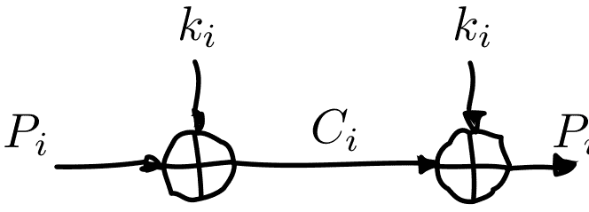

如果攻击者看到密文，我们可以证明他们在没有密钥的情况下对明文一无所知。这个属性被称为“完美安全性”（Perfect Secrecy）。这个证明可以通过将异或视为可编程反转器来直观理解，然后观察被窃听者 Eve 拦截的特定比特。

假设 Eve 看到一个特定的密文比特 $c_i$ 为 1。她不知道匹配的明文比特 $p_i$ 是 0 还是 1，因为她不知道密钥比特 $k_i$ 是 0 还是 1。由于所有密钥比特都是真正随机的，这两种选项完全等可能。

---
^4^ 攻击者确实会知道消息的存在，并且在这个简单的方案中，知道消息的长度。虽然这通常不太重要，但在某些情况下可能很重要，并且有安全的加密系统可以同时隐藏消息的存在和长度。

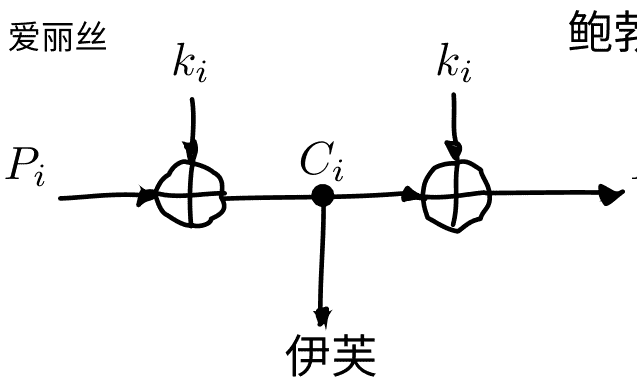

#### 5.5 对“一次性密码本”的攻击

一次性密码本的安全保证只有在正确使用时才有效。首先，一次性密码本必须由真正的随机数据组成。其次，一次性密码本只能使用一次（因此得名）。不幸的是，大多数声称是“一次性密码本”的商业产品都是骗局^5^，并且至少不满足这两个属性之一。

##### 不使用真正的随机数据

第一个问题是它们使用各种确定性结构来生成一次性密码本，而不是使用真正的随机数据。这并不一定是不安全的：实际上，最明显的例子是同步流密码，我们将在本书中稍后看到。然而，它使一次性密码本的“无法破解”的安全属性失效。最好为最终用户提供一个更诚实的加密系统，而不是一个对其安全性属性撒谎的系统。

---
^5^ “蛇油”（Snake oil）是一个术语，用来描述各种声称具有非凡好处和特点的可疑产品，但实际上并没有实现任何好处。

#### 重用 “一次性” 密码本

另一个问题是密钥的重用，这个问题更加严重。假设一个攻击者获得两个使用相同 “一次性” 密码本的密文。攻击者可以对这两个密文进行异或运算，结果也是两个明文的异或运算：

$$
\begin{aligned}
c_1 \oplus c_2 &= (p_1 \oplus k) \oplus (p_2 \oplus k) & (\text{定义}) \\
&= p_1 \oplus k \oplus p_2 \oplus k & (\text{重新排序项}) \\
&= p_1 \oplus p_2 \oplus k \oplus k & (a \oplus b = b \oplus a) \\
&= p_1 \oplus p_2 \oplus 0 & (x \oplus x = 0) \\
&= p_1 \oplus p_2 & (x \oplus 0 = x)
\end{aligned}
$$

乍一看，这似乎不是一个问题。要提取 $p_1$ 或 $p_2$，您需要取消异或操作，这意味着您需要知道另一个明文。问题是，即使是两个明文的异或操作结果也包含了相当多的关于明文本身的信息。我们将通过一些来自破解的“一次性”密码过程的图像来进行可视化说明（见第 24 页图 5.1）。

##### Crib-dragging

破解多次密码系统的经典方法之一是 “crib-dragging”，这是一个使用预期高概率出现的小序列的过程。这些序列被称为 “cribs”。crib-dragging 这个名字源于这些小的 “cribs” 从左到右拖动穿过每个密文，希望通过对密文进行匹配来找到匹配的地方。这些匹配点形成了进一步解密的起点，或者说是“线索”。

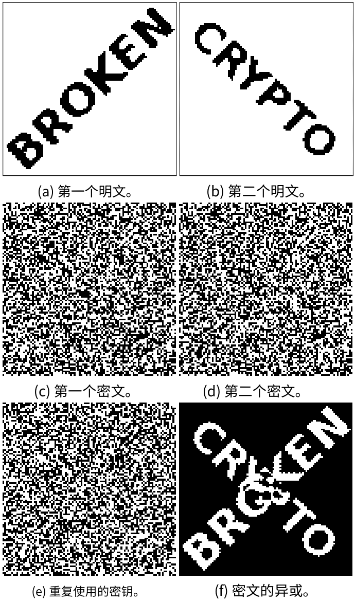
图5.1: 两个明文，重复使用的密钥，它们各自的密文，以及密文的异或。当我们对密文进行异或时，明文的信息明显泄露出来。

这个想法非常简单。假设我们有几个使用相同“一次性”密码本 $K$ 加密的加密消息 $C_i$。如果我们能够正确猜测出其中一个消息的明文，假设是 $P_j$，我们就会知道 $K$：

$$
\begin{aligned}
C_j \oplus P_j &= (P_j \oplus K) \oplus P_j \\
&= K \oplus P_j \oplus P_j \\
&= K \oplus 0 \\
&= K
\end{aligned}
$$

由于 $K$ 是共享密钥，我们现在可以使用它来解密所有其他消息，就像我们是接收者一样：$P_i = C_i \oplus K$ 对于所有 $i$。

由于我们通常无法猜测整个消息，这实际上是行不通的。然而，我们可能能够猜测消息的部分内容。如果我们能够正确猜测几个明文位 $p_i$ 对于任何一个消息，那将揭示该位置的密钥位对于所有消息来说（因为 $k = c_i \oplus p_i$）。因此，该位置的所有明文位都被揭示：使用该值作为 $k$，我们可以计算其他所有消息在该位置的明文位 $p_i = c_i \oplus k$。

猜测明文的部分内容比猜测整个明文要容易得多。假设我们知道明文是英文的。有一些我们知道会经常出现的序列，例如（符号 ␣ 表示空格）：

- `␣the␣` 以及变体如 `.␣The␣`
- `␣of␣` 及变体
- `␣to␣` 及变体
- `␣and␣`（通常只出现在句子中间）
- `␣a␣` 及变体

如果我们对明文了解更多，我们可以做出更好的猜测。例如，如果是 HTTP 传输的 HTML，我们会期望看到像 `Content-Type`, `<a>` 等等的内容。

这只告诉我们哪些明文序列是可能的。我们如何判断这些猜测中是否有正确的呢？如果我们的猜测是正确的，我们也可以使用之前描述的技术来获知该位置上所有其他消息的明文。我们可以简单地查看这些明文并决定它们是否看起来正确。

实际上，这个过程需要自动化，因为可能的猜测太多。幸运的是，这很容易做到。例如，一个非常简单但有效的方法是计算猜测的明文中不同符号出现的频率：如果消息包含英文文本，我们会期望看到很多字母 e、t、a、o、i、n。如果我们看到的是二进制的无意义内容，我们就知道猜测可能是错误的。

这些小而高概率的序列被称为 “cribs”，因为它们是更大解密过程的开端。假设你的 crib `␣the␣` 在另一条消息中成功找到了这个五个字母的序列 `t␣thr`。然后，你可以使用字典来查找以 `thr` 开头的常见单词，比如 `through`。如果这个猜测是正确的，它将揭示出所有密文中的另外四个字节，这些字节可以用来揭示更多信息。

虽然这种技术在两条消息使用相同密钥加密时就可以工作，但很明显，如果有更多使用相同密钥的密文，所有步骤都会变得更加容易和有效：

- 我们获得更多的破译位置。
- 每次成功的破译和猜测都会揭示更多的明文字节，从而在其他地方提供更多的猜测选项。
- 对于任何给定的位置，更多的密文可用，使得猜测验证更容易且更准确。

这些只是破解多次密码（Multi-time pad）的简单思路。虽然它们已经相当有效，但人们通过应用基于自然语言分析的先进统计模型发明了更有效的方法。

#### 5.6 剩余问题

真正的一次性密码，如果正确实施，具有极强的安全保证。看起来加密问题已经解决，我们都可以回家了。显然，情况并非如此。

一次性密码很少使用，因为它们非常不实用：密钥必须至少与您想传输的所有信息一样大。此外，您必须提前安全地与所有您想进行通信的人交换这些密钥。我们希望与互联网上的每个人进行安全通信，这是一个非常庞大的人数。此外，由于密钥必须由真正的随机数据组成，没有专用硬件的情况下，密钥生成相当困难且耗时。

一次性密码本提出了一个权衡。它是一个具有坚实的信息论安全保证的算法，这是其他系统无法提供的。另一方面，它也有极其不切实际的密钥交换要求。然而，正如我们在本书中将看到的，安全的对称加密算法并不是现代密码系统的痛点。密码学家已经设计了很多这样的算法，而实际的密钥管理仍然是现代密码学面临的最大挑战之一。一次性密码本可能解决了一个问题，但却是错误的问题。

我们需要一些能够管理密钥大小并保持机密性的方法。我们需要一种与互联网上从未见过的人协商密钥的方式。

### 6 分组密码

> 很少有错误的想法像这样牢牢地抓住了这么多聪明人的思维，即如果他们努力的话，他们可以发明一种没有人能够破解的密码。
> 
> —— 大卫·卡恩

#### 6.1 描述

块密码（分组密码）是一种允许我们加密固定长度块的算法。它提供了一个加密函数 $E$，使用一个秘密密钥 $k$，将明文块 $P$ 转换为密文块 $C$：

$$C = E(k, P) \qquad (6.1)$$

明文块和密文块是一系列位的序列。它们的大小始终相同，并且由块密码固定：这被称为块密码的“块大小”（Block size）。所有可能的密钥集称为密钥空间。

一旦我们将明文块加密为密文块，稍后需要再次解密以恢复原始的明文块。这是使用解密函数 $D$ 完成的，它接受密文块 $C$ 和密钥 $k$（与加密块时使用的密钥相同）作为输入，并产生原始的明文块 $P$。

$$P = D(k, C) \qquad (6.2)$$

或者，按块处理：


块密码是对称密钥加密方案的一个例子，也被称为秘密密钥加密方案。这意味着相同的秘密密钥用于加密和解密。我们将在这本书的后面与具有不同加密和解密密钥的公钥加密算法进行对比。

块密码是一种“有密钥的置换”（Keyed Permutation）。它是一个置换，因为块密码将每个可能的块映射到另一个唯一的块。它也是一个有密钥的置换，因为密钥确定了具体的映射关系。它是一个置换非常重要，因为……接收者需要能够将块映射回原始块，只有这样才能实现一对一映射。

我们将通过查看一个具有不切实际的、微小的4位块大小的块密码来说明这一点，因此有 $2^4 = 16$ 个可能的块。由于每个块都映射到一个十六进制数字，我们将用该数字表示块。图6.1说明了密码操作的块。

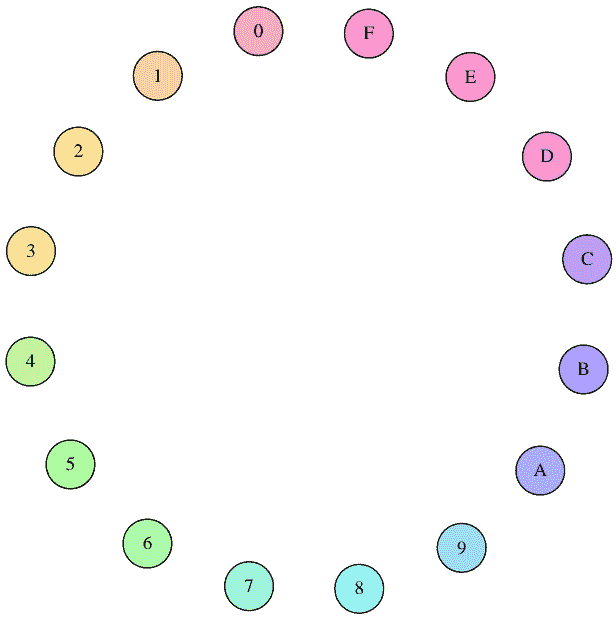

图6.1: 受块密码操作的所有16个节点。每个节点由一个十六进制数字指定。

一旦我们选择了一个秘密密钥，块密码将使用它来确定任何给定块的加密结果。我们将用箭头来说明这种关系：箭头起始处的块，使用密钥 $k$ 下的 $E$ 进行加密，映射到箭头末尾的块。

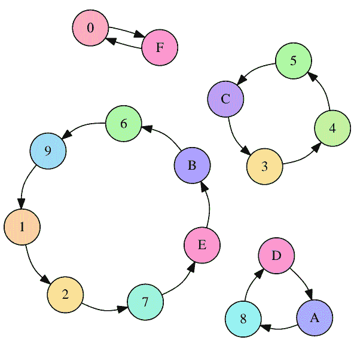

图6.2：在特定密钥 $k$ 下由分组密码产生的加密置换

在图6.2中，你会注意到置换不仅仅是一个大循环：有一个由7个元素组成的大循环，以及几个由4、3和2个元素组成的小循环。也完全有可能一个元素加密为自身。当选择随机置换时，这是可以预料的，这大致是分组密码所做的；这并不表明分组密码存在错误。

当你解密而不是加密时，分组密码只是计算逆置换。在图6.3中，你可以看到我们得到了相同的插图，只是所有的箭头都指向相反的方向。

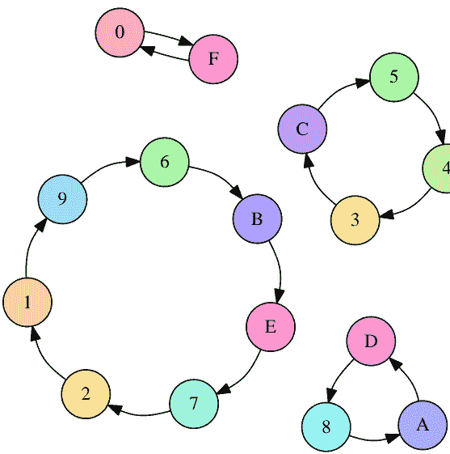

图6.3：使用相同密钥 $k$ 产生的解密置换：加密置换的逆置换，即所有的箭头都被反转。

唯一知道哪个块映射到哪个其他块的方法，是知道密钥。不同的密钥将导致完全不同的箭头集合，如图6.4所示。在这个插图中，你甚至会注意到有两个置换长度为1的置换：一个映射到自身的元素。这再次是在选择随机置换时可以预料到的事情。

对于给定密钥的一堆（输入，输出）对的了解不应该给你关于其他（输入，输出）对的任何信息$^1$。只要我们谈论的是一个理论上完美的分组密码，除了“暴力破解”之外，没有更简单的解密一个分组的方法。

> 细心的读者可能已经注意到这在极端情况下会出现问题：如果你知道除了一个对之外的所有对，那么你可以通过排除法得到最后一个对。

强制破解密钥：即尝试每一个密钥，直到找到正确的那一个。

我们的玩具示例分组密码只有4位分组，或 $2^4=16$ 种可能性。真正的现代分组密码具有更大的分组大小，例如128位，或 $2^{128}$（略大于 $10^{38.5}$）个可能的分组。

数学告诉我们，一个 $n$ 元素集合有 $n!$ （读作“$n$ 阶乘”）不同的排列。它定义为从1到 $n$ 的所有数字的乘积：

$$n! = 1 \cdot 2 \cdot 3 \cdot \dots \cdot (n-1) \cdot n$$

阶乘增长非常快。例如，$5! = 120$，$10! = 3628800$，而且速度还在增加。具有128位块大小的密码块集的排列数是 $(2^{128})!$。

仅仅 $2^{128}$就已经非常大了（需要39位数字来表示），所以 $(2^{128})!$ 是一个难以理解的巨大数字。常见的密钥大小只在128到256位之间，因此密码可以执行的排列数只有 $2^{128}$到 $2^{256}$之间。那只是所有可能排列中的一小部分，但这没关系：这一小部分仍然远远不足以供攻击者尝试全部。

当然，块密码应该尽可能容易计算，只要不牺牲上述任何属性。

## 6.2 AES

目前最常用的块密码是高级加密标准（AES）。

与其前身DES相反（我们将在下一章中详细介绍），AES是通过公开征集提案的公开评审竞赛选出的。这个竞赛包括多轮，所有参赛者都要进行广泛的密码分析，并进行投票。AES过程在密码学家中得到了良好的反响，类似的过程通常被认为是选择密码标准的首选方式。

在被选为高级加密标准之前，该算法被称为Rijndael，这个名字是由设计它的比利时密码学家的姓氏Vincent Rijmen和Joan Daemen组成的。Rijndael算法定义了一系列块密码，块大小和密钥大小可以是128位到256位之间的32位的任意倍数。[16] 当Rijndael通过联邦信息处理标准 (FIPS) 标准化过程成为AES时，参数被限制为块大小为128位，密钥大小为128、192和256位。[1] 目前没有已知对AES的实际攻击。虽然近年来有一些进展，但大多数攻击涉及相关密钥攻击[10]，其中一些只针对AES的减轮版本[9]。

相关密钥攻击涉及对AES在几个不同密钥下的行为进行一些预测，具有一些特定的数学关系。这些关系相当简单，例如与攻击者选择的常数进行异或运算。如果攻击者被允许使用这些相关密钥加密和解密大量的数据块，他们可以尝试以比通常破解所需计算量少得多的方式恢复原始密钥。

虽然理论上理想的分组密码不会受到相关密钥攻击的威胁，但这些攻击并不被认为是实际上的问题。在实践中，加密密钥是通过密码学安全的伪随机数生成器、类似安全密钥协商方案或密钥派生方案生成的（我们稍后会详细了解）。

因此，通过意外选择两个这样的相关密钥的可能性是不存在的。从学术角度来看，这些攻击是有趣的：它们可以帮助了解密码的工作原理，指导密码学家设计未来的密码和对当前密码的攻击。

### 深入研究Rijndael


> 这是一个可选的深入章节。它几乎肯定不会帮助你编写更好的软件，所以随意跳过它。它只是为了满足你内心极客的好奇心。

AES由几个独立的步骤组成。在高层次上，AES是一个 置换-置换网络。

##### 密钥调度

AES在下一步中需要每轮使用单独的密钥。密钥调度是AES用于从一个主密钥派生每轮128位密钥的过程。

首先，密钥被分成4个字节列。密钥被旋转，然后每个字节通过S盒（替代盒）运行，将其映射到其他值。然后每列与一个轮常数进行XOR运算。最后一步是将结果与上一轮密钥进行XOR运算。然后其他列与上一轮密钥进行XOR运算，生成剩余的列。

### SubBytes

SubBytes是AES中的S盒（替代盒）。它的大小为 $8 \times 8$位。

它通过在Galois域上取乘法逆元，然后应用仿射变换，使得没有值 $x$ 使得 $x \oplus S(x) = 0$ 或 $x \oplus S(x) = 0\text{xff}$。换句话说，没有值 $x$ 使得替代盒将其映射到自身，或者将其映射到所有位翻转的情况。这使得密码算法对线性攻击具有抵抗力，不像早期的DES算法，其第五个S盒引起了严重的安全问题。$^2$

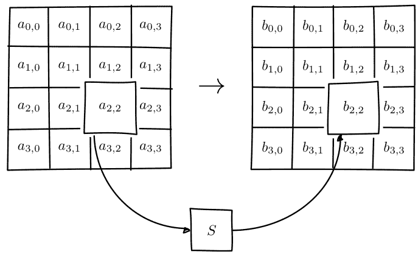

$^2$在DES设计时，线性攻击还未公开知晓，因此它有其自身的防御措施。

### ShiftRows

在对块的16个字节应用SubBytes步骤后，AES将行在 $4 \times 4$ 数组中进行移位：

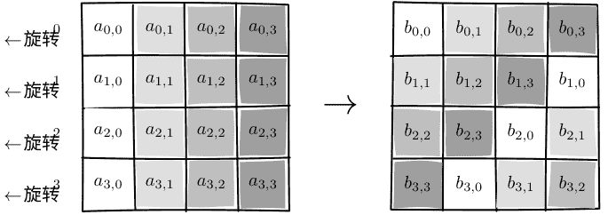

### MixColumns

MixColumns将状态的每一列与一个固定的多项式相乘。ShiftRows和MixColumns代表AES的扩散特性。

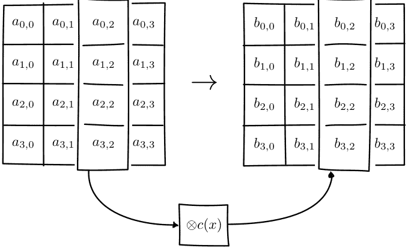

### AddRoundKey

正如其名称所示，AddRoundKey步骤将密钥计划生成的轮密钥字节添加到密码的状态中。

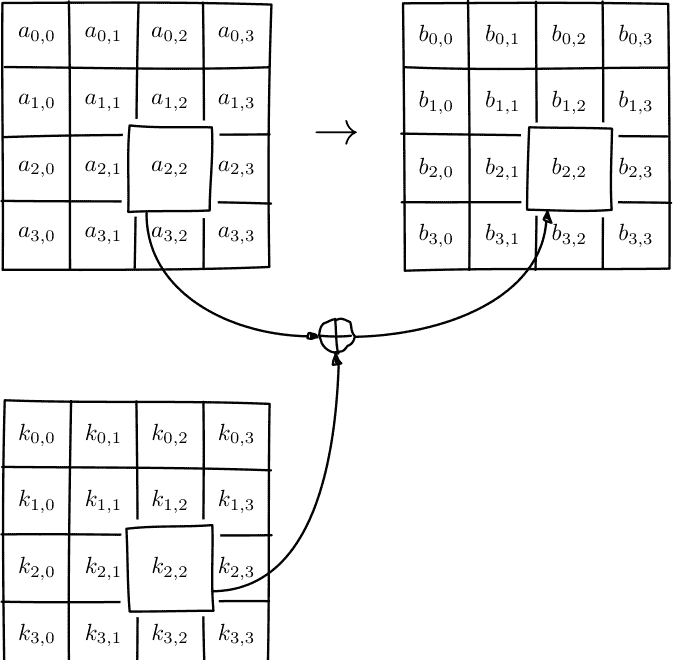

## 6.3 DES和3DES

数据加密标准（DES）是最古老的分组密码之一，被广泛使用。它于1977年作为官方FIPS标准发布。由于其仅有56位的密钥长度，DES已不再被认为是安全的。（实际上，DES算法接受64位密钥输入，但剩余的8位仅用于奇偶校验，并立即丢弃。）它不应该在新系统中使用。在现代硬件上，DES可以在不到一天的时间内被暴力破解。

为了延长DES算法的使用寿命，并充分利用已经投入的硬件开发工作，人们提出了3DES：一种先加密、再解密、再加密的方案：

$$C = E_{DES}(k_1, D_{DES}(k_2, E_{DES}(k_3, p))) \quad (6.3)$$

该方案提供了两个改进：

- 通过三次应用算法，密码变得更难以通过密码分析直接攻击。
- 通过使用更多的总密钥位数，分布在三个密钥上，所有可能的密钥集变得更大，使得穷举攻击变得不切实际。

这三个密钥可以独立选择（产生 168 个密钥位），或者 $k_3 = k_1$（产生 112 个密钥位），或者 $k_1 = k_2 = k_3$，当然，这就是普通的 DES（56 个密钥位）。在最后的密钥选项中，中间解密反转了第一个加密，所以你实际上只得到了最后一个加密的效果。这是为现有 DES 系统的向后兼容模式而设计的。如果 3DES 被定义为 $E(k_1, E(k_2, E(k_3, p)))$，那么在需要与 DES 兼容的系统中使用 3DES 实现将是不可能的。这对于硬件实现尤其重要，因为在主要的 3DES 接口旁边提供一个次要的、常规的“单 DES”接口并不总是可能的。

已知对3DES的一些攻击，降低了它们的有效安全性。虽然目前使用第一种密钥选项破解3DES是不切实际的，但3DES对于任何现代密码系统来说都是一个糟糕的选择。安全边际已经很小，并且随着密码攻击的改进和处理能力的增长而不断缩小。

有更好的替代方案，比如AES。它们不仅比3DES更安全，而且通常要快得多。在相同的硬件和相同的操作模式下，AES-128每字节只需要12.6个周期，而3DES每字节需要高达134.5个周期。[17]尽管从安全角度来看更糟糕，但它的速度确实慢了一个数量级。

虽然DES的更多迭代可能会增加安全边际，但实际上并没有使用。首先，这个过程从未标准化超过三次迭代。此外，随着迭代次数的增加，性能只会变得更差。最后，增加密钥位数会带来递减的安全回报，只会以较小的幅度增加结果算法的安全级别。虽然3DES的密钥选项1的密钥长度为168位，但其有效安全级别仅估计为112位。

尽管在性能方面3DES明显较差并且在安全性方面稍微较差，但3DES仍然是金融行业的主力军。在已经存在大量标准的情况下并且新的标准仍在不断产生，在这个极度技术保守的行业中，Fortran和Cobol仍然在大型主机上占主导地位，它可能会继续使用很多年，除非有一些重大的密码分析突破威胁到3DES的安全性。

#### 6.4 剩余问题

即使使用分组密码，仍然存在一些未解决的问题。

例如，我们只能发送非常有限长度的消息：分组密码的分组长度。显然，我们希望能够发送更大的消息，或者理想情况下，大小不确定的数据流。我们将使用流密码来解决这个问题。

尽管我们已经大大减小了密钥的大小（从一次密码方案下发送的所有数据的总大小与大多数分组密码的几个字节相比），但我们仍然需要解决通过不安全信道协商这几个关键字节的问题。我们将在后面的章节中使用密钥交换协议来解决这个问题。

### 7 流密码

#### 7.1 描述

流密码是一种对称密钥加密算法，它加密一个比特流。理想情况下，这个比特流可以无限长；现实世界中的流密码有一定的限制，但通常足够大，不会造成实际问题。

#### 7.2 使用分组密码的天真尝试

让我们尝试使用我们已经拥有的工具来构建一个流密码。由于我们已经有了分组密码，我们可以简单地将输入的比特流分成不同的块，并加密每个块：

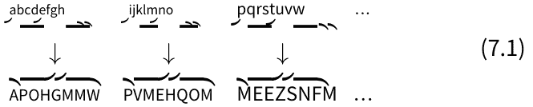

这种方案被称为ECB模式（电子密码本模式），它是使用分组密码构建流密码的众多方式之一。不幸的是，虽然在自制密码系统中非常常见，但它存在非常严重的安全漏洞。例如，在ECB模式下，相同的输入块将始终映射到相同的输出块：

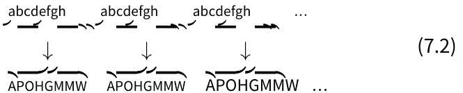

起初，这可能看起来不是一个特别严重的问题。假设分组密码是安全的，看起来攻击者无法解密任何东西。通过将密文流分块，攻击者只能看到一个密文块，因此也只能看到一个明文块被重复。

现在我们将用两种攻击方法来说明ECB模式的许多缺陷。首先，我们将通过直观地检查加密图像中重复的明文块导致重复的密文块来利用这一事实。然后，我们将证明攻击者通常可以通过与执行加密的人进行通信来解密以ECB模式加密的消息。

##### 加密流的视觉检查

为了证明这实际上是一个严重的问题，我们将使用各种块大小的模拟分组密码，并将其应用于图像$^1$。然后我们将视觉检查不同的输出。因为明文中相同的像素块将映射到相同的密文像素块，所以图像的全局结构基本保持不变。

正如你所看到的，情况似乎随着块大小的增加而稍微好转，但根本问题仍然存在：图像的宏观结构在除了最极端的块大小之外仍然可见。此外，除了最小的这些块大小都是不现实的。对于一个具有8位深度的三色通道的未压缩位图，每个像素需要24位来存储。由于AES的块大小仅为128位，这相当于 $\frac{128}{24}$ 或者每个块超过5个像素。这比示例中较大的块大小每个块的像素要少得多。但是AES是现代分组密码的主力军，它不能因为块大小不足而受到责备。

当我们看一个理想的加密方案的图片时，我们会发现它看起来像随机噪声。请记住，“看起来像随机噪声”并不意味着某个东西被正确加密了：它只是意味着我们不能使用这种简单的方法来检查它。

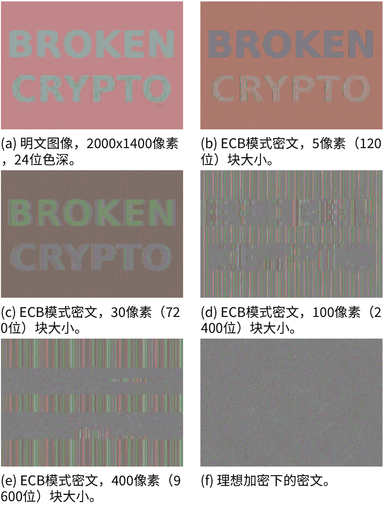

图7.1: 明文图像与在理想情况下的密文图像和使用不同块大小的ECB模式加密的密文图像。关于图像的宏观结构的信息明显泄漏。随着块大小的增加，这一点变得不太明显，但只有在比典型块密码大得多的块大小时才会发生。只有第一个块大小（图b，像素大小为5或120位）是现实的。

##### 加密预言机攻击

在前一节中，我们专注于攻击者如何检查使用ECB模式加密的密文。这是一种被动的、仅基于密文的攻击。它是被动的，因为攻击者实际上不会干扰任何通信；他们只是检查密文。在本节中，我们将研究一种不同的、主动的攻击，攻击者会与目标进行积极的通信。我们将看到主动攻击如何使攻击者能够解密使用ECB模式加密的密文。

为了做到这一点，我们将介绍一个称为预言机的新概念。正式定义的预言机在计算机科学的研究中被使用，但对于我们的目的来说，只需要说预言机是一个可以为您计算某个特定函数的东西即可。

在我们的情况下，神谕将为攻击者执行特定的加密操作，这就是为什么它被称为加密神谕。给定一些数据 $A$ 由攻击者选择，神谕将对该数据进行加密，然后加上一个秘密后缀 $S$，使用ECB模式。或者用符号表示：

$$C = ECB(E_k, A \Vert S)$$

秘密后缀 $S$ 是特定于该系统的。攻击者的目标是解密它。我们将看到能够加密其他消息出人意料地允许攻击者解密后缀。这个神谕可能看起来很人为，但在实践中非常常见。一个简单的例子可以是使用ECB加密的cookie，其中前缀 $A$ 是一个名字或者一个由攻击者控制的电子邮件地址字段。

你可以看到为什么神谕的概念在这里很重要：攻击者无法计算 $C$，因为他们无法访问加密密钥 $k$ 或秘密后缀 $S$。Oracle的目的是让这些值保持秘密，但我们将看到攻击者如何能够恢复秘密后缀 $S$（但不能恢复密钥 $k$）。攻击者通过检查密文 $C$ 来获取许多精心选择的攻击者选择的前缀 $A$ 的值。事实证明，在实践中，很多软件可以被欺骗成为一个Oracle。即使攻击者无法像查询Oracle那样精确地控制真实软件，攻击者通常也不会受阻。系统中一部分消息是秘密的，而另一部分消息可以受到攻击者的影响，这实际上是非常常见的，而且不幸的是，ECB模式也是如此。

## 使用oracle解密一个块

攻击者首先发送一个明文 $A$，它比块大小少一个字节。这意味着被加密的块将由这些字节组成，加上 $S$ 的第一个字节，我们称之为 $s_0$。攻击者记住了加密的块。他们还不知道 $s_0$ 的值，但现在他们知道了第一个加密块的值。

在图示中，这是块 $C_{R1}$：

然后，攻击者尝试一个完整大小的块，尝试所有可能的最后一个字节的值。最终，他们会找到 $s_0$ 的值；他们知道猜测是正确的，因为得到的密文块将与他们之前记住的密文块 $C_{R1}$ 匹配。

攻击者可以重复这个过程来获取第二个字节。他们提交一个比块大小少两个字节的明文 $A$。

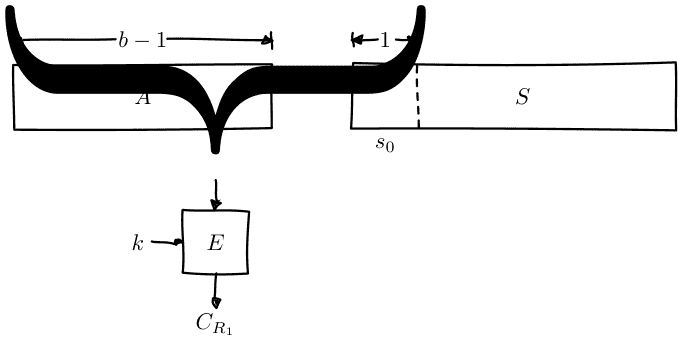

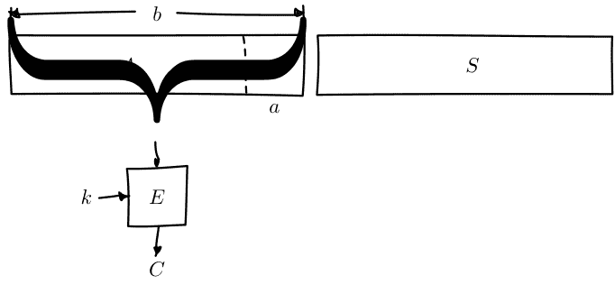

这个oracle将加密一个由 $A$ 后跟秘密后缀的前两个字节组成的第一个块，$s_0s_1$。攻击者记住了那个块。

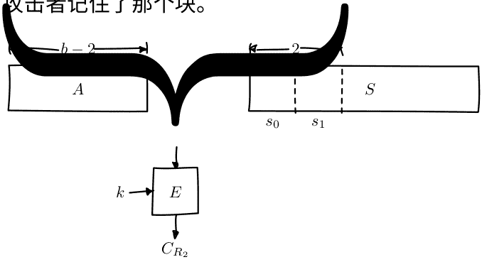

由于攻击者已经知道 $s_0$，他们尝试 $A\|s_0$ 后跟所有可能的 $s_1$ 值。最终他们会猜对，再次，他们会知道因为密文块匹配：

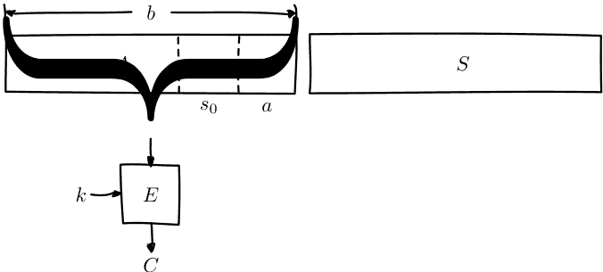

然后攻击者可以反复洗牌，最终解密一个完整的块。这使得他们可以在 $p \cdot b$ 次尝试中暴力破解一个块，其中 $p$ 是每个字节的可能值的数量（对于8位字节，这是 $2^8 = 256$），并且 $b$ 是块大小。这比常规的暴力破解攻击要好得多，常规攻击必须尝试所有可能的块，即：

$$256^{b}$$

对于典型的块大小为16字节（或128位）的情况，暴力破解意味着尝试 $256^{16}$ 个组合。这是一个巨大的，39位数。它如此之大，以至于尝试所有这些组合被认为是不可能的。ECB加密预言允许攻击者在最多 $256 \cdot 16 = 4096$ 次尝试中完成，这是一个更可管理的数字。

###### 结论

在现实世界中，块密码经常用于加密大量数据的系统中。我们已经看到，在使用ECB模式时，存在严重的安全性缺陷。

攻击者可以分析密文以识别重复模式，甚至在获得加密预言机的访问权限时解密消息。

即使我们使用具有超过一千位的理想化块密码，攻击者最终也能够解密密文。现实世界的块密码比我们理想化的示例有更多限制，例如更小的块大小。

我们甚至没有考虑到分组密码的任何潜在弱点。导致这个问题的不是AES（或我们的测试分组密码），而是我们的ECB构造方式。显然，我们需要更好的方法。

#### 7.3 分组密码的工作模式

生成流密码的一种常见方式是使用特定配置的分组密码。这种复合系统的行为类似于流密码。这些配置通常被称为操作模式。它们不特定于特定的分组密码。

刚刚介绍的ECB模式是最简单的操作模式。字母 ECB代表电子密码本（Electronic Codebook）。出于我们已经讨论过的原因，ECB模式非常低效。幸运的是，还有很多其他选择。

## 7.4 CBC模式

CBC模式，代表密码块链接（Cipher Block Chaining），是一种非常常见的操作模式。在这种模式中，明文块在被块密码加密之前，先与前一个密文块进行异或运算。

当然，这给我们带来了第一个明文块的问题：没有前一个密文块可以与其进行异或运算。相反，我们选择一个初始化向量 (IV)：一个随机数，它在这个构造中代替了“第一个”密文。初始化向量也出现在许多其他算法中。初始化向量应该是不可预测的；理想情况下，它们应该是密码学上的随机数。它们不需要保密：IV通常只是以明文形式添加到密文消息中。听起来似乎矛盾，某物必须是不可预测的，但不必保密；重要的是，攻击者不能提前预测给定IV将是什么。我们将在后面通过对可预测的CBC IV进行攻击来说明这一点。

下图演示了CBC模式下的加密：

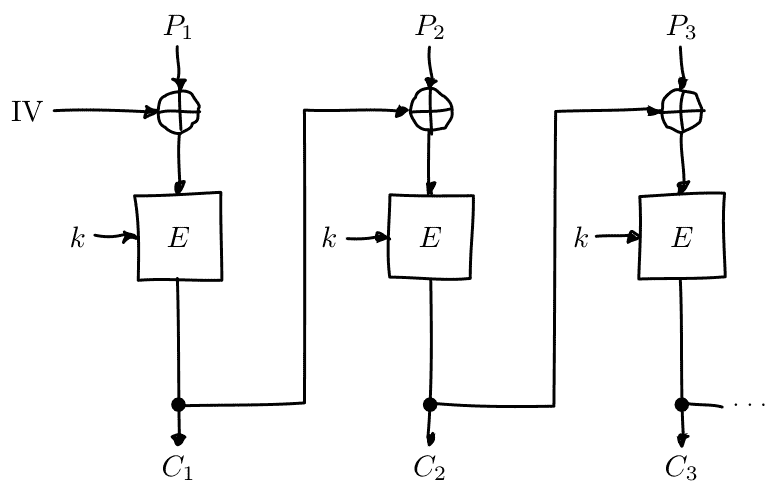

解密是逆向构造，使用解密模式的块密码而不是加密模式：

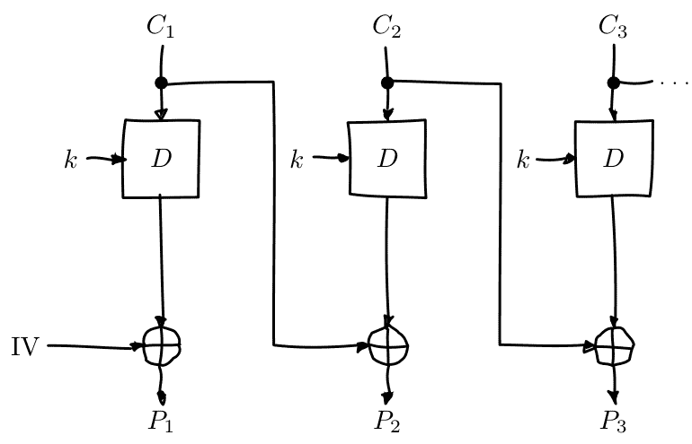

虽然CBC模式本身并不是固有的不安全的（不像ECB模式），但在TLS 1.0中的特定使用是不安全的。这最终导致了针对SSL/TLS的浏览器利用（BEAST）攻击，我们将在SSL/TLS部分中详细介绍。简而言之，与其使用不可预测的初始化向量（例如选择随机IV），标准使用前一个密文块作为下一条消息的IV。不幸的是，攻击者发现了如何利用这个特性。

## 7.5 对具有可预测IV的CBC模式的攻击

假设有一个存储秘密用户信息的数据库，例如医疗、工资甚至犯罪记录。为了保护这些信息，处理它的服务器使用固定密钥的强大块密码在CBC模式下对其进行加密。暂时我们假设该服务器是安全的，没有办法泄露密钥。

Mallory获得了数据库中的所有行。也许她通过SQL注入攻击做到了这一点，或者可能是通过一点社交工程。社交工程意味着欺骗人们做不应该做的事情，比如泄露秘密密钥或执行某些操作。这通常是破解本来安全的加密系统的最有效方法。

一切都应该保持安全：Mallory只有密文，但她没有秘密密钥。Mallory想要弄清楚Alice的记录说了什么。为了简单起见，假设只有一个密文块。这意味着Alice的密文由一个IV和一个密文块组成。

Mallory仍然可以尝试使用应用程序作为普通用户，这意味着应用程序将加密一些Mallory选择的数据并将其写入数据库。假设通过服务器中的一个错误，Mallory可以预测用于她的密文的IV。也许服务器总是为同一个人使用相同的IV，或者总是使用全零IV，或者……

Mallory可以使用Alice的IV $IV_A$（Mallory可以看到）和她自己预测的IV $IV_M$来构造她的明文。她猜测Alice的数据可能是什么（记作 $G$）。她要求服务器加密：

$P_M = IV_M \oplus IV_A \oplus G$

服务器忠实地使用预测的IV $IV_M$加密该消息。它计算：

$C_M = E(k, IV_M \oplus P_M)$
$= E(k, IV_M \oplus (IV_M \oplus IV_A \oplus G))$
$= E(k, IV_A \oplus G)$

该密文 $C_M$ 正是如果 Alice 的明文块是 $G$，她将拥有的密文块。因此，根据数据的不同，Mallory 已经弄清楚了 Alice 是否有犯罪记录，或者可能有某种尴尬的疾病，或者其他 Alice 真正希望服务器保密的问题。

教训：不要让 IV 可预测。另外，不要自己编写加密系统。在一个安全的系统中，Alice 和 Mallory 的记录可能不会使用相同的密钥进行加密。

## 7.6 攻击 CBC 模式，将密钥作为 IV

许多 CBC 系统将密钥设置为初始化向量。这似乎是个好主意：你总是需要一个共享的秘密密钥。这样做可以带来良好的性能优势，因为发送方和接收方不需要显式地通信 IV，他们已经知道密钥（因此也知道 IV）的值。此外，密钥肯定也是不可预测的，因为它是秘密的：如果它是可预测的，攻击者可以直接预测密钥并获胜。方便的是，许多分组密码的分组大小与密钥大小相同或更小，因此密钥足够大。

这种设置是完全不安全的。如果 Alice 向 Bob 发送一条消息，Mallory 作为一个能够拦截和修改消息的主动对手，可以执行选择密文攻击来恢复密钥。Alice 将她的明文消息 $P$ 转换为三个块 $P_1P_2P_3$，并使用秘密密钥 $k$ 以及 $k$ 作为 IV 在 CBC 模式下进行加密。她得到一个三个块的密文 $C = C_1C_2C_3$，然后将其发送给 Bob。

在消息到达Bob之前，Mallory拦截了它。她修改了消息为 $C' = C_1 Z C_1$，其中 $Z$ 是一个填充了空字节（值为零）的块。

Bob解密 $C'$，并得到了三个明文块 $P'_1, P'_2, P'_3$：

$P'_1 = D(k, C_1) \oplus IV = D(k, C_1) \oplus k = P_1$

$P'_2 = D(k, Z) \oplus C_1 = R$

$P'_3 = D(k, C_1) \oplus Z = D(k, C_1) = P_1 \oplus IV$

$R$ 是一些随机块，它的值并不重要。

在所选择的密文攻击假设下，Mallory恢复了解密结果。她只对第一个块（$P'_1 = P_1$）和第三个块（$P'_3 = P_1 \oplus IV$）感兴趣。通过将这两个块进行异或，她发现 $(P_1 \oplus IV) \oplus P_1 = IV$。但是，IV就是密钥，所以Mallory通过修改单个消息成功恢复了密钥。

教训是：不要将密钥用作IV。在介绍中的错误之一是假设秘密数据可以用作IV，因为它只需要是不可预测的。这是不正确的：“秘密”只是与“非秘密”不同的要求，不一定是一个更强的要求。有很多系统可以在不需要的地方使用秘密。在某些情况下，您甚至可能得到一个更强大的系统，但关键是这不是普遍适用的，而是取决于您正在做什么。

## 7.7 CBC位翻转攻击

对CBC模式的一种有趣攻击被称为比特翻转攻击。使用CBC比特翻转攻击，攻击者可以修改在CBC模式下加密的密文，以便对明文产生可预测的影响。

这一开始可能看起来是一个非常奇怪的“攻击”定义。攻击者甚至不会尝试解密任何消息，而只会在明文中翻转一些位。我们将证明攻击者可以将这种在明文中翻转位的能力转化为使明文显示他们想要的任何内容的能力，这可能导致实际系统中的非常严重的问题。

假设我们有一个CBC加密的密文。例如，这可以是一个cookie。我们选择一个特定的密文块，并在其中翻转一些位。明文会发生什么变化？

当我们“翻转一些位”时，我们通过与一系列位（我们将其称为 $X$）进行异或操作来实现。如果 $X$ 中对应的位是1，那么该位将被翻转；否则，该位将保持不变。

当我们尝试用翻转的密文块解密位时，我们将得到无法理解的无意义（请原谅这个双关语）。记住CBC解密的工作原理：块密码的输出与前一个密文块进行异或运算，以产生明文块。现在，输入的密文块 $C_i$ 已经被修改，块密码的输出将是一些随机不相关的块。在与前一个密文块进行异或运算之后，它仍然是无意义的。因此，产生的明文块仍然只是无意义的。在插图中，这个无法理解的明文块是 $P'_i$。

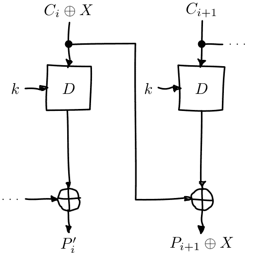

然而，在那之后的块中，我们在密文中翻转的位也将在明文中翻转！这是因为，在CBC解密中，密文块通过块密码进行解密，然后与前一个密文块进行异或运算。但由于我们通过与 $X$ 进行异或运算修改了前一个密文块，所以明文文本块 $P_{i+1}$ 也将与 $X$ 进行异或运算。因此，攻击者完全控制着明文块 $P_{i+1}$，因为他们可以翻转位来获得他们想要的值。

（TODO：添加先前的插图，但用红色或其他颜色标记 $X$ 对 $P'_{i+1}$ 的影响路径）

起初，这可能听起来不像什么大不了的事情。如果你不知道下一个块的明文字节，你就不知道要翻转哪些位才能得到你想要的明文。

为了说明攻击者如何将其转化为实际攻击，让我们考虑一个使用cookie的网站。当你注册时，你选择的用户名被放入一个cookie中。网站对cookie进行加密并发送给你的浏览器。下次你的浏览器访问该网站时，它将提供加密的cookie；网站解密它并知道你是谁。

攻击者通常可以控制至少部分被加密的明文。在这个例子中，用户名是cookie的一部分明文。由于网站在注册时允许你提供任何想要的用户名，攻击者可以在他们的用户名中添加一个非常长的填充字节字符串（例如 'z'）。服务器会加密这样一个cookie，给攻击者一个与明文匹配的带有许多 'z' 字节的加密密文。被修改的明文很可能是那个 'z' 字节序列的一部分。

攻击者可能有一些目标字节，他们希望在解密的明文中看到，例如 `;admin=1;`。为了找出他们应该翻转哪些字节（即插图中的 $X$ 的值），他们只需将填充字节 (zzz...) 与目标进行异或运算。因为两个具有相同值的异或操作会相互抵消，所以这两个填充值 (zzz...) 将被取消，攻击者可以期望在下一个明文块中看到 `;admin=1;` 弹出：

$P'_{i+1} = P_{i+1} \oplus X$
$= P_{i+1} \oplus ZZZZZZZZZ \oplus ; admin = 1 ;$
$= ZZZZZZZZZ \oplus ZZZZZZZZZ \oplus ; admin = 1 ;$
$= ; admin = 1;$

这种攻击是对一个重要的密码学原则的另一个演示：加密不等于认证！仅仅加密一条消息通常是不够的。它可以防止攻击者阅读它，但这对于阻止攻击者修改它来说通常并不必要。这个特定的问题可以通过安全地对消息进行认证来解决。我们将在本书的后面看到如何做到这一点；现在只需记住，我们需要认证才能产生安全的加密系统。

## 7.8 填充

到目前为止，我们方便地假设所有的消息恰好适应于我们的分组密码系统，无论是CBC还是ECB。这意味着所有的消息恰好是分组大小的倍数。在典型的分组密码 (如AES) 中，分组大小为16字节。当然，真实的消息可以是任意长度的。我们需要一些方案来使它们适应，这个过程被称为填充。

##### 用零（或其他填充字节）进行填充

一种填充的方法是简单地追加特定的字节值（如零），直到明文达到适当的长度。要撤消填充，只需删除这些字节。这种方案有一个明显的缺陷：你不能发送以特定填充字节值结尾的消息，否则你将无法区分填充和实际消息。

### PKCS#5/PKCS#7填充

一种更好、更流行的方案是PKCS#5/PKCS#7填充。PKCS#5，PKCS#7和后来的CMS填充都是或多或少相同的思想。严格来说，PKCS#5填充仅针对8字节的块大小进行定义，但这个思想显然很容易推广，并且也是最常用的术语。

该方案取需要填充的字节数，并用该值重复填充这么多次的字节。例如，如果块大小为8字节，并且最后一个块有三个字节 `12 34 45`，则需要填充5个字节，填充后的块变为 `12 34 45 05 05 05 05 05`。

如果明文恰好是块大小的倍数，将使用一个完整的填充块。否则，接收者将查看明文的最后一个字节，将其视为填充长度，如果没有正确的重复次数，则会得出消息填充不正确的结论。

## 7.9 CBC填充攻击

我们可以改进CBC位翻转攻击，以欺骗接收者解密任意消息！

正如我们刚刚讨论的，CBC模式需要将消息填充到块大小的倍数。如果填充不正确，接收者通常会拒绝消息，并表示填充无效。我们可以利用关于明文填充的这一小部分信息，逐步解密整个消息。

攻击者将逐个密文块尝试获取一个完整的明文块的有效填充。这会告诉他们在块密码下解密目标密文块的结果。这种攻击可以高效地通过迭代关于填充是否有效的这个小泄漏来实现。请记住，CBC填充攻击实际上并不攻击给定消息的填充；相反，攻击者是构造填充来解密消息。

要发动这种攻击，攻击者只需要两样东西：

1. 一个需要解密的目标密文。
2. 一个填充预言机：一个接受密文并告诉攻击者填充是否正确的函数。

与ECB加密预言机一样，填充预言机的可用性听起来可能是一个非常不现实的假设。但这次攻击的巨大影响证明了事实并非如此。在很长一段时间里，大多数系统甚至没有尝试隐藏填充是否有效。这个攻击在最初发现后很长一段时间内仍然很危险，因为事实证明在许多系统中，实际上非常难以隐藏填充是否有效。

在本章中，我们将假设使用PKCS#5/PKCS#7填充，因为这是最流行的选项。这种攻击足够通用，可以在其他类型的填充上进行，只需进行轻微修改。

##### 解密第一个字节

攻击者用任意字节构造一个块 $R = r_1, r_2 \dots r_b$。他们还从密文中选择了一个目标块 $C_i$ 想要解密。攻击者询问填充预言机，$R \| C_i$ 的明文是否具有有效的填充。

从统计学角度来看，这样一个随机的明文可能不会有有效的填充：几率在半个百分点左右。如果纯粹偶然的话，消息恰好已经有有效的填充，攻击者可以直接跳过下一步。

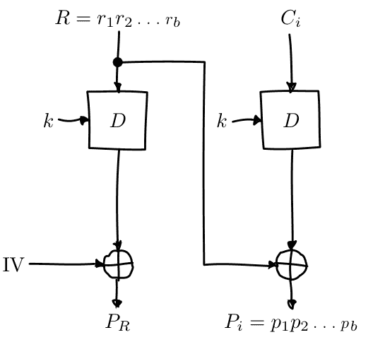

接下来，攻击者尝试修改消息，使其具有有效的填充。他们可以通过间接修改明文块的最后一个字节来实现：最终该字节将是 `01`，这始终是有效的填充。为了修改明文块的最后一个字节，攻击者修改了前一个密文块（即他们构造的 $R$ 块）的最后一个字节 $r_b$。这个操作与CBC位翻转攻击完全一样。

攻击者尝试所有可能的值（0-255）来替换最后一个字节。最终，填充预言机将报告对于某个特定的 $R$ 值，$R \| C_i$ 的解密明文具有有效的填充。

##### 发现填充长度

预言机刚刚告诉攻击者，对于我们选择的 $R$ 的值，$R \| C_i$ 的明文具有有效的填充。由于我们使用的是PKCS#5填充，这意味着明文块 $P_i$ 以以下字节序列之一结尾：

- 01
- 02 02
- 03 03 03
- ...

第一个选项 (01) 比其他选项更有可能，因为它只需要一个字节具有特定的值。攻击者正在修改该字节以获得每个可能的值，所以很有可能他们碰巧遇到 01。所有其他有效的填充选项不仅需要该字节具有某个特定的值，还需要一个或多个其他字节也满足条件。

为了确保攻击者获得一个具有有效 01 填充的消息，他们只需尝试每个可能的字节。为了得到一个具有有效 02 02 填充的消息，攻击者必须碰巧选择了一组导致明文在倒数第二个位置上有 02 的组合。为了成功解密消息，我们仍然需要确定填充的实际值是哪个选项。为了做到这一点，我们尝试从 $P_i$ 的左侧开始逐个修改字节，直到填充再次变得无效。我们通过修改构造块 $R$ 中的等效字节来实现。

一旦填充被破坏，你就知道你修改的最后一个字节是有效填充的一部分，这告诉你有多少填充字节。由于我们使用的是 PKCS#5 填充，这也告诉你它们的值是什么。

让我们用一个例子来说明这一点。假设我们成功地找到了一些块 $R$，使得 $R \| C_i$ 的明文具有有效的填充。假设实际填充为 `03 03 03`。通常，攻击者不会知道这一点；这个过程的目的是发现填充是什么。假设块大小为 8 字节。因此，$P_i$ 当前是：

$p_0 p_1 p_2 p_3 p_4 03 03 03$ （式 7.3）

在那个方程中，$p_0 \dots p_4$ 是一些明文字节，它们不是填充的一部分。当我们修改 $R$ 的第一个字节时，会导致 $P_i$ 的第一个字节变成 $p'_0$：

$p'_0 p_1 p_2 p_3 p_4 03 03 03$ （式 7.4）

正如你所看到的，这不会影响填充的有效性。然而，当我们继续修改后续字节时，最终会遇到属于填充的字节。例如，当我们修改 $R$ 使得 $P_i$ 的第六个字节从 03 变为 02 时：

$p'_0 p'_1 p'_2 p'_3 p'_4 02 03 03$ （式 7.5）

由于 `02 03 03` 不是有效的 PKCS#5 填充，服务器将拒绝该消息。

- 在那一点上，我们知道一旦修改了第六个字节，填充就会破坏。
- 这意味着第六个字节是填充的第一个字节。由于块的长度为 8 个字节，我们知道填充由第六、第七和第八个字节组成。因此，填充长度为三个字节，在 PKCS#5 中等于 `03 03 03`。

一个聪明的攻击者试图最小化预言机查询的数量，可以利用更长的有效填充变得越来越罕见的事实。他们可以从倒数第二个字节开始，而不是从块的开头开始。这种方法的优点是可以更快地检测到短填充（更常见）。例如，如果填充是 `0x01`，并且攻击者开始修改倒数第二个字节，如果倒数第二个字节被改为任何其他值而填充仍然有效，则填充必须是 `0x01`。填充无效，填充必须至少为 0x02 0x02。因此，他们返回原始块并开始修改从后面数起的第三个字节。如果通过了，填充确实是 0x02 0x02，否则填充必须至少为 0x03 0x03 0x03。该过程重复进行，直到找到正确的长度为止。这个实现起来有点棘手；你不能只是不断修改同一个块（如果它是可变的），而是等待 oracle 失败而不是通过，这可能会让人困惑。

但除了更快速且稍微复杂一些之外，这种技术与上述描述的技术是等效的。

对于下一节，我们假设它只是 01，因为这是最常见的情况。攻击并不会因为填充的长度而改变。如果你正确猜测了更多字节的填充，那只意味着你将需要手动猜测的剩余字节更少。（一旦你理解了攻击的其余部分，这一点将变得清楚。）

##### 解密一个字节

此时，攻击者已经成功解密了目标密文块的最后一个字节！实际上，我们已经解密了与有效填充相同数量的字节；我们只是假设最坏的情况下只有一个字节。怎么做到的呢？攻击者知道解密的密文块 $C_i$ 的最后一个字节（将其称为字节 $D(C_i)[b]$）与迭代找到的值 $r_b$ 进行异或运算，结果为 01：

$$D(C_i)[b] \oplus r_b = 01$$

通过将异或操作移到另一侧，攻击者得到：

$$D(C_i)[b] = 01 \oplus r_b$$

攻击者现在成功诱使接收者透露了块密码解密的最后一个字节的值。

##### 解密后续字节

接下来，攻击者诱使接收者解密下一个字节。记住之前的方程，我们推断出明文的最后一个字节是 01：

$$D(C_i)[b] \oplus r_b = 01$$

现在，我们希望将该字节更改为 02，以生成一个几乎有效的填充：最后一个字节对于 2 字节的 PKCS#5 填充是正确的 (02 02)，但倒数第二个字节可能还不是 02。为了做到这一点，我们使用 01 进行异或运算，以取消已经存在的 01（因为两个相同值的异或运算会互相抵消），然后使用 02 进行异或运算得到 02：

$$D(C_i)[b] \oplus r_b \oplus 01 \oplus 02 = 01 \oplus 01 \oplus 02 = 02$$

因此，为了在解密后的明文的最后位置产生一个值为 02 的值，攻击者用以下内容替换了 $r_b$：

$$r_b' = r_b \oplus 01 \oplus 02$$

这样就实现了几乎有效的填充目标。然后，他们尝试所有可能的值作为倒数第二个字节（索引 $b-1$）。最终，没有一个值会导致消息具有有效的填充。由于我们修改了随机块，使得明文的最后一个字节为 02，因此在倒数第二个位置上能够导致有效填充的唯一字节也是 02。使用与上述相同的数学方法，攻击者已经恢复了倒数第二个字节。

然后，只需反复进行。最后两个字节被修改为创建一个几乎有效的填充 03 03，然后从右边数起的第三个字节被修改，直到填充有效为止，依此类推。对块中的所有字节重复此过程意味着攻击者可以解密整个块；对不同块重复此过程意味着攻击者可以读取整个消息。

这种攻击被证明非常微妙且难以修复。首先，消息应该被验证，同时也应该被加密。那样会导致修改后的消息被拒绝。然而，许多系统在验证消息之前解密（并删除填充）；因此，关于填充是否有效的信息已经泄漏。

我们将在本书中讨论验证消息的安全方法。

你可以考虑只是摆脱“无效的填充”消息；在不指明为什么无效的情况下，声明消息无效。结果证明，这只是对在验证之前解密的系统的部分解决方案。这些系统通常会比具有有效填充的消息稍微快一点地拒绝具有无效填充的消息。毕竟，他们不需要进行身份验证步骤：如果填充无效，则消息不可能有效。

通过计时差异来泄露秘密信息被称为计时攻击，这是侧信道攻击的一种特殊情况：对密码系统的实际实现进行攻击而不是其“完美”的抽象表示。我们将在本书的后面更详细地讨论这些攻击类型。

这种差异常常被利用。通过测量接收者拒绝消息所花费的时间，攻击者可以判断接收者是否执行了身份验证步骤。这告诉他们填充是否正确，为完成攻击提供了填充预言机。

这里的主要教训再次是不要设计自己的密码系统。避免这个特定问题的主要方法是执行恒定时间身份验证，并在解密之前对密文进行身份验证。我们将在后面的消息身份验证章节中更详细地讨论这个问题。

#### 7.10 本地流密码

除了块密码被用于特定的操作模式外，还有一些“本地”流密码算法，这些算法是从头开始设计成流密码的。

最常见的流密码类型被称为同步流密码。这些算法使用一个秘密对称密钥生成一长串伪随机比特流，称为密钥流，然后将密钥流与明文进行异或运算，生成密文。解密操作与加密操作完全相同，只是重复进行：从密钥生成密钥流，然后将密钥流与密文进行异或运算，生成明文。

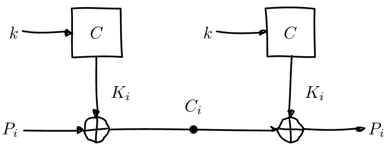

你可以看到这种结构与一次性密码本非常相似，只是真正的随机一次性密码本被伪随机流密码所取代。

还有一些异步或自同步的流密码，其中之前产生的密文比特被用于生成当前的密钥流比特。这样做有趣的结果是，接收方最终可以恢复如果一些密文比特被丢弃的情况。这在现代密码系统中通常不再被认为是一种理想的特性，现代密码系统更倾向于发送完整的、经过认证的消息。因此，这些流密码非常罕见，在本书中我们不会明确讨论它们。每当有人说“流密码”，可以安全地假设他们指的是同步类型的流密码。

从历史上看，本地流密码存在问题。NESSIE 是一个国际竞赛，旨在寻找新的加密原语，但是没有产生任何新的流密码，因为所有参赛者在竞赛结束之前都被破解了。RC4 是最受欢迎的本地流密码之一，多年来一直存在严重的已知问题。相比之下，使用分组密码的一些构造似乎是无懈可击的。

幸运的是，最近出现了几种新的密码算法，为我们提供了实用、安全和高效的流密码。

#### 7.11 RC4

到目前为止，在台式机和移动设备上最常用的本地流密码是 RC4。

RC4 有时也被称为 ARCFOUR 或 ARC4，代表着所谓的 RC4。虽然它的源代码已经泄露，它的实现现在广为人知，但 RSA Security（撰写 RC4 并仍然持有 RC4 商标的公司）从未承认它是真正的算法。

它很快变得流行，因为它非常简单和非常快。它不仅非常简单易实现，而且非常简单易应用。作为同步流密码，很少会出错；而对于块密码，你需要担心诸如操作模式和填充等问题。每字节大约需要 13.9 个周期，与 CTR 模式的 AES-128（每字节 12.6 个周期）或 CBC 模式（每字节 16.0 个周期）相当。AES 在 RC4 之后几年问世；当设计 RC4 时，当时的最先进技术是 3DES，与之相比速度非常慢（CTR 模式下每字节 134.5 个周期）[17]。

### 深入了解RC4


> 这是一个可选的深入章节。它几乎肯定不会帮助你编写更好的软件，所以随意跳过它。它只是为了满足你内心极客的好奇心。

另一方面，RC4 非常简单，可能值得略读本节。

不幸的是，RC4 相当容易被破解。为了更好地理解 RC4 有多么脆弱，我们将看一下 RC4 的工作原理。描述需要理解模加法；如果你对此不熟悉，可以查阅附录中关于模加法的内容。

在 RC4 中，一切都围绕着一个状态数组和两个索引来进行。该数组由 256 个字节组成，形成一个排列：也就是说，所有可能的索引值在数组中恰好出现一次。这意味着它将每个可能的字节值映射到每个可能的字节值：通常是不同的，但有时是相同的。我们知道它是一个排列，因为 $S$ 一开始就是一个排列，并且所有修改 $S$ 的操作总是交换值，这显然保持了它是一个排列。

RC4 由两个主要组件组成，它们分别作用于两个索引 $i$、$j$ 和状态数组 $S$：

- 1. 密钥调度算法，为给定的密钥生成初始状态数组 $S$。
- 2. 伪随机生成器，从由密钥调度算法生成的状态数组 $S$ 中生成实际的密钥流字节。伪随机生成器本身在生成密钥流字节时修改了状态数组。

### 密钥调度算法

密钥调度算法从恒等排列开始。这意味着每个字节都映射到自身。

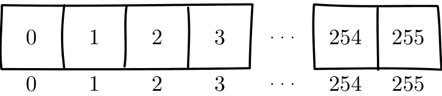

然后，密钥被混合到状态中。这是通过让索引 $i$ 迭代状态的每个元素来完成的。通过将 $j$ 的当前值（从 0 开始）与密钥的下一个字节以及当前状态元素相加，找到 $j$ 索引：

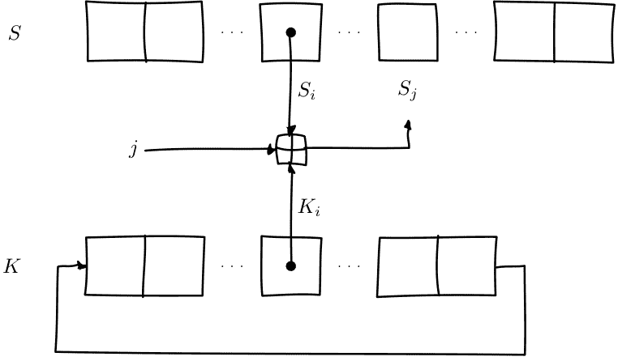

一旦找到 $j$，$S[i]$ 和 $S[j]$ 被交换：

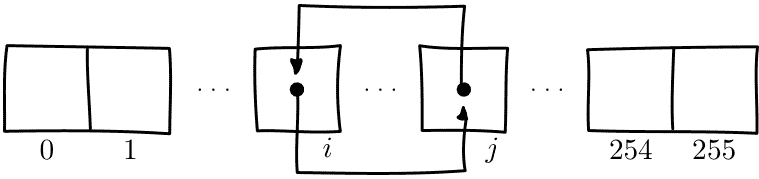

这个过程对 $S$ 的所有元素重复进行。如果你用完了密钥字节，你只需在密钥上循环。这就解释了为什么 RC4 可以接受长度在 1 到 256 字节之间的密钥。通常使用 128 位（16 字节）的密钥，这意味着密钥中的每个字节被使用 16 次。

或者，在 Python 中：

```python
from itertools import cycle

def key_schedule(key):
    s = list(range(256))
    key_bytes = cycle(ord(x) for x in key)

    j = 0
    for i in range(256):
        j = (j + s[i] + next(key_bytes)) % 256
        s[i], s[j] = s[j], s[i]

    return s
```

### 伪随机生成器

伪随机生成器负责从状态 $S$ 产生伪随机字节。这些字节形成密钥流，并且与明文进行异或运算以产生密文。对于每个索引 $i$，它计算 $j = j + S[i]$ ($j$ 从 0 开始)。然后，$S[i]$ 和 $S[j]$ 被交换：

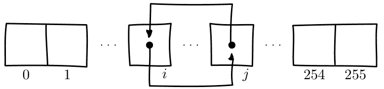

为了产生输出字节，$S[i]$ 和 $S[j]$ 被相加。它们的和被用作 $S$ 的索引；$S[(S[i] + S[j]) \pmod{256}]$ 是密钥流字节 $K_i$：

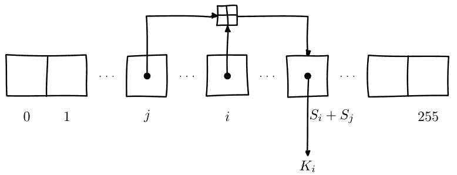

我们可以用 Python 来表示这个：

```python
def pseudo_random_generator(s):
    j = 0
    for i in range(256):
        j = (j + s[i]) % 256
        s[i], s[j] = s[j], s[i]

        k = (s[i] + s[j]) % 256
        yield s[k]
```

##### 攻击


> 这是一个可选的深入章节。它几乎肯定不会帮助你编写更好的软件，所以随意跳过它。它只是为了满足你内心极客的好奇心。

对 RC4 的攻击部分比 RC4 本身要复杂得多，所以即使你已经读到这里，你可能还是想跳过这部分。

有许多攻击 RC4 的密码系统，其中 RC4 并不是真正的问题，而是由于密钥重用或未对消息进行身份验证等原因引起的。我们不会在本节中讨论这些问题。现在，我们只谈论与 RC4 算法本身相关的问题。

直观地说，我们可以理解理想的流密码如何产生一串随机位。毕竟，如果它能做到这一点，我们将陷入与一次性密码本非常相似的情况。


图 7.2：一次性密码方案。

如果我们攻击流密码的最佳方式是尝试所有的密钥，这个过程被称为暴力破解密钥，那么流密码是理想的。如果存在更简单的方式，比如通过输出字节中的偏差，那就是流密码的缺陷。

在 RC4 的历史中，人们发现了许多这样的偏差。在九十年代中期，安德鲁·鲁斯发现了两个这样的缺陷：

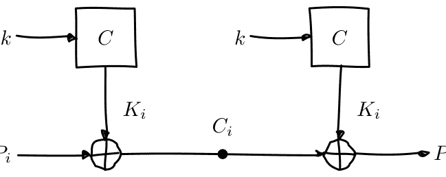

图 7.3：同步流密码方案。注意与一次性密码方案的相似之处。关键的区别在于，一次性密码的密钥 $k_i$ 是真正的随机数，而密钥流 $K_i$ 只是伪随机数。

- 密钥的前三个字节与密钥流的第一个字节相关联。
- 状态的前几个字节与密钥之间存在简单的（线性）关系。

对于理想的流密码，密钥流的第一个字节不应该透露任何关于密钥的信息。在 RC4 中，它给我一些关于密钥前三个字节的信息。后者似乎不太严重：毕竟，攻击者不应该知道密码的状态。

一如既往，攻击从不会变得更糟。它们只会变得更好。

Adi Shamir 和 Itsik Mantin 表明，密码算法产生的第二个字节是零的可能性是应该的两倍。其他研究人员在密钥流的前几个字节中也发现了类似的偏差。

这激发了 Mantin、Shamir 和 Fluhrer 进一步的研究，显示密钥流的前几个字节存在较大的偏差。[22] 他们还表明，即使知道密钥的一小部分，攻击者也能够对密码的状态和输出进行强有力的预测。与 RC4 不同，大多数现代流密码提供了一种将多个流密码组合的方法。

使用一个一次性的数字（nonce）和长期密钥生成多个不同的密钥流，以产生多个不同的密钥流。RC4 本身不能做到这一点。最常见的方法也是最简单的方法：将长期密钥 $k$ 与一次性数字 $n$ 连接起来：$k||n$，利用 RC4 的灵活密钥长度要求。在这个上下文中，连接意味着将 $n$ 的位追加到 $k$ 的位上。这种方案意味着攻击者可以逐渐恢复组合密钥的部分，最终从大量的消息中慢慢恢复长期密钥（大约 $2^{24}$ 到 $2^{26}$ 个消息$^6$，或数千万条消息）。

WEP，一种保护无线网络的标准，在当时非常流行，但受到了这种攻击的严重影响，因为它使用了这种简单的随机数组合方案。如果长期密钥和随机数已经安全地结合在一起（例如使用密钥派生函数或密码哈希函数），就不会有这种弱点。因此，许多其他标准，包括 TLS，都没有受到影响。

再次强调，攻击只会变得更加强大。Andreas Klein 展示了密钥和密钥流之间更广泛的相关性。[30] 攻击者现在只需要几万条消息就可以使攻击变得实用，而不是像 Fluhrer、Mantin、Shamir 攻击那样需要数千万条消息。这种攻击被成功地应用于 WEP。

2013年，伦敦皇家霍洛威大学的研究团队提出了两种独立的实用攻击的组合[3]。这些攻击对 RC4 来说非常具有破坏力：尽管 RC4 存在弱点。

$^6$在这里，我们使用 $||$ 作为连接运算符。其他常用的连接符号包括 $+$ （对于一些编程语言，如 Python）和 $\cdot$ （对于形式语言）。

虽然这个问题很久以前就已经被人们知道了，但是他们最终让每个人都明白了它真的不应该再使用了。

第一种攻击是基于密钥流的前 256 个字节中的单字节偏差。通过对大量密钥生成的密钥流进行统计分析，他们能够更详细地分析 RC4 早期密钥流字节中已知的偏差。

待办事项：说明：http://www.isg.rhul.ac.uk/tls/RC4_keystream_dist_2_45.txt

第二种攻击是基于密钥流中的双字节偏差。事实证明，密钥流的相邻字节存在可利用的关系，而在理想的流密码中，你会期望它们是完全独立的。

| 字节对 | 字节位置 (模256) | $i$ | 概率 |
| :--- | :--- | :---: | :--- |
| $(0, 0)$ | $i = 1$ | | $2^{-16}(1 + 2^{-9})$ |
| $(0, 0)$ | $i \in \{1, 255\}$ | | $2^{-16}(1 + 2^{-8})$ |
| $(0, 1)$ | $i \in \{0, 1\}$ | | $2^{-16}(1 + 2^{-8})$ |
| $(0, i + 1)$ | $i \in \{0, 255\}$ | | $2^{-16}(1 + 2^{-8})$ |
| $(i + 1, 255)$ | $i = 254$ | | $2^{-16}(1 + 2^{-8})$ |
| $(255, i + 1)$ | $i \in \{1, 254\}$ | | $2^{-16}(1 + 2^{-8})$ |
| $(255, i + 2)$ | $i \in \{0, 253, 254, 255\}$ | | $2^{-16}(1 + 2^{-8})$ |
| $(255, 0)$ | $i = 254$ | | $2^{-16}(1 + 2^{-8})$ |
| $(255, 1)$ | $i = 255$ | | $2^{-16}(1 + 2^{-8})$ |
| $(255, 2)$ | $i \in \{0, 1\}$ | | $2^{-16}(1 + 2^{-8})$ |
| $(255, 255)$ | $i = 254$ | | $2^{-16}(1 + 2^{-8})$ |
| $(129, 129)$ | $i = 2$ | | $2^{-16}(1 + 2^{-8})$ |

这个表一开始可能看起来有点吓人。右侧列中的概率表达式可能看起来有点复杂，但它以这种方式表达是有原因的。假设 RC4 是一个好的流密码，并且所有值出现的概率相等。那么你期望任何给定字节值的概率为 $2^{-8}$，因为有 $2^8$ 个不同的字节值。如果 RC4 是一个好的流密码，两个相邻的字节的概率都是 $2^{-8}$，所以任何给定的两个字节对的概率都是 $2^{-8} \cdot 2^{-8} = 2^{-16}$。然而， RC4 并不是一个理想的流密码，所以这些特性并不成立。通过将概率写成 $2^{-16}(1+2^{-k})$ 的形式，更容易看出 RC4 与理想流密码的偏差有多大。

所以，让我们尝试读取表的第一行。它说当密码中的任意 256 字节块的第一个字节 $i=1$ 时，其后的字节比其他数字更有可能是 0（确切地说，是 $1+2^{-9}$ 倍）。我们还可以看到当密钥流字节之一为 255 时，根据其在密钥流中的位置，可以对下一个字节进行许多预测。

它更有可能是 0、1、2、255 或密钥流中的位置加一或两个。

# 待办事项：演示攻击成功

再次强调，攻击只会变得更加强大。这些攻击主要集中在密码本身上，并且还没有完全针对实际攻击（例如，对 Web 服务的攻击）进行优化。通过一些关于你试图恢复的明文的额外信息，可以大大提高攻击的效果。例如，HTTP cookie 通常是 Base64 或十六进制编码的。

无论如何，我们都需要停止使用 RC4。幸运的是，我们也开发了许多安全的替代方案。不断进步的 RC4 密码分析有助于加强对常用加密原语改进的紧迫感。

特别是在2013年，这导致了许多重大改进，例如浏览器密码学（我们将在后面的章节中讨论浏览器密码学，特别是SSL/TLS）。

#### 7.12 Salsa20

Salsa20是由丹·伯恩斯坦（Dan Bernstein）设计的一种较新的流密码。伯恩斯坦以编写大量开源（公共领域）软件而闻名，其中大部分直接与安全相关或者以信息安全为重点构建。

Salsa20有两个小变种，分别是Salsa20/12和Salsa20/8，除了轮数分别为12和8轮（注：轮是内部函数的重复。通常需要多轮才能使算法有效工作；攻击通常从算法的减轮版本开始）之外，算法完全相同。ChaCha是Salsa20密码的另一个正交变体，它试图在每一轮中增加扩散量，同时保持或提高性能。ChaCha后面没有“20”；具体算法后面有一个数字（ChaCha8，ChaCha12，ChaCha20），它指的是轮数。

Salsa20和ChaCha是现代流密码的最新技术。目前还没有公开已知的攻击能够破解Salsa20、ChaCha或它们推荐的减轮变体的实际安全性。

这两个密码族也非常快速。对于长数据流，在现代英特尔处理器和现代AMD处理器上，Salsa20的全轮版本每字节需要约4个周期，12轮版本每字节需要约3个周期，8轮版本每字节需要约2个周期。在大多数平台上，ChaCha稍微更快一些。

为了进行比较，这比RC4$^8$（注：引用的基准测试没有提到RC4，而是提到了MARC4，它代表着“修改后的所谓RC4”。RC4部分解释了为什么它是“所谓的”，而“修改后的”意味着它会丢弃前256个字节，因为RC4存在一个弱点）快三倍以上，比使用128位密钥的AES-CTR每字节12.6个周期的速度快三倍左右，并且与具有专用硬件指令的AES GCM模式$^9$（注：GCM模式是一种认证加密模式，我们将在后面的章节中详细介绍）大致相当。

Salsa20具有两个特别有趣的属性。首先，可以在不计算所有先前位的情况下“跳转”到密钥流中的特定点。这在某些情况下非常有用，例如，当加密一个大文件时，您希望能够在文件的中间进行随机读取。虽然许多加密方案需要解密整个文件，但使用Salsa20，您只需选择所需的部分。

另一种具有此属性的构造是一种称为CTR模式的操作模式，我们稍后会讨论。这种“跳转”的能力还意味着可以独立计算Salsa20的块，从而允许加密或解密并行工作，这可以提高多核CPU的性能。

其次，它对许多侧信道攻击具有抵抗力。这是通过确保密钥材料永远不用于在密码中选择不同的代码路径，并且每一轮都由一固定数量的恒定时间操作组成来实现的。结果是每个块都以完全相同的操作数产生，无论密钥是什么。

这两种流密码都基于加法、旋转、异或 (ARX) 设计。ARX密码的一个好处是它们本质上是恒定时间的。与AES不同，它们没有可能泄露信息的秘密内存访问模式。这些密码在现代CPU架构上表现良好，无需特定于密码的优化。它们利用通用向量指令，其中CPU在单个指令中对多个数据片段执行相关操作。因此，ChaCha20在现代英特尔CPU上的性能与AES相媲美，尽管后者具有专门的硬件支持。

这是一个ARX操作的示例：

$x \leftarrow x \oplus (y \boxplus z) \lll n$ (7.6)

要找到 $x$ 的新值，首先我们执行模加 ($\boxplus$) 对 $y$ 和 $z$ 的结果进行异或 ($\oplus$) ，然后将结果与 $x$ 进行左旋转 ($\lll$) $n$ 位。这是Salsa20的核心轮原语。

#### 7.13 本地流密码与操作模式的比较

一些文本只考虑本地流密码作为流密码。本书强调算法的功能。由于块密码和本地流密码都需要一个秘密密钥来加密流，而且两者可以互相替代在加密系统中使用，我们只称它们为流密码。

我们将进一步强调两者之间的紧密联系，使用CTR模式，这是一种产生同步流密码的操作模式。虽然也有一些操作模式（如OFB和CFB）可以产生自同步流密码，但这些模式较少见，在这里不讨论。

## 7.14 CTR模式

CTR模式，全称为计数器模式，是一种通过将一个随机数与计数器连接起来的操作模式。计数器会随着每个数据块递增，并用零填充，使得整个数据块的长度与块大小相同。然后将得到的连接字符串通过块密码进行处理。块密码的输出结果被用作密钥流。

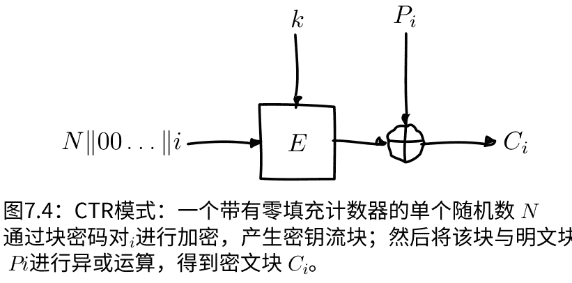

这个示例展示了一个输入块 $N || 00 \dots || i$，由随机数 $N$、当前计数器值 $i$ 和填充组成，被加密使用密钥 $k$ 对块密码 $E$ 进行加密，产生密钥流块 $S_i$，然后将其与明文块 $P_i$ 进行异或运算，得到密文块 $C_i$。

显然，要解密，你需要再次执行完全相同的操作，因为对一个比特位进行两次异或操作总是会产生原始的比特位：$P_i \oplus S_i \oplus S_i = P_i$。因此，CTR加密和解密是相同的：在两种情况下，你都会生成密钥流，然后你会将明文或密文与密钥流进行异或操作，以获取另一个。

为了保证CTR模式的安全性，关键是不能重复使用nonce值。如果重复使用nonce值，整个密钥流将会重复，使得攻击者能够进行多次密钥流攻击。

这与CBC模式使用的初始化向量 (IV) 不同。IV必须是不可预测的。攻击者能够预测CTR的nonce值并不重要：没有了秘密密钥，他们无法知道块密码的输出（密钥流中的序列）会是什么样子。

像Salsa20一样，CTR模式具有一个有趣的特性，即您可以轻松地跳转到密钥流中的任何点：只需将计数器递增到该点即可。关于这个主题的Salsa20段落解释了为什么这可能是有用的。

另一个有趣的特性是，由于任何密钥流块都可以完全独立于任何其他密钥流块计算，因此加密和解密都非常容易并行计算。

#### 7.15 流密码位翻转攻击

同步流密码，例如本地流密码或CTR模式中的块密码，也容易受到位翻转攻击的影响。这与CBC位翻转攻击类似，攻击者在密文中翻转了几个位，导致明文中的一些位被翻转。

实际上，在流密码上执行此攻击要比在CBC模式上简单得多。首先，密文中的一个翻转位会导致明文中相同的位被翻转，而不是下一个块中对应的位。此外，它只影响该位；在CBC位翻转攻击中，修改块的明文会被打乱。最后，由于攻击者修改的是字节序列而不是块序列，攻击不受特定块大小的限制。

例如，在CBC位翻转攻击中，攻击者可以调整单个块，但不能调整相邻的块。

> **待办事项说明**
> 这是另一个例子，说明为什么身份验证必须与加密同时进行。如果消息经过正确的身份验证，接收者可以简单地拒绝修改后的消息，从而挫败攻击。

#### 7.16 认证工作模式

还有其他操作模式可以同时提供身份验证和加密。由于我们还没有讨论过身份验证，我们将在以后处理这些内容。

#### 7.17 剩余问题

现在我们有工具可以使用小密钥加密大量数据流。然而，我们还没有讨论如何达成关于密钥的一致。正如前一章中所指出的，为了在 $n$ 个人之间进行通信，我们需要 $\frac{n(n-1)}{2}$ 个密钥。密钥交换的数量增长速度与人数的平方几乎一样。虽然与一次性密码本相比，要交换的密钥要小得多，但是大量密钥交换的基本问题尚未解决。我们将在下一节中解决这个问题，我们将研究密钥交换协议：允许我们在不安全的媒介上协商一个秘密密钥的协议。

此外，我们已经看到加密本身无法提供足够的安全性：没有认证的情况下，攻击者很容易修改消息，在许多有缺陷的系统中甚至可以解密消息。在未来的章节中，我们将讨论如何对消息进行认证，以防止攻击者对其进行修改。

### 8 密钥交换

#### 8.1 描述

密钥交换协议试图解决一个乍一看来似乎不可能的问题。艾丽斯和鲍勃之前从未见过面，他们必须就一个秘密值达成一致。他们用来通信的信道是不安全的：我们假设他们通过信道发送的所有内容都被窃听了。

我们将在这里演示这样的协议。艾丽斯和鲍勃最终会有一个共享的秘密，且只通过不安全的渠道进行通信。尽管伊夫拥有艾丽斯和鲍勃互发的所有信息，她却无法利用这些信息来猜测他们的共享秘密。

这个协议被称为迪菲-赫尔曼协议（Diffie-Hellman protocol），以Whitfield Diffie和Martin Hellman的名字命名，他们是密码学的两位先驱者。他们建议将该协议称为迪菲-赫尔曼-默克尔密钥交换，以表彰Ralph Merkle的贡献。虽然他的贡献当然值得赞扬，但这个术语并没有真正流行起来。为了读者的方便，我们将使用更常见的术语。

迪菲-赫尔曼的实际实现依赖于被认为在“错误”的方向上很难解决的数学问题，但在“正确”的方向上很容易计算。理解数学实现对于理解协议的原理并不是必需的。大多数人也发现没有数学复杂性更容易理解。因此，我们首先将在抽象层面上解释迪菲-赫尔曼，没有任何数学构造。之后，我们将看两个实际的实现。

### 8.2 抽象迪菲-赫尔曼

为了描述迪菲-赫尔曼，我们将使用基于混合颜色的类比。我们可以根据以下规则混合颜色：

- 将两种颜色混合成第三种颜色非常容易。
- 以不同的顺序混合两种或更多颜色会得到相同的颜色。
- 混合颜色是单向的。无法确定使用了哪些颜色来产生给定的颜色。即使你知道它被混合了，甚至你知道一些用于产生它的颜色，你也不知道剩下的颜色是什么。

我们将通过像这样的混合函数演示，我们可以产生只有爱丽丝和鲍勃知道的秘密颜色。稍后，我们将简单地描述这些函数的具体实现，以获得具体的密钥交换方案。

为了说明在窃听者面前保持安全性，我们将在整个与窃听者伊夫（Eve）的交换中进行演示。伊夫正在监听通过网络发送的所有消息。我们将追踪她所知道的一切和她可以计算的内容，并最终看到为什么伊夫无法计算出爱丽丝和鲍勃的共享密钥。

为了开始协议，爱丽丝和鲍勃必须就一个基本颜色达成一致。他们可以通过网络进行通信：如果伊夫拦截了消息并找出了颜色，那也没关系。通常，这个基本颜色是协议的固定部分；爱丽丝和鲍勃不需要传递它。在这一步之后，爱丽丝、鲍勃和伊夫都拥有相同的信息：基本颜色。

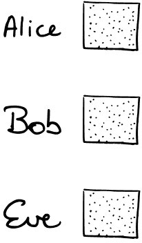

爱丽丝和鲍勃都选择一个随机颜色，并将其与基本颜色混合。在这一步结束时，爱丽丝和鲍勃知道各自的秘密颜色，秘密颜色与基本颜色的混合，以及基本颜色本身。

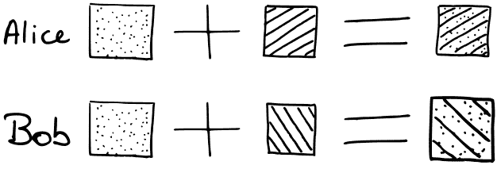

包括伊夫在内的每个人都知道基本颜色。

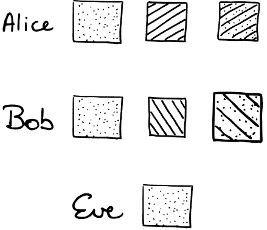

然后，爱丽丝和鲍勃都将他们混合的颜色发送到网络上。伊夫看到了两种混合颜色，但她无法弄清楚爱丽丝和鲍勃的任何一个秘密颜色是什么。尽管她知道基本颜色，但她无法“解开”发送到网络上的颜色。


在这一步结束时，艾丽斯和鲍勃都知道基色，他们各自的秘密，他们各自的混合颜色，以及彼此的混合颜色。伊夫知道基色和两种混合颜色。


一旦艾丽斯和鲍勃收到彼此的混合颜色，他们将自己的秘密颜色添加到其中。由于混合的顺序无关紧要，他们最终都会得到相同的最终颜色。


伊夫无法执行该计算。虽然她拥有两份混合后的颜色，但她没有这些秘密颜色。她还可以尝试混合两种混合颜色，但这样会使基色出现两次，导致与爱丽丝和鲍勃计算的共享秘密颜色不同（后者只包含一次基色）。

#### 8.3 使用离散对数的迪菲-赫尔曼

本节描述了基于离散对数问题的Diffie-Hellman算法的实际实现。它旨在提供一些数学背景，并需要理解模算术。

离散对数Diffie-Hellman基于以下方程：在已知 $g, x, p$ 的情况下，计算 $y$ 是容易的：

$y \equiv g^x \pmod p \qquad (8.1)$

然而，在给定 $y, g$ 和 $p$ 的情况下计算 $x$ 被认为是非常困难的。这被称为离散对数问题。

这只是我们之前讨论的抽象Diffie-Hellman过程的具体实现。常见的基本颜色是一个大素数 $p$ 和基数 $g$。“颜色混合”操作是上述方程，其中 $x$ 是输入值，$y$ 是混合后的结果值。

当爱丽丝或鲍勃选择他们的随机数 $r_A$ 和 $r_B$ 时，他们将其与基数混合以产生混合数 $m_A$ 和 $m_B$：

$m_A \equiv g^{r_A} \pmod p \quad (8.2)$
$m_B \equiv g^{r_B} \pmod p \quad (8.3)$

这些数字被发送到网络上，伊夫可以看到它们。离散对数问题的前提是这样做是可以的，因为解决 $m \equiv g^r \pmod p$ 中的 $r$ 是非常困难的。一旦爱丽丝和鲍勃拥有对方的混合数，他们将自己的秘密数加到其中。例如，鲍勃会计算：

$s \equiv (m_A)^{r_B} \equiv (g^{r_A})^{r_B} \pmod p \quad (8.4)$

虽然爱丽丝的计算看起来不同，但他们得到相同的结果，因为 $(g^{r_A})^{r_B} \equiv (g^{r_B})^{r_A} \pmod p$。这就是共享的秘密。

因为Eve没有 $r_A$ 或 $r_B$，她无法执行等价计算。她需要 $r_A$ 或 $r_B$（或两者都需要）来进行计算，就像Alice和Bob一样。

> **待办事项**：关于主动中间人攻击，攻击者选择平滑值以产生弱密钥，有什么要说的吗？

#### 8.4 使用椭圆曲线的迪菲-赫尔曼

本节描述了基于椭圆曲线离散对数问题的Diffie-Hellman算法的实际实现。椭圆曲线Diffie-Hellman变种的一个好处是，所需的密钥大小比基于常规离散对数问题的变种要小得多。

这是因为破解离散对数问题的最快算法（如数域筛法）比其椭圆曲线变种的渐近复杂度要低。这意味着解决椭圆曲线问题比解决常规离散对数问题更困难。对于相同的安全级别，椭圆曲线算法需要的密钥大小如下：

| 安全级别（以比特为单位） | 离散对数密钥比特 | 椭圆曲线密钥比特 |
| :--- | :--- | :--- |
| 56 | 512 | 112 |
| 80 | 1024 | 160 |
| 112 | 2048 | 224 |
| 128 | 3072 | 256 |
| 256 | 15360 | 512 |

#### 8.5 剩余问题

使用迪菲-赫尔曼协议，我们可以在不安全的互联网上协商共享密钥，免受窃听者的侵扰。然而，尽管攻击者可能无法通过窃听来获取秘密，但主动攻击者仍然可以破坏系统。

如果这样的攻击者（通常被称为Mallory）位于Alice和Bob之间，她可以执行迪菲-赫尔曼协议两次：一次与Alice进行（Mallory假装是Bob），一次与Bob进行（Mallory假装是Alice）。


这里有两个共享密钥：一个在Alice和Mallory之间，一个在Mallory和Bob之间。攻击者Mallory可以获取从一个人那里得到的所有消息，解密后查看或修改，然后再加密发送给另一个人。

更糟糕的是，即便参与者意识到异常，也没有办法让对方相信自己。因为Mallory与受害者进行了成功的交换，她拥有正确的共享密钥。Bob与Alice之间没有共享密钥，只与Mallory有；他无法证明自己是合法的参与者。这种攻击被称为中间人攻击（MITM攻击）。鉴于现实中的网络基础设施由许多不同运营商运行，这种攻击场景非常现实，安全的加密系统必须解决这些问题。

尽管迪菲-赫尔曼协议成功地在两个对等方之间产生了一个共享的秘密，但显然还有一些缺失的部分。我们需要工具来对参与者进行身份验证，并需要工具来确保消息的完整性，使接收者能够验证消息确实是由发送者发送且未被修改的。

### 9 公钥加密

#### 9.1 描述

到目前为止，我们只进行了秘密密钥加密。假设你可以拥有一个不涉及单个秘密密钥的加密系统，而是拥有一对密钥：一个公钥，你可以自由分发，和一个私钥，你自己保留。

人们可以使用你的公钥加密发给你的信息。没有你的私钥，这些信息是无法解密的。这被称为公钥加密。

很长一段时间以来，人们认为这是不可能的。然而，从20世纪70年代开始，这样的算法开始出现。第一个公开可用的加密方案是由麻省理工学院的三位密码学家Ron Rivest、Adi Shamir和Leonard Adleman制作的。他们发布的算法至今仍然是最常见的算法之一，并且以他们姓氏的首字母命名：RSA。

公钥算法不仅限于加密。实际上，在本书中，你已经看到了一种不直接用于加密的公钥算法。实际上，有三类相关的公钥算法：

1. 密钥交换算法，例如迪菲-赫尔曼算法，允许你在不安全的媒介上协商一个共享密钥。
2. 加密算法，例如我们将在本章讨论的算法，允许人们在不需要协商共享密钥的情况下进行加密。
3. 签名算法，我们将在后面的章节中讨论，允许你使用私钥对任何信息进行签名，并且使用你的公钥轻松验证签名。

#### 9.2 为什么不把公钥加密用于一切？

乍看之下，公钥加密算法似乎使我们以前的秘钥加密算法过时了。我们可以只使用公钥加密来处理一切，避免了对称算法中密钥协商所带来的所有额外复杂性。然而，当我们看实际的加密系统时，我们会发现它们几乎总是混合加密系统：公钥算法起着非常重要的作用，但大部分的加密和认证工作都是由对称密钥算法完成的。

这主要是因为性能方面的原因。

与我们快速的流密码（无论是本地还是其他方式）相比，公钥加密机制非常慢。RSA的密钥大小最多为其密钥长度，对于2048位来说，意味着256字节。在这种情况下，加密需要0.29兆周期，解密需要惊人的11.12兆周期 [17]。为了更好地理解这一点，对称密钥算法在每个方向上的每个字节大约需要10个周期左右。这意味着对称密钥算法在解密256字节时大约需要3千周期，比非对称版本快大约4000倍。安全对称密码中的最新技术甚至更快：具有硬件加速的AES-GCM或Salsa20/ChaCha20每个字节只需要大约2到4个周期，进一步扩大了性能差距。大多数实际加密系统还存在一些其他问题。

例如，RSA不能加密大于其模数的任何内容，该模数通常小于或等于4096位，远小于我们想要发送的最大消息。尽管如此，最重要的原因是上述的速度论证。

#### 9.3 RSA

正如我们已经提到的，RSA是最早的实用公钥加密方案之一。它仍然是最常见的加密方案至今。

##### 加密和解密

RSA加密和解密依赖于模算术。在继续之前，您可能需要复习模算术入门。

本节描述了RSA背后的简化数学问题，通常称为“教科书RSA”。单独使用，这不会产生一个安全的加密方案。我们将在后面的章节中看到一个安全的构造，称为OAEP，它建立在其之上。

为了生成密钥，您选择两个大素数 $p$ 和 $q$。这些数字必须随机选择，并保密。将它们相乘得到模数 $N$，该模数是公开的。然后，您选择一个加密指数 $e$，该指数也是公开的。通常，这个值要么是3，要么是65537。因为这些数字在其二进制展开中只有少量的 1，所以可以更高效率地计算指数运算。综合起来，$(N, e)$ 是公钥。任何人都可以使用公钥将消息 $M$ 加密为密文 $C$：

$$C \equiv M^e \pmod N$$

下一个问题是解密。事实证明，有一个值 $d$，即解密指数，可以将 $C$ 转换回 $M$。那个值相当容易计算，假设你知道 $p$ 和 $q$。使用 $d$，你可以这样解密消息：

$$M \equiv C^d \pmod N$$

RSA的安全性依赖于解密操作在不知道秘密指数 $d$ 的情况下是不可能的，并且秘密指数 $d$ 从公钥 $(N, e)$ 中计算起来非常困难（实际上是不可能的）。我们将在下一节中看到破解RSA的方法。

#### 破解RSA

像许多密码系统一样，RSA依赖于一个特定数学问题的难度。对于RSA来说，这个问题是RSA问题，具体来说就是在方程中给定密文 $C$ 和公钥 $(N, e)$，找到明文消息 $M$：

$$C \equiv M^e \pmod N \quad (9.1)$$

我们知道的最简单的方法是将 $N$ 因式分解回到 $p \cdot q$。给定 $p$ 和 $q$，攻击者可以重复密钥生成过程中合法密钥所有者所做的过程来计算私钥指数 $d$。

幸运的是，我们没有一个能够在合理时间内因式分解如此大的数字的算法。不幸的是，我们也没有证明它不存在。更不幸的是，存在一个理论算法，称为Shor算法，它可以在量子计算机上合理时间内因式分解这样的数字。现在，量子计算机离实用还有很长的路要走，但如果将来有人成功构建出足够大的量子计算机，RSA将变得无效。

在本节中，我们只考虑了通过因式分解模数来攻击纯抽象数学RSA问题的私钥恢复攻击。在下一节中，我们将看到各种基于实现缺陷而不是上述数学问题的RSA的现实攻击。

##### 实现陷阱

目前为止，对RSA没有已知的实际完全破解。这并不意味着使用RSA的系统没有被常规破解。就像大多数破解的加密系统一样，有很多情况下稳健的组件如果使用不当，会导致一个无用的系统。对于RSA实现可能出错的事情的更全面的概述，请参考 [13] 和 [4]。在本书中，我们将只会强调一些有趣的事情。

### PKCSv1.5填充

#### 盐

盐（Salt）[^1]是一个用Python编写的配置系统。它有一个主要缺陷：它有一个名为 `crypt` 的模块。它没有重用现有的完整的加密系统，而是使用了第三方包提供的RSA和AES。

很长一段时间，Salt使用了一个公共指数 ($e$) 为1，这意味着加密阶段实际上没有做任何事情：$P^e \equiv P^1 \equiv P$。这意味着生成的密文实际上就是明文。虽然这个问题现在已经修复了，但这只能说明你可能不应该自己实现加密算法。Salt当前还支持SSH作为传输方式，但上述的DIY RSA/AES系统仍然存在，并且在撰写本文时仍然是推荐和默认的传输方式。

[^1]: 所以，有Salt这个配置管理系统，有用于破解密码存储的盐（salt），有发音为“盐”的密码学库NaCl，还有在某些浏览器中运行本地代码的NaCl，可能还有其他我忘记的一堆东西。我们能不能停止给东西取这个名字？

###### OAEP

OAEP，即优化的非对称加密填充，是RSA填充的最新技术。它由Mihir Bellare和Phillip Rogaway于1995年引入 [7]。它的结构如下：

（此处原图展示了OAEP的结构）

最终加密的东西是 $X \| Y$，它是 $n$ 位长的，其中 $n$ 是RSA模数 $N$ 的位数。它取一个随机块 $R$，长度为 $k$ 位，其中 $k$ 是标准指定的常数。首先，将消息用零填充到长度为 $n - k$ 位。如果你看上面的结构，左半部分的所有内容都是 $n - k$ 位长，右半部分的所有内容都是 $k$ 位长。随机块 $R$ 和零填充的消息 $M \| 000...$ 被组合起来使用两个“陷阱门”函数 $G$ 和 $H$。陷阱门函数是一种在一个方向上计算非常容易而在反向上非常困难的函数。在实践中，这些是密码哈希函数；我们稍后会更多地了解它们。

正如你从图中可以看出的那样，$G$ 获取 $k$ 位并将其转换为 $n - k$ 位，而 $H$ 则相反，它获取 $n - k$ 位并将其转换为 $k$ 位。

生成的块 $X$ 和 $Y$ 被连接在一起，然后使用标准的RSA加密原语进行加密，以生成密文。

为了了解解密的工作原理，我们将所有步骤反转。在解密消息时，接收者获得 $X \| Y$。他们知道 $k$，因为它是协议的一个固定参数，所以他们可以将 $X \| Y$ 分成 $X$（前面的 $n - k$ 位）和 $Y$（最后的 $k$ 位）。

在上图中，箭头的方向是用于填充的。反转梯子侧面的箭头，你就可以看到如何恢复填充（TODO：反转箭头）。

我们想要得到 $M$，它在 $M \| 000 \dots$ 中。只有一种计算方法，即：

$$M || 000 \dots = X \oplus G(R)$$

计算 $G(R)$ 有点困难：

$$G(R) = G(H(X) \oplus Y)$$

正如你所看到的，至少对于某些函数 $H$ 和 $G$ 的定义，我们需要 $X$ 的全部内容和 $Y$ 的全部内容（因此需要整个加密消息）才能了解 $M$ 的任何信息。有许多函数可以选择作为 $H$ 和 $G$ 的好选择；基于密码哈希函数，我们将在本书后面详细讨论。

### 9.4 椭圆曲线密码学

待办事项：这个

#### 9.5 剩余问题：未经身份验证的加密

大多数公钥加密方案一次只能加密小块数据，远远小于我们想要发送的消息。它们通常也很慢，比起对称加密方案要慢得多。因此，公钥加密系统几乎总是与秘密密钥加密系统一起使用。

当我们讨论流密码时，我们面临的一个仍然存在的问题是我们仍然需要与大量的人交换秘密密钥。通过公钥密码系统，如公共加密和密钥交换协议，我们现在已经看到了两种解决这个问题的方法。这意味着我们现在可以使用只有公共信息的方式与任何人进行通信，完全安全地防止窃听者。

到目前为止，我们只讨论了没有任何形式的身份验证的加密。这意味着虽然我们可以加密和解密消息，但我们无法验证消息是否是发送者实际发送的消息。

虽然未经身份验证的加密可能提供保密性，但我们已经看到，没有身份验证，主动攻击者通常可以成功修改有效的加密消息，尽管他们不一定知道相应的明文。接受这些消息通常会导致秘密信息泄露，这意味着我们甚至没有保密性。我们已经讨论过的CBC填充攻击就说明了这一点。

结果表明，我们需要一种身份验证和加密机制来保护我们的秘密通信。这是通过向消息中添加额外信息来实现的，只有发送者才能计算出来。与加密类似，身份验证也有私钥（对称）和公钥（非对称）两种形式。对称身份验证方案通常称为消息认证码，而公钥等效物通常称为签名。

首先，我们将介绍一种新的密码原语：哈希函数。它们可以用于生成签名方案和消息认证方案。不幸的是，它们也经常被滥用以产生完全不安全的系统。

### 10 哈希函数

#### 10.1 描述

哈希函数是一种将不确定长度的输入转换为固定长度值（也称为“摘要”）的函数。

简单的哈希函数有许多应用。哈希表，一种常见的数据结构，就依赖于它们。这些简单的哈希函数只能保证一件事：对于两个相同的输入，它们将产生相同的输出。重要的是，两个相同的输出并不意味着输入是相同的。这是不可能的：摘要的数量是有限的，因为它们是固定大小的，但输入的数量是无限的。一个好的哈希函数计算速度也很快。

由于这是一本关于密码学的书，我们对密码哈希函数特别感兴趣。密码哈希函数可以用于构建安全的（对称的）消息认证算法，（非对称的）签名算法和各种其他工具，如随机数生成器。我们将在以后的章节中详细介绍其中一些系统。

密码哈希函数具有比常规哈希函数更强的属性，例如在哈希表中可能找到的属性。对于密码哈希函数，我们希望它在不改变哈希的情况下，对消息进行修改是不可能的：

1. 生成具有给定哈希的消息是不可能的。
2. 找到两个具有相同哈希的不同消息是不可能的。
3. 第一个属性意味着密码哈希函数将展示出一种被称为“雪崩效应”的现象。

即使在输入中改变一个比特，也会产生整个摘要中的变化：摘要的每个比特都有大约50%的几率翻转。这并不意味着每次改变都会导致大约一半的比特翻转，但密码哈希函数确保这种情况发生的几率非常大。更重要的是，找到这样的碰撞或近碰撞是不可能的。

第二个属性是指很难找到一个具有给定哈希值的消息 $m$，这被称为前像抗性（Pre-image resistance）。这使得哈希函数成为一种单向函数：对于给定的消息，计算哈希值非常容易，但对于给定的哈希值，计算消息非常困难。

第三个属性涉及找到具有相同哈希值的消息，有两种情况。在第一种情况下，有一个给定的消息 $m$，并且很难找到另一个具有相同哈希值的消息 $m'$：这被称为第二前像抗性。第二种情况更强，它声明很难找到任意两个具有相同哈希值的消息 $m, m'$。这被称为碰撞抗性（Collision resistance）。因为碰撞抗性是第二前像抗性的一种更强形式，所以有时也被称为弱碰撞抗性和强碰撞抗性。

这些概念通常是从攻击者的角度命名的，而不是从抵抗攻击的角度命名的。例如，你经常会听到碰撞攻击，这是一种试图生成哈希碰撞的攻击，或者第二原像攻击，试图找到一个第二原像，其哈希值与给定的原像相同，等等。

待办事项：可能链接到 http://www.cs.ucdavis.edu/~rogaway/papers/relates.pdf 以供进一步阅读

#### 10.2 MD5

MD5是由罗纳德·里维斯特于1991年设计的哈希函数，它输出128位摘要。多年来，密码学界多次发现了MD5的弱点。1993年，Bert den Boer和Antoon Bosselaers发表了一篇论文，展示了MD5的压缩函数的“伪碰撞” [18]。Dobbertin在这项研究的基础上进行了扩展，并成功产生了压缩函数的碰撞。

2004年，基于Dobbertin的工作，王小云、冯登国、赖学嘉和于洪波证明了MD5容易受到真实碰撞攻击的漏洞 [35]。最后一根稻草是王小云等人的研究，他们成功生成了相互碰撞的X.509证书，并对HMAC-MD5进行了区分攻击 [35] [47]。现在，不推荐使用MD5生成数字签名，但需要注意的是，HMAC-MD5仍然是一种安全的消息认证形式；然而，它可能不适用于新的加密系统。

计算MD5消息摘要需要五个步骤：

1. 添加填充。首先，在消息末尾添加1位，然后添加0位，直到长度为 448 (mod 512)。
2. 用原始消息长度对 $2^{64}$ 取模，将剩余的64位填充满，使整个消息长度为512位的倍数。
3. 将状态初始化为四个32位字，A、B、C和D。这些字使用规范中定义的常量进行初始化。
4. 按512位块处理输入；对于每个块，运行16个相似操作的四个“轮”。所有操作都包括移位、模加和特定的非线性函数，每个轮次的函数都不同。

完成后，$A\|B\|C\|D$ 是哈希的输出。这种填充方式结合末尾的串联是MD5容易受到长度扩展攻击的原因；稍后会详细介绍。

在Python中，可以使用 `hashlib` 模块创建MD5摘要，如下所示：

```python
import hashlib
hashlib.md5(" crypto101 ".encode()).hexdigest()
```

#### 10.3 SHA-1

SHA-1是NSA设计的MD4系列中的另一个哈希函数，产生160位摘要。与MD5一样，SHA-1已不再被认为是安全的数字签名算法。许多软件公司和浏览器，包括Google Chrome，已经开始停止支持SHA-1的签名算法。2017年2月23日，CWI Amsterdam和Google的研究人员成功地在完整的SHA-1函数上产生了碰撞 [43]。过去已经发表了在SHA-1的缩减版本上引发碰撞的方法，包括王小云的一种方法。"The SHAppening"展示了SHA-1的自由起始碰撞。自由起始碰撞允许在压缩函数开始时选择初始值，即初始化向量 [44]。

`hashlib` Python模块可以用来生成SHA-1哈希值:

```python
import hashlib
hashlib.sha1(" crypto101 ".encode()).hexdigest()
```

#### 10.4 SHA-2

SHA-2是一族哈希函数，包括SHA-224，SHA-256，SHA-384，SHA-512，SHA-512/224和SHA-512/256，它们的摘要大小分别为224，256，384，512，224和256。这些哈希函数基于Merkle-Damgård结构，可用于数字签名，消息认证和随机数生成器。SHA-2不仅比SHA-1性能更好，而且提供了更好的安全性，因为它增加了碰撞抵抗能力。

SHA-224和SHA-256是为32位处理器寄存器设计的，而SHA-384和SHA-512是为64位寄存器设计的。因此，32位寄存器变体在32位CPU上运行速度更快，而64位变体在64位CPU上性能更好。SHA-512/224和SHA-512/256是SHA-512的截断版本，允许使用64位字，输出大小等同于32位寄存器变体。

下面是一个给出SHA-2族的概览的表格：

| 哈希函数 | 消息大小 (bits) | 块大小 (bits) | 字大小 (bits) | 摘要大小 (bits) |
| :--- | :--- | :--- | :--- | :--- |
| SHA-224 | < $2^{64}$ | 512 | 32 | 224 |
| SHA-256 | < $2^{64}$ | 512 | 32 | 256 |
| SHA-384 | < $2^{128}$ | 1024 | 64 | 384 |
| SHA-512 | < $2^{128}$ | 1024 | 64 | 512 |
| SHA-512/224 | < $2^{128}$ | 1024 | 64 | 224 |
| SHA-512/256 | < $2^{128}$ | 1024 | 64 | 256 |

您可以使用 `hashlib` 模块对空字符串进行哈希，并通过比较摘要大小来进行比较：

```python
>>> import hashlib
>>> len(hashlib.sha224(" ".encode()).hexdigest())
56
>>> len(hashlib.sha256(" ".encode()).hexdigest())
64
>>> len(hashlib.sha384(" ".encode()).hexdigest())
96
>>> len(hashlib.sha512(" ".encode()).hexdigest())
128
```

#### 对SHA-2的攻击

使用较少轮次的SHA-256和SHA-512已经展示了几种（伪）碰撞和预像攻击。重要的是要注意，通过去除一定数量的轮次，无法攻击整个算法。例如，Somitra Kumar Sanadhya和Palash Sarkar能够在SHA-256中使用64轮中的24轮（去除了最后40轮）引发碰撞 [41]。

### 10.5 Keccak和SHA-3

Keccak是由Guido Bertoni、Joan Daemen、Gilles Van Assche和Michaël Peeters设计的一系列海绵函数，该系列在2012年赢得了NIST的安全哈希算法竞赛。Keccak自那时以来已经以SHA3-224、SHA3-256、SHA3-384和SHA3-512哈希函数的形式被标准化。

尽管SHA-3听起来可能来自同一个家族，但这两者的设计非常不同。SHA-3在硬件上非常高效 [27]，但与SHA-2相比，在软件上相对较慢 [20]。在本书的后面，您将找到SHA-3的安全性方面，例如防止长度扩展攻击。

SHA-3哈希函数在Python版本3.6中引入，并可以按以下方式使用：

```python
import hashlib
hashlib.sha3_224(b"crypto101").hexdigest()
hashlib.sha3_256(b"crypto101").hexdigest()
hashlib.sha3_384(b"crypto101").hexdigest()
hashlib.sha3_512(b"crypto101").hexdigest()
```

#### 10.6 密码存储

密码哈希函数最常见的用途之一（但不幸的是，它也是完全被误解的）就是密码存储。

假设你有一个服务，人们使用用户名和密码登录。你必须将密码存储在某个地方，这样下次用户登录时，你可以验证他们提供的密码。

直接存储密码有几个问题。除了字符串比较中明显的时序攻击之外，如果密码数据库被攻击者入侵，攻击者将能够读取所有密码。由于许多用户重复使用密码，这是一个灾难性的失败。大多数用户数据库还包含他们的电子邮件地址，因此很容易劫持一批与该服务无关的用户帐户。

##### 救命的哈希函数

一个明显的方法是使用密码学安全的哈希函数对密码进行哈希。由于哈希函数很容易计算，每当用户提供他们的密码时，你可以计算该密码的哈希值，并将其与数据库中存储的值进行比较。

如果攻击者窃取了用户数据库，他们只能看到哈希值，而无法看到实际密码。由于哈希函数对于攻击者来说是不可逆的，他们无法将其转换回原始密码。或者人们认为是这样的。

##### 彩虹表

事实证明，这种推理是错误的。人们实际使用的密码数量非常有限。即便采用非常好的密码实践，它们也是由10到20个字符组成的字符串，主要由常见键盘上可输入的字符组成。

然而，在实际应用中，人们使用的密码甚至更糟糕：基于实际单词的密码（password），由少量符号和数字组成的简单序列（1234），或者对上述密码进行可预测的修改（passw0rd）。

更糟糕的是，哈希函数在任何地方都是相同的。如果用户在两个网站上重复使用相同的密码，并且两个网站都使用MD5对密码进行哈希，那么密码数据库中的值将是相同的。甚至不必是每个用户：许多密码非常常见（如"password"），因此许多用户会使用相同的密码。请记住，哈希函数很容易计算。如果我们简单地尝试这些密码中的许多密码，创建将密码映射到其哈希值的巨大表，会怎么样？

这正是一些人所做的，而且这些表格的效果正如你所期望的那样，完全破坏了任何易受攻击的密码存储。这种表格被称为彩虹表。这是因为它们本质上是哈希函数输出的排序列表。这些输出将或多或少地随机分布。当以十六进制格式写下时，这让一些人想起了像HTML中使用的颜色规范，例如 #52f211（这是一种酸橙绿色）。

### 盐

彩虹表如此有效的原因是因为每个人都在使用少数几个哈希函数之一。相同的密码在任何地方都会产生相同的哈希值。

这个问题通常通过使用“盐”（Salt）来解决。在对密码进行哈希之前，通过将密码与一些随机值混合（附加或前置¹），可以产生完全不同的哈希值。它实际上将哈希函数转变为一个整个相关哈希函数族，具有几乎相同的安全性和性能特性，只是输出值完全不同。

盐值存储在数据库中的密码哈希旁边。当用户使用密码进行身份验证时，只需将盐与密码组合，进行哈希运算，并将其与存储的哈希值进行比较。

如果选择一个足够大的（比如160位/32字节）、具有密码学随机性的盐值，就可以完全击败像彩虹表这样的预先计算攻击。为了成功进行彩虹表攻击，攻击者必须为每个盐值准备一个单独的表。由于即使是单个表通常也很大，存储大量表是不可能的。即使攻击者能够要存储所有这些数据，他们仍然需要先计算它。计算一个表需要相当长的时间；计算 $2^{160}$ 个不同的表是不可能的。

许多系统为所有用户使用一个全局盐。虽然这可以防止预先计算的彩虹表攻击，但一旦攻击者知道盐的值，他们仍然可以同时攻击所有密码。攻击者只需为该盐计算一个彩虹表，并将结果与数据库中的哈希密码进行比较。

虽然使用每个用户的不同盐可以防止这种情况发生，但使用加密哈希和每个用户盐的系统仍然被认为是基本不安全的；它们只是更难破解，但并不安全。

盐的最大问题可能是许多程序员突然相信他们在做正确的事情。他们听说过破解的密码存储方案，并且知道应该怎么做，所以他们忽视了关于密码数据库可能被破坏的所有讨论。他们不是将密码以明文形式存储，也不是忘记给哈希值加盐，也不是为不同的用户重复使用盐。那些不知道自己在做什么的其他人才会遇到这些问题。不幸的是，这并不是真的。也许这就是为什么破解的密码存储方案仍然是常态。

##### 对弱密码系统的现代攻击

对于现代攻击来说，盐根本没有帮助。现代攻击利用的是使用的哈希函数很容易计算的事实。使用更快的硬件，特别是显卡（GPU），我们可以简单地枚举所有密码，而不管盐是什么。

> TODO: 关于GPU的更具体的性能数据。

盐可能使预计算攻击变得不可能，但对于真正了解盐的攻击者来说，它们几乎没有任何作用。你可能倾向于采取的一种方法是试图向攻击者隐藏盐。这通常不是很有用：如果攻击者能够访问数据库，隐藏盐的尝试不太可能成功。

像许多无效的自制加密方案一样，这只能保护免受极不可能发生的事件的影响。与其试图修复一个有问题的密码存储，使用一个好的密码存储算法会更有用。

##### 那么我们接下来该怎么办呢？

为了保护密码，你需要一个（低熵的）密钥派生函数。我们将在以后的章节中更详细地讨论它们。

虽然密钥派生函数可以使用密码哈希函数构建，但它们具有非常不同的性能特性。这是一个常见的模式：虽然密码哈希函数是构建安全工具（如密钥派生函数或消息认证算法）的非常重要的基元，但它们经常被滥用为这些工具本身。在本章的其余部分，我们将看到密码哈希函数如何被使用和滥用的其他示例。

#### 10.7 长度扩展攻击

在许多哈希函数中，特别是以前的版本，哈希函数保留的内部状态被用作摘要值。在一些设计不良的系统中，这会导致一个关键缺陷：如果攻击者知道 $H(M_1)$，那么很容易计算 $H(M_1 \parallel M_2)$，而不需要实际知道 $M_1$ 的值。由于你知道 $H(M_1)$，你知道在哈希 $M_1$ 之后哈希函数的状态。你可以利用这一点重构哈希函数，并要求其哈希更多字节。将哈希函数的内部状态设置为从其他地方获得的已知状态（例如 $H(M_1)$）被称为“固定”（Fixing）。

对于大多数实际的哈希函数，情况要复杂一些。它们通常有一个填充步骤，攻击者需要重新创建。MD5和SHA-1具有相同的填充步骤。它相当简单，所以我们将详细介绍：

- 1. 在消息中添加一个1位。
- 2. 添加零位直到长度为 448 (mod 512)。
- 3. 将填充之前的消息的总长度作为64位整数添加进去。

为了使攻击者能够计算出 $H(M_1 \parallel G \parallel M_2)$，给定 $H(M_1)$，攻击者还需要伪造填充。攻击者实际上会计算 $H(M_1 \parallel G \parallel M_2)$，其中 $G$ 是“粘合填充”（Glue Padding），因为它将两个消息粘合在一起。困难的部分是知道消息 $M_1$ 的长度。

在许多系统中，攻击者实际上可以对消息 $M_1$ 的长度有相当准确的猜测。作为一个例子，考虑一个常见的（已破解的）秘密前缀认证码。人们发送消息 $M_i$，使用 $A_i = H(S \parallel M_i)$ 进行身份验证，其中 $S$ 是一个共享密钥。我们将在以后的章节中看到（并破解）这个 MAC 算法。

对于接收者来说，计算相同的函数并验证代码的正确性非常容易。对消息 $M_i$ 的任何更改都会极大地改变 $A_i$ 的值，这要归功于雪崩效应。不幸的是，攻击者很容易伪造消息。由于身份验证代码通常与原始消息一起发送，攻击者知道原始消息的长度。然后，攻击者只需猜测密钥的长度，这通常作为协议的一部分固定，即使不是固定的，攻击者也可能在一百次尝试内猜中。与猜测密钥本身相比，这在任何合理选择的密钥下都是可能的。

有一些安全的身份验证代码可以使用密码哈希函数设计，但这个不是。我们将在后面的章节中看到更好的。

一些哈希函数，特别是像SHA-3竞赛的最终选手那样的新型函数，不具备这个特性。摘要是从内部状态计算出来的，而不是直接使用内部状态。这不仅使SHA-3时代的哈希函数更加安全，还使它们能够产生更简单的消息认证方案。（我们将在后面的章节中详细介绍这些。）虽然长度扩展攻击只影响那些本来就滥用密码哈希函数的系统，但防止它们也是有意义的。人们会犯错误，我们可以尽量减轻后果。

> TODO：说一下为什么这可以防止中间人攻击？

## 10.8 哈希树

哈希树是一种树结构，每个节点由哈希值标识，包括其内容和子节点的哈希值。根节点没有父节点（祖先），通过对其子节点的内容进行哈希处理得到。

这个定义非常广泛：实际的哈希树通常更加受限。它们可能是二叉树²，或者只有叶节点携带自己的数据，父节点只携带派生数据。特别是这些受限制的类型通常被称为默克尔树（Merkle Trees）。

像这样的系统或其变种被许多系统使用，特别是分布式系统。例如，分布式版本控制系统（如Git），数字货币（如比特币），分布式对等网络（如BitTorrent）和分布式数据库（如Cassandra）。

#### 10.9 剩余问题

我们已经说明了哈希函数本身不能用于验证消息的真实性，因为任何人都可以计算它们。此外，我们已经说明了哈希函数不能直接用于保护密码。在接下来的章节中，我们将解决这两个问题。

虽然本章重点介绍了哈希函数不能做的事情，但必须强调的是它们仍然是非常重要的密码原语。它们只是常常被滥用的密码原语。

---
¹ 虽然你也可以用异或来做这个，但这样做会增加错误的可能性，并且不会提供更好的结果。除非你对密码和盐都进行零填充，否则可能会截断其中一个。
² 有向图，除了根节点外，每个节点都有一个父节点。
³ 每个非叶节点最多有两个子节点。

# 11 消息认证码

#### 11.1 描述

消息认证码 (MAC) 是一小段信息，可用于检查消息的真实性和完整性。

这些码通常被称为“标签”（Tags）。MAC算法接受任意长度的消息和固定长度的秘密密钥，并生成标签。MAC算法还配备了一个验证算法，该算法接受消息、密钥和标签，并告知标签是否有效。（仅重新计算标签并检查它们是否相同通常是不够的；许多安全的MAC算法是随机的，每次应用它们时都会产生不同的标签。）

请注意，我们在这里说的是“消息”，而不是“明文”或“密文”。这种模糊性是有意的。在本书中，我们主要关注的是使用MAC作为实现认证加密的一种方式，因此消息始终是密文。话虽如此，将MAC应用于明文消息也没有问题。事实上，我们将看到一些安全的认证加密方案的示例，明确允许在认证密文中发送经过认证（但未加密）的信息。

通常，当您只想讨论特定消息的真实性和完整性时，使用签名算法可能更实际，我们将在后面的章节中讨论。目前，您只需要知道术语“签名”通常用于非对称算法，而本章涉及的是对称算法。

### 安全的MAC

我们还没有明确定义我们从安全的MAC中希望获得哪些属性。

我们将抵御主动攻击者。攻击者将执行选择消息攻击。这意味着攻击者可以向我们询问任意数量的消息 $m_i$ 的标签，并且我们将真实地回答相应的标签 $t_i$。

攻击者将尝试生成一个“存在性伪造”（Existential Forgery），这意味着他们将生成一些新的有效组合 $(m, t)$。攻击者的明显目标是能够为他们选择的新消息 $m'$ 生成有效的标签 $t'$。如果攻击者能够计算出一个新的、不同的有效标签 $t'$，用于我们之前给过他们有效标签的消息 $m_i$，那么我们也会认为MAC是不安全的。

### 为什么MAC需要一个秘密密钥？

如果你之前曾经处理过验证消息完整性的问题，你可能使用过校验和（如CRC32或Adler32）或者甚至是密码哈希（如SHA系列）来计算消息的摘要。

假设你正在分发一个软件包。你有一些包含源代码的tarballs，也许还有一些针对流行操作系统的二进制包。然后你在它们旁边放置了一些（密码学安全的！）哈希值，这样任何下载它们的人都可以验证哈希值，并确信他们下载了预期内容。

当然，这个方案实际上是完全可以被破解的。计算这些哈希值是每个人都可以做的事情。你甚至依赖于这个事实，以便用户能够验证他们的下载。这也意味着修改任何下载文件的攻击者只需重新计算修改后的文件的哈希值并替换原值。下载修改后的文件的用户将计算其哈希值并将其与被替换的哈希值进行比较，并得出下载成功的错误结论。

该方案对抗攻击者修改下载文件（无论是在存储还是传输中）没有任何帮助。

为了安全地进行此操作，您可以直接对二进制文件应用签名算法，或者通过对摘要进行签名（只要用于生成摘要的哈希函数对第二次预像攻击是安全的）。重要的区别在于生成签名（使用与用户预共享的密钥或者更好的公钥签名算法）不是攻击者可以做的事情。只有拥有秘密密钥的人才能做到这一点。

## 11.2 结合MAC和消息

正如我们之前提到的，未经身份验证的加密是不安全的。这就是为什么我们引入了MAC。当然，对于MAC来说，它必须传递给接收者才有用。既然我们明确地谈论的是身份验证加密，现在我们将停止使用“消息”这个词，而是使用不太含糊的“明文”和“密文”。

有三种常见的方法来将密文与MAC组合在一起：

- 1. **进行身份验证和加密 (Encrypt-and-MAC)**：你分别对明文进行身份验证和加密。这就是SSH的做法。用符号表示：$C=E(K_C, P), t=MAC(K_M, P)$，然后发送密文 $C$ 和标签 $t$。
- 2. **先进行身份验证，然后再加密 (MAC-then-Encrypt)**：您对明文进行身份验证，然后加密明文和身份验证标签的组合。这通常是TLS的工作方式。用符号表示如下：$t=MAC(K_M, P), C=E(K_C, P \parallel t)$，而你只发送 $C$。（你不需要发送 $t$，因为它已经是密文 $C$ 的一部分。）
- 3. **先加密，再认证 (Encrypt-then-MAC)**：你加密明文，计算该密文的MAC。这就是IPSec的做法。用符号表示为：$C=E(K_C, P), t=MAC(K_M, C)$，你发送 $C$ 和 $t$ 两者。

所有这些选项都经过了广泛的研究和比较 [31][6]。现在我们知道，在所有这些选项中，**先加密再认证**无疑是最好的选择。它是如此明确的最佳选择，以至于备受尊敬的信息安全研究员 Moxie Marlinspike 为任何不遵循这种模式的系统制定了一个名为“密码学末日原则”（The Cryptographic Doom Principle）的原则 [36]。Moxie 声称，在检查MAC之前执行任何操作（如解密）的系统注定会失败。无论是认证后加密还是认证前加密，都需要在验证认证之前解密某些内容。

### 先认证后加密

先认证后加密是一个糟糕的选择，但它是一个微妙的糟糕选择。它仍然可以在某些条件下被证明是安全的 [31]。乍一看，这个方案似乎是可行的。当然，你必须在做任何操作之前解密，但对于许多密码学家来说（包括TLS的设计者），这似乎并不构成问题。

事实上，在对不同组合机制进行严格比较研究之前，许多人更喜欢这种设置。在对IPSec进行批评时，两位资深密码学家 Schneier 和 Ferguson 认为 IPSec 使用的先加密后认证是一个缺陷，更喜欢 TLS 的先认证后加密 [21]。虽然他们可能在当时有一个合理的（尽管大部分是启发式的）论点，但这个批评完全被先加密后认证方案的可证明安全性所取代 [31][6]。

> 待办事项：解释 Vaudenay CBC 攻击 [46]

### 认证和加密

认证和加密（Encrypt-and-MAC）存在一些严重问题。由于标签验证了明文，并且该标签是传输消息的一部分，攻击者将能够识别两个明文消息相同，因为它们的标签也将相同。这实际上导致了与 ECB 模式相同的问题，攻击者可以识别相同的块。这是一个严重的问题，即使他们不能解密这些块。

> 待办事项：解释 SSH 中的工作原理（参见 Moxie 的 Doom 文章）

#### 11.3 使用哈希函数的天真尝试

构建 MAC 的许多方法涉及哈希函数。也许你能想象到的最简单的方法之一是只需在消息前加上秘密密钥并对整个消息进行哈希：

$$t = H(k \parallel m)$$

这个方案通常被称为“前缀-MAC”（Prefix-MAC），因为它是一种通过使用秘密密钥作为前缀的 MAC 算法。密码学安全的哈希函数 $H$ 保证了我们这里重要的几个事情：

- 标签 $t$ 将很容易计算；哈希函数 $H$ 本身通常非常快速。在许多情况下，我们可以提前计算出常见的密钥部分，因此我们只需要对消息本身进行哈希处理。
- 给定任意数量的标签，攻击者无法通过“反演”哈希函数来恢复 $k$，这将允许他们伪造任意消息。
- 给定任意数量的标签，攻击者无法通过“倒带”哈希函数来恢复 $H(k)$，这可能允许他们伪造几乎任意的消息。

一个小小的注意事项：我们假设秘密密钥 $k$ 具有足够的熵。否则，我们在使用哈希函数进行密码存储时会遇到相同的问题：攻击者可以尝试每一个 $k$ 直到找到匹配的为止。一旦他们做到了，他们几乎肯定找到了正确的 $k$。但这并不是 MAC 的失败：如果你的秘密密钥包含的熵太小，攻击者可以尝试所有可能的密钥，那么无论你选择哪种 MAC 算法，你都已经输了。

##### 破解前缀-MAC

尽管这种 MAC 在大多数（密码学安全！）哈希函数 $H$ 中非常常见，但实际上完全不安全。包括 SHA-2。

正如我们在哈希函数章节中看到的，许多哈希函数，如 MD5、SHA-0、SHA-1 和 SHA-2，在生成输出摘要之前，会使用可预测的填充对消息进行填充。输出摘要就是哈希函数的内部状态。这是一个问题：攻击者可以利用这些特性来伪造消息。

首先，他们将摘要用作哈希函数的内部状态。该状态与哈希 $k \parallel m \parallel p$ 时得到的状态相匹配，其中 $k$ 是秘密密钥，$m$ 是消息，$p$ 是可预测的填充。现在，攻击者让哈希函数消耗一些新的字节：攻击者选择的消息 $m'$。哈希函数的内部状态现在是当你将 $k \parallel m \parallel p \parallel m'$ 输入时得到的。然后，攻击者告诉哈希函数生成一个摘要。同样，哈希函数附加了一个填充，所以现在我们到达了 $k \parallel m \parallel p \parallel m' \parallel p'$。攻击者将该摘要输出为标签。这正是在使用秘密密钥 $k$ 计算消息 $m \parallel p \parallel m'$ 的标签时发生的情况。因此，攻击者成功地伪造了一个新消息的标签，并且根据我们的定义，该 MAC 是不安全的。

这种攻击被称为“长度扩展攻击”，因为你在扩展一个有效的消息。中间的填充 $p$，最初是原始消息的填充，但现在只是一些中间数据，被称为“粘合填充”，因为它将原始消息 $m$ 和攻击者的消息 $m'$ 粘合在一起。

这种攻击听起来可能有点学术，与实际问题相距甚远。我们可能已经证明了 MAC 是不安全的，但攻击者只能成功伪造一些真实消息的有限修改标签。具体来说，攻击者只能伪造由我们发送的消息，后面跟着一些二进制垃圾，然后是攻击者选择的内容的标签。然而，事实证明，对于许多系统来说，这已经足够导致真正的破解。考虑以下解析类似 `k1=v1&k2=v2&...` 的键值对序列的 Python 代码：¹

```python
def 解析(s):
    # 解析逻辑
    pass
```

> ¹ 我意识到有更简洁的方法来编写该函数。我正在尝试使其对大多数程序员易于理解，而不是迎合高级 Python 程序员的口味。

```python
pairs = s.split(" & ")
parsed = {}
for pair in pairs:
    key, value = pair.split(" = ")
    parsed[key] = value
return parsed
```

解析函数只会记住给定键的最后一个值：字典中的先前值将被覆盖。因此，进行长度扩展攻击的攻击者可以有效地控制解析后的字典。

如果你认为这段代码有很多问题；没错，它确实有。例如，它没有正确处理转义。但即使它能够正确处理，也无法真正解决长度扩展攻击问题。大多数解析函数都可以很好地处理中间的二进制垃圾。希望这能让你相信，实际上攻击者有很大的机会产生带有有效标签的消息，这些消息与你的意图完全不同。

前缀-MAC构造实际上对许多当前（SHA-3时代）的哈希函数是安全的，例如Keccak和BLAKE(2)。这些哈希函数的规范甚至将其推荐为安全且快速的MAC。它们使用各种技术来防止长度扩展攻击：例如，BLAKE跟踪到目前为止已经哈希的位数，而BLAKE2有一个最终化标志，将特定块标记为最后一个。

##### 变体

前缀-MAC存在的问题引诱人们提出各种聪明的变体。例如，为什么不将密钥添加到末尾而不是开头（$t = H(m \parallel k)$，或者称之为“后缀-MAC”）？

或者我们应该在两端都附加密钥以确保安全（$t = H(k \parallel m \parallel k)$，也许称之为“三明治-MAC”）？

不管怎样，这两种方法至少比前缀-MAC好，但这两种方法都存在严重问题。例如，后缀-MAC系统更容易受到底层哈希函数的弱点攻击；成功的碰撞攻击会破坏MAC。三明治-MAC还有其他更复杂的问题。

密码学已经产生了更强大的MAC，在接下来的几节中我们会看到。没有理由不使用它们。

#### 11.4 HMAC

基于哈希的消息认证码（HMAC）是一种使用密码哈希函数作为参数生成MAC的标准。它在1996年由Bellare、Canetti和Krawczyk在一篇论文中提出。当时许多协议都试图使用哈希函数进行消息认证。这些尝试大多数都失败了。该论文的目标特别是产生一个可以证明安全的MAC，除了秘密密钥和哈希函数之外不需要任何其他东西。

HMAC的一个很好的特性之一是它具有相当强的安全性证明。只要底层哈希函数是一个伪随机函数，HMAC本身也是一个伪随机函数。底层哈希函数甚至不需要具有碰撞抗性，HMAC也可以是一个安全的MAC。

这个证明是在HMAC本身之后引入的，并且与现实观察相吻合：即使MD5和SHA-0存在严重的碰撞攻击，使用这些哈希函数构建的HMAC结构仍然被认为是完全安全的。

HMAC和前缀MAC或其变种之间最大的区别是消息在通过哈希函数之前会经过两次处理，并且在每次处理之前与密钥相结合。从视觉上看，HMAC的形式如下：

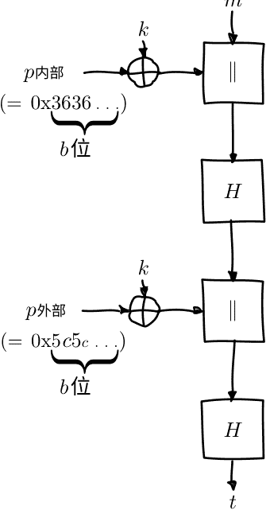

这里唯一令人惊讶的可能是两个常数 $p_{inner}$ (内填充，一个哈希函数的块长度值为 0x36 字节) 和 $p_{outer}$ (外填充，一个块长度值为 0x5c 字节)。这些对于HMAC的安全证明是必要的；它们的具体值并不重要，只要这两个常数不同即可。

在使用之前，这两个填充与密钥进行异或运算。结果要么是附加到原始消息之前（用于内填充 $p_{inner}$），要么是附加到中间哈希输出之前（用于外填充 $p_{outer}$）。由于它们是附加的，所以在处理前缀后，哈希函数的内部状态可以提前计算，从而减少了MAC计算时间。

## 11.5 一次性MAC

到目前为止，我们一直假设MAC函数可以使用单个密钥为大量消息生成安全的MAC。

相比之下，一次性MAC是只能使用一次且具有单个密钥的MAC函数。这听起来可能有些愚蠢，因为我们已经讨论过常规安全MAC。只能使用一次的算法似乎是明显更差的选择。然而，它们有几个重要优点：

- 它们在计算上非常快速，即使对于非常大的消息也是如此。
- 它们具有基于标签信息内容的令人信服的安全证明。
- 存在一种构造方法，可以将一次性MAC转换为安全的多次使用MAC，从而消除了主要问题。

这种一次性MAC的典型简单示例包括对某个大素数 $p$ 进行简单的乘法和加法运算。在这种情况下，秘密密钥由两个真正的随机数 $a$ 和 $b$ 组成，都在 1 和 $p$ 之间。

$$t \equiv m \cdot a + b \pmod p$$

这个简单的例子只适用于单个块消息 $m$，并且一些比最大 $m$ 稍大的素数 $p$。通过使用特定于消息的多项式 $P$，可以扩展支持更大的消息 $M$，由块 $m_i$ 组成：

$$t \equiv \underbrace{(m_n \cdot a^n + \dots + m_1 \cdot a)}_{P(M,a)} + b \pmod p$$

这看起来可能需要很多计算，但是这个多项式可以通过迭代地分解出公共因子来高效地计算 $a$ (也被称为霍纳规则):

$$P(M, a) \equiv a \cdot ( a \cdot ( a \cdot (\dots) + m_2 ) + m_1 ) + b \pmod p$$

通过对每个乘法进行模 $p$ 计算，数字将保持方便地小。

在很多方面，一次性MAC对于认证来说就像一次性密码本对于加密来说一样。安全性论证类似：只要密钥只被使用一次，攻击者对于密钥或者消息不会获得任何信息，因为它们被不可逆地混合在一起。这证明了MAC对于试图产生存在性伪造的攻击者是安全的，即使攻击者具有无限的计算能力。

与一次性密码本类似，安全性的论证依赖于两个非常重要的关键属性 $a, b$：

- 它们必须是真正的随机数。
- 它们最多只能使用一次。

##### 重复使用 $a$ 和 $b$

我们将说明如果我们的示例MAC用于验证具有相同密钥 $(a, b)$ 的两个消息 $m_1, m_2$，则其不安全：

$$
\begin{aligned}
t_1 & \equiv m_1 \cdot a + b \pmod p \\
t_2 & \equiv m_2 \cdot a + b \pmod p
\end{aligned}
$$

攻击者可以使用一些简单的模运算重构 $a, b$：$^2$

$^2$有关模运算的复习，包括模逆的解释，请参阅附录。

$$t_1 - t_2 \equiv (m_1 \cdot a + b) - (m_2 \cdot a + b) \pmod p$$
$$\Downarrow (\text{去除括号})$$
$$t_1 - t_2 \equiv m_1 \cdot a + b - m_2 \cdot a - b \pmod p$$
$$\Downarrow (b \text{ 和 } -b \text{ 相互抵消})$$
$$t_1 - t_2 \equiv m_1 \cdot a - m_2 \cdot a \pmod p$$
$$\Downarrow (\text{因式分解 } a)$$
$$t_1 - t_2 \equiv a \cdot (m_1 - m_2) \pmod p$$
$$\Downarrow (\text{交换两边，乘以 } (m_1 - m_2) \text{ 的逆元})$$
$$a \equiv (t_1 - t_2)(m_1 - m_2)^{-1} \pmod p$$

将 $a$ 代入 $t_1$ 或 $t_2$ 的方程式中，得到 $b$:

$$t_1 \equiv m_1 \cdot a + b \pmod p$$
$$\Downarrow (\text{重新排序项})$$
$$b \equiv t_1 - m_1 \cdot a \pmod p$$

正如你所看到的，与一次性密码本一样，即使只使用一次密钥，也会导致加密系统完全失去保护隐私或完整性的能力，具体情况可能因此而异。因此，一次性消息认证码直接使用有一定的危险性。幸运的是，这个弱点可以通过一种称为Carter-Wegman消息认证码的构造来解决，我们将在下一节中看到。

#### 11.6 Carter-Wegman MAC

正如我们已经提到的，一次性消息认证码的明显问题是其有限的实用性。幸运的是，事实证明有一种称为Carter-Wegman消息认证码的构造，可以将任何安全的一次性消息认证码转变为安全的多次性消息认证码，同时保留大部分性能优势。

Carter-Wegman消息认证码的思想是，你可以使用一次性消息认证码 $O$ 为大部分数据生成一个标签，然后使用伪随机函数 $F$（如块密码）加密一个随机数 $N$，以保护那个一次性标签：

$$CW((k_1, k_2), n, M) = F(k_1, n) \oplus O(k_2, M)$$

只要 $F$ 是一个安全的伪随机函数，nonce的加密是完全不可预测的。在攻击者眼中，这意味着 $XOR$ 操作将随机翻转一次性MAC标签 $O(k_2, M)$ 的位。因为这掩盖了一次性MAC标签的真实值，攻击者无法执行我们在一次性MAC中看到的代数技巧来恢复密钥，当密钥被多次使用时。

请记住，尽管Carter-Wegman MACs使用两个不同的密钥 $k_1$ 和 $k_2$，并且Carter-Wegman MACs与一次性MACs相关，其中一些也使用两个不同的密钥 $a$ 和 $b$，但它们不是相同的两个密钥。Carter-Wegman MAC的密钥 $k_2$ 是传递给快速一次性MAC $O$ 的唯一密钥。如果那个快速一次性MAC是我们之前的例子，它需要两个密钥 $a$ 和 $b$，那么 $k_2$ 必须被分成这两个密钥。然后Carter-Wegman MAC密钥将变为 $(k_1, k_2) = (k_1, (a, b))$。

通过分别考虑方程的两个术语，您可以了解Carter-Wegman MAC如何利用两种类型的MAC的优势。在 $F(k_1, n)$ 中，$F$ 只是一个常规的伪随机函数，例如块密码。与一次性MAC相比，它的速度相当慢。然而，它的输入，即nonce，非常小。块密码的不可预测输出掩盖了一次性MAC的输出。在第二个术语中，$O(k_2, M)$，大输入消息 $M$ 只由非常快速的一次性MAC $O$ 处理。

这些构造，特别是Poly1305-AES，目前代表了MAC函数的最新技术。论文([12])和RFC([11])介绍了一种较旧的相关MAC函数UMAC，也可以作为额外背景信息的良好来源，因为它们详细介绍了实际Carter-Wegman MAC的原理和原因。

## 11.7 鉴别加密模式

到目前为止，我们总是清楚地区分加密和身份验证，并解释了两者的必要性。每天建立的大多数安全连接也具有这种区别：它们将加密和身份验证视为根本不同的步骤。

或者，我们可以将身份验证作为操作模式的基本部分。毕竟，我们已经看到，未经身份验证的加密几乎从来不是您想要的；充其量，它是您偶尔不得不接受的东西。使用不仅保证任意流的隐私，而且保证其完整性的构造是有意义的。

正如我们已经看到的，许多组合身份验证和加密的方法本质上是不安全的。通过以固定、安全的方式进行身份验证加密模式设计，应用程序开发人员不再需要做出选择，这意味着他们也不会意外地做出错误的选择。

### 带有关联数据的身份验证加密（AEAD）

AEAD是某些认证加密模式的特性。这种操作模式被称为AEAD模式。它从一个前提开始，即许多消息实际上由两部分组成：

- 实际内容本身
- 元数据：关于内容的数据

在许多情况下，元数据应该是明文的，但内容本身应该是加密的。整个消息应该是经过认证的：攻击者不应该有可能干扰元数据并且仍然被视为有效的结果。

以电子邮件替代方案作为示例加密系统。关于内容的元数据可能包含预期的接收者。我们肯定希望加密和认证内容本身，以便只有接收者可以阅读它。然而，元数据必须是明文的：执行消息传递的电子邮件服务器必须知道将消息发送给哪个接收者。

许多系统会将这些元数据留作未经认证的，从而允许攻击者进行修改。在我们的情况下，这看起来可能导致消息被发送到错误的收件箱。这也意味着一个攻击者可以强制将电子邮件发送给错误的人，或者根本不发送。

AEAD模式通过提供一种指定的方式向加密内容添加元数据来解决这个问题，以便整个加密内容和元数据都经过验证，而不是分别验证两个部分：

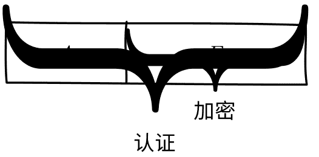

## 11.8 OCB模式

>  这是一个可选的深入章节。它几乎肯定不会帮助你编写更好的软件，所以随意跳过它。它只是为了满足你内心极客的好奇心。

通常，您会希望使用更高级的加密系统，例如OpenPGP、NaCl或TLS。

OCB模式是一种AEAD操作模式。它是最早开发的AEAD模式之一。

正如您所看到的，这个方案的大部分看起来与ECB模式非常相似。偏移码本（OCB）的名称与电子码本非常相似。然而，OCB与ECB模式没有共享安全问题。

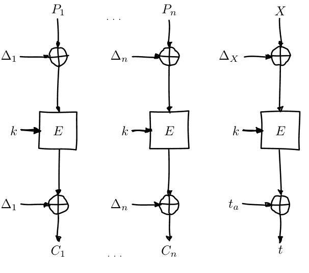

然而，它们之间存在一些重要的区别，例如在每个单独的块加密中引入的偏移 $\Delta_i$。

作为AEAD模式，OCB模式提供了一个密码学上安全的身份验证标签 $t$，它是从明文的一个非常简单（本身不安全的）校验和 $X$ 构建的。还有另一个单独的标签 $t_a$，用于验证关联的AEAD数据。该关联数据标签 $t_a$ 的计算方法如下：这个设计具有许多有趣的特性。例如，它非常快速：每个加密或关联数据块只需要大约一个块密码操作，以及最后一个标签需要一个额外的块密码操作。偏移量 ($\Delta_i$) 的计算也非常容易。校验和块 $X$ 只是所有明文块 $P_i$ 的异或结果。最后，OCB模式易于并行计算；只有最终的身份验证标签依赖于所有前面的信息。

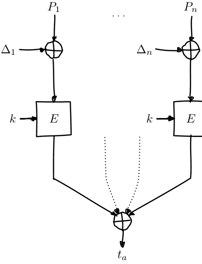

OCB模式还带有一个内置的填充方案：当明文或身份验证文本的长度不是块大小的整数倍时，它的行为略有不同。这意味着，与PKCS#5/PKCS#7填充不同，如果明文恰好是块大小的整数倍，就不会有整个块的“浪费”填充。

尽管OCB模式具有几个有趣的特性，但它并没有像其他一些替代方案那样受到太多关注；其中一个主要原因就是它受到专利的限制。尽管有许多专利许可证可供选择，包括用于开源软件的免费许可证，但这似乎并没有显著影响OCB模式在实际应用中的使用情况。[40]

## 11.9 GCM模式


> 这是一个可选的深入章节。它几乎肯定不会帮助你编写更好的软件，所以随意跳过它。它只是为了满足你内心极客的好奇心。
通常，您会希望使用更高级的加密系统，例如OpenPGP、NaCl或TLS。

GCM模式是一种具有冗余首字母缩写症 (RAS) 的AEAD模式：GCM本身代表“Galois计数器模式”。它在NIST特殊出版物[2]中被形式化，并且大致上可以看作是经典 CTR 模式与 Carter-Wegman MAC 的组合。该 MAC 也可以单独使用，称为 GMAC。

##### 身份验证

GCM模式（以及GMAC）

### 12 签名算法

#### 12.1 描述

签名算法是公钥等效的消息认证码。它由三个部分组成：

1. 密钥生成算法，可以与其他公钥算法共享
2. 签名生成算法
3. 签名验证算法

可以使用加密算法构建签名算法。使用私钥，我们基于消息生成一个值，通常使用密码哈希函数。然后任何人都可以使用公钥来检索该值，计算出应该从消息中得到的值，并将两者进行比较以进行验证。明显的区别在于，在签名中，使用私钥来生成消息（在本例中是签名），而使用公钥来解释它，这与加密和解密的工作方式相反。

上述解释忽略了许多重要细节。我们将在下面更详细地讨论真实的方案。

### 12.2 基于RSA的签名

**PKCS#1 v1.5**

待办事项 (见#48)

**PSS**

待办事项 (见#49)

### 12.3 DSA

数字签名算法（DSA）是美国联邦政府的一个数字签名标准。它最早由国家标准与技术研究所（NIST）于1991年提出，用于数字签名标准（DSS）中。该算法归功于NSA的前技术顾问David W. Kravitz。DSA密钥生成分为两个步骤。第一步是选择参数，这些参数可以在用户之间共享。第二步是为单个用户生成公钥和私钥。

##### 参数生成

我们首先选择一个经过批准的密码哈希函数 $H$。我们还选择一个密钥长度 $L$ 和一个素数长度 $N$。尽管最初的 DSS 规定 $L$ 在 512 到 1024 之间，但 NIST 现在推荐在 2030 年之后具有安全寿命的密钥长度为 3072。随着 $L$ 的增加，$N$ 也应该增加。

接下来，我们选择一个长度为 $N$ 位的素数 $q$；$N$ 必须小于或等于哈希输出的长度。我们还选择一个 $L$ 位素数 $p$，使得 $p - 1$ 是 $q$ 的倍数。

最后一部分最令人困惑。我们需要找到一个数 $g$ 其乘法阶数 $(\bmod p)$ 等于 $q$。这样做的简单方法是设置 $g \equiv 2^{(p-1)/q} \pmod p$。如果 $g$ 等于 1，则可以尝试另一个大于 2 且小于 $p-1$ 的数。

一旦我们有了参数 $(p, q, g)$，它们可以在用户之间共享。

##### 密钥生成

有了参数，现在是时候为每个用户计算公钥和私钥了。首先，随机选择一个 $x$，其中 $0 < x < q$。接下来，计算 $y$，其中 $y \equiv g^x \pmod p$。这会生成一个公钥 $(p, q, g, y)$，和一个私钥 $x$。

##### 签署一条消息

为了签署一条消息，签署者选择一个在 0 和 $q$ 之间的随机 $k$。选择那个 $k$ 结果是一个相当敏感和复杂的过程；但我们稍后会详细讨论这个问题。选择了 $k$ 之后，他们计算消息 $m$ 的两个签名部分 $r, s$:

$r \equiv (g^k \pmod p) \pmod q$

$s \equiv k^{-1} (H(m) + xr) \pmod q$

如果其中任何一个等于0（这是一个罕见的事件，概率为1/$q$，并且 $q$ 是一个相当大的数），选择一个不同的 $k$。

待办事项：讨论 $k^{-1}$，模反元素（见#52）

##### 验证签名

验证签名要复杂得多。给定消息 $m$ 和签名 $(r, s)$:

$w \equiv s^{-1} \pmod q$

$u_1 \equiv wH(m) \pmod q$

$u_2 \equiv wr \pmod q$

$v \equiv (g^{u_1} y^{u_2} \pmod p) \pmod q$

如果签名有效，最终结果 $v$ 将等于 $r$，签名的第二部分。

##### 有问题的 $k$

虽然没有问题的DSA是正确的，但很容易弄错。此外，DSA非常敏感：即使是一个小的实现错误也会导致方案破裂。

特别是，签名参数 $k$ 的选择至关重要。这个数字的要求是密码算法中最严格的之一。例如，许多算法需要一个随机数。随机数只需要是唯一的：你可以使用它一次，然后永远不能再使用它。它不需要保密。它甚至不需要是不可预测的。一个随机数可以通过一个简单的计数器或单调时钟来实现。许多其他算法，如CBC模式，使用初始化向量。它不需要是唯一的：它只需要是不可预测的。它也不需要保密：初始化向量通常附加到密文上。DSA对 $k$ 值的要求是所有这些要求的组合：

- 它必须是唯一的。
- 它必须是不可预测的。
- 它必须是保密的。

干扰这些属性中的任何一个，攻击者可能会很容易地检索到您的秘密密钥，即使只有少量的签名。例如，攻击者可以仅仅知道几位 $k$ 的位，再加上大量有效的签名，就可以恢复秘密密钥。[39]

事实证明，许多DSA的实现甚至没有正确处理唯一性部分，愉快地重复使用 $k$ 值。这允许使用基本算术直接恢复秘密密钥。由于这种攻击更容易理解，非常常见，而且同样具有毁灭性，我们将详细讨论它。

假设攻击者看到多个签名 $(r_i, s_i)$，对于不同的消息 $m_i$，都使用相同的 $k$。攻击者选择任意两个消息 $m_1$ 和 $m_2$ 的签名 $(r_1, s_1)$ 和 $(r_2, s_2)$ 分别。写下方程式 $s_1$ 和 $s_2$ 的表达式：

$$s_1 \equiv k^{-1} (H(m_1) + xr_1) \pmod q$$
$$s_2 \equiv k^{-1} (H(m_2) + xr_2) \pmod q$$

攻击者可以进一步简化这个表达式：$r_1$ 和 $r_2$ 必须相等，根据定义：

$$r_i \equiv g^k \pmod q$$

由于签名者重复使用 $k$，并且 $r$ 的值仅取决于 $k$，所有的 $r_i$ 将相等。由于签名者使用相同的密钥，两个方程式中的 $x$ 也相等。将两个 $s_i$ 方程式相减，然后进行一些算术操作：

$$\begin{aligned}
s_1 - s_2 & \equiv k^{-1} (H(m_1) + xr) - k^{-1} (H(m_2) + xr) \pmod q \\
& \equiv k^{-1} ((H(m_1) + xr) - (H(m_2) + xr)) \pmod q \\
& \equiv k^{-1} (H(m_1) + xr - H(m_2) - xr) \pmod q \\
& \equiv k^{-1} (H(m_1) - H(m_2)) \pmod q
\end{aligned}$$

这给我们提供了简单、直接的 $k$ 解决方案：

$$k \equiv (H(m_1) - H(m_2)) (s_1 - s_2)^{-1} \pmod q$$

哈希值 $H(m_1)$ 和 $H(m_2)$ 很容易计算。它们不是秘密：被签名的消息是公开的。这两个值 $s_1$ 并且 $s_2$ 是攻击者看到的签名的一部分。因此，攻击者可以计算 $k$。然而，这并不意味着他能够获得私钥 $x$ ，或者伪造签名的能力。

让我们再次写出 $s$ 的方程，但这次考虑 $k$ 作为我们已知的东西，而 $x$ 作为我们要解决的变量：

$$s \equiv k^{-1}(H(m) + xr) \pmod q$$

所有有效签名 $(r, s)$ 都满足这个方程，所以我们可以只需取任何我们看到的签名。用一些代数解出 $x$：

$$sk \equiv H(m) + xr \pmod q$$
$$sk - H(m) \equiv xr \pmod q$$
$$r^{-1}(sk - H(m)) \equiv x \pmod q$$

同样地，$H(m)$ 是公开的，而且攻击者需要它来计算 $k$。他们已经计算出 $k$，并且 $s$ 直接从签名中取出。这只剩下 $r^{-1} \pmod q$（读作：“$r$ 模 $q$ 的模反元素”），但这也可以高效地计算出来。（有关更多信息，请参见附录中关于模算术的内容；请记住 $q$ 是素数，因此模反元素可以直接计算。）这意味着一旦攻击者发现了任何签名的 $k$，他们可以直接恢复私钥。

到目前为止，我们一直假设被破坏的签名者总是使用相同的 $k$。更糟糕的是，签名者只需要在攻击者可以看到的任意两个签名中重复使用 $k$ 一次，攻击就会成功。正如我们所见，如果 $k$ 重复，$r_i$ 值也会重复。由于 $r_i$ 是签名的一部分，很容易看出签名者是否犯了这个错误。因此，即使重复使用 $k$ 只是签名者偶尔会做的事情（例如，因为他们的随机数生成器有问题），只要做一次就足以让攻击者破解DSA方案。

简而言之，重用DSA签名操作的 $k$ 参数意味着攻击者可以恢复私钥。

待办事项：Debian [http://rdist.root.org/2009/05/17/the-debian-pgp-disaster](http://rdist.root.org/2009/05/17/the-debian-pgp-disast)

#### 12.4 ECDSA

待办事项：解释（见 #53）

与常规DSA一样，选择 $k$ 非常关键。当只有少数几个nonce泄漏时，攻击者可以使用几千个签名来恢复签名密钥。[38]

#### 12.5 可否认的认证器

像我们上面描述的那样的签名提供了一种称为不可否认的属性。简而言之，这意味着您以后不能否认是签名消息的发送者。任何人都可以验证签名是使用您的私钥进行的，这是只有您能做到的事情。这可能并不总是一个有用的功能；更明智的做法可能是只有预期的接收者可以验证签名。设计这样一个方案的一个明显方法是确保接收者（或者实际上是任何其他人）可以计算出相同的值。

> "这样的消息可以被否认；这样的方案通常被称为“可否认身份验证”。" 虽然它向预期的接收者验证了发送者，但发送者以后可以否认（对第三方）发送了该消息。同样，接收者无法说服其他人发送者发送了那个特定的消息。

# 13 密钥派生函数

#### 13.1 描述

密钥派生函数是从一个秘密值派生一个或多个秘密值的函数（密钥）。

许多密钥派生函数还可以接受（通常是可选的）盐参数。这个参数导致密钥派生函数对于相同的输入秘密不总是返回相同的输出密钥。与其他加密系统一样，盐与秘密输入基本上是不同的：盐通常不需要保密，并且可以被重复使用。

密钥派生函数在某些情况下非常有用，例如，当一个加密协议从一个单一的秘密值开始，比如共享密码或使用Diffie-Hellman密钥交换派生的秘密值，但是需要多个秘密值来进行操作，比如加密和MAC密钥。密钥派生函数的另一个用例是在密码学安全的随机数生成器中，我们将在后面的章节中详细介绍，它们用于从许多低熵密度的源中提取具有高熵密度的随机性。

密钥派生函数有两个主要类别，取决于秘密值的熵内容，这决定了秘密值可以取多少不同的可能值。

如果秘密值是用户提供的密码，例如，它通常包含非常少的熵。密码可能的取值非常有限。正如我们在密码存储的前一节中已经确定的那样，这意味着密钥派生函数必须难以计算。这意味着它需要非平凡的计算资源，如CPU周期或内存。如果密钥派生函数容易计算，攻击者可以简单地枚举所有可能的共享秘密值，因为可能性很少，然后为它们计算密钥派生函数。正如我们在密码存储的前一节中所看到的，这是大多数现代密码存储攻击的工作方式。使用适当的密钥派生函数可以防止这些攻击。在本章中，我们将看到scrypt以及这个类别中的其他密钥派生函数。

另一方面，秘密值也可能具有很高的熵内容。例如，它可以是从Diffie-Hellman密钥协商协议派生的共享秘密，或者由密码学随机字节组成的API密钥（我们将在下一章讨论密码学安全的随机数生成）。在这种情况下，没有必要使用计算困难的密钥派生函数：即使密钥派生函数很容易计算，秘密可以采用太多可能的值，因此攻击者无法枚举所有可能值。我们将在本章中介绍这种类型的最佳密钥派生函数HKDF。

#### 13.2 密码强度
待办事项：NIST特刊800-63

#### 13.3 PBKDF2
#### 13.4 bcrypt
#### 13.5 scrypt
#### 13.6 HKDF

基于HMAC的（提取和扩展）密钥派生函数（HKDF），在RFC 5869[33]中定义，并在相关论文[32]中详细解释，是一种专为高熵输入设计的密钥派生函数，例如来自Diffie-Hellman密钥交换的共享秘密。它特别不适用于低熵输入（如密码）的安全性设计。

> "HKDF的存在是为了给人们提供一个合适的、现成的密钥派生函数。"以前，密钥派生通常是针对特定标准而临时完成的事情。"通常这些临时解决方案没有HKDF所具有的额外规定，比如盐或可选的信息参数（我们将在本节后面讨论）；而在最好的情况下，如果KDF从一开始就没有根本性的问题。

HKDF基于HMAC。像HMAC一样，它是一个通用的构造，使用哈希函数，并且可以使用任何你想要的密码安全哈希函数来构建。

### 仔细看看HKDF

> 这是一个可选的深入章节。它几乎肯定不会帮助你编写更好的软件，所以随意跳过它。它只是为了满足你内心极客的好奇心。

HKDF由两个阶段组成。在第一阶段，称为提取阶段，从输入熵中提取出一个固定长度的密钥。在第二阶段，称为扩展阶段，使用该密钥生成一些伪随机密钥。

### 提取阶段

提取阶段负责从潜在的大量数据中提取具有高熵内容的少量数据。提取阶段只使用带有盐的HMAC：

```python
def extract(salt, data):
    return hmac(salt, data)
```

盐值是可选的。如果未指定盐值，则使用与哈希函数输出长度相等的零字符串。虽然盐值在技术上是可选的，但设计者强调其重要性，因为它使得密钥派生函数的独立使用（例如在不同应用程序或不同用户之间）产生独立的结果。即使是相对低熵的盐值也可以显著提高密钥派生函数的安全性。[33] [32]

提取阶段解释了为什么HKDF不适用于从密码中派生密钥。虽然提取阶段非常擅长集中熵，但它无法放大熵。它被设计用于将分散在大量数据中的少量熵压缩为同样数量的少量数据中的熵，但不适用于在面对少量可用熵时创建难以计算的密钥集。在这个阶段中，也没有任何规定使这个阶段变得计算复杂化。[33]

在某些情况下，如果共享密钥已经具备了所有正确的属性，例如，它是一个足够长且具有足够熵的伪随机字符串，那么可以跳过提取阶段。然而，有时候这根本不应该做，例如在处理迪菲-赫尔曼共享密钥时。RFC对于是否跳过这一步骤稍微详细地进行了讨论；但一般来说，这是不可取的。[33]

### 扩展阶段

在扩展阶段，从提取阶段中提取的随机数据被扩展为所需的数据量。扩展步骤也非常简单：使用提取的密钥而不是公共盐，使用 HMAC 生成数据块，直到产生足够的字节。被 HMAC 的数据是先前的输出（从空字符串开始），一个 “info” 参数（默认为空字符串），以及一个计数字节，用于计算当前正在生成的块。

```python
def expand(key, info=""):
    """ 扩展密钥，可选信息。 """
    output = ""
    for byte in map(chr, range(256)):
        output = hmac(key, output + info + byte)
        yield output

def get_output(desired_length, key, info=""):
    """ 收集扩展步骤的输出，直到收集到足够的输出为止；然后返回该输出。 """
    outputs, current_length = [], 0
    for output in expand(key, info):
        outputs.append(output)
        current_length += len(output)

        if current_length >= desired_length:
            break
    else:
        # 当for循环没有被 “break” 语句终止时，执行此块
        # 这发生在我们用完 “expand” 输出之前达到所需长度。
        raise RuntimeError("所需长度太长")

    return "".join(outputs)[:desired_length]
```

就像提取阶段中的盐一样，“info”参数完全是可选的，但实际上可以极大地增加应用程序的安全性。“info”参数旨在包含使用密钥派生函数的某些特定应用程序上下文。就像盐一样，它会导致密钥派生函数在不同上下文中产生不同的值，进一步增加其安全性。例如，info参数可以包含有关正在处理的用户、密钥派生函数正在执行的协议部分或类似信息。[33]

# 14 随机数生成器

> 生成随机数太重要了，不能靠机会。
> —— Robert R. Coveyou

#### 14.1 简介

许多密码系统需要随机数。到目前为止，我们只是假设它们是可用的。在本章中，我们将更深入地讨论随机数在密码系统中的重要性和机制。

生成随机数是一个相当复杂的过程。就像在密码学中的许多其他事物一样，很容易完全搞错，但对于不熟悉的人来说，一切看起来都很正常。我们将单独考虑三类随机数生成：

- 真随机数生成器
- 密码学安全伪随机数生成器
- 伪随机数生成器

## 14.2 真随机数生成器

> 任何考虑使用算术方法生成随机数字的人，当然都处于一种罪恶的状态。
> —— 约翰·冯·诺伊曼

现代计算模型之父约翰·冯·诺伊曼提出了一个显而易见的观点。我们不能指望使用可预测的确定性算法生成随机数。我们需要一种不是由确定性规则决定的随机性来源。

真随机数生成器从物理过程中获取随机性。历史上，有许多系统用于生成这样的数字。像骰子这样的系统今天仍然广泛使用。然而，对于实际密码算法所需的随机性量级来说，这些方法通常太慢，而且往往不可靠。

我们已经找到了更快速和可靠的随机性来源。用于硬件随机数生成的物理过程有几个类别：

- 量子过程
- 热过程
- 振荡器漂移
- 时间事件

请记住，并非所有这些选项都能生成高质量、真正随机的数字。我们将进一步阐述如何成功应用它们。

##### 放射性衰变
一个用于产生随机数的量子物理过程的例子是放射性衰变。我们知道放射性物质会随着时间的推移慢慢衰变。我们无法知道下一个原子何时衰变；这个过程完全是随机的。然而，检测到这样的衰变是相当容易的。通过测量个别衰变之间的时间，我们可以产生随机数。

##### 射击噪声
射击噪声是另一个用于产生随机数的量子物理过程。射击噪声基于这样一个事实：光和电是由不可分割的小包裹移动引起的，光的情况下是光子，电的情况下是电子。

##### 奈奎斯特噪声
用于产生随机数的热过程的一个例子是奈奎斯特噪声。奈奎斯特噪声是由带电载流子（通常是电子）穿过具有一定电阻的介质时产生的噪声。这会导致微小电流通过电阻器流动（或者换句话说，导致电阻器上产生微小电压差）。

$$i = \sqrt{\frac{4k_BT\Delta f}{R}}$$
$$v = \sqrt{4k_BTR\Delta f}$$

对于那些以前没有看到过它们背后的物理学的人来说，这些公式可能看起来有点可怕，但不用太担心：理解它们对于跟上推理并不是真正必要的。这些公式是用于均方根的。如果你以前从未听说过这个术语，你可以粗略地假设它的意思是“平均”。$\Delta f$ 是带宽，$T$ 是系统的温度（以开尔文为单位），$k_B$ 是玻尔兹曼常数。

从公式中可以看出，奈奎斯特噪声是热噪声，或者与温度有关。幸运的是，攻击者通常无法利用这个特性来破解生成器：它失效的温度非常低，使用它的系统在那个时候可能已经失败了。

通过评估这个公式，我们可以看到奈奎斯特噪声非常小。在室温下，根据合理的假设（10 kHz的带宽和1k$\Omega$的电阻），奈奎斯特电压在几百纳伏之内。即使你大胆地四舍五入到微伏（一千纳伏），那仍然是千分之一千分之一伏特，而即使是一个微小的AA电池也能产生1.5伏特。虽然这些公式描述了均方根，但你可以测量的值将是随机分布的。通过反复测量它，我们可以产生高质量的随机数。对于大多数实际应用，热噪声数值具有相当高的质量和相对无偏性。

待办事项：我们实际上从未解释过熵这个词；在一个好的定义中，“对抗者感知到的”阻力是必要的。
待办事项：解释同步流密码作为CSPRNGs

## 14.3 密码学安全伪随机生成器

虽然在接下来的几节中我们将看到几个密码学安全的伪随机生成器的示例，但请记住它们只是可以使用的算法。作为应用程序开发者，你永远不应该在它们之间做出选择。

相反，在极少数情况下，当你真正想手动选择一个随机数时，你应该始终使用操作系统提供的密码学安全随机数生成器：`/dev/urandom`（在 *NIX 上是 Linux、BSD 和 OS X），或者在 Windows 上使用 `CryptGenRandom`。Python 提供了这些的便捷接口，形式为 `os.urandom` 和 `random.SystemRandom`。

虽然它们可以安全地实现，但尽量避免使用用户空间的加密安全随机数生成器，例如 OpenSSL 中的生成器。它们存在更多可能出错的地方，通常涉及其内部状态：要么它们保持未初始化状态，要么初始化不良，或者在不同位置重复使用相同的状态。在所有这些情况下，生成的加密系统都会被完全破解。

待办事项：讨论 Linux 手册页中关于 urandom 的 FUD

#### 14.4 Yarrow

> 这是一个可选的深入章节。它几乎肯定不会帮助你编写更好的软件，所以随意跳过它。它只是为了满足你内心极客的好奇心。
> 由于这是一种特定的加密安全伪随机数生成器算法，你实际上不需要知道它的工作原理就能编写出优秀的软件。只需使用 urandom。

Yarrow 算法是一种加密安全的伪随机数生成器。

待办事项：实际解释 Yarrow。这个算法被用作 FreeBSD 的 CSPRNG，并被 Mac OS X 继承。在这两个操作系统上，它被用于实现 `/dev/random`。与 Linux 不同，`/dev/urandom` 只是 `/dev/random` 的别名。

#### 14.5 Blum Blum Shub

> 这是一个可选的深入章节。它几乎肯定不会帮助你编写更好的软件，所以随意跳过它。它只是为了满足你内心极客的好奇心。
> 由于这是一种特定的加密安全伪随机数生成器算法，你实际上不需要知道它的工作原理就能编写出优秀的软件。只需使用 urandom。

待办事项：解释这个，并解释为什么它是好的（可证明的），但为什么我们不使用它（慢）

#### 14.6 Dual_EC_DRBG

> 这是一个可选的深入章节。它几乎肯定不会帮助你编写更好的软件，所以随意跳过它。它只是为了满足你内心极客的好奇心。

由于这是一种特定的加密安全伪随机数生成器算法，你实际上不需要知道它的工作原理就能编写出优秀的软件。只需使用 urandom。

Dual_EC_DRBG 是一种由 NIST 标准规定的用于加密安全的伪随机比特生成器。它引发了大量争议：尽管被提出为官方的、联邦的密码学标准，但很快就显露出它并不是很好。

密码分析最终证明该标准可能包含在标准指定的常数中隐藏的后门，可能允许未指定的攻击者完全破解随机数生成器。

几年后，泄露的文件暗示在与 Dual_EC_DRBG 同时发布的一个未命名的 NIST 标准中存在后门，进一步加深了怀疑。这导致了标准机构的官方建议停止使用该标准，在这种情况下此前是闻所未闻的。

##### 背景

长时间以来，由 NIST 制定的官方标准缺乏良好的、现代的密码学安全伪随机数生成器。选择很少，而那些已经标准化的选择都存在严重的缺陷。

NIST 希望通过一份名为 SP 800-90 的新出版物来解决这个问题，其中包含了几个新的密码学安全伪随机数生成器。该文档指定了一些基于不同密码学原语的算法：

- 1. 密码哈希函数
- 2. HMAC
- 3. 块密码
- 4. 椭圆曲线

首先，最后一个算法引人注目。使用椭圆曲线进行随机数生成是不寻常的。这样的标准通常被期望是最先进的，同时仍然保持保守。椭圆曲线之前在学术领域中被考虑过，但这与其作为常用标准的建议相去甚远。椭圆曲线之所以看起来奇怪，还有第二个原因。HMAC 和块密码显然是对称算法。哈希函数在非对称算法（如数字签名）中有应用，但它们本身不是非对称的。另一方面，椭圆曲线专门用于非对称算法：签名、密钥交换、加密。

话虽如此，选择并非完全出乎意料。选择一个具有强大数论基础的密码学安全伪随机数生成器并不罕见：Blum Blum Shub 就是一个完美的例子。这些生成器通常比其他选择要慢得多。例如，Dual_EC_DRBG 比同一标准中的其他生成器慢三个数量级。这个想法是，通过更强的数学保证所带来的额外信心是值得性能损失的。例如，我们相当有信心因式分解是困难的，但对于我们的哈希函数和密码算法，我们就不那么确定了。Rivest Shamir Adleman (RSA) 于 1977 年问世，并且已经受住了时间的考验。DES 在两年后问世，现在被认为完全破解了。MD4 和 MD5 在十多年后问世，也完全破解了。

然而，问题是，标准实际上没有提供安全证明。标准规定了生成器，但只是建议它至少与解决椭圆曲线离散对数问题一样困难。相比之下，Blum Blum Shub 有一个证明，表明破解它至少与解决二次剩余问题一样困难。我们目前拥有的最好算法是因式分解数字，我们相当确定这是相当困难的。

省略了证明有点愚蠢，因为除非你有证明你为性能损失得到了回报，否则你不会使用像 Dual_EC_DRBG 这样慢的伪随机数生成器。

密码学家后来完成了 NIST 应该在规范中提供的作业 [42][15]。这些分析很快就突出了一些问题。

##### 算法的快速概述

该算法由两部分组成：

- 1. 在椭圆曲线上生成伪随机点，将其转换为生成器的内部状态；
- 2. 将这些点转换为伪随机比特。

我们将以图形方式进行说明，基于 Shumow 和 Ferguson 的工作，他们突出了该算法的一些主要问题：

在整个算法中，$\phi$ 是一个将曲线点转换为整数的函数。该算法需要曲线上的两个给定点：$P$ 和 $Q$。这些是固定的，并在规范中定义。

该算法具有内部状态 $s$。在生成新的比特块时，算法使用 $\phi$ 函数和椭圆曲线标量乘法将 $s$ 转换为不同的值 $r$：

$$r = \phi(sP)$$

该值 $r$ 既用于生成输出比特，也用于更新生成器的内部状态。为了生成输出比特，使用不同的椭圆曲线点 $Q$。输出比特是通过将 $r$ 与 $Q$ 相乘，并通过变换 $\theta$ 运行结果来产生的：

$$o = \theta(\phi(rQ))$$

为了执行状态更新，$r$ 与 $P$ 再次相乘，并将结果转换为整数。该整数用作新的状态 $S$。

$$S = \phi(rP)$$

##### 问题和问号

首先，$\phi$ 非常简单：它只取曲线点的 $x$ 坐标，并丢弃 $y$ 坐标。这意味着对于看到 $\phi$ 的输出值的攻击者来说，找到可能产生该值的点是相当容易的。就本身而言，这并不一定是一个大问题；但是，正如我们将看到的，这是导致可能存在后门的因素之一。

另一个缺陷是将点转换为伪随机位。函数 $\theta$ 只是丢弃了最高的 16 位。以前的设计丢弃了更多位数：对于 256 位曲线，它们丢弃了大约 120 到 175 位之间的位数。未能丢弃足够的位给发生器带来了一点偏差。下一位属性被违反，使攻击者有超过 50% 的机会猜测下一位正确。诚然，那个机会只有比 50% 高出大约一千分之一；但对于被认为是密码学安全伪随机数生成器的最新技术来说，这仍然是不可接受的。

仅丢弃这 16 位还有另一个后果。因为只有 16 位被丢弃，我们只需要猜测 $2^{16}$ 个可能值来找到产生输出的 $\phi(rQ)$ 的可能值。这是一个非常小的数字：我们可以简单地列举出所有可能值。这些值是 $\phi$ 的输出，正如我们刚刚看到的，它只返回一个点的 $x$ 坐标。由于我们知道它来自曲线上的一个点，我们只需要检查我们的猜测是否是曲线方程的解：

$$y^2 \equiv x^3 + ax + b \pmod p$$

常数 $a, b, p$ 由曲线指定。我们刚刚猜测了一个值给 $x$，只剩下一个未知数 $y$。我们可以高效地解决这个问题。我们计算右边并查看是否为完全平方数：$y^2 \equiv q$。如果是的话，$A = (x, \sqrt{q}) = (x, y)$ 是曲线上的一个点。这给我们提供了一些可能的点 $A$，其中一个用于生成输出的 $rQ$。

从表面上看，这并不是什么大问题。要找到算法的状态，攻击者需要找到 $r$，以便他们可以计算 $s$。他们仍然需要解决椭圆曲线离散对数问题，以从 $rQ$ 中找到 $r$，给定 $Q$。我们假设问题很难。

请记住，椭圆曲线是用于非对称加密的基本原理。这个问题通常很难解决，但是如果我们有一些额外的信息呢？如果存在一个秘密值 $e$，使得 $eQ = P$ 呢？

让我们假设自己是一个知道 $e$ 的攻击者。我们重复之前的数学计算。我们刚刚找到的其中一个点 $A$ 就是我们正在寻找的 $rQ$。我们可以计算：

$$\phi(eA) \equiv \phi(erQ) \equiv \phi(rP) \pmod p$$

最后一步是由于 $e, P, Q$ 之间的特殊关系。这非常有趣，因为 $\phi(rP)$ 恰好是算法用于更新状态 $S$ 的计算！这意味着知道 $e$ 的攻击者可以相当高效地从任何输出 $o$ 计算出新状态 $s$，从而预测出生成器的所有未来值！

这假设攻击者知道哪个 $A$ 是正确的 $A$。因为只有 16 位被丢弃，所以我们只剩下 16 位可以猜测。这给我们 $2^{16}$ 个候选的 $x$ 坐标。通过实验，我们发现大约一半的可能 $x$ 坐标对应于曲线上的点，剩下的是 $2^{15}$ 个可能的曲线点 $A$，其中一个是 $rQ$。对于计算机辅助算术来说，这是一个非常小的数字：足够小让我们尝试所有选项。因此，我们可以说，如果攻击者知道秘密值 $e$，他们绝对可以破解生成器。

所以，我们现在已经证明了，如果存在一个神奇的 $e$，使得 $eQ = P$，而且你可以选择 $P$ 和 $Q$（而不必解释你从哪里得到它们），那么你可以破解生成器。那么，你如何选择这样的值？

为了演示这是多么可能，研究人员从 NIST 曲线的 $P$ 和 $p$ 值开始，但是他们自己得到了自己的 $Q'$。他们通过从 $P$ 开始，选择一个随机的 $d$（保密），并设置 $Q' = dP$ 来实现这一点。诀窍在于有一种高效的算法用于计算 $Q' = eP$ 中的 $e$ ，如果你知道 $Q' = dP$ 中的 $d$ 。这是我们之前攻击所需要的 $e$ 。当他们尝试这样做时，他们发现现在所有情况下（即，对于许多随机的 $d$ ），看到 32 个字节的输出足以确定状态 $s$ 。

当然，所有这些只是证明了对于指定的 $P$ 和 $Q$ 值来说，可能存在一个秘密后门。这并没有提供任何证据表明实际值中存在后门。然而，鉴于标准从未真正解释过如何获得 $Q$ 的神奇值，这并没有激发太多的信心。通常，密码学标准使用“无后门”的数字，例如某个常数值，如 $\pi$ 或自然对数的底数 $e$ 。

如果有人知道后门，后果显然是毁灭性的。我们已经为密码学安全伪随机数生成器的必要性进行了辩论：拥有一个破解的生成器基本上意味着使用该生成器的所有密码系统都被完全击败。

有两种方法可以尝试修复这个特定的算法：

- 使 $\theta$ 函数更复杂以进行反演，而不仅仅是丢弃 16 位。这使得更难找到候选点，因此更难进行攻击。一个明显的方法是丢弃更多的位。另一个选择是使用密码学安全哈希，或两者的组合。
- 每次启动算法时生成随机 $Q$，可能通过选择随机的 $d$ 并设置 $Q = dP$ 来实现。当然，$d$ 必须足够大且真正随机：如果 $\theta$ 不变，并且只有很少的值 $d$ 可以有，攻击者可以对所有的值 $d$ 执行上述攻击。

这两种方法都只是权宜之计；最好的办法是使用完全不同的算法。这些建议并没有解决它慢、奇特且现在是被撤回的标准的问题。

##### 后果

待办事项：谈论 RSA 先生的评论 + 斯诺登的泄露

## 14.7 Mersenne Twister

Mersenne Twister（梅森旋转算法）是一种非常常见的伪随机数生成器。它具有许多良好的特性，如高性能、巨大的周期（$2^{19937} - 1 \approx 4 \cdot 10^{6001}$），并且通过了除了最苛刻的随机性测试之外的所有测试。尽管具有这些优点，它并不具备密码学安全性。

### 深入了解Mersenne Twister

> 这是一个可选的深入章节。它几乎肯定不会帮助你编写更好的软件，所以随意跳过它。它只是为了满足你内心极客的好奇心。

注1：伪随机数生成器的周期是在整个序列重复之前生成的随机数的数量。

为了证明为什么 Mersenne Twister 不是密码安全的，我们将看一下算法的工作原理。幸运的是，它并不是很复杂。

标准的 Mersenne Twister 算法在一个内部状态数组 $S$ 上操作，该数组由 624 个无符号 32 位整数组成，并且有一个指针 $i$ 指向当前整数。它包括三个步骤：

- 1. 一个可选的初始化函数，从一个称为种子的小随机值生成初始状态。
- 2. 一个状态生成函数，从旧状态生成新状态。
- 3. 一个提取函数，也称为调整函数（Tempering function），从当前状态的元素（由索引 $i$ 指向的元素）生成一个随机数。

每当调用提取函数时，当前整数的索引会递增。当所有当前状态的元素都被用来生成一个数时，状态初始化函数会再次被调用。在提取第一个数之前，状态初始化函数也会被调用。

所以，总结一下：状态被重新生成，然后提取函数在状态的每个元素上进行操作，直到用完。这个过程无限重复。

待办事项：说明

我们将简要介绍每个部分。它们的确切工作原理超出了本书的范围，但我们将简要介绍它们，以便更好地理解为什么梅森旋转算法不适用于密码安全的随机数生成器。

##### 初始化函数

初始化函数从一个称为种子的小随机数创建梅森旋转算法的状态数组的实例。

数组以种子本身开始。然后，每个下一个元素都是由一个常数、前一个元素和新元素的索引产生的。元素会一直产生，直到有 624 个为止。

以下是 Python 源代码：

```python
def initialize_state(seed):
    state = [seed]

    for i in range(1, 624):
        prev = state[-1]
        elem = 0x6c078965 * (prev ^ (prev >> 30)) + i
        state.append(uint32(elem))

    return state
```

对于那些没有使用过 Python 或其位运算符的人：

- `>>` 和 `<<` 是右移和左移
- `&` 是二进制 AND 运算：0&0 = 0&1 = 1&0 = 0，1&1 = 1。
- `^` 是二进制 XOR 运算，`^=` 是 XOR 并将结果分配给左侧的变量名，因此 `x ^= k` 与 `x = x ^ k` 是相同的。

复习：位运算附录？

##### 状态再生函数

状态再生函数接受当前状态并生成新状态。它在提取第一个数字之前被调用，并在状态的所有 624 个元素都被使用完之后每次都被调用。这个函数的 Python 源代码非常简单。请注意，它直接修改了状态数组，而不是返回一个新的数组。

```python
def regenerate(s):
    for i in range(624):
        y = s[i] & 0x80000000
        y += s[(i + 1) % 624] & 0x7fffffff

        z = s[(i + 397) % 624]
        s[i] = z ^ (y >> 1)

        if y % 2:
            s[i] ^= 0x9908b0df
```

在表达式中的 `%`，例如 `s[(i + n) % 624]` 表示查看状态的下一个元素，如果没有下一个元素，则回到状态数组的开头。

值 `0x80000000` 和 `0x7fffffff` 在解释为 32 位序列时具有特定含义。`0x80000000` 只有第一位被设置；`0x7fffffff` 除了第一位之外的所有位都被设置。因为这些是按位与 (`&`) 在一起的，所以在循环的前两行之后，`y` 由当前状态元素的第一位和下一个元素的所有后续位组成。

##### 混淆函数

在将当前状态元素返回为生成的随机数之前，将混淆函数（Temper function）应用于当前状态元素。更容易的方法是展示代码，而不是解释它的工作原理：

```python
_TEMPER_MASK_1 = 0x9d2c5680
_TEMPER_MASK_2 = 0xefc60000

def temper(y):
    y ^= uint32(y >> 11)
    y ^= uint32((y << 7) & _TEMPER_MASK_1)
    y ^= uint32((y << 15) & _TEMPER_MASK_2)
    y ^= uint32(y >> 18)
    return y
```

这可能并不明显，特别是如果你不习惯二进制运算，但这个函数是双射的或一对一的：每个 32 位整数输入都映射到一个唯一的输出，反之亦然：对于每个 32 位整数输出，都有一个唯一的 32 位整数可以生成它。因为它使用了右移和左移操作，乍一看可能会觉得它丢失了数据，因此不可能是可逆的。

确实，这些移位操作会丢弃一些位，然而，关键的操作是内联异或 (`^=`)：这些移位只是用来计算掩码，与待处理的值进行异或运算。异或操作本身是可逆的，因为每个独立的操作都是可逆的，它们的组合也是可逆的。

因为调整函数是一对一的，所以存在一个逆函数：一个函数可以给出未调整的等效数字。你可能不知道如何构建这个函数，除非你是一个位运算的专家，但没关系；在最坏的情况下，我们仍然可以用穷举法来解决。假设我们只是尝试每个 32 位整数，并在表中记下结果。然后，当我们得到一个结果时，我们在表中查找，并找到原始值。那个表的长度至少为 $2^{32} \cdot 32$ 位，或者大约 17 吉字节；很大，但不是不可能的。

幸运的是，有一种更简单的方法来计算温度函数的逆。当我们评估下一节中的 Mersenne Twister 的密码安全性时，我们将看到为什么这很有趣。对于那些对结果感兴趣的人，untempering 函数看起来像这样：

```python
def untemper(y):
    y ^= y >> 18
    y ^= ((y << 15) & _TEMPER_MASK_2)

    y = _undo_shift_2(y)
    y = _undo_shift_1(y)

    return y

def _undo_shift_2(y):
    t = y
    for _ in range(5):
        t <<= 7
        t = y ^ (t & _TEMPER_MASK_1)
    return t

def _undo_shift_1(y):
    t = y
    for _ in range(2):
        t >>= 11
        t ^= y
    return t
```

### 密码安全

记住，为了实现密码安全，必须无法预测未来的输出或从现在的输出中恢复过去的输出。Mersenne Twister 没有这个特性。

很明显，伪随机数生成器，无论是加密安全的还是不安全的，都完全由其内部状态定义。毕竟，它们是确定性算法：它们只是努力假装不是。因此，你可以说，加密安全的伪随机数生成器和普通的伪随机数生成器之间的主要区别在于加密安全的生成器不应泄漏关于其内部状态的信息，而对于普通的生成器来说这并不重要。

请记住，在 Mersenne Twister 中，通过获取当前状态的元素，应用调整函数，并返回结果来生成随机数。我们还看到调整函数具有逆函数。

因此，如果我能看到算法的输出并应用调整函数的逆函数，我就可以恢复状态中的一个元素。使用 HSTS 非常简单；Web 服务器只需在响应中添加一个额外的 Strict-Transport-Security 头。

假设我碰巧是唯一一个看到算法输出的人，并且你从状态的开始开始，比如使用算法的新实例，这意味着我可以通过让它产生 624 个随机数来克隆状态。

即使攻击者没有看到所有 624 个数字，由于过去状态和未来状态之间的简单关系，他们通常仍然可以重新创建未来状态，这要归功于状态再生函数。

再次强调，这不是 Mersenne Twister 的弱点。它被设计成快速且具有强大的随机性质。它不是为了不可预测性而设计的，这是密码学安全伪随机数生成器的定义属性。

## 第三部分 完整的加密系统

## 15 SSL和TLS

#### 15.1 描述

SSL，即安全套接字层，是一种加密协议，最初由Netscape Communications¹引入，用于保护Web上的通信。该标准现已被IETF在RFC中公开的TLS（传输层安全）所取代。即使说话者实际上指的是TLS连接，术语SSL仍然常用。从现在开始，本书只会使用TLS这个术语，除非我们真的指的是旧的SSL标准。

它的首要目标是安全地传输字节，通过互联网或任何其他不安全的媒介。[19] 它是一个混合加密系统：它同时使用对称和非对称算法。

¹ 对于那些年轻得记不起来的人来说，Netscape是一家曾经制造浏览器的公司。

例如，非对称算法如签名算法可以用于认证对等方，而公钥加密算法或Diffie-Hellman交换可以用于协商共享密钥和认证证书。在对称方面，流密码（包括流加密和块密码的操作模式）用于加密实际传输的数据，MAC算法用于认证该数据。

TLS是世界上最常见的加密系统，因此可能也是研究最多的。多年来，尽管世界上许多顶级密码学家对SSL和TLS进行了贡献和审查，但仍然发现了许多缺陷。据我们所知，当前版本的TLS是安全的，或者至少可以配置为安全的。

#### 15.2 握手

待办事项：解释现代TLS握手

##### 降级攻击

SSL 2.0犯了一个错误，没有对握手进行身份验证。这使得进行降级攻击变得容易。降级攻击是一种中间人攻击，攻击者修改握手消息来协商使用的密码套件。这样，他可以强制客户端使用不安全的分组密码建立连接，例如。

> ² 如果我还没有强调这一点：设计密码系统是困难的，你可能不应该自己来做。

由于当时的密码出口限制，许多密码只有40或56位。即使攻击者无法破解客户端和服务器支持的最佳加密，他可能仍然可以破解最弱的加密，这对于降级攻击来说已经足够。

这是许多原因之一，RFC [45] 明确禁止新的TLS实现支持SSL v2.0。

### 15.3 证书颁发机构

TLS证书可以用于验证对等方，但我们如何验证证书？我的银行可能有一张声称是那个特定银行的证书，但我怎么知道它实际上是我的银行，而不仅仅是有人假冒我的银行？为什么我要相信这个特定的证书？正如我们在讨论这些算法时所看到的，任何人都可以生成任意数量的密钥对。没有任何东西能阻止有人生成一个假冒你银行的密钥对。

当有人试图使用证书冒充银行时，真正的浏览器不会相信他们。他们会通知用户该证书不受信任。他们使用证书颁发机构的标准TLS信任模型来实现这一点。TLS客户端附带一份受信任的证书颁发机构列表，通常随操作系统或浏览器一起提供。这些是特殊的、受信任的证书，由其所有者精心保管。

以一定费用，这些所有者将使用他们的证书颁发机构来签署其他证书。这个想法是证书颁发机构不会签署除非你能证明你真的是他们，否则无法为Facebook或银行或其他任何人提供证书。

当TLS客户端连接到服务器时，服务器会提供一个证书链。通常，他们自己的证书由一个中间CA证书签名，该证书又由另一个证书签名，依此类推，直到由受信任的根证书颁发机构签名。由于客户端已经拥有该根证书的副本，他们可以验证从根开始的签名链。

你的伪造证书没有一条链条直到受信任的根证书，所以浏览器会拒绝它。TODO: 解释为什么这是一个彻头彻尾的骗局。

#### 15.4 自签名证书

#### 15.5 客户端证书

在TLS中，证书通常只用于标识服务器。这满足了一个典型的使用案例：用户希望与他们的银行和电子邮件提供商安全通信，证书对服务进行了身份验证。服务通常使用密码和偶尔的双因素身份验证对用户进行身份验证。

在迄今为止我们看到的公钥方案中，所有的对等方通常都有自己的一个或多个密钥对。用户没有理由不能拥有自己的证书，并使用它们来对服务器进行身份验证。TLS规范明确支持客户端证书。尽管这个功能显然具有非常有趣的安全性优势，但它很少被使用。

这主要原因可能源于用户体验不佳。没有一个易于使用的系统依赖于客户端证书。对于非技术人员来说，使用这些系统并不容易。由于这样的系统很少，即使是技术娴熟的人也不知道它们，这意味着新的系统不会被创建。

当你控制着连接的两端并且想要安全地对两个对等方进行身份验证时，客户端证书是一个很好的解决方案。通过生成自己的证书颁发机构，您甚至可以对这些客户端证书进行签名以进行身份验证。

### 15.6 完美前向保密

从历史上看，达成预主密钥（Pre-master Secret）最常见方法是客户端选择一个随机数并对其进行加密，通常使用RSA。这有一些好处。例如，这意味着服务器可以使用更少的熵：由于随机位由客户端提供给服务器，服务器不需要生成任何密码学随机位。这也使得握手稍微快一些，因为不需要来回通信来达成共享密钥的协议。

然而，它有一个主要的缺陷。假设攻击者获得了服务器的私钥。也许他们成功分解了RSA密钥的模数，或者他们闯入并窃取了它，或者他们使用法律力量迫使所有者交出密钥。无论他们如何获取，获得密钥的权限允许攻击者解密所有过去的通信。密钥使他们能够解密加密的预主密钥，从而使他们能够推导出所有对称加密密钥，从而解密一切。

这种方案有明显的替代方案。我们已经看到了迪菲-赫尔曼（Diffie-Hellman）密钥交换，允许两个对等方在不安全的媒介上达成共识的预主密钥，可以基于离散对数或椭圆曲线。

假设两个对等方像他们应该做的那样在使用后丢弃密钥，获得秘密密钥也不会允许攻击者解密之前的通信。这个属性被称为完美前向保密（Perfect Forward Secrecy）。

术语“完美”有点有争议，但术语“前向”意味着如果长期密钥（例如服务器的私钥）落入错误的手中，通信将无法在以后被解密。

当然，这只有在迪菲-赫尔曼交换是安全的情况下才成立。如果攻击者在数学和计算方面比其他人具有显著的优势，例如拥有比预期更高效地解决离散对数问题的算法，再加上许多充满了计算机的数据中心，他们有可能破解密钥交换本身。

#### 15.7 攻击

与大多数攻击一样，对TLS的攻击通常可以分为两个不同的类别：

- 1. 对协议本身的攻击，例如颠覆CA机制；
- 2. 对特定实现或密码的攻击，例如利用RC4中的弱点进行密码分析攻击，或在特定AES实现中进行时序攻击。

不幸的是，SSL/TLS在两个方面都遭受了许多成功的攻击。本节主要讲述后者。

### CRIME和BREACH

CRIME³ 是由BEAST的作者发起的一种攻击。这是一种创新的侧信道攻击，依赖于TLS压缩泄露明文中的秘密信息。在一种相关的攻击称为BREACH⁴ 中，攻击者通过HTTP压缩实现了相同的效果。这是原始论文的作者预测的，但BREACH的作者是第一个实际演示它作为一种实际攻击的人。然而，BREACH攻击更加实用：HTTP压缩比TLS压缩更常见。

这两种攻击都依赖于对压缩明文的加密，它们的机制几乎完全相同：只有与HTTP压缩或TLS压缩相关的具体细节才是相关的。最大的区别在于，使用TLS压缩时，整个流可以受到攻击；而使用HTTP压缩时，只有正文被压缩，所以HTTP头是安全的。由于这些攻击在其他方面非常相似，我们将仅仅讨论攻击在抽象层面上的工作原理，即解释攻击者如何在加密之前对压缩的明文获取信息。

用于压缩HTTP和TLS [25] 的最常见算法称为DEFLATE。DEFLATE的确切机制并不太重要，但重要的特性是可以高效地存储多次出现的字节序列。当一个字节序列重复出现⁵时，不会重复记录该序列，而是提供对先前序列的引用：“回到N个字节前的位置查看我写的东西”。

³ 信息泄漏的压缩比例
⁴ 通过自适应压缩超文本进行浏览器侦察和数据泄漏
⁵ 在限制范围内；通常在一个滑动窗口内，大小通常为32kB。否则，指针会变得比它们所要压缩的序列更大。

假设攻击者可以控制明文。例如，攻击者注入一个不可见的iframe⁶ 或一些触发多个请求的JavaScript代码。攻击者需要某种方式将他们对秘密的猜测注入到明文中，例如查询参数⁷。通常，他们可以在猜测前加上一些已知的内容。假设他们试图拦截在网页正文中提供的身份验证令牌：

```html
<input type="hidden" name="csrf-token" value="TOKEN_VALUE_HERE">
```

…他们可以在猜测前加上已知部分。在这种情况下，它是一个跨站请求伪造 (CSRF) 令牌；由服务器选择并提供给客户端的随机令牌。该令牌旨在防止恶意的第三方网站利用浏览器中存在的环境权限（如会话cookie）进行身份验证请求。如果没有CSRF令牌，第三方网站可能会向易受攻击的网站发出请求；网络浏览器将提供存储的cookie，并且易受攻击的网站将其误认为是经过身份验证的请求。

⁶ 一个嵌入在页面中的网页。
⁷ 问号后URL中的键值对，例如 `x=1&y=2` 在 `http://example.test/path?x=1&y=2`。

攻击者对令牌的值进行猜测，从第一个字节开始，逐个字节移动。⁸ 当他们猜测一个字节正确时，密文将会稍微变短：压缩算法会注意到之前已经见过这个模式，并能够在加密之前压缩明文。因此，明文和压缩后的密文会更小。当连接使用流密码或类似的构造（如CTR模式）时，攻击者可以直接进行这样的操作，因为它们产生的密文与明文长度完全相同。如果连接使用块导向模式（如CBC模式），差异可能会在块填充中丢失。攻击者可以通过简单地控制前缀，使得密文大小的差异为整个块。

一旦他们猜对一个字节，他们就可以继续下一个字节，直到恢复整个令牌。

这次攻击之所以特别有趣，有很多原因。它不仅是一种全新的攻击类型，广泛适用于许多密码系统，而且在加密之前压缩明文是现有密码学文献中积极推荐的。它不需要特别先进的工具：你只需要说服用户向一个易受攻击的网站发送请求，并且你只需要能够测量响应的大小。它还非常有效：发表BREACH报告的研究人员声称能够在一分钟内提取出诸如CSRF令牌之类的秘密。

为了防御CRIME攻击，禁用TLS压缩。这在大多数系统中通常是默认设置的。为了防御BREACH攻击，有许多可能的选择：

- 不允许用户向请求中注入任意数据。
- 不要将秘密放在响应体中。
- 大胆地重新生成秘密，例如CSRF令牌，每个请求一次。

简单地无条件关闭HTTP压缩是一个坏主意。虽然它成功地阻止了攻击，但HTTP压缩是使Web更快的关键工具。

只由静态前端（例如使用HTML5、JS、CSS）组成并且仅使用API（例如JSON over REST）进行操作的Web应用程序，对于这种攻击特别容易免疫。只需在实际包含秘密的通道上禁用压缩。当然，这会使事情变慢，但至少大部分数据仍然可以通过内容分发网络（CDN）提供。

⁸ 他们可能能够以比一个字节更快的速度移动，但这是最简单的推理方式。

#### 15.8 HSTS

HTTP严格传输安全（HSTS）是Web服务器用来传达它们所说的内容只能通过安全传输进行传输的一种方式。实际上，HTTP从未使用过的唯一安全传输是TLS。

头部值包含一个最大年龄（max-age），它决定浏览器可以信任该网站启用HSTS的时间。这通常是一个很大的值，比如一年。浏览器成功记住特定主机是否启用了HSTS非常重要。对于方案的有效性，我们稍后会看到。可选地，HSTS头部可以包括 includeSubDomains 指令，该指令详细说明了HSTS策略的范围。[24]

与启用了HSTS的网站通信时，符合规范的网络浏览器会执行以下几项操作：

- 每当尝试与该网站建立连接时，都会始终使用HTTPS进行连接。浏览器会在请求网站之前自动完成此操作。
- 如果在建立TLS连接时出现问题，网站将无法访问，而不仅仅显示警告。

本质上，HSTS是网站用来传达它们仅支持安全传输的一种方式。这有助于保护用户免受各种攻击，包括被动窃听者（希望在明文中意外发送一些凭据）和主动的中间人攻击，例如SSL剥离。

HSTS还可以防止网页服务器的错误。例如，网页服务器可能会在不安全的连接上意外引入一些可执行代码，例如一些JavaScript。能够拦截并修改该JavaScript的主动攻击者将完全控制（本应安全的）网站。

与许多TLS改进一样，HSTS并非万能药：它只是我们努力使TLS更安全的众多工具中的一个。HSTS只有在确保实际使用TLS时才有帮助；它对防止针对TLS本身的攻击毫无作用。

HSTS可能会遇到先有鸡还是先有蛋的问题。如果浏览器以前从未访问过特定的HSTS启用的网站，那么有可能浏览器不知道网站是否启用了HSTS。因此，浏览器可能仍然尝试常规的HTTP连接，容易受到SSL剥离攻击的威胁。一些浏览器尝试通过预装HSTS网站列表来减轻这个问题。

### 15.9 证书固定

证书固定是一个与HSTS非常相似的概念，稍微进一步：我们不仅会记住一个特定服务器承诺支持HTTPS，还会记住关于它们证书的信息（实际上，我们会记住公钥的哈希值）。当我们连接到一个我们存储了一些信息的服务器时，我们会验证它们的证书，这样冒充者就很难假装成我们正在连接的网站，并使用不同的证书。

浏览器最初通过预装大型知名网站的证书列表来实现证书固定。例如，谷歌在他们的Chrome浏览器中包含了所有服务的白名单证书。

#### 15.10 安全配置

在本节中，我们只讨论配置选项，例如使用哪些密码算法，TLS/SSL版本等。我们特别不讨论信任模型、密钥管理等方面的TLS配置。

配置TLS安全存在几个问题：

- 1. 通常情况下，默认配置是不安全的，人们对此并不了解需要进行更改。
- 2. 构成安全TLS配置的要素可能会不断变化，因为密码分析和实际攻击不断改进。
- 3. 仍需要支持旧客户端的情况下，可能需要保留一些已损坏的配置选项。

一些实际例子中，这些问题会同时出现，比如BEAST攻击。该攻击利用了TLSv1.0中CBC密码套件的弱点，这些套件是默认的密码套件规范的一部分。许多人建议通过切换到RC4来防御该攻击。然而，RC4已经被认为是密码学上的弱点，后来的密码分析表明RC4比之前预想的更加脆弱。该攻击在实际利用之前已经为人所知，TLSv1.1在2006年已经修复了该问题，比BEAST论文发表的年份早多年。然而，TLSv1.1并没有得到广泛采用。

好的建议随时间必然会改变，而在书籍等持久媒介中无法做到。相反，你应该查看持续更新的第三方来源，如Qualys SSL Labs。他们提供SSL客户端和服务器的测试，并提供广泛的配置改进建议。

话虽如此，我们确实希望从TLS配置中得到一些通用的东西。

待办事项：说一些我们通常希望从TLS配置中得到的东西

待办事项：http://tools.ietf.org/html/draft-agl-tls-chacha20poly1305-01

## 16 OpenPGP和GPG

#### 16.1 描述

OpenPGP是一个描述加密和签名消息方法的开放标准。GPG是该标准的最流行实现，可在自由软件许可下使用。

与关注数据传输的TLS不同，OpenPGP关注的是数据静态存储。TLS会话是活动的：字节来回传输，对等方建立安全通道。相比之下，OpenPGP交互是静态的：发送方提前使用共享的信息计算整个消息。事实上，OpenPGP并不坚持要发送任何东西：例如，它可以用于签署软件发布。

¹ GPG 2还实现了与OpenPGP标准无关的S/MIME。本章仅讨论OpenPGP。

与TLS类似，OpenPGP是一个混合加密系统。用户拥有由公钥和私钥组成的密钥对。公钥算法用于签名和加密。对称密钥算法用于加密消息正文；对称密钥本身使用公钥加密进行保护。这也使得为多个接收者加密消息变得容易：只需对秘密密钥进行多次加密。

### 16.2 信任网络

之前，我们看到TLS通常使用受信任的根证书来验证特定对等方的身份。OpenPGP不使用这样的受信任根。相反，它依赖于一种称为信任网络（Web of Trust）的系统：这是一个朋友的朋友荣誉系统，依赖于人们验证身份的面对面会议。

最简单的情况是直接信任的密钥。如果我们亲自见面，我们可以互相验证身份。也许我们互相认识，或者也许我们会检查某种形式的身份证明。然后，我们互相签署密钥。因为我知道密钥是你的，我知道你可以读取由它加密的消息，反之亦然。只要你不分享你的密钥，我知道只有你能够读取那些消息。没有人能够替换我的密钥副本，因为他们无法伪造我的签名。我们之间有一个直接的信任链路，我们可以安全地进行通信。

稍微复杂一点的情况是你的朋友想给我发送一条消息。我们从未见过面：他从未签署过我的密钥，我也从未签署过他们的密钥。然而，我已经签署了你的密钥，反之亦然。你已经签署了你朋友的密钥，反之亦然。你的朋友可以选择利用你对我确实是拥有该密钥的人的断言，并使用它与我安全地进行通信。你可能会想知道你的朋友如何看到你在我的密钥上放置的签名。这是因为密钥和签名通常上传到密钥服务器网络，使其自由地对全世界可用。

上述系统可以扩展到多层朋友。它依赖于社区通过签名相互连接，这就是为什么许多社区活动包括密钥签名派对，人们在派对上互相签署密钥。对于大型活动，比如国际编程会议，这个系统非常有效。这个系统的主要弱点是信任的“孤岛”：个人或小团体与网络的其他部分没有联系。

当然，这只是使用OpenPGP的默认方式。没有任何限制你将特定的公钥作为软件包的一部分进行发布，并用其签署或验证消息。这类似乎您可能希望使用客户端证书或自定义根CA证书与TLS一起发布密钥的方式。

### 17 离线消息 (OTR)

#### 17.1 描述

离线（OTR）消息是一种用于保护人们之间即时通信的协议[14]。它旨在成为在线环境中私密真实对话的等效物。它加密消息，防止窃听者阅读它们。它还对对方进行身份验证，以便他们知道他们正在与谁交谈。尽管对对方进行身份验证，但它被设计为可否认：参与者以后可以向第三方否认彼此之间的任何对话。它还被设计为具有完美的前向保密性：即使长期公钥对的泄露也不会泄露任何先前的对话。

不可否认性和完美的向后保密性属性与其他系统（如OpenPGP）非常不同。OpenPGP有意保证不可否认性。如果您正在签署软件包、在邮件列表上交谈或签署商业发票，这是一个很好的属性，但OTR的作者认为这些对于在线一对一对话的等效物并不是可取的属性。

此外，OpenPGP的静态通信模型使得为了实现OTR的完美前向保密性而进行的密钥不断重新协商变得不可能。

OTR通常是机会性配置的，这意味着如果两个对等方都理解该协议，它将尝试保护两个对等方之间的任何通信，而不会干扰对等方不理解该协议的通信。该协议在许多不同的即时通讯客户端中得到支持，可以直接使用，也可以通过插件使用。由于它适用于即时消息，因此可以在许多不同的即时消息协议上使用。

对等方可以通过一个显式消息（称为OTR查询消息）表示他们希望使用OTR进行通信。如果对等方只是愿意使用OTR但不要求使用OTR，他们可以选择将该信息隐式地添加到明文消息中。这是通过一种巧妙的空白标签系统实现的：一串空白字符，如空格和制表符，用于编码该信息。支持OTR的客户端可以解释该标签并开始OTR对话；不支持OTR的客户端只会显示一些额外的空白字符。

OTR到目前为止使用了许多我们已经见过的基本原理：

- 对称密钥加密（CTR模式下的AES）
- 消息认证码（带有SHA-1的HMAC）

- Diffie-Hellman密钥交换

OTR还利用了另一种机制，称为社会主义百万富翁协议（SMP），用于检查对方是否达到了相同的共享密钥。

#### 17.2 密钥交换

在OTR中，经过身份验证的密钥交换（AKE）在很大程度上依赖于Diffie-Hellman密钥交换，并通过大量额外的相互关联的检查进行扩展。Diffie-Hellman交换本身使用了一个固定的1536位素数和一个固定的生成元 $g$。

我们假设两个参与者，名为Alice和Bob，希望相互通信并愿意交换敏感数据。

Alice和Bob各自拥有一个长期的DSA身份验证密钥对，我们将之称为 $(p_A, s_A)$ 和 $(p_B, s_B)$。

该协议还依赖于其他一些基本原理：

- 一个128位的分组密码。在OTR中，这总是 AES。在本节中，我们将分组密码的加密和解密分别称为 $E$ 和 $D$。
- 一个哈希函数 $H$。在OTR中，这是 SHA1。
- 一个消息认证码 $M$。在OTR中，这是 HMAC-SHA1。
- 一个签名函数 $S$。

##### 提交消息

最初，Alice和Bob处于等待对等方发起OTR连接并宣布自己能够使用OTR的协议状态中。

假设Bob选择与Alice发起OTR对话。他的客户端发送一个OTR提交消息，然后转入等待Alice客户端回复的状态。

要发送一个提交消息，客户端选择一个随机的128位值 $r$ 和一个随机的320位（或更大）的Diffie-Hellman秘密 $x$。然后，它将 $E(r, g^x)$ 和 $H(g^x)$ 发送给对等方。

##### 密钥消息

Alice的客户端已收到Bob的客户端的通告，以开始一个OTR会话。她的客户端回复一个密钥消息，其中涉及创建一个新的Diffie-Hellman密钥对。她选择一个320位（或更大）的Diffie-Hellman秘密 $y$，并将 $g^y$ 发送给Bob。

##### 揭示签名消息

现在Alice已经发送了她的公共Diffie-Hellman密钥，Bob可以完成他的Diffie-Hellman协议的部分。Alice暂时无法继续，因为她还没有看到Bob的公钥。

当我们讨论Diffie-Hellman时，我们注意到它不对对等方进行身份验证。Bob可以计算一个秘密，但他不知道他正在与Alice交谈。与TLS和其他使用Diffie-Hellman的系统一样，通过对密钥交换进行身份验证来解决这个问题。

在验证Alice的公共密钥是有效值之后，Bob计算共享秘密 $s = (g^y)^x$。使用密钥派生函数，他从 $s$ 派生出几个密钥：两个AES密钥 $c, c'$，和四个MAC密钥 $m_1, m'_1, m_2, m'_2$。

他为他当前的Diffie-Hellman密钥对选择了一个标识号 $i_B$。这在Alice和Bob生成新的密钥对时将变得重要，他们将在OTR协议中稍后执行此操作。

Bob计算：
```
M_B = M_{m_1}(g^x, g^y, p_B, i_B)
X_B = (p_B, i_B, S(p_B, M_B))
```
他发送给Alice $r, E_c(X_B), M_{m_2}(E_c(X_B))$。

##### 签名消息

Alice现在可以确认她正在直接与Bob交流，因为Bob用他的长期DSA密钥对交换的认证器 $M_B$ 进行了签名。Alice现在也可以计算共享密钥：Bob已经发送给她 $r$，这之前用于加密Bob的Diffie-Hellman公钥。然后她自己计算 $H(g^x)$，以与Bob发送的内容进行比较。

通过完成她的Diffie-Hellman交换 ($s = (g^x)^y$)，她得到相同的密钥：$c, c', m_1, m'_1, m_2, m'_2$。使用 $m_2$，她可以验证 $M_{m_2}$ ——一旦消息被验证，她可以安全地解密它，使用她计算得到的 $c$。然后她还可以计算 $M_B = M_{m_1}(g^x, g^y, p_B, i_B)$，并验证它与Bob发送的相同。通过验证签名部分 $S(p_B, M_B)$ 与Bob的公钥，她现在明确地将当前交互与Bob的长期认证密钥绑定在一起。

然后她计算与Bob计算相同的值，将她的长期密钥与短期握手绑定在一起，以便Bob也可以验证她。她为当前的DH密钥对 $(y, g^y)$ 选择一个标识号 $i_A$，计算 $M_A = M_{m'_1}(g^y, g^x, p_A, i_A)$ 和 $X_A = (p_A, i_A, S(p_A, M_A))$。最后，她发送给Bob $E_{c'}(X_A), M_{m'_2}(E_{c'}(X_A))$。

### 验证Alice的身份

现在Bob也可以通过重复步骤来验证Alice的身份。首先，他验证 $M_{m'_2}$，这使他能够检查 Alice 是否看到了他发送的相同 $X_B$。

一旦他解密 $E_{c'}(X_A)$，他就可以访问 $X_A$，这是Alice的长期公钥信息。然后他可以计算 $M_A = M_{m'_1}(g^y, g^x, p_A, i_A)$ 来与Alice发送的版本进行比较。最后，他使用Alice的公钥验证 $S(p_A, M_A)$。

##### 我们取得了什么成就？

如果所有检查都成功，那么爱丽丝和鲍勃完成了一个经过身份验证的迪菲-赫尔曼交换，并且拥有一个只有他们两个人知道的共享秘密。

现在你已经看到了经过身份验证的握手的两个方面，你可以看到为什么从迪菲-赫尔曼秘密派生出这么多不同的密钥。带有撇号 ($'$) 的密钥用于来自第二个对等方（在我们的例子中是回应通告的那个，即爱丽丝）的消息；没有撇号的密钥用于发起方（在我们的例子中是鲍勃）。

#### 17.3 数据交换

待办事项：解释（https://otr.cypherpunks.ca/Protocol-v3-4.0.0.html），#33

## 第四部分 附录

## 模运算

模运算在许多公钥密码系统中使用，包括RSA等公钥加密算法和迪菲-赫尔曼等密钥交换协议。

模运算是大多数人实际上已经理解的东西，只是他们不知道它被称为这个名字。我们可以用时钟来说明模运算的原理。

为了简单起见，我们的演示时钟只显示小时，不显示分钟或秒。与真实的时钟不同，时针永远不会指向两个小时之间的中间位置：它总是显示一个准确的小时，比如2点或9点。

图A.1: 一个指向2点的时钟。

#### A.1 加法和减法

很明显，在我们的时钟上加小时是有意义的：如果现在是2点，你想知道从现在起5个小时后是几点，你可以加上5，得到7，如图A.2所示。

图A.2: $2 + 5 = 7$，在时钟上。

同样地，我们也可以减去时间。如果现在是10点，你想知道两个小时前是几点，你可以减去2，得到8点。

图A.3：$10 - 2 = 8$，在时钟上。

“奇怪”的部分是当你穿越12点的边界时。就时钟而言，12点和0点之间没有真正的区别。如果现在是10点，四个小时后将是2点。如果现在是2点，五个小时前是9点。

这是所谓的“模算术”的一个例子。在这种情况下，模数是12。我们可以将上述方程写成：

$$(10 + 4) \text{ mod } 12 = 2$$
$$(2 - 5) \text{ mod } 12 = 9$$

在这些方程中，模是一个运算符，在除法后给出余数。当我们处理模算术时，所有操作都受到模数的影响，而不是简单的单个操作，我们将在方程的末尾写上 $\pmod{12}$，并使用 $\equiv$ 符号代替等号 ($=$)：

$$10 + 4 \equiv 2 \pmod{12}$$
$$2 - 5 \equiv 9 \pmod{12}$$

这被读作“十加四等于二，模十二”，和“二减五等于九，模十二”。现在看来，这可能是一个微不足道的符号技巧，但是一旦我们开始应用更复杂的模运算技巧，比如乘法和指数运算，差异就会变得明显起来。

一般来说，如果两个数除以某个模数后余数相同，我们称它们在模运算下等价。我们可以用之前的例子来说明这一点：10 + 4 = 14 除以 12 的余数是 2，所以它在模 12 下等价于 2。对于负数，我们总是使用正余数。例如，这正是时钟的工作方式：如果现在是 2 点，那么五小时前是“九点”，而不是“负三点”。

#### A.2 素数

质数是一种非常奇妙的数，它在数学的许多分支中都有应用。无论我怎么说，都无法充分描述它们的重要性；但在这本应用密码学的实用书中，我们只会看到一些特性。

质数是只能被两个数整除的数：1 和它本身。例如，3 是一个质数，但 4 不是，因为它可以被 2 整除。

任何数都可以被写成质因数的乘积：一堆质数相乘。这个乘积被称为质因数分解。例如，30可以分解为2、3和5：

$$30 = 2 \cdot 3 \cdot 5$$

有时，一个质数在分解中会出现多次。例如，360的分解中有3出现两次，2出现三次：

$$360 = 2^3 \cdot 3^2 \cdot 5$$

任何质数的分解就是它本身。

现代数学不再将1视为质数，尽管它只能被1和它本身（1）整除。根据这个约定，每个数不仅有一个分解，而且这个分解是唯一的。否则，4不仅可以被分解为2·2，还可以被分解为2·2·1、2·2·1·1等等。分解的唯一性在数论的一些重要证明中起到了帮助。

此外，0不是质数，因为它可以被许多数整除：除了0本身以外的所有数。

当两个数的最大公约数为1时，它们被称为互质，或者换句话说，它们不共享任何质因数。由于质数的唯一质因数是它本身，这意味着所有质数也都是互质的。更一般地说，质数与不是该质数的倍数的任何数都是互质的。

#### A.3 乘法

你可能记得你最初学习乘法时是通过重复加法来进行的：

$$n \cdot x = \underbrace{x + x + \dots + x}_{n \text{次}}$$

模乘法也不例外。你可以通过将数字相加，并在总和大于模数时取模来计算模乘法。你也可以先进行普通的乘法，然后在最后取模。

#### A.4 除法和模反元素

除法被定义为乘法的逆运算。所以，如果 $a \cdot b \equiv c \pmod m$，那么 $\frac{c}{b} \equiv a \pmod m$。

例如，$5 \cdot 6 \equiv 2 \pmod 7$；所以：$\frac{2}{6} \equiv 5 \pmod 7$。这是因为 $5 \cdot 6 = 30$，当被 7 除时余数为 2。

通常，我们不直接使用除法，而是使用一种叫做模逆的东西进行乘法。$a$ 的模逆是一个数，当你将其与 $a$ 相乘时，结果为 1。这就像常规算术中的倒数一样：$x \cdot \frac{1}{x} = 1$。

就像在常规算术中一样，并非所有数字都有模逆。这相当于在常规算术中除以零。

有两种算法用于计算模逆：扩展欧几里得算法和欧拉定理的帮助。

### 扩展欧几里得定理

待办事项：解释，并说明如何使用它获取模反元素。

##### 使用欧拉定理

欧拉定理指出，如果两个数 $a$ 和 $n$ 互质，则：

$$a^{\phi(n)} \equiv 1 \pmod{n}$$

在这个方程中，$\phi$ 是欧拉函数，它计算与其参数互质（小于或等于其参数）的数的数量。举个例子，10的欧拉函数是4，因为1、3、7和9与10没有公共素因数。

我们可以利用欧拉定理找到 $a$ 的乘法逆元。如果我们将方程的两边都乘以 $a^{-1}$，我们得到：

$$a^{\phi(n)-1} \equiv a^{-1} \pmod{n}$$

这给了我们一个直接的公式来计算 $a^{-1}$。不幸的是，这仍然比使用扩展欧几里得算法一般要不那么高效，有两个原因：

1. 它需要计算欧拉函数，这比一开始就运行扩展欧几里得算法要困难，除非你碰巧知道 $n$ 的质因数。
2. 模指数运算在计算上是昂贵的。

这个规则的一个例外是质数模数。由于质数与其他任何数互质，而且有 $p - 1$ 个数小于 $p$，$\phi(p) = p - 1$。因此，对于质数模数，模反元素就是：

$$a^{-1} \equiv a^{\phi(p)-1} \equiv a^{p-2} \pmod p$$

这仍然要求我们能够使用模算术高效地计算 $a$ 的幂。我们将在下一节讨论如何高效地实现这一点。

#### A.5 指数运算

就像乘法被教为重复加法一样，指数运算可以被看作是重复乘法：

$$a^n = \underbrace{a \cdot a \cdot \dots \cdot a}_{n\text{次}}$$

与乘法一样，可以通过执行常规指数运算，然后在最后取模来计算模指数。然而，这非常低效，特别是对于大的 $n$：乘积很快变得太大。

幸运的是，可以更高效地计算模指数。这是通过将问题分解为较小的子问题来完成的。例如，不直接计算 $2^{20}$，而是将其分解为：

$$2^{20} = (2^{10})^2$$

$2^{10}$ 是你可以用手计算的：从2开始，即 $2^1$，然后不断乘以二。每次乘以二，指数增加1，所以当你数完所有的手指（假设你有十个手指）时，你就完成了。结果是1024。

所以：

$$\begin{aligned} 2^{20} & \equiv (2^{10} \bmod 15)^2 \pmod{15} \\ & \equiv (1024 \bmod 15)^2 \pmod{15} \\ & \equiv 4^2 \pmod{15} \\ & \equiv 16 \pmod{15} \\ & \equiv 1 \pmod{15} \end{aligned}$$

### A.6 平方指数运算

在计算机上进行这种计算的一种特别高效的方法是将指数分解为二的幂之和。这被称为平方取幂，有时也被称为二进制取幂。假设我们要计算 $3^{209} \pmod{19}$。首先，我们将 209 分解为二的幂之和。这个过程实际上就是将 209 以二进制形式写下来：0b11010001。如果计算是由计算机执行的，这是非常实用的，因为计算机通常是以这种方式存储数字的。

$$\begin{aligned} 209 &= 1 \cdot 2^7 + 1 \cdot 2^6 + 0 \cdot 2^5 + 1 \cdot 2^4 + 0 \cdot 2^3 + 0 \cdot 2^2 + 0 \cdot 2^1 + 1 \cdot 2^0 \\ &= 1 \cdot 128 + 1 \cdot 64 + 0 \cdot 32 + 1 \cdot 16 + 0 \cdot 8 + 0 \cdot 4 + 0 \cdot 2 + 1 \cdot 1 \\ &= 128 + 64 + 16 + 1 \end{aligned}$$

我们利用这个二进制展开式将方程重写为：

$$\begin{aligned} 3^{209} &= 3^{128+64+16+1} \\ &= 3^{128} \cdot 3^{64} \cdot 3^{16} \cdot 3^1 \end{aligned}$$

现在，我们需要计算这些个别的3的幂次：1，16，64和128。这个算法的一个好的特性是，我们实际上不需要单独从头开始计算大的幂次。我们可以使用之前计算过的较小的幂次来计算较大的幂次。例如，我们需要计算3的128次方 $\pmod{19}$ 和3的64次方 $\pmod{19}$，但你可以用后者来表示前者：

$$3^{128} \pmod{19} = (3^{64} \pmod{19})^2 \pmod{19}$$

让我们计算我们需要的所有3的幂次。为了简洁起见，我们不会完全写出这些，但请记住我们已经学过的计算这些的所有技巧仍然适用：

$$\begin{aligned} 3^{16} &\equiv 17 \pmod{19} \\ 3^{64} &\equiv (3^{16})^4 \equiv 17^4 \equiv 16 \pmod{19} \\ 3^{128} &\equiv (3^{64})^2 \equiv 16^2 \equiv 9 \pmod{19} \end{aligned}$$

将这些填回我们的旧方程中：

$$\begin{aligned} 3^{209} &= 3^{128} \cdot 3^{64} \cdot 3^{16} \cdot 3^1 \pmod{19} \\ &\equiv 9 \cdot 16 \cdot 17 \cdot 3 \pmod{19} \end{aligned}$$

当指数是一个非常大的数字时，这个技巧特别有趣。这在许多密码应用中都是如此。例如，在RSA解密中，指数是私钥 $d$，通常超过一千位长。请记住，这种方法仍然会泄漏时间信息，因此只适用于离线计算。模指数运算也可以使用一种称为蒙哥马利梯子的技术来计算，我们将在下一节中看到。

许多编程语言提供了特定的模指数函数。例如，在Python中，`pow(e, x, m)` 可以进行高效的模指数运算。然而，表达式 `(e ** x) % m` 仍然使用低效的方法。

### A.7 蒙哥马利梯子指数运算

正如我们之前提到的，平方取幂算法简单而快速，但完成所需的时间取决于指数的值。这很糟糕，因为指数通常是一个秘密值，比如Diffie-Hellman秘密或RSA中的私有指数 $d$。

蒙哥马利梯子是一种算法，通过保证相同数量的操作来解决这个问题，而不管指数的具体值是什么。它最初用于椭圆曲线上的高效标量乘法，但数学原理适用于许多其他系统：具体来说，适用于任何阿贝尔群。

##### 推导梯子

> 这是一个可选的深入章节。它几乎肯定不会帮助你编写更好的软件，所以随意跳过它。它只是为了满足你内心极客的好奇心。本节涉及大量的算术技巧。你可能需要准备纸和铅笔来跟随学习。

与平方取幂类似，我们首先查看指数 $k$ 的二进制展开。一般来说，任何 $k$ 都可以写成一些二的幂 ($2^i$) 的总和。如果 $2^j$ 出现在二进制展开中，我们将说 $k_j = 1$；如果没有出现，我们将说 $k_j = 0$。这给我们：

$$k = \sum_{i=0}^{t-1} 2^i k_i$$

这个定义可能看起来吓人，但你在这里实际上只是定义了 $k_i$ 作为 $k$ 在位置 $i$ 的位。总和遍历所有位：如果 $k$ 是 $t$ 位长，并且我们从0开始索引，最高位的索引是 $t - 1$，最低位的索引是0。例如，数字6的二进制展开是 0b110。这个数字有三位，所以 $t = 3$。

$$
\begin{aligned}
6 &= \sum_{i=0}^{t-1} 2^i k_i \\
&= \sum_{i=0}^{2} 2^i k_i \\
&= k_2 \cdot 2^2 + k_1 \cdot 2^1 + k_0 \cdot 2^0 \\
&= 1 \cdot 2^2 + 1 \cdot 2^1 + 0 \cdot 2^0
\end{aligned}
$$

所以，$(k_2, k_1, k_0) = (1, 1, 0)$。

在看到最后的时候，接下来的几个步骤可能不太明白，所以请耐心等待并检查数学计算是否正确。我们将定义一个相关的和，$L_j$：

$$L_j = \sum_{i=j}^{t-1} 2^{i-j} k_i$$

例如， $L_1$（仍然使用 $k=6$）变为：

$$
\begin{aligned}
L_1 &= \sum_{i=1}^{2} 2^{i-1} k_i \\
&= \underbrace{2^1 \cdot k_2}_{i=2} + \underbrace{2^0 \cdot k_1}_{i=1} \\
&= 2 \cdot 1 + 1 \cdot 1 \\
&= 3
\end{aligned}
$$

基本上，$L_j$ 只是将 $k$ 向右移动 $j$ 位。向右移动一位与除以二取整是一样的，就像将十进制数字右移一位等同于向下取整除以 10。 例如：73 右移一位得到 7；0b101 (5) 右移一位得到 0b10 (2)。 类似地，左移是逆操作，等同于乘以二。

接下来，我们将进行一些算术魔术。首先：

$L_j = 2 \cdot L_{j+1} + k_j$

虽然你可以通过算术验证这一点，但最简单的方法是从右移和左移的角度来思考。 如果你将 $k$ 向右移 $j$ 个位置，那么：

$k = 0b110010111$
$L_j = L_2 = 0b1100101$
$L_{j+1} = L_3 = 0b110010$
$2 \cdot L_{j+1} = 2 \cdot L_3 = 0b1100100$

你可以通过视觉验证 $L_2$ 确实是 $L_3$ 向左移动一位（这与乘以二是一样的），再加上那个从右移位中掉落的一位 $k_j$，$k_j$ 是 $L_j$ 的最后一位；在这种情况下它是 1，但也可能是 0。

我们定义另一个非常简单的函数 $H_j$：

$H_j = L_j + 1 \iff L_j = H_j - 1$

从我们之前的结果开始：

$L_j = 2 \cdot L_{j+1} + k_j$
$\Downarrow (L_{j+1} = H_{j+1} - 1)$
$L_j = L_{j+1} + k_j + H_{j+1} - 1$
$\Downarrow (L_{j+1} = H_{j+1} - 1)$
$L_j = 2 \cdot H_{j+1} + k_j - 2$

我们可以将它们结合起来，以一种归纳的方式计算 $L_j$ 和 $H_j$：

$$
L_j = \begin{cases} 2L_{j+1} & \text{如果 } k_j = 0 \\ L_{j+1} + H_{j+1} & \text{如果 } k_j = 1 \end{cases}
$$
$$
H_j = \begin{cases} L_{j+1} + H_{j+1} & \text{如果 } k_j = 0 \\ 2H_{j+1} & \text{如果 } k_j = 1 \end{cases}
$$

记住，我们这样做是为了计算 $g^k$。让我们把指数写出来：

$$
g^{L_j} = \begin{cases} g^{2L_{j+1}} = (g^{L_{j+1}})^2 & \text{如果 } k_j = 0 \\ g^{L_{j+1}+H_{j+1}} = g^{L_{j+1}} \cdot g^{H_{j+1}} & \text{如果 } k_j = 1 \end{cases}
$$
$$
g^{H_j} = \begin{cases} g^{L_{j+1}+H_{j+1}} = g^{L_{j+1}} \cdot g^{H_{j+1}} & \text{如果 } k_j = 0 \\ g^{2H_{j+1}} = (g^{H_{j+1}})^2 & \text{如果 } k_j = 1 \end{cases}
$$

记住 $L_j$ 是 $k$ 向右移 $j$ 位，所以 $L_0$ 是 $k$ 向右移 0 位，或者就是 $k$ 本身。这意味着我们试图计算的数字 $g^k$ 与 $g^{L_0}$ 是一样的。通过从 $g^{L_{t-1}}$ ($g$ 的 1 次方) 开始，通过保留 $k$ 的最左边位的幂次，然后逐步向下计算 $g^{L_0} = g^k$，我们可以得到一种优雅的归纳方法来计算 $g^k$，这基于两个简单的递归规则。

这个算法的重要部分是操作的恒定数量。如果 $k_j=0$，则计算 $g^{L_j}$ 需要一个平方运算，而 $g^{H_j}$ 需要一个乘法运算；如果 $k_j=1$，则情况相反。无论 $k$ 的任何位是什么，每个位都需要进行一次平方运算和一次乘法运算。

## A.7 在 Python 中实现蒙哥马利梯子

这个算法在 Python 中的实现，应用于模指数运算，非常简洁。

```python
def montgomery(x, exponent, modulus):
    x1, x2 = x, x ** 2
    high_bit, *remaining_bits = bits(exponent)
    for bit in remaining_bits:
        if bit == 0:
            x2 = x1 * x2
            x1 = x1 ** 2
        else:
            x1 = x1 * x2
            x2 = x2 ** 2
        x1, x2 = x1 % modulus, x2 % modulus
    return x1
```

这个代码块不显示 `bits` 的定义：它生成其参数的二进制展开。Python 默认情况下不提供这个功能，`bin()` 接近，但它生成一个字符串：`bin(100)` 评估为 `'0b1100100'`。构造 `high_bit, *remaining_bits = bits(...)` 将 `bits(...)` 的第一项赋给 `high_bit`，将剩余的位赋给 `remaining_bits`，实际上只是跳过第一位。

这里需要注意的重要事项是，无论指数的具体值是什么，每个位都需要进行一次平方、一次乘法和一次模运算。请记住，这并不一定意味着整个算法花费的时间是恒定的，因为单独的平方和乘法操作不一定是恒定时间的。

#### A.8 离散对数

- 就像减法是加法的逆运算，除法是乘法的逆运算一样，对数是指数的逆运算。在常规算术中，如果 $b$ 的对数是 $x$，那么 $b^x = y$ 。这被称为“ $b$ 的 $x$ 次方是 $y$ ”，以及“ $y$ 相对于 $b$ 的对数是 $x$ ”。
- 在模运算中，这个等价物被称为“离散对数”。

与除法一样，如果你从定义开始，将其视为不同运算的逆运算，很容易举出例子。例如，由于 $3^6 \equiv 9 \pmod{15}$，我们可以定义 $6 \equiv \log_3 9 \pmod{15}$。

与模逆不同，计算离散对数通常是困难的。没有正式的证明计算离散对数是固有复杂的；我们只是还没有找到任何高效的算法来完成它。因为这个领域已经进行了广泛的研究，但我们仍然没有非常快速的通用算法，所以我们认为基于计算离散对数困难的假设来构建协议的安全性是可靠的。

有一种理论算法可以高效地计算离散对数。然而，它需要量子计算机，这是一种与我们今天使用的经典计算机根本不同的计算机。虽然我们可以构建这样的计算机，但我们只能构建非常小的计算机。我们的量子计算机的尺寸有限，这严重限制了我们能够解决的问题。到目前为止，它们在性能上远远不及顶级经典计算机，更像是一个孩子可以在脑海中完成的算术问题。

计算离散对数的复杂性，以及计算其逆元模指数的相对简单性，是许多公钥加密系统的基础。常见的例子包括 RSA 加密原语和 Diffie-Hellman 密钥交换协议。

虽然基于离散对数问题的加密系统目前被认为是安全的，但在未来肯定会有改变的方式。例如：

- 数论中的理论突破可能使离散对数的计算比我们目前认为的要容易得多。
- 量子计算技术的突破可能导致足够大的量子计算机。
- 经典计算技术的突破以及性能的持续逐渐提高和成本的降低可能增加一些可以使用经典计算机解决的问题的规模。

离散对数计算与数因子分解问题密切相关。它们仍然是活跃的数学研究领域；两个问题之间的联系仍然没有得到彻底的理解。话虽如此，两者之间存在许多相似之处：

- 在经典计算机上都被认为很难计算，但是两者都没有这个事实的证明。
- 在量子计算机上都可以使用 Shor 算法高效计算。
- 在一个领域的数学进展通常很快转化为另一个领域的数学进展。

#### A.9 乘法阶

给定整数 $a$ 和正整数 $b$，其中 $\gcd(a, b) = 1$，$a \pmod b$ 的乘法阶是最小的正整数 $k$，使得 $a^k \equiv 1 \pmod b$。

# 附录 B 椭圆曲线

与模算术类似，椭圆曲线算术用于许多公钥密码系统。许多传统上使用模算术的密码系统，如 Diffie-Hellman 和 DSA，都有一个椭圆曲线对应物。

椭圆曲线的形式如下：

$$y^2 = x^3 + ax + b$$

这被称为“短 Weierstrass 形式”，在讨论椭圆曲线时是最常见的形式。还有几种其他形式，主要在密码学中应用，特别是 Edwards 形式：

$$x^2 + y^2 = 1 + dx^2y^2$$

我们可以定义曲线上的点的相加。

待办事项：将 Abelian 群的内容移到其他地方，因为它也适用于我们的字段内容。

所有这些放在一起形成了一个叫做阿贝尔群（Abelian Group）的东西。这是一个听起来可怕的数学术语，几乎每个人都已经了解了基础知识。具体来说，如果你知道如何将整数（. . . - 2, - 1, 0, 1, 2, . . .）相加，你已经了解了一个阿贝尔群。阿贝尔群满足五个性质：

1. **闭包性**：如果 $a$ 和 $b$ 是阿贝尔群的成员，$\star$ 是运算符，那么 $a \star b$ 也是该阿贝尔群的成员。事实上，任何两个整数相加总是得到另一个整数。这个性质被称为闭包，或者说我们说该群在加法（或者我们定义的其他运算）下封闭。
2. **结合律**：如果 $a, b$ 和 $c$ 是阿贝尔群的成员，运算的顺序不重要；换句话说：我们可以移动括号。用方程表示为：$(a \star b) \star c = a \star (b \star c)$。实际上，将整数相加的顺序不重要；它们总是会得到相同的值。
3. **单位元**：确切地说，存在一个恒等元素 $i$，对于它来说，$a \star i = i \star a = a$。对于整数加法来说，这个元素是零：$a + 0 = 0 + a = a$ 对于所有的 $a$ 都成立。
4. **逆元**：对于每个元素 $a$，存在一个逆元素 $b$，使得 $a \star b = b \star a = i$，其中 $i$ 是恒等元素。实际上，对于整数加法来说，$a + (-a) = (-a) + a = 0$ 对于所有的 $a$ 都成立。
5. **交换律**：元素的顺序对于操作的结果没有影响。对于所有的元素 $a, b$，$a \star b = b \star a$。这被称为交换性，并且该群被称为可交换的。

前四个属性被称为群属性，使某物成为一个群；最后一个属性是使群成为阿贝尔群的属性。我们可以看到，我们的椭圆曲线，带有无穷远点和加法运算符，形成了一个阿贝尔群：

1. 如果 $P$ 和 $Q$ 是椭圆曲线上的两个点，则 $P + Q$ 也始终是曲线上的一个点。
2. 如果 $P, Q$ 和 $R$ 都是曲线上的点，则 $P + (Q + R) = (P + Q) + R$，因此椭圆曲线是可结合的。
3. 存在一个恒等元素，我们的无穷远点 $O$。对于曲线上的所有点 $P, P + O = O + P = P$。
4. 每个元素都有一个逆元素。这最容易通过视觉方式解释。 TODO：通过视觉方式解释。
5. 操作的顺序不重要，对于曲线上的所有 $P$ 和 $Q, P + Q = Q + P$。

## B.1 椭圆曲线离散对数问题

待办事项：完全解释

与常规离散对数问题一样，椭圆曲线离散对数问题实际上没有正式的证明操作是否有效。执行起来很“困难”：我们只知道没有公开可用的算法来高效地执行它。可能性很小，但有可能有人拥有一个神奇的算法，使得问题变得容易，并且这将完全破坏椭圆曲线密码学。更有可能的是，我们将看到一系列持续改进，结合增加的计算能力，最终削弱了算法的安全性。

# 附录 C 侧信道攻击

## C.1 时间攻击

##### AES 缓存定时
http://tau.ac.il/~tromer/papers/cache.pdf

##### 椭圆曲线时序攻击
待办事项：解释为什么爱德华兹形式很棒？

## C.2 功耗测量攻击
待办事项：在这里说点什么。

## 参考文献

- [1] 高级加密标准（AES）规范。联邦信息处理标准出版物 197，2001 年。http://csrc.nist.gov/publications/fips/fips197/fips-197.pdf。 37
- [2] NIST 特别出版物 800-38d：操作模式的建议块密码：Galois/Counter Mode (GCM) 和 GMAC，2007 年 11 月。http://csrc.nist.gov/publications/nistpubs/800-38D/SP-800-38D.pdf。 147
- [3] Nadhem AlFardan, Dan Bernstein, Kenny Paterson, Bertram Poettering 和 Jacob Schuldt。关于 RC4 在 TLS 中的安全性和 WPA。http://www.isg.rhul.ac.uk/tls/。 81
- [4] Ross Anderson 和 Serge Vaudenay。注意你的 p 和 q。在密码学进展 - ASIACRYPT'96, LNCS 1163, 第 26-35 页。Springer-Verlag, 1996 年。http://www.cl.cam.ac.uk/~rja14/Papers/psandqs.pdf。 106
- [5] Mihir Bellare. NMAC 和 HMAC 的新证明：无需碰撞抵抗力，2006 年。 http://cseweb.ucsd.edu/~mihir/papers/hmac-new.html。 136
- [6] Mihir Bellare 和 Chanathip Namprempre. 认证加密：概念之间的关系和通用组合范式的分析，2007 年。 http://cseweb.ucsd.edu/~mihir/papers/oem.pdf。 130
- [7] Mihir Bellare 和 Phillip Rogaway. 最佳非对称加密 - 如何用 RSA 加密。密码学进展 - EUROCRYPT'94 - 计算机科学讲义，950，1995 年。 http://www-cse.ucsd.edu/users/mihir/papers/oae.pdf。 107
- [8] D. J. Bernstein. Snuffle 2005：Salsa20 加密函数。 http://cr.yp.to/snuffle.html#speed. 85
- [9] Alex Biryukov, Orr Dunkelman, Nathan Keller, Dmitry Khovratovich, and Adi Shamir. 对 AES 变种进行密钥恢复攻击的实际复杂度为 10 轮。 Cryptology ePrint Archive, 报告 2009/374, 2009 年。 http://eprint.iacr.org/2009/374. 37
- [10] Alex Biryukov and Dmitry Khovratovich. 对完整的 AES-192 和 AES-256 进行相关密钥分析。 Cryptology ePrint Archive, 报告 2009/317, 2009 年。 http://eprint.iacr.org/2009/317 37
- [11] John Black, Shai Halevi, Hugo Krawczyk, Ted Krovetz, and Phillip Rogaway. RFC 4418: UMAC: 消息认证 - 使用通用散列的错误检测码。 https://www.ietf.org/rfc/rfc4418.txt。 142
- [12] John Black, Shai Halevi, Hugo Krawczyk, Ted Krovetz, and Phillip Rogaway. UMAC: 快速和安全的消息认证，1999 年。 http://www.cs.ucdavis.edu/~rogaway/papers/umac-full.pdf。 142
- [13] Dan Boneh. RSA 密码系统的攻击二十年。 美国数学学会通报，46: 203-213, 1999 年。 http://crypto.stanford.edu/dabo/papers/RSA-survey.pdf。 106
- [14] Nikita Borisov, Ian Goldberg 和 Eric Brewer. 离线记录通信，或者，为什么不使用 PGP。 https://otr.cypherpunks.ca/otr-wpes.pdf。 204
- [15] Daniel R. L. Brown 和 Kristian Gjøsteen 的安全分析 NIST SP 800-90 椭圆曲线随机数生成器。 Cryptology ePrint Archive，报告 2007/048，2007 年。 http://eprint.iacr.org/2007/048.pdf。 172
- [16] Joan Daemen 和 Vincent Rijmen 的设计。Rijndael：AES — 先进的加密标准。Springer-Verlag，2002 年。 37
- [17] Wei Dai。Crypto++ 5.6.0 基准测试。 http://www.cryptopp.com/benchmarks.html。 43, 74, 85, 103
- [18] Bert den Boer 和 Antoon Bosselaers 的碰撞 MD5 压缩函数。在 Tor Helleseth 编辑, Advances in Cryptology - EUROCRYPT 1993，卷 765 计算机科学讲座笔记，页 293-304，Lofthus, N.+   1993. https://www.cosic.esat.kuleuven.be/publications/article-143.pdf. 113

[19] T. Dierks 和 E. Rescorla. RFC 5246: 传输层安全 (TLS) 协议，版本 1.2. https://tools.ietf.org/html/rfc5246. 187

[20] ECRYPT. SHA-3 决赛选手的测量结果，按 machine 索引. https://bench.cr.yp.to/results-sha3.html. 117

[21] Niels Ferguson 和 Bruce Schneier. 密码学评估 of IPsec, 1999. https://www.schneier.com/paper-ipsec.pdf. 130

[22] Scott Fluhrer, Itsik Mantin, 和 Adi Shamir. RC4 密钥调度算法的弱点。第 1-24 页，2001。 http://www.wisdom.weizmann.ac.il/~itsik/RC4/Papers/Rc4_ksa.ps. 80

[23] SciEngines GmbH. 在不到一天的时间内破解 DES, 2008. http://www.sciengines.com/company/news-a-events/74-des-in-1-day.html. 42

[24] J. Hodges, C. Jackson, and A. Barth. RFC 6797: HTTP 严格传输安全 (HSTS)。 https://tools.ietf.org/html/rfc6797. 197

[25] S. Hollenbeck. RFC 3749: 传输层安全协议压缩方法。 https://tools.ietf.org/html/rfc3749. 193

[26] R. Housley. RFC 5652: 密码消息语法 (CMS)。 https://tools.ietf.org/html/rfc5652#section-6.3. 63

## 参考文献

[27] Sinan Huang. SHA-3 候选算法的硬件评估。 https://theses.lib.vt.edu/theses/available/etd-05172011-141328/unrestricted/Huang_S_T_2011.pdf。 117

[28] 国家标准与技术研究所。SP 800-57: 密钥管理建议 - 第 1 部分: 通用 (修订版)。 http://csrc.nist.gov/publications/nistpubs/800-57/sp800-57_part1_rev3_general.pdf。 98

[29] Marc Joye 和 Sung-Ming Yen。蒙哥马利幂运算梯子 (Montgomery ladder), 2002. http://cr.yp.to/bib/2003/joye-ladder.pdf。 222

[30] Andreas Klein。对 RC4 流密码的攻击。Des. Codes Cryptography, 48(3): 269-286, 2008 年 9 月。 http://cage.ugent.be/~klein/papers/RC4-en.pdf。 81

[31] Hugo Krawczyk. 保护通信的加密和认证顺序 (或: SSL 有多安全?) , 2001。 http://www.iacr.org/archive/crypto2001/21390309.pdf。 130

[32] Hugo Krawczyk. 密码提取和密钥派生: HKDF 方案。Cryptology ePrint Archive, 报告 2010/264, 2010。 http://eprint.iacr.org/2010/264。 159, 161

[33] Hugo Krawczyk 和 Pasi Eronen。RFC 5869: 基于 HMAC 的提取和扩展密钥派生函数 (HKDF)。 https://tools.ietf.org/html/rfc5869。 159, 161, 163

[34] RSA Laboratories。应使用什么密钥大小？ http://www.emc.com/emc-plus/rsa-labs/standards-initiatives/key-size.htm。 98

[35] Arjen Lenstra, Xiaoyun Wang, and Benne de Weger. 碰撞 X.509 证书。Cryptology ePrint Archive, 报告 2005/067, 2005。http://eprint.iacr.org/2005/067. 113, 114

[36] Moxie Marlinspike. 密码末日原则, 2011 年。http://www.thoughtcrime.org/blog/the-cryptographic-doom-principle/. 130

[37] Joshua Mason, Kathryn Watkins, Jason Eisner, and Adam Stubblefield. 自然语言方法自动解密两次密码。在第 13 届 ACM 计算机与通信安全会议的论文集, CCS '06, 页码 235-244, 纽约, 纽约州, 美国, 2006 年。ACM. http://www.cs.jhu.edu/~jason/papers/mason+al.ccs06.pdf. 28

[38] Elke De Mulder, Michael Hutter, Mark E. Marson 和 Peter Pearson。使用 Bleichenbacher 的解决方案攻击 384 位 ECDSA 中的随机数泄漏。Cryptology ePrint Archive, 报告 2013/346, 2013 年。http://eprint.iacr.org/2013/346.pdf. 155

[39] Phong Q. Nguyen 和 Igor E. Shparlinski。部分已知随机数的数字签名算法的不安全性。密码学杂志, 15:151-176, 2000 年。ftp://ftp.ens.fr/pub/dmi/users/pnguyen/PubDSA.ps.gz. 152

[40] Philip Rogaway. OCB - 一种认证加密方案 - 许可证。 http://www.cs.ucdavis.edu/~rogaway/ocb/license.htm. 146

[41] Somitra Kumar Sanadhya 和 Palash Sarkar。对 24 步 SHA-2 的新碰撞攻击， 2008 年。 http://eprint.iacr.org/2008/270. 117

[42] Berry Schoenmakers 和 Andrey Sidorenko。对双椭圆曲线伪随机生成器的密码分析， 2006 年。 http://www.cosic.esat.kuleuven.be/wissec2006/papers/21.pdf. 172

[43] Marc Stevens, Elie Bursztein, Pierre Karpman, Ange Albertini 和 Yarik Markov。完整 SHA-1 的第一个碰撞。 https://shattered.it/static/shattered.pdf. 115

[44] Marc Stevens, Pierre Karpman 和 Thomas Peyrin。完整 SHA-1 的自由起始碰撞。密码学 ePrint 存档，报告 2015/967, 2015. http://eprint.iacr.org/2015/967. 115

[45] S. Turner 和 T. Polk. RFC 6176: 禁止安全套接字层 (SSL) 版本 2.0. https://tools.ietf.org/html/rfc6176. 189

[46] Serge Vaudenay. 由 CBC 填充引起的安全漏洞应用于 SSL、IPSec、WTLS... http://www.iacr.org/cryptodb/archive/2002/EUROCRYPT/2850/2850.pdf. 130

[47] Xiaoyun Wang、Hongbo Yu、Wei Wang、Haina Zhang 和 Tao Zhan. HMAC/NMAC-MD5 和 MD5-MAC 的密码分析。在密码学进展 - EUROCRYPT 2009，第 28 届年度国际密码学理论和应用会议，卷 5479 计算机科学讲座笔记，页 121-133，2009 年。http://www.iacr.org/archive/eurocrypt2009/54790122/54790122.pdf. 114

## 术语表

A | B | C | E | G | I | K | M | N | O | P | S

### A

**AEAD 模式**
块密码模式的一类操作，提供认证加密功能，并对一些未加密的相关数据进行认证。143、144、147、243、246、248

**非对称密钥算法**
参见公钥算法。243、248

**非对称密钥加密**
参见公钥加密。243

### B

**块密码**
对固定大小的块进行加密和解密的对称加密算法。30、243、244

### C

**Carter-Wegman MAC**
一种可重用的消息认证码方案，由一次性 MAC 构建而成。结合了性能和易用性的优点。141、147、243、246

**CBC 模式**
密码块链接模式；常见的操作模式，在加密过程中，将前一个密文块与明文块进行异或运算。接受一个初始化向量，它扮演“第一个块之前的块”的角色。53、59、64、89、243、246

**跨站请求伪造**
一种攻击方式，恶意网站欺骗浏览器向另一个网站发出请求。可以通过正确验证请求而不依赖环境权限（如会话 cookie）来防止。194, 243, 252

**CTR 模式**
计数器模式；一个随机数与一个计数器结合产生一个输入序列到块密码；结果的密文块是密钥流。85, 87, 89, 243, 246

### E

**ECB 模式**
电子密码本模式；将明文分成块，分别在相同密钥下加密的操作模式。许多加密库中的默认模式，尽管存在许多安全问题。46, 49, 52, 53, 131, 243

**加密预言机**
一个会加密一些数据的预言机。49, 53, 243

### G

**GCM 模式**
Galois 计数器模式；将 CTR 模式与 Carter-Wegman MAC 结合的 AEAD 模式。243, 246

**GMAC**
消息认证码是 GCM 模式的一部分，可以单独使用。147, 243

### I

**初始化向量**
用于初始化某些算法（如 CBC 模式）的数据。通常不需要保密，但需要不可预测。比较 nonce、salt。54、55、88、243、247、249、253

### K

**密钥协商**
参见密钥交换。243

**密钥交换**
通过特定的密码协议，在不安全的媒介上交换密钥的过程。通常设计为对窃听者安全。也称为密钥协商。212, 243, 246, 248

**密钥空间**
所有可能密钥的集合。31、243

### M

**消息认证码**
用于验证消息的真实性和完整性的小段信息。通常称为标签。243、245、246、248

**操作模式**
从块密码构建的通用构造，用于加密和解密流。43、53、86、87、243、244

### N

**nonce**
一次性使用的数字。用于许多密码协议。通常不需要保密或不可预测，但必须是唯一的。比较初始化向量、盐。81、87、88、152、243、245、246、249

### O

**OCB 模式**
偏移码本模式；高性能的 AEAD 模式，不幸地受到专利的限制。243

**一次性消息认证码**
只能安全地用于单个消息的消息认证码。主要优点是相对于可重用的消息认证码提高了性能。243、245

**预言机**
一个会为您执行某些计算的“黑盒子”。49、243、246

**OTR 消息**
离线消息，旨在模拟真实的私人对话属性的消息协议。依附于现有即时通讯协议。243

### P

**公钥算法**
使用一对相关但不同的密钥的算法。也被称为非对称密钥算法。示例包括公钥加密和大多数密钥交换协议。102、243、244

**公钥加密**
使用一对不同的密钥进行加密和解密的加密方法。也被称为非对称加密。与对称加密相对。31, 101–103, 109, 149, 201, 212, 243, 244, 248, 249

### S

**盐**
随机数据添加到密码原语（通常是单向函数，如密码哈希函数或密钥派生函数）中，以定制这些函数以产生不同的输出（只要盐不同）。可用于防止例如字典攻击。通常不需要保密，但保密可能提高系统的安全性。比较 nonce、初始化向量。120, 157, 159, 161, 243, 246, 247

**对称加密**
使用相同密钥进行加密和解密的加密方法。也被称为对称加密。与公钥加密相对。31, 101, 102, 243, 249, 250

**流密码**
对任意大小的数据流进行加密的对称加密算法。23、53、72、74、84、86、243

**替代-置换网络**
用于分组密码的通用设计，其中分组通过重复的替代和置换进行加密。38、243

**对称密钥加密**
参见秘密密钥加密。31、45、243

## 缩写词

A | B | C | D | F | G | H | I | K | M | O | P | R | S

### A

- **AEAD**: 带有有关联数据的认证加密。143–145、243
- **AES**: 高级加密标准。36、205、243
- **AKE**: 认证密钥交换。206、243
- **ARX**: 加法、旋转、异或。86、243

### B

- **BEAST**: 针对 SSL/TLS 的浏览器攻击。55、243

### C

- **CBC**: 密码块链接。243
- **CDN**: 内容分发网络。196, 243
- **CSPRNG**: 密码学安全伪随机数生成器。243
- **CSRF**: 跨站请求伪造。194, 196, 243

### D

- **DES**: 数据加密标准。41, 172, 243

### F

- **FIPS**: 联邦信息处理标准。37, 41, 243

### G

- **GCM**: Galois 计数器模式。243

### H

- **HKDF**: 基于 HMAC 的（提取和扩展）密钥派生函数。159, 243
- **HMAC**: 基于哈希的消息认证码。135, 160, 171, 243
- **HSTS**: HTTP 严格传输安全。196, 243

### I

- **IV**: 初始化向量。54, 88, 243

### K

- **KDF**: 密钥派生函数。243

### M

- **MAC**: 消息认证码。126, 243, 248
- **MITM**: 中间人攻击。100, 243

### O

- **OCB**: 偏移码本。144, 243
- **OTR**: 离线记录 (Off-the-Record)。204, 243

### P

- **PRF**: 伪随机函数。243
- **PRNG**: 伪随机数生成器。243
- **PRP**: 伪随机置换。243

### R

- **RSA**: Rivest-Shamir-Adleman。172, 191, 212, 222, 243

### S

- **SMP**: 社会主义百万富翁协议。206, 243